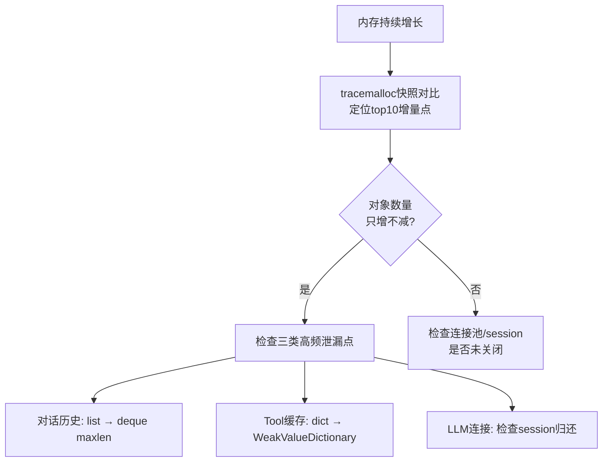

# Python 基础

### 1.1 函数与装饰器机制

#### 装饰器的底层原理与 functools.wraps 的必要性

##### 1、基础题：装饰器是什么？

**难度级别**：⭐（装饰器定义、闭包原理、函数作为一等公民）

装饰器本质上是一个**函数**，它接收另一个函数作为参数，返回一个新的函数。通过 `@decorator` 语法糖，可以在不修改原函数代码的情况下，给函数添加额外功能。

底层原理是**闭包（Closure）**：装饰器内部定义的 wrapper 函数会持有对原函数的引用，形成一个闭包环境。当调用被装饰的函数时，实际调用的是 wrapper，wrapper 可以在调用原函数前后添加逻辑。

---

##### 2、进阶题：为什么要用 functools.wraps？

**难度级别**：⭐⭐（元信息丢失问题、**name**/**doc**/**annotations**、函数签名）

**1️⃣ Common Answer**

重点总结（便于面试记忆）：

- 首先是元信息丢失的问题
- 其次是 functools.wraps 的作用
- 最后是工程应用

**2️⃣ Impressive Answer**

我会从三个角度思考这个问题：

1. **首先是元信息丢失的问题**。装饰器本质是返回一个新函数，原函数的 `__name__`、`__doc__`、`__annotations__` 等元信息都会被 wrapper 覆盖。这会导致调试困难、文档失效、函数签名丢失。

1. **其次是 functools.wraps 的作用**。它是一个装饰器，通过 `update_wrapper` 函数把原函数的元信息复制到 wrapper 上，包括 `__name__`、`__doc__`、`__module__`、`__annotations__` 以及 `__dict__` 属性。

1. **最后是工程应用**。在 Agent 开发中，LangChain 的 `@tool` 装饰器依赖这三个元信息来生成工具的 JSON Schema。如果不用 wraps，工具的名称、描述、参数类型都会丢失，导致工具无法正确注册。

**3️⃣ Key Differences**

<table>
<tr>
<td>
维度
</td>
<td>
Common Answer
</td>
<td>
Impressive Answer
</td>
</tr>
<tr>
<td>
技术深度
</td>
<td>
只提到 <strong>name</strong> 丢失
</td>
<td>
列举完整的元信息清单
</td>
</tr>
<tr>
<td>
实践场景
</td>
<td>
仅提到调试
</td>
<td>
关联 LangChain @tool 的依赖
</td>
</tr>
<tr>
<td>
思考维度
</td>
<td>
单点回答
</td>
<td>
三个层次递进分析
</td>
</tr>
</table>

---

##### 3、场景题：在 LangChain 里不加 @functools.wraps 会怎样？

**难度级别**：⭐⭐（LangChain @tool 装饰器依赖、工具注册失败、JSON Schema 生成）

**1️⃣ Common Answer**

重点总结（便于面试记忆）：

- 首先是工具注册失败
- 其次是参数类型丢失
- 最后是 Tracing 和调试困难

**2️⃣ Impressive Answer**

我会从三个角度分析：

1. **首先是工具注册失败**。LangChain 的 `@tool` 装饰器会读取函数的 `__name__` 作为工具名称，`__doc__` 作为工具描述。如果不用 wraps，这两个都是空的，工具注册时会抛出异常或生成无效的工具定义。

1. **其次是参数类型丢失**。`@tool` 会通过 `__annotations__` 解析函数参数的类型注解，自动生成 JSON Schema。没有 wraps，参数类型信息丢失，工具调用时会因为类型不匹配而失败。

1. **最后是 Tracing 和调试困难**。LangSmith 等 Tracing 工具依赖函数名来构建调用链。如果所有工具都叫 wrapper，Trace 链路会变得无法阅读，调试成本大幅上升。

**3️⃣ Key Differences**

<table>
<tr>
<td>
维度
</td>
<td>
Common Answer
</td>
<td>
Impressive Answer
</td>
</tr>
<tr>
<td>
技术深度
</td>
<td>
只提到注册失败
</td>
<td>
分析 JSON Schema 生成和 Tracing 两个场景
</td>
</tr>
<tr>
<td>
问题分析
</td>
<td>
模糊描述&quot;会报错&quot;
</td>
<td>
明确指出三个具体影响点
</td>
</tr>
<tr>
<td>
工程视角
</td>
<td>
仅关注功能可用性
</td>
<td>
考虑可观测性和调试成本
</td>
</tr>
</table>

---

##### 4、容易一起考的题

<table>
<tr>
<td>
关联题
</td>
<td>
和本题的关系
</td>
<td>
参考答案
</td>
</tr>
<tr>
<td>
闭包是什么？
</td>
<td>
装饰器内部靠闭包持有原函数引用
</td>
<td>
答：闭包是函数和其外部自由变量绑定后的组合，内部函数即使离开定义作用域，也能继续访问这些变量。
</td>
</tr>
<tr>
<td>
装饰器执行顺序？
</td>
<td>
@tool @add_log 是从下往上执行，顺序影响 wraps 是否生效
</td>
<td>
答：多个装饰器应用时从下往上装饰，实际调用时从外到内执行，所以顺序会影响日志、重试、wraps 等行为。
</td>
</tr>
<tr>
<td>
LangChain Tool 怎么注册？
</td>
<td>
@tool 依赖 wraps 保留的三个元信息
</td>
<td>
答：LangChain 的 Tool 注册依赖函数名、description 和参数 schema；@tool 会把函数包装成可被 Agent 选择和调用的工具。
</td>
</tr>
</table>

---

#### 带参数装饰器的三层嵌套结构与工程应用

##### 1、基础题：带参数装饰器和普通装饰器有什么区别？

**难度级别**：⭐（基础概念）

普通装饰器只有两层：外层接收函数，内层是 wrapper。带参数装饰器需要三层嵌套：最外层接收参数，中间层接收函数，最内层是 wrapper。使用时 `@retry(max_retries=3)` 会先执行 `retry(max_retries=3)` 返回一个装饰器，再用这个装饰器装饰函数。

---

##### 2、进阶题：请解释带参数装饰器的三层嵌套结构，并实现一个支持指数退避+抖动的 LLM 自动重试装饰器。

**难度级别**：⭐⭐（考察要点：三层嵌套写法（decorator_factory → decorator → wrapper）、带参数装饰器实现 LLM 自动重试（指数退避 + 抖动）、限流装饰器）

**1️⃣ Common Answer**

重点总结（便于面试记忆）：

- 三层嵌套的本质是柯里化（Currying）
- LLM 重试需要区分可重试和不可重试的异常
- 异步场景只需两处修改

**2️⃣ Impressive Answer**

我会从三个角度思考这个问题：

1. **三层嵌套的本质是柯里化（Currying）**。把需要多个参数的函数拆成多次单参数调用。`@retry(max_retries=3)` 的执行顺序是：先执行 `retry(max_retries=3)` 返回 `decorator`，再执行 `decorator(func)` 返回 `wrapper`，每一层都产生一个新的闭包作用域，参数通过闭包逐层向内传递。

1. **LLM 重试需要区分可重试和不可重试的异常**，并实现指数退避 + 随机抖动来避免惊群效应（Thundering Herd）。抖动的工程价值在于：多个 Agent 实例同时遇到 Rate Limit 时，没有抖动会导致它们再次同时撞上限流，加入 ±20% 随机偏移后请求会分散在时间轴上。

```python
import time, random, functools
from openai import RateLimitError, APITimeoutError, APIConnectionError

RETRYABLE_EXCEPTIONS = (RateLimitError, APITimeoutError, APIConnectionError)

def llm_retry(max_retries: int = 3, base_delay: float = 1.0, max_delay: float = 60.0):
    def decorator(func):
        @functools.wraps(func)
        def wrapper(*args, **kwargs):
            for attempt in range(max_retries + 1):
                try:
                    return func(*args, **kwargs)
                except RETRYABLE_EXCEPTIONS as e:
                    if attempt == max_retries:
                        raise
                    delay = min(base_delay * (2 ** attempt), max_delay)
                    jitter = delay * 0.2 * (random.random() * 2 - 1)  # ±20% 抖动
                    time.sleep(delay + jitter)
                except Exception:
                    raise  # 不可重试的异常直接抛出
        return wrapper
    return decorator
```

1. **异步场景只需两处修改**：`wrapper` 改为 `async def`，`time.sleep` 改为 `await asyncio.sleep`，就能无缝支持 async 函数，不需要重写整个逻辑。

**3️⃣ Key Differences**

<table>
<tr>
<td>
维度
</td>
<td>
Common Answer
</td>
<td>
Impressive Answer
</td>
</tr>
<tr>
<td>
技术深度
</td>
<td>
只实现了基础次数重试，sleep 是固定值
</td>
<td>
实现指数退避 + 随机抖动，解释了抖动防惊群的工程价值
</td>
</tr>
<tr>
<td>
异常处理
</td>
<td>
捕获所有异常，不区分可重试和不可重试
</td>
<td>
明确区分 <code>RETRYABLE_EXCEPTIONS</code>，避免对参数错误等进行无效重试
</td>
</tr>
<tr>
<td>
实践经验
</td>
<td>
无异步版本考虑
</td>
<td>
给出 async 版本，覆盖 Agent 主流的异步调用场景
</td>
</tr>
<tr>
<td>
给面试官的印象
</td>
<td>
能写出来，但工程细节不扎实
</td>
<td>
考虑了生产环境的并发场景和异常分类，有分布式系统思维
</td>
</tr>
</table>

---

##### 3、场景题：在 LLM 场景中，为什么要用指数退避而不是固定间隔重试？如果多个 Agent 实例同时触发重试，会出现什么问题，怎么解决？

**难度级别**：⭐⭐（考察要点：指数退避原理、惊群效应、随机抖动策略）

**1️⃣ Common Answer**

重点总结（便于面试记忆）：

- 固定间隔重试会放大惊群效应（Thundering Herd）
- 随机抖动是解决惊群效应的关键，不是可选项
- 我会从两个角度来分析
- 固定间隔重试会放大惊群效应（Thundering Herd）。假设 100 个 Agent 同时触发 Rate Limit...
- 随机抖动是解决惊群效应的关键，不是可选项。使用了指数退避，如果所有实例的 base_delay 相同，它们的重试时间点仍然高度重合。标准做法是在退避时间上叠加 ±20%～±50...
- `python delay = min(base_delay * (2 ** attempt), max_delay) jitter = delay * 0.4 * rando...

**2️⃣ Impressive Answer**

我会从两个角度来分析：

1. **固定间隔重试会放大惊群效应（Thundering Herd）**。假设 100 个 Agent 同时触发 Rate Limit，它们会在同一时刻重试，然后再次同时被限流，形成周期性冲击。指数退避让等待时间随尝试次数指数增长（`base * 2^n`），给服务端足够的恢复时间，同时避免长时间无意义等待。

1. **随机抖动是解决惊群效应的关键，不是可选项**。使用了指数退避，如果所有实例的 `base_delay` 相同，它们的重试时间点仍然高度重合。标准做法是在退避时间上叠加 ±20%～±50% 的随机偏移：

```python
delay = min(base_delay * (2 ** attempt), max_delay)
jitter = delay * 0.4 * random.random()  # Full Jitter 策略
actual_delay = delay - jitter  # 在 [delay*0.6, delay] 区间内随机
```

AWS 的最佳实践推荐 "Full Jitter" 策略（在 `[0, delay]` 区间均匀随机），能最大程度分散请求。生产环境中我们结合 `llm_retry` 装饰器 + Semaphore 做双重保护：Semaphore 控制并发上限，指数退避+抖动处理限流后的恢复策略。

**3️⃣ Key Differences**

<table>
<tr>
<td>
维度
</td>
<td>
Common Answer
</td>
<td>
Impressive Answer
</td>
</tr>
<tr>
<td>
原理理解
</td>
<td>
知道&quot;翻倍等待&quot;，不知道为什么
</td>
<td>
从惊群效应的形成机制解释指数退避的必要性
</td>
</tr>
<tr>
<td>
抖动认知
</td>
<td>
认为随机 sleep 是附加手段
</td>
<td>
明确指出抖动是解决惊群的核心，并给出 Full Jitter 标准策略
</td>
</tr>
<tr>
<td>
实践经验
</td>
<td>
无具体策略，描述模糊
</td>
<td>
引用 AWS 最佳实践，给出双重保护组合方案
</td>
</tr>
<tr>
<td>
给面试官的印象
</td>
<td>
知道概念但说不清楚原理
</td>
<td>
有分布式系统经验，理解限流场景的生产级应对策略
</td>
</tr>
</table>

---

##### 4、容易一起考的题

<table>
<tr>
<td>
关联题
</td>
<td>
和本题的关系
</td>
<td>
参考答案
</td>
</tr>
<tr>
<td>
<code>functools.wraps</code> 的作用是什么？
</td>
<td>
三层嵌套中 wrapper 需要用 <code>wraps</code> 保留原函数元信息，否则 LangChain Tool 注册等场景会拿不到正确的函数名和 docstring
</td>
<td>
答：工具调用题要讲 schema 描述、参数校验、权限控制、超时重试、幂等和观测；核心是让模型会选、会用、用错能兜底。
</td>
</tr>
<tr>
<td>
闭包是什么？变量是怎么捕获的？
</td>
<td>
带参数装饰器的三层嵌套完全依赖闭包逐层传递参数，理解闭包才能理解参数为什么在 wrapper 里仍然可见
</td>
<td>
答：闭包是函数和其外部自由变量绑定后的组合，内部函数即使离开定义作用域，也能继续访问这些变量。
</td>
</tr>
<tr>
<td>
asyncio 中如何实现异步重试？
</td>
<td>
带参数装饰器的异步版本考察点，<code>async def wrapper</code> + <code>await asyncio.sleep</code> 是 Agent 中最常用的重试模式
</td>
<td>
答：asyncio 题要讲事件循环、协程调度、并发控制和取消超时；Agent 场景常用 Semaphore 控 RPM/TPM，用 Queue 做生产消费。
</td>
</tr>
</table>

---

### 1.2 异步编程与并发模型

#### 生成器与异步生成器在 LLM 流式输出中的应用

##### 1、基础题：生成器和普通函数有什么区别？

**难度级别**：⭐（基础概念）

普通函数执行完就销毁调用栈，一次性返回所有结果。生成器函数用 `yield` 关键字定义，每次调用 `next()` 执行到下一个 `yield` 就暂停，把当前执行状态（局部变量、指令指针）保存在帧对象里，下次调用时从断点处恢复。这使得生成器能按需产出数据，不需要一次性把所有数据放到内存里。

---

##### 2、进阶题：请解释 Python 生成器的底层帧挂起原理，以及如何用异步生成器实现 LLM 流式输出的 FastAPI SSE 接口？

**难度级别**：⭐⭐（考察要点：协程帧挂起/恢复原理（frame 对象保存局部变量）、`async def + yield` 异步生成器、FastAPI SSE 流式接口实现（`StreamingResponse`））

**1️⃣ Common Answer**

重点总结（便于面试记忆）：

- 生产级的 FastAPI SSE 实现需要处理连接断开、异常清理等细节
- 生成器的底层机制是帧对象（PyFrameObject）的保存与恢复
- 异步生成器（
- async def
- yield
-）融合了两种机制

**2️⃣ Impressive Answer**

我会从三个角度来回答：

1. **生成器的底层机制是帧对象（PyFrameObject）的保存与恢复**。普通函数返回后帧会被销毁，但生成器调用 `next()` 时，Python 解释器把当前帧挂起——将局部变量、字节码指令指针（`f_lasti`）、求值栈状态全部保存下来。下次 `next()` 从 `f_lasti` 指向的位置恢复，这不是在等待 IO，而是真正保存了函数的执行上下文。

1. **异步生成器（**`**async def**`** + **`**yield**`**）融合了两种机制**：`yield` 挂起生成器帧，`await` 挂起协程并把控制权交回事件循环，两者可以在同一个函数里共存，这是实现 LLM 流式输出的核心。

1. **生产级的 FastAPI SSE 实现需要处理连接断开、异常清理等细节**：

```python
import asyncio, json
from fastapi import FastAPI, Request
from fastapi.responses import StreamingResponse
from openai import AsyncOpenAI

app = FastAPI()
client = AsyncOpenAI()

async def llm_stream_generator(prompt: str, request: Request):
    try:
        stream = await client.chat.completions.create(
            model="gpt-4o", messages=[{"role": "user", "content": prompt}], stream=True
        )
        async for chunk in stream:
            if await request.is_disconnected():  # 客户端断开则停止，避免浪费 Token 费用
                break
            if chunk.choices[0].delta.content:
                data = json.dumps({"content": chunk.choices[0].delta.content}, ensure_ascii=False)
                yield f"data: {data}\n\n"
        yield "data: [DONE]\n\n"
    except asyncio.CancelledError:
        yield "data: [CANCELLED]\n\n"

@app.post("/chat/stream")
async def chat_stream(prompt: str, request: Request):
    return StreamingResponse(
        llm_stream_generator(prompt, request),
        media_type="text/event-stream",
        headers={"Cache-Control": "no-cache", "X-Accel-Buffering": "no"},  # 禁止 Nginx 缓冲，否则 SSE 会被攒包
    )
```

`X-Accel-Buffering: no` 这个 Header 在生产中很容易被忽略，Nginx 默认会缓冲响应，SSE 数据会积攒到缓冲区满才发送，流式效果就消失了。

**3️⃣ Key Differences**

<table>
<tr>
<td>
维度
</td>
<td>
Common Answer
</td>
<td>
Impressive Answer
</td>
</tr>
<tr>
<td>
技术深度
</td>
<td>
只描述&quot;暂停和恢复&quot;的表现，不知道帧是怎么保存的
</td>
<td>
从 <code>PyFrameObject</code>、<code>f_lasti</code> 指令指针层面解释挂起恢复的底层机制
</td>
</tr>
<tr>
<td>
代码质量
</td>
<td>
代码能跑但缺少异常处理和连接断开检测
</td>
<td>
包含连接断开检测、<code>CancelledError</code> 处理、SSE 规范 Header
</td>
</tr>
<tr>
<td>
实践经验
</td>
<td>
不知道 Nginx 缓冲会破坏 SSE 效果
</td>
<td>
给出 <code>X-Accel-Buffering: no</code> 等生产环境必备配置，并解释为什么
</td>
</tr>
<tr>
<td>
给面试官的印象
</td>
<td>
能写基础实现，但上生产肯定会出问题
</td>
<td>
有完整的生产意识，考虑了成本、稳定性、基础设施配置
</td>
</tr>
</table>

---

##### 3、场景题：在 Agent 流式输出场景中，如果用户中途关闭了浏览器，服务端应该如何感知并停止 LLM 调用，避免产生不必要的 Token 费用？

**难度级别**：⭐⭐（考察要点：客户端断开检测、CancelledError 处理、资源清理）

**1️⃣ Common Answer**

重点总结（便于面试记忆）：

- 主动检测：在每次 yield 前调用
- await request.is_disconnected()
- 被动感知：处理
- asyncio.CancelledError

**2️⃣ Impressive Answer**

我会从两个层面来分析：

1. **主动检测：在每次 yield 前调用 **`**await request.is_disconnected()**`。这是 FastAPI/Starlette 提供的协程方法，检测 TCP 连接状态。一旦客户端断开就 `break` 出生成器循环，上游的 OpenAI stream 不再消费，从而停止产生 Token 费用。这是最直接的成本控制手段。

1. **被动感知：处理 **`**asyncio.CancelledError**`。当客户端断开时，ASGI 框架会取消正在运行的协程，生成器会收到 `CancelledError`。在 `except asyncio.CancelledError` 块里可以执行清理逻辑（关闭数据库连接、释放信号量、记录日志），然后可以选择 re-raise 或 return。

```python
async def llm_stream_generator(prompt: str, request: Request):
    try:
        stream = await client.chat.completions.create(...)
        async for chunk in stream:
            if await request.is_disconnected():
                # 主动检测断开，立即停止消费 stream
                await stream.close()  # 关闭上游连接
                return
            yield f"data: {chunk.choices[0].delta.content}\n\n"
    except asyncio.CancelledError:
        # 框架取消协程时的清理入口
        pass  # 资源会在生成器 close 时由 try/finally 清理
    finally:
        # finally 块在任何退出路径下都会执行，这里放资源释放逻辑
        await release_resources()
```

两种机制组合使用，主动检测降低延迟，被动感知做兜底清理。

**3️⃣ Key Differences**

<table>
<tr>
<td>
维度
</td>
<td>
Common Answer
</td>
<td>
Impressive Answer
</td>
</tr>
<tr>
<td>
问题定位
</td>
<td>
知道&quot;要检测断开&quot;，但不知道具体 API
</td>
<td>
给出 <code>request.is_disconnected()</code> + <code>CancelledError</code> 双重机制
</td>
</tr>
<tr>
<td>
成本意识
</td>
<td>
没有提到 Token 费用影响
</td>
<td>
明确将断开检测与成本控制挂钩，体现工程化思维
</td>
</tr>
<tr>
<td>
资源清理
</td>
<td>
没有考虑 finally 清理
</td>
<td>
用 try/finally 保证任何退出路径都能清理资源
</td>
</tr>
<tr>
<td>
给面试官的印象
</td>
<td>
知道问题存在，但给不出解决方案
</td>
<td>
有生产运维意识，能从成本和稳定性两个维度思考问题
</td>
</tr>
</table>

---

##### 4、容易一起考的题

<table>
<tr>
<td>
关联题
</td>
<td>
和本题的关系
</td>
<td>
参考答案
</td>
</tr>
<tr>
<td>
<code>yield from</code> 和 <code>yield</code> 的区别？
</td>
<td>
异步生成器组合时会用到 <code>yield from</code> 做代理，理解两者区别才能正确链式组合多个流式生成器
</td>
<td>
答：这题可以按“定义 → 核心机制 → 工程落地”三步答；结合本题重点强调：异步生成器组合时会用到 yield from 做代理，理解两者区别才能正确链式组合多个流式生成器，最后补一个风险点或优化手段。
</td>
</tr>
<tr>
<td>
FastAPI 的 <code>BackgroundTask</code> 和 <code>StreamingResponse</code> 有什么区别？
</td>
<td>
两者都是异步响应模式，但适用场景不同，流式输出必须用 <code>StreamingResponse</code>，面试常考混淆点
</td>
<td>
答：这题可以按“定义 → 核心机制 → 工程落地”三步答；结合本题重点强调：两者都是异步响应模式，但适用场景不同，流式输出必须用 StreamingResponse，面试常考混淆点，最后补一个风险点或优化手段。
</td>
</tr>
<tr>
<td>
Python 的内存视图（memoryview）和生成器在大文件处理中的对比？
</td>
<td>
都是懒加载模式，但生成器适合逐行流式处理，memoryview 适合零拷贝切片操作，考察对内存优化的理解
</td>
<td>
答：短期记忆通常放在上下文、运行状态或缓存里，服务当前任务；长期记忆落到向量库、KV 或数据库，用于跨会话召回。
</td>
</tr>
</table>

---

#### asyncio 事件循环的工作原理与 Agent 并发模型

##### 1、基础题：asyncio 的并发和多线程的并发有什么区别？

**难度级别**：⭐（基础概念）

多线程是操作系统级别的并发，多个线程真正同时运行（受 GIL 限制）。asyncio 是单线程内的协作式并发，同一时刻只有一个协程在执行 Python 代码，通过 `await` 主动让出控制权给事件循环，让其他协程有机会运行。asyncio 是并发但不是并行，适合 IO 密集型场景，线程切换开销更小。

---

##### 2、进阶题：请解释 asyncio 事件循环的工作原理，以及如何在 Agent 中正确使用 `asyncio.gather` 并发调用 LLM、用 `Semaphore` 防止 Rate Limit？

**难度级别**：⭐⭐（考察要点：事件循环单线程 + IO 多路复用、`asyncio.gather` 并发 LLM 调用、`Semaphore` 控制并发数防止 Rate Limit）

**1️⃣ Common Answer**

重点总结（便于面试记忆）：

- 完整的并发 LLM 调用方案
- 事件循环的本质是"单线程 + IO 多路复用"
- return_exceptions=True
- 是 gather 在 Agent 场景的关键参数

**2️⃣ Impressive Answer**

我会从三个层面来分析：

1. **事件循环的本质是"单线程 + IO 多路复用"**。每次循环（tick）做三件事：执行就绪队列里的所有回调 → 调用 OS 的 `epoll()`/`kqueue()` 等待 IO 事件 → 将就绪的 IO 回调放入就绪队列。`await asyncio.sleep()` 或 `await http_client.get()` 本质上是向 selector 注册 IO 监听然后挂起，IO 就绪后才被重新放入就绪队列。这就是为什么 asyncio 能并发但不能并行——所有协程共享同一个线程。

1. `**return_exceptions=True**`** 是 gather 在 Agent 场景的关键参数**。默认情况下任何子任务抛异常，gather 会立即取消所有其他任务。在 Multi-Agent 场景里，一个子任务失败不应该影响其他子任务，加了这个参数后异常会作为返回值包含在结果列表里，由调用方自行处理降级逻辑。

1. **完整的并发 LLM 调用方案**：

```python
import asyncio
from openai import AsyncOpenAI

client = AsyncOpenAI()
LLM_SEMAPHORE = asyncio.Semaphore(10)  # 根据 OpenAI tier 的 RPM 设置

async def call_llm_with_semaphore(prompt: str) -> str:
    async with LLM_SEMAPHORE:
        response = await client.chat.completions.create(
            model="gpt-4o-mini", messages=[{"role": "user", "content": prompt}]
        )
        return response.choices[0].message.content

async def parallel_agent_calls(sub_tasks: list[str]) -> list[str]:
    tasks = [call_llm_with_semaphore(task) for task in sub_tasks]
    results = await asyncio.gather(*tasks, return_exceptions=True)
    return [None if isinstance(r, Exception) else r for r in results]
```

Semaphore 不是越大越好，需要参考 OpenAI 的 RPM/TPM 限制来设置，更精细的做法是结合令牌桶（Token Bucket）算法。

**3️⃣ Key Differences**

<table>
<tr>
<td>
维度
</td>
<td>
Common Answer
</td>
<td>
Impressive Answer
</td>
</tr>
<tr>
<td>
技术深度
</td>
<td>
只描述&quot;遇到 await 就暂停&quot;的表象
</td>
<td>
从 selector、就绪队列、tick 循环三个层面解释事件循环运作机制
</td>
</tr>
<tr>
<td>
并发 vs 并行
</td>
<td>
没有明确区分两者的区别
</td>
<td>
清晰解释为什么 asyncio 是并发但不是并行，避免概念混淆
</td>
</tr>
<tr>
<td>
代码质量
</td>
<td>
没有 <code>return_exceptions=True</code>，存在一个任务失败导致全部失败的隐患
</td>
<td>
正确使用 <code>return_exceptions=True</code> 并处理部分失败的降级逻辑
</td>
</tr>
<tr>
<td>
给面试官的印象
</td>
<td>
会用 gather 和 Semaphore，但不理解背后原理
</td>
<td>
理解事件循环机制，能给出生产级的并发控制方案
</td>
</tr>
</table>

---

##### 3、场景题：一个 Multi-Agent 系统需要并发调用 10 个子 Agent，每个 Agent 内部又会调用 LLM，如何设计并发控制策略避免触发 OpenAI Rate Limit？

**难度级别**：⭐⭐（考察要点：Semaphore 全局共享、gather 部分失败处理、并发数与 RPM 的关系）

**1️⃣ Common Answer**

重点总结（便于面试记忆）：

- Semaphore 必须是全局共享的，不能在每个 Agent 里各自创建
- gather 的异常处理策略需要根据业务决定
- 我会从两个层面来设计
- Semaphore 必须是全局共享的，不能在每个 Agent 里各自创建。如果每个 Agent 都有自己的 Semaphore(5)，10 个 Agent 同时跑就是 50 个...
- ```python # 全局初始化，根据 OpenAI tier 调整 # 免费账号 RPM=60，付费 Tier 1 RPM=3500 GLOBAL_LLM_SEMAPHOR...
- async def agent_llm_call(prompt: str) -> str: async with GLOBAL_LLM_SEMAPHORE: # 所有 Agen...

**2️⃣ Impressive Answer**

我会从两个层面来设计：

1. **Semaphore 必须是全局共享的，不能在每个 Agent 里各自创建**。如果每个 Agent 都有自己的 `Semaphore(5)`，10 个 Agent 同时跑就是 50 个并发请求，完全没有起到限流作用。正确做法是在应用启动时创建一个全局 Semaphore，所有 Agent 共享同一个实例：

```python
# 全局初始化，根据 OpenAI tier 调整
# 免费账号 RPM=60，付费 Tier 1 RPM=3500
GLOBAL_LLM_SEMAPHORE = asyncio.Semaphore(15)

async def agent_llm_call(prompt: str) -> str:
    async with GLOBAL_LLM_SEMAPHORE:  # 所有 Agent 共享这个门卫
        return await call_openai(prompt)
```

1. **gather 的异常处理策略需要根据业务决定**。如果 10 个子 Agent 的结果是相互独立的（比如并行做 10 个文档摘要），用 `return_exceptions=True` 让失败的任务不影响其他任务，然后对 None 结果做降级处理。如果子 Agent 结果有依赖关系，才考虑让异常向上传播。Semaphore + 指数退避重试组合使用，Semaphore 做第一道防线控制并发上限，重试装饰器做第二道防线应对偶发的 Rate Limit。

**3️⃣ Key Differences**

<table>
<tr>
<td>
维度
</td>
<td>
Common Answer
</td>
<td>
Impressive Answer
</td>
</tr>
<tr>
<td>
Semaphore 作用域
</td>
<td>
没有意识到全局共享的重要性
</td>
<td>
明确指出每个 Agent 各自创建 Semaphore 会导致限流失效
</td>
</tr>
<tr>
<td>
参数设置依据
</td>
<td>
凭感觉设置数字
</td>
<td>
结合 OpenAI tier 的 RPM 限制来推算合理并发数
</td>
</tr>
<tr>
<td>
异常处理策略
</td>
<td>
一刀切用重试
</td>
<td>
根据任务是否有依赖关系选择不同的 gather 策略
</td>
</tr>
<tr>
<td>
给面试官的印象
</td>
<td>
知道工具但不知道怎么用对
</td>
<td>
理解全局资源共享的设计原则，有系统级思维
</td>
</tr>
</table>

---

##### 4、容易一起考的题

<table>
<tr>
<td>
关联题
</td>
<td>
和本题的关系
</td>
<td>
参考答案
</td>
</tr>
<tr>
<td>
<code>asyncio.create_task</code> 和 <code>asyncio.gather</code> 有什么区别？
</td>
<td>
create_task 立即调度任务到事件循环，gather 等待所有任务完成，理解两者配合才能设计正确的并发流程
</td>
<td>
答：asyncio 题要讲事件循环、协程调度、并发控制和取消超时；Agent 场景常用 Semaphore 控 RPM/TPM，用 Queue 做生产消费。
</td>
</tr>
<tr>
<td>
如何在 asyncio 中运行阻塞的同步代码？
</td>
<td>
<code>loop.run_in_executor</code> 是 asyncio 与线程/进程池的桥梁，Agent 调用同步库时必须用这种方式避免阻塞事件循环
</td>
<td>
答：asyncio 题要讲事件循环、协程调度、并发控制和取消超时；Agent 场景常用 Semaphore 控 RPM/TPM，用 Queue 做生产消费。
</td>
</tr>
<tr>
<td>
<code>asyncio.wait</code> 和 <code>asyncio.gather</code> 的区别？
</td>
<td>
wait 提供更细粒度的控制（FIRST_COMPLETED/FIRST_EXCEPTION），gather 更简洁，面试常考选型场景
</td>
<td>
答：asyncio 题要讲事件循环、协程调度、并发控制和取消超时；Agent 场景常用 Semaphore 控 RPM/TPM，用 Queue 做生产消费。
</td>
</tr>
</table>

---

#### 多线程、多进程与 asyncio 的选型原则

##### 1、基础题：Python 的 GIL 是什么，它对多线程有什么影响？

**难度级别**：⭐（基础概念）

GIL（全局解释器锁）是 CPython 解释器的一把互斥锁，同一时刻只允许一个线程执行 Python 字节码。这导致多线程无法真正利用多核 CPU 进行并行计算。但在 IO 操作时 GIL 会被释放，所以多线程对 IO 密集型任务仍然有效。CPU 密集型任务要绕过 GIL 限制需要用多进程。

---

##### 2、进阶题：请说明 GIL 的工作原理，以及在 AI Agent 中三类典型负载（LLM 调用、文档处理、Embedding 计算）应该如何选择并发方案？

**难度级别**：⭐⭐（考察要点：GIL 原理（字节码执行时持有，IO 时主动释放）、IO 密集 vs CPU 密集场景划分、Agent 中三类负载（LLM 调用/文档处理/Embedding 计算）的并发选型）

**1️⃣ Common Answer**

重点总结（便于面试记忆）：

- 三类负载的选型有一个容易踩坑的地方——Embedding 计算不该用多进程
- 三种并发模型在 asyncio 中的组合使用
- GIL 有两种释放场景，很多人只知道其中一种
- 纯 Python 的 CPU 计算不会主动释放 GIL
- 三类负载的选型有一个容易踩坑的地方

**2️⃣ Impressive Answer**

我会从 GIL 的精确机制出发，再推导三类负载的选型：

1. **GIL 有两种释放场景，很多人只知道其中一种**。第一种是主动释放：调用 C 扩展中标注的 IO 操作时（如 socket 的 `recv()`），C 层调用 `Py_BEGIN_ALLOW_THREADS` 宏释放 GIL，IO 完成后重新获取。第二种是定期释放：每隔 `sys.getswitchinterval()`（默认 5ms）强制切换，让其他线程有机会获取 GIL。关键点是：**纯 Python 的 CPU 计算不会主动释放 GIL**，开再多线程效率也不会提升，甚至因锁竞争更慢。

1. **三类负载的选型有一个容易踩坑的地方**——Embedding 计算不该用多进程：

```
LLM API 调用  → asyncio        纯网络 IO，asyncio 开销最小，无线程切换
文档解析 PDF  → 多进程         pdfminer 是纯 Python，GIL 不释放，多线程无效
本地 Embedding → 多线程        PyTorch/ONNX 在 C 层执行，GIL 已释放，多线程有效
                               且避免了模型在每个进程重复加载（500MB+ 内存开销）
```

1. **三种并发模型在 asyncio 中的组合使用**：

```python
import asyncio
from concurrent.futures import ProcessPoolExecutor, ThreadPoolExecutor

process_pool = ProcessPoolExecutor(max_workers=4)   # 文档处理
thread_pool = ThreadPoolExecutor(max_workers=8)     # Embedding 计算
llm_semaphore = asyncio.Semaphore(10)               # LLM 并发控制

async def process_document_pipeline(doc_path: str):
    loop = asyncio.get_event_loop()
    # CPU 密集（纯 Python）→ 进程池，不阻塞事件循环
    text = await loop.run_in_executor(process_pool, parse_pdf, doc_path)
    # CPU 密集（C 层）→ 线程池
    embedding = await loop.run_in_executor(thread_pool, compute_embedding, text)
    # IO 密集 → asyncio 直接 await
    async with llm_semaphore:
        summary = await call_llm_async(f"请总结：{text[:2000]}")
    return {"embedding": embedding, "summary": summary}
```

`loop.run_in_executor` 是 asyncio 与线程/进程池的桥梁，把阻塞调用包装成 Future，不会阻塞事件循环。

**3️⃣ Key Differences**

<table>
<tr>
<td>
维度
</td>
<td>
Common Answer
</td>
<td>
Impressive Answer
</td>
</tr>
<tr>
<td>
GIL 理解
</td>
<td>
只说&quot;IO 时释放&quot;，不清楚主动释放和定期切换的区别
</td>
<td>
区分 <code>Py_BEGIN_ALLOW_THREADS</code> 主动释放和 5ms 定期切换两种机制
</td>
</tr>
<tr>
<td>
Embedding 选型
</td>
<td>
错误归类为多进程（忽视了 C 层释放 GIL 的特性）
</td>
<td>
正确识别 PyTorch/ONNX 在 C 层执行这一关键特性，选择线程池避免模型重复加载
</td>
</tr>
<tr>
<td>
架构设计
</td>
<td>
只说选哪种，不说怎么组合
</td>
<td>
给出三种并发模型的混合使用方案和 <code>run_in_executor</code> 的桥接方式
</td>
</tr>
<tr>
<td>
给面试官的印象
</td>
<td>
知道三种方案各自适用场景，但理解不深
</td>
<td>
理解 GIL 的精确机制，能针对具体负载特性做精准选型，有系统设计思维
</td>
</tr>
</table>

---

##### 3、场景题：在 RAG 管道中，需要同时处理文档解析、Embedding 计算和向量存储写入三个步骤，如何设计并发架构最大化吞吐量？

**难度级别**：⭐⭐（考察要点：混合并发模型、流水线设计、asyncio 与 Executor 的集成）

**1️⃣ Common Answer**

重点总结（便于面试记忆）：

- 流水线实现
- 三个步骤的并发模型各不相同，需要用 asyncio + Executor 做统一调度
- 我会从流水线 + 混合并发两个维度来设计
- 三个步骤的并发模型各不相同，需要用 asyncio + Executor 做统一调度。文档解析（纯 Python CPU 密集）用进程池，Embedding（C 层 CPU 密...
- ```python import asyncio from concurrent.futures import ProcessPoolExecutor, ThreadPoolE...
- async def rag_pipeline(doc_paths: list[str]): parse_queue = asyncio.Queue(maxsize=20) # ...

**2️⃣ Impressive Answer**

我会从流水线 + 混合并发两个维度来设计：

1. **三个步骤的并发模型各不相同，需要用 asyncio + Executor 做统一调度**。文档解析（纯 Python CPU 密集）用进程池，Embedding（C 层 CPU 密集）用线程池，向量存储写入（网络 IO）直接 await。三者通过 `asyncio.Queue` 连接成流水线，解析完的文档立即进入 Embedding 队列，不等所有文档解析完才开始，这样吞吐量比串行分阶段高得多。

1. **流水线实现**：

```python
import asyncio
from concurrent.futures import ProcessPoolExecutor, ThreadPoolExecutor

async def rag_pipeline(doc_paths: list[str]):
    parse_queue = asyncio.Queue(maxsize=20)   # 背压控制，避免内存撑爆
    embed_queue = asyncio.Queue(maxsize=20)

    process_pool = ProcessPoolExecutor(max_workers=4)
    thread_pool = ThreadPoolExecutor(max_workers=8)
    loop = asyncio.get_event_loop()

    async def parse_worker():
        for path in doc_paths:
            text = await loop.run_in_executor(process_pool, parse_pdf, path)
            await parse_queue.put(text)
        await parse_queue.put(None)  # 结束信号

    async def embed_worker():
        while True:
            text = await parse_queue.get()
            if text is None:
                await embed_queue.put(None)
                break
            embedding = await loop.run_in_executor(thread_pool, compute_embedding, text)
            await embed_queue.put((text, embedding))

    async def store_worker():
        while True:
            item = await embed_queue.get()
            if item is None:
                break
            text, embedding = item
            await vector_db.upsert(embedding, text)  # 异步写入

    await asyncio.gather(parse_worker(), embed_worker(), store_worker())
```

`Queue(maxsize=20)` 提供背压机制，防止解析速度远快于 Embedding 时大量文档积压在内存中。

**3️⃣ Key Differences**

<table>
<tr>
<td>
维度
</td>
<td>
Common Answer
</td>
<td>
Impressive Answer
</td>
</tr>
<tr>
<td>
设计模式
</td>
<td>
分阶段串行，等一个阶段全部完成再进入下一阶段
</td>
<td>
流水线并行，三个阶段同时推进，大幅提升吞吐量
</td>
</tr>
<tr>
<td>
背压控制
</td>
<td>
没有考虑内存积压问题
</td>
<td>
用 <code>Queue(maxsize)</code> 做背压，防止内存溢出
</td>
</tr>
<tr>
<td>
并发模型组合
</td>
<td>
知道用不同方案，但不知道怎么在 asyncio 中集成
</td>
<td>
用 <code>run_in_executor</code> 统一调度进程池、线程池和异步 IO
</td>
</tr>
<tr>
<td>
给面试官的印象
</td>
<td>
会分析负载类型，但设计不完整
</td>
<td>
有完整的流水线设计能力，考虑了吞吐量、内存控制、资源复用
</td>
</tr>
</table>

---

##### 4、容易一起考的题

<table>
<tr>
<td>
关联题
</td>
<td>
和本题的关系
</td>
<td>
参考答案
</td>
</tr>
<tr>
<td>
Python 3.12 对 GIL 的变化（PEP 703）？
</td>
<td>
3.12 引入实验性的 no-GIL 模式，未来多线程选型逻辑会有根本性变化，考察对 Python 生态演进的关注
</td>
<td>
答：这题可以按“定义 → 核心机制 → 工程落地”三步答；结合本题重点强调：3.12 引入实验性的 no-GIL 模式，未来多线程选型逻辑会有根本性变化，考察对 Python 生态演进的关注，最后补一个风险点或优化手段。
</td>
</tr>
<tr>
<td>
<code>ProcessPoolExecutor</code> 和 <code>multiprocessing.Pool</code> 的区别？
</td>
<td>
前者与 asyncio 集成更好（run_in_executor），后者功能更丰富（共享内存），Agent 场景下通常优先选 ProcessPoolExecutor
</td>
<td>
答：asyncio 题要讲事件循环、协程调度、并发控制和取消超时；Agent 场景常用 Semaphore 控 RPM/TPM，用 Queue 做生产消费。
</td>
</tr>
<tr>
<td>
如何在多进程中共享 Embedding 模型避免重复加载？
</td>
<td>
用 <code>multiprocessing.Manager</code> 或直接用多线程替代多进程，考察对进程间资源共享的理解
</td>
<td>
答：RAG 题要串起切分、embedding、召回、重排、上下文拼装、生成和评估，每一步都有质量与成本取舍。
</td>
</tr>
</table>

---

### 1.3 内存管理与性能优化

#### Python 内存管理：引用计数 + 分代 GC 与 Agent 内存泄漏防护

---

##### 1、基础题：Python 是怎么管理内存的？

**难度级别**：⭐（考察要点：引用计数、分代 GC、循环引用）

CPython 用引用计数作为主要机制，每个对象有一个 `ob_refcnt` 字段，引用归零时立即释放内存。但循环引用会让引用计数失效，所以 Python 还有分代垃圾回收器专门处理这种情况，把对象分为 0/1/2 三代，分别以不同频率检查。

---

##### 2、进阶题：请解释 CPython 的引用计数机制和分代垃圾回收原理，以及在 AI Agent 中如何防范对话历史和 Tool 大对象导致的内存泄漏？

**难度级别**：⭐⭐（考察要点：`ob_refcnt` 引用计数机制、循环引用与 `weakref.ref` 的应用、对话历史无限增长场景、Tool 返回大对象的泄漏）

**1️⃣ Common Answer**

重点总结（便于面试记忆）：

- 模式一：对话历史无限增长。用 collections.deque(maxlen=N) 替代 list.append()，超出容量自动淘汰旧记录，不需要手动截断
- 模式二：Tool 返回大对象（如 PDF 解析结果）被缓存住无法释放。用 weakref.WeakValueDictionary 做弱引用缓存...
- 模式三：ToolRegistry 和 Agent 实例互相持有强引用，形成循环引用。注意 Python 3.4 之前如果循环引用里有 __del__ 方法，GC 会放弃清理...

**2️⃣ Impressive Answer**

我会从三个层次来回答这个问题：

1. **先说 CPython 内存管理的双层架构**。引用计数是主层：每个 Python 对象的 C 结构体都有 `ob_refcnt` 字段，赋值、传参、插入容器时调用 `Py_INCREF`，离开作用域、`del`、移出容器时调用 `Py_DECREF`。计数归零时**立即同步释放**，不需要等 GC 周期。分代 GC 是辅层：专门处理循环引用——A 引用 B、B 引用 A，两个都没有外部引用，但 `ob_refcnt` 都不是 0，这时就靠分代 GC 的标记-清除算法来识别并回收。三代划分（0/1/2）控制检查频率，0 代最频繁（约 700 次分配触发一次），2 代最少，平衡了性能开销。

1. **然后说 Agent 场景下的三种典型泄漏模式以及对应方案**。

  - 模式一：对话历史无限增长。用 `collections.deque(maxlen=N)` 替代 `list.append()`，超出容量自动淘汰旧记录，不需要手动截断：

```python
from collections import deque
class ConversationMemory:
    def __init__(self, max_turns: int = 20):
        self._history = deque(maxlen=max_turns * 2)  # user + assistant 各算一条
    def add_turn(self, role: str, content: str):
        self._history.append({"role": role, "content": content})
```

  - 模式二：Tool 返回大对象（如 PDF 解析结果）被缓存住无法释放。用 `weakref.WeakValueDictionary` 做弱引用缓存，主流程不持有引用时缓存自动失效，不阻止 GC：

```python
from weakref import WeakValueDictionary
tool_cache = WeakValueDictionary()  # 主流程释放对象后，缓存自动清空
```

  - 模式三：`ToolRegistry` 和 Agent 实例互相持有强引用，形成循环引用。注意 Python 3.4 之前如果循环引用里有 `__del__` 方法，GC 会放弃清理，3.4+ 虽修复但仍会推迟。

1. **最后说生产监控手段**。用 `tracemalloc` 定期抓两次内存快照做 diff，快速定位内存增量最大的调用点：

```python
import tracemalloc
tracemalloc.start()
snapshot1 = tracemalloc.take_snapshot()
# ... 运行一段时间 ...
snapshot2 = tracemalloc.take_snapshot()
for stat in snapshot2.compare_to(snapshot1, 'lineno')[:10]:
    print(stat)
```

**3️⃣ Key Differences**

<table>
<tr>
<td>
维度
</td>
<td>
Common Answer
</td>
<td>
Impressive Answer
</td>
</tr>
<tr>
<td>
技术深度
</td>
<td>
只描述引用计数的表现，不知道 <code>ob_refcnt</code> 和 <code>Py_INCREF/DECREF</code>
</td>
<td>
从 C 结构体字段和 CPython 函数级别解释，并说明引用计数是同步确定性的
</td>
</tr>
<tr>
<td>
GC 机制
</td>
<td>
只说&quot;分代 GC 处理循环引用&quot;，不了解三代划分和触发阈值
</td>
<td>
解释 0/1/2 代的晋升机制和不同检查频率，说明 <code>__del__</code> 的特殊影响
</td>
</tr>
<tr>
<td>
工程方案
</td>
<td>
说&quot;限制长度&quot;&quot;del 掉&quot;，没有具体方案
</td>
<td>
给出 <code>deque</code>、<code>WeakValueDictionary</code>、<code>tracemalloc</code> 三种具体工具和代码
</td>
</tr>
<tr>
<td>
给面试官的印象
</td>
<td>
知道有内存泄漏问题，方向对但没有落地细节
</td>
<td>
能识别 Agent 中三种典型泄漏模式，给出对应的惯用解法和监控手段
</td>
</tr>
</table>

---

##### 3、场景题：Agent 服务跑了一段时间后内存持续增长，你怎么排查和解决？

**难度级别**：⭐⭐（考察要点：内存泄漏排查流程、`tracemalloc` 使用、Agent 对话历史管理）

**1️⃣ Common Answer**

重点总结（便于面试记忆）：

- 对话历史：检查是 list.append() 还是 deque(maxlen=N)——前者必然泄漏，直接改成 deque。
- Tool 结果缓存：检查缓存是否用了强引用 dict，如果是，改成 WeakValueDictionary，让大对象在主流程释放后自动被 GC 回收。
- LLM 客户端连接：检查连接池是否有连接没有正确归还，是否有未关闭的 session。

**2️⃣ Impressive Answer**

我会分三步走：

1. **先定位泄漏点**。在服务里埋 `tracemalloc` 快照对比的接口，在压测或者服务运行一段时间后触发，拿到内存增量最大的 top 10 调用点。这比猜要快得多。同时看 `gc.get_objects()` 的数量变化趋势，如果某类对象数量只增不减就是明显的泄漏信号。

1. **针对 Agent 场景的高频泄漏点逐一排查**。

  - 对话历史：检查是 `list.append()` 还是 `deque(maxlen=N)`——前者必然泄漏，直接改成 deque。

  - Tool 结果缓存：检查缓存是否用了强引用 dict，如果是，改成 `WeakValueDictionary`，让大对象在主流程释放后自动被 GC 回收。

  - LLM 客户端连接：检查连接池是否有连接没有正确归还，是否有未关闭的 session。

1. **做防御性设计**。对话历史统一用 `deque(maxlen=N)` 管理；Tool 大对象缓存用弱引用；关键资源用 `with` 语句管理生命周期，确保异常路径也能释放。上线后用 Prometheus 监控进程内存的 RSS 指标，设置增长率告警，而不是等到 OOM 才发现。



**3️⃣ Key Differences**

<table>
<tr>
<td>
维度
</td>
<td>
Common Answer
</td>
<td>
Impressive Answer
</td>
</tr>
<tr>
<td>
排查方法
</td>
<td>
靠感觉、看日志、重启
</td>
<td>
用 <code>tracemalloc</code> 快照对比精确定位，有方法论
</td>
</tr>
<tr>
<td>
对 Agent 的理解
</td>
<td>
只说&quot;限制历史记录&quot;
</td>
<td>
覆盖对话历史、Tool 缓存、连接池三个高频泄漏点
</td>
</tr>
<tr>
<td>
解决方案
</td>
<td>
描述问题方向，缺乏具体手段
</td>
<td>
给出 deque、WeakValueDictionary、上下文管理器等具体工具和监控方案
</td>
</tr>
<tr>
<td>
给面试官的印象
</td>
<td>
有基本意识，但缺少工程经验
</td>
<td>
有清晰的排查流程，有实际踩坑经验和防御性设计思路
</td>
</tr>
</table>

---

##### 4、容易一起考的题

<table>
<tr>
<td>
关联题
</td>
<td>
和本题的关系
</td>
<td>
参考答案
</td>
</tr>
<tr>
<td>
Python 的 <code>__del__</code> 方法有什么坑？
</td>
<td>
<code>__del__</code> 在循环引用场景下会干扰 GC 的回收时机，是内存泄漏的隐患来源
</td>
<td>
答：这题可以按“定义 → 核心机制 → 工程落地”三步答；结合本题重点强调：__del__ 在循环引用场景下会干扰 GC 的回收时机，是内存泄漏的隐患来源，最后补一个风险点或优化手段。
</td>
</tr>
<tr>
<td>
<code>weakref</code> 弱引用和强引用的区别是什么？
</td>
<td>
弱引用不增加 <code>ob_refcnt</code>，是解决 Tool 大对象缓存泄漏的核心工具
</td>
<td>
答：工具调用题要讲 schema 描述、参数校验、权限控制、超时重试、幂等和观测；核心是让模型会选、会用、用错能兜底。
</td>
</tr>
<tr>
<td>
LangChain 的 <code>ConversationBufferMemory</code> 有什么内存风险？
</td>
<td>
默认无限追加历史，长对话场景下是典型的内存泄漏模式，需要用 <code>ConversationBufferWindowMemory</code> 限制长度
</td>
<td>
答：短期记忆通常放在上下文、运行状态或缓存里，服务当前任务；长期记忆落到向量库、KV 或数据库，用于跨会话召回。
</td>
</tr>
</table>

---

### 1.4 面向对象高级特性

#### 元类（Metaclass）的原理与 Tool 自动注册的工程应用

---

##### 1、基础题：Python 的元类是什么？

**难度级别**：⭐（考察要点：元类定义、`type` 与类的关系、类创建流程）

元类就是"类的类"——普通对象是类的实例，而类本身是元类的实例。Python 默认的元类是 `type`，所有的类（包括你自定义的类）本质上都是 `type` 的实例。通过自定义元类并重写 `__new__` 或 `__init__`，可以在类被定义时拦截并修改类的行为，比如自动注册、强制约束接口等。

---

##### 2、进阶题：请解释 Python 元类的工作原理，并实现一个基于元类的 Tool 自动注册系统，同时与 `__init_subclass__` 方案对比。

**难度级别**：⭐⭐⭐（考察要点：`type.__new__`/`type.__init__` 介入类创建流程、`ToolRegistry` 自动注册模式、`__init_subclass__` 轻量替代方案对比）

**1️⃣ Common Answer**

重点总结（便于面试记忆）：

- 然后是元类实现 Tool 自动注册——定义子类即触发注册，不需要手动调用任何函数
- 先说类的创建流程
- 然后是元类实现 Tool 自动注册
- 最后说
- __init_subclass__
- 方案和选型建议

**2️⃣ Impressive Answer**

我会从原理、实现、选型三个角度来回答：

1. **先说类的创建流程**，这是理解元类的基础。当 Python 遇到 `class Foo(Base):` 时，做三件事：执行类体得到命名空间字典；确定元类（优先 `metaclass=` 参数，其次继承基类元类，最后默认 `type`）；调用 `metaclass(name, bases, namespace)` 创建类对象，其中 `__new__` 分配内存，`__init__` 初始化。元类就是在这一步介入的。

1. **然后是元类实现 Tool 自动注册**——定义子类即触发注册，不需要手动调用任何函数：

```python
class ToolMeta(type):
    _registry: dict = {}

    def __new__(mcs, name, bases, namespace, **kwargs):
        cls = super().__new__(mcs, name, bases, namespace)
        # 跳过基类本身，只注册有 tool_name 的具体子类
        if bases and hasattr(cls, 'tool_name') and cls.tool_name:
            if cls.tool_name in mcs._registry:
                raise ValueError(f"Tool '{cls.tool_name}' already registered")
            mcs._registry[cls.tool_name] = cls
        return cls

class BaseTool(metaclass=ToolMeta):
    tool_name: str = ""
    def run(self, **kwargs): raise NotImplementedError

class WebSearchTool(BaseTool):
    tool_name = "web_search"  # 定义这一行，注册就完成了
    def run(self, query: str) -> str: return f"Search: {query}"
```

1. **最后说 **`**__init_subclass__**`** 方案和选型建议**。Python 3.6 引入的 `__init_subclass__` 可以达到同样的"定义即注册"效果，代码更简单：

```python
class BaseTool:
    _registry: dict = {}
    def __init_subclass__(cls, tool_name: str = "", **kwargs):
        super().__init_subclass__(**kwargs)
        if tool_name:
            BaseTool._registry[tool_name] = cls

class WebSearchTool(BaseTool, tool_name="web_search"):
    def run(self, query: str) -> str: return f"Search: {query}"
```

工程上，**绝大多数"定义即注册"的场景用 **`**__init_subclass__**`** 就够了**，代码更清晰、没有元类冲突的风险。元类应该留给真正需要在类创建时深度修改类结构的场景，比如 ORM 框架的字段描述符收集。不要为了显示技术深度而滥用元类。

**3️⃣ Key Differences**

<table>
<tr>
<td>
维度
</td>
<td>
Common Answer
</td>
<td>
Impressive Answer
</td>
</tr>
<tr>
<td>
技术深度
</td>
<td>
只说&quot;重写 <code>__new__</code>&quot;，没有解释类创建的完整流程
</td>
<td>
从解释器处理 <code>class</code> 语句的三个步骤出发，解释元类的介入时机
</td>
</tr>
<tr>
<td>
代码质量
</td>
<td>
实现基本注册，没有处理重复注册和基类被注册的问题
</td>
<td>
处理了重复注册检测和基类跳过逻辑，代码更健壮
</td>
</tr>
<tr>
<td>
方案对比
</td>
<td>
知道 <code>__init_subclass__</code> 存在，但不清楚该选哪个
</td>
<td>
给出对比维度，并明确说明工程中何时用哪种方案及原因
</td>
</tr>
<tr>
<td>
给面试官的印象
</td>
<td>
理解元类概念，能写出基础实现
</td>
<td>
理解两种方案的本质差异，有&quot;不滥用元类&quot;的工程判断力
</td>
</tr>
</table>

---

##### 3、场景题：在 LangChain 这类 Agent 框架中，新增一种 Tool 类型时需要手动到处注册，有没有更优雅的方案？

**难度级别**：⭐⭐（考察要点：`__init_subclass__` 自动注册模式、框架设计中的"定义即可用"理念、与 LangChain `@tool` 装饰器的对比）

**1️⃣ Common Answer**

重点总结（便于面试记忆）：

- 手动注册的问题是容易忘、容易漏，而且注册代码散落各处。更好的方案是"定义即注册"——用 __init_subclass__ 在基类里实现自动注册钩子
- ```python class BaseTool: _registry: dict[str, type] = {}
- def __init_subclass__(cls, tool_name: str = "", kwargs): super().__init_subclass__(kwarg...
- @classmethod def get(cls, name: str) -> "BaseTool": if name not in cls._registry: raise ...
- # 开发者只需要继承 + 声明 tool_name，无需任何额外操作 class WebSearchTool(BaseTool, tool_name="web_search")...
- class CodeExecutorTool(BaseTool, tool_name="code_executor"): def run(self, code: str) ->...

**2️⃣ Impressive Answer**

手动注册的问题是容易忘、容易漏，而且注册代码散落各处。更好的方案是"定义即注册"——用 `__init_subclass__` 在基类里实现自动注册钩子：

```python
class BaseTool:
    _registry: dict[str, type] = {}

    def __init_subclass__(cls, tool_name: str = "", **kwargs):
        super().__init_subclass__(**kwargs)
        if tool_name:
            BaseTool._registry[tool_name] = cls
            print(f"[Registry] Tool registered: {tool_name}")

    @classmethod
    def get(cls, name: str) -> "BaseTool":
        if name not in cls._registry:
            raise KeyError(f"Unknown tool: {name}. Available: {list(cls._registry)}")
        return cls._registry[name]()

# 开发者只需要继承 + 声明 tool_name，无需任何额外操作
class WebSearchTool(BaseTool, tool_name="web_search"):
    def run(self, query: str) -> str: ...

class CodeExecutorTool(BaseTool, tool_name="code_executor"):
    def run(self, code: str) -> str: ...

# Agent 规划阶段按名称动态加载 Tool
tool = BaseTool.get("web_search")
```

这个模式在 Agent 框架里很实用：新增一种 Tool 时，开发者只需要写业务逻辑，不需要修改任何注册代码，框架天然支持动态扩展。LangChain 的 `@tool` 装饰器是类似思路但作用于函数层面，这里的方案更适合面向对象的 Tool 设计。

**3️⃣ Key Differences**

<table>
<tr>
<td>
维度
</td>
<td>
Common Answer
</td>
<td>
Impressive Answer
</td>
</tr>
<tr>
<td>
方案优雅性
</td>
<td>
手动注册或装饰器，仍需开发者主动操作
</td>
<td>
<code>__init_subclass__</code> 实现&quot;定义即注册&quot;，开发者零感知
</td>
</tr>
<tr>
<td>
框架设计思维
</td>
<td>
解决眼前问题，缺乏扩展性考虑
</td>
<td>
从框架设计角度思考，降低扩展成本，体现&quot;约定优于配置&quot;理念
</td>
</tr>
<tr>
<td>
工程健壮性
</td>
<td>
注册逻辑分散，容易遗漏
</td>
<td>
注册逻辑集中在基类，有重复检测和友好的错误提示
</td>
</tr>
<tr>
<td>
给面试官的印象
</td>
<td>
能解决问题
</td>
<td>
有框架设计经验，懂得利用 Python 语言特性降低维护成本
</td>
</tr>
</table>

---

##### 4、容易一起考的题

<table>
<tr>
<td>
关联题
</td>
<td>
和本题的关系
</td>
<td>
参考答案
</td>
</tr>
<tr>
<td>
<code>__new__</code> 和 <code>__init__</code> 的区别是什么？
</td>
<td>
元类重写 <code>__new__</code> 控制类对象的分配，<code>__init__</code> 控制初始化，两者介入时机不同是元类实现的核心
</td>
<td>
答：这题可以按“定义 → 核心机制 → 工程落地”三步答；结合本题重点强调：元类重写 __new__ 控制类对象的分配，__init__ 控制初始化，两者介入时机不同是元类实现的核心，最后补一个风险点或优化手段。
</td>
</tr>
<tr>
<td>
Python 多重继承时的 MRO 是什么？
</td>
<td>
多重继承会引发元类冲突（metaclass conflict），理解 MRO 和 C3 算法是理解元类冲突根因的前提
</td>
<td>
答：这题可以按“定义 → 核心机制 → 工程落地”三步答；结合本题重点强调：多重继承会引发元类冲突（metaclass conflict），理解 MRO 和 C3 算法是理解元类冲突根因的前提，最后补一个风险点或优化手段。
</td>
</tr>
<tr>
<td>
Django Model 的字段是怎么收集的？
</td>
<td>
Django ORM 正是用元类在类定义时收集所有 <code>Field</code> 描述符，是元类最经典的工程应用案例
</td>
<td>
答：工具 description 要写清适用场景、输入输出、限制条件和反例，避免相似工具混淆；最好用业务语言而不是只写技术名词。
</td>
</tr>
</table>

---

#### 列表推导式 vs 生成器 vs map/filter 的性能差异

---

##### 1、基础题：列表推导式和生成器表达式有什么区别？

**难度级别**：⭐（考察要点：立即求值 vs 惰性求值、内存占用、使用场景）

列表推导式是立即求值的，执行完就把所有结果存进一个 `list`，内存占用和数据量成正比。生成器表达式是惰性的，返回一个 generator 对象，迭代时才逐个计算，无论数据量多大内存占用几乎固定（约 112 字节）。语法上只是括号的区别：`[...]` 是列表，`(...)` 是生成器。

---

##### 2、进阶题：在构建 AI Agent 的工具调用链时，需要对大量 Tool 对象进行过滤和转换，请解释列表推导式、生成器表达式、map/filter 三者的性能差异，以及在 Agent 数据处理场景中应该如何选择？

**难度级别**：⭐⭐（考察要点：内存占用原理、惰性求值 vs 立即求值、实际场景下的选型策略）

**1️⃣ Common Answer**

重点总结（便于面试记忆）：

- 先说底层原理。三者的核心差异在于求值时机和内存使用模式
- 最后给一个清晰的选型标准
- 列表推导式：立即求值，一次性把所有元素放进 list，内存随数据量线性增长
- 生成器表达式：惰性求值，返回 generator 对象，迭代时逐个计算，内存固定约 112 字节
- map/filter：Python 3 中也是惰性迭代器，底层 C 实现，省去 Python 字节码解释开销
- 列表推导式：结果需要多次遍历、随机访问、或传给多个消费者时用

**2️⃣ Impressive Answer**

我会从底层原理、性能差异、场景选型三个维度来回答：

1. **先说底层原理**。三者的核心差异在于求值时机和内存使用模式：

  - 列表推导式：立即求值，一次性把所有元素放进 `list`，内存随数据量线性增长

  - 生成器表达式：惰性求值，返回 generator 对象，迭代时逐个计算，内存固定约 112 字节

  - `map/filter`：Python 3 中也是惰性迭代器，底层 C 实现，省去 Python 字节码解释开销

```python
import sys
tools = [{"name": f"tool_{i}", "enabled": i % 2 == 0, "cost": i * 0.01} for i in range(100_000)]

list_result = [t["name"] for t in tools if t["enabled"] and t["cost"] < 100]
gen_result  = (t["name"] for t in tools if t["enabled"] and t["cost"] < 100)

print(sys.getsizeof(list_result))  # 数十万字节
print(sys.getsizeof(gen_result))   # 固定 ~112 字节
```

1. **然后说 Agent 场景的典型选型**。在 Agent 工具注册表筛选中，如果只需要找第一个满足条件的 Tool，用生成器 + `next()` 比列表推导式快得多，因为找到就停止，不需要处理全量数据：

```python
def find_first_available_tool(tools):
    return next(
        (t["name"] for t in tools if t["enabled"] and t["cost"] < 50),
        None  # 找不到时的默认值
    )
```

1. **最后给一个清晰的选型标准**：

  - **列表推导式**：结果需要多次遍历、随机访问、或传给多个消费者时用

  - **生成器**：数据量大、只需一次遍历、流式处理 LLM 输出逐 token 处理时用

  - **map/filter**：简单的单参数转换且强调函数式风格时用，但可读性不如推导式，谨慎使用

**3️⃣ Key Differences**

<table>
<tr>
<td>
维度
</td>
<td>
Common Answer
</td>
<td>
Impressive Answer
</td>
</tr>
<tr>
<td>
技术深度
</td>
<td>
知道生成器省内存，停留在结论层面
</td>
<td>
解释了求值时机差异和 C 实现的性能优势，有内存数据佐证
</td>
</tr>
<tr>
<td>
实践经验
</td>
<td>
给出&quot;数据大用生成器&quot;的通用建议
</td>
<td>
结合流式响应、工具筛选等真实 Agent 场景，给出 <code>next()</code> 惯用法
</td>
</tr>
<tr>
<td>
代码质量
</td>
<td>
无代码示例
</td>
<td>
有内存对比测量和 <code>find_first_available_tool</code> 的实际封装
</td>
</tr>
<tr>
<td>
给面试官的印象
</td>
<td>
了解基础知识点
</td>
<td>
有工程意识，知道在 Agent 场景下怎么落地和做取舍
</td>
</tr>
</table>

---

##### 3、场景题：Agent 在处理 LLM 流式响应时，应该用什么方式逐 token 处理输出？

**难度级别**：⭐⭐（考察要点：生成器在流式处理中的应用、SSE 流式响应、避免一次性加载大响应到内存）

**1️⃣ Common Answer**

重点总结（便于面试记忆）：

- 流式响应场景天然适合生成器，因为核心诉求就是"来一个处理一个，不要等全部到齐"。如果用列表把所有 token 收完再处理...
- 正确的做法是用生成器封装流式处理逻辑，让调用方可以按需消费
- ```python from typing import AsyncGenerator
- async def stream_llm_response(prompt: str) -> AsyncGenerator[str, None]: """用异步生成器封装 LLM...
- # Agent 使用侧：流式输出给用户，同时做 token 统计 async def run_agent_with_streaming(prompt: str): token_...
- 在 LangGraph 等框架里，.astream() 方法返回的就是异步生成器，Agent 的每个中间步骤（思考、工具调用、最终回答）都可以逐步流式传递给前端，而不是等整个 ...

**2️⃣ Impressive Answer**

流式响应场景天然适合生成器，因为核心诉求就是"来一个处理一个，不要等全部到齐"。如果用列表把所有 token 收完再处理，就把流式变成了批量，失去了低延迟的优势，内存占用也会随响应长度线性增长。

正确的做法是用生成器封装流式处理逻辑，让调用方可以按需消费：

```python
from typing import AsyncGenerator

async def stream_llm_response(prompt: str) -> AsyncGenerator[str, None]:
    """用异步生成器封装 LLM 流式响应，调用方按需消费每个 chunk"""
    # 模拟 OpenAI stream=True 的响应
    async for chunk in openai_client.chat.completions.create(
        model="gpt-4o",
        messages=[{"role": "user", "content": prompt}],
        stream=True
    ):
        content = chunk.choices[0].delta.content
        if content:
            yield content  # 来一个 yield 一个，不积累

# Agent 使用侧：流式输出给用户，同时做 token 统计
async def run_agent_with_streaming(prompt: str):
    token_count = 0
    async for token in stream_llm_response(prompt):
        print(token, end="", flush=True)  # 实时输出
        token_count += 1
    print(f"\n[共输出 {token_count} 个 token]")
```

在 LangGraph 等框架里，`.astream()` 方法返回的就是异步生成器，Agent 的每个中间步骤（思考、工具调用、最终回答）都可以逐步流式传递给前端，而不是等整个 Agent 跑完再返回。这对用户体验影响很大。

**3️⃣ Key Differences**

<table>
<tr>
<td>
维度
</td>
<td>
Common Answer
</td>
<td>
Impressive Answer
</td>
</tr>
<tr>
<td>
对流式的理解
</td>
<td>
知道有流式 API，但用列表收集 token 本质还是批处理
</td>
<td>
清楚流式的核心价值是低延迟，用生成器保持&quot;来一个处理一个&quot;的语义
</td>
</tr>
<tr>
<td>
代码质量
</td>
<td>
无具体实现
</td>
<td>
给出异步生成器的完整封装，覆盖 LLM 调用到 Agent 使用侧的完整链路
</td>
</tr>
<tr>
<td>
工程视野
</td>
<td>
局限在单次 LLM 调用
</td>
<td>
延伸到 LangGraph 的 <code>.astream()</code> 和前端实时交互场景
</td>
</tr>
<tr>
<td>
给面试官的印象
</td>
<td>
会调流式 API
</td>
<td>
理解流式处理的设计哲学，能用生成器正确封装异步流式逻辑
</td>
</tr>
</table>

---

##### 4、容易一起考的题

<table>
<tr>
<td>
关联题
</td>
<td>
和本题的关系
</td>
<td>
参考答案
</td>
</tr>
<tr>
<td>
Python 迭代器协议是什么？（<code>__iter__</code> 和 <code>__next__</code>）
</td>
<td>
生成器是迭代器协议的语法糖，理解协议是理解生成器惰性求值的基础
</td>
<td>
答：这题可以按“定义 → 核心机制 → 工程落地”三步答；结合本题重点强调：生成器是迭代器协议的语法糖，理解协议是理解生成器惰性求值的基础，最后补一个风险点或优化手段。
</td>
</tr>
<tr>
<td>
<code>yield from</code> 和 <code>yield</code> 的区别是什么？
</td>
<td>
<code>yield from</code> 用于生成器委托，在封装 LLM 流式响应的多层 Agent 调用链中非常实用
</td>
<td>
答：这题可以按“定义 → 核心机制 → 工程落地”三步答；结合本题重点强调：yield from 用于生成器委托，在封装 LLM 流式响应的多层 Agent 调用链中非常实用，最后补一个风险点或优化手段。
</td>
</tr>
<tr>
<td>
LangChain 的 <code>.stream()</code> 和 <code>.invoke()</code> 有什么区别？
</td>
<td>
<code>.stream()</code> 返回生成器，<code>.invoke()</code> 是一次性结果，正是列表 vs 生成器在 Agent 框架中的具体体现
</td>
<td>
答：LangChain 适合快速搭建 LLM 应用，核心是 Model、Prompt、Chain、Retriever、Tool/Agent；面试要能说清便利性和抽象带来的调试成本。
</td>
</tr>
</table>

---

#### 可变默认参数陷阱与 None 哨兵模式

---

##### 1、基础题：Python 函数默认参数在什么时候求值？

**难度级别**：⭐（默认参数求值时机、函数对象属性）

默认参数在函数**定义时**求值一次，存入函数对象的 `__defaults__` 元组，之后每次调用都复用同一份引用。这意味着可变默认参数（列表、字典）会被所有调用共享，修改它会影响后续调用，是 Python 中经典的隐蔽陷阱。

---

##### 2、进阶题：在设计 AI Agent 的 Tool 注册函数时，可变默认参数陷阱是如何产生的？None 哨兵模式怎么解决？

**难度级别**：⭐（默认参数的求值时机、`__defaults__` 属性、None 哨兵模式）

**1️⃣ Common Answer**

重点总结（便于面试记忆）：

- 首先说清楚根本原因
- 然后说 None 哨兵，以及它的进阶用法
- 我会从 2 个角度思考这个问题
- 首先说清楚根本原因。默认参数是函数对象的属性，Python 在函数定义时求值一次，把结果存进 __defaults__ 元组...
- 然后说 None 哨兵，以及它的进阶用法。标准做法是把默认值换成 None，在函数体内用 is not None 判断再创建新对象...

**2️⃣ Impressive Answer**

我会从 2 个角度思考这个问题：

1. **首先说清楚根本原因**。默认参数是函数对象的属性，Python 在函数定义时求值一次，把结果存进 `__defaults__` 元组，之后所有调用都访问同一份引用。如果默认值是列表或字典这类可变对象，任意一次调用修改它，下一次调用拿到的就是被污染的数据。在 Tool 注册函数里，`tags: list = [ ]` 这种写法，第一次注册之后 `tags` 就再也不是空列表了。

1. **然后说 None 哨兵，以及它的进阶用法**。标准做法是把默认值换成 `None`，在函数体内用 `is not None` 判断再创建新对象，每次调用都得到独立的实例。进阶场景是：如果接口需要区分"调用者没有传参"和"调用者明确传了 None 表示关闭此功能"这两种语义，`None` 本身就不够用了，可以用 `_SENTINEL = object()` 做终极哨兵——`object()` 每次都创建唯一对象，用 `is` 判断就能精确区分这两种情况。在 Agent 配置接口里很实用。

**3️⃣ Key Differences**

<table>
<tr>
<td>
维度
</td>
<td>
Common Answer
</td>
<td>
Impressive Answer
</td>
</tr>
<tr>
<td>
技术深度
</td>
<td>
知道现象和解法
</td>
<td>
解释了 <code>__defaults__</code> 机制，从原理层面理解问题本质
</td>
</tr>
<tr>
<td>
实践经验
</td>
<td>
给出了 None 哨兵的标准写法
</td>
<td>
额外覆盖了 <code>object()</code> 终极哨兵的进阶用法
</td>
</tr>
<tr>
<td>
代码质量
</td>
<td>
无代码示例
</td>
<td>
能给出陷阱复现 + 验证 + 最佳实践的完整对比
</td>
</tr>
<tr>
<td>
给面试官的印象
</td>
<td>
知道这个坑
</td>
<td>
理解底层原因，掌握不同场景下的解决方案
</td>
</tr>
</table>

---

##### 3、场景题：Agent 配置接口里，用户传 `memory_limit=None` 表示"不限制内存"，不传则表示"用平台默认值"，这两种语义怎么区分？

**难度级别**：⭐⭐（哨兵模式进阶用法、接口语义设计）

**1️⃣ Common Answer**

重点总结（便于面试记忆）：

- 用 object() 终极哨兵。在模块层面定义 _SENTINEL = object()，把参数默认值设为 _SENTINEL。函数内部用 is _SENTINEL 判断是否为...
- ```python _SENTINEL = object()
- def configure_agent(memory_limit: int | None = _SENTINEL): if memory_limit is _SENTINEL:...

**2️⃣ Impressive Answer**

用 `object()` 终极哨兵。在模块层面定义 `_SENTINEL = object()`，把参数默认值设为 `_SENTINEL`。函数内部用 `is _SENTINEL` 判断是否为"没有传参"，用 `is None` 判断是否为"明确传了 None"。`object()` 每次创建的实例在全 Python 进程里唯一，不可能被外部代码意外传入，所以判断绝对可靠。这是区分"缺省"和"显式 None"这两种语义最干净的 Python 惯用写法。

```python
_SENTINEL = object()

def configure_agent(memory_limit: int | None = _SENTINEL):
    if memory_limit is _SENTINEL:
        print("使用平台默认内存限制")
    elif memory_limit is None:
        print("不限制内存")
    else:
        print(f"内存限制：{memory_limit} MB")
```

**3️⃣ Key Differences**

<table>
<tr>
<td>
维度
</td>
<td>
Common Answer
</td>
<td>
Impressive Answer
</td>
</tr>
<tr>
<td>
技术深度
</td>
<td>
没有具体方案，靠&quot;感觉&quot;
</td>
<td>
直接给出 <code>object()</code> 哨兵的标准实现
</td>
</tr>
<tr>
<td>
接口设计意识
</td>
<td>
没意识到这是接口语义问题
</td>
<td>
清楚区分&quot;缺省&quot;和&quot;显式 None&quot;两种语义
</td>
</tr>
<tr>
<td>
给面试官的印象
</td>
<td>
对这类边界问题没经验
</td>
<td>
有 API 设计意识，知道 Python 惯用写法
</td>
</tr>
</table>

---

##### 4、容易一起考的题

<table>
<tr>
<td>
关联题
</td>
<td>
和本题的关系
</td>
<td>
参考答案
</td>
</tr>
<tr>
<td>
函数的 <code>__defaults__</code> 和 <code>__kwdefaults__</code> 有什么区别？
</td>
<td>
<code>__defaults__</code> 存位置参数默认值，<code>__kwdefaults__</code> 存仅关键字参数默认值，都是陷阱的来源
</td>
<td>
答：这题可以按“定义 → 核心机制 → 工程落地”三步答；结合本题重点强调：__defaults__ 存位置参数默认值，__kwdefaults__ 存仅关键字参数默认值，都是陷阱的来源，最后补一个风险点或优化手段。
</td>
</tr>
<tr>
<td>
<code>is</code> 和 <code>==</code> 的区别？
</td>
<td>
哨兵模式必须用 <code>is</code> 判断对象同一性，用 <code>==</code> 会被 <code>__eq__</code> 重写破坏语义
</td>
<td>
答：这题可以按“定义 → 核心机制 → 工程落地”三步答；结合本题重点强调：哨兵模式必须用 is 判断对象同一性，用 == 会被 __eq__ 重写破坏语义，最后补一个风险点或优化手段。
</td>
</tr>
<tr>
<td>
LangChain Tool 注册时参数默认值有什么注意事项？
</td>
<td>
<code>@tool</code> 装饰的函数如果有可变默认参数，每次工具调用都可能污染共享状态
</td>
<td>
答：LangChain 的 Tool 注册依赖函数名、description 和参数 schema；@tool 会把函数包装成可被 Agent 选择和调用的工具。
</td>
</tr>
</table>

---

#### 多重继承与 MRO（C3 线性化算法）

---

##### 1、基础题：Python 多重继承时，方法查找按什么顺序进行？

**难度级别**：⭐⭐（MRO 基础、`__mro__` 属性）

Python 用 MRO（Method Resolution Order，方法解析顺序）决定多重继承时的方法查找顺序，可以通过 `ClassName.mro()` 或 `__mro__` 属性查看。MRO 由 C3 线性化算法生成，核心规则是：子类排在父类前面，同级父类保持声明顺序，且不违反任何父类的顺序约束。如果继承关系违反这些约束，Python 在类定义时直接抛 `TypeError`。

---

##### 2、进阶题：在构建 AI Agent 框架时，用多重继承组合 MemoryMixin、ToolMixin、LoggingMixin，MRO 和 C3 线性化算法是如何决定方法查找顺序的？

**难度级别**：⭐⭐（C3 线性化算法规则、`super()` 的工作机制、Mixin 模式）

**1️⃣ Common Answer**

重点总结（便于面试记忆）：

- 首先说清楚 C3 线性化的核心约束
- 然后说
- super()
- 的真实语义，以及在 Mixin 里的关键约束

**2️⃣ Impressive Answer**

我会从 2 个角度思考这个问题：

1. **首先说清楚 C3 线性化的核心约束**。C3 算法解决的是菱形继承问题，规则有三条：子类永远排在父类前面；同级父类保持声明时的顺序；不能违反任何父类自身的 MRO 顺序。违反任何一条，Python 在类定义时直接抛 `TypeError`，不等到运行时。所以 MRO 是静态确定的，不是运行时动态查找的。

1. **然后说 **`**super()**`** 的真实语义，以及在 Mixin 里的关键约束**。`super()` 不是"调用父类"，而是"调用 MRO 中的下一个类"。这在 Mixin 组合里至关重要：每个 Mixin 的 `__init__` 都必须调用 `super().__init__()`，否则 MRO 链会在那里断掉，排在后面的 Mixin 初始化完全不会执行。Mixin 的声明顺序就是优先级顺序，越靠左优先级越高，`LoggingMixin` 放最左就意味着它的 `run` 方法最先被调用，形成洋葱式的调用链。

**3️⃣ Key Differences**

<table>
<tr>
<td>
维度
</td>
<td>
Common Answer
</td>
<td>
Impressive Answer
</td>
</tr>
<tr>
<td>
技术深度
</td>
<td>
描述了&quot;从左到右&quot;的简化规则
</td>
<td>
解释了 C3 线性化的三条约束和 <code>super()</code> 的真实语义
</td>
</tr>
<tr>
<td>
实践经验
</td>
<td>
无具体应用场景
</td>
<td>
说清楚了 Mixin <code>__init__</code> 断链的陷阱和解法
</td>
</tr>
<tr>
<td>
代码质量
</td>
<td>
无代码示例
</td>
<td>
能描述 Logging/Memory/Tool 三个 Mixin 的完整协作链路
</td>
</tr>
<tr>
<td>
给面试官的印象
</td>
<td>
了解多重继承的基本规则
</td>
<td>
能设计合理的 Mixin 架构，知道常见陷阱
</td>
</tr>
</table>

---

##### 3、场景题：给 SmartAgent 加一个新的 `TracingMixin`，放在哪个位置最合适？如果放错了会怎样？

**难度级别**：⭐⭐（MRO 顺序对行为的影响、Mixin 设计原则）

**1️⃣ Common Answer**

重点总结（便于面试记忆）：

- 包裹整个调用链
- 位置取决于 TracingMixin 的职责。如果它需要包裹整个调用链（记录开始时间、结束时间、完整耗时），就应该放在最左边，排在 LoggingMixin 之前，这样它的 r...

**2️⃣ Impressive Answer**

位置取决于 `TracingMixin` 的职责。如果它需要**包裹整个调用链**（记录开始时间、结束时间、完整耗时），就应该放在最左边，排在 `LoggingMixin` 之前，这样它的 `run` 最先执行，形成最外层的包裹。如果只是做轻量级打点，放在 `LoggingMixin` 之后也可以。放错的后果是行为顺序不对——比如把 `TracingMixin` 放到最右边，它的 `run` 会最后才被调用（如果前面某个 Mixin 没有继续 `super().run()`，它甚至永远不会被调用）。判断依据就是看 MRO 顺序：`SmartAgent.mro()` 输出的顺序就是方法调用的顺序，调试时直接打印出来看。

**3️⃣ Key Differences**

<table>
<tr>
<td>
维度
</td>
<td>
Common Answer
</td>
<td>
Impressive Answer
</td>
</tr>
<tr>
<td>
技术深度
</td>
<td>
认为顺序无所谓
</td>
<td>
清楚顺序决定调用链的包裹层次
</td>
</tr>
<tr>
<td>
调试能力
</td>
<td>
不知道如何验证
</td>
<td>
知道用 <code>mro()</code> 直接查看顺序来验证
</td>
</tr>
<tr>
<td>
给面试官的印象
</td>
<td>
对 Mixin 顺序没有意识
</td>
<td>
有架构设计意识，知道如何推理和验证
</td>
</tr>
</table>

---

##### 4、容易一起考的题

<table>
<tr>
<td>
关联题
</td>
<td>
和本题的关系
</td>
<td>
参考答案
</td>
</tr>
<tr>
<td>
菱形继承问题是什么？C3 是怎么解决的？
</td>
<td>
MRO 的核心动机就是解决菱形继承时方法被重复调用或调用顺序不确定的问题
</td>
<td>
答：这题可以按“定义 → 核心机制 → 工程落地”三步答；结合本题重点强调：MRO 的核心动机就是解决菱形继承时方法被重复调用或调用顺序不确定的问题，最后补一个风险点或优化手段。
</td>
</tr>
<tr>
<td>
<code>super()</code> 在 Python 2 和 Python 3 的区别？
</td>
<td>
Python 3 的 <code>super()</code> 无参数调用依赖 <code>__class__</code> 单元格，Python 2 必须显式传类名，理解这个有助于解释 <code>super()</code> 的实现原理
</td>
<td>
答：这题可以按“定义 → 核心机制 → 工程落地”三步答；结合本题重点强调：Python 3 的 super() 无参数调用依赖 __class__ 单元格，Python 2 必须显式传类名，理解这个有助于解释 super() 的实现原理，最后补一个风险点或优化手段。
</td>
</tr>
<tr>
<td>
LangChain 的 <code>BaseCallbackHandler</code> 为什么用 Mixin 风格设计？
</td>
<td>
用 Mixin 组合不同的回调能力（日志、追踪、Token 计数），依赖 MRO 保证各 handler 方法按顺序触发
</td>
<td>
答：LangChain 适合快速搭建 LLM 应用，核心是 Model、Prompt、Chain、Retriever、Tool/Agent；面试要能说清便利性和抽象带来的调试成本。
</td>
</tr>
</table>

---

#### `__slots__` 的原理与在高并发 Agent 中的内存优化

---

##### 1、基础题：Python 普通实例为什么会有额外的内存开销？

**难度级别**：⭐（`__dict__` 内存开销、实例属性存储机制）

普通 Python 实例有一个 `__dict__`，本质是一个哈希表，用来存储所有实例属性。这个字典本身就要占 200-400 字节，哪怕实例只有三个属性。当系统里同时存在大量实例（比如高并发 Agent 里的消息对象、Token 计数对象），这个固定开销会被放大到 MB 乃至 GB 级别，成为内存瓶颈。

---

##### 2、进阶题：在高并发 AI Agent 系统中同时运行数千个 Agent 实例时，`__slots__` 的工作原理是什么？怎么正确使用它优化内存？

**难度级别**：⭐⭐（`__dict__` 内存开销、`__slots__` 描述符机制、使用限制）

**1️⃣ Common Answer**

重点总结（便于面试记忆）：

- 首先说清楚优化的本质机制
- 然后说使用时的两个关键陷阱
- 数量极大且结构固定

**2️⃣ Impressive Answer**

我会从 2 个角度思考这个问题：

1. **首先说清楚优化的本质机制**。`__slots__` 的核心是用描述符替换 `__dict__`。普通实例的 `__dict__` 是哈希表，本身就要占 200-400 字节的固定开销。`__slots__` 改为在类层面用描述符固定每个属性的位置，实例只存属性值本身，省去了整个哈希表。10 万条 Agent 消息对象，光这一项就能省几十 MB。

1. **然后说使用时的两个关键陷阱**。第一，继承时子类也必须声明 `__slots__`，否则子类自动拥有 `__dict__`，优化完全失效——这是最常见的错误。第二，类变量（`ClassVar`）不能放进 `__slots__`，`__slots__` 只管实例变量。另外动态添加属性会抛 `AttributeError`，Pickle 默认也不支持，需要额外实现 `__getstate__/__setstate__`。适用场景是消息对象、工具调用结果等**数量极大且结构固定**的对象，动态性强的对象不适合。

**3️⃣ Key Differences**

<table>
<tr>
<td>
维度
</td>
<td>
Common Answer
</td>
<td>
Impressive Answer
</td>
</tr>
<tr>
<td>
技术深度
</td>
<td>
知道省掉 <code>__dict__</code>，说出结论
</td>
<td>
解释了描述符机制，给出内存量化数据
</td>
</tr>
<tr>
<td>
实践经验
</td>
<td>
说&quot;适合大量实例&quot;
</td>
<td>
具体到 Agent 消息对象场景，知道 MB 级的内存差距
</td>
</tr>
<tr>
<td>
代码质量
</td>
<td>
无代码示例
</td>
<td>
能描述继承陷阱、ClassVar 区分、Pickle 限制
</td>
</tr>
<tr>
<td>
给面试官的印象
</td>
<td>
知道有这个优化手段
</td>
<td>
有量化意识，知道适用边界和使用限制
</td>
</tr>
</table>

---

##### 3、场景题：Agent 消息对象用了 `__slots__` 之后，发现子类继承它时内存优化失效，怎么排查和修复？

**难度级别**：⭐⭐（`__slots__` 继承陷阱、调试方法）

**1️⃣ Common Answer**

重点总结（便于面试记忆）：

- 子类没有声明
- __slots__
- 排查方法很直接：用 hasattr(instance, '__dict__') 检查实例有没有 __dict__，有的话说明优化失效。根本原因几乎都是子类没有声明 __slot...
- `python class ExtendedMessage(AgentMessageSlots): __slots__ = ("timestamp", "agent_id") ...

**2️⃣ Impressive Answer**

排查方法很直接：用 `hasattr(instance, '__dict__')` 检查实例有没有 `__dict__`，有的话说明优化失效。根本原因几乎都是**子类没有声明 **`**__slots__**`——只要子类里漏掉 `__slots__`，Python 就会自动给子类实例加回 `__dict__`，父类的优化对子类完全无效。修复方式是在子类里显式声明 `__slots__`，只需要列出子类新增的属性，继承自父类的属性不用重复声明。多重继承时如果两个父类都有非空 `__slots__`，可能产生冲突，这种情况需要仔细评估是否适合用 `__slots__`。

```python
class ExtendedMessage(AgentMessageSlots):
    __slots__ = ("timestamp", "agent_id")  # 只声明新增属性
```

**3️⃣ Key Differences**

<table>
<tr>
<td>
维度
</td>
<td>
Common Answer
</td>
<td>
Impressive Answer
</td>
</tr>
<tr>
<td>
排查能力
</td>
<td>
没有具体排查方法
</td>
<td>
直接用 <code>hasattr</code> 验证，定位到根本原因
</td>
</tr>
<tr>
<td>
技术深度
</td>
<td>
不知道继承陷阱的机制
</td>
<td>
清楚子类漏声明导致自动拥有 <code>__dict__</code> 的原理
</td>
</tr>
<tr>
<td>
给面试官的印象
</td>
<td>
对这类问题没有处理经验
</td>
<td>
有系统性的排查思路和明确的修复方案
</td>
</tr>
</table>

---

##### 4、容易一起考的题

<table>
<tr>
<td>
关联题
</td>
<td>
和本题的关系
</td>
<td>
参考答案
</td>
</tr>
<tr>
<td>
Python 描述符协议是什么？
</td>
<td>
<code>__slots__</code> 底层就是用描述符实现的，理解描述符才能理解 <code>__slots__</code> 为什么能省内存
</td>
<td>
答：工具 description 要写清使用场景、输入输出、限制和反例，让模型知道什么时候该用、什么时候不该用。
</td>
</tr>
<tr>
<td>
<code>dataclass</code> 和 <code>__slots__</code> 能一起用吗？
</td>
<td>
Python 3.10+ 的 <code>@dataclass(slots=True)</code> 可以自动生成 <code>__slots__</code>，是 Agent 数据对象的现代推荐写法
</td>
<td>
答：Pydantic 适合外部输入校验和 schema 生成，dataclass 适合内部轻量状态对象，slots 适合高频小对象节省内存。
</td>
</tr>
<tr>
<td>
高并发 Agent 系统里除了 <code>__slots__</code>，还有哪些内存优化手段？
</td>
<td>
对象池、弱引用（<code>weakref</code>）、生成器替代列表，这些和 <code>__slots__</code> 是互补的优化手段
</td>
<td>
答：Pydantic 适合外部输入校验和 schema 生成，dataclass 适合内部轻量状态对象，slots 适合高频小对象节省内存。
</td>
</tr>
</table>

---

### 1.5 数据结构与语言底层

---

#### 字典底层实现与常见操作的时间复杂度

---

##### 1、基础题：Python 字典的时间复杂度是多少？

**难度级别**：⭐（哈希表基础、常见操作复杂度）

Python 字典基于哈希表实现，查找、插入、删除的平均时间复杂度均为 O(1)，哈希冲突严重时退化为 O(n)。`in` 操作（`key in dict`）同样是 O(1)，远优于列表的 O(n)。Python 3.7+ 起字典保证按插入顺序迭代。

---

##### 2、进阶题：Python 字典底层哈希表的实现原理是什么？

**难度级别**：⭐⭐（哈希表开放地址法、哈希冲突处理、Python 3.6+ 紧凑型哈希表结构）

**1️⃣ Common Answer**

重点总结（便于面试记忆）：

- 结构设计
- 冲突与扩容
- Agent 实践

**2️⃣ Impressive Answer**

我会从 3 个角度思考这个问题：

1. **结构设计**。Python 3.6+ 的 `dict` 是紧凑型哈希表，把"索引数组"和"键值存储数组"分离：索引数组存的是 entries 数组的下标，键值对按插入顺序紧凑存储。这样既保留了 O(1) 查找，又实现了有序迭代，内存比老版本节省约 20-25%。

1. **冲突与扩容**。冲突用开放地址法（探测链）解决。当负载因子超过约 2/3 时自动扩容，扩为原来的 4 倍并重新哈希所有 key——所以哈希值设计差（比如所有对象返回同一个值）会让查找退化到 O(n)，这在 Agent 工具路由场景下是需要注意的性能陷阱。

1. **Agent 实践**。工具注册表用字符串作 key 是最佳选择，因为 Python 对字符串有驻留机制和哈希缓存；`defaultdict(list)` 管理多会话历史能避免 `KeyError`；每个 `dict` 基础内存约 200 bytes，大量 Agent 实例配置时需要关注内存压力。

**3️⃣ Key Differences**

<table>
<tr>
<td>
维度
</td>
<td>
Common Answer
</td>
<td>
Impressive Answer
</td>
</tr>
<tr>
<td>
技术深度
</td>
<td>
只说了 O(1) 和开放地址法
</td>
<td>
解释了 3.6+ 紧凑型结构拆分的设计动机和内存收益
</td>
</tr>
<tr>
<td>
实践经验
</td>
<td>
无具体应用场景
</td>
<td>
结合工具注册表、会话历史管理给出具体场景
</td>
</tr>
<tr>
<td>
性能意识
</td>
<td>
无
</td>
<td>
指出哈希冲突退化和扩容重哈希的性能风险
</td>
</tr>
<tr>
<td>
给面试官的印象
</td>
<td>
背过复杂度表格
</td>
<td>
理解底层实现，能分析性能瓶颈
</td>
</tr>
</table>

---

##### 3、场景题：Agent 工具注册表用 list 存还是 dict 存，有什么区别？

**难度级别**：⭐⭐（数据结构选型、查找性能、Agent 工具路由）

**1️⃣ Common Answer**

重点总结（便于面试记忆）：

- 性能差异
- 工程实践
- 我会从 2 个角度思考
- 性能差异。list 查找是 O(n)，100 个工具就要遍历 100 次；dict 是 O(1)，无论注册多少工具耗时基本不变。Agent 每次收到 LLM 的 tool_ca...
- 工程实践。用 dict[str, Callable] 作工具注册表，key 是工具名（字符串有哈希缓存，查找极快），value 是函数引用；配合 defaultdict 做会话...

**2️⃣ Impressive Answer**

我会从 2 个角度思考：

1. **性能差异**。`list` 查找是 O(n)，100 个工具就要遍历 100 次；`dict` 是 O(1)，无论注册多少工具耗时基本不变。Agent 每次收到 LLM 的 tool_call 都要做一次路由，高并发场景下这个差距会被放大。

1. **工程实践**。用 `dict[str, Callable]` 作工具注册表，key 是工具名（字符串有哈希缓存，查找极快），value 是函数引用；配合 `defaultdict` 做会话历史管理，避免首次访问的 `KeyError`；如果需要按注册顺序展示工具列表，Python 3.7+ 的 dict 天然有序，不需要额外维护顺序。

**3️⃣ Key Differences**

<table>
<tr>
<td>
维度
</td>
<td>
Common Answer
</td>
<td>
Impressive Answer
</td>
</tr>
<tr>
<td>
分析维度
</td>
<td>
只说&quot;dict 快&quot;
</td>
<td>
量化了 O(n) vs O(1) 在高并发 Agent 场景的实际影响
</td>
</tr>
<tr>
<td>
工程细节
</td>
<td>
无
</td>
<td>
提到字符串哈希缓存、defaultdict 防 KeyError、有序特性
</td>
</tr>
<tr>
<td>
给面试官的印象
</td>
<td>
知道结论
</td>
<td>
有选型依据，能结合场景做权衡
</td>
</tr>
</table>

---

##### 4、容易一起考的题

<table>
<tr>
<td>
关联题
</td>
<td>
和本题的关系
</td>
<td>
参考答案
</td>
</tr>
<tr>
<td>
<code>defaultdict</code> 和 <code>dict</code> 有什么区别？
</td>
<td>
defaultdict 是 dict 的子类，在工具注册/会话管理中能省掉 KeyError 处理
</td>
<td>
答：工具调用题要讲 schema 描述、参数校验、权限控制、超时重试、幂等和观测；核心是让模型会选、会用、用错能兜底。
</td>
</tr>
<tr>
<td>
哈希冲突如何影响 Python 字典性能？
</td>
<td>
理解冲突退化是解释最坏情况 O(n) 的关键
</td>
<td>
答：成本优化先拆 Token、模型、工具和重试四类开销，再用缓存、小模型路由、Prompt 压缩、批处理和限流降级优化。
</td>
</tr>
<tr>
<td>
Python 字典为什么是有序的？
</td>
<td>
考察对 3.6+ 紧凑型哈希表结构变化的理解
</td>
<td>
答：顺序消息通常把同一业务 key 路由到同一 Partition/Queue，由单消费者串行处理；代价是并发度下降，跨分区只能保证局部有序。
</td>
</tr>
</table>

---

#### 异常处理最佳实践

---

##### 1、基础题：`try/except/else/finally` 四个子句分别在什么时候执行？

**难度级别**：⭐（异常处理语法、四个子句执行时机）

`try` 里放可能抛异常的代码；`except` 在捕获到对应异常时执行；`else` 仅在 `try` 块**完全正常完成**（没有任何异常）时执行，`else` 里的异常不会被上面的 `except` 捕获；`finally` 无论是否发生异常都执行，常用于释放资源。

---

##### 2、进阶题：在 Agent 工具调用链中，异常处理的最佳实践是什么？

**难度级别**：⭐⭐（异常分类与处理策略、`raise` 三种写法的 traceback 差异、`else` 子句的正确语义）

**1️⃣ Common Answer**

重点总结（便于面试记忆）：

- 异常分类是前提
- raise
- 的三种写法影响调试效率
- else
- logger.exception()
- 是两个容易漏掉的细节

**2️⃣ Impressive Answer**

我会从 3 个角度思考这个问题：

1. **异常分类是前提**。不是所有异常都该重试。我会把异常分两类：可重试的（超时、限流、网络抖动）和不可重试的（权限错误、参数非法）。可重试的用指数退避循环，不可重试的直接 `raise` 向上抛，避免无效重试浪费时间和 Token 预算。

1. `**raise**`** 的三种写法影响调试效率**。裸 `raise` 保留完整 traceback；`raise e` 会截断 traceback，丢失原始调用栈；`raise NewError(...) from e` 显式保留异常链，在 Agent 调用链很深时，traceback 完整性直接决定排查速度。实际生产里我统一用裸 `raise` 或 `from e`，禁止用 `raise e`。

1. `**else**`** 和 **`**logger.exception()**`** 是两个容易漏掉的细节**。`else` 把"成功后的逻辑"和"可能失败的逻辑"严格隔离，语义更清晰。`logger.exception()` 等价于 `logger.error()` 加自动附加当前 traceback，在 `except` 块里用它比 `logger.error(str(e))` 信息量大得多。

**3️⃣ Key Differences**

<table>
<tr>
<td>
维度
</td>
<td>
Common Answer
</td>
<td>
Impressive Answer
</td>
</tr>
<tr>
<td>
技术深度
</td>
<td>
<code>else</code> 解释模糊，不知道 <code>raise</code> 的差异
</td>
<td>
精确解释 <code>else</code> 触发条件，<code>raise</code> 三种写法的 traceback 差异
</td>
</tr>
<tr>
<td>
实践经验
</td>
<td>
只说&quot;做重试&quot;
</td>
<td>
给出异常分类+指数退避+异常链保留的完整方案
</td>
</tr>
<tr>
<td>
调试意识
</td>
<td>
无
</td>
<td>
强调 traceback 完整性对 Agent 调试的重要性
</td>
</tr>
<tr>
<td>
给面试官的印象
</td>
<td>
了解语法，没有实战经验
</td>
<td>
有系统化的异常处理思路，知道 Agent 稳定性的关键细节
</td>
</tr>
</table>

---

##### 3、场景题：Agent 调用第三方 LLM API 时，如何设计健壮的异常处理？

**难度级别**：⭐⭐（重试策略、异常分类、指数退避、生产稳定性）

**1️⃣ Common Answer**

重点总结（便于面试记忆）：

- 分层异常处理
- finally 做指标上报
- 我会从 2 个角度设计
- 分层异常处理。在工具调用层把异常按"可重试/不可重试"分类捕获：超时、限流（429）走指数退避重试；认证失败、参数错误直接 raise 不浪费重试次数；未预期异常用 raise...
- finally 做指标上报。每次尝试结束（不管成功失败）在 finally 里上报调用次数、耗时、是否成功到监控系统，这样能在 LangSmith 或自建监控里看到工具调用的成...

**2️⃣ Impressive Answer**

我会从 2 个角度设计：

1. **分层异常处理**。在工具调用层把异常按"可重试/不可重试"分类捕获：超时、限流（429）走指数退避重试；认证失败、参数错误直接 `raise` 不浪费重试次数；未预期异常用 `raise ToolCallError(...) from e` 包装后向上，保留完整异常链供上层 Agent 决策。

1. **finally 做指标上报**。每次尝试结束（不管成功失败）在 `finally` 里上报调用次数、耗时、是否成功到监控系统，这样能在 LangSmith 或自建监控里看到工具调用的成功率和重试分布，是 Agent 可观测性的基础。

**3️⃣ Key Differences**

<table>
<tr>
<td>
维度
</td>
<td>
Common Answer
</td>
<td>
Impressive Answer
</td>
</tr>
<tr>
<td>
重试策略
</td>
<td>
固定 sleep，捕获所有 Exception
</td>
<td>
按异常类型分类，指数退避，不可重试异常直接跳出
</td>
</tr>
<tr>
<td>
可观测性
</td>
<td>
只记日志
</td>
<td>
finally 上报指标，结合监控平台
</td>
</tr>
<tr>
<td>
给面试官的印象
</td>
<td>
能处理简单错误
</td>
<td>
有生产级异常处理和可观测性意识
</td>
</tr>
</table>

---

##### 4、容易一起考的题

<table>
<tr>
<td>
关联题
</td>
<td>
和本题的关系
</td>
<td>
参考答案
</td>
</tr>
<tr>
<td>
Python 异常继承体系是怎样的？
</td>
<td>
设计自定义异常层级是异常分类处理的基础
</td>
<td>
答：这题可以按“定义 → 核心机制 → 工程落地”三步答；结合本题重点强调：设计自定义异常层级是异常分类处理的基础，最后补一个风险点或优化手段。
</td>
</tr>
<tr>
<td>
指数退避（Exponential Backoff）怎么实现？
</td>
<td>
可重试异常的重试间隔策略，直接影响 API 调用的稳定性
</td>
<td>
答：这题可以按“定义 → 核心机制 → 工程落地”三步答；结合本题重点强调：可重试异常的重试间隔策略，直接影响 API 调用的稳定性，最后补一个风险点或优化手段。
</td>
</tr>
<tr>
<td>
<code>contextlib.suppress</code> 的用途？
</td>
<td>
静默特定异常的简洁写法，与显式 try/except 的选型对比
</td>
<td>
答：这题可以按“定义 → 核心机制 → 工程落地”三步答；结合本题重点强调：静默特定异常的简洁写法，与显式 try/except 的选型对比，最后补一个风险点或优化手段。
</td>
</tr>
</table>

---

#### Python 字符串驻留机制与不可变性的工程影响

---

##### 1、基础题：Python 字符串为什么不能原地修改？

**难度级别**：⭐（不可变性、字符串对象模型）

Python 字符串是不可变对象（immutable），一旦创建内容不能更改。任何"修改"操作（如拼接、替换）都会创建新的字符串对象，原对象不受影响。不可变性使字符串可以安全地被多个变量共享引用，也是字符串驻留机制的前提。

---

##### 2、进阶题：Python 字符串驻留机制的触发条件是什么？对 Agent 开发有什么实际影响？

**难度级别**：⭐⭐（字符串驻留触发规则、不可变性性能影响、Prompt 拼接最佳实践）

**1️⃣ Common Answer**

重点总结（便于面试记忆）：

- 驻留的触发规则
- Prompt 拼接的性能陷阱
- Agent 工具路由的优化

**2️⃣ Impressive Answer**

我会从 3 个角度思考这个问题：

1. **驻留的触发规则**。CPython 会自动驻留"看起来像标识符"的编译期常量字符串（只含字母、数字、下划线），运行时动态拼接生成的字符串默认不驻留。可以用 `sys.intern()` 手动驻留，驻留后相同内容的字符串指向同一对象，`is` 比较走指针，比 `==` 逐字符比对快。

1. **Prompt 拼接的性能陷阱**。字符串不可变，`+=` 在循环里是 O(n²)——每次都创建新对象、复制旧内容。正确做法是 `list.append()` 收集片段，最后一次 `"".join()`，只分配一次内存，O(n)。处理流式 LLM 响应的 token 拼接时，这个差距尤为明显。

1. **Agent 工具路由的优化**。工具名称是频繁比较的固定字符串，用 `sys.intern()` 驻留后可以走指针比较，在高频路由场景有可观的提速。系统 Prompt、角色标签这类固定字符串也适合驻留，减少重复哈希计算。

**3️⃣ Key Differences**

<table>
<tr>
<td>
维度
</td>
<td>
Common Answer
</td>
<td>
Impressive Answer
</td>
</tr>
<tr>
<td>
技术深度
</td>
<td>
知道不可变性，建议用 join
</td>
<td>
解释驻留触发规则和 <code>is</code> 走指针的性能原理
</td>
</tr>
<tr>
<td>
实践经验
</td>
<td>
给出通用建议
</td>
<td>
结合流式响应 token 拼接和工具路由两个具体场景
</td>
</tr>
<tr>
<td>
性能意识
</td>
<td>
无量化分析
</td>
<td>
指出 <code>+=</code> 是 O(n²)，join 是 O(n)，有基准测试意识
</td>
</tr>
<tr>
<td>
给面试官的印象
</td>
<td>
知道性能优化技巧
</td>
<td>
能把底层机制映射到 Agent 的实际工程问题
</td>
</tr>
</table>

---

##### 3、场景题：在处理 LLM 流式响应时，如何高效拼接 token？

**难度级别**：⭐⭐（流式处理、字符串拼接性能、streaming callback 设计）

**1️⃣ Common Answer**

重点总结（便于面试记忆）：

- 用 list + join 替代
- 实时渲染与最终结果分离
- 我会从 2 个角度设计
- 用 list + join 替代 +=。在 streaming callback 里只做 tokens.append(token)，追加的是引用，O(1)；所有 token 收...
- 实时渲染与最终结果分离。流式场景通常要边生成边展示，可以把"实时渲染"（print/push 到前端）和"结果收集"解耦：渲染直接用 token，收集用 list 缓存，最终 ...

**2️⃣ Impressive Answer**

我会从 2 个角度设计：

1. **用 list + join 替代 **`**+=**`。在 streaming callback 里只做 `tokens.append(token)`，追加的是引用，O(1)；所有 token 收集完后统一 `"".join(tokens)`，只分配一次内存。如果在回调里用 `+=`，每次都创建新字符串对象，token 越多性能越差，在长文本生成场景下差距可能达到几倍。

1. **实时渲染与最终结果分离**。流式场景通常要边生成边展示，可以把"实时渲染"（print/push 到前端）和"结果收集"解耦：渲染直接用 token，收集用 list 缓存，最终 join。这样避免为了实时渲染而在关键路径上做低效拼接。

**3️⃣ Key Differences**

<table>
<tr>
<td>
维度
</td>
<td>
Common Answer
</td>
<td>
Impressive Answer
</td>
</tr>
<tr>
<td>
性能认知
</td>
<td>
不知道 <code>+=</code> 在循环中的 O(n²) 问题
</td>
<td>
明确指出 append+join 的 O(n) 优势
</td>
</tr>
<tr>
<td>
架构设计
</td>
<td>
只有拼接逻辑
</td>
<td>
考虑了渲染与收集解耦
</td>
</tr>
<tr>
<td>
给面试官的印象
</td>
<td>
能实现功能
</td>
<td>
有性能意识，考虑了流式场景的工程细节
</td>
</tr>
</table>

---

##### 4、容易一起考的题

<table>
<tr>
<td>
关联题
</td>
<td>
和本题的关系
</td>
<td>
参考答案
</td>
</tr>
<tr>
<td>
f-string、<code>%</code> 格式化、<code>str.format()</code> 性能对比？
</td>
<td>
不同拼接方式的性能差异，f-string 在少量模板拼接时最优
</td>
<td>
答：成本优化先拆 Token、模型、工具和重试四类开销，再用缓存、小模型路由、Prompt 压缩、批处理和限流降级优化。
</td>
</tr>
<tr>
<td>
Python 的 <code>id()</code> 和 <code>is</code> 的区别？
</td>
<td>
理解驻留机制需要明白 <code>is</code> 比较的是对象 id（内存地址）
</td>
<td>
答：这题可以按“定义 → 核心机制 → 工程落地”三步答；结合本题重点强调：理解驻留机制需要明白 is 比较的是对象 id（内存地址），最后补一个风险点或优化手段。
</td>
</tr>
<tr>
<td>
为什么字符串能作为字典的 key？
</td>
<td>
不可变性保证哈希值稳定，这是字符串作为 key 的基础
</td>
<td>
答：这题可以按“定义 → 核心机制 → 工程落地”三步答；结合本题重点强调：不可变性保证哈希值稳定，这是字符串作为 key 的基础，最后补一个风险点或优化手段。
</td>
</tr>
</table>

---

#### 描述符协议在 Agent 配置校验中的应用

---

##### 1、基础题：Python 描述符是什么？

**难度级别**：⭐（描述符定义、`__get__`/`__set__`/`__delete__`）

描述符是实现了 `__get__`、`__set__` 或 `__delete__` 至少一个方法的对象。当把描述符实例赋值为类属性时，访问该属性会触发对应方法，而不是直接返回描述符对象本身。`property`、`classmethod`、`staticmethod`，以及普通函数，底层都是描述符。

---

##### 2、进阶题：描述符协议的属性查找优先级是怎样的？`property` 的底层原理是什么？

**难度级别**：⭐⭐⭐（数据描述符 vs 非数据描述符、属性查找优先级链、`__set_name__`、`property` 底层实现）

**1️⃣ Common Answer**

重点总结（便于面试记忆）：

- 属性查找优先级链是核心
- 数据描述符
- 实例的
- __dict__
- 非数据描述符
- 三个方法的触发时机

**2️⃣ Impressive Answer**

我会从 3 个角度思考这个问题：

1. **属性查找优先级链是核心**。执行 `obj.attr` 时，`object.__getattribute__` 按三个优先级查找：首先是**数据描述符**（同时定义了 `__get__` 和 `__set__`/`__delete__`），其次是**实例的 **`**__dict__**`，最后才是**非数据描述符**和普通类属性。`property` 之所以能拦截赋值操作，正是因为它是数据描述符，优先级高于实例字典。

1. **三个方法的触发时机**。`__set_name__` 在元类 `type.__new__` 处理类体时调用，发生在类定义阶段，此时可以拿到属性名用于存储和错误提示；`__get__` 在 `obj.attr` 时触发，`obj=None` 表示通过类访问；`__set__` 在 `obj.attr = value` 时触发。

1. `**property**`** 的底层原理**。`property` 本质是一个 C 实现的数据描述符，`@property.setter` 能链式调用是因为 `setter()` 方法返回一个**新的** `property` 对象（包含原 `fget` 和新 `fset`），然后替换类属性里原来的 `property` 对象——是"返回新对象"而非"修改原对象"。

**3️⃣ Key Differences**

<table>
<tr>
<td>
维度
</td>
<td>
Common Answer
</td>
<td>
Impressive Answer
</td>
</tr>
<tr>
<td>
技术深度
</td>
<td>
只描述三个方法的用法
</td>
<td>
从 <code>object.__getattribute__</code> 查找顺序出发，解释数据描述符优先于实例字典的原因
</td>
</tr>
<tr>
<td>
property 理解
</td>
<td>
知道是内置描述符，不清楚 <code>.setter</code> 链式调用原理
</td>
<td>
解释 <code>setter</code> 返回新对象的机制
</td>
</tr>
<tr>
<td>
<code>__set_name__</code>
</td>
<td>
只说&quot;能拿到属性名&quot;
</td>
<td>
明确指出触发时机是类定义阶段（<code>type.__new__</code>）
</td>
</tr>
<tr>
<td>
给面试官的印象
</td>
<td>
会用描述符，理解停留在&quot;怎么用&quot;
</td>
<td>
理解描述符在 Python 属性系统中的核心地位
</td>
</tr>
</table>

---

##### 3、场景题：如何用描述符实现 Agent 配置类的参数校验？

**难度级别**：⭐⭐⭐（自定义描述符、Agent 配置校验、描述符 vs property 的选型）

**1️⃣ Common Answer**

重点总结（便于面试记忆）：

- 为什么用描述符而不是 property
- 存储键用 name mangling 风格
- 我会从 2 个角度设计
- 为什么用描述符而不是 property。AgentConfig 里 temperature、max_tokens、top_p 都需要范围校验，如果每个参数写一个 @proper...
- 存储键用 name mangling 风格。在 __set_name__ 里把存储键设为 _OwnerClass_attrname 格式...

**2️⃣ Impressive Answer**

我会从 2 个角度设计：

1. **为什么用描述符而不是 property**。`AgentConfig` 里 `temperature`、`max_tokens`、`top_p` 都需要范围校验，如果每个参数写一个 `@property`，代码会大量重复。自定义 `TypedRangeValidator` 描述符把"类型检查 + 范围校验 + 清晰错误信息"封装成一套逻辑，多个属性共享，这是描述符相比 `property` 最大的优势。

1. **存储键用 name mangling 风格**。在 `__set_name__` 里把存储键设为 `_OwnerClass_attrname` 格式，避免多个描述符实例之间的命名冲突。赋值走 `setattr(obj, self.attr_name, value)`，读取走 `getattr(obj, self.attr_name, self.default)`，不操作 `obj.__dict__` 的原始 key，更健壮。校验在 `__init__` 的 `setattr` 时就触发，配置错误在对象创建时立即暴露，而不是等到 LLM 调用时才失败。

**3️⃣ Key Differences**

<table>
<tr>
<td>
维度
</td>
<td>
Common Answer
</td>
<td>
Impressive Answer
</td>
</tr>
<tr>
<td>
设计思路
</td>
<td>
每个参数写一个 property，代码重复
</td>
<td>
描述符复用校验逻辑，多个参数共享
</td>
</tr>
<tr>
<td>
工程健壮性
</td>
<td>
只有范围校验
</td>
<td>
类型检查 + 强制转换 + name mangling 存储 + 清晰错误信息
</td>
</tr>
<tr>
<td>
失败时机
</td>
<td>
可能在运行时才暴露
</td>
<td>
配置对象创建时立即校验，快速失败
</td>
</tr>
<tr>
<td>
给面试官的印象
</td>
<td>
知道 property 能做校验
</td>
<td>
有描述符选型判断，理解其在复用场景的核心价值
</td>
</tr>
</table>

---

##### 4、容易一起考的题

<table>
<tr>
<td>
关联题
</td>
<td>
和本题的关系
</td>
<td>
参考答案
</td>
</tr>
<tr>
<td>
<code>__getattr__</code> 和 <code>__getattribute__</code> 的区别？
</td>
<td>
<code>__getattribute__</code> 是属性查找的入口，描述符机制在其中触发
</td>
<td>
答：工具 description 要写清适用场景、输入输出、限制条件和反例，避免相似工具混淆；最好用业务语言而不是只写技术名词。
</td>
</tr>
<tr>
<td>
<code>dataclass</code> 和描述符能结合使用吗？
</td>
<td>
<code>dataclass</code> 的 <code>field()</code> 不触发描述符，需要了解两者的兼容性边界
</td>
<td>
答：工具 description 要写清使用场景、输入输出、限制和反例，让模型知道什么时候该用、什么时候不该用。
</td>
</tr>
<tr>
<td>
<code>classmethod</code> 和 <code>staticmethod</code> 是描述符吗？
</td>
<td>
是，理解这一点能深化对描述符协议普遍性的认知
</td>
<td>
答：工具 description 要写清使用场景、输入输出、限制和反例，让模型知道什么时候该用、什么时候不该用。
</td>
</tr>
</table>

---

#### `__new__` vs `__init__` 的区别与线程安全单例模式

---

##### 1、基础题：`__new__` 和 `__init__` 分别负责什么？

**难度级别**：⭐（对象创建流程、两者调用顺序）

`__new__` 是静态方法，负责从无到有创建实例对象，返回新对象；`__init__` 是实例方法，负责对已有实例做初始化，设置属性。调用顺序是：`type.__call__` → `cls.__new__` → `obj.__init__`。关键点：如果 `__new__` 返回的不是 `cls` 的实例，`__init__` 就不会被调用。

---

##### 2、进阶题：如何用 `__new__` 实现线程安全的单例模式？

**难度级别**：⭐⭐⭐（双重检查锁、`_initialized` 防重入、调用链理解）

**1️⃣ Common Answer**

重点总结（便于面试记忆）：

- 调用链原理
- 双重检查锁（DCL）
- 更 Pythonic 的替代

**2️⃣ Impressive Answer**

我会从三个角度思考这个问题：

1. **调用链原理**。Python 创建对象时走的是 `type.__call__` → `cls.__new__` → `obj.__init__` 这条链。单例正是利用了"如果 `__new__` 始终返回同一个实例，`__init__` 每次都会被重复调用"这个陷阱，所以需要 `_initialized` 标志防重入。

1. **双重检查锁（DCL）**。第一次检查无锁，性能高，大多数情况实例已存在直接返回；只有 `_instance is None` 时才获取锁，进锁后再检查一次，防止多个线程同时通过第一次检查后都创建实例。

1. **更 Pythonic 的替代**。实际工程里更推荐模块级变量 + 工厂函数，利用 Python 模块 `sys.modules` 的天然缓存实现单例语义，代码更简洁，也不存在线程安全问题。

```python
import threading

class LLMClientSingleton:
    _instance = None
    _lock = threading.Lock()
    _initialized = False

    def __new__(cls, model="gpt-4o"):
        if cls._instance is None:          # 第一次检查，无锁
            with cls._lock:
                if cls._instance is None:  # 第二次检查，DCL
                    cls._instance = super().__new__(cls)
        return cls._instance

    def __init__(self, model="gpt-4o"):
        if self._initialized:
            return                         # 防止重复初始化
        self.model = model
        self._initialized = True
```

**3️⃣ Key Differences**

<table>
<tr>
<td>
维度
</td>
<td>
Common Answer
</td>
<td>
Impressive Answer
</td>
</tr>
<tr>
<td>
技术深度
</td>
<td>
知道 <code>__new__</code> 先于 <code>__init__</code>，原因不清楚
</td>
<td>
解释了 <code>type.__call__</code> 调用链和 <code>__init__</code> 重复调用的陷阱
</td>
</tr>
<tr>
<td>
线程安全
</td>
<td>
知道要加锁，不了解 DCL 的必要性
</td>
<td>
给出完整 DCL 实现并解释两次检查的原因
</td>
</tr>
<tr>
<td>
实践经验
</td>
<td>
只实现基础单例
</td>
<td>
额外说明 <code>_initialized</code> 防重入和模块级变量的更优方案
</td>
</tr>
<tr>
<td>
给面试官的印象
</td>
<td>
会写单例，不清楚边界情况
</td>
<td>
理解底层调用链，能识别并发陷阱
</td>
</tr>
</table>

---

##### 3、场景题：Agent 框架里 LLM 客户端适合用单例吗？有什么替代方案？

**难度级别**：⭐⭐（单例适用场景判断、模块级单例、连接池设计）

**1️⃣ Common Answer**

重点总结（便于面试记忆）：

- 单例适合的场景
- 不适合强制单例的场景
- 推荐方案

**2️⃣ Impressive Answer**

LLM 客户端本身是无状态的 HTTP 客户端，适合单例共享。但我会区分两种情况：

1. **单例适合的场景**：配置加载、Tool Registry、全局限流器——状态共享且初始化开销大。

1. **不适合强制单例的场景**：带上下文状态的 Agent 实例、每次请求独立的 Session——单例会导致状态污染。

1. **推荐方案**：用模块级变量 + 工厂函数，利用 `sys.modules` 缓存天然实现单例，比 `__new__` 实现更简洁，也没有线程安全问题。生产环境里还要考虑用连接池而不是裸单例，支持并发请求复用连接。

**3️⃣ Key Differences**

<table>
<tr>
<td>
维度
</td>
<td>
Common Answer
</td>
<td>
Impressive Answer
</td>
</tr>
<tr>
<td>
思考深度
</td>
<td>
一刀切认为适合单例
</td>
<td>
区分有状态/无状态，按场景选型
</td>
</tr>
<tr>
<td>
工程实践
</td>
<td>
无替代方案
</td>
<td>
提出模块级变量和连接池两种更优方案
</td>
</tr>
<tr>
<td>
给面试官的印象
</td>
<td>
照搬设计模式
</td>
<td>
理解模式背后的本质，能根据场景灵活选择
</td>
</tr>
</table>

---

##### 4、容易一起考的题

<table>
<tr>
<td>
关联题
</td>
<td>
和本题的关系
</td>
<td>
参考答案
</td>
</tr>
<tr>
<td>
Python GIL 是什么，对多线程有什么影响？
</td>
<td>
DCL 之所以需要两次检查，是因为 GIL 不能保证复合操作的原子性
</td>
<td>
答：这题可以按“定义 → 核心机制 → 工程落地”三步答；结合本题重点强调：DCL 之所以需要两次检查，是因为 GIL 不能保证复合操作的原子性，最后补一个风险点或优化手段。
</td>
</tr>
<tr>
<td>
元类（metaclass）是什么？
</td>
<td>
元类的 <code>__call__</code> 正是驱动 <code>__new__</code> 和 <code>__init__</code> 的地方
</td>
<td>
答：这题可以按“定义 → 核心机制 → 工程落地”三步答；结合本题重点强调：元类的 __call__ 正是驱动 __new__ 和 __init__ 的地方，最后补一个风险点或优化手段。
</td>
</tr>
<tr>
<td>
如何用 <code>functools.lru_cache</code> 实现单例工厂？
</td>
<td>
用缓存装饰器替代手写 DCL，是更 Pythonic 的单例工厂写法
</td>
<td>
答：缓存题要围绕命中率、一致性、过期策略、击穿/穿透/雪崩和监控告警来答。
</td>
</tr>
</table>

---

#### Python 协程底层实现与 await 传播链

---

##### 1、基础题：`async def` 和普通函数有什么本质区别？

**难度级别**：⭐（协程对象、事件循环、await 作用）

`async def` 函数调用后不会立即执行，而是返回一个协程对象。协程必须由事件循环驱动，遇到 `await` 时暂停当前协程并把控制权交还给事件循环，等待 IO 完成后事件循环再唤醒它继续执行。底层协程是基于生成器实现的，`send(None)` 启动，`StopIteration` 标志结束。

---

##### 2、进阶题：`await` 关键字是如何在协程链上传播控制权的？

**难度级别**：⭐⭐⭐⭐（`send/throw/close` 协议、`__await__` 展开、CancelledError 传播）

**1️⃣ Common Answer**

重点总结（便于面试记忆）：

- 协程底层协议
- await
- 的展开过程
- CancelledError 的传播规则

**2️⃣ Impressive Answer**

我会从三个角度来解释这个传播链：

1. **协程底层协议**。每个协程对象实现了三个方法：`send(value)` 推进执行到下一个挂起点；`throw(exc)` 向协程内部注入异常，超时取消就靠这个；`close()` 注入 `GeneratorExit` 触发清理。

1. `**await**`** 的展开过程**。`await expr` 会调用 `expr.__await__()` 得到一个迭代器，事件循环逐步 `send` 推进这个迭代器，直到抛出 `StopIteration`，其 `value` 就是 `await` 的返回值。这是一个递归展开的过程，控制权沿着 await 链一层层往下传到真正的 IO 挂起点。

1. **CancelledError 的传播规则**。在 Python 3.8+ 中 `CancelledError` 继承自 `BaseException` 而非 `Exception`，这是故意设计的——目的就是让取消信号沿 `await` 链向上传播，不被 `except Exception` 意外吞掉。在 Agent 并发调用中，如果捕获了 `CancelledError` 做清理，必须重新 `raise`，否则父级协程永远无法感知到取消。

```python
async def run_one(task: str) -> str:
    try:
        return await llm_call(task)
    except asyncio.CancelledError:
        print(f"任务 [{task}] 被取消，执行清理")
        raise  # 必须重新抛出，不能吞掉！
```

**3️⃣ Key Differences**

<table>
<tr>
<td>
维度
</td>
<td>
Common Answer
</td>
<td>
Impressive Answer
</td>
</tr>
<tr>
<td>
技术深度
</td>
<td>
&quot;await 暂停协程，事件循环调度&quot;，停留在用法层
</td>
<td>
解释了 <code>send/throw/close</code> 协议和 <code>__await__</code> 迭代器展开机制
</td>
</tr>
<tr>
<td>
实践经验
</td>
<td>
会用 <code>asyncio.gather</code>
</td>
<td>
知道 <code>CancelledError</code> 必须重新抛出的原因及 3.8+ 继承变化
</td>
</tr>
<tr>
<td>
给面试官的印象
</td>
<td>
会用异步，不了解原理
</td>
<td>
理解事件循环与协程的交互边界，能处理复杂取消/超时场景
</td>
</tr>
</table>

---

##### 3、场景题：Agent 并发调用多个 LLM 时，如何正确处理超时和取消？

**难度级别**：⭐⭐⭐（`wait_for` 超时机制、`gather` 异常聚合、取消传播）

**1️⃣ Common Answer**

重点总结（便于面试记忆）：

- 超时控制
- 异常隔离
- 取消信号传播

**2️⃣ Impressive Answer**

我会关注三个层次：

1. **超时控制**。`asyncio.wait_for(coro, timeout)` 内部通过向协程 `throw(CancelledError)` 实现超时，超时后将 `CancelledError` 转换为 `TimeoutError` 抛出。每个子任务独立设置超时，防止一个慢调用拖垮整批任务。

1. **异常隔离**。`asyncio.gather(*coros, return_exceptions=True)` 让单个任务失败不影响其他任务，返回结果列表里异常对象和正常结果混合，调用方统一处理。

1. **取消信号传播**。父级 gather 被取消时，所有子协程都会收到 `CancelledError`。子协程捕获后做资源清理（关连接、记录日志），然后必须 `raise`，否则 gather 会一直等待"卡住"的子协程，造成泄漏。

```python
# 正确模式：超时隔离 + 异常隔离 + 取消重抛
async def safe_llm_call(prompt: str) -> str:
    try:
        return await asyncio.wait_for(llm.achat(prompt), timeout=10.0)
    except asyncio.CancelledError:
        await llm.close()  # 清理资源
        raise              # 必须重抛，否则 gather 永久等待

results = await asyncio.gather(
    *[safe_llm_call(p) for p in prompts],
    return_exceptions=True  # 单点失败不影响其他任务
)
```

**3️⃣ Key Differences**

<table>
<tr>
<td>
维度
</td>
<td>
Common Answer
</td>
<td>
Impressive Answer
</td>
</tr>
<tr>
<td>
超时机制理解
</td>
<td>
只知道传 timeout 参数
</td>
<td>
理解 <code>throw(CancelledError)</code> 是底层实现
</td>
</tr>
<tr>
<td>
异常处理
</td>
<td>
未提异常隔离
</td>
<td>
用 <code>return_exceptions=True</code> 隔离单点失败
</td>
</tr>
<tr>
<td>
取消处理
</td>
<td>
未提 CancelledError 重抛
</td>
<td>
明确指出吞掉取消会导致协程泄漏
</td>
</tr>
<tr>
<td>
给面试官的印象
</td>
<td>
会用 API
</td>
<td>
能设计健壮的并发调用，理解取消语义
</td>
</tr>
</table>

---

##### 4、容易一起考的题

<table>
<tr>
<td>
关联题
</td>
<td>
和本题的关系
</td>
<td>
参考答案
</td>
</tr>
<tr>
<td>
生成器和协程有什么区别？
</td>
<td>
协程底层就是增强版生成器，理解 yield 是理解 await 的基础
</td>
<td>
答：asyncio 题要讲事件循环、协程调度、并发控制和取消超时；Agent 场景常用 Semaphore 控 RPM/TPM，用 Queue 做生产消费。
</td>
</tr>
<tr>
<td>
事件循环是如何调度协程的？
</td>
<td>
await 把控制权交还事件循环，事件循环用 <code>send</code> 唤醒协程，两者是一对
</td>
<td>
答：asyncio 题要讲事件循环、协程调度、并发控制和取消超时；Agent 场景常用 Semaphore 控 RPM/TPM，用 Queue 做生产消费。
</td>
</tr>
<tr>
<td>
<code>asyncio.Task</code> 和协程有什么区别？
</td>
<td>
Task 是对协程的封装，负责驱动协程并支持取消，是事件循环的调度单元
</td>
<td>
答：asyncio 题要讲事件循环、协程调度、并发控制和取消超时；Agent 场景常用 Semaphore 控 RPM/TPM，用 Queue 做生产消费。
</td>
</tr>
</table>

---

#### Python import 机制与模块懒加载

---

##### 1、基础题：Python import 时会重复执行模块代码吗？

**难度级别**：⭐（`sys.modules` 缓存、模块只执行一次）

不会。Python import 时首先检查 `sys.modules` 字典，如果模块已在其中则直接返回缓存的模块对象，不重复执行模块代码。这也是为什么模块级变量天然具有单例语义——整个进程中模块代码只执行一次。

---

##### 2、进阶题：Python 的 import 机制是怎么运作的？循环导入为什么会出问题？

**难度级别**：⭐⭐⭐（四步 import 流程、"先放入再执行"的细节、循环导入成因）

**1️⃣ Common Answer**

重点总结（便于面试记忆）：

- 四步 import 流程
- 先放入
- sys.modules
- 循环导入的三种解法

**2️⃣ Impressive Answer**

我会从两个角度分析：

1. **四步 import 流程**。① 查 `sys.modules` 命中直接返回；② 按 `sys.path` 找模块文件；③ 创建模块对象并**先放入 **`**sys.modules**`；④ 执行模块代码填充命名空间。"先放入再执行"这个细节是关键——这是循环导入能部分工作的根本原因：当 A 导入 B、B 又导入 A 时，A 的模块对象已经在 `sys.modules` 里了，B 能拿到，只是此时 A 还没执行完，部分名称还未定义，所以在模块顶层直接用对方的名称才会报 `ImportError`。

1. **循环导入的三种解法**：① 把 import 移到函数内部（最常用）；② 把共用类型抽到第三个模块（`types.py`）彻底解耦；③ 用 `TYPE_CHECKING` 标志，只在静态检查时导入，运行时跳过，适合纯类型注解场景。

**3️⃣ Key Differences**

<table>
<tr>
<td>
维度
</td>
<td>
Common Answer
</td>
<td>
Impressive Answer
</td>
</tr>
<tr>
<td>
技术深度
</td>
<td>
知道 <code>sys.modules</code> 缓存，不清楚&quot;先放入再执行&quot;的细节
</td>
<td>
解释了四步流程和循环导入能部分工作的根本原因
</td>
</tr>
<tr>
<td>
解法完整度
</td>
<td>
只知道移到函数内
</td>
<td>
给出三种解法并说明各自适用场景
</td>
</tr>
<tr>
<td>
给面试官的印象
</td>
<td>
了解 import 基础
</td>
<td>
能解释循环导入的本质，给出合适的工程解法
</td>
</tr>
</table>

---

##### 3、场景题：Agent 框架冷启动慢，怀疑是 `torch`、`sentence-transformers` 导入耗时，怎么优化？

**难度级别**：⭐⭐⭐（懒加载代理模式、按需导入、Serverless 冷启动优化）

**1️⃣ Common Answer**

重点总结（便于面试记忆）：

- 函数内按需导入
- LazyModule 代理模式
- 我会用两种层次的方案
- 函数内按需导入。根据运行时配置决定导入哪个后端，比如选 openai 只导入轻量 HTTP 客户端，选 local 才导入 sentence-transformers...
- LazyModule 代理模式。在框架初始化时只创建代理对象而不真正导入，第一次访问属性时才触发 importlib.import_module。这样框架代码的顶层 impor...
- ```python class LazyModule: def __init__(self, module_name: str): object.__setattr__(sel...

**2️⃣ Impressive Answer**

我会用两种层次的方案：

1. **函数内按需导入**。根据运行时配置决定导入哪个后端，比如选 `openai` 只导入轻量 HTTP 客户端，选 `local` 才导入 `sentence-transformers`。这样在不用本地模型的路径上完全不触发 PyTorch 的 3-10 秒导入耗时。

1. **LazyModule 代理模式**。在框架初始化时只创建代理对象而不真正导入，第一次访问属性时才触发 `importlib.import_module`。这样框架代码的顶层 `import` 语句可以保持不变，对调用方完全透明。

```python
class LazyModule:
    def __init__(self, module_name: str):
        object.__setattr__(self, "_name", module_name)
        object.__setattr__(self, "_mod", None)

    def _load(self):
        mod = object.__getattribute__(self, "_mod")
        if mod is None:
            name = object.__getattribute__(self, "_name")
            mod = importlib.import_module(name)
            object.__setattr__(self, "_mod", mod)
        return mod

    def __getattr__(self, name):
        return getattr(self._load(), name)

torch = LazyModule("torch")  # 启动时不导入，用时才加载
```

在 Serverless 和容器冷启动场景下，这能把启动时间从数十秒降到 1 秒以内。

**3️⃣ Key Differences**

<table>
<tr>
<td>
维度
</td>
<td>
Common Answer
</td>
<td>
Impressive Answer
</td>
</tr>
<tr>
<td>
解决方案深度
</td>
<td>
只提函数内导入
</td>
<td>
同时给出函数内导入和 LazyModule 代理两种方案
</td>
</tr>
<tr>
<td>
工程价值
</td>
<td>
未量化收益
</td>
<td>
明确说明冷启动从数十秒降到 1 秒以内的场景价值
</td>
</tr>
<tr>
<td>
给面试官的印象
</td>
<td>
知道延迟导入
</td>
<td>
能用代理模式封装懒加载，解决框架级性能问题
</td>
</tr>
</table>

---

##### 4、容易一起考的题

<table>
<tr>
<td>
关联题
</td>
<td>
和本题的关系
</td>
<td>
参考答案
</td>
</tr>
<tr>
<td>
<code>sys.path</code> 是什么，如何影响模块查找？
</td>
<td>
import 的第二步按 <code>sys.path</code> 查找文件，理解它才能解释找不到模块的原因
</td>
<td>
答：这题可以按“定义 → 核心机制 → 工程落地”三步答；结合本题重点强调：import 的第二步按 sys.path 查找文件，理解它才能解释找不到模块的原因，最后补一个风险点或优化手段。
</td>
</tr>
<tr>
<td>
<code>__init__.py</code> 的作用是什么？
</td>
<td>
包的初始化文件，import 包时会执行，懒加载包时要注意其中的副作用
</td>
<td>
答：这题可以按“定义 → 核心机制 → 工程落地”三步答；结合本题重点强调：包的初始化文件，import 包时会执行，懒加载包时要注意其中的副作用，最后补一个风险点或优化手段。
</td>
</tr>
<tr>
<td>
<code>importlib.import_module</code> 和 <code>__import__</code> 有什么区别？
</td>
<td>
<code>importlib</code> 是推荐的编程式导入 API，LazyModule 代理依赖它动态加载模块
</td>
<td>
答：这题可以按“定义 → 核心机制 → 工程落地”三步答；结合本题重点强调：importlib 是推荐的编程式导入 API，LazyModule 代理依赖它动态加载模块，最后补一个风险点或优化手段。
</td>
</tr>
</table>

---

#### `__getattr__` vs `__getattribute__` 与动态代理模式

---

##### 1、基础题：`__getattr__` 什么时候会被调用？

**难度级别**：⭐（触发时机、兜底机制）

`__getattr__` 只在正常属性查找失败（`__getattribute__` 抛出 `AttributeError`）后才被调用，是属性访问的兜底机制。正常存在的属性不会触发它。`__getattribute__` 则是每次属性访问都触发，是属性查找的入口，在它里面访问 `self.xxx` 会无限递归，必须用 `object.__getattribute__(self, 'xxx')` 绕过。

---

##### 2、进阶题：`__getattr__` 和 `__getattribute__` 的本质区别是什么？

**难度级别**：⭐⭐⭐（触发时机差异、无限递归风险、`object.__getattribute__` 的作用）

**1️⃣ Common Answer**

重点总结（便于面试记忆）：

- 触发时机
- 工程选型
- 我会从两个角度来区分
- 触发时机。__getattribute__ 是属性查找的入口，每次访问属性都触发，无论属性是否存在；__getattr__ 是兜底，只在 __getattribute__ 抛出...
- 工程选型。要拦截所有属性访问（包括已存在的）→ 用 __getattribute__，但内部必须用 object.__getattribute__ 访问自身属性...

**2️⃣ Impressive Answer**

我会从两个角度来区分：

1. **触发时机**。`__getattribute__` 是属性查找的入口，每次访问属性都触发，无论属性是否存在；`__getattr__` 是兜底，只在 `__getattribute__` 抛出 `AttributeError` 后才触发。两者是串联关系，不是并列关系。

1. **工程选型**。要拦截所有属性访问（包括已存在的）→ 用 `__getattribute__`，但内部必须用 `object.__getattribute__` 访问自身属性，否则无限递归。只处理不存在的属性（动态属性、代理转发）→ 用 `__getattr__`，代码更简洁，性能更好，内部属性放在 `__dict__` 里不会触发它，天然安全。在动态代理场景里 `__getattr__` 是更合适的选择。

**3️⃣ Key Differences**

<table>
<tr>
<td>
维度
</td>
<td>
Common Answer
</td>
<td>
Impressive Answer
</td>
</tr>
<tr>
<td>
关系理解
</td>
<td>
描述为两个并列的拦截方法
</td>
<td>
明确是串联关系：<code>__getattribute__</code> 失败才触发 <code>__getattr__</code>
</td>
</tr>
<tr>
<td>
工程选型
</td>
<td>
未给出选型依据
</td>
<td>
给出明确的选型原则和各自适用场景
</td>
</tr>
<tr>
<td>
给面试官的印象
</td>
<td>
知道两者区别，不清楚边界
</td>
<td>
理解调用链，能根据场景选择合适的钩子
</td>
</tr>
</table>

---

##### 3、场景题：如何用动态代理透明地为 Agent 所有工具调用加上日志和耗时监控？

**难度级别**：⭐⭐⭐（动态代理模式、`functools.wraps`、无侵入横切关注点）

**1️⃣ Common Answer**

重点总结（便于面试记忆）：

- 代理结构
- 拦截逻辑
- 无侵入性

**2️⃣ Impressive Answer**

用 `__getattr__` 实现透明代理，不需要修改任何工具类的代码：

1. **代理结构**。`ToolProxy` 持有被代理对象 `_target`，内部属性用 `object.__setattr__` 设置，避免触发自定义钩子。

1. **拦截逻辑**。`__getattr__` 从 `_target` 取属性，如果是可调用的则包装一层拦截函数，记录开始时间、调用日志，捕获异常后记录错误日志再重新抛出；非方法属性直接透传。用 `functools.wraps` 保留原方法的元信息。

1. **无侵入性**。调用方完全透明，`proxied_tool.search(...)` 和直接调用 `search_tool.search(...)` 一样，Agent 框架在注册工具时统一套上代理，实现横切关注点（日志、监控、限流）的统一管理。

```python
class ToolProxy:
    def __init__(self, target, tool_name=""):
        object.__setattr__(self, "_target", target)
        object.__setattr__(self, "_name", tool_name or type(target).__name__)

    def __getattr__(self, name):
        target = object.__getattribute__(self, "_target")
        tool_name = object.__getattribute__(self, "_name")
        attr = getattr(target, name)
        if callable(attr):
            @functools.wraps(attr)
            def intercepted(*args, **kwargs):
                start = time.perf_counter()
                try:
                    result = attr(*args, **kwargs)
                    logger.info(f"[{tool_name}.{name}] {(time.perf_counter()-start)*1000:.1f}ms")
                    return result
                except Exception as e:
                    logger.error(f"[{tool_name}.{name}] 失败: {e}")
                    raise
            return intercepted
        return attr
```

**3️⃣ Key Differences**

<table>
<tr>
<td>
维度
</td>
<td>
Common Answer
</td>
<td>
Impressive Answer
</td>
</tr>
<tr>
<td>
方案可扩展性
</td>
<td>
需要逐个方法手写，新增工具需重复劳动
</td>
<td>
动态代理一次实现，对任意工具类透明生效
</td>
</tr>
<tr>
<td>
工程实践
</td>
<td>
无法统一管理横切关注点
</td>
<td>
Agent 框架注册工具时统一套代理，解耦监控逻辑
</td>
</tr>
<tr>
<td>
代码细节
</td>
<td>
未考虑 <code>object.__setattr__</code> 和 <code>functools.wraps</code>
</td>
<td>
正确处理内部属性设置和元信息保留
</td>
</tr>
<tr>
<td>
给面试官的印象
</td>
<td>
会写包装类
</td>
<td>
能用动态代理解决框架级横切关注点，理解无侵入设计
</td>
</tr>
</table>

---

##### 4、容易一起考的题

<table>
<tr>
<td>
关联题
</td>
<td>
和本题的关系
</td>
<td>
参考答案
</td>
</tr>
<tr>
<td>
<code>__setattr__</code> 和 <code>__delattr__</code> 的触发时机？
</td>
<td>
和 <code>__getattribute__</code> 类似，设置属性也有对应的无条件拦截钩子，代理对象要同样注意递归问题
</td>
<td>
答：这题可以按“定义 → 核心机制 → 工程落地”三步答；结合本题重点强调：和 __getattribute__ 类似，设置属性也有对应的无条件拦截钩子，代理对象要同样注意递归问题，最后补一个风险点或优化手段。
</td>
</tr>
<tr>
<td>
Python 描述符协议（<code>__get__</code>/<code>__set__</code>）是什么？
</td>
<td>
属性查找中描述符优先级高于实例 <code>__dict__</code>，理解它才能完整理解 <code>__getattribute__</code> 的查找顺序
</td>
<td>
答：工具 description 要写清使用场景、输入输出、限制和反例，让模型知道什么时候该用、什么时候不该用。
</td>
</tr>
<tr>
<td>
如何用 <code>__getattr__</code> 实现配置对象的点号访问？
</td>
<td>
同样是 <code>__getattr__</code> 的典型应用场景，将字典 key 映射为属性访问，和代理模式原理相同
</td>
<td>
答：这题可以按“定义 → 核心机制 → 工程落地”三步答；结合本题重点强调：同样是 __getattr__ 的典型应用场景，将字典 key 映射为属性访问，和代理模式原理相同，最后补一个风险点或优化手段。
</td>
</tr>
</table>

---

### 1.6 类型系统与数据验证

#### Pydantic v2 vs dataclass 在 Agent 中的对比

---

##### 1、基础题：dataclass 和 Pydantic BaseModel 的核心区别是什么？

**难度级别**：⭐（考察要点：运行时校验、类型安全、适用场景）

dataclass 是 Python 内置语法糖，只自动生成 `__init__`、`__repr__` 等样板方法，类型注解在运行时完全不做校验，传错类型也不报错。Pydantic BaseModel 在此基础上增加了运行时强制类型转换和校验，底层由 Rust 实现，还能自动生成 JSON Schema。简单说：dataclass 是结构化工具，Pydantic 是校验工具。

---

##### 2、进阶题：在构建 AI Agent 框架时，Tool 参数校验和 Agent 配置管理应该用 Pydantic v2 还是 dataclass？

**难度级别**：⭐⭐⭐（考察要点：Pydantic v2 Rust 核心、model_validator、field_validator、dataclass 轻量特性）

**1️⃣ Common Answer**

重点总结（便于面试记忆）：

- 首先是两者的本质差异
- 其次是在 Agent 框架里的具体分工
- 最后是跨字段校验的能力

**2️⃣ Impressive Answer**

我会从三个角度来回答这个问题：

1. **首先是两者的本质差异**。dataclass 的 `__init__` 只做赋值，类型注解是静态提示，运行时完全无效——传 `int` 给 `str` 字段也不报错。Pydantic v2 底层用 pydantic-core（Rust 实现），在赋值前强制做类型转换和校验，比 v1 纯 Python 快 5-50 倍。

1. **其次是在 Agent 框架里的具体分工**。Tool 参数来自 LLM，属于"不可信输入"，必须用 Pydantic——既能校验，又能通过 `model_json_schema()` 自动生成 OpenAI function calling 的 Schema。Agent 内部的状态对象（如每个 step 的中间结果）高频创建且数据来源可控，用 dataclass 性能更好。

1. **最后是跨字段校验的能力**。Pydantic v2 的 `@field_validator` 处理单字段，`@model_validator(mode="after")` 处理字段间依赖逻辑——比如搜索语言是中文时自动把最大结果数限制到 10。这是 dataclass 无法直接做到的。

选型原则一句话：**对外暴露的接口和不可信输入用 Pydantic，内部高频创建的简单对象用 dataclass**。

**3️⃣ Key Differences**

<table>
<tr>
<td>
维度
</td>
<td>
Common Answer
</td>
<td>
Impressive Answer
</td>
</tr>
<tr>
<td>
技术深度
</td>
<td>
知道 Pydantic 做运行时校验
</td>
<td>
说明 v2 Rust 核心的性能提升，解释 dataclass 无校验的具体表现
</td>
</tr>
<tr>
<td>
实践经验
</td>
<td>
泛泛说&quot;Tool 用 Pydantic&quot;
</td>
<td>
给出跨字段校验、JSON Schema 生成、LLM function calling 完整链路
</td>
</tr>
<tr>
<td>
思考维度
</td>
<td>
工具功能层面
</td>
<td>
从&quot;可信 vs 不可信输入&quot;角度做架构分层决策
</td>
</tr>
<tr>
<td>
给面试官的印象
</td>
<td>
知道有这两个工具
</td>
<td>
能根据场景精准选型，理解性能与正确性的权衡
</td>
</tr>
</table>

---

##### 3、场景题：在 LangChain 自定义 Tool 中，如果不用 Pydantic 定义参数 Schema 会怎样？

**难度级别**：⭐⭐（考察要点：LangChain Tool 注册机制、LLM function calling Schema 生成、参数校验）

**1️⃣ Common Answer**

重点总结（便于面试记忆）：

- LLM 侧的影响
- 运行时安全的影响
- LLM 侧的影响。LangChain 的 @tool 装饰器会通过 args_schema（一个 Pydantic 模型）自动生成传给 LLM 的 JSON Schema...
- 运行时安全的影响。LLM 返回的参数本质上是不可信字符串，没有 Pydantic 校验层，非法参数（类型错误、越界值）会直接进入 Tool 执行逻辑...
- ```python class SearchInput(BaseModel): query: str = Field(..., min_length=1, descriptio...
- @tool(args_schema=SearchInput) def web_search(query: str, max_results: int = 5) -> str: ...

**2️⃣ Impressive Answer**

我从两个层面来分析：

1. **LLM 侧的影响**。LangChain 的 `@tool` 装饰器会通过 `args_schema`（一个 Pydantic 模型）自动生成传给 LLM 的 JSON Schema。如果没有定义 args_schema，LangChain 只能靠解析函数签名和 docstring 来猜测 Schema，生成的描述模糊，LLM 传参准确率会明显下降，尤其是参数有约束（范围、枚举值）的场景。

1. **运行时安全的影响**。LLM 返回的参数本质上是不可信字符串，没有 Pydantic 校验层，非法参数（类型错误、越界值）会直接进入 Tool 执行逻辑，可能引发未预期的异常甚至安全问题。正确做法是显式定义 `args_schema`：

```python
class SearchInput(BaseModel):
    query: str = Field(..., min_length=1, description="搜索关键词")
    max_results: int = Field(default=5, ge=1, le=20)

@tool(args_schema=SearchInput)
def web_search(query: str, max_results: int = 5) -> str:
    """搜索网络信息"""
    ...
```

这样 Schema 准确、校验严格、LLM 传参成功率更高。

**3️⃣ Key Differences**

<table>
<tr>
<td>
维度
</td>
<td>
Common Answer
</td>
<td>
Impressive Answer
</td>
</tr>
<tr>
<td>
技术深度
</td>
<td>
知道&quot;没有 Schema 会有问题&quot;
</td>
<td>
解释 LLM 侧 Schema 质量和运行时安全两个维度的具体影响
</td>
</tr>
<tr>
<td>
实践经验
</td>
<td>
无具体方案
</td>
<td>
给出 args_schema 的正确用法和参数约束设计
</td>
</tr>
<tr>
<td>
思考维度
</td>
<td>
规范性角度
</td>
<td>
从 LLM 可靠性和运行时安全双维度分析
</td>
</tr>
</table>

---

##### 4、容易一起考的题

<table>
<tr>
<td>
关联题
</td>
<td>
和本题的关系
</td>
<td>
参考答案
</td>
</tr>
<tr>
<td>
Pydantic v1 和 v2 的 API 差异有哪些？
</td>
<td>
v2 用 <code>model_json_schema()</code> 替代 <code>schema()</code>，LangChain 混用时容易踩坑
</td>
<td>
答：LangChain 适合快速搭建 LLM 应用，核心是 Model、Prompt、Chain、Retriever、Tool/Agent；面试要能说清便利性和抽象带来的调试成本。
</td>
</tr>
<tr>
<td>
OpenAI function calling 的 JSON Schema 是怎么生成的？
</td>
<td>
Pydantic <code>model_json_schema()</code> 是自动生成 Tool Schema 的标准方式
</td>
<td>
答：工具调用题要讲 schema 描述、参数校验、权限控制、超时重试、幂等和观测；核心是让模型会选、会用、用错能兜底。
</td>
</tr>
<tr>
<td>
为什么 Pydantic 字段要返回 tuple 而不是 list 才能被 lru_cache 缓存？
</td>
<td>
Embedding 缓存场景：lru_cache 要求参数可哈希，list 不可哈希，需转 tuple
</td>
<td>
答：缓存题要围绕命中率、一致性、过期策略、击穿/穿透/雪崩和监控告警来答。
</td>
</tr>
</table>

---

#### threading.Event/Lock/Queue 在多 Agent 协调中的应用

---

##### 1、基础题：threading.Event、Lock、Queue 分别解决什么问题？

**难度级别**：⭐（考察要点：三个原语的职责划分、线程安全）

三者各自解决不同的协调问题：`Lock` 实现互斥访问，保证同一时刻只有一个线程操作共享资源；`Event` 实现一对多的广播信号，一个线程 `set()` 后所有 `wait()` 的线程同时唤醒；`Queue` 是内置线程安全的队列，用于生产者-消费者解耦，天然支持多线程安全地传递数据。

---

##### 2、进阶题：在基于线程的多 Agent 系统中，如何用 threading.Event、Lock、Queue 实现 Supervisor-Worker 架构，保证任务分发的线程安全和优雅停止？

**难度级别**：⭐⭐⭐（考察要点：Event 广播机制、Lock vs RLock 选择、Queue 阻塞特性与优雅停止模式）

**1️⃣ Common Answer**

重点总结（便于面试记忆）：

- 首先是三个原语各自的职责划分
- 其次是优雅停止的关键细节
- 最后是任务完成的等待模式

**2️⃣ Impressive Answer**

我会从三个角度来回答：

1. **首先是三个原语各自的职责划分**。`Queue`（推荐用 `PriorityQueue`）做任务分发，天然线程安全，支持优先级调度；`Lock` 保护统计数据等共享状态；`Event` 做优雅停止的广播信号——它是一对多的，`set()` 一次，所有 Worker 同时唤醒，这是它比 Lock 更适合做停止信号的原因。

1. **其次是优雅停止的关键细节**。Worker 不能用 `queue.get()` 永久阻塞，必须用 `queue.get(timeout=1.0)`，定期检查 `stop_event.is_set()`。这样即使队列为空，Worker 也能在收到停止信号后正常退出，而不是卡死。

1. **最后是任务完成的等待模式**。用 `task_done()` + `Queue.join()` 来等待所有任务完成，不要用 `while not queue.empty()` 轮询——这有竞态条件，任务出队但还没执行完时队列就已经空了。

```python
# 核心模式
class MultiAgentSystem:
    def __init__(self):
        self._task_queue = queue.PriorityQueue()
        self._stop_event = threading.Event()
        self._stats_lock = threading.Lock()

    def _worker_loop(self):
        while not self._stop_event.is_set():
            try:
                _, task = self._task_queue.get(timeout=1.0)
                # 处理任务...
                self._task_queue.task_done()
            except queue.Empty:
                continue  # 超时，继续检查 stop_event

    def stop(self):
        self._stop_event.set()  # 广播给所有 Worker
```

**3️⃣ Key Differences**

<table>
<tr>
<td>
维度
</td>
<td>
Common Answer
</td>
<td>
Impressive Answer
</td>
</tr>
<tr>
<td>
技术深度
</td>
<td>
分别描述三个原语的基本用法
</td>
<td>
解释 Event 广播特性 vs Lock 互斥的本质差异
</td>
</tr>
<tr>
<td>
实践经验
</td>
<td>
知道 Queue 做任务队列
</td>
<td>
给出优先级队列、优雅停止、task_done/join 的完整模式
</td>
</tr>
<tr>
<td>
踩坑意识
</td>
<td>
无
</td>
<td>
指出永久阻塞 get 和 empty 轮询的两个具体坑
</td>
</tr>
<tr>
<td>
给面试官的印象
</td>
<td>
会用这三个原语
</td>
<td>
能设计生产级的多线程 Agent 协调方案
</td>
</tr>
</table>

---

##### 3、场景题：在异步 Agent 框架中，能否用 threading.Queue 在协程之间传递任务？

**难度级别**：⭐⭐（考察要点：同步原语在异步环境中的问题、asyncio.Queue 的正确用法）

**1️⃣ Common Answer**

重点总结（便于面试记忆）：

- 为什么不能用 threading.Queue
- 正确方案是 asyncio.Queue
- 如果必须和线程交互

**2️⃣ Impressive Answer**

我从问题的本质说起：

1. **为什么不能用 threading.Queue**。`threading.Queue.get()` 是阻塞调用，在 async 函数里调用会阻塞整个事件循环，所有协程都卡住。这是把同步阻塞 IO 混入异步框架的典型错误。

1. **正确方案是 asyncio.Queue**。它的 `await queue.get()` 会把控制权还给事件循环，其他协程可以继续执行，是异步环境下协程间任务传递的标准方式：

```python
task_queue = asyncio.Queue()

async def producer():
    await task_queue.put(task)

async def worker():
    while True:
        task = await task_queue.get()  # 不阻塞事件循环
        await process(task)
        task_queue.task_done()
```

1. **如果必须和线程交互**，用 `loop.run_in_executor` 把阻塞的 `threading.Queue.get()` 放到线程池，或者用 `asyncio.Queue` + `loop.call_soon_threadsafe` 从线程安全地往队列里放任务。

**3️⃣ Key Differences**

<table>
<tr>
<td>
维度
</td>
<td>
Common Answer
</td>
<td>
Impressive Answer
</td>
</tr>
<tr>
<td>
技术深度
</td>
<td>
不清楚同步原语阻塞事件循环的问题
</td>
<td>
明确指出阻塞 get 会卡住整个事件循环的机制
</td>
</tr>
<tr>
<td>
实践经验
</td>
<td>
无正确替代方案
</td>
<td>
给出 asyncio.Queue 的完整用法和线程互操作的正确姿势
</td>
</tr>
<tr>
<td>
思考维度
</td>
<td>
工具能用就行
</td>
<td>
从事件循环调度模型角度分析问题根源
</td>
</tr>
</table>

---

##### 4、容易一起考的题

<table>
<tr>
<td>
关联题
</td>
<td>
和本题的关系
</td>
<td>
参考答案
</td>
</tr>
<tr>
<td>
threading.RLock 和 Lock 的区别？
</td>
<td>
RLock 是可重入锁，同一线程可多次 acquire，适合有递归调用的场景
</td>
<td>
答：MySQL 题要从数据结构、事务隔离、锁/MVCC、执行计划和慢 SQL 优化展开；最后落到 explain、索引设计和业务一致性。
</td>
</tr>
<tr>
<td>
asyncio.Queue 和 threading.Queue 的接口差异？
</td>
<td>
异步 Queue 用 await get/put，同步 Queue 直接调用，两者不能混用
</td>
<td>
答：asyncio 题要讲事件循环、协程调度、并发控制和取消超时；Agent 场景常用 Semaphore 控 RPM/TPM，用 Queue 做生产消费。
</td>
</tr>
<tr>
<td>
如何避免多线程 Agent 的死锁？
</td>
<td>
固定加锁顺序、用 with 语句保证释放、避免嵌套锁，配合超时 acquire
</td>
<td>
答：MySQL 题要从数据结构、事务隔离、锁/MVCC、执行计划和慢 SQL 优化展开；最后落到 explain、索引设计和业务一致性。
</td>
</tr>
</table>

---

#### Python 类型系统高级特性在 Agent 框架设计中的应用

---

##### 1、基础题：Protocol 和 ABC 在定义接口时有什么本质区别？

**难度级别**：⭐（考察要点：结构化子类型 vs 名义子类型、是否需要显式继承）

`Protocol` 基于结构化子类型（鸭子类型的静态化），只要一个类有对应的方法和属性，就自动满足该协议，无需显式继承。`abc.ABC` 基于名义子类型，必须显式继承并实现所有 `@abstractmethod`，否则实例化时报错。Protocol 更灵活、低耦合；ABC 更严格、在开发期就能发现遗漏实现。

---

##### 2、进阶题：请解释 Protocol、TypeVar、Generic、Literal 的作用，并说明如何在 AI Agent 框架设计中用它们实现类型安全的工具注册和 Agent 接口约束。

**难度级别**：⭐⭐⭐（考察要点：Protocol 结构子类型、Generic[T] 泛型容器、TypeVar 约束与 bound）

**1️⃣ Common Answer**

重点总结（便于面试记忆）：

- Protocol 解决的是"第三方适配"问题
- TypeVar + Generic 解决的是"泛型容器"问题
- Literal 解决的是"枚举值约束"问题
- 工程价值总结

**2️⃣ Impressive Answer**

我会从四个特性各自解决的问题来说：

1. **Protocol 解决的是"第三方适配"问题**。它是鸭子类型的静态化：只要有对应的方法就满足接口，无需继承框架基类。加上 `@runtime_checkable` 还能用 `isinstance` 检查。这让工具注册表可以接受任何第三方实现的工具，实现开放-封闭原则。

1. **TypeVar + Generic 解决的是"泛型容器"问题**。`ToolT = TypeVar("ToolT", bound=ToolProtocol)` 加上 `ToolRegistry(Generic[ToolT])` 让注册表能被 mypy 精确推断返回类型，传入不满足 ToolProtocol 的对象时静态检查阶段就报错。

1. **Literal 解决的是"枚举值约束"问题**。`AgentRole = Literal["supervisor", "worker", "critic"]` 比普通 str 更严格，IDE 会自动补全可选值，mypy 会在传入非法值时报错，不用等运行时。

1. **工程价值总结**：这套类型系统有三个实际好处——IDE 自动补全减少拼写 bug；mypy/pyright 在 CI 阶段捕获类型错误；Protocol 解耦了接口和实现，第三方工具无需继承框架基类。

```python
# 核心模式
@runtime_checkable
class ToolProtocol(Protocol):
    @property
    def name(self) -> str: ...
    def run(self, **kwargs) -> str: ...

ToolT = TypeVar("ToolT", bound=ToolProtocol)

class ToolRegistry(Generic[ToolT]):
    def register(self, tool: ToolT) -> ToolT: ...
```

**3️⃣ Key Differences**

<table>
<tr>
<td>
维度
</td>
<td>
Common Answer
</td>
<td>
Impressive Answer
</td>
</tr>
<tr>
<td>
技术深度
</td>
<td>
分别解释四个特性的基本含义
</td>
<td>
解释 Protocol 结构子类型哲学和 TypeVar bound 的约束语义
</td>
</tr>
<tr>
<td>
实践经验
</td>
<td>
无具体 Agent 场景
</td>
<td>
给出类型安全工具注册表的完整设计，覆盖接口解耦的工程价值
</td>
</tr>
<tr>
<td>
思考维度
</td>
<td>
工具用法
</td>
<td>
从&quot;工程质量&quot;角度说明静态类型系统的 ROI
</td>
</tr>
<tr>
<td>
给面试官的印象
</td>
<td>
了解类型注解的基本用法
</td>
<td>
能用类型系统设计可扩展框架接口，理解静态类型对工程质量的价值
</td>
</tr>
</table>

---

##### 3、场景题：在 LangGraph 节点接口设计中，应该用 Protocol 还是 ABC 来约束节点实现？

**难度级别**：⭐⭐（考察要点：LangGraph 节点接口、框架内部 vs 第三方扩展的选型差异）

**1️⃣ Common Answer**

重点总结（便于面试记忆）：

- 框架内部节点用 ABC
- 用户自定义节点或第三方工具用 Protocol
- 实践结论

**2️⃣ Impressive Answer**

我从"谁来实现这个接口"的角度来选型：

1. **框架内部节点用 ABC**。LangGraph 自带的节点（LLMNode、ToolNode 等）由框架团队维护，用 `abc.ABC` + `@abstractmethod` 能在实例化时立即发现遗漏实现，开发期就能捕获问题。ABC 还支持在基类里提供模板方法（如统一的可观测性注入），子类只需实现核心逻辑：

```python
class AgentNode(ABC):
    @abstractmethod
    async def execute(self, state: AgentState) -> AgentState: ...

    async def __call__(self, state):
        # 统一注入 tracing、日志
        result = await self.execute(state)
        return result
```

1. **用户自定义节点或第三方工具用 Protocol**。用户不能修改框架的继承关系，Protocol 无侵入——只要实现了 `execute(state)` 方法就能注册进 Graph，降低使用门槛。

1. **实践结论**：框架内部用 ABC 保证契约，对外暴露的扩展接口用 Protocol 降低耦合，两者组合使用是大型 Agent 框架的常见模式。

**3️⃣ Key Differences**

<table>
<tr>
<td>
维度
</td>
<td>
Common Answer
</td>
<td>
Impressive Answer
</td>
</tr>
<tr>
<td>
技术深度
</td>
<td>
抽象说&quot;两个都可以&quot;
</td>
<td>
从&quot;框架内部 vs 第三方扩展&quot;的维度给出明确决策
</td>
</tr>
<tr>
<td>
实践经验
</td>
<td>
无具体场景
</td>
<td>
结合 LangGraph 节点设计给出 ABC 模板方法 + Protocol 扩展的组合模式
</td>
</tr>
<tr>
<td>
思考维度
</td>
<td>
工具特性对比
</td>
<td>
从接口的消费方视角（框架内部 vs 外部用户）驱动选型
</td>
</tr>
</table>

---

##### 4、容易一起考的题

<table>
<tr>
<td>
关联题
</td>
<td>
和本题的关系
</td>
<td>
参考答案
</td>
</tr>
<tr>
<td>
@runtime_checkable 的 isinstance 检查有什么限制？
</td>
<td>
只检查方法是否存在，不检查签名，有误判可能，需了解其局限性
</td>
<td>
答：这题可以按“定义 → 核心机制 → 工程落地”三步答；结合本题重点强调：只检查方法是否存在，不检查签名，有误判可能，需了解其局限性，最后补一个风险点或优化手段。
</td>
</tr>
<tr>
<td>
TypeVar 的 covariant/contravariant 是什么意思？
</td>
<td>
协变/逆变影响泛型容器的子类型关系，返回值协变、参数逆变
</td>
<td>
答：这题可以按“定义 → 核心机制 → 工程落地”三步答；结合本题重点强调：协变/逆变影响泛型容器的子类型关系，返回值协变、参数逆变，最后补一个风险点或优化手段。
</td>
</tr>
<tr>
<td>
Python 的 <strong>init_subclass</strong> 和 ABC 有什么关系？
</td>
<td>
<strong>init_subclass</strong> 是 ABC 注册机制的底层钩子，可以自定义子类约束
</td>
<td>
答：这题可以按“定义 → 核心机制 → 工程落地”三步答；结合本题重点强调：init_subclass 是 ABC 注册机制的底层钩子，可以自定义子类约束，最后补一个风险点或优化手段。
</td>
</tr>
</table>

---

#### ContextVar 原理与异步 Agent 请求上下文隔离

---

##### 1、基础题：contextvars.ContextVar 解决了什么问题？

**难度级别**：⭐（考察要点：异步任务上下文隔离、与全局变量的区别）

在异步 Agent 服务里，多个请求并发处理，全局变量会被所有协程共享，导致 trace_id、user_id 等请求级数据互相污染。`ContextVar` 解决了这个问题：每个 `asyncio.Task` 创建时从父协程复制一份 Context 快照，对 ContextVar 的修改只影响当前 Task，不影响其他并发请求。相当于把"全局变量"变成了"请求作用域变量"。

---

##### 2、进阶题：在异步 AI Agent 服务中，如何用 ContextVar 实现请求级别的上下文隔离，避免并发请求间的数据污染？

**难度级别**：⭐⭐⭐⭐（考察要点：ContextVar vs 全局变量隔离机制、Copy-on-Write 语义、与 asyncio.Task 的集成原理）

**1️⃣ Common Answer**

重点总结（便于面试记忆）：

- 首先是底层原理
- 写时复制（Copy-on-Write）
- 其次是实际应用
- 最后是与 threading.local 的对比

**2️⃣ Impressive Answer**

我会从三个层次来说：

1. **首先是底层原理**。`ContextVar` 的底层是 `contextvars.Context`——一个不可变的字典快照。每个 `asyncio.Task` 创建时，从父协程复制当前 Context 的快照。之后对 ContextVar 的 `set()` 只修改当前 Task 的副本，这是**写时复制（Copy-on-Write）**语义。关键点：子 Task 的 `set()` 不会影响父 Task，这和很多人的直觉相反。

1. **其次是实际应用**。在 Agent 服务入口设置 `request_id`、`user_id`、`billing_tokens` 等上下文变量，整个请求链路（包括子协程、工具调用）都能直接读取，无需层层传参。`asyncio.gather` 创建的子 Task 会继承父协程的 Context 副本：

```python
request_id: ContextVar[str] = ContextVar("request_id", default="unknown")

async def handle_request(uid: str):
    request_id.set(str(uuid.uuid4()))  # 只影响当前 Task
    # 子 Task 继承当前 Context 快照
    await asyncio.gather(step1(), step2(), step3())
```

1. **最后是与 threading.local 的对比**。`threading.local` 是线程粒度的隔离，同一线程内的所有协程共享。`ContextVar` 是 Task 粒度的隔离，同一线程内不同 Task 也隔离——这是异步环境下的正确选择。

**3️⃣ Key Differences**

<table>
<tr>
<td>
维度
</td>
<td>
Common Answer
</td>
<td>
Impressive Answer
</td>
</tr>
<tr>
<td>
技术深度
</td>
<td>
知道&quot;每个 Task 有独立副本&quot;，不清楚传播方向
</td>
<td>
解释 Copy-on-Write 语义：子 Task 的 set 不影响父 Task
</td>
</tr>
<tr>
<td>
实践经验
</td>
<td>
知道存 trace_id
</td>
<td>
展示 trace_id + billing_tokens 的完整请求上下文设计，含并发验证
</td>
</tr>
<tr>
<td>
思考维度
</td>
<td>
工具用法
</td>
<td>
从隔离粒度对比 threading.local 和 ContextVar 的适用场景
</td>
</tr>
<tr>
<td>
给面试官的印象
</td>
<td>
知道这个工具
</td>
<td>
理解 Copy-on-Write 语义，能设计生产级请求上下文追踪方案
</td>
</tr>
</table>

---

##### 3、场景题：在 LangGraph 多步骤 Agent 中，如何用 ContextVar 实现全链路 trace_id 透传，而不污染 AgentState？

**难度级别**：⭐⭐（考察要点：ContextVar 与 AgentState 的职责分离、可观测性设计）

**1️⃣ Common Answer**

重点总结（便于面试记忆）：

- 把 trace_id 放进 AgentState 的问题
- 用 ContextVar 透传是更好的方案
- 注意点

**2️⃣ Impressive Answer**

我从两种方案的取舍来分析：

1. **把 trace_id 放进 AgentState 的问题**。AgentState 是业务数据，trace_id 是基础设施数据，混在一起会让每个节点的签名都带上基础设施关注点，违反单一职责原则。而且 LangGraph 的状态会序列化存储，trace_id 会无意义地占用存储。

1. **用 ContextVar 透传是更好的方案**。在 Graph 入口（通常是 API 处理层）设置 trace_id，所有节点直接从 ContextVar 读取，AgentState 保持纯净：

```python
trace_id: ContextVar[str] = ContextVar("trace_id", default="")

async def run_graph(query: str, tid: str):
    trace_id.set(tid)  # 入口设置一次
    return await graph.ainvoke({"query": query})  # 节点内直接读 trace_id.get()
```

1. **注意点**：`graph.ainvoke` 内部如果用 `asyncio.create_task` 创建子 Task，子 Task 会继承当前 Context 快照，trace_id 自动透传，无需额外处理。这是 ContextVar 在 Agent 链路追踪中的核心优势。

**3️⃣ Key Differences**

<table>
<tr>
<td>
维度
</td>
<td>
Common Answer
</td>
<td>
Impressive Answer
</td>
</tr>
<tr>
<td>
技术深度
</td>
<td>
只想到两种方案，未做对比
</td>
<td>
从单一职责和序列化成本角度分析两种方案的取舍
</td>
</tr>
<tr>
<td>
实践经验
</td>
<td>
无架构考量
</td>
<td>
说明 ContextVar 在 LangGraph 中自动继承的机制
</td>
</tr>
<tr>
<td>
思考维度
</td>
<td>
能用就行
</td>
<td>
业务数据与基础设施数据分离的架构原则
</td>
</tr>
</table>

---

##### 4、容易一起考的题

<table>
<tr>
<td>
关联题
</td>
<td>
和本题的关系
</td>
<td>
参考答案
</td>
</tr>
<tr>
<td>
asyncio.Task 创建时如何继承父协程的 Context？
</td>
<td>
Task 构造时调用 copy_context()，是 ContextVar 隔离机制的底层实现
</td>
<td>
答：asyncio 题要讲事件循环、协程调度、并发控制和取消超时；Agent 场景常用 Semaphore 控 RPM/TPM，用 Queue 做生产消费。
</td>
</tr>
<tr>
<td>
threading.local 在异步环境中为什么不适用？
</td>
<td>
threading.local 是线程粒度，同线程内协程共享，无法隔离并发请求
</td>
<td>
答：asyncio 题要讲事件循环、协程调度、并发控制和取消超时；Agent 场景常用 Semaphore 控 RPM/TPM，用 Queue 做生产消费。
</td>
</tr>
<tr>
<td>
OpenTelemetry 的 Span 如何与 ContextVar 集成？
</td>
<td>
OTel 内部用 ContextVar 存储当前 Span，自动随 Task 传播，实现链路追踪
</td>
<td>
答：这题可以按“定义 → 核心机制 → 工程落地”三步答；结合本题重点强调：OTel 内部用 ContextVar 存储当前 Span，自动随 Task 传播，实现链路追踪，最后补一个风险点或优化手段。
</td>
</tr>
</table>

---

#### Python 性能分析工具链与 Agent 性能优化策略

---

##### 1、基础题：cProfile、line_profiler、memory_profiler 分别用来解决什么问题？

**难度级别**：⭐（考察要点：三个工具的分析粒度和使用时机）

三个工具解决不同粒度的性能问题：`cProfile` 是函数粒度，统计每个函数的调用次数和总耗时，用于宏观定位热点函数，应该先用它；`line_profiler` 是行粒度，锁定热点函数后精确到具体代码行；`memory_profiler` 是行粒度的内存增量分析，用于定位内存泄漏和大对象分配点。性能优化的正确姿势是先测量再优化，不要凭感觉。

---

##### 2、进阶题：当 AI Agent 系统出现响应慢、内存持续增长等性能问题时，如何使用性能分析工具链定位问题，并给出常见瓶颈的优化策略？

**难度级别**：⭐⭐⭐（考察要点：三个工具的分析粒度与使用顺序、Agent 常见 CPU/内存瓶颈、从分析到优化的完整链路）

**1️⃣ Common Answer**

重点总结（便于面试记忆）：

- Agent 常见瓶颈和对应优化
- cProfile 显示 embed_text 调用次数极高 → 用 @lru_cache 缓存 Embedding，相同文本只计算一次
- memory_profiler 显示 messages 列表持续增大 → 用 deque(maxlen=N) 控制对话历史上界
- cProfile 显示某同步 IO 函数耗时异常高 → 用 loop.run_in_executor 包装成异步

**2️⃣ Impressive Answer**

我会从"工具选择顺序"和"Agent 常见瓶颈模式"两个维度来说：

1. **工具使用顺序是宏观到微观**。先用 `cProfile` 找出哪个函数"调用次数多 × 单次耗时高"的热点，再用 `line_profiler` 精确到具体行，最后用 `memory_profiler` 或 `tracemalloc` 分析内存增量。`tracemalloc` 推荐用于生产环境，它是 Python 内置的，性能开销小：

```python
tracemalloc.start()
snapshot1 = tracemalloc.take_snapshot()
# ...运行一段时间...
snapshot2 = tracemalloc.take_snapshot()
top_stats = snapshot2.compare_to(snapshot1, "lineno")
```

1. **Agent 常见瓶颈和对应优化**：

  - cProfile 显示 `embed_text` 调用次数极高 → 用 `@lru_cache` 缓存 Embedding，相同文本只计算一次

  - memory_profiler 显示 `messages` 列表持续增大 → 用 `deque(maxlen=N)` 控制对话历史上界

  - cProfile 显示某同步 IO 函数耗时异常高 → 用 `loop.run_in_executor` 包装成异步

1. **优化优先级（按 ROI 从高到低）**：缓存重复 Embedding 计算 > 异步化阻塞 IO > 用 deque 控制内存 > 字符串 join 替代 += 拼接。

**3️⃣ Key Differences**

<table>
<tr>
<td>
维度
</td>
<td>
Common Answer
</td>
<td>
Impressive Answer
</td>
</tr>
<tr>
<td>
技术深度
</td>
<td>
知道三个工具的名称和基本用途
</td>
<td>
解释三者的分析粒度差异和使用顺序（宏观→微观）
</td>
</tr>
<tr>
<td>
实践经验
</td>
<td>
列举了几个优化方向
</td>
<td>
给出四类具体瓶颈的识别特征和对应优化方案
</td>
</tr>
<tr>
<td>
思考维度
</td>
<td>
优化手段罗列
</td>
<td>
有&quot;先测量再优化&quot;的方法论，按 ROI 排序优化优先级
</td>
</tr>
<tr>
<td>
给面试官的印象
</td>
<td>
知道有这些工具
</td>
<td>
有系统性定位和解决 Agent 性能问题的完整方法论
</td>
</tr>
</table>

---

##### 3、场景题：Agent 服务上线后内存持续增长，没有明显的代码 bug，如何排查？

**难度级别**：⭐⭐（考察要点：生产环境内存泄漏排查、对话历史管理、Python 对象引用）

**1️⃣ Common Answer**

重点总结（便于面试记忆）：

- Agent 服务的高频内存泄漏模式
- 对话历史用普通 list 无限追加，deque(maxlen=N) 是标准修复
- 工具调用结果缓存没有设上限，@lru_cache(maxsize=1000) 限制缓存大小
- 回调注册后没有注销，弱引用（weakref.ref）是常见解法
- asyncio Task 异常后没有被 await，导致 Task 对象堆积

**2️⃣ Impressive Answer**

我会分三步排查：

1. **先用 tracemalloc 做两个时间点的快照对比**，定位内存增量最大的代码位置。这比 memory_profiler 更适合生产环境，开销低且内置。

1. **Agent 服务的高频内存泄漏模式**：

  - 对话历史用普通 list 无限追加，`deque(maxlen=N)` 是标准修复

  - 工具调用结果缓存没有设上限，`@lru_cache(maxsize=1000)` 限制缓存大小

  - 回调注册后没有注销，弱引用（`weakref.ref`）是常见解法

  - asyncio Task 异常后没有被 await，导致 Task 对象堆积

1. **用 objgraph 可以直观看哪类对象数量在增长**：`objgraph.show_growth()` 输出每次调用间增长最多的对象类型，快速缩小范围。生产环境建议定期打内存快照并对比，而不是等 OOM 后再排查。

**3️⃣ Key Differences**

<table>
<tr>
<td>
维度
</td>
<td>
Common Answer
</td>
<td>
Impressive Answer
</td>
</tr>
<tr>
<td>
技术深度
</td>
<td>
知道用工具看内存，思路模糊
</td>
<td>
给出 tracemalloc 快照对比的具体方法和生产适用性分析
</td>
</tr>
<tr>
<td>
实践经验
</td>
<td>
只想到对话历史一个场景
</td>
<td>
列出 Agent 服务四类高频内存泄漏模式及对应修复方案
</td>
</tr>
<tr>
<td>
思考维度
</td>
<td>
被动响应问题
</td>
<td>
主动建议定期快照对比的预防性监控策略
</td>
</tr>
</table>

---

##### 4、容易一起考的题

<table>
<tr>
<td>
关联题
</td>
<td>
和本题的关系
</td>
<td>
参考答案
</td>
</tr>
<tr>
<td>
Python GIL 对多线程 Agent 的性能影响？
</td>
<td>
CPU 密集型任务受 GIL 限制，IO 密集型不受影响，影响线程模型的选型
</td>
<td>
答：成本优化先拆 Token、模型、工具和重试四类开销，再用缓存、小模型路由、Prompt 压缩、批处理和限流降级优化。
</td>
</tr>
<tr>
<td>
@lru_cache 和 @cache 的区别？
</td>
<td>
lru_cache 有 maxsize 上限防止内存无限增长，cache 无上限，Agent 场景必须用 lru_cache
</td>
<td>
答：缓存题要围绕命中率、一致性、过期策略、击穿/穿透/雪崩和监控告警来答。
</td>
</tr>
<tr>
<td>
asyncio 的 run_in_executor 什么时候用？
</td>
<td>
把同步阻塞 IO 放到线程池，避免阻塞事件循环，是 Agent 性能优化的常见手段
</td>
<td>
答：成本优化先拆 Token、模型、工具和重试四类开销，再用缓存、小模型路由、Prompt 压缩、批处理和限流降级优化。
</td>
</tr>
</table>

---

### 1.7 类型系统与数据验证

#### Pydantic 与 Python 类型注解在 LLM 结构化输出中的应用

---

##### 1、基础题：Python 类型注解和 Pydantic 的核心区别是什么？

**难度级别**：⭐（考察要点：运行时校验、静态提示、LLM 输出处理）

Python 类型注解（Type Hints）是给 IDE 和静态分析工具（如 mypy）看的，程序运行时完全不校验——传错类型也不报错。Pydantic 是运行时的守门员，会在实例化时强制做类型转换和校验，字段不合法直接抛 ValidationError。在处理 LLM 输出这类"不可信输入"时，类型注解没有保护作用，必须用 Pydantic。

---

##### 2、进阶题：在 LLM 应用开发中，如何利用 Pydantic 实现 LLM 结构化输出，并自动生成 Tool Schema？

**难度级别**：⭐⭐（考察要点：类型注解 vs Pydantic 运行时校验、client.beta.chat.completions.parse、model_json_schema）

**1️⃣ Common Answer**

重点总结（便于面试记忆）：

- 首先澄清一个关键认知
- 其次是 OpenAI Structured Outputs 的正确用法
- 最后是 Tool Schema 自动生成

**2️⃣ Impressive Answer**

我会从三个使用场景来说：

1. **首先澄清一个关键认知**。Python 类型注解在运行时是"摆设"，`process("hello", "not_an_int")` 完全不报错。LLM 输出本质上是不可信字符串，必须有 Pydantic 这层运行时校验守门。

1. **其次是 OpenAI Structured Outputs 的正确用法**。用 `client.beta.chat.completions.parse()` 直接传入 Pydantic 类，API 会自动把模型转成 JSON Schema 注入给 LLM，返回时自动解析成类型安全的 Pydantic 实例：

```python
class AnalysisResult(BaseModel):
    summary: str
    sentiment: Literal["positive", "negative", "neutral"]
    key_points: List[str]

completion = client.beta.chat.completions.parse(
    model="gpt-4o-2024-08-06",
    messages=[{"role": "user", "content": "分析这段文本：..."}],
    response_format=AnalysisResult,
)
result: AnalysisResult = completion.choices[0].message.parsed
```

1. **最后是 Tool Schema 自动生成**。`SearchParams.model_json_schema()` 直接生成符合 OpenAI function calling 规范的参数描述，比手写 JSON Schema 准确且可维护。有三个实际踩坑点：Pydantic v1/v2 API 差异（`schema()` vs `model_json_schema()`）；嵌套模型生成的 `$defs` 引用部分 LLM API 不支持，需要扁平化；高频调用时 Schema 生成应该缓存，避免重复序列化。

**3️⃣ Key Differences**

<table>
<tr>
<td>
维度
</td>
<td>
Common Answer
</td>
<td>
Impressive Answer
</td>
</tr>
<tr>
<td>
技术深度
</td>
<td>
知道两者区别，停留在概念层
</td>
<td>
明确点出&quot;运行时不校验&quot;，并指出 LLM 输出的不可信本质
</td>
</tr>
<tr>
<td>
实践经验
</td>
<td>
泛泛说&quot;用 Pydantic 解析 JSON&quot;
</td>
<td>
给出 parse() API、model_json_schema() 的具体用法
</td>
</tr>
<tr>
<td>
踩坑意识
</td>
<td>
无
</td>
<td>
点出 v1/v2 兼容性、$defs 扁平化、Schema 缓存三个真实坑
</td>
</tr>
<tr>
<td>
给面试官的印象
</td>
<td>
了解工具
</td>
<td>
在生产中实际用过，有工程化思维
</td>
</tr>
</table>

---

##### 3、场景题：LLM 返回的 JSON 解析失败了，你会怎么处理？

**难度级别**：⭐⭐（考察要点：LLM 输出可靠性、重试策略、输出修复机制）

**1️⃣ Common Answer**

重点总结（便于面试记忆）：

- 预防层：用结构化输出 API 而不是 Prompt 约束
- 修复层：LLM 输出修复
- 兜底层：降级处理

**2️⃣ Impressive Answer**

我会分三层来处理：

1. **预防层：用结构化输出 API 而不是 Prompt 约束**。OpenAI 的 Structured Outputs（`response_format=AnalysisResult`）和 Anthropic 的 tool_use 模式，从协议层保证输出格式，比依赖 Prompt 可靠一个数量级。

1. **修复层：LLM 输出修复**。如果必须用 JSON 模式，解析失败时不要直接重试，先尝试用正则提取 JSON 块（LLM 经常在 JSON 前后加 markdown），再失败才重试，带上错误信息让 LLM 自我修正：

```python
async def parse_with_retry(response: str, model: type[BaseModel]) -> BaseModel:
    try:
        return model.model_validate_json(response)
    except ValidationError as e:
        # 带错误信息重试，让 LLM 自我修正
        fix_prompt = f"你的输出有格式错误：{e}，请重新输出正确的 JSON"
        fixed = await llm.call(fix_prompt)
        return model.model_validate_json(fixed)
```

1. **兜底层：降级处理**。两次重试后仍然失败，记录日志、返回默认值或降级到简单文本模式，不能让解析错误直接崩溃整个 Agent。

**3️⃣ Key Differences**

<table>
<tr>
<td>
维度
</td>
<td>
Common Answer
</td>
<td>
Impressive Answer
</td>
</tr>
<tr>
<td>
技术深度
</td>
<td>
知道 try-except + 重试
</td>
<td>
从预防、修复、兜底三层建立可靠性保障体系
</td>
</tr>
<tr>
<td>
实践经验
</td>
<td>
无具体实现
</td>
<td>
给出带错误信息的自我修正重试和降级策略
</td>
</tr>
<tr>
<td>
思考维度
</td>
<td>
被动处理错误
</td>
<td>
主动用结构化 API 从源头减少错误概率
</td>
</tr>
</table>

---

##### 4、容易一起考的题

<table>
<tr>
<td>
关联题
</td>
<td>
和本题的关系
</td>
<td>
参考答案
</td>
</tr>
<tr>
<td>
Pydantic v1 和 v2 的 model_validator 用法差异？
</td>
<td>
v2 用 @model_validator(mode=&quot;after&quot;)，v1 用 @root_validator，LangChain 混用时常踩坑
</td>
<td>
答：LangChain 适合快速搭建 LLM 应用，核心是 Model、Prompt、Chain、Retriever、Tool/Agent；面试要能说清便利性和抽象带来的调试成本。
</td>
</tr>
<tr>
<td>
OpenAI function calling 和 tool use 有什么区别？
</td>
<td>
function calling 是旧 API，tool use 是新标准，Structured Outputs 基于 tool use 实现
</td>
<td>
答：这题可以按“定义 → 核心机制 → 工程落地”三步答；结合本题重点强调：function calling 是旧 API，tool use 是新标准，Structured Outputs 基于 tool use 实现，最后补一个风险点或优化手段。
</td>
</tr>
<tr>
<td>
如何处理 LLM 返回的嵌套 JSON Schema 中的 $defs？
</td>
<td>
部分 LLM API 不支持 $defs 引用，需要用 model_json_schema(mode=&#x27;serialization&#x27;) 扁平化
</td>
<td>
答：这题可以按“定义 → 核心机制 → 工程落地”三步答；结合本题重点强调：部分 LLM API 不支持 $defs 引用，需要用 model_json_schema(mode=&amp;#x27;serialization&amp;#x27;) 扁平化，最后补一个风险点或优化手段。
</td>
</tr>
</table>

---

#### Protocol 与 Abstract Base Class 在 Agent 接口设计中的选择

---

##### 1、基础题：什么时候用 Protocol，什么时候用 ABC？

**难度级别**：⭐（考察要点：结构化子类型 vs 名义子类型、适用场景）

选型核心看"谁来实现这个接口"：如果是框架外部的第三方类（无法修改其继承关系），用 Protocol——无侵入，只要有对应方法就满足接口；如果是框架内部自己维护的实现，用 ABC——强制显式继承，实例化时检查抽象方法是否全部实现，开发期就能发现遗漏。

---

##### 2、进阶题：在定义 Agent 组件接口时，Python 的 Protocol 和 abc.ABC 各有什么特点，在 Agent 框架设计中应该如何选择？

**难度级别**：⭐⭐（考察要点：Protocol 结构化子类型、ABC 名义子类型、@runtime_checkable、选型决策）

**1️⃣ Common Answer**

重点总结（便于面试记忆）：

- 选型决策表
- 核心区别：结构化子类型 vs 名义子类型
- 实际工程组合用法

**2️⃣ Impressive Answer**

我会从核心区别、选型原则和实际应用三个层次来说：

1. **核心区别：结构化子类型 vs 名义子类型**。Protocol 是"你有这些方法，你就是这个类型"，完全不需要继承，加 `@runtime_checkable` 后还能用 `isinstance` 做运行时检查。ABC 是"你必须明确宣称我是你的子类"，实例化时如果有未实现的 `@abstractmethod` 会直接抛 TypeError。

1. **选型决策表**：

<table>
<tr>
<td>
场景
</td>
<td>
推荐
</td>
<td>
理由
</td>
</tr>
<tr>
<td>
工具接口，第三方库需适配
</td>
<td>
Protocol
</td>
<td>
无法修改第三方库的继承关系
</td>
</tr>
<tr>
<td>
框架内部 Agent 节点基类
</td>
<td>
ABC
</td>
<td>
强制实现契约，可以在基类加模板方法
</td>
</tr>
<tr>
<td>
回调接口，用户自定义
</td>
<td>
Protocol
</td>
<td>
降低使用门槛，用户无需继承框架类
</td>
</tr>
</table>

1. **实际工程组合用法**：大型 Agent 框架通常两者并用——对外暴露的扩展点用 Protocol（如 Tool 接口），框架内部的节点层级用 ABC（如 AgentNode 基类，可以在 `__call__` 里统一注入 tracing）。Protocol 还支持多个协议组合继承：`class ReadWrite(Readable, Writable, Protocol)`。

**3️⃣ Key Differences**

<table>
<tr>
<td>
维度
</td>
<td>
Common Answer
</td>
<td>
Impressive Answer
</td>
</tr>
<tr>
<td>
技术深度
</td>
<td>
知道两者都是定义接口的
</td>
<td>
明确区分&quot;结构化子类型&quot;和&quot;名义子类型&quot;，用代码对比
</td>
</tr>
<tr>
<td>
实践经验
</td>
<td>
抽象说&quot;Protocol 更灵活&quot;
</td>
<td>
给出具体的选型决策表，以及 @runtime_checkable 的用法
</td>
</tr>
<tr>
<td>
思考维度
</td>
<td>
工具选型
</td>
<td>
从&quot;第三方适配&quot;vs&quot;框架约束&quot;两个维度分析适用场景
</td>
</tr>
<tr>
<td>
给面试官的印象
</td>
<td>
知道两种方式
</td>
<td>
理解接口设计的哲学差异，能根据场景做合理选择
</td>
</tr>
</table>

---

##### 3、场景题：在设计一个支持多家 LLM 提供商的 Agent 框架时，LLM 客户端接口应该用 Protocol 还是 ABC？

**难度级别**：⭐⭐（考察要点：多提供商适配、接口无侵入、开放-封闭原则）

**1️⃣ Common Answer**

重点总结（便于面试记忆）：

- 开放-封闭原则的要求
- 替换灵活性
- 如果框架内部有统一的重试、限流逻辑

**2️⃣ Impressive Answer**

这个场景推荐 Protocol，理由很明确：

1. **开放-封闭原则的要求**。框架不可能让 OpenAI、Anthropic 的官方 SDK 去继承我们定义的 ABC 基类，Protocol 不需要修改第三方库就能完成适配。用户只需要写一个薄薄的包装类：

```python
@runtime_checkable
class LLMClient(Protocol):
    async def chat(self, messages: list, **kwargs) -> str: ...
    async def embed(self, text: str) -> list[float]: ...

# 无需继承，只要实现了 chat 和 embed 就满足接口
class OpenAIWrapper:
    async def chat(self, messages: list, **kwargs) -> str: ...
    async def embed(self, text: str) -> list[float]: ...

# 运行时验证
assert isinstance(OpenAIWrapper(), LLMClient)
```

1. **替换灵活性**。Protocol 让框架在接受 LLMClient 类型参数时，可以无缝替换不同提供商的实现，不需要改任何继承关系，测试时也可以直接用 Mock 对象（只要有对应方法），无需继承基类。

1. **如果框架内部有统一的重试、限流逻辑**，可以用一个内部 ABC `BaseLLMClient` 来提供模板方法，外部接口仍然暴露 Protocol——两层设计，兼顾扩展性和内部规范。

**3️⃣ Key Differences**

<table>
<tr>
<td>
维度
</td>
<td>
Common Answer
</td>
<td>
Impressive Answer
</td>
</tr>
<tr>
<td>
技术深度
</td>
<td>
两者都行，未做深入分析
</td>
<td>
从开放-封闭原则出发，说明 Protocol 的不可替代性
</td>
</tr>
<tr>
<td>
实践经验
</td>
<td>
无多提供商适配经验
</td>
<td>
给出外部 Protocol + 内部 ABC 的两层设计模式
</td>
</tr>
<tr>
<td>
思考维度
</td>
<td>
接口技术特性
</td>
<td>
从&quot;第三方 SDK 无法修改继承关系&quot;的实际约束出发
</td>
</tr>
</table>

---

##### 4、容易一起考的题

<table>
<tr>
<td>
关联题
</td>
<td>
和本题的关系
</td>
<td>
参考答案
</td>
</tr>
<tr>
<td>
@runtime_checkable 的 isinstance 有什么局限？
</td>
<td>
只检查方法是否存在，不检查签名，字段属性检查也不严格，有误判风险
</td>
<td>
答：这题可以按“定义 → 核心机制 → 工程落地”三步答；结合本题重点强调：只检查方法是否存在，不检查签名，字段属性检查也不严格，有误判风险，最后补一个风险点或优化手段。
</td>
</tr>
<tr>
<td>
ABC 的 register 方法是什么？
</td>
<td>
可以把不继承 ABC 的类注册为虚拟子类，是一种折中方案
</td>
<td>
答：这题可以按“定义 → 核心机制 → 工程落地”三步答；结合本题重点强调：可以把不继承 ABC 的类注册为虚拟子类，是一种折中方案，最后补一个风险点或优化手段。
</td>
</tr>
<tr>
<td>
Python 的 <strong>subclasshook</strong> 有什么用？
</td>
<td>
让 ABC 的 isinstance 检查基于结构而非继承，是 ABC 向 Protocol 风格靠拢的机制
</td>
<td>
答：这题可以按“定义 → 核心机制 → 工程落地”三步答；结合本题重点强调：让 ABC 的 isinstance 检查基于结构而非继承，是 ABC 向 Protocol 风格靠拢的机制，最后补一个风险点或优化手段。
</td>
</tr>
</table>

---

#### Python 描述符在 Agent 配置系统中的应用

---

##### 1、基础题：Python 描述符协议是什么？

**难度级别**：⭐（考察要点：**get**、**set**、**delete** 协议、数据描述符 vs 非数据描述符）

描述符是实现了 `__get__`、`__set__`、`__delete__` 中至少一个方法的类，作为类属性使用时，Python 会自动把对该属性的访问路由到描述符的对应方法。同时定义了 `__get__` 和 `__set__`（或 `__delete__`）的是数据描述符，优先级高于实例 `__dict__`；只定义了 `__get__` 的是非数据描述符，实例 `__dict__` 中的同名属性会覆盖它。Python 的 `property`、`classmethod`、`staticmethod` 都是基于描述符协议实现的。

---

##### 2、进阶题：请解释 Python 描述符的 **get**、**set**、**delete** 协议，并说明如何用描述符实现 Agent 配置的类型校验和环境变量注入？

**难度级别**：⭐⭐⭐（考察要点：描述符协议、数据描述符 vs 非数据描述符、**set_name** 钩子、环境变量注入）

**1️⃣ Common Answer**

重点总结（便于面试记忆）：

- 核心机制：属性访问拦截
- 数据描述符 vs 非数据描述符的优先级差异
- 环境变量注入的应用

**2️⃣ Impressive Answer**

我会从描述符的核心机制、数据描述符的关键区别、以及实际应用三个层次来说：

1. **核心机制：属性访问拦截**。描述符实例作为类属性时，Python 会把对该属性的访问路由到描述符的方法。`__set_name__` 是 Python 3.6 引入的钩子，描述符被赋值给类属性时自动调用，可以拿到宿主类和属性名——用这个来生成私有存储名，避免直接用属性名导致无限递归：

```python
def __set_name__(self, owner, name):
    self.attr_name = f"_{name}"  # 存到 _temperature 而不是 temperature

def __set__(self, instance, value):
    if not isinstance(value, self.type_hint):
        raise TypeError(f"必须是 {self.type_hint.__name__}")
    setattr(instance, self.attr_name, value)  # 存到实例的私有属性
```

1. **数据描述符 vs 非数据描述符的优先级差异**是一个易错点。数据描述符（定义了 `__set__`）优先级高于实例 `__dict__`；非数据描述符（只有 `__get__`）会被实例 `__dict__` 的同名属性覆盖。所以配置校验描述符必须定义 `__set__`，否则直接赋值会绕过描述符写入 `__dict__`。

1. **环境变量注入的应用**。用 `EnvField` 描述符在 `__get__` 里读环境变量并缓存，支持类型自动转换（str→int/float/bool），`required=True` 时未设置直接报错，避免配置遗漏到运行时才发现：

```python
class AgentEnvConfig:
    api_key: str = EnvField("OPENAI_API_KEY", str, required=True)
    timeout: int = EnvField("AGENT_TIMEOUT", int, 30)
    debug: bool = EnvField("AGENT_DEBUG", bool, False)
```

**3️⃣ Key Differences**

<table>
<tr>
<td>
维度
</td>
<td>
Common Answer
</td>
<td>
Impressive Answer
</td>
</tr>
<tr>
<td>
技术深度
</td>
<td>
知道三个魔法方法的触发时机
</td>
<td>
解释数据描述符 vs 非数据描述符的优先级差异，以及 <strong>set_name</strong> 钩子
</td>
</tr>
<tr>
<td>
实践经验
</td>
<td>
泛泛说&quot;可以做类型检查&quot;
</td>
<td>
给出完整的 EnvField 实现，含类型转换、缓存、required 校验
</td>
</tr>
<tr>
<td>
踩坑意识
</td>
<td>
无
</td>
<td>
指出描述符必须定义在类级别、私有存储名防无限递归两个关键细节
</td>
</tr>
<tr>
<td>
给面试官的印象
</td>
<td>
读过描述符文档
</td>
<td>
在配置系统中实际使用过描述符，理解其工程价值
</td>
</tr>
</table>

---

##### 3、场景题：在 LangChain 的 BaseModel 配置类中，为什么可以直接用 Field() 做类型校验，而不需要手写描述符？

**难度级别**：⭐⭐（考察要点：Pydantic Field 与描述符的关系、Pydantic 的元类机制）

**1️⃣ Common Answer**

重点总结（便于面试记忆）：

- Pydantic 的 ModelMetaclass 做了更完整的封装
- 什么时候还需要自己写描述符
- 两者结合使用

**2️⃣ Impressive Answer**

我从 Pydantic 的实现机制来分析：

1. **Pydantic 的 ModelMetaclass 做了更完整的封装**。`BaseModel` 的元类在类创建时解析所有字段的类型注解和 `Field()` 定义，自动生成校验器和序列化器，底层的确用到了描述符模式——但 Pydantic 把它封装得更高级，支持跨字段校验、嵌套模型、JSON Schema 生成等描述符原生不具备的能力。

1. **什么时候还需要自己写描述符**。Pydantic 适合"数据模型"场景，但有些配置需求 Pydantic 不适合——比如从环境变量懒加载（首次访问时才读取 `os.getenv`）、配置值有动态计算逻辑、或者需要挂载到非 Pydantic 的普通类上。这些场景下自定义描述符比继承 BaseModel 更轻量。

1. **两者结合使用**是实践中的常见模式：Pydantic BaseModel 处理来自 LLM 或 API 的数据校验；自定义描述符处理系统配置的环境变量注入和懒加载。`validate_assignment = True` 可以让 Pydantic 在赋值时也触发校验，但不能做到懒加载，这是描述符的独特价值。

**3️⃣ Key Differences**

<table>
<tr>
<td>
维度
</td>
<td>
Common Answer
</td>
<td>
Impressive Answer
</td>
</tr>
<tr>
<td>
技术深度
</td>
<td>
知道 Pydantic 底层用描述符
</td>
<td>
解释 ModelMetaclass 的封装层次和描述符的独特适用场景
</td>
</tr>
<tr>
<td>
实践经验
</td>
<td>
无使用边界分析
</td>
<td>
给出 Pydantic 和自定义描述符各自擅长的具体场景
</td>
</tr>
<tr>
<td>
思考维度
</td>
<td>
工具替代关系
</td>
<td>
两者互补而非替代，结合使用是最优实践
</td>
</tr>
</table>

---

##### 4、容易一起考的题

<table>
<tr>
<td>
关联题
</td>
<td>
和本题的关系
</td>
<td>
参考答案
</td>
</tr>
<tr>
<td>
property 和描述符是什么关系？
</td>
<td>
property 是描述符协议的内置实现，等价于手写 <strong>get</strong>/<strong>set</strong>/<strong>delete</strong>
</td>
<td>
答：工具 description 要写清使用场景、输入输出、限制和反例，让模型知道什么时候该用、什么时候不该用。
</td>
</tr>
<tr>
<td>
<strong>slots</strong> 和描述符有什么关联？
</td>
<td>
<strong>slots</strong> 底层用描述符实现成员描述符（member descriptor），可以和自定义描述符共存
</td>
<td>
答：工具 description 要写清使用场景、输入输出、限制和反例，让模型知道什么时候该用、什么时候不该用。
</td>
</tr>
<tr>
<td>
Pydantic 的 model_validator 和描述符的 <strong>set</strong> 有什么区别？
</td>
<td>
model_validator 在整个模型实例化后触发，<strong>set</strong> 在单次赋值时触发，各自适合不同的校验时机
</td>
<td>
答：工具 description 要写清使用场景、输入输出、限制和反例，让模型知道什么时候该用、什么时候不该用。
</td>
</tr>
</table>

---

### 1.8 面向对象与设计模式

---

#### 上下文管理器的实现原理与 Agent 链路追踪的结合

---

##### 1、基础题：Python 上下文管理器是什么，`with` 语句是怎么工作的？

**难度级别**：⭐（`__enter__`/`__exit__` 协议、with 语句脱糖）

上下文管理器是实现了 `__enter__` 和 `__exit__` 两个方法的对象，配合 `with` 语句使用。`with` 本质是语法糖，进入时调用 `__enter__`，退出时无论正常还是异常都会调用 `__exit__`。`__exit__` 返回 `True` 表示吞掉异常，返回 `False` 则继续向上传播。也可以用 `contextlib.contextmanager` 把生成器函数变成上下文管理器，`yield` 前是 `__enter__`，`yield` 后是 `__exit__`。

---

##### 2、进阶题：如何将上下文管理器应用于 Agent 链路追踪，包括 LLM 调用耗时、异常捕获，以及与 OpenTelemetry 的结合？

**难度级别**：⭐⭐（asynccontextmanager、OTel Span 集成、可观测性架构）

**1️⃣ Common Answer**

重点总结（便于面试记忆）：

- 先把底层原理说清楚
- 在 Agent 开发中的实践
- 与 OTel 结合是生产级标准做法
- 把可观测性逻辑从业务代码里剥离出来，通过上下文管理器统一注入

**2️⃣ Impressive Answer**

我会从三个角度思考这个问题：

1. **先把底层原理说清楚**。`with` 语句脱糖后，`__exit__` 接收 `(exc_type, exc_val, exc_tb)` 三个参数，返回 `True` 才吞异常。异步 Agent 里更常用 `asynccontextmanager`，yield 前后分别对应进入和退出逻辑。

1. **在 Agent 开发中的实践**。用 `asynccontextmanager` 包裹 LLM 调用，统一记录耗时和异常，业务代码只需 `async with llm_call_tracker(...):` 一行，不污染核心逻辑。`time.perf_counter()` 比 `time.time()` 精度更高，适合 ms 级耗时统计。

1. **与 OTel 结合是生产级标准做法**。OTel 的 `Span` 本身遵循上下文管理器协议，可以用 `tracer.start_as_current_span()` 嵌套在 `asynccontextmanager` 内部。这样每个 Agent 节点的 LLM 调用都会生成独立的 Span，并自动继承父 Span 的 trace_id，在 Jaeger/Grafana 里能看到完整的跨节点调用链。核心价值是：**把可观测性逻辑从业务代码里剥离出来，通过上下文管理器统一注入**，每个 Agent 节点不需要关心怎么打 Trace。

**3️⃣ Key Differences**

<table>
<tr>
<td>
维度
</td>
<td>
Common Answer
</td>
<td>
Impressive Answer
</td>
</tr>
<tr>
<td>
技术深度
</td>
<td>
知道两个魔法方法，会记时间
</td>
<td>
解释了脱糖过程、<code>__exit__</code> 返回值语义、异步版本差异
</td>
</tr>
<tr>
<td>
实践经验
</td>
<td>
用 <code>time.time()</code> 记录耗时
</td>
<td>
给出完整 OTel 集成方案，含 Span 属性设计和异常分类处理
</td>
</tr>
<tr>
<td>
思考维度
</td>
<td>
把 LLM 调用包一下
</td>
<td>
指出&quot;把可观测性从业务逻辑剥离&quot;的架构价值
</td>
</tr>
<tr>
<td>
给面试官的印象
</td>
<td>
会用语法
</td>
<td>
理解可观测性工程，有生产经验
</td>
</tr>
</table>

---

##### 3、场景题：在多 Agent 协作系统中，如何用上下文管理器实现跨服务的分布式链路追踪？

**难度级别**：⭐⭐（OTel Context 传播、跨服务 trace_id 串联）

**1️⃣ Common Answer**

重点总结（便于面试记忆）：

- OTel 的 Context 传播机制天然解决这个问题
- asynccontextmanager
- 的封装

**2️⃣ Impressive Answer**

我会从两个角度回答：

1. **OTel 的 Context 传播机制天然解决这个问题**。OTel 的 `Context` 是线程/协程本地的，当一个 Agent 节点调用另一个服务时，只需要在 HTTP header 里注入当前的 trace context（`W3C TraceContext` 格式），下游服务提取后就能自动挂载到同一条 Trace 上，不需要手动传 trace_id。

1. **配合 **`**asynccontextmanager**`** 的封装**。把 OTel 的 `start_as_current_span` 包在 `asynccontextmanager` 里，每个 Agent 节点统一用 `async with traced_llm_call("planning", model="gpt-4o") as span:` 来包裹业务逻辑，在 span 里可以附加 `agent_id`、`prompt_tokens`、`completion_tokens` 等属性，最终在 Jaeger 里能看到完整的 planning→tool_call→synthesis 调用树，定位延迟瓶颈从分钟级降到秒级。

**3️⃣ Key Differences**

<table>
<tr>
<td>
维度
</td>
<td>
Common Answer
</td>
<td>
Impressive Answer
</td>
</tr>
<tr>
<td>
技术深度
</td>
<td>
手动传 trace_id，靠日志查询
</td>
<td>
理解 OTel Context 传播机制，自动串联跨服务调用链
</td>
</tr>
<tr>
<td>
实践经验
</td>
<td>
日志层面的追踪
</td>
<td>
给出 Span 属性设计，能在可视化工具中定位瓶颈
</td>
</tr>
<tr>
<td>
给面试官的印象
</td>
<td>
知道要追踪
</td>
<td>
在生产多 Agent 系统中做过可观测性建设
</td>
</tr>
</table>

---

##### 4、容易一起考的题

<table>
<tr>
<td>
关联题
</td>
<td>
和本题的关系
</td>
<td>
参考答案
</td>
</tr>
<tr>
<td>
<code>contextlib.suppress</code> 是怎么实现的？
</td>
<td>
本质是 <code>__exit__</code> 返回 <code>True</code> 吞掉指定异常类型，是上下文管理器协议的典型应用
</td>
<td>
答：这题可以按“定义 → 核心机制 → 工程落地”三步答；结合本题重点强调：本质是 __exit__ 返回 True 吞掉指定异常类型，是上下文管理器协议的典型应用，最后补一个风险点或优化手段。
</td>
</tr>
<tr>
<td>
异步生成器和异步上下文管理器有什么区别？
</td>
<td>
<code>asynccontextmanager</code> 基于异步生成器实现，理解两者关系有助于写出正确的异步追踪器
</td>
<td>
答：这题可以按“定义 → 核心机制 → 工程落地”三步答；结合本题重点强调：asynccontextmanager 基于异步生成器实现，理解两者关系有助于写出正确的异步追踪器，最后补一个风险点或优化手段。
</td>
</tr>
<tr>
<td>
LangSmith 是怎么追踪 LangChain 调用的？
</td>
<td>
LangSmith 内部也是通过上下文管理器注入追踪逻辑，与 OTel 方案原理相同
</td>
<td>
答：LangChain 适合快速搭建 LLM 应用，核心是 Model、Prompt、Chain、Retriever、Tool/Agent；面试要能说清便利性和抽象带来的调试成本。
</td>
</tr>
</table>

---

#### 深拷贝与浅拷贝在 LangGraph State 管理中的踩坑

---

##### 1、基础题：Python 深拷贝和浅拷贝有什么区别？

**难度级别**：⭐（`copy.copy` vs `copy.deepcopy`、内存共享）

浅拷贝（`copy.copy`）只复制对象的顶层容器，内部嵌套的可变对象（list、dict）仍然是同一份引用，修改内层会互相影响。深拷贝（`copy.deepcopy`）递归复制所有层级，两个对象完全独立。一个直观的验证：`shallow["history"].append(4)` 会同时修改原始对象，而 `deepcopy` 之后不会。

---

##### 2、进阶题：LangGraph 并行节点执行时，浅合并会导致什么问题，如何用 `Annotated` + reducer 正确解决？

**难度级别**：⭐⭐（LangGraph 并行节点、浅合并状态污染、Annotated reducer 设计）

**1️⃣ Common Answer**

重点总结（便于面试记忆）：

- 浅合并的根本问题
- 正确解法
- Annotated
- + reducer
- 不可变数据结构是防御性方案

**2️⃣ Impressive Answer**

我会从三个角度思考这个问题：

1. **浅合并的根本问题**。LangGraph 在 fan-out 时把当前 State 分发给多个并行节点，默认策略是浅合并。如果 State 里有可变的 `list` 或 `dict`，多个节点拿到的是同一个对象引用，直接 `state["messages"].append(...)` 会导致竞态写入，最终状态不可预期。

1. **正确解法：**`**Annotated**`** + reducer**。LangGraph 的设计意图是让每个节点只返回增量 `{"messages": ["新消息"]}`，框架用 reducer 函数合并多个分支的结果。`Annotated[list, operator.add]` 告诉框架把各分支的 list 拼接，而不是覆盖。这样节点之间完全解耦，不存在共享引用问题。

1. **不可变数据结构是防御性方案**。用 `tuple` 代替 `list`，`frozenset` 代替 `set`，从类型层面杜绝意外 mutate。额外收益是这些类型可哈希，能作为 `lru_cache` 的参数，状态快照也更可靠。代价是每次更新都要创建新对象，数据量大时内存压力会上升，需要根据场景权衡。

**3️⃣ Key Differences**

<table>
<tr>
<td>
维度
</td>
<td>
Common Answer
</td>
<td>
Impressive Answer
</td>
</tr>
<tr>
<td>
技术深度
</td>
<td>
知道深浅拷贝区别
</td>
<td>
解释了&quot;复制容器但不复制内容&quot;的内存模型，结合 LangGraph 并发场景说清楚
</td>
</tr>
<tr>
<td>
实践经验
</td>
<td>
泛泛说&quot;用深拷贝隔离&quot;
</td>
<td>
给出 <code>Annotated</code> + reducer 的正确解法，这才是 LangGraph 的设计意图
</td>
</tr>
<tr>
<td>
思考维度
</td>
<td>
问题层面
</td>
<td>
从不可变数据结构角度给出根本性解法，并分析其代价与适用场景
</td>
</tr>
<tr>
<td>
给面试官的印象
</td>
<td>
知道这是个坑
</td>
<td>
真正踩过坑，且理解框架内部的设计意图
</td>
</tr>
</table>

---

##### 3、场景题：在 LangGraph 中，如果 Agent State 里有一个记录"已访问 URL"的集合，并行节点各自爬取不同的页面，怎么设计这个字段才不会出问题？

**难度级别**：⭐⭐（State 字段设计、reducer 自定义、不可变结构选型）

**1️⃣ Common Answer**

重点总结（便于面试记忆）：

- frozenset
- + 自定义 reducer
- 为什么不用加锁

**2️⃣ Impressive Answer**

我会从两个角度回答：

1. **用 **`**frozenset**`** + 自定义 reducer**。把字段定义为 `Annotated[frozenset[str], lambda a, b: a | b]`，各节点返回自己访问的 URL 集合（`frozenset`），reducer 用集合并集合并。这样既无共享引用问题，又自动去重，还能安全地用于多分支合并。

1. **为什么不用加锁**。LangGraph 的 reducer 机制是在所有并行节点完成后才做合并，是"先各自独立计算，再统一 merge"的模型，不是实时共享内存，所以根本不需要锁。真正需要锁的场景是在节点内部启动了额外的线程或协程去修改共享变量，那才是并发问题。

**3️⃣ Key Differences**

<table>
<tr>
<td>
维度
</td>
<td>
Common Answer
</td>
<td>
Impressive Answer
</td>
</tr>
<tr>
<td>
技术深度
</td>
<td>
想到加锁，但方向错了
</td>
<td>
理解 LangGraph 的 reduce-then-merge 模型，知道为什么不需要锁
</td>
</tr>
<tr>
<td>
实践经验
</td>
<td>
用可变 <code>set</code> + 深拷贝
</td>
<td>
用 <code>frozenset</code> + lambda reducer，类型设计本身就解决问题
</td>
</tr>
<tr>
<td>
给面试官的印象
</td>
<td>
知道并发有风险
</td>
<td>
理解框架执行模型，能做出正确的数据结构选型
</td>
</tr>
</table>

---

##### 4、容易一起考的题

<table>
<tr>
<td>
关联题
</td>
<td>
和本题的关系
</td>
<td>
参考答案
</td>
</tr>
<tr>
<td>
Python 的 <code>is</code> 和 <code>==</code> 有什么区别？
</td>
<td>
浅拷贝后内层对象 <code>is</code> 仍为 True，深拷贝后为 False，是验证拷贝行为的基础工具
</td>
<td>
答：工具调用题要讲 schema 描述、参数校验、权限控制、超时重试、幂等和观测；核心是让模型会选、会用、用错能兜底。
</td>
</tr>
<tr>
<td>
LangGraph 的 <code>StateGraph</code> 和 <code>MessageGraph</code> 有什么区别？
</td>
<td>
<code>MessageGraph</code> 内置了 message 的 reducer，是对 State 设计的进一步封装
</td>
<td>
答：LangGraph 用图和状态机表达 Agent 流程，节点负责执行，边负责路由，State 承载上下文；适合有分支、循环、人工介入的复杂 Agent。
</td>
</tr>
<tr>
<td>
Python 中哪些对象是可哈希的？
</td>
<td>
<code>frozenset</code>、<code>tuple</code> 可哈希，是设计不可变 State 的基础，也决定了能否用于 <code>lru_cache</code>
</td>
<td>
答：这题可以按“定义 → 核心机制 → 工程落地”三步答；结合本题重点强调：frozenset、tuple 可哈希，是设计不可变 State 的基础，也决定了能否用于 lru_cache，最后补一个风险点或优化手段。
</td>
</tr>
</table>

---

#### 单例模式在 Agent 配置管理中的应用与线程安全

---

##### 1、基础题：什么是单例模式，Python 里最简单的单例实现是什么？

**难度级别**：⭐（设计模式、模块级单例、全局唯一实例）

单例模式确保一个类在整个程序生命周期内只有一个实例。Python 里最简单的实现是**模块级单例**：在模块顶层直接创建实例，利用 Python 模块只会被导入一次的特性，天然保证全局唯一，而且不需要加锁，因为模块导入有 GIL 保护。

---

##### 2、进阶题：在 Agent 系统中，如何用 Python 实现线程安全的单例模式来管理全局配置？请对比不同实现方式的优缺点。

**难度级别**：⭐⭐（`__new__` 重写、双重检查锁、元类、可测试性）

**1️⃣ Common Answer**

重点总结（便于面试记忆）：

- 四种实现方式各有适用场景
- Agent 配置管理的最佳实践
- 单例的可测试性是容易被忽略的问题

**2️⃣ Impressive Answer**

我会从三个角度思考这个问题：

1. **四种实现方式各有适用场景**。模块级单例最简单，线程安全，但不支持延迟初始化；`__new__` 方法支持延迟初始化，但要用双重检查锁（先检查-加锁-再检查）保证线程安全；装饰器实现最灵活，可复用；元类实现最底层，适合需要控制整个类创建过程的场景。

1. **Agent 配置管理的最佳实践**。推荐模块级单例 + Pydantic `BaseModel` 组合：Pydantic 负责字段校验和类型转换，`from_env()` 类方法从环境变量加载，模块顶层 `config = AgentConfig.from_env()` 创建唯一实例。这样配置既有校验，又能通过 `AGENT_MODEL`、`OPENAI_API_KEY` 等环境变量灵活注入，适合容器化部署。

1. **单例的可测试性是容易被忽略的问题**。单例在单元测试里会导致测试间状态污染，前一个测试改了 `config.model`，下一个测试读到的是脏数据。最佳实践是在单例类上暴露 `reset()` 类方法，每个测试 `setUp` 时调用，确保测试隔离。

**3️⃣ Key Differences**

<table>
<tr>
<td>
维度
</td>
<td>
Common Answer
</td>
<td>
Impressive Answer
</td>
</tr>
<tr>
<td>
技术深度
</td>
<td>
知道模块和 <code>__new__</code> 两种方式
</td>
<td>
对比四种实现，分析各自的延迟初始化、线程安全、复用性差异
</td>
</tr>
<tr>
<td>
实践经验
</td>
<td>
泛泛说&quot;可以用单例管理配置&quot;
</td>
<td>
给出结合 Pydantic + 环境变量的生产级方案，以及测试场景的解决方案
</td>
</tr>
<tr>
<td>
思考维度
</td>
<td>
语法层面
</td>
<td>
从线程安全、延迟初始化、可测试性三个维度综合分析
</td>
</tr>
<tr>
<td>
给面试官的印象
</td>
<td>
知道单例模式
</td>
<td>
在生产系统中设计过配置管理，理解其工程权衡
</td>
</tr>
</table>

---

##### 3、场景题：Agent 系统里有多个模块都需要访问 LLM 客户端（如 `openai.AsyncOpenAI`），如何设计才能避免重复创建连接池，同时保证可测试性？

**难度级别**：⭐⭐（连接池复用、单例生命周期、依赖注入 vs 单例）

**1️⃣ Common Answer**

重点总结（便于面试记忆）：

- 模块级单例是最简单可靠的方案
- 可测试性用依赖注入解决，而不是破坏单例
- 我会从两个角度回答
- 模块级单例是最简单可靠的方案。在 llm_client.py 顶层创建 client = AsyncOpenAI(api_key=config.api_key)，各模块 fro...
- 可测试性用依赖注入解决，而不是破坏单例。Agent 的各个节点函数接受 client 作为参数（或通过 AgentDependencies 容器传入），测试时注入 Mock 对...

**2️⃣ Impressive Answer**

我会从两个角度回答：

1. **模块级单例是最简单可靠的方案**。在 `llm_client.py` 顶层创建 `client = AsyncOpenAI(api_key=config.api_key)`，各模块 `from llm_client import client` 使用，连接池天然复用，不需要额外的单例逻辑。`AsyncOpenAI` 内部维护了 `httpx.AsyncClient` 连接池，重复创建意味着每次都创建新的连接池，浪费资源且可能触发文件描述符限制。

1. **可测试性用依赖注入解决，而不是破坏单例**。Agent 的各个节点函数接受 `client` 作为参数（或通过 `AgentDependencies` 容器传入），测试时注入 `Mock` 对象；生产环境注入真实 `client` 单例。这样既复用了连接池，又不让测试依赖真实的 API，是比 `reset()` 更优雅的做法。

**3️⃣ Key Differences**

<table>
<tr>
<td>
维度
</td>
<td>
Common Answer
</td>
<td>
Impressive Answer
</td>
</tr>
<tr>
<td>
技术深度
</td>
<td>
知道用单例避免重复创建
</td>
<td>
理解 <code>AsyncOpenAI</code> 内部连接池机制，知道重复创建的具体代价
</td>
</tr>
<tr>
<td>
实践经验
</td>
<td>
单例包一下就行
</td>
<td>
提出依赖注入方案解决可测试性，比破坏单例状态更优雅
</td>
</tr>
<tr>
<td>
给面试官的印象
</td>
<td>
会用设计模式
</td>
<td>
理解资源管理和测试工程的权衡
</td>
</tr>
</table>

---

##### 4、容易一起考的题

<table>
<tr>
<td>
关联题
</td>
<td>
和本题的关系
</td>
<td>
参考答案
</td>
</tr>
<tr>
<td>
Python 的 <code>__new__</code> 和 <code>__init__</code> 有什么区别？
</td>
<td>
单例的 <code>__new__</code> 实现依赖于 <code>__new__</code> 在 <code>__init__</code> 之前执行，理解执行顺序才能写对
</td>
<td>
答：这题可以按“定义 → 核心机制 → 工程落地”三步答；结合本题重点强调：单例的 __new__ 实现依赖于 __new__ 在 __init__ 之前执行，理解执行顺序才能写对，最后补一个风险点或优化手段。
</td>
</tr>
<tr>
<td>
什么是双重检查锁（Double-Checked Locking）？
</td>
<td>
线程安全单例的核心机制，第一次检查避免频繁加锁，第二次检查防止重复创建
</td>
<td>
答：MySQL 题要从数据结构、事务隔离、锁/MVCC、执行计划和慢 SQL 优化展开；最后落到 explain、索引设计和业务一致性。
</td>
</tr>
<tr>
<td>
Pydantic 的 <code>BaseSettings</code> 和 <code>BaseModel</code> 有什么区别？
</td>
<td>
<code>BaseSettings</code> 天然支持从环境变量加载，比 <code>BaseModel</code> + <code>from_env()</code> 更简洁，是配置管理的更优选择
</td>
<td>
答：Pydantic 适合外部输入校验和 schema 生成，dataclass 适合内部轻量状态对象，slots 适合高频小对象节省内存。
</td>
</tr>
</table>

---

#### 责任链模式在 Agent Tool 调用失败处理中的应用

---

##### 1、基础题：责任链模式是什么？

**难度级别**：⭐（设计模式、请求传递、解耦）

责任链模式把多个处理对象串成一条链，请求从链头开始依次传递，每个处理对象决定自己处理还是转给下一个。核心价值是**解耦请求发送者和具体处理者**，发送者不需要知道谁最终处理了请求，也方便动态调整处理顺序。

---

##### 2、进阶题：请解释责任链模式的设计原理，并说明如何将其应用于 Agent 工具调用失败的场景，实现多级降级策略？

**难度级别**：⭐⭐（Handler 基类设计、多级降级、链式调用构建）

**1️⃣ Common Answer**

重点总结（便于面试记忆）：

- 设计 Handler 基类
- 四级降级策略各司其职
- 用装饰器简化使用

**2️⃣ Impressive Answer**

我会从三个角度思考这个问题：

1. **设计 Handler 基类**。定义抽象基类 `ToolFailureHandler`，包含 `_next` 引用和 `set_next()` 方法（返回下一个 handler，支持链式调用），以及抽象方法 `handle()`。`set_next()` 返回传入的 handler 这个细节很重要，它让 `handler1.set_next(handler2).set_next(handler3)` 这种链式构建成为可能。

1. **四级降级策略各司其职**。`RetryHandler` 处理可重试错误（网络超时、限流），指数退避重试；`FallbackToolHandler` 维护备用工具映射表，主工具失败时切换；`DefaultValueHandler` 兜底返回预设值；`ErrorHandler` 是链的末端，记录日志后抛出语义化异常。每个 Handler 只做一件事，新增降级策略只需插入新节点，不改现有代码。

1. **用装饰器简化使用**。把责任链包装成 `@with_failure_chain(handler_chain)` 装饰器，工具函数只需加一行装饰器，失败处理逻辑完全透明，业务代码无感知。这比每个工具函数都写 `try-except + chain.handle()` 要简洁得多。

**3️⃣ Key Differences**

<table>
<tr>
<td>
维度
</td>
<td>
Common Answer
</td>
<td>
Impressive Answer
</td>
</tr>
<tr>
<td>
技术深度
</td>
<td>
知道基本概念，用 if-else 模拟
</td>
<td>
给出完整的 Handler 基类设计，支持链式构建和动态调整
</td>
</tr>
<tr>
<td>
实践经验
</td>
<td>
抽象描述&quot;多级降级&quot;
</td>
<td>
给出重试→备用工具→默认值→错误处理四级策略，每级职责清晰
</td>
</tr>
<tr>
<td>
思考维度
</td>
<td>
模式层面
</td>
<td>
指出可扩展性优势，以及装饰器封装降低使用成本
</td>
</tr>
<tr>
<td>
给面试官的印象
</td>
<td>
了解设计模式
</td>
<td>
在 Agent 工程中实际应用过责任链，理解其架构价值
</td>
</tr>
</table>

---

##### 3、场景题：Agent 调用搜索工具超时后，责任链的重试 Handler 用指数退避，但如果 LLM 的 context window 快满了，等待重试会浪费 token 预算，怎么设计？

**难度级别**：⭐⭐⭐（条件中断、context 感知降级、Handler 优先级）

**1️⃣ Common Answer**

重点总结（便于面试记忆）：

- 在 Handler 里注入 context 感知逻辑
- 更优雅的做法是引入"中断条件" Handler
- 我会从两个角度回答
- 在 Handler 里注入 context 感知逻辑。handle() 方法的 **context 参数天然可以携带 remaining_tokens 等信息。在 RetryH...
- 更优雅的做法是引入"中断条件" Handler。在链的最前面插入一个 TokenBudgetGuard Handler，专门判断 token 预算是否充足...

**2️⃣ Impressive Answer**

我会从两个角度回答：

1. **在 Handler 里注入 context 感知逻辑**。`handle()` 方法的 `**context` 参数天然可以携带 `remaining_tokens` 等信息。在 `RetryHandler` 里，判断 `remaining_tokens < threshold` 时直接跳过重试，调用 `_pass_to_next()` 快速降级到 `DefaultValueHandler`，节省等待时间和 token 消耗。

1. **更优雅的做法是引入"中断条件" Handler**。在链的最前面插入一个 `TokenBudgetGuard` Handler，专门判断 token 预算是否充足。预算不足时直接跳到链尾的 `DefaultValueHandler`，绕过所有重试和备用工具逻辑。这样 `RetryHandler` 不需要感知 token 预算，职责更单一，链的结构也更清晰——"预算守卫"和"失败处理"是两个正交的关注点。

**3️⃣ Key Differences**

<table>
<tr>
<td>
维度
</td>
<td>
Common Answer
</td>
<td>
Impressive Answer
</td>
</tr>
<tr>
<td>
技术深度
</td>
<td>
在 RetryHandler 里加 if 判断
</td>
<td>
抽象出 TokenBudgetGuard 前置 Handler，保持各节点职责单一
</td>
</tr>
<tr>
<td>
实践经验
</td>
<td>
知道要判断 token
</td>
<td>
理解 token 预算管理是 Agent 工程的独立关注点，不应耦合在失败处理里
</td>
</tr>
<tr>
<td>
给面试官的印象
</td>
<td>
能解决问题
</td>
<td>
有 Agent 成本控制经验，设计上有&quot;正交关注点&quot;的意识
</td>
</tr>
</table>

---

##### 4、容易一起考的题

<table>
<tr>
<td>
关联题
</td>
<td>
和本题的关系
</td>
<td>
参考答案
</td>
</tr>
<tr>
<td>
装饰器模式和责任链模式有什么区别？
</td>
<td>
装饰器增强单个对象的功能，责任链在多个对象间传递请求，两者都用到了链式结构但意图不同
</td>
<td>
答：这题可以按“定义 → 核心机制 → 工程落地”三步答；结合本题重点强调：装饰器增强单个对象的功能，责任链在多个对象间传递请求，两者都用到了链式结构但意图不同，最后补一个风险点或优化手段。
</td>
</tr>
<tr>
<td>
<code>tenacity</code> 库的 <code>retry</code> 装饰器和责任链里的 RetryHandler 有什么关系？
</td>
<td>
<code>tenacity</code> 可以替代 RetryHandler 内部的重试逻辑，但责任链解决的是&quot;重试失败后怎么办&quot;的多级降级问题
</td>
<td>
答：这题可以按“定义 → 核心机制 → 工程落地”三步答；结合本题重点强调：tenacity 可以替代 RetryHandler 内部的重试逻辑，但责任链解决的是"重试失败后怎么办"的多级降级问题，最后补一个风险点或优化手段。
</td>
</tr>
<tr>
<td>
如何在 LangGraph 中实现工具调用失败的自动降级？
</td>
<td>
可以在 LangGraph 的工具节点外包一层责任链，或利用 LangGraph 的条件边（conditional edges）实现状态驱动的降级路由
</td>
<td>
答：工具调用题要讲 schema 描述、参数校验、权限控制、超时重试、幂等和观测；核心是让模型会选、会用、用错能兜底。
</td>
</tr>
</table>

---

### 1.9 函数式工具与异常处理

---

#### functools 模块：lru_cache、partial、reduce 在 Agent 中的应用

---

##### 1、基础题：lru_cache 的参数有什么要求？

**难度级别**：⭐（lru_cache 可哈希限制、maxsize 参数）

`lru_cache` 要求所有入参必须是可哈希的（hashable），比如 `str`、`int`、`tuple`，而 `list`、`dict` 不可哈希会直接报 `TypeError`。`maxsize` 控制缓存上限，设为 `None` 表示无限缓存但有内存泄漏风险。另外，异步函数不支持 `lru_cache`，需要用 `async-lru` 或手动实现。

---

##### 2、进阶题：functools 的 lru_cache、partial、reduce 在 Agent 中如何应用，各自有什么限制？

**难度级别**：⭐⭐（lru_cache 缓存 Embedding、partial 构建 LLM 工厂、reduce 聚合多 Agent 结果）

**1️⃣ Common Answer**

重点总结（便于面试记忆）：

- lru_cache 缓存 Embedding
- partial 构建 LLM 调用工厂
- reduce 聚合多 Agent 结果

**2️⃣ Impressive Answer**

我会从三个工具的 Agent 场景应用和关键限制两个维度来回答：

1. **lru_cache 缓存 Embedding**。Embedding 计算是 RAG 里最贵的操作，关键限制是入参必须可哈希，`list` 直接报 `TypeError`，要在外层转成 `str` 或逐个 `str` 单独缓存。`maxsize` 设置不当会有内存泄漏风险，异步函数需要用 `async-lru` 替代。

1. **partial 构建 LLM 调用工厂**。核心价值是"配置与调用分离"——预先固定 `model`、`temperature`、`max_tokens`，在每个节点直接用 `planning_llm(messages=...)`，避免重复传参，也方便统一切换模型版本，只改一处 `partial` 定义就行。

1. **reduce 聚合多 Agent 结果**。适合 map-reduce 架构里做加权聚合，比如用 `confidence` 作为权重合并多个专家 Agent 的评分。但实际工程里 `reduce` 不如 `for` 循环直观，过度使用会降低可读性，只在表达聚合语义时才用。

**3️⃣ Key Differences**

<table>
<tr>
<td>
维度
</td>
<td>
Common Answer
</td>
<td>
Impressive Answer
</td>
</tr>
<tr>
<td>
技术深度
</td>
<td>
知道三个工具的基本用法
</td>
<td>
点出可哈希限制、async 不支持、maxsize 内存风险等关键约束
</td>
</tr>
<tr>
<td>
实践经验
</td>
<td>
抽象描述&quot;可以缓存 Embedding&quot;
</td>
<td>
给出 Embedding 缓存和 LLM 工厂的完整思路，说明使用边界
</td>
</tr>
<tr>
<td>
思考维度
</td>
<td>
工具用法层面
</td>
<td>
指出 <code>partial</code> 的&quot;配置与调用分离&quot;架构价值，以及 <code>reduce</code> 的适用边界
</td>
</tr>
<tr>
<td>
给面试官的印象
</td>
<td>
读过文档
</td>
<td>
在 Agent 工程中实际用过，知道什么时候该用、什么时候不该用
</td>
</tr>
</table>

---

##### 3、场景题：在 RAG 系统中，对 Embedding 函数加 lru_cache 时踩过哪些坑？

**难度级别**：⭐⭐（lru_cache 与 list 入参、async 函数、内存管理）

**1️⃣ Common Answer**

重点总结（便于面试记忆）：

- 入参不可哈希
- 异步函数不兼容
- 内存泄漏风险

**2️⃣ Impressive Answer**

实际有三个常见坑：

1. **入参不可哈希**。调用方通常传 `list[str]`，但 `lru_cache` 要求参数可哈希，`list` 直接报 `TypeError`。解法是在外层把批量 `list` 拆开，对每个 `str` 单独调缓存函数。

1. **异步函数不兼容**。生产里 Embedding 调用几乎都是 `async`，但 `lru_cache` 不支持 `async def`。需要用 `async-lru` 第三方库，或者自己用 `dict` + `asyncio.Lock` 实现异步安全的缓存。

1. **内存泄漏风险**。长文本场景下 `maxsize=1024` 可能占用数百 MB。需要根据文本长度和业务量合理设置 `maxsize`，必要时结合 Redis 做分布式缓存替代进程内缓存。

**3️⃣ Key Differences**

<table>
<tr>
<td>
维度
</td>
<td>
Common Answer
</td>
<td>
Impressive Answer
</td>
</tr>
<tr>
<td>
问题意识
</td>
<td>
认为直接加就能用
</td>
<td>
主动列举三类生产坑点
</td>
</tr>
<tr>
<td>
工程经验
</td>
<td>
没有踩坑经验
</td>
<td>
有具体的解法和替代方案
</td>
</tr>
<tr>
<td>
给面试官的印象
</td>
<td>
只在 demo 里用过
</td>
<td>
有生产环境实战经验
</td>
</tr>
</table>

---

##### 4、容易一起考的题

<table>
<tr>
<td>
关联题
</td>
<td>
和本题的关系
</td>
<td>
参考答案
</td>
</tr>
<tr>
<td>
functools.wraps 有什么用？
</td>
<td>
<code>partial</code> 和 <code>wraps</code> 都是 functools 的常客，常一起考察对函数元信息的理解
</td>
<td>
答：这题可以按“定义 → 核心机制 → 工程落地”三步答；结合本题重点强调：partial 和 wraps 都是 functools 的常客，常一起考察对函数元信息的理解，最后补一个风险点或优化手段。
</td>
</tr>
<tr>
<td>
Python 闭包和高阶函数？
</td>
<td>
<code>partial</code> 本质是返回一个闭包，理解闭包才能真正理解 <code>partial</code> 的原理
</td>
<td>
答：闭包是函数和其外部自由变量绑定后的组合，内部函数即使离开定义作用域，也能继续访问这些变量。
</td>
</tr>
<tr>
<td>
LangChain 里怎么管理不同配置的 LLM 实例？
</td>
<td>
<code>partial</code> 构建 LLM 工厂是 LangChain 多配置场景的常见实践，考察工程化思维
</td>
<td>
答：LangChain 适合快速搭建 LLM 应用，核心是 Model、Prompt、Chain、Retriever、Tool/Agent；面试要能说清便利性和抽象带来的调试成本。
</td>
</tr>
</table>

---

#### Python 异常层次设计与 Agent 容错三层机制

---

##### 1、基础题：Python 异常类怎么自定义，什么时候该用自定义异常？

**难度级别**：⭐（自定义异常、继承 Exception、精确捕获）

继承 `Exception` 定义自定义异常类，可以在 `__init__` 中携带额外信息（如 `retry_after`、`recoverable` 等）。当业务中需要区分不同错误类型并做差异化处理时就该用，比如"限流错误"和"权限错误"的处理策略完全不同，用统一的 `Exception` 无法区分。

---

##### 2、进阶题：如何为 AI Agent 系统设计自定义异常层次，以及重试、降级、熔断三层容错机制？

**难度级别**：⭐⭐（异常层次设计、tenacity 重试、模型降级、Circuit Breaker）

**1️⃣ Common Answer**

重点总结（便于面试记忆）：

- 异常层次的核心原则是"精确捕获，统一基类"
- 三层容错是串联的防御纵深，不是独立方案
- recoverable
- 属性是短路开关

**2️⃣ Impressive Answer**

我会从异常设计原则和三层机制的串联关系两个维度来说：

1. **异常层次的核心原则是"精确捕获，统一基类"**。层级太平、所有错误都用 `Exception`，上层就无法区分"是限流还是工具崩了"——这两种情况处理策略完全不同。我会设计 `AgentError → LLMError → RateLimitError`、`AgentError → ToolError → ToolPermissionError` 这样的层级，每个异常还带一个 `recoverable` 属性标记是否可重试，这个属性会贯穿三层机制。

1. **三层容错是串联的防御纵深，不是独立方案**。第一层用 `tenacity` 做指数退避重试，只针对 `RateLimitError` 这类可恢复异常；第二层是模型降级链 `gpt-4o → gpt-4o-mini → gpt-3.5-turbo`，重试耗尽后切换模型；第三层是 Circuit Breaker 状态机（CLOSED / OPEN / HALF_OPEN），连续失败超过阈值就熔断，60 秒后进入半开状态试探恢复。

1. `**recoverable**`** 属性是短路开关**。`ToolPermissionError` 这类不可恢复错误，标记 `recoverable=False`，在降级层直接 `raise` 跳过后续重试，避免无效的重试浪费资源。

**3️⃣ Key Differences**

<table>
<tr>
<td>
维度
</td>
<td>
Common Answer
</td>
<td>
Impressive Answer
</td>
</tr>
<tr>
<td>
技术深度
</td>
<td>
知道三层概念，描述笼统
</td>
<td>
给出完整异常层次设计，<code>recoverable</code> 属性串联三层逻辑
</td>
</tr>
<tr>
<td>
实践经验
</td>
<td>
提到 tenacity，没有细节
</td>
<td>
给出 tenacity 配置思路和 Circuit Breaker 状态机的三个状态
</td>
</tr>
<tr>
<td>
思考维度
</td>
<td>
三层是独立方案
</td>
<td>
清晰描述三层串联的防御纵深，以及不可恢复异常的短路逻辑
</td>
</tr>
<tr>
<td>
给面试官的印象
</td>
<td>
知道容错要做
</td>
<td>
设计过生产级容错系统，理解各层职责边界
</td>
</tr>
</table>

---

##### 3、场景题：Agent 调用外部工具时，如何区分"应该重试"和"不应该重试"的错误？

**难度级别**：⭐⭐（异常分类、recoverable 设计、重试策略）

**1️⃣ Common Answer**

重点总结（便于面试记忆）：

- 先讲核心结论，再补充设计动机、实现细节和工程取舍

**2️⃣ Impressive Answer**

核心是在异常设计时就把"可恢复性"编码进去，而不是在调用层靠 if-else 判断。在异常基类 `AgentError` 上加 `recoverable: bool` 属性，子类在定义时就确定默认值：`RateLimitError` 设 `True`，`ToolPermissionError` 设 `False`，`ToolTimeoutError` 设 `True`。重试逻辑只需检查 `exception.recoverable`，不需要针对每种异常类型单独写判断。这样新增异常类型时，只要在类定义里声明 `recoverable`，调用层不用改任何代码。

**3️⃣ Key Differences**

<table>
<tr>
<td>
维度
</td>
<td>
Common Answer
</td>
<td>
Impressive Answer
</td>
</tr>
<tr>
<td>
设计思路
</td>
<td>
调用层靠 if-else 判断异常类型
</td>
<td>
在异常类定义时就编码可恢复性，调用层解耦
</td>
</tr>
<tr>
<td>
可扩展性
</td>
<td>
新增异常类型要修改调用层
</td>
<td>
新增异常只改类定义，调用层零修改
</td>
</tr>
<tr>
<td>
给面试官的印象
</td>
<td>
解决了眼前问题
</td>
<td>
有系统设计思维，考虑了可维护性
</td>
</tr>
</table>

---

##### 4、容易一起考的题

<table>
<tr>
<td>
关联题
</td>
<td>
和本题的关系
</td>
<td>
参考答案
</td>
</tr>
<tr>
<td>
tenacity 库怎么用？
</td>
<td>
重试层的具体实现，常和异常层次一起考察
</td>
<td>
答：这题可以按“定义 → 核心机制 → 工程落地”三步答；结合本题重点强调：重试层的具体实现，常和异常层次一起考察，最后补一个风险点或优化手段。
</td>
</tr>
<tr>
<td>
什么是 Circuit Breaker 模式？
</td>
<td>
熔断层的设计模式，考察对分布式容错的理解深度
</td>
<td>
答：分布式题先明确一致性、可用性和性能目标，再讲协议或方案；落地时补超时、重试、幂等、监控和故障恢复。
</td>
</tr>
<tr>
<td>
Python 的 contextmanager 怎么用？
</td>
<td>
Circuit Breaker 可以用 <code>async with</code> 实现，考察上下文管理器的使用
</td>
<td>
答：这题可以按“定义 → 核心机制 → 工程落地”三步答；结合本题重点强调：Circuit Breaker 可以用 async with 实现，考察上下文管理器的使用，最后补一个风险点或优化手段。
</td>
</tr>
</table>

---

#### Python 多继承与 MRO 在 Agent Mixin 组件设计中的应用

---

##### 1、基础题：Python 的 MRO 是什么，怎么查看一个类的 MRO？

**难度级别**：⭐（MRO、C3 线性化、`__mro__`）

MRO（Method Resolution Order，方法解析顺序）决定了多继承时方法查找的优先级。Python 用 C3 线性化算法计算 MRO，保证每个父类只出现一次，且子类永远在父类前面。可以用 `ClassName.__mro__` 或 `ClassName.mro()` 查看解析顺序。

---

##### 2、进阶题：Python 多继承的 MRO C3 算法原理是什么，super() 在多继承中如何工作？

**难度级别**：⭐⭐⭐（C3 线性化 merge 规则、super() 协作调用、协作式初始化）

**1️⃣ Common Answer**

重点总结（便于面试记忆）：

- C3 的 merge 规则
- super() 调的不是"父类"，而是 MRO 里的下一个
- __init__
- 的协作初始化是最容易出 bug 的地方
- kwargs 接住自己不认识的参数，再通过 super().__init__(

**2️⃣ Impressive Answer**

我会从 C3 算法原理和协作式调用两个层面来说：

1. **C3 的 merge 规则**。`L(C) = C + merge(L(B1), L(B2), ..., [B1, B2, ...])`，每次从各序列头部取一个元素，如果它不出现在任何序列的尾部就选它，从所有序列中移除后继续。这保证了子类永远在父类前，同时父类的相对顺序和声明顺序一致。

1. **super() 调的不是"父类"，而是 MRO 里的下一个**。`ObservabilityMixin` 里的 `super().call()` 调的是 `MemoryMixin`，不是 `BaseAgent`。这就是"协作式多继承"的关键——每个 Mixin 都必须调 `super()`，链条才能完整走完，少调一个就断链。

1. `**__init__**`** 的协作初始化是最容易出 bug 的地方**。每个 Mixin 的 `__init__` 必须用 `**kwargs` 接住自己不认识的参数，再通过 `super().__init__(**kwargs)` 传下去。如果直接调 `BaseAgent.__init__(self)`，会绕过 MRO 中间的 Mixin，导致某个 Mixin 的初始化被跳过。

**3️⃣ Key Differences**

<table>
<tr>
<td>
维度
</td>
<td>
Common Answer
</td>
<td>
Impressive Answer
</td>
</tr>
<tr>
<td>
技术深度
</td>
<td>
知道 MRO 是 C3，会查 <code>__mro__</code>
</td>
<td>
解释 C3 merge 规则，说明 <code>super()</code> 的实际调用目标是 MRO 下一个
</td>
</tr>
<tr>
<td>
实践经验
</td>
<td>
抽象描述 Mixin 功能
</td>
<td>
指出协作式 <code>__init__</code> 的易错点和正确写法
</td>
</tr>
<tr>
<td>
思考维度
</td>
<td>
Mixin 是&quot;添加功能&quot;
</td>
<td>
强调&quot;每个 Mixin 都要调 super()&quot;是协作式多继承的核心契约
</td>
</tr>
<tr>
<td>
给面试官的印象
</td>
<td>
知道这个设计模式
</td>
<td>
理解多继承底层机制，知道坑在哪里
</td>
</tr>
</table>

---

##### 3、场景题：如何用 Mixin 为 Agent 设计可插拔的能力组件？

**难度级别**：⭐⭐⭐（ObservabilityMixin、MemoryMixin、RateLimitMixin 组合设计）

**1️⃣ Common Answer**

重点总结（便于面试记忆）：

- ObservabilityMixin：在 call 前后记录时间和状态，try/except 包住 super().call()，无论成功失败都上报指标（接 Prometheu...
- MemoryMixin：call 前把历史记录注入 messages，call 后把新的对话追加进历史。__init__ 接受 max_history 参数，用 **kwarg...
- RateLimitMixin：用 asyncio.Semaphore 控制并发，async with self._semaphore 包住 super().call()。

**2️⃣ Impressive Answer**

设计三个 Mixin，每个遵守"轻量、单一职责、必须调 super()"的原则：

- `ObservabilityMixin`：在 `call` 前后记录时间和状态，`try/except` 包住 `super().call()`，无论成功失败都上报指标（接 Prometheus 或 OTel）。

- `MemoryMixin`：`call` 前把历史记录注入 messages，`call` 后把新的对话追加进历史。`__init__` 接受 `max_history` 参数，用 `**kwargs` 把剩余参数传给 `super().__init__`。

- `RateLimitMixin`：用 `asyncio.Semaphore` 控制并发，`async with self._semaphore` 包住 `super().call()`。

组合时 `class ProductionAgent(RateLimitMixin, ObservabilityMixin, MemoryMixin, BaseAgent)` 就能得到完整能力；测试环境只需要 `class LiteAgent(MemoryMixin, BaseAgent)` 去掉限流和监控开销。这就是 Mixin 的价值——**按需组合，不用修改已有代码**。

**3️⃣ Key Differences**

<table>
<tr>
<td>
维度
</td>
<td>
Common Answer
</td>
<td>
Impressive Answer
</td>
</tr>
<tr>
<td>
设计思路
</td>
<td>
知道继承 Mixin 能加功能
</td>
<td>
给出三个 Mixin 的具体职责边界和组合方式
</td>
</tr>
<tr>
<td>
工程价值
</td>
<td>
没有说明为什么这样设计
</td>
<td>
明确指出&quot;按需组合、不改已有代码&quot;的扩展价值
</td>
</tr>
<tr>
<td>
给面试官的印象
</td>
<td>
知道这个模式
</td>
<td>
设计过可扩展的 Agent 组件体系
</td>
</tr>
</table>

---

##### 4、容易一起考的题

<table>
<tr>
<td>
关联题
</td>
<td>
和本题的关系
</td>
<td>
参考答案
</td>
</tr>
<tr>
<td>
Python 的 super() 有哪些用法？
</td>
<td>
Mixin 的协作调用完全依赖 <code>super()</code>，是本题的底层机制
</td>
<td>
答：这题可以按“定义 → 核心机制 → 工程落地”三步答；结合本题重点强调：Mixin 的协作调用完全依赖 super()，是本题的底层机制，最后补一个风险点或优化手段。
</td>
</tr>
<tr>
<td>
装饰器和 Mixin 有什么区别？
</td>
<td>
两者都是&quot;为类添加能力&quot;的方式，面试官常考选型思路
</td>
<td>
答：这题可以按“定义 → 核心机制 → 工程落地”三步答；结合本题重点强调：两者都是"为类添加能力"的方式，面试官常考选型思路，最后补一个风险点或优化手段。
</td>
</tr>
<tr>
<td>
LangChain 的 Runnable 接口为何设计成链式调用？
</td>
<td>
和 Mixin 的协作链有相似的设计思路，都是组合优于继承的体现
</td>
<td>
答：LangChain 适合快速搭建 LLM 应用，核心是 Model、Prompt、Chain、Retriever、Tool/Agent；面试要能说清便利性和抽象带来的调试成本。
</td>
</tr>
</table>

---

#### dataclass 与 **slots** 优化 Agent 数据模型

---

##### 1、基础题：@dataclass 自动生成了哪些方法？

**难度级别**：⭐（dataclass 自动生成方法、field 用法）

`@dataclass` 默认自动生成 `__init__`、`__repr__`、`__eq__` 三个方法。加 `frozen=True` 还会生成 `__hash__`，使实例可哈希。`field(default_factory=list)` 用于定义可变默认值，避免所有实例共享同一个对象的经典陷阱。

---

##### 2、进阶题：dataclass 与 **slots** 如何配合优化 Agent 数据模型，以及和 Pydantic 的选型策略？

**难度级别**：⭐⭐（`__dict__` 内存开销、slots=True、Pydantic vs dataclass 选型）

**1️⃣ Common Answer**

重点总结（便于面试记忆）：

- __slots__
- 的内存原理
- 的代价要说清楚
- Pydantic vs dataclass 的决策规则

**2️⃣ Impressive Answer**

我会从三个层面来分析：

1. `**__slots__**`** 的内存原理**。普通类每个实例都有 `__dict__`（存属性名到值的映射），这个 dict 本身就有约 200+ 字节的固定开销。`__slots__` 禁用 `__dict__`，改用 C 层面的固定数组存属性，在 Agent 系统里高频创建的小对象（如每次 LLM 调用记录）累积下来内存差异很显著。Python 3.10+ 直接用 `@dataclass(slots=True)` 就能启用，不用手动写 `__slots__`。

1. `**__slots__**`** 的代价要说清楚**。不能动态添加属性，与依赖 `__dict__` 的库（如 pickle 默认实现）不兼容，子类继承时也要定义 `__slots__` 否则效果失效。

1. **Pydantic vs dataclass 的决策规则**：数据来自外部（用户输入、API 响应、LLM 输出）用 Pydantic，因为这些数据不可信，必须做类型验证和强制转换；数据在系统内部流转用 dataclass，因为已经是可信数据，不需要验证开销。两者可以配合：Pydantic 在边界层校验，通过后转成 `dataclass(slots=True, frozen=True)` 在内部高效传递。

**3️⃣ Key Differences**

<table>
<tr>
<td>
维度
</td>
<td>
Common Answer
</td>
<td>
Impressive Answer
</td>
</tr>
<tr>
<td>
技术深度
</td>
<td>
知道自动生成方法和节省内存
</td>
<td>
解释 <code>__dict__</code> 的内存开销原理，给出 Python 3.10+ <code>slots=True</code> 用法
</td>
</tr>
<tr>
<td>
实践经验
</td>
<td>
抽象对比两者功能
</td>
<td>
给出&quot;外部数据用 Pydantic，内部数据用 dataclass&quot;的可操作决策规则
</td>
</tr>
<tr>
<td>
思考维度
</td>
<td>
工具选型层面
</td>
<td>
指出 <code>__slots__</code> 的代价，以及两者配合使用的最佳实践
</td>
</tr>
<tr>
<td>
给面试官的印象
</td>
<td>
知道两个工具
</td>
<td>
理解性能和验证的权衡，有系统设计思维
</td>
</tr>
</table>

---

##### 3、场景题：Agent 系统中每次 LLM 调用都创建一个记录对象，如何优化这类高频小对象的内存占用？

**难度级别**：⭐⭐（slots=True、frozen=True、对象池）

**1️⃣ Common Answer**

重点总结（便于面试记忆）：

- 分两步走：首先用 @dataclass(slots=True) 消除每个实例的 __dict__ 开销，这是最低成本的优化。如果该对象是只读的（如调用记录），加 frozen=...

**2️⃣ Impressive Answer**

分两步走：首先用 `@dataclass(slots=True)` 消除每个实例的 `__dict__` 开销，这是最低成本的优化。如果该对象是只读的（如调用记录），加 `frozen=True` 让它不可变，还能支持作为 dict key 或放入 set。其次，如果创建频率极高（如每秒数千次），可以考虑对象池（预先创建一批对象复用），但这是更激进的优化，大多数场景 `slots=True` 已经足够。实际测量很重要，先用 `tracemalloc` 或 `memory_profiler` 确认内存热点，再针对性优化，不要过早优化。

**3️⃣ Key Differences**

<table>
<tr>
<td>
维度
</td>
<td>
Common Answer
</td>
<td>
Impressive Answer
</td>
</tr>
<tr>
<td>
解决方案
</td>
<td>
只提到工具，没有优先级
</td>
<td>
分层给出方案，并说明各层的适用条件
</td>
</tr>
<tr>
<td>
工程思维
</td>
<td>
直接给优化手段
</td>
<td>
强调先测量再优化，避免过早优化
</td>
</tr>
<tr>
<td>
给面试官的印象
</td>
<td>
知道有这个工具
</td>
<td>
有性能优化的方法论，不盲目堆技巧
</td>
</tr>
</table>

---

##### 4、容易一起考的题

<table>
<tr>
<td>
关联题
</td>
<td>
和本题的关系
</td>
<td>
参考答案
</td>
</tr>
<tr>
<td>
Pydantic 的 validator 和 field_validator 有什么区别？
</td>
<td>
Pydantic 选型后的深入考察，常和 dataclass 对比一起出
</td>
<td>
答：Pydantic 适合外部输入校验和 schema 生成，dataclass 适合内部轻量状态对象，slots 适合高频小对象节省内存。
</td>
</tr>
<tr>
<td>
Python 的 <code>__dict__</code> 是什么？
</td>
<td>
<code>__slots__</code> 的优化原理直接依赖对 <code>__dict__</code> 的理解
</td>
<td>
答：Pydantic 适合外部输入校验和 schema 生成，dataclass 适合内部轻量状态对象，slots 适合高频小对象节省内存。
</td>
</tr>
<tr>
<td>
什么是不可变对象，frozen dataclass 有什么用？
</td>
<td>
<code>frozen=True</code> 使 dataclass 可哈希，和 <code>lru_cache</code> 的入参限制形成关联考点
</td>
<td>
答：Pydantic 适合外部输入校验和 schema 生成，dataclass 适合内部轻量状态对象，slots 适合高频小对象节省内存。
</td>
</tr>
</table>

---

### 1.10 异步并发控制

#### asyncio.Semaphore 控制 LLM API 并发与防止 Rate Limit

---

##### 1、基础题：asyncio.Semaphore 是什么，怎么用？

**难度级别**：⭐（Semaphore 基本概念、PV 操作、async with 用法）

`asyncio.Semaphore` 是一个异步信号量，初始化时设置计数器值，每次 `acquire`（P 操作）计数器 -1，`release`（V 操作）计数器 +1，当计数器为 0 时后续 `acquire` 会挂起等待。在 asyncio 里"挂起等待"是非阻塞的，当前协程让出控制权，事件循环继续调度其他协程。常用 `async with semaphore:` 语法自动管理获取和释放，用于限制同时运行的协程数量。

---

##### 2、进阶题：如何根据 API 的 RPM/TPM 限额合理设置 Semaphore 并发数，并结合 tenacity 构建完整并发控制方案？

**难度级别**：⭐⭐（并发数与 RPM/TPM 的推导公式、Semaphore + 令牌桶 + tenacity 三层方案、退避期间释放槽位的优化）

**1️⃣ Common Answer**

重点总结（便于面试记忆）：

- 首先，并发数不是拍脑袋设的，要从 RPM/TPM 反推
- 其次，三层防护各司其职
- 最后，有个容易踩的坑
- 退避等待时主动退出 Semaphore

**2️⃣ Impressive Answer**

我会从三个角度来回答：

1. **首先，并发数不是拍脑袋设的，要从 RPM/TPM 反推**。以 OpenAI gpt-4o Tier 1 为例，RPM=500、TPM=300,000，假设平均每次调用耗时 3s、消耗 1000 Token：基于 RPM 推出并发数 ≤25，基于 TPM 推出并发数 ≤15，取最小值再乘以 0.8 安全系数，最终 `MAX_CONCURRENT = 12`。

1. **其次，三层防护各司其职**：令牌桶负责平滑速率（避免突发），Semaphore 负责限制瞬时并发数，tenacity 负责遇到 429 时指数退避重试（`wait_exponential(multiplier=2, min=5, max=120)`）。三者缺一不可，只用 Semaphore 无法平滑请求，只用重试无法控制并发。

1. **最后，有个容易踩的坑**：`gather + Semaphore` 组合里，如果某个任务触发了 429 并开始退避（等 60s），Semaphore 的槽位会被占用整个等待期，导致其他任务也阻塞。更好的做法是**退避等待时主动退出 Semaphore**，释放槽位给其他任务，等重试时再重新 acquire。

**3️⃣ Key Differences**

<table>
<tr>
<td>
维度
</td>
<td>
Common Answer
</td>
<td>
Impressive Answer
</td>
</tr>
<tr>
<td>
技术深度
</td>
<td>
知道 Semaphore 能限制并发数
</td>
<td>
解释 PV 操作原语和 asyncio 非阻塞等待机制
</td>
</tr>
<tr>
<td>
实践经验
</td>
<td>
凭感觉设个并发数字
</td>
<td>
给出基于 RPM/TPM 计算最大并发的推导过程，含安全余量
</td>
</tr>
<tr>
<td>
思考维度
</td>
<td>
Semaphore + 重试就够了
</td>
<td>
指出退避期间占用槽位的问题，给出&quot;退出 Semaphore 再等待&quot;的优化方案
</td>
</tr>
<tr>
<td>
给面试官的印象
</td>
<td>
知道工具怎么用
</td>
<td>
理解并发控制的系统设计，有高并发 LLM 调用的实战经验
</td>
</tr>
</table>

---

##### 3、场景题：在 Agent 批量调用 LLM 时，Semaphore 满了任务会怎样？如何避免因退避重试导致槽位被长期占用？

**难度级别**：⭐⭐（Semaphore 满时的阻塞行为、退避期间槽位占用问题、退出 with 块释放槽位的方案）

**1️⃣ Common Answer**

重点总结（便于面试记忆）：

- 把 Semaphore 的作用范围缩小到单次 HTTP 调用
- Semaphore 满时，后续协程会在 acquire() 处挂起，事件循环去跑其他协程，直到有槽位释放再唤醒——这是正常的背压机制。
- 问题出在重试上：如果用 async with semaphore 包住整个"调用 + 重试等待"逻辑，那么触发 429 后在退避的 60s 里...
- 解决方案是把 Semaphore 的作用范围缩小到单次 HTTP 调用，重试等待放在 with 块外面
- ```python async def call_with_smart_retry(self, messages: list) -> str: for attempt in r...
- # 在 Semaphore 外等待，不占用槽位 wait_time = min(5 * (2 ** attempt), 120) await asyncio.sleep(wai...

**2️⃣ Impressive Answer**

Semaphore 满时，后续协程会在 `acquire()` 处挂起，事件循环去跑其他协程，直到有槽位释放再唤醒——这是正常的背压机制。

问题出在重试上：如果用 `async with semaphore` 包住整个"调用 + 重试等待"逻辑，那么触发 429 后在退避的 60s 里，这个槽位一直被占着，导致其他协程也拿不到槽位，整体吞吐下降。

解决方案是**把 Semaphore 的作用范围缩小到单次 HTTP 调用**，重试等待放在 with 块外面：

```python
async def call_with_smart_retry(self, messages: list) -> str:
    for attempt in range(5):
        async with self._semaphore:   # 每次尝试都重新获取
            try:
                return await self._call(messages)
            except RateLimitError:
                pass  # 退出 with 块，立刻释放槽位

        # 在 Semaphore 外等待，不占用槽位
        wait_time = min(5 * (2 ** attempt), 120)
        await asyncio.sleep(wait_time)

    raise RateLimitError("超过最大重试次数")
```

这样退避等待期间槽位及时释放，其他任务可以继续进行，整体吞吐不受影响。

**3️⃣ Key Differences**

<table>
<tr>
<td>
维度
</td>
<td>
Common Answer
</td>
<td>
Impressive Answer
</td>
</tr>
<tr>
<td>
问题识别
</td>
<td>
没意识到退避会占用槽位
</td>
<td>
明确指出&quot;退避期间槽位被占&quot;是性能瓶颈
</td>
</tr>
<tr>
<td>
解决方案
</td>
<td>
加 sleep 重试，范围未缩小
</td>
<td>
将 Semaphore 作用域缩小到单次调用，退避在外部进行
</td>
</tr>
<tr>
<td>
给面试官的印象
</td>
<td>
了解基本用法
</td>
<td>
有高并发 LLM 调用的实战优化经验
</td>
</tr>
</table>

---

##### 4、容易一起考的题

<table>
<tr>
<td>
关联题
</td>
<td>
和本题的关系
</td>
<td>
参考答案
</td>
</tr>
<tr>
<td>
asyncio.Lock 和 asyncio.Semaphore 的区别？
</td>
<td>
Lock 是 Semaphore(1) 的特殊情况，理解 PV 操作后两者一脉相承
</td>
<td>
答：asyncio 题要讲事件循环、协程调度、并发控制和取消超时；Agent 场景常用 Semaphore 控 RPM/TPM，用 Queue 做生产消费。
</td>
</tr>
<tr>
<td>
tenacity 的 retry 装饰器怎么配置指数退避？
</td>
<td>
Semaphore 方案的重试层，<code>wait_exponential</code> 是标配参数
</td>
<td>
答：asyncio 题要讲事件循环、协程调度、并发控制和取消超时；Agent 场景常用 Semaphore 控 RPM/TPM，用 Queue 做生产消费。
</td>
</tr>
<tr>
<td>
令牌桶和漏桶算法的区别？
</td>
<td>
完整并发控制方案中令牌桶负责平滑速率，需要理解其与 Semaphore 的分工
</td>
<td>
答：asyncio 题要讲事件循环、协程调度、并发控制和取消超时；Agent 场景常用 Semaphore 控 RPM/TPM，用 Queue 做生产消费。
</td>
</tr>
</table>

---

#### asyncio.gather 与 asyncio.as_completed 的区别与选择

---

##### 1、基础题：asyncio.gather 和 asyncio.as_completed 分别是什么？

**难度级别**：⭐（gather 等所有任务完成、as_completed 按完成顺序 yield、结果顺序的差异）

`asyncio.gather` 并发运行多个协程，等所有任务全部完成后一次性返回结果列表，**结果顺序与传入任务顺序一致**，与完成时间无关。`asyncio.as_completed` 返回一个迭代器，每当有任务完成就 yield 对应的 Future，**按实际完成顺序返回**，先完成的先拿到。前者适合"全部完成再处理"，后者适合"先完成先处理"的流式场景。

---

##### 2、进阶题：在批量处理 LLM 请求时，gather 和 as_completed 应该怎么选择？

**难度级别**：⭐⭐（等待策略与结果顺序差异、批量 vs 流式场景选择、内存占用与用户体验权衡）

**1️⃣ Common Answer**

重点总结（便于面试记忆）：

- 首先，核心区别是"等待策略"和"结果顺序"
- 其次，场景决定选择
- 最后，从内存和架构角度看

**2️⃣ Impressive Answer**

我会从三个维度来分析：

1. **首先，核心区别是"等待策略"和"结果顺序"**。`gather` 等所有任务完成，结果顺序与任务提交顺序一致；`as_completed` 按完成顺序 yield，先完成的先拿到，顺序不确定。如果下游逻辑依赖结果与输入的对应关系，必须用 `gather`。

1. **其次，场景决定选择**。需要所有结果再做综合分析（比如批量摘要后做 synthesis）用 `gather`；想让用户先看到第一批结果（比如多路搜索流式展示）用 `as_completed`，可以显著降低首次响应时间。`gather` 还支持 `return_exceptions=True`，单个失败不中断其他任务，这在批量场景下很重要。

1. **最后，从内存和架构角度看**：`gather` 需要在内存里暂存所有结果；`as_completed` 可以流式处理，内存占用更低，适合大批量场景。如果还需要动态添加任务，可以用 `asyncio.wait(return_when=FIRST_COMPLETED)` 配合 `pending` set 来实现更灵活的动态任务队列。

**3️⃣ Key Differences**

<table>
<tr>
<td>
维度
</td>
<td>
Common Answer
</td>
<td>
Impressive Answer
</td>
</tr>
<tr>
<td>
技术深度
</td>
<td>
知道基本行为区别
</td>
<td>
解释等待策略、结果顺序、return_exceptions 等细节
</td>
</tr>
<tr>
<td>
实践经验
</td>
<td>
抽象描述使用场景
</td>
<td>
给出批量摘要、流式搜索、动态任务队列三类具体场景
</td>
</tr>
<tr>
<td>
思考维度
</td>
<td>
语法层面
</td>
<td>
从内存占用、用户体验、架构灵活性多维度分析
</td>
</tr>
<tr>
<td>
给面试官的印象
</td>
<td>
知道两个函数的区别
</td>
<td>
在高并发场景中实际用过，理解其性能特征
</td>
</tr>
</table>

---

##### 3、场景题：Agent 并发调用多个工具，有的工具响应快有的慢，如何让用户尽早看到可用结果？

**难度级别**：⭐⭐（as_completed 流式返回、首次响应时间优化、超时取消剩余任务）

**1️⃣ Common Answer**

重点总结（便于面试记忆）：

- 降低首次响应时间
- 这个场景的核心诉求是降低首次响应时间，as_completed 是首选
- ```python async def streaming_tool_call(queries: list[str]): tasks = [search_tool(q) for...
- for coro in asyncio.as_completed(tasks, timeout=10.0): try: query, result = await coro a...
- 快速工具的结果立刻推给用户，慢速工具的等待不阻塞前者。结合 timeout 参数，还能在整体超时时取消剩余任务，避免无限等待。如果某个工具失败，用 try/except 捕获后...
 ```
 **2️⃣ Impressive Answer**

这个场景的核心诉求是**降低首次响应时间**，`as_completed` 是首选：

```python
async def streaming_tool_call(queries: list[str]):
    tasks = [search_tool(q) for q in queries]

    for coro in asyncio.as_completed(tasks, timeout=10.0):
        try:
            query, result = await coro
            await send_to_user(f"'{query}' 结果: {result}")
        except asyncio.TimeoutError:
            await send_to_user("部分工具超时，已跳过")
            break
```

快速工具的结果立刻推给用户，慢速工具的等待不阻塞前者。结合 `timeout` 参数，还能在整体超时时取消剩余任务，避免无限等待。如果某个工具失败，用 try/except 捕获后继续处理其他完成的任务，而不是让整批结果都等着一个失败的工具。

**3️⃣ Key Differences**

<table>
<tr>
<td>
维度
</td>
<td>
Common Answer
</td>
<td>
Impressive Answer
</td>
</tr>
<tr>
<td>
方案选择
</td>
<td>
知道用 as_completed
</td>
<td>
说清楚为什么选（降低首次响应时间）
</td>
</tr>
<tr>
<td>
工程细节
</td>
<td>
没考虑超时和异常
</td>
<td>
结合 timeout 参数和 try/except 做完整处理
</td>
</tr>
<tr>
<td>
给面试官的印象
</td>
<td>
了解 API
</td>
<td>
从用户体验出发设计并发方案
</td>
</tr>
</table>

---

##### 4、容易一起考的题

<table>
<tr>
<td>
关联题
</td>
<td>
和本题的关系
</td>
<td>
参考答案
</td>
</tr>
<tr>
<td>
asyncio.wait 和 as_completed 有什么区别？
</td>
<td>
wait 可以指定 return_when 策略，支持动态添加任务，是 as_completed 的更底层替代
</td>
<td>
答：asyncio 题要讲事件循环、协程调度、并发控制和取消超时；Agent 场景常用 Semaphore 控 RPM/TPM，用 Queue 做生产消费。
</td>
</tr>
<tr>
<td>
gather 的 return_exceptions 参数有什么用？
</td>
<td>
批量场景下单个失败不中断整批任务的关键参数，与 as_completed 的异常处理方式形成对比
</td>
<td>
答：asyncio 题要讲事件循环、协程调度、并发控制和取消超时；Agent 场景常用 Semaphore 控 RPM/TPM，用 Queue 做生产消费。
</td>
</tr>
<tr>
<td>
如何实现动态任务队列（边处理边添加新任务）？
</td>
<td>
as_completed 不支持动态添加，需要用 asyncio.wait + pending set 来实现
</td>
<td>
答：asyncio 题要讲事件循环、协程调度、并发控制和取消超时；Agent 场景常用 Semaphore 控 RPM/TPM，用 Queue 做生产消费。
</td>
</tr>
</table>

---

#### asyncio.Queue 实现生产者-消费者模式的 Agent 任务调度

---

##### 1、基础题：asyncio.Queue 是什么，和普通 queue.Queue 有什么区别？

**难度级别**：⭐（asyncio.Queue 的异步特性、get/put 挂起而非阻塞线程、maxsize 积压控制）

`asyncio.Queue` 是专为 asyncio 设计的异步队列，`get`/`put` 都是协程方法。队列为空时 `get` 会挂起当前协程（让出控制权）而不是阻塞线程；队列满时 `put` 同理。普通 `queue.Queue` 会阻塞整个线程，在异步程序里用会导致事件循环卡死。`maxsize` 参数控制队列上限，满了之后 `put` 会挂起，形成自然的背压机制。

---

##### 2、进阶题：如何用 asyncio.Queue 实现生产者-消费者模式调度 Agent 任务，并支持优雅关闭和优先级调度？

**难度级别**：⭐⭐（maxsize 积压控制、task_done + join 优雅关闭、shutdown_event 退出机制、PriorityQueue 优先级）

**1️⃣ Common Answer**

重点总结（便于面试记忆）：

- 首先，积压控制
- 其次，优雅关闭有两个关键机制
- 最后，优先级调度

**2️⃣ Impressive Answer**

我会从三个工程维度来回答：

1. **首先，积压控制**：`Queue(maxsize=100)` 设置上限，队列满了之后生产者的 `put` 会挂起，形成背压。生产侧配合 `wait_for(..., timeout=5.0)` 设置超时，避免生产者永久阻塞——超时就记录日志并丢弃任务，而不是卡死整个系统。

1. **其次，优雅关闭有两个关键机制**：一是 `task_done()` + `join()`，每个消费者处理完任务后调用 `task_done()`，`join()` 会阻塞直到所有任务都被标记完成，适合"等待存量任务全部处理完"的场景；二是 `shutdown_event`，消费者在 `get` 上加 `wait_for(..., timeout=1.0)`，超时后检查退出事件，避免在空队列上永久挂起，这样不等存量任务、直接优雅退出也能做到。

1. **最后，优先级调度**：用 `asyncio.PriorityQueue` 替换普通 Queue，元素格式为 `(priority, counter, data)`，counter 用于打破同优先级时的比较（避免比较 data 对象报错）。数值越小优先级越高，高优任务插入后会被下一个空闲 worker 优先取到。

**3️⃣ Key Differences**

<table>
<tr>
<td>
维度
</td>
<td>
Common Answer
</td>
<td>
Impressive Answer
</td>
</tr>
<tr>
<td>
技术深度
</td>
<td>
知道 Queue 的基本用法
</td>
<td>
解释 task_done/join 机制和 shutdown_event 的配合
</td>
</tr>
<tr>
<td>
实践经验
</td>
<td>
泛泛说生产者-消费者
</td>
<td>
给出积压控制、优雅关闭、优先级三个工程维度的完整方案
</td>
</tr>
<tr>
<td>
思考维度
</td>
<td>
基本用法
</td>
<td>
从背压、关闭语义、任务优先级三个生产级关注点分析
</td>
</tr>
<tr>
<td>
给面试官的印象
</td>
<td>
知道 Queue
</td>
<td>
设计过生产级任务调度系统，理解并发控制的工程细节
</td>
</tr>
</table>

---

##### 3、场景题：Agent 需要同时处理用户实时请求（高优先级）和后台批量任务（低优先级），如何设计任务调度？

**难度级别**：⭐⭐（PriorityQueue 优先级调度、高优任务插队、worker 池共享、积压监控）

**1️⃣ Common Answer**

重点总结（便于面试记忆）：

- 两个队列 + 消费者轮询是一种方案，但有个问题：消费者需要不停轮询两个队列，实现复杂且浪费 CPU。更优雅的方案是用 asyncio.PriorityQueue 统一队列
- `python # 提交任务时带上优先级 await queue.put((1, counter, urgent_task)) # 用户请求，优先级 1 await queue...
- 所有 worker 从同一个 PriorityQueue 取任务，heapq 保证高优任务总是先被取到。Worker 池共享，高峰期用户请求多时自动抢占更多 worker...
- 另外要监控队列积压：如果 queue.qsize() 超过阈值，可以触发告警或临时扩容 worker 数量，防止用户请求因积压而延迟。

**2️⃣ Impressive Answer**

两个队列 + 消费者轮询是一种方案，但有个问题：消费者需要不停轮询两个队列，实现复杂且浪费 CPU。更优雅的方案是用 `asyncio.PriorityQueue` 统一队列：

```python
# 提交任务时带上优先级
await queue.put((1, counter, urgent_task))   # 用户请求，优先级 1
await queue.put((10, counter, batch_task))   # 批量任务，优先级 10
```

所有 worker 从同一个 PriorityQueue 取任务，heapq 保证高优任务总是先被取到。Worker 池共享，高峰期用户请求多时自动抢占更多 worker，空闲时批量任务再消耗剩余 worker，资源利用率更高。

另外要监控队列积压：如果 `queue.qsize()` 超过阈值，可以触发告警或临时扩容 worker 数量，防止用户请求因积压而延迟。

**3️⃣ Key Differences**

<table>
<tr>
<td>
维度
</td>
<td>
Common Answer
</td>
<td>
Impressive Answer
</td>
</tr>
<tr>
<td>
方案设计
</td>
<td>
两个队列轮询，实现复杂
</td>
<td>
单 PriorityQueue 统一调度，worker 池共享资源
</td>
</tr>
<tr>
<td>
工程考量
</td>
<td>
只考虑优先级区分
</td>
<td>
额外考虑资源利用率和积压监控
</td>
</tr>
<tr>
<td>
给面试官的印象
</td>
<td>
有基本设计思路
</td>
<td>
理解调度系统的资源效率和可观测性
</td>
</tr>
</table>

---

##### 4、容易一起考的题

<table>
<tr>
<td>
关联题
</td>
<td>
和本题的关系
</td>
<td>
参考答案
</td>
</tr>
<tr>
<td>
asyncio.Queue 的 task_done 和 join 怎么配合工作？
</td>
<td>
优雅关闭的核心机制，join 等待所有 task_done 被调用才解除阻塞
</td>
<td>
答：asyncio 题要讲事件循环、协程调度、并发控制和取消超时；Agent 场景常用 Semaphore 控 RPM/TPM，用 Queue 做生产消费。
</td>
</tr>
<tr>
<td>
asyncio.Semaphore 和 asyncio.Queue 在并发控制上有什么区别？
</td>
<td>
Semaphore 控制同时运行的协程数，Queue 控制任务的生产消费流，两者常组合使用
</td>
<td>
答：asyncio 题要讲事件循环、协程调度、并发控制和取消超时；Agent 场景常用 Semaphore 控 RPM/TPM，用 Queue 做生产消费。
</td>
</tr>
<tr>
<td>
如何实现 Worker 池的动态扩缩容？
</td>
<td>
监控 qsize 和 worker 负载，动态 create_task 或 cancel worker，是任务调度的高级话题
</td>
<td>
答：可观测性要覆盖输入、Prompt、模型输出、工具调用、耗时、Token、错误和最终结果；用 Trace 串起一次 Agent 执行链路。
</td>
</tr>
</table>
---

## 知识点一句话总结

| 知识点 | 一句话总结（来自 Impressive Answer） |
| --- | --- |
| 函数与装饰器机制 | 首先是元信息丢失的问题：装饰器本质是返回一个新函数，原函数的 name、doc、annotations 等元信息都会被 wrapper 覆盖。这会导致调试困难、文档失效、函数签名丢失；其次是 functools.wraps 的作用：它是一个装饰器，通过 update_wrapper 函数把原函数的元信息复制到 wrapper 上，包括 name、doc、module、annotations 以及 dict 属性；最后是工程应用：在 Agent 开发中，LangChain 的 @tool 装饰器依赖这三个元信息来生成工具的 JSON Schema。如果不用 wraps，工具的名称、描述、参数类型都会丢失，导致工具无法正确注册。 |
| 装饰器的底层原理与 functools.wraps 的必要性 | 首先是元信息丢失的问题：装饰器本质是返回一个新函数，原函数的 name、doc、annotations 等元信息都会被 wrapper 覆盖。这会导致调试困难、文档失效、函数签名丢失；其次是 functools.wraps 的作用：它是一个装饰器，通过 update_wrapper 函数把原函数的元信息复制到 wrapper 上，包括 name、doc、module、annotations 以及 dict 属性；最后是工程应用：在 Agent 开发中，LangChain 的 @tool 装饰器依赖这三个元信息来生成工具的 JSON Schema。如果不用 wraps，工具的名称、描述、参数类型都会丢失，导致工具无法正确注册。 |
| 装饰器是什么？ | 装饰器本质上是一个函数，它接收另一个函数作为参数，返回一个新的函数。通过 @decorator 语法糖，可以在不修改原函数代码的情况下，给函数添加额外功能；底层原理是闭包（Closure）：装饰器内部定义的 wrapper 函数会持有对原函数的引用，形成一个闭包环境。当调用被装饰的函数时，实际调用的是 wrapper，wrapper 可以在调用原函数前后添加逻辑。 |
| 为什么要用 functools.wraps？ | 首先是元信息丢失的问题：装饰器本质是返回一个新函数，原函数的 name、doc、annotations 等元信息都会被 wrapper 覆盖。这会导致调试困难、文档失效、函数签名丢失；其次是 functools.wraps 的作用：它是一个装饰器，通过 update_wrapper 函数把原函数的元信息复制到 wrapper 上，包括 name、doc、module、annotations 以及 dict 属性；最后是工程应用：在 Agent 开发中，LangChain 的 @tool 装饰器依赖这三个元信息来生成工具的 JSON Schema。如果不用 wraps，工具的名称、描述、参数类型都会丢失，导致工具无法正确注册。 |
| 在 LangChain 里不加 @functools.wraps 会怎样？ | 首先是工具注册失败：LangChain 的 @tool 装饰器会读取函数的 name 作为工具名称，doc 作为工具描述。如果不用 wraps，这两个都是空的，工具注册时会抛出异常或生成无效的工具定义；其次是参数类型丢失：@tool 会通过 annotations 解析函数参数的类型注解，自动生成 JSON Schema。没有 wraps，参数类型信息丢失，工具调用时会因为类型不匹配而失败；最后是 Tracing 和调试困难：LangSmith 等 Tracing 工具依赖函数名来构建调用链。如果所有工具都叫 wrapper，Trace 链路会变得无法阅读，调试成本大幅上升。 |
| 带参数装饰器和普通装饰器有什么区别？ | 普通装饰器只有两层：外层接收函数，内层是 wrapper。带参数装饰器需要三层嵌套：最外层接收参数，中间层接收函数，最内层是 wrapper。使用时 @retry(max_retries=3) 会先执行 retry(max_retries=3) 返回一个装饰器，再用这个装饰器装饰函数。 |
| 请解释带参数装饰器的三层嵌套结构，并实现一个支持指数退避+抖动的 LLM 自动重试装饰器。 | 三层嵌套的本质是柯里化（Currying）：把需要多个参数的函数拆成多次单参数调用。@retry(max_retries=3) 的执行顺序是：先执行 retry(max_retries=3) 返回 decorator，再执行 decorator(func) 返回 wrapper，每一层都产生一个新的闭包作用域，参数通过闭包逐层向内传递；LLM 重试需要区分可重试和不可重试的异常：并实现指数退避 + 随机抖动来避免惊群效应（Thundering Herd）。抖动的工程价值在于：多个 Agent 实例同时遇到 Rate Limit 时，没有抖动会导致它们再次同时撞上限流，加入 ±20% 随机偏移后请求会分散在时间轴上；import time, random, functools。 |
| 在 LLM 场景中，为什么要用指数退避而不是固定间隔重试？如果多个 Agent 实例同时触发重试，会出现什么问题，怎么解决？ | 固定间隔重试会放大惊群效应（Thundering Herd）：假设 100 个 Agent 同时触发 Rate Limit，它们会在同一时刻重试，然后再次同时被限流，形成周期性冲击。指数退避让等待时间随尝试次数指数增长（base * 2^n），给服务端足够的恢复时间，同时避免长时间无意义等待；随机抖动是解决惊群效应的关键，不是可选项：使用了指数退避，如果所有实例的 base_delay 相同，它们的重试时间点仍然高度重合。标准做法是在退避时间上叠加 ±20%～±50% 的随机偏移：；delay = min(base_delay * (2 ** attempt), max_delay)。 |
| 异步编程与并发模型 | 生成器的底层机制是帧对象（PyFrameObject）的保存与恢复：普通函数返回后帧会被销毁，但生成器调用 next() 时，Python 解释器把当前帧挂起——将局部变量、字节码指令指针（f_lasti）、求值栈状态全部保存下来。下次 next() 从 f_lasti 指向的位置恢复，这不是在等待 IO，而是真正保存了函数的执行上下文；异步生成器（：async def + yield）融合了两种机制：yield 挂起生成器帧，await 挂起协程并把控制权交回事件循环，两者可以在同一个函数里共存，这是实现 LLM 流式输出的核心；import asyncio, json。 |
| 生成器和普通函数有什么区别？ | 普通函数执行完就销毁调用栈，一次性返回所有结果。生成器函数用 yield 关键字定义，每次调用 next() 执行到下一个 yield 就暂停，把当前执行状态（局部变量、指令指针）保存在帧对象里，下次调用时从断点处恢复。这使得生成器能按需产出数据，不需要一次性把所有数据放到内存里。 |
| 请解释 Python 生成器的底层帧挂起原理，以及如何用异步生成器实现 LLM 流式输出的 FastAPI SSE 接口？ | 生成器的底层机制是帧对象（PyFrameObject）的保存与恢复：普通函数返回后帧会被销毁，但生成器调用 next() 时，Python 解释器把当前帧挂起——将局部变量、字节码指令指针（f_lasti）、求值栈状态全部保存下来。下次 next() 从 f_lasti 指向的位置恢复，这不是在等待 IO，而是真正保存了函数的执行上下文；异步生成器（：async def + yield）融合了两种机制：yield 挂起生成器帧，await 挂起协程并把控制权交回事件循环，两者可以在同一个函数里共存，这是实现 LLM 流式输出的核心；import asyncio, json。 |
| 在 Agent 流式输出场景中，如果用户中途关闭了浏览器，服务端应该如何感知并停止 LLM 调用，避免产生不必要的 Token 费用？ | 主动检测：在每次 yield 前调用：await request.is_disconnected()。这是 FastAPI/Starlette 提供的协程方法，检测 TCP 连接状态。一旦客户端断开就 break 出生成器循环，上游的 OpenAI stream 不再消费，从而停止产生 Token 费用。这是最直接的成本控制手段；被动感知：处理：asyncio.CancelledError。当客户端断开时，ASGI 框架会取消正在运行的协程，生成器会收到 CancelledError。在 except asyncio.CancelledError 块里可以执行清理逻辑（关闭数据库连接、释放信号量、记录日志），然后可以选择 re-raise 或 return；async def llm_stream_generator(prompt: str, request: Request):。 |
| asyncio 事件循环的工作原理与 Agent 并发模型 | 事件循环的本质是"单线程 + IO 多路复用"：每次循环（tick）做三件事：执行就绪队列里的所有回调 → 调用 OS 的 epoll()/kqueue() 等待 IO 事件 → 将就绪的 IO 回调放入就绪队列。await asyncio.sleep() 或 await http_client.get() 本质上是向 selector 注册 IO 监听然后挂起，IO 就绪后才被重新放入就绪队列。这就是为什么 asyncio 能并发但不能并行——所有协程共享同一个线程；return_exceptions=True 是 gather 在 Agent 场景的关键参数。默认情况下任何子任务抛异常，gather 会立即取消所有其他任务。在 Multi-Agent 场景里，一个子任务失败不应该影响其他子任务，加了这个参数后异常会作为返回值包含在结果列表里，由调用方自行处理降级逻辑；from openai import AsyncOpenAI。 |
| asyncio 的并发和多线程的并发有什么区别？ | 多线程是操作系统级别的并发，多个线程真正同时运行（受 GIL 限制）。asyncio 是单线程内的协作式并发，同一时刻只有一个协程在执行 Python 代码，通过 await 主动让出控制权给事件循环，让其他协程有机会运行。asyncio 是并发但不是并行，适合 IO 密集型场景，线程切换开销更小。 |
| 请解释 asyncio 事件循环的工作原理，以及如何在 Agent 中正确使用 asyncio.gather 并发调用 LLM、用 Semaphore 防止 Rate Limit？ | 事件循环的本质是"单线程 + IO 多路复用"：每次循环（tick）做三件事：执行就绪队列里的所有回调 → 调用 OS 的 epoll()/kqueue() 等待 IO 事件 → 将就绪的 IO 回调放入就绪队列。await asyncio.sleep() 或 await http_client.get() 本质上是向 selector 注册 IO 监听然后挂起，IO 就绪后才被重新放入就绪队列。这就是为什么 asyncio 能并发但不能并行——所有协程共享同一个线程；return_exceptions=True 是 gather 在 Agent 场景的关键参数。默认情况下任何子任务抛异常，gather 会立即取消所有其他任务。在 Multi-Agent 场景里，一个子任务失败不应该影响其他子任务，加了这个参数后异常会作为返回值包含在结果列表里，由调用方自行处理降级逻辑；from openai import AsyncOpenAI。 |
| 一个 Multi-Agent 系统需要并发调用 10 个子 Agent，每个 Agent 内部又会调用 LLM，如何设计并发控制策略避免触发 OpenAI Rate Limit？ | Semaphore 必须是全局共享的，不能在每个 Agent 里各自创建：如果每个 Agent 都有自己的 Semaphore(5)，10 个 Agent 同时跑就是 50 个并发请求，完全没有起到限流作用。正确做法是在应用启动时创建一个全局 Semaphore，所有 Agent 共享同一个实例：；GLOBAL_LLM_SEMAPHORE = asyncio.Semaphore(15)；async def agent_llm_call(prompt: str) -> str:。 |
| 多线程、多进程与 asyncio 的选型原则 | GIL 有两种释放场景，很多人只知道其中一种：第一种是主动释放：调用 C 扩展中标注的 IO 操作时（如 socket 的 recv()），C 层调用 Py_BEGIN_ALLOW_THREADS 宏释放 GIL，IO 完成后重新获取。第二种是定期释放：每隔 sys.getswitchinterval()（默认 5ms）强制切换，让其他线程有机会获取 GIL。关键点是：纯 Python 的 CPU 计算不会主动释放 GIL，开再多线程效率也不会提升，甚至因锁竞争更慢；三类负载的选型有一个容易踩坑的地方：——Embedding 计算不该用多进程：；LLM API 调用 → asyncio 纯网络 IO，asyncio 开销最小，无线程切换。 |
| Python 的 GIL 是什么，它对多线程有什么影响？ | GIL（全局解释器锁）是 CPython 解释器的一把互斥锁，同一时刻只允许一个线程执行 Python 字节码。这导致多线程无法真正利用多核 CPU 进行并行计算。但在 IO 操作时 GIL 会被释放，所以多线程对 IO 密集型任务仍然有效。CPU 密集型任务要绕过 GIL 限制需要用多进程。 |
| 请说明 GIL 的工作原理，以及在 AI Agent 中三类典型负载（LLM 调用、文档处理、Embedding 计算）应该如何选择并发方案？ | GIL 有两种释放场景，很多人只知道其中一种：第一种是主动释放：调用 C 扩展中标注的 IO 操作时（如 socket 的 recv()），C 层调用 Py_BEGIN_ALLOW_THREADS 宏释放 GIL，IO 完成后重新获取。第二种是定期释放：每隔 sys.getswitchinterval()（默认 5ms）强制切换，让其他线程有机会获取 GIL。关键点是：纯 Python 的 CPU 计算不会主动释放 GIL，开再多线程效率也不会提升，甚至因锁竞争更慢；三类负载的选型有一个容易踩坑的地方：——Embedding 计算不该用多进程：；LLM API 调用 → asyncio 纯网络 IO，asyncio 开销最小，无线程切换。 |
| 在 RAG 管道中，需要同时处理文档解析、Embedding 计算和向量存储写入三个步骤，如何设计并发架构最大化吞吐量？ | 三个步骤的并发模型各不相同，需要用 asyncio + Executor 做统一调度：文档解析（纯 Python CPU 密集）用进程池，Embedding（C 层 CPU 密集）用线程池，向量存储写入（网络 IO）直接 await。三者通过 asyncio.Queue 连接成流水线，解析完的文档立即进入 Embedding 队列，不等所有文档解析完才开始，这样吞吐量比串行分阶段高得多；from concurrent.futures import ProcessPoolExecutor, ThreadPoolExecutor；async def rag_pipeline(doc_paths: list[str]):。 |
| 内存管理与性能优化 | 模式一：对话历史无限增长。用 collections.deque(maxlen=N) 替代 list.append()，超出容量自动淘汰旧记录，不需要手动截断：；模式二：Tool 返回大对象（如 PDF 解析结果）被缓存住无法释放。用 weakref.WeakValueDictionary 做弱引用缓存，主流程不持有引用时缓存自动失效，不阻止 GC：；模式三：ToolRegistry 和 Agent 实例互相持有强引用，形成循环引用。注意 Python 3.4 之前如果循环引用里有 del 方法，GC 会放弃清理，3.4+ 虽修复但仍会推迟。 |
| Python 是怎么管理内存的？ | CPython 用引用计数作为主要机制，每个对象有一个 ob_refcnt 字段，引用归零时立即释放内存。但循环引用会让引用计数失效，所以 Python 还有分代垃圾回收器专门处理这种情况，把对象分为 0/1/2 三代，分别以不同频率检查。 |
| 请解释 CPython 的引用计数机制和分代垃圾回收原理，以及在 AI Agent 中如何防范对话历史和 Tool 大对象导致的内存泄漏？ | 模式一：对话历史无限增长。用 collections.deque(maxlen=N) 替代 list.append()，超出容量自动淘汰旧记录，不需要手动截断：；模式二：Tool 返回大对象（如 PDF 解析结果）被缓存住无法释放。用 weakref.WeakValueDictionary 做弱引用缓存，主流程不持有引用时缓存自动失效，不阻止 GC：；模式三：ToolRegistry 和 Agent 实例互相持有强引用，形成循环引用。注意 Python 3.4 之前如果循环引用里有 del 方法，GC 会放弃清理，3.4+ 虽修复但仍会推迟。 |
| Agent 服务跑了一段时间后内存持续增长，你怎么排查和解决？ | 对话历史：检查是 list.append() 还是 deque(maxlen=N)——前者必然泄漏，直接改成 deque；Tool 结果缓存：检查缓存是否用了强引用 dict，如果是，改成 WeakValueDictionary，让大对象在主流程释放后自动被 GC 回收；LLM 客户端连接：检查连接池是否有连接没有正确归还，是否有未关闭的 session。 |
| 元类（Metaclass）的原理与 Tool 自动注册的工程应用 | 先说类的创建流程：这是理解元类的基础。当 Python 遇到 class Foo(Base): 时，做三件事：执行类体得到命名空间字典；确定元类（优先 metaclass= 参数，其次继承基类元类，最后默认 type）；调用 metaclass(name, bases, namespace) 创建类对象，其中 new 分配内存，init 初始化。元类就是在这一步介入的；然后是元类实现 Tool 自动注册：——定义子类即触发注册，不需要手动调用任何函数：；class ToolMeta(type):。 |
| Python 的元类是什么？ | 元类就是"类的类"——普通对象是类的实例，而类本身是元类的实例。Python 默认的元类是 type，所有的类（包括你自定义的类）本质上都是 type 的实例。通过自定义元类并重写 new 或 init，可以在类被定义时拦截并修改类的行为，比如自动注册、强制约束接口等。 |
| 请解释 Python 元类的工作原理，并实现一个基于元类的 Tool 自动注册系统，同时与 __init_subclass__ 方案对比。 | 先说类的创建流程：这是理解元类的基础。当 Python 遇到 class Foo(Base): 时，做三件事：执行类体得到命名空间字典；确定元类（优先 metaclass= 参数，其次继承基类元类，最后默认 type）；调用 metaclass(name, bases, namespace) 创建类对象，其中 new 分配内存，init 初始化。元类就是在这一步介入的；然后是元类实现 Tool 自动注册：——定义子类即触发注册，不需要手动调用任何函数：；class ToolMeta(type):。 |
| 在 LangChain 这类 Agent 框架中，新增一种 Tool 类型时需要手动到处注册，有没有更优雅的方案？ | 手动注册的问题是容易忘、容易漏，而且注册代码散落各处。更好的方案是"定义即注册"——用 __init_subclass__ 在基类里实现自动注册钩子：；_registry: dict[str, type] = {}；def __init_subclass__(cls, tool_name: str = "", **kwargs):。 |
| 列表推导式和生成器表达式有什么区别？ | 列表推导式是立即求值的，执行完就把所有结果存进一个 list，内存占用和数据量成正比。生成器表达式是惰性的，返回一个 generator 对象，迭代时才逐个计算，无论数据量多大内存占用几乎固定（约 112 字节）。语法上只是括号的区别：[] 是列表，() 是生成器。 |
| 在构建 AI Agent 的工具调用链时，需要对大量 Tool 对象进行过滤和转换，请解释列表推导式、生成器表达式、map/filter 三者的性能差异，以及在 Agent 数据处理场景中应该如何选择？ | 列表推导式：立即求值，一次性把所有元素放进 list，内存随数据量线性增长；生成器表达式：惰性求值，返回 generator 对象，迭代时逐个计算，内存固定约 112 字节；map/filter：Python 3 中也是惰性迭代器，底层 C 实现，省去 Python 字节码解释开销；列表推导式：结果需要多次遍历、随机访问、或传给多个消费者时用；生成器：数据量大、只需一次遍历、流式处理 LLM 输出逐 token 处理时用。 |
| Agent 在处理 LLM 流式响应时，应该用什么方式逐 token 处理输出？ | 流式响应场景天然适合生成器，因为核心诉求就是"来一个处理一个，不要等全部到齐"。如果用列表把所有 token 收完再处理，就把流式变成了批量，失去了低延迟的优势，内存占用也会随响应长度线性增长；正确的做法是用生成器封装流式处理逻辑，让调用方可以按需消费：；from typing import AsyncGenerator。 |
| Python 函数默认参数在什么时候求值？ | 默认参数在函数定义时求值一次，存入函数对象的 defaults 元组，之后每次调用都复用同一份引用。这意味着可变默认参数（列表、字典）会被所有调用共享，修改它会影响后续调用，是 Python 中经典的隐蔽陷阱。 |
| 在设计 AI Agent 的 Tool 注册函数时，可变默认参数陷阱是如何产生的？None 哨兵模式怎么解决？ | 首先说清楚根本原因：默认参数是函数对象的属性，Python 在函数定义时求值一次，把结果存进 defaults 元组，之后所有调用都访问同一份引用。如果默认值是列表或字典这类可变对象，任意一次调用修改它，下一次调用拿到的就是被污染的数据。在 Tool 注册函数里，tags: list = [ ] 这种写法，第一次注册之后 tags 就再也不是空列表了；然后说 None 哨兵，以及它的进阶用法：标准做法是把默认值换成 None，在函数体内用 is not None 判断再创建新对象，每次调用都得到独立的实例。进阶场景是：如果接口需要区分"调用者没有传参"和"调用者明确传了 None 表示关闭此功能"这两种语义，None 本身就不够用了，可以用 _SENTINEL = object() 做终极哨兵——object() 每次都创建唯一对象，用 is 判断就能精确区分这两种情况。在 Agent 配置接口里很实用。 |
| Agent 配置接口里，用户传 memory_limit=None 表示"不限制内存"，不传则表示"用平台默认值"，这两种语义怎么区分？ | 用 object() 终极哨兵。在模块层面定义 _SENTINEL = object()，把参数默认值设为 _SENTINEL。函数内部用 is _SENTINEL 判断是否为"没有传参"，用 is None 判断是否为"明确传了 None"。object() 每次创建的实例在全 Python 进程里唯一，不可能被外部代码意外传入，所以判断绝对可靠。这是区分"缺省"和"显式 None"这两种语义最干净的 Python 惯用写法；_SENTINEL = object()；def configure_agent(memory_limit: int \| None = _SENTINEL):。 |
| Python 多重继承时，方法查找按什么顺序进行？ | Python 用 MRO（Method Resolution Order，方法解析顺序）决定多重继承时的方法查找顺序，可以通过 ClassName.mro() 或 mro 属性查看。MRO 由 C3 线性化算法生成，核心规则是：子类排在父类前面，同级父类保持声明顺序，且不违反任何父类的顺序约束。如果继承关系违反这些约束，Python 在类定义时直接抛 TypeError。 |
| 在构建 AI Agent 框架时，用多重继承组合 MemoryMixin、ToolMixin、LoggingMixin，MRO 和 C3 线性化算法是如何决定方法查找顺序的？ | 首先说清楚 C3 线性化的核心约束：C3 算法解决的是菱形继承问题，规则有三条：子类永远排在父类前面；同级父类保持声明时的顺序；不能违反任何父类自身的 MRO 顺序。违反任何一条，Python 在类定义时直接抛 TypeError，不等到运行时。所以 MRO 是静态确定的，不是运行时动态查找的；然后说：super() 的真实语义，以及在 Mixin 里的关键约束。super() 不是"调用父类"，而是"调用 MRO 中的下一个类"。这在 Mixin 组合里至关重要：每个 Mixin 的 init 都必须调用 super().init()，否则 MRO 链会在那里断掉，排在后面的 Mixin 初始化完全不会执行。Mixin 的声明顺序就是优先级顺序，越靠左优先级越高，LoggingMixin 放最左就意味着它的 run 方法最先被调用，形成洋葱式的调用链。 |
| 给 SmartAgent 加一个新的 TracingMixin，放在哪个位置最合适？如果放错了会怎样？ | 位置取决于 TracingMixin 的职责。如果它需要包裹整个调用链（记录开始时间、结束时间、完整耗时），就应该放在最左边，排在 LoggingMixin 之前，这样它的 run 最先执行，形成最外层的包裹。如果只是做轻量级打点，放在 LoggingMixin 之后也可以。放错的后果是行为顺序不对——比如把 TracingMixin 放到最右边，它的 run 会最后才被调用（如果前面某个 Mixin 没有继续 super().run()，它甚至永远不会被调用）。判断依据就是看 MRO 顺序：SmartAgent.mro() 输出的顺序就是方法调用的顺序，调试时直接打印出来看。 |
| slots 的原理与在高并发 Agent 中的内存优化 | 首先说清楚优化的本质机制：slots 的核心是用描述符替换 dict。普通实例的 dict 是哈希表，本身就要占 200-400 字节的固定开销。slots 改为在类层面用描述符固定每个属性的位置，实例只存属性值本身，省去了整个哈希表。10 万条 Agent 消息对象，光这一项就能省几十 MB；然后说使用时的两个关键陷阱：第一，继承时子类也必须声明 slots，否则子类自动拥有 dict，优化完全失效——这是最常见的错误。第二，类变量（ClassVar）不能放进 slots，slots 只管实例变量。另外动态添加属性会抛 AttributeError，Pickle 默认也不支持，需要额外实现 getstate/setstate。适用场景是消息对象、工具调用结果等数量极大且结构固定的对象，动态性强的对象不适合。 |
| Python 普通实例为什么会有额外的内存开销？ | 普通 Python 实例有一个 dict，本质是一个哈希表，用来存储所有实例属性。这个字典本身就要占 200-400 字节，哪怕实例只有三个属性。当系统里同时存在大量实例（比如高并发 Agent 里的消息对象、Token 计数对象），这个固定开销会被放大到 MB 乃至 GB 级别，成为内存瓶颈。 |
| 在高并发 AI Agent 系统中同时运行数千个 Agent 实例时，slots 的工作原理是什么？怎么正确使用它优化内存？ | 首先说清楚优化的本质机制：slots 的核心是用描述符替换 dict。普通实例的 dict 是哈希表，本身就要占 200-400 字节的固定开销。slots 改为在类层面用描述符固定每个属性的位置，实例只存属性值本身，省去了整个哈希表。10 万条 Agent 消息对象，光这一项就能省几十 MB；然后说使用时的两个关键陷阱：第一，继承时子类也必须声明 slots，否则子类自动拥有 dict，优化完全失效——这是最常见的错误。第二，类变量（ClassVar）不能放进 slots，slots 只管实例变量。另外动态添加属性会抛 AttributeError，Pickle 默认也不支持，需要额外实现 getstate/setstate。适用场景是消息对象、工具调用结果等数量极大且结构固定的对象，动态性强的对象不适合。 |
| Agent 消息对象用了 slots 之后，发现子类继承它时内存优化失效，怎么排查和修复？ | 排查方法很直接：用 hasattr(instance, 'dict') 检查实例有没有 dict，有的话说明优化失效。根本原因几乎都是子类没有声明 slots——只要子类里漏掉 slots，Python 就会自动给子类实例加回 dict，父类的优化对子类完全无效。修复方式是在子类里显式声明 slots，只需要列出子类新增的属性，继承自父类的属性不用重复声明。多重继承时如果两个父类都有非空 slots，可能产生冲突，这种情况需要仔细评估是否适合用 slots；class ExtendedMessage(AgentMessageSlots):；slots = ("timestamp", "agent_id") # 只声明新增属性。 |
| Python 字典的时间复杂度是多少？ | Python 字典基于哈希表实现，查找、插入、删除的平均时间复杂度均为 O(1)，哈希冲突严重时退化为 O(n)。in 操作（key in dict）同样是 O(1)，远优于列表的 O(n)。Python 3.7+ 起字典保证按插入顺序迭代。 |
| Python 字典底层哈希表的实现原理是什么？ | 结构设计：Python 3.6+ 的 dict 是紧凑型哈希表，把"索引数组"和"键值存储数组"分离：索引数组存的是 entries 数组的下标，键值对按插入顺序紧凑存储。这样既保留了 O(1) 查找，又实现了有序迭代，内存比老版本节省约 20-25%；冲突与扩容：冲突用开放地址法（探测链）解决。当负载因子超过约 2/3 时自动扩容，扩为原来的 4 倍并重新哈希所有 key——所以哈希值设计差（比如所有对象返回同一个值）会让查找退化到 O(n)，这在 Agent 工具路由场景下是需要注意的性能陷阱；Agent 实践：工具注册表用字符串作 key 是最佳选择，因为 Python 对字符串有驻留机制和哈希缓存；defaultdict(list) 管理多会话历史能避免 KeyError；每个 dict 基础内存约 200 bytes，大量 Agent 实例配置时需要关注内存压力。 |
| Agent 工具注册表用 list 存还是 dict 存，有什么区别？ | 性能差异：list 查找是 O(n)，100 个工具就要遍历 100 次；dict 是 O(1)，无论注册多少工具耗时基本不变。Agent 每次收到 LLM 的 tool_call 都要做一次路由，高并发场景下这个差距会被放大；用 dict[str, Callable] 作工具注册表，key 是工具名（字符串有哈希缓存，查找极快），value 是函数引用；配合 defaultdict 做会话历史管理，避免首次访问的 KeyError；如果需要按注册顺序展示工具列表，Python 3.7+ 的 dict 天然有序，不需要额外维护顺序。 |
| 异常处理最佳实践 | 异常分类是前提：不是所有异常都该重试。我会把异常分两类：可重试的（超时、限流、网络抖动）和不可重试的（权限错误、参数非法）。可重试的用指数退避循环，不可重试的直接 raise 向上抛，避免无效重试浪费时间和 Token 预算；raise 的三种写法影响调试效率。裸 raise 保留完整 traceback；raise e 会截断 traceback，丢失原始调用栈；raise NewError() from e 显式保留异常链，在 Agent 调用链很深时，traceback 完整性直接决定排查速度。实际生产里我统一用裸 raise 或 from e，禁止用 raise e；else 和 logger.exception() 是两个容易漏掉的细节。else 把"成功后的逻辑"和"可能失败的逻辑"严格隔离，语义更清晰。logger.exception() 等价于 logger.error() 加自动附加当前 traceback，在 except 块里用它比 logger.error(str(e)) 信息量大得多。 |
| try/except/else/finally 四个子句分别在什么时候执行？ | try 里放可能抛异常的代码；except 在捕获到对应异常时执行；else 仅在 try 块完全正常完成（没有任何异常）时执行，else 里的异常不会被上面的 except 捕获；finally 无论是否发生异常都执行，常用于释放资源。 |
| 在 Agent 工具调用链中，异常处理的最佳实践是什么？ | 异常分类是前提：不是所有异常都该重试。我会把异常分两类：可重试的（超时、限流、网络抖动）和不可重试的（权限错误、参数非法）。可重试的用指数退避循环，不可重试的直接 raise 向上抛，避免无效重试浪费时间和 Token 预算；raise 的三种写法影响调试效率。裸 raise 保留完整 traceback；raise e 会截断 traceback，丢失原始调用栈；raise NewError() from e 显式保留异常链，在 Agent 调用链很深时，traceback 完整性直接决定排查速度。实际生产里我统一用裸 raise 或 from e，禁止用 raise e；else 和 logger.exception() 是两个容易漏掉的细节。else 把"成功后的逻辑"和"可能失败的逻辑"严格隔离，语义更清晰。logger.exception() 等价于 logger.error() 加自动附加当前 traceback，在 except 块里用它比 logger.error(str(e)) 信息量大得多。 |
| Agent 调用第三方 LLM API 时，如何设计健壮的异常处理？ | 分层异常处理：在工具调用层把异常按"可重试/不可重试"分类捕获：超时、限流（429）走指数退避重试；认证失败、参数错误直接 raise 不浪费重试次数；未预期异常用 raise ToolCallError() from e 包装后向上，保留完整异常链供上层 Agent 决策；finally 做指标上报：每次尝试结束（不管成功失败）在 finally 里上报调用次数、耗时、是否成功到监控系统，这样能在 LangSmith 或自建监控里看到工具调用的成功率和重试分布，是 Agent 可观测性的基础。 |
| Python 字符串驻留机制与不可变性的工程影响 | 驻留的触发规则：CPython 会自动驻留"看起来像标识符"的编译期常量字符串（只含字母、数字、下划线），运行时动态拼接生成的字符串默认不驻留。可以用 sys.intern() 手动驻留，驻留后相同内容的字符串指向同一对象，is 比较走指针，比 == 逐字符比对快；Prompt 拼接的性能陷阱：字符串不可变，+= 在循环里是 O(n²)——每次都创建新对象、复制旧内容。正确做法是 list.append() 收集片段，最后一次 "".join()，只分配一次内存，O(n)。处理流式 LLM 响应的 token 拼接时，这个差距尤为明显；Agent 工具路由的优化：工具名称是频繁比较的固定字符串，用 sys.intern() 驻留后可以走指针比较，在高频路由场景有可观的提速。系统 Prompt、角色标签这类固定字符串也适合驻留，减少重复哈希计算。 |
| Python 字符串为什么不能原地修改？ | Python 字符串是不可变对象（immutable），一旦创建内容不能更改。任何"修改"操作（如拼接、替换）都会创建新的字符串对象，原对象不受影响。不可变性使字符串可以安全地被多个变量共享引用，也是字符串驻留机制的前提。 |
| Python 字符串驻留机制的触发条件是什么？对 Agent 开发有什么实际影响？ | 驻留的触发规则：CPython 会自动驻留"看起来像标识符"的编译期常量字符串（只含字母、数字、下划线），运行时动态拼接生成的字符串默认不驻留。可以用 sys.intern() 手动驻留，驻留后相同内容的字符串指向同一对象，is 比较走指针，比 == 逐字符比对快；Prompt 拼接的性能陷阱：字符串不可变，+= 在循环里是 O(n²)——每次都创建新对象、复制旧内容。正确做法是 list.append() 收集片段，最后一次 "".join()，只分配一次内存，O(n)。处理流式 LLM 响应的 token 拼接时，这个差距尤为明显；Agent 工具路由的优化：工具名称是频繁比较的固定字符串，用 sys.intern() 驻留后可以走指针比较，在高频路由场景有可观的提速。系统 Prompt、角色标签这类固定字符串也适合驻留，减少重复哈希计算。 |
| 在处理 LLM 流式响应时，如何高效拼接 token？ | 用 list + join 替代：+=。在 streaming callback 里只做 tokens.append(token)，追加的是引用，O(1)；所有 token 收集完后统一 "".join(tokens)，只分配一次内存。如果在回调里用 +=，每次都创建新字符串对象，token 越多性能越差，在长文本生成场景下差距可能达到几倍；实时渲染与最终结果分离：流式场景通常要边生成边展示，可以把"实时渲染"（print/push 到前端）和"结果收集"解耦：渲染直接用 token，收集用 list 缓存，最终 join。这样避免为了实时渲染而在关键路径上做低效拼接。 |
| 描述符协议在 Agent 配置校验中的应用 | 属性查找优先级链是核心：执行 obj.attr 时，object.getattribute 按三个优先级查找：首先是数据描述符（同时定义了 get 和 set/delete），其次是实例的 dict，最后才是非数据描述符和普通类属性。property 之所以能拦截赋值操作，正是因为它是数据描述符，优先级高于实例字典；三个方法的触发时机：__set_name 在元类 type.new 处理类体时调用，发生在类定义阶段，此时可以拿到属性名用于存储和错误提示；get 在 obj.attr 时触发，obj=None 表示通过类访问；set__ 在 obj.attr = value 时触发；property 的底层原理。property 本质是一个 C 实现的数据描述符，@property.setter 能链式调用是因为 setter() 方法返回一个新的 property 对象（包含原 fget 和新 fset），然后替换类属性里原来的 property 对象——是"返回新对象"而非"修改原对象"。 |
| Python 描述符是什么？ | 描述符是实现了 get、set 或 delete 至少一个方法的对象。当把描述符实例赋值为类属性时，访问该属性会触发对应方法，而不是直接返回描述符对象本身。property、classmethod、staticmethod，以及普通函数，底层都是描述符。 |
| 描述符协议的属性查找优先级是怎样的？property 的底层原理是什么？ | 属性查找优先级链是核心：执行 obj.attr 时，object.getattribute 按三个优先级查找：首先是数据描述符（同时定义了 get 和 set/delete），其次是实例的 dict，最后才是非数据描述符和普通类属性。property 之所以能拦截赋值操作，正是因为它是数据描述符，优先级高于实例字典；三个方法的触发时机：__set_name 在元类 type.new 处理类体时调用，发生在类定义阶段，此时可以拿到属性名用于存储和错误提示；get 在 obj.attr 时触发，obj=None 表示通过类访问；set__ 在 obj.attr = value 时触发；property 的底层原理。property 本质是一个 C 实现的数据描述符，@property.setter 能链式调用是因为 setter() 方法返回一个新的 property 对象（包含原 fget 和新 fset），然后替换类属性里原来的 property 对象——是"返回新对象"而非"修改原对象"。 |
| 如何用描述符实现 Agent 配置类的参数校验？ | 为什么用描述符而不是 property：AgentConfig 里 temperature、max_tokens、top_p 都需要范围校验，如果每个参数写一个 @property，代码会大量重复。自定义 TypedRangeValidator 描述符把"类型检查 + 范围校验 + 清晰错误信息"封装成一套逻辑，多个属性共享，这是描述符相比 property 最大的优势；存储键用 name mangling 风格：在 __set_name__ 里把存储键设为 _OwnerClass_attrname 格式，避免多个描述符实例之间的命名冲突。赋值走 setattr(obj, self.attr_name, value)，读取走 getattr(obj, self.attr_name, self.default)，不操作 obj.dict 的原始 key，更健壮。校验在 init 的 setattr 时就触发，配置错误在对象创建时立即暴露，而不是等到 LLM 调用时才失败。 |
| new vs init 的区别与线程安全单例模式 | 调用链原理：Python 创建对象时走的是 type.call → cls.new → obj.init 这条链。单例正是利用了"如果 new 始终返回同一个实例，init 每次都会被重复调用"这个陷阱，所以需要 _initialized 标志防重入；双重检查锁（DCL）：第一次检查无锁，性能高，大多数情况实例已存在直接返回；只有 _instance is None 时才获取锁，进锁后再检查一次，防止多个线程同时通过第一次检查后都创建实例；更 Pythonic 的替代：实际工程里更推荐模块级变量 + 工厂函数，利用 Python 模块 sys.modules 的天然缓存实现单例语义，代码更简洁，也不存在线程安全问题。 |
| new 和 init 分别负责什么？ | new 是静态方法，负责从无到有创建实例对象，返回新对象；init 是实例方法，负责对已有实例做初始化，设置属性。调用顺序是：type.call → cls.new → obj.init。关键点：如果 new 返回的不是 cls 的实例，init 就不会被调用。 |
| 如何用 new 实现线程安全的单例模式？ | 调用链原理：Python 创建对象时走的是 type.call → cls.new → obj.init 这条链。单例正是利用了"如果 new 始终返回同一个实例，init 每次都会被重复调用"这个陷阱，所以需要 _initialized 标志防重入；双重检查锁（DCL）：第一次检查无锁，性能高，大多数情况实例已存在直接返回；只有 _instance is None 时才获取锁，进锁后再检查一次，防止多个线程同时通过第一次检查后都创建实例；更 Pythonic 的替代：实际工程里更推荐模块级变量 + 工厂函数，利用 Python 模块 sys.modules 的天然缓存实现单例语义，代码更简洁，也不存在线程安全问题。 |
| Agent 框架里 LLM 客户端适合用单例吗？有什么替代方案？ | LLM 客户端本身是无状态的 HTTP 客户端，适合单例共享。但我会区分两种情况：；单例适合的场景：配置加载、Tool Registry、全局限流器——状态共享且初始化开销大；不适合强制单例的场景：带上下文状态的 Agent 实例、每次请求独立的 Session——单例会导致状态污染。 |
| async def 和普通函数有什么本质区别？ | async def 函数调用后不会立即执行，而是返回一个协程对象。协程必须由事件循环驱动，遇到 await 时暂停当前协程并把控制权交还给事件循环，等待 IO 完成后事件循环再唤醒它继续执行。底层协程是基于生成器实现的，send(None) 启动，StopIteration 标志结束。 |
| await 关键字是如何在协程链上传播控制权的？ | 协程底层协议：每个协程对象实现了三个方法：send(value) 推进执行到下一个挂起点；throw(exc) 向协程内部注入异常，超时取消就靠这个；close() 注入 GeneratorExit 触发清理；await 的展开过程。await expr 会调用 expr.await() 得到一个迭代器，事件循环逐步 send 推进这个迭代器，直到抛出 StopIteration，其 value 就是 await 的返回值。这是一个递归展开的过程，控制权沿着 await 链一层层往下传到真正的 IO 挂起点；CancelledError 的传播规则：在 Python 3.8+ 中 CancelledError 继承自 BaseException 而非 Exception，这是故意设计的——目的就是让取消信号沿 await 链向上传播，不被 except Exception 意外吞掉。在 Agent 并发调用中，如果捕获了 CancelledError 做清理，必须重新 raise，否则父级协程永远无法感知到取消。 |
| Agent 并发调用多个 LLM 时，如何正确处理超时和取消？ | 超时控制：asyncio.wait_for(coro, timeout) 内部通过向协程 throw(CancelledError) 实现超时，超时后将 CancelledError 转换为 TimeoutError 抛出。每个子任务独立设置超时，防止一个慢调用拖垮整批任务；异常隔离：asyncio.gather(*coros, return_exceptions=True) 让单个任务失败不影响其他任务，返回结果列表里异常对象和正常结果混合，调用方统一处理；取消信号传播：父级 gather 被取消时，所有子协程都会收到 CancelledError。子协程捕获后做资源清理（关连接、记录日志），然后必须 raise，否则 gather 会一直等待"卡住"的子协程，造成泄漏。 |
| Python import 机制与模块懒加载 | 四步 import 流程：① 查 sys.modules 命中直接返回；② 按 sys.path 找模块文件；③ 创建模块对象并先放入 sys.modules；④ 执行模块代码填充命名空间。"先放入再执行"这个细节是关键——这是循环导入能部分工作的根本原因：当 A 导入 B、B 又导入 A 时，A 的模块对象已经在 sys.modules 里了，B 能拿到，只是此时 A 还没执行完，部分名称还未定义，所以在模块顶层直接用对方的名称才会报 ImportError；循环导入的三种解法：① 把 import 移到函数内部（最常用）；② 把共用类型抽到第三个模块（types.py）彻底解耦；③ 用 TYPE_CHECKING 标志，只在静态检查时导入，运行时跳过，适合纯类型注解场景。 |
| Python import 时会重复执行模块代码吗？ | 不会。Python import 时首先检查 sys.modules 字典，如果模块已在其中则直接返回缓存的模块对象，不重复执行模块代码。这也是为什么模块级变量天然具有单例语义——整个进程中模块代码只执行一次。 |
| Python 的 import 机制是怎么运作的？循环导入为什么会出问题？ | 四步 import 流程：① 查 sys.modules 命中直接返回；② 按 sys.path 找模块文件；③ 创建模块对象并先放入 sys.modules；④ 执行模块代码填充命名空间。"先放入再执行"这个细节是关键——这是循环导入能部分工作的根本原因：当 A 导入 B、B 又导入 A 时，A 的模块对象已经在 sys.modules 里了，B 能拿到，只是此时 A 还没执行完，部分名称还未定义，所以在模块顶层直接用对方的名称才会报 ImportError；循环导入的三种解法：① 把 import 移到函数内部（最常用）；② 把共用类型抽到第三个模块（types.py）彻底解耦；③ 用 TYPE_CHECKING 标志，只在静态检查时导入，运行时跳过，适合纯类型注解场景。 |
| Agent 框架冷启动慢，怀疑是 torch、sentence-transformers 导入耗时，怎么优化？ | 函数内按需导入：根据运行时配置决定导入哪个后端，比如选 openai 只导入轻量 HTTP 客户端，选 local 才导入 sentence-transformers。这样在不用本地模型的路径上完全不触发 PyTorch 的 3-10 秒导入耗时；LazyModule 代理模式：在框架初始化时只创建代理对象而不真正导入，第一次访问属性时才触发 importlib.import_module。这样框架代码的顶层 import 语句可以保持不变，对调用方完全透明；def init(self, module_name: str):。 |
| getattr 什么时候会被调用？ | getattr 只在正常属性查找失败（getattribute 抛出 AttributeError）后才被调用，是属性访问的兜底机制。正常存在的属性不会触发它。getattribute 则是每次属性访问都触发，是属性查找的入口，在它里面访问 self.xxx 会无限递归，必须用 object.getattribute(self, 'xxx') 绕过。 |
| getattr 和 getattribute 的本质区别是什么？ | 触发时机：getattribute 是属性查找的入口，每次访问属性都触发，无论属性是否存在；getattr 是兜底，只在 getattribute 抛出 AttributeError 后才触发。两者是串联关系，不是并列关系；工程选型：要拦截所有属性访问（包括已存在的）→ 用 getattribute，但内部必须用 object.getattribute 访问自身属性，否则无限递归。只处理不存在的属性（动态属性、代理转发）→ 用 getattr，代码更简洁，性能更好，内部属性放在 dict 里不会触发它，天然安全。在动态代理场景里 getattr 是更合适的选择。 |
| 如何用动态代理透明地为 Agent 所有工具调用加上日志和耗时监控？ | 用 getattr 实现透明代理，不需要修改任何工具类的代码：；代理结构：ToolProxy 持有被代理对象 _target，内部属性用 object.setattr 设置，避免触发自定义钩子；拦截逻辑：getattr 从 _target 取属性，如果是可调用的则包装一层拦截函数，记录开始时间、调用日志，捕获异常后记录错误日志再重新抛出；非方法属性直接透传。用 functools.wraps 保留原方法的元信息。 |
| Pydantic v2 vs dataclass 在 Agent 中的对比 | 首先是两者的本质差异：dataclass 的 init 只做赋值，类型注解是静态提示，运行时完全无效——传 int 给 str 字段也不报错。Pydantic v2 底层用 pydantic-core（Rust 实现），在赋值前强制做类型转换和校验，比 v1 纯 Python 快 5-50 倍；其次是在 Agent 框架里的具体分工：Tool 参数来自 LLM，属于"不可信输入"，必须用 Pydantic——既能校验，又能通过 model_json_schema() 自动生成 OpenAI function calling 的 Schema。Agent 内部的状态对象（如每个 step 的中间结果）高频创建且数据来源可控，用 dataclass 性能更好；最后是跨字段校验的能力：Pydantic v2 的 @field_validator 处理单字段，@model_validator(mode="after") 处理字段间依赖逻辑——比如搜索语言是中文时自动把最大结果数限制到 10。这是 dataclass 无法直接做到的。 |
| dataclass 和 Pydantic BaseModel 的核心区别是什么？ | dataclass 是 Python 内置语法糖，只自动生成 init、repr 等样板方法，类型注解在运行时完全不做校验，传错类型也不报错。Pydantic BaseModel 在此基础上增加了运行时强制类型转换和校验，底层由 Rust 实现，还能自动生成 JSON Schema。简单说：dataclass 是结构化工具，Pydantic 是校验工具。 |
| 在构建 AI Agent 框架时，Tool 参数校验和 Agent 配置管理应该用 Pydantic v2 还是 dataclass？ | 首先是两者的本质差异：dataclass 的 init 只做赋值，类型注解是静态提示，运行时完全无效——传 int 给 str 字段也不报错。Pydantic v2 底层用 pydantic-core（Rust 实现），在赋值前强制做类型转换和校验，比 v1 纯 Python 快 5-50 倍；其次是在 Agent 框架里的具体分工：Tool 参数来自 LLM，属于"不可信输入"，必须用 Pydantic——既能校验，又能通过 model_json_schema() 自动生成 OpenAI function calling 的 Schema。Agent 内部的状态对象（如每个 step 的中间结果）高频创建且数据来源可控，用 dataclass 性能更好；最后是跨字段校验的能力：Pydantic v2 的 @field_validator 处理单字段，@model_validator(mode="after") 处理字段间依赖逻辑——比如搜索语言是中文时自动把最大结果数限制到 10。这是 dataclass 无法直接做到的。 |
| 在 LangChain 自定义 Tool 中，如果不用 Pydantic 定义参数 Schema 会怎样？ | LLM 侧的影响：LangChain 的 @tool 装饰器会通过 args_schema（一个 Pydantic 模型）自动生成传给 LLM 的 JSON Schema。如果没有定义 args_schema，LangChain 只能靠解析函数签名和 docstring 来猜测 Schema，生成的描述模糊，LLM 传参准确率会明显下降，尤其是参数有约束（范围、枚举值）的场景；运行时安全的影响：LLM 返回的参数本质上是不可信字符串，没有 Pydantic 校验层，非法参数（类型错误、越界值）会直接进入 Tool 执行逻辑，可能引发未预期的异常甚至安全问题。正确做法是显式定义 args_schema：；class SearchInput(BaseModel):。 |
| threading.Event、Lock、Queue 分别解决什么问题？ | 三者各自解决不同的协调问题：Lock 实现互斥访问，保证同一时刻只有一个线程操作共享资源；Event 实现一对多的广播信号，一个线程 set() 后所有 wait() 的线程同时唤醒；Queue 是内置线程安全的队列，用于生产者-消费者解耦，天然支持多线程安全地传递数据。 |
| 在基于线程的多 Agent 系统中，如何用 threading.Event、Lock、Queue 实现 Supervisor-Worker 架构，保证任务分发的线程安全和优雅停止？ | 首先是三个原语各自的职责划分：Queue（推荐用 PriorityQueue）做任务分发，天然线程安全，支持优先级调度；Lock 保护统计数据等共享状态；Event 做优雅停止的广播信号——它是一对多的，set() 一次，所有 Worker 同时唤醒，这是它比 Lock 更适合做停止信号的原因；其次是优雅停止的关键细节：Worker 不能用 queue.get() 永久阻塞，必须用 queue.get(timeout=1.0)，定期检查 stop_event.is_set()。这样即使队列为空，Worker 也能在收到停止信号后正常退出，而不是卡死；最后是任务完成的等待模式：用 task_done() + Queue.join() 来等待所有任务完成，不要用 while not queue.empty() 轮询——这有竞态条件，任务出队但还没执行完时队列就已经空了。 |
| 在异步 Agent 框架中，能否用 threading.Queue 在协程之间传递任务？ | 为什么不能用 threading.Queue：threading.Queue.get() 是阻塞调用，在 async 函数里调用会阻塞整个事件循环，所有协程都卡住。这是把同步阻塞 IO 混入异步框架的典型错误；正确方案是 asyncio.Queue：它的 await queue.get() 会把控制权还给事件循环，其他协程可以继续执行，是异步环境下协程间任务传递的标准方式：；task_queue = asyncio.Queue()。 |
| Python 类型系统高级特性在 Agent 框架设计中的应用 | Protocol 解决的是"第三方适配"问题：它是鸭子类型的静态化：只要有对应的方法就满足接口，无需继承框架基类。加上 @runtime_checkable 还能用 isinstance 检查。这让工具注册表可以接受任何第三方实现的工具，实现开放-封闭原则；TypeVar + Generic 解决的是"泛型容器"问题：ToolT = TypeVar("ToolT", bound=ToolProtocol) 加上 ToolRegistry(Generic[ToolT]) 让注册表能被 mypy 精确推断返回类型，传入不满足 ToolProtocol 的对象时静态检查阶段就报错；Literal 解决的是"枚举值约束"问题：AgentRole = Literal["supervisor", "worker", "critic"] 比普通 str 更严格，IDE 会自动补全可选值，mypy 会在传入非法值时报错，不用等运行时。 |
| Protocol 和 ABC 在定义接口时有什么本质区别？ | Protocol 基于结构化子类型（鸭子类型的静态化），只要一个类有对应的方法和属性，就自动满足该协议，无需显式继承。abc.ABC 基于名义子类型，必须显式继承并实现所有 @abstractmethod，否则实例化时报错。Protocol 更灵活、低耦合；ABC 更严格、在开发期就能发现遗漏实现。 |
| 请解释 Protocol、TypeVar、Generic、Literal 的作用，并说明如何在 AI Agent 框架设计中用它们实现类型安全的工具注册和 Agent 接口约束。 | Protocol 解决的是"第三方适配"问题：它是鸭子类型的静态化：只要有对应的方法就满足接口，无需继承框架基类。加上 @runtime_checkable 还能用 isinstance 检查。这让工具注册表可以接受任何第三方实现的工具，实现开放-封闭原则；TypeVar + Generic 解决的是"泛型容器"问题：ToolT = TypeVar("ToolT", bound=ToolProtocol) 加上 ToolRegistry(Generic[ToolT]) 让注册表能被 mypy 精确推断返回类型，传入不满足 ToolProtocol 的对象时静态检查阶段就报错；Literal 解决的是"枚举值约束"问题：AgentRole = Literal["supervisor", "worker", "critic"] 比普通 str 更严格，IDE 会自动补全可选值，mypy 会在传入非法值时报错，不用等运行时。 |
| 在 LangGraph 节点接口设计中，应该用 Protocol 还是 ABC 来约束节点实现？ | 框架内部节点用 ABC：LangGraph 自带的节点（LLMNode、ToolNode 等）由框架团队维护，用 abc.ABC + @abstractmethod 能在实例化时立即发现遗漏实现，开发期就能捕获问题。ABC 还支持在基类里提供模板方法（如统一的可观测性注入），子类只需实现核心逻辑：；class AgentNode(ABC):；async def execute(self, state: AgentState) -> AgentState:。 |
| ContextVar 原理与异步 Agent 请求上下文隔离 | 首先是底层原理：ContextVar 的底层是 contextvars.Context——一个不可变的字典快照。每个 asyncio.Task 创建时，从父协程复制当前 Context 的快照。之后对 ContextVar 的 set() 只修改当前 Task 的副本，这是写时复制（Copy-on-Write）语义。关键点：子 Task 的 set() 不会影响父 Task，这和很多人的直觉相反；其次是实际应用：在 Agent 服务入口设置 request_id、user_id、billing_tokens 等上下文变量，整个请求链路（包括子协程、工具调用）都能直接读取，无需层层传参。asyncio.gather 创建的子 Task 会继承父协程的 Context 副本：；request_id: ContextVar[str] = ContextVar("request_id", default="unknown")。 |
| contextvars.ContextVar 解决了什么问题？ | 在异步 Agent 服务里，多个请求并发处理，全局变量会被所有协程共享，导致 trace_id、user_id 等请求级数据互相污染。ContextVar 解决了这个问题：每个 asyncio.Task 创建时从父协程复制一份 Context 快照，对 ContextVar 的修改只影响当前 Task，不影响其他并发请求。相当于把"全局变量"变成了"请求作用域变量"。 |
| 在异步 AI Agent 服务中，如何用 ContextVar 实现请求级别的上下文隔离，避免并发请求间的数据污染？ | 首先是底层原理：ContextVar 的底层是 contextvars.Context——一个不可变的字典快照。每个 asyncio.Task 创建时，从父协程复制当前 Context 的快照。之后对 ContextVar 的 set() 只修改当前 Task 的副本，这是写时复制（Copy-on-Write）语义。关键点：子 Task 的 set() 不会影响父 Task，这和很多人的直觉相反；其次是实际应用：在 Agent 服务入口设置 request_id、user_id、billing_tokens 等上下文变量，整个请求链路（包括子协程、工具调用）都能直接读取，无需层层传参。asyncio.gather 创建的子 Task 会继承父协程的 Context 副本：；request_id: ContextVar[str] = ContextVar("request_id", default="unknown")。 |
| 在 LangGraph 多步骤 Agent 中，如何用 ContextVar 实现全链路 trace_id 透传，而不污染 AgentState？ | 把 trace_id 放进 AgentState 的问题：AgentState 是业务数据，trace_id 是基础设施数据，混在一起会让每个节点的签名都带上基础设施关注点，违反单一职责原则。而且 LangGraph 的状态会序列化存储，trace_id 会无意义地占用存储；用 ContextVar 透传是更好的方案：在 Graph 入口（通常是 API 处理层）设置 trace_id，所有节点直接从 ContextVar 读取，AgentState 保持纯净：；trace_id: ContextVar[str] = ContextVar("trace_id", default="")。 |
| Python 性能分析工具链与 Agent 性能优化策略 | cProfile 显示 embed_text 调用次数极高 → 用 @lru_cache 缓存 Embedding，相同文本只计算一次；memory_profiler 显示 messages 列表持续增大 → 用 deque(maxlen=N) 控制对话历史上界；cProfile 显示某同步 IO 函数耗时异常高 → 用 loop.run_in_executor 包装成异步。 |
| cProfile、line_profiler、memory_profiler 分别用来解决什么问题？ | 三个工具解决不同粒度的性能问题：cProfile 是函数粒度，统计每个函数的调用次数和总耗时，用于宏观定位热点函数，应该先用它；line_profiler 是行粒度，锁定热点函数后精确到具体代码行；memory_profiler 是行粒度的内存增量分析，用于定位内存泄漏和大对象分配点。性能优化的正确姿势是先测量再优化，不要凭感觉。 |
| 当 AI Agent 系统出现响应慢、内存持续增长等性能问题时，如何使用性能分析工具链定位问题，并给出常见瓶颈的优化策略？ | cProfile 显示 embed_text 调用次数极高 → 用 @lru_cache 缓存 Embedding，相同文本只计算一次；memory_profiler 显示 messages 列表持续增大 → 用 deque(maxlen=N) 控制对话历史上界；cProfile 显示某同步 IO 函数耗时异常高 → 用 loop.run_in_executor 包装成异步。 |
| Agent 服务上线后内存持续增长，没有明显的代码 bug，如何排查？ | 对话历史用普通 list 无限追加，deque(maxlen=N) 是标准修复；工具调用结果缓存没有设上限，@lru_cache(maxsize=1000) 限制缓存大小；回调注册后没有注销，弱引用（weakref.ref）是常见解法；asyncio Task 异常后没有被 await，导致 Task 对象堆积。 |
| Python 类型注解和 Pydantic 的核心区别是什么？ | Python 类型注解（Type Hints）是给 IDE 和静态分析工具（如 mypy）看的，程序运行时完全不校验——传错类型也不报错。Pydantic 是运行时的守门员，会在实例化时强制做类型转换和校验，字段不合法直接抛 ValidationError。在处理 LLM 输出这类"不可信输入"时，类型注解没有保护作用，必须用 Pydantic。 |
| 在 LLM 应用开发中，如何利用 Pydantic 实现 LLM 结构化输出，并自动生成 Tool Schema？ | 首先澄清一个关键认知：Python 类型注解在运行时是"摆设"，process("hello", "not_an_int") 完全不报错。LLM 输出本质上是不可信字符串，必须有 Pydantic 这层运行时校验守门；其次是 OpenAI Structured Outputs 的正确用法：用 client.beta.chat.completions.parse() 直接传入 Pydantic 类，API 会自动把模型转成 JSON Schema 注入给 LLM，返回时自动解析成类型安全的 Pydantic 实例：；class AnalysisResult(BaseModel):。 |
| LLM 返回的 JSON 解析失败了，你会怎么处理？ | 预防层：用结构化输出 API 而不是 Prompt 约束：OpenAI 的 Structured Outputs（response_format=AnalysisResult）和 Anthropic 的 tool_use 模式，从协议层保证输出格式，比依赖 Prompt 可靠一个数量级；修复层：LLM 输出修复：如果必须用 JSON 模式，解析失败时不要直接重试，先尝试用正则提取 JSON 块（LLM 经常在 JSON 前后加 markdown），再失败才重试，带上错误信息让 LLM 自我修正：；async def parse_with_retry(response: str, model: type[BaseModel]) -> BaseModel:。 |
| Protocol 与 Abstract Base Class 在 Agent 接口设计中的选择 | 工具接口，第三方库需适配上，推荐是Protocol，理由是无法修改第三方库的继承关系；框架内部 Agent 节点基类上，推荐是ABC，理由是强制实现契约，可以在基类加模板方法；回调接口，用户自定义上，推荐是Protocol，理由是降低使用门槛，用户无需继承框架类。 |
| 什么时候用 Protocol，什么时候用 ABC？ | 选型核心看"谁来实现这个接口"：如果是框架外部的第三方类（无法修改其继承关系），用 Protocol——无侵入，只要有对应方法就满足接口；如果是框架内部自己维护的实现，用 ABC——强制显式继承，实例化时检查抽象方法是否全部实现，开发期就能发现遗漏。 |
| 在定义 Agent 组件接口时，Python 的 Protocol 和 abc.ABC 各有什么特点，在 Agent 框架设计中应该如何选择？ | 工具接口，第三方库需适配上，推荐是Protocol，理由是无法修改第三方库的继承关系；框架内部 Agent 节点基类上，推荐是ABC，理由是强制实现契约，可以在基类加模板方法；回调接口，用户自定义上，推荐是Protocol，理由是降低使用门槛，用户无需继承框架类。 |
| 在设计一个支持多家 LLM 提供商的 Agent 框架时，LLM 客户端接口应该用 Protocol 还是 ABC？ | 这个场景推荐 Protocol，理由很明确：；开放-封闭原则的要求：框架不可能让 OpenAI、Anthropic 的官方 SDK 去继承我们定义的 ABC 基类，Protocol 不需要修改第三方库就能完成适配。用户只需要写一个薄薄的包装类：；class LLMClient(Protocol):。 |
| Python 描述符协议是什么？ | 描述符是实现了 get、set、delete 中至少一个方法的类，作为类属性使用时，Python 会自动把对该属性的访问路由到描述符的对应方法。同时定义了 get 和 set（或 delete）的是数据描述符，优先级高于实例 dict；只定义了 get 的是非数据描述符，实例 dict 中的同名属性会覆盖它。Python 的 property、classmethod、staticmethod 都是基于描述符协议实现的。 |
| 请解释 Python 描述符的 get、set、delete 协议，并说明如何用描述符实现 Agent 配置的类型校验和环境变量注入？ | 核心机制：属性访问拦截：描述符实例作为类属性时，Python 会把对该属性的访问路由到描述符的方法。__set_name__ 是 Python 3.6 引入的钩子，描述符被赋值给类属性时自动调用，可以拿到宿主类和属性名——用这个来生成私有存储名，避免直接用属性名导致无限递归：；def __set_name__(self, owner, name):；self.attr_name = f"_{name}" # 存到 _temperature 而不是 temperature。 |
| 在 LangChain 的 BaseModel 配置类中，为什么可以直接用 Field() 做类型校验，而不需要手写描述符？ | Pydantic 的 ModelMetaclass 做了更完整的封装：BaseModel 的元类在类创建时解析所有字段的类型注解和 Field() 定义，自动生成校验器和序列化器，底层的确用到了描述符模式——但 Pydantic 把它封装得更高级，支持跨字段校验、嵌套模型、JSON Schema 生成等描述符原生不具备的能力；什么时候还需要自己写描述符：Pydantic 适合"数据模型"场景，但有些配置需求 Pydantic 不适合——比如从环境变量懒加载（首次访问时才读取 os.getenv）、配置值有动态计算逻辑、或者需要挂载到非 Pydantic 的普通类上。这些场景下自定义描述符比继承 BaseModel 更轻量；两者结合使用：是实践中的常见模式：Pydantic BaseModel 处理来自 LLM 或 API 的数据校验；自定义描述符处理系统配置的环境变量注入和懒加载。validate_assignment = True 可以让 Pydantic 在赋值时也触发校验，但不能做到懒加载，这是描述符的独特价值。 |
| 面向对象与设计模式 | 先把底层原理说清楚：with 语句脱糖后，exit 接收 (exc_type, exc_val, exc_tb) 三个参数，返回 True 才吞异常。异步 Agent 里更常用 asynccontextmanager，yield 前后分别对应进入和退出逻辑；在 Agent 开发中的实践：用 asynccontextmanager 包裹 LLM 调用，统一记录耗时和异常，业务代码只需 async with llm_call_tracker(): 一行，不污染核心逻辑。time.perf_counter() 比 time.time() 精度更高，适合 ms 级耗时统计；与 OTel 结合是生产级标准做法：OTel 的 Span 本身遵循上下文管理器协议，可以用 tracer.start_as_current_span() 嵌套在 asynccontextmanager 内部。这样每个 Agent 节点的 LLM 调用都会生成独立的 Span，并自动继承父 Span 的 trace_id，在 Jaeger/Grafana 里能看到完整的跨节点调用链。核心价值是：把可观测性逻辑从业务代码里剥离出来，通过上下文管理器统一注入，每个 Agent 节点不需要关心怎么打 Trace。 |
| 上下文管理器的实现原理与 Agent 链路追踪的结合 | 先把底层原理说清楚：with 语句脱糖后，exit 接收 (exc_type, exc_val, exc_tb) 三个参数，返回 True 才吞异常。异步 Agent 里更常用 asynccontextmanager，yield 前后分别对应进入和退出逻辑；在 Agent 开发中的实践：用 asynccontextmanager 包裹 LLM 调用，统一记录耗时和异常，业务代码只需 async with llm_call_tracker(): 一行，不污染核心逻辑。time.perf_counter() 比 time.time() 精度更高，适合 ms 级耗时统计；与 OTel 结合是生产级标准做法：OTel 的 Span 本身遵循上下文管理器协议，可以用 tracer.start_as_current_span() 嵌套在 asynccontextmanager 内部。这样每个 Agent 节点的 LLM 调用都会生成独立的 Span，并自动继承父 Span 的 trace_id，在 Jaeger/Grafana 里能看到完整的跨节点调用链。核心价值是：把可观测性逻辑从业务代码里剥离出来，通过上下文管理器统一注入，每个 Agent 节点不需要关心怎么打 Trace。 |
| Python 上下文管理器是什么，with 语句是怎么工作的？ | 上下文管理器是实现了 enter 和 exit 两个方法的对象，配合 with 语句使用。with 本质是语法糖，进入时调用 enter，退出时无论正常还是异常都会调用 exit。exit 返回 True 表示吞掉异常，返回 False 则继续向上传播。也可以用 contextlib.contextmanager 把生成器函数变成上下文管理器，yield 前是 enter，yield 后是 exit。 |
| 如何将上下文管理器应用于 Agent 链路追踪，包括 LLM 调用耗时、异常捕获，以及与 OpenTelemetry 的结合？ | 先把底层原理说清楚：with 语句脱糖后，exit 接收 (exc_type, exc_val, exc_tb) 三个参数，返回 True 才吞异常。异步 Agent 里更常用 asynccontextmanager，yield 前后分别对应进入和退出逻辑；在 Agent 开发中的实践：用 asynccontextmanager 包裹 LLM 调用，统一记录耗时和异常，业务代码只需 async with llm_call_tracker(): 一行，不污染核心逻辑。time.perf_counter() 比 time.time() 精度更高，适合 ms 级耗时统计；与 OTel 结合是生产级标准做法：OTel 的 Span 本身遵循上下文管理器协议，可以用 tracer.start_as_current_span() 嵌套在 asynccontextmanager 内部。这样每个 Agent 节点的 LLM 调用都会生成独立的 Span，并自动继承父 Span 的 trace_id，在 Jaeger/Grafana 里能看到完整的跨节点调用链。核心价值是：把可观测性逻辑从业务代码里剥离出来，通过上下文管理器统一注入，每个 Agent 节点不需要关心怎么打 Trace。 |
| 在多 Agent 协作系统中，如何用上下文管理器实现跨服务的分布式链路追踪？ | OTel 的 Context 传播机制天然解决这个问题：OTel 的 Context 是线程/协程本地的，当一个 Agent 节点调用另一个服务时，只需要在 HTTP header 里注入当前的 trace context（W3C TraceContext 格式），下游服务提取后就能自动挂载到同一条 Trace 上，不需要手动传 trace_id；配合：asynccontextmanager 的封装。把 OTel 的 start_as_current_span 包在 asynccontextmanager 里，每个 Agent 节点统一用 async with traced_llm_call("planning", model="gpt-4o") as span: 来包裹业务逻辑，在 span 里可以附加 agent_id、prompt_tokens、completion_tokens 等属性，最终在 Jaeger 里能看到完整的 planning→tool_call→synthesis 调用树，定位延迟瓶颈从分钟级降到秒级。 |
| Python 深拷贝和浅拷贝有什么区别？ | 浅拷贝（copy.copy）只复制对象的顶层容器，内部嵌套的可变对象（list、dict）仍然是同一份引用，修改内层会互相影响。深拷贝（copy.deepcopy）递归复制所有层级，两个对象完全独立。一个直观的验证：shallow["history"].append(4) 会同时修改原始对象，而 deepcopy 之后不会。 |
| LangGraph 并行节点执行时，浅合并会导致什么问题，如何用 Annotated + reducer 正确解决？ | 浅合并的根本问题：LangGraph 在 fan-out 时把当前 State 分发给多个并行节点，默认策略是浅合并。如果 State 里有可变的 list 或 dict，多个节点拿到的是同一个对象引用，直接 state["messages"].append() 会导致竞态写入，最终状态不可预期；正确解法：：Annotated + reducer。LangGraph 的设计意图是让每个节点只返回增量 {"messages": ["新消息"]}，框架用 reducer 函数合并多个分支的结果。Annotated[list, operator.add] 告诉框架把各分支的 list 拼接，而不是覆盖。这样节点之间完全解耦，不存在共享引用问题；不可变数据结构是防御性方案：用 tuple 代替 list，frozenset 代替 set，从类型层面杜绝意外 mutate。额外收益是这些类型可哈希，能作为 lru_cache 的参数，状态快照也更可靠。代价是每次更新都要创建新对象，数据量大时内存压力会上升，需要根据场景权衡。 |
| 在 LangGraph 中，如果 Agent State 里有一个记录"已访问 URL"的集合，并行节点各自爬取不同的页面，怎么设计这个字段才不会出问题？ | 用：frozenset + 自定义 reducer。把字段定义为 Annotated[frozenset[str], lambda a, b: a \| b]，各节点返回自己访问的 URL 集合（frozenset），reducer 用集合并集合并。这样既无共享引用问题，又自动去重，还能安全地用于多分支合并；为什么不用加锁：LangGraph 的 reducer 机制是在所有并行节点完成后才做合并，是"先各自独立计算，再统一 merge"的模型，不是实时共享内存，所以根本不需要锁。真正需要锁的场景是在节点内部启动了额外的线程或协程去修改共享变量，那才是并发问题。 |
| 单例模式在 Agent 配置管理中的应用与线程安全 | 四种实现方式各有适用场景：模块级单例最简单，线程安全，但不支持延迟初始化；new 方法支持延迟初始化，但要用双重检查锁（先检查-加锁-再检查）保证线程安全；装饰器实现最灵活，可复用；元类实现最底层，适合需要控制整个类创建过程的场景；Agent 配置管理的最佳实践：推荐模块级单例 + Pydantic BaseModel 组合：Pydantic 负责字段校验和类型转换，from_env() 类方法从环境变量加载，模块顶层 config = AgentConfig.from_env() 创建唯一实例。这样配置既有校验，又能通过 AGENT_MODEL、OPENAI_API_KEY 等环境变量灵活注入，适合容器化部署；单例的可测试性是容易被忽略的问题：单例在单元测试里会导致测试间状态污染，前一个测试改了 config.model，下一个测试读到的是脏数据。最佳实践是在单例类上暴露 reset() 类方法，每个测试 setUp 时调用，确保测试隔离。 |
| 什么是单例模式，Python 里最简单的单例实现是什么？ | 单例模式确保一个类在整个程序生命周期内只有一个实例。Python 里最简单的实现是模块级单例：在模块顶层直接创建实例，利用 Python 模块只会被导入一次的特性，天然保证全局唯一，而且不需要加锁，因为模块导入有 GIL 保护。 |
| 在 Agent 系统中，如何用 Python 实现线程安全的单例模式来管理全局配置？请对比不同实现方式的优缺点。 | 四种实现方式各有适用场景：模块级单例最简单，线程安全，但不支持延迟初始化；new 方法支持延迟初始化，但要用双重检查锁（先检查-加锁-再检查）保证线程安全；装饰器实现最灵活，可复用；元类实现最底层，适合需要控制整个类创建过程的场景；Agent 配置管理的最佳实践：推荐模块级单例 + Pydantic BaseModel 组合：Pydantic 负责字段校验和类型转换，from_env() 类方法从环境变量加载，模块顶层 config = AgentConfig.from_env() 创建唯一实例。这样配置既有校验，又能通过 AGENT_MODEL、OPENAI_API_KEY 等环境变量灵活注入，适合容器化部署；单例的可测试性是容易被忽略的问题：单例在单元测试里会导致测试间状态污染，前一个测试改了 config.model，下一个测试读到的是脏数据。最佳实践是在单例类上暴露 reset() 类方法，每个测试 setUp 时调用，确保测试隔离。 |
| Agent 系统里有多个模块都需要访问 LLM 客户端（如 openai.AsyncOpenAI），如何设计才能避免重复创建连接池，同时保证可测试性？ | 模块级单例是最简单可靠的方案：在 llm_client.py 顶层创建 client = AsyncOpenAI(api_key=config.api_key)，各模块 from llm_client import client 使用，连接池天然复用，不需要额外的单例逻辑。AsyncOpenAI 内部维护了 httpx.AsyncClient 连接池，重复创建意味着每次都创建新的连接池，浪费资源且可能触发文件描述符限制；可测试性用依赖注入解决，而不是破坏单例：Agent 的各个节点函数接受 client 作为参数（或通过 AgentDependencies 容器传入），测试时注入 Mock 对象；生产环境注入真实 client 单例。这样既复用了连接池，又不让测试依赖真实的 API，是比 reset() 更优雅的做法。 |
| 责任链模式是什么？ | 责任链模式把多个处理对象串成一条链，请求从链头开始依次传递，每个处理对象决定自己处理还是转给下一个。核心价值是解耦请求发送者和具体处理者，发送者不需要知道谁最终处理了请求，也方便动态调整处理顺序。 |
| 请解释责任链模式的设计原理，并说明如何将其应用于 Agent 工具调用失败的场景，实现多级降级策略？ | 设计 Handler 基类：定义抽象基类 ToolFailureHandler，包含 _next 引用和 set_next() 方法（返回下一个 handler，支持链式调用），以及抽象方法 handle()。set_next() 返回传入的 handler 这个细节很重要，它让 handler1.set_next(handler2).set_next(handler3) 这种链式构建成为可能；四级降级策略各司其职：RetryHandler 处理可重试错误（网络超时、限流），指数退避重试；FallbackToolHandler 维护备用工具映射表，主工具失败时切换；DefaultValueHandler 兜底返回预设值；ErrorHandler 是链的末端，记录日志后抛出语义化异常。每个 Handler 只做一件事，新增降级策略只需插入新节点，不改现有代码；用装饰器简化使用：把责任链包装成 @with_failure_chain(handler_chain) 装饰器，工具函数只需加一行装饰器，失败处理逻辑完全透明，业务代码无感知。这比每个工具函数都写 try-except + chain.handle() 要简洁得多。 |
| Agent 调用搜索工具超时后，责任链的重试 Handler 用指数退避，但如果 LLM 的 context window 快满了，等待重试会浪费 token 预算，怎么设计？ | 在 Handler 里注入 context 感知逻辑：handle() 方法的 **context 参数天然可以携带 remaining_tokens 等信息。在 RetryHandler 里，判断 remaining_tokens < threshold 时直接跳过重试，调用 _pass_to_next() 快速降级到 DefaultValueHandler，节省等待时间和 token 消耗；更优雅的做法是引入"中断条件" Handler：在链的最前面插入一个 TokenBudgetGuard Handler，专门判断 token 预算是否充足。预算不足时直接跳到链尾的 DefaultValueHandler，绕过所有重试和备用工具逻辑。这样 RetryHandler 不需要感知 token 预算，职责更单一，链的结构也更清晰——"预算守卫"和"失败处理"是两个正交的关注点。 |
| lru_cache 的参数有什么要求？ | lru_cache 要求所有入参必须是可哈希的（hashable），比如 str、int、tuple，而 list、dict 不可哈希会直接报 TypeError。maxsize 控制缓存上限，设为 None 表示无限缓存但有内存泄漏风险。另外，异步函数不支持 lru_cache，需要用 async-lru 或手动实现。 |
| functools 的 lru_cache、partial、reduce 在 Agent 中如何应用，各自有什么限制？ | lru_cache 缓存 Embedding：Embedding 计算是 RAG 里最贵的操作，关键限制是入参必须可哈希，list 直接报 TypeError，要在外层转成 str 或逐个 str 单独缓存。maxsize 设置不当会有内存泄漏风险，异步函数需要用 async-lru 替代；partial 构建 LLM 调用工厂：核心价值是"配置与调用分离"——预先固定 model、temperature、max_tokens，在每个节点直接用 planning_llm(messages=)，避免重复传参，也方便统一切换模型版本，只改一处 partial 定义就行；reduce 聚合多 Agent 结果：适合 map-reduce 架构里做加权聚合，比如用 confidence 作为权重合并多个专家 Agent 的评分。但实际工程里 reduce 不如 for 循环直观，过度使用会降低可读性，只在表达聚合语义时才用。 |
| 在 RAG 系统中，对 Embedding 函数加 lru_cache 时踩过哪些坑？ | 入参不可哈希：调用方通常传 list[str]，但 lru_cache 要求参数可哈希，list 直接报 TypeError。解法是在外层把批量 list 拆开，对每个 str 单独调缓存函数；异步函数不兼容：生产里 Embedding 调用几乎都是 async，但 lru_cache 不支持 async def。需要用 async-lru 第三方库，或者自己用 dict + asyncio.Lock 实现异步安全的缓存；内存泄漏风险：长文本场景下 maxsize=1024 可能占用数百 MB。需要根据文本长度和业务量合理设置 maxsize，必要时结合 Redis 做分布式缓存替代进程内缓存。 |
| Python 异常层次设计与 Agent 容错三层机制 | 异常层次的核心原则是"精确捕获，统一基类"：层级太平、所有错误都用 Exception，上层就无法区分"是限流还是工具崩了"——这两种情况处理策略完全不同。我会设计 AgentError → LLMError → RateLimitError、AgentError → ToolError → ToolPermissionError 这样的层级，每个异常还带一个 recoverable 属性标记是否可重试，这个属性会贯穿三层机制；三层容错是串联的防御纵深，不是独立方案：第一层用 tenacity 做指数退避重试，只针对 RateLimitError 这类可恢复异常；第二层是模型降级链 gpt-4o → gpt-4o-mini → gpt-3.5-turbo，重试耗尽后切换模型；第三层是 Circuit Breaker 状态机（CLOSED / OPEN / HALF_OPEN），连续失败超过阈值就熔断，60 秒后进入半开状态试探恢复；recoverable 属性是短路开关。ToolPermissionError 这类不可恢复错误，标记 recoverable=False，在降级层直接 raise 跳过后续重试，避免无效的重试浪费资源。 |
| Python 异常类怎么自定义，什么时候该用自定义异常？ | 继承 Exception 定义自定义异常类，可以在 init 中携带额外信息（如 retry_after、recoverable 等）。当业务中需要区分不同错误类型并做差异化处理时就该用，比如"限流错误"和"权限错误"的处理策略完全不同，用统一的 Exception 无法区分。 |
| 如何为 AI Agent 系统设计自定义异常层次，以及重试、降级、熔断三层容错机制？ | 异常层次的核心原则是"精确捕获，统一基类"：层级太平、所有错误都用 Exception，上层就无法区分"是限流还是工具崩了"——这两种情况处理策略完全不同。我会设计 AgentError → LLMError → RateLimitError、AgentError → ToolError → ToolPermissionError 这样的层级，每个异常还带一个 recoverable 属性标记是否可重试，这个属性会贯穿三层机制；三层容错是串联的防御纵深，不是独立方案：第一层用 tenacity 做指数退避重试，只针对 RateLimitError 这类可恢复异常；第二层是模型降级链 gpt-4o → gpt-4o-mini → gpt-3.5-turbo，重试耗尽后切换模型；第三层是 Circuit Breaker 状态机（CLOSED / OPEN / HALF_OPEN），连续失败超过阈值就熔断，60 秒后进入半开状态试探恢复；recoverable 属性是短路开关。ToolPermissionError 这类不可恢复错误，标记 recoverable=False，在降级层直接 raise 跳过后续重试，避免无效的重试浪费资源。 |
| Agent 调用外部工具时，如何区分"应该重试"和"不应该重试"的错误？ | 核心是在异常设计时就把"可恢复性"编码进去，而不是在调用层靠 if-else 判断。在异常基类 AgentError 上加 recoverable: bool 属性，子类在定义时就确定默认值：RateLimitError 设 True，ToolPermissionError 设 False，ToolTimeoutError 设 True。重试逻辑只需检查 exception.recoverable，不需要针对每种异常类型单独写判断。这样新增异常类型时，只要在类定义里声明 recoverable，调用层不用改任何代码。 |
| Python 多继承与 MRO 在 Agent Mixin 组件设计中的应用 | C3 的 merge 规则：L(C) = C + merge(L(B1), L(B2), , [B1, B2, ])，每次从各序列头部取一个元素，如果它不出现在任何序列的尾部就选它，从所有序列中移除后继续。这保证了子类永远在父类前，同时父类的相对顺序和声明顺序一致；super() 调的不是"父类"，而是 MRO 里的下一个：ObservabilityMixin 里的 super().call() 调的是 MemoryMixin，不是 BaseAgent。这就是"协作式多继承"的关键——每个 Mixin 都必须调 super()，链条才能完整走完，少调一个就断链；init 的协作初始化是最容易出 bug 的地方。每个 Mixin 的 init 必须用 kwargs 接住自己不认识的参数，再通过 super().init(kwargs) 传下去。如果直接调 BaseAgent.init(self)，会绕过 MRO 中间的 Mixin，导致某个 Mixin 的初始化被跳过。 |
| Python 的 MRO 是什么，怎么查看一个类的 MRO？ | MRO（Method Resolution Order，方法解析顺序）决定了多继承时方法查找的优先级。Python 用 C3 线性化算法计算 MRO，保证每个父类只出现一次，且子类永远在父类前面。可以用 ClassName.mro 或 ClassName.mro() 查看解析顺序。 |
| Python 多继承的 MRO C3 算法原理是什么，super() 在多继承中如何工作？ | C3 的 merge 规则：L(C) = C + merge(L(B1), L(B2), , [B1, B2, ])，每次从各序列头部取一个元素，如果它不出现在任何序列的尾部就选它，从所有序列中移除后继续。这保证了子类永远在父类前，同时父类的相对顺序和声明顺序一致；super() 调的不是"父类"，而是 MRO 里的下一个：ObservabilityMixin 里的 super().call() 调的是 MemoryMixin，不是 BaseAgent。这就是"协作式多继承"的关键——每个 Mixin 都必须调 super()，链条才能完整走完，少调一个就断链；init 的协作初始化是最容易出 bug 的地方。每个 Mixin 的 init 必须用 kwargs 接住自己不认识的参数，再通过 super().init(kwargs) 传下去。如果直接调 BaseAgent.init(self)，会绕过 MRO 中间的 Mixin，导致某个 Mixin 的初始化被跳过。 |
| 如何用 Mixin 为 Agent 设计可插拔的能力组件？ | ObservabilityMixin：在 call 前后记录时间和状态，try/except 包住 super().call()，无论成功失败都上报指标（接 Prometheus 或 OTel）；MemoryMixin：call 前把历史记录注入 messages，call 后把新的对话追加进历史。init 接受 max_history 参数，用 **kwargs 把剩余参数传给 super().init；RateLimitMixin：用 asyncio.Semaphore 控制并发，async with self._semaphore 包住 super().call()。 |
| dataclass 与 slots 优化 Agent 数据模型 | slots 的内存原理。普通类每个实例都有 dict（存属性名到值的映射），这个 dict 本身就有约 200+ 字节的固定开销。slots 禁用 dict，改用 C 层面的固定数组存属性，在 Agent 系统里高频创建的小对象（如每次 LLM 调用记录）累积下来内存差异很显著。Python 3.10+ 直接用 @dataclass(slots=True) 就能启用，不用手动写 slots；slots 的代价要说清楚。不能动态添加属性，与依赖 dict 的库（如 pickle 默认实现）不兼容，子类继承时也要定义 slots 否则效果失效；Pydantic vs dataclass 的决策规则：数据来自外部（用户输入、API 响应、LLM 输出）用 Pydantic，因为这些数据不可信，必须做类型验证和强制转换；数据在系统内部流转用 dataclass，因为已经是可信数据，不需要验证开销。两者可以配合：Pydantic 在边界层校验，通过后转成 dataclass(slots=True, frozen=True) 在内部高效传递。 |
| @dataclass 自动生成了哪些方法？ | dataclass 默认自动生成 init、repr、eq 三个方法。加 frozen=True 还会生成 hash，使实例可哈希。field(default_factory=list) 用于定义可变默认值，避免所有实例共享同一个对象的经典陷阱。 |
| dataclass 与 slots 如何配合优化 Agent 数据模型，以及和 Pydantic 的选型策略？ | slots 的内存原理。普通类每个实例都有 dict（存属性名到值的映射），这个 dict 本身就有约 200+ 字节的固定开销。slots 禁用 dict，改用 C 层面的固定数组存属性，在 Agent 系统里高频创建的小对象（如每次 LLM 调用记录）累积下来内存差异很显著。Python 3.10+ 直接用 @dataclass(slots=True) 就能启用，不用手动写 slots；slots 的代价要说清楚。不能动态添加属性，与依赖 dict 的库（如 pickle 默认实现）不兼容，子类继承时也要定义 slots 否则效果失效；Pydantic vs dataclass 的决策规则：数据来自外部（用户输入、API 响应、LLM 输出）用 Pydantic，因为这些数据不可信，必须做类型验证和强制转换；数据在系统内部流转用 dataclass，因为已经是可信数据，不需要验证开销。两者可以配合：Pydantic 在边界层校验，通过后转成 dataclass(slots=True, frozen=True) 在内部高效传递。 |
| Agent 系统中每次 LLM 调用都创建一个记录对象，如何优化这类高频小对象的内存占用？ | 分两步走：首先用 @dataclass(slots=True) 消除每个实例的 dict 开销，这是最低成本的优化。如果该对象是只读的（如调用记录），加 frozen=True 让它不可变，还能支持作为 dict key 或放入 set。其次，如果创建频率极高（如每秒数千次），可以考虑对象池（预先创建一批对象复用），但这是更激进的优化，大多数场景 slots=True 已经足够。实际测量很重要，先用 tracemalloc 或 memory_profiler 确认内存热点，再针对性优化，不要过早优化。 |
| asyncio.Semaphore 控制 LLM API 并发与防止 Rate Limit | 首先，并发数不是拍脑袋设的，要从 RPM/TPM 反推：以 OpenAI gpt-4o Tier 1 为例，RPM=500、TPM=300,000，假设平均每次调用耗时 3s、消耗 1000 Token：基于 RPM 推出并发数 ≤25，基于 TPM 推出并发数 ≤15，取最小值再乘以 0.8 安全系数，最终 MAX_CONCURRENT = 12；其次，三层防护各司其职：令牌桶负责平滑速率（避免突发），Semaphore 负责限制瞬时并发数，tenacity 负责遇到 429 时指数退避重试（wait_exponential(multiplier=2, min=5, max=120)）。三者缺一不可，只用 Semaphore 无法平滑请求，只用重试无法控制并发；最后，有个容易踩的坑：gather + Semaphore 组合里，如果某个任务触发了 429 并开始退避（等 60s），Semaphore 的槽位会被占用整个等待期，导致其他任务也阻塞。更好的做法是退避等待时主动退出 Semaphore，释放槽位给其他任务，等重试时再重新 acquire。 |
| asyncio.Semaphore 是什么，怎么用？ | asyncio.Semaphore 是一个异步信号量，初始化时设置计数器值，每次 acquire（P 操作）计数器 -1，release（V 操作）计数器 +1，当计数器为 0 时后续 acquire 会挂起等待。在 asyncio 里"挂起等待"是非阻塞的，当前协程让出控制权，事件循环继续调度其他协程。常用 async with semaphore: 语法自动管理获取和释放，用于限制同时运行的协程数量。 |
| 如何根据 API 的 RPM/TPM 限额合理设置 Semaphore 并发数，并结合 tenacity 构建完整并发控制方案？ | 首先，并发数不是拍脑袋设的，要从 RPM/TPM 反推：以 OpenAI gpt-4o Tier 1 为例，RPM=500、TPM=300,000，假设平均每次调用耗时 3s、消耗 1000 Token：基于 RPM 推出并发数 ≤25，基于 TPM 推出并发数 ≤15，取最小值再乘以 0.8 安全系数，最终 MAX_CONCURRENT = 12；其次，三层防护各司其职：令牌桶负责平滑速率（避免突发），Semaphore 负责限制瞬时并发数，tenacity 负责遇到 429 时指数退避重试（wait_exponential(multiplier=2, min=5, max=120)）。三者缺一不可，只用 Semaphore 无法平滑请求，只用重试无法控制并发；最后，有个容易踩的坑：gather + Semaphore 组合里，如果某个任务触发了 429 并开始退避（等 60s），Semaphore 的槽位会被占用整个等待期，导致其他任务也阻塞。更好的做法是退避等待时主动退出 Semaphore，释放槽位给其他任务，等重试时再重新 acquire。 |
| asyncio.gather 与 asyncio.as_completed 的区别与选择 | 首先，核心区别是"等待策略"和"结果顺序"：gather 等所有任务完成，结果顺序与任务提交顺序一致；as_completed 按完成顺序 yield，先完成的先拿到，顺序不确定。如果下游逻辑依赖结果与输入的对应关系，必须用 gather；其次，场景决定选择：需要所有结果再做综合分析（比如批量摘要后做 synthesis）用 gather；想让用户先看到第一批结果（比如多路搜索流式展示）用 as_completed，可以显著降低首次响应时间。gather 还支持 return_exceptions=True，单个失败不中断其他任务，这在批量场景下很重要；最后，从内存和架构角度看：gather 需要在内存里暂存所有结果；as_completed 可以流式处理，内存占用更低，适合大批量场景。如果还需要动态添加任务，可以用 asyncio.wait(return_when=FIRST_COMPLETED) 配合 pending set 来实现更灵活的动态任务队列。 |
| asyncio.gather 和 asyncio.as_completed 分别是什么？ | asyncio.gather 并发运行多个协程，等所有任务全部完成后一次性返回结果列表，结果顺序与传入任务顺序一致，与完成时间无关。asyncio.as_completed 返回一个迭代器，每当有任务完成就 yield 对应的 Future，按实际完成顺序返回，先完成的先拿到。前者适合"全部完成再处理"，后者适合"先完成先处理"的流式场景。 |
| 在批量处理 LLM 请求时，gather 和 as_completed 应该怎么选择？ | 首先，核心区别是"等待策略"和"结果顺序"：gather 等所有任务完成，结果顺序与任务提交顺序一致；as_completed 按完成顺序 yield，先完成的先拿到，顺序不确定。如果下游逻辑依赖结果与输入的对应关系，必须用 gather；其次，场景决定选择：需要所有结果再做综合分析（比如批量摘要后做 synthesis）用 gather；想让用户先看到第一批结果（比如多路搜索流式展示）用 as_completed，可以显著降低首次响应时间。gather 还支持 return_exceptions=True，单个失败不中断其他任务，这在批量场景下很重要；最后，从内存和架构角度看：gather 需要在内存里暂存所有结果；as_completed 可以流式处理，内存占用更低，适合大批量场景。如果还需要动态添加任务，可以用 asyncio.wait(return_when=FIRST_COMPLETED) 配合 pending set 来实现更灵活的动态任务队列。 |
| Agent 并发调用多个工具，有的工具响应快有的慢，如何让用户尽早看到可用结果？ | 这个场景的核心诉求是降低首次响应时间，as_completed 是首选：；async def streaming_tool_call(queries: list[str]):；tasks = [search_tool(q) for q in queries]。 |
