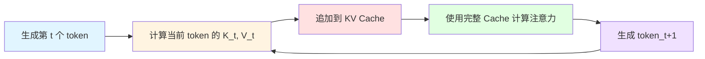
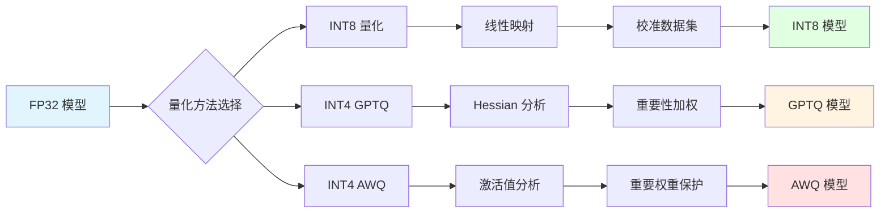
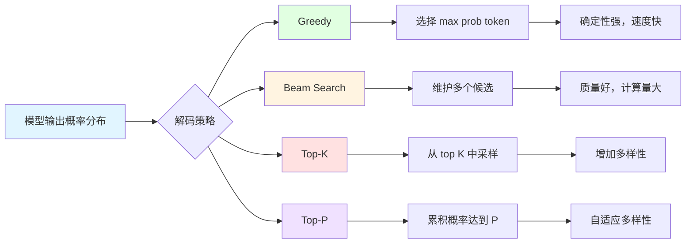
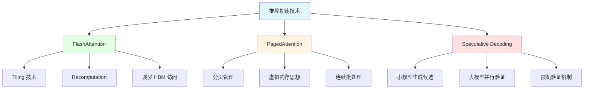

# 推理优化

### 1. 讲讲  KV Cache 原理？有哪些优化手段？

**难度：⭐⭐⭐ 中级**

#### 1️⃣ Common Answer

重点总结（便于面试记忆）：

- 我会从三个角度来回答这个问题。
- 首先从问题本质看，KV Cache 解决的是自回归推理中的重复计算问题。在生成序列时，每生成一个新 token，都要和之前所有 token 计算注意力。比如生成第 100 个 ...
- 其次从实现细节看，KV Cache 的核心在于显存管理和访问模式优化。典型的实现是在推理时维护两个 cache tensor，分别存储所有历史 token 的 K 和 V...
- 最后从工程优化角度看，KV Cache 带来的挑战主要是显存占用和访问效率。显存方面，长序列场景下 cache 可能占用大量显存...
- ```mermaid graph LR A[生成第 t 个 token] --> B[计算当前 token 的 K_t, V_t] B --> C[追加到 KV Cache] ...
- style A fill:#e1f5ff style B fill:#fff4e1 style C fill:#ffe1e1 style D fill:#e1ffe1 styl...

#### 2️⃣ Impressive Answer

我会从三个角度来回答这个问题。

首先从问题本质看，KV Cache 解决的是自回归推理中的重复计算问题。在生成序列时，每生成一个新 token，都要和之前所有 token 计算注意力。比如生成第 100 个 token，需要计算它和前 99 个 token 的注意力关系。如果不缓存，每次都要重新计算前 99 个 token 的 K、V，计算量是 O(n²)。有了 KV Cache，历史 K、V 只计算一次并缓存，后续只需计算新 token 的 K、V，计算量降到 O(n)。

其次从实现细节看，KV Cache 的核心在于显存管理和访问模式优化。典型的实现是在推理时维护两个 cache tensor，分别存储所有历史 token 的 K 和 V。当生成新 token 时，将新 token 的 K、V 追加到 cache 中。这里有个关键点是 cache 的形状通常是 [batch_size, num_heads, seq_len, head_dim]，seq_len 会随着生成过程动态增长。为了支持动态长度，通常使用预分配的 buffer 或者动态内存分配。

最后从工程优化角度看，KV Cache 带来的挑战主要是显存占用和访问效率。显存方面，长序列场景下 cache 可能占用大量显存，甚至超过模型权重本身。这催生了各种优化技术，比如 PagedAttention 将 cache 分页管理，或者 vLLM 的 cache block 机制。访问效率方面，cache 的访问模式是顺序追加和随机读取，需要优化内存布局来提升带宽利用率。实际工程中，还会结合 FlashAttention 等技术进一步优化注意力计算本身。



#### 3️⃣ Key Differences

<table>
<tr>
<td>
维度
</td>
<td>
无 KV Cache
</td>
<td>
有 KV Cache
</td>
</tr>
<tr>
<td>
计算复杂度
</td>
<td>
O(n²)
</td>
<td>
O(n)
</td>
</tr>
<tr>
<td>
显存占用
</td>
<td>
仅模型权重
</td>
<td>
模型权重 + KV Cache
</td>
</tr>
<tr>
<td>
首字延迟
</td>
<td>
相同
</td>
<td>
相同
</td>
</tr>
<tr>
<td>
后续 token 延迟
</td>
<td>
高
</td>
<td>
低
</td>
</tr>
<tr>
<td>
适用场景
</td>
<td>
短序列、单次推理
</td>
<td>
长序列、流式生成
</td>
</tr>
</table>

#### 关联题表格

<table>
<tr>
<td>
问题
</td>
<td>
难度
</td>
<td>
核心考点
</td>
</tr>
<tr>
<td>
KV Cache 的显存占用如何估算？
</td>
<td>
⭐⭐
</td>
<td>
cache 大小计算公式
</td>
</tr>
<tr>
<td>
PagedAttention 如何优化 KV Cache？
</td>
<td>
⭐⭐⭐
</td>
<td>
分页管理、内存碎片
</td>
</tr>
<tr>
<td>
多轮对话中 KV Cache 如何管理？
</td>
<td>
⭐⭐
</td>
<td>
prompt cache、会话管理
</td>
</tr>
<tr>
<td>
KV Cache 在 batch 推理中的挑战？
</td>
<td>
⭐⭐⭐
</td>
<td>
padding、动态长度
</td>
</tr>
</table>

---

### 2. 量化技术 INT8/INT4/GPTQ/AWQ

**难度：⭐⭐⭐⭐ 高级**

#### 1️⃣ Common Answer

重点总结（便于面试记忆）：

- 我会从四个角度来回答这个问题。
- 首先从量化原理看，核心思想是用更少的 bit 表示参数，同时尽量保持模型性能。最基本的量化是线性量化，将浮点数范围线性映射到整数范围。比如 INT8 量化，将 [-a, a] ...
- 其次从量化方法演进看，GPTQ 是一个重要突破。传统的 PTQ（Post-Training Quantization）方法如简单的 per-tensor 量化...
- 然后从 AWQ 的角度看，它提出了一个新的量化思路。AWQ 观察到一个现象：模型中只有少量权重（约 1%）对输出影响很大，这些权重主要对应激活值大的输入。因此 AWQ 在量化时...
- 最后从工程实践看，量化还需要考虑硬件支持。INT8 量化在大多数 GPU 上都有硬件加速，比如 NVIDIA 的 Tensor Core 支持 INT8 矩阵乘法。INT4 量...
- ```mermaid graph LR A[FP32 模型] --> B{量化方法选择} B --> C[INT8 量化] B --> D[INT4 GPTQ] B --> E...

#### 2️⃣ Impressive Answer

我会从四个角度来回答这个问题。

首先从量化原理看，核心思想是用更少的 bit 表示参数，同时尽量保持模型性能。最基本的量化是线性量化，将浮点数范围线性映射到整数范围。比如 INT8 量化，将 [-a, a] 范围的浮点数映射到 [-128, 127]，每个参数只需要 1 字节存储，相比 FP32 的 4 字节，压缩了 4 倍。量化过程包括确定 scale 和 zero point，然后进行舍入。反量化时用 scale 和 zero point 还原回浮点数。

其次从量化方法演进看，GPTQ 是一个重要突破。传统的 PTQ（Post-Training Quantization）方法如简单的 per-tensor 量化，精度损失较大。GPTQ 的核心创新是利用 Hessian 矩阵的二阶导数信息来指导量化。具体来说，GPTQ 认为不同权重的重要性不同，对 Hessian 值大的权重应该保留更高精度。它通过求解一个优化问题，在量化约束下最小化重构误差。实际实现时使用近似算法，可以在几分钟内量化 7B 模型。

然后从 AWQ 的角度看，它提出了一个新的量化思路。AWQ 观察到一个现象：模型中只有少量权重（约 1%）对输出影响很大，这些权重主要对应激活值大的输入。因此 AWQ 在量化时会跳过这些重要权重，只对其他权重进行 INT4 量化。这相当于用 1% 的 FP16 权重保护了 99% 的 INT4 权重，在保持精度的同时实现了 4 倍压缩比。AWQ 的优势是不需要校准数据集，量化速度快。

最后从工程实践看，量化还需要考虑硬件支持。INT8 量化在大多数 GPU 上都有硬件加速，比如 NVIDIA 的 Tensor Core 支持 INT8 矩阵乘法。INT4 量化目前硬件支持有限，通常需要软件模拟，加速效果不如 INT8 明显。此外，量化还需要考虑 KV Cache 的量化、激活值量化等。实际部署时，通常会根据硬件和精度需求选择合适的量化方案。



#### 3️⃣ Key Differences

<table>
<tr>
<td>
维度
</td>
<td>
INT8
</td>
<td>
GPTQ INT4
</td>
<td>
AWQ INT4
</td>
</tr>
<tr>
<td>
压缩比
</td>
<td>
4x
</td>
<td>
8x
</td>
<td>
~7.5x
</td>
</tr>
<tr>
<td>
精度损失
</td>
<td>
小
</td>
<td>
中等
</td>
<td>
小
</td>
</tr>
<tr>
<td>
量化速度
</td>
<td>
快
</td>
<td>
中等
</td>
<td>
快
</td>
</tr>
<tr>
<td>
需要校准数据
</td>
<td>
是
</td>
<td>
是
</td>
<td>
否
</td>
</tr>
<tr>
<td>
硬件加速
</td>
<td>
支持
</td>
<td>
有限
</td>
<td>
有限
</td>
</tr>
<tr>
<td>
适用模型
</td>
<td>
通用
</td>
<td>
大模型
</td>
<td>
通用
</td>
</tr>
</table>

#### 关联题表格

<table>
<tr>
<td>
问题
</td>
<td>
难度
</td>
<td>
核心考点
</td>
</tr>
<tr>
<td>
Per-tensor vs Per-channel 量化的区别？
</td>
<td>
⭐⭐
</td>
<td>
量化粒度、精度
</td>
</tr>
<tr>
<td>
量化感知训练（QAT）和 PTQ 的区别？
</td>
<td>
⭐⭐⭐
</td>
<td>
训练流程、精度
</td>
</tr>
<tr>
<td>
如何评估量化后的模型精度？
</td>
<td>
⭐⭐
</td>
<td>
评估指标、基准
</td>
</tr>
<tr>
<td>
KV Cache 可以量化吗？如何实现？
</td>
<td>
⭐⭐⭐
</td>
<td>
cache 量化、动态量化
</td>
</tr>
</table>

---

### 3. 解码策略 Greedy/Beam Search/Top-K/Top-P

**难度：⭐⭐⭐ 中级**

#### 1️⃣ Common Answer

重点总结（便于面试记忆）：

- 我会从三个角度来回答这个问题。
- 首先从策略演进看，解码策略的核心是在质量和多样性之间找平衡。Greedy Search 是最简单的，每步都选概率最大的 token...
- 其次从采样策略看，Top-K 和 Top-P 都引入了随机性来增加多样性。Top-K 的思想是只从概率最高的 K 个 token 中采样，忽略低概率 token。比如 K=50...
- 最后从工程实践看，解码策略的选择取决于应用场景。对于确定性任务如代码生成、翻译，Greedy 或小 beam size 更合适...
- ```mermaid graph LR A[模型输出概率分布] --> B{解码策略} B --> C[Greedy] B --> D[Beam Search] B --> E...
- C --> C1[选择 max prob token] C1 --> C2[确定性强，速度快]

#### 2️⃣ Impressive Answer

我会从三个角度来回答这个问题。

首先从策略演进看，解码策略的核心是在质量和多样性之间找平衡。Greedy Search 是最简单的，每步都选概率最大的 token。优点是确定性强、速度快，缺点是容易产生重复和低质量内容。比如生成"我非常喜欢"后，Greedy 可能一直生成"非常"，形成死循环。Beam Search 通过维护多个候选序列来缓解这个问题，比如 beam size=5，每步保留 5 个最优部分序列。但 Beam Search 仍然倾向于生成通用但不够有创意的内容，而且计算成本高。

其次从采样策略看，Top-K 和 Top-P 都引入了随机性来增加多样性。Top-K 的思想是只从概率最高的 K 个 token 中采样，忽略低概率 token。比如 K=50，就从 top 50 里随机选一个。这避免了极端低概率 token 的干扰，但 K 是固定的，可能不适用于所有场景。Top-P（也叫 Nucleus Sampling）更智能，它动态选择 token 集合，使得这些 token 的累积概率达到 P（比如 0.9）。这样在概率分布尖锐时候选少，分布平缓时候选多，自适应性更好。实际中 Top-P 通常比 Top-K 效果更好。

最后从工程实践看，解码策略的选择取决于应用场景。对于确定性任务如代码生成、翻译，Greedy 或小 beam size 更合适。对于创意写作、对话生成，Top-P（P=0.9）是常用选择。此外，还有一些组合策略和温度参数。温度参数控制概率分布的平滑度，温度高分布更平缓，多样性更强；温度低分布更尖锐，确定性更强。实际部署时，通常会根据任务调整温度和采样策略的组合。还有一个重要点是重复惩罚，通过降低已生成 token 的概率来避免重复内容。



#### 3️⃣ Key Differences

<table>
<tr>
<td>
维度
</td>
<td>
Greedy
</td>
<td>
Beam Search
</td>
<td>
Top-K
</td>
<td>
Top-P
</td>
</tr>
<tr>
<td>
确定性
</td>
<td>
完全确定
</td>
<td>
完全确定
</td>
<td>
随机
</td>
<td>
随机
</td>
</tr>
<tr>
<td>
多样性
</td>
<td>
低
</td>
<td>
低
</td>
<td>
中
</td>
<td>
高
</td>
</tr>
<tr>
<td>
质量
</td>
<td>
中等
</td>
<td>
高
</td>
<td>
中
</td>
<td>
高
</td>
</tr>
<tr>
<td>
计算成本
</td>
<td>
低
</td>
<td>
高
</td>
<td>
低
</td>
<td>
低
</td>
</tr>
<tr>
<td>
适用场景
</td>
<td>
确定性任务
</td>
<td>
质量要求高
</td>
<td>
创意生成
</td>
<td>
创意生成
</td>
</tr>
</table>

#### 关联题表格

<table>
<tr>
<td>
问题
</td>
<td>
难度
</td>
<td>
核心考点
</td>
</tr>
<tr>
<td>
温度参数如何影响生成结果？
</td>
<td>
⭐⭐
</td>
<td>
概率分布平滑度
</td>
</tr>
<tr>
<td>
如何避免生成重复内容？
</td>
<td>
⭐⭐
</td>
<td>
重复惩罚、n-gram 惩罚
</td>
</tr>
<tr>
<td>
Beam Search 的 beam size 如何选择？
</td>
<td>
⭐⭐
</td>
<td>
质量与计算成本权衡
</td>
</tr>
<tr>
<td>
Top-P 和 Top-K 可以组合使用吗？
</td>
<td>
⭐⭐
</td>
<td>
组合策略、效果
</td>
</tr>
</table>

---

### 4. 推理加速 FlashAttention/PagedAttention/Speculative Decoding

**难度：⭐⭐⭐⭐ 专家级**

#### 1️⃣ Common Answer

重点总结（便于面试记忆）：

- 我会从四个角度来回答这个问题。
- 首先从 FlashAttention 的核心创新看，它解决了传统注意力实现的 IO 瓶颈。传统注意力计算需要多次读写 HBM（高带宽内存），比如计算 QK^T 时需要从 HBM...
- 其次从 PagedAttention 的设计看，它借鉴了操作系统的虚拟内存思想。传统 KV Cache 管理面临两个问题：一是显存碎片...
- 然后从 Speculative Decoding 的原理看，它是一种投机验证的加速策略。核心思想是用一个小模型（比如参数量 1/10）快速生成多个候选 token...
- 最后从工程集成看，这些技术可以组合使用达到最佳效果。比如 vLLM 同时使用了 PagedAttention 和 FlashAttention，既优化了 cache 管理...
- ```mermaid graph TD A[推理加速技术] --> B[FlashAttention] A --> C[PagedAttention] A --> D[Spec...

#### 2️⃣ Impressive Answer

我会从四个角度来回答这个问题。

首先从 FlashAttention 的核心创新看，它解决了传统注意力实现的 IO 瓶颈。传统注意力计算需要多次读写 HBM（高带宽内存），比如计算 QK^T 时需要从 HBM 读取 Q 和 K，计算 Softmax 后又要写回 HBM，然后再乘 V。FlashAttention 通过 tiling 技术将大的注意力矩阵分块，每个 block 在 SRAM（高速缓存）中完整计算，减少 HBM 访问。同时，FlashAttention 使用 recomputation 技术，在 backward 时重新计算注意力而不是存储中间结果，进一步节省显存。FlashAttention-2 进一步优化了线程块并行策略，在 A100 上可以达到 2-3x 加速。

其次从 PagedAttention 的设计看，它借鉴了操作系统的虚拟内存思想。传统 KV Cache 管理面临两个问题：一是显存碎片，不同序列长度不同，预分配的显存可能浪费；二是 batch 推理时，序列长度动态变化，难以高效管理。PagedAttention 将 KV Cache 分成固定大小的 blocks（比如每 block 存 16 个 token），每个序列的 cache 由多个 block 组成，这些 block 可以不连续。这样就像操作系统的页表一样，通过 block 管理器动态分配和回收 block，解决了显存碎片问题。vLLM 就是基于 PagedAttention 实现的，它支持高效的连续批处理（continuous batching），新请求可以随时加入，完成的请求可以及时释放资源。

然后从 Speculative Decoding 的原理看，它是一种投机验证的加速策略。核心思想是用一个小模型（比如参数量 1/10）快速生成多个候选 token，然后用大模型并行验证这些候选是否正确。比如小模型生成 10 个 token，大模型一次性验证这 10 个 token。验证的方式是并行计算大模型在每个位置的输出概率，看小模型生成的 token 是否在高概率集合中。如果验证通过，就接受小模型的输出；如果失败，就回退到失败位置重新生成。Speculative Decoding 的加速效果取决于小模型的准确率，如果小模型和大模型输出一致率高，加速效果就明显，通常可以达到 2-3x。

最后从工程集成看，这些技术可以组合使用达到最佳效果。比如 vLLM 同时使用了 PagedAttention 和 FlashAttention，既优化了 cache 管理，又加速了注意力计算。Speculative Decoding 可以和这些技术结合，进一步加速。实际部署时，还需要考虑硬件特性，比如 FlashAttention 在不同 GPU 架构上的优化策略不同。此外，还有一些其他加速技术，如 fused kernels（融合核函数）、算子融合、图优化等，都是推理加速的重要手段。



#### 3️⃣ Key Differences

<table>
<tr>
<td>
维度
</td>
<td>
FlashAttention
</td>
<td>
PagedAttention
</td>
<td>
Speculative Decoding
</td>
</tr>
<tr>
<td>
优化目标
</td>
<td>
注意力计算
</td>
<td>
KV Cache 管理
</td>
<td>
生成速度
</td>
</tr>
<tr>
<td>
核心技术
</td>
<td>
Tiling + Recomputation
</td>
<td>
分页管理
</td>
<td>
投机验证
</td>
</tr>
<tr>
<td>
显存节省
</td>
<td>
50%+
</td>
<td>
减少碎片
</td>
<td>
不直接节省
</td>
</tr>
<tr>
<td>
加速倍数
</td>
<td>
2-3x
</td>
<td>
提升吞吐
</td>
<td>
2-3x
</td>
</tr>
<tr>
<td>
适用场景
</td>
<td>
所有注意力计算
</td>
<td>
长序列、batch 推理
</td>
<td>
自回归生成
</td>
</tr>
</table>


---

### 总结

推理优化是 AI Agent 和大模型部署的核心技术，涵盖显存优化、计算加速、解码策略等多个方面。掌握这些技术不仅需要理解原理，还需要了解工程实践中的权衡和取舍。面试时要结合具体场景说明技术的适用性和局限性，展现深度思考。
---

## 知识点一句话总结

| 知识点 | 一句话总结（来自 Impressive Answer） |
| --- | --- |
| 讲讲 KV Cache 原理？有哪些优化手段？ | 首先从问题本质看，KV Cache 解决的是自回归推理中的重复计算问题。在生成序列时，每生成一个新 token，都要和之前所有 token 计算注意力。比如生成第 100 个 token，需要计算它和前 99 个 token 的注意力关系。如果不缓存，每次都要重新计算前 99 个 token 的 K、V，计算量是 O(n²)。有了 KV Cache，历史 K、V 只计算一次并缓存，后续只需计算新 token 的 K、V，计算量降到 O(n)；其次从实现细节看，KV Cache 的核心在于显存管理和访问模式优化。典型的实现是在推理时维护两个 cache tensor，分别存储所有历史 token 的 K 和 V。当生成新 token 时，将新 token 的 K、V 追加到 cache 中。这里有个关键点是 cache 的形状通常是 [batch_size, num_heads, seq_len, head_dim]，seq_len 会随着生成过程动态增长。为了支持动态长度，通常使用预分配的 buffer 或者动态内存分配；最后从工程优化角度看，KV Cache 带来的挑战主要是显存占用和访问效率。显存方面，长序列场景下 cache 可能占用大量显存，甚至超过模型权重本身。这催生了各种优化技术，比如 PagedAttention 将 cache 分页管理，或者 vLLM 的 cache block 机制。访问效率方面，cache 的访问模式是顺序追加和随机读取，需要优化内存布局来提升带宽利用率。实际工程中，还会结合 FlashAttention 等技术进一步优化注意力计算本身。 |
| 解码策略 Greedy/Beam Search/Top-K/Top-P | 首先从策略演进看，解码策略的核心是在质量和多样性之间找平衡。Greedy Search 是最简单的，每步都选概率最大的 token。优点是确定性强、速度快，缺点是容易产生重复和低质量内容。比如生成"我非常喜欢"后，Greedy 可能一直生成"非常"，形成死循环。Beam Search 通过维护多个候选序列来缓解这个问题，比如 beam size=5，每步保留 5 个最优部分序列。但 Beam Search 仍然倾向于生成通用但不够有创意的内容，而且计算成本高；其次从采样策略看，Top-K 和 Top-P 都引入了随机性来增加多样性。Top-K 的思想是只从概率最高的 K 个 token 中采样，忽略低概率 token。比如 K=50，就从 top 50 里随机选一个。这避免了极端低概率 token 的干扰，但 K 是固定的，可能不适用于所有场景。Top-P（也叫 Nucleus Sampling）更智能，它动态选择 token 集合，使得这些 token 的累积概率达到 P（比如 0.9）。这样在概率分布尖锐时候选少，分布平缓时候选多，自适应性更好。实际中 Top-P 通常比 Top-K 效果更好；最后从工程实践看，解码策略的选择取决于应用场景。对于确定性任务如代码生成、翻译，Greedy 或小 beam size 更合适。对于创意写作、对话生成，Top-P（P=0.9）是常用选择。此外，还有一些组合策略和温度参数。温度参数控制概率分布的平滑度，温度高分布更平缓，多样性更强；温度低分布更尖锐，确定性更强。实际部署时，通常会根据任务调整温度和采样策略的组合。还有一个重要点是重复惩罚，通过降低已生成 token 的概率来避免重复内容。 |
