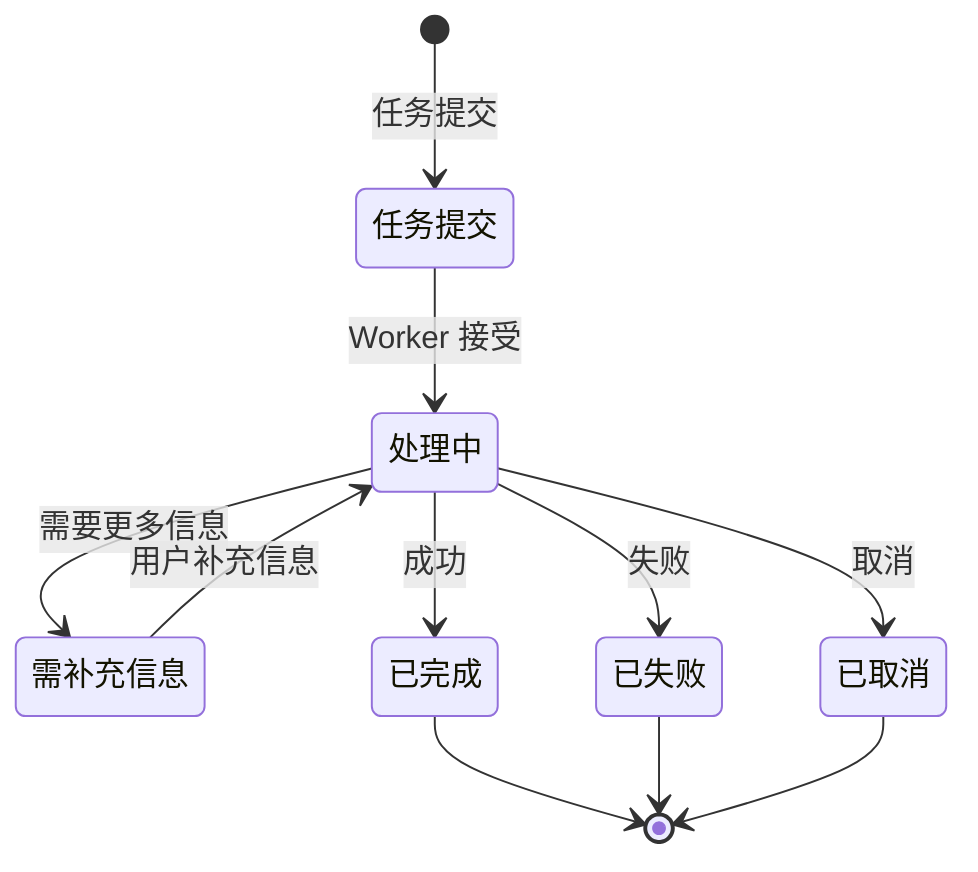
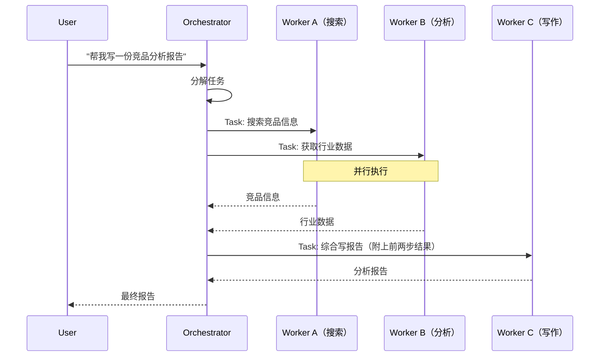
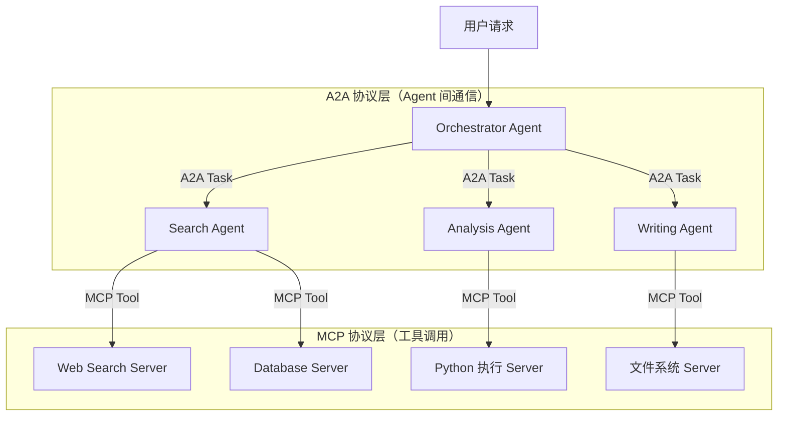

### A2A 架构、Task 生命周期、多 Agent 协作实践

#### 基础题：A2A 协议是什么？它解决了什么问题？

**难度**：⭐（A2A 定义、背景、解决的问题）

**Answer**：

A2A（Agent to Agent）是 Google 于 2025 年提出的**开放协议**，目标是让不同框架、不同厂商的 AI Agent 之间能够标准化地互相通信和协作。

**解决的问题**：多 Agent 系统中，每个 Agent 可能用不同框架实现（LangChain、AutoGen、CrewAI），它们之间没有统一的通信标准，导致：

- Agent 间协作需要大量定制化代码

- 无法复用其他团队/厂商的 Agent 能力

- 任务委派、状态同步、结果汇聚没有标准格式

**A2A 的核心设计**：

- **Agent Card**：每个 Agent 发布自己的能力声明（类似名片）

- **Task**：标准化的任务对象，有完整的生命周期管理

- **Message**：标准化的消息格式，支持文本、文件、结构化数据

**和 MCP 的定位差异**：

- **MCP**：模型 ↔ 工具（Model to Tool）

- **A2A**：Agent ↔ Agent（Agent to Agent）

---

#### 进阶题：A2A 协议的 Task 生命周期是什么？如何处理长时间运行的任务？

A2A 的 Task 是一个完整的状态机，理解状态转换是设计健壮多 Agent 系统的关键：



**Task 对象结构**：

```json
{
  "id": "task-uuid-123",
  "status": {
    "state": "working",
    "message": {"role": "agent", "parts": [{"text": "正在分析数据..."}]},
    "timestamp": "2024-03-24T10:00:00Z"
  },
  "artifacts": [],
  "metadata": {"priority": "high", "timeout": 300}
}
```

**长时间任务的处理策略**：

```java
public class A2ATaskManager {

    // 提交任务（非阻塞）
    public Task submitTask(TaskRequest request) {
        Task task = Task.builder()
            .id(UUID.randomUUID().toString())
            .state(TaskState.SUBMITTED)
            .build();

        // 异步执行
        CompletableFuture.runAsync(() -> executeTask(task, request), taskExecutorPool);
        return task;
    }

    // 流式响应（SSE）
    public Flux<TaskStatusUpdate> streamTask(String taskId) {
        return taskEventBus.subscribe(taskId)
            .map(event -> new TaskStatusUpdate(taskId, event.getState(), event.getMessage()))
            .takeUntil(update -> update.isTerminal());  // 终态时停止
    }

    // 处理 input-required 状态
    public void provideInput(String taskId, Message userInput) {
        Task task = taskStore.get(taskId);
        if (task.getState() != TaskState.INPUT_REQUIRED) {
            throw new IllegalStateException("任务不在等待输入状态");
        }
        task.setState(TaskState.WORKING);
        taskEventBus.publish(taskId, new InputReceivedEvent(userInput));
    }
}
```

**超时处理**：任务超过 timeout 时间未完成，自动转为 `failed` 状态，并通知 Orchestrator 决策是否重试。

---

#### 6、进阶题：A2A 中 Orchestrator Agent 和 Worker Agent 如何协作？


Orchestrator-Worker 模式是多 Agent 系统的核心架构，关键在于**任务分解、委派、汇聚、容错**四个环节：



**Orchestrator 核心实现**：

```java
@Service
public class OrchestratorAgent {

    public FinalReport orchestrate(String userRequest) {
        // Step1: 任务分解
        List<SubTask> subTasks = planner.decompose(userRequest);

        // Step2: 发现可用 Worker（通过 Agent Card）
        Map<SubTask, AgentCard> taskWorkerMap = workerDiscovery.match(subTasks);

        // Step3: 并行委派无依赖任务
        Map<String, CompletableFuture<TaskResult>> futures = new HashMap<>();
        for (Map.Entry<SubTask, AgentCard> entry : taskWorkerMap.entrySet()) {
            SubTask task = entry.getKey();
            AgentCard worker = entry.getValue();

            if (task.getDependencies().isEmpty()) {
                // 无依赖，直接提交
                futures.put(task.getId(), a2aClient.submitTask(worker.getEndpoint(), task));
            }
        }

        // Step4: 等待结果，处理依赖任务
        Map<String, TaskResult> results = collectResults(futures);

        // Step5: 汇聚结果，生成最终输出
        return synthesizer.synthesize(userRequest, results);
    }

    // 错误处理：Worker 失败时的降级策略
    private TaskResult handleWorkerFailure(SubTask task, Throwable error) {
        log.warn("Worker 执行失败: {}, 错误: {}", task.getId(), error.getMessage());
        // 策略1: 重试（换一个 Worker）
        // 策略2: 降级（用更简单的方式完成）
        // 策略3: 跳过（标记为可选任务）
        return fallbackStrategy.handle(task, error);
    }
}
```

---

#### 7、进阶题：A2A 和 MCP 在实际项目中如何配合使用？


A2A 和 MCP 是**互补关系**，分别解决不同层次的问题，在实际系统中通常同时使用：



**各层职责**：

- **A2A 层**：Agent 间的任务委派、状态同步、结果传递

- **MCP 层**：每个 Agent 内部的工具调用（搜索、数据库、代码执行等）

**实际项目中的设计原则**：

1. **能力边界**：每个 Worker Agent 专注一个领域，通过 MCP 调用该领域的工具

2. **接口标准化**：Agent Card 清晰描述 Agent 的输入/输出格式，便于 Orchestrator 组合

3. **独立部署**：每个 Agent 独立部署，通过 A2A 协议解耦，可以独立扩缩容

---

#### 8、进阶题：Agent Card 是什么？如何设计一个好的 Agent Card？

Agent Card 是 A2A 协议中的**能力声明文档**，是 Agent 服务发现的核心机制，通常以 JSON 格式暴露在固定路径（`/.well-known/agent.json`）：

```json
{
  "name": "DataAnalysisAgent",
  "description": "专业的数据分析 Agent，擅长 SQL 查询、统计分析和数据可视化",
  "version": "1.2.0",
  "url": "https://data-agent.example.com",
  "capabilities": {
    "streaming": true,
    "pushNotifications": true,
    "stateTransitionHistory": false
  },
  "skills": [
    {
      "id": "sql-analysis",
      "name": "SQL 数据分析",
      "description": "执行 SQL 查询并返回结构化分析结果",
      "inputModes": ["text"],
      "outputModes": ["text", "data"],
      "examples": [
        "分析过去 30 天的销售趋势",
        "找出销售额最高的前 10 个产品"
      ]
    },
    {
      "id": "chart-generation",
      "name": "图表生成",
      "description": "基于数据生成折线图、柱状图、饼图等可视化图表",
      "inputModes": ["text", "data"],
      "outputModes": ["file"]
    }
  ],
  "authentication": {
    "schemes": ["bearer"]
  }
}
```

**好的 Agent Card 设计原则**：

1. **description 要精准**：Orchestrator 用 description 来决定是否委派任务，模糊的描述会导致错误路由

2. **skills 要细粒度**：每个 skill 描述一个具体能力，而非笼统的"数据处理"

3. **examples 要典型**：提供 2-3 个典型输入示例，帮助 Orchestrator 理解适用场景

4. **capabilities 要准确**：`streaming` 和 `pushNotifications` 影响 Orchestrator 的调用策略

---

#### 9、场景题：多 Agent 系统中如何处理 Agent 之间的循环依赖和死锁？

多 Agent 系统的循环依赖是一个系统性问题，需要**预防 + 检测 + 恢复**三层防御：

**预防层：设计时避免循环**

```plaintext
原则：Agent 调用关系必须是 DAG（有向无环图）
Orchestrator → Worker A → Worker B  ✓（单向）
Orchestrator → Worker A → Orchestrator  ✗（循环）
```

在 Agent Card 中声明依赖关系，系统启动时做拓扑排序验证，发现循环依赖直接报错。

**检测层：运行时检测**

```java
public class CallChainTracker {
    // 用 ThreadLocal 记录当前调用链
    private static final ThreadLocal<Deque<String>> callChain =
        ThreadLocal.withInitial(ArrayDeque::new);

    public void beforeCall(String targetAgentId) {
        Deque<String> chain = callChain.get();
        if (chain.contains(targetAgentId)) {
            throw new CircularDependencyException(
                "检测到循环依赖: " + chain + " -> " + targetAgentId);
        }
        chain.push(targetAgentId);
    }

    public void afterCall() {
        callChain.get().pop();
    }
}
```

**恢复层：超时 + 熔断**

```java
// 每个 A2A 调用设置独立超时
CompletableFuture<TaskResult> future = a2aClient.submitTask(workerEndpoint, task);
TaskResult result = future.orTimeout(30, TimeUnit.SECONDS)
    .exceptionally(throwable -> {
        if (throwable instanceof TimeoutException) {
            circuitBreaker.recordFailure(workerEndpoint);
            return TaskResult.timeout("Worker 超时，已触发熔断");
        }
        return TaskResult.error(throwable.getMessage());
    }).join();
```


---

#### 10、基础题：技能版本管理和热更新如何实现？

**Answer**：

技能版本管理的核心是**不停机更新**，需要解决三个问题：

**1. 版本标识**：每个技能有语义化版本号（`major.minor.patch`），接口变更升 major，新增功能升 minor，修复升 patch

**2. 热更新实现**：

```java
@Service
public class SkillHotReloader {

    // 监听技能 Jar 包变化（或配置中心推送）
    @EventListener(SkillUpdateEvent.class)
    public void onSkillUpdate(SkillUpdateEvent event) {
        String skillName = event.getSkillName();
        String newVersion = event.getNewVersion();

        // 用新的 ClassLoader 加载新版本技能
        AgentSkill newSkill = skillLoader.load(skillName, newVersion);

        // 灰度：先让 10% 流量走新版本
        skillRegistry.registerWithGrayScale(skillName, newSkill, 0.1);

        log.info("技能 {} 热更新到 {}，灰度 10%", skillName, newVersion);
    }
}
```

**3. 兼容性保证**：

- 新版本技能必须向后兼容（不能删除已有参数）

- 不兼容变更需要同时维护新旧两个版本，等旧版本流量归零后再下线

- 技能接口变更需要提前通知所有依赖方
