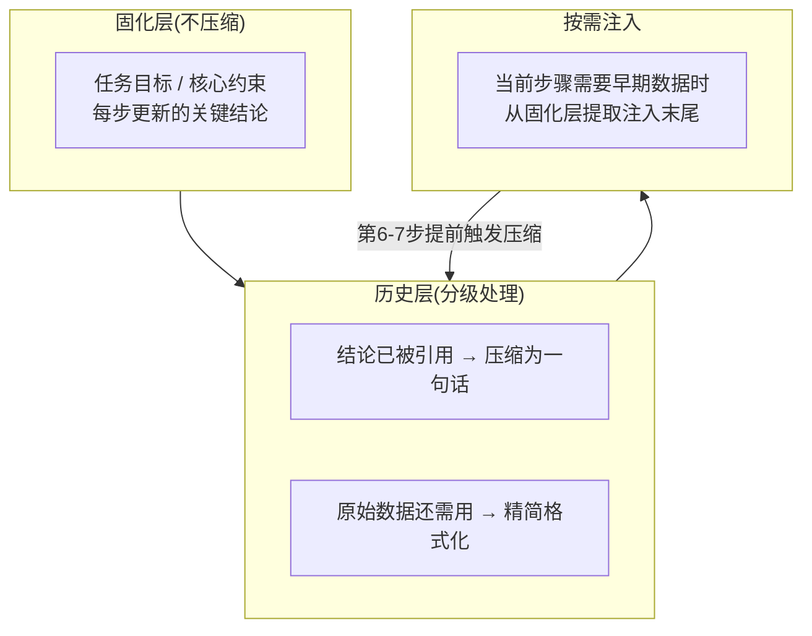
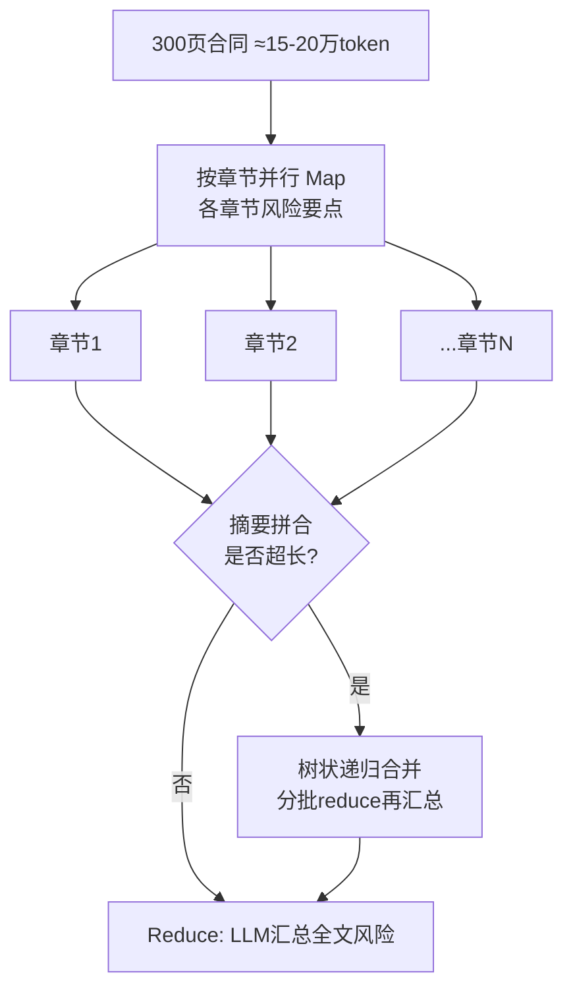

# LLM 应用开发

### 3.1 LLM 参数与基础原理

#### Temperature 与 Top-P 参数

##### 1、基础题：Temperature 和 Top-P 分别控制什么？

**难度级别**：⭐（LLM 采样参数、随机性控制）

Temperature 控制输出的随机性，本质是对 softmax 的 logits 做缩放：T 越低输出越确定，T→0 时退化为 argmax；T 越高输出越随机，T→∞ 时趋近均匀分布。Top-P 是核采样，按概率从高到低排列 token，取累积概率刚超过 P 的最小集合进行采样，候选集大小随模型置信度动态变化。

---

##### 2、进阶题：Temperature 和 Top-P 的数学本质是什么？在 Agent 工程实践中如何按任务类型选参？

**难度级别**：⭐⭐（softmax 缩放原理、Top-P vs Top-K、任务类型调参策略）

**1️⃣ Common Answer**

重点总结（便于面试记忆）：

- Temperature 的数学本质
- Top-P 和 Top-K 的本质区别
- 工程选型原则

**2️⃣ Impressive Answer**

我会从两个角度来回答：一是数学原理，二是工程选型。

1. **Temperature 的数学本质**。它作用于 softmax 的指数项，公式是。T→0 时最大 logit 的概率趋近于 1，退化为确定性的 argmax；T→∞ 时所有 token 趋向均匀分布。低温输出稳但保守，高温更有创意但容易离题。

1. **Top-P 和 Top-K 的本质区别**。Top-K 固定候选集大小，Top-P 是动态的——模型确定时候选集只有几个 token，不确定时自动扩大。Top-P 更能适应模型置信度的变化，这是它比 Top-K 更受欢迎的原因。

1. **工程选型原则**。我按任务类型来定参数：规划/推理/JSON 工具调用，Temperature 设 0.1-0.3，保证格式稳定；代码生成设 0.2 左右，语法约束本身就很强；创意写作设 0.7-1.0，同时把 Top-P 调到 0.85 防止跑偏。有一个常见误区是两个参数同时乱调，效果很难预测。我的做法是固定其中一个只调另一个，生产环境还会固定 seed 保证可复现。


**3️⃣ Key Differences**

<table>
<tr>
<td>
维度
</td>
<td>
Common Answer
</td>
<td>
Impressive Answer
</td>
</tr>
<tr>
<td>
技术深度
</td>
<td>
只描述&quot;高低&quot;的直觉效果
</td>
<td>
给出 softmax 缩放公式，解释 T→0/∞ 的极限行为
</td>
</tr>
<tr>
<td>
Top-P 理解
</td>
<td>
停留在&quot;累积概率截断&quot;的定义
</td>
<td>
解释动态候选集与 Top-K 的本质区别及优势
</td>
</tr>
<tr>
<td>
实践经验
</td>
<td>
给出宽泛数值范围
</td>
<td>
按任务类型给出具体配置，说明各自工程动机
</td>
</tr>
<tr>
<td>
思考维度
</td>
<td>
单参数视角
</td>
<td>
指出两参数叠加风险，提到 seed 用于生产可复现性
</td>
</tr>
<tr>
<td>
给面试官的印象
</td>
<td>
知道用法但不理解原理
</td>
<td>
既懂数学原理，又有清晰的工程判断标准
</td>
</tr>
</table>

---

##### 3、场景题：一个 Agent 负责拆解子任务并生成 JSON 工具调用参数，同时也需要做头脑风暴生成多样化方案，应该怎么配置参数？

**难度级别**：⭐⭐（多任务参数隔离、格式稳定性与多样性权衡）

**1️⃣ Common Answer**

重点总结（便于面试记忆）：

- 拆解子任务和工具调用参数生成
- 头脑风暴和多样化方案生成
- 关键原则是两类任务用独立的 LLM 调用

**2️⃣ Impressive Answer**

我会从任务隔离的角度来设计：

1. **拆解子任务和工具调用参数生成**，Temperature 设 0.1-0.2，Top-P 设 0.9。核心目标是 JSON 格式稳定、字段完整、不产生幻觉，低温是最直接的保障。同时在 Prompt 里加上格式 schema 和示例，双重约束。

1. **头脑风暴和多样化方案生成**，Temperature 提到 0.8-1.0，Top-P 调低到 0.85 防止完全失控。如果对多样性要求高，可以用 Self-Consistency 的思路：多次采样，再筛选去重，比单次高温生成质量更可控。

1. **关键原则是两类任务用独立的 LLM 调用**，不要在同一次调用里既要格式稳定又要创意发散。Agent 的规划节点和创意节点分开，各用各的参数配置，互不干扰。

**3️⃣ Key Differences**

<table>
<tr>
<td>
维度
</td>
<td>
Common Answer
</td>
<td>
Impressive Answer
</td>
</tr>
<tr>
<td>
解题思路
</td>
<td>
笼统说&quot;动态切换&quot;
</td>
<td>
明确提出任务隔离，两类调用分开处理
</td>
</tr>
<tr>
<td>
格式稳定性
</td>
<td>
未提及保障手段
</td>
<td>
低温 + schema + 示例三重约束
</td>
</tr>
<tr>
<td>
多样性方案
</td>
<td>
只说&quot;高温&quot;
</td>
<td>
结合 Self-Consistency 多次采样提升质量
</td>
</tr>
<tr>
<td>
给面试官的印象
</td>
<td>
有意识但缺乏落地方案
</td>
<td>
有清晰的工程设计思路
</td>
</tr>
</table>

---

##### 4、容易一起考的题

<table>
<tr>
<td>
关联题
</td>
<td>
和本题的关系
</td>
<td>
参考答案
</td>
</tr>
<tr>
<td>
Self-Consistency 是什么原理？
</td>
<td>
多路径采样依赖高 Temperature，和参数选择直接关联
</td>
<td>
答：这题可以按“定义 → 核心机制 → 工程落地”三步答；结合本题重点强调：多路径采样依赖高 Temperature，和参数选择直接关联，最后补一个风险点或优化手段。
</td>
</tr>
<tr>
<td>
为什么 JSON 输出格式不稳定？
</td>
<td>
Temperature 过高是格式不稳定的常见根因
</td>
<td>
答：这题可以按“定义 → 核心机制 → 工程落地”三步答；结合本题重点强调：Temperature 过高是格式不稳定的常见根因，最后补一个风险点或优化手段。
</td>
</tr>
<tr>
<td>
LLM 的 seed 参数有什么作用？
</td>
<td>
与 Temperature 配合使用，保证生产环境结果可复现
</td>
<td>
答：这题可以按“定义 → 核心机制 → 工程落地”三步答；结合本题重点强调：与 Temperature 配合使用，保证生产环境结果可复现，最后补一个风险点或优化手段。
</td>
</tr>
</table>

---

#### LLM 的幻觉（Hallucination）成因与分类

##### 1、基础题：什么是 LLM 幻觉？

**难度级别**：⭐（幻觉定义、基本成因）

LLM 幻觉是指模型生成了与事实不符或与上下文矛盾的内容。根本原因有两类：一是训练数据本身有错误或过时信息；二是 RLHF 阶段奖励模型偏向流畅自信的回答而非准确性，导致模型学会了"自信地说错话"。

---

##### 2、进阶题：LLM 幻觉的成因和分类是什么？在 AI Agent 系统中有哪些有效的缓解策略？

**难度级别**：⭐⭐（内在/外在幻觉分类、RLHF 偏置、Agent 幻觉雪球效应、缓解策略体系）

**1️⃣ Common Answer**

重点总结（便于面试记忆）：

- 幻觉的两类成因
- Agent 场景的特殊性
- 缓解策略

**2️⃣ Impressive Answer**

我会从成因分类、Agent 场景特殊性、缓解策略三个层次来回答。

1. **幻觉的两类成因**。内在幻觉（Intrinsic Hallucination）根源在模型本身：训练语料里有错误或过时信息；RLHF 的奖励模型偏向"流畅自信"而非"准确"，模型学会了用自信语气说错误的话；以及参数记忆的压缩损失导致事实失真。外在幻觉（Extrinsic Hallucination）是模型无法正确利用上下文中已有的信息——提供了参考文档但回答与文档矛盾，或者指令太复杂导致遵循失败，本质是上下文理解和指令遵循的问题。

1. **Agent 场景的特殊性**。在多步 Agent 里，幻觉的危害被放大了——一次幻觉会导致后续多步工具调用都基于错误前提，形成"幻觉雪球"。这是单轮问答里不存在的风险。

1. **缓解策略**。我按层次来做：RAG 提供事实锚点，针对外在幻觉效果最直接，Prompt 里明确要求"只基于提供的文档回答"；Self-Consistency 多路径投票，用较高 Temperature 采样 5-10 次再做多数投票，TruthfulQA 的实验证明在事实性问题上有可观提升；工具调用后加 Grounding 验证，让模型检查"我的结论和工具结果是否一致"，不一致就触发重规划；置信度提示，要求模型给出置信度等级并明确"不确定比猜测更有价值"。

**3️⃣ Key Differences**

<table>
<tr>
<td>
维度
</td>
<td>
Common Answer
</td>
<td>
Impressive Answer
</td>
</tr>
<tr>
<td>
分类框架
</td>
<td>
笼统说&quot;数据有错误&quot;
</td>
<td>
明确区分内在/外在幻觉，解释各自的机制根源
</td>
</tr>
<tr>
<td>
成因分析
</td>
<td>
停留在表面现象
</td>
<td>
深入到 RLHF 偏置、参数压缩损失等底层原因
</td>
</tr>
<tr>
<td>
缓解策略
</td>
<td>
列举常见方法，缺乏层次
</td>
<td>
按层次给出策略，说明各自针对哪类幻觉有效
</td>
</tr>
<tr>
<td>
Agent 场景洞察
</td>
<td>
无
</td>
<td>
指出多步 Agent 中的&quot;幻觉雪球效应&quot;
</td>
</tr>
<tr>
<td>
给面试官的印象
</td>
<td>
知道幻觉是什么，会基础缓解
</td>
<td>
理解成因机制，有体系化的工程应对方案
</td>
</tr>
</table>

---

##### 3、场景题：你的 Agent 在做多步推理时，第二步工具调用返回了正确结果，但第三步的回答却和工具结果矛盾，你怎么排查和处理？

**难度级别**：⭐⭐（外在幻觉定位、Grounding 验证、Agent 重规划机制）

**1️⃣ Common Answer**

重点总结（便于面试记忆）：

- 先排查根因
- 短期修复
- 系统性解决

**2️⃣ Impressive Answer**

这是典型的外在幻觉——工具结果在上下文里，但模型没有正确利用它。我会这样处理：

1. **先排查根因**。检查工具返回结果在上下文中的位置，如果被放在了很前面而当前步骤的指令在后面，可能是 Lost in the Middle 的问题——关键数据被"淹没"在中间位置。同时检查工具返回格式是否解析正常，排除结构化数据解析错误的可能。

1. **短期修复**。在第三步的 Prompt 里，把工具返回结果显式重申一遍，紧放在"现在请基于以上信息"这句话之前，利用近因效应强制模型关注这个数据。

1. **系统性解决**。加入 Grounding 验证节点：每次工具调用后，让 LLM 做一次"我的下一步推断是否和工具结果一致"的自我校验，不一致就记录 conflict 并触发重规划，而不是继续往下走。这样把幻觉消灭在扩散之前。

**3️⃣ Key Differences**

<table>
<tr>
<td>
维度
</td>
<td>
Common Answer
</td>
<td>
Impressive Answer
</td>
</tr>
<tr>
<td>
根因定位
</td>
<td>
笼统归因为幻觉
</td>
<td>
区分 Lost in the Middle 和解析错误两种可能
</td>
</tr>
<tr>
<td>
修复方案
</td>
<td>
调参或修改 Prompt，不够精准
</td>
<td>
显式重申 + Grounding 验证双管齐下
</td>
</tr>
<tr>
<td>
系统化思维
</td>
<td>
无
</td>
<td>
提出验证节点机制，防止幻觉雪球扩散
</td>
</tr>
<tr>
<td>
给面试官的印象
</td>
<td>
有意识但处理方式粗放
</td>
<td>
排查思路清晰，有系统性预防机制
</td>
</tr>
</table>

---

##### 4、容易一起考的题

<table>
<tr>
<td>
关联题
</td>
<td>
和本题的关系
</td>
<td>
参考答案
</td>
</tr>
<tr>
<td>
RAG 如何缓解幻觉？
</td>
<td>
RAG 是针对外在幻觉最直接的工程手段
</td>
<td>
答：RAG 题要串起切分、embedding、召回、重排、上下文拼装、生成和评估，每一步都有质量与成本取舍。
</td>
</tr>
<tr>
<td>
Self-Consistency 的原理是什么？
</td>
<td>
多路径投票是缓解内在幻觉的经典策略
</td>
<td>
答：这题可以按“定义 → 核心机制 → 工程落地”三步答；结合本题重点强调：多路径投票是缓解内在幻觉的经典策略，最后补一个风险点或优化手段。
</td>
</tr>
<tr>
<td>
Lost in the Middle 是什么？
</td>
<td>
外在幻觉的重要成因之一，上下文位置影响模型利用率
</td>
<td>
答：这题可以按“定义 → 核心机制 → 工程落地”三步答；结合本题重点强调：外在幻觉的重要成因之一，上下文位置影响模型利用率，最后补一个风险点或优化手段。
</td>
</tr>
</table>

---

### 3.2 Prompt 工程实践

#### System Prompt 的设计最佳实践

##### 1、基础题：System Prompt 里应该写什么？

**难度级别**：⭐（System Prompt 基本结构、角色定义）

System Prompt 是 Agent 的行为契约基础，通常包含三部分：角色与能力边界定义（告诉模型它是谁、能做什么、不能做什么）、输出格式约束（格式模板和示例）、以及边界条件与拒绝策略（什么情况下应该拒绝并如何回应）。

---

##### 2、进阶题：在构建 AI Agent 系统时，System Prompt 的设计有哪些最佳实践？如何兼顾功能性和性能优化？

**难度级别**：⭐⭐（角色边界定义、格式约束、KV Cache 友好设计、优先级排列）

**1️⃣ Common Answer**

重点总结（便于面试记忆）：

- 角色与能力边界要精确，不要模糊
- 格式约束用"描述 + 示例"组合，不要只描述
- 边界条件和拒绝策略不能省
- KV Cache 友好是性能层面的核心考量

**2️⃣ Impressive Answer**

我会从功能设计和性能设计两个维度来展开。

1. **角色与能力边界要精确，不要模糊**。不要只写"你是一个助手"，要给出具体身份、具体能力范围和明确的知识边界。边界清晰后模型的行为就更可预测，"自由发挥"的空间更小。

1. **格式约束用"描述 + 示例"组合，不要只描述**。对 Agent 系统来说，工具调用参数解析依赖输出格式的稳定性。只说"用 JSON 输出"不够，要直接给出 schema 加一个正确示例，描述加示例的组合比单纯描述可靠得多。

1. **边界条件和拒绝策略不能省**。明确告诉模型什么时候应该拒绝、拒绝时怎么回答。很多人忽略这一点，结果是模型在超出能力范围时硬撑着给错误答案。加一条"超出能力范围时直接说明，不要猜测或编造"能显著减少这类幻觉。

1. **KV Cache 友好是性能层面的核心考量**。System Prompt 每次请求都相同，API 侧命中前缀缓存能显著降低首 Token 延迟和费用。要求是内容完全固定，包括标点和空格，不能有动态插值。需要动态注入的信息（当前日期、用户信息）统一放到 User 消息里，不要放 System Prompt 里。Anthropic 缓存命中有 90% 费用折扣，高并发场景收益非常可观。


**3️⃣ Key Differences**

<table>
<tr>
<td>
维度
</td>
<td>
Common Answer
</td>
<td>
Impressive Answer
</td>
</tr>
<tr>
<td>
角色定义
</td>
<td>
泛泛说&quot;清晰简洁&quot;
</td>
<td>
强调能力边界的精确性，解释边界模糊的风险
</td>
</tr>
<tr>
<td>
格式约束
</td>
<td>
只提到格式要求
</td>
<td>
指出&quot;描述+示例&quot;组合的必要性
</td>
</tr>
<tr>
<td>
边界条件
</td>
<td>
未提及
</td>
<td>
专门讨论拒绝策略，解释缺失时的风险
</td>
</tr>
<tr>
<td>
性能视角
</td>
<td>
提到&quot;缓存效果更好&quot;但没解释
</td>
<td>
解释 KV Cache 前缀缓存原理，给出具体操作建议
</td>
</tr>
<tr>
<td>
给面试官的印象
</td>
<td>
有基本意识但停留在感性层面
</td>
<td>
工程思维清晰，兼顾功能、可靠性和性能多个维度
</td>
</tr>
</table>

---

##### 3、场景题：你的 Agent 的 System Prompt 有 3000 个 token，但每次请求都在里面插入当前用户的姓名和权限，导致 Cache 命中率为 0，如何改造？

**难度级别**：⭐⭐（KV Cache 前缀缓存条件、动态内容隔离、Prompt 结构重构）

**1️⃣ Common Answer**

重点总结（便于面试记忆）：

- System Prompt 必须完全固定，包括标点和空格
- 动态信息的放置位置
- 如果有固定的 Few-shot 示例，也可以跟在 System Prompt 后面一起缓存
- 效果评估

**2️⃣ Impressive Answer**

方向是对的，但具体改造要考虑几个细节：

1. **System Prompt 必须完全固定，包括标点和空格**。前缀缓存命中的条件是逐字节完全相同，只改一个字符，从那个位置开始的所有 block 都会 cache miss。所以不只是移出姓名和权限，System Prompt 里任何动态插值都要清除。

1. **动态信息的放置位置**。用户姓名、权限、当前日期这些信息，统一移到对话的第一条 User 消息里，格式固定为"当前用户：{name}，权限级别：{role}"，让 System Prompt 的 3000 token 在整个会话生命周期内完全不变。

1. **如果有固定的 Few-shot 示例，也可以跟在 System Prompt 后面一起缓存**，按"System Prompt → 固定示例 → 对话历史 → 当前用户输入"的顺序排列，稳定内容在前，动态内容在后。

1. **效果评估**。改造后监控 API 返回的 cache_creation_input_tokens 和 cache_read_input_tokens 比例，确认缓存确实在命中。Anthropic 命中缓存的 input token 只收原价 10%，3000 token 的 System Prompt 在高并发下节省非常可观。

```
❌ 改造前: [System Prompt + 用户名 + 权限 + 时间戳] → 每次不同 → Cache Miss

✅ 改造后:
  ① System Prompt (3000 token 纯静态) ← KV Cache 命中
  ② Fixed Few-shot 示例             ← KV Cache 命中
  ③ User消息: "当前用户:{name}, 权限:{role}" ← 动态部分，不缓存
  ④ 用户当前输入
```

**3️⃣ Key Differences**

<table>
<tr>
<td>
维度
</td>
<td>
Common Answer
</td>
<td>
Impressive Answer
</td>
</tr>
<tr>
<td>
解决方案
</td>
<td>
只说&quot;移出去&quot;
</td>
<td>
给出完整的 Prompt 结构重构方案
</td>
</tr>
<tr>
<td>
缓存条件理解
</td>
<td>
不了解逐字节匹配的严格性
</td>
<td>
明确说明一字之差导致后续全部失效
</td>
</tr>
<tr>
<td>
验证方式
</td>
<td>
无
</td>
<td>
提出通过 API 返回字段监控命中率
</td>
</tr>
<tr>
<td>
给面试官的印象
</td>
<td>
方向正确但不够精准
</td>
<td>
有完整的改造方案和验证闭环
</td>
</tr>
</table>

---

##### 4、容易一起考的题

<table>
<tr>
<td>
关联题
</td>
<td>
和本题的关系
</td>
<td>
参考答案
</td>
</tr>
<tr>
<td>
KV Cache 前缀缓存的工作原理是什么？
</td>
<td>
System Prompt 固定设计的底层原理
</td>
<td>
答：缓存题要围绕命中率、一致性、过期策略、击穿/穿透/雪崩和监控告警来答。
</td>
</tr>
<tr>
<td>
Few-shot 示例应该放在 System Prompt 还是 User 消息？
</td>
<td>
固定示例可以跟 System Prompt 一起缓存，设计需要统一考虑
</td>
<td>
答：角色扮演本质是通过 System Prompt/backstory 约束模型的目标、身份、边界和输出风格；写得好能提升一致性，风险是过度拟人或约束不清导致越权。
</td>
</tr>
<tr>
<td>
Prompt 注入攻击如何防御？
</td>
<td>
System Prompt 的边界条件设计与安全防护直接相关
</td>
<td>
答：这题可以按“定义 → 核心机制 → 工程落地”三步答；结合本题重点强调：System Prompt 的边界条件设计与安全防护直接相关，最后补一个风险点或优化手段。
</td>
</tr>
</table>

---

#### Few-shot Prompting 的示例选择策略

##### 1、基础题：Few-shot Prompting 是什么？

**难度级别**：⭐（Few-shot 基本概念、示例数量经验值）

Few-shot Prompting 是在 Prompt 里提供若干输入-输出示例，帮助模型理解任务模式、输出格式和边界情况。通常 3-8 个示例是性价比最高的区间，再多效果提升会递减但 Token 消耗线性增长。质量和多样性比数量更重要。

---

##### 2、进阶题：Few-shot 示例的选择策略对效果有哪些关键影响？动态 Few-shot 和静态 Few-shot 各自适用什么场景？

**难度级别**：⭐⭐（示例质量 vs 数量、位置影响、动态检索原理、示例池持续优化）

**1️⃣ Common Answer**

重点总结（便于面试记忆）：

- 质量和多样性比数量更重要
- 位置比数量更容易被忽视
- 静态 vs 动态的工程选型

**2️⃣ Impressive Answer**

我会从示例质量原则、位置影响、静态 vs 动态选型三个角度来回答。

1. **质量和多样性比数量更重要**。10 个重复覆盖同一种模式的示例，不如 4 个覆盖不同边界情况的示例。好的示例集要覆盖典型场景、关键边界情况，输出格式完全规范，避免示例之间高度相似——相似示例浪费 Token 但不增加信息量。

1. **位置比数量更容易被忽视**。示例放得越靠近实际任务指令，效果越好，这和 LLM 对近端上下文注意力权重更高有关。如果 System Prompt 很长，我会把示例放在 User 消息里紧邻问题的位置，而不是全部堆在 System Prompt 开头。

1. **静态 vs 动态的工程选型**。静态 Few-shot 适合任务分布集中、边界情况有限的场景（比如固定格式的文档解析），System Prompt 固定，KV Cache 命中率高。动态 Few-shot 适合输入差异大、任务分布宽泛的场景：用 Embedding 模型将示例库向量化，每次请求时检索最相似的 K 个示例注入 Prompt。实现时有两个细节：检索到的示例把相关性最高的放在最靠近任务指令的位置；要设置相似度阈值，过低相似度的示例宁可不用，防止负迁移。

在 Agent 系统里，我还会用"示例池持续优化"机制：人工标注高质量示例入库，同时把线上效果好的对话（通过用户反馈或 LLM 自评筛选）也入库，让示例池随系统运行持续优化。


**3️⃣ Key Differences**

<table>
<tr>
<td>
维度
</td>
<td>
Common Answer
</td>
<td>
Impressive Answer
</td>
</tr>
<tr>
<td>
数量理解
</td>
<td>
给出数字范围，没有解释
</td>
<td>
解释数量与 Token 消耗的权衡，以及收益递减规律
</td>
</tr>
<tr>
<td>
位置重要性
</td>
<td>
未提及
</td>
<td>
从注意力权重角度解释位置影响，给出具体建议
</td>
</tr>
<tr>
<td>
质量 vs 数量
</td>
<td>
未提及
</td>
<td>
明确指出多样性和质量是核心，解释示例重复的危害
</td>
</tr>
<tr>
<td>
动态 Few-shot
</td>
<td>
只提到&quot;Embedding 检索&quot;
</td>
<td>
讨论示例顺序、相似度阈值、负迁移风险等工程细节
</td>
</tr>
<tr>
<td>
给面试官的印象
</td>
<td>
知道概念，缺乏实践细节
</td>
<td>
有完整的工程落地思路，包括示例池持续优化机制
</td>
</tr>
</table>

---

##### 3、场景题：你的 Agent 需要处理用户提交的各类合同文档，不同类型合同的解析格式差异很大，用静态 Few-shot 效果很差，怎么改造？

**难度级别**：⭐⭐（动态 Few-shot 工程实现、相似度检索、负迁移防御）

**1️⃣ Common Answer**

重点总结（便于面试记忆）：

- 建立分类型的示例库
- 检索策略
- 示例放置顺序
- 持续优化

**2️⃣ Impressive Answer**

这是动态 Few-shot 的标准应用场景，我会这样实现：

1. **建立分类型的示例库**。按合同类型（劳动合同、采购合同、租赁合同等）分类标注高质量解析示例，每类至少覆盖 3-5 种典型格式变体，包含关键的边界情况，比如字段缺失、格式异常的处理方式。

1. **检索策略**。用文档的前 500 字（包含合同标题和开头条款）作为查询，向量化后检索示例库，取 Top-3 最相似的示例。设置相似度阈值（比如 cosine similarity > 0.75），低于阈值的示例不用，宁可给模型说"无相关示例，请基于以下格式要求处理"，防止错误类型的示例带来负迁移。

1. **示例放置顺序**。相关性最高的示例放在最靠近当前任务指令的位置，利用近因效应，不要按检索分数降序从上到下堆。

1. **持续优化**。线上把解析结果准确的对话标注入库，并定期做示例去重，避免库里同质化示例过多。

**3️⃣ Key Differences**

<table>
<tr>
<td>
维度
</td>
<td>
Common Answer
</td>
<td>
Impressive Answer
</td>
</tr>
<tr>
<td>
检索策略
</td>
<td>
笼统说&quot;检索相似示例&quot;
</td>
<td>
明确查询构建方式和相似度阈值设计
</td>
</tr>
<tr>
<td>
负迁移防御
</td>
<td>
未提及
</td>
<td>
设置阈值兜底，低相关性示例不用
</td>
</tr>
<tr>
<td>
示例排列
</td>
<td>
未提及
</td>
<td>
最相关示例放最近位置，利用近因效应
</td>
</tr>
<tr>
<td>
给面试官的印象
</td>
<td>
方向正确但不够落地
</td>
<td>
有完整工程实现方案
</td>
</tr>
</table>

---

##### 4、容易一起考的题

<table>
<tr>
<td>
关联题
</td>
<td>
和本题的关系
</td>
<td>
参考答案
</td>
</tr>
<tr>
<td>
RAG 检索和动态 Few-shot 检索有什么区别？
</td>
<td>
都用 Embedding 检索，但一个检索知识文档，一个检索示例，目的不同
</td>
<td>
答：RAG 题要串起切分、embedding、召回、重排、上下文拼装、生成和评估，每一步都有质量与成本取舍。
</td>
</tr>
<tr>
<td>
Lost in the Middle 如何影响 Few-shot 效果？
</td>
<td>
示例位置不当会导致模型忽略关键示例，位置优化是共同考点
</td>
<td>
答：这题可以按“定义 → 核心机制 → 工程落地”三步答；结合本题重点强调：示例位置不当会导致模型忽略关键示例，位置优化是共同考点，最后补一个风险点或优化手段。
</td>
</tr>
<tr>
<td>
System Prompt 和 Few-shot 如何配合缓存？
</td>
<td>
固定示例跟 System Prompt 一起缓存，动态示例放 User 消息
</td>
<td>
答：角色扮演本质是通过 System Prompt/backstory 约束模型的目标、身份、边界和输出风格；写得好能提升一致性，风险是过度拟人或约束不清导致越权。
</td>
</tr>
</table>

---

### 3.3 上下文工程

#### Context Engineering 与 Prompt Engineering 的本质区别


##### 1、基础题：什么是 Context Engineering？

**难度级别**：⭐（CE 基本定义、与 PE 的基本区分）

Context Engineering 是指对 LLM 整个上下文窗口中所有信息进行动态编排和管理的工程能力，包括 System Prompt、对话历史、RAG 检索结果、工具调用返回、当前任务状态等。区别于 Prompt Engineering 只关注单次调用的指令设计，CE 关注的是"在有限的上下文窗口里，给模型看什么、不看什么、按什么顺序看"。

---

##### 2、进阶题：Context Engineering 和 Prompt Engineering 的本质区别是什么？为什么说 CE 是 Agent 时代更重要的能力？

**难度级别**：⭐⭐⭐（工作单元差异、信息密度管理、动态编排、跨步推理一致性、瓶颈转移）

**1️⃣ Common Answer**

重点总结（便于面试记忆）：

- 工作单元和优化目标的本质差异
- CE 要解决的三个核心问题
- 瓶颈转移的本质

**2️⃣ Impressive Answer**

我会从工作单元的本质差异、CE 的核心问题、以及为什么 Agent 时代瓶颈在 CE 三个角度来回答。

1. **工作单元和优化目标的本质差异**。PE 的工作单元是单次 LLM 调用，优化目标是这次调用的输出质量，核心问题是"怎么措辞、怎么提供示例、怎么引导推理链"。CE 的视角完全不同——它把整个上下文窗口看作一个有限的、需要精心编排的资源，工作单元是整个 Agent 的运行生命周期。

1. **CE 要解决的三个核心问题**。

  1. 信息密度管理：上下文窗口有限，堆砌所有信息不是最优策略，CE 要在有限空间里最大化信息价值密度——把最相关的内容放在注意力最集中的位置，对冗余历史做摘要压缩，对低相关检索结果做截断。

  1. 动态编排：Agent 执行过程中每一步之后上下文的组成都在变化，新工具结果进来了，旧历史要不要保留，CE 需要一套动态决策机制。

  1. 跨步推理一致性：前一步的结论会成为后一步的上下文，CE 要保证关键信息在整个推理链条中不丢失，同时又不让上下文随步骤增加无限膨胀。

1. **瓶颈转移的本质**。当 LLM 的智能已经足够强的时候，瓶颈往往不在于"怎么说"，而在于"给模型看什么"。一个上下文编排做得好的 Agent，在相同模型能力下可以比编排混乱的 Agent 有显著更好的表现。这就是为什么 CE 是 Agent 时代更核心的能力。

**3️⃣ Key Differences**

<table>
<tr>
<td>
维度
</td>
<td>
Common Answer
</td>
<td>
Impressive Answer
</td>
</tr>
<tr>
<td>
概念区分
</td>
<td>
说 CE 是&quot;更高级&quot;但没说清楚高级在哪
</td>
<td>
从工作单元和优化目标两个维度精准定义两者边界
</td>
</tr>
<tr>
<td>
上下文视角
</td>
<td>
列举上下文的组成部分
</td>
<td>
把上下文窗口抽象为&quot;有限需编排的资源&quot;，引出信息密度管理
</td>
</tr>
<tr>
<td>
动态性理解
</td>
<td>
未提及
</td>
<td>
指出 PE 是静态的、CE 是动态的，分析 Agent 运行中的上下文变化
</td>
</tr>
<tr>
<td>
工程价值
</td>
<td>
未说明为何 CE 更重要
</td>
<td>
从&quot;瓶颈转移&quot;角度解释 CE 在 Agent 时代的核心地位
</td>
</tr>
<tr>
<td>
给面试官的印象
</td>
<td>
理解了区别，但分析浅
</td>
<td>
有清晰的体系化认知，能从第一性原理推导出 CE 的价值
</td>
</tr>
</table>

---

##### 3、场景题：你的 Agent 在执行 10 步任务时，到第 8 步时上下文窗口快满了，但早期步骤的工具调用结果还要用，怎么设计上下文管理策略？

**难度级别**：⭐⭐⭐（上下文窗口管理、关键信息保留、历史压缩策略、跨步推理一致性）

**1️⃣ Common Answer**

重点总结（便于面试记忆）：

- 关键信息固化，不参与压缩
- 工具调用历史分级处理
- 动态注入而不是堆积
- 在第 6-7 步时提前触发压缩

**2️⃣ Impressive Answer**

这是 CE 的核心场景，我会用分层管理策略来解决：

1. **关键信息固化，不参与压缩**。在 Agent 开始执行时，把任务目标、核心约束、关键中间结论单独维护在一个"状态摘要"结构里，每步执行后更新这个结构，而不是依赖原始的工具返回文本。这部分内容始终保留，不压缩。

1. **工具调用历史分级处理**。对早期步骤的工具返回，区分"结论已被后续步骤引用"和"原始数据还需要直接查阅"两类。前者可以压缩为一句结论（"第 3 步确认了用户权限为 admin"），后者如果后续还要用，保留完整内容但做精简格式化。

1. **动态注入而不是堆积**。当某一步需要用到早期数据时，从状态摘要里提取相关部分，临时注入到当前步骤的上下文末尾，而不是让所有历史数据一直留在窗口里。这样每一步的上下文都是"当前步骤最需要的信息"的精选。

1. **在第 6-7 步时提前触发压缩**，不要等到快满了才处理，留出余量给最后几步可能更长的工具返回。



**3️⃣ Key Differences**

<table>
<tr>
<td>
维度
</td>
<td>
Common Answer
</td>
<td>
Impressive Answer
</td>
</tr>
<tr>
<td>
压缩策略
</td>
<td>
笼统说&quot;对历史做摘要&quot;
</td>
<td>
分层处理，关键信息固化、历史数据分级压缩
</td>
</tr>
<tr>
<td>
动态性
</td>
<td>
无
</td>
<td>
提出按需注入机制，每步上下文精选化
</td>
</tr>
<tr>
<td>
时机设计
</td>
<td>
满了才处理
</td>
<td>
提前在 6-7 步触发，留出余量
</td>
</tr>
<tr>
<td>
给面试官的印象
</td>
<td>
有意识但处理方式粗放
</td>
<td>
有完整的分层管理设计，体现工程经验
</td>
</tr>
</table>

---

##### 4、容易一起考的题

<table>
<tr>
<td>
关联题
</td>
<td>
和本题的关系
</td>
<td>
参考答案
</td>
</tr>
<tr>
<td>
Lost in the Middle 是什么？
</td>
<td>
CE 信息排列策略的直接依据，最重要的关联考点
</td>
<td>
答：这题可以按“定义 → 核心机制 → 工程落地”三步答；结合本题重点强调：CE 信息排列策略的直接依据，最重要的关联考点，最后补一个风险点或优化手段。
</td>
</tr>
<tr>
<td>
KV Cache 如何与 CE 配合？
</td>
<td>
CE 的结构设计直接影响 KV Cache 的命中率
</td>
<td>
答：缓存题要围绕命中率、一致性、过期策略、击穿/穿透/雪崩和监控告警来答。
</td>
</tr>
<tr>
<td>
RAG 检索结果如何放置在上下文中？
</td>
<td>
RAG 内容的位置和截断是 CE 的典型工程问题
</td>
<td>
答：RAG 题要串起切分、embedding、召回、重排、上下文拼装、生成和评估，每一步都有质量与成本取舍。
</td>
</tr>
</table>

---

#### Lost in the Middle 问题与上下文内容排列策略

##### 1、基础题：什么是 "Lost in the Middle" 现象？

**难度级别**：⭐（LLM 注意力分布、长上下文处理）

LLM 在处理长上下文时，对开头和结尾的信息利用率显著高于中间部分。即使关键信息完整地出现在上下文窗口内，只要它位于中间位置，模型的准确率就会明显下降。这一现象来自 Stanford 2023 年的同名论文，是 Transformer 自回归训练带来的结构性偏置，并非 bug。

---

##### 2、进阶题：在 RAG 系统和 Agent 工程实践中，如何通过内容排列策略缓解 Lost in the Middle 问题？

**难度级别**：⭐⭐⭐（Reranker 流程、首尾夹击排列法、动态上下文压缩、Agent 多步推理中的近因效应利用）

**1️⃣ Common Answer**

重点总结（便于面试记忆）：

- 首先，理解现象的根因
- 其次，RAG 场景用"首尾夹击"排列法
- 最后，Agent 多步推理中主动利用近因效应

**2️⃣ Impressive Answer**

我会从三个层面来回答这个问题：

1. **首先，理解现象的根因**。Lost in the Middle 本质上是 Transformer 注意力分布不均匀的体现——头尾 token 在自回归训练中接收了更多梯度信号，形成类似"首因效应"和"近因效应"的结构性偏置。这不是偶发问题，是训练方式决定的，需要在工程层面主动应对。

1. **其次，RAG 场景用"首尾夹击"排列法**。在 Reranker 精排之后，不是直接按分数顺序拼接，而是：相关性最高的文档放首位，次高的放末尾，中间的夹在里面。这样即使模型对中间注意力不足，最关键的信息在两个高注意力位置都有覆盖。如果检索结果太多，还可以用 LLMLingua 等工具对每个片段做压缩摘要，从根本上缩短上下文长度，降低丢失风险。

1. **最后，Agent 多步推理中主动利用近因效应**。Agent 上下文随步骤增加，早期的关键任务目标会被推到中间而被模型忽略。我的做法是在每一步推理前，把当前任务目标和关键约束重新放置到上下文末尾——紧邻模型即将生成的位置，持续利用近因效应保证核心指令始终在高注意力区域。效果可以用专项测试集（故意把关键信息放中间）来量化验证，把排列策略当工程参数来优化。


**3️⃣ Key Differences**

<table>
<tr>
<td>
维度
</td>
<td>
Common Answer
</td>
<td>
Impressive Answer
</td>
</tr>
<tr>
<td>
现象理解
</td>
<td>
只描述了现象
</td>
<td>
从注意力机制训练偏置解释根因
</td>
</tr>
<tr>
<td>
排列策略
</td>
<td>
笼统说&quot;放开头或结尾&quot;
</td>
<td>
给出具体的&quot;首尾夹击&quot;操作步骤，结合 Reranker 流程
</td>
</tr>
<tr>
<td>
方案多样性
</td>
<td>
只有一种策略
</td>
<td>
覆盖位置排列、动态压缩、Agent 多步推理三个维度
</td>
</tr>
<tr>
<td>
工程闭环
</td>
<td>
无评估方法
</td>
<td>
提出可量化测试方案，体现工程严谨性
</td>
</tr>
<tr>
<td>
给面试官的印象
</td>
<td>
知道这个问题，有基础应对意识
</td>
<td>
深入理解机制，有体系化工程应对策略和验证思路
</td>
</tr>
</table>

---

##### 3、场景题：Agent 在多步推理中，随着对话轮次增加，早期的任务目标被"推到中间"导致模型偏离，怎么处理？

**难度级别**：⭐⭐（Agent 上下文管理、近因效应、Prompt 重置策略）

**1️⃣ Common Answer**

重点总结（便于面试记忆）：

- 动态近因锚定
- 上下文滑动窗口
- 问题的本质是 Lost in the Middle——System Prompt 里的任务目标在对话历史不断增长后，在整体上下文中的位置被"推向中间"，注意力权重下降。
- 核心应对策略是动态近因锚定：在每一步工具调用或推理之前，把当前任务目标和关键约束以 User 消息的形式追加到上下文末尾（而不是只依赖开头的 System Prompt）...
- 同时配合上下文滑动窗口：保留完整的 System Prompt + 最近 N 轮对话 + 当前步骤的目标重申...

**2️⃣ Impressive Answer**

问题的本质是 Lost in the Middle——System Prompt 里的任务目标在对话历史不断增长后，在整体上下文中的位置被"推向中间"，注意力权重下降。

核心应对策略是**动态近因锚定**：在每一步工具调用或推理之前，把当前任务目标和关键约束以 User 消息的形式追加到上下文末尾（而不是只依赖开头的 System Prompt）。这样任务目标始终在近因效应覆盖的区域。

同时配合**上下文滑动窗口**：保留完整的 System Prompt + 最近 N 轮对话 + 当前步骤的目标重申，中间过于久远的工具调用结果可以压缩成摘要。这两个策略结合，既保证任务不漂移，又控制了 Token 消耗。

**3️⃣ Key Differences**

<table>
<tr>
<td>
维度
</td>
<td>
Common Answer
</td>
<td>
Impressive Answer
</td>
</tr>
<tr>
<td>
问题定位
</td>
<td>
没有识别出 Lost in the Middle 的联系
</td>
<td>
精准定位为注意力位置偏置问题
</td>
</tr>
<tr>
<td>
解决思路
</td>
<td>
依赖 System Prompt 固定位置
</td>
<td>
动态近因锚定，主动把目标重新拉到末尾
</td>
</tr>
<tr>
<td>
工程完整性
</td>
<td>
只考虑截断，没有信息保留策略
</td>
<td>
滑动窗口 + 摘要压缩，兼顾准确性和成本
</td>
</tr>
</table>

---

##### 4、容易一起考的题

<table>
<tr>
<td>
关联题
</td>
<td>
和本题的关系
</td>
<td>
参考答案
</td>
</tr>
<tr>
<td>
Reranker 的作用是什么？
</td>
<td>
首尾夹击排列法的前提是先用 Reranker 精排，两者配合才能最大化效果
</td>
<td>
答：RAG 要串起文档切分、embedding、向量召回、重排、上下文拼装、生成和评估；核心取舍是召回率、准确性、延迟和成本。
</td>
</tr>
<tr>
<td>
LLMLingua 等 Prompt 压缩工具的原理？
</td>
<td>
动态上下文压缩是缓解 Lost in the Middle 的另一条路，从根本上缩短上下文
</td>
<td>
答：工具调用题要讲 schema 描述、参数校验、权限控制、超时重试、幂等和观测；核心是让模型会选、会用、用错能兜底。
</td>
</tr>
<tr>
<td>
Agent 的记忆管理策略有哪些？
</td>
<td>
多步推理中的上下文管理与记忆管理高度重叠，滑动窗口是两者共用的核心手段
</td>
<td>
答：短期记忆服务当前任务，通常放上下文、运行 State 或缓存；长期记忆跨会话保存，落到向量库、KV 或数据库，并通过检索注入上下文。
</td>
</tr>
</table>

---

#### KV Cache 友好的 Prompt 设计策略

---

##### 1、基础题：什么是 KV Cache 前缀缓存？

**难度级别**：⭐（Transformer 推理优化、KV Cache 原理）

KV Cache 是将 Transformer Self-Attention 计算产生的 Key 和 Value 矩阵缓存起来，避免重复计算。前缀缓存是其进一步延伸：如果多次请求的输入前缀完全相同，就可以直接复用已缓存的 KV 矩阵，跳过这部分计算，显著降低首 token 延迟和推理成本。

---

##### 2、进阶题：如何在 Prompt 设计中充分利用 KV Cache 前缀缓存机制来降低延迟和成本？

**难度级别**：⭐⭐⭐（KV Cache block 级匹配原理、Prompt 五层结构布局、反模式识别、平台缓存定价）

**1️⃣ Common Answer**

重点总结（便于面试记忆）：

- 首先，理解缓存命中的严格条件
- 其次，按"稳定在前、动态在后"原则设计五层 Prompt 结构
- 最后，识别并避免常见的破坏缓存反模式

**2️⃣ Impressive Answer**

我会从原理、结构设计和反模式三个角度来回答：

1. **首先，理解缓存命中的严格条件**。KV Cache 前缀缓存以 block（通常 128 或 256 个 token）为单位匹配，要求前缀逐字节完全相同才能命中。哪怕只改动一个字符、一个空格，从那个位置开始的所有 block 都会 cache miss。这解释了为什么在 System Prompt 里插入动态时间戳或用户 ID 会彻底破坏缓存——即使插值位置在末尾，后续所有 block 都失效。

1. **其次，按"稳定在前、动态在后"原则设计五层 Prompt 结构**：`[完全固定的 System Prompt] → [固定 Few-shot 示例] → [固定长文档/知识库] → [随对话增长的历史] → [当前用户输入]`。越靠前越稳定，缓存命中率越高；越靠后允许越动态。在高并发场景下，前两层几乎可以持续命中缓存，收益最显著。平台侧，Anthropic 对命中缓存的 input token 收费是原价 10%，OpenAI 是 50% 折扣；Anthropic 还支持手动设置 `cache_control: {"type": "ephemeral"}` 精确控制缓存边界，对 RAG 固定文档场景很有用。

1. **最后，识别并避免常见的破坏缓存反模式**：在 System Prompt 里插入动态时间戳或请求 ID；每次请求随机 shuffle 工具列表顺序；把用户姓名、权限注入 System Prompt 开头或中间；使用模板引擎每次生成略有差异的格式。解决方法统一：把所有动态信息移到 User 消息部分。

**3️⃣ Key Differences**

<table>
<tr>
<td>
维度
</td>
<td>
Common Answer
</td>
<td>
Impressive Answer
</td>
</tr>
<tr>
<td>
原理深度
</td>
<td>
只描述&quot;复用 KV&quot;的结果
</td>
<td>
解释 block 级别匹配细节，一字之差导致后续全部失效的机制
</td>
</tr>
<tr>
<td>
结构设计
</td>
<td>
说&quot;System Prompt 放前面&quot;，无层次
</td>
<td>
给出五层结构布局，说明每层的缓存特性
</td>
</tr>
<tr>
<td>
反模式识别
</td>
<td>
未提及
</td>
<td>
列举四类常见破坏缓存行为，体现踩坑经验
</td>
</tr>
<tr>
<td>
平台细节
</td>
<td>
笼统提到&quot;有价格优惠&quot;
</td>
<td>
给出具体折扣比例，提及手动 cache checkpoint 机制
</td>
</tr>
<tr>
<td>
给面试官的印象
</td>
<td>
知道要用缓存，但不了解细节
</td>
<td>
理解底层机制，能指导团队做 KV Cache 友好的系统设计
</td>
</tr>
</table>

---

##### 3、场景题：团队的 Agent 系统在高并发下推理成本居高不下，排查发现 KV Cache 命中率很低，可能的原因有哪些，怎么排查和修复？

**难度级别**：⭐⭐（KV Cache 命中率排查、Prompt 结构问题定位）

**1️⃣ Common Answer**

重点总结（便于面试记忆）：

- 前缀不匹配
- 缓存容量不足
- 排查思路分两步：先定位是"前缀不匹配"还是"缓存容量不足"。
- 前缀不匹配是最常见原因。具体排查：打印每次请求的 System Prompt，diff 相邻两次是否完全一致（包括空格、换行）...
- 缓存容量不足（服务端 LRU 驱逐）一般出现在前缀长度差异很大的场景。可以通过平台的 cache hit token 指标来确认——如果命中率随并发增加而下降...

**2️⃣ Impressive Answer**

排查思路分两步：先定位是"前缀不匹配"还是"缓存容量不足"。

**前缀不匹配**是最常见原因。具体排查：打印每次请求的 System Prompt，diff 相邻两次是否完全一致（包括空格、换行）。常见元凶：模板引擎每次渲染出略有差异的格式、注入了动态时间戳或请求 ID、工具列表顺序随机化。修复方法：把所有动态字段移到 User 消息，System Prompt 做成纯静态字符串常量，用单元测试断言它在任意参数下渲染结果不变。

**缓存容量不足**（服务端 LRU 驱逐）一般出现在前缀长度差异很大的场景。可以通过平台的 cache hit token 指标来确认——如果命中率随并发增加而下降，大概率是容量问题，需要联系平台或自建推理服务时调大 KV Cache 分配比例。

**3️⃣ Key Differences**

<table>
<tr>
<td>
维度
</td>
<td>
Common Answer
</td>
<td>
Impressive Answer
</td>
</tr>
<tr>
<td>
问题分类
</td>
<td>
没有区分不匹配和容量两类原因
</td>
<td>
明确拆分两类根因，分别给出排查路径
</td>
</tr>
<tr>
<td>
排查方法
</td>
<td>
凭感觉猜测
</td>
<td>
给出 diff 验证 + 平台指标监控的具体手段
</td>
</tr>
<tr>
<td>
修复方案
</td>
<td>
只说&quot;移到后面&quot;
</td>
<td>
结合单元测试保证 System Prompt 幂等性，形成工程闭环
</td>
</tr>
</table>

---

##### 4、容易一起考的题

<table>
<tr>
<td>
关联题
</td>
<td>
和本题的关系
</td>
<td>
参考答案
</td>
</tr>
<tr>
<td>
Prompt 结构设计的最佳实践？
</td>
<td>
KV Cache 友好的五层结构本身就是 Prompt 结构设计的核心实践之一
</td>
<td>
答：缓存题围绕命中率、一致性、过期策略和故障保护来答；高频风险是穿透、击穿、雪崩、热 key 和大 key。
</td>
</tr>
<tr>
<td>
Agent 的 Token 成本控制策略有哪些？
</td>
<td>
KV Cache 命中率是成本控制的关键杠杆，与上下文压缩、模型路由并列
</td>
<td>
答：成本优化先拆 Token、模型、工具和重试四类开销，再用缓存、小模型路由、Prompt 压缩、批处理和限流降级优化。
</td>
</tr>
<tr>
<td>
Anthropic Prompt Caching API 怎么用？
</td>
<td>
进一步考察手动设置 cache_control checkpoint 的具体用法和适用场景
</td>
<td>
答：这题可以按“定义 → 核心机制 → 工程落地”三步答；结合本题重点强调：进一步考察手动设置 cache_control checkpoint 的具体用法和适用场景，最后补一个风险点或优化手段。
</td>
</tr>
</table>

---

### 3.4 结构化输出与质量保障

#### LLM 结构化输出的演进：JSON Mode vs Function Calling vs Structured Output

---

##### 1、基础题：LLM 结构化输出的 JSON Mode、Function Calling、Structured Output 三种方式分别是什么？

**难度级别**：⭐（LLM 输出格式控制、OpenAI API 基础）

JSON Mode 通过设置 `response_format: json_object` 保证输出是合法 JSON，但不保证字段符合预期 Schema。Function Calling 通过定义工具的 JSON Schema 引导模型输出特定结构，可靠性更高。Structured Output（Parse API）是最新方案，通过 RLHF 专项训练让模型严格遵循 Pydantic Schema，可靠性最高，三种方案代表了结构化输出能力的三代演进。

---

##### 2、进阶题：三种结构化输出方案的底层机制和可靠性边界分别是什么？校验失败时应如何设计重试策略？

**难度级别**：⭐⭐（约束解码、RLHF、ValidationError 处理、分层重试策略）

**1️⃣ Common Answer**

重点总结（便于面试记忆）：

- 首先，三代方案的核心机制和边界
- 其次，校验失败的分层重试策略
- 我会从三代方案的机制差异和重试策略设计两个角度来回答
- 首先，三代方案的核心机制和边界。JSON Mode 用约束解码（constrained decoding）保证 token 序列语法合法...
- 其次，校验失败的分层重试策略。简单粗暴地盲重试效果有限，更有效的方式是"带错误信息回填的重试"——把 ValidationError 的具体内容追加到对话里...

**2️⃣ Impressive Answer**

我会从三代方案的机制差异和重试策略设计两个角度来回答：

1. **首先，三代方案的核心机制和边界**。JSON Mode 用约束解码（constrained decoding）保证 token 序列语法合法，但字段名拼错、字段缺失、类型不匹配它一概不管，适合结构简单的场景。Function Calling 把 Schema 放进工具定义，让模型理解字段含义，可靠性显著提升，但嵌套深、枚举多时偶尔还是会漏字段；另外需要显式指定 `tool_choice`，否则模型可能输出普通文本而不触发工具调用。Structured Output（`client.beta.chat.completions.parse()`）通过 RLHF 专项训练，只要 Schema 合法，几乎可以保证字段完整性和类型正确性，是生产环境的首选。

1. **其次，校验失败的分层重试策略**。简单粗暴地盲重试效果有限，更有效的方式是"带错误信息回填的重试"——把 `ValidationError` 的具体内容追加到对话里，让模型知道哪里错了再修正。完整策略是：捕获异常 → 把错误原因回填 User 消息 → 指数退避重试（防止打爆限流） → 超过最大次数后降级返回空对象并记录日志。生产上推荐用 Instructor 库，它封装了这套逻辑并支持 Partial 模式（流式边生成边校验），比手写省心很多。

**3️⃣ Key Differences**

<table>
<tr>
<td>
维度
</td>
<td>
Common Answer
</td>
<td>
Impressive Answer
</td>
</tr>
<tr>
<td>
技术深度
</td>
<td>
停留在&quot;三种方案各是什么&quot;的描述层面
</td>
<td>
解释了每代方案的底层机制（约束解码、RLHF）和边界条件
</td>
</tr>
<tr>
<td>
区别刻画
</td>
<td>
泛泛说&quot;可靠性递增&quot;
</td>
<td>
精确指出每种方案的失效场景，如 FC 需要显式 tool_choice
</td>
</tr>
<tr>
<td>
重试策略
</td>
<td>
说&quot;重试几次或加格式说明&quot;
</td>
<td>
给出分层重试（盲重试 → 错误回填 → 退避 → 降级）的完整逻辑
</td>
</tr>
<tr>
<td>
工具视野
</td>
<td>
无
</td>
<td>
提到 Instructor 库，体现对生态工具的掌握
</td>
</tr>
<tr>
<td>
给面试官的印象
</td>
<td>
了解基本概念
</td>
<td>
对这块踩过坑、用过生产级方案，有完整的工程思维
</td>
</tr>
</table>

---

##### 3、场景题：生产环境中 Function Calling 偶尔出现模型输出普通文本而不触发工具调用，怎么处理？

**难度级别**：⭐⭐（Function Calling 配置细节、tool_choice 参数、降级策略）

**1️⃣ Common Answer**

重点总结（便于面试记忆）：

- 强制调用
- 防御性兜底
- 修复方式分两层
- 强制调用：将 tool_choice 设为 {"type": "function", "function": {"name": "your_tool"}} 或 required...
- 防御性兜底：即使设置了 required，也要在代码层面检查 response.choices[0].message.tool_calls 是否为空...

**2️⃣ Impressive Answer**

这个问题的根本原因是 `tool_choice` 参数没有显式设置，默认值 `auto` 允许模型自行决定是否调用工具。当模型"觉得"直接用文本回答更合适时，就会跳过工具调用。

修复方式分两层：

**强制调用**：将 `tool_choice` 设为 `{"type": "function", "function": {"name": "your_tool"}}` 或 `required`（强制必须调用某个工具），适合工具调用是必须路径的场景。

**防御性兜底**：即使设置了 `required`，也要在代码层面检查 `response.choices[0].message.tool_calls` 是否为空，为空时触发告警并降级处理，而不是让调用方拿到空结果却不知道原因。生产上如果用 Structured Output 替代 Function Calling，可以从根本上绕开这个问题。

**3️⃣ Key Differences**

<table>
<tr>
<td>
维度
</td>
<td>
Common Answer
</td>
<td>
Impressive Answer
</td>
</tr>
<tr>
<td>
根因定位
</td>
<td>
归结为模型不理解，靠 Prompt 调整
</td>
<td>
精准定位为 tool_choice 参数配置问题
</td>
</tr>
<tr>
<td>
解决方案
</td>
<td>
凭感觉反复调 Prompt
</td>
<td>
给出具体参数配置，配合防御性代码兜底
</td>
</tr>
<tr>
<td>
工程完整性
</td>
<td>
无监控和降级考虑
</td>
<td>
提到告警和降级，体现生产意识
</td>
</tr>
</table>

---

##### 4、容易一起考的题

<table>
<tr>
<td>
关联题
</td>
<td>
和本题的关系
</td>
<td>
参考答案
</td>
</tr>
<tr>
<td>
Pydantic 的 BaseModel 和 validator 怎么用？
</td>
<td>
Structured Output 直接基于 Pydantic Model 定义 Schema，理解 Pydantic 是前提
</td>
<td>
答：Pydantic 适合外部输入校验和 schema 生成，dataclass 适合内部轻量状态对象，slots 适合高频小对象节省内存。
</td>
</tr>
<tr>
<td>
Instructor 库的工作原理是什么？
</td>
<td>
Instructor 是对 Structured Output + 重试策略的封装，常作为延伸考察点
</td>
<td>
答：这题可以按“定义 → 核心机制 → 工程落地”三步答；结合本题重点强调：Instructor 是对 Structured Output + 重试策略的封装，常作为延伸考察点，最后补一个风险点或优化手段。
</td>
</tr>
<tr>
<td>
LLM 输出的幻觉如何检测和处理？
</td>
<td>
结构化输出校验是幻觉防御的第一道防线，两者在工程上紧密关联
</td>
<td>
答：这题可以按“定义 → 核心机制 → 工程落地”三步答；结合本题重点强调：结构化输出校验是幻觉防御的第一道防线，两者在工程上紧密关联，最后补一个风险点或优化手段。
</td>
</tr>
</table>

---

#### Prompt 版本管理与 A/B 测试框架设计

---

##### 1、基础题：为什么 Prompt 需要版本管理？

**难度级别**：⭐（工程化思维、Prompt 生命周期管理）

Prompt 是影响 LLM 输出质量的核心资产，频繁迭代但缺乏追踪会导致"效果莫名变差却不知道是哪次改动引起的"。版本管理让每次 Prompt 变更有据可查、可回滚，结合自动化评估还能在变更前验证不会引起效果退化，是生产环境 Prompt 治理的基础设施。

---

##### 2、进阶题：在生产环境中，如何对 Prompt 进行版本管理和 A/B 测试？请从工程实践角度设计一套完整的方案。

**难度级别**：⭐⭐⭐（Prompt-as-Code、LangSmith/Langfuse、哈希稳定分组、统计显著性、灰度发布）

**1️⃣ Common Answer**

重点总结（便于面试记忆）：

- 首先，Prompt-as-Code——把 Prompt 纳入 Git
- 其次，在线动态场景用 LangSmith 或 Langfuse
- 最后，A/B 测试的正确姿势是"先定指标再分流"

**2️⃣ Impressive Answer**

我会从版本管理、工具选型和 A/B 测试设计三个维度来系统说明：

1. **首先，Prompt-as-Code——把 Prompt 纳入 Git**。把 Prompt 存成独立的 `.yaml` 或 `.jinja2` 文件，文件头带元数据（版本号、适用模型、修改人、变更说明），和业务代码一起走 Code Review 和 PR 流程。每次变更都有 commit message，回滚方便，CI 里可以跑自动化评估集确保没有退化。这是高风险核心 Prompt 的首选管理方式。

1. **其次，在线动态场景用 LangSmith 或 Langfuse**。如果运营同学需要频繁调整话术，Git 发布周期太重，可以把 Prompt 存在 LangSmith Prompt Hub 或 Langfuse 上，应用启动时 pull 指定版本，改 Prompt 不需要重新发布服务。两者的区别：LangSmith 与 LangChain 生态紧密，Langfuse 开源可自托管，数据合规要求高的场景选后者。

1. **最后，A/B 测试的正确姿势是"先定指标再分流"**。很多团队先跑测试再想看什么指标，结果数据采集不完整。正确顺序：先确定主指标（任务完成率、结构化成功率、用户显式反馈）→ 按 `user_id` 哈希取模稳定分组（保证同一用户始终落在同一组，避免体验漂移）→ 每次 LLM 调用打上 `experiment_group` 标签便于聚合分析 → 跑够足够样本后用 t 检验或 Chi-square 验证差异显著性，避免"感觉好像好一点"就仓促上线。高风险 Prompt 还可以走分阶段灰度：5% → 20% → 50% → 100%，每阶段观察一到两天，有问题立即回滚，和服务部署的金丝雀发布逻辑相同。

**3️⃣ Key Differences**

<table>
<tr>
<td>
维度
</td>
<td>
Common Answer
</td>
<td>
Impressive Answer
</td>
</tr>
<tr>
<td>
版本管理深度
</td>
<td>
说&quot;存数据库记版本号&quot;，没有工程设计
</td>
<td>
Prompt-as-Code（YAML 元数据 + Git PR + CI 自动评估）完整闭环
</td>
</tr>
<tr>
<td>
A/B 测试设计
</td>
<td>
说&quot;随机分两组看指标&quot;
</td>
<td>
强调&quot;先定指标再分流&quot;的顺序，哈希取模保证用户稳定分组，提到统计显著性
</td>
</tr>
<tr>
<td>
工具使用
</td>
<td>
泛泛提到 LangSmith
</td>
<td>
区分 LangSmith 和 Langfuse 的适用场景
</td>
</tr>
<tr>
<td>
工程完整性
</td>
<td>
无灰度概念
</td>
<td>
提到分阶段灰度发布，与服务发布体系类比
</td>
</tr>
<tr>
<td>
给面试官的印象
</td>
<td>
知道有这回事
</td>
<td>
在生产上实际维护过 Prompt 资产，有完整的工程治理经验
</td>
</tr>
</table>

---

##### 3、场景题：线上 Prompt 被某个同学直接在 LangSmith 上改了，导致效果变差，且没有人知道是谁改的、改了什么，怎么从工程上避免这类问题？

**难度级别**：⭐⭐（Prompt 治理、权限控制、变更审计）

**1️⃣ Common Answer**

重点总结（便于面试记忆）：

- 变更审计
- 变更卡点
- 权限分层

**2️⃣ Impressive Answer**

这个问题的根本是 Prompt 变更缺乏"审计 + 卡点"的工程约束，解决要从三层入手：

**变更审计**：无论用 LangSmith 还是 Langfuse，所有变更操作都应该有操作人、时间戳和 diff 记录。平台本身支持版本历史，但要在团队规范里明确"Prompt 变更必须填写变更说明"，并接入告警（比如 Slack/钉钉通知 Prompt 有新版本发布）。

**变更卡点**：高风险 Prompt 的变更不应该直接上线，而是先发布到 Staging 环境，跑自动化评估集（预先标注好的测试用例）通过后再推生产。评估集是关键——没有评估集，任何卡点都是形式主义。

**权限分层**：普通成员只有读权限，变更需要 Review 后由 Prompt Owner 发布，类比代码的 PR 合并流程。对于允许运营直接改的场景，限定可编辑范围（比如只能改话术措辞，不能改结构和变量），用模板约束降低风险。

**3️⃣ Key Differences**

<table>
<tr>
<td>
维度
</td>
<td>
Common Answer
</td>
<td>
Impressive Answer
</td>
</tr>
<tr>
<td>
问题定位
</td>
<td>
只想到权限控制
</td>
<td>
从审计、卡点、权限分层三个维度系统解决
</td>
</tr>
<tr>
<td>
卡点设计
</td>
<td>
无
</td>
<td>
提出评估集 + Staging 环境的变更卡点机制
</td>
</tr>
<tr>
<td>
工程成熟度
</td>
<td>
靠人工通知协调
</td>
<td>
靠系统告警和流程约束，减少对人的依赖
</td>
</tr>
</table>

---

##### 4、容易一起考的题

<table>
<tr>
<td>
关联题
</td>
<td>
和本题的关系
</td>
<td>
参考答案
</td>
</tr>
<tr>
<td>
LangSmith 的 Tracing 功能怎么用？
</td>
<td>
Prompt Hub 和 Tracing 是 LangSmith 的两大核心功能，版本管理离不开 Trace 数据支撑评估
</td>
<td>
答：LLM-as-Judge 要先定义评分 Rubric，再处理位置偏差、冗长偏差和自我偏差；工程上用多 Judge 投票和人工 Golden Set 做校准。
</td>
</tr>
<tr>
<td>
如何评估 Prompt 的效果？
</td>
<td>
A/B 测试的前提是有可量化的评估指标，评估体系设计是版本管理的重要组成部分
</td>
<td>
答：LLM-as-Judge 要先定义评分 Rubric，再处理位置偏差、冗长偏差和自我偏差；工程上用多 Judge 投票和人工 Golden Set 做校准。
</td>
</tr>
<tr>
<td>
灰度发布和蓝绿部署的区别？
</td>
<td>
Prompt 灰度发布借鉴了服务部署的金丝雀策略，面试官可能横向对比两者的异同
</td>
<td>
答：这题可以按“定义 → 核心机制 → 工程落地”三步答；结合本题重点强调：Prompt 灰度发布借鉴了服务部署的金丝雀策略，面试官可能横向对比两者的异同，最后补一个风险点或优化手段。
</td>
</tr>
</table>

---

### 3.5 长文档处理与成本优化

#### 长文档处理策略：分块 vs Map-Reduce vs 递归摘要

##### 1、基础题：LLM 的 Context Window 是什么？超出限制时会发生什么？

**难度级别**：⭐（Context Window 定义、超出后的截断或报错行为）

LLM 的 Context Window 是模型单次处理的最大 token 数限制，超出后 API 会报错或截断输入。不同模型限制不同，比如 GPT-4o 支持 128K token，Claude 3 支持 200K token。处理长文档时必须先把文档切分或压缩到 Context Window 以内，才能正常调用。

---

##### 2、进阶题：处理超出 LLM Context Window 的长文档时，有哪些主流策略？请对比直接分块、Map-Reduce 和递归摘要的适用场景与成本差异。

**难度级别**：⭐⭐（直接分块的跨块信息丢失、Map-Reduce 并行聚合、递归摘要树状压缩、O(N)/O(N log N) 调用次数分析）

**1️⃣ Common Answer**

重点总结（便于面试记忆）：

- 首先，直接分块（Chunking）是最简单的方案，但有核心缺陷
- 适用场景
- 其次，Map-Reduce 分两阶段处理，能覆盖全文
- 最后，递归摘要解决 Reduce 阶段自身超长的问题

**2️⃣ Impressive Answer**

我会从三个策略的核心权衡出发思考这个问题：

1. **首先，直接分块（Chunking）是最简单的方案，但有核心缺陷**。按固定 token 数切割后，跨块的完整论述会被截断，两边都失去上下文。加 overlap（块间重叠 50 token）只能缓解，不能根治。更大的问题是——如果任务需要整合全文信息（比如"全文的主要矛盾"），单块根本答不了。**适用场景**：各条款之间彼此独立的信息提取类任务，比如从合同里提取关键日期。

1. **其次，Map-Reduce 分两阶段处理，能覆盖全文**。Map 阶段对各 chunk 并行生成摘要，Reduce 阶段把所有摘要合并再调一次 LLM 输出最终结果。优点是可并行、信息损失可控；成本是 LLM 调用次数 = chunk 数 + 1，线性增长。**适用场景**：需要整合全文信息的任务，文档在 100K token 以内。

1. **最后，递归摘要解决 Reduce 阶段自身超长的问题**。Map-Reduce 在文档极长时，Reduce 收到几十个摘要本身又超长了。递归摘要用树状结构层层合并，调用次数约 O(N log N)。另一个变体是 Refine 模式：顺序处理每个 chunk，把"当前摘要 + 新 chunk"一起精炼，保留线性叙事结构，但严格串行，延迟高（O(N) 次调用）。**适用场景**：整本书、长篇报告的全文摘要。补充一点：如果任务是 QA，优先考虑 RAG——只检索相关 chunk，成本最低，效果往往更好。


**3️⃣ Key Differences**

<table>
<tr>
<td>
维度
</td>
<td>
Common Answer
</td>
<td>
Impressive Answer
</td>
</tr>
<tr>
<td>
技术深度
</td>
<td>
描述三种方案是什么，没说清楚为什么
</td>
<td>
解释了每种方案的核心缺陷和适用边界，比如 overlap 只能缓解、Reduce 阶段自身可能超长
</td>
</tr>
<tr>
<td>
成本分析
</td>
<td>
无成本概念
</td>
<td>
给出 O(N)、O(N log N) 的调用次数分析，并说明了并行性差异
</td>
</tr>
<tr>
<td>
决策框架
</td>
<td>
模糊的&quot;看情况选&quot;
</td>
<td>
给出文档长度 × 任务类型的选择矩阵，有实操价值
</td>
</tr>
<tr>
<td>
补充视角
</td>
<td>
无
</td>
<td>
提到 RAG 作为 QA 场景的替代方案，体现全局视野
</td>
</tr>
<tr>
<td>
给面试官的印象
</td>
<td>
了解概念
</td>
<td>
能根据实际约束做架构决策，有成本意识
</td>
</tr>
</table>

---

##### 3、场景题：有一份 300 页的法律合同需要做全文风险摘要，该选哪种策略？

**难度级别**：⭐⭐（策略选型决策、长文档全文理解任务的成本与质量权衡）

**1️⃣ Common Answer**

重点总结（便于面试记忆）：

- 300 页合同约 15-20 万 token，超出大多数模型单次 Context Window，且任务是全文风险摘要，需要跨章节整合信息，直接分块不适用。
- 选型思路：先用 Map-Reduce 对每个章节并行生成风险要点摘要（Map 阶段可并行，速度快）。如果章节数量很多导致 Reduce 阶段的摘要拼合又超长，则在 Reduce...
- `mermaid flowchart TD A[300页合同 ≈15-20万token] --> B[按章节并行 Map\n各章节风险要点] B --> C1[章节1] & C...

**2️⃣ Impressive Answer**

300 页合同约 15-20 万 token，超出大多数模型单次 Context Window，且任务是全文风险摘要，需要跨章节整合信息，直接分块不适用。

选型思路：先用 Map-Reduce 对每个章节并行生成风险要点摘要（Map 阶段可并行，速度快）。如果章节数量很多导致 Reduce 阶段的摘要拼合又超长，则在 Reduce 之前再做一轮树状合并——即退化为递归摘要。两者可以组合使用。Refine 模式因为串行延迟太高，300 页文档不推荐。另外，合同各条款之间有强逻辑关联，Map 阶段的 Prompt 里需要明确要求模型关注"与其他条款的关联风险"，不然 Reduce 阶段很难发现跨章节的矛盾。



**3️⃣ Key Differences**

<table>
<tr>
<td>
维度
</td>
<td>
Common Answer
</td>
<td>
Impressive Answer
</td>
</tr>
<tr>
<td>
选型依据
</td>
<td>
没有给出理由，只是列举方案
</td>
<td>
从文档长度、任务类型、章节间关联性三个维度给出选型依据
</td>
</tr>
<tr>
<td>
组合使用
</td>
<td>
只考虑单一策略
</td>
<td>
提出 Map-Reduce + 树状合并的组合方案，覆盖 Reduce 超长的边界情况
</td>
</tr>
<tr>
<td>
Prompt 工程
</td>
<td>
无
</td>
<td>
指出 Map 阶段 Prompt 需要引导模型关注跨章节关联，体现实践细节
</td>
</tr>
<tr>
<td>
给面试官的印象
</td>
<td>
知道方案名称
</td>
<td>
能结合具体场景约束做方案设计，有工程落地意识
</td>
</tr>
</table>

---

##### 4、容易一起考的题

<table>
<tr>
<td>
关联题
</td>
<td>
和本题的关系
</td>
<td>
参考答案
</td>
</tr>
<tr>
<td>
RAG 和全文处理有什么区别，分别适合哪些场景？
</td>
<td>
RAG 是长文档 QA 的替代方案，成本更低，与本题的策略选择直接相关
</td>
<td>
答：RAG 题要串起切分、embedding、召回、重排、上下文拼装、生成和评估，每一步都有质量与成本取舍。
</td>
</tr>
<tr>
<td>
LangChain 的 MapReduceDocumentsChain 怎么用？
</td>
<td>
Map-Reduce 策略的具体框架实现，考察工具使用能力
</td>
<td>
答：工具调用题要讲 schema 描述、参数校验、权限控制、超时重试、幂等和观测；核心是让模型会选、会用、用错能兜底。
</td>
</tr>
<tr>
<td>
Chunk 的大小和 overlap 怎么设置？
</td>
<td>
直接分块策略的调优细节，影响信息保留率和成本
</td>
<td>
答：文档切分要平衡语义完整性和检索粒度，常用固定长度、标题层级、递归切分或语义切分，并通过 overlap 降低边界信息丢失。
</td>
</tr>
</table>

---

#### LLM 调用的成本控制策略

---

##### 1、基础题：LLM API 的计费方式是什么？

**难度级别**：⭐（Token 计费、input/output token 的区别）

LLM API 通常按 token 计费，分 input token（你发给模型的内容）和 output token（模型生成的内容）两部分，output token 通常更贵。比如 GPT-4o 的定价是 input $2.5/百万 token、output $10/百万 token。控制成本的核心就是减少不必要的 token 消耗。

---

##### 2、进阶题：在生产环境中，LLM API 调用成本很高，有哪些有效的成本控制手段？

**难度级别**：⭐⭐（语义缓存命中率、大小模型路由、LLMLingua Prompt 压缩、Batch API 50% 折扣）

**1️⃣ Common Answer**

重点总结（便于面试记忆）：

- 首先是语义缓存（Semantic Cache），命中率最高、收益最直接
- 其次是大小模型路由（Model Routing），降低单次调用成本
- 最后是 Batch API，离线任务的折扣利器

**2️⃣ Impressive Answer**

我会从四个独立的优化维度来回答这个问题：

1. **首先是语义缓存（Semantic Cache），命中率最高、收益最直接**。普通 exact match 缓存只能命中完全相同的请求，实际用处有限。语义缓存用 embedding 相似度检索历史请求，相似度超过阈值（比如 0.85）直接返回缓存，FAQ 类场景命中率可达 60-70%。工具上可以用 GPTCache 接入 LangChain。上线前要先统计请求分布，估算 ROI，命中率低于 20% 的场景可能不值得投入缓存基础设施。

1. **其次是大小模型路由（Model Routing），降低单次调用成本**。不是所有请求都需要 GPT-4o。用两层路由：先用关键词规则过滤（翻译、格式化等简单请求直接走 mini 模型），再用小模型做复杂度分类，复杂推理才走大模型。GPT-4o-mini 成本约为 GPT-4o 的 1/30，实践中 60-70% 的请求可以走小模型，整体成本能降 50% 以上。

1. **再次是 Prompt 压缩（LLMLingua），专门针对 RAG 场景的冗余 Context**。检索回来的 Context 往往包含大量无关内容。LLMLingua 用小语言模型给每个 token 打重要性分，按比例删掉不重要的 token，在信息损失可控的前提下把 Context 压缩 60-80%，大幅降低 input token 数。

1. **最后是 Batch API，离线任务的折扣利器**。对于非实时任务（数据标注、离线文档处理），OpenAI Batch API 提供 50% 折扣，代价是最长 24 小时内完成。这四种手段组合使用，优先级是：语义缓存（零成本命中）→ 模型路由（降单次成本）→ Prompt 压缩（降 token 数）→ Batch API（离线任务）。项目落地后整体 LLM 成本降了约 65%。

**3️⃣ Key Differences**

<table>
<tr>
<td>
维度
</td>
<td>
Common Answer
</td>
<td>
Impressive Answer
</td>
</tr>
<tr>
<td>
技术深度
</td>
<td>
四个方向各一句话，停留在概念
</td>
<td>
每个方向都给出具体实现方案和量化效果
</td>
</tr>
<tr>
<td>
语义缓存
</td>
<td>
说&quot;缓存相同请求&quot;
</td>
<td>
区分 exact match 和 embedding 相似度缓存，并提到命中率预估和 ROI 分析
</td>
</tr>
<tr>
<td>
模型路由
</td>
<td>
说&quot;用便宜模型&quot;
</td>
<td>
给出两层路由设计（规则 + 小模型分类），并有量化效果（60-70% 请求走小模型）
</td>
</tr>
<tr>
<td>
工具视野
</td>
<td>
无
</td>
<td>
提到 GPTCache、LLMLingua、Batch API 等具体工具
</td>
</tr>
<tr>
<td>
给面试官的印象
</td>
<td>
知道成本控制的方向
</td>
<td>
有完整的成本优化体系，能给出量化效果，具备落地经验
</td>
</tr>
</table>

---

##### 3、场景题：公司的 LLM 调用成本每月 $50,000，老板要求降低 50%，你会怎么做？

**难度级别**：⭐⭐（成本分析诊断、优化优先级决策、量化效果预估）

**1️⃣ Common Answer**

重点总结（便于面试记忆）：

- 降本 50% 是具体目标，我会先诊断再优化，而不是盲目上手段。
- 第一步，诊断成本结构：按模型、功能模块、用户维度拆分成本，找到前 20% 的高成本来源，通常 80% 的成本集中在少数几个场景。第二步，按 ROI 排优先级：语义缓存实施成本最...

**2️⃣ Impressive Answer**

降本 50% 是具体目标，我会先诊断再优化，而不是盲目上手段。

第一步，诊断成本结构：按模型、功能模块、用户维度拆分成本，找到前 20% 的高成本来源，通常 80% 的成本集中在少数几个场景。第二步，按 ROI 排优先级：语义缓存实施成本最低，先看 FAQ 类场景的请求重复率，如果超过 30% 就先上缓存（FAQ 场景命中率 60-70%，可能直接省掉 $15,000-20,000）。然后看请求复杂度分布，如果 60% 的请求是简单任务（翻译、格式化），上模型路由能再省 50% 的这部分成本。如果有 RAG 场景，上 LLMLingua 压缩 Context 可以削减 input token 的 60-80%。离线任务批量化用 Batch API 再拿 50% 折扣。组合下来，$50,000 降到 $20,000-25,000 是合理预期，但前提是先量化现状，不能凭感觉排优先级。

**3️⃣ Key Differences**

<table>
<tr>
<td>
维度
</td>
<td>
Common Answer
</td>
<td>
Impressive Answer
</td>
</tr>
<tr>
<td>
解题思路
</td>
<td>
直接给方案，没有分析过程
</td>
<td>
先诊断成本结构，再按 ROI 排优先级，方法论清晰
</td>
</tr>
<tr>
<td>
量化意识
</td>
<td>
没有量化目标和预期效果
</td>
<td>
给出每种手段的预期降幅，能对应到具体金额
</td>
</tr>
<tr>
<td>
优先级判断
</td>
<td>
无
</td>
<td>
从实施成本和收益两个维度给出手段的优先级顺序
</td>
</tr>
<tr>
<td>
给面试官的印象
</td>
<td>
知道有哪些手段
</td>
<td>
像一个工程师在解决实际问题，有诊断和决策过程
</td>
</tr>
</table>

---

##### 4、容易一起考的题

<table>
<tr>
<td>
关联题
</td>
<td>
和本题的关系
</td>
<td>
参考答案
</td>
</tr>
<tr>
<td>
OpenAI Batch API 和普通 API 的区别是什么？
</td>
<td>
Batch API 是成本控制的具体手段之一，考察工具使用细节
</td>
<td>
答：工具调用题要讲 schema 描述、参数校验、权限控制、超时重试、幂等和观测；核心是让模型会选、会用、用错能兜底。
</td>
</tr>
<tr>
<td>
LLMLingua 的原理是什么，如何集成到 RAG 管道？
</td>
<td>
Prompt 压缩的具体实现，是 RAG 场景成本优化的重要手段
</td>
<td>
答：RAG 题要串起切分、embedding、召回、重排、上下文拼装、生成和评估，每一步都有质量与成本取舍。
</td>
</tr>
<tr>
<td>
语义缓存的相似度阈值怎么设置？太高或太低有什么影响？
</td>
<td>
语义缓存调优的细节问题，影响命中率和准确率的平衡
</td>
<td>
答：缓存题要围绕命中率、一致性、过期策略、击穿/穿透/雪崩和监控告警来答。
</td>
</tr>
</table>

---

### 3.6 模型选型与工程基础设施

#### LLM 网关（LiteLLM）的选型与统一调用接口设计

---

##### 1、基础题：为什么在生产环境中不建议直接调用单一 LLM 提供商的 API？

**难度级别**：⭐（单点依赖风险、限流问题、多模型组合需求）

直接依赖单一提供商存在三个问题：一是单点风险，API 故障或涨价没有备选；二是限流问题，高并发时单个 API Key 的 RPM/TPM 上限会成为瓶颈；三是不同任务适合不同模型，比如代码生成用 Claude、中文理解用 Qwen，单一提供商无法满足组合需求。因此生产环境通常需要一个统一的 LLM 网关层来屏蔽这些差异。

---

##### 2、进阶题：在需要接入多家 LLM 提供商的场景下，如何设计统一的调用接口？LiteLLM 是怎么解决这个问题的？

**难度级别**：⭐⭐（LiteLLM 统一 OpenAI 格式、多 Key 轮询防限流、模型降级策略、成本追踪回调）

**1️⃣ Common Answer**

重点总结（便于面试记忆）：

- 首先是统一接口，屏蔽各家 API 格式差异
- 其次是多 Key 轮询防限流
- 再次是按优先级的模型降级（Fallback）
- 最后是成本追踪

**2️⃣ Impressive Answer**

我会从 LiteLLM 解决的四个核心问题来回答：

1. **首先是统一接口，屏蔽各家 API 格式差异**。LiteLLM 把 100+ 模型统一封装成 OpenAI Chat Completion 格式，切换模型只改 model 字符串，业务代码完全不动。Claude、Gemini、本地 Ollama 都能用同一套调用方式。

1. **其次是多 Key 轮询防限流**。单个 API Key 有 RPM 和 TPM 上限，多 Key 轮询是最简单的绕过手段。LiteLLM Router 支持 `round-robin`、`least-busy`、`latency-based` 三种策略，生产上推荐 `least-busy`，把请求打到当前负载最低的 Key。

1. **再次是按优先级的模型降级（Fallback）**。主模型限流或不可用时，自动按顺序切换到备用模型。LiteLLM 还支持 `context_window_fallbacks`——当请求超过主模型的 Context Window 时，自动切换到支持更长 Context 的备用模型，非常实用。

1. **最后是成本追踪**。LiteLLM 内置每次调用的 token 消耗和预估成本，通过注册 `success_callback` 可以把成本数据写入自己的数据库或监控系统，按用户、功能模块做成本分摊。如果用 LiteLLM Proxy 独立部署，还能在 Web UI 上查看成本报表。

**3️⃣ Key Differences**

<table>
<tr>
<td>
维度
</td>
<td>
Common Answer
</td>
<td>
Impressive Answer
</td>
</tr>
<tr>
<td>
技术深度
</td>
<td>
说&quot;统一封装、支持负载均衡&quot;，无代码
</td>
<td>
展示了统一接口、多 Key 轮询、降级策略、成本追踪的完整方案
</td>
</tr>
<tr>
<td>
负载均衡
</td>
<td>
说&quot;分发请求&quot;
</td>
<td>
区分了三种 routing_strategy，并说明了 context_window_fallbacks 的使用场景
</td>
</tr>
<tr>
<td>
成本控制
</td>
<td>
无
</td>
<td>
展示了 callback 机制做成本追踪，提到 Proxy 的 Web UI
</td>
</tr>
<tr>
<td>
工程视角
</td>
<td>
缺少&quot;为什么要这么做&quot;的背景
</td>
<td>
开篇说清楚了多供应商架构的业务动机，让回答更有说服力
</td>
</tr>
<tr>
<td>
给面试官的印象
</td>
<td>
了解 LiteLLM 是什么
</td>
<td>
在生产上用过，能设计完整的 LLM 网关方案
</td>
</tr>
</table>

---

##### 3、场景题：公司同时使用 GPT-4o 和 Claude，某天 OpenAI 服务出现大规模故障，如何保证业务不中断？

**难度级别**：⭐⭐（故障降级策略、LiteLLM Fallback 配置、业务影响最小化）

**1️⃣ Common Answer**

重点总结（便于面试记忆）：

- 如果是临时写 try-except 来切换，每个调用点都要改，而且切换逻辑散落在业务代码里，维护成本很高。正确的做法是在 LLM 网关层统一处理降级，业务代码完全感知不到切换。
- 用 LiteLLM Router 配置 fallbacks，把 OpenAI 的所有调用设置 Claude 为备用。故障发生时，Router 自动在重试超时后切换到 Claud...
- ```python # LiteLLM Router：网关层统一降级，业务代码零改动 from litellm import Router
- router = Router( model_list=[ {"model_name": "gpt-4o", "litellm_params": {"model": "open...

**2️⃣ Impressive Answer**

如果是临时写 try-except 来切换，每个调用点都要改，而且切换逻辑散落在业务代码里，维护成本很高。正确的做法是在 LLM 网关层统一处理降级，业务代码完全感知不到切换。

用 LiteLLM Router 配置 `fallbacks`，把 OpenAI 的所有调用设置 Claude 为备用。故障发生时，Router 自动在重试超时后切换到 Claude，业务代码的调用接口不变。需要注意的是：Claude 和 GPT-4o 的某些参数行为不一致（比如 system message 的处理方式），Fallback 之前要确认 Prompt 兼容性。另外，降级后要立刻触发告警，通知团队当前在走备用路径，成本可能上升（Claude 和 GPT-4o 定价不同），避免事后账单超支。

```python
# LiteLLM Router：网关层统一降级，业务代码零改动
from litellm import Router

router = Router(
    model_list=[
        {"model_name": "gpt-4o", "litellm_params": {"model": "openai/gpt-4o"}},
        {"model_name": "gpt-4o", "litellm_params": {"model": "anthropic/claude-opus-4-6"}},
    ],
    fallbacks=[{"gpt-4o": ["claude-opus-4-6"]}],
    num_retries=2,
)
# 业务代码接口不变，故障自动切换
response = await router.acompletion(model="gpt-4o", messages=[...])
```

**3️⃣ Key Differences**

<table>
<tr>
<td>
维度
</td>
<td>
Common Answer
</td>
<td>
Impressive Answer
</td>
</tr>
<tr>
<td>
方案成熟度
</td>
<td>
散点式 try-except，可维护性差
</td>
<td>
在网关层统一处理，业务代码零改动
</td>
</tr>
<tr>
<td>
兼容性考虑
</td>
<td>
无
</td>
<td>
指出不同模型参数行为差异，需提前验证 Prompt 兼容性
</td>
</tr>
<tr>
<td>
成本意识
</td>
<td>
无
</td>
<td>
提到降级后成本变化，需要告警和监控
</td>
</tr>
<tr>
<td>
给面试官的印象
</td>
<td>
能临时解决问题
</td>
<td>
有系统性的故障应对设计，考虑了可维护性和成本影响
</td>
</tr>
</table>

---

##### 4、容易一起考的题

<table>
<tr>
<td>
关联题
</td>
<td>
和本题的关系
</td>
<td>
参考答案
</td>
</tr>
<tr>
<td>
API Key 的限流（Rate Limit）是怎么计算的？
</td>
<td>
理解 RPM/TPM 限制是配置多 Key 轮询的前提
</td>
<td>
答：分布式题先明确一致性、可用性和性能目标，再讲协议或方案；落地时补超时、重试、幂等、监控和故障恢复。
</td>
</tr>
<tr>
<td>
LiteLLM Proxy 和直接用 LiteLLM SDK 有什么区别？
</td>
<td>
Proxy 是独立部署模式，适合团队共享 API Key 管控的场景
</td>
<td>
答：这题可以按“定义 → 核心机制 → 工程落地”三步答；结合本题重点强调：Proxy 是独立部署模式，适合团队共享 API Key 管控的场景，最后补一个风险点或优化手段。
</td>
</tr>
<tr>
<td>
如何对 LLM 调用做统一的重试和超时控制？
</td>
<td>
网关层除了降级，还需要处理重试和超时，是完整网关设计的一部分
</td>
<td>
答：这题可以按“定义 → 核心机制 → 工程落地”三步答；结合本题重点强调：网关层除了降级，还需要处理重试和超时，是完整网关设计的一部分，最后补一个风险点或优化手段。
</td>
</tr>
</table>

---

#### Embedding 模型选型：OpenAI vs BGE vs 本地模型的权衡

---

##### 1、基础题：Embedding 模型在 RAG 系统中的作用是什么？

**难度级别**：⭐（向量化文本、语义检索的基础原理）

Embedding 模型把文本转换成固定维度的向量，语义相近的文本在向量空间中距离更近。在 RAG 系统中，文档在入库时被 Embedding 模型向量化存入向量数据库，用户查询时同样被向量化，然后通过相似度搜索（如余弦相似度）找到最相关的文档块。Embedding 模型的质量直接决定了检索的准确率，是 RAG 系统的核心基础设施。

---

##### 2、进阶题：在 RAG 系统中，Embedding 模型的选型需要考虑哪些因素？请对比 OpenAI Embedding、BGE 和本地部署模型的核心差异。

**难度级别**：⭐⭐（向量维度与存储成本、BGE-M3 多语言多粒度优势、API 成本 vs 本地 GPU 成本的规模临界点、批量 Embedding 优化）

**1️⃣ Common Answer**

重点总结（便于面试记忆）：

- 首先是向量维度与存储成本的平衡
- 其次是中文场景 BGE-M3 的核心优势
- 再次是 API 成本 vs 本地部署的规模临界点
- 最后是批量 Embedding 优化，无论哪种方案都要做

**2️⃣ Impressive Answer**

我会从四个维度系统来回答选型决策：

1. **首先是向量维度与存储成本的平衡**。维度不是越高越好。text-embedding-3-small 是 1536 维，百万向量约占 6GB；BGE-M3 是 1024 维，约 4GB。OpenAI 的 text-embedding-3 系列支持 Matryoshka 缩维，通过 `dimensions` 参数把 1536 维截断到 256 维，存储成本降 6 倍，检索延迟也更快，在精度损失可接受的前提下很实用。

1. **其次是中文场景 BGE-M3 的核心优势**。BGE-M3 在中文任务上明显优于 OpenAI 通用 Embedding，有三点关键能力：支持 100+ 语言（中英混合文档不用分语言处理）；单模型同时支持 dense、sparse、ColBERT 三种检索模式；最长支持 8192 token 输入，对长文档有优势。

1. **再次是 API 成本 vs 本地部署的规模临界点**。OpenAI text-embedding-3-small 定价 $0.02/百万 token，适合小规模快速上线。本地一张 A10G 跑 BGE-M3，一次性处理大规模文档库后增量成本极低。经验规则：文档总量 < 5000 万 token 且无合规要求，用 API 最省事；超过这个量级或有数据出境限制，本地部署 ROI 更高。

1. **最后是批量 Embedding 优化，无论哪种方案都要做**。OpenAI API 单次最多 2048 个文本，本地 BGE-M3 在 24GB 显卡上 batch_size=32-64 比较稳。分批调用避免单次超限，同时最大化吞吐量。

**3️⃣ Key Differences**

<table>
<tr>
<td>
维度
</td>
<td>
Common Answer
</td>
<td>
Impressive Answer
</td>
</tr>
<tr>
<td>
技术深度
</td>
<td>
说&quot;中文用 BGE，方便用 OpenAI&quot;
</td>
<td>
解释了 BGE-M3 的三种检索模式、Matryoshka 缩维、维度与存储的换算
</td>
</tr>
<tr>
<td>
成本分析
</td>
<td>
无量化分析
</td>
<td>
给出 OpenAI 定价、GPU 成本的量化对比，并给出规模临界点建议
</td>
</tr>
<tr>
<td>
工程优化
</td>
<td>
无
</td>
<td>
说明 batch_size=2048 的分批调用和本地模型的显存限制
</td>
</tr>
<tr>
<td>
决策框架
</td>
<td>
模糊的选择建议
</td>
<td>
给出基于合规要求、语言分布、文档规模的清晰决策树
</td>
</tr>
<tr>
<td>
给面试官的印象
</td>
<td>
了解几个模型名字
</td>
<td>
能结合业务约束做量化选型决策，有实际操盘经验
</td>
</tr>
</table>

---

##### 3、场景题：公司要做一个中文法律文档的 RAG 系统，文档总量约 2 亿 token，且有数据不出境的合规要求，Embedding 模型怎么选？

**难度级别**：⭐⭐（合规要求、中文优化、大规模文档的本地部署成本核算）

**1️⃣ Common Answer**

重点总结（便于面试记忆）：

- 这道题有两个硬约束：数据不出境（排除所有云端 API），中文法律文档（需要强中文理解能力）。
- 模型选 BGE-M3：支持长文本（法律条款动辄上千字），中文效果领先，且支持 dense+sparse 混合检索，对法律文档的精确术语检索有帮助。
- 部署选本地推理服务（如 Xinference 或 FastEmbed）：2 亿 token 的初始建库，用 OpenAI API 需要 $4...

**2️⃣ Impressive Answer**

这道题有两个硬约束：数据不出境（排除所有云端 API），中文法律文档（需要强中文理解能力）。

模型选 BGE-M3：支持长文本（法律条款动辄上千字），中文效果领先，且支持 dense+sparse 混合检索，对法律文档的精确术语检索有帮助。

部署选本地推理服务（如 Xinference 或 FastEmbed）：2 亿 token 的初始建库，用 OpenAI API 需要 $4，但之后每次增量更新都要持续付费，而且合规上直接不可行；一张 A10G 建库完成后，增量成本仅是电费和硬件折旧，ROI 明显更高。工程上需要注意：批量建库时 batch_size 控制在 32-64，显存不够时用 fp16 推理；向量库选 Milvus 或 Qdrant（支持本地部署），不要用 Pinecone 云服务（同样有数据出境问题）。

**3️⃣ Key Differences**

<table>
<tr>
<td>
维度
</td>
<td>
Common Answer
</td>
<td>
Impressive Answer
</td>
</tr>
<tr>
<td>
约束识别
</td>
<td>
只处理了合规约束
</td>
<td>
同时处理了合规、语言、规模三个约束，并给出完整方案链
</td>
</tr>
<tr>
<td>
成本核算
</td>
<td>
无
</td>
<td>
用具体数字对比了 API 和本地部署的成本，说明 ROI
</td>
</tr>
<tr>
<td>
工程细节
</td>
<td>
无
</td>
<td>
覆盖了推理框架选型、batch_size 设置、向量库合规性
</td>
</tr>
<tr>
<td>
给面试官的印象
</td>
<td>
知道不能用外部 API
</td>
<td>
能从合规、成本、工程三个维度给出完整落地方案
</td>
</tr>
</table>

---

##### 4、容易一起考的题

<table>
<tr>
<td>
关联题
</td>
<td>
和本题的关系
</td>
<td>
参考答案
</td>
</tr>
<tr>
<td>
什么是混合检索（Hybrid Search）？dense 和 sparse 怎么结合？
</td>
<td>
BGE-M3 同时支持三种检索模式，混合检索是其核心优势的延伸
</td>
<td>
答：混合检索把关键词 BM25 和向量语义召回结合，能同时覆盖精确词匹配和语义泛化；通常再用 Reranker 做最终排序。
</td>
</tr>
<tr>
<td>
向量数据库的选型考虑哪些因素？Milvus vs Qdrant vs Pinecone？
</td>
<td>
Embedding 模型选型和向量数据库选型是 RAG 系统的两个基础决策，通常一起考
</td>
<td>
答：RAG 题要串起切分、embedding、召回、重排、上下文拼装、生成和评估，每一步都有质量与成本取舍。
</td>
</tr>
<tr>
<td>
Matryoshka Representation Learning 的原理是什么？
</td>
<td>
OpenAI 缩维功能的底层技术，考察对 Embedding 技术的深度理解
</td>
<td>
答：RAG 要串起文档切分、embedding、向量召回、重排、上下文拼装、生成和评估；核心取舍是召回率、准确性、延迟和成本。
</td>
</tr>
</table>

---

#### LLM 可观测性：LangSmith 与 Langfuse 的接入与对比

---

##### 1、基础题：为什么 LLM 应用的可观测性比传统服务更难？

**难度级别**：⭐（LLM 输出不确定性、Prompt 变化的影响、调试手段的差异）

传统服务出问题看日志和指标就够了，但 LLM 应用出问题时，你需要知道的是"模型在第几步拿到了什么 Prompt、输出了什么、为什么跑偏了"。LLM 的输出具有不确定性，同一个 Prompt 不同时间可能输出不同结果，而且 Prompt 的微小改动可能引发大幅性能退化，这些都是传统监控指标无法捕捉的。因此 LLM 应用需要更细粒度的 Trace 体系，能还原完整的调用链路和每步的输入输出。

---

##### 2、进阶题：如何为 LLM 应用建立可观测性体系？请说明 Trace/Run/Span 的概念，以及 LangSmith 和 Langfuse 的核心差异。

**难度级别**：⭐⭐（Trace/Run/Span 树形结构、LangSmith 零代码接入、Langfuse 自托管、Token 成本统计与业务标签）

**1️⃣ Common Answer**

重点总结（便于面试记忆）：

- 首先是 Trace/Span/Run 的树形结构
- 其次是两个工具的接入方式
- 最后是成本统计和选型建议

**2️⃣ Impressive Answer**

我会从概念体系、工具接入和选型决策三个层面来回答：

1. **首先是 Trace/Span/Run 的树形结构**。一次用户请求对应一个 Trace（有唯一 ID），Trace 下是树状嵌套的 Span——AgentExecutor 是顶层 Span，下面挂着多个 LLM Call（Run）和 Tool Call（Span），Tool Call 下面还可以有 HTTP Request Span。这个树形结构还原了 Agent 的实际执行路径，定位问题时能一眼看到哪一步的输入输出出了问题。

1. **其次是两个工具的接入方式**。LangSmith 对 LangChain/LangGraph 项目是真正的零代码接入，设三个环境变量（`LANGCHAIN_TRACING_V2`、`LANGCHAIN_API_KEY`、`LANGCHAIN_PROJECT`），所有 Chain 和 Agent 调用自动被 Trace，不需要改业务代码。Langfuse 需要手动用 `@observe()` 装饰器标记函数，灵活度更高，非 LangChain 项目也能用，自托管时数据完全不出公司。

1. **最后是成本统计和选型建议**。两个平台都支持按时间、模型、用户、功能模块维度做 token 和成本聚合。实践中我会给每个 Trace 打业务标签（feature、user_id、experiment_group），这样能精确知道每个功能模块的 LLM 成本，方便做 ROI 分析。选型上：技术栈是 LangChain/LangGraph 且无数据合规要求，直接用 LangSmith；非 LangChain 项目或有合规要求，选 Langfuse 自托管。两者都要做的是在 CI 里跑冒烟测试时也开启 Trace，这样 Prompt 改动引发的性能退化能在上线前就发现。

**3️⃣ Key Differences**

<table>
<tr>
<td>
维度
</td>
<td>
Common Answer
</td>
<td>
Impressive Answer
</td>
</tr>
<tr>
<td>
概念理解
</td>
<td>
说&quot;Trace 是请求记录&quot;
</td>
<td>
用 Agent 执行链路图解释了 Trace/Span/Run 的树形嵌套关系
</td>
</tr>
<tr>
<td>
工具使用
</td>
<td>
说&quot;设环境变量就能用&quot;
</td>
<td>
分别说明了 LangSmith 零代码集成和 Langfuse 手动埋点的差异
</td>
</tr>
<tr>
<td>
成本统计
</td>
<td>
无
</td>
<td>
说明了业务标签打标的实践价值，能支撑功能级成本分析
</td>
</tr>
<tr>
<td>
选型决策
</td>
<td>
说&quot;Langfuse 能自托管&quot;
</td>
<td>
给出清晰的选型建议，并提到 CI 集成 Trace 的工程实践
</td>
</tr>
<tr>
<td>
给面试官的印象
</td>
<td>
知道两个工具是什么
</td>
<td>
在生产上接入过可观测性平台，能结合合规要求做选型，有完整监控思路
</td>
</tr>
</table>

---

##### 3、场景题：Agent 在生产环境中偶发性地给出错误答案，但复现不稳定，如何用可观测性工具定位问题？

**难度级别**：⭐⭐（利用 Trace 定位 Agent 执行路径异常、Prompt 版本对比、错误模式归因）

**1️⃣ Common Answer**

重点总结（便于面试记忆）：

- 偶发性错误最难排查，关键是建立"错误留痕"机制，而不是靠运气复现。
- 首先，确保每次请求都有完整的 Trace，包含 Agent 每步的完整 Prompt 和输出——这是 LangSmith/Langfuse 的核心价值。其次，给每个 Trace...
- 然后，对比错误 Trace 和正确 Trace 的执行路径差异：是哪个 LLM Call 的输出跑偏了？是工具返回的数据格式异常导致后续步骤出错？还是某个 Span 的延迟异常...
- 最后，如果是 Prompt 改动引发的，通过 Trace 里的 Prompt 版本信息能精确定位到哪次发布引入了问题。

**2️⃣ Impressive Answer**

偶发性错误最难排查，关键是建立"错误留痕"机制，而不是靠运气复现。

首先，确保每次请求都有完整的 Trace，包含 Agent 每步的完整 Prompt 和输出——这是 LangSmith/Langfuse 的核心价值。其次，给每个 Trace 打上用户 ID、请求类型、输入特征等标签，出现错误时在平台上按这些维度过滤，找出错误 Trace 的共同特征（比如是否集中在特定类型的输入、特定时间段、特定工具调用路径上）。

然后，对比错误 Trace 和正确 Trace 的执行路径差异：是哪个 LLM Call 的输出跑偏了？是工具返回的数据格式异常导致后续步骤出错？还是某个 Span 的延迟异常高导致超时？LangSmith 的 Playground 功能还支持直接拿错误 Trace 的 Prompt 做 Replay 测试，能快速验证修复效果。

最后，如果是 Prompt 改动引发的，通过 Trace 里的 Prompt 版本信息能精确定位到哪次发布引入了问题。

**3️⃣ Key Differences**

<table>
<tr>
<td>
维度
</td>
<td>
Common Answer
</td>
<td>
Impressive Answer
</td>
</tr>
<tr>
<td>
排查手段
</td>
<td>
加日志，被动等复现
</td>
<td>
主动利用 Trace 数据做归因分析，不依赖复现
</td>
</tr>
<tr>
<td>
定位精度
</td>
<td>
只能知道最终输出错了
</td>
<td>
能定位到 Agent 哪一步、哪个 LLM Call 出了问题
</td>
</tr>
<tr>
<td>
工程效率
</td>
<td>
需要大量手动排查
</td>
<td>
利用平台的过滤、对比、Replay 功能，排查效率大幅提升
</td>
</tr>
<tr>
<td>
给面试官的印象
</td>
<td>
知道要看日志
</td>
<td>
有系统性的 LLM 应用调试方法论，能处理生产环境的疑难问题
</td>
</tr>
</table>

---

##### 4、容易一起考的题

<table>
<tr>
<td>
关联题
</td>
<td>
和本题的关系
</td>
<td>
参考答案
</td>
</tr>
<tr>
<td>
如何对 LLM 应用做 A/B 测试？
</td>
<td>
可观测性平台提供了按 experiment_group 标签对比效果的能力，是 A/B 测试的基础设施
</td>
<td>
答：可观测性要覆盖输入、Prompt、模型输出、工具调用、耗时、Token、错误和最终结果；用 Trace 串起一次 Agent 执行链路。
</td>
</tr>
<tr>
<td>
Prompt 版本管理怎么做？LangSmith Prompt Hub 是什么？
</td>
<td>
LangSmith 的 Prompt Hub 与 Trace 体系结合，能追踪每个 Prompt 版本的线上效果
</td>
<td>
答：可观测性要覆盖输入、Prompt、模型输出、工具调用、耗时、Token、错误和最终结果；用 Trace 串起一次 Agent 执行链路。
</td>
</tr>
<tr>
<td>
OpenTelemetry 能用于 LLM 应用的可观测性吗？
</td>
<td>
OTel 是通用可观测性标准，Langfuse 等工具支持 OTel 接入，考察对可观测性生态的了解深度
</td>
<td>
答：工具调用题要讲 schema 描述、参数校验、权限控制、超时重试、幂等和观测；核心是让模型会选、会用、用错能兜底。
</td>
</tr>
</table>
---

## 知识点一句话总结

| 知识点 | 一句话总结（来自 Impressive Answer） |
| --- | --- |
| LLM 参数与基础原理 | Temperature 的数学本质：它作用于 softmax 的指数项，公式是。T→0 时最大 logit 的概率趋近于 1，退化为确定性的 argmax；T→∞ 时所有 token 趋向均匀分布。低温输出稳但保守，高温更有创意但容易离题；Top-P 和 Top-K 的本质区别：Top-K 固定候选集大小，Top-P 是动态的——模型确定时候选集只有几个 token，不确定时自动扩大。Top-P 更能适应模型置信度的变化，这是它比 Top-K 更受欢迎的原因；工程选型原则：我按任务类型来定参数：规划/推理/JSON 工具调用，Temperature 设 0.1-0.3，保证格式稳定；代码生成设 0.2 左右，语法约束本身就很强；创意写作设 0.7-1.0，同时把 Top-P 调到 0.85 防止跑偏。有一个常见误区是两个参数同时乱调，效果很难预测。我的做法是固定其中一个只调另一个，生产环境还会固定 seed 保证可复现。 |
| Temperature 和 Top-P 分别控制什么？ | Temperature 控制输出的随机性，本质是对 softmax 的 logits 做缩放：T 越低输出越确定，T→0 时退化为 argmax；T 越高输出越随机，T→∞ 时趋近均匀分布。Top-P 是核采样，按概率从高到低排列 token，取累积概率刚超过 P 的最小集合进行采样，候选集大小随模型置信度动态变化。 |
| Temperature 和 Top-P 的数学本质是什么？在 Agent 工程实践中如何按任务类型选参？ | Temperature 的数学本质：它作用于 softmax 的指数项，公式是。T→0 时最大 logit 的概率趋近于 1，退化为确定性的 argmax；T→∞ 时所有 token 趋向均匀分布。低温输出稳但保守，高温更有创意但容易离题；Top-P 和 Top-K 的本质区别：Top-K 固定候选集大小，Top-P 是动态的——模型确定时候选集只有几个 token，不确定时自动扩大。Top-P 更能适应模型置信度的变化，这是它比 Top-K 更受欢迎的原因；工程选型原则：我按任务类型来定参数：规划/推理/JSON 工具调用，Temperature 设 0.1-0.3，保证格式稳定；代码生成设 0.2 左右，语法约束本身就很强；创意写作设 0.7-1.0，同时把 Top-P 调到 0.85 防止跑偏。有一个常见误区是两个参数同时乱调，效果很难预测。我的做法是固定其中一个只调另一个，生产环境还会固定 seed 保证可复现。 |
| 一个 Agent 负责拆解子任务并生成 JSON 工具调用参数，同时也需要做头脑风暴生成多样化方案，应该怎么配置参数？ | 拆解子任务和工具调用参数生成：Temperature 设 0.1-0.2，Top-P 设 0.9。核心目标是 JSON 格式稳定、字段完整、不产生幻觉，低温是最直接的保障。同时在 Prompt 里加上格式 schema 和示例，双重约束；头脑风暴和多样化方案生成：Temperature 提到 0.8-1.0，Top-P 调低到 0.85 防止完全失控。如果对多样性要求高，可以用 Self-Consistency 的思路：多次采样，再筛选去重，比单次高温生成质量更可控；关键原则是两类任务用独立的 LLM 调用：不要在同一次调用里既要格式稳定又要创意发散。Agent 的规划节点和创意节点分开，各用各的参数配置，互不干扰。 |
| 什么是 LLM 幻觉？ | LLM 幻觉是指模型生成了与事实不符或与上下文矛盾的内容。根本原因有两类：一是训练数据本身有错误或过时信息；二是 RLHF 阶段奖励模型偏向流畅自信的回答而非准确性，导致模型学会了"自信地说错话"。 |
| LLM 幻觉的成因和分类是什么？在 AI Agent 系统中有哪些有效的缓解策略？ | 幻觉的两类成因：内在幻觉（Intrinsic Hallucination）根源在模型本身：训练语料里有错误或过时信息；RLHF 的奖励模型偏向"流畅自信"而非"准确"，模型学会了用自信语气说错误的话；以及参数记忆的压缩损失导致事实失真。外在幻觉（Extrinsic Hallucination）是模型无法正确利用上下文中已有的信息——提供了参考文档但回答与文档矛盾，或者指令太复杂导致遵循失败，本质是上下文理解和指令遵循的问题；Agent 场景的特殊性：在多步 Agent 里，幻觉的危害被放大了——一次幻觉会导致后续多步工具调用都基于错误前提，形成"幻觉雪球"。这是单轮问答里不存在的风险；缓解策略：我按层次来做：RAG 提供事实锚点，针对外在幻觉效果最直接，Prompt 里明确要求"只基于提供的文档回答"；Self-Consistency 多路径投票，用较高 Temperature 采样 5-10 次再做多数投票，TruthfulQA 的实验证明在事实性问题上有可观提升；工具调用后加 Grounding 验证，让模型检查"我的结论和工具结果是否一致"，不一致就触发重规划；置信度提示，要求模型给出置信度等级并明确"不确定比猜测更有价值"。 |
| 你的 Agent 在做多步推理时，第二步工具调用返回了正确结果，但第三步的回答却和工具结果矛盾，你怎么排查和处理？ | 这是典型的外在幻觉——工具结果在上下文里，但模型没有正确利用它。我会这样处理：；先排查根因：检查工具返回结果在上下文中的位置，如果被放在了很前面而当前步骤的指令在后面，可能是 Lost in the Middle 的问题——关键数据被"淹没"在中间位置。同时检查工具返回格式是否解析正常，排除结构化数据解析错误的可能；短期修复：在第三步的 Prompt 里，把工具返回结果显式重申一遍，紧放在"现在请基于以上信息"这句话之前，利用近因效应强制模型关注这个数据。 |
| Prompt 工程实践 | 角色与能力边界要精确，不要模糊：不要只写"你是一个助手"，要给出具体身份、具体能力范围和明确的知识边界。边界清晰后模型的行为就更可预测，"自由发挥"的空间更小；格式约束用"描述 + 示例"组合，不要只描述：对 Agent 系统来说，工具调用参数解析依赖输出格式的稳定性。只说"用 JSON 输出"不够，要直接给出 schema 加一个正确示例，描述加示例的组合比单纯描述可靠得多；边界条件和拒绝策略不能省：明确告诉模型什么时候应该拒绝、拒绝时怎么回答。很多人忽略这一点，结果是模型在超出能力范围时硬撑着给错误答案。加一条"超出能力范围时直接说明，不要猜测或编造"能显著减少这类幻觉。 |
| System Prompt 的设计最佳实践 | 角色与能力边界要精确，不要模糊：不要只写"你是一个助手"，要给出具体身份、具体能力范围和明确的知识边界。边界清晰后模型的行为就更可预测，"自由发挥"的空间更小；格式约束用"描述 + 示例"组合，不要只描述：对 Agent 系统来说，工具调用参数解析依赖输出格式的稳定性。只说"用 JSON 输出"不够，要直接给出 schema 加一个正确示例，描述加示例的组合比单纯描述可靠得多；边界条件和拒绝策略不能省：明确告诉模型什么时候应该拒绝、拒绝时怎么回答。很多人忽略这一点，结果是模型在超出能力范围时硬撑着给错误答案。加一条"超出能力范围时直接说明，不要猜测或编造"能显著减少这类幻觉。 |
| System Prompt 里应该写什么？ | System Prompt 是 Agent 的行为契约基础，通常包含三部分：角色与能力边界定义（告诉模型它是谁、能做什么、不能做什么）、输出格式约束（格式模板和示例）、以及边界条件与拒绝策略（什么情况下应该拒绝并如何回应）。 |
| 在构建 AI Agent 系统时，System Prompt 的设计有哪些最佳实践？如何兼顾功能性和性能优化？ | 角色与能力边界要精确，不要模糊：不要只写"你是一个助手"，要给出具体身份、具体能力范围和明确的知识边界。边界清晰后模型的行为就更可预测，"自由发挥"的空间更小；格式约束用"描述 + 示例"组合，不要只描述：对 Agent 系统来说，工具调用参数解析依赖输出格式的稳定性。只说"用 JSON 输出"不够，要直接给出 schema 加一个正确示例，描述加示例的组合比单纯描述可靠得多；边界条件和拒绝策略不能省：明确告诉模型什么时候应该拒绝、拒绝时怎么回答。很多人忽略这一点，结果是模型在超出能力范围时硬撑着给错误答案。加一条"超出能力范围时直接说明，不要猜测或编造"能显著减少这类幻觉。 |
| 你的 Agent 的 System Prompt 有 3000 个 token，但每次请求都在里面插入当前用户的姓名和权限，导致 Cache 命中率为 0，如何改造？ | System Prompt 必须完全固定，包括标点和空格：前缀缓存命中的条件是逐字节完全相同，只改一个字符，从那个位置开始的所有 block 都会 cache miss。所以不只是移出姓名和权限，System Prompt 里任何动态插值都要清除；动态信息的放置位置：用户姓名、权限、当前日期这些信息，统一移到对话的第一条 User 消息里，格式固定为"当前用户：{name}，权限级别：{role}"，让 System Prompt 的 3000 token 在整个会话生命周期内完全不变；如果有固定的 Few-shot 示例，也可以跟在 System Prompt 后面一起缓存：按"System Prompt → 固定示例 → 对话历史 → 当前用户输入"的顺序排列，稳定内容在前，动态内容在后。 |
| Few-shot Prompting 的示例选择策略 | 质量和多样性比数量更重要：10 个重复覆盖同一种模式的示例，不如 4 个覆盖不同边界情况的示例。好的示例集要覆盖典型场景、关键边界情况，输出格式完全规范，避免示例之间高度相似——相似示例浪费 Token 但不增加信息量；位置比数量更容易被忽视：示例放得越靠近实际任务指令，效果越好，这和 LLM 对近端上下文注意力权重更高有关。如果 System Prompt 很长，我会把示例放在 User 消息里紧邻问题的位置，而不是全部堆在 System Prompt 开头；静态 vs 动态的工程选型：静态 Few-shot 适合任务分布集中、边界情况有限的场景（比如固定格式的文档解析），System Prompt 固定，KV Cache 命中率高。动态 Few-shot 适合输入差异大、任务分布宽泛的场景：用 Embedding 模型将示例库向量化，每次请求时检索最相似的 K 个示例注入 Prompt。实现时有两个细节：检索到的示例把相关性最高的放在最靠近任务指令的位置；要设置相似度阈值，过低相似度的示例宁可不用，防止负迁移。 |
| Few-shot Prompting 是什么？ | Few-shot Prompting 是在 Prompt 里提供若干输入-输出示例，帮助模型理解任务模式、输出格式和边界情况。通常 3-8 个示例是性价比最高的区间，再多效果提升会递减但 Token 消耗线性增长。质量和多样性比数量更重要。 |
| Few-shot 示例的选择策略对效果有哪些关键影响？动态 Few-shot 和静态 Few-shot 各自适用什么场景？ | 质量和多样性比数量更重要：10 个重复覆盖同一种模式的示例，不如 4 个覆盖不同边界情况的示例。好的示例集要覆盖典型场景、关键边界情况，输出格式完全规范，避免示例之间高度相似——相似示例浪费 Token 但不增加信息量；位置比数量更容易被忽视：示例放得越靠近实际任务指令，效果越好，这和 LLM 对近端上下文注意力权重更高有关。如果 System Prompt 很长，我会把示例放在 User 消息里紧邻问题的位置，而不是全部堆在 System Prompt 开头；静态 vs 动态的工程选型：静态 Few-shot 适合任务分布集中、边界情况有限的场景（比如固定格式的文档解析），System Prompt 固定，KV Cache 命中率高。动态 Few-shot 适合输入差异大、任务分布宽泛的场景：用 Embedding 模型将示例库向量化，每次请求时检索最相似的 K 个示例注入 Prompt。实现时有两个细节：检索到的示例把相关性最高的放在最靠近任务指令的位置；要设置相似度阈值，过低相似度的示例宁可不用，防止负迁移。 |
| 你的 Agent 需要处理用户提交的各类合同文档，不同类型合同的解析格式差异很大，用静态 Few-shot 效果很差，怎么改造？ | 这是动态 Few-shot 的标准应用场景，我会这样实现：；建立分类型的示例库：按合同类型（劳动合同、采购合同、租赁合同等）分类标注高质量解析示例，每类至少覆盖 3-5 种典型格式变体，包含关键的边界情况，比如字段缺失、格式异常的处理方式；检索策略：用文档的前 500 字（包含合同标题和开头条款）作为查询，向量化后检索示例库，取 Top-3 最相似的示例。设置相似度阈值（比如 cosine similarity > 0.75），低于阈值的示例不用，宁可给模型说"无相关示例，请基于以下格式要求处理"，防止错误类型的示例带来负迁移。 |
| Context Engineering 与 Prompt Engineering 的本质区别 | 工作单元和优化目标的本质差异：PE 的工作单元是单次 LLM 调用，优化目标是这次调用的输出质量，核心问题是"怎么措辞、怎么提供示例、怎么引导推理链"。CE 的视角完全不同——它把整个上下文窗口看作一个有限的、需要精心编排的资源，工作单元是整个 Agent 的运行生命周期；信息密度管理：上下文窗口有限，堆砌所有信息不是最优策略，CE 要在有限空间里最大化信息价值密度——把最相关的内容放在注意力最集中的位置，对冗余历史做摘要压缩，对低相关检索结果做截断；动态编排：Agent 执行过程中每一步之后上下文的组成都在变化，新工具结果进来了，旧历史要不要保留，CE 需要一套动态决策机制。 |
| 什么是 Context Engineering？ | Context Engineering 是指对 LLM 整个上下文窗口中所有信息进行动态编排和管理的工程能力，包括 System Prompt、对话历史、RAG 检索结果、工具调用返回、当前任务状态等。区别于 Prompt Engineering 只关注单次调用的指令设计，CE 关注的是"在有限的上下文窗口里，给模型看什么、不看什么、按什么顺序看"。 |
| Context Engineering 和 Prompt Engineering 的本质区别是什么？为什么说 CE 是 Agent 时代更重要的能力？ | 工作单元和优化目标的本质差异：PE 的工作单元是单次 LLM 调用，优化目标是这次调用的输出质量，核心问题是"怎么措辞、怎么提供示例、怎么引导推理链"。CE 的视角完全不同——它把整个上下文窗口看作一个有限的、需要精心编排的资源，工作单元是整个 Agent 的运行生命周期；信息密度管理：上下文窗口有限，堆砌所有信息不是最优策略，CE 要在有限空间里最大化信息价值密度——把最相关的内容放在注意力最集中的位置，对冗余历史做摘要压缩，对低相关检索结果做截断；动态编排：Agent 执行过程中每一步之后上下文的组成都在变化，新工具结果进来了，旧历史要不要保留，CE 需要一套动态决策机制。 |
| 你的 Agent 在执行 10 步任务时，到第 8 步时上下文窗口快满了，但早期步骤的工具调用结果还要用，怎么设计上下文管理策略？ | 这是 CE 的核心场景，我会用分层管理策略来解决：；关键信息固化，不参与压缩：在 Agent 开始执行时，把任务目标、核心约束、关键中间结论单独维护在一个"状态摘要"结构里，每步执行后更新这个结构，而不是依赖原始的工具返回文本。这部分内容始终保留，不压缩；工具调用历史分级处理：对早期步骤的工具返回，区分"结论已被后续步骤引用"和"原始数据还需要直接查阅"两类。前者可以压缩为一句结论（"第 3 步确认了用户权限为 admin"），后者如果后续还要用，保留完整内容但做精简格式化。 |
| Lost in the Middle 问题与上下文内容排列策略 | 首先，理解现象的根因：Lost in the Middle 本质上是 Transformer 注意力分布不均匀的体现——头尾 token 在自回归训练中接收了更多梯度信号，形成类似"首因效应"和"近因效应"的结构性偏置。这不是偶发问题，是训练方式决定的，需要在工程层面主动应对；其次，RAG 场景用"首尾夹击"排列法：在 Reranker 精排之后，不是直接按分数顺序拼接，而是：相关性最高的文档放首位，次高的放末尾，中间的夹在里面。这样即使模型对中间注意力不足，最关键的信息在两个高注意力位置都有覆盖。如果检索结果太多，还可以用 LLMLingua 等工具对每个片段做压缩摘要，从根本上缩短上下文长度，降低丢失风险；最后，Agent 多步推理中主动利用近因效应：Agent 上下文随步骤增加，早期的关键任务目标会被推到中间而被模型忽略。我的做法是在每一步推理前，把当前任务目标和关键约束重新放置到上下文末尾——紧邻模型即将生成的位置，持续利用近因效应保证核心指令始终在高注意力区域。效果可以用专项测试集（故意把关键信息放中间）来量化验证，把排列策略当工程参数来优化。 |
| 什么是 "Lost in the Middle" 现象？ | LLM 在处理长上下文时，对开头和结尾的信息利用率显著高于中间部分。即使关键信息完整地出现在上下文窗口内，只要它位于中间位置，模型的准确率就会明显下降。这一现象来自 Stanford 2023 年的同名论文，是 Transformer 自回归训练带来的结构性偏置，并非 bug。 |
| 在 RAG 系统和 Agent 工程实践中，如何通过内容排列策略缓解 Lost in the Middle 问题？ | 首先，理解现象的根因：Lost in the Middle 本质上是 Transformer 注意力分布不均匀的体现——头尾 token 在自回归训练中接收了更多梯度信号，形成类似"首因效应"和"近因效应"的结构性偏置。这不是偶发问题，是训练方式决定的，需要在工程层面主动应对；其次，RAG 场景用"首尾夹击"排列法：在 Reranker 精排之后，不是直接按分数顺序拼接，而是：相关性最高的文档放首位，次高的放末尾，中间的夹在里面。这样即使模型对中间注意力不足，最关键的信息在两个高注意力位置都有覆盖。如果检索结果太多，还可以用 LLMLingua 等工具对每个片段做压缩摘要，从根本上缩短上下文长度，降低丢失风险；最后，Agent 多步推理中主动利用近因效应：Agent 上下文随步骤增加，早期的关键任务目标会被推到中间而被模型忽略。我的做法是在每一步推理前，把当前任务目标和关键约束重新放置到上下文末尾——紧邻模型即将生成的位置，持续利用近因效应保证核心指令始终在高注意力区域。效果可以用专项测试集（故意把关键信息放中间）来量化验证，把排列策略当工程参数来优化。 |
| Agent 在多步推理中，随着对话轮次增加，早期的任务目标被"推到中间"导致模型偏离，怎么处理？ | 问题的本质是 Lost in the Middle——System Prompt 里的任务目标在对话历史不断增长后，在整体上下文中的位置被"推向中间"，注意力权重下降；核心应对策略是动态近因锚定：在每一步工具调用或推理之前，把当前任务目标和关键约束以 User 消息的形式追加到上下文末尾（而不是只依赖开头的 System Prompt）。这样任务目标始终在近因效应覆盖的区域；同时配合上下文滑动窗口：保留完整的 System Prompt + 最近 N 轮对话 + 当前步骤的目标重申，中间过于久远的工具调用结果可以压缩成摘要。这两个策略结合，既保证任务不漂移，又控制了 Token 消耗。 |
| KV Cache 友好的 Prompt 设计策略 | 首先，理解缓存命中的严格条件：KV Cache 前缀缓存以 block（通常 128 或 256 个 token）为单位匹配，要求前缀逐字节完全相同才能命中。哪怕只改动一个字符、一个空格，从那个位置开始的所有 block 都会 cache miss。这解释了为什么在 System Prompt 里插入动态时间戳或用户 ID 会彻底破坏缓存——即使插值位置在末尾，后续所有 block 都失效；其次，按"稳定在前、动态在后"原则设计五层 Prompt 结构：[完全固定的 System Prompt] → [固定 Few-shot 示例] → [固定长文档/知识库] → [随对话增长的历史] → [当前用户输入]。越靠前越稳定，缓存命中率越高；越靠后允许越动态。在高并发场景下，前两层几乎可以持续命中缓存，收益最显著。平台侧，Anthropic 对命中缓存的 input token 收费是原价 10%，OpenAI 是 50% 折扣；Anthropic 还支持手动设置 cache_control: {"type": "ephemeral"} 精确控制缓存边界，对 RAG 固定文档场景很有用；最后，识别并避免常见的破坏缓存反模式：在 System Prompt 里插入动态时间戳或请求 ID；每次请求随机 shuffle 工具列表顺序；把用户姓名、权限注入 System Prompt 开头或中间；使用模板引擎每次生成略有差异的格式。解决方法统一：把所有动态信息移到 User 消息部分。 |
| 什么是 KV Cache 前缀缓存？ | KV Cache 是将 Transformer Self-Attention 计算产生的 Key 和 Value 矩阵缓存起来，避免重复计算。前缀缓存是其进一步延伸：如果多次请求的输入前缀完全相同，就可以直接复用已缓存的 KV 矩阵，跳过这部分计算，显著降低首 token 延迟和推理成本。 |
| 如何在 Prompt 设计中充分利用 KV Cache 前缀缓存机制来降低延迟和成本？ | 首先，理解缓存命中的严格条件：KV Cache 前缀缓存以 block（通常 128 或 256 个 token）为单位匹配，要求前缀逐字节完全相同才能命中。哪怕只改动一个字符、一个空格，从那个位置开始的所有 block 都会 cache miss。这解释了为什么在 System Prompt 里插入动态时间戳或用户 ID 会彻底破坏缓存——即使插值位置在末尾，后续所有 block 都失效；其次，按"稳定在前、动态在后"原则设计五层 Prompt 结构：[完全固定的 System Prompt] → [固定 Few-shot 示例] → [固定长文档/知识库] → [随对话增长的历史] → [当前用户输入]。越靠前越稳定，缓存命中率越高；越靠后允许越动态。在高并发场景下，前两层几乎可以持续命中缓存，收益最显著。平台侧，Anthropic 对命中缓存的 input token 收费是原价 10%，OpenAI 是 50% 折扣；Anthropic 还支持手动设置 cache_control: {"type": "ephemeral"} 精确控制缓存边界，对 RAG 固定文档场景很有用；最后，识别并避免常见的破坏缓存反模式：在 System Prompt 里插入动态时间戳或请求 ID；每次请求随机 shuffle 工具列表顺序；把用户姓名、权限注入 System Prompt 开头或中间；使用模板引擎每次生成略有差异的格式。解决方法统一：把所有动态信息移到 User 消息部分。 |
| 团队的 Agent 系统在高并发下推理成本居高不下，排查发现 KV Cache 命中率很低，可能的原因有哪些，怎么排查和修复？ | 排查思路分两步：先定位是"前缀不匹配"还是"缓存容量不足"；前缀不匹配是最常见原因。具体排查：打印每次请求的 System Prompt，diff 相邻两次是否完全一致（包括空格、换行）。常见元凶：模板引擎每次渲染出略有差异的格式、注入了动态时间戳或请求 ID、工具列表顺序随机化。修复方法：把所有动态字段移到 User 消息，System Prompt 做成纯静态字符串常量，用单元测试断言它在任意参数下渲染结果不变；缓存容量不足（服务端 LRU 驱逐）一般出现在前缀长度差异很大的场景。可以通过平台的 cache hit token 指标来确认——如果命中率随并发增加而下降，大概率是容量问题，需要联系平台或自建推理服务时调大 KV Cache 分配比例。 |
| LLM 结构化输出的 JSON Mode、Function Calling、Structured Output 三种方式分别是什么？ | JSON Mode 通过设置 response_format: json_object 保证输出是合法 JSON，但不保证字段符合预期 Schema。Function Calling 通过定义工具的 JSON Schema 引导模型输出特定结构，可靠性更高。Structured Output（Parse API）是最新方案，通过 RLHF 专项训练让模型严格遵循 Pydantic Schema，可靠性最高，三种方案代表了结构化输出能力的三代演进。 |
| 三种结构化输出方案的底层机制和可靠性边界分别是什么？校验失败时应如何设计重试策略？ | 首先，三代方案的核心机制和边界：JSON Mode 用约束解码（constrained decoding）保证 token 序列语法合法，但字段名拼错、字段缺失、类型不匹配它一概不管，适合结构简单的场景。Function Calling 把 Schema 放进工具定义，让模型理解字段含义，可靠性显著提升，但嵌套深、枚举多时偶尔还是会漏字段；另外需要显式指定 tool_choice，否则模型可能输出普通文本而不触发工具调用。Structured Output（client.beta.chat.completions.parse()）通过 RLHF 专项训练，只要 Schema 合法，几乎可以保证字段完整性和类型正确性，是生产环境的首选；其次，校验失败的分层重试策略：简单粗暴地盲重试效果有限，更有效的方式是"带错误信息回填的重试"——把 ValidationError 的具体内容追加到对话里，让模型知道哪里错了再修正。完整策略是：捕获异常 → 把错误原因回填 User 消息 → 指数退避重试（防止打爆限流） → 超过最大次数后降级返回空对象并记录日志。生产上推荐用 Instructor 库，它封装了这套逻辑并支持 Partial 模式（流式边生成边校验），比手写省心很多。 |
| 生产环境中 Function Calling 偶尔出现模型输出普通文本而不触发工具调用，怎么处理？ | 这个问题的根本原因是 tool_choice 参数没有显式设置，默认值 auto 允许模型自行决定是否调用工具。当模型"觉得"直接用文本回答更合适时，就会跳过工具调用；强制调用：将 tool_choice 设为 {"type": "function", "function": {"name": "your_tool"}} 或 required（强制必须调用某个工具），适合工具调用是必须路径的场景；防御性兜底：即使设置了 required，也要在代码层面检查 response.choices[0].message.tool_calls 是否为空，为空时触发告警并降级处理，而不是让调用方拿到空结果却不知道原因。生产上如果用 Structured Output 替代 Function Calling，可以从根本上绕开这个问题。 |
| Prompt 版本管理与 A/B 测试框架设计 | 首先，Prompt-as-Code——把 Prompt 纳入 Git：把 Prompt 存成独立的 .yaml 或 .jinja2 文件，文件头带元数据（版本号、适用模型、修改人、变更说明），和业务代码一起走 Code Review 和 PR 流程。每次变更都有 commit message，回滚方便，CI 里可以跑自动化评估集确保没有退化。这是高风险核心 Prompt 的首选管理方式；其次，在线动态场景用 LangSmith 或 Langfuse：如果运营同学需要频繁调整话术，Git 发布周期太重，可以把 Prompt 存在 LangSmith Prompt Hub 或 Langfuse 上，应用启动时 pull 指定版本，改 Prompt 不需要重新发布服务。两者的区别：LangSmith 与 LangChain 生态紧密，Langfuse 开源可自托管，数据合规要求高的场景选后者；最后，A/B 测试的正确姿势是"先定指标再分流"：很多团队先跑测试再想看什么指标，结果数据采集不完整。正确顺序：先确定主指标（任务完成率、结构化成功率、用户显式反馈）→ 按 user_id 哈希取模稳定分组（保证同一用户始终落在同一组，避免体验漂移）→ 每次 LLM 调用打上 experiment_group 标签便于聚合分析 → 跑够足够样本后用 t 检验或 Chi-square 验证差异显著性，避免"感觉好像好一点"就仓促上线。高风险 Prompt 还可以走分阶段灰度：5% → 20% → 50% → 100%，每阶段观察一到两天，有问题立即回滚，和服务部署的金丝雀发布逻辑相同。 |
| 为什么 Prompt 需要版本管理？ | Prompt 是影响 LLM 输出质量的核心资产，频繁迭代但缺乏追踪会导致"效果莫名变差却不知道是哪次改动引起的"。版本管理让每次 Prompt 变更有据可查、可回滚，结合自动化评估还能在变更前验证不会引起效果退化，是生产环境 Prompt 治理的基础设施。 |
| 在生产环境中，如何对 Prompt 进行版本管理和 A/B 测试？请从工程实践角度设计一套完整的方案。 | 首先，Prompt-as-Code——把 Prompt 纳入 Git：把 Prompt 存成独立的 .yaml 或 .jinja2 文件，文件头带元数据（版本号、适用模型、修改人、变更说明），和业务代码一起走 Code Review 和 PR 流程。每次变更都有 commit message，回滚方便，CI 里可以跑自动化评估集确保没有退化。这是高风险核心 Prompt 的首选管理方式；其次，在线动态场景用 LangSmith 或 Langfuse：如果运营同学需要频繁调整话术，Git 发布周期太重，可以把 Prompt 存在 LangSmith Prompt Hub 或 Langfuse 上，应用启动时 pull 指定版本，改 Prompt 不需要重新发布服务。两者的区别：LangSmith 与 LangChain 生态紧密，Langfuse 开源可自托管，数据合规要求高的场景选后者；最后，A/B 测试的正确姿势是"先定指标再分流"：很多团队先跑测试再想看什么指标，结果数据采集不完整。正确顺序：先确定主指标（任务完成率、结构化成功率、用户显式反馈）→ 按 user_id 哈希取模稳定分组（保证同一用户始终落在同一组，避免体验漂移）→ 每次 LLM 调用打上 experiment_group 标签便于聚合分析 → 跑够足够样本后用 t 检验或 Chi-square 验证差异显著性，避免"感觉好像好一点"就仓促上线。高风险 Prompt 还可以走分阶段灰度：5% → 20% → 50% → 100%，每阶段观察一到两天，有问题立即回滚，和服务部署的金丝雀发布逻辑相同。 |
| 线上 Prompt 被某个同学直接在 LangSmith 上改了，导致效果变差，且没有人知道是谁改的、改了什么，怎么从工程上避免这类问题？ | 变更审计：无论用 LangSmith 还是 Langfuse，所有变更操作都应该有操作人、时间戳和 diff 记录。平台本身支持版本历史，但要在团队规范里明确"Prompt 变更必须填写变更说明"，并接入告警（比如 Slack/钉钉通知 Prompt 有新版本发布）；变更卡点：高风险 Prompt 的变更不应该直接上线，而是先发布到 Staging 环境，跑自动化评估集（预先标注好的测试用例）通过后再推生产。评估集是关键——没有评估集，任何卡点都是形式主义；权限分层：普通成员只有读权限，变更需要 Review 后由 Prompt Owner 发布，类比代码的 PR 合并流程。对于允许运营直接改的场景，限定可编辑范围（比如只能改话术措辞，不能改结构和变量），用模板约束降低风险。 |
| 长文档处理与成本优化 | 首先，直接分块（Chunking）是最简单的方案，但有核心缺陷：按固定 token 数切割后，跨块的完整论述会被截断，两边都失去上下文。加 overlap（块间重叠 50 token）只能缓解，不能根治。更大的问题是——如果任务需要整合全文信息（比如"全文的主要矛盾"），单块根本答不了。适用场景：各条款之间彼此独立的信息提取类任务，比如从合同里提取关键日期；其次，Map-Reduce 分两阶段处理，能覆盖全文：Map 阶段对各 chunk 并行生成摘要，Reduce 阶段把所有摘要合并再调一次 LLM 输出最终结果。优点是可并行、信息损失可控；成本是 LLM 调用次数 = chunk 数 + 1，线性增长。适用场景：需要整合全文信息的任务，文档在 100K token 以内；最后，递归摘要解决 Reduce 阶段自身超长的问题：Map-Reduce 在文档极长时，Reduce 收到几十个摘要本身又超长了。递归摘要用树状结构层层合并，调用次数约 O(N log N)。另一个变体是 Refine 模式：顺序处理每个 chunk，把"当前摘要 + 新 chunk"一起精炼，保留线性叙事结构，但严格串行，延迟高（O(N) 次调用）。适用场景：整本书、长篇报告的全文摘要。补充一点：如果任务是 QA，优先考虑 RAG——只检索相关 chunk，成本最低，效果往往更好。 |
| 长文档处理策略：分块 vs Map-Reduce vs 递归摘要 | 首先，直接分块（Chunking）是最简单的方案，但有核心缺陷：按固定 token 数切割后，跨块的完整论述会被截断，两边都失去上下文。加 overlap（块间重叠 50 token）只能缓解，不能根治。更大的问题是——如果任务需要整合全文信息（比如"全文的主要矛盾"），单块根本答不了。适用场景：各条款之间彼此独立的信息提取类任务，比如从合同里提取关键日期；其次，Map-Reduce 分两阶段处理，能覆盖全文：Map 阶段对各 chunk 并行生成摘要，Reduce 阶段把所有摘要合并再调一次 LLM 输出最终结果。优点是可并行、信息损失可控；成本是 LLM 调用次数 = chunk 数 + 1，线性增长。适用场景：需要整合全文信息的任务，文档在 100K token 以内；最后，递归摘要解决 Reduce 阶段自身超长的问题：Map-Reduce 在文档极长时，Reduce 收到几十个摘要本身又超长了。递归摘要用树状结构层层合并，调用次数约 O(N log N)。另一个变体是 Refine 模式：顺序处理每个 chunk，把"当前摘要 + 新 chunk"一起精炼，保留线性叙事结构，但严格串行，延迟高（O(N) 次调用）。适用场景：整本书、长篇报告的全文摘要。补充一点：如果任务是 QA，优先考虑 RAG——只检索相关 chunk，成本最低，效果往往更好。 |
| LLM 的 Context Window 是什么？超出限制时会发生什么？ | LLM 的 Context Window 是模型单次处理的最大 token 数限制，超出后 API 会报错或截断输入。不同模型限制不同，比如 GPT-4o 支持 128K token，Claude 3 支持 200K token。处理长文档时必须先把文档切分或压缩到 Context Window 以内，才能正常调用。 |
| 处理超出 LLM Context Window 的长文档时，有哪些主流策略？请对比直接分块、Map-Reduce 和递归摘要的适用场景与成本差异。 | 首先，直接分块（Chunking）是最简单的方案，但有核心缺陷：按固定 token 数切割后，跨块的完整论述会被截断，两边都失去上下文。加 overlap（块间重叠 50 token）只能缓解，不能根治。更大的问题是——如果任务需要整合全文信息（比如"全文的主要矛盾"），单块根本答不了。适用场景：各条款之间彼此独立的信息提取类任务，比如从合同里提取关键日期；其次，Map-Reduce 分两阶段处理，能覆盖全文：Map 阶段对各 chunk 并行生成摘要，Reduce 阶段把所有摘要合并再调一次 LLM 输出最终结果。优点是可并行、信息损失可控；成本是 LLM 调用次数 = chunk 数 + 1，线性增长。适用场景：需要整合全文信息的任务，文档在 100K token 以内；最后，递归摘要解决 Reduce 阶段自身超长的问题：Map-Reduce 在文档极长时，Reduce 收到几十个摘要本身又超长了。递归摘要用树状结构层层合并，调用次数约 O(N log N)。另一个变体是 Refine 模式：顺序处理每个 chunk，把"当前摘要 + 新 chunk"一起精炼，保留线性叙事结构，但严格串行，延迟高（O(N) 次调用）。适用场景：整本书、长篇报告的全文摘要。补充一点：如果任务是 QA，优先考虑 RAG——只检索相关 chunk，成本最低，效果往往更好。 |
| 有一份 300 页的法律合同需要做全文风险摘要，该选哪种策略？ | 300 页合同约 15-20 万 token，超出大多数模型单次 Context Window，且任务是全文风险摘要，需要跨章节整合信息，直接分块不适用；选型思路：先用 Map-Reduce 对每个章节并行生成风险要点摘要（Map 阶段可并行，速度快）。如果章节数量很多导致 Reduce 阶段的摘要拼合又超长，则在 Reduce 之前再做一轮树状合并——即退化为递归摘要。两者可以组合使用。Refine 模式因为串行延迟太高，300 页文档不推荐。另外，合同各条款之间有强逻辑关联，Map 阶段的 Prompt 里需要明确要求模型关注"与其他条款的关联风险"，不然 Reduce 阶段很难发现跨章节的矛盾；A[300页合同 ≈15-20万token] --> B[按章节并行 Map\n各章节风险要点]。 |
| LLM 调用的成本控制策略 | 首先是语义缓存（Semantic Cache），命中率最高、收益最直接：普通 exact match 缓存只能命中完全相同的请求，实际用处有限。语义缓存用 embedding 相似度检索历史请求，相似度超过阈值（比如 0.85）直接返回缓存，FAQ 类场景命中率可达 60-70%。工具上可以用 GPTCache 接入 LangChain。上线前要先统计请求分布，估算 ROI，命中率低于 20% 的场景可能不值得投入缓存基础设施；其次是大小模型路由（Model Routing），降低单次调用成本：不是所有请求都需要 GPT-4o。用两层路由：先用关键词规则过滤（翻译、格式化等简单请求直接走 mini 模型），再用小模型做复杂度分类，复杂推理才走大模型。GPT-4o-mini 成本约为 GPT-4o 的 1/30，实践中 60-70% 的请求可以走小模型，整体成本能降 50% 以上；再次是 Prompt 压缩（LLMLingua），专门针对 RAG 场景的冗余 Context：检索回来的 Context 往往包含大量无关内容。LLMLingua 用小语言模型给每个 token 打重要性分，按比例删掉不重要的 token，在信息损失可控的前提下把 Context 压缩 60-80%，大幅降低 input token 数。 |
| LLM API 的计费方式是什么？ | LLM API 通常按 token 计费，分 input token（你发给模型的内容）和 output token（模型生成的内容）两部分，output token 通常更贵。比如 GPT-4o 的定价是 input $2.5/百万 token、output $10/百万 token。控制成本的核心就是减少不必要的 token 消耗。 |
| 在生产环境中，LLM API 调用成本很高，有哪些有效的成本控制手段？ | 首先是语义缓存（Semantic Cache），命中率最高、收益最直接：普通 exact match 缓存只能命中完全相同的请求，实际用处有限。语义缓存用 embedding 相似度检索历史请求，相似度超过阈值（比如 0.85）直接返回缓存，FAQ 类场景命中率可达 60-70%。工具上可以用 GPTCache 接入 LangChain。上线前要先统计请求分布，估算 ROI，命中率低于 20% 的场景可能不值得投入缓存基础设施；其次是大小模型路由（Model Routing），降低单次调用成本：不是所有请求都需要 GPT-4o。用两层路由：先用关键词规则过滤（翻译、格式化等简单请求直接走 mini 模型），再用小模型做复杂度分类，复杂推理才走大模型。GPT-4o-mini 成本约为 GPT-4o 的 1/30，实践中 60-70% 的请求可以走小模型，整体成本能降 50% 以上；再次是 Prompt 压缩（LLMLingua），专门针对 RAG 场景的冗余 Context：检索回来的 Context 往往包含大量无关内容。LLMLingua 用小语言模型给每个 token 打重要性分，按比例删掉不重要的 token，在信息损失可控的前提下把 Context 压缩 60-80%，大幅降低 input token 数。 |
| 公司的 LLM 调用成本每月 $50,000，老板要求降低 50%，你会怎么做？ | 降本 50% 是具体目标，我会先诊断再优化，而不是盲目上手段；第一步，诊断成本结构：按模型、功能模块、用户维度拆分成本，找到前 20% 的高成本来源，通常 80% 的成本集中在少数几个场景。第二步，按 ROI 排优先级：语义缓存实施成本最低，先看 FAQ 类场景的请求重复率，如果超过 30% 就先上缓存（FAQ 场景命中率 60-70%，可能直接省掉 $15,000-20,000）。然后看请求复杂度分布，如果 60% 的请求是简单任务（翻译、格式化），上模型路由能再省 50% 的这部分成本。如果有 RAG 场景，上 LLMLingua 压缩 Context 可以削减 input token 的 60-80%。离线任务批量化用 Batch API 再拿 50% 折扣。组合下来，$50,000 降到 $20,000-25,000 是合理预期，但前提是先量化现状，不能凭感觉排优先级。 |
| 模型选型与工程基础设施 | 首先是统一接口，屏蔽各家 API 格式差异：LiteLLM 把 100+ 模型统一封装成 OpenAI Chat Completion 格式，切换模型只改 model 字符串，业务代码完全不动。Claude、Gemini、本地 Ollama 都能用同一套调用方式；其次是多 Key 轮询防限流：单个 API Key 有 RPM 和 TPM 上限，多 Key 轮询是最简单的绕过手段。LiteLLM Router 支持 round-robin、least-busy、latency-based 三种策略，生产上推荐 least-busy，把请求打到当前负载最低的 Key；再次是按优先级的模型降级（Fallback）：主模型限流或不可用时，自动按顺序切换到备用模型。LiteLLM 还支持 context_window_fallbacks——当请求超过主模型的 Context Window 时，自动切换到支持更长 Context 的备用模型，非常实用。 |
| LLM 网关（LiteLLM）的选型与统一调用接口设计 | 首先是统一接口，屏蔽各家 API 格式差异：LiteLLM 把 100+ 模型统一封装成 OpenAI Chat Completion 格式，切换模型只改 model 字符串，业务代码完全不动。Claude、Gemini、本地 Ollama 都能用同一套调用方式；其次是多 Key 轮询防限流：单个 API Key 有 RPM 和 TPM 上限，多 Key 轮询是最简单的绕过手段。LiteLLM Router 支持 round-robin、least-busy、latency-based 三种策略，生产上推荐 least-busy，把请求打到当前负载最低的 Key；再次是按优先级的模型降级（Fallback）：主模型限流或不可用时，自动按顺序切换到备用模型。LiteLLM 还支持 context_window_fallbacks——当请求超过主模型的 Context Window 时，自动切换到支持更长 Context 的备用模型，非常实用。 |
| 为什么在生产环境中不建议直接调用单一 LLM 提供商的 API？ | 直接依赖单一提供商存在三个问题：一是单点风险，API 故障或涨价没有备选；二是限流问题，高并发时单个 API Key 的 RPM/TPM 上限会成为瓶颈；三是不同任务适合不同模型，比如代码生成用 Claude、中文理解用 Qwen，单一提供商无法满足组合需求。因此生产环境通常需要一个统一的 LLM 网关层来屏蔽这些差异。 |
| 在需要接入多家 LLM 提供商的场景下，如何设计统一的调用接口？LiteLLM 是怎么解决这个问题的？ | 首先是统一接口，屏蔽各家 API 格式差异：LiteLLM 把 100+ 模型统一封装成 OpenAI Chat Completion 格式，切换模型只改 model 字符串，业务代码完全不动。Claude、Gemini、本地 Ollama 都能用同一套调用方式；其次是多 Key 轮询防限流：单个 API Key 有 RPM 和 TPM 上限，多 Key 轮询是最简单的绕过手段。LiteLLM Router 支持 round-robin、least-busy、latency-based 三种策略，生产上推荐 least-busy，把请求打到当前负载最低的 Key；再次是按优先级的模型降级（Fallback）：主模型限流或不可用时，自动按顺序切换到备用模型。LiteLLM 还支持 context_window_fallbacks——当请求超过主模型的 Context Window 时，自动切换到支持更长 Context 的备用模型，非常实用。 |
| 公司同时使用 GPT-4o 和 Claude，某天 OpenAI 服务出现大规模故障，如何保证业务不中断？ | 如果是临时写 try-except 来切换，每个调用点都要改，而且切换逻辑散落在业务代码里，维护成本很高。正确的做法是在 LLM 网关层统一处理降级，业务代码完全感知不到切换；用 LiteLLM Router 配置 fallbacks，把 OpenAI 的所有调用设置 Claude 为备用。故障发生时，Router 自动在重试超时后切换到 Claude，业务代码的调用接口不变。需要注意的是：Claude 和 GPT-4o 的某些参数行为不一致（比如 system message 的处理方式），Fallback 之前要确认 Prompt 兼容性。另外，降级后要立刻触发告警，通知团队当前在走备用路径，成本可能上升（Claude 和 GPT-4o 定价不同），避免事后账单超支；from litellm import Router。 |
| Embedding 模型选型：OpenAI vs BGE vs 本地模型的权衡 | 首先是向量维度与存储成本的平衡：维度不是越高越好。text-embedding-3-small 是 1536 维，百万向量约占 6GB；BGE-M3 是 1024 维，约 4GB。OpenAI 的 text-embedding-3 系列支持 Matryoshka 缩维，通过 dimensions 参数把 1536 维截断到 256 维，存储成本降 6 倍，检索延迟也更快，在精度损失可接受的前提下很实用；其次是中文场景 BGE-M3 的核心优势：BGE-M3 在中文任务上明显优于 OpenAI 通用 Embedding，有三点关键能力：支持 100+ 语言（中英混合文档不用分语言处理）；单模型同时支持 dense、sparse、ColBERT 三种检索模式；最长支持 8192 token 输入，对长文档有优势；再次是 API 成本 vs 本地部署的规模临界点：OpenAI text-embedding-3-small 定价 $0.02/百万 token，适合小规模快速上线。本地一张 A10G 跑 BGE-M3，一次性处理大规模文档库后增量成本极低。经验规则：文档总量 < 5000 万 token 且无合规要求，用 API 最省事；超过这个量级或有数据出境限制，本地部署 ROI 更高。 |
| Embedding 模型在 RAG 系统中的作用是什么？ | Embedding 模型把文本转换成固定维度的向量，语义相近的文本在向量空间中距离更近。在 RAG 系统中，文档在入库时被 Embedding 模型向量化存入向量数据库，用户查询时同样被向量化，然后通过相似度搜索（如余弦相似度）找到最相关的文档块。Embedding 模型的质量直接决定了检索的准确率，是 RAG 系统的核心基础设施。 |
| 在 RAG 系统中，Embedding 模型的选型需要考虑哪些因素？请对比 OpenAI Embedding、BGE 和本地部署模型的核心差异。 | 首先是向量维度与存储成本的平衡：维度不是越高越好。text-embedding-3-small 是 1536 维，百万向量约占 6GB；BGE-M3 是 1024 维，约 4GB。OpenAI 的 text-embedding-3 系列支持 Matryoshka 缩维，通过 dimensions 参数把 1536 维截断到 256 维，存储成本降 6 倍，检索延迟也更快，在精度损失可接受的前提下很实用；其次是中文场景 BGE-M3 的核心优势：BGE-M3 在中文任务上明显优于 OpenAI 通用 Embedding，有三点关键能力：支持 100+ 语言（中英混合文档不用分语言处理）；单模型同时支持 dense、sparse、ColBERT 三种检索模式；最长支持 8192 token 输入，对长文档有优势；再次是 API 成本 vs 本地部署的规模临界点：OpenAI text-embedding-3-small 定价 $0.02/百万 token，适合小规模快速上线。本地一张 A10G 跑 BGE-M3，一次性处理大规模文档库后增量成本极低。经验规则：文档总量 < 5000 万 token 且无合规要求，用 API 最省事；超过这个量级或有数据出境限制，本地部署 ROI 更高。 |
| 公司要做一个中文法律文档的 RAG 系统，文档总量约 2 亿 token，且有数据不出境的合规要求，Embedding 模型怎么选？ | 这道题有两个硬约束：数据不出境（排除所有云端 API），中文法律文档（需要强中文理解能力）；模型选 BGE-M3：支持长文本（法律条款动辄上千字），中文效果领先，且支持 dense+sparse 混合检索，对法律文档的精确术语检索有帮助；部署选本地推理服务（如 Xinference 或 FastEmbed）：2 亿 token 的初始建库，用 OpenAI API 需要 $4，但之后每次增量更新都要持续付费，而且合规上直接不可行；一张 A10G 建库完成后，增量成本仅是电费和硬件折旧，ROI 明显更高。工程上需要注意：批量建库时 batch_size 控制在 32-64，显存不够时用 fp16 推理；向量库选 Milvus 或 Qdrant（支持本地部署），不要用 Pinecone 云服务（同样有数据出境问题）。 |
| LLM 可观测性：LangSmith 与 Langfuse 的接入与对比 | 首先是 Trace/Span/Run 的树形结构：一次用户请求对应一个 Trace（有唯一 ID），Trace 下是树状嵌套的 Span——AgentExecutor 是顶层 Span，下面挂着多个 LLM Call（Run）和 Tool Call（Span），Tool Call 下面还可以有 HTTP Request Span。这个树形结构还原了 Agent 的实际执行路径，定位问题时能一眼看到哪一步的输入输出出了问题；其次是两个工具的接入方式：LangSmith 对 LangChain/LangGraph 项目是真正的零代码接入，设三个环境变量（LANGCHAIN_TRACING_V2、LANGCHAIN_API_KEY、LANGCHAIN_PROJECT），所有 Chain 和 Agent 调用自动被 Trace，不需要改业务代码。Langfuse 需要手动用 @observe() 装饰器标记函数，灵活度更高，非 LangChain 项目也能用，自托管时数据完全不出公司；最后是成本统计和选型建议：两个平台都支持按时间、模型、用户、功能模块维度做 token 和成本聚合。实践中我会给每个 Trace 打业务标签（feature、user_id、experiment_group），这样能精确知道每个功能模块的 LLM 成本，方便做 ROI 分析。选型上：技术栈是 LangChain/LangGraph 且无数据合规要求，直接用 LangSmith；非 LangChain 项目或有合规要求，选 Langfuse 自托管。两者都要做的是在 CI 里跑冒烟测试时也开启 Trace，这样 Prompt 改动引发的性能退化能在上线前就发现。 |
| 为什么 LLM 应用的可观测性比传统服务更难？ | 传统服务出问题看日志和指标就够了，但 LLM 应用出问题时，你需要知道的是"模型在第几步拿到了什么 Prompt、输出了什么、为什么跑偏了"。LLM 的输出具有不确定性，同一个 Prompt 不同时间可能输出不同结果，而且 Prompt 的微小改动可能引发大幅性能退化，这些都是传统监控指标无法捕捉的。因此 LLM 应用需要更细粒度的 Trace 体系，能还原完整的调用链路和每步的输入输出。 |
| 如何为 LLM 应用建立可观测性体系？请说明 Trace/Run/Span 的概念，以及 LangSmith 和 Langfuse 的核心差异。 | 首先是 Trace/Span/Run 的树形结构：一次用户请求对应一个 Trace（有唯一 ID），Trace 下是树状嵌套的 Span——AgentExecutor 是顶层 Span，下面挂着多个 LLM Call（Run）和 Tool Call（Span），Tool Call 下面还可以有 HTTP Request Span。这个树形结构还原了 Agent 的实际执行路径，定位问题时能一眼看到哪一步的输入输出出了问题；其次是两个工具的接入方式：LangSmith 对 LangChain/LangGraph 项目是真正的零代码接入，设三个环境变量（LANGCHAIN_TRACING_V2、LANGCHAIN_API_KEY、LANGCHAIN_PROJECT），所有 Chain 和 Agent 调用自动被 Trace，不需要改业务代码。Langfuse 需要手动用 @observe() 装饰器标记函数，灵活度更高，非 LangChain 项目也能用，自托管时数据完全不出公司；最后是成本统计和选型建议：两个平台都支持按时间、模型、用户、功能模块维度做 token 和成本聚合。实践中我会给每个 Trace 打业务标签（feature、user_id、experiment_group），这样能精确知道每个功能模块的 LLM 成本，方便做 ROI 分析。选型上：技术栈是 LangChain/LangGraph 且无数据合规要求，直接用 LangSmith；非 LangChain 项目或有合规要求，选 Langfuse 自托管。两者都要做的是在 CI 里跑冒烟测试时也开启 Trace，这样 Prompt 改动引发的性能退化能在上线前就发现。 |
| Agent 在生产环境中偶发性地给出错误答案，但复现不稳定，如何用可观测性工具定位问题？ | 偶发性错误最难排查，关键是建立"错误留痕"机制，而不是靠运气复现；首先，确保每次请求都有完整的 Trace，包含 Agent 每步的完整 Prompt 和输出——这是 LangSmith/Langfuse 的核心价值。其次，给每个 Trace 打上用户 ID、请求类型、输入特征等标签，出现错误时在平台上按这些维度过滤，找出错误 Trace 的共同特征（比如是否集中在特定类型的输入、特定时间段、特定工具调用路径上）；然后，对比错误 Trace 和正确 Trace 的执行路径差异：是哪个 LLM Call 的输出跑偏了？是工具返回的数据格式异常导致后续步骤出错？还是某个 Span 的延迟异常高导致超时？LangSmith 的 Playground 功能还支持直接拿错误 Trace 的 Prompt 做 Replay 测试，能快速验证修复效果。 |
