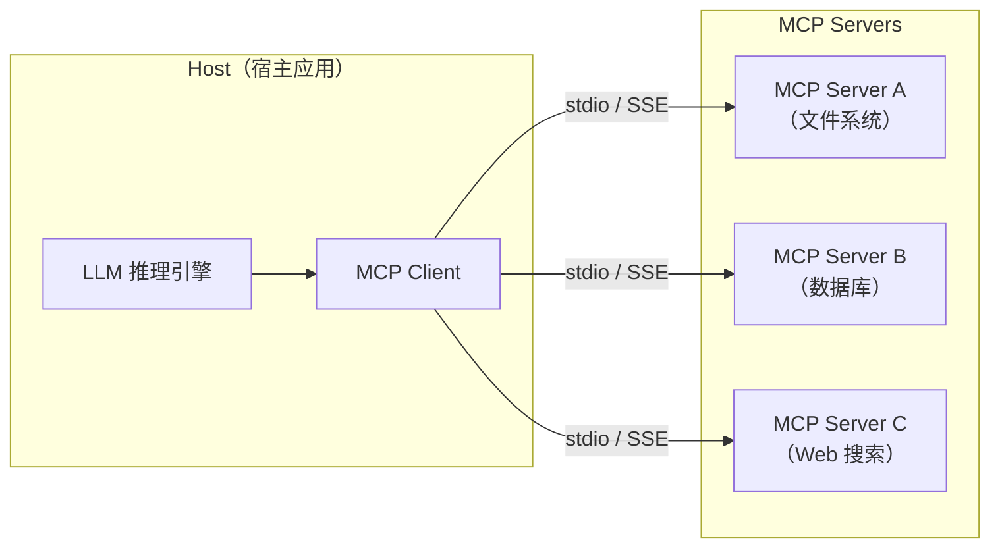
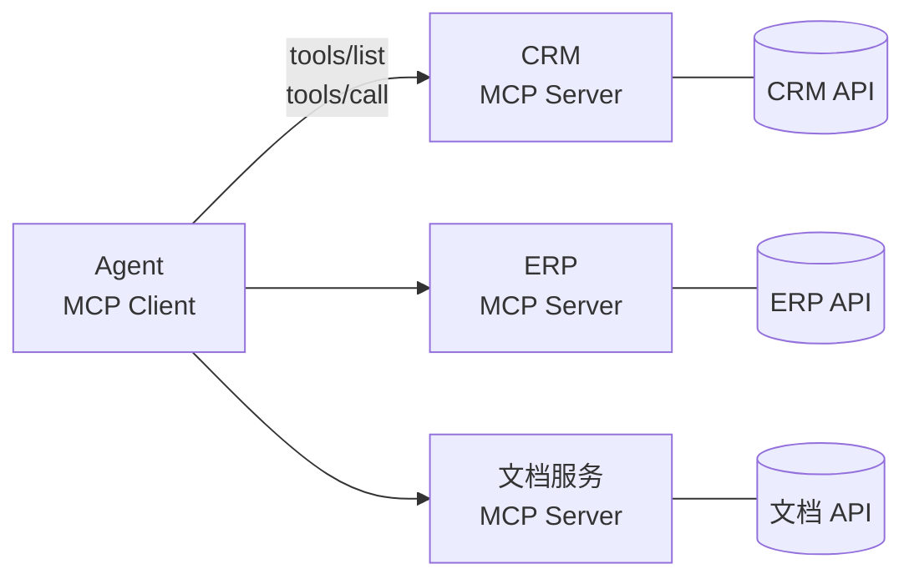

### MCP 的工作原理与使用场景

#### 基础题：MCP 是什么？它解决了什么问题？

**难度级别**：⭐（MCP基础概念）

MCP（Model Context Protocol）是 Anthropic 推出的工具调用标准化协议，核心目标是解决 Agent 工具生态的碎片化问题。传统方式下每个工具有不同的 API 格式、认证方式和错误处理逻辑，集成成本很高。MCP 定义了统一的工具发现、调用和错误处理格式，让 Agent 可以用同一套方式集成任意 MCP 兼容的工具。

---

#### 进阶题：请解释 MCP 的核心工作原理，与传统 API 调用相比有什么优势？在什么场景下应该使用 MCP？

**难度级别**：⭐⭐（MCP三组件架构、工具动态发现、与直接API调用的对比、适用场景）

**1️⃣ Common Answer**

MCP 是让 Agent 调用工具的协议，定义了标准接口，比直接调用 API 更统一。适合需要集成多个工具的场景，这样不用为每个工具单独写适配代码。

**2️⃣ Impressive Answer**

我会从3个角度思考这个问题：

1. **首先是核心架构**。MCP 由三个组件构成：MCP Client（Agent侧，负责连接Server、管理工具列表、发起调用）、MCP Server（工具侧，提供工具元数据、执行调用、返回结果）、MCP Protocol（标准化通信格式）。启动流程是：Client 连接 Server → Server 返回工具列表（含 name/description/parameters）→ LLM 选择工具 → Client 发起调用 → Server 执行并返回结果。

2. **其次是与直接 API 调用的核心差异**。直接调用 API 需要为每个工具单独开发适配器、手动维护工具列表、各自处理参数验证和错误格式；MCP 是一次集成支持所有 MCP 工具，工具列表动态发现无需手动维护，参数基于 JSON Schema 自动验证，错误格式统一处理。本质上 MCP 把工具集成的"一次性成本"变成了"一次投入、无限复用"。

3. **最后是适用场景**。MCP 特别适合：集成10个以上外部工具的企业级 Agent（大幅降低集成成本）、多个 Agent 共享同一工具库（Server 作为统一提供者，避免重复开发）、工具需要动态更新的场景（新增工具无需重启 Agent）。工具数量少且格式固定时，直接 API 调用反而更简单。


**3️⃣ Key Differences**

| 维度 | Common Answer | Impressive Answer |
| --- | --- | --- |
| 技术深度 | 只说"标准化协议" | 清楚说明 Client/Server/Protocol 三组件和通信流程 |
| 与API对比 | 只说"MCP更简单" | 从集成成本、工具发现、参数验证、可扩展性四个维度做对比 |
| 适用场景 | 只说"多工具集成" | 给出三个具体场景并说明选择 MCP 的理由 |
| 给面试官的印象 | 了解 MCP 的存在 | 理解 MCP 的设计原理，能在实际项目中合理选择使用时机 |

---

#### 进阶题：MCP 的三层架构（Host / Client / Server）是如何工作的？

**难度**：⭐⭐（MCP 架构、通信机制、各层职责）

**1️⃣ Common Answer**：

MCP 有三层，Host 是宿主应用比如 Claude Desktop，Client 是连接器，Server 是提供工具的服务。Host 通过 Client 连接到 Server，然后调用 Server 上的工具。通信方式有 stdio 和 HTTP 两种。

**2️⃣ Impressive Answer**：

MCP 的三层架构各司其职，理解清楚才能正确设计系统：



**各层职责**：

| 层级 | 职责 | 典型实现 |
| --- | --- | --- |
| **Host** | 宿主应用，管理 LLM 和 MCP Client 生命周期 | Claude Desktop、IDE 插件、自研 Agent |
| **Client** | 维护与 Server 的连接，转发工具调用请求 | MCP SDK 内置，通常无需自己实现 |
| **Server** | 暴露 Resources/Tools/Prompts，处理调用请求 | 开发者自己实现的工具服务 |

---

#### 进阶题：MCP 的工具调用和普通 HTTP API 调用有什么本质区别？

**难度**：⭐⭐（协议语义、工具发现、上下文感知、标准化程度）

**1️⃣ Common Answer**：

MCP 工具调用是通过 MCP 协议调用的，HTTP API 是直接发 HTTP 请求。MCP 有标准的工具描述格式，HTTP API 每家格式不一样。MCP 是给 AI 用的，HTTP API 是给人或程序用的。

**2️⃣ Impressive Answer**：

两者的本质区别在于**谁是调用方**以及**调用的语义层次**：

**HTTP API（为人/程序设计）**：

- 调用方知道要调用什么、参数是什么（硬编码）

- 接口文档给人看，人来决定如何调用

- 无自描述能力，调用方需要提前了解 API

**MCP Tool（为 LLM 设计）**：

- 调用方（LLM）不预先知道有哪些工具，通过 `tools/list` **动态发现**

- 工具描述（description）给 LLM 看，LLM 自主决定是否调用、如何调用

- 工具有**语义自描述**能力，LLM 能理解工具的用途和参数含义

```plaintext
HTTP API 调用流程：
开发者 → 查文档 → 硬编码调用 → 固定结果

MCP Tool 调用流程：
LLM → tools/list 发现工具 → 理解工具语义 → 自主决定调用 → 动态结果
```

**关键差异**：MCP 工具的 `description` 字段是**给 LLM 的自然语言说明**，这是 HTTP API 没有的概念。description 写得好不好，直接影响 LLM 能否正确选择和使用工具。

```java
// 好的 description（LLM 能准确理解）
@Tool(description = "查询指定城市的实时天气，支持中英文城市名，返回温度、湿度、天气状况")

// 差的 description（LLM 可能误用）
@Tool(description = "天气查询")
```

**3️⃣ Key Differences**

| 维度 | Common Answer | Impressive Answer |
| --- | --- | --- |
| 核心差异 | 只说了格式不同 | 指出"调用方是 LLM"的本质差异 |
| 技术深度 | 无 | 解释了动态发现和语义自描述 |
| 实践洞察 | 无 | 强调 description 质量的重要性 |
| 面试官印象 | 知道两者不同 | 理解 MCP 的设计哲学 |

---

#### 进阶题：如何在 SpringAI 中接入 MCP Server？动态工具发现是如何实现的？

**难度**：⭐⭐⭐（MCP Client 接入、动态工具发现、工具注入机制）

**1️⃣ Common Answer**：

在 SpringAI 里配置 MCP Client，指定 Server 的地址，然后就可以调用 Server 上的工具了。工具发现是自动的，框架会帮你获取工具列表。

**2️⃣ Impressive Answer**：

SpringAI 的 MCP Client 接入分三步：

**Step1：配置 MCP Client**

```yaml
spring:
  ai:
    mcp:
      client:
        # 配置多个 MCP Server
        servers:
          weather-server:
            transport: stdio
            command: java
            args: ["-jar", "/path/to/weather-mcp-server.jar"]
          database-server:
            transport: sse
            url: http://localhost:8081/mcp
```

**Step2：注入工具到 ChatClient**

```java
@Service
public class AgentService {

    private final ChatClient chatClient;

    public AgentService(ChatClient.Builder builder,
                        McpSyncClientCustomizer mcpCustomizer) {
        // MCP 工具自动注入到 ChatClient
        this.chatClient = builder
            .defaultAdvisors(new McpToolCallbackAdvisor(mcpCustomizer))
            .build();
    }

    public String chat(String userMessage) {
        return chatClient.prompt()
            .user(userMessage)
            .call()
            .content();
    }
}
```

**动态工具发现的原理**：

```plaintext
Agent 启动
  → MCP Client 连接所有配置的 Server
  → 调用每个 Server 的 tools/list 接口
  → 获取工具名称、描述、参数 Schema
  → 转换为 FunctionCallback 注册到 ChatClient
  → LLM 推理时，工具 Schema 自动注入 System Prompt
  → LLM 返回工具调用意图 → MCP Client 路由到对应 Server 执行
```

**动态发现的优势**：新增工具只需在 Server 端注册，Client 无需修改代码，下次连接自动发现。

**3️⃣ Key Differences**

| 维度 | Common Answer | Impressive Answer |
| --- | --- | --- |
| 实现深度 | 只说了配置 | 有完整的 YAML + Java 代码 |
| 原理理解 | 说"框架自动" | 解释了 tools/list 发现机制 |
| 工程价值 | 无 | 强调了动态发现的扩展性优势 |
| 面试官印象 | 用过 MCP | 理解 MCP 接入的完整链路 |

---

#### 进阶题：MCP Server 的三类能力（Resources/Tools/Prompts）有什么区别？

**难度**：⭐⭐（MCP 能力模型、使用场景、设计原则）

**1️⃣ Common Answer**：

Resources 是数据资源，Tools 是工具函数，Prompts 是提示词。Resources 用来读数据，Tools 用来执行操作，Prompts 是预定义的提示词模板。

**2️⃣ Impressive Answer**：

三类能力的核心区别在于**交互模式**：

**Resources（资源）**：只读的数据访问，类似文件系统

- 特点：无副作用，幂等，可缓存

- 示例：读取文件内容、查询数据库记录、获取 API 文档

```json
{
  "uri": "file:///project/README.md",
  "name": "项目说明文档",
  "mimeType": "text/markdown"
}
```

**Tools（工具）**：有副作用的操作执行，类似函数调用

- 特点：可能修改状态，需要权限控制

- 示例：发送邮件、写入文件、调用外部 API、执行 SQL

```json
{
  "name": "send_email",
  "description": "发送邮件给指定收件人",
  "inputSchema": {
    "type": "object",
    "properties": {
      "to": {"type": "string"},
      "subject": {"type": "string"},
      "body": {"type": "string"}
    }
  }
}
```

**Prompts（提示词模板）**：可复用的 Prompt 片段，支持参数化

- 特点：标准化常用 Prompt，减少重复编写

- 示例：代码审查模板、SQL 生成模板、翻译模板

```json
{
  "name": "code_review",
  "description": "代码审查提示词",
  "arguments": [
    {"name": "language", "description": "编程语言"},
    {"name": "code", "description": "待审查代码"}
  ]
}
```

**设计原则**：能用 Resources 就不用 Tools（减少副作用风险）；Prompts 适合团队共享标准化的 Prompt 资产。

**3️⃣ Key Differences**

| 维度 | Common Answer | Impressive Answer |
| --- | --- | --- |
| 区分维度 | 只说了用途 | 用"交互模式"和"副作用"来区分 |
| 代码示例 | 无 | 有三类能力的 JSON Schema 示例 |
| 设计原则 | 无 | 给出了选择建议 |
| 面试官印象 | 知道三类 | 能指导 MCP Server 设计 |

---

#### 进阶题：MCP 和 Function Calling 的本质区别是什么？

**难度**：⭐⭐⭐（协议层 vs 调用层、标准化程度、工具复用性）

**1️⃣ Common Answer**：

Function Calling 是 OpenAI 提出的，让模型调用函数。MCP 是 Anthropic 提出的，也是让模型调用工具。区别是 MCP 是一个标准协议，可以跨模型使用，而 Function Calling 是 OpenAI 特有的格式。MCP 更通用。

**2️⃣ Impressive Answer**：

两者的区别不是"谁提出的"，而是**所处的抽象层次不同**：

**Function Calling 是"调用约定"**（Call Convention）：

- 定义了模型如何描述工具（JSON Schema）和如何返回调用意图

- 每个模型厂商格式不同（OpenAI、Claude、Gemini 各有差异）

- 工具实现和模型强绑定，换模型要改代码

**MCP 是"通信协议"**（Communication Protocol）：

- 定义了 Client 和 Server 之间的完整通信规范（发现、调用、响应）

- 工具实现一次，任何支持 MCP 的模型都能用

- 工具和模型完全解耦

**类比**：

```plaintext
Function Calling ≈ 每家餐厅有自己的点餐方式（有的用 App，有的用纸质菜单）
MCP ≈ 统一的外卖平台协议（美团/饿了么），餐厅接入一次，所有平台都能点
```

**实际影响**：

| 对比维度 | Function Calling | MCP |
| --- | --- | --- |
| 工具复用性 | 低（绑定特定模型/框架） | 高（跨模型、跨框架） |
| 工具发现 | 静态（代码里写死） | 动态（运行时 tools/list 发现） |
| 工具生态 | 碎片化 | 统一生态（MCP Server 市场） |
| 实现复杂度 | 低（直接写函数） | 中（需要实现 MCP Server） |
| 适用场景 | 单模型、快速开发 | 多模型、工具复用、企业级 |

**结论**：MCP 不是替代 Function Calling，而是在其上层提供了标准化的工具生态层。底层仍然依赖模型的 Function Calling 能力来触发工具调用。

**3️⃣ Key Differences**

| 维度 | Common Answer | Impressive Answer |
| --- | --- | --- |
| 核心洞察 | 只说了谁提出的 | 指出"抽象层次不同"是本质 |
| 类比能力 | 无 | 用餐厅/外卖平台类比，易于理解 |
| 技术深度 | 概念层面 | 有详细的对比表格 |
| 面试官印象 | 知道两者 | 理解两者的关系和定位 |

---

---

---

#### 场景题：MCP 工具调用的权限控制和安全设计如何做？

**难度**：⭐⭐⭐（工具权限、沙箱隔离、审计日志、最小权限原则）

**1️⃣ Common Answer**：

可以在工具执行前做权限校验，检查用户是否有权限调用这个工具。敏感操作要加审计日志，记录谁在什么时候调用了什么工具。

**2️⃣ Impressive Answer**：

MCP 工具的安全设计需要**纵深防御**，从三个层次来考虑：

**1. 工具级权限控制**

```java
@Component
public class McpToolSecurityInterceptor {

    public ToolResult intercept(ToolCall call, ToolExecutor executor) {
        // 工具白名单：只允许调用预定义的工具
        if (!allowedTools.contains(call.getToolName())) {
            return ToolResult.error("工具未授权：" + call.getToolName());
        }

        // 参数安全校验：防止注入攻击
        validateParams(call.getParams());

        // 执行工具
        ToolResult result = executor.execute(call);

        // 审计日志
        auditLogger.log(AuditEvent.builder()
            .toolName(call.getToolName())
            .params(call.getParams())
            .result(result.isSuccess() ? "SUCCESS" : "FAILED")
            .timestamp(Instant.now())
            .build());

        return result;
    }
}
```

**2. 沙箱隔离**

- 文件系统工具：限制访问路径（只允许访问指定目录）

- 代码执行工具：在容器/JVM 沙箱中运行，限制网络和文件访问

- 数据库工具：使用只读账号，或限制可操作的表

**3. 人工确认机制（Human-in-the-Loop）**
高风险操作（删除数据、发送邮件、转账）在执行前暂停，等待人工确认：

```java
if (tool.getRiskLevel() == RiskLevel.HIGH) {
    String confirmationToken = humanApprovalService.requestApproval(call);
    // 等待人工确认，超时则拒绝
    boolean approved = humanApprovalService.waitForApproval(confirmationToken, Duration.ofMinutes(5));
    if (!approved) return ToolResult.error("操作被拒绝或超时");
}
```

**最小权限原则**：每个 MCP Server 只暴露完成任务所需的最小工具集，避免过度授权。

**3️⃣ Key Differences**

| 维度 | Common Answer | Impressive Answer |
| --- | --- | --- |
| 防御层次 | 单层（权限校验） | 三层（权限+沙箱+人工确认） |
| 代码深度 | 无 | 有拦截器和审计日志实现 |
| 安全思维 | 被动防御 | 纵深防御 + 最小权限原则 |
| 面试官印象 | 知道要做权限 | 能设计企业级安全方案 |

---

#### 场景题：如何用 Java 实现一个 MCP Server？

**难度**：⭐⭐⭐（MCP Server 实现、工具注册、参数 Schema 定义）

**1️⃣ Common Answer**：

可以用 MCP 的 Java SDK 来实现，定义工具的名称、描述和参数，然后实现工具的执行逻辑，最后启动 Server 监听请求。

**2️⃣ Impressive Answer**：

用 Spring AI 的 MCP Server 支持（`spring-ai-mcp-server`）实现最为简洁：

**Step1：添加依赖**

```xml
<dependency>
    <groupId>org.springframework.ai</groupId>
    <artifactId>spring-ai-mcp-server-spring-boot-starter</artifactId>
</dependency>
```

**Step2：实现工具**

```java
@Service
public class WeatherMcpServer {

    // 用 @Tool 注解声明 MCP Tool
    @Tool(description = "查询指定城市的实时天气信息")
    public WeatherInfo getWeather(
            @ToolParam(description = "城市名称，如：北京、上海") String city,
            @ToolParam(description = "温度单位：celsius 或 fahrenheit", required = false)
            String unit) {

        // 实际调用天气 API
        return weatherApiClient.query(city, unit != null ? unit : "celsius");
    }

    // 声明 MCP Resource
    @Resource(uri = "weather://cities/list", description = "支持查询的城市列表")
    public String getCityList() {
        return String.join(",", supportedCities);
    }
}
```

**Step3：配置启动方式**

```yaml
spring:
  ai:
    mcp:
      server:
        transport: stdio   # 本地工具用 stdio，远程服务用 sse
        name: weather-mcp-server
        version: 1.0.0
```

**Step4：工具发现流程**

```plaintext
Client 连接 → 调用 initialize → 调用 tools/list → 获取所有工具 Schema
→ 注入 LLM System Prompt → LLM 按需调用 → Server 执行并返回结果
```

**关键设计点**：

- 工具描述（description）要清晰，这是 LLM 选择工具的依据

- 参数 Schema 要精确，减少 LLM 参数生成错误

- 工具执行要有超时和错误处理

**3️⃣ Key Differences**

| 维度 | Common Answer | Impressive Answer |
| --- | --- | --- |
| 实现深度 | 只说了步骤 | 有完整的代码实现 |
| 框架选择 | 无 | 使用 Spring AI MCP 注解式开发 |
| 工程细节 | 无 | 提到描述质量影响 LLM 选择工具 |
| 面试官印象 | 知道怎么做 | 能直接上手实现 |

---

### 如何开发和部署自定义的 MCP Server

#### 基础题：MCP Server 最核心的两个接口是什么？

**难度级别**：⭐（MCP Server 接口基础）

MCP Server 最核心的两个接口是 `tools/list` 和 `tools/call`。`tools/list` 返回 Server 提供的所有工具元数据（name、description、inputSchema），让 Agent 知道有哪些工具可用；`tools/call` 负责执行具体的工具调用并返回结果。其余接口（resources/list、prompts/list 等）是可选的，按需实现。

---

#### 进阶题：请介绍如何开发一个自定义的 MCP Server？部署时需要注意什么？如何调试？

**难度级别**：⭐⭐⭐（核心接口、开发流程、部署方式、调试工具）

**1️⃣ Common Answer**

开发 MCP Server 要实现工具列表和工具调用接口，用官方 SDK 比较方便。部署可以本地或远程，看需求。调试用官方调试工具或者看日志。

**2️⃣ Impressive Answer**

我会从3个角度思考这个问题：

1. **首先是开发流程**。用 Python MCP SDK 开发，核心是用 `@app.tool()` 装饰器定义工具，装饰器里写清楚 name、description 和 inputSchema（JSON Schema 格式）。工具函数本身就是普通的 async 函数，返回 TextContent 或 structured result。SDK 会自动把这些工具注册到 `tools/list` 和 `tools/call` 接口上。

```python
from mcp.server import Server
from mcp.types import Tool, TextContent

app = Server("my-server")

@app.tool()
async def query_customer(customer_id: str) -> TextContent:
    """根据ID查询客户信息"""
    result = await db.query(customer_id)
    return TextContent(type="text", text=str(result))
```

2. **其次是部署方式的选择**。本地部署走 stdio 传输，Agent 和 Server 在同一台机器，延迟低、安全性高，适合开发和单机场景；远程部署走 HTTP，适合多 Agent 共享工具的场景，需要额外处理认证、限流和网络问题。生产环境远程部署必须配置认证防止未授权访问，并做好限流和熔断保护 Server。

3. **最后是调试**。官方提供 MCP Inspector 工具，可以连接 Server 查看工具列表、测试单个工具调用、查看完整的请求响应日志。调试时重点测试边界情况：空参数、超大参数、错误类型参数，确保 Server 的错误处理逻辑符合 MCP 协议规范。

**3️⃣ Key Differences**

| 维度 | Common Answer | Impressive Answer |
| --- | --- | --- |
| 核心接口 | 只说"几个接口" | 明确 tools/list 和 tools/call 是核心，其余可选 |
| 开发方式 | 只说"用SDK" | 给出装饰器定义工具的具体写法和结构 |
| 部署选择 | 只说"本地或远程" | 说明两种方式的优缺点和适用场景，指出远程部署的安全要求 |
| 调试手段 | 只说"看日志" | MCP Inspector + 边界用例测试的完整调试方法 |
| 给面试官的印象 | 了解 MCP Server 概念 | 有完整的从开发到部署的实践经验 |

---

#### 场景题：开发了一个 MCP Server 提供数据库查询工具，上线后 Agent 调用响应很慢，如何排查优化？

**难度级别**：⭐⭐⭐（性能排查、工具链路分析、MCP Server 优化）

**1️⃣ Common Answer**

可能是数据库查询慢，加个索引或者缓存。也可能是网络延迟，看看网络情况。

**2️⃣ Impressive Answer**

分三段排查：第一段是 MCP 调用链路，用 MCP Inspector 记录 tools/call 的端到端耗时，判断瓶颈在网络传输还是 Server 内部处理；第二段是 Server 内部，在工具函数里加计时日志，分离出"数据库查询耗时"和"结果序列化耗时"；第三段是数据库层，检查查询是否命中索引、是否有 N+1 查询问题。找到瓶颈后针对性优化：查询慢加索引或查询缓存（对相同参数的查询结果缓存一段时间）；序列化慢优化返回数据结构、减少不必要字段；网络延迟高把 Server 部署在离 Agent 更近的位置或改用 stdio 本地通信。

**3️⃣ Key Differences**

| 维度 | Common Answer | Impressive Answer |
| --- | --- | --- |
| 排查思路 | 猜测瓶颈 | 分段拆解链路，定位到具体瓶颈 |
| 优化方向 | 只想到索引和缓存 | 查询优化 + 序列化优化 + 部署优化多维度 |
| 工具使用 | 未提及 | MCP Inspector + 埋点日志定量分析 |

---

#### 容易一起考的题

| 关联题 | 和本题的关系 |
| --- | --- |
| MCP 的 transport 有哪些类型？各自适用什么场景？ | 部署方式的底层机制，stdio vs HTTP 的选择依据 |
| 如何给 MCP 工具的描述写得更好，让 LLM 更准确地选用？ | 工具的 description 和 inputSchema 质量直接影响 LLM 的工具选择准确率 |
| 如何对 MCP Server 做认证和权限控制？ | 远程部署 MCP Server 的安全必要条件 |

---

**两种通信方式**：

- **stdio**：本地进程间通信，Server 作为子进程启动，适合本地工具（文件系统、本地数据库）

- **SSE（Server-Sent Events）**：HTTP 长连接，适合远程服务、云端工具

**关键流程**：

```plaintext
1. Host 启动时，MCP Client 连接所有配置的 Server
2. Client 调用 tools/list 获取所有可用工具的 Schema
3. LLM 推理时，工具 Schema 注入 System Prompt
4. LLM 决定调用某工具 → Client 转发到对应 Server → 返回结果
```

**3️⃣ Key Differences**

| 维度 | Common Answer | Impressive Answer |
| --- | --- | --- |
| 架构理解 | 只说了三层名称 | 清晰描述了各层职责和交互流程 |
| 可视化 | 无 | 有 mermaid 架构图 |
| 技术细节 | 只提到通信方式 | 解释了工具发现（tools/list）机制 |
| 面试官印象 | 知道概念 | 能设计 MCP 接入方案 |

---

#### 场景题：如何设计一个支持多租户的 MCP Server？

**难度**：⭐⭐⭐（多租户隔离、上下文传递、权限控制、数据隔离）

**1️⃣ Common Answer**：

多租户就是多个用户共用一个 MCP Server，需要做数据隔离。可以在工具调用时传入租户 ID，根据租户 ID 查询对应的数据。权限控制也要按租户来做。

**2️⃣ Impressive Answer**：

多租户 MCP Server 的核心挑战是**在无状态协议上实现有状态的租户隔离**，需要从三个层次设计：

**1. 身份认证（Who am I？）**
MCP 协议本身不包含认证，需要在传输层注入租户信息：

```java
// SSE 传输：通过 HTTP Header 传递租户信息
@Component
public class McpTenantFilter implements Filter {
    @Override
    public void doFilter(ServletRequest request, ServletResponse response, FilterChain chain) {
        HttpServletRequest httpRequest = (HttpServletRequest) request;
        String tenantId = httpRequest.getHeader("X-Tenant-Id");
        String token = httpRequest.getHeader("Authorization");

        // 验证 token 并绑定租户上下文
        TenantContext.set(tenantService.authenticate(tenantId, token));
        try {
            chain.doFilter(request, response);
        } finally {
            TenantContext.clear();  // 防止线程污染
        }
    }
}
```

**2. 数据隔离（What can I see？）**

```java
@Tool(description = "查询当前租户的订单列表")
public List<Order> listOrders(
        @ToolParam(description = "页码") int page,
        @ToolParam(description = "每页数量") int size) {

    // 自动注入当前租户 ID，不允许跨租户查询
    String tenantId = TenantContext.get().getTenantId();
    return orderRepository.findByTenantId(tenantId, PageRequest.of(page, size));
}
```

**3. 工具权限（What can I do？）**
不同租户可能有不同的工具权限（如免费版 vs 企业版）：

```java
@Component
public class TenantAwareToolFilter {
    public List<ToolDefinition> filterTools(List<ToolDefinition> allTools, String tenantId) {
        TenantPlan plan = tenantService.getPlan(tenantId);
        return allTools.stream()
            .filter(tool -> plan.hasPermission(tool.getName()))
            .toList();
    }
}
```

**3️⃣ Key Differences**

| 维度 | Common Answer | Impressive Answer |
| --- | --- | --- |
| 设计层次 | 只说了传 ID | 认证+数据隔离+工具权限三层设计 |
| 代码深度 | 无 | 有完整的多租户实现 |
| 工程细节 | 无 | 注意到 ThreadLocal 清理防止线程污染 |
| 面试官印象 | 知道要隔离 | 能设计企业级多租户方案 |

#### 场景题：公司有一套内部系统（CRM、ERP、文档服务），需要让 Agent 能调用，如何设计接入方案？

**难度级别**：⭐⭐（MCP Server 设计、工具发现、安全认证）

**1️⃣ Common Answer**

可以为每个系统写一个工具函数，然后注册到 Agent 里。或者用 MCP 把这些系统包装成工具。

**2️⃣ Impressive Answer**

推荐用 MCP 方案：为 CRM、ERP、文档服务分别实现一个 MCP Server，每个 Server 暴露该系统的核心操作作为 tool（比如 CRM 的 `query_customer`、`update_contact`）。Agent 侧用 MCP Client 统一接入所有 Server，动态获取工具列表。这样的好处是：各系统团队各自维护自己的 MCP Server，Agent 侧无需改动即可感知工具更新；内网部署走 stdio 传输，延迟低；认证在 Server 层统一处理，Agent 不需要管各系统的鉴权细节。后续新增系统只需新增一个 MCP Server，扩展成本极低。



**3️⃣ Key Differences**

| 维度 | Common Answer | Impressive Answer |
| --- | --- | --- |
| 架构思路 | 每个系统写工具函数 | MCP Server 隔离各系统，Agent 统一接入 |
| 可维护性 | 工具变化需改 Agent 代码 | 各系统独立维护 Server，Agent 自动感知 |
| 扩展性 | 新增系统要改 Agent | 新增 MCP Server 即可，Agent 侧零改动 |

---

#### 容易一起考的题

| 关联题 | 和本题的关系 |
| --- | --- |
| Function Calling 和 MCP 有什么区别？ | Function Calling 是 LLM 侧的工具调用机制，MCP 是工具集成的标准化协议，两者互补 |
| 如何实现工具的动态注册与发现？ | MCP 动态发现机制的核心价值，对比静态工具注册的局限性 |
| Agent 如何处理工具调用的认证与授权？ | MCP Server 层统一处理认证，是 MCP 相比直接 API 调用的重要优势 |
