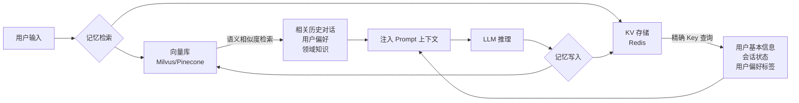
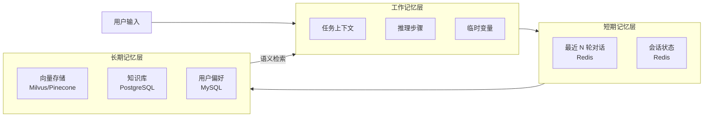
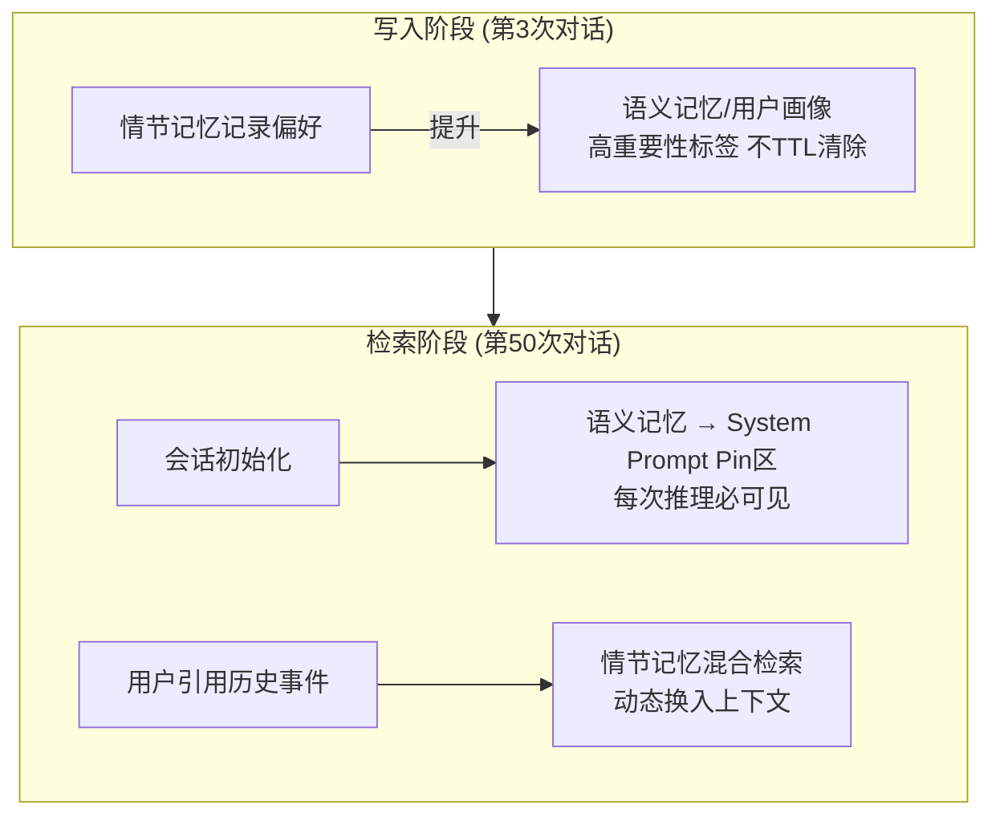
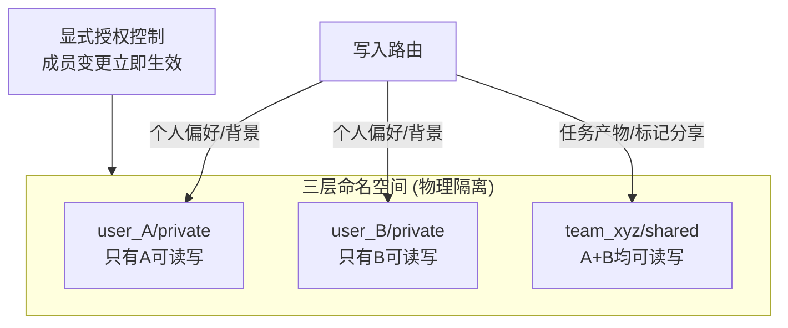

# 记忆管理

### 8.1 记忆架构基础

#### Agent 记忆的四层架构与各层职责

##### 1、基础题：有哪种记忆，对应到 AI Agent 中分别是什么？

**难度级别**：⭐

Agent 的记忆系统借鉴人类认知模型，分为三种类型：

<table>
<tr>
<td>
维度
</td>
<td>
短期记忆
</td>
<td>
长期记忆
</td>
<td>
工作记忆
</td>
</tr>
<tr>
<td>
<strong>存储位置</strong>
</td>
<td>
对话上下文（Context Window）
</td>
<td>
向量数据库 / 知识库
</td>
<td>
当前活跃的上下文
</td>
</tr>
<tr>
<td>
<strong>容量</strong>
</td>
<td>
有限（几万 Token）
</td>
<td>
海量（GB/TB 级）
</td>
<td>
极小（几 KB）
</td>
</tr>
<tr>
<td>
<strong>持久化</strong>
</td>
<td>
会话级，断开即丢失
</td>
<td>
永久存储
</td>
<td>
临时性，任务结束清空
</td>
</tr>
<tr>
<td>
<strong>访问速度</strong>
</td>
<td>
最快（毫秒级）
</td>
<td>
较慢（秒级，需检索）
</td>
<td>
最快（内存）
</td>
</tr>
<tr>
<td>
<strong>存储内容</strong>
</td>
<td>
当前对话历史
</td>
<td>
历史经验、知识、偏好
</td>
<td>
当前任务相关信息
</td>
</tr>
<tr>
<td>
<strong>检索方式</strong>
</td>
<td>
直接访问
</td>
<td>
语义检索 / 关键词匹配
</td>
<td>
直接引用
</td>
</tr>
<tr>
<td>
<strong>典型实现</strong>
</td>
<td>
Chat History
</td>
<td>
Vector DB（Milvus/Pinecone）
</td>
<td>
Context Variables
</td>
</tr>
</table>

**三种记忆的协作流程：**

```
用户输入
  ↓
工作记忆（提取当前任务相关信息）
  ↓
短期记忆（查看最近对话上下文）
  ↓
长期记忆（检索历史经验和知识）
  ↓
综合决策 → 生成回复
  ↓
更新短期记忆（追加到对话历史）
  ↓
选择性更新长期记忆（重要信息持久化）
```

**设计原则**：
- **短期记忆**：保持最近 N 轮对话，用于维持对话连贯性
- **长期记忆**：存储用户偏好、历史任务结果、领域知识
- **工作记忆**：临时存储当前任务的中间结果、推理步骤

---

##### 2、进阶题：AI Agent 记忆系统的四层架构各层的职责与存储介质是什么？

**难度级别**：⭐⭐（感知/工作/情节/语义记忆的职责、存储介质、工程取舍）

**1️⃣ Common Answer**

重点总结（便于面试记忆）：
- 感知记忆是即时输入层
- 工作记忆是 LLM 当前可见的全部信息
- 情节记忆是跨会话的历史存档
- 语义记忆是稳定的背景知识层

**2️⃣ Impressive Answer**

从四层的职责、存储介质和核心工程挑战三个角度来回答：
1. **感知记忆是即时输入层**。对应当前请求的原始输入（文字、图片、文件），生命周期只有一次推理步骤，存在内存变量里，不做持久化。工程重点是输入预处理质量，比如图片的 base64 编码、文档的分块提取。
1. **工作记忆是 LLM 当前可见的全部信息**。包括 System Prompt、消息历史、工具调用结果，受模型 Token 上限约束（GPT-4o 128K、Claude 200K），存在内存的 `List[Message]` 里动态维护。这层是成本和效果的核心矛盾点——窗口越大越完整，但推理成本越高。
1. **情节记忆是跨会话的历史存档**。记录对话片段、任务结果、关键决策，生命周期跨会话，存在 PostgreSQL 或 MongoDB 里，通过对话 ID、时间戳等结构化字段检索。工程难点在于数据 Schema 设计和"哪些情节值得保留"的筛选策略。
1. **语义记忆是稳定的背景知识层**。存储用户画像、领域知识库、Agent 学到的通用规律，用向量数据库（pgvector、Weaviate）或图数据库（Neo4j）支撑语义检索。难点在于知识的更新策略：过时知识如何淘汰、新知识如何增量写入。

四层协同工作：感知层输入进工作记忆，工作记忆满了触发情节记忆读写，语义记忆作为背景知识按需注入——这是构建有状态 Agent 的基础。

**3️⃣ Key Differences**

<table>
<tr>
<td>
维度
</td>
<td>
Common Answer
</td>
<td>
Impressive Answer
</td>
</tr>
<tr>
<td>
概念深度
</td>
<td>
停留在&quot;是什么&quot;，四层定义正确但浅
</td>
<td>
解释了各层的工程取舍、性能开销和设计约束
</td>
</tr>
<tr>
<td>
存储介质
</td>
<td>
笼统说&quot;数据库和向量库&quot;
</td>
<td>
精确到具体技术选型（PostgreSQL/pgvector/Neo4j）并说明原因
</td>
</tr>
<tr>
<td>
工程视角
</td>
<td>
无
</td>
<td>
点出每层的核心工程挑战，如窗口成本、知识更新策略
</td>
</tr>
<tr>
<td>
给面试官的印象
</td>
<td>
能答出四层定义，基础扎实
</td>
<td>
对记忆系统有系统性理解，有落地经验
</td>
</tr>
</table>

---

##### 进阶题：Agent 的长期记忆如何设计？向量库和 KV 存储如何配合？

**难度**：⭐⭐⭐（长期记忆架构、语义检索 vs 精确检索、存储选型）

**1️⃣ Common Answer**：

重点总结（便于面试记忆）：
- 向量库：Milvus（自建）、Pinecone（云服务）、pgvector（PostgreSQL 扩展，轻量）
- KV 存储：Redis（高性能）、DynamoDB（云原生）
- 双存储架构
- 实现方案
- 存储选型建议

**2️⃣ Impressive Answer**：

长期记忆的核心设计是**双存储架构**：向量库负责语义检索，KV 存储负责精确检索，两者互补：



**实现方案**：

```java
@Service
public class LongTermMemoryService {

    private final VectorStore vectorStore;      // 语义检索
    private final RedisTemplate<String, Object> redisTemplate;  // 精确检索

    // 记忆写入：对话结束后异步存储
    @Async
    public void saveMemory(String userId, Conversation conversation) {
        // 1. 提取关键信息（用 LLM 摘要）
        MemoryItem memory = memoryExtractor.extract(conversation);

        // 2. 向量化存储（用于语义检索）
        vectorStore.add(List.of(new Document(
            memory.getSummary(),
            Map.of("userId", userId, "timestamp", Instant.now().toString())
        )));

        // 3. 结构化信息存 Redis（用于精确检索）
        if (memory.hasUserPreferences()) {
            String key = "user:preferences:" + userId;
            redisTemplate.opsForHash().putAll(key, memory.getPreferences());
        }
    }

    // 记忆检索：对话开始时加载
    public MemoryContext loadMemory(String userId, String currentQuery) {
        // 语义检索：找相关历史
        List<Document> semanticMemories = vectorStore.similaritySearch(
            SearchRequest.query(currentQuery)
                .withFilterExpression("userId == '" + userId + "'")
                .withTopK(5)
        );

        // 精确检索：加载用户画像
        Map<Object, Object> userProfile = redisTemplate.opsForHash()
            .entries("user:preferences:" + userId);

        return MemoryContext.of(semanticMemories, userProfile);
    }
}
```

**存储选型建议**：
- 向量库：Milvus（自建）、Pinecone（云服务）、pgvector（PostgreSQL 扩展，轻量）
- KV 存储：Redis（高性能）、DynamoDB（云原生）

**3️⃣ Key Differences**

<table>
<tr>
<td>
维度
</td>
<td>
Common Answer
</td>
<td>
Impressive Answer
</td>
</tr>
<tr>
<td>
架构设计
</td>
<td>
只说了向量库
</td>
<td>
双存储架构，语义+精确互补
</td>
</tr>
<tr>
<td>
代码实现
</td>
<td>
无
</td>
<td>
有完整的读写实现
</td>
</tr>
<tr>
<td>
存储选型
</td>
<td>
无
</td>
<td>
给出了具体选型建议
</td>
</tr>
<tr>
<td>
面试官印象
</td>
<td>
知道用向量库
</td>
<td>
能设计完整的记忆系统
</td>
</tr>
</table>

---

##### 进阶题：如何设计一个高效的对话记忆管理系统？

**难度**：⭐⭐⭐（记忆存储、检索策略、淘汰机制、一致性）

1️⃣ **Common Answer**：

重点总结（便于面试记忆）：
- 分层记忆架构
- 多模态检索策略
- 智能淘汰机制
- 一致性保障
- 分层记忆架构设计
- 完整实现示例（基于 LangChain4J）

2️⃣ **Impressive Answer**：

设计高效的对话记忆管理系统需要构建**分层记忆架构**，结合**多模态检索策略**、**智能淘汰机制**和**一致性保障**。

**分层记忆架构设计：**



**完整实现示例（基于 LangChain4J）：**

```java
@Service
public class ConversationMemoryManager {

    private final RedisTemplate<String, Object> redisTemplate;
    private final EmbeddingStore<LongTermMemory> vectorStore;
    private final LongTermMemoryRepository memoryRepository;
    private static final int MAX_RECENT_MESSAGES = 20;

    // 添加消息到短期记忆
    public void addToShortTerm(String sessionId, ChatMessage message) {
        String key = "memory:short:" + sessionId;
        redisTemplate.opsForList().rightPush(key, message);
        redisTemplate.opsForList().trim(key, -MAX_RECENT_MESSAGES, -1);
        // 异步评估是否需要持久化到长期记忆
        asyncWriter.submit(() -> {
            if (shouldPersistToLongTerm(message)) {
                persistToLongTerm(sessionId, message);
            }
        });
    }

    // 检索相关记忆（混合策略）
    public List<ChatMessage> retrieveRelevantMemories(
            String sessionId, String query, int topK) {
        // 1. 工作记忆（当前上下文）
        List<ChatMessage> workingMemory = getWorkingMemory(sessionId);
        // 2. 短期记忆（最近对话）
        List<ChatMessage> shortTerm = getRecentMessages(sessionId);
        // 3. 长期记忆（语义检索）
        List<LongTermMemory> longTerm = vectorStore
            .findRelevant(query, sessionId, topK);

        // 融合排序（时间衰减 + 相关性）
        List<MemoryWithScore> allMemories = new ArrayList<>();
        workingMemory.forEach(msg ->
            allMemories.add(new MemoryWithScore(msg, 1.0)));
        shortTerm.forEach(msg ->
            allMemories.add(new MemoryWithScore(msg, 0.8)));
        longTerm.forEach(mem ->
            allMemories.add(new MemoryWithScore(
                mem.toChatMessage(), mem.getRelevanceScore())));

        return allMemories.stream()
            .sorted(Comparator.comparing(MemoryWithScore::getScore).reversed())
            .limit(topK)
            .map(MemoryWithScore::getMessage)
            .collect(Collectors.toList());
    }

    // 智能淘汰策略 - 多维度评分
    private double calculateMemoryScore(LongTermMemory memory) {
        double score = 0;
        // 时间衰减（越新越重要）
        long daysOld = ChronoUnit.DAYS.between(memory.getTimestamp(), LocalDateTime.now());
        score += Math.exp(-daysOld / 30.0) * 0.3;
        // 访问频率（被访问过多次更重要）
        score += Math.log1p(memory.getAccessCount()) * 0.3;
        // 内容重要性
        score += calculateContentImportance(memory) * 0.2;
        // 用户反馈
        score += memory.getUserFeedback() * 0.2;
        return score;
    }
}
```

**核心设计要点：**
1. **分层存储**：工作记忆（内存）→ 短期记忆（Redis）→ 长期记忆（向量库 + 关系库）
1. **混合检索策略**：向量检索（语义相似度）+ 关键词检索（BM25）+ 时间加权，使用 RRF 融合
1. **智能淘汰机制**：多维度评分（时间衰减 + 访问频率 + 内容重要性 + 用户反馈）
1. **一致性保障**：异步写入 + 指数退避重试（最多 3 次）+ 最终一致性

3️⃣ **Key Differences**

<table>
<tr>
<td>
维度
</td>
<td>
Common Answer
</td>
<td>
Impressive Answer
</td>
</tr>
<tr>
<td>
技术深度
</td>
<td>
简单描述，无具体实现
</td>
<td>
系统性设计，完整 Java 代码可直接落地
</td>
</tr>
<tr>
<td>
架构思维
</td>
<td>
单一存储，无分层设计
</td>
<td>
三层记忆架构，职责清晰
</td>
</tr>
<tr>
<td>
检索策略
</td>
<td>
仅提到向量检索
</td>
<td>
混合检索（向量 + 关键词 + 时间）+ RRF 融合
</td>
</tr>
<tr>
<td>
淘汰机制
</td>
<td>
简单 LRU，无评分逻辑
</td>
<td>
多维度评分（时间、频率、重要性、反馈）
</td>
</tr>
</table>

---

##### 场景题：记忆爆炸问题：如何在有限 Token 下保留关键信息？

**难度**：⭐⭐⭐（Token 优化、信息压缩、重要性评估、选择性遗忘）

1️⃣ **Common Answer**：

重点总结（便于面试记忆）：
- 上下文压缩：侧重单轮对话的上下文窗口管理，解决 Token 限制问题
- 本题记忆压缩：侧重长期记忆系统的信息保留策略，解决记忆爆炸问题
- 核心差异：3.2 是"空间压缩"（减少 Token 占用），本题是"时间压缩"（长期信息筛选）

2️⃣ **Impressive Answer**：

记忆爆炸问题的本质是**信息密度 vs Token 预算的权衡**。这道题和 3.2 的上下文压缩不同：3.2 侧重单轮对话的上下文窗口管理，而本题侧重长期记忆系统的信息保留策略。

**记忆压缩架构：**

```mermaid
graph LR
    IncomingMessages[新消息]

    subgraph ImportanceAssessment[重要性评估]
        ContentAnalyzer[内容分析器]
        UserFeedback[用户反馈]
        AccessPattern[访问模式]
        TimeDecay[时间衰减]
    end

    subgraph CompressionStrategy[压缩策略]
        SemanticSummary[语义摘要]
        KeyExtraction[关键信息提取]
        Clustering[聚类去重]
        TokenBudget[Token 预算分配]
    end

    subgraph SelectiveForgetting[选择性遗忘]
        LowPriority[低优先级淘汰]
        Redundant[冗余信息合并]
        Outdated[过时信息清理]
    end

    IncomingMessages --> ImportanceAssessment
    ImportanceAssessment --> CompressionStrategy
    CompressionStrategy --> SelectiveForgetting
    SelectiveForgetting --> CompressedMemory[压缩后记忆]
```



**完整实现示例：**

```java
@Service
public class MemoryCompressionService {

    private final ChatLanguageModel summaryModel;
    private final ImportanceEvaluator importanceEvaluator;
    private static final int MAX_TOKENS = 8000;
    private static final int COMPRESSION_THRESHOLD = 6000;
    private static final double IMPORTANCE_THRESHOLD = 0.3;

    // 压缩对话记忆 - 多阶段策略
    public List<ChatMessage> compressConversationMemory(
            List<ChatMessage> messages) {
        int currentTokens = estimateTokens(messages);
        if (currentTokens <= COMPRESSION_THRESHOLD) {
            return messages;
        }
        // 阶段 1: 重要性评估
        List<MemoryWithImportance> scoredMemories = importanceEvaluator
            .evaluateAll(messages);
        scoredMemories.sort(Comparator.comparing(
            MemoryWithImportance::getImportance).reversed());
        // 阶段 2: 选择性保留
        List<ChatMessage> selected = scoredMemories.stream()
            .filter(mem -> mem.getImportance() >= IMPORTANCE_THRESHOLD)
            .map(MemoryWithImportance::getMessage)
            .collect(Collectors.toList());
        // 阶段 3: 语义压缩（对历史消息分组摘要）
        List<ChatMessage> compressed = compressSemantically(selected);
        // 阶段 4: Token 预算检查
        if (estimateTokens(compressed) > MAX_TOKENS) {
            return aggressiveCompress(compressed);
        }
        return compressed;
    }

    // 重要性评估 - 多维度评分
    private double evaluateImportance(ChatMessage message) {
        double score = 0;
        // 1. 内容重要性（LLM 评分，权重 0.4）
        score += evaluateContentImportance(message) * 0.4;
        // 2. 用户交互强度（追问、澄清等，权重 0.2）
        score += evaluateInteractionIntensity(message) * 0.2;
        // 3. 信息新颖度（是否包含新实体/概念，权重 0.2）
        score += evaluateNovelty(message) * 0.2;
        // 4. 时间衰减（指数衰减，24h 半衰期，权重 0.1）
        long hoursOld = getHoursSinceMessage(message);
        score += Math.exp(-hoursOld / 24.0) * 0.1;
        // 5. 访问频率（被引用次数，权重 0.1）
        score += Math.min(1.0, getAccessCount(message) * 0.3) * 0.1;
        return score;
    }

    // 语义压缩 - 保留近期 + 历史摘要
    private List<ChatMessage> compressSemantically(List<ChatMessage> messages) {
        List<ChatMessage> compressed = new ArrayList<>();
        int keepRecent = Math.min(5, messages.size());
        // 保留最近 N 条完整消息
        List<ChatMessage> recent = messages.subList(
            messages.size() - keepRecent, messages.size());
        compressed.addAll(recent);
        // 对历史消息生成摘要
        if (messages.size() > keepRecent) {
            List<ChatMessage> historical = messages.subList(
                0, messages.size() - keepRecent);
            ChatMessage summary = generateSummary(historical);
            compressed.add(0, summary);
        }
        return compressed;
    }

    // Token 预算管理 - 动态分配
    public static class TokenBudgetManager {
        private static final int TOTAL_BUDGET = 8000;
        // 工作记忆 30%、短期记忆 40%、长期记忆 30%
        public int getWorkingMemoryBudget() { return (int) (TOTAL_BUDGET * 0.3); }
        public int getShortTermBudget() { return (int) (TOTAL_BUDGET * 0.4); }
        public int getLongTermBudget() { return (int) (TOTAL_BUDGET * 0.3); }
    }
}
```

**核心压缩策略：**
1. **多阶段压缩流程**：重要性评估 → 选择性保留 → 语义压缩 → Token 预算检查 → 激进压缩（最后手段）
1. **重要性评估维度**：内容重要性（LLM 评分）+ 用户交互强度 + 信息新颖度 + 时间衰减 + 访问频率
1. **压缩技术**：语义摘要（LLM 生成）+ 关键信息提取 + 聚类去重 + 分层压缩（近期保留、历史摘要）
1. **Token 预算分配**：工作记忆 30% + 短期记忆 40% + 长期记忆 30%，动态调整
1. **选择性遗忘策略**：低优先级淘汰（重要性 < 0.3）+ 冗余信息合并 + 过时信息清理（30 天未访问）

**与上下文压缩的区别**：
- **上下文压缩**：侧重单轮对话的上下文窗口管理，解决 Token 限制问题
- **本题记忆压缩**：侧重长期记忆系统的信息保留策略，解决记忆爆炸问题
- **核心差异**：3.2 是"空间压缩"（减少 Token 占用），本题是"时间压缩"（长期信息筛选）

3️⃣ **Key Differences**

<table>
<tr>
<td>
维度
</td>
<td>
Common Answer
</td>
<td>
Impressive Answer
</td>
</tr>
<tr>
<td>
技术深度
</td>
<td>
简单描述，无具体实现
</td>
<td>
系统性设计，完整 Java 代码
</td>
</tr>
<tr>
<td>
压缩策略
</td>
<td>
仅提到&quot;总结&quot;和&quot;删除&quot;
</td>
<td>
多阶段压缩：评估 → 选择 → 压缩 → 预算检查
</td>
</tr>
<tr>
<td>
重要性评估
</td>
<td>
无评分逻辑
</td>
<td>
多维度评分（内容、交互、新颖度、时间、频率）
</td>
</tr>
<tr>
<td>
Token 管理
</td>
<td>
静态阈值
</td>
<td>
动态预算分配（工作/短期/长期记忆）
</td>
</tr>
<tr>
<td>
表达方式
</td>
<td>
口语化、缺乏结构
</td>
<td>
架构图 + 完整代码 + 策略对比
</td>
</tr>
</table>

---

##### 3、场景题：在一个客服 Agent 中，用户第 50 次对话时提到了第 3 次对话的偏好，Agent 该如何"记得"？

**难度级别**：⭐⭐（四层记忆的协同调度、情节记忆检索、语义记忆写入）

**1️⃣ Common Answer**

重点总结（便于面试记忆）：
- 写入阶段（第 3 次对话结束时）
- 检索阶段（第 50 次对话开始时）
- 兜底策略

**2️⃣ Impressive Answer**

这个场景涉及四层记忆的协同调度：
1. **写入阶段（第 3 次对话结束时）**：把用户明确表达的偏好从情节记忆"提升"写入语义记忆（用户画像），打上高重要性标签，确保不会被 TTL 清除。
1. **检索阶段（第 50 次对话开始时）**：新会话初始化时，自动从语义记忆里检索该用户的偏好画像，注入 System Prompt 的 Pin 区，保证每次推理都可见，不依赖情节记忆的实时检索。
1. **兜底策略**：如果用户在对话中明确引用历史事件（"你还记得我之前说的…"），额外触发情节记忆的关键词+语义混合检索，把相关历史片段动态换入上下文。

关键设计原则：高价值、稳定的信息应"提升"到语义记忆长期保存，而不是每次从几十次对话的情节记忆里碰运气检索。



**3️⃣ Key Differences**

<table>
<tr>
<td>
维度
</td>
<td>
Common Answer
</td>
<td>
Impressive Answer
</td>
</tr>
<tr>
<td>
设计思路
</td>
<td>
被动检索历史，每次都查一遍
</td>
<td>
主动在写入时&quot;提升&quot;重要信息到语义层，检索时有保证
</td>
</tr>
<tr>
<td>
层次运用
</td>
<td>
只用了情节记忆一层
</td>
<td>
情节记忆、语义记忆、工作记忆的 Pin 机制协同配合
</td>
</tr>
<tr>
<td>
可靠性
</td>
<td>
依赖检索命中，存在遗漏风险
</td>
<td>
重要偏好固化在 System Prompt Pin 区，每次推理必可见
</td>
</tr>
<tr>
<td>
给面试官的印象
</td>
<td>
能解决问题但方案粗糙
</td>
<td>
有分层记忆的系统设计意识和工程落地思路
</td>
</tr>
</table>

---

##### 4、容易一起考的题

<table>
<tr>
<td>
关联题
</td>
<td>
和本题的关系
</td>
<td>
参考答案
</td>
</tr>
<tr>
<td>
上下文窗口溢出怎么处理？
</td>
<td>
工作记忆满了是四层架构里最高频的工程问题，直接考察第二层管理能力
</td>
<td>
答：短期记忆服务当前任务，通常放上下文、运行 State 或缓存；长期记忆跨会话保存，落到向量库、KV 或数据库，并通过检索注入上下文。
</td>
</tr>
<tr>
<td>
向量数据库怎么选型？
</td>
<td>
语义记忆的核心存储，选型决定检索精度和写入效率
</td>
<td>
答：RAG 题要串起切分、embedding、召回、重排、上下文拼装、生成和评估，每一步都有质量与成本取舍。
</td>
</tr>
<tr>
<td>
Agent 的记忆与 RAG 有什么区别？
</td>
<td>
RAG 是语义记忆的一种实现，记忆系统是更完整的工程化体系
</td>
<td>
答：RAG 题要串起切分、embedding、召回、重排、上下文拼装、生成和评估，每一步都有质量与成本取舍。
</td>
</tr>
</table>

---

#### 上下文窗口（工作记忆）的管理策略

##### 1、基础题：什么是滑动窗口截断？它有什么缺点？

**难度级别**：⭐（上下文管理基础概念）

滑动窗口截断是只保留最近 N 条消息，超出的直接丢弃。缺点是会丢失"重要但较早"的消息——用户在第 5 轮说的关键偏好，到第 50 轮时可能已经被截掉，Agent 无从得知。

---

##### 2、进阶题：在 Agent 工程中，你用过哪些上下文窗口管理策略？

**难度级别**：⭐⭐（Token 精确估算、带优先级截断、摘要压缩、Pin 机制）

**1️⃣ Common Answer**

重点总结（便于面试记忆）：
- Token 精确估算与动态裁剪
- 带优先级的滑动窗口截断
- 摘要压缩（Summary Memory）
- Pin 机制（固定关键上下文）

**2️⃣ Impressive Answer**

我会从四个层次来拆解，这四种策略在实际工程里是分层叠加使用的：
1. **Token 精确估算与动态裁剪**。不用字符数粗估，用 `tiktoken` 在消息入队前做精确计算，维护实时 Token 计数器，接近阈值（设上限的 80%→ LLM 上下文长度的 30-40% 推理质量开始下降，查阅论文得知）时自动触发裁剪，给模型输出留足空间。中文一字约 1-2 Token 的差异如果不处理，裁剪时机会严重偏差。
1. **带优先级的滑动窗口截断**。普通消息按时间滑动淘汰，被标记为"重要"的消息（比如用户说"记住这个偏好"的内容）打标签后不参与截断，始终保留在窗口里，解决简单滑窗丢失关键信息的问题。
1. **摘要压缩（Summary Memory）**。窗口使用率达到 70% 时，异步把最早的 K 条消息调用 LLM 压缩成摘要，放在消息队列头部，后续消息追加在后面。触发阈值很关键——太早压缩损失细节，太晚来不及处理。
1. **Pin 机制（固定关键上下文）**。System Prompt、工具定义、用户核心背景信息放入独立的 Pin 区，永远在上下文最前面，不参与任何截断或压缩。Pin 区严格控制在总窗口的 20% 以内，防止挤压对话历史空间。

这套组合：Pin 区保底 → Token 计数实时监控 → 普通消息滑动截断 → 阈值触发摘要压缩，在实际项目里把 Token 浪费率从 35% 降到了约 12%。

**3️⃣ Key Differences**

<table>
<tr>
<td>
维度
</td>
<td>
Common Answer
</td>
<td>
Impressive Answer
</td>
</tr>
<tr>
<td>
策略广度
</td>
<td>
提到滑动窗口和摘要两种，较基础
</td>
<td>
覆盖 Token 精确估算、带优先级截断、分层摘要、Pin 机制四种策略
</td>
</tr>
<tr>
<td>
工程细节
</td>
<td>
停留在 LangChain 组件名调用层面
</td>
<td>
给出 tiktoken 精确计算思路、触发阈值、异步机制等实现细节
</td>
</tr>
<tr>
<td>
数据支撑
</td>
<td>
无量化效果描述
</td>
<td>
明确给出优化前后的 Token 浪费率数字，体现工程经验
</td>
</tr>
<tr>
<td>
给面试官的印象
</td>
<td>
了解概念，能用现成工具
</td>
<td>
有独立设计和调优上下文管理系统的能力
</td>
</tr>
</table>

##### **进阶题：你的项目里咱们做上下文压缩的？**

**1️⃣ Common Answer**

重点总结（便于面试记忆）：
- Multi-Agent 输出结果摘要：：Agent 生成答案后触发，自定义规则提取实体+压缩结论，把 agent 巨大的推理过程消息列表压缩成摘要存入 Context（底层是 ...
- 消息列表摘要：：消息列表摘要
- 短期记忆压缩，在每轮对话开始前，Agent 节点入口检查当前上下文 Token 数，超过 38K Token （根据 qwen3-max 256k 上下文窗口预设阈值）时触发压...
- 用户级长期记忆，会话结束时把用户偏好（关注行业、分析风格）和高频实体存入 MySQL 数据库，下次会话开始时注入 System Prompt...

**2️⃣ Impressive Answer**

回答思路：多层压缩 = 短期记忆压缩 + 长期记忆压缩

我们的上下文压缩分两层：
- **Multi-Agent 输出结果摘要：**Agent 生成答案后触发，自定义规则提取实体+压缩结论，把 agent 巨大的推理过程消息列表压缩成摘要存入 Context（底层是 Redis 分布式缓存数据库），减少对下游 Agent 的信息理解压力。
- **消息列表摘要：**
  - 短期记忆压缩，在每轮对话开始前，Agent 节点入口检查当前上下文 Token 数，超过 38K Token （根据 qwen3-max 256k 上下文窗口预设阈值）时触发压缩节点，保留最近 2 轮完整历史 + 更早历史的摘要，总上下文控制在 700 Token 以内。
  - 用户级长期记忆，会话结束时把用户偏好（关注行业、分析风格）和高频实体存入 MySQL 数据库，下次会话开始时注入 System Prompt，实现跨会话的个性化。整体效果是：10 轮对话的 Token 消耗从 7500 降到约 1500，降低约 80%，同时跨轮对话的关键信息不丢失。"

```yaml
{
  message[0]: ...
  ...
  message[11]: ...
  message[12]: ...
  message[13]: ...
  ...
  message[24]: ...
  message[25]: ...
  ...
}
```

压缩后

```yaml
{
  message[0]: """
    压缩摘要
  """,
  message[1]: ，，，
```

---

##### 3、场景题：用户在一次长达 200 轮的对话中途问"我之前说的需求是什么"，上下文窗口已经满了，怎么办？

**难度级别**：⭐⭐（摘要压缩 + Pin 机制 + 情节记忆兜底的组合方案）

**1️⃣ Common Answer**

重点总结（便于面试记忆）：
- 预防层（Pin 机制）
- 压缩层（摘要压缩）
- 检索兜底（情节记忆）

**2️⃣ Impressive Answer**

这个场景需要三层防御配合：
1. **预防层（Pin 机制）**：对话开始时，把用户明确说出的核心需求实时提取并 Pin 到上下文固定区，即使窗口满了也不会被截掉，这是最根本的解法。
1. **压缩层（摘要压缩）**：每次触发压缩时，摘要里应特别保留"用户需求类"信息，通过在摘要 Prompt 里明确要求："重点保留用户提出的所有需求和偏好"，保证摘要质量。
1. **检索兜底（情节记忆）**：如果 Pin 区没有捕获到、摘要里也丢失了，就触发情节记忆的关键词检索，搜索包含"需求""要求""希望"等关键词的历史消息，召回后注入当前上下文给 LLM 使用。

核心原则：不能只靠一种机制，需要"写入时主动保留 + 压缩时定向保护 + 丢失后检索兜底"三层组合，保证关键信息不丢失。

**3️⃣ Key Differences**

<table>
<tr>
<td>
维度
</td>
<td>
Common Answer
</td>
<td>
Impressive Answer
</td>
</tr>
<tr>
<td>
方案深度
</td>
<td>
单一摘要压缩，被动应对
</td>
<td>
三层防御：Pin 预防 + 摘要定向保护 + 情节记忆兜底
</td>
</tr>
<tr>
<td>
时机设计
</td>
<td>
丢失后再补救
</td>
<td>
从写入时就主动保留，前置解决问题
</td>
</tr>
<tr>
<td>
可靠性
</td>
<td>
依赖摘要质量，可能丢失
</td>
<td>
多层冗余，任一层失败有下一层兜底
</td>
</tr>
<tr>
<td>
给面试官的印象
</td>
<td>
知道摘要压缩，方案不完整
</td>
<td>
有防御性设计意识，方案有工程可靠性
</td>
</tr>
</table>

---

##### 4、容易一起考的题

<table>
<tr>
<td>
关联题
</td>
<td>
和本题的关系
</td>
<td>
参考答案
</td>
</tr>
<tr>
<td>
tiktoken 怎么用？
</td>
<td>
Token 精确估算的底层工具，上下文管理的基础设施
</td>
<td>
答：工具调用题要讲 schema 描述、参数校验、权限控制、超时重试、幂等和观测；核心是让模型会选、会用、用错能兜底。
</td>
</tr>
<tr>
<td>
LangChain 的 Memory 组件有哪些？
</td>
<td>
ConversationBufferWindowMemory/SummaryMemory 是滑窗和摘要的封装实现
</td>
<td>
答：短期记忆通常放在上下文、运行状态或缓存里，服务当前任务；长期记忆落到向量库、KV 或数据库，用于跨会话召回。
</td>
</tr>
<tr>
<td>
Agent 推理成本怎么控制？
</td>
<td>
上下文窗口管理是降低 Token 消耗、控制成本的核心手段
</td>
<td>
答：成本优化先拆 Token、模型、工具和重试四类开销，再用缓存、小模型路由、Prompt 压缩、批处理和限流降级优化。
</td>
</tr>
</table>

---

### 8.2 长期记忆与高级机制

#### 长期记忆的向量存储与检索：MemGPT/Letta 的虚拟上下文机制

##### 1、基础题：MemGPT 解决了什么问题？它的核心思路是什么？

**难度级别**：⭐（MemGPT 基本概念）

MemGPT 解决的是 LLM 上下文窗口长度有限、无法处理超长对话历史的问题。核心思路是借鉴操作系统虚拟内存，把上下文窗口类比成 CPU 缓存，把外部数据库类比成磁盘，通过让 LLM 主动调用工具把记忆"换入换出"，突破 Token 物理上限。

---

##### 2、进阶题：MemGPT/Letta 的虚拟上下文机制如何工作？与传统 RAG 式记忆检索有什么本质区别？

**难度级别**：⭐⭐⭐（MemGPT 分层内存架构、主动换入换出、与传统 RAG 的对比）

**1️⃣ Common Answer**

重点总结（便于面试记忆）：
- 三层内存架构
- LLM 主动驱动的换入换出（核心亮点）
- 与传统 RAG 的本质区别

**2️⃣ Impressive Answer**

我会从三层内存架构、主动换入换出机制、和 RAG 的本质差异三个角度来说：
1. **三层内存架构**。主上下文（Main Context）是 LLM 当前可见的工作台，包含 System Prompt、工具定义、当前对话；Recall Storage 是历史对话的完整记录，按时间组织在数据库里，支持关键词和语义检索；Archival Storage 是用户上传的文档和知识库，以向量形式存储，支持语义相似度检索。
1. **LLM 主动驱动的换入换出（核心亮点）**。MemGPT 给 LLM 暴露了一套内存管理工具：`archival_memory_search`（换入）、`archival_memory_insert`（换出）、`core_memory_append/replace`（修改主上下文核心记忆区）。LLM 在推理中自主判断何时需要什么信息，主动调用工具换入；主上下文快满时，主动换出不常用信息——这个过程完全由 LLM 推理驱动，而非预设规则。
1. **与传统 RAG 的本质区别**。传统 RAG 是每次请求前系统被动触发检索，固定 Top-K 语义片段注入，LLM 被动接受，且通常只读；MemGPT 是 LLM 自主决定检索时机和内容，支持关键词+语义混合检索，并可在推理中随时向外部存储写入新知识。工程代价是每次内存操作需要额外工具调用，增加延迟和成本，且 LLM 的换出决策可能出错，实践中需要加规则校验保护被标记为"重要"的核心记忆。

**3️⃣ Key Differences**

<table>
<tr>
<td>
维度
</td>
<td>
Common Answer
</td>
<td>
Impressive Answer
</td>
</tr>
<tr>
<td>
架构理解
</td>
<td>
知道分层和换入换出的大概思路
</td>
<td>
精确区分三层存储的用途和检索方式，类比操作系统虚拟内存
</td>
</tr>
<tr>
<td>
机制细节
</td>
<td>
未说明是谁在驱动换入换出
</td>
<td>
明确是 LLM 通过工具调用主动驱动，并列出核心工具名称
</td>
</tr>
<tr>
<td>
与 RAG 的对比
</td>
<td>
只说&quot;主动 vs 被动&quot;，未深入
</td>
<td>
从检索时机、粒度、写入策略三个维度系统对比
</td>
</tr>
<tr>
<td>
给面试官的印象
</td>
<td>
读过 MemGPT 介绍文章
</td>
<td>
深入理解设计哲学，能指出工程落地的代价和应对方案
</td>
</tr>
</table>

---

##### 3、场景题：用户和 Agent 聊了 3 个月，有 5000 条历史消息，如何让 Agent 在新对话中高效利用这些记忆？

**难度级别**：⭐⭐⭐（长期记忆的分层存储、按需检索、冷热数据分离）

**1️⃣ Common Answer**

重点总结（便于面试记忆）：
- 冷数据归档（Archival Storage）
- 热数据维护（用户语义记忆）
- 按需换入（MemGPT 思路）

**2️⃣ Impressive Answer**

5000 条消息的场景，直接全量向量化检索效率低且噪声大，需要分层冷热分离处理：
1. **冷数据归档（Archival Storage）**：3 个月的原始对话按 Reflection 机制定期提炼，把低价值的碎片对话压缩成高阶洞见写入向量库，原始消息归档到冷存储（低成本对象存储），减少向量索引规模。
1. **热数据维护（用户语义记忆）**：用户画像、稳定偏好、重要结论存为结构化语义记忆，每次新会话自动注入 System Prompt Pin 区，无需实时检索。
1. **按需换入（MemGPT 思路）**：对话中 LLM 检测到需要特定历史信息时，触发关键词+语义混合检索，精准召回相关片段换入上下文，而非每次全量检索 Top-K。

核心原则：不是"存得越多检索越好"，而是"写入时做分层提炼，检索时做精准召回"。

**3️⃣ Key Differences**

<table>
<tr>
<td>
维度
</td>
<td>
Common Answer
</td>
<td>
Impressive Answer
</td>
</tr>
<tr>
<td>
存储设计
</td>
<td>
全量向量化，无分层
</td>
<td>
冷热分离：冷数据归档压缩，热数据结构化固化
</td>
</tr>
<tr>
<td>
检索策略
</td>
<td>
每次全量 Top-K 检索
</td>
<td>
按需精准换入，结合关键词+语义混合检索
</td>
</tr>
<tr>
<td>
信息密度
</td>
<td>
原始消息直接检索，噪声大
</td>
<td>
经 Reflection 提炼后写入，信息密度高
</td>
</tr>
<tr>
<td>
给面试官的印象
</td>
<td>
能解决问题，但方案工程化不足
</td>
<td>
有大规模记忆系统的架构设计经验
</td>
</tr>
</table>

---

##### 4、容易一起考的题

<table>
<tr>
<td>
关联题
</td>
<td>
和本题的关系
</td>
<td>
参考答案
</td>
</tr>
<tr>
<td>
向量数据库的 namespace 怎么设计？
</td>
<td>
Archival Storage 的物理隔离依赖 namespace，是 MemGPT 存储层的基础
</td>
<td>
答：RAG 题要串起切分、embedding、召回、重排、上下文拼装、生成和评估，每一步都有质量与成本取舍。
</td>
</tr>
<tr>
<td>
Function Calling 怎么工作的？
</td>
<td>
MemGPT 的换入换出完全依赖 LLM 的 Function Calling 能力
</td>
<td>
答：工具调用题要讲 schema 描述、参数校验、权限控制、超时重试、幂等和观测；核心是让模型会选、会用、用错能兜底。
</td>
</tr>
<tr>
<td>
RAG 的检索策略有哪些？
</td>
<td>
MemGPT 的 Archival Storage 检索是 RAG 的一个特化实现
</td>
<td>
答：RAG 题要串起切分、embedding、召回、重排、上下文拼装、生成和评估，每一步都有质量与成本取舍。
</td>
</tr>
</table>

---

#### 记忆的反思（Reflection）机制：从对话中提炼高阶知识

##### 1、基础题：什么是记忆反思（Reflection）？它解决了什么问题？

**难度级别**：⭐（Reflection 基本概念）

Reflection 是让 Agent 定期回顾历史记忆，用 LLM 从中提炼出更高层次的洞见，写入长期记忆。它解决的问题是：如果长期记忆只是原始事件堆叠，大量低价值碎片信息会稀释重要信息的权重，检索时很难找到真正有价值的规律。Reflection 让 Agent 从"记事本"进化成"会归纳总结的存在"。

---

##### 2、进阶题：Generative Agents 论文中的记忆反思机制是如何工作的？工程实现上需要注意什么？

**难度级别**：⭐⭐⭐（记忆流、三维度检索打分、反思触发与执行、工程注意点）

**1️⃣ Common Answer**

重点总结（便于面试记忆）：
- 三维度检索打分（不是简单的语义相似度）
- 反思的触发与执行
- 工程落地的三个坑

**2️⃣ Impressive Answer**

我会从三维度检索打分、反思触发与执行流程、工程落地三个层面来说：
1. **三维度检索打分（不是简单的语义相似度）**。论文里检索记忆时综合三个维度：近因性（Recency，越近的记忆分越高，指数衰减）、重要性（Importance，写入时 LLM 评的 1-10 分）、相关性（Relevance，与当前查询的语义相似度）。最终得分 = 归一化(Recency) + 归一化(Importance) + 归一化(Relevance) 加权求和，取 Top-K。这比单纯向量相似度检索准确得多。
1. **反思的触发与执行**。当近期记忆的重要性分数累计超过 150 分时自动触发。执行步骤：取最近 100 条记忆 → LLM 提炼出 3-5 个值得深思的问题（如"这个用户最在乎什么"）→ 针对每个问题检索相关记忆 → LLM 生成高阶洞见 → 把洞见以高重要性分数写回记忆流。论文还支持多层反思（对洞见再次反思），形成更高层次的抽象。
1. **工程落地的三个坑**。第一，反思应异步触发，放入消息队列在 Agent 空闲时执行，避免阻塞主流程增加用户感知延迟。第二，多层反思必须设深度限制（2-3 层），否则可能无限递归或产出过于抽象脱离实际的结论。第三，每条记忆写入时都调用 LLM 评分成本可观，可用规则预筛（系统事件固定低分），只对用户交互类记忆调用 LLM 评分。

**3️⃣ Key Differences**

<table>
<tr>
<td>
维度
</td>
<td>
Common Answer
</td>
<td>
Impressive Answer
</td>
</tr>
<tr>
<td>
原理深度
</td>
<td>
说出重要性评分和阈值触发，但机制描述模糊
</td>
<td>
完整解释三维度检索打分公式和反思的逐步执行流程
</td>
</tr>
<tr>
<td>
论文细节
</td>
<td>
知道论文存在，未深入细节
</td>
<td>
准确引用具体设计（100 条记忆、150 分阈值、多层反思）
</td>
</tr>
<tr>
<td>
工程落地
</td>
<td>
无工程实现视角
</td>
<td>
指出异步化、深度控制、评分成本三个实际问题及解法
</td>
</tr>
<tr>
<td>
给面试官的印象
</td>
<td>
读过论文摘要或二手介绍
</td>
<td>
深入研读过论文，并有将其工程化的思考和实践
</td>
</tr>
</table>

---

##### 3、场景题：在一个陪伴型 Agent 产品中，如何利用 Reflection 机制让 Agent 越来越"了解"用户？

**难度级别**：⭐⭐⭐（Reflection 的产品化应用、洞见写入用户画像、持续学习机制）

**1️⃣ Common Answer**

重点总结（便于面试记忆）：
- 写入时分层打分
- 定向反思 Prompt 设计
- 画像动态更新与冲突处理

**2️⃣ Impressive Answer**

陪伴型 Agent 的"了解用户"需要 Reflection 机制和用户画像系统的深度结合：
1. **写入时分层打分**：把用户明确表达偏好的消息（"我喜欢…""我不想…"）自动标注高重要性分数（8-9 分），确保这类记忆在 Reflection 时被优先提炼。
1. **定向反思 Prompt 设计**：Reflection 的问题生成阶段，引导 LLM 重点关注用户情感、价值观、生活习惯类洞见，而非事件细节。生成的高阶洞见（如"该用户在工作压力大时需要情感共鸣，不需要解决方案"）直接写入用户画像的结构化字段。
1. **画像动态更新与冲突处理**：用户认知会变化，新 Reflection 洞见与旧画像冲突时，不直接覆盖，而是带时间戳追加，让 LLM 在生成回复时综合新旧洞见，体现用户成长变化。

**3️⃣ Key Differences**

<table>
<tr>
<td>
维度
</td>
<td>
Common Answer
</td>
<td>
Impressive Answer
</td>
</tr>
<tr>
<td>
方案具体性
</td>
<td>
笼统说&quot;总结偏好存起来&quot;
</td>
<td>
从打分、定向 Prompt、画像写入、冲突处理全流程设计
</td>
</tr>
<tr>
<td>
产品思维
</td>
<td>
只考虑技术实现
</td>
<td>
考虑了用户认知变化和历史洞见的动态更新
</td>
</tr>
<tr>
<td>
工程深度
</td>
<td>
无具体实现思路
</td>
<td>
给出每个环节的具体设计决策
</td>
</tr>
<tr>
<td>
给面试官的印象
</td>
<td>
有基本思路，方案粗糙
</td>
<td>
有将论文机制落地为产品功能的完整工程思维
</td>
</tr>
</table>

---

##### 4、容易一起考的题

<table>
<tr>
<td>
关联题
</td>
<td>
和本题的关系
</td>
<td>
参考答案
</td>
</tr>
<tr>
<td>
向量检索的 reranking 怎么做？
</td>
<td>
Reflection 的三维度打分本质上是一种 reranking 策略
</td>
<td>
答：RAG 题要串起切分、embedding、召回、重排、上下文拼装、生成和评估，每一步都有质量与成本取舍。
</td>
</tr>
<tr>
<td>
用户画像系统怎么设计？
</td>
<td>
Reflection 产出的高阶洞见是用户画像的核心数据来源
</td>
<td>
答：这题可以按“定义 → 核心机制 → 工程落地”三步答；结合本题重点强调：Reflection 产出的高阶洞见是用户画像的核心数据来源，最后补一个风险点或优化手段。
</td>
</tr>
<tr>
<td>
Agent 的异步任务怎么管理？
</td>
<td>
Reflection 的异步触发依赖任务队列，是 Agent 后台任务管理的典型场景
</td>
<td>
答：这题可以按“定义 → 核心机制 → 工程落地”三步答；结合本题重点强调：Reflection 的异步触发依赖任务队列，是 Agent 后台任务管理的典型场景，最后补一个风险点或优化手段。
</td>
</tr>
</table>

---

### 8.3 记忆安全与隔离

#### 记忆系统的隐私保护：PII 检测与过滤

---

##### 1、基础题：什么是 PII？在 Agent 记忆系统中为什么需要做 PII 保护？

**难度级别**：⭐（PII 基本概念与保护必要性）

PII（Personally Identifiable Information，个人身份信息）是指能直接或间接识别个人身份的信息，如姓名、手机号、身份证号、住址等。Agent 记忆系统会长期持久化用户对话内容，如果不做 PII 保护，一旦数据库泄露或被未授权访问，用户隐私将面临严重风险；同时 GDPR 等法规要求企业必须对用户数据有完整的保护和删除能力。

---

##### 2、进阶题：在 Agent 记忆系统中，如何做好 PII 检测、脱敏存储，以及符合 GDPR 的数据保留策略？

**难度级别**：⭐⭐⭐（PII 三层检测、存储前脱敏 vs 加密存储、GDPR 数据最小化/被遗忘权/数据溯源）

**1️⃣ Common Answer**

重点总结（便于面试记忆）：
- 三层叠加的 PII 检测
- 分级脱敏策略（不是一刀切）
- GDPR 合规三要素
- 防止 PII 泄露到第三方 LLM

**2️⃣ Impressive Answer**

我会从检测、脱敏策略、GDPR 合规、防止泄露到 LLM 四个层面来说，记忆系统的 PII 保护需要覆盖数据流的每一个环节：
1. **三层叠加的 PII 检测**。正则规则处理格式固定的 PII（手机号 `1[3-9]\d{9}`、18 位身份证），零延迟无成本；NER 模型（spaCy 或 HuggingFace 的 `dslim/bert-base-NER`）识别人名、地址等语义 PII，可本地部署保证数据不出域；LLM 辅助检测处理隐式 PII（如"北京某三甲医院急诊科主任"间接暴露职业和地点），仅用于高敏感场景的二次校验。三层分层叠加，平衡精度和成本。
1. **分级脱敏策略（不是一刀切）**。直接标识符（手机号、身份证）用存储前脱敏：写入前替换为 `[PHONE]`/`[ID]` 占位符，存储层完全无原始 PII；间接标识符（姓名、公司）用加密存储+检索时屏蔽：加密后存储，按请求方权限决定是否解密，支持人工审核场景下的原始数据访问。
1. **GDPR 合规三要素**。数据最小化：只存必要记忆，用 TTL 机制自动过期 90 天未访问的情节记忆；被遗忘权：用户注销时需在所有存储层（向量库、关系库、缓存、备份）彻底清除，注意部分向量数据库（如早期 Pinecone）只是标记不可见而非真正删除，需在设计阶段确认；数据溯源：每条记忆写入时记录来源（会话 ID、操作用户），支持定向审计和删除。
1. **防止 PII 泄露到第三方 LLM**。最容易忽视的一点：存储已脱敏，但检索出来的记忆在拼 Prompt 时如果把原始 PII 带进去发给 OpenAI 等第三方服务，依然有隐私风险。需要在 Prompt 构建层再做一次 PII 过滤，形成完整闭环。

**3️⃣ Key Differences**

<table>
<tr>
<td>
维度
</td>
<td>
Common Answer
</td>
<td>
Impressive Answer
</td>
</tr>
<tr>
<td>
检测方案
</td>
<td>
提到正则和 NLP 模型，未说明选型逻辑
</td>
<td>
正则/NER/LLM 三层叠加，说明各层适用场景和成本取舍
</td>
</tr>
<tr>
<td>
脱敏策略
</td>
<td>
只提存储前脱敏一种方案
</td>
<td>
区分直接/间接标识符，分级使用两种脱敏策略
</td>
</tr>
<tr>
<td>
GDPR 合规
</td>
<td>
只提被遗忘权
</td>
<td>
覆盖数据最小化、被遗忘权、数据溯源三个维度，指出向量库删除的工程坑
</td>
</tr>
<tr>
<td>
给面试官的印象
</td>
<td>
知道要做隐私保护，但方案较浅
</td>
<td>
有完整的端到端 PII 生命周期管理思路，有实际落地经验
</td>
</tr>
</table>

---

##### 3、场景题：Agent 在对话中记录了用户的手机号，但用户后来要求"清除我所有的数据"，怎么做到彻底删除？

**难度级别**：⭐⭐⭐（多存储层级联删除、向量数据库删除的工程坑、数据一致性校验）

**1️⃣ Common Answer**

重点总结（便于面试记忆）：
- 关系型数据库（情节记忆）
- 向量数据库（语义记忆）
- 缓存层（Redis 等）
- 备份数据
- 一致性校验

**2️⃣ Impressive Answer**

"彻底删除"的难点在于记忆系统有多个存储层，每一层的删除语义不同，必须全部覆盖：
1. **关系型数据库（情节记忆）**：按 `user_id` 硬删除（DELETE，不是软删除标记），并同步清理所有外键关联表，确认删除行数与预期一致。
1. **向量数据库（语义记忆）**：需特别注意部分向量数据库（Pinecone 早期版本）的 delete 只是标记不可见，索引文件中数据仍存在。必须在方案选型阶段确认数据库支持真正的物理删除，或在删除后通过 fetch 验证数据已不可检索。
1. **缓存层（Redis 等）**：按用户 ID 模式匹配清除所有相关 key，用 `SCAN` + `DEL` 而非 `KEYS`（避免生产环境阻塞）。
1. **备份数据**：记录删除请求时间，在下次备份恢复窗口内标注该用户数据为"待清除"，备份恢复后自动触发再次删除。
1. **一致性校验**：删除完成后，跨所有存储层做自动化校验，确认用 `user_id` 在任何层都检索不到该用户数据，并生成审计日志作为 GDPR 合规证明。

**3️⃣ Key Differences**

<table>
<tr>
<td>
维度
</td>
<td>
Common Answer
</td>
<td>
Impressive Answer
</td>
</tr>
<tr>
<td>
覆盖范围
</td>
<td>
只考虑主数据库和缓存
</td>
<td>
覆盖关系库、向量库、缓存、备份四个存储层
</td>
</tr>
<tr>
<td>
向量库认知
</td>
<td>
未意识到向量库删除的特殊性
</td>
<td>
明确指出部分向量库删除只是软标记，需验证物理删除
</td>
</tr>
<tr>
<td>
合规闭环
</td>
<td>
无审计和验证机制
</td>
<td>
删除后做一致性校验并生成审计日志，形成 GDPR 合规证明
</td>
</tr>
<tr>
<td>
给面试官的印象
</td>
<td>
方案有安全漏洞，生产不可用
</td>
<td>
有多存储层级联删除的完整工程方案
</td>
</tr>
</table>

---

##### 4、容易一起考的题

<table>
<tr>
<td>
关联题
</td>
<td>
和本题的关系
</td>
<td>
参考答案
</td>
</tr>
<tr>
<td>
向量数据库怎么选型？
</td>
<td>
是否支持真正的物理删除是 PII 合规场景的关键选型指标
</td>
<td>
答：RAG 题要串起切分、embedding、召回、重排、上下文拼装、生成和评估，每一步都有质量与成本取舍。
</td>
</tr>
<tr>
<td>
GDPR 和国内数据安全法的区别？
</td>
<td>
PII 保护的合规要求来源，理解法规才能设计合规方案
</td>
<td>
答：这题可以按“定义 → 核心机制 → 工程落地”三步答；结合本题重点强调：PII 保护的合规要求来源，理解法规才能设计合规方案，最后补一个风险点或优化手段。
</td>
</tr>
<tr>
<td>
Prompt 注入攻击怎么防？
</td>
<td>
PII 泄露和 Prompt 注入是记忆安全的两大威胁，常被一起考察
</td>
<td>
答：短期记忆服务当前任务，通常放上下文、运行 State 或缓存；长期记忆跨会话保存，落到向量库、KV 或数据库，并通过检索注入上下文。
</td>
</tr>
</table>

---

#### 跨会话记忆的用户隔离设计

---

##### 1、基础题：为什么跨会话记忆需要用户隔离？隔离不到位会有什么风险？

**难度级别**：⭐（用户隔离的必要性）

多用户共享同一 Agent 系统时，如果记忆没有用户隔离，用户 A 的对话内容可能被用户 B 检索到，导致隐私泄露；同时 A 的记忆污染了 B 的上下文，会产生错误的个性化结果。隔离不到位在金融、医疗等高敏感场景会带来严重的合规和法律风险。

---

##### 2、进阶题：在多用户 Agent 系统中，如何结合 LangGraph 的 `thread_id` 和 `user_id` 设计跨会话记忆的用户隔离机制？

**难度级别**：⭐⭐⭐（命名空间分层设计、thread_id 与 user_id 的职责差异、多租户权限模型）

**1️⃣ Common Answer**

重点总结（便于面试记忆）：
- thread_id
- user_id
- 的职责差异
- 命名空间应设计为多层嵌套结构
- 权限模型三个维度

**2️⃣ Impressive Answer**

我会从 LangGraph 的两个 ID 的职责差异、命名空间分层设计、权限模型三个维度来说：
1. `**thread_id**`** 与 **`**user_id**`** 的职责差异**。`thread_id` 解决的是会话状态隔离（短期），LangGraph 的 Checkpointer 用它做状态持久化，同一 Thread 内的消息历史、中间结果都属于这个 Thread；`user_id` 解决的是跨会话记忆关联（长期），是不同 Thread 之间共享用户画像和历史洞见的关联键。两者解决的是不同层次的问题，不能混用。
1. **命名空间应设计为多层嵌套结构**，而非简单字符串拼接：`tenant_id`（租户层，多租户 SaaS 隔离）→ `user_id`（用户私有记忆层）→ `thread_id`（会话局部记忆）/`global`（用户全局跨会话记忆）。在向量数据库里用 `namespace` 或 `collection` 参数做物理隔离；在关系型数据库里用复合索引 `(tenant_id, user_id, thread_id)` 做高效过滤。
1. **权限模型三个维度**：读写权限隔离（服务端强制校验 `user_id` 归属，不依赖客户端传参，防止越权访问）；管理员权限（租户管理员可查看本租户内所有用户记忆用于审计，但不能跨租户）；共享记忆权限（团队协作场景设独立 `shared_namespace`，成员通过显式授权才能访问）。权限校验必须在 ORM 层强制执行，而非应用层，防止命名空间穿透导致跨用户数据泄露。

工程上还需防范三个坑：命名空间穿透（漏掉过滤条件）、软删除残留（向量索引未同步清理）、共享租户的检索性能下降（需做按租户的索引分片）。

**3️⃣ Key Differences**

<table>
<tr>
<td>
维度
</td>
<td>
Common Answer
</td>
<td>
Impressive Answer
</td>
</tr>
<tr>
<td>
隔离设计
</td>
<td>
用字符串拼接作为键，方案简单但脆弱
</td>
<td>
设计多层嵌套命名空间，支持不同隔离强度
</td>
</tr>
<tr>
<td>
LangGraph 理解
</td>
<td>
知道两个 ID 存在，但未说明各自职责
</td>
<td>
明确区分 thread_id（会话状态）和 user_id（跨会话记忆关联）的层次差异
</td>
</tr>
<tr>
<td>
权限模型
</td>
<td>
无权限模型，只说&quot;按 user_id 过滤&quot;
</td>
<td>
给出三维度权限模型，强调服务端强制校验防越权
</td>
</tr>
<tr>
<td>
给面试官的印象
</td>
<td>
能做基础数据隔离，但方案有安全隐患
</td>
<td>
有多租户系统设计经验，考虑了越权防护和生产级问题
</td>
</tr>
</table>

---

##### 3、场景题：一个团队协作 Agent 中，团队成员 A 和 B 需要共享部分记忆，但各自的私有记忆不能互相访问，如何设计？

**难度级别**：⭐⭐⭐（共享命名空间、显式授权机制、私有与共享记忆的写入路由）

**1️⃣ Common Answer**

重点总结（便于面试记忆）：
- 三层命名空间设计
- 写入路由策略
- 显式授权与访问审计

**2️⃣ Impressive Answer**

团队协作场景需要三层命名空间并存，以及明确的写入路由策略：
1. **三层命名空间设计**：`user_A/private`（A 的私有记忆，只有 A 可读写）、`user_B/private`（B 的私有记忆）、`team_xyz/shared`（团队共享记忆，A 和 B 均可读写，通过显式团队成员列表授权）。向量数据库中三个 namespace 物理隔离，查询时根据请求方身份动态拼接可访问的 namespace 列表。
1. **写入路由策略**：Agent 在记录记忆时，根据内容的敏感性和来源自动路由——用户主动标记"分享给团队"的内容写入 `shared`，默认写入 `private`；Agent 的任务执行结果（如代码产物、调研报告）写入 `shared`，用户的个人偏好和背景信息写入 `private`。
1. **显式授权与访问审计**：新成员加入团队需显式授权才能访问 `shared` 历史记忆（不自动继承），成员离开团队后立即撤销 `shared` 访问权限；所有跨命名空间的读写操作记录审计日志，支持事后溯源。



**3️⃣ Key Differences**

<table>
<tr>
<td>
维度
</td>
<td>
Common Answer
</td>
<td>
Impressive Answer
</td>
</tr>
<tr>
<td>
命名空间设计
</td>
<td>
只分共享和私有两层，设计粗糙
</td>
<td>
三层命名空间 + 向量数据库物理隔离
</td>
</tr>
<tr>
<td>
写入路由
</td>
<td>
无写入路由策略，由用户手动决定
</td>
<td>
根据内容类型和来源自动路由，有明确规则
</td>
</tr>
<tr>
<td>
权限生命周期
</td>
<td>
未考虑成员变更场景
</td>
<td>
涵盖成员加入/离开时的权限授予和撤销机制
</td>
</tr>
<tr>
<td>
给面试官的印象
</td>
<td>
能解决基本场景，方案有安全漏洞
</td>
<td>
有完整的多租户协作记忆系统设计能力
</td>
</tr>
</table>

---

##### 4、容易一起考的题

<table>
<tr>
<td>
关联题
</td>
<td>
和本题的关系
</td>
<td>
参考答案
</td>
</tr>
<tr>
<td>
LangGraph 的 Checkpointer 怎么工作的？
</td>
<td>
thread_id 的会话状态持久化依赖 Checkpointer，是用户隔离的底层机制
</td>
<td>
答：LangGraph 用图和状态机表达 Agent 流程，节点负责执行，边负责路由，State 承载上下文；适合有分支、循环、人工介入的复杂 Agent。
</td>
</tr>
<tr>
<td>
多租户 SaaS 的数据隔离策略？
</td>
<td>
记忆系统的用户隔离是多租户 SaaS 数据隔离问题的一个具体场景
</td>
<td>
答：短期记忆服务当前任务，通常放上下文、运行 State 或缓存；长期记忆跨会话保存，落到向量库、KV 或数据库，并通过检索注入上下文。
</td>
</tr>
<tr>
<td>
向量数据库的 namespace 和 collection 有什么区别？
</td>
<td>
不同向量数据库的隔离粒度不同，选型时需要考虑隔离强度需求
</td>
<td>
答：RAG 题要串起切分、embedding、召回、重排、上下文拼装、生成和评估，每一步都有质量与成本取舍。
</td>
</tr>
</table>
---

## 知识点一句话总结

| 知识点 | 一句话总结（来自 Impressive Answer） |
| --- | --- |
| Agent 记忆的四层架构与各层职责 | 从四层的职责、存储介质和核心工程挑战三个角度来回答：；感知记忆是即时输入层：对应当前请求的原始输入（文字、图片、文件），生命周期只有一次推理步骤，存在内存变量里，不做持久化。工程重点是输入预处理质量，比如图片的 base64 编码、文档的分块提取；工作记忆是 LLM 当前可见的全部信息：包括 System Prompt、消息历史、工具调用结果，受模型 Token 上限约束（GPT-4o 128K、Claude 200K），存在内存的 List[Message] 里动态维护。这层是成本和效果的核心矛盾点——窗口越大越完整，但推理成本越高。 |
| 有哪种记忆，对应到 AI Agent 中分别是什么？ | 短期记忆：保持最近 N 轮对话，用于维持对话连贯性；长期记忆：存储用户偏好、历史任务结果、领域知识；工作记忆：临时存储当前任务的中间结果、推理步骤。 |
| AI Agent 记忆系统的四层架构各层的职责与存储介质是什么？ | 从四层的职责、存储介质和核心工程挑战三个角度来回答：；感知记忆是即时输入层：对应当前请求的原始输入（文字、图片、文件），生命周期只有一次推理步骤，存在内存变量里，不做持久化。工程重点是输入预处理质量，比如图片的 base64 编码、文档的分块提取；工作记忆是 LLM 当前可见的全部信息：包括 System Prompt、消息历史、工具调用结果，受模型 Token 上限约束（GPT-4o 128K、Claude 200K），存在内存的 List[Message] 里动态维护。这层是成本和效果的核心矛盾点——窗口越大越完整，但推理成本越高。 |
| Agent 的长期记忆如何设计？向量库和 KV 存储如何配合？ | 向量库：Milvus（自建）、Pinecone（云服务）、pgvector（PostgreSQL 扩展，轻量）；KV 存储：Redis（高性能）、DynamoDB（云原生）；长期记忆的核心设计是双存储架构：向量库负责语义检索，KV 存储负责精确检索，两者互补：；B --> C[向量库\nMilvus/Pinecone]。 |
| 如何设计一个高效的对话记忆管理系统？ | 设计高效的对话记忆管理系统需要构建分层记忆架构，结合多模态检索策略、智能淘汰机制和一致性保障；subgraph WorkingMemory[工作记忆层]；ReasoningSteps[推理步骤]。 |
| 记忆爆炸问题：如何在有限 Token 下保留关键信息？ | 上下文压缩：侧重单轮对话的上下文窗口管理，解决 Token 限制问题；本题记忆压缩：侧重长期记忆系统的信息保留策略，解决记忆爆炸问题；核心差异：2 是"空间压缩"（减少 Token 占用），本题是"时间压缩"（长期信息筛选）。 |
| 在一个客服 Agent 中，用户第 50 次对话时提到了第 3 次对话的偏好，Agent 该如何"记得"？ | 写入阶段（第 3 次对话结束时）：把用户明确表达的偏好从情节记忆"提升"写入语义记忆（用户画像），打上高重要性标签，确保不会被 TTL 清除；检索阶段（第 50 次对话开始时）：新会话初始化时，自动从语义记忆里检索该用户的偏好画像，注入 System Prompt 的 Pin 区，保证每次推理都可见，不依赖情节记忆的实时检索；兜底策略：如果用户在对话中明确引用历史事件（"你还记得我之前说的"），额外触发情节记忆的关键词+语义混合检索，把相关历史片段动态换入上下文。 |
| 上下文窗口（工作记忆）的管理策略 | Token 精确估算与动态裁剪：不用字符数粗估，用 tiktoken 在消息入队前做精确计算，维护实时 Token 计数器，接近阈值（设上限的 80%→ LLM 上下文长度的 30-40% 推理质量开始下降，查阅论文得知）时自动触发裁剪，给模型输出留足空间。中文一字约 1-2 Token 的差异如果不处理，裁剪时机会严重偏差；带优先级的滑动窗口截断：普通消息按时间滑动淘汰，被标记为"重要"的消息（比如用户说"记住这个偏好"的内容）打标签后不参与截断，始终保留在窗口里，解决简单滑窗丢失关键信息的问题；摘要压缩（Summary Memory）：窗口使用率达到 70% 时，异步把最早的 K 条消息调用 LLM 压缩成摘要，放在消息队列头部，后续消息追加在后面。触发阈值很关键——太早压缩损失细节，太晚来不及处理。 |
| 什么是滑动窗口截断？它有什么缺点？ | 滑动窗口截断是只保留最近 N 条消息，超出的直接丢弃。缺点是会丢失"重要但较早"的消息——用户在第 5 轮说的关键偏好，到第 50 轮时可能已经被截掉，Agent 无从得知。 |
| 在 Agent 工程中，你用过哪些上下文窗口管理策略？ | Token 精确估算与动态裁剪：不用字符数粗估，用 tiktoken 在消息入队前做精确计算，维护实时 Token 计数器，接近阈值（设上限的 80%→ LLM 上下文长度的 30-40% 推理质量开始下降，查阅论文得知）时自动触发裁剪，给模型输出留足空间。中文一字约 1-2 Token 的差异如果不处理，裁剪时机会严重偏差；带优先级的滑动窗口截断：普通消息按时间滑动淘汰，被标记为"重要"的消息（比如用户说"记住这个偏好"的内容）打标签后不参与截断，始终保留在窗口里，解决简单滑窗丢失关键信息的问题；摘要压缩（Summary Memory）：窗口使用率达到 70% 时，异步把最早的 K 条消息调用 LLM 压缩成摘要，放在消息队列头部，后续消息追加在后面。触发阈值很关键——太早压缩损失细节，太晚来不及处理。 |
| 你的项目里咱们做上下文压缩的？ | Multi-Agent 输出结果摘要：：Agent 生成答案后触发，自定义规则提取实体+压缩结论，把 agent 巨大的推理过程消息列表压缩成摘要存入 Context（底层是 Redis 分布式缓存数据库），减少对下游 Agent 的信息理解压力；短期记忆压缩，在每轮对话开始前，Agent 节点入口检查当前上下文 Token 数，超过 38K Token （根据 qwen3-max 256k 上下文窗口预设阈值）时触发压缩节点，保留最近 2 轮完整历史 + 更早历史的摘要，总上下文控制在 700 Token 以内；用户级长期记忆，会话结束时把用户偏好（关注行业、分析风格）和高频实体存入 MySQL 数据库，下次会话开始时注入 System Prompt，实现跨会话的个性化。整体效果是：10 轮对话的 Token 消耗从 7500 降到约 1500，降低约 80%，同时跨轮对话的关键信息不丢失。"。 |
| 用户在一次长达 200 轮的对话中途问"我之前说的需求是什么"，上下文窗口已经满了，怎么办？ | 预防层（Pin 机制）：对话开始时，把用户明确说出的核心需求实时提取并 Pin 到上下文固定区，即使窗口满了也不会被截掉，这是最根本的解法；压缩层（摘要压缩）：每次触发压缩时，摘要里应特别保留"用户需求类"信息，通过在摘要 Prompt 里明确要求："重点保留用户提出的所有需求和偏好"，保证摘要质量；检索兜底（情节记忆）：如果 Pin 区没有捕获到、摘要里也丢失了，就触发情节记忆的关键词检索，搜索包含"需求""要求""希望"等关键词的历史消息，召回后注入当前上下文给 LLM 使用。 |
| 长期记忆与高级机制 | 三层内存架构：主上下文（Main Context）是 LLM 当前可见的工作台，包含 System Prompt、工具定义、当前对话；Recall Storage 是历史对话的完整记录，按时间组织在数据库里，支持关键词和语义检索；Archival Storage 是用户上传的文档和知识库，以向量形式存储，支持语义相似度检索；LLM 主动驱动的换入换出（核心亮点）：MemGPT 给 LLM 暴露了一套内存管理工具：archival_memory_search（换入）、archival_memory_insert（换出）、core_memory_append/replace（修改主上下文核心记忆区）。LLM 在推理中自主判断何时需要什么信息，主动调用工具换入；主上下文快满时，主动换出不常用信息——这个过程完全由 LLM 推理驱动，而非预设规则；与传统 RAG 的本质区别：传统 RAG 是每次请求前系统被动触发检索，固定 Top-K 语义片段注入，LLM 被动接受，且通常只读；MemGPT 是 LLM 自主决定检索时机和内容，支持关键词+语义混合检索，并可在推理中随时向外部存储写入新知识。工程代价是每次内存操作需要额外工具调用，增加延迟和成本，且 LLM 的换出决策可能出错，实践中需要加规则校验保护被标记为"重要"的核心记忆。 |
| 长期记忆的向量存储与检索：MemGPT/Letta 的虚拟上下文机制 | 三层内存架构：主上下文（Main Context）是 LLM 当前可见的工作台，包含 System Prompt、工具定义、当前对话；Recall Storage 是历史对话的完整记录，按时间组织在数据库里，支持关键词和语义检索；Archival Storage 是用户上传的文档和知识库，以向量形式存储，支持语义相似度检索；LLM 主动驱动的换入换出（核心亮点）：MemGPT 给 LLM 暴露了一套内存管理工具：archival_memory_search（换入）、archival_memory_insert（换出）、core_memory_append/replace（修改主上下文核心记忆区）。LLM 在推理中自主判断何时需要什么信息，主动调用工具换入；主上下文快满时，主动换出不常用信息——这个过程完全由 LLM 推理驱动，而非预设规则；与传统 RAG 的本质区别：传统 RAG 是每次请求前系统被动触发检索，固定 Top-K 语义片段注入，LLM 被动接受，且通常只读；MemGPT 是 LLM 自主决定检索时机和内容，支持关键词+语义混合检索，并可在推理中随时向外部存储写入新知识。工程代价是每次内存操作需要额外工具调用，增加延迟和成本，且 LLM 的换出决策可能出错，实践中需要加规则校验保护被标记为"重要"的核心记忆。 |
| MemGPT 解决了什么问题？它的核心思路是什么？ | MemGPT 解决的是 LLM 上下文窗口长度有限、无法处理超长对话历史的问题。核心思路是借鉴操作系统虚拟内存，把上下文窗口类比成 CPU 缓存，把外部数据库类比成磁盘，通过让 LLM 主动调用工具把记忆"换入换出"，突破 Token 物理上限。 |
| MemGPT/Letta 的虚拟上下文机制如何工作？与传统 RAG 式记忆检索有什么本质区别？ | 三层内存架构：主上下文（Main Context）是 LLM 当前可见的工作台，包含 System Prompt、工具定义、当前对话；Recall Storage 是历史对话的完整记录，按时间组织在数据库里，支持关键词和语义检索；Archival Storage 是用户上传的文档和知识库，以向量形式存储，支持语义相似度检索；LLM 主动驱动的换入换出（核心亮点）：MemGPT 给 LLM 暴露了一套内存管理工具：archival_memory_search（换入）、archival_memory_insert（换出）、core_memory_append/replace（修改主上下文核心记忆区）。LLM 在推理中自主判断何时需要什么信息，主动调用工具换入；主上下文快满时，主动换出不常用信息——这个过程完全由 LLM 推理驱动，而非预设规则；与传统 RAG 的本质区别：传统 RAG 是每次请求前系统被动触发检索，固定 Top-K 语义片段注入，LLM 被动接受，且通常只读；MemGPT 是 LLM 自主决定检索时机和内容，支持关键词+语义混合检索，并可在推理中随时向外部存储写入新知识。工程代价是每次内存操作需要额外工具调用，增加延迟和成本，且 LLM 的换出决策可能出错，实践中需要加规则校验保护被标记为"重要"的核心记忆。 |
| 用户和 Agent 聊了 3 个月，有 5000 条历史消息，如何让 Agent 在新对话中高效利用这些记忆？ | 5000 条消息的场景，直接全量向量化检索效率低且噪声大，需要分层冷热分离处理：；冷数据归档（Archival Storage）：3 个月的原始对话按 Reflection 机制定期提炼，把低价值的碎片对话压缩成高阶洞见写入向量库，原始消息归档到冷存储（低成本对象存储），减少向量索引规模；热数据维护（用户语义记忆）：用户画像、稳定偏好、重要结论存为结构化语义记忆，每次新会话自动注入 System Prompt Pin 区，无需实时检索。 |
| 记忆的反思（Reflection）机制：从对话中提炼高阶知识 | 三维度检索打分（不是简单的语义相似度）：论文里检索记忆时综合三个维度：近因性（Recency，越近的记忆分越高，指数衰减）、重要性（Importance，写入时 LLM 评的 1-10 分）、相关性（Relevance，与当前查询的语义相似度）。最终得分 = 归一化(Recency) + 归一化(Importance) + 归一化(Relevance) 加权求和，取 Top-K。这比单纯向量相似度检索准确得多；反思的触发与执行：当近期记忆的重要性分数累计超过 150 分时自动触发。执行步骤：取最近 100 条记忆 → LLM 提炼出 3-5 个值得深思的问题（如"这个用户最在乎什么"）→ 针对每个问题检索相关记忆 → LLM 生成高阶洞见 → 把洞见以高重要性分数写回记忆流。论文还支持多层反思（对洞见再次反思），形成更高层次的抽象；工程落地的三个坑：第一，反思应异步触发，放入消息队列在 Agent 空闲时执行，避免阻塞主流程增加用户感知延迟。第二，多层反思必须设深度限制（2-3 层），否则可能无限递归或产出过于抽象脱离实际的结论。第三，每条记忆写入时都调用 LLM 评分成本可观，可用规则预筛（系统事件固定低分），只对用户交互类记忆调用 LLM 评分。 |
| 什么是记忆反思（Reflection）？它解决了什么问题？ | Reflection 是让 Agent 定期回顾历史记忆，用 LLM 从中提炼出更高层次的洞见，写入长期记忆。它解决的问题是：如果长期记忆只是原始事件堆叠，大量低价值碎片信息会稀释重要信息的权重，检索时很难找到真正有价值的规律。Reflection 让 Agent 从"记事本"进化成"会归纳总结的存在"。 |
| Generative Agents 论文中的记忆反思机制是如何工作的？工程实现上需要注意什么？ | 三维度检索打分（不是简单的语义相似度）：论文里检索记忆时综合三个维度：近因性（Recency，越近的记忆分越高，指数衰减）、重要性（Importance，写入时 LLM 评的 1-10 分）、相关性（Relevance，与当前查询的语义相似度）。最终得分 = 归一化(Recency) + 归一化(Importance) + 归一化(Relevance) 加权求和，取 Top-K。这比单纯向量相似度检索准确得多；反思的触发与执行：当近期记忆的重要性分数累计超过 150 分时自动触发。执行步骤：取最近 100 条记忆 → LLM 提炼出 3-5 个值得深思的问题（如"这个用户最在乎什么"）→ 针对每个问题检索相关记忆 → LLM 生成高阶洞见 → 把洞见以高重要性分数写回记忆流。论文还支持多层反思（对洞见再次反思），形成更高层次的抽象；工程落地的三个坑：第一，反思应异步触发，放入消息队列在 Agent 空闲时执行，避免阻塞主流程增加用户感知延迟。第二，多层反思必须设深度限制（2-3 层），否则可能无限递归或产出过于抽象脱离实际的结论。第三，每条记忆写入时都调用 LLM 评分成本可观，可用规则预筛（系统事件固定低分），只对用户交互类记忆调用 LLM 评分。 |
| 在一个陪伴型 Agent 产品中，如何利用 Reflection 机制让 Agent 越来越"了解"用户？ | 陪伴型 Agent 的"了解用户"需要 Reflection 机制和用户画像系统的深度结合：；写入时分层打分：把用户明确表达偏好的消息（"我喜欢""我不想"）自动标注高重要性分数（8-9 分），确保这类记忆在 Reflection 时被优先提炼；定向反思 Prompt 设计：Reflection 的问题生成阶段，引导 LLM 重点关注用户情感、价值观、生活习惯类洞见，而非事件细节。生成的高阶洞见（如"该用户在工作压力大时需要情感共鸣，不需要解决方案"）直接写入用户画像的结构化字段。 |
| 什么是 PII？在 Agent 记忆系统中为什么需要做 PII 保护？ | PII（Personally Identifiable Information，个人身份信息）是指能直接或间接识别个人身份的信息，如姓名、手机号、身份证号、住址等。Agent 记忆系统会长期持久化用户对话内容，如果不做 PII 保护，一旦数据库泄露或被未授权访问，用户隐私将面临严重风险；同时 GDPR 等法规要求企业必须对用户数据有完整的保护和删除能力。 |
| 在 Agent 记忆系统中，如何做好 PII 检测、脱敏存储，以及符合 GDPR 的数据保留策略？ | 我会从检测、脱敏策略、GDPR 合规、防止泄露到 LLM 四个层面来说，记忆系统的 PII 保护需要覆盖数据流的每一个环节：；三层叠加的 PII 检测：正则规则处理格式固定的 PII（手机号 1[3-9]\d{9}、18 位身份证），零延迟无成本；NER 模型（spaCy 或 HuggingFace 的 dslim/bert-base-NER）识别人名、地址等语义 PII，可本地部署保证数据不出域；LLM 辅助检测处理隐式 PII（如"北京某三甲医院急诊科主任"间接暴露职业和地点），仅用于高敏感场景的二次校验。三层分层叠加，平衡精度和成本；分级脱敏策略（不是一刀切）：直接标识符（手机号、身份证）用存储前脱敏：写入前替换为 [PHONE]/[ID] 占位符，存储层完全无原始 PII；间接标识符（姓名、公司）用加密存储+检索时屏蔽：加密后存储，按请求方权限决定是否解密，支持人工审核场景下的原始数据访问。 |
| Agent 在对话中记录了用户的手机号，但用户后来要求"清除我所有的数据"，怎么做到彻底删除？ | "彻底删除"的难点在于记忆系统有多个存储层，每一层的删除语义不同，必须全部覆盖：；关系型数据库（情节记忆）：按 user_id 硬删除（DELETE，不是软删除标记），并同步清理所有外键关联表，确认删除行数与预期一致；向量数据库（语义记忆）：需特别注意部分向量数据库（Pinecone 早期版本）的 delete 只是标记不可见，索引文件中数据仍存在。必须在方案选型阶段确认数据库支持真正的物理删除，或在删除后通过 fetch 验证数据已不可检索。 |
| 跨会话记忆的用户隔离设计 | thread_id 与 user_id 的职责差异。thread_id 解决的是会话状态隔离（短期），LangGraph 的 Checkpointer 用它做状态持久化，同一 Thread 内的消息历史、中间结果都属于这个 Thread；user_id 解决的是跨会话记忆关联（长期），是不同 Thread 之间共享用户画像和历史洞见的关联键。两者解决的是不同层次的问题，不能混用；命名空间应设计为多层嵌套结构：而非简单字符串拼接：tenant_id（租户层，多租户 SaaS 隔离）→ user_id（用户私有记忆层）→ thread_id（会话局部记忆）/global（用户全局跨会话记忆）。在向量数据库里用 namespace 或 collection 参数做物理隔离；在关系型数据库里用复合索引 (tenant_id, user_id, thread_id) 做高效过滤；权限模型三个维度：读写权限隔离（服务端强制校验 user_id 归属，不依赖客户端传参，防止越权访问）；管理员权限（租户管理员可查看本租户内所有用户记忆用于审计，但不能跨租户）；共享记忆权限（团队协作场景设独立 shared_namespace，成员通过显式授权才能访问）。权限校验必须在 ORM 层强制执行，而非应用层，防止命名空间穿透导致跨用户数据泄露。 |
| 为什么跨会话记忆需要用户隔离？隔离不到位会有什么风险？ | 多用户共享同一 Agent 系统时，如果记忆没有用户隔离，用户 A 的对话内容可能被用户 B 检索到，导致隐私泄露；同时 A 的记忆污染了 B 的上下文，会产生错误的个性化结果。隔离不到位在金融、医疗等高敏感场景会带来严重的合规和法律风险。 |
| 在多用户 Agent 系统中，如何结合 LangGraph 的 thread_id 和 user_id 设计跨会话记忆的用户隔离机制？ | thread_id 与 user_id 的职责差异。thread_id 解决的是会话状态隔离（短期），LangGraph 的 Checkpointer 用它做状态持久化，同一 Thread 内的消息历史、中间结果都属于这个 Thread；user_id 解决的是跨会话记忆关联（长期），是不同 Thread 之间共享用户画像和历史洞见的关联键。两者解决的是不同层次的问题，不能混用；命名空间应设计为多层嵌套结构：而非简单字符串拼接：tenant_id（租户层，多租户 SaaS 隔离）→ user_id（用户私有记忆层）→ thread_id（会话局部记忆）/global（用户全局跨会话记忆）。在向量数据库里用 namespace 或 collection 参数做物理隔离；在关系型数据库里用复合索引 (tenant_id, user_id, thread_id) 做高效过滤；权限模型三个维度：读写权限隔离（服务端强制校验 user_id 归属，不依赖客户端传参，防止越权访问）；管理员权限（租户管理员可查看本租户内所有用户记忆用于审计，但不能跨租户）；共享记忆权限（团队协作场景设独立 shared_namespace，成员通过显式授权才能访问）。权限校验必须在 ORM 层强制执行，而非应用层，防止命名空间穿透导致跨用户数据泄露。 |
| 一个团队协作 Agent 中，团队成员 A 和 B 需要共享部分记忆，但各自的私有记忆不能互相访问，如何设计？ | 团队协作场景需要三层命名空间并存，以及明确的写入路由策略：；三层命名空间设计：user_A/private（A 的私有记忆，只有 A 可读写）、user_B/private（B 的私有记忆）、team_xyz/shared（团队共享记忆，A 和 B 均可读写，通过显式团队成员列表授权）。向量数据库中三个 namespace 物理隔离，查询时根据请求方身份动态拼接可访问的 namespace 列表；写入路由策略：Agent 在记录记忆时，根据内容的敏感性和来源自动路由——用户主动标记"分享给团队"的内容写入 shared，默认写入 private；Agent 的任务执行结果（如代码产物、调研报告）写入 shared，用户的个人偏好和背景信息写入 private。 |
