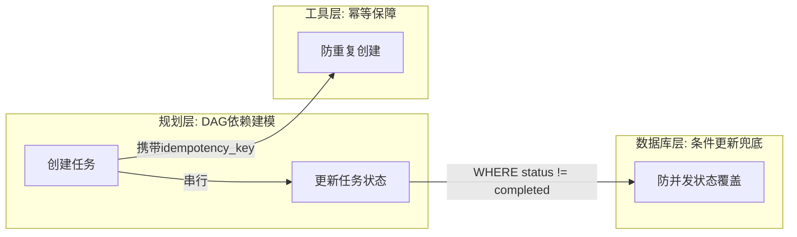

### 7.1 工具设计原理

#### OpenAI Function Calling 的工作原理与 JSON Schema 设计

##### 1、基础题：Function Calling 是什么？解决了什么问题？

**难度级别**：⭐（工具调用基础概念、tool role、tool_calls 格式）

Function Calling 是 OpenAI 对模型进行专项微调后得到的能力，让 LLM 能在推理时判断"是否需要调用外部函数、调哪个、参数怎么填"。调用时通过 `tools` 参数传入 JSON Schema 描述，模型返回结构化的 `tool_calls` 字段，我们在本地执行完函数后，把结果以 `tool` role 追加到消息列表，再次请求模型得到最终答案。

核心解决三个问题：
1. **意图识别**：让模型理解用户想调用什么功能
1. **参数提取**：从自然语言中结构化提取函数参数
1. **结果回填**：将函数执行结果返回给模型生成最终响应

典型流程：

```
用户提问 → 模型识别函数 → 返回 JSON → 执行函数 → 结果回填 → 生成回答
```

本质上是**结构化输出 + 语义解析**的组合应用。

#summary 给模型 tools 描述，模型识别调用哪个工具生成结构化参数，框架调用tool执行，返回结果到上下文，总结结果生成模型回复

---

##### 2、进阶题：OpenAI Function Calling 的完整工作原理与 JSON Schema 设计？

我会从 4 个角度来拆解这个问题：
1. **本质原理**。Function Calling 不是 Prompt 技巧，而是 OpenAI 在训练阶段做了专项微调，让模型学会"什么时候该调工具、调哪个、参数怎么填"。工具描述的质量直接影响模型的决策准确率。
1. **完整调用链路**。分四个阶段：① 工具描述注入（JSON Schema 通过 `tools` 参数传入，由 OpenAI 内部序列化注入上下文）；② 模型返回 `tool_calls`，`finish_reason` 为 `tool_calls`，注意 `arguments` 是字符串而非对象，需要二次 JSON 解析，这是实际踩坑点；③ 本地执行后以 `tool` role + `tool_call_id` 追加到消息列表；④ 再次请求模型生成最终输出。
1. **JSON Schema 设计的工程经验**。`description` 要写"什么场景下用"而不只是"做什么"；参数 `description` 要说明格式要求（如日期格式 `YYYY-MM-DD`）；枚举类型必须用 `enum` 显式列出；工具数量控制在 20 个以内，过多会导致选择准确率下降，超出时考虑动态工具注入。
2. **Parallel Function Calling**。模型可以在一次响应中返回多个 `tool_calls`，工程上需要并发执行，把所有结果注入消息列表后统一请求一次模型，能显著降低多轮交互的延迟。

#summary 1、描述场景而非怎么使用 2、参数说明清楚，必要可以few shot 比如日期格式 3、工具尽量 20 以内，太多考虑做分组 4、可以并行执行工具，注意线程安全

---

##### 进阶题：Function Calling 中参数校验应该在哪个阶段做？为什么？

我会从三个层次来设计参数校验：

**1. 前置校验（Schema 层）**
在 Function Definition 阶段就定义好参数的类型、必填项、取值范围，让模型在生成时就受到约束。比如用 JSON Schema 限制枚举值，减少无效调用。

**2. 中置校验（网关层）**
模型返回参数后、执行函数前，做二次校验。这里重点是**类型转换**和**业务规则**校验，比如**日期格式、ID 是否存在**等。

**3. 后置校验（执行层）**
函数内部的防御性校验，作为最后一道防线。

关键设计原则：**校验越靠前，成本越低**。Schema 层能拦截的，就不要放到执行层。

```java
// 示例：SpringAI 中的 Function 定义
@Bean
public Function<WeatherRequest, WeatherResponse> weatherFunction() {
    return request -> {
        // 这里做的是业务校验，基础校验应该在 Schema 层完成
        if (!isValidCity(request.city())) {
            throw new InvalidParameterException("城市不存在");
        }
        return weatherService.getWeather(request);
    };
}
```

#summary 1、使用pydymic做类型和范围校验 2、业务规则校验，比如 id是否存在，日期格式是否正常 3、函数内部防御性校验（比如是否为空字符串之类的）

---

##### 场景题：模型返回的参数和函数签名不匹配，如何处理？

这个问题我在实际项目中遇到过，核心是**容错 + 反馈**的设计：

**第一步：宽松的类型转换**

```java
// 示例：LangChain4J 的类型适配器
public class TypeAdapter {
    public static Object convert(Object value, Class<?> targetType) {
        if (value instanceof String str && targetType == Integer.class) {
            return Integer.parseInt(str.replaceAll("[^0-9-]", ""));
        }
        // 更多转换规则...
    }
}
```

**第二步：结构化错误反馈**
不是简单返回"参数错误"，而是告诉模型**具体哪里错了**：

```
错误：参数 "date" 格式应为 yyyy-MM-dd，实际收到 "明天"
建议：请返回具体日期，如 "2024-03-24"
```

**第三步：降级策略**
如果重试 2 次还是失败，切换到**默认值**或**人工介入**，避免无限循环。

关键点：**让错误信息成为模型的"学习信号"**，而不是简单的异常抛出。

#summary 模型本质上还是语言模型，对格式其实不够敏感。1、首先要有宽松的格式转换,比如 int类型模型输出的是带非数字的 str，可以做正则匹配，比如日期 20250601，可以宽松转为 2026-06-01  2、错误反馈时候要有具体哪里错了，然后重试  3、重试失败做人工兜底或者换解决思路规避该工具使用。

---

##### 3、场景题：工具描述写得模糊会导致什么问题，怎么排查？
1. **问题表现**。描述模糊通常导致两类问题：工具选错（两个功能相近的工具被混用）；参数填错（枚举值乱填、日期格式不对）。这类问题在单工具测试时不明显，在工具数量多时会集中爆发。
1. **排查手段**。用 LangSmith Trace 视图还原完整的工具调用链路，重点看模型在 `tool_calls` 里填的参数是否符合预期；也可以通过对比测试，A/B 两版描述各跑 50 次，统计工具选择准确率来量化差异。
1. **修复策略**。在 `description` 里补充"适用场景"（什么情况下用这个工具）；参数 `description` 补充格式约束和示例值；相似工具加区分词（如 `search_web_realtime` vs `search_knowledge_base`）；枚举参数务必用 `enum` 字段显式约束，不要让模型自由发挥。

#summary  表现：选择错误&参数错误，单个工具测试只能测试参数错误排查：监控发现后，修改完毕后做 AB测试修复策略：相似工具补充不同适用场景、参数格式说明清楚，可以加参数示例


##### 进阶题：Parallel Function Calling 和 Sequential Function Calling 的区别？什么场景下用哪种？
1. **核心区别**：Parallel 是模型在**单次响应**中返回多个 tool*calls，应用层并发执行后将所有结果一次性回填；Sequential 是模型每次只返回一个 tool*call，等结果回填后再决定下一步调用。
1. **依赖分析是关键**：

```
查天气 + 查日历 → 无依赖 → Parallel
查用户ID → 用ID查订单 → 有依赖 → Sequential
查天气 + (查用户ID → 查订单) → 混合 → DAG 编排
```
1. **Parallel 的优势与风险**：
  - **优势**：减少 LLM 调用轮次（省 Token + 降延迟），3 个独立工具从 3 轮变 1 轮
  - **风险**：模型可能错误地并行调用有依赖的函数；部分模型不支持（需检查 `parallel_tool_calls` 能力）
1. **工程实现**：

```java
// 并行执行多个 tool_calls
List<CompletableFuture<ToolResult>> futures = toolCalls.stream()
    .map(call -> CompletableFuture.supplyAsync(
        () -> toolExecutor.execute(call), toolThreadPool))
    .toList();

List<ToolResult> results = futures.stream()
    .map(CompletableFuture::join)
    .toList();
```

#summary  parallel tool call 本质是模型能力，无依赖的工具集可以并行执行，但是可能会导致存在有并行依赖的情况。可以将绝逼没有依赖的做并行白名单。

---

##### 场景题：Agent 需要调用一个耗时很长的外部 API（如数据分析），如何设计异步 Function Calling？

这个问题的核心是**不能让 Agent 干等**，我设计过三种模式：

**模式一：轮询模式（最通用）**

```
Agent → 调用 submitAnalysis(data) → 返回 taskId
Agent → 调用 getAnalysisStatus(taskId) → 返回 "processing"
Agent → 调用 getAnalysisStatus(taskId) → 返回 "completed" + result
```

工具定义中拆成两个函数：`submit`（提交）和 `getStatus`（查询），让模型自己决定何时轮询。

**模式二：回调通知模式（低延迟）**

```java
public class AsyncToolExecutor {
    public ToolResult executeAsync(ToolCall call, Duration timeout) {
        CompletableFuture<ToolResult> future = new CompletableFuture<>();
        // 提交异步任务，注册回调
        externalApi.submitAsync(call.getParams(), result -> {
            future.complete(ToolResult.success(result));
        });
        // 带超时等待
        return future.get(timeout.toMillis(), TimeUnit.MILLISECONDS);
    }
}
```

**模式三：中断-恢复模式（最优雅）**
长任务提交后，Agent 先回复用户"正在分析中"，任务完成后通过 Checkpoint 恢复 Agent 执行流，将结果注入上下文继续推理。
**选型建议**：秒级延迟用模式二；分钟级用模式一（轮询）；小时级用模式三（中断恢复）。

#summary 1、轮询 2、回调通知 3、中断恢复，让用户等直接，成功后再恢复 agent运行

---
##### Parallel Function Calling 怎么处理并发安全？
- **依赖分析**：先判断工具之间是否存在依赖关系，有依赖必须串行执行，无依赖才能并行。
- **读写分离**：查询类工具通常可以并行，而下单、扣款、删除等写操作需要串行或者加锁处理。
- **幂等与事务**：对于写操作，通过幂等键、事务机制等保证不会因为重复执行导致数据错误。
- **统一调度**：通过 Tool Gateway 统一管理工具执行，对需要保护的资源进行加锁、限流或串行化处理。
##### Tool Use 和 ReAct 有什么区别？
- **定位不同**：Tool Use 是模型调用工具的能力，ReAct 是 Agent 的推理框架。
- **流程不同**：Tool Use 关注工具选择和参数生成；ReAct 采用 Thought → Action → Observation 的循环模式。
- **目标不同**：Tool Use 解决“如何调用工具”，ReAct 解决“如何利用工具完成多步任务”
-
##### 工具数量过多时如何做动态工具注入？
- **建立 Tool Registry**：统一管理工具的名称、描述、参数和适用场景。
- **Tool Routing**：通过规则、意图分类、Embedding 检索或 LLM 规划，筛选候选工具。
- **Top-K 召回**：从大量工具中选出最相关的少量工具。
- **动态注入**：只将候选工具的 Schema 注入当前上下文，而不是全量注入。
- **效果优化**：降低 Token 消耗，减少误调用，提高 Tool Calling 的准确率和稳定性。

---

#### 工具的原子性与单一职责设计原则


##### 1、基础题：工具粒度过粗或过细分别有什么问题？

**难度级别**：⭐（工具设计原则、复用性、调用效率）

粒度过粗：一个工具包含太多逻辑，复用性差，出错难定位，模型对工具语义理解模糊。粒度过细：Agent 需要多轮调用才能完成任务，延迟高、Token 消耗大，中间步骤增多导致出错概率上升。

---

##### 2、进阶题：在 AI Agent 的工具设计中，如何把握工具粒度？原子工具和复合工具各适合什么场景？

#summary 首先过于粗影响工具复用&定位问题困难，过细消耗 token、延迟、结果多。所以基本是分三层原子工具层、复合工具层然后工具动态注入。原子工具到复合工具要看 agent调用的高频组合，高频则合在一起。

我会从 3 个角度来分析这个问题：
1. **粒度过粗的工程代价**。比如一个 `analyze_and_report` 工具内部包含数据拉取、分析、格式化、发邮件四步。问题在于：其他任务只需要数据拉取时这个工具用不了；出错后无法定位是哪一步；模型对工具语义理解变模糊，调用准确率下降。
1. **粒度过细的工程代价**。比如 `open_file`、`read_line`、`close_file` 各自独立。Agent 需要多轮调用完成一件事，延迟和 Token 消耗都上去了；上下文被大量中间工具结果填满，影响后续推理质量。
2. **实际工程中的分层策略**。我比较认可的做法是分三层：
3. 原子工具层（`execute_sql`、`http_get`），保证可组合性；
4. 复合工具层（`query_user_orders`，内部封装 SQL 构建+执行+格式化），减少调用步骤；
5. 动态工具注入，根据当前任务上下文只暴露相关工具，避免工具列表过长导致模型选择混乱。实践经验是：先用原子工具跑通流程，观察 Agent 的高频调用组合，再把那些总是连续调用的工具封装成复合工具。命名方面，动词+名词结构最清晰，避免缩写，相似功能的工具要有明显区分词。

---

##### 3、场景题：业务新增了一个"查询并汇报用户订单"需求，你怎么决定设计原子工具还是复合工具？
#summary  如果既存在分开调用和联合调用的场景则原子和复合的都加上
1. **先问复用性**。如果"查询订单"和"汇报结果"分别还有其他独立使用场景（比如其他任务只需要查询不需要汇报），就应该拆成原子工具 `query_orders` + `format_report`，保留复用能力。
1. **再评估频次**。如果这个"查询+汇报"的组合在 Agent 运行中出现频率极高，可以在原子工具基础上封装一个复合工具 `query_and_report_orders`，两层都保留，让 Agent 根据任务自行选择。
1. **工程落地**。先上原子工具版本，上线后通过 LangSmith 观察 Agent 的实际调用模式，如果发现两个工具总是连续调用，再封装复合工具，这样决策有数据支撑，不是拍脑袋。


---

### 7.2 工具可靠性与安全

#### 工具调用的错误处理与智能重试策略

---

##### 1、基础题：工具调用失败后应该怎么处理？

**难度级别**：⭐（错误处理基础、重试机制、降级策略）

工具调用失败后，把错误信息作为 `tool` role 的 content 反馈给 LLM，让它根据错误自主调整参数或换工具。同时需要设置最大重试次数（通常 2-3 次），超过次数后做降级处理，返回描述性的降级结果而不是直接抛出空值。

---

##### 2、进阶题：当 Agent 调用工具返回错误时，应该如何设计错误处理和重试机制？LLM 如何利用错误信息来纠正自身行为？

我会从 3 个角度来思考这个问题：
1. **错误分类，策略不同**。
	1. 参数错误（格式不对、校验失败）：直接把错误作为 Observation 反馈给 LLM，让它自主修正，不需要重试间隔。
	2. 业务逻辑错误（无结果、权限不足）：反馈给 LLM 后让它决定是换参数、换工具还是告知用户。
	3. 基础设施错误（网络超时、服务不可用）：LLM 处理不了，在工具执行层做指数退避重试，对 LLM 透明。
2. **错误信息要面向 LLM 设计**。
	1. 不要给 `DB_ERROR_1062: Duplicate entry` 这种工程师调试信息，而是"该用户 ID 已存在，无法重复创建。请确认是否需要更新已有记录，或检查传入的 user_id 是否正确。"LLM 才能从中推理出正确的修正方向。
3. **防止无限重试循环**。
	1. LLM 可能被错误信息引导进入循环（反复换格式但问题不在格式上）。需要在 Agent 循环层面做全局步骤计数限制，并在 Prompt 中明确说明"如果同一工具连续失败 2 次，请换策略或直接告知用户"。写操作最多 1 次重试（防止重复写入），读操作可以 3 次；超过次数后返回描述性降级结果，让 Agent 能继续推进任务。

#summary 1、根据错误分类权限、参数错误直接反馈给 llm，网络问题做指数级退避
		   2、错误信息要 llm能够自然语言理解
		   3、要有重试限制 promot加代码硬编码，重试失败做降级或者人工兜底


---

##### 3、场景题：Agent 在调用 search_web 工具时，连续返回超时错误，如何处理？

**难度级别**：⭐⭐（基础设施错误处理、降级策略、避免影响 Agent 主流程）

**1️⃣ Common Answer**

重点总结（便于面试记忆）：
- 在工具执行层做指数退避重试，对 LLM 透明
- 超过重试次数后，返回描述性降级结果
- 同时触发 P0 告警

**2️⃣ Impressive Answer**
1. **在工具执行层做指数退避重试，对 LLM 透明**。超时属于基础设施错误，LLM 无法从中学到有用信息，应该在工具内部做 1s → 2s → 4s 的退避重试，最多 3 次，LLM 感知不到这个过程。
1. **超过重试次数后，返回描述性降级结果**。不要返回空值或直接抛出异常，而是返回 `{"error": "搜索服务暂不可用，以下是基于已有知识的回答建议"}`，LLM 看到这个能继续推进任务，而不是卡死。
1. **同时触发 P0 告警**。连续超时说明外部依赖有问题，需要立即通知 on-call，告警内容带上过去 5 分钟的失败次数和失败率，避免告警风暴。

**3️⃣ Key Differences**

<table>
<tr>
<td>
维度
</td>
<td>
Common Answer
</td>
<td>
Impressive Answer
</td>
</tr>
<tr>
<td>
重试位置
</td>
<td>
未区分，停留在概念层
</td>
<td>
明确在工具层重试，对 LLM 透明
</td>
</tr>
<tr>
<td>
降级处理
</td>
<td>
直接告诉用户失败
</td>
<td>
返回描述性结果让 Agent 继续运行
</td>
</tr>
<tr>
<td>
监控意识
</td>
<td>
无
</td>
<td>
触发 P0 告警，有生产运维视角
</td>
</tr>
<tr>
<td>
给面试官的印象
</td>
<td>
缺乏生产经验
</td>
<td>
有完整的故障应对思路
</td>
</tr>
</table>

---

##### 4、容易一起考的题

<table>
<tr>
<td>
关联题
</td>
<td>
和本题的关系
</td>
<td>
参考答案
</td>
</tr>
<tr>
<td>
ReAct 框架中 Observation 是什么？
</td>
<td>
错误信息作为 Observation 反馈给 Agent 是 ReAct 模式的核心机制
</td>
<td>
答：ReAct 按 Thought、Action、Observation 循环推进：先规划下一步，再调用工具，最后根据观察结果继续推理或收敛答案。
</td>
</tr>
<tr>
<td>
工具调用的幂等性怎么设计？
</td>
<td>
重试场景下幂等性至关重要，防止写操作重复执行
</td>
<td>
答：幂等性指同一操作重复执行多次结果一致，Agent 场景下可用 requestId、幂等键或状态机防止重试导致重复写入。
</td>
</tr>
<tr>
<td>
Agent 无限循环怎么检测和终止？
</td>
<td>
错误重试循环是无限循环的常见触发原因，需要全局步骤计数
</td>
<td>
答：这题可以按“定义 → 核心机制 → 工程落地”三步答；结合本题重点强调：错误重试循环是无限循环的常见触发原因，需要全局步骤计数，最后补一个风险点或优化手段。
</td>
</tr>
</table>

---

#### 代码执行工具的安全沙箱设计

---

##### 1、基础题：为什么代码执行工具需要沙箱隔离？

**难度级别**：⭐（安全隔离基础、常见风险）

LLM 生成的代码可能包含恶意操作（删除文件、读取敏感信息、消耗系统资源），直接在宿主机执行风险极高。沙箱通过隔离执行环境，让代码无法影响宿主机，同时限制资源使用，防止 DoS 攻击。

---

##### 2、进阶题：在 AI Agent 中集成代码执行能力时，如何设计安全沙箱？Docker 容器隔离和 E2B 沙箱各有什么特点？

**难度级别**：⭐⭐⭐（Docker vs E2B 对比、完整资源限制、多层防护设计、黑名单局限性）

**1️⃣ Common Answer**

重点总结（便于面试记忆）：
- Docker vs E2B 的选型对比
- 资源限制要做完整清单，不能只限内存和 CPU
- 防护要分多层，黑名单是最弱的防线

**2️⃣ Impressive Answer**

我会从 3 个角度来思考这个问题：
1. **Docker vs E2B 的选型对比**。Docker 自托管：完全可控、成本低，但容器启动延迟 500ms-2s，需要自己维护镜像安全更新和容器逃逸补丁，适合数据安全要求严格、不能发给第三方的场景（金融、医疗）。E2B：基于 Firecracker 微虚拟机，启动延迟低于 200ms，天然多租户隔离，提供文件系统持久化和流式输出等 Agent 场景所需能力，适合快速落地、对延迟敏感的 Agent 产品。
1. **资源限制要做完整清单，不能只限内存和 CPU**。还需要限制进程数（`pids_limit` 防 fork bomb）、完全断网或白名单网络（`network_mode: none`）、根文件系统只读（`read_only: True`）、删除所有 Linux capabilities（`cap_drop: ALL`）。只靠内存和 CPU 限制，很容易被绕过。
1. **防护要分多层，黑名单是最弱的防线**。`__import__('os').system('rm -rf /')` 这类变形写法黑名单根本穷举不完。正确做法是：执行前用 AST 解析检测危险模块导入（比字符串匹配更难绕过）；执行中用容器隔离+syscall 白名单（seccomp profile）；执行后对输出做内容安全扫描防止信息泄露。黑名单只做第一道粗筛。

**3️⃣ Key Differences**

<table>
<tr>
<td>
维度
</td>
<td>
Common Answer
</td>
<td>
Impressive Answer
</td>
</tr>
<tr>
<td>
方案对比
</td>
<td>
只说 E2B 更方便
</td>
<td>
从延迟/运维成本/适用场景三维度系统对比
</td>
</tr>
<tr>
<td>
资源限制
</td>
<td>
只提内存和 CPU
</td>
<td>
给出进程数、网络、文件系统、capabilities 的完整清单
</td>
</tr>
<tr>
<td>
安全防护
</td>
<td>
依赖黑名单过滤
</td>
<td>
指出黑名单局限性，提出 AST 静态分析+运行时 seccomp 多层防护
</td>
</tr>
<tr>
<td>
给面试官的印象
</td>
<td>
了解基本方案，不了解安全纵深
</td>
<td>
有系统安全设计思维，知道攻击面在哪、防线怎么设
</td>
</tr>
</table>

---

##### 3、场景题：用户让 Agent 执行一段 Python 脚本，脚本里有 `import socket` 和网络请求，怎么处理？

**难度级别**：⭐⭐⭐（AST 静态分析、网络隔离策略、风险评估与放行机制）

**1️⃣ Common Answer**

重点总结（便于面试记忆）：
- 静态分析层先检测
- 执行层用网络隔离兜底
- 给用户友好的反馈

**2️⃣ Impressive Answer**
1. **静态分析层先检测**。用 AST 解析脚本，识别到 `import socket` 后，不是直接拒绝，而是判断业务场景——如果这个 Agent 本来就需要联网能力（比如爬虫 Agent），可以放行到受控网络（白名单出口）；如果是纯计算类 Agent，则拒绝并告知用户"网络访问不在允许范围内"。
1. **执行层用网络隔离兜底**。无论静态分析是否通过，容器都配置为自定义网络（白名单出口 IP 或域名），即使代码里有恶意网络请求，容器也无法连接到非白名单地址，保证纵深防御。
1. **给用户友好的反馈**。不要直接返回"安全校验失败"，而是说"检测到网络访问请求，当前沙箱环境限制为只读计算，如需联网操作请联系管理员开启对应权限"，提升用户体验。

**3️⃣ Key Differences**

<table>
<tr>
<td>
维度
</td>
<td>
Common Answer
</td>
<td>
Impressive Answer
</td>
</tr>
<tr>
<td>
处理策略
</td>
<td>
一刀切拒绝
</td>
<td>
根据业务场景区分处理，支持白名单放行
</td>
</tr>
<tr>
<td>
防护层次
</td>
<td>
只有黑名单一层
</td>
<td>
静态分析+网络隔离兜底，纵深防御
</td>
</tr>
<tr>
<td>
用户体验
</td>
<td>
返回&quot;不允许&quot;
</td>
<td>
给出友好提示和解决路径
</td>
</tr>
<tr>
<td>
给面试官的印象
</td>
<td>
安全意识有但过于简单
</td>
<td>
有纵深防御思维，兼顾安全与可用性
</td>
</tr>
</table>

---

##### 4、容易一起考的题

<table>
<tr>
<td>
关联题
</td>
<td>
和本题的关系
</td>
<td>
参考答案
</td>
</tr>
<tr>
<td>
E2B 沙箱和 Docker 沙箱的冷启动优化？
</td>
<td>
沙箱延迟是生产中的主要瓶颈，预热策略是常见优化手段
</td>
<td>
答：成本优化先拆 Token、模型、工具和重试四类开销，再用缓存、小模型路由、Prompt 压缩、批处理和限流降级优化。
</td>
</tr>
<tr>
<td>
Agent 代码生成的质量如何评估？
</td>
<td>
沙箱提供了安全执行环境，代码质量评估是下一步的工程问题
</td>
<td>
答：LLM-as-Judge 要先定义评分 Rubric，再处理位置偏差、冗长偏差和自我偏差；工程上用多 Judge 投票和人工 Golden Set 做校准。
</td>
</tr>
<tr>
<td>
seccomp 是什么，怎么配置？
</td>
<td>
沙箱运行时防护的核心机制，面试中常作为深度追问
</td>
<td>
答：这题可以按“定义 → 核心机制 → 工程落地”三步答；结合本题重点强调：沙箱运行时防护的核心机制，面试中常作为深度追问，最后补一个风险点或优化手段。
</td>
</tr>
</table>

---

#### Text-to-SQL 工具的实现与幻觉防护

---

##### 1、基础题：Text-to-SQL 工具的基本实现思路是什么？

**难度级别**：⭐（Schema 注入、SQL 安全约束、基本流程）

把数据库表结构（Schema）注入 Prompt，让 LLM 根据用户自然语言生成 SQL，使用只读账号执行，把结果返回给用户。安全上要限制只生成 SELECT 语句，禁止 DDL 和 DML 操作。

---

##### 2、进阶题：如何实现一个生产可用的 Text-to-SQL 工具？Schema 注入、SQL 安全校验和自动纠错循环怎么做？

**难度级别**：⭐⭐⭐（Schema 格式设计、表召回、多层安全校验、自纠错循环设计）

**1️⃣ Common Answer**

重点总结（便于面试记忆）：
- Schema 注入格式是核心
- SQL 安全校验要做三层
- 自纠错循环有个关键细节

**2️⃣ Impressive Answer**

我会从 3 个角度来拆解生产可用的 Text-to-SQL：
1. **Schema 注入格式是核心**。仅列字段名效果很差，生产中需要带类型、注释、示例值、外键关系。比如 `status: ENUM('pending','paid','cancelled'), 订单状态` 配合 `Sample data: status 常见值为 'paid'`，能显著提升 SQL 生成准确率。另外，大型系统有几百张表，不能全部注入，要先做表召回——用向量检索或关键词匹配找出最相关的 3-5 张表，只注入这些表的 Schema，避免 context 爆炸且让模型注意力更集中。
1. **SQL 安全校验要做三层**。语法层：用 `sqlparse` 解析 SQL，确认是 SELECT，拒绝 DDL/DML；语义层：检查危险函数（`LOAD_FILE`、`INTO OUTFILE`）和全表扫描风险（超大表无 WHERE 子句）；执行层：只读账号+强制设置 `statement_timeout`，防止慢查询打垮数据库。只靠只读账号远远不够。
1. **自纠错循环有个关键细节**。SQL 执行失败后，要把原始 SQL 和错误信息一起传给 LLM，同时加指令"请分析错误原因，修正 SQL，不要改变查询意图"。只给错误信息不给原始 SQL，LLM 容易生成一个完全不同的 SQL，偏离用户意图。最多重试 2 次，超过后返回友好提示。另外查询结果为空时，要区分"确实无数据"和"SQL 写错了导致无结果"，必要时让 LLM 验证 SQL 的语义是否符合问题逻辑。

**3️⃣ Key Differences**

<table>
<tr>
<td>
维度
</td>
<td>
Common Answer
</td>
<td>
Impressive Answer
</td>
</tr>
<tr>
<td>
Schema 设计
</td>
<td>
只说&quot;告诉 LLM 表结构&quot;
</td>
<td>
给出带类型/注释/关系/示例值的格式，以及表召回的动态注入策略
</td>
</tr>
<tr>
<td>
安全校验
</td>
<td>
只提只读账号
</td>
<td>
三层校验：语法+语义+执行，覆盖更多攻击面
</td>
</tr>
<tr>
<td>
纠错循环
</td>
<td>
把错误返回给 LLM 重试
</td>
<td>
强调要把原始 SQL 一起返回，避免偏离查询意图
</td>
</tr>
<tr>
<td>
给面试官的印象
</td>
<td>
了解基本流程，没有落地过
</td>
<td>
有生产实践经验，知道坑在哪、怎么绕过
</td>
</tr>
</table>

---

##### 3、场景题：用户问"查一下最近一个月销售额最高的 Top10 产品"，LLM 生成的 SQL 返回空结果，怎么处理？

**难度级别**：⭐⭐⭐（空结果区分、语义验证、用户确认机制）

**1️⃣ Common Answer**

重点总结（便于面试记忆）：
- 先区分"真没数据"还是"SQL 写错了"
- 检查常见 SQL 陷阱
- 给用户透明的反馈

**2️⃣ Impressive Answer**
1. **先区分"真没数据"还是"SQL 写错了"**。对结果为空的 SQL，让 LLM 做语义验证：把生成的 SQL 和原始问题一起传给模型，问"这条 SQL 是否正确表达了用户的查询意图？"如果模型判断 SQL 逻辑有问题，触发一次纠错重试。
1. **检查常见 SQL 陷阱**。比如日期范围写反、时区问题、JOIN 条件不对导致笛卡尔积被 WHERE 过滤掉等。可以在纠错提示中加上"请检查日期范围、JOIN 条件是否正确"作为提示。
1. **给用户透明的反馈**。如果多次重试仍为空，要告诉用户"根据您的问题生成的查询未返回结果，可能是近一个月确实无销售记录，也可能是查询条件需要调整，生成的 SQL 如下，您可以确认"，把 SQL 暴露给用户做最终判断，避免黑盒。

**3️⃣ Key Differences**

<table>
<tr>
<td>
维度
</td>
<td>
Common Answer
</td>
<td>
Impressive Answer
</td>
</tr>
<tr>
<td>
空结果处理
</td>
<td>
直接告知无数据或盲目重试
</td>
<td>
先做语义验证区分两类空结果
</td>
</tr>
<tr>
<td>
错误排查
</td>
<td>
无具体方向
</td>
<td>
给出日期/JOIN 等常见 SQL 陷阱的检查清单
</td>
</tr>
<tr>
<td>
用户体验
</td>
<td>
给结论不透明
</td>
<td>
暴露 SQL 给用户确认，建立信任
</td>
</tr>
<tr>
<td>
给面试官的印象
</td>
<td>
缺乏对 LLM 幻觉的认知
</td>
<td>
有幻觉防护意识，流程完整
</td>
</tr>
</table>

---

##### 4、容易一起考的题

<table>
<tr>
<td>
关联题
</td>
<td>
和本题的关系
</td>
<td>
参考答案
</td>
</tr>
<tr>
<td>
RAG 的表召回和文档召回有什么区别？
</td>
<td>
Text-to-SQL 的表召回用了 RAG 的核心思路，场景类似
</td>
<td>
答：RAG 题要串起切分、embedding、召回、重排、上下文拼装、生成和评估，每一步都有质量与成本取舍。
</td>
</tr>
<tr>
<td>
LLM 生成内容的幻觉怎么检测？
</td>
<td>
SQL 语义验证是幻觉检测在结构化输出场景的具体实现
</td>
<td>
答：这题可以按“定义 → 核心机制 → 工程落地”三步答；结合本题重点强调：SQL 语义验证是幻觉检测在结构化输出场景的具体实现，最后补一个风险点或优化手段。
</td>
</tr>
<tr>
<td>
Agent 的 Self-correction Loop 是什么？
</td>
<td>
Text-to-SQL 的纠错循环是 Self-correction 模式的典型应用
</td>
<td>
答：这题可以按“定义 → 核心机制 → 工程落地”三步答；结合本题重点强调：Text-to-SQL 的纠错循环是 Self-correction 模式的典型应用，最后补一个风险点或优化手段。
</td>
</tr>
</table>

---

#### 工具调用的并发安全性设计

---

##### 1、基础题：什么是工具的幂等性？为什么在 Agent 中很重要？

**难度级别**：⭐（幂等性概念、重试场景下的必要性）

幂等性是指同一操作执行多次，结果和执行一次相同。在 Agent 中，工具可能因错误被重试，如果写操作不幂等，就会造成重复写入（如重复创建订单）。通过业务幂等键或唯一约束保证幂等性是写操作工具的基本要求。

---

##### 2、进阶题：当 Agent 并行调用多个工具时，如何保证并发安全性？工具幂等性设计和事务管理应该怎么做？

**难度级别**：⭐⭐⭐（并发竞争场景、幂等键设计、单工具单事务原则、信号量限流）

**1️⃣ Common Answer**

重点总结（便于面试记忆）：
- 常见竞争场景要心中有数
- 幂等性设计要分层
- 框架层面用信号量控制并发数

**2️⃣ Impressive Answer**

我会从 3 个角度来分析：
1. **常见竞争场景要心中有数**。读-改-写竞争（两个工具并发读同一计数器各自加 1 写回，结果少加一次）；文件系统竞争（两个工具同时写同名临时文件互相覆盖）；外部 API 限流（多工具并发调同一第三方 API 触发频率限制）。不同场景对应不同的解法，不能一概而论。
1. **幂等性设计要分层**。天然幂等：GET 类查询无需处理。业务 ID 幂等：写操作携带 `idempotency_key`，服务端先查是否已存在，存在则返回已有结果，不存在才创建。条件写幂等：用乐观锁（`UPDATE ... WHERE version = ?`）或数据库唯一约束防止并发重复写入。事务管理上，遵循单工具单事务原则，不跨工具共享事务上下文，避免并发时事务边界混乱；只读工具显式用只读事务，数据库可做更好的并发优化。
1. **框架层面用信号量控制并发数**。用 `asyncio.Semaphore` 限制同时执行的工具数量（比如最多 5 个并发），防止资源过载。`asyncio.gather` 加 `return_exceptions=True`，保证某个工具失败不中断其他工具的执行，最后统一处理失败项。

**3️⃣ Key Differences**

<table>
<tr>
<td>
维度
</td>
<td>
Common Answer
</td>
<td>
Impressive Answer
</td>
</tr>
<tr>
<td>
竞争分析
</td>
<td>
泛泛说&quot;用锁保护&quot;
</td>
<td>
列举读-改-写/文件系统/API 限流三类具体竞争场景
</td>
</tr>
<tr>
<td>
幂等设计
</td>
<td>
只提唯一约束
</td>
<td>
给出业务 ID 幂等键的完整方案，含三层设计策略
</td>
</tr>
<tr>
<td>
事务管理
</td>
<td>
只说&quot;用事务保证原子性&quot;
</td>
<td>
强调单工具单事务原则和只读事务优化
</td>
</tr>
<tr>
<td>
给面试官的印象
</td>
<td>
知道并发有问题，没有系统解法
</td>
<td>
有并发工程经验，设计和框架两个层面都有方案
</td>
</tr>
</table>

---

##### 3、场景题：Agent 同时调用"创建任务"和"更新任务状态"两个工具，如何避免数据不一致？

**难度级别**：⭐⭐⭐（并发顺序依赖、任务依赖建模、事务边界设计）

**1️⃣ Common Answer**

重点总结（便于面试记忆）：
- 识别依赖关系，不并发执行有依赖的工具
- "创建任务"工具保证幂等
- 在数据库层做约束兜底

**2️⃣ Impressive Answer**
1. **识别依赖关系，不并发执行有依赖的工具**。"更新任务状态"依赖任务已存在，这两个工具本身不应该并发调用。在 Agent 的任务规划层，通过 DAG 建模工具依赖关系，有依赖的工具串行执行，无依赖的工具才并发执行。
1. **"创建任务"工具保证幂等**。携带 `idempotency_key`，即使因网络问题被重试，也不会创建出两个相同任务，确保"更新任务状态"时操作的是同一个任务 ID。
1. **在数据库层做约束兜底**。"更新任务状态"的 SQL 加上 `WHERE task_id = ? AND status != 'completed'` 这类条件，防止并发下状态被错误覆盖，数据库层做最后一道防护。



**3️⃣ Key Differences**

<table>
<tr>
<td>
维度
</td>
<td>
Common Answer
</td>
<td>
Impressive Answer
</td>
</tr>
<tr>
<td>
根因分析
</td>
<td>
用锁强制串行，没分析依赖本质
</td>
<td>
识别工具间存在顺序依赖，从规划层解决
</td>
</tr>
<tr>
<td>
幂等保障
</td>
<td>
未提
</td>
<td>
用幂等键保证重试安全
</td>
</tr>
<tr>
<td>
数据库兜底
</td>
<td>
无
</td>
<td>
条件 WHERE 子句防止并发状态覆盖
</td>
</tr>
<tr>
<td>
给面试官的印象
</td>
<td>
缺乏系统思维
</td>
<td>
从规划层+工具层+数据库层做纵深保障
</td>
</tr>
</table>

---

##### 4、容易一起考的题

<table>
<tr>
<td>
关联题
</td>
<td>
和本题的关系
</td>
<td>
参考答案
</td>
</tr>
<tr>
<td>
Parallel Function Calling 的工作原理？
</td>
<td>
并发安全是 Parallel Function Calling 落地的核心工程问题
</td>
<td>
答：工具调用题要讲 schema 描述、参数校验、权限控制、超时重试、幂等和观测；核心是让模型会选、会用、用错能兜底。
</td>
</tr>
<tr>
<td>
分布式锁怎么实现？
</td>
<td>
跨进程的工具并发安全需要分布式锁，是并发安全的延伸
</td>
<td>
答：工具调用题要讲 schema 描述、参数校验、权限控制、超时重试、幂等和观测；核心是让模型会选、会用、用错能兜底。
</td>
</tr>
<tr>
<td>
asyncio.gather 和 asyncio.wait 的区别？
</td>
<td>
并发执行工具时常用的两个 API，面试中常作为深度追问
</td>
<td>
答：工具调用题要讲 schema 描述、参数校验、权限控制、超时重试、幂等和观测；核心是让模型会选、会用、用错能兜底。
</td>
</tr>
</table>

---

### 7.3 工具工程实践

#### 工具结果摘要：处理大型工具返回值

---

##### 1、基础题：工具返回内容过长超出 Token 限制时，最简单的处理方式是什么？

**难度级别**：⭐（截断基础、Token 限制意识）

最直接的方式是按条数或字符数截断，比如搜索结果只保留前 5 条，并在末尾注明"共 N 条记录"。但要避免按字符截断结构化数据，否则会破坏 JSON 结构导致 LLM 解析失败。

---

##### 2、进阶题：当工具返回大量数据时，如何避免超出 Token 限制？截断、摘要策略和 Token 预算应该怎么设计？

**难度级别**：⭐⭐（按数据类型截断、摘要成本与风险、动态 Token 预算分配）

**1️⃣ Common Answer**

重点总结（便于面试记忆）：
- 截断策略要按数据类型来
- LLM 摘要有成本和风险，要谨慎使用
- Token 预算要动态计算，而不是固定比例

**2️⃣ Impressive Answer**

我会从 3 个角度来思考这个问题：
1. **截断策略要按数据类型来**。搜索结果：按条数截断，每条保留标题+摘要+URL，丢弃正文，不要按字符硬截。结构化数据（JSON/表格）：先过滤掉和当前问题无关的字段，再考虑行数截断，末尾注明"共 N 条，以上为前 X 条"。文件内容：不要直接截头，代码文件按函数/类分割，文档按段落分割，只取与问题最相关的片段（本质是 RAG 的思路）。
1. **LLM 摘要有成本和风险，要谨慎使用**。摘要本身要额外调用一次 LLM，高频场景成本不低；精确数字和代码摘要后容易失真，这类内容不适合摘要，应该直接截断保留原文。需要摘要时，用小模型（如 GPT-4o-mini）而不是主模型，降低延迟和成本。
1. **Token 预算要动态计算，而不是固定比例**。动态分配逻辑：模型上下文限制 - 系统 Prompt tokens - 对话历史 tokens - 预期输出 tokens = 可用空间，给工具结果最多 60% 的可用空间，并保证至少 500 token。多工具并发时，按工具结果对当前问题的重要性优先分配预算。另外，用 tiktoken 精确计算 token 数，不要用字符数估算，中英文混合场景下两者差异很大。

**3️⃣ Key Differences**

<table>
<tr>
<td>
维度
</td>
<td>
Common Answer
</td>
<td>
Impressive Answer
</td>
</tr>
<tr>
<td>
截断策略
</td>
<td>
只提字符截断和取前 N 条
</td>
<td>
按搜索/结构化/文件三种数据类型给出不同策略
</td>
</tr>
<tr>
<td>
摘要使用
</td>
<td>
直接推荐 LLM 摘要
</td>
<td>
指出成本和信息损失风险，给出适用场景和优化方案
</td>
</tr>
<tr>
<td>
Token 预算
</td>
<td>
给出固定 30-40% 比例
</td>
<td>
动态计算公式+多工具优先级竞争机制
</td>
</tr>
<tr>
<td>
给面试官的印象
</td>
<td>
了解问题，有基本解法
</td>
<td>
有工程细节，能针对不同场景选合适策略，考虑成本与精度平衡
</td>
</tr>
</table>

---

##### 3、场景题：Agent 调用了一个返回 200 条 JSON 记录的数据库查询工具，如何处理这个结果？

**难度级别**：⭐⭐（结构化数据处理、字段过滤、Token 预算估算）

**1️⃣ Common Answer**

重点总结（便于面试记忆）：
- 先做字段过滤，再做行数截断
- 用 tiktoken 估算截断后的 token 数
- 考虑让 SQL 层做聚合

**2️⃣ Impressive Answer**
1. **先做字段过滤，再做行数截断**。不要直接截前 N 条，先分析当前问题需要哪些字段，比如用户问"最近订单的状态分布"，只需要 `status` 和 `created_at` 字段，把其他字段过滤掉可以把数据量压缩 80% 以上。字段过滤后再按行数截断，末尾注明"共 200 条，以上为前 50 条，仅展示 status 和 created_at 字段"。
1. **用 tiktoken 估算截断后的 token 数**。不要用字符数估算，JSON 结构有大量括号和键名，token 消耗远高于纯文本。估算后和当前可用 token 预算对比，动态决定保留多少行。
1. **考虑让 SQL 层做聚合**。如果问题是统计类的（分布、Top N、总数），应该在工具层让数据库直接做 `GROUP BY` 或 `LIMIT`，而不是把原始数据全拉出来再在 Python 层处理。这是从根本上减少数据量的最优解。

**3️⃣ Key Differences**

<table>
<tr>
<td>
维度
</td>
<td>
Common Answer
</td>
<td>
Impressive Answer
</td>
</tr>
<tr>
<td>
处理顺序
</td>
<td>
直接截行数
</td>
<td>
先字段过滤再行数截断，压缩更彻底
</td>
</tr>
<tr>
<td>
Token 估算
</td>
<td>
用字符数大概估
</td>
<td>
用 tiktoken 精确计算
</td>
</tr>
<tr>
<td>
根本优化
</td>
<td>
在 Python 层处理
</td>
<td>
让 SQL 层聚合，从源头减少数据量
</td>
</tr>
<tr>
<td>
给面试官的印象
</td>
<td>
有基本意识但不够精细
</td>
<td>
有数据处理工程经验，优先从根本解决问题
</td>
</tr>
</table>

---

##### 4、容易一起考的题

<table>
<tr>
<td>
关联题
</td>
<td>
和本题的关系
</td>
<td>
参考答案
</td>
</tr>
<tr>
<td>
Context Window 管理有哪些策略？
</td>
<td>
工具结果是 context 的重要组成部分，大型工具返回值处理是 context 管理的子问题
</td>
<td>
答：工具调用题要讲 schema 描述、参数校验、权限控制、超时重试、幂等和观测；核心是让模型会选、会用、用错能兜底。
</td>
</tr>
<tr>
<td>
RAG 的 chunk 策略怎么设计？
</td>
<td>
文件内容按语义分割取相关片段，本质就是 RAG 的 chunking 思路
</td>
<td>
答：RAG 题要串起切分、embedding、召回、重排、上下文拼装、生成和评估，每一步都有质量与成本取舍。
</td>
</tr>
<tr>
<td>
tiktoken 怎么使用？
</td>
<td>
Token 精确计算的基础工具，面试中常作为深度追问
</td>
<td>
答：工具调用题要讲 schema 描述、参数校验、权限控制、超时重试、幂等和观测；核心是让模型会选、会用、用错能兜底。
</td>
</tr>
</table>

---

#### 工具调用的可观测性：追踪每次调用的输入输出

---

##### 1、基础题：工具调用的日志应该记录哪些字段？

**难度级别**：⭐（结构化日志基础、必要字段）

至少要记录：工具名称、输入参数（敏感信息需脱敏）、返回值大小（而非全量内容）、执行耗时（毫秒）、会话 ID（`session_id`）、Agent 运行 ID（`run_id`，用于关联同一次运行中的所有工具调用），以及成功/失败状态和错误信息。

---

##### 2、进阶题：在生产环境中，如何对 Agent 工具调用进行全面的可观测性建设？结构化日志、告警和 LangSmith 如何落地？

**难度级别**：⭐⭐（run_id 链路关联、分级告警避免告警风暴、LangSmith 核心功能、自建 vs LangSmith 选型）

**1️⃣ Common Answer**

重点总结（便于面试记忆）：
- 结构化日志的关键设计点
- 告警策略要分级，避免告警风暴
- LangSmith 的核心价值和选型

**2️⃣ Impressive Answer**

我会从 3 个角度来拆解生产级可观测性：
1. **结构化日志的关键设计点**。`run_id` 是核心字段，用于关联同一次 Agent 运行中的所有工具调用，没有它就无法从日志中还原完整调用链路。返回值记录大小而不是全内容，避免日志量爆炸；需要 debug 时，把完整返回值存对象存储，日志里记录引用。敏感参数（API 密钥、用户身份信息）必须脱敏后再写日志。
1. **告警策略要分级，避免告警风暴**。P0 即时告警：工具成功率 5 分钟内低于 80%，有系统级故障。P1 延迟告警：某工具 P99 耗时超阈值（外部 API 超过 10s），影响用户体验。P2 趋势告警：错误率 1 小时内持续上升，可能是数据问题或外部降级。告警要带聚合信息（"search_web 过去 5 分钟失败 23 次，失败率 45%，涉及 12 个 session"），不要每次失败都发一条。
1. **LangSmith 的核心价值和选型**。最有价值的三个功能：Trace 视图（树状调用链路，排查幻觉或工具选错效率极高）；Dataset 积累（一键把有问题的 Trace 加入数据集，用于 Prompt 优化和回归测试）；工具调用统计（按工具名过滤，快速看哪个工具最容易失败）。有数据合规要求不能发给第三方的，用 OpenTelemetry + Jaeger 做链路追踪，配合 ELK 做日志聚合，能覆盖同等能力。

**3️⃣ Key Differences**

<table>
<tr>
<td>
维度
</td>
<td>
Common Answer
</td>
<td>
Impressive Answer
</td>
</tr>
<tr>
<td>
日志设计
</td>
<td>
列字段，停留在描述层面
</td>
<td>
给出 run_id 关联链路、返回值大小代替全量、脱敏等具体设计
</td>
</tr>
<tr>
<td>
告警策略
</td>
<td>
说&quot;连续失败就告警&quot;
</td>
<td>
P0/P1/P2 分级，聚合告警避免风暴
</td>
</tr>
<tr>
<td>
LangSmith 使用
</td>
<td>
只说&quot;能看到详细信息&quot;
</td>
<td>
指出 Trace/Dataset/统计三个最有价值功能，并给出自建替代方案
</td>
</tr>
<tr>
<td>
给面试官的印象
</td>
<td>
知道可观测性重要，没落地经验
</td>
<td>
有生产运维视角，能设计出实用的可观测性方案
</td>
</tr>
</table>

---

##### 3、场景题：生产中某个工具最近错误率上升，但没有触发告警，如何排查？

**难度级别**：⭐⭐（告警盲区分析、日志查询、链路追踪排查）

**1️⃣ Common Answer**

重点总结（便于面试记忆）：
- 先分析告警盲区的原因
- 用结构化日志快速定位
- 用 run_id 还原完整上下文

**2️⃣ Impressive Answer**
1. **先分析告警盲区的原因**。可能是告警阈值设置过高（比如失败率要超过 50% 才告警），或者是 P2 趋势告警没有配置（只有瞬时阈值，没有持续上升检测）。先检查告警规则是否合理，这次排查完后要补充 P2 趋势告警。
1. **用结构化日志快速定位**。在日志系统按 `tool_name = 'xxx'` + 时间范围过滤，聚合看错误率趋势图，确认是什么时间点开始上升。再按 `error_type` 分组，看是某一类错误集中出现，还是随机分布。如果是集中出现，大概率是某个依赖变更或数据问题。
1. **用 run_id 还原完整上下文**。找到几个失败的 `tool_call_id`，通过 `run_id` 关联拉出完整的 Agent 运行链路，看失败前的工具调用序列，判断是工具本身的问题还是上游传入的参数异常导致的。

**3️⃣ Key Differences**

<table>
<tr>
<td>
维度
</td>
<td>
Common Answer
</td>
<td>
Impressive Answer
</td>
</tr>
<tr>
<td>
告警问题分析
</td>
<td>
说&quot;阈值太高&quot;
</td>
<td>
区分瞬时阈值和趋势告警两类盲区，并给出补救措施
</td>
</tr>
<tr>
<td>
日志排查路径
</td>
<td>
直接看错误信息
</td>
<td>
按时间+错误类型聚合，找出上升拐点
</td>
</tr>
<tr>
<td>
链路追踪
</td>
<td>
未提
</td>
<td>
用 run_id 还原完整上下文，判断根因
</td>
</tr>
<tr>
<td>
给面试官的印象
</td>
<td>
缺乏系统排查思路
</td>
<td>
有完整的排查路径，从告警到日志到链路追踪层层深入
</td>
</tr>
</table>

---

##### 4、容易一起考的题

<table>
<tr>
<td>
关联题
</td>
<td>
和本题的关系
</td>
<td>
参考答案
</td>
</tr>
<tr>
<td>
OpenTelemetry 是什么，怎么接入？
</td>
<td>
自建链路追踪的核心标准，LangSmith 的替代方案基础
</td>
<td>
答：这题可以按“定义 → 核心机制 → 工程落地”三步答；结合本题重点强调：自建链路追踪的核心标准，LangSmith 的替代方案基础，最后补一个风险点或优化手段。
</td>
</tr>
<tr>
<td>
LangSmith 和 LangChain 是什么关系？
</td>
<td>
LangSmith 是 LangChain 生态的可观测性平台，面试中常一起问
</td>
<td>
答：LangChain 适合快速搭建 LLM 应用，核心是 Model、Prompt、Chain、Retriever、Tool/Agent；面试要能说清便利性和抽象带来的调试成本。
</td>
</tr>
<tr>
<td>
如何评估 Agent 的整体性能？
</td>
<td>
可观测性数据是 Agent 性能评估的数据来源，两者强相关
</td>
<td>
答：LLM-as-Judge 要先定义评分 Rubric，再处理位置偏差、冗长偏差和自我偏差；工程上用多 Judge 投票和人工 Golden Set 做校准。
</td>
</tr>
</table>
---

## 知识点一句话总结

| 知识点 | 一句话总结（来自 Impressive Answer） |
| --- | --- |
| OpenAI Function Calling 的工作原理与 JSON Schema 设计 | 本质原理：Function Calling 不是 Prompt 技巧，而是 OpenAI 在训练阶段做了专项微调，让模型学会"什么时候该调工具、调哪个、参数怎么填"。工具描述的质量直接影响模型的决策准确率；完整调用链路：分四个阶段：① 工具描述注入（JSON Schema 通过 tools 参数传入，由 OpenAI 内部序列化注入上下文）；② 模型返回 tool_calls，finish_reason 为 tool_calls，注意 arguments 是字符串而非对象，需要二次 JSON 解析，这是实际踩坑点；③ 本地执行后以 tool role + tool_call_id 追加到消息列表；④ 再次请求模型生成最终输出；JSON Schema 设计的工程经验：description 要写"什么场景下用"而不只是"做什么"；参数 description 要说明格式要求（如日期格式 YYYY-MM-DD）；枚举类型必须用 enum 显式列出；工具数量控制在 20 个以内，过多会导致选择准确率下降，超出时考虑动态工具注入。 |
| Function Calling 是什么？解决了什么问题？ | Function Calling 是 OpenAI 对模型进行专项微调后得到的能力，让 LLM 能在推理时判断"是否需要调用外部函数、调哪个、参数怎么填"。调用时通过 tools 参数传入 JSON Schema 描述，模型返回结构化的 tool_calls 字段，我们在本地执行完函数后，把结果以 tool role 追加到消息列表，再次请求模型得到最终答案；参数提取：从自然语言中结构化提取函数参数；结果回填：将函数执行结果返回给模型生成最终响应。 |
| OpenAI Function Calling 的完整工作原理与 JSON Schema 设计？ | 本质原理：Function Calling 不是 Prompt 技巧，而是 OpenAI 在训练阶段做了专项微调，让模型学会"什么时候该调工具、调哪个、参数怎么填"。工具描述的质量直接影响模型的决策准确率；完整调用链路：分四个阶段：① 工具描述注入（JSON Schema 通过 tools 参数传入，由 OpenAI 内部序列化注入上下文）；② 模型返回 tool_calls，finish_reason 为 tool_calls，注意 arguments 是字符串而非对象，需要二次 JSON 解析，这是实际踩坑点；③ 本地执行后以 tool role + tool_call_id 追加到消息列表；④ 再次请求模型生成最终输出；JSON Schema 设计的工程经验：description 要写"什么场景下用"而不只是"做什么"；参数 description 要说明格式要求（如日期格式 YYYY-MM-DD）；枚举类型必须用 enum 显式列出；工具数量控制在 20 个以内，过多会导致选择准确率下降，超出时考虑动态工具注入。 |
| Function Calling 中参数校验应该在哪个阶段做？为什么？ | 在 Function Definition 阶段就定义好参数的类型、必填项、取值范围，让模型在生成时就受到约束。比如用 JSON Schema 限制枚举值，减少无效调用；模型返回参数后、执行函数前，做二次校验。这里重点是类型转换和业务规则校验，比如日期格式、ID 是否存在等；关键设计原则：校验越靠前，成本越低。Schema 层能拦截的，就不要放到执行层。 |
| 模型返回的参数和函数签名不匹配，如何处理？ | 先用工具 schema 和类型适配器做参数校验与转换，字段缺失、类型不匹配或枚举非法时不要直接执行工具，而是把结构化错误回填给模型要求重生成；生产中还要保留默认值、别名映射和失败重试上限。 |
| 工具描述写得模糊会导致什么问题，怎么排查？ | 问题表现：描述模糊通常导致两类问题：工具选错（两个功能相近的工具被混用）；参数填错（枚举值乱填、日期格式不对）。这类问题在单工具测试时不明显，在工具数量多时会集中爆发；排查手段：用 LangSmith Trace 视图还原完整的工具调用链路，重点看模型在 tool_calls 里填的参数是否符合预期；也可以通过对比测试，A/B 两版描述各跑 50 次，统计工具选择准确率来量化差异；修复策略：在 description 里补充"适用场景"（什么情况下用这个工具）；参数 description 补充格式约束和示例值；相似工具加区分词（如 search_web_realtime vs search_knowledge_base）；枚举参数务必用 enum 字段显式约束，不要让模型自由发挥。 |
| Parallel Function Calling 和 Sequential Function Calling 的区别？什么场景下用哪种？ | 优势：减少 LLM 调用轮次（省 Token + 降延迟），3 个独立工具从 3 轮变 1 轮；风险：模型可能错误地并行调用有依赖的函数；部分模型不支持（需检查 parallel_tool_calls 能力）；Parallel 是模型在单次响应中返回多个 tool*calls，应用层并发执行后将所有结果一次性回填；Sequential 是模型每次只返回一个 tool*call，等结果回填后再决定下一步调用；查天气 + 查日历 → 无依赖 → Parallel。 |
| Agent 需要调用一个耗时很长的外部 API（如数据分析），如何设计异步 Function Calling？ | Agent → 调用 submitAnalysis(data) → 返回 taskId；Agent → 调用 getAnalysisStatus(taskId) → 返回 "processing"；Agent → 调用 getAnalysisStatus(taskId) → 返回 "completed" + result。 |
| 工具的原子性与单一职责设计原则 | 粒度过粗的工程代价：比如一个 analyze_and_report 工具内部包含数据拉取、分析、格式化、发邮件四步。问题在于：其他任务只需要数据拉取时这个工具用不了；出错后无法定位是哪一步；模型对工具语义理解变模糊，调用准确率下降；粒度过细的工程代价：比如 open_file、read_line、close_file 各自独立。Agent 需要多轮调用完成一件事，延迟和 Token 消耗都上去了；上下文被大量中间工具结果填满，影响后续推理质量；实际工程中的分层策略：我比较认可的做法是分三层：原子工具层（execute_sql、http_get），保证可组合性；复合工具层（query_user_orders，内部封装 SQL 构建+执行+格式化），减少调用步骤；动态工具注入，根据当前任务上下文只暴露相关工具，避免工具列表过长导致模型选择混乱。实践经验是：先用原子工具跑通流程，观察 Agent 的高频调用组合，再把那些总是连续调用的工具封装成复合工具。命名方面，动词+名词结构最清晰，避免缩写，相似功能的工具要有明显区分词。 |
| 工具粒度过粗或过细分别有什么问题？ | 粒度过粗：一个工具包含太多逻辑，复用性差，出错难定位，模型对工具语义理解模糊。粒度过细：Agent 需要多轮调用才能完成任务，延迟高、Token 消耗大，中间步骤增多导致出错概率上升。 |
| 在 AI Agent 的工具设计中，如何把握工具粒度？原子工具和复合工具各适合什么场景？ | 粒度过粗的工程代价：比如一个 analyze_and_report 工具内部包含数据拉取、分析、格式化、发邮件四步。问题在于：其他任务只需要数据拉取时这个工具用不了；出错后无法定位是哪一步；模型对工具语义理解变模糊，调用准确率下降；粒度过细的工程代价：比如 open_file、read_line、close_file 各自独立。Agent 需要多轮调用完成一件事，延迟和 Token 消耗都上去了；上下文被大量中间工具结果填满，影响后续推理质量；实际工程中的分层策略：我比较认可的做法是分三层：原子工具层（execute_sql、http_get），保证可组合性；复合工具层（query_user_orders，内部封装 SQL 构建+执行+格式化），减少调用步骤；动态工具注入，根据当前任务上下文只暴露相关工具，避免工具列表过长导致模型选择混乱。实践经验是：先用原子工具跑通流程，观察 Agent 的高频调用组合，再把那些总是连续调用的工具封装成复合工具。命名方面，动词+名词结构最清晰，避免缩写，相似功能的工具要有明显区分词。 |
| 业务新增了一个"查询并汇报用户订单"需求，你怎么决定设计原子工具还是复合工具？ | 先问复用性：如果"查询订单"和"汇报结果"分别还有其他独立使用场景（比如其他任务只需要查询不需要汇报），就应该拆成原子工具 query_orders + format_report，保留复用能力；再评估频次：如果这个"查询+汇报"的组合在 Agent 运行中出现频率极高，可以在原子工具基础上封装一个复合工具 query_and_report_orders，两层都保留，让 Agent 根据任务自行选择；工程落地：先上原子工具版本，上线后通过 LangSmith 观察 Agent 的实际调用模式，如果发现两个工具总是连续调用，再封装复合工具，这样决策有数据支撑，不是拍脑袋。 |
| 工具调用的错误处理与智能重试策略 | 错误分类，策略不同：参数错误（格式不对、校验失败）：直接把错误作为 Observation 反馈给 LLM，让它自主修正，不需要重试间隔。业务逻辑错误（无结果、权限不足）：反馈给 LLM 后让它决定是换参数、换工具还是告知用户。基础设施错误（网络超时、服务不可用）：LLM 处理不了，在工具执行层做指数退避重试，对 LLM 透明；错误信息要面向 LLM 设计：不要给 DB_ERROR_1062: Duplicate entry 这种工程师调试信息，而是"该用户 ID 已存在，无法重复创建。请确认是否需要更新已有记录，或检查传入的 user_id 是否正确。"LLM 才能从中推理出正确的修正方向；防止无限重试循环：LLM 可能被错误信息引导进入循环（反复换格式但问题不在格式上）。需要在 Agent 循环层面做全局步骤计数限制，并在 Prompt 中明确说明"如果同一工具连续失败 2 次，请换策略或直接告知用户"。写操作最多 1 次重试（防止重复写入），读操作可以 3 次；超过次数后返回描述性降级结果，让 Agent 能继续推进任务。 |
| 工具调用失败后应该怎么处理？ | 工具调用失败后，把错误信息作为 tool role 的 content 反馈给 LLM，让它根据错误自主调整参数或换工具。同时需要设置最大重试次数（通常 2-3 次），超过次数后做降级处理，返回描述性的降级结果而不是直接抛出空值。 |
| 当 Agent 调用工具返回错误时，应该如何设计错误处理和重试机制？LLM 如何利用错误信息来纠正自身行为？ | 错误分类，策略不同：参数错误（格式不对、校验失败）：直接把错误作为 Observation 反馈给 LLM，让它自主修正，不需要重试间隔。业务逻辑错误（无结果、权限不足）：反馈给 LLM 后让它决定是换参数、换工具还是告知用户。基础设施错误（网络超时、服务不可用）：LLM 处理不了，在工具执行层做指数退避重试，对 LLM 透明；错误信息要面向 LLM 设计：不要给 DB_ERROR_1062: Duplicate entry 这种工程师调试信息，而是"该用户 ID 已存在，无法重复创建。请确认是否需要更新已有记录，或检查传入的 user_id 是否正确。"LLM 才能从中推理出正确的修正方向；防止无限重试循环：LLM 可能被错误信息引导进入循环（反复换格式但问题不在格式上）。需要在 Agent 循环层面做全局步骤计数限制，并在 Prompt 中明确说明"如果同一工具连续失败 2 次，请换策略或直接告知用户"。写操作最多 1 次重试（防止重复写入），读操作可以 3 次；超过次数后返回描述性降级结果，让 Agent 能继续推进任务。 |
| Agent 在调用 search_web 工具时，连续返回超时错误，如何处理？ | 在工具执行层做指数退避重试，对 LLM 透明：超时属于基础设施错误，LLM 无法从中学到有用信息，应该在工具内部做 1s → 2s → 4s 的退避重试，最多 3 次，LLM 感知不到这个过程；超过重试次数后，返回描述性降级结果：不要返回空值或直接抛出异常，而是返回 {"error": "搜索服务暂不可用，以下是基于已有知识的回答建议"}，LLM 看到这个能继续推进任务，而不是卡死；同时触发 P0 告警：连续超时说明外部依赖有问题，需要立即通知 on-call，告警内容带上过去 5 分钟的失败次数和失败率，避免告警风暴。 |
| 代码执行工具的安全沙箱设计 | Docker vs E2B 的选型对比：Docker 自托管：完全可控、成本低，但容器启动延迟 500ms-2s，需要自己维护镜像安全更新和容器逃逸补丁，适合数据安全要求严格、不能发给第三方的场景（金融、医疗）。E2B：基于 Firecracker 微虚拟机，启动延迟低于 200ms，天然多租户隔离，提供文件系统持久化和流式输出等 Agent 场景所需能力，适合快速落地、对延迟敏感的 Agent 产品；资源限制要做完整清单，不能只限内存和 CPU：还需要限制进程数（pids_limit 防 fork bomb）、完全断网或白名单网络（network_mode: none）、根文件系统只读（read_only: True）、删除所有 Linux capabilities（cap_drop: ALL）。只靠内存和 CPU 限制，很容易被绕过；防护要分多层，黑名单是最弱的防线：import('os').system('rm -rf /') 这类变形写法黑名单根本穷举不完。正确做法是：执行前用 AST 解析检测危险模块导入（比字符串匹配更难绕过）；执行中用容器隔离+syscall 白名单（seccomp profile）；执行后对输出做内容安全扫描防止信息泄露。黑名单只做第一道粗筛。 |
| 为什么代码执行工具需要沙箱隔离？ | LLM 生成的代码可能包含恶意操作（删除文件、读取敏感信息、消耗系统资源），直接在宿主机执行风险极高。沙箱通过隔离执行环境，让代码无法影响宿主机，同时限制资源使用，防止 DoS 攻击。 |
| 在 AI Agent 中集成代码执行能力时，如何设计安全沙箱？Docker 容器隔离和 E2B 沙箱各有什么特点？ | Docker vs E2B 的选型对比：Docker 自托管：完全可控、成本低，但容器启动延迟 500ms-2s，需要自己维护镜像安全更新和容器逃逸补丁，适合数据安全要求严格、不能发给第三方的场景（金融、医疗）。E2B：基于 Firecracker 微虚拟机，启动延迟低于 200ms，天然多租户隔离，提供文件系统持久化和流式输出等 Agent 场景所需能力，适合快速落地、对延迟敏感的 Agent 产品；资源限制要做完整清单，不能只限内存和 CPU：还需要限制进程数（pids_limit 防 fork bomb）、完全断网或白名单网络（network_mode: none）、根文件系统只读（read_only: True）、删除所有 Linux capabilities（cap_drop: ALL）。只靠内存和 CPU 限制，很容易被绕过；防护要分多层，黑名单是最弱的防线：import('os').system('rm -rf /') 这类变形写法黑名单根本穷举不完。正确做法是：执行前用 AST 解析检测危险模块导入（比字符串匹配更难绕过）；执行中用容器隔离+syscall 白名单（seccomp profile）；执行后对输出做内容安全扫描防止信息泄露。黑名单只做第一道粗筛。 |
| 用户让 Agent 执行一段 Python 脚本，脚本里有 import socket 和网络请求，怎么处理？ | 静态分析层先检测：用 AST 解析脚本，识别到 import socket 后，不是直接拒绝，而是判断业务场景——如果这个 Agent 本来就需要联网能力（比如爬虫 Agent），可以放行到受控网络（白名单出口）；如果是纯计算类 Agent，则拒绝并告知用户"网络访问不在允许范围内"；执行层用网络隔离兜底：无论静态分析是否通过，容器都配置为自定义网络（白名单出口 IP 或域名），即使代码里有恶意网络请求，容器也无法连接到非白名单地址，保证纵深防御；给用户友好的反馈：不要直接返回"安全校验失败"，而是说"检测到网络访问请求，当前沙箱环境限制为只读计算，如需联网操作请联系管理员开启对应权限"，提升用户体验。 |
| Text-to-SQL 工具的基本实现思路是什么？ | 把数据库表结构（Schema）注入 Prompt，让 LLM 根据用户自然语言生成 SQL，使用只读账号执行，把结果返回给用户。安全上要限制只生成 SELECT 语句，禁止 DDL 和 DML 操作。 |
| 如何实现一个生产可用的 Text-to-SQL 工具？Schema 注入、SQL 安全校验和自动纠错循环怎么做？ | Schema 注入格式是核心：仅列字段名效果很差，生产中需要带类型、注释、示例值、外键关系。比如 status: ENUM('pending','paid','cancelled'), 订单状态配合 Sample data: status 常见值为 'paid'，能显著提升 SQL 生成准确率。另外，大型系统有几百张表，不能全部注入，要先做表召回——用向量检索或关键词匹配找出最相关的 3-5 张表，只注入这些表的 Schema，避免 context 爆炸且让模型注意力更集中；SQL 安全校验要做三层：语法层：用 sqlparse 解析 SQL，确认是 SELECT，拒绝 DDL/DML；语义层：检查危险函数（LOAD_FILE、INTO OUTFILE）和全表扫描风险（超大表无 WHERE 子句）；执行层：只读账号+强制设置 statement_timeout，防止慢查询打垮数据库。只靠只读账号远远不够；自纠错循环有个关键细节：SQL 执行失败后，要把原始 SQL 和错误信息一起传给 LLM，同时加指令"请分析错误原因，修正 SQL，不要改变查询意图"。只给错误信息不给原始 SQL，LLM 容易生成一个完全不同的 SQL，偏离用户意图。最多重试 2 次，超过后返回友好提示。另外查询结果为空时，要区分"确实无数据"和"SQL 写错了导致无结果"，必要时让 LLM 验证 SQL 的语义是否符合问题逻辑。 |
| 用户问"查一下最近一个月销售额最高的 Top10 产品"，LLM 生成的 SQL 返回空结果，怎么处理？ | 先区分"真没数据"还是"SQL 写错了"：对结果为空的 SQL，让 LLM 做语义验证：把生成的 SQL 和原始问题一起传给模型，问"这条 SQL 是否正确表达了用户的查询意图？"如果模型判断 SQL 逻辑有问题，触发一次纠错重试；检查常见 SQL 陷阱：比如日期范围写反、时区问题、JOIN 条件不对导致笛卡尔积被 WHERE 过滤掉等。可以在纠错提示中加上"请检查日期范围、JOIN 条件是否正确"作为提示；给用户透明的反馈：如果多次重试仍为空，要告诉用户"根据您的问题生成的查询未返回结果，可能是近一个月确实无销售记录，也可能是查询条件需要调整，生成的 SQL 如下，您可以确认"，把 SQL 暴露给用户做最终判断，避免黑盒。 |
| 工具调用的并发安全性设计 | 常见竞争场景要心中有数：读-改-写竞争（两个工具并发读同一计数器各自加 1 写回，结果少加一次）；文件系统竞争（两个工具同时写同名临时文件互相覆盖）；外部 API 限流（多工具并发调同一第三方 API 触发频率限制）。不同场景对应不同的解法，不能一概而论；幂等性设计要分层：天然幂等：GET 类查询无需处理。业务 ID 幂等：写操作携带 idempotency_key，服务端先查是否已存在，存在则返回已有结果，不存在才创建。条件写幂等：用乐观锁（UPDATE WHERE version = ?）或数据库唯一约束防止并发重复写入。事务管理上，遵循单工具单事务原则，不跨工具共享事务上下文，避免并发时事务边界混乱；只读工具显式用只读事务，数据库可做更好的并发优化；框架层面用信号量控制并发数：用 asyncio.Semaphore 限制同时执行的工具数量（比如最多 5 个并发），防止资源过载。asyncio.gather 加 return_exceptions=True，保证某个工具失败不中断其他工具的执行，最后统一处理失败项。 |
| 什么是工具的幂等性？为什么在 Agent 中很重要？ | 幂等性是指同一操作执行多次，结果和执行一次相同。在 Agent 中，工具可能因错误被重试，如果写操作不幂等，就会造成重复写入（如重复创建订单）。通过业务幂等键或唯一约束保证幂等性是写操作工具的基本要求。 |
| 当 Agent 并行调用多个工具时，如何保证并发安全性？工具幂等性设计和事务管理应该怎么做？ | 常见竞争场景要心中有数：读-改-写竞争（两个工具并发读同一计数器各自加 1 写回，结果少加一次）；文件系统竞争（两个工具同时写同名临时文件互相覆盖）；外部 API 限流（多工具并发调同一第三方 API 触发频率限制）。不同场景对应不同的解法，不能一概而论；幂等性设计要分层：天然幂等：GET 类查询无需处理。业务 ID 幂等：写操作携带 idempotency_key，服务端先查是否已存在，存在则返回已有结果，不存在才创建。条件写幂等：用乐观锁（UPDATE WHERE version = ?）或数据库唯一约束防止并发重复写入。事务管理上，遵循单工具单事务原则，不跨工具共享事务上下文，避免并发时事务边界混乱；只读工具显式用只读事务，数据库可做更好的并发优化；框架层面用信号量控制并发数：用 asyncio.Semaphore 限制同时执行的工具数量（比如最多 5 个并发），防止资源过载。asyncio.gather 加 return_exceptions=True，保证某个工具失败不中断其他工具的执行，最后统一处理失败项。 |
| Agent 同时调用"创建任务"和"更新任务状态"两个工具，如何避免数据不一致？ | 识别依赖关系，不并发执行有依赖的工具："更新任务状态"依赖任务已存在，这两个工具本身不应该并发调用。在 Agent 的任务规划层，通过 DAG 建模工具依赖关系，有依赖的工具串行执行，无依赖的工具才并发执行；"创建任务"工具保证幂等：携带 idempotency_key，即使因网络问题被重试，也不会创建出两个相同任务，确保"更新任务状态"时操作的是同一个任务 ID；在数据库层做约束兜底："更新任务状态"的 SQL 加上 WHERE task_id = ? AND status != 'completed' 这类条件，防止并发下状态被错误覆盖，数据库层做最后一道防护。 |
| 工具返回内容过长超出 Token 限制时，最简单的处理方式是什么？ | 最直接的方式是按条数或字符数截断，比如搜索结果只保留前 5 条，并在末尾注明"共 N 条记录"。但要避免按字符截断结构化数据，否则会破坏 JSON 结构导致 LLM 解析失败。 |
| 当工具返回大量数据时，如何避免超出 Token 限制？截断、摘要策略和 Token 预算应该怎么设计？ | 截断策略要按数据类型来：搜索结果：按条数截断，每条保留标题+摘要+URL，丢弃正文，不要按字符硬截。结构化数据（JSON/表格）：先过滤掉和当前问题无关的字段，再考虑行数截断，末尾注明"共 N 条，以上为前 X 条"。文件内容：不要直接截头，代码文件按函数/类分割，文档按段落分割，只取与问题最相关的片段（本质是 RAG 的思路）；LLM 摘要有成本和风险，要谨慎使用：摘要本身要额外调用一次 LLM，高频场景成本不低；精确数字和代码摘要后容易失真，这类内容不适合摘要，应该直接截断保留原文。需要摘要时，用小模型（如 GPT-4o-mini）而不是主模型，降低延迟和成本；Token 预算要动态计算，而不是固定比例：动态分配逻辑：模型上下文限制 - 系统 Prompt tokens - 对话历史 tokens - 预期输出 tokens = 可用空间，给工具结果最多 60% 的可用空间，并保证至少 500 token。多工具并发时，按工具结果对当前问题的重要性优先分配预算。另外，用 tiktoken 精确计算 token 数，不要用字符数估算，中英文混合场景下两者差异很大。 |
| Agent 调用了一个返回 200 条 JSON 记录的数据库查询工具，如何处理这个结果？ | 先做字段过滤，再做行数截断：不要直接截前 N 条，先分析当前问题需要哪些字段，比如用户问"最近订单的状态分布"，只需要 status 和 created_at 字段，把其他字段过滤掉可以把数据量压缩 80% 以上。字段过滤后再按行数截断，末尾注明"共 200 条，以上为前 50 条，仅展示 status 和 created_at 字段"；用 tiktoken 估算截断后的 token 数：不要用字符数估算，JSON 结构有大量括号和键名，token 消耗远高于纯文本。估算后和当前可用 token 预算对比，动态决定保留多少行；考虑让 SQL 层做聚合：如果问题是统计类的（分布、Top N、总数），应该在工具层让数据库直接做 GROUP BY 或 LIMIT，而不是把原始数据全拉出来再在 Python 层处理。这是从根本上减少数据量的最优解。 |
| 工具调用的可观测性：追踪每次调用的输入输出 | 结构化日志的关键设计点：run_id 是核心字段，用于关联同一次 Agent 运行中的所有工具调用，没有它就无法从日志中还原完整调用链路。返回值记录大小而不是全内容，避免日志量爆炸；需要 debug 时，把完整返回值存对象存储，日志里记录引用。敏感参数（API 密钥、用户身份信息）必须脱敏后再写日志；告警策略要分级，避免告警风暴：P0 即时告警：工具成功率 5 分钟内低于 80%，有系统级故障。P1 延迟告警：某工具 P99 耗时超阈值（外部 API 超过 10s），影响用户体验。P2 趋势告警：错误率 1 小时内持续上升，可能是数据问题或外部降级。告警要带聚合信息（"search_web 过去 5 分钟失败 23 次，失败率 45%，涉及 12 个 session"），不要每次失败都发一条；LangSmith 的核心价值和选型：最有价值的三个功能：Trace 视图（树状调用链路，排查幻觉或工具选错效率极高）；Dataset 积累（一键把有问题的 Trace 加入数据集，用于 Prompt 优化和回归测试）；工具调用统计（按工具名过滤，快速看哪个工具最容易失败）。有数据合规要求不能发给第三方的，用 OpenTelemetry + Jaeger 做链路追踪，配合 ELK 做日志聚合，能覆盖同等能力。 |
| 工具调用的日志应该记录哪些字段？ | 至少要记录：工具名称、输入参数（敏感信息需脱敏）、返回值大小（而非全量内容）、执行耗时（毫秒）、会话 ID（session_id）、Agent 运行 ID（run_id，用于关联同一次运行中的所有工具调用），以及成功/失败状态和错误信息。 |
| 在生产环境中，如何对 Agent 工具调用进行全面的可观测性建设？结构化日志、告警和 LangSmith 如何落地？ | 结构化日志的关键设计点：run_id 是核心字段，用于关联同一次 Agent 运行中的所有工具调用，没有它就无法从日志中还原完整调用链路。返回值记录大小而不是全内容，避免日志量爆炸；需要 debug 时，把完整返回值存对象存储，日志里记录引用。敏感参数（API 密钥、用户身份信息）必须脱敏后再写日志；告警策略要分级，避免告警风暴：P0 即时告警：工具成功率 5 分钟内低于 80%，有系统级故障。P1 延迟告警：某工具 P99 耗时超阈值（外部 API 超过 10s），影响用户体验。P2 趋势告警：错误率 1 小时内持续上升，可能是数据问题或外部降级。告警要带聚合信息（"search_web 过去 5 分钟失败 23 次，失败率 45%，涉及 12 个 session"），不要每次失败都发一条；LangSmith 的核心价值和选型：最有价值的三个功能：Trace 视图（树状调用链路，排查幻觉或工具选错效率极高）；Dataset 积累（一键把有问题的 Trace 加入数据集，用于 Prompt 优化和回归测试）；工具调用统计（按工具名过滤，快速看哪个工具最容易失败）。有数据合规要求不能发给第三方的，用 OpenTelemetry + Jaeger 做链路追踪，配合 ELK 做日志聚合，能覆盖同等能力。 |
| 生产中某个工具最近错误率上升，但没有触发告警，如何排查？ | 先分析告警盲区的原因：可能是告警阈值设置过高（比如失败率要超过 50% 才告警），或者是 P2 趋势告警没有配置（只有瞬时阈值，没有持续上升检测）。先检查告警规则是否合理，这次排查完后要补充 P2 趋势告警；用结构化日志快速定位：在日志系统按 tool_name = 'xxx' + 时间范围过滤，聚合看错误率趋势图，确认是什么时间点开始上升。再按 error_type 分组，看是某一类错误集中出现，还是随机分布。如果是集中出现，大概率是某个依赖变更或数据问题；用 run_id 还原完整上下文：找到几个失败的 tool_call_id，通过 run_id 关联拉出完整的 Agent 运行链路，看失败前的工具调用序列，判断是工具本身的问题还是上游传入的参数异常导致的。 |
