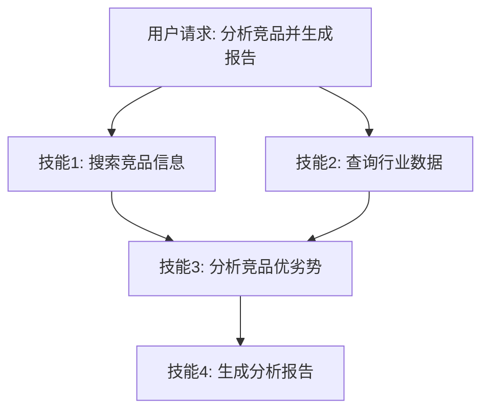

# Agent Skills

#### Agent Skill 的定义与设计原则


##### 1、基础题：Agent Skills 是什么？和 Function Calling / Tool 有什么区别？

**难度**：⭐（Skills 定义、封装粒度、与工具的关系）

**Answer**：

Skills（技能）是对 Agent 能力的**高层封装**，是比 Tool（工具）更高一级的抽象。

三者的层次关系：

```
Skills（技能）
  └── 由多个 Tools 组合而成
        └── 每个 Tool 通过 Function Calling 触发
```

**核心区别**：

<table>
<tr>
<td>
对比维度
</td>
<td>
Function Calling
</td>
<td>
Tool
</td>
<td>
Skill
</td>
</tr>
<tr>
<td>
抽象层次
</td>
<td>
最低（模型调用约定）
</td>
<td>
中（单一功能函数）
</td>
<td>
最高（业务能力单元）
</td>
</tr>
<tr>
<td>
封装粒度
</td>
<td>
单个函数
</td>
<td>
单个操作
</td>
<td>
完整业务流程
</td>
</tr>
<tr>
<td>
示例
</td>
<td>
<code>search(query)</code>
</td>
<td>
搜索工具
</td>
<td>
&quot;市场调研技能&quot;（搜索+分析+报告）
</td>
</tr>
<tr>
<td>
复用单位
</td>
<td>
函数
</td>
<td>
工具
</td>
<td>
技能（可跨 Agent 复用）
</td>
</tr>
</table>

**类比**：Tool 是"锤子"，Skill 是"装修能力"（会用锤子、钉子、刷子完成一项完整工作）。

---

##### 1、基础题：Agent Skill 和普通函数有什么区别？

**难度级别**：⭐（Skill基础概念）

普通函数是给开发者用的，Skill 是给 LLM 用的。核心区别在于：Skill 有语义化的描述（让LLM能理解做什么、适合什么场景）、有标准化的元数据（name/description/inputSchema）、内置可观测性（调用追踪、性能监控）。简单说，普通函数是"代码层面的抽象"，Skill 是"能力层面的抽象，面向LLM设计的"。

---

##### 2、进阶题：请解释 Agent Skill 的核心概念，以及设计 Agent Skill 时应该遵循哪些原则？如何评估一个 Skill 的质量？

**难度级别**：⭐⭐（Skill定义、与工具的区别、设计原则、质量评估指标）


1. **首先是 Skill 的本质**。Skill 是"面向LLM设计的能力单元"，和普通工具的核心区别在于深度适配LLM：描述是语义化的（不只是函数注释，而是包含做什么、适用场景、示例、注意事项）、元数据丰富（包含示例、错误处理、依赖说明）、内置可观测性（不需要手动加日志）。本质上 Skill 是在工具的基础上做了"LLM友好化"的封装。

1. **其次是四个核心设计原则**：单一职责——每个 Skill 只做一件事，"发邮件"和"验证邮箱格式"应该是两个 Skill，单一职责让 Skill 易于理解、测试和组合；幂等性——同一 Skill 被调用多次结果一致，对 Agent 的重试机制至关重要；可观测性——内置调用追踪和性能监控，方便排查问题；语义化描述——描述要包含做什么、输入输出、适用场景、示例，让LLM能精准理解和选用。

1. **最后是质量评估**。用五个量化指标：可调用成功率（>95%）、平均响应时间（非IO <1s，IO操作 <5s）、错误恢复率（>80%）、LLM选用准确率（>90%）、参数传递准确率（>95%）。这些指标通过日志和监控收集，LLM选用准确率低说明描述写得不好，参数准确率低说明 inputSchema 定义不清晰。


**3️⃣ Key Differences**

<table>
<tr>
<td>
维度
</td>
<td>
Common Answer
</td>
<td>
Impressive Answer
</td>
</tr>
<tr>
<td>
概念理解
</td>
<td>
只说&quot;给Agent用的能力&quot;
</td>
<td>
从目标用户、描述方式、可组合性、元数据等维度对比 Skill 与函数的区别
</td>
</tr>
<tr>
<td>
设计原则
</td>
<td>
只说&quot;简单可靠&quot;
</td>
<td>
四个具体原则：单一职责、幂等性、可观测性、语义化描述
</td>
</tr>
<tr>
<td>
质量评估
</td>
<td>
只说&quot;准确快速稳定&quot;
</td>
<td>
五个量化指标 + 指标低时的诊断思路
</td>
</tr>
<tr>
<td>
给面试官的印象
</td>
<td>
了解 Skill 概念
</td>
<td>
有完整的 Skill 设计方法论，知道如何设计和评估
</td>
</tr>
</table>

---

##### 3、场景题：设计一个"发送邮件" Skill，如何保证它在 Agent 中被正确理解和使用？

**难度级别**：⭐⭐（Skill 描述设计、幂等性保证、参数验证）

**1️⃣ Common Answer**

重点总结（便于面试记忆）：

- 关键是让 LLM 在"理解"和"调用"两个环节都不出错。理解环节：description 不能只写"email tool"...

**2️⃣ Impressive Answer**

关键是让 LLM 在"理解"和"调用"两个环节都不出错。理解环节：description 不能只写"email tool"，要写清楚适用场景（"用于向指定收件人发送邮件，适合通知、报告推送场景"）、参数说明（收件人格式要求、主题长度限制）、副作用提示（"每次调用消耗1个邮件配额，发送外部邮箱需审批"）。调用环节：inputSchema 要把 `to` 字段标注为 email 格式并设 required，这样 LLM 传参时 SDK 会自动验证格式。幂等性方面：发邮件本身不幂等，要在 Skill 里加幂等键（比如 idempotency_key），重复调用时检查该 key 是否已发送，避免 Agent 重试时重复发邮件。

**3️⃣ Key Differences**

<table>
<tr>
<td>
维度
</td>
<td>
Common Answer
</td>
<td>
Impressive Answer
</td>
</tr>
<tr>
<td>
描述质量
</td>
<td>
写函数注释
</td>
<td>
语义化描述包含场景、参数约束、副作用
</td>
</tr>
<tr>
<td>
参数验证
</td>
<td>
手动校验
</td>
<td>
JSON Schema 约束 + 自动验证
</td>
</tr>
<tr>
<td>
幂等性
</td>
<td>
未考虑
</td>
<td>
幂等键防止 Agent 重试时重复发送
</td>
</tr>
</table>

---

##### 4、容易一起考的题

<table>
<tr>
<td>
关联题
</td>
<td>
和本题的关系
</td>
<td>
参考答案
</td>
</tr>
<tr>
<td>
如何写好工具的 description，提升 LLM 的工具选择准确率？
</td>
<td>
Skill 语义化描述原则的核心，description 质量直接影响 LLM 选用准确率
</td>
<td>
答：工具 description 要写清使用场景、输入输出、限制和反例，让模型知道什么时候该用、什么时候不该用。
</td>
</tr>
<tr>
<td>
什么是幂等性，Agent 里为什么特别重要？
</td>
<td>
Skill 设计四原则之一，Agent 重试机制依赖幂等性保证结果一致
</td>
<td>
答：幂等性指同一操作重复执行多次结果一致，Agent 场景下可用 requestId、幂等键或状态机防止重试导致重复写入。
</td>
</tr>
<tr>
<td>
如何为 Skill 添加可观测性？
</td>
<td>
Skill 设计四原则之一，内置追踪和监控是 Skill 区别于普通工具的重要特征
</td>
<td>
答：工具调用题要讲 schema 描述、参数校验、权限控制、超时重试、幂等和观测；核心是让模型会选、会用、用错能兜底。
</td>
</tr>
</table>

---

#### 如何设计可复用的 Agent Skill 库

##### 1、基础题：什么是 Agent Skill 库，为什么要把 Skill 统一管理？

**难度级别**：⭐（考察要点：Skill 库的基本概念、可复用性价值）

Skill 库是把 Agent 可调用的能力单元统一注册、分类和管理的仓库。核心价值有两个：一是避免重复开发——同一个"发送邮件"能力可以被多个 Agent 共享；二是统一治理——所有 Skill 的版本、文档、测试集中管理，降低维护成本。没有 Skill 库，每个 Agent 各自实现同类功能，时间长了就会变成一堆散沙。

---

##### 2、进阶题：如何设计一个可复用的 Agent Skill 库？

**难度级别**：⭐⭐⭐（考察要点：目录结构设计、注册表机制、依赖处理、可扩展性）

**1️⃣ Common Answer**

重点总结（便于面试记忆）：

- 首先是组织结构
- 其次是注册表机制
- 然后是依赖处理
- 最后是可扩展性

**2️⃣ Impressive Answer**

我会从四个角度思考这个问题：

1. **首先是组织结构**。一个工程化的 Skill 库要分层：`core/`（推理、规划、记忆类核心 Skill）、`data/`（检索、转换、验证类）、`integration/`（API、数据库、消息发送）、`utils/`（文本、时间、数学工具），再加上 `common/`（基类、注册表、日志）和 `tests/`、`docs/`。结构清晰是可维护的前提。

1. **其次是注册表机制**。Skill 库的核心是 `SkillRegistry`，负责注册、发现、按类别列举、模糊搜索。注册时按 `(name, version)` 二元组做键，支持多版本共存，`get()` 方法默认返回最新版本。

1. **然后是依赖处理**。Skill 之间的依赖有三种处理方式：依赖注入（构造时传入依赖 Skill 实例，耦合最低）、依赖声明（在类属性里声明依赖名，运行时从 Registry 取）、依赖隔离（每个 Skill 完全独立，组合逻辑上移到 Agent 层）。工程上优先用依赖隔离，保持 Skill 的原子性。

1. **最后是可扩展性**。两个机制：插件机制（`load_plugin(path)` 动态 import 并自动注册模块里的所有 Skill 实例），和版本控制（Registry 按 `(name, version)` 存储，支持灰度切换和回滚）。文档和测试是可维护性保证——每个 Skill 要有 docstring（含参数、返回值、示例、注意事项）和对应的单元测试 + 集成测试。


**3️⃣ Key Differences**

<table>
<tr>
<td>
维度
</td>
<td>
Common Answer
</td>
<td>
Impressive Answer
</td>
</tr>
<tr>
<td>
组织结构
</td>
<td>
只说&quot;按功能分类&quot;
</td>
<td>
给出完整分层目录，并说明每层的职责
</td>
</tr>
<tr>
<td>
注册表
</td>
<td>
未提及
</td>
<td>
说明 SkillRegistry 的设计，含版本管理机制
</td>
</tr>
<tr>
<td>
依赖处理
</td>
<td>
只说&quot;处理依赖&quot;
</td>
<td>
给出三种方式并说明工程优先级
</td>
</tr>
<tr>
<td>
可扩展性
</td>
<td>
只说&quot;插件机制&quot;
</td>
<td>
区分插件动态加载和版本控制两个维度
</td>
</tr>
<tr>
<td>
给面试官的印象
</td>
<td>
了解 Skill 库的概念
</td>
<td>
有完整的 Skill 库设计经验，覆盖从组织到扩展的全流程
</td>
</tr>
</table>

---

##### 3、场景题：在一个多 Agent 系统中，多个 Agent 需要共享"发送通知"这类 Skill，你会如何设计共享机制？

**难度级别**：⭐⭐⭐（考察要点：Skill 共享、依赖隔离、版本兼容、并发安全）

**1️⃣ Common Answer**

重点总结（便于面试记忆）：

- 共享 Skill 的核心问题是三个：线程安全、版本兼容、状态隔离。
- 首先，Skill 实例要设计成无状态的（Stateless），所有输入通过参数传入、所有输出通过返回值返回，这样多个 Agent 可以并发调用同一个 Skill 实例...
- 其次，Registry 采用单例模式，所有 Agent 共享同一个 Registry，但 get(name, version) 时各自指定版本，这样新 Agent 可以用 v2...
- 最后，对于有副作用的 Skill（比如"发送通知"会调用外部 API），要在 Skill 层做幂等设计——相同 request_id 的调用只执行一次，避免多 Agent 并发...

**2️⃣ Impressive Answer**

共享 Skill 的核心问题是三个：线程安全、版本兼容、状态隔离。

首先，Skill 实例要设计成无状态的（Stateless），所有输入通过参数传入、所有输出通过返回值返回，这样多个 Agent 可以并发调用同一个 Skill 实例，不需要加锁，也不会有状态污染。

其次，Registry 采用单例模式，所有 Agent 共享同一个 Registry，但 `get(name, version)` 时各自指定版本，这样新 Agent 可以用 `v2.0.0`，旧 Agent 继续用 `v1.0.0`，做到平滑升级、互不影响。

最后，对于有副作用的 Skill（比如"发送通知"会调用外部 API），要在 Skill 层做幂等设计——相同 request_id 的调用只执行一次，避免多 Agent 并发触发重复发送。这比在调用方加锁更工程化。

**3️⃣ Key Differences**

<table>
<tr>
<td>
维度
</td>
<td>
Common Answer
</td>
<td>
Impressive Answer
</td>
</tr>
<tr>
<td>
并发安全
</td>
<td>
说&quot;加锁&quot;
</td>
<td>
从根本上设计无状态 Skill，避免锁的需要
</td>
</tr>
<tr>
<td>
版本兼容
</td>
<td>
说&quot;自己指定版本&quot;
</td>
<td>
说明 Registry 单例 + 多版本共存的具体机制
</td>
</tr>
<tr>
<td>
副作用处理
</td>
<td>
未提及
</td>
<td>
提出幂等设计，覆盖有副作用 Skill 的生产场景
</td>
</tr>
<tr>
<td>
给面试官的印象
</td>
<td>
知道要共享
</td>
<td>
理解多 Agent 系统的工程约束，设计到位
</td>
</tr>
</table>

---

##### 4、容易一起考的题

<table>
<tr>
<td>
关联题
</td>
<td>
和本题的关系
</td>
<td>
参考答案
</td>
</tr>
<tr>
<td>
LangChain 的 Tool 和 Skill 有什么区别？
</td>
<td>
Tool 是 LangChain 框架内的 Skill 实现，理解 Skill 库有助于理解 Tool 注册和管理机制
</td>
<td>
答：LangChain 的 Tool 注册依赖函数名、description 和参数 schema；@tool 会把函数包装成可被 Agent 选择和调用的工具。
</td>
</tr>
<tr>
<td>
如何给 Agent 的工具调用做权限控制？
</td>
<td>
Skill 库的注册表天然是权限控制的切入点，可以在 <code>get()</code> 层加 ACL
</td>
<td>
答：工具调用题要讲 schema 描述、参数校验、权限控制、超时重试、幂等和观测；核心是让模型会选、会用、用错能兜底。
</td>
</tr>
<tr>
<td>
Skill 库如何做灰度发布和回滚？
</td>
<td>
和版本控制机制直接相关，Registry 按版本存储是灰度切换的基础
</td>
<td>
答：这题可以按“定义 → 核心机制 → 工程落地”三步答；结合本题重点强调：和版本控制机制直接相关，Registry 按版本存储是灰度切换的基础，最后补一个风险点或优化手段。
</td>
</tr>
</table>

#### 技能注册发现、组合与版本管理

##### 2、进阶题：技能的注册与动态发现机制是如何设计的？

**难度**：⭐⭐⭐（技能注册、动态发现、路由机制、技能选择）

**1️⃣ Common Answer**：

重点总结（便于面试记忆）：

- 注册-发现-路由
- 技能注册（启动时）
- 技能路由（运行时）
- 动态发现

**2️⃣ Impressive Answer**：

技能系统的设计核心是**注册-发现-路由**三个环节：

**1. 技能注册（启动时）**

```java
// 技能接口定义
public interface AgentSkill {
    String getName();
    String getDescription();  // 供 LLM 理解技能用途
    List<String> getCapabilities();  // 技能能力标签
    SkillResult execute(SkillContext context);
}

// 技能注册中心
@Component
public class SkillRegistry {
    private final Map<String, AgentSkill> skills = new ConcurrentHashMap<>();

    // 自动扫描所有 @Skill 注解的 Bean
    @PostConstruct
    public void registerAll(List<AgentSkill> skillBeans) {
        skillBeans.forEach(skill -> skills.put(skill.getName(), skill));
        log.info("已注册 {} 个技能: {}", skills.size(), skills.keySet());
    }

    public List<SkillMeta> listSkills() {
        return skills.values().stream()
            .map(s -> new SkillMeta(s.getName(), s.getDescription(), s.getCapabilities()))
            .toList();
    }
}
```

**2. 技能路由（运行时）**

```java
@Service
public class SkillRouter {
    private final SkillRegistry registry;
    private final ChatClient chatClient;

    public AgentSkill route(String userIntent) {
        // 方式一：LLM 语义路由（准确但慢）
        String skillName = chatClient.prompt()
            .system("根据用户意图，从以下技能中选择最合适的一个，只返回技能名称：\n"
                    + registry.listSkills().stream()
                        .map(s -> s.name() + ": " + s.description())
                        .collect(Collectors.joining("\n")))
            .user(userIntent)
            .call().content();

        // 方式二：Embedding 相似度路由（快但需要向量库）
        // String skillName = embeddingRouter.findMostSimilar(userIntent, registry.listSkills());

        return registry.getSkill(skillName);
    }
}
```

**3. 动态发现**：支持运行时热注册，新技能上线无需重启 Agent：

```java
public void registerSkill(AgentSkill skill) {
    skills.put(skill.getName(), skill);
    // 通知所有 Agent 实例更新技能列表（分布式场景用消息队列）
    eventPublisher.publishEvent(new SkillRegisteredEvent(skill.getName()));
}
```

**3️⃣ Key Differences**

<table>
<tr>
<td>
维度
</td>
<td>
Common Answer
</td>
<td>
Impressive Answer
</td>
</tr>
<tr>
<td>
设计完整性
</td>
<td>
只说了 Map 存储
</td>
<td>
注册-发现-路由完整设计
</td>
</tr>
<tr>
<td>
路由策略
</td>
<td>
无
</td>
<td>
LLM 语义路由 vs Embedding 路由对比
</td>
</tr>
<tr>
<td>
扩展性
</td>
<td>
无
</td>
<td>
支持运行时热注册
</td>
</tr>
<tr>
<td>
面试官印象
</td>
<td>
知道概念
</td>
<td>
能设计技能系统架构
</td>
</tr>
</table>

---

##### 3、进阶题：技能链（串行）和技能并行有什么区别？如何管理技能间的依赖？

**难度**：⭐⭐⭐（技能编排、依赖管理、DAG、并行执行）

**1️⃣ Common Answer**：

重点总结（便于面试记忆）：

- 简单线性流程 → 技能链
- 完全独立的技能 → 并行
- 复杂依赖关系 → DAG 调度

**2️⃣ Impressive Answer**：

技能编排的核心是**依赖分析**，本质上是一个 DAG（有向无环图）调度问题：



**实现方案**：

```java
public class SkillPipeline {

    // 串行技能链
    public SkillResult chain(List<AgentSkill> skills, SkillContext initialContext) {
        SkillContext context = initialContext;
        for (AgentSkill skill : skills) {
            SkillResult result = skill.execute(context);
            // 上一个技能的输出作为下一个技能的输入
            context = context.withPreviousResult(result);
        }
        return context.getLastResult();
    }

    // 并行技能执行（无依赖关系）
    public List<SkillResult> parallel(List<AgentSkill> skills, SkillContext context) {
        List<CompletableFuture<SkillResult>> futures = skills.stream()
            .map(skill -> CompletableFuture.supplyAsync(
                () -> skill.execute(context), skillExecutorPool))
            .toList();

        return futures.stream()
            .map(CompletableFuture::join)
            .toList();
    }

    // DAG 调度（有复杂依赖关系）
    public Map<String, SkillResult> dagExecute(SkillDag dag, SkillContext context) {
        Map<String, SkillResult> results = new ConcurrentHashMap<>();
        // 拓扑排序，按层并行执行
        dag.topologicalLayers().forEach(layer -> {
            List<CompletableFuture<Void>> layerFutures = layer.stream()
                .map(skill -> CompletableFuture.runAsync(() -> {
                    SkillContext enrichedContext = context.withResults(results);
                    results.put(skill.getName(), skill.execute(enrichedContext));
                }, skillExecutorPool))
                .toList();
            CompletableFuture.allOf(layerFutures.toArray(new CompletableFuture[0])).join();
        });
        return results;
    }
}
```

**选型建议**：

- 简单线性流程 → 技能链

- 完全独立的技能 → 并行

- 复杂依赖关系 → DAG 调度

**3️⃣ Key Differences**

<table>
<tr>
<td>
维度
</td>
<td>
Common Answer
</td>
<td>
Impressive Answer
</td>
</tr>
<tr>
<td>
技术深度
</td>
<td>
只说了串行和并行
</td>
<td>
引入 DAG 调度解决复杂依赖
</td>
</tr>
<tr>
<td>
代码实现
</td>
<td>
无
</td>
<td>
有串行/并行/DAG 三种实现
</td>
</tr>
<tr>
<td>
可视化
</td>
<td>
无
</td>
<td>
有 mermaid 依赖图
</td>
</tr>
<tr>
<td>
面试官印象
</td>
<td>
知道概念
</td>
<td>
能设计技能编排引擎
</td>
</tr>
</table>

---

##### 4、进阶题：技能的上下文（SkillContext）应该如何设计？需要携带哪些信息？

**难度**：⭐⭐⭐（上下文设计、信息传递、不可变性、线程安全）

**1️⃣ Common Answer**：

重点总结（便于面试记忆）：

- 技能并行执行时，多个技能共享同一个 Context，不可变保证线程安全
- 方便调试和回放：每一步的 Context 快照都可以保存和复现
- 避免技能之间通过 Context 产生隐式耦合

**2️⃣ Impressive Answer**：

SkillContext 是技能系统的"血液"，设计好坏直接影响技能的可测试性和可组合性。核心设计原则是**不可变 + 分层 + 链式扩展**：

```java
// 不可变上下文，每次扩展返回新实例
@Builder(toBuilder = true)
@Value
public class SkillContext {
    // 1. 用户意图层
    String userIntent;
    String sessionId;
    String userId;

    // 2. 对话历史层
    List<Message> conversationHistory;

    // 3. 技能执行层（DAG 场景：前置技能的所有输出）
    Map<String, SkillResult> previousResults;
    // 技能链场景：上一个技能的输出
    SkillResult lastResult;

    // 4. 运行时元数据层
    Map<String, Object> metadata;
    Instant startTime;  // 用于超时控制

    // 链式扩展：返回新实例，保证不可变
    public SkillContext withPreviousResult(SkillResult result) {
        return this.toBuilder().lastResult(result).build();
    }

    public SkillContext withResults(Map<String, SkillResult> results) {
        Map<String, SkillResult> merged = new HashMap<>(this.previousResults);
        merged.putAll(results);
        return this.toBuilder()
            .previousResults(Collections.unmodifiableMap(merged))
            .build();
    }
}
```

**为什么要不可变**：

- 技能并行执行时，多个技能共享同一个 Context，不可变保证线程安全

- 方便调试和回放：每一步的 Context 快照都可以保存和复现

- 避免技能之间通过 Context 产生隐式耦合

**3️⃣ Key Differences**

<table>
<tr>
<td>
维度
</td>
<td>
Common Answer
</td>
<td>
Impressive Answer
</td>
</tr>
<tr>
<td>
数据结构
</td>
<td>
用 Map 存所有数据
</td>
<td>
分层设计（用户层/历史层/执行层/元数据层）
</td>
</tr>
<tr>
<td>
线程安全
</td>
<td>
未考虑
</td>
<td>
不可变设计，天然线程安全
</td>
</tr>
<tr>
<td>
可扩展性
</td>
<td>
无
</td>
<td>
链式扩展方法，支持 DAG 和链式两种场景
</td>
</tr>
<tr>
<td>
面试官印象
</td>
<td>
知道需要上下文
</td>
<td>
能设计生产级不可变上下文
</td>
</tr>
</table>

---

##### 5、进阶题：如何给技能系统加上可观测性（Observability）？

**难度**：⭐⭐⭐（链路追踪、指标采集、日志规范、成本统计）

**1️⃣ Common Answer**：

重点总结（便于面试记忆）：

- Trace（链路）、Metrics（指标）、Logs（日志）
- LLM 技能额外需要统计 Token 成本
- 技能系统的可观测性需要覆盖 Trace（链路）、Metrics（指标）、Logs（日志） 三个维度，通常用 AOP 统一切入，业务代码零侵入
- ```java @Aspect @Component public class SkillObservabilityAspect {
- private final MeterRegistry meterRegistry; private final Tracer tracer;
- @Around("execution(* com.example.skill.AgentSkill.execute(..))") public Object observe(P...

**2️⃣ Impressive Answer**：

技能系统的可观测性需要覆盖 **Trace（链路）、Metrics（指标）、Logs（日志）** 三个维度，通常用 AOP 统一切入，业务代码零侵入：

```java
@Aspect
@Component
public class SkillObservabilityAspect {

    private final MeterRegistry meterRegistry;
    private final Tracer tracer;

    @Around("execution(* com.example.skill.AgentSkill.execute(..))")
    public Object observe(ProceedingJoinPoint joinPoint) throws Throwable {
        AgentSkill skill = (AgentSkill) joinPoint.getTarget();
        String skillName = skill.getName();

        // 1. 链路追踪：创建 Span
        Span span = tracer.nextSpan()
            .name("skill." + skillName)
            .tag("skill.name", skillName)
            .start();

        long startMs = System.currentTimeMillis();
        try (Tracer.SpanInScope scope = tracer.withSpan(span)) {
            Object result = joinPoint.proceed();
            long durationMs = System.currentTimeMillis() - startMs;

            // 2. 指标：成功计数 + 耗时
            meterRegistry.counter("skill.executions.total",
                "skill", skillName, "status", "success").increment();
            meterRegistry.timer("skill.duration.ms", "skill", skillName)
                .record(durationMs, TimeUnit.MILLISECONDS);

            // 3. 结构化日志
            log.info("[Skill] name={} status=success duration={}ms", skillName, durationMs);
            return result;

        } catch (Exception exception) {
            meterRegistry.counter("skill.executions.total",
                "skill", skillName, "status", "error").increment();
            span.tag("error", exception.getMessage());
            log.error("[Skill] name={} status=error error={}", skillName, exception.getMessage());
            throw exception;
        } finally {
            span.end();
        }
    }
}
```

**LLM 技能额外需要统计 Token 成本**，在 SkillResult 中携带：

```java
public record SkillResult(
    boolean success,
    Object data,
    String errorMessage,
    TokenUsage tokenUsage   // promptTokens + completionTokens + totalCostUsd
) {}
```

**3️⃣ Key Differences**

<table>
<tr>
<td>
维度
</td>
<td>
Common Answer
</td>
<td>
Impressive Answer
</td>
</tr>
<tr>
<td>
覆盖维度
</td>
<td>
只有日志
</td>
<td>
Trace + Metrics + Logs 三维覆盖
</td>
</tr>
<tr>
<td>
实现方式
</td>
<td>
手动打日志
</td>
<td>
AOP 统一切入，业务代码零侵入
</td>
</tr>
<tr>
<td>
LLM 特性
</td>
<td>
无
</td>
<td>
额外统计 Token 成本
</td>
</tr>
<tr>
<td>
面试官印象
</td>
<td>
知道要打日志
</td>
<td>
能设计生产级可观测体系
</td>
</tr>
</table>

---

##### 6、场景题：技能执行失败时，如何设计重试和降级策略？

**难度**：⭐⭐⭐（重试机制、降级策略、熔断器、错误分类）

**1️⃣ Common Answer**：

重点总结（便于面试记忆）：

- 区分错误类型
- 错误分类原则
- 技能失败的处理需要先区分错误类型，再配合熔断器防止雪崩
- ```java @Service public class ResilientSkillExecutor {
- private final CircuitBreakerRegistry circuitBreakerRegistry;
- public SkillResult executeWithResilience(AgentSkill skill, SkillContext context) { Circu...

**2️⃣ Impressive Answer**：

技能失败的处理需要先**区分错误类型**，再配合熔断器防止雪崩：

```java
@Service
public class ResilientSkillExecutor {

    private final CircuitBreakerRegistry circuitBreakerRegistry;

    public SkillResult executeWithResilience(AgentSkill skill, SkillContext context) {
        CircuitBreaker circuitBreaker = circuitBreakerRegistry.circuitBreaker(skill.getName());
        return circuitBreaker.executeSupplier(() -> retryWithBackoff(skill, context));
    }

    private SkillResult retryWithBackoff(AgentSkill skill, SkillContext context) {
        int maxRetries = 3;
        for (int attempt = 1; attempt <= maxRetries; attempt++) {
            try {
                return skill.execute(context);
            } catch (RateLimitException exception) {
                // 限流：指数退避重试
                if (attempt < maxRetries) {
                    sleep(500L * (1L << attempt));
                }
            } catch (SkillLogicException exception) {
                // 业务逻辑错误：不重试，直接降级
                return fallback(skill, context);
            }
        }
        return fallback(skill, context);
    }

    private SkillResult fallback(AgentSkill skill, SkillContext context) {
        // 降级优先级：缓存结果 > 简化版技能 > 兜底回答
        return Optional.ofNullable(skillCache.getLastSuccessResult(skill.getName(), context))
            .orElseGet(() -> skill.simplifiedExecute(context)
                .orElse(SkillResult.fallback("当前能力暂时不可用，已为您提供基础回答")));
    }
}
```

**错误分类原则**：

<table>
<tr>
<td>
错误类型
</td>
<td>
示例
</td>
<td>
处理策略
</td>
</tr>
<tr>
<td>
瞬时错误
</td>
<td>
网络超时、限流
</td>
<td>
指数退避重试
</td>
</tr>
<tr>
<td>
业务错误
</td>
<td>
参数不合法、权限不足
</td>
<td>
不重试，直接返回错误
</td>
</tr>
<tr>
<td>
依赖不可用
</td>
<td>
下游服务宕机
</td>
<td>
熔断 + 降级
</td>
</tr>
<tr>
<td>
幂等性问题
</td>
<td>
写操作已执行
</td>
<td>
检查幂等键，避免重复执行
</td>
</tr>
</table>

**3️⃣ Key Differences**

<table>
<tr>
<td>
维度
</td>
<td>
Common Answer
</td>
<td>
Impressive Answer
</td>
</tr>
<tr>
<td>
错误分类
</td>
<td>
无区分，统一重试
</td>
<td>
区分可重试/不可重试错误
</td>
</tr>
<tr>
<td>
重试策略
</td>
<td>
固定间隔重试
</td>
<td>
指数退避 + 熔断器防雪崩
</td>
</tr>
<tr>
<td>
降级层次
</td>
<td>
只有兜底回答
</td>
<td>
缓存 &gt; 简化版 &gt; 兜底三级降级
</td>
</tr>
<tr>
<td>
面试官印象
</td>
<td>
知道要重试
</td>
<td>
能设计生产级容错体系
</td>
</tr>
</table>

---

##### 7、进阶题：技能的权限控制和安全隔离如何设计？

**难度**：⭐⭐（权限模型、输入校验、执行隔离、Prompt 注入防护）

**1️⃣ Common Answer**：

重点总结（便于面试记忆）：

- 访问控制、输入校验、执行隔离
- 访问控制（RBAC 注解）
- 输入校验（防 Prompt 注入）
- 执行隔离

**2️⃣ Impressive Answer**：

技能安全需要从**访问控制、输入校验、执行隔离**三个层次设计：

**1. 访问控制（RBAC 注解）**：

```java
@Retention(RetentionPolicy.RUNTIME)
@Target(ElementType.TYPE)
public @interface SkillPermission {
    String[] requiredRoles() default {};
    boolean requiresAuth() default true;
    RiskLevel riskLevel() default RiskLevel.LOW;
}

@SkillPermission(requiredRoles = {"ADMIN", "DATA_ANALYST"}, riskLevel = RiskLevel.HIGH)
public class DatabaseQuerySkill implements AgentSkill {
    // 高风险技能，只有管理员和数据分析师可用
}
```

**2. 输入校验（防 Prompt 注入）**：

```java
public class SkillInputValidator {
    private static final Pattern INJECTION_PATTERN =
        Pattern.compile("(?i)(ignore previous|disregard|forget|system prompt)");

    public void validate(SkillContext context) {
        String userIntent = context.getUserIntent();
        if (INJECTION_PATTERN.matcher(userIntent).find()) {
            throw new SkillSecurityException("检测到潜在的 Prompt 注入攻击");
        }
        if (userIntent.length() > 10_000) {
            throw new SkillSecurityException("输入超过最大长度限制");
        }
    }
}
```

**3. 执行隔离**：高风险技能在独立沙箱线程池中运行，资源上限隔离：

```java
private final ExecutorService sandboxPool = new ThreadPoolExecutor(
    2, 5, 60L, TimeUnit.SECONDS,
    new LinkedBlockingQueue<>(10),
    new ThreadFactoryBuilder().setNameFormat("skill-sandbox-%d").build(),
    new ThreadPoolExecutor.AbortPolicy()  // 超出容量直接拒绝，不影响主流程
);
```

**3️⃣ Key Differences**

<table>
<tr>
<td>
维度
</td>
<td>
Common Answer
</td>
<td>
Impressive Answer
</td>
</tr>
<tr>
<td>
控制粒度
</td>
<td>
只说了用户权限
</td>
<td>
RBAC + 输入校验 + 执行隔离三层
</td>
</tr>
<tr>
<td>
安全意识
</td>
<td>
无
</td>
<td>
考虑了 Prompt 注入攻击
</td>
</tr>
<tr>
<td>
资源隔离
</td>
<td>
无
</td>
<td>
高风险技能独立线程池，防止资源耗尽
</td>
</tr>
<tr>
<td>
面试官印象
</td>
<td>
知道要鉴权
</td>
<td>
能设计多层次安全防护体系
</td>
</tr>
</table>

---

##### 8、场景题：在 Spring AI 框架中，如何实现一个完整的自定义技能？

**难度**：⭐⭐⭐（Spring AI 实践、Function Calling 集成、技能注册、端到端流程）

**1️⃣ Common Answer**：

重点总结（便于面试记忆）：

- 定义 → 注册 → 挂载 → 执行
- Step 1：定义技能（实现 Function 接口）
- Step 2：注册为 FunctionCallback
- Step 3：Agent 调用时动态挂载技能
- 端到端流程

**2️⃣ Impressive Answer**：

Spring AI 中实现自定义技能的完整流程分为**定义 → 注册 → 挂载 → 执行**四步：

**Step 1：定义技能（实现 Function 接口）**

```java
public record WeatherQueryInput(
    @JsonProperty(required = true) String city,
    @JsonProperty(defaultValue = "celsius") String unit
) {}

public record WeatherQueryOutput(
    String city, double temperature, String description
) {}

@Component("weatherQuerySkill")
@Description("查询指定城市的实时天气信息，支持摄氏度和华氏度")
public class WeatherQuerySkill implements Function<WeatherQueryInput, WeatherQueryOutput> {

    private final WeatherApiClient weatherApiClient;

    @Override
    public WeatherQueryOutput apply(WeatherQueryInput input) {
        WeatherData data = weatherApiClient.query(input.city());
        double temperature = "fahrenheit".equals(input.unit())
            ? data.getCelsius() * 9.0 / 5 + 32
            : data.getCelsius();
        return new WeatherQueryOutput(input.city(), temperature, data.getDescription());
    }
}
```

**Step 2：注册为 FunctionCallback**

```java
@Configuration
public class SkillConfig {

    @Bean
    public FunctionCallback weatherSkillCallback(WeatherQuerySkill skill) {
        return FunctionCallbackWrapper.builder(skill)
            .withName("queryWeather")
            .withDescription("查询指定城市的实时天气信息")
            .withResponseConverter(response -> JSON.toJSONString(response))
            .build();
    }
}
```

**Step 3：Agent 调用时动态挂载技能**

```java
@Service
public class WeatherAgent {

    private final ChatClient chatClient;

    public String chat(String userMessage) {
        return chatClient.prompt()
            .system("你是一个天气助手，可以查询实时天气信息")
            .user(userMessage)
            .functions("queryWeather")   // 挂载技能
            .call()
            .content();
    }
}
```

**端到端流程**：

```
用户: "北京今天天气怎么样？"
  → LLM 识别意图，生成 Function Call: queryWeather({"city": "北京"})
  → Spring AI 路由到 WeatherQuerySkill.apply()
  → 返回天气数据给 LLM
  → LLM 生成自然语言回答: "北京今天气温 18°C，晴天"
```

**3️⃣ Key Differences**

<table>
<tr>
<td>
维度
</td>
<td>
Common Answer
</td>
<td>
Impressive Answer
</td>
</tr>
<tr>
<td>
实现完整性
</td>
<td>
只说了注册 @Bean
</td>
<td>
定义→注册→挂载→执行完整流程
</td>
</tr>
<tr>
<td>
代码规范
</td>
<td>
无
</td>
<td>
有 DTO 设计、@Description 注解
</td>
</tr>
<tr>
<td>
框架理解
</td>
<td>
模糊
</td>
<td>
清楚 FunctionCallbackWrapper 的用法
</td>
</tr>
<tr>
<td>
面试官印象
</td>
<td>
知道 Spring AI 能做
</td>
<td>
能写出可运行的完整代码
</td>
</tr>
</table>

---

##### 9、基础题：技能的输入输出格式如何标准化？为什么不能直接用 String？

**难度**：⭐⭐（接口标准化、类型安全、JSON Schema、向后兼容）

**Answer**：

直接用 String 传递技能输入输出有三个核心问题：**类型不安全、无法校验、难以扩展**。

**标准化方案**：强类型 DTO + JSON Schema 描述：

```java
// 强类型输入，编译期保证类型安全
public record SkillInput(
    @NotNull String intent,
    @Valid Map<String, Object> params,
    String sessionId
) {}

// 标准化输出，携带元信息
public record SkillResult(
    boolean success,
    Object data,
    String errorMessage,
    TokenUsage tokenUsage
) {
    public static SkillResult success(Object data) {
        return new SkillResult(true, data, null, null);
    }

    public static SkillResult failure(String errorMessage) {
        return new SkillResult(false, null, errorMessage, null);
    }
}
```

**JSON Schema 的作用**：LLM 在调用技能时，需要知道技能的参数格式。通过 JSON Schema 描述参数结构，LLM 才能生成正确的参数：

```json
{
  "name": "queryWeather",
  "parameters": {
    "type": "object",
    "properties": {
      "city": {"type": "string", "description": "城市名称"},
      "unit": {"type": "string", "enum": ["celsius", "fahrenheit"]}
    },
    "required": ["city"]
  }
}
```

**向后兼容原则**：新版本只能新增字段，不能删除或重命名已有字段，否则依赖旧格式的调用方会报错。

---

##### 10、基础题：技能版本管理和热更新如何实现？

**难度**：⭐⭐（版本管理、热更新、灰度发布、兼容性）

**Answer**：

技能版本管理的核心是**不停机更新**，需要解决三个问题：

**1. 版本标识**：每个技能有语义化版本号（`major.minor.patch`），接口变更升 major，新增功能升 minor，修复升 patch

**2. 热更新实现**：

```java
@Service
public class SkillHotReloader {

    @EventListener(SkillUpdateEvent.class)
    public void onSkillUpdate(SkillUpdateEvent event) {
        String skillName = event.getSkillName();
        String newVersion = event.getNewVersion();

        // 用新的 ClassLoader 加载新版本技能
        AgentSkill newSkill = skillLoader.load(skillName, newVersion);

        // 灰度：先让 10% 流量走新版本
        skillRegistry.registerWithGrayScale(skillName, newSkill, 0.1);

        log.info("技能 {} 热更新到 {}，灰度 10%", skillName, newVersion);
    }
}
```

**3. 兼容性保证**：

- 新版本技能必须向后兼容（不能删除已有参数）

- 不兼容变更需要同时维护新旧两个版本，等旧版本流量归零后再下线

- 技能接口变更需要提前通知所有依赖方

---

##### 11、容易一起考的题

<table>
<tr>
<td>
关联题
</td>
<td>
和 Skills 的关系
</td>
<td>
参考答案
</td>
</tr>
<tr>
<td>
Function Calling 原理
</td>
<td>
Skills 底层依赖 Function Calling 触发
</td>
<td>
答：工具调用题要讲 schema 描述、参数校验、权限控制、超时重试、幂等和观测；核心是让模型会选、会用、用错能兜底。
</td>
</tr>
<tr>
<td>
ReAct 框架
</td>
<td>
Agent 通过 ReAct 决策调用哪个 Skill
</td>
<td>
答：ReAct 按 Thought、Action、Observation 循环推进：先规划下一步，再调用工具，最后根据观察结果继续推理或收敛答案。
</td>
</tr>
<tr>
<td>
线程池设计
</td>
<td>
技能并行执行依赖线程池隔离
</td>
<td>
答：这题可以按“定义 → 核心机制 → 工程落地”三步答；结合本题重点强调：技能并行执行依赖线程池隔离，最后补一个风险点或优化手段。
</td>
</tr>
<tr>
<td>
熔断器（Sentinel/Resilience4j）
</td>
<td>
技能容错的核心组件
</td>
<td>
答：这题可以按“定义 → 核心机制 → 工程落地”三步答；结合本题重点强调：技能容错的核心组件，最后补一个风险点或优化手段。
</td>
</tr>
<tr>
<td>
Spring AOP
</td>
<td>
技能可观测性的实现方式
</td>
<td>
答：代理机制不同；Spring 的选择策略；自调用失效是核心陷阱；@Transactional 失效场景
</td>
</tr>
<tr>
<td>
Token 成本控制
</td>
<td>
LLM 技能需要统计和控制 Token 消耗
</td>
<td>
答：成本优化先拆 Token、模型、工具和重试四类开销，再用缓存、小模型路由、Prompt 压缩、批处理和限流降级优化。
</td>
</tr>
</table>
---

## 知识点一句话总结

| 知识点 | 一句话总结（来自 Impressive Answer） |
| --- | --- |
| Agent Skill 的定义与设计原则 | 首先是 Skill 的本质：Skill 是"面向LLM设计的能力单元"，和普通工具的核心区别在于深度适配LLM：描述是语义化的（不只是函数注释，而是包含做什么、适用场景、示例、注意事项）、元数据丰富（包含示例、错误处理、依赖说明）、内置可观测性（不需要手动加日志）。本质上 Skill 是在工具的基础上做了"LLM友好化"的封装；其次是四个核心设计原则：单一职责——每个 Skill 只做一件事，"发邮件"和"验证邮箱格式"应该是两个 Skill，单一职责让 Skill 易于理解、测试和组合；幂等性——同一 Skill 被调用多次结果一致，对 Agent 的重试机制至关重要；可观测性——内置调用追踪和性能监控，方便排查问题；语义化描述——描述要包含做什么、输入输出、适用场景、示例，让LLM能精准理解和选用；最后是质量评估：用五个量化指标：可调用成功率（>95%）、平均响应时间（非IO 80%）、LLM选用准确率（>90%）、参数传递准确率（>95%）。这些指标通过日志和监控收集，LLM选用准确率低说明描述写得不好，参数准确率低说明 inputSchema 定义不清晰。 |
| Agent Skills 是什么？和 Function Calling / Tool 有什么区别？ | Tool 是可调用能力本身，重点在参数 schema、执行函数和返回结果；Skill 是面向 LLM 的能力封装，除 Tool 外还包含语义说明、适用场景、示例、约束、依赖和可观测性，让模型更容易判断何时使用以及如何正确使用。 |
| Agent Skill 和普通函数有什么区别？ | 普通函数是给开发者用的，Skill 是给 LLM 用的。核心区别在于：Skill 有语义化的描述（让LLM能理解做什么、适合什么场景）、有标准化的元数据（name/description/inputSchema）、内置可观测性（调用追踪、性能监控）。简单说，普通函数是"代码层面的抽象"，Skill 是"能力层面的抽象，面向LLM设计的"。 |
| 请解释 Agent Skill 的核心概念，以及设计 Agent Skill 时应该遵循哪些原则？如何评估一个 Skill 的质量？ | 首先是 Skill 的本质：Skill 是"面向LLM设计的能力单元"，和普通工具的核心区别在于深度适配LLM：描述是语义化的（不只是函数注释，而是包含做什么、适用场景、示例、注意事项）、元数据丰富（包含示例、错误处理、依赖说明）、内置可观测性（不需要手动加日志）。本质上 Skill 是在工具的基础上做了"LLM友好化"的封装；其次是四个核心设计原则：单一职责——每个 Skill 只做一件事，"发邮件"和"验证邮箱格式"应该是两个 Skill，单一职责让 Skill 易于理解、测试和组合；幂等性——同一 Skill 被调用多次结果一致，对 Agent 的重试机制至关重要；可观测性——内置调用追踪和性能监控，方便排查问题；语义化描述——描述要包含做什么、输入输出、适用场景、示例，让LLM能精准理解和选用；最后是质量评估：用五个量化指标：可调用成功率（>95%）、平均响应时间（非IO 80%）、LLM选用准确率（>90%）、参数传递准确率（>95%）。这些指标通过日志和监控收集，LLM选用准确率低说明描述写得不好，参数准确率低说明 inputSchema 定义不清晰。 |
| 设计一个"发送邮件" Skill，如何保证它在 Agent 中被正确理解和使用？ | 关键是让 LLM 在"理解"和"调用"两个环节都不出错。理解环节：description 不能只写"email tool"，要写清楚适用场景（"用于向指定收件人发送邮件，适合通知、报告推送场景"）、参数说明（收件人格式要求、主题长度限制）、副作用提示（"每次调用消耗1个邮件配额，发送外部邮箱需审批"）。调用环节：inputSchema 要把 to 字段标注为 email 格式并设 required，这样 LLM 传参时 SDK 会自动验证格式。幂等性方面：发邮件本身不幂等，要在 Skill 里加幂等键（比如 idempotency_key），重复调用时检查该 key 是否已发送，避免 Agent 重试时重复发邮件。 |
| 如何设计可复用的 Agent Skill 库 | 首先是组织结构：一个工程化的 Skill 库要分层：core/（推理、规划、记忆类核心 Skill）、data/（检索、转换、验证类）、integration/（API、数据库、消息发送）、utils/（文本、时间、数学工具），再加上 common/（基类、注册表、日志）和 tests/、docs/。结构清晰是可维护的前提；其次是注册表机制：Skill 库的核心是 SkillRegistry，负责注册、发现、按类别列举、模糊搜索。注册时按 (name, version) 二元组做键，支持多版本共存，get() 方法默认返回最新版本；然后是依赖处理：Skill 之间的依赖有三种处理方式：依赖注入（构造时传入依赖 Skill 实例，耦合最低）、依赖声明（在类属性里声明依赖名，运行时从 Registry 取）、依赖隔离（每个 Skill 完全独立，组合逻辑上移到 Agent 层）。工程上优先用依赖隔离，保持 Skill 的原子性。 |
| 什么是 Agent Skill 库，为什么要把 Skill 统一管理？ | Skill 库是把 Agent 可调用的能力单元统一注册、分类和管理的仓库。核心价值有两个：一是避免重复开发——同一个"发送邮件"能力可以被多个 Agent 共享；二是统一治理——所有 Skill 的版本、文档、测试集中管理，降低维护成本。没有 Skill 库，每个 Agent 各自实现同类功能，时间长了就会变成一堆散沙。 |
| 如何设计一个可复用的 Agent Skill 库？ | 首先是组织结构：一个工程化的 Skill 库要分层：core/（推理、规划、记忆类核心 Skill）、data/（检索、转换、验证类）、integration/（API、数据库、消息发送）、utils/（文本、时间、数学工具），再加上 common/（基类、注册表、日志）和 tests/、docs/。结构清晰是可维护的前提；其次是注册表机制：Skill 库的核心是 SkillRegistry，负责注册、发现、按类别列举、模糊搜索。注册时按 (name, version) 二元组做键，支持多版本共存，get() 方法默认返回最新版本；然后是依赖处理：Skill 之间的依赖有三种处理方式：依赖注入（构造时传入依赖 Skill 实例，耦合最低）、依赖声明（在类属性里声明依赖名，运行时从 Registry 取）、依赖隔离（每个 Skill 完全独立，组合逻辑上移到 Agent 层）。工程上优先用依赖隔离，保持 Skill 的原子性。 |
| 在一个多 Agent 系统中，多个 Agent 需要共享"发送通知"这类 Skill，你会如何设计共享机制？ | 共享 Skill 的核心问题是三个：线程安全、版本兼容、状态隔离；首先，Skill 实例要设计成无状态的（Stateless），所有输入通过参数传入、所有输出通过返回值返回，这样多个 Agent 可以并发调用同一个 Skill 实例，不需要加锁，也不会有状态污染；其次，Registry 采用单例模式，所有 Agent 共享同一个 Registry，但 get(name, version) 时各自指定版本，这样新 Agent 可以用 v2.0.0，旧 Agent 继续用 v1.0.0，做到平滑升级、互不影响。 |
| 技能的注册与动态发现机制是如何设计的？ | 技能注册通常由 Registry 统一维护 name、description、inputSchema、权限和版本信息，启动时扫描本地 Skill 或远程 Server，运行时按用户意图、权限和上下文动态筛选候选技能，再交给 LLM 或路由器选择。 |
| 技能链（串行）和技能并行有什么区别？如何管理技能间的依赖？ | 简单线性流程 → 技能链；完全独立的技能 → 并行；复杂依赖关系 → DAG 调度。 |
| 技能的上下文（SkillContext）应该如何设计？需要携带哪些信息？ | 技能并行执行时，多个技能共享同一个 Context，不可变保证线程安全；方便调试和回放：每一步的 Context 快照都可以保存和复现；避免技能之间通过 Context 产生隐式耦合。 |
| 如何给技能系统加上可观测性（Observability）？ | 技能可观测性要覆盖 Trace、Metrics、Logs 三层：Trace 记录一次技能调用的链路和上下文，Metrics 统计调用次数、耗时、成功率和 Token 成本，Logs 记录参数摘要、错误类型和降级路径，通常用拦截器或 AOP 统一接入。 |
| 技能执行失败时，如何设计重试和降级策略？ | 瞬时错误上，示例是网络超时、限流，处理策略是指数退避重试；业务错误上，示例是参数不合法、权限不足，处理策略是不重试，直接返回错误；依赖不可用上，示例是下游服务宕机，处理策略是熔断 + 降级；幂等性问题上，示例是写操作已执行，处理策略是检查幂等键，避免重复执行。 |
| 技能的权限控制和安全隔离如何设计？ | 技能安全要分三层：访问控制用 RBAC/ABAC 限制谁能调用，输入校验用 schema 和白名单防止注入，执行隔离用沙箱、超时、资源限额和人工确认控制高风险操作。 |
| 在 Spring AI 框架中，如何实现一个完整的自定义技能？ | Spring AI 中实现自定义技能的完整流程分为定义 → 注册 → 挂载 → 执行四步：；Step 1：定义技能（实现 Function 接口） |
| 技能版本管理和热更新如何实现？ | 新版本技能必须向后兼容（不能删除已有参数）；不兼容变更需要同时维护新旧两个版本，等旧版本流量归零后再下线；技能接口变更需要提前通知所有依赖方。 |
