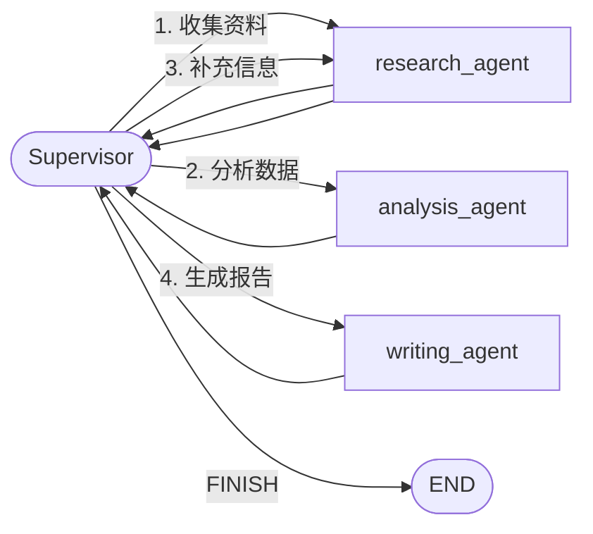

# LangGraph

### LangGraph 的状态图模型与工作流控制

#### 基础题：LangGraph 的核心概念是什么？State、Node、Edge 三者什么关系？


⭐⭐ **考察要点**：状态图模型、节点即函数、条件边、状态传递

**1️⃣ Common Answer**

重点总结（便于面试记忆）：
- 基于有向状态图的 Agent 编排框架
- State：带 reducer 的共享数据容器
- Node：接收完整 State、返回部分更新的纯函数
- Edge：静态连接 vs 动态路由
- START 和 END
- Graph：编译时校验的执行单元

**2️⃣ Impressive Answer**

LangGraph 的核心是**基于有向状态图的 Agent 编排框架**，State、Node、Edge 构成了完整的工作流执行模型：
1. **State：带 reducer 的共享数据容器**。State 用 `TypedDict`（类型化字典）定义，用 `Annotated` 附加 reducer 控制字段的更新策略。比如 `messages: Annotated[list, add_messages]` 表示追加语义，而不带 reducer 的字段是覆盖语义。节点只能返回需要变更的字段，框架负责合并，State 本身不可变，这保证了状态变更的可追踪性。
1. **Node：接收完整 State、返回部分更新的纯函数**。节点理论上无副作用，通常封装一次 LLM 调用或工具执行。返回值只包含需要更新的字段，不需要返回整个 State。
1. **Edge：静态连接 vs 动态路由**。普通边是固定的 A→B；条件边通过 `add_conditional_edges` 接收一个路由函数，根据当前 State 返回下一个节点名，实现动态分支。比如判断 LLM 输出是否有 tool_calls，有就去工具节点，没有就走 END。**START 和 END** 是特殊的虚拟节点，START 是入口，END 是终止条件
1. **Graph：编译时校验的执行单元**。`START` 是虚拟入口，`END` 是虚拟终止，图通过 `compile()` 变成 `CompiledGraph`，编译阶段做静态校验（孤立节点、无效边等），这和 LCEL 的懒执行不同，是构建时的工程保障。配合 LangSmith 可以可视化每一步的状态变化，极大降低调试成本。

**关系总结**：State 是数据载体，Node 是处理单元，Edge 是控制逻辑。State 在 Node 之间流动，Edge 决定流动的方向。这是一个典型的**数据驱动、显式控制流**的编排模型。

**3️⃣ Key Differences**

<table>
<tr>
<td>
维度
</td>
<td>
Common Answer
</td>
<td>
Impressive Answer
</td>
</tr>
<tr>
<td>
概念准确性
</td>
<td>
三个概念模糊描述
</td>
<td>
明确定义 TypedDict、函数签名、路由函数
</td>
</tr>
<tr>
<td>
架构理解
</td>
<td>
只是&quot;数据传递&quot;
</td>
<td>
数据驱动 + 显式控制流，强调状态缩减机制
</td>
</tr>
<tr>
<td>
实践细节
</td>
<td>
无代码示例
</td>
<td>
提到函数签名规范、START/END 虚拟节点
</td>
</tr>
<tr>
<td>
面试官印象
</td>
<td>
基础理解，缺乏深度
</td>
<td>
清楚状态图模型的本质，有实战经验
</td>
</tr>
</table>

---

#### **进阶题：LangGraph 的 State 是什么？如何设计一个合理的 AgentState？**

**难度**：⭐⭐⭐（状态管理、类型设计、TypedDict）

**1️⃣ Common Answer**：

重点总结（便于面试记忆）：
- 单一数据源
- 一个 TypedDict
- 第一，明确数据流向
- 第二，使用 TypedDict 确保类型安全
- 第三，考虑 Reducer 函数

**2️⃣ Impressive Answer**：

LangGraph 的 State 是整个图执行过程中共享的**单一数据源**，所有节点都通过读写同一个 State 对象来协作。它本质上是**一个 TypedDict**，定义了节点间传递数据的 Schema。

设计合理的 AgentState 需要遵循三个原则：

**第一，明确数据流向**。State 应该只包含节点间真正需要共享的数据，避免把所有临时变量都塞进去。比如 ReAct Agent 的 State 通常包含 messages（对话历史）和 intermediate_steps（思考-行动循环记录）。

**第二，使用 TypedDict 确保类型安全**。通过注解明确每个字段的类型，让代码更清晰，IDE 也能提供智能提示。

**第三，考虑 Reducer 函数**。当多个节点更新同一个字段时，需要定义如何合并数据。比如 messages 字段通常用 `add_messages` 来追加而不是覆盖。

```python
from typing import TypedDict, Annotated, Sequence
from langgraph.graph.message import add_messages

class AgentState(TypedDict):
    # 使用 Annotated 和 add_messages 追加消息
    messages: Annotated[Sequence[dict], add_messages]
    # 当前思考阶段
    current_stage: str
    # 工具调用结果
    tool_results: list[dict]
    # 是否需要人工确认
    requires_approval: bool
```

如果 Agent 需要支持中断恢复，State 还要包含 checkpoint*id、execution*context 等元数据字段。State 的设计要匹配业务逻辑，字段越精简越好，避免不必要的数据在节点间传递。

**3️⃣ Key Differences**

<table>
<tr>
<td>
维度
</td>
<td>
Common Answer
</td>
<td>
Impressive Answer
</td>
</tr>
<tr>
<td>
技术深度
</td>
<td>
知道 State 是字典，能存储数据
</td>
<td>
理解 State 是 TypedDict，掌握 Reducer 机制
</td>
</tr>
<tr>
<td>
实践经验
</td>
<td>
简单的 key-value 存储，类型不明确
</td>
<td>
使用 Annotated 和 add_messages，类型安全
</td>
</tr>
<tr>
<td>
思考维度
</td>
<td>
关注存储什么数据
</td>
<td>
关注数据流向、合并策略、类型安全
</td>
</tr>
<tr>
<td>
面试官印象
</td>
<td>
基础使用，缺乏深度思考
</td>
<td>
系统设计能力，工程化思维
</td>
</tr>
</table>

---

#### **进阶题：LangGraph 的 Checkpoint 机制是什么？如何实现 Agent 的中断和恢复？**

**难度**：⭐⭐⭐（持久化、状态管理、人机协作）

**1️⃣ Common Answer**：

重点总结（便于面试记忆）：
- 基于状态机的持久化方案
- 时间旅行
- 核心原理
- 当前 State
- 执行位置
- 元数据

**2️⃣ Impressive Answer**：

LangGraph 的 Checkpoint 机制是**基于状态机的持久化方案**，它会在每个节点执行前后自动保存 State 的快照，实现 Agent 的**时间旅行**能力。

**核心原理**：Checkpoint 记录了三个关键信息：
1. **当前 State**：完整的 AgentState 数据
1. **执行位置**：当前执行到哪个节点（node_id）
1. **元数据**：timestamp、parent*checkpoint*id 等

**实现中断和恢复**：

```python
from langgraph.checkpoint.memory import MemorySaver
from langgraph.graph import StateGraph, END

# 创建 Checkpoint 存储后端
memory = MemorySaver()

# 构建图时传入 checkpointer
workflow = StateGraph(AgentState)
workflow.add_node("agent", agent_node)
workflow.add_node("tools", tool_node)
workflow.set_entry_point("agent")
workflow.add_conditional_edges("agent", should_continue)
workflow.add_edge("tools", "agent")

app = workflow.compile(checkpointer=memory)

# 执行时指定 thread_id（会话标识）
config = {"configurable": {"thread_id": "user_123"}}

# 第一次执行，会自动创建 checkpoint
result = app.invoke({"messages": [{"role": "user", "content": "查询天气"}]}, config)

# 中断后恢复，从最后一个 checkpoint 继续
# LangGraph 会自动加载 thread_id 对应的最新 checkpoint
result = app.invoke(None, config)
```

**生产环境最佳实践**：
1. 使用 `PostgresCheckpointSaver` 替代 MemorySaver，持久化到 PostgreSQL
1. `thread_id` 设计为 `user_id:session_id` 格式，支持多用户多会话
1. 结合 `interrupt_before` 实现人工确认节点，比如执行敏感操作前暂停

```python
# 在特定节点前中断
app = workflow.compile(
    checkpointer=PostgresCheckpointSaver.from_conn_string(DB_URL),
    interrupt_before=["tools"]  # 在调用工具前暂停
)
```

**3️⃣ Key Differences**

<table>
<tr>
<td>
维度
</td>
<td>
Common Answer
</td>
<td>
Impressive Answer
</td>
</tr>
<tr>
<td>
技术深度
</td>
<td>
知道可以保存和恢复
</td>
<td>
理解 Checkpoint 的三要素、thread_id 设计
</td>
</tr>
<tr>
<td>
实践经验
</td>
<td>
使用 MemorySaver
</td>
<td>
生产环境用 PostgreSQL，配合 interrupt_before
</td>
</tr>
<tr>
<td>
思考维度
</td>
<td>
功能实现
</td>
<td>
状态机原理、持久化策略、多会话管理
</td>
</tr>
<tr>
<td>
面试官印象
</td>
<td>
会用基础功能
</td>
<td>
具备生产级系统设计能力
</td>
</tr>
</table>

---

#### **进阶题：LangGraph 如何实现 Human-in-the-Loop（人机协作）？**

**难度**：⭐⭐⭐（中断机制、人工审核、工作流编排）

**1️⃣ Common Answer**：

重点总结（便于面试记忆）：
- 中断机制 + Checkpoint 持久化
- 三种典型模式
- 模式一：审核确认模式
- 模式二：人工修正模式
- 模式三：人工引导模式
- 工程实践要点

**2️⃣ Impressive Answer**：

LangGraph 的 Human-in-the-Loop 基于**中断机制 + Checkpoint 持久化**，实现了 Agent 与人的无缝协作。核心是在工作流的关键节点插入"人工确认点"，让人类可以审核、修正或引导 Agent 的行为。

**三种典型模式**：

**模式一：审核确认模式**（适合敏感操作）

```python
from langgraph.graph import StateGraph, END

# 在执行支付前中断，等待人工确认
app = workflow.compile(
    checkpointer=PostgresCheckpointSaver.from_conn_string(DB_URL),
    interrupt_before=["execute_payment"]
)

# Agent 执行到 execute_payment 前会暂停
config = {"configurable": {"thread_id": "order_456"}}
result = app.invoke({"messages": [{"role": "user", "content": "支付 100 元"}]}, config)
# 此时 result.status == "interrupted"

# 人工审核后继续执行
approved_state = app.get_state(config)
approved_state.values["approval_status"] = "approved"
app.update_state(config, approved_state.values)
result = app.invoke(None, config)  # 继续执行
```

**模式二：人工修正模式**（适合 Agent 出错）

```python
# Agent 生成错误回答，人工修正后继续
state = app.get_state(config)
state.values["messages"].append({
    "role": "human",
    "content": "你的回答有误，正确答案是..."
})
app.update_state(config, state.values)
```

**模式三：人工引导模式**（适合复杂决策）

```python
# 在决策节点插入人工选择，决策后暂停让人工确认
app = workflow.compile(
    checkpointer=memory,
    interrupt_after=["decide_strategy"]
)
```

**工程实践要点**：
1. **状态可视化**：通过 `app.get_state(config)` 获取当前 State，展示给人工审核
1. **超时处理**：设置人工确认的超时时间，超时后自动降级或拒绝
1. **审计日志**：记录每次人工干预的操作人、时间、修改内容
1. **权限控制**：结合 RBAC，只有授权用户才能执行确认操作

**3️⃣ Key Differences**

<table>
<tr>
<td>
维度
</td>
<td>
Common Answer
</td>
<td>
Impressive Answer
</td>
</tr>
<tr>
<td>
技术深度
</td>
<td>
知道 interrupt_before/after
</td>
<td>
掌握三种协作模式，理解状态流转
</td>
</tr>
<tr>
<td>
实践经验
</td>
<td>
简单的暂停继续
</td>
<td>
审核日志、超时处理、权限控制
</td>
</tr>
<tr>
<td>
思考维度
</td>
<td>
功能实现
</td>
<td>
业务场景适配、风控合规
</td>
</tr>
<tr>
<td>
面试官印象
</td>
<td>
会用基础功能
</td>
<td>
具备生产级人机协作系统设计能力
</td>
</tr>
</table>

---

#### **场景题：用 LangGraph 实现多工具 ReAct Agent，如何处理工具调用失败和重试？**

**难度**：⭐⭐⭐（错误处理、重试策略、容错设计）

**1️⃣ Common Answer**：

重点总结（便于面试记忆）：
- 分层设计
- 临时性错误
- 永久性错误
- 三层容错架构
- 第一层：工具层重试
- 第二层：节点层容错

**2️⃣ Impressive Answer**：

处理工具调用失败需要**分层设计**：工具层重试、节点层容错、图层降级。核心是区分**临时性错误**（网络超时、限流）和**永久性错误**（参数错误、权限不足），采用不同的处理策略。

**三层容错架构**：

**第一层：工具层重试**（针对临时性错误）

```python
from tenacity import retry, stop_after_attempt, wait_exponential
from langchain.tools import tool

@retry(
    stop=stop_after_attempt(3),
    wait=wait_exponential(multiplier=1, min=2, max=10)
)
@tool
def search_weather(city: str) -> str:
    """查询城市天气"""
    response = requests.get(f"https://api.weather.com/{city}")
    response.raise_for_status()
    return response.json()
```

**第二层：节点层容错**（工具节点统一处理）

```python
def tool_node(state: AgentState) -> AgentState:
    """工具调用节点，统一处理错误和重试"""
    tool_calls = state["messages"][-1].get("tool_calls", [])

    for tool_call in tool_calls:
        try:
            result = tools[tool_call["name"]].invoke(tool_call["args"])
            state["messages"].append({
                "role": "tool",
                "tool_call_id": tool_call["id"],
                "content": str(result)
            })
        except Exception as error:
            error_type = classify_error(error)
            if error_type == "temporary":
                state["tool_errors"].append({
                    "tool_call": tool_call,
                    "error": str(error),
                    "error_type": "temporary"
                })
                state["retry_count"] += 1
            else:
                state["messages"].append({
                    "role": "tool",
                    "tool_call_id": tool_call["id"],
                    "content": f"工具调用失败（{error_type}）：{str(error)}"
                })
    return state
```

**第三层：图层降级**（超过重试次数后切换策略）

```python
def should_continue(state: AgentState) -> str:
    temp_errors = [e for e in state["tool_errors"] if e["error_type"] == "temporary"]
    if temp_errors and state["retry_count"] < 3:
        return "retry"
    if state["retry_count"] >= 3:
        return "fallback"
    return "continue"

# 降级节点：优先用缓存，其次询问用户
def fallback_node(state: AgentState) -> AgentState:
    cached_result = get_cached_result(state["tool_errors"][0]["tool_call"])
    if cached_result:
        state["messages"].append({
            "role": "system",
            "content": f"工具调用失败，使用缓存结果：{cached_result}"
        })
    else:
        state["messages"].append({
            "role": "assistant",
            "content": f"工具调用失败，能否直接提供需要的信息？"
        })
    return state
```

**3️⃣ Key Differences**

<table>
<tr>
<td>
维度
</td>
<td>
Common Answer
</td>
<td>
Impressive Answer
</td>
</tr>
<tr>
<td>
技术深度
</td>
<td>
简单的 try-except 重试
</td>
<td>
三层容错架构、错误分类、降级策略
</td>
</tr>
<tr>
<td>
实践经验
</td>
<td>
固定次数重试
</td>
<td>
指数退避、缓存降级、人工介入
</td>
</tr>
<tr>
<td>
思考维度
</td>
<td>
错误处理
</td>
<td>
系统稳定性、用户体验、成本控制
</td>
</tr>
<tr>
<td>
面试官印象
</td>
<td>
会处理异常
</td>
<td>
具备生产级容错系统设计能力
</td>
</tr>
</table>

---

#### 2. 进阶题：LangGraph 的条件边如何实现动态路由？

⭐⭐⭐ **考察要点**：路由函数、状态判断、循环与分支控制

**1️⃣ Common Answer**

重点总结（便于面试记忆）：
- 路由函数的设计
- 动态路由的实现模式
- 图结构中的条件边定义
- 路由函数签名：(state: State) -> str 或 (state: State) -> Literal["node1", "node2", END]
- 函数内部可以访问 State 的所有字段，进行复杂的条件判断
- 返回值必须是已定义的 Node 名称或 END 常量（终止）

**2️⃣ Impressive Answer**

条件边是 LangGraph 实现复杂工作流控制的核心，通过**路由函数 + 状态判断 + 图结构定义**实现动态路由：
1. **路由函数的设计**
  - 路由函数签名：`(state: State) -> str` 或 `(state: State) -> Literal["node1", "node2", END]`
  - 函数内部可以访问 State 的所有字段，进行复杂的条件判断
  - 返回值必须是已定义的 Node 名称或 `END` 常量（终止）
  - 支持返回列表，实现并行分支（如 `["node_a", "node_b"]`）
1. **动态路由的实现模式**
  - **分支路由**：根据 State 中的某个字段值选择不同路径

```python
def route_by_intent(state: State):
    if state["intent"] == "search":
        return "search_node"
    elif state["intent"] == "create":
        return "create_node"
    else:
        return END
```
- **循环路由**：结合条件边实现 while 循环
  - 设置一个 `max_iterations` 字段，每次循环递增
  - 当达到阈值或满足终止条件时返回 `END`
- **回退路由**：当某个 Node 失败时，路由到错误处理 Node
1. **图结构中的条件边定义**
  - 使用 `graph.add_conditional_edges("source_node", route_function)` 定义
  - 可以指定默认边：`graph.add_conditional_edges(..., {"default": "fallback_node"})`
  - 支持多目标映射：`{"A": "node_a", "B": "node_b", END: END}`
  - 条件边可以连接到多个目标，实现并行执行

**实践要点**：条件边让工作流从"固定流程"变成"数据驱动流程"，但要注意避免无限循环，建议在 State 中设置 `iteration_count` 和 `max_iterations` 作为安全终止条件。

**3️⃣ Key Differences**

<table>
<tr>
<td>
维度
</td>
<td>
Common Answer
</td>
<td>
Impressive Answer
</td>
</tr>
<tr>
<td>
技术深度
</td>
<td>
只是&quot;if-else 判断&quot;
</td>
<td>
路由函数签名、并行分支、循环控制
</td>
</tr>
<tr>
<td>
代码示例
</td>
<td>
无具体代码
</td>
<td>
提供完整的路由函数示例和图定义
</td>
</tr>
<tr>
<td>
风险意识
</td>
<td>
无
</td>
<td>
强调无限循环风险和 max_iterations 防护
</td>
</tr>
<tr>
<td>
面试官印象
</td>
<td>
基本会用，但缺乏工程思维
</td>
<td>
有完整的设计模式和风险控制意识
</td>
</tr>
</table>

---

#### 3. 进阶题：LangGraph 与 CrewAI 的编排思路有什么本质区别？

⭐⭐⭐ **考察要点**：状态图 vs 角色任务、显式控制流 vs 隐式编排、适用场景对比

**1️⃣ Common Answer**

重点总结（便于面试记忆）：
- 编排模型的根本差异
- 适用场景的对比
- 技术实现的差异
- LangGraph - 显式状态图
- 工作流是预先定义的有向图，每个 Node 的执行顺序由 Edge 明确规定
- 状态在图中流动，每个 Node 知道"我从哪里来，要到哪里去"

**2️⃣ Impressive Answer**

LangGraph 和 CrewAI 代表了两种不同的 Agent 编排范式：**显式状态图 vs 隐式角色协作**，本质区别在于控制流的管理方式：
1. **编排模型的根本差异**
  - **LangGraph - 显式状态图**
    - 工作流是预先定义的有向图，每个 Node 的执行顺序由 Edge 明确规定
    - 状态在图中流动，每个 Node 知道"我从哪里来，要到哪里去"
    - 控制流是确定的、可预测的，适合需要严格流程控制的场景
    - 调试容易，可以画出完整的执行路径图
  - **CrewAI - 隐式角色协作**
    - 定义多个 Agent（角色），通过 Task 和 Process 让它们协作
    - Agent 之间通过消息传递进行协作，流程由 Agent 的决策动态生成
    - 控制流是涌现的、不确定的，适合需要灵活协作的场景
    - 流程依赖 Agent 的推理能力，调试较困难
1. **适用场景的对比**
  - **LangGraph 适合的场景**
    - 需要严格流程控制的业务流程（如审批流、数据处理流水线）
    - 需要人工介入的场景（Human-in-the-loop，通过条件边实现中断）
    - 需要复杂循环、分支、并行的场景
    - 需要状态持久化和恢复的场景（通过 Checkpointer）
  - **CrewAI 适合的场景**
    - 需要多个专业角色协作的创意类任务（如内容创作、营销策划）
    - 流程不确定、需要 Agent 自主决策的探索性任务
    - 快速原型开发，不需要精细控制流
    - 团队成员明确、角色分工清晰的协作场景
1. **技术实现的差异**
  - **LangGraph**：State 是中心，Node 是无状态函数，Edge 是控制逻辑，强调"状态驱动"
  - **CrewAI**：Agent 是中心，Task 是目标，Process 是协作方式，强调"角色驱动"

**总结**：LangGraph 是"工程师思维"，适合需要确定性、可控性的工程化场景；CrewAI 是"产品思维"，适合需要灵活性、创造性的业务场景。在实际项目中，可以结合两者：用 LangGraph 控制整体流程，在某个 Node 内部用 CrewAI 处理需要多 Agent 协作的子任务。

**3️⃣ Key Differences**

<table>
<tr>
<td>
维度
</td>
<td>
Common Answer
</td>
<td>
Impressive Answer
</td>
</tr>
<tr>
<td>
核心差异
</td>
<td>
只是&quot;状态图 vs 角色&quot;
</td>
<td>
显式控制流 vs 隐式协作，确定 vs 涌现
</td>
</tr>
<tr>
<td>
场景对比
</td>
<td>
&quot;灵活 vs 简单&quot;
</td>
<td>
具体列举业务流程 vs 创意协作等场景
</td>
</tr>
<tr>
<td>
技术深度
</td>
<td>
无技术细节
</td>
<td>
State 中心 vs Agent 中心，流程可预测性
</td>
</tr>
<tr>
<td>
实践建议
</td>
<td>
无
</td>
<td>
提出结合使用的架构方案
</td>
</tr>
<tr>
<td>
面试官印象
</td>
<td>
了解两个框架，但缺乏深度
</td>
<td>
有清晰的架构视角和场景判断能力
</td>
</tr>
</table>

---

#### 4. 场景题：用 LangGraph 实现一个带人工审批节点的 Agent 工作流，如何设计？

⭐⭐⭐⭐ **考察要点**：Human-in-the-loop、中断与恢复、状态持久化（Checkpointer）

**1️⃣ Common Answer**

重点总结（便于面试记忆）：
- 工作流图结构设计
- 中断与恢复机制
- 状态持久化（Checkpointer）
- 完整执行流程
- 高级特性
- Draft_Agent：生成方案，输出到 state["draft"]

**2️⃣ Impressive Answer**

实现带人工审批的 Agent 工作流需要**中断机制、状态持久化、审批流程设计**三个核心要素：
1. **工作流图结构设计**

```
START → Draft_Agent → Review_Node → (approved? → END / rejected? → Draft_Agent)
```
- **Draft_Agent**：生成方案，输出到 `state["draft"]`
- **Review_Node**：人工审批节点，读取 `state["draft"]`，等待用户输入
- **条件边**：根据 `state["approval"]` 字段决定是否继续或回退
1. **中断与恢复机制**
  - **中断实现**：在 Review_Node 中使用 `interrupt()` 函数，暂停执行并等待外部输入

```python
def human_review(state: State):
    draft = state["draft"]
    approval = interrupt({
        "type": "human_review",
        "draft": draft,
        "question": "请审批：同意输入 'approve'，拒绝输入 'reject'"
    })
    return {"approval": approval}
```
- **恢复执行**：通过 `graph.update_state()` 传入用户的审批结果

```python
graph.update_state(thread_id, {"approval": "approve"})
```
- **thread_id**：每个工作流实例有唯一 ID，用于区分不同会话
1. **状态持久化（Checkpointer）**
  - 使用 `MemorySaver` 或 `PostgresSaver` 保存状态到数据库
  - 每次节点执行后自动保存 State，即使进程重启也能恢复
  - 支持时间旅行调试：查看历史状态、回滚到某个节点
  - 配置方式：

```python
checkpointer = MemorySaver()
graph = workflow.compile(checkpointer=checkpointer)
```
1. **完整执行流程**
  - **步骤 1**：`graph.invoke({"task": "..."}, config={"configurable": {"thread_id": "123"}})`
  - **步骤 2**：执行到 Review_Node 时中断，返回 `NodeInterrupt` 异常
  - **步骤 3**：用户审批，调用 `graph.update_state(thread_id="123", {"approval": "approve"})`
  - **步骤 4**：从 Review_Node 恢复执行，条件边判断为 `approve`，流转到 `END`
1. **高级特性**
  - **超时机制**：设置审批超时时间，超时自动拒绝
  - **多轮审批**：支持多级审批，通过 State 中的 `approval_level` 字段控制
  - **审批历史**：在 State 中记录每次审批的决策人、时间、意见

**实践要点**：人工审批节点的关键在于"可中断 + 可恢复 + 可持久化"，LangGraph 的 Checkpointer 机制完美解决了这个问题，非常适合需要人工介入的生产场景。

**3️⃣ Key Differences**

<table>
<tr>
<td>
维度
</td>
<td>
Common Answer
</td>
<td>
Impressive Answer
</td>
</tr>
<tr>
<td>
技术完整性
</td>
<td>
只有&quot;中断&quot;概念
</td>
<td>
中断、恢复、持久化三要素完整
</td>
</tr>
<tr>
<td>
代码实现
</td>
<td>
无代码示例
</td>
<td>
提供完整的 interrupt、update_state 示例
</td>
</tr>
<tr>
<td>
架构设计
</td>
<td>
简单的&quot;同意/拒绝&quot;
</td>
<td>
超时机制、多级审批、审批历史
</td>
</tr>
<tr>
<td>
工程实践
</td>
<td>
无 Checkpointer 概念
</td>
<td>
强调 MemorySaver/PostgresSaver 持久化
</td>
</tr>
<tr>
<td>
面试官印象
</td>
<td>
基本思路正确，但缺乏工程细节
</td>
<td>
有完整的生产级方案，可直接落地
</td>
</tr>
</table>

---

#### 5、进阶题：LangGraph 的 Checkpointer 机制是什么？它如何实现状态持久化和时间旅行调试？MemorySaver 和 PostgresSaver 有什么区别？⭐⭐⭐

**难度级别**：⭐⭐⭐（状态管理、持久化、调试能力）

**1️⃣ Common Answer**

重点总结（便于面试记忆）：
- Checkpointer 核心机制
- 时间旅行调试实现
- MemorySaver vs PostgresSaver 区别
- Checkpointer 是 LangGraph 的状态快照系统，在每个节点执行前后自动捕获状态
- 采用基于 StateSnapshot 的不可变数据结构，每次状态变更生成新的快照
- 支持断点续传：通过 config={"thread_id": "xxx"} 恢复特定执行线程的状态

**2️⃣ Impressive Answer**
1. **Checkpointer 核心机制**
  - Checkpointer 是 LangGraph 的状态快照系统，在每个节点执行前后自动捕获状态
  - 采用基于 `StateSnapshot` 的不可变数据结构，每次状态变更生成新的快照
  - 支持断点续传：通过 `config={"thread_id": "xxx"}` 恢复特定执行线程的状态
1. **时间旅行调试实现**

```python
from langgraph.checkpoint.memory import MemorySaver
from langgraph.graph import StateGraph

checkpointer = MemorySaver()
graph = StateGraph(state_schema, checkpointer=checkpointer)

# 执行并获取所有快照
config = {"thread_id": "debug-123"}
result = graph.invoke(initial_state, config)

# 时间旅行：查看第 3 步的状态
for snapshot in graph.get_state_history(config):
    if snapshot.metadata["step"] == 3:
        print(snapshot.values)  # 查看当时的状态
        # 可以从这一步重新执行
        graph.invoke(None, config, snapshot.config)
```
1. **MemorySaver vs PostgresSaver 区别**
  - **存储介质**：MemorySaver 使用 Python 字典（进程级），PostgresSaver 使用 PostgreSQL（持久化）
  - **并发支持**：MemorySaver 单进程安全，PostgresSaver 支持多进程/分布式
  - **容量限制**：MemorySaver 受限于内存大小，PostgresSaver 可存储历史快照
  - **性能特性**：MemorySaver 低延迟但易丢失，PostgresSaver 有网络开销但可靠
  - **适用场景**：开发调试用 MemorySaver，生产环境用 PostgresSaver

**3️⃣ Key Differences**

<table>
<tr>
<td>
维度
</td>
<td>
Common Answer
</td>
<td>
Impressive Answer
</td>
</tr>
<tr>
<td>
结构性
</td>
<td>
随意描述，无层次
</td>
<td>
分层阐述：机制→调试→对比
</td>
</tr>
<tr>
<td>
技术深度
</td>
<td>
仅知&quot;保存状态&quot;
</td>
<td>
深入 StateSnapshot、不可变性、config 机制
</td>
</tr>
<tr>
<td>
实践经验
</td>
<td>
提及&quot;崩溃恢复&quot;
</td>
<td>
提供时间旅行调试的完整代码示例
</td>
</tr>
<tr>
<td>
面试官印象
</td>
<td>
了解基础概念
</td>
<td>
掌握核心机制，具备生产环境设计能力
</td>
</tr>
</table>

---

#### 6、进阶题：LangGraph 中如何实现子图（Subgraph）？子图和父图之间的状态如何传递和隔离？⭐⭐⭐

**难度级别**：⭐⭐⭐（模块化设计、状态隔离、嵌套编排）

**1️⃣ Common Answer**

重点总结（便于面试记忆）：
- 子图实现方式
- 状态传递机制
- 状态隔离原则
- 使用 StateGraph 创建子图，然后通过 add_node 将其作为节点添加到父图
- 子图本身是一个完整的 CompiledGraph，可以有自己的边、条件边、checkpointer
- 支持嵌套：子图内还可以包含更深层级的子图

**2️⃣ Impressive Answer**
1. **子图实现方式**
  - 使用 `StateGraph` 创建子图，然后通过 `add_node` 将其作为节点添加到父图
  - 子图本身是一个完整的 `CompiledGraph`，可以有自己的边、条件边、checkpointer
  - 支持嵌套：子图内还可以包含更深层级的子图

```python
from langgraph.graph import StateGraph, END
from typing import TypedDict

# 子图状态定义
class SubgraphState(TypedDict):
    sub_data: str
    sub_result: str

# 创建子图
subgraph = StateGraph(SubgraphState)
subgraph.add_node("sub_step1", lambda state: {"sub_result": state["sub_data"] + " processed"})
subgraph.add_edge("sub_step1", END)
subgraph = subgraph.compile()

# 父图状态定义
class ParentState(TypedDict):
    parent_data: str
    sub_output: str

# 创建父图并添加子图
parent_graph = StateGraph(ParentState)
parent_graph.add_node("call_subgraph", subgraph)
```
1. **状态传递机制**
  - **输入映射**：父图节点输出 → 子图输入，通过 `state_mapping` 定义映射规则
  - **输出映射**：子图输出 → 父图后续节点，子图 `END` 状态自动返回父图
  - **共享状态**：通过 `state["shared_key"]` 在父子图间传递数据

```python
# 状态映射示例
def map_parent_to_sub(state: ParentState) -> SubgraphState:
    return {"sub_data": state["parent_data"]}

def map_sub_to_parent(state: SubgraphState) -> ParentState:
    return {"sub_output": state["sub_result"]}

parent_graph.add_node("call_subgraph", subgraph,
                     input=map_parent_to_sub,
                     output=map_sub_to_parent)
```
1. **状态隔离原则**
  - **命名空间隔离**：子图状态键独立于父图，避免命名冲突
  - **执行隔离**：子图内部错误不会直接导致父图崩溃（可通过错误处理机制捕获）
  - **Checkpointer 隔离**：子图可使用独立的 checkpointer，实现独立的状态快照
  - **并发隔离**：多个子图实例可并发执行，各自维护独立状态

**3️⃣ Key Differences**

<table>
<tr>
<td>
维度
</td>
<td>
Common Answer
</td>
<td>
Impressive Answer
</td>
</tr>
<tr>
<td>
结构性
</td>
<td>
线性描述
</td>
<td>
分层：实现→传递→隔离
</td>
</tr>
<tr>
<td>
技术深度
</td>
<td>
仅知&quot;嵌套&quot;
</td>
<td>
深入状态映射、命名空间、错误隔离
</td>
</tr>
<tr>
<td>
实践经验
</td>
<td>
无代码示例
</td>
<td>
提供完整的父子图映射代码
</td>
</tr>
<tr>
<td>
面试官印象
</td>
<td>
了解基本概念
</td>
<td>
掌握模块化设计，具备复杂系统架构能力
</td>
</tr>
</table>

---

#### 7、场景题：用 LangGraph 实现一个带重试、降级和超时控制的多步骤 Agent 工作流（如：数据采集→清洗→分析→报告生成），如何设计错误处理和容错机制？⭐⭐⭐⭐

**难度级别**：⭐⭐⭐⭐（容错设计、工程实践、生产级质量）

**1️⃣ Common Answer**

重点总结（便于面试记忆）：
- 整体架构设计
- 重试机制实现
- 超时控制
- 降级策略设计
- 全局错误处理与状态监控
- Checkpointer 配置（支持断点续传）

**2️⃣ Impressive Answer**
1. **整体架构设计**
  - 采用 `StateGraph` 构建四步工作流：`collect_data` → `clean_data` → `analyze_data` → `generate_report`
  - 每个节点配置独立的重试策略、超时时间和降级方案
  - 使用条件边实现错误分支：成功继续，失败触发降级或终止

```python
from langgraph.graph import StateGraph, END
from typing import TypedDict, Literal
import time

class WorkflowState(TypedDict):
    raw_data: dict
    cleaned_data: dict
    analysis_result: dict
    report: str
    error_step: str
    retry_count: int
    status: Literal["success", "degraded", "failed"]

graph = StateGraph(WorkflowState)
```
1. **重试机制实现**

```python
def retry_wrapper(node_func, max_retries=3, backoff_factor=2):
    def wrapper(state):
        retry_count = state.get("retry_count", 0)
        try:
            result = node_func(state)
            # 成功后重置重试计数
            result["retry_count"] = 0
            return result
        except Exception as e:
            if retry_count < max_retries:
                # 指数退避重试
                wait_time = backoff_factor ** retry_count
                time.sleep(wait_time)
                return {"retry_count": retry_count + 1, "error_step": node_func.__name__}
            else:
                # 重试耗尽，触发降级
                return {"status": "degraded", "error_step": node_func.__name__}
    return wrapper

# 应用重试包装器
graph.add_node("collect_data", retry_wrapper(collect_data_node, max_retries=3))
```
1. **超时控制**

```python
from concurrent.futures import TimeoutError

def timeout_wrapper(node_func, timeout_seconds=30):
    def wrapper(state):
        start_time = time.time()
        try:
            result = node_func(state)
            if time.time() - start_time > timeout_seconds:
                raise TimeoutError(f"Node {node_func.__name__} timeout")
            return result
        except TimeoutError:
            return {"status": "degraded", "error_step": node_func.__name__}
    return wrapper

graph.add_node("clean_data", timeout_wrapper(clean_data_node, timeout_seconds=30))
```
1. **降级策略设计**

```python
def fallback_collect_data(state):
    # 降级：使用缓存数据或默认数据
    return {"raw_data": {"source": "cache", "data": []}, "status": "degraded"}

def fallback_clean_data(state):
    # 降级：跳过清洗，直接返回原始数据
    return {"cleaned_data": state["raw_data"], "status": "degraded"}

# 条件边：根据状态决定下一步
def should_retry_or_fallback(state):
    if state["retry_count"] > 0:
        return "retry"
    elif state["status"] == "degraded":
        return "fallback"
    else:
        return "next"

graph.add_conditional_edges(
    "collect_data",
    should_retry_or_fallback,
    {
        "retry": "collect_data",  # 重试当前节点
        "fallback": "clean_data",  # 降级后继续
        "next": "clean_data"  # 正常流程
    }
)
```
1. **全局错误处理与状态监控**

```python
def error_handler(state):
    error_step = state.get("error_step", "unknown")
    print(f"Workflow failed at step: {error_step}")
    print(f"Final status: {state['status']}")
    # 发送告警通知
    # 记录错误日志
    return {"status": "failed"}

graph.add_node("error_handler", error_handler)
graph.add_edge("generate_report", END)
graph.add_conditional_edges(
    "generate_report",
    lambda state: "error_handler" if state["status"] == "failed" else END,
    {"error_handler": "error_handler", END: END}
)
```
1. **Checkpointer 配置（支持断点续传）**

```python
from langgraph.checkpoint.postgres import PostgresSaver

checkpointer = PostgresSaver.from_conn_string("postgresql://...")
compiled_graph = graph.compile(checkpointer=checkpointer)

# 执行工作流
result = compiled_graph.invoke(
    initial_state,
    config={"thread_id": "workflow-001"}
)
```

**3️⃣ Key Differences**

<table>
<tr>
<td>
维度
</td>
<td>
Common Answer
</td>
<td>
Impressive Answer
</td>
</tr>
<tr>
<td>
结构性
</td>
<td>
线性描述，无分层
</td>
<td>
完整架构：重试→超时→降级→监控
</td>
</tr>
<tr>
<td>
技术深度
</td>
<td>
仅知&quot;try-catch&quot;
</td>
<td>
深入指数退避、条件边、状态机
</td>
</tr>
<tr>
<td>
实践经验
</td>
<td>
无代码示例
</td>
<td>
提供生产级容错机制的完整实现
</td>
</tr>
<tr>
<td>
面试官印象
</td>
<td>
了解基础错误处理
</td>
<td>
具备生产环境高可用系统设计能力
</td>
</tr>
</table>

---

#### **场景题：在 LangGraph 里如何实现"LLM 有工具调用就去执行工具，否则结束"这个 ReAct 循环？**

**难度级别**：⭐⭐（条件边路由函数、START/END 节点、ReAct 循环结构）

**1️⃣ Common Answer**

重点总结（便于面试记忆）：
- 标准 ReAct 循环的图结构是两个节点 + 一条条件边：llm 节点调用 LLM，tools 节点执行工具，Supervisor 逻辑放在条件边的路由函数里
- ```python def should_continue(state: AgentState) -> str: last_msg = state["messages"][-1...
- graph.add_node("llm", call_llm) graph.add_node("tools", execute_tools) graph.add_edge(ST...
- 关键是 tools → llm 这条边形成了循环，让 Agent 能在"思考-行动"之间反复迭代，直到 LLM 不再发出 tool_calls 才走 END。这是 LangGr...

**2️⃣ Impressive Answer**

标准 ReAct 循环的图结构是两个节点 + 一条条件边：`llm` 节点调用 LLM，`tools` 节点执行工具，Supervisor 逻辑放在条件边的路由函数里：

```python
def should_continue(state: AgentState) -> str:
    last_msg = state["messages"][-1]
    if hasattr(last_msg, "tool_calls") and last_msg.tool_calls:
        return "tools"
    return END

graph.add_node("llm", call_llm)
graph.add_node("tools", execute_tools)
graph.add_edge(START, "llm")
graph.add_conditional_edges("llm", should_continue, {"tools": "tools", END: END})
graph.add_edge("tools", "llm")  # 工具执行完回到 LLM，形成循环
```

关键是 `tools → llm` 这条边形成了循环，让 Agent 能在"思考-行动"之间反复迭代，直到 LLM 不再发出 tool_calls 才走 END。这是 LangGraph 实现 ReAct 的最小完整结构。

**3️⃣ Key Differences**

<table>
<tr>
<td>
维度
</td>
<td>
Common Answer
</td>
<td>
Impressive Answer
</td>
</tr>
<tr>
<td>
技术深度
</td>
<td>
知道用条件边判断
</td>
<td>
给出完整的图结构，包括 <code>tools → llm</code> 的回边形成循环这个关键细节
</td>
</tr>
<tr>
<td>
实践经验
</td>
<td>
没有可运行的代码
</td>
<td>
给出最小完整实现，逻辑清晰可直接参考
</td>
</tr>
<tr>
<td>
给面试官的印象
</td>
<td>
理解概念
</td>
<td>
真实实现过 ReAct Agent，理解循环结构的构建方式
</td>
</tr>
</table>

---

#### **容易一起考的题**

<table>
<tr>
<td>
关联题
</td>
<td>
和本题的关系
</td>
<td>
参考答案
</td>
</tr>
<tr>
<td>
LangGraph 和 LangChain LCEL 有什么区别，分别适合什么场景？
</td>
<td>
LCEL 是无状态管道，LangGraph 是有状态图，定位不同
</td>
<td>
答：LangGraph 用图和状态机表达 Agent 流程，节点负责执行，边负责路由，State 承载上下文；适合有分支、循环、人工介入的复杂 Agent。
</td>
</tr>
<tr>
<td>
LangGraph 的 Checkpointing 是怎么工作的？
</td>
<td>
持久化每个节点执行后的 State 快照，是跨请求记忆的底层
</td>
<td>
答：短期记忆服务当前任务，通常放上下文、运行 State 或缓存；长期记忆跨会话保存，落到向量库、KV 或数据库，并通过检索注入上下文。
</td>
</tr>
<tr>
<td>
条件边和普通边的区别是什么？
</td>
<td>
普通边是静态路由，条件边是根据 State 动态路由，是控制流的核心
</td>
<td>
答：这题可以按“定义 → 核心机制 → 工程落地”三步答；结合本题重点强调：普通边是静态路由，条件边是根据 State 动态路由，是控制流的核心，最后补一个风险点或优化手段。
</td>
</tr>
</table>

---

### **LangGraph Checkpointing 与持久化记忆**

##### 1、基础题：LangGraph 的 MemorySaver 和 PostgresSaver 有什么区别？

**难度级别**：⭐（三种 Checkpointer 的适用场景）

MemorySaver 把状态存在内存里，进程重启就丢失，只适合本地测试和单测。SqliteSaver 存在 SQLite 文件里，适合单机轻量部署，但 SQLite 的写锁限制了并发能力。PostgresSaver 存在 PostgreSQL 里，支持高并发、连接池和高可用，是生产多实例部署的唯一选择——否则不同实例看到的状态会不一致。

---

##### 2、进阶题：LangGraph 的 Checkpointing 机制是如何工作的？thread_id 的作用是什么？生产环境如何选持久化方案？

**难度级别**：⭐⭐⭐（Checkpoint 存储结构、thread_id 多会话隔离、三种 Checkpointer 选型、Time Travel 调试）

**1️⃣ Common Answer**

重点总结（便于面试记忆）：
- 工作原理：不只是保存状态，而是完整的执行历史链
- thread_id 是多会话隔离的核心键
- 持久化选型标准：并发量 + 部署模式
- Time Travel

**2️⃣ Impressive Answer**

我会从三个层面来讲：
1. **工作原理：不只是保存状态，而是完整的执行历史链**。每个节点执行完后，框架自动调用 Checkpointer 的 `put` 方法，把当前 State、`checkpoint_id`、父节点 ID 一起写入存储，形成有序的历史链。下次用同一个 `thread_id` 调用时，框架先调用 `get` 拉取最新 Checkpoint 恢复 State，图从上次停止的地方继续，实现真正的跨请求记忆——不需要客户端手动传对话历史。
1. **thread_id 是多会话隔离的核心键**。格式建议用 `{user_id}_{session_id}`，既能隔离不同用户，也支持同一用户的多个会话。通过 `config = {"configurable": {"thread_id": "..."}}` 传给每次 `invoke`，框架根据 thread_id 加载对应的 Checkpoint。
1. **持久化选型标准：并发量 + 部署模式**。单测和开发用 MemorySaver，零配置；单机轻量部署用 SqliteSaver；生产多实例必须用 PostgresSaver，否则节点间 State 不一致。另外 Checkpointing 还有一个低调但极有价值的能力——**Time Travel**：通过 `get_state_history` 拿到完整执行历史，可以从任意历史节点重放，Agent 任务失败后不用重跑整个流程，直接从失败点恢复，生产排查问题时非常实用。

**3️⃣ Key Differences**

<table>
<tr>
<td>
维度
</td>
<td>
Common Answer
</td>
<td>
Impressive Answer
</td>
</tr>
<tr>
<td>
技术深度
</td>
<td>
知道三种 Checkpointer 的名字和适用场景
</td>
<td>
解释了 Checkpoint 的存储结构（State + checkpoint_id + 父节点 ID）和恢复机制
</td>
</tr>
<tr>
<td>
实践经验
</td>
<td>
thread_id 停留在&quot;区分会话&quot;的描述
</td>
<td>
给出 <code>{user_id}_{session_id}</code> 的命名规范，以及 config 的正确传递方式
</td>
</tr>
<tr>
<td>
思考维度
</td>
<td>
把 Checkpointing 理解为&quot;保存对话历史&quot;
</td>
<td>
理解其三层价值：跨请求记忆、多会话隔离、Time Travel 调试
</td>
</tr>
<tr>
<td>
给面试官的印象
</td>
<td>
知道有这个功能
</td>
<td>
真实在生产环境中用过，踩过坑，理解 SqliteSaver 并发限制等细节
</td>
</tr>
</table>

---

##### 3、场景题：用户的多轮对话跨了多次 HTTP 请求，LangGraph 如何实现无需客户端传历史的记忆？

**难度级别**：⭐⭐⭐（Checkpointing 跨请求记忆、thread_id 设计、PostgresSaver 生产选型）

**1️⃣ Common Answer**

重点总结（便于面试记忆）：
- 核心思路是让 thread_id 承担会话标识，Checkpointer 承担历史存储，客户端每次只需传当前这条消息
- ```python # 服务端：每次请求只处理新消息 config = {"configurable": {"thread_id": f"{user_id}_{session_...
- result = graph.invoke( {"messages": [HumanMessage(current_user_message)]}, # 只传新消息 confi...
- 框架在执行前自动从 PostgresSaver 拉取该 thread_id 的最新 Checkpoint，State 里的 messages（带 add_messages re...
- 生产注意点：thread_id 要绑定到用户的 session，session 过期时要有清理策略（否则 Checkpoint 表会无限增长）；多实例部署必须用 Postgre...

**2️⃣ Impressive Answer**

核心思路是让 thread_id 承担会话标识，Checkpointer 承担历史存储，客户端每次只需传当前这条消息：

```python
# 服务端：每次请求只处理新消息
config = {"configurable": {"thread_id": f"{user_id}_{session_id}"}}

result = graph.invoke(
    {"messages": [HumanMessage(current_user_message)]},  # 只传新消息
    config
)
```

框架在执行前自动从 PostgresSaver 拉取该 thread_id 的最新 Checkpoint，State 里的 `messages`（带 `add_messages` reducer）会追加新消息而不是覆盖，所以 LLM 能看到完整的上下文。

生产注意点：thread_id 要绑定到用户的 session，session 过期时要有清理策略（否则 Checkpoint 表会无限增长）；多实例部署必须用 PostgresSaver，MemorySaver 在多进程环境下 thread_id 隔离会失效。

**3️⃣ Key Differences**

<table>
<tr>
<td>
维度
</td>
<td>
Common Answer
</td>
<td>
Impressive Answer
</td>
</tr>
<tr>
<td>
技术深度
</td>
<td>
知道 Checkpointing 能实现记忆
</td>
<td>
解释了 add_messages reducer 追加语义 + Checkpoint 恢复的完整链路
</td>
</tr>
<tr>
<td>
实践经验
</td>
<td>
没有说清楚客户端和服务端的分工
</td>
<td>
明确了客户端只传新消息、服务端通过 thread_id 加载历史的正确模式
</td>
</tr>
<tr>
<td>
思考维度
</td>
<td>
只考虑功能实现
</td>
<td>
考虑了数据清理策略和多实例部署的一致性问题
</td>
</tr>
</table>

---

##### 4、容易一起考的题

<table>
<tr>
<td>
关联题
</td>
<td>
和本题的关系
</td>
<td>
参考答案
</td>
</tr>
<tr>
<td>
LangGraph 的 Time Travel 是什么，怎么用？
</td>
<td>
Checkpointing 的副产品，通过 checkpoint_id 回放历史状态
</td>
<td>
答：LangGraph 用图和状态机表达 Agent 流程，节点负责执行，边负责路由，State 承载上下文；适合有分支、循环、人工介入的复杂 Agent。
</td>
</tr>
<tr>
<td>
Human-in-the-Loop 的 interrupt 依赖什么底层机制？
</td>
<td>
interrupt 必须依赖 Checkpointing，否则无法恢复暂停点
</td>
<td>
答：这题可以按“定义 → 核心机制 → 工程落地”三步答；结合本题重点强调：interrupt 必须依赖 Checkpointing，否则无法恢复暂停点，最后补一个风险点或优化手段。
</td>
</tr>
<tr>
<td>
add_messages reducer 的作用是什么？
</td>
<td>
控制 messages 字段追加而非覆盖，是多轮对话记忆的关键
</td>
<td>
答：短期记忆服务当前任务，通常放上下文、运行 State 或缓存；长期记忆跨会话保存，落到向量库、KV 或数据库，并通过检索注入上下文。
</td>
</tr>
</table>

---

#### LangGraph Human-in-the-Loop：interrupt 与 resume 机制

---

##### 1、基础题：LangGraph 的 interrupt_before 是什么？

**难度级别**：⭐（interrupt_before/after 基本配置）

`interrupt_before` 是图编译时的全局配置，指定在哪些节点执行前自动暂停等待人工确认，不需要修改节点代码，适合统一拦截高风险操作。`interrupt_after` 是节点执行后暂停，用于人工审查结果。两者都依赖 Checkpointing，暂停状态会持久化，等待人工用 `Command(resume=...)` 恢复执行。

---

##### 2、进阶题：LangGraph 如何实现 Human-in-the-Loop？请解释 `interrupt()` 的工作原理和 `Command(resume=...)` 恢复机制？

**难度级别**：⭐⭐⭐（interrupt 控制流中断原理、GraphInterrupt 异常、Command resume、Checkpointing 底层支撑）

**1️⃣ Common Answer**

重点总结（便于面试记忆）：
- interrupt()
- 的本质：控制流中断，不是 sleep
- Command(resume=...)
- 恢复执行的机制
- 生产设计：interrupt_before vs 节点内 interrupt 的选择

**2️⃣ Impressive Answer**

我会从原理、用法和生产设计三个层面来讲：
1. `**interrupt()**`** 的本质：控制流中断，不是 sleep**。调用 `interrupt()` 时，框架做三件事：把当前 State（含 interrupt 的值）写入 Checkpoint → 抛出 `GraphInterrupt` 特殊异常 → `graph.invoke()` 捕获该异常并返回，附带 interrupt 的内容。整个图执行就此暂停，状态完整持久化，等待外部恢复。
1. `**Command(resume=...)**`** 恢复执行的机制**。人工操作完成后，用同一个 `thread_id` 再次调用 `graph.invoke(Command(resume="approve"), config)`，框架从 Checkpoint 恢复 State，把 `resume` 的值注入 `interrupt()` 的返回值，图从暂停点继续执行——不是重头跑，而是接着走。
1. **生产设计：interrupt_before vs 节点内 interrupt 的选择**。`interrupt_before/after` 是编译时的无侵入全局配置，适合统一治理高风险节点；节点内手动调用 `interrupt()` 更灵活，可以把上下文（比如"要删除的具体数据"）一起传给审核人。完整的生产异步审核系统通常是：Agent 触发 interrupt → 写入消息队列 → 推送通知给审核人 → 审核人在 Web 界面操作 → 后端调用 `graph.invoke(Command(resume=...), config)`，同时需要设计超时处理，超时后自动拒绝或升级审核。

**3️⃣ Key Differences**

<table>
<tr>
<td>
维度
</td>
<td>
Common Answer
</td>
<td>
Impressive Answer
</td>
</tr>
<tr>
<td>
技术深度
</td>
<td>
知道 interrupt 和 resume 的基本用法
</td>
<td>
解释了 <code>GraphInterrupt</code> 异常机制和 Checkpoint 作为底层支撑的关系
</td>
</tr>
<tr>
<td>
实践经验
</td>
<td>
把 interrupt 理解为&quot;暂停等待&quot;
</td>
<td>
设计了完整的异步审核系统：消息队列 + Web 界面 + 超时处理
</td>
</tr>
<tr>
<td>
思考维度
</td>
<td>
interrupt_before/after 是&quot;配置在哪暂停&quot;
</td>
<td>
区分了编译时全局配置（无侵入治理）和节点内 interrupt（携带上下文）两种模式的适用场景
</td>
</tr>
<tr>
<td>
给面试官的印象
</td>
<td>
理解功能，能实现简单场景
</td>
<td>
有生产级 Human-in-the-Loop 系统的设计经验，理解异步交互的全链路
</td>
</tr>
</table>

---

##### 3、场景题：金融 Agent 要执行一笔大额转账前需要人工确认，如何用 LangGraph 设计这个审核流程？

**难度级别**：⭐⭐⭐（interrupt 携带上下文、异步审核系统设计、超时处理）

**1️⃣ Common Answer**

重点总结（便于面试记忆）：
- 这个场景用节点内 interrupt() 而不是 interrupt_before，原因是需要把"转账金额、收款方、风险等级"等上下文信息传给审核人
- `python def transfer_review_node(state: AgentState) -> dict: decision = interrupt({ "amo...
- 服务端收到 interrupt 后，通过消息队列把审核请求推给风控人员。审核人在内部系统点击"通过/拒绝"，前端调用
- `python graph.invoke(Command(resume="approve"), config) # 或 "reject: 金额超限" `
- 超时设计：如果 30 分钟内无人审核，后台定时任务自动调用 Command(resume="timeout_reject")，节点里对 "timeout_reject" 做特殊...

**2️⃣ Impressive Answer**

这个场景用节点内 `interrupt()` 而不是 `interrupt_before`，原因是需要把"转账金额、收款方、风险等级"等上下文信息传给审核人：

```python
def transfer_review_node(state: AgentState) -> dict:
    decision = interrupt({
        "amount": state["transfer_amount"],
        "to_account": state["to_account"],
        "risk_level": state["risk_level"],
        "message": f"即将转账 {state['transfer_amount']} 元到 {state['to_account']}，请确认"
    })
    if decision == "approve":
        return {"task_status": "approved"}
    return {"task_status": "rejected", "reject_reason": decision}
```

服务端收到 interrupt 后，通过消息队列把审核请求推给风控人员。审核人在内部系统点击"通过/拒绝"，前端调用：

```python
graph.invoke(Command(resume="approve"), config)  # 或 "reject: 金额超限"
```

超时设计：如果 30 分钟内无人审核，后台定时任务自动调用 `Command(resume="timeout_reject")`，节点里对 `"timeout_reject"` 做特殊处理，记录日志并通知申请人。

**3️⃣ Key Differences**

<table>
<tr>
<td>
维度
</td>
<td>
Common Answer
</td>
<td>
Impressive Answer
</td>
</tr>
<tr>
<td>
技术深度
</td>
<td>
知道用 interrupt 暂停
</td>
<td>
理解为何选节点内 interrupt 而非 interrupt_before，以及如何传上下文给审核人
</td>
</tr>
<tr>
<td>
实践经验
</td>
<td>
没有端到端的系统设计
</td>
<td>
给出了消息队列推送 + 前端回调 + 超时自动拒绝的完整设计
</td>
</tr>
<tr>
<td>
给面试官的印象
</td>
<td>
能实现简单的暂停等待
</td>
<td>
有高风险 Agent 系统的生产设计经验
</td>
</tr>
</table>

---

##### 4、容易一起考的题

<table>
<tr>
<td>
关联题
</td>
<td>
和本题的关系
</td>
<td>
参考答案
</td>
</tr>
<tr>
<td>
interrupt 依赖哪个底层机制，没有 Checkpointing 能用吗？
</td>
<td>
interrupt 必须配合 Checkpointer，否则暂停状态无法持久化，无法恢复
</td>
<td>
答：这题可以按“定义 → 核心机制 → 工程落地”三步答；结合本题重点强调：interrupt 必须配合 Checkpointer，否则暂停状态无法持久化，无法恢复，最后补一个风险点或优化手段。
</td>
</tr>
<tr>
<td>
interrupt_before 和节点内 interrupt() 怎么选？
</td>
<td>
前者无侵入全局治理，后者可携带上下文，两种模式适用场景不同
</td>
<td>
答：这题可以按“定义 → 核心机制 → 工程落地”三步答；结合本题重点强调：前者无侵入全局治理，后者可携带上下文，两种模式适用场景不同，最后补一个风险点或优化手段。
</td>
</tr>
<tr>
<td>
Command(goto=) 和 Command(resume=) 有什么区别？
</td>
<td>
goto 用于 Supervisor 路由，resume 用于 Human-in-the-Loop 恢复，语义不同
</td>
<td>
答：这题可以按“定义 → 核心机制 → 工程落地”三步答；结合本题重点强调：goto 用于 Supervisor 路由，resume 用于 Human-in-the-Loop 恢复，语义不同，最后补一个风险点或优化手段。
</td>
</tr>
</table>

---

### 5.3 LangGraph 多 Agent 架构

#### LangGraph Multi-Agent Supervisor 模式

---

##### 1、基础题：Supervisor 模式和普通顺序图有什么区别？

**难度级别**：⭐（Supervisor 模式基本概念）

普通顺序图的执行路径是固定的，节点按预定顺序运行；Supervisor 模式引入一个中心协调节点，用 LLM 动态决策把任务路由给哪个子 Agent，子 Agent 执行完后结果返回 Supervisor，由 Supervisor 决定下一步——是继续调用其他 Agent 还是结束。这种模式把"决定做什么"和"怎么做"分离，适合任务类型多样、边界清晰的场景。

---

##### 2、进阶题：LangGraph Multi-Agent Supervisor 模式的设计思路是什么？Supervisor 如何动态路由任务，子 Agent 如何返回结果？

**难度级别**：⭐⭐⭐（Supervisor 用结构化输出驱动路由、Command(goto=) 动态路由、子 Agent 固定返回 Supervisor、死循环防护）

**1️⃣ Common Answer**

重点总结（便于面试记忆）：
- 架构本质：用 LLM 作为动态路由器，分离决策和执行
- Supervisor 节点的实现：结构化输出驱动路由
- 生产关键：防死循环 + 失败处理

**2️⃣ Impressive Answer**

我会从架构设计、实现细节和生产注意事项三个层面来讲：
1. **架构本质：用 LLM 作为动态路由器，分离决策和执行**。Supervisor 只管协调，子 Agent 只管执行。整体是一个以 Supervisor 为中心的星形结构：所有子 Agent 执行完后都固定返回 Supervisor，由 Supervisor 判断任务完成还是继续调度下一个子 Agent。
1. **Supervisor 节点的实现：结构化输出驱动路由**。Supervisor 调用 LLM 并用 `with_structured_output` 得到结构化的路由决策（下一个 Agent 名称 + 推理原因），然后用 `Command(goto=agent_name)` 动态跳转：

```python
def supervisor_node(state: AgentState) -> Command:
    response = llm.with_structured_output(RouteDecision).invoke([
        SystemMessage(f"可用 Agent：{', '.join(MEMBERS)}，完成时返回 FINISH"),
        *state["messages"]
    ])
    goto = response.next_agent if response.next_agent != "FINISH" else END
    return Command(goto=goto, update={"current_agent": response.next_agent})
```

子 Agent 执行完后固定用 `Command(goto="supervisor")` 返回，把结果写入 messages。
1. **生产关键：防死循环 + 失败处理**。Supervisor 可能在两个子 Agent 之间反复横跳，需要在 State 里记录调用次数，超过阈值强制走 FINISH 或抛错。子 Agent 内部捕获异常，把错误信息写入 messages 让 Supervisor 决策（重试/换方案/报失败）。当任务可拆分时，Supervisor 可以返回 `Command(goto=["agent_a", "agent_b"])` 触发并行执行。

**3️⃣ Key Differences**

<table>
<tr>
<td>
维度
</td>
<td>
Common Answer
</td>
<td>
Impressive Answer
</td>
</tr>
<tr>
<td>
技术深度
</td>
<td>
知道 Supervisor 用条件边路由
</td>
<td>
解释了 <code>Command(goto=)</code> 的动态路由机制，以及结构化输出驱动路由决策的实现
</td>
</tr>
<tr>
<td>
实践经验
</td>
<td>
描述了概念，无具体实现
</td>
<td>
给出完整的 Supervisor 节点代码，包括子 Agent 固定返回 Supervisor 的约定
</td>
</tr>
<tr>
<td>
思考维度
</td>
<td>
只考虑正常流程
</td>
<td>
考虑了死循环防护、子 Agent 失败处理、并行子 Agent 的工程细节
</td>
</tr>
<tr>
<td>
给面试官的印象
</td>
<td>
理解架构模式
</td>
<td>
真实实现过多 Agent 系统，有生产踩坑经验
</td>
</tr>
</table>

---

##### 3、场景题：自动化研究报告生成系统需要搜索、分析、写作三类能力，如何用 Supervisor 模式设计？

**难度级别**：⭐⭐⭐（多子 Agent 任务分工、Supervisor 路由设计、死循环防护、结果汇总）

**1️⃣ Common Answer**

重点总结（便于面试记忆）：
- 死循环防护：State 里加 step_count: int，每次 Supervisor 调度 +1，超过 10 次强制 FINISH
- 子 Agent 消息命名：返回的 AIMessage 带 name="research_agent"，Supervisor 在 messages 历史里能清晰看到每个 Agen...
- 失败降级：research_agent 搜索失败时，把错误写入 messages，Supervisor 可以决定用缓存数据或跳过该步骤

**2️⃣ Impressive Answer**

三个子 Agent 职责明确：`research_agent` 负责网络搜索和资料收集，`analysis_agent` 负责数据分析和洞察提取，`writing_agent` 负责报告撰写和格式化。

Supervisor 的系统 Prompt 告知可用的 Agent 和当前任务进展，LLM 根据 messages 历史决策下一步。典型的执行路径是：



关键工程细节：
- **死循环防护**：State 里加 `step_count: int`，每次 Supervisor 调度 +1，超过 10 次强制 FINISH
- **子 Agent 消息命名**：返回的 AIMessage 带 `name="research_agent"`，Supervisor 在 messages 历史里能清晰看到每个 Agent 的贡献
- **失败降级**：research_agent 搜索失败时，把错误写入 messages，Supervisor 可以决定用缓存数据或跳过该步骤

**3️⃣ Key Differences**

<table>
<tr>
<td>
维度
</td>
<td>
Common Answer
</td>
<td>
Impressive Answer
</td>
</tr>
<tr>
<td>
技术深度
</td>
<td>
知道三个子 Agent 分工
</td>
<td>
给出了典型执行路径和 messages 命名规范
</td>
</tr>
<tr>
<td>
实践经验
</td>
<td>
没有考虑异常情况
</td>
<td>
考虑了死循环防护、失败降级的完整工程设计
</td>
</tr>
<tr>
<td>
给面试官的印象
</td>
<td>
能搭出基本框架
</td>
<td>
有复杂多 Agent 系统的设计和调优经验
</td>
</tr>
</table>

---

##### 4、容易一起考的题

<table>
<tr>
<td>
关联题
</td>
<td>
和本题的关系
</td>
<td>
参考答案
</td>
</tr>
<tr>
<td>
Supervisor 模式和子图（Subgraph）模式怎么选？
</td>
<td>
Supervisor 适合任务类型多变、需要 LLM 动态决策；子图适合固定流程模块化复用
</td>
<td>
答：这题可以按“定义 → 核心机制 → 工程落地”三步答；结合本题重点强调：Supervisor 适合任务类型多变、需要 LLM 动态决策；子图适合固定流程模块化复用，最后补一个风险点或优化手段。
</td>
</tr>
<tr>
<td>
Command(goto=) 可以传列表触发并行吗？
</td>
<td>
可以，Supervisor 可以同时调度多个子 Agent 并行执行
</td>
<td>
答：这题可以按“定义 → 核心机制 → 工程落地”三步答；结合本题重点强调：可以，Supervisor 可以同时调度多个子 Agent 并行执行，最后补一个风险点或优化手段。
</td>
</tr>
<tr>
<td>
如何防止 LangGraph 多 Agent 系统陷入死循环？
</td>
<td>
State 里记录调用次数，超阈值强制结束，这是生产必备的安全设计
</td>
<td>
答：多 Agent 协作要讲角色分工、通信协议、任务编排、冲突解决和结果聚合；工程风险是循环、成本失控和责任边界不清。
</td>
</tr>
</table>

---

#### LangGraph 子图（Subgraph）组合与模块化设计

---

##### 1、基础题：LangGraph 子图是什么？

**难度级别**：⭐（子图基本概念、作为节点嵌入父图）

子图（Subgraph）是把一个已编译的 `CompiledGraph` 作为节点嵌入到父图中，让复杂系统可以分解成独立的模块。每个子图有自己的 State，父图和子图通过**同名字段**自动同步数据，子图的私有字段对父图完全不可见，实现真正的封装隔离。子图可以独立编译和测试，也可以被多个父图复用。

---

##### 2、进阶题：LangGraph 子图如何实现父子 State 的隔离与通信？它解决了什么工程问题？

**难度级别**：⭐⭐⭐（字段名匹配的同步机制、私有字段隔离、独立编译测试、复用场景、Checkpointing 注意事项）

**1️⃣ Common Answer**

重点总结（便于面试记忆）：
- State 通信：字段名匹配的自动同步 + 私有字段完全隔离
- 工程优势：模块化开发和独立测试
- 注意事项：子图的 Checkpointing 有一个坑

**2️⃣ Impressive Answer**

我会从通信机制、工程优势和注意事项三个层面来讲：
1. **State 通信：字段名匹配的自动同步 + 私有字段完全隔离**。父图传入子图时，同名字段的值复制进子图 State；子图执行完毕后，同名字段的值写回父图。子图的私有字段（如内部中间状态 `retrieved_docs`、`query_embedding`）对父图完全不可见，实现了真正的封装。这意味着子图的内部实现可以随意重构，只要保持同名字段的接口约定不变，父图就不受影响。
1. **工程优势：模块化开发和独立测试**。子图可以独立编译后单独测试，不需要启动整个父图。不同团队可以并行开发不同子图，各自写单测，集成时只验证 State 字段的接口约定。同一个子图还可以用 `with_config` 绑定不同配置，在父图中多次使用——比如同一套 RAG 子图逻辑，分别绑定金融知识库和法律知识库，并行执行两路检索。
1. **注意事项：子图的 Checkpointing 有一个坑**。子图的内部状态默认不单独保存 Checkpoint，只有父图 State 中同步回来的字段被持久化。如果需要保留子图完整执行历史，必须给子图单独配置 Checkpointer。调试复杂系统时这个细节容易被忽视，Time Travel 回放时只能看到父图视角的历史，看不到子图内部的步骤。

**3️⃣ Key Differences**

<table>
<tr>
<td>
维度
</td>
<td>
Common Answer
</td>
<td>
Impressive Answer
</td>
</tr>
<tr>
<td>
技术深度
</td>
<td>
知道子图可以嵌入父图，通过共同字段通信
</td>
<td>
解释了字段名匹配的同步机制，以及私有字段的隔离封装保证接口稳定性
</td>
</tr>
<tr>
<td>
实践经验
</td>
<td>
描述了优势，无具体实现
</td>
<td>
给出子图复用（with_config 绑定不同知识库）和并行执行的使用模式
</td>
</tr>
<tr>
<td>
思考维度
</td>
<td>
把子图当作&quot;分模块&quot;的手段
</td>
<td>
考虑了子图 Checkpointing 的坑（内部状态不单独持久化），多团队并行开发的协作价值
</td>
</tr>
<tr>
<td>
给面试官的印象
</td>
<td>
理解概念，能实现基础场景
</td>
<td>
有大型 Agent 系统模块化设计经验，理解工程边界和实际限制
</td>
</tr>
</table>

---

##### 3、场景题：一个 Agent 系统需要同时查金融知识库和法律知识库，如何用子图实现并行双路 RAG？

**难度级别**：⭐⭐⭐（子图复用 + with_config、并行边、结果汇总）

**1️⃣ Common Answer**

重点总结（便于面试记忆）：
- 关键思路是"一套子图逻辑，两份配置实例化"
- ```python # 同一个 RAG 子图，用 with_config 绑定不同知识库 rag_subgraph = build_rag_graph().compile() ...
- # 父图中作为两个独立节点 parent.add_node("finance_rag", finance_rag) parent.add_node("legal_rag", l...
- # 并行执行：router 同时触发两个子图 parent.add_edge("router", ["finance_rag", "legal_rag"]) parent.ad...
- merge_node 收到来自两个子图的 messages（通过 add_messages reducer 追加），把两路检索结果拼接后交给 LLM 生成最终回答。
- 子图的私有字段（如 retrieved_docs）不向父图暴露，父图 merge_node 只看 messages，接口干净。如果将来要加第三个知识库，只需再加一个 with_...

**2️⃣ Impressive Answer**

关键思路是"一套子图逻辑，两份配置实例化"：

```python
# 同一个 RAG 子图，用 with_config 绑定不同知识库
rag_subgraph = build_rag_graph().compile()
finance_rag = rag_subgraph.with_config({"configurable": {"kb": "finance"}})
legal_rag   = rag_subgraph.with_config({"configurable": {"kb": "legal"}})

# 父图中作为两个独立节点
parent.add_node("finance_rag", finance_rag)
parent.add_node("legal_rag", legal_rag)

# 并行执行：router 同时触发两个子图
parent.add_edge("router", ["finance_rag", "legal_rag"])
parent.add_edge(["finance_rag", "legal_rag"], "merge_node")  # 等两个都完成后汇总
```

`merge_node` 收到来自两个子图的 messages（通过 `add_messages` reducer 追加），把两路检索结果拼接后交给 LLM 生成最终回答。

子图的私有字段（如 `retrieved_docs`）不向父图暴露，父图 merge_node 只看 messages，接口干净。如果将来要加第三个知识库，只需再加一个 `with_config` 实例和一条并行边，不需要修改任何子图内部逻辑。

**3️⃣ Key Differences**

<table>
<tr>
<td>
维度
</td>
<td>
Common Answer
</td>
<td>
Impressive Answer
</td>
</tr>
<tr>
<td>
技术深度
</td>
<td>
知道复用子图的思路
</td>
<td>
给出 with_config + 并行边 + merge_node 的完整实现模式
</td>
</tr>
<tr>
<td>
实践经验
</td>
<td>
没有说清楚并行执行和结果汇总的具体方案
</td>
<td>
解释了 add_messages reducer 在汇总场景的作用，以及扩展新知识库的低成本方式
</td>
</tr>
<tr>
<td>
给面试官的印象
</td>
<td>
有基本的模块化意识
</td>
<td>
有多知识库并行检索的工程设计经验
</td>
</tr>
</table>

---

##### 4、容易一起考的题

<table>
<tr>
<td>
关联题
</td>
<td>
和本题的关系
</td>
<td>
参考答案
</td>
</tr>
<tr>
<td>
子图和 Supervisor 模式的区别是什么，怎么选？
</td>
<td>
子图是模块化封装，适合固定流程；Supervisor 是动态路由，适合任务类型多变
</td>
<td>
答：这题可以按“定义 → 核心机制 → 工程落地”三步答；结合本题重点强调：子图是模块化封装，适合固定流程；Supervisor 是动态路由，适合任务类型多变，最后补一个风险点或优化手段。
</td>
</tr>
<tr>
<td>
子图的 Checkpointing 和父图的 Checkpointing 是独立的吗？
</td>
<td>
默认共用父图的 Checkpointer，子图私有状态不单独持久化，需要调试时要注意
</td>
<td>
答：这题可以按“定义 → 核心机制 → 工程落地”三步答；结合本题重点强调：默认共用父图的 Checkpointer，子图私有状态不单独持久化，需要调试时要注意，最后补一个风险点或优化手段。
</td>
</tr>
<tr>
<td>
LangGraph 如何实现节点的并行执行？
</td>
<td>
<code>add_edge(src, [node_a, node_b])</code> 触发并行，框架用 asyncio 并发调度
</td>
<td>
答：LangGraph 用图和状态机表达 Agent 流程，节点负责执行，边负责路由，State 承载上下文；适合有分支、循环、人工介入的复杂 Agent。
</td>
</tr>
</table>

#### LangGraph 的错误处理与节点级重试机制

---

##### 1、基础题：LangGraph 节点抛出异常时的默认行为是什么？

**难度级别**：⭐（考察要点：异常透传、执行中断、Checkpoint 状态丢失）

节点函数抛出未捕获的异常时，LangGraph 立即停止图的执行，异常透传给调用方（`.invoke()` 或 `.astream()`）。如果没有配置 checkpointer，所有已执行节点的状态变更会丢失，图从"进行中"变为"失败"状态。开发阶段这个行为有助于快速发现问题，但生产环境必须设计更精细的错误处理机制。

---

##### 2、进阶题：如何在 LangGraph 中设计节点级重试策略和错误状态路由，构建健壮的 Agent 错误处理体系？

**难度级别**：⭐⭐⭐（考察要点：RetryPolicy 配置与 retry_on 精确指定、错误状态写入 State、条件边路由到 error_handler、Checkpoint 恢复机制）

**1️⃣ Common Answer**

重点总结（便于面试记忆）：
- 第一层：节点级 RetryPolicy，处理瞬时故障
- 第二层：错误状态路由，处理业务级错误
- 第三层：Checkpoint 持久化，处理系统级恢复

**2️⃣ Impressive Answer**

我会从分层防御的视角来回答，LangGraph 的错误处理分三个层次：
1. **第一层：节点级 RetryPolicy，处理瞬时故障**。对于网络超时、限流 429 等瞬时错误，用 `RetryPolicy` 配置自动重试：`max_attempts=3`、指数退避 `backoff_factor=2.0`。关键在于 `retry_on` 参数要精确指定需要重试的异常类型（如 `openai.RateLimitError`、`httpx.TimeoutException`），避免对逻辑错误（`ValueError` 意味着输入有问题）也无意义地重试，重试三次还是会失败。
1. **第二层：错误状态路由，处理业务级错误**。对于重试也无法恢复的错误，核心思路是"不抛异常，写入状态"——在节点内 try-except 捕获异常，把错误信息写入 State 的 `error` 字段，通过条件边路由到专门的 `error_handler` 节点。`error_handler` 可以让 LLM 根据错误信息换一种策略重新规划，或者在超过重试阈值后输出降级回复（比如"请联系人工客服"），实现优雅降级。
1. **第三层：Checkpoint 持久化，处理系统级恢复**。配置 `SqliteSaver` 等 checkpointer 后，图的状态在每个节点执行后持久化，出错时可从最后一个成功的 checkpoint 恢复，不需要从头重跑。对于长时间运行的 Agent 任务价值极大。三层叠加才能构建真正健壮的生产级 Agent。

**3️⃣ Key Differences**

<table>
<tr>
<td>
维度
</td>
<td>
Common Answer
</td>
<td>
Impressive Answer
</td>
</tr>
<tr>
<td>
技术深度
</td>
<td>
知道有 RetryPolicy 和错误节点，无实现细节
</td>
<td>
解释了 <code>retry_on</code> 精确指定的必要性，给出状态路由完整设计
</td>
</tr>
<tr>
<td>
实践经验
</td>
<td>
无具体错误处理策略
</td>
<td>
提出状态机级别的错误路由设计和 Checkpoint 恢复机制
</td>
</tr>
<tr>
<td>
思考维度
</td>
<td>
将错误处理视为单一机制
</td>
<td>
建立&quot;瞬时故障→业务错误→系统恢复&quot;的分层防御体系
</td>
</tr>
<tr>
<td>
给面试官的印象
</td>
<td>
了解基本 API
</td>
<td>
有生产环境 Agent 健壮性建设的完整经验
</td>
</tr>
</table>

---

##### 3、场景题：Agent 在调用外部 API 时频繁遇到限流（429 错误），如何在 LangGraph 层面系统性解决？

**难度级别**：⭐⭐⭐（考察要点：RetryPolicy 指数退避、retry_on 精确匹配、限流感知的工具设计、Checkpoint 断点续跑）

**1️⃣ Common Answer**

重点总结（便于面试记忆）：
- RetryPolicy 层
- 状态路由层
- Checkpoint 层

**2️⃣ Impressive Answer**

限流问题要从两个层面解决，只靠重试是不够的。

第一，**RetryPolicy 层**：配置 `retry_on=(openai.RateLimitError,)`，只对 429 重试，配合指数退避（`initial_interval=1.0`，`backoff_factor=2.0`），让重试间隔逐渐拉长，避免密集重试把限流打得更厉害。同时设置合理的 `max_attempts`（一般 3 次），超过后让错误进入下一层处理。

第二，**状态路由层**：如果重试全部失败，把限流错误写入 State，路由到 `error_handler` 节点，判断是否可以降级（比如换一个备用 API endpoint 或模型），而不是直接让用户看到失败。

第三，**Checkpoint 层**：对于长任务，配置 checkpointer，限流导致的中断可以从断点续跑，不需要重跑已完成的节点，这在 token 成本上也有显著收益。

**3️⃣ Key Differences**

<table>
<tr>
<td>
维度
</td>
<td>
Common Answer
</td>
<td>
Impressive Answer
</td>
</tr>
<tr>
<td>
技术深度
</td>
<td>
只知道加重试
</td>
<td>
分三层：RetryPolicy + 状态路由降级 + Checkpoint 续跑
</td>
</tr>
<tr>
<td>
实践经验
</td>
<td>
无指数退避和精确异常匹配
</td>
<td>
给出具体参数配置，解释密集重试加剧限流的原理
</td>
</tr>
<tr>
<td>
思考维度
</td>
<td>
被动重试
</td>
<td>
主动设计多层防御，考虑降级和成本
</td>
</tr>
<tr>
<td>
给面试官的印象
</td>
<td>
知道有重试机制
</td>
<td>
有生产环境限流处理的完整方案
</td>
</tr>
</table>

---

##### 4、容易一起考的题

<table>
<tr>
<td>
关联题
</td>
<td>
和本题的关系
</td>
<td>
参考答案
</td>
</tr>
<tr>
<td>
LangGraph 的 Checkpointer 是如何实现状态持久化的？
</td>
<td>
Checkpoint 是错误恢复的底层机制，理解它才能设计完整的容错方案
</td>
<td>
答：LangGraph 用图和状态机表达 Agent 流程，节点负责执行，边负责路由，State 承载上下文；适合有分支、循环、人工介入的复杂 Agent。
</td>
</tr>
<tr>
<td>
指数退避算法的原理是什么？
</td>
<td>
RetryPolicy 的 backoff_factor 背后的算法，解释为什么要指数退避而不是固定间隔
</td>
<td>
答：这题可以按“定义 → 核心机制 → 工程落地”三步答；结合本题重点强调：RetryPolicy 的 backoff_factor 背后的算法，解释为什么要指数退避而不是固定间隔，最后补一个风险点或优化手段。
</td>
</tr>
<tr>
<td>
如何设计 Agent 的优雅降级策略？
</td>
<td>
错误处理的最终目标是降级而非崩溃，和本题的 error_handler 节点设计直接相关
</td>
<td>
答：这题可以按“定义 → 核心机制 → 工程落地”三步答；结合本题重点强调：错误处理的最终目标是降级而非崩溃，和本题的 error_handler 节点设计直接相关，最后补一个风险点或优化手段。
</td>
</tr>
</table>
---

## 知识点一句话总结

| 知识点 | 一句话总结（来自 Impressive Answer） |
| --- | --- |
| LangGraph 的状态图模型与工作流控制 | LangGraph 的核心是基于有向状态图的 Agent 编排框架，State、Node、Edge 构成了完整的工作流执行模型：；State：带 reducer 的共享数据容器：State 用 TypedDict（类型化字典）定义，用 Annotated 附加 reducer 控制字段的更新策略。比如 messages: Annotated[list, add_messages] 表示追加语义，而不带 reducer 的字段是覆盖语义。节点只能返回需要变更的字段，框架负责合并，State 本身不可变，这保证了状态变更的可追踪性；Node：接收完整 State、返回部分更新的纯函数：节点理论上无副作用，通常封装一次 LLM 调用或工具执行。返回值只包含需要更新的字段，不需要返回整个 State。 |
| LangGraph 的核心概念是什么？State、Node、Edge 三者什么关系？ | LangGraph 的核心是基于有向状态图的 Agent 编排框架，State、Node、Edge 构成了完整的工作流执行模型：；State：带 reducer 的共享数据容器：State 用 TypedDict（类型化字典）定义，用 Annotated 附加 reducer 控制字段的更新策略。比如 messages: Annotated[list, add_messages] 表示追加语义，而不带 reducer 的字段是覆盖语义。节点只能返回需要变更的字段，框架负责合并，State 本身不可变，这保证了状态变更的可追踪性；Node：接收完整 State、返回部分更新的纯函数：节点理论上无副作用，通常封装一次 LLM 调用或工具执行。返回值只包含需要更新的字段，不需要返回整个 State。 |
| LangGraph 的 State 是什么？如何设计一个合理的 AgentState？ | LangGraph 的 State 是整个图执行过程中共享的单一数据源，所有节点都通过读写同一个 State 对象来协作。它本质上是一个 TypedDict，定义了节点间传递数据的 Schema；设计合理的 AgentState 需要遵循三个原则：；第一，明确数据流向。State 应该只包含节点间真正需要共享的数据，避免把所有临时变量都塞进去。比如 ReAct Agent 的 State 通常包含 messages（对话历史）和 intermediate_steps（思考-行动循环记录）。 |
| LangGraph 的 Checkpoint 机制是什么？如何实现 Agent 的中断和恢复？ | LangGraph 的 Checkpoint 机制是基于状态机的持久化方案，它会在每个节点执行前后自动保存 State 的快照，实现 Agent 的时间旅行能力；核心原理：Checkpoint 记录了三个关键信息：；当前 State：完整的 AgentState 数据。 |
| LangGraph 如何实现 Human-in-the-Loop（人机协作）？ | LangGraph 的 Human-in-the-Loop 基于中断机制 + Checkpoint 持久化，实现了 Agent 与人的无缝协作。核心是在工作流的关键节点插入"人工确认点"，让人类可以审核、修正或引导 Agent 的行为；from langgraph.graph import StateGraph, END；app = workflow.compile(。 |
| 用 LangGraph 实现多工具 ReAct Agent，如何处理工具调用失败和重试？ | 处理工具调用失败需要分层设计：工具层重试、节点层容错、图层降级。核心是区分临时性错误（网络超时、限流）和永久性错误（参数错误、权限不足），采用不同的处理策略；from tenacity import retry, stop_after_attempt, wait_exponential；from langchain.tools import tool。 |
| LangGraph 的条件边如何实现动态路由？ | 路由函数签名：(state: State) -> str 或 (state: State) -> Literal["node1", "node2", END]；函数内部可以访问 State 的所有字段，进行复杂的条件判断；返回值必须是已定义的 Node 名称或 END 常量（终止）；支持返回列表，实现并行分支（如 ["node_a", "node_b"]）；分支路由：根据 State 中的某个字段值选择不同路径。 |
| LangGraph 与 CrewAI 的编排思路有什么本质区别？ | 工作流是预先定义的有向图，每个 Node 的执行顺序由 Edge 明确规定；状态在图中流动，每个 Node 知道"我从哪里来，要到哪里去"；控制流是确定的、可预测的，适合需要严格流程控制的场景；调试容易，可以画出完整的执行路径图；定义多个 Agent（角色），通过 Task 和 Process 让它们协作。 |
| 用 LangGraph 实现一个带人工审批节点的 Agent 工作流，如何设计？ | Draft_Agent：生成方案，输出到 state["draft"]；Review_Node：人工审批节点，读取 state["draft"]，等待用户输入；条件边：根据 state["approval"] 字段决定是否继续或回退；中断实现：在 Review_Node 中使用 interrupt() 函数，暂停执行并等待外部输入；恢复执行：通过 graph.update_state() 传入用户的审批结果。 |
| LangGraph 的 Checkpointer 机制是什么？它如何实现状态持久化和时间旅行调试？MemorySaver 和 PostgresSaver 有什么区别？ | Checkpointer 是 LangGraph 的状态快照系统，在每个节点执行前后自动捕获状态；采用基于 StateSnapshot 的不可变数据结构，每次状态变更生成新的快照；支持断点续传：通过 config={"thread_id": "xxx"} 恢复特定执行线程的状态；存储介质：MemorySaver 使用 Python 字典（进程级），PostgresSaver 使用 PostgreSQL（持久化）；并发支持：MemorySaver 单进程安全，PostgresSaver 支持多进程/分布式。 |
| LangGraph 中如何实现子图（Subgraph）？子图和父图之间的状态如何传递和隔离？ | 使用 StateGraph 创建子图，然后通过 add_node 将其作为节点添加到父图；子图本身是一个完整的 CompiledGraph，可以有自己的边、条件边、checkpointer；支持嵌套：子图内还可以包含更深层级的子图；输入映射：父图节点输出 → 子图输入，通过 state_mapping 定义映射规则；输出映射：子图输出 → 父图后续节点，子图 END 状态自动返回父图。 |
| 用 LangGraph 实现一个带重试、降级和超时控制的多步骤 Agent 工作流（如：数据采集→清洗→分析→报告生成），如何设计错误处理和容错机制？ | 采用 StateGraph 构建四步工作流：collect_data → clean_data → analyze_data → generate_report；每个节点配置独立的重试策略、超时时间和降级方案；使用条件边实现错误分支：成功继续，失败触发降级或终止。 |
| 在 LangGraph 里如何实现"LLM 有工具调用就去执行工具，否则结束"这个 ReAct 循环？ | 标准 ReAct 循环的图结构是两个节点 + 一条条件边：llm 节点调用 LLM，tools 节点执行工具，Supervisor 逻辑放在条件边的路由函数里：；def should_continue(state: AgentState) -> str:；last_msg = state["messages"][-1]。 |
| LangGraph 的 MemorySaver 和 PostgresSaver 有什么区别？ | MemorySaver 把状态存在内存里，进程重启就丢失，只适合本地测试和单测。SqliteSaver 存在 SQLite 文件里，适合单机轻量部署，但 SQLite 的写锁限制了并发能力。PostgresSaver 存在 PostgreSQL 里，支持高并发、连接池和高可用，是生产多实例部署的唯一选择——否则不同实例看到的状态会不一致。 |
| LangGraph 的 Checkpointing 机制是如何工作的？thread_id 的作用是什么？生产环境如何选持久化方案？ | 工作原理：不只是保存状态，而是完整的执行历史链：每个节点执行完后，框架自动调用 Checkpointer 的 put 方法，把当前 State、checkpoint_id、父节点 ID 一起写入存储，形成有序的历史链。下次用同一个 thread_id 调用时，框架先调用 get 拉取最新 Checkpoint 恢复 State，图从上次停止的地方继续，实现真正的跨请求记忆——不需要客户端手动传对话历史；thread_id 是多会话隔离的核心键：格式建议用 {user_id}_{session_id}，既能隔离不同用户，也支持同一用户的多个会话。通过 config = {"configurable": {"thread_id": ""}} 传给每次 invoke，框架根据 thread_id 加载对应的 Checkpoint；持久化选型标准：并发量 + 部署模式：单测和开发用 MemorySaver，零配置；单机轻量部署用 SqliteSaver；生产多实例必须用 PostgresSaver，否则节点间 State 不一致。另外 Checkpointing 还有一个低调但极有价值的能力——Time Travel：通过 get_state_history 拿到完整执行历史，可以从任意历史节点重放，Agent 任务失败后不用重跑整个流程，直接从失败点恢复，生产排查问题时非常实用。 |
| 用户的多轮对话跨了多次 HTTP 请求，LangGraph 如何实现无需客户端传历史的记忆？ | 核心思路是让 thread_id 承担会话标识，Checkpointer 承担历史存储，客户端每次只需传当前这条消息：；config = {"configurable": {"thread_id": f"{user_id}_{session_id}"}}；result = graph.invoke(。 |
| LangGraph Human-in-the-Loop：interrupt 与 resume 机制 | interrupt() 的本质：控制流中断，不是 sleep。调用 interrupt() 时，框架做三件事：把当前 State（含 interrupt 的值）写入 Checkpoint → 抛出 GraphInterrupt 特殊异常 → graph.invoke() 捕获该异常并返回，附带 interrupt 的内容。整个图执行就此暂停，状态完整持久化，等待外部恢复；Command(resume=) 恢复执行的机制。人工操作完成后，用同一个 thread_id 再次调用 graph.invoke(Command(resume="approve"), config)，框架从 Checkpoint 恢复 State，把 resume 的值注入 interrupt() 的返回值，图从暂停点继续执行——不是重头跑，而是接着走；生产设计：interrupt_before vs 节点内 interrupt 的选择：interrupt_before/after 是编译时的无侵入全局配置，适合统一治理高风险节点；节点内手动调用 interrupt() 更灵活，可以把上下文（比如"要删除的具体数据"）一起传给审核人。完整的生产异步审核系统通常是：Agent 触发 interrupt → 写入消息队列 → 推送通知给审核人 → 审核人在 Web 界面操作 → 后端调用 graph.invoke(Command(resume=), config)，同时需要设计超时处理，超时后自动拒绝或升级审核。 |
| LangGraph 的 interrupt_before 是什么？ | interrupt_before 是图编译时的全局配置，指定在哪些节点执行前自动暂停等待人工确认，不需要修改节点代码，适合统一拦截高风险操作。interrupt_after 是节点执行后暂停，用于人工审查结果。两者都依赖 Checkpointing，暂停状态会持久化，等待人工用 Command(resume=) 恢复执行。 |
| LangGraph 如何实现 Human-in-the-Loop？请解释 interrupt() 的工作原理和 Command(resume=) 恢复机制？ | interrupt() 的本质：控制流中断，不是 sleep。调用 interrupt() 时，框架做三件事：把当前 State（含 interrupt 的值）写入 Checkpoint → 抛出 GraphInterrupt 特殊异常 → graph.invoke() 捕获该异常并返回，附带 interrupt 的内容。整个图执行就此暂停，状态完整持久化，等待外部恢复；Command(resume=) 恢复执行的机制。人工操作完成后，用同一个 thread_id 再次调用 graph.invoke(Command(resume="approve"), config)，框架从 Checkpoint 恢复 State，把 resume 的值注入 interrupt() 的返回值，图从暂停点继续执行——不是重头跑，而是接着走；生产设计：interrupt_before vs 节点内 interrupt 的选择：interrupt_before/after 是编译时的无侵入全局配置，适合统一治理高风险节点；节点内手动调用 interrupt() 更灵活，可以把上下文（比如"要删除的具体数据"）一起传给审核人。完整的生产异步审核系统通常是：Agent 触发 interrupt → 写入消息队列 → 推送通知给审核人 → 审核人在 Web 界面操作 → 后端调用 graph.invoke(Command(resume=), config)，同时需要设计超时处理，超时后自动拒绝或升级审核。 |
| 金融 Agent 要执行一笔大额转账前需要人工确认，如何用 LangGraph 设计这个审核流程？ | 这个场景用节点内 interrupt() 而不是 interrupt_before，原因是需要把"转账金额、收款方、风险等级"等上下文信息传给审核人：；def transfer_review_node(state: AgentState) -> dict:；decision = interrupt({。 |
| LangGraph 多 Agent 架构 | 架构本质：用 LLM 作为动态路由器，分离决策和执行：Supervisor 只管协调，子 Agent 只管执行。整体是一个以 Supervisor 为中心的星形结构：所有子 Agent 执行完后都固定返回 Supervisor，由 Supervisor 判断任务完成还是继续调度下一个子 Agent；Supervisor 节点的实现：结构化输出驱动路由：Supervisor 调用 LLM 并用 with_structured_output 得到结构化的路由决策（下一个 Agent 名称 + 推理原因），然后用 Command(goto=agent_name) 动态跳转：；def supervisor_node(state: AgentState) -> Command:。 |
| Supervisor 模式和普通顺序图有什么区别？ | 普通顺序图的执行路径是固定的，节点按预定顺序运行；Supervisor 模式引入一个中心协调节点，用 LLM 动态决策把任务路由给哪个子 Agent，子 Agent 执行完后结果返回 Supervisor，由 Supervisor 决定下一步——是继续调用其他 Agent 还是结束。这种模式把"决定做什么"和"怎么做"分离，适合任务类型多样、边界清晰的场景。 |
| LangGraph Multi-Agent Supervisor 模式的设计思路是什么？Supervisor 如何动态路由任务，子 Agent 如何返回结果？ | 架构本质：用 LLM 作为动态路由器，分离决策和执行：Supervisor 只管协调，子 Agent 只管执行。整体是一个以 Supervisor 为中心的星形结构：所有子 Agent 执行完后都固定返回 Supervisor，由 Supervisor 判断任务完成还是继续调度下一个子 Agent；Supervisor 节点的实现：结构化输出驱动路由：Supervisor 调用 LLM 并用 with_structured_output 得到结构化的路由决策（下一个 Agent 名称 + 推理原因），然后用 Command(goto=agent_name) 动态跳转：；def supervisor_node(state: AgentState) -> Command:。 |
| 自动化研究报告生成系统需要搜索、分析、写作三类能力，如何用 Supervisor 模式设计？ | 死循环防护：State 里加 step_count: int，每次 Supervisor 调度 +1，超过 10 次强制 FINISH；子 Agent 消息命名：返回的 AIMessage 带 name="research_agent"，Supervisor 在 messages 历史里能清晰看到每个 Agent 的贡献；失败降级：research_agent 搜索失败时，把错误写入 messages，Supervisor 可以决定用缓存数据或跳过该步骤。 |
| LangGraph 子图（Subgraph）组合与模块化设计 | State 通信：字段名匹配的自动同步 + 私有字段完全隔离：父图传入子图时，同名字段的值复制进子图 State；子图执行完毕后，同名字段的值写回父图。子图的私有字段（如内部中间状态 retrieved_docs、query_embedding）对父图完全不可见，实现了真正的封装。这意味着子图的内部实现可以随意重构，只要保持同名字段的接口约定不变，父图就不受影响；工程优势：模块化开发和独立测试：子图可以独立编译后单独测试，不需要启动整个父图。不同团队可以并行开发不同子图，各自写单测，集成时只验证 State 字段的接口约定。同一个子图还可以用 with_config 绑定不同配置，在父图中多次使用——比如同一套 RAG 子图逻辑，分别绑定金融知识库和法律知识库，并行执行两路检索；注意事项：子图的 Checkpointing 有一个坑：子图的内部状态默认不单独保存 Checkpoint，只有父图 State 中同步回来的字段被持久化。如果需要保留子图完整执行历史，必须给子图单独配置 Checkpointer。调试复杂系统时这个细节容易被忽视，Time Travel 回放时只能看到父图视角的历史，看不到子图内部的步骤。 |
| LangGraph 子图是什么？ | 子图（Subgraph）是把一个已编译的 CompiledGraph 作为节点嵌入到父图中，让复杂系统可以分解成独立的模块。每个子图有自己的 State，父图和子图通过同名字段自动同步数据，子图的私有字段对父图完全不可见，实现真正的封装隔离。子图可以独立编译和测试，也可以被多个父图复用。 |
| LangGraph 子图如何实现父子 State 的隔离与通信？它解决了什么工程问题？ | State 通信：字段名匹配的自动同步 + 私有字段完全隔离：父图传入子图时，同名字段的值复制进子图 State；子图执行完毕后，同名字段的值写回父图。子图的私有字段（如内部中间状态 retrieved_docs、query_embedding）对父图完全不可见，实现了真正的封装。这意味着子图的内部实现可以随意重构，只要保持同名字段的接口约定不变，父图就不受影响；工程优势：模块化开发和独立测试：子图可以独立编译后单独测试，不需要启动整个父图。不同团队可以并行开发不同子图，各自写单测，集成时只验证 State 字段的接口约定。同一个子图还可以用 with_config 绑定不同配置，在父图中多次使用——比如同一套 RAG 子图逻辑，分别绑定金融知识库和法律知识库，并行执行两路检索；注意事项：子图的 Checkpointing 有一个坑：子图的内部状态默认不单独保存 Checkpoint，只有父图 State 中同步回来的字段被持久化。如果需要保留子图完整执行历史，必须给子图单独配置 Checkpointer。调试复杂系统时这个细节容易被忽视，Time Travel 回放时只能看到父图视角的历史，看不到子图内部的步骤。 |
| 一个 Agent 系统需要同时查金融知识库和法律知识库，如何用子图实现并行双路 RAG？ | 关键思路是"一套子图逻辑，两份配置实例化"：；rag_subgraph = build_rag_graph().compile()；finance_rag = rag_subgraph.with_config({"configurable": {"kb": "finance"}})。 |
| LangGraph 的错误处理与节点级重试机制 | 第一层：节点级 RetryPolicy，处理瞬时故障：对于网络超时、限流 429 等瞬时错误，用 RetryPolicy 配置自动重试：max_attempts=3、指数退避 backoff_factor=2.0。关键在于 retry_on 参数要精确指定需要重试的异常类型（如 openai.RateLimitError、httpx.TimeoutException），避免对逻辑错误（ValueError 意味着输入有问题）也无意义地重试，重试三次还是会失败；第二层：错误状态路由，处理业务级错误：对于重试也无法恢复的错误，核心思路是"不抛异常，写入状态"——在节点内 try-except 捕获异常，把错误信息写入 State 的 error 字段，通过条件边路由到专门的 error_handler 节点。error_handler 可以让 LLM 根据错误信息换一种策略重新规划，或者在超过重试阈值后输出降级回复（比如"请联系人工客服"），实现优雅降级；第三层：Checkpoint 持久化，处理系统级恢复：配置 SqliteSaver 等 checkpointer 后，图的状态在每个节点执行后持久化，出错时可从最后一个成功的 checkpoint 恢复，不需要从头重跑。对于长时间运行的 Agent 任务价值极大。三层叠加才能构建真正健壮的生产级 Agent。 |
| LangGraph 节点抛出异常时的默认行为是什么？ | 节点函数抛出未捕获的异常时，LangGraph 立即停止图的执行，异常透传给调用方（.invoke() 或 .astream()）。如果没有配置 checkpointer，所有已执行节点的状态变更会丢失，图从"进行中"变为"失败"状态。开发阶段这个行为有助于快速发现问题，但生产环境必须设计更精细的错误处理机制。 |
| 如何在 LangGraph 中设计节点级重试策略和错误状态路由，构建健壮的 Agent 错误处理体系？ | 第一层：节点级 RetryPolicy，处理瞬时故障：对于网络超时、限流 429 等瞬时错误，用 RetryPolicy 配置自动重试：max_attempts=3、指数退避 backoff_factor=2.0。关键在于 retry_on 参数要精确指定需要重试的异常类型（如 openai.RateLimitError、httpx.TimeoutException），避免对逻辑错误（ValueError 意味着输入有问题）也无意义地重试，重试三次还是会失败；第二层：错误状态路由，处理业务级错误：对于重试也无法恢复的错误，核心思路是"不抛异常，写入状态"——在节点内 try-except 捕获异常，把错误信息写入 State 的 error 字段，通过条件边路由到专门的 error_handler 节点。error_handler 可以让 LLM 根据错误信息换一种策略重新规划，或者在超过重试阈值后输出降级回复（比如"请联系人工客服"），实现优雅降级；第三层：Checkpoint 持久化，处理系统级恢复：配置 SqliteSaver 等 checkpointer 后，图的状态在每个节点执行后持久化，出错时可从最后一个成功的 checkpoint 恢复，不需要从头重跑。对于长时间运行的 Agent 任务价值极大。三层叠加才能构建真正健壮的生产级 Agent。 |
| Agent 在调用外部 API 时频繁遇到限流（429 错误），如何在 LangGraph 层面系统性解决？ | 限流问题要从两个层面解决，只靠重试是不够的；第一，RetryPolicy 层：配置 retry_on=(openai.RateLimitError,)，只对 429 重试，配合指数退避（initial_interval=1.0，backoff_factor=2.0），让重试间隔逐渐拉长，避免密集重试把限流打得更厉害。同时设置合理的 max_attempts（一般 3 次），超过后让错误进入下一层处理；第二，状态路由层：如果重试全部失败，把限流错误写入 State，路由到 error_handler 节点，判断是否可以降级（比如换一个备用 API endpoint 或模型），而不是直接让用户看到失败。 |
