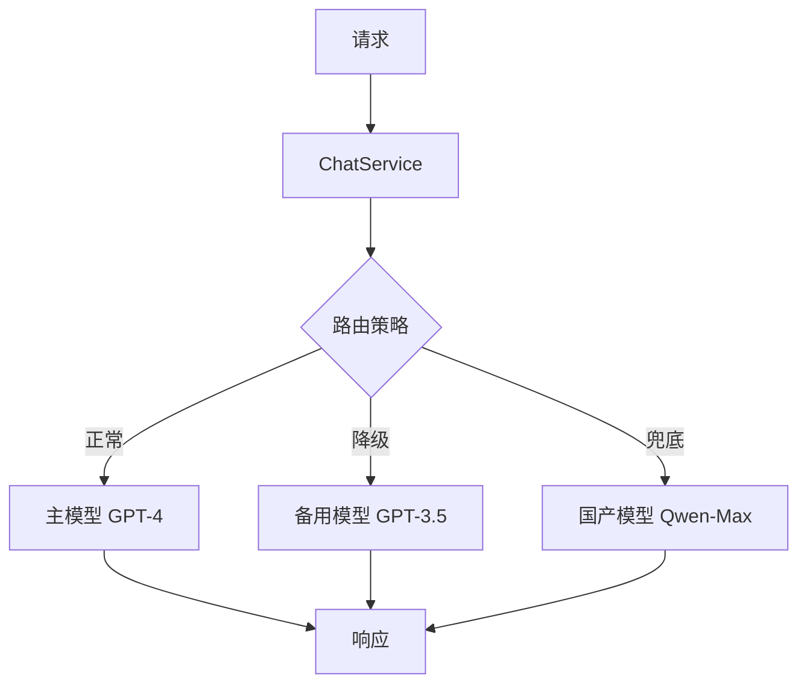

# SpringAI

### SpringAI 深度进阶

#### [Advisor 机制、VectorStore 集成、Function Calling、多模型降级]

---

##### 18、进阶题：SpringAI 的 Advisor 机制是什么？如何用 Advisor 实现 RAG？

**难度**：⭐⭐⭐（Advisor 机制理解、RAG 实现能力、SpringAI 架构设计）

**1️⃣ Common Answer**：

重点总结（便于面试记忆）：

- Advisor 的核心优势
- Advisor 是 SpringAI 的核心拦截机制，它基于 AOP 思想设计，在请求和响应的生命周期中插入自定义逻辑。SpringAI 提供了三种 Advisor：Reque...
- 用 Advisor 实现 RAG 的核心思路是：在 RequestAdvisor 阶段，通过向量检索获取相关文档，然后将文档注入到 system prompt 中...
- ```java @Service public class ChatService { private final ChatClient chatClient;
- public ChatService(ChatClient.Builder builder, VectorStore vectorStore) { this.chatClien...
- public String chat(String message) { return chatClient.prompt() .user(message) .call() ....

**2️⃣ Impressive Answer**：

Advisor 是 SpringAI 的核心拦截机制，它基于 AOP 思想设计，在请求和响应的生命周期中插入自定义逻辑。SpringAI 提供了三种 Advisor：RequestAdvisor（请求前）、ResponseAdvisor（响应后）、AroundAdvisor（环绕）。

用 Advisor 实现 RAG 的核心思路是：在 RequestAdvisor 阶段，通过向量检索获取相关文档，然后将文档注入到 system prompt 中。SpringAI 内置了 `QuestionAnswerAdvisor`，一行代码即可完成 RAG 集成：

```java
@Service
public class ChatService {
    private final ChatClient chatClient;

    public ChatService(ChatClient.Builder builder, VectorStore vectorStore) {
        this.chatClient = builder
            .defaultAdvisors(
                new QuestionAnswerAdvisor(vectorStore)  // 内置 RAG Advisor
            )
            .build();
    }

    public String chat(String message) {
        return chatClient.prompt()
            .user(message)
            .call()
            .content();
    }
}
```

如果需要自定义 RAG 逻辑，可以实现 RequestAdvisor 接口：

```java
@Component
public class CustomRagAdvisor implements RequestAdvisor {

    private final VectorStore vectorStore;

    @Override
    public AdvisedRequest adviseRequest(AdvisedRequest request, Map<String, Object> context) {
        // 向量检索
        List<Document> docs = vectorStore.similaritySearch(
            SearchRequest.query(request.userText()).withTopK(5)
        );

        // 构建上下文并注入 system prompt
        String contextText = docs.stream()
            .map(Document::getContent)
            .collect(Collectors.joining("\n\n"));

        String systemPrompt = """
            你是一个智能助手，请基于以下上下文回答用户问题：

            上下文：
            %s

            如果上下文中没有相关信息，请如实告知。
            """.formatted(contextText);

        return AdvisedRequest.from(request)
            .withSystemText(systemPrompt)
            .build();
    }
}
```

**Advisor 的核心优势**：可以链式叠加多个 Advisor，比如同时挂载 RAG Advisor、日志 Advisor、安全过滤 Advisor，每个 Advisor 专注一个职责，符合单一职责原则。

**3️⃣ Key Differences**

<table>
<tr>
<td>
维度
</td>
<td>
Common Answer
</td>
<td>
Impressive Answer
</td>
</tr>
<tr>
<td>
技术深度
</td>
<td>
只知道是拦截器，不清楚 Advisor 的分类和设计思想
</td>
<td>
明确三种 Advisor 类型，理解 AOP 设计思想
</td>
</tr>
<tr>
<td>
实践经验
</td>
<td>
简单描述流程，无实际代码
</td>
<td>
提供内置 Advisor 和自定义 Advisor 两种实现
</td>
</tr>
<tr>
<td>
思考维度
</td>
<td>
只关注功能实现，不考虑扩展性
</td>
<td>
考虑了链式叠加、职责分离等工程设计
</td>
</tr>
<tr>
<td>
面试官印象
</td>
<td>
基础掌握，缺乏实战经验
</td>
<td>
深入理解框架设计，有实际项目经验
</td>
</tr>
</table>

---

##### 19、进阶题：SpringAI 如何集成向量数据库？VectorStore 的抽象设计是什么？

**难度**：⭐⭐⭐（向量数据库集成能力、抽象设计理解、扩展性思考）

**1️⃣ Common Answer**：

重点总结（便于面试记忆）：

- VectorStore：核心接口，定义了 add、delete、similaritySearch 等操作
- SearchRequest：检索请求封装，支持 topK、similarityThreshold、filterExpression
- Document：文档对象，包含 content、metadata、id
- FilterExpression：元数据过滤表达式，支持 AND、OR、IN 等操作符

**2️⃣ Impressive Answer**：

SpringAI 的 VectorStore 是一套统一的向量数据库抽象，它屏蔽了不同向量数据库的差异，提供统一的 API。核心接口体系包括：

- **VectorStore**：核心接口，定义了 add、delete、similaritySearch 等操作

- **SearchRequest**：检索请求封装，支持 topK、similarityThreshold、filterExpression

- **Document**：文档对象，包含 content、metadata、id

- **FilterExpression**：元数据过滤表达式，支持 AND、OR、IN 等操作符

以 Milvus 为例的集成代码：

```java
@Configuration
public class MilvusVectorStoreConfig {

    @Bean
    public MilvusVectorStore milvusVectorStore(
            EmbeddingModel embeddingModel,
            MilvusClient milvusClient) {

        MilvusVectorStoreConfig config = MilvusVectorStoreConfig.builder()
            .withCollectionName("documents")
            .withDimensions(embeddingModel.dimensions())
            .build();

        return new MilvusVectorStore(milvusClient, embeddingModel, config);
    }

    @Bean
    public MilvusClient milvusClient() {
        ConnectParam connectParam = ConnectParam.newBuilder()
            .withHost("localhost")
            .withPort(19530)
            .build();
        return new MilvusServiceClient(connectParam);
    }
}
```

使用时通过 SearchRequest 构建复杂查询：

```java
@Service
public class DocumentService {

    private final VectorStore vectorStore;

    public List<Document> search(String query, int topK) {
        SearchRequest request = SearchRequest.query(query)
            .withTopK(topK)
            .withSimilarityThreshold(0.7)
            .withFilterExpression("category in ['tech', 'ai']");  // 元数据过滤

        return vectorStore.similaritySearch(request);
    }
}
```

**VectorStore 抽象的核心价值**：切换向量数据库只需改配置和依赖，业务代码零改动。比如从 Chroma 切换到 Milvus，只需替换 Bean 定义，所有调用 VectorStore 接口的代码完全不用改。这和 Spring Data 的 Repository 抽象是同一种设计哲学。

**3️⃣ Key Differences**

<table>
<tr>
<td>
维度
</td>
<td>
Common Answer
</td>
<td>
Impressive Answer
</td>
</tr>
<tr>
<td>
技术深度
</td>
<td>
只知道有接口和实现类，不清楚抽象设计
</td>
<td>
深入理解 VectorStore 的接口体系和设计思想
</td>
</tr>
<tr>
<td>
实践经验
</td>
<td>
简单描述配置，无完整代码示例
</td>
<td>
提供完整的配置类、Bean 定义和使用代码
</td>
</tr>
<tr>
<td>
思考维度
</td>
<td>
只关注基本功能，不考虑高级特性
</td>
<td>
涵盖 FilterExpression 等高级特性，类比 Spring Data
</td>
</tr>
<tr>
<td>
面试官印象
</td>
<td>
基础了解，缺乏深入理解
</td>
<td>
系统掌握框架设计，有丰富实战经验
</td>
</tr>
</table>

---

##### 20、进阶题：SpringAI 的 Function Calling 如何实现？和 LangChain4J 的 @Tool 有什么区别？

**难度**：⭐⭐⭐（Function Calling 实现机制、框架对比能力、技术选型思考）

**1️⃣ Common Answer**：

重点总结（便于面试记忆）：

- SpringAI 实现方式
- LangChain4J 的 @Tool 实现方式
- 核心差异对比
- 选型建议

**2️⃣ Impressive Answer**：

SpringAI 的 Function Calling 基于函数描述机制，核心流程是：LLM 根据函数描述决定是否调用 → 框架拦截调用请求 → 执行 Java 方法 → 将结果返回给 LLM 生成最终答案。

**SpringAI 实现方式**：

```java
// 1. 定义函数 Bean
@Configuration
public class FunctionConfig {

    @Bean
    @Description("获取指定城市的当前天气信息")
    public Function<WeatherRequest, WeatherResponse> getCurrentWeather() {
        return request -> {
            // 调用天气 API
            return new WeatherResponse(request.city(), "晴", 25);
        };
    }
}

// 2. 在 ChatClient 中注册并使用
@Service
public class WeatherChatService {

    private final ChatClient chatClient;

    public String chat(String message) {
        return chatClient.prompt()
            .user(message)
            .functions("getCurrentWeather")  // 注册函数名
            .call()
            .content();
    }
}
```

**LangChain4J 的 @Tool 实现方式**：

```java
// LangChain4J：注解更直观，自动扫描
public class WeatherTools {

    @Tool("获取指定城市的当前天气")
    public String getCurrentWeather(@P("城市名称") String city) {
        return city + " 当前天气：晴，温度 25°C";
    }
}

// 注册到 AiService
CustomerAgent agent = AiServices.builder(CustomerAgent.class)
    .chatLanguageModel(model)
    .tools(new WeatherTools())  // 直接传入工具实例
    .build();
```

**核心差异对比**：

<table>
<tr>
<td>
对比维度
</td>
<td>
SpringAI Function Calling
</td>
<td>
LangChain4J @Tool
</td>
</tr>
<tr>
<td>
定义方式
</td>
<td>
@Bean + @Description
</td>
<td>
@Tool 注解在方法上
</td>
</tr>
<tr>
<td>
注册方式
</td>
<td>
通过函数名字符串注册
</td>
<td>
直接传入工具实例
</td>
</tr>
<tr>
<td>
Spring 集成
</td>
<td>
原生，与 Spring 生态深度集成
</td>
<td>
需要额外配置
</td>
</tr>
<tr>
<td>
代码简洁度
</td>
<td>
需要单独的 Config 类
</td>
<td>
注解直接在方法上，更简洁
</td>
</tr>
<tr>
<td>
类型安全
</td>
<td>
强类型（Function&lt;Request, Response&gt;）
</td>
<td>
弱类型（方法参数直接映射）
</td>
</tr>
</table>

**选型建议**：已有 Spring Boot 项目且追求与 Spring 生态一致性，选 SpringAI；需要快速开发、代码简洁，选 LangChain4J 的 @Tool。

**3️⃣ Key Differences**

<table>
<tr>
<td>
维度
</td>
<td>
Common Answer
</td>
<td>
Impressive Answer
</td>
</tr>
<tr>
<td>
技术深度
</td>
<td>
只知道基本用法，不清楚实现机制
</td>
<td>
深入理解 Function Calling 的完整流程和机制
</td>
</tr>
<tr>
<td>
实践经验
</td>
<td>
简单描述注解，无完整代码示例
</td>
<td>
提供两种框架的完整代码对比
</td>
</tr>
<tr>
<td>
思考维度
</td>
<td>
只关注功能实现，不做框架对比
</td>
<td>
系统对比两个框架的差异，展现技术选型能力
</td>
</tr>
<tr>
<td>
面试官印象
</td>
<td>
基础掌握，缺乏深入思考
</td>
<td>
深入理解框架设计，有技术对比和选型经验
</td>
</tr>
</table>

---

##### 21、场景题：SpringAI 项目中如何做多模型切换和降级？

**难度**：⭐⭐⭐（多模型管理、降级策略、高可用设计）

**1️⃣ Common Answer**：

重点总结（便于面试记忆）：

- 模型管理
- 路由策略
- 降级机制
- 架构设计
- 实现代码
- Resilience4j 配置

**2️⃣ Impressive Answer**：

多模型切换和降级需要从**模型管理**、**路由策略**、**降级机制**三个层面设计。

**架构设计**：



**实现代码**：

```java
@Configuration
public class MultiModelConfig {

    @Primary
    @Bean("primaryChatModel")
    public ChatModel primaryChatModel() {
        return OpenAiChatModel.builder()
            .apiKey(primaryApiKey)
            .modelName("gpt-4")
            .build();
    }

    @Bean("fallbackChatModel")
    public ChatModel fallbackChatModel() {
        return OpenAiChatModel.builder()
            .apiKey(primaryApiKey)
            .modelName("gpt-3.5-turbo")
            .build();
    }
}

@Service
public class ChatService {

    @Qualifier("primaryChatModel")
    private final ChatModel primaryModel;

    @Qualifier("fallbackChatModel")
    private final ChatModel fallbackModel;

    @Retry(name = "chatRetry", fallbackMethod = "fallbackChat")
    @CircuitBreaker(name = "chatCircuitBreaker")
    public String chat(String prompt) {
        return primaryModel.call(prompt);
    }

    // 降级方法：主模型失败时自动调用
    private String fallbackChat(String prompt, Exception error) {
        log.warn("主模型调用失败，降级到备用模型: {}", error.getMessage());
        return fallbackModel.call(prompt);
    }
}
```

**Resilience4j 配置**：

```yaml
resilience4j:
  circuitbreaker:
    instances:
      chatCircuitBreaker:
        failure-rate-threshold: 50        # 失败率超过 50% 触发熔断
        wait-duration-in-open-state: 30s  # 熔断后等待 30 秒
        sliding-window-size: 10           # 滑动窗口大小
  retry:
    instances:
      chatRetry:
        max-attempts: 3
        wait-duration: 1s
```

**降级策略设计**：

1. **熔断降级**：连续失败达到阈值后熔断，自动切换备用模型

1. **超时降级**：设置合理的超时时间（如 30 秒），超时后切换

1. **成本路由**：根据请求复杂度动态选择模型，简单问题用便宜模型

1. **监控告警**：实时监控各模型的可用性、延迟、成本，及时发现异常

**3️⃣ Key Differences**

<table>
<tr>
<td>
维度
</td>
<td>
Common Answer
</td>
<td>
Impressive Answer
</td>
</tr>
<tr>
<td>
技术深度
</td>
<td>
简单描述切换和降级概念
</td>
<td>
系统设计多模型架构，包含路由、降级、监控
</td>
</tr>
<tr>
<td>
实践经验
</td>
<td>
理论描述，无具体实现方案
</td>
<td>
提供完整的配置、服务实现和 Resilience4j 配置
</td>
</tr>
<tr>
<td>
思考维度
</td>
<td>
只关注功能，不考虑高可用和稳定性
</td>
<td>
综合考虑熔断、重试、超时、成本路由等工程实践
</td>
</tr>
<tr>
<td>
面试官印象
</td>
<td>
基础了解，缺乏实战经验
</td>
<td>
深入理解高可用设计，有丰富的生产环境经验
</td>
</tr>
</table>
---

## 知识点一句话总结

| 知识点 | 一句话总结（来自 Impressive Answer） |
| --- | --- |
| [Advisor 机制、VectorStore 集成、Function Calling、多模型降级] | Advisor 是 SpringAI 的请求/响应拦截机制，可在模型调用前后插入逻辑；做 RAG 时在请求前用 VectorStore 检索相关文档，把结果注入 Prompt，再交给模型生成，适合把检索增强、审计、限流和后处理做成可复用横切能力。 |
| SpringAI 的 Advisor 机制是什么？如何用 Advisor 实现 RAG？ | Advisor 是 SpringAI 的请求/响应拦截机制，可在模型调用前后插入逻辑；做 RAG 时在请求前用 VectorStore 检索相关文档，把结果注入 Prompt，再交给模型生成，适合把检索增强、审计、限流和后处理做成可复用横切能力。 |
| SpringAI 如何集成向量数据库？VectorStore 的抽象设计是什么？ | VectorStore：核心接口，定义了 add、delete、similaritySearch 等操作；SearchRequest：检索请求封装，支持 topK、similarityThreshold、filterExpression；Document：文档对象，包含 content、metadata、id；FilterExpression：元数据过滤表达式，支持 AND、OR、IN 等操作符。 |
| SpringAI 的 Function Calling 如何实现？和 LangChain4J 的 @Tool 有什么区别？ | 定义方式上，SpringAI Function Calling是@Bean + @Description，LangChain4J @Tool是@Tool 注解在方法上；注册方式上，SpringAI Function Calling是通过函数名字符串注册，LangChain4J @Tool是直接传入工具实例；Spring 集成上，SpringAI Function Calling是原生，与 Spring 生态深度集成，LangChain4J @Tool是需要额外配置；代码简洁度上，SpringAI Function Calling是需要单独的 Config 类，LangChain4J @Tool是注解直接在方法上，更简洁；类型安全上，SpringAI Function Calling是强类型（Function&lt;Request, Response&gt;），LangChain4J @Tool是弱类型（方法参数直接映射）。 |
| SpringAI 项目中如何做多模型切换和降级？ | 多模型切换和降级需要从模型管理、路由策略、降级机制三个层面设计；A[请求] --> B[ChatService]；C -->\|正常\| D[主模型 GPT-4]。 |
