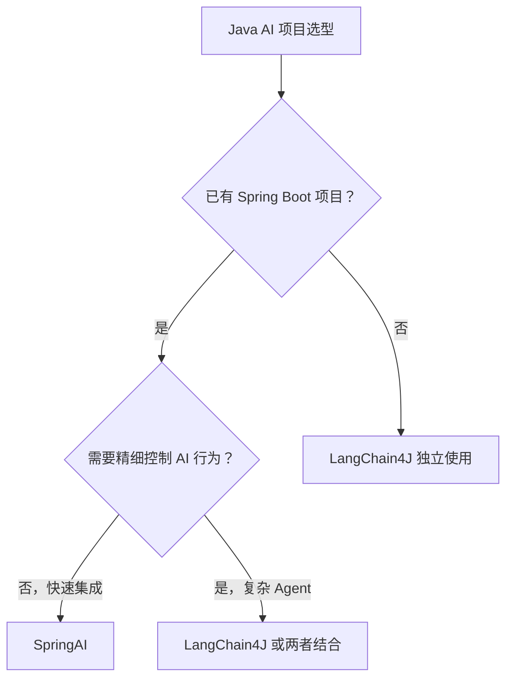

## **[LangChain / LangGraph / SpringAI / LangChain4J / LlamaIndex / AutoGen / CrewAI 全景对比]**

#### 框架总览速查表

| 框架 | 语言 | 核心特性 | 最适合场景 |
| --- | --- | --- | --- |
| **LangChain** | Python | 链式编排、丰富生态 | 快速原型、RAG、工具调用 |
| **LangGraph** | Python | 图式状态机、循环支持 | 复杂 Agent、有状态工作流 |
| **LlamaIndex** | Python | 数据索引、RAG 专精 | 知识库问答、文档处理 |
| **AutoGen** | Python | 多 Agent 对话协作 | 多 Agent 自动化任务 |
| **CrewAI** | Python | 角色扮演、任务分工 | 团队协作式多 Agent |
| **SpringAI** | Java | Spring 生态集成 | Java 企业级 AI 应用 |
| **LangChain4J** | Java | 注解式开发、AiServices | Java AI 应用快速开发 |
| **Semantic Kernel** | C#/Java/Python | Plugin 机制、微软生态 | .NET/Azure 生态 AI 应用 |

---

#### 1、基础题：LangChain 和 LangGraph 的核心区别是什么？

**难度**：⭐（链式 vs 图式、状态机、循环支持）

**Answer**：

LangChain 和 LangGraph 是同一团队的产品，但解决不同复杂度的问题：

**LangChain（链式）**：

- 数据流是**线性的**：A → B → C → 输出

- 适合固定流程：用户问题 → 检索 → 生成答案

- 不支持循环和条件分支（或实现复杂）

**LangGraph（图式）**：

- 数据流是**图结构**：节点 + 边 + 条件路由

- 支持**循环**（Agent 可以反复调用工具直到满足条件）

- 支持**条件分支**（根据状态决定下一步）

- 有**持久化状态**（Checkpoint），支持中断和恢复

```python
# LangGraph 示例：带循环的 Agent
from langgraph.graph import StateGraph

graph = StateGraph(AgentState)
graph.add_node("agent", agent_node)
graph.add_node("tools", tool_node)

# 条件路由：有工具调用就去 tools，否则结束
graph.add_conditional_edges("agent", should_continue, {
    "continue": "tools",
    "end": END
})
graph.add_edge("tools", "agent")  # 工具执行完回到 agent（循环！）
```

**选型原则**：简单 RAG 和工具调用用 LangChain；需要循环、条件、状态持久化的 Agent 用 LangGraph。

---

#### 2、进阶题：SpringAI 和 LangChain4J 的定位有什么差异？Java 项目如何选型？

**难度**：⭐⭐⭐（Java AI 框架对比、设计哲学、生态集成、选型决策）

**1️⃣ Common Answer**：

SpringAI 是 Spring 官方出的 AI 框架，和 Spring Boot 集成好。LangChain4J 是 LangChain 的 Java 版本，功能更丰富。如果项目用 Spring Boot 就用 SpringAI，如果想要更多 AI 功能就用 LangChain4J。

**2️⃣ Impressive Answer**：

两者的核心差异在于**设计哲学**：

**SpringAI：以 Spring 生态为中心**

- 核心抽象：`ChatClient`、`EmbeddingModel`、`VectorStore`，遵循 Spring 的接口抽象风格

- 优势：与 Spring Boot 无缝集成（自动配置、依赖注入、Actuator 监控）

- 适合：已有 Spring 技术栈的企业项目，追求标准化和可维护性

```java
// SpringAI 风格：声明式，Spring 味浓
@Service
public class ChatService {
    private final ChatClient chatClient;

    public String chat(String message) {
        return chatClient.prompt()
            .system("你是一个专业助手")
            .user(message)
            .advisors(new QuestionAnswerAdvisor(vectorStore))  // RAG 一行搞定
            .call()
            .content();
    }
}
```

**LangChain4J：以 AI 能力为中心**

- 核心特性：`@AiService` 注解式接口定义，自动生成实现

- 优势：AI 功能更丰富（Memory、Tools、RAG 的细粒度控制），更接近 Python LangChain 的能力

- 适合：需要精细控制 AI 行为的项目，或从 Python 迁移的团队

```java
// LangChain4J 风格：注解式，AI 味浓
@AiService
interface CustomerSupportAgent {
    @SystemMessage("你是客服助手，只回答产品相关问题")
    @UserMessage("{{userMessage}}")
    String chat(@MemoryId String userId, @V("userMessage") String message);
}
// 框架自动生成实现，包括记忆管理、工具调用等
```

**选型决策树**：



**实际建议**：两者并不互斥，SpringAI 做基础设施（模型接入、向量库），LangChain4J 做复杂 Agent 逻辑，可以共存。

**3️⃣ Key Differences**

| 维度 | Common Answer | Impressive Answer |
| --- | --- | --- |
| 区分维度 | 只说了集成度 | 指出"设计哲学"的本质差异 |
| 代码对比 | 无 | 有两种框架的代码风格对比 |
| 选型指导 | 模糊 | 有决策树和实际建议 |
| 面试官印象 | 知道两个框架 | 能指导 Java AI 项目选型 |

---

#### 3、进阶题：LangChain 和 LlamaIndex 的定位有什么不同？

**难度**：⭐⭐（框架定位、RAG 专精 vs 通用、数据索引）

**1️⃣ Common Answer**：

LangChain 是通用的 AI 框架，什么都能做。LlamaIndex 专注于 RAG，对文档处理和检索做得更好。如果只做 RAG 就用 LlamaIndex，如果要做 Agent 就用 LangChain。

**2️⃣ Impressive Answer**：

两者的核心差异在于**数据处理的深度**：

**LangChain：以"链"为中心**

- 把 RAG 看作一个流程：加载 → 分块 → 嵌入 → 检索 → 生成

- 工具链丰富，但 RAG 的细粒度控制相对有限

**LlamaIndex：以"数据"为中心**

- 核心概念是 **Index**（索引），把数据组织成可高效查询的结构

- 支持多种索引类型：向量索引、树形索引、关键词索引、知识图谱索引

- 对复杂文档结构（表格、嵌套文档、多模态）处理更强

```python
# LlamaIndex 的核心优势：多种索引类型
from llama_index.core import VectorStoreIndex, KnowledgeGraphIndex

# 向量索引（语义检索）
vector_index = VectorStoreIndex.from_documents(documents)

# 知识图谱索引（关系推理）
kg_index = KnowledgeGraphIndex.from_documents(
    documents,
    max_triplets_per_chunk=2
)

# 组合查询（先 KG 找关系，再向量找细节）
query_engine = RouterQueryEngine(
    selector=LLMSingleSelector.from_defaults(),
    query_engine_tools=[vector_tool, kg_tool]
)
```

**选型建议**：

- 文档问答、知识库 → LlamaIndex（RAG 更精细）

- 工具调用、多步骤 Agent → LangChain/LangGraph

- 复杂文档结构（财报、法律文件）→ LlamaIndex 的结构化索引

**3️⃣ Key Differences**

| 维度 | Common Answer | Impressive Answer |
| --- | --- | --- |
| 核心差异 | 只说了专注方向 | 指出"以链为中心 vs 以数据为中心" |
| 技术深度 | 无 | 介绍了 LlamaIndex 的多种索引类型 |
| 代码示例 | 无 | 有知识图谱索引的代码示例 |
| 面试官印象 | 知道两者 | 理解两者的设计哲学差异 |

---

#### 4、进阶题：AutoGen 和 CrewAI 的多 Agent 协作模式有什么区别？

**难度**：⭐⭐⭐（多 Agent 框架、对话式 vs 角色式、协作模式）

**1️⃣ Common Answer**：

AutoGen 是微软出的，让多个 Agent 互相对话来完成任务。CrewAI 是让 Agent 扮演不同角色，像一个团队一样工作。AutoGen 更灵活，CrewAI 更结构化。

**2️⃣ Impressive Answer**：

两者代表了多 Agent 协作的两种范式：

**AutoGen：对话驱动（Conversation-Driven）**

- 核心是 Agent 之间的**自由对话**，通过对话协商完成任务

- 支持人类介入（Human-in-the-Loop）

- 适合：需要 Agent 自主协商、探索性任务

```python
# AutoGen：对话式协作
import autogen

assistant = autogen.AssistantAgent("assistant",
    llm_config={"model": "gpt-4"})

user_proxy = autogen.UserProxyAgent("user_proxy",
    human_input_mode="NEVER",  # 全自动
    code_execution_config={"work_dir": "coding"})

# 两个 Agent 自由对话，直到任务完成
user_proxy.initiate_chat(assistant,
    message="帮我写一个快速排序算法并测试")
```

**CrewAI：角色驱动（Role-Driven）**

- 每个 Agent 有明确的**角色、目标、背景故事**

- 任务分配是结构化的（顺序/并行/层级）

- 适合：流程清晰、角色分工明确的任务

```python
# CrewAI：角色式协作
from crewai import Agent, Task, Crew

researcher = Agent(
    role="市场研究员",
    goal="收集竞品信息",
    backstory="你是一位有 10 年经验的市场分析师"
)

writer = Agent(
    role="报告撰写员",
    goal="基于研究结果撰写报告",
    backstory="你擅长将复杂数据转化为清晰的商业报告"
)

crew = Crew(agents=[researcher, writer], tasks=[research_task, write_task])
result = crew.kickoff()
```

**选型对比**：

| 维度 | AutoGen | CrewAI |
| --- | --- | --- |
| 协作模式 | 自由对话 | 角色分工 |
| 任务结构 | 动态（Agent 自主决定） | 静态（预定义流程） |
| 可预测性 | 低（灵活但不可控） | 高（流程清晰） |
| 适用场景 | 探索性、创意性任务 | 流程化、生产级任务 |

**3️⃣ Key Differences**

| 维度 | Common Answer | Impressive Answer |
| --- | --- | --- |
| 核心区分 | 只说了灵活 vs 结构化 | 指出"对话驱动 vs 角色驱动"的范式差异 |
| 代码示例 | 无 | 有两种框架的完整代码对比 |
| 选型指导 | 模糊 | 有具体场景的选型建议 |
| 面试官印象 | 知道两个框架 | 理解两种多 Agent 协作范式 |

---

#### 5、场景题：你们项目用的是什么 AI 框架？为什么选它？有什么踩坑经验？

**难度**：⭐⭐⭐（框架选型经验、实战踩坑、工程实践）

**1️⃣ Common Answer**：

我们用的是 LangChain，因为它生态好，文档多，社区活跃。踩过的坑是版本更新太快，经常有 breaking change，需要经常升级依赖。

**2️⃣ Impressive Answer**：

我们项目是 Java 技术栈，选择了 **SpringAI + LangChain4J 组合**，分工如下：

- **SpringAI**：负责模型接入（OpenAI/通义千问）、向量库（Milvus）、基础 RAG 流程

- **LangChain4J**：负责复杂 Agent 逻辑（多工具调用、记忆管理）

**选型理由**：

1. 团队是 Java 背景，Python 框架学习成本高

2. SpringAI 和现有 Spring Boot 基础设施无缝集成（配置中心、监控、日志）

3. LangChain4J 的 `@AiService` 注解大幅减少样板代码

**踩坑经验**：

1. **模型切换成本**：早期直接调 OpenAI SDK，后来要切国产模型，改动很大。教训：**一开始就用框架的抽象层**（`ChatModel` 接口），切换模型只需改配置

2. **上下文窗口溢出**：没有做 Token 计数，长对话直接报错。解决：接入 `TokenCountBudgetAdvisor`，超限时自动压缩历史

3. **工具调用幂等性**：Agent 重试时重复调用了写操作工具（发了两封邮件）。解决：所有写操作工具加**幂等键**，重复调用直接返回缓存结果

4. **Prompt 版本管理**：Prompt 散落在代码里，改了一个地方忘了改另一个。解决：统一用 Prompt 模板文件管理，纳入版本控制

**3️⃣ Key Differences**

| 维度 | Common Answer | Impressive Answer |
| --- | --- | --- |
| 选型深度 | 只说了生态好 | 有具体的分工设计和选型理由 |
| 踩坑质量 | 只说了版本更新 | 4 个真实工程问题 + 解决方案 |
| 实践经验 | 表面 | 体现了真实项目经验 |
| 面试官印象 | 用过框架 | 有深度的工程实践积累 |

---

#### 6、基础题：Semantic Kernel 是什么？和 LangChain 有什么区别？

**难度**：⭐（Semantic Kernel 定位、Plugin 机制、微软生态）

**Answer**：

Semantic Kernel（SK）是微软开源的 AI 框架，支持 C#、Java、Python 三种语言，是微软 Copilot 产品的底层框架。

**核心概念**：

- **Plugin**：功能模块（类似 LangChain 的 Tool），分为 Native Function（代码函数）和 Semantic Function（Prompt 模板）

- **Planner**：自动规划如何组合 Plugin 完成任务

- **Memory**：向量化记忆管理

**和 LangChain 的区别**：

| 对比维度 | Semantic Kernel | LangChain |
| --- | --- | --- |
| 主要语言 | C#（最成熟）、Java、Python | Python（最成熟） |
| 生态绑定 | 微软/Azure 生态 | 开放生态 |
| 设计风格 | 企业级、强类型 | 灵活、快速迭代 |
| 适用场景 | .NET/Azure 项目 | Python AI 项目 |

**选型建议**：.NET 技术栈或深度使用 Azure 服务 → Semantic Kernel；其他场景 → LangChain/LangGraph。

---

#### 7、进阶题：LangChain4J 的 AiServices 注解式开发原理是什么？

**难度**：⭐⭐⭐（动态代理、注解处理、接口自动实现、AOP 思想）

**1️⃣ Common Answer**：

AiServices 是 LangChain4J 的一个功能，可以用注解定义 AI 接口，框架会自动生成实现。用 `@AiService` 注解标记接口，用 `@SystemMessage` 和 `@UserMessage` 定义 Prompt，然后框架会帮你调用 LLM 并返回结果。

**2️⃣ Impressive Answer**：

AiServices 的底层是**动态代理 + 注解处理器**，和 MyBatis 的 Mapper 接口、Spring 的 `@FeignClient` 是同一种设计模式：

**使用方式**：

```java
// 1. 定义接口（只需写接口，不需要实现类）
@AiService
interface CustomerSupportAgent {

    @SystemMessage("你是一个专业的客服助手，只回答产品相关问题，语气友好")
    @UserMessage("用户问题：{{userMessage}}")
    String chat(@MemoryId String userId,
                @V("userMessage") String message);

    @SystemMessage("你是一个情感分析专家")
    @UserMessage("分析以下评论的情感倾向：{{review}}")
    SentimentResult analyzeSentiment(@V("review") String review);
}

// 2. 注册并使用
CustomerSupportAgent agent = AiServices.builder(CustomerSupportAgent.class)
    .chatLanguageModel(openAiModel)
    .chatMemoryProvider(memoryId -> MessageWindowChatMemory.withMaxMessages(10))
    .tools(new OrderQueryTool(), new ProductInfoTool())
    .build();

String response = agent.chat("user-123", "我的订单什么时候到？");
```

**底层原理**：

```java
// 框架内部：动态代理实现
public class AiServicesFactory {
    public static <T> T create(Class<T> serviceClass, ...) {
        return (T) Proxy.newProxyInstance(
            serviceClass.getClassLoader(),
            new Class[]{serviceClass},
            (proxy, method, args) -> {
                // 1. 解析方法上的注解，构建 Prompt
                String systemPrompt = extractSystemMessage(method);
                String userPrompt = fillTemplate(method, args);

                // 2. 加载记忆（如果有 @MemoryId）
                String memoryId = extractMemoryId(method, args);
                List<ChatMessage> history = memoryProvider.get(memoryId).messages();

                // 3. 调用 LLM
                AiMessage response = chatModel.generate(history, systemPrompt, userPrompt);

                // 4. 解析返回值（String/POJO/枚举等）
                return parseResponse(response, method.getReturnType());
            }
        );
    }
}
```

**核心优势**：

- 零样板代码：接口即实现，不需要写任何调用逻辑

- 类型安全：返回值可以是 POJO，框架自动做 JSON 解析

- 关注点分离：Prompt 在注解里，业务逻辑在接口定义里

**3️⃣ Key Differences**

| 维度 | Common Answer | Impressive Answer |
| --- | --- | --- |
| 原理理解 | 只说了用法 | 解释了动态代理的底层实现 |
| 类比能力 | 无 | 类比 MyBatis Mapper 和 FeignClient |
| 代码深度 | 只有使用代码 | 有框架内部实现的伪代码 |
| 面试官印象 | 会用 AiServices | 理解框架设计原理 |

---

#### 8、场景题：如何在 SpringAI 中实现流式输出（Streaming）？

**难度**：⭐⭐（流式响应、SSE、Reactor、用户体验）

**1️⃣ Common Answer**：

SpringAI 支持流式输出，可以用 `stream()` 方法代替 `call()` 方法，然后返回一个 Flux 对象，前端用 SSE 接收。这样用户不用等模型生成完才能看到结果，体验更好。

**2️⃣ Impressive Answer**：

流式输出是 LLM 应用的标配，SpringAI 通过 **Reactor（Project Reactor）** 实现响应式流：

**后端实现**：

```java
@RestController
public class ChatController {

    private final ChatClient chatClient;

    // 流式接口：返回 SSE（Server-Sent Events）
    @GetMapping(value = "/chat/stream", produces = MediaType.TEXT_EVENT_STREAM_VALUE)
    public Flux<String> streamChat(@RequestParam String message) {
        return chatClient.prompt()
            .user(message)
            .stream()           // 关键：用 stream() 而非 call()
            .content()          // 返回 Flux<String>，每个元素是一个 token
            .doOnNext(token -> log.debug("Token: {}", token))
            .doOnComplete(() -> log.info("流式输出完成"));
    }

    // 带结构化数据的流式输出
    @GetMapping(value = "/chat/stream/full", produces = MediaType.TEXT_EVENT_STREAM_VALUE)
    public Flux<ChatResponse> streamChatFull(@RequestParam String message) {
        return chatClient.prompt()
            .user(message)
            .stream()
            .chatResponse()     // 返回完整的 ChatResponse，包含 metadata
            .map(response -> {
                // 可以在这里做 token 计数、内容过滤等
                String content = response.getResult().getOutput().getContent();
                return response;
            });
    }
}
```

**前端接收（JavaScript）**：

```javascript
const eventSource = new EventSource('/chat/stream?message=你好');
eventSource.onmessage = (event) => {
    document.getElementById('output').textContent += event.data;
};
eventSource.onerror = () => eventSource.close();
```

**工程注意点**：

1. **背压（Backpressure）**：如果前端消费慢，Reactor 会自动控制生产速度，避免内存溢出

2. **连接超时**：SSE 连接需要设置合理的超时（如 5 分钟），避免长时间占用连接

3. **错误处理**：流中途出错时，用 `onErrorResume` 优雅降级，而非直接断开连接

**3️⃣ Key Differences**

| 维度 | Common Answer | Impressive Answer |
| --- | --- | --- |
| 实现深度 | 只说了 stream() | 有完整的后端+前端代码 |
| 工程细节 | 无 | 提到背压、超时、错误处理 |
| 框架理解 | 模糊 | 理解 Reactor 响应式流的作用 |
| 面试官印象 | 知道流式输出 | 能实现生产级流式接口 |

---

#### 9、进阶题：如何评估和选择适合自己项目的 LLM 模型？

**难度**：⭐⭐⭐（模型选型、评估维度、成本分析、能力边界）

**1️⃣ Common Answer**：

可以用 GPT-4 或者 Claude，这两个比较强。如果成本敏感可以用 GPT-3.5 或者开源模型。主要看模型的准确率和价格，还有上下文窗口大小。

**2️⃣ Impressive Answer**：

模型选型是 LLM 应用工程化的关键决策，需要从**能力、成本、合规**三个维度系统评估：

**1. 能力维度**

| 评估项 | 评估方法 |
| --- | --- |
| 任务准确率 | 用业务数据集做 benchmark，而非依赖公开排行榜 |
| 上下文窗口 | 确认是否满足最长文档/对话的需求 |
| 工具调用能力 | 测试 Function Calling 的参数提取准确率 |
| 中文能力 | 中文场景必须单独测试，部分模型中英文差距大 |
| 指令遵循 | 测试模型是否能严格按格式输出（JSON、表格等） |

**2. 成本维度**

```plaintext
成本 = 输入 Token 单价 × 平均输入 Token 数
     + 输出 Token 单价 × 平均输出 Token 数
     × 日均请求量 × 30

示例：
GPT-4o: $2.5/1M input + $10/1M output
Claude 3.5 Sonnet: $3/1M input + $15/1M output
Qwen-Max: ¥0.04/1K tokens（约 $0.5/1M，性价比高）
```

**3. 合规维度**

- **数据出境**：金融、医疗等行业数据不能发送到境外，必须用国产模型或私有化部署

- **数据隐私**：用户数据是否会被模型厂商用于训练

- **SLA 保障**：生产环境需要 99.9%+ 可用性保证

**选型决策框架**：

```plaintext
数据合规要求高 → 国产模型（通义千问、文心一言）或私有化部署
成本敏感 + 任务简单 → GPT-3.5 / Claude Haiku / Qwen-Plus
质量优先 + 复杂推理 → GPT-4o / Claude 3.5 Sonnet
多模态需求 → GPT-4V / Claude 3.5 / Gemini Pro Vision
```

**实践建议**：用**路由策略**降低成本——简单问题用便宜模型，复杂问题自动升级到强模型。

**3️⃣ Key Differences**

| 维度 | Common Answer | Impressive Answer |
| --- | --- | --- |
| 评估维度 | 只说了准确率和价格 | 能力+成本+合规三维度系统评估 |
| 实践深度 | 无 | 有具体的成本计算公式 |
| 合规意识 | 无 | 提到数据出境和隐私合规 |
| 面试官印象 | 知道几个模型 | 能做系统性的模型选型决策 |

---

### LangChain vs LangGraph vs 直接调用 API 的选型

#### 1、基础题：什么情况下应该直接调用 OpenAI SDK 而不用任何框架？

**难度级别**：⭐（考察要点：无状态调用、零抽象层开销、适用场景判断）

如果需求是一次性、无状态的 LLM 调用——比如文本改写、分类、摘要——直接用 `openai.chat.completions.create()` 就够了。没有框架依赖、调试直观、部署简单、零抽象层开销。这类场景在实际业务中占比远高于很多人的预期，不需要为简单需求引入框架。

---

#### 2、进阶题：在直接调用 API、LangChain LCEL 和 LangGraph 之间如何做技术选型？

**难度级别**：⭐⭐（考察要点：适用场景边界、框架引入代价、决策树、版本锁定风险）

**1️⃣ Common Answer**

直接调用 API 简单但功能少，LangChain 有很多现成组件，LangGraph 适合多 Agent。如果任务简单就直接调 API，需要 RAG 就用 LangChain，多 Agent 就用 LangGraph，引入框架会增加复杂度但提高效率。

**2️⃣ Impressive Answer**

我会从 3 个角度来回答：

1. **首先说三种方案的适用边界**。直接调用 SDK 适合一次性无状态调用，零框架开销、调试直观，是最轻量的选择；LangChain LCEL 适合多步骤串联场景，比如"检索 → Prompt 填充 → LLM → 输出解析"这种标准 RAG 管道，最大价值是数百个现成组件的生态系统；LangGraph 适合有状态循环、条件分支、多 Agent 协作场景，核心优势是状态可持久化（Checkpoint）和精确的流程控制。

2. **其次说框架引入的真实代价**。引入 LangChain 意味着每次 LLM 调用经过多层 Runnable 包装，增加 5-20ms 的 Python 对象构造开销，调用栈变深、出错时堆栈追踪困难，还有版本锁定风险——LangChain 历史上有过多次 breaking change。低延迟场景（实时对话）下这些代价可能不可接受。

3. **最后给出决策原则**。核心原则是：能不引入框架就不引入，框架是为解决具体复杂度而存在的，不是用来炫技的。判断逻辑：一次性调用或无状态推理 → 直接 SDK；多步骤流水线或需要 RAG/工具生态 → LangChain LCEL；有状态循环或需要 Checkpoint/多 Agent → LangGraph。实践上，我倾向先用直接调用验证核心逻辑，确认方向后再引入框架，避免框架版本问题导致的被动重构。

**3️⃣ Key Differences**

| 维度 | Common Answer | Impressive Answer |
| --- | --- | --- |
| 技术深度 | 简单功能描述，无边界分析 | 精确定义每种方案的适用场景边界和判断条件 |
| 实践经验 | 无抽象层代价分析 | 量化了框架引入的性能开销，提到版本迭代风险 |
| 思考维度 | 框架"越多越好" | 强调"能不引入就不引入"的工程原则，给出决策树 |
| 给面试官的印象 | 会用框架但不理解取舍 | 有架构判断能力，理解工程成本与收益 |

---

#### 3、场景题：团队新项目要做 RAG 问答系统，你会选哪个方案，理由是什么？

**难度级别**：⭐⭐（考察要点：RAG 管道适配、LCEL 组件复用价值、框架引入时机判断）

**1️⃣ Common Answer**

RAG 系统用 LangChain 比较合适，它有很多现成的 Retriever 和 Chain，可以快速搭建起来，不需要从头写。

**2️⃣ Impressive Answer**

RAG 问答系统我会选 LangChain LCEL，但不是因为"它功能多"，而是有具体理由。

RAG 管道是典型的多步骤串联场景：文档加载 → 向量化 → 检索 → Prompt 填充 → LLM → 输出解析。LangChain 的 LCEL 用 `|` 操作符串联各组件，原生支持 `.batch()` 批量执行和 `.ainvoke()` 异步调用，而且向量数据库（Chroma、Pinecone、Weaviate）和各种 DocumentLoader 都有现成集成，能节省大量对接时间。

但有两个前提：如果对延迟要求极高（比如实时对话），要评估 Runnable 包装层的开销是否可接受；如果是验证期原型，可以先用直接调用 SDK 的方式跑通逻辑，确认 RAG 效果后再迁移到 LangChain，避免框架版本问题干扰早期迭代。

**3️⃣ Key Differences**

| 维度 | Common Answer | Impressive Answer |
| --- | --- | --- |
| 技术深度 | "功能多"的泛泛理由 | 给出 RAG 场景和 LCEL 能力的精准匹配分析 |
| 实践经验 | 无前提条件分析 | 考虑了延迟要求和原型验证阶段的不同策略 |
| 思考维度 | 直接选框架 | 先验证逻辑再引入框架的工程思维 |
| 给面试官的印象 | 会用 LangChain | 有选型判断力，理解工程成本与收益 |

---

#### 4、容易一起考的题

| 关联题 | 和本题的关系 |
| --- | --- |
| LangChain LCEL 的 Runnable 接口是怎么工作的？ | LCEL 选型的核心机制，理解 ` |
| LangGraph 的 Checkpoint 是什么？ | LangGraph 相较于 LangChain 的核心差异化能力 |
| 引入框架的技术债怎么管理？ | 框架版本锁定和 breaking change 是实际工程中的真实问题 |
