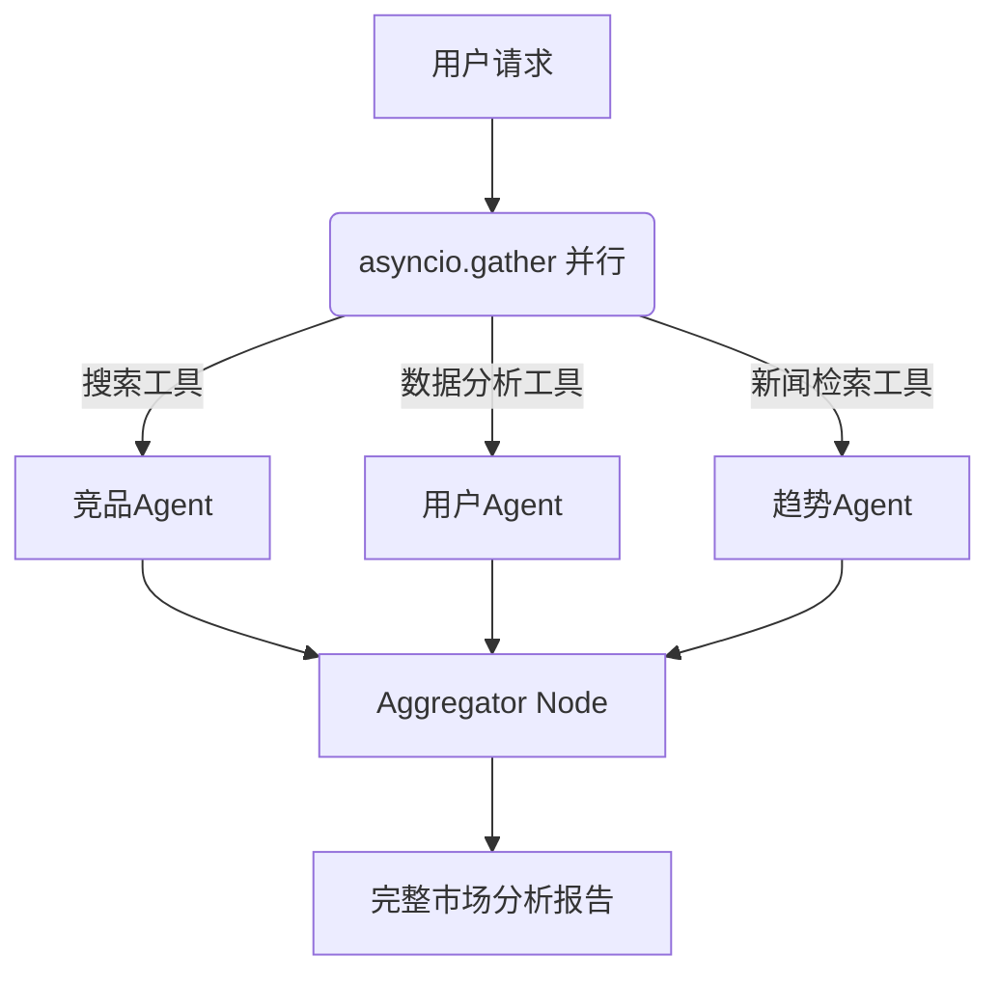
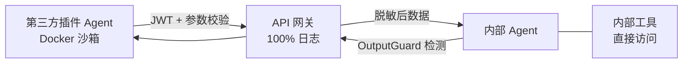

### 多 Agent 架构与通信

#### 多 Agent 系统的核心优势与适用场景

##### 1、基础题：多 Agent 系统相比单 Agent 有哪些核心优势？

**难度级别**：⭐⭐（专业化分工、并行执行、相互验证）

多 Agent 系统的核心价值在于"分而治之"：把超出单 Agent 能力边界的复杂任务，拆解成可被独立 Agent 高质量处理的子任务。它有三个核心优势：专业化分工（每个 Agent 配置最适合的模型和工具）、并行执行（无依赖的子任务同时跑，大幅缩短耗时）、相互验证（一个 Agent 的输出被另一个审核，天然形成质量把关链路）。

---

##### 2、进阶题：什么情况下该用多 Agent，什么情况下反而不该用？

**难度级别**：⭐⭐（任务复杂度阈值判断、适用边界分析）

**1️⃣ Common Answer**

重点总结（便于面试记忆）：

- 先问"单 Agent 能搞定吗"
- 再看任务结构是否天然适合拆分
- 最后做适用边界判断

**2️⃣ Impressive Answer**

我会从三个角度来判断是否引入多 Agent：

1. **先问"单 Agent 能搞定吗"**。如果任务在单个 Context Window 内可以高质量完成，坚决不上多 Agent——编排复杂度、调试难度、Token 成本都是真实代价，不能为了"看起来高级"引入不必要复杂性。

1. **再看任务结构是否天然适合拆分**。我有一个"三问判断法"：任务是否超过单 Agent 的 Context Window 上限？是否有可并行的子任务？是否有需要不同专业能力的环节？三个都是"否"就不上。

1. **最后做适用边界判断**。适合多 Agent：任务链路长（5步以上）、子任务边界清晰、对准确性要求高、需要不同领域专业能力。不适合：任务简单直接、对延迟极其敏感、预算有限。

**3️⃣ Key Differences**

<table>
<tr>
<td>
维度
</td>
<td>
Common Answer
</td>
<td>
Impressive Answer
</td>
</tr>
<tr>
<td>
技术深度
</td>
<td>
停留在&quot;复杂用、简单不用&quot;的直觉判断
</td>
<td>
给出&quot;三问判断法&quot;等可操作的工程决策标准
</td>
</tr>
<tr>
<td>
实践经验
</td>
<td>
无具体判断标准
</td>
<td>
明确列出任务复杂度阈值和适用边界
</td>
</tr>
<tr>
<td>
思考维度
</td>
<td>
只讲优点，缺点一笔带过
</td>
<td>
强调多 Agent 的真实代价，体现不盲目追新的工程判断力
</td>
</tr>
<tr>
<td>
给面试官的印象
</td>
<td>
了解基本概念
</td>
<td>
有工程落地经验，判断力强
</td>
</tr>
</table>

---

##### 3、场景题：一个市场分析任务同时需要分析竞品、用户、趋势，你会怎么设计 Agent 架构？

**难度级别**：⭐⭐（并行执行设计、专业化分工落地）

**1️⃣ Common Answer**

重点总结（便于面试记忆）：

- 分工：设计三个专业化子 Agent，分别配置针对性的 System Prompt 和工具集——竞品 Agent 挂搜索工具，用户 Agent 挂数据分析工具，趋势 Agent ...
- 状态传递机制：基于 LangGraph StateGraph，定义全局状态 Schema（包含 query、retrieved_docs、summary、final_answe...
- 上下文隔离策略：三个 Agent 不共享完整对话历史，而是各自只看到与自己职责相关的上下文
- Researchers：只看原始 query + Tool 检索到的数据
- Summary：只看 Researchers 输出的检索结果 + 摘要指令
- Writer：只看 Summary 输出的摘要 + 原始 query + 引用来源

**2️⃣ Impressive Answer**

这是多 Agent 并行执行的典型场景。我会这样设计：

**先建框架 → 结合项目说具体实现 → 讲工程难点和 Trade-off → 说前沿改进方向**

**第一层：协同模式分类**（先建立框架）

Multi-Agent 协同主要有三种模式：

1. **流水线模式（Handle Off）**：Agent A 的输出直接作为 Agent B 的输入，顺序执行。比如 Researchers 有竞品 Agent | 用户 Agent | 趋势 Agent →Summary→Writer 就是这种模式，适合任务有明确先后依赖的场景

1. **主从模式（Orchestrator-Worker）**：一个 Orchestrator Agent 负责任务拆解和调度，多个 Worker Agent 并行执行子任务，最后汇总结果。适合可并行的复杂任务

1. **对等协作模式（Peer-to-Peer）**：多个 Agent 平等协商，通过消息传递达成共识。适合需要多视角验证的场景（如辩论式推理）

**第二层：我们项目的具体实现**（结合简历）

在系统中，由于我们的检索目标比较明确、且为了保证分析耗时，我们采用的是**流水线 + 条件路由·**的混合模式：

- **分工**：设计三个专业化子 Agent，分别配置针对性的 System Prompt 和工具集——竞品 Agent 挂搜索工具，用户 Agent 挂数据分析工具，趋势 Agent 挂新闻检索工具。

- **状态传递机制**：基于 LangGraph StateGraph，定义全局状态 Schema（包含 `query`、`retrieved_docs`、`summary`、`final_answer`、`tool_calls` 等字段），每个 Agent 节点读取所需字段、写入自己的输出字段，通过状态图实现隐式通信，避免 Agent 间直接耦合

- **上下文隔离策略**：三个 Agent 不共享完整对话历史，而是各自只看到与自己职责相关的上下文：

  - Researchers：只看原始 query + Tool 检索到的数据

  - Summary：只看 Researchers 输出的检索结果 + 摘要指令

  - Writer：只看 Summary 输出的摘要 + 原始 query + 引用来源

  - 这样做的好处：Token 消耗降低约 60%，同时避免无关历史干扰各 Agent 的判断

- **条件路由（Conditional Edge）**：在 Researcher 节点后设置条件判断——如果检索置信度低于阈值，路由到"查询改写节点"重新检索；如果置信度足够，直接进入 Summary 节点。这是 LangGraph 相比普通 Chain 的核心优势

**第三层：协同中的工程难点**

- **难点 1：Agent 间的错误传播**：如果 Researcher 检索失败，Summary 和 Writer 会收到空输入，需要在每个节点入口做输入校验，并设计降级策略（如 Researcher 失败时直接用 LLM 参数记忆回答，并在答案中标注"未找到相关文档"）

- **难点 2：并发 Agent 的状态竞争**：如果多个 Researcher 并行检索（多路召回），需要在 StateGraph 中用 `Annotated[list, operator.add]` 定义列表字段的合并策略，避免并发写入覆盖

- **难点 3：长链路的可观测性**：三个 Agent 串联后，一旦出现问题很难定位是哪个节点出了问题。我们通过 LangFuse 对每个节点的输入/输出/延迟/Token 消耗做全链路追踪，支持单次查询的逐节点 debug



**3️⃣ Key Differences**

<table>
<tr>
<td>
维度
</td>
<td>
Common Answer
</td>
<td>
Impressive Answer
</td>
</tr>
<tr>
<td>
技术深度
</td>
<td>
只提到&quot;三个 Agent 汇总&quot;
</td>
<td>
明确说明并行执行方案（asyncio.gather）和汇总策略（LLM 综合）
</td>
</tr>
<tr>
<td>
实践经验
</td>
<td>
无工具配置和性能优化思考
</td>
<td>
考虑到专业化工具配置、并行带来的延迟优化
</td>
</tr>
<tr>
<td>
思考维度
</td>
<td>
关注分工
</td>
<td>
同时关注分工、并行、汇总三个维度
</td>
</tr>
<tr>
<td>
给面试官的印象
</td>
<td>
有基本思路
</td>
<td>
有完整的工程设计方案
</td>
</tr>
</table>

---

##### 4、容易一起考的题

<table>
<tr>
<td>
关联题
</td>
<td>
和本题的关系
</td>
<td>
参考答案
</td>
</tr>
<tr>
<td>
LangGraph 中如何实现 Agent 并行执行？
</td>
<td>
多 Agent 并行是核心优势，需要知道框架层的具体实现
</td>
<td>
答：多 Agent 协作要讲角色分工、通信协议、任务编排、冲突解决和结果聚合；工程风险是循环、成本失控和责任边界不清。
</td>
</tr>
<tr>
<td>
多 Agent 系统的 Token 成本如何控制？
</td>
<td>
多 Agent 优势背后有真实成本，选型时必须考虑 ROI
</td>
<td>
答：多 Agent 协作要讲角色分工、通信协议、任务编排、冲突解决和结果聚合；工程风险是循环、成本失控和责任边界不清。
</td>
</tr>
<tr>
<td>
单 Agent + 多工具 vs 多 Agent 如何选？
</td>
<td>
适用边界问题的进阶版，考察对两种架构的深度理解
</td>
<td>
答：工具调用题要讲 schema 描述、参数校验、权限控制、超时重试、幂等和观测；核心是让模型会选、会用、用错能兜底。
</td>
</tr>
</table>

---

#### Supervisor 模式 vs Peer-to-Peer 模式的架构对比


##### 1、基础题：什么是 Supervisor 模式和 Peer-to-Peer 模式？

**难度级别**：⭐⭐（多 Agent 协调架构、中心化 vs 去中心化）

Supervisor 模式是"星形拓扑"：一个 Supervisor Agent 作为大脑，负责接收请求、分解任务、路由给子 Agent、收集结果并决策是否继续。Peer-to-Peer 模式是"网状拓扑"：Agent 之间直接通信，没有中央控制器，任何 Agent 都可以请求另一个 Agent 的服务。

---

##### 2、进阶题：Supervisor 模式和 Peer-to-Peer 模式各有什么优缺点？生产中如何选型？

**难度级别**：⭐⭐⭐（架构权衡分析、单点瓶颈、N² 复杂度）

**1️⃣ Common Answer**

重点总结（便于面试记忆）：

- Supervisor 模式的核心权衡
- Peer-to-Peer 模式的核心权衡
- 生产选型建议

**2️⃣ Impressive Answer**

我会从架构特性、核心问题、选型标准三个角度来分析：

1. **Supervisor 模式的核心权衡**：优势是全局状态统一维护、流程可控可追踪、子 Agent 职责单一；缺点是 Supervisor 是单点瓶颈——它的 LLM 调用失败会导致整个系统瘫痪，而且每轮都要经过 Supervisor 决策，随着子 Agent 增多路由 Prompt 会急剧复杂。

1. **Peer-to-Peer 模式的核心权衡**：优势是没有单点故障、延迟低、适合高并发流水线；缺点是全局状态分散导致调试极难，Agent 数量增加时通信关系呈 N² 增长，没有统一的冲突解决入口。

1. **生产选型建议**：任务流程复杂、需要动态决策选 Supervisor；任务流程固定、追求低延迟的流水线选 Peer-to-Peer。生产环境往往是混合架构——用 Supervisor 做顶层编排，内部子流程用 Peer-to-Peer 流水线。

**3️⃣ Key Differences**

<table>
<tr>
<td>
维度
</td>
<td>
Common Answer
</td>
<td>
Impressive Answer
</td>
</tr>
<tr>
<td>
技术深度
</td>
<td>
泛泛描述优缺点
</td>
<td>
用拓扑结构类比，分析单点瓶颈、N² 复杂度等具体问题
</td>
</tr>
<tr>
<td>
实践经验
</td>
<td>
无具体工程判断标准
</td>
<td>
给出明确的选型场景，并提出混合架构方案
</td>
</tr>
<tr>
<td>
思考维度
</td>
<td>
非此即彼地对比
</td>
<td>
体现生产级系统设计思维，提出混合架构
</td>
</tr>
<tr>
<td>
给面试官的印象
</td>
<td>
知道概念
</td>
<td>
对架构权衡有深入理解，有实际落地经验
</td>
</tr>
</table>

---

##### 3、场景题：用 LangGraph 实现 Supervisor 模式，关键代码怎么写？

**难度级别**：⭐⭐⭐（LangGraph 条件路由、Supervisor 节点实现）

**2️⃣ Impressive Answer**

LangGraph Supervisor 的核心是条件路由：Supervisor 节点通过 LLM 决策返回 `next` 字段，`add_conditional_edges` 根据这个字段动态路由到不同子 Agent，子 Agent 完成后统一回到 Supervisor 形成循环，直到 Supervisor 输出 `FINISH` 退出。

```python
from langgraph.graph import StateGraph, END

def supervisor_node(state):
    response = llm.invoke(supervisor_prompt + state["messages"])
    next_agent = parse_next_agent(response)  # "researcher"|"coder"|"FINISH"
    return {"next": next_agent}

workflow = StateGraph(AgentState)
workflow.add_node("supervisor", supervisor_node)
workflow.add_node("researcher", researcher_agent)
workflow.add_node("coder", coder_agent)

workflow.add_conditional_edges(
    "supervisor",
    lambda state: state["next"],
    {"researcher": "researcher", "coder": "coder", "FINISH": END}
)
workflow.add_edge("researcher", "supervisor")
workflow.add_edge("coder", "supervisor")
```

关键设计点：子 Agent 完成后必须回到 Supervisor，由 Supervisor 统一决策是否继续或结束，这样才能保证全局状态的一致性。

**3️⃣ Key Differences**

<table>
<tr>
<td>
维度
</td>
<td>
Common Answer
</td>
<td>
Impressive Answer
</td>
</tr>
<tr>
<td>
技术深度
</td>
<td>
一句话描述实现思路
</td>
<td>
给出完整可运行代码，解释条件路由的设计逻辑
</td>
</tr>
<tr>
<td>
实践经验
</td>
<td>
无代码细节
</td>
<td>
说明 add_conditional_edges 和回边设计的工程意图
</td>
</tr>
<tr>
<td>
思考维度
</td>
<td>
描述&quot;是什么&quot;
</td>
<td>
解释每个设计决策背后的原因
</td>
</tr>
<tr>
<td>
给面试官的印象
</td>
<td>
知道 LangGraph 能做
</td>
<td>
有实际实现经验，代码可直接落地
</td>
</tr>
</table>

---

##### 4、容易一起考的题

<table>
<tr>
<td>
关联题
</td>
<td>
和本题的关系
</td>
<td>
参考答案
</td>
</tr>
<tr>
<td>
LangGraph 的 StateGraph 和 MessageGraph 有什么区别？
</td>
<td>
Supervisor 模式依赖 StateGraph 的共享状态机制
</td>
<td>
答：LangGraph 用图和状态机表达 Agent 流程，节点负责执行，边负责路由，State 承载上下文；适合有分支、循环、人工介入的复杂 Agent。
</td>
</tr>
<tr>
<td>
多 Agent 系统如何防止死循环？
</td>
<td>
Supervisor 路由设计必须考虑终止条件，否则会无限循环
</td>
<td>
答：多 Agent 协作要讲角色分工、通信协议、任务编排、冲突解决和结果聚合；工程风险是循环、成本失控和责任边界不清。
</td>
</tr>
<tr>
<td>
微服务架构中多 Agent 如何通信？
</td>
<td>
Peer-to-Peer 模式在跨服务场景下的延伸，引出消息队列方案
</td>
<td>
答：多 Agent 协作要讲角色分工、通信协议、任务编排、冲突解决和结果聚合；工程风险是循环、成本失控和责任边界不清。
</td>
</tr>
</table>

---

#### 多 Agent 的任务分解与动态分配策略


##### 1、基础题：静态预规划和动态分配分别是什么？

**难度级别**：⭐⭐（任务调度策略、静态 vs 动态）

静态预规划是在执行前由 Planner Agent 生成完整的任务 DAG（有向无环图），按依赖关系调度执行，适合任务结构固定的场景（如 ETL 流水线、标准化审批流程）。动态分配是 Supervisor Agent 在每轮结束后，根据最新系统状态重新决策下一步调用哪个 Agent，适合开放式研究任务、需要根据中间结果灵活调整策略的场景。

---

##### 2、进阶题：Supervisor 的路由 Prompt 应该怎么设计？有哪些关键要素？

**难度级别**：⭐⭐⭐（路由 Prompt 工程、防死循环、终止条件设计）

**1️⃣ Common Answer**

重点总结（便于面试记忆）：

- researcher: Searches web and retrieves information. Use when need external data.
- coder: Writes and executes Python code. Use when need computation or processing.
- writer: Produces structured documents. Use when need to format final output.

**2️⃣ Impressive Answer**

我认为路由 Prompt 的设计有三个核心要点：

1. **Agent 能力描述要精准无歧义**。每个 Agent 的描述必须让 LLM 清楚"什么情况该用谁"，用法如下，关键是要说清楚触发条件，而不只是描述功能：

```
- researcher: Searches web and retrieves information. Use when need external data.
- coder: Writes and executes Python code. Use when need computation or processing.
- writer: Produces structured documents. Use when need to format final output.
```

1. **必须加防死循环规则**。显式在 Prompt 中写入约束，比如"避免连续调用同一 Agent""如果上一步输出已满足需求则输出 FINISH"，否则 LLM 在某些情况下会陷入无限循环。

1. **结构化输出格式**。要求 LLM 只输出固定选项（如 `researcher/coder/writer/FINISH`），不要让它自由发挥，这样 parse 结果不会出错，系统可靠性更高。

**3️⃣ Key Differences**

<table>
<tr>
<td>
维度
</td>
<td>
Common Answer
</td>
<td>
Impressive Answer
</td>
</tr>
<tr>
<td>
技术深度
</td>
<td>
描述路由 Prompt 的大概思路
</td>
<td>
给出具体的 Prompt 模板，解释每个设计决策的原因
</td>
</tr>
<tr>
<td>
实践经验
</td>
<td>
无防死循环等工程细节
</td>
<td>
明确提出防死循环规则和结构化输出的工程价值
</td>
</tr>
<tr>
<td>
思考维度
</td>
<td>
关注&quot;写什么&quot;
</td>
<td>
关注&quot;为什么这样写&quot;，体现 Prompt 工程经验
</td>
</tr>
<tr>
<td>
给面试官的印象
</td>
<td>
知道需要写路由 Prompt
</td>
<td>
有路由 Prompt 工程经验，考虑到可靠性和边界情况
</td>
</tr>
</table>

---

##### 3、场景题：一个复杂分析任务有 4 个子任务，其中 T1、T2 无依赖，T3 依赖 T1/T2，T4 依赖 T3，如何调度？

**难度级别**：⭐⭐⭐（任务 DAG 管理、asyncio 并行调度）

**1️⃣ Common Answer**

重点总结（便于面试记忆）：

- 这是典型的 DAG 调度场景。用任务 ID 和依赖关系显式建模，然后用 asyncio 并行执行无依赖节点
- ```python tasks = [
- {"id": "T1", "agent": "researcher", "deps": [ ], "input": "搜索竞品信息"},
- {"id": "T2", "agent": "researcher", "deps": [ ], "input": "搜索市场数据"},
- {"id": "T3", "agent": "analyst", "deps": ["T1", "T2"], "input": "综合分析"}, {"id": "T4", "a...
- 关键点：T1 和 T2 用 asyncio.gather 并发跑，整体耗时约等于两者中较慢的那个，而不是串行之和。T3 通过依赖声明等待前置任务，不需要手动轮询，由调度器自动触发。

**2️⃣ Impressive Answer**

这是典型的 DAG 调度场景。用任务 ID 和依赖关系显式建模，然后用 asyncio 并行执行无依赖节点：

```python
tasks = [

    {"id": "T1", "agent": "researcher", "deps": [ ], "input": "搜索竞品信息"},


    {"id": "T2", "agent": "researcher", "deps": [ ], "input": "搜索市场数据"},

    {"id": "T3", "agent": "analyst",    "deps": ["T1", "T2"], "input": "综合分析"},
    {"id": "T4", "agent": "writer",     "deps": ["T3"], "input": "生成报告"},
]
# T1、T2 并行执行，asyncio.gather 等待两者完成后才执行 T3
```

关键点：T1 和 T2 用 `asyncio.gather` 并发跑，整体耗时约等于两者中较慢的那个，而不是串行之和。T3 通过依赖声明等待前置任务，不需要手动轮询，由调度器自动触发。

**3️⃣ Key Differences**

<table>
<tr>
<td>
维度
</td>
<td>
Common Answer
</td>
<td>
Impressive Answer
</td>
</tr>
<tr>
<td>
技术深度
</td>
<td>
描述执行顺序
</td>
<td>
用 DAG 数据结构建模，说明 asyncio.gather 的并行原理
</td>
</tr>
<tr>
<td>
实践经验
</td>
<td>
无代码实现
</td>
<td>
给出 DAG 数据结构定义，体现工程落地思路
</td>
</tr>
<tr>
<td>
思考维度
</td>
<td>
关注顺序
</td>
<td>
关注并行优化，说明并行带来的耗时收益
</td>
</tr>
<tr>
<td>
给面试官的印象
</td>
<td>
理解依赖关系
</td>
<td>
有任务调度工程经验
</td>
</tr>
</table>

---

##### 4、容易一起考的题

<table>
<tr>
<td>
关联题
</td>
<td>
和本题的关系
</td>
<td>
参考答案
</td>
</tr>
<tr>
<td>
Python asyncio 的 gather 和 wait 有什么区别？
</td>
<td>
多 Agent 并行执行的底层机制，gather 是最常用的并发等待方式
</td>
<td>
答：多 Agent 协作要讲角色分工、通信协议、任务编排、冲突解决和结果聚合；工程风险是循环、成本失控和责任边界不清。
</td>
</tr>
<tr>
<td>
LangGraph 如何实现条件分支和循环？
</td>
<td>
动态分配策略在 LangGraph 中的具体实现依赖条件边和循环图结构
</td>
<td>
答：LangGraph 用图和状态机表达 Agent 流程，节点负责执行，边负责路由，State 承载上下文；适合有分支、循环、人工介入的复杂 Agent。
</td>
</tr>
<tr>
<td>
如何防止多 Agent 系统中的任务重复执行？
</td>
<td>
DAG 调度中的幂等性保证，生产中必须考虑的可靠性问题
</td>
<td>
答：消息可靠性要分三段讲：生产端用同步发送、确认机制和重试；Broker 端用持久化、副本和 ISR；消费端用手动提交 offset、幂等消费和失败重试，最后用监控补漏。
</td>
</tr>
</table>

---

### 6.2 结果处理与质量优化

#### 多 Agent 的结果聚合：投票、加权、LLM 综合

---

##### 1、基础题：多 Agent 系统中常见的结果聚合方式有哪些？

**难度级别**：⭐⭐（结果聚合策略、多数投票、LLM 综合）

常见的结果聚合策略有三种：多数投票（让多个 Agent 独立给出答案，取出现次数最多的）、加权聚合（根据每个 Agent 的历史表现或模型能力动态分配权重）、LLM 综合（用一个聚合 Agent 读取所有子 Agent 的输出，综合生成最终答案）。三种方式在准确性、成本、延迟上的权衡差异很大，需要根据任务类型选择。

---

##### 2、进阶题：多数投票、加权聚合、LLM 综合各自适用什么场景？Mixture of Agents 的思路是什么？

**难度级别**：⭐⭐⭐（聚合策略适用边界、MoA 架构、成本与质量权衡）

**1️⃣ Common Answer**

重点总结（便于面试记忆）：

- 多数投票适合答案空间有限的任务
- LLM 综合最灵活但成本最高
- MoA 是 LLM 综合的系统化版本

**2️⃣ Impressive Answer**

我会从三种策略的适用边界和 MoA 的系统化思路来分析：

1. **多数投票适合答案空间有限的任务**。比如分类、是/否判断、数学推理等有确定性答案的场景。Self-Consistency 就是这个思路的典型应用——同一问题让 LLM 推理多次，投票过滤偶发错误。但对于开放式生成任务，多个答案语义等价但形式各异，简单投票根本无法工作。

1. **LLM 综合最灵活但成本最高**。能处理矛盾输出、给出有理有据的综合判断，但会额外增加一次 LLM 调用，且输入 Token 随子 Agent 数量线性增长，成本要仔细评估。

1. **MoA 是 LLM 综合的系统化版本**。来自 Together AI 的研究，分两层：Proposer 层用多个不同 LLM（GPT-4、Claude、Llama）并行生成多样化候选答案，Aggregator 层用强模型综合输出。核心洞见是不同模型有不同偏差，输出具有多样性，综合后能互补，实验表明 MoA 在多个 Benchmark 上能超越单个最强模型。工程上 Proposer 层可以并行化以优化延迟，但总成本仍然较高，要评估 ROI。

**3️⃣ Key Differences**

<table>
<tr>
<td>
维度
</td>
<td>
Common Answer
</td>
<td>
Impressive Answer
</td>
</tr>
<tr>
<td>
技术深度
</td>
<td>
描述三种方法是什么
</td>
<td>
深入分析每种方法的适用条件、局限性和成本影响
</td>
</tr>
<tr>
<td>
实践经验
</td>
<td>
无具体工程取舍
</td>
<td>
点出 Token 随子 Agent 线性增长、MoA 延迟优化等实际问题
</td>
</tr>
<tr>
<td>
思考维度
</td>
<td>
把三种方法并列对比
</td>
<td>
梳理方法演进逻辑，引入 MoA 研究成果
</td>
</tr>
<tr>
<td>
给面试官的印象
</td>
<td>
知道有这三种方法
</td>
<td>
理解背后的设计权衡，了解前沿研究，有成本意识
</td>
</tr>
</table>

---

##### 3、场景题：同一问题让 3 个 Agent 给出了不同的分析结论，如何做聚合？

**难度级别**：⭐⭐（聚合策略选择、矛盾输出处理）

**1️⃣ Common Answer**

重点总结（便于面试记忆）：

- 3 个 Agent 给出不同结论，说明任务是开放式分析类，不能用简单多数投票（答案形式各异，没有"多数"可言）。正确做法是 LLM 综合：把三个 Agent 的输出都传给 Ag...
- Aggregator 的 Prompt 设计很关键：要求它显式指出各 Agent 的共识部分和分歧部分...

**2️⃣ Impressive Answer**

3 个 Agent 给出不同结论，说明任务是开放式分析类，不能用简单多数投票（答案形式各异，没有"多数"可言）。正确做法是 LLM 综合：把三个 Agent 的输出都传给 Aggregator Agent，让它理解各方论点、识别分歧点、综合给出有依据的最终结论。

Aggregator 的 Prompt 设计很关键：要求它显式指出各 Agent 的共识部分和分歧部分，并说明最终结论采纳哪方观点及原因。这样输出不只是"综合结果"，还有可追踪的推理链路，便于后续审核。

**3️⃣ Key Differences**

<table>
<tr>
<td>
维度
</td>
<td>
Common Answer
</td>
<td>
Impressive Answer
</td>
</tr>
<tr>
<td>
技术深度
</td>
<td>
提到投票或用强模型判断，无进一步分析
</td>
<td>
解释为何开放式任务不适合投票，LLM 综合更合适
</td>
</tr>
<tr>
<td>
实践经验
</td>
<td>
无 Aggregator Prompt 设计思考
</td>
<td>
提出 Aggregator Prompt 需要显式处理分歧、保留推理链路
</td>
</tr>
<tr>
<td>
思考维度
</td>
<td>
选一种方法
</td>
<td>
先分析任务类型，再选择适合的聚合策略
</td>
</tr>
<tr>
<td>
给面试官的印象
</td>
<td>
有基本思路
</td>
<td>
有聚合策略的工程设计经验
</td>
</tr>
</table>

---

##### 4、容易一起考的题

<table>
<tr>
<td>
关联题
</td>
<td>
和本题的关系
</td>
<td>
参考答案
</td>
</tr>
<tr>
<td>
Self-Consistency 是什么？和多数投票有什么关系？
</td>
<td>
Self-Consistency 是多数投票在 LLM 推理场景下的具体应用
</td>
<td>
答：这题可以按“定义 → 核心机制 → 工程落地”三步答；结合本题重点强调：Self-Consistency 是多数投票在 LLM 推理场景下的具体应用，最后补一个风险点或优化手段。
</td>
</tr>
<tr>
<td>
如何评估多 Agent 系统的输出质量？
</td>
<td>
结果聚合之后需要有质量评估手段，两个问题紧密关联
</td>
<td>
答：多 Agent 协作要讲角色分工、通信协议、任务编排、冲突解决和结果聚合；工程风险是循环、成本失控和责任边界不清。
</td>
</tr>
<tr>
<td>
MoA 和 Ensemble 方法有什么关系？
</td>
<td>
MoA 是机器学习 Ensemble 思想在 LLM 多 Agent 场景下的延伸
</td>
<td>
答：多 Agent 协作要讲角色分工、通信协议、任务编排、冲突解决和结果聚合；工程风险是循环、成本失控和责任边界不清。
</td>
</tr>
</table>

---

#### 多 Agent 通信的消息格式设计

##### 1、基础题：Agent 之间通信的消息格式应该包含哪些基本字段？

**难度级别**：⭐⭐（结构化消息设计、链路追踪、task_id 的作用）

一个生产可用的 Agent 消息结构至少应包含：`task_id`（贯穿整个任务生命周期，用于追踪完整链路）、`message_id`（消息唯一标识）、`sender`/`receiver`（发送方/接收方 Agent 名称）、`content`（结构化消息内容）、`message_type`（request/response/error/status）、`timestamp`（用于排序和超时检测）。其中 `task_id` 是最关键的字段——所有相关 Agent 调用都携带同一个 `task_id`，才能在监控系统中把散落各处的调用聚合成一条完整链路。

---

##### 2、进阶题：LangGraph SharedState 共享内存模式和消息队列解耦模式各有什么优劣？如何选型？

**难度级别**：⭐⭐（LangGraph SharedState、消息队列、架构选型）

**1️⃣ Common Answer**

重点总结（便于面试记忆）：

- LangGraph SharedState 模式
- 消息队列解耦模式
- 选型建议

**2️⃣ Impressive Answer**

我会从两种模式的核心机制和适用边界来分析：

1. **LangGraph SharedState 模式**：所有 Agent 节点共享同一个 State 对象，每个节点读取 State、执行逻辑、返回增量更新，通过 reducer 合并。优势是简单直接、内置持久化（checkpointer）、天然支持 human-in-the-loop。但有两个工程限制：所有 Agent 都能读到全部数据，无法做权限隔离；State 对象随任务进行持续膨胀，可能触发 Token 超限问题。

1. **消息队列解耦模式**：适合 Agent 跨服务、跨进程通信的场景，用 Redis Stream 或 Kafka 作为消息总线，Agent 订阅自己的 topic。优势是松耦合、独立扩缩容、消息持久化支持断点续处理；代价是引入外部依赖、运维复杂度上升、调试时需要跨多个系统查日志。

1. **选型建议**：单进程、任务流程固定的多 Agent 用 LangGraph SharedState；跨服务、需要高可用、Agent 独立部署的场景用消息队列。

**3️⃣ Key Differences**

<table>
<tr>
<td>
维度
</td>
<td>
Common Answer
</td>
<td>
Impressive Answer
</td>
</tr>
<tr>
<td>
技术深度
</td>
<td>
描述两种方式是什么
</td>
<td>
深入分析 SharedState 的权限问题和 Token 膨胀风险
</td>
</tr>
<tr>
<td>
实践经验
</td>
<td>
知道两种方式存在
</td>
<td>
给出具体的工程局限和对应解决思路
</td>
</tr>
<tr>
<td>
思考维度
</td>
<td>
描述&quot;是什么&quot;
</td>
<td>
给出&quot;什么场景选什么&quot;的具体决策标准
</td>
</tr>
<tr>
<td>
给面试官的印象
</td>
<td>
了解基本概念
</td>
<td>
有消息系统设计经验，考虑到权限、追踪、运维等多个维度
</td>
</tr>
</table>

---

##### 3、场景题：多 Agent 系统上线后，发现某个任务链路出错但很难定位是哪个 Agent 出了问题，怎么解决？

**难度级别**：⭐⭐（链路追踪、task_id 设计、可观测性）

**1️⃣ Common Answer**

重点总结（便于面试记忆）：

- 这是多 Agent 系统可观测性的核心问题，根本原因是消息设计时没有统一的追踪 ID。解决方案分两层
- 第一层是消息设计层面，强制每条 Agent 消息携带 task_id 和 parent_message_id，形成完整的消息追踪树。所有 Agent 的日志都带上 task_i...
- 第二层是工具层面，接入 LangSmith 或 OpenTelemetry，自动采集每个 Agent 节点的输入输出、耗时、Token 用量，在 UI 上直接可视化完整的调用链...

**2️⃣ Impressive Answer**

这是多 Agent 系统可观测性的核心问题，根本原因是消息设计时没有统一的追踪 ID。解决方案分两层：

第一层是消息设计层面，强制每条 Agent 消息携带 `task_id` 和 `parent_message_id`，形成完整的消息追踪树。所有 Agent 的日志都带上 `task_id`，这样在日志系统里只需过滤 `task_id` 就能聚合出一条任务的完整执行链路。

第二层是工具层面，接入 LangSmith 或 OpenTelemetry，自动采集每个 Agent 节点的输入输出、耗时、Token 用量，在 UI 上直接可视化完整的调用链路，定位问题从"查日志"变成"看 Trace 图"。

**3️⃣ Key Differences**

<table>
<tr>
<td>
维度
</td>
<td>
Common Answer
</td>
<td>
Impressive Answer
</td>
</tr>
<tr>
<td>
技术深度
</td>
<td>
只想到加日志
</td>
<td>
从消息设计和工具接入两个层面系统解决
</td>
</tr>
<tr>
<td>
实践经验
</td>
<td>
无具体追踪设计
</td>
<td>
提出 task_id + parent_message_id 的消息追踪树设计
</td>
</tr>
<tr>
<td>
思考维度
</td>
<td>
事后排查
</td>
<td>
事前设计可观测性基础设施，从根本上解决问题
</td>
</tr>
<tr>
<td>
给面试官的印象
</td>
<td>
有基本调试思路
</td>
<td>
有多 Agent 系统可观测性的工程经验
</td>
</tr>
</table>

---

##### 4、容易一起考的题

<table>
<tr>
<td>
关联题
</td>
<td>
和本题的关系
</td>
<td>
参考答案
</td>
</tr>
<tr>
<td>
LangSmith 是什么？在多 Agent 系统中如何使用？
</td>
<td>
LangSmith 是 LangGraph 系统的官方可观测性工具，与消息追踪紧密关联
</td>
<td>
答：工具调用题要讲 schema 描述、参数校验、权限控制、超时重试、幂等和观测；核心是让模型会选、会用、用错能兜底。
</td>
</tr>
<tr>
<td>
OpenTelemetry 如何接入 AI Agent 系统？
</td>
<td>
消息队列模式下跨服务追踪的标准解决方案
</td>
<td>
答：这题可以按“定义 → 核心机制 → 工程落地”三步答；结合本题重点强调：消息队列模式下跨服务追踪的标准解决方案，最后补一个风险点或优化手段。
</td>
</tr>
<tr>
<td>
多 Agent 系统如何做权限隔离？
</td>
<td>
SharedState 模式的核心局限之一，延伸考察安全设计
</td>
<td>
答：多 Agent 协作要讲角色分工、通信协议、任务编排、冲突解决和结果聚合；工程风险是循环、成本失控和责任边界不清。
</td>
</tr>
</table>

---

#### 多 Agent 系统的成本控制：防止 LLM 调用爆炸

##### 1、基础题：多 Agent 系统为什么比单 Agent 更容易出现成本失控？

**难度级别**：⭐（成本构成理解、Token 计费原理）

多 Agent 系统每个 Agent 调用都独立消耗 Token，成本是单 Agent 的 N 倍起步。如果 Agent 之间形成循环调用或无限重试，Token 消耗会指数级增长。没有预算上限的系统，一个复杂任务可能烧掉几十美元。

---

##### 2、进阶题：多 Agent 系统的 LLM 调用成本如何控制？有哪些防止调用次数爆炸的有效机制？

**难度级别**：⭐⭐⭐（Agent 调用轮次上限、上下文复用、早停机制、模型分级）

**1️⃣ Common Answer**

重点总结（便于面试记忆）：

- 调用轮次上限
- 早停机制
- 上下文复用
- 模型分级

**2️⃣ Impressive Answer**

我会从调用次数、Token 量、模型选择、监控告警四个维度来回答这个问题：

1. **调用轮次上限**。LangGraph 通过 `recursion_limit` 设置硬上限，但仅靠这个不够——还需要在 Supervisor 的路由 Prompt 里加规则：同一个 Agent 连续调用超过 3 次仍无进展，就返回当前最优结果，防止无效循环。

1. **早停机制**。不等跑完所有轮次就提前结束。判断信号有三类：置信度达阈值（Supervisor 评判"已足够好"）、任务完成信号（Agent 返回 `{"status": "complete"}`）、结果收敛（连续两轮输出相似度 > 0.95）。

1. **上下文复用**。这是最容易被忽视但效果显著的点。子 Agent 不应每次独立做 RAG 检索，应该复用父 Agent 已检索的上下文。对不变的系统规则、API 文档，用 OpenAI Prompt Caching 或 Anthropic Cache Control 缓存 System Prompt，可以节省 50-90% 的 Token 成本。

1. **模型分级**。简单路由和格式转换用 GPT-4o-mini / Claude Haiku；核心推理和代码生成用 GPT-4o / Claude Sonnet；复杂分析和最终综合用 o1 / Claude Opus。在生产中还需设置每次任务的 Token 预算上限，超出时自动降级或停止执行。

**3️⃣ Key Differences**

<table>
<tr>
<td>
维度
</td>
<td>
Common Answer
</td>
<td>
Impressive Answer
</td>
</tr>
<tr>
<td>
技术深度
</td>
<td>
说了三个方向，无实现细节
</td>
<td>
给出每个机制的具体触发条件和实现思路
</td>
</tr>
<tr>
<td>
实践经验
</td>
<td>
未提上下文复用这一关键优化
</td>
<td>
明确指出子 Agent 重复检索是常见浪费点并给出方案
</td>
</tr>
<tr>
<td>
思考维度
</td>
<td>
只考虑了调用次数和模型选择
</td>
<td>
从次数、Token 量、模型选择、监控告警四个维度系统性覆盖
</td>
</tr>
<tr>
<td>
给面试官的印象
</td>
<td>
知道有成本问题
</td>
<td>
有生产级成本控制经验，考虑周全
</td>
</tr>
</table>

---

##### 3、场景题：生产环境中一个多 Agent 任务突然 Token 消耗飙升，如何快速定位并止损？

**难度级别**：⭐⭐⭐（成本监控、告警机制、预算守卫）

**1️⃣ Common Answer**

重点总结（便于面试记忆）：

- 实时止损
- 事后定位
- 定位和止损需要分两个层次应对
- 实时止损：在每次 LLM 调用后更新累计消耗，设置预算守卫（CostGuard），一旦超出阈值立即抛出异常中断任务，防止继续烧钱。同时配置告警（接飞书或 PagerDuty）让...
- 事后定位：通过 LangSmith 或自建 Trace 系统，按 Trace ID 聚合每次任务的各 Agent Token 消耗明细，对比历史基线找出异常 Agent...
- ```python class CostGuard: def __init__(self, budget_usd: float): self.budget = budget_u...

**2️⃣ Impressive Answer**

定位和止损需要分两个层次应对：

**实时止损**：在每次 LLM 调用后更新累计消耗，设置预算守卫（CostGuard），一旦超出阈值立即抛出异常中断任务，防止继续烧钱。同时配置告警（接飞书或 PagerDuty）让人工第一时间感知。

**事后定位**：通过 LangSmith 或自建 Trace 系统，按 Trace ID 聚合每次任务的各 Agent Token 消耗明细，对比历史基线找出异常 Agent。常见原因是某个 Agent 陷入了重试循环，或上下文窗口被无关内容撑大，定位后针对性修复（加早停、清理上下文）。

```python
class CostGuard:
    def __init__(self, budget_usd: float):
        self.budget = budget_usd
        self.consumed = 0.0

    def check(self, tokens: int, model: str):
        cost = tokens / 1_000_000 * MODEL_PRICE[model]
        self.consumed += cost
        if self.consumed > self.budget:
            raise BudgetExceededError(f"已消耗 ${self.consumed:.2f}，超出预算")
```

**3️⃣ Key Differences**

<table>
<tr>
<td>
维度
</td>
<td>
Common Answer
</td>
<td>
Impressive Answer
</td>
</tr>
<tr>
<td>
应对策略
</td>
<td>
被动事后处理
</td>
<td>
实时止损 + 事后溯因双层应对
</td>
</tr>
<tr>
<td>
工具使用
</td>
<td>
只提到看日志
</td>
<td>
明确用 Trace ID 聚合 + LangSmith 定位异常 Agent
</td>
</tr>
<tr>
<td>
思考深度
</td>
<td>
只知道停或换模型
</td>
<td>
能分析根因（重试循环、上下文膨胀）并给出修复方向
</td>
</tr>
</table>

---

##### 4、容易一起考的题

<table>
<tr>
<td>
关联题
</td>
<td>
和本题的关系
</td>
<td>
参考答案
</td>
</tr>
<tr>
<td>
LangGraph 的 recursion_limit 是什么？如何配置？
</td>
<td>
防止调用爆炸的基础机制，是成本控制的第一道防线
</td>
<td>
答：LangGraph 用图和状态机表达 Agent 流程，节点负责执行，边负责路由，State 承载上下文；适合有分支、循环、人工介入的复杂 Agent。
</td>
</tr>
<tr>
<td>
OpenAI Prompt Caching 的原理和使用条件？
</td>
<td>
上下文复用的核心实现手段，直接影响 Token 成本
</td>
<td>
答：成本优化先拆 Token、模型、工具和重试四类开销，再用缓存、小模型路由、Prompt 压缩、批处理和限流降级优化。
</td>
</tr>
<tr>
<td>
多 Agent 系统的可观测性如何建设？
</td>
<td>
成本监控依赖完善的 Trace 体系，两者深度绑定
</td>
<td>
答：Trace ID 的正确传播方式；LangSmith 的父子 Trace 结构；跨 Agent Token 消耗汇总
</td>
</tr>
</table>

---

### 6.3 可观测性、应用与安全

#### 多 Agent 的可观测性：跨 Agent 调用链追踪

---

##### 1、基础题：什么是 Trace ID？在多 Agent 系统中为什么必须有统一的 Trace ID？

**难度级别**：⭐（可观测性基础概念、分布式追踪原理）

Trace ID 是一次任务从开始到结束的唯一标识，所有 Agent 调用都携带同一个 Trace ID，形成完整的调用链。多 Agent 系统一次任务可能触发十几次 LLM 调用分散在不同 Agent，没有统一 Trace ID 就无法把它们关联起来，出了问题根本没法定位。

---

##### 2、进阶题：多 Agent 系统的可观测性如何建设？如何实现跨 Agent 的调用链追踪和 Token 消耗汇总？LangSmith 在其中扮演什么角色？

**难度级别**：⭐⭐⭐（统一 Trace ID 传播、LangSmith 父子 Trace 结构、跨 Agent Token 消耗汇总）

**1️⃣ Common Answer**

重点总结（便于面试记忆）：

- Trace ID 的正确传播方式
- LangSmith 的父子 Trace 结构
- 跨 Agent Token 消耗汇总

**2️⃣ Impressive Answer**

我会从 Trace ID 传播、LangSmith 父子结构、Token 汇总三个层次来回答：

1. **Trace ID 的正确传播方式**。Trace ID 必须在任务入口统一生成，通过 Python 的 `ContextVar` 在异步环境中安全透传，不能让每个 Agent 自己生成——否则就失去了关联能力。每个子调用生成自己的 Span ID 并记录父 Span ID，整体形成树状结构。

1. **LangSmith 的父子 Trace 结构**。给函数加 `@traceable` 装饰器，LangSmith 会自动识别调用栈中的嵌套关系，构建父子 Trace 树。在 UI 上可以直接看到完整调用链、每个节点的输入输出、耗时和 Token 消耗，调试效率远高于翻日志。

1. **跨 Agent Token 消耗汇总**。通过 LangSmith Client 的 `list_runs` API，按 Trace ID 聚合所有 run 的 `usage_metadata`，可以得到每个 Agent 的分项消耗和全局总量，用于成本分析和异常告警。生产中还需要把指标推送到 Prometheus + Grafana，并对失败 Trace 做 100% 采样、成功 Trace 做 10% 采样，平衡存储成本和调试需求。

**3️⃣ Key Differences**

<table>
<tr>
<td>
维度
</td>
<td>
Common Answer
</td>
<td>
Impressive Answer
</td>
</tr>
<tr>
<td>
技术深度
</td>
<td>
知道需要 Trace ID 和 LangSmith
</td>
<td>
详细说明 ContextVar 传播机制和父子 Trace 树状结构
</td>
</tr>
<tr>
<td>
实践经验
</td>
<td>
无具体实现
</td>
<td>
给出 LangSmith API 聚合 Token 的完整思路和采样策略
</td>
</tr>
<tr>
<td>
思考维度
</td>
<td>
只提了追踪
</td>
<td>
涵盖追踪、汇总、告警、采样策略等完整监控体系
</td>
</tr>
<tr>
<td>
给面试官的印象
</td>
<td>
了解工具名称
</td>
<td>
有生产级可观测性建设经验，懂得在成本和完整性间取舍
</td>
</tr>
</table>

---

##### 3、场景题：线上某个多 Agent 任务失败率突然升高，如何用可观测性手段快速定位问题？

**难度级别**：⭐⭐⭐（Trace 分析、错误采样、调用链定位）

**1️⃣ Common Answer**

重点总结（便于面试记忆）：

- 利用完善的 Trace 体系，定位分三步走
- 首先，通过 Grafana 看板定位失败率上升的时间窗口，对比该窗口内的 Trace 和正常时段的基线——找出失败 Trace 集中在哪个 Agent 节点（Span）。
- 其次，对失败的 Trace 做 100% 采样，在 LangSmith 里打开具体 Trace，查看每个 Span 的输入输出，重点看异常 Span 的 LLM 输入是否有上下...
- 最后，如果是偶发性问题，检查是否有外部依赖（如检索服务、工具 API）的延迟或错误率同步升高，排除上下游影响，确认问题根因后修复并验证 Trace 恢复正常。

**2️⃣ Impressive Answer**

利用完善的 Trace 体系，定位分三步走：

首先，通过 Grafana 看板定位失败率上升的时间窗口，对比该窗口内的 Trace 和正常时段的基线——找出失败 Trace 集中在哪个 Agent 节点（Span）。

其次，对失败的 Trace 做 100% 采样，在 LangSmith 里打开具体 Trace，查看每个 Span 的输入输出，重点看异常 Span 的 LLM 输入是否有上下文截断、工具调用参数是否异常、返回的 JSON 是否解析失败。

最后，如果是偶发性问题，检查是否有外部依赖（如检索服务、工具 API）的延迟或错误率同步升高，排除上下游影响，确认问题根因后修复并验证 Trace 恢复正常。

**3️⃣ Key Differences**

<table>
<tr>
<td>
维度
</td>
<td>
Common Answer
</td>
<td>
Impressive Answer
</td>
</tr>
<tr>
<td>
定位路径
</td>
<td>
直接看日志，无系统方法
</td>
<td>
从指标 → Trace → Span 逐层收窄，有方法论
</td>
</tr>
<tr>
<td>
工具运用
</td>
<td>
只提到 LangSmith 看错误
</td>
<td>
结合 Grafana 时序分析 + LangSmith Span 输入输出检查
</td>
</tr>
<tr>
<td>
思考广度
</td>
<td>
只看 Agent 本身
</td>
<td>
考虑到外部依赖（工具 API、检索服务）的联动影响
</td>
</tr>
</table>

---

##### 4、容易一起考的题

<table>
<tr>
<td>
关联题
</td>
<td>
和本题的关系
</td>
<td>
参考答案
</td>
</tr>
<tr>
<td>
Python ContextVar 的原理和使用场景？
</td>
<td>
Trace ID 在异步环境中安全传播的核心机制
</td>
<td>
答：可观测性要覆盖输入、Prompt、模型输出、工具调用、耗时、Token、错误和最终结果；用 Trace 串起一次 Agent 执行链路。
</td>
</tr>
<tr>
<td>
LangSmith 的 @traceable 装饰器是如何工作的？
</td>
<td>
构建父子 Trace 结构的关键工具，直接影响调用链的可视化
</td>
<td>
答：工具调用题要讲 schema 描述、参数校验、权限控制、超时重试、幂等和观测；核心是让模型会选、会用、用错能兜底。
</td>
</tr>
<tr>
<td>
多 Agent 系统的成本控制如何实现？
</td>
<td>
Token 消耗汇总是成本控制的前提，两者共享同一套 Trace 基础设施
</td>
<td>
答：多 Agent 协作要讲角色分工、通信协议、任务编排、冲突解决和结果聚合；工程风险是循环、成本失控和责任边界不清。
</td>
</tr>
</table>

---

#### Debate 模式：多 Agent 辩论提升推理质量

---

##### 1、基础题：什么是多 Agent 的 Debate 模式？它的核心思想来自哪里？

**难度级别**：⭐（Debate 模式概念、Society of Mind 理论）

Debate 模式是让多个 Agent 对同一问题独立给出答案，再相互批判对方观点，最后由仲裁者综合所有意见给出最终答案。思想来自 Marvin Minsky 的 Society of Mind 理论——复杂智能从简单个体的竞争与协作中涌现，多个 LLM 作为独立思维者，通过竞争性对话提升集体推理质量。

---

##### 2、进阶题：Debate 模式是如何提升推理质量的？最终仲裁者应该如何设计？

**难度级别**：⭐⭐⭐（Society of Mind 思想、独立生成防止羊群效应、仲裁者角色设计）

**1️⃣ Common Answer**

重点总结（便于面试记忆）：

- 为什么有效
- 流程关键设计点
- 仲裁者的设计

**2️⃣ Impressive Answer**

我会从有效性原理、流程关键设计点、仲裁者设计三个角度来回答：

1. **为什么有效**。单个 LLM 生成时容易陷入"自洽的错误"——它会对自己的错误推理产生高置信度。多个独立 Agent 的答案具有多样性，交叉批判能暴露单个 Agent 忽视的反例和漏洞。MIT 等机构的研究证明这在数学推理、常识问答上显著优于单次生成。

1. **流程关键设计点**。Round 1 必须独立生成，绝对不能让 Agent 看到其他 Agent 的答案——否则会产生羊群效应，第一个 Agent 的答案会主导后续所有人，失去多样性，整个 Debate 的价值就归零了。Round 2 开始才进行交叉批判，每个 Agent 读取其他所有 Agent 的答案并发表批评意见，可以并行执行提升效率。

1. **仲裁者的设计**。仲裁者不能简单"取多数票"，而是要做论据质量评估——优先支持论证更充分、逻辑更严密的立场，识别并排除明显错误的论点，并说明为什么采纳某方观点（可解释性）。仲裁者是整个流程认知要求最高的环节，必须用能力最强的模型。此外，Debate 的成本是参与 Agent 数量 × 轮次的倍数，不适合简单问题，最适合高风险决策和容易出现幻觉的复杂推理场景。

**3️⃣ Key Differences**

<table>
<tr>
<td>
维度
</td>
<td>
Common Answer
</td>
<td>
Impressive Answer
</td>
</tr>
<tr>
<td>
技术深度
</td>
<td>
描述了流程，未解释为何有效
</td>
<td>
从 Society of Mind 理论出发解释多样性和竞争带来的质量提升原理
</td>
</tr>
<tr>
<td>
实践经验
</td>
<td>
无实现细节
</td>
<td>
强调 Round 1 必须独立生成这一关键设计点，并解释违反后的后果
</td>
</tr>
<tr>
<td>
思考维度
</td>
<td>
未提适用边界和成本
</td>
<td>
分析仲裁者设计要点，给出成本-收益的适用边界
</td>
</tr>
<tr>
<td>
给面试官的印象
</td>
<td>
了解概念
</td>
<td>
理解论文背景，有工程化落地经验，知道细节陷阱
</td>
</tr>
</table>

---

##### 3、场景题：一个法律合同审查系统想引入 Debate 模式，但预算有限，如何在控制成本的前提下实现？

**难度级别**：⭐⭐⭐（Debate 成本优化、适用边界、模型分级）

**1️⃣ Common Answer**

重点总结（便于面试记忆）：

- 选择性触发
- 模型分级
- 轮次控制

**2️⃣ Impressive Answer**

在预算有限的场景下，Debate 模式的成本优化有三个方向：

**选择性触发**：不是所有合同条款都需要辩论。对风险评分低的标准条款直接用单 Agent 处理，只对高风险条款（如违约责任、排他协议）触发 Debate，减少 70% 以上的无效辩论成本。

**模型分级**：辩论 Agent 用中等能力模型（如 Claude Sonnet）保证多样性，仲裁者用最强模型（如 Claude Opus）做最终判断。这样在质量和成本之间取得平衡。

**轮次控制**：法律场景通常一轮批判已经足够暴露主要分歧，不需要像数学推理那样多轮迭代。固定为"1 轮独立生成 + 1 轮交叉批判 + 仲裁"的三步结构，并设置单次任务的 Token 预算上限，超出时降级为单 Agent 处理。

**3️⃣ Key Differences**

<table>
<tr>
<td>
维度
</td>
<td>
Common Answer
</td>
<td>
Impressive Answer
</td>
</tr>
<tr>
<td>
成本控制策略
</td>
<td>
只想到减少 Agent 数量和轮次
</td>
<td>
从选择性触发、模型分级、轮次控制三个维度系统优化
</td>
</tr>
<tr>
<td>
业务理解
</td>
<td>
没有结合法律场景的特点
</td>
<td>
识别高/低风险条款的差异，做差异化处理
</td>
</tr>
<tr>
<td>
兜底设计
</td>
<td>
无
</td>
<td>
超出预算时自动降级为单 Agent，保证服务可用性
</td>
</tr>
</table>

---

##### 4、容易一起考的题

<table>
<tr>
<td>
关联题
</td>
<td>
和本题的关系
</td>
<td>
参考答案
</td>
</tr>
<tr>
<td>
Society of Mind 理论是什么？对 AI Agent 设计有什么启发？
</td>
<td>
Debate 模式的理论基础，理解原理才能设计好系统
</td>
<td>
答：这题可以按“定义 → 核心机制 → 工程落地”三步答；结合本题重点强调：Debate 模式的理论基础，理解原理才能设计好系统，最后补一个风险点或优化手段。
</td>
</tr>
<tr>
<td>
多 Agent 系统的成本控制有哪些手段？
</td>
<td>
Debate 模式成本是普通多 Agent 的倍数，成本控制是必配能力
</td>
<td>
答：多 Agent 协作要讲角色分工、通信协议、任务编排、冲突解决和结果聚合；工程风险是循环、成本失控和责任边界不清。
</td>
</tr>
<tr>
<td>
LangGraph 如何实现并行节点执行？
</td>
<td>
Debate Round 1 独立生成需要并行执行，LangGraph 的 Send API 是关键实现手段
</td>
<td>
答：LangGraph 用图和状态机表达 Agent 流程，节点负责执行，边负责路由，State 承载上下文；适合有分支、循环、人工介入的复杂 Agent。
</td>
</tr>
</table>

---

#### 多 Agent 软件开发系统设计（需求/设计/编码/测试）

##### 1、基础题：MetaGPT 模拟软件公司是什么思路？和普通的单 Agent 代码生成有什么本质区别？

**难度级别**：⭐（MetaGPT 概念、角色化 Agent 设计）

MetaGPT 的思路是把软件公司的角色（PM、架构师、程序员、QA）映射为不同的 Agent，每个 Agent 有明确的职责，输出结构化文档（PRD、架构设计、代码、测试报告），上游的输出是下游的输入，形成类流水线的工作流。和单 Agent 代码生成的本质区别是：职责分离 + 结构化中间产物，每个环节有专门的 Agent 把关，减少单点失败的影响。

---

##### 2、进阶题：如果用多 Agent 系统来模拟软件开发流程，如何设计各个角色 Agent 的职责划分？人工审查节点应该在哪些关键环节介入？

**难度级别**：⭐⭐⭐（各角色 Agent 职责划分、MetaGPT/AutoGen 实现参考、人工审查节点介入时机）

**1️⃣ Common Answer**

重点总结（便于面试记忆）：

- 角色职责划分
- 人工审查节点
- LangGraph 实现 Human-in-the-Loop

**2️⃣ Impressive Answer**

我会从角色职责划分、工作流设计、人工介入节点三个角度来回答：

1. **角色职责划分**。六个角色各有明确的输入输出：PM Agent（用户需求 → 结构化 PRD）、Architect Agent（PRD → 架构设计文档 + API Schema）、Developer Agent（架构文档 + 模块分配 → 代码，可按模块并行）、Code Reviewer Agent（代码 → Review 意见，检查规范和安全）、QA Agent（代码 + PRD → 测试报告，基于验收标准生成用例）、DevOps Agent（代码 + 架构文档 → 部署配置）。

1. **人工审查节点**。有四个必须介入的关键节点——需求确认（PRD 完成后，AI 对需求的理解可能有偏差，是整个开发的起点，理解错了后面全错，成本最高）；架构评审（架构决策影响深远，技术债往往源于此）；代码合并前（不用每行都看，但对安全和核心业务逻辑做抽样审查）；上线审批（最后的门控）。人工介入太多失去自动化价值，太少风险不可控，四个关键节点是经验上的合理平衡点。

1. **LangGraph 实现 Human-in-the-Loop**。用 `interrupt_before` 在指定节点前自动暂停，配合 `MemorySaver` 做状态持久化，人工审查期间任务挂起。审查完成后调用 `update_state` 写入反馈，再用 `invoke(None, thread_id)` 从断点继续，整个流程对任务透明。关于框架选型，MetaGPT 更像"刚性流水线"，输出格式有严格约束，适合流程标准化场景；AutoGen 更像"动态协商"，灵活但难预测。生产中我倾向于 MetaGPT 的思路——强制结构化输出，减少因格式混乱导致的链路中断。

**3️⃣ Key Differences**

<table>
<tr>
<td>
维度
</td>
<td>
Common Answer
</td>
<td>
Impressive Answer
</td>
</tr>
<tr>
<td>
技术深度
</td>
<td>
列举角色，描述串行流程
</td>
<td>
给出完整工作流图，分析哪些环节可并行，以及 interrupt_before 的具体用法
</td>
</tr>
<tr>
<td>
实践经验
</td>
<td>
人工节点只笼统提了一下
</td>
<td>
明确给出 4 个必须介入的关键节点，并解释每个节点介入的风险理由
</td>
</tr>
<tr>
<td>
思考维度
</td>
<td>
未对比 MetaGPT 和 AutoGen
</td>
<td>
对比两种框架设计哲学，给出选型建议
</td>
</tr>
<tr>
<td>
给面试官的印象
</td>
<td>
知道有这个应用方向
</td>
<td>
有系统设计能力，能权衡自动化和人工把关的边界
</td>
</tr>
</table>

---

##### 3、场景题：多 Agent 软件开发系统上线后，代码质量仍然不稳定，如何改进？

**难度级别**：⭐⭐⭐（质量保证机制、反馈循环、Agent 能力边界）

**1️⃣ Common Answer**

重点总结（便于面试记忆）：

- 结构化输出约束
- 反馈循环设计
- 质量基准测试

**2️⃣ Impressive Answer**

代码质量不稳定通常有三个根因，对应三个改进方向：

**结构化输出约束**：如果 Developer Agent 的输出格式不一致（如有时输出 Markdown 有时是纯文本），下游 Code Reviewer 解析失败就会跳过审查。解决方案是强制 Developer Agent 输出符合预定义 Schema 的结构化格式，任何不合规的输出在进入下游前就被拦截并要求重生成。

**反馈循环设计**：Code Reviewer → Developer 的修复循环需要设置退出条件，否则会无限循环。建议设置最大修复轮次（如 3 轮），超出后人工介入判断是 Agent 能力边界还是需求本身有歧义。

**质量基准测试**：定期用标准化的测试用例集评估各 Agent 的输出质量，监控 QA Agent 的测试通过率趋势。一旦通过率下滑，及时排查是上游 Architect Agent 的设计文档质量下降还是 LLM 版本更新导致输出风格变化。

**3️⃣ Key Differences**

<table>
<tr>
<td>
维度
</td>
<td>
Common Answer
</td>
<td>
Impressive Answer
</td>
</tr>
<tr>
<td>
问题诊断
</td>
<td>
直接加 Agent 或重新生成，未分析根因
</td>
<td>
识别三类根因并对应三个改进方向
</td>
</tr>
<tr>
<td>
反馈机制
</td>
<td>
只提到重新生成，无退出条件
</td>
<td>
明确修复循环的退出条件和人工介入触发点
</td>
</tr>
<tr>
<td>
系统思维
</td>
<td>
局部修补
</td>
<td>
从结构化约束、循环设计、质量监控三层系统改进
</td>
</tr>
</table>

---

##### 4、容易一起考的题

<table>
<tr>
<td>
关联题
</td>
<td>
和本题的关系
</td>
<td>
参考答案
</td>
</tr>
<tr>
<td>
LangGraph 的 interrupt_before 和 Human-in-the-Loop 如何实现？
</td>
<td>
人工审查节点的核心实现机制，是软件开发系统中质量把关的关键
</td>
<td>
答：LangGraph 用图和状态机表达 Agent 流程，节点负责执行，边负责路由，State 承载上下文；适合有分支、循环、人工介入的复杂 Agent。
</td>
</tr>
<tr>
<td>
MetaGPT 和 AutoGen 的设计哲学有什么区别？
</td>
<td>
两种框架代表不同的多 Agent 协作范式，直接影响软件开发系统的架构选型
</td>
<td>
答：多 Agent 协作要讲角色分工、通信协议、任务编排、冲突解决和结果聚合；工程风险是循环、成本失控和责任边界不清。
</td>
</tr>
<tr>
<td>
多 Agent 系统如何控制 LLM 调用成本？
</td>
<td>
软件开发系统角色多、链路长，成本控制是绕不开的工程问题
</td>
<td>
答：多 Agent 协作要讲角色分工、通信协议、任务编排、冲突解决和结果聚合；工程风险是循环、成本失控和责任边界不清。
</td>
</tr>
</table>

---

#### 多 Agent 的安全边界：防止 Agent 间数据越权

---

##### 1、基础题：什么是最小权限原则？在多 Agent 系统中如何理解它？

**难度级别**：⭐（最小权限原则概念、Agent 工具白名单）

最小权限原则是指每个 Agent 只能访问完成其任务所必需的工具和数据，不能多给。在多 Agent 系统中，不同 Agent 的职责不同，不能给所有 Agent 一个通用工具包，而应该为每个 Agent 配置工具白名单。一个专门做格式转换的 Agent 不应该有数据库读写权限，哪怕它从不主动使用。

---

##### 2、进阶题：多 Agent 系统中如何防止 Agent 间的数据越权访问？工具权限隔离和敏感数据保护应该如何设计？

**难度级别**：⭐⭐⭐（Agent 权限隔离设计、工具访问白名单、敏感数据不传递给不可信 Agent、输出内容安全过滤）

**1️⃣ Common Answer**

重点总结（便于面试记忆）：

- 权限控制层（最外层）
- 数据脱敏层（传递层）
- 工具调用层（工具层）
- 输出过滤层（输出层）

**2️⃣ Impressive Answer**

我会用"防御纵深"框架来组织这个问题，从外到内分四层设防：

1. **权限控制层（最外层）**。用集中式工具注册中心管理所有 Agent 的工具权限，通过 `grant_tools` 为每个 Agent 显式授权，`get_tools_for_agent` 在运行时动态返回该 Agent 的合法工具列表。任何不在白名单内的工具调用直接拒绝，不给任何 Agent 通用工具包。

1. **数据脱敏层（传递层）**。对数据做三级分类：L0 公开数据可以传给任何 Agent；L1 内部数据只给受信 Agent；L2 敏感数据（PII、API Key、密码）只在专属 Agent 内部处理，绝不作为消息内容传递。消息传递前经过 DataSanitizer 自动正则脱敏。关键原则是 Sensitive by Design——在架构层阻止敏感数据流动，而不是靠运行时过滤兜底。

1. **工具调用层（工具层）**。能执行代码、写文件、发网络请求的工具是最大风险点。安全工具执行器需要做两道检查：先验证 Agent 是否有该工具的执行权限，再做静态代码分析拦截危险导入（如 `os`、`subprocess`）。最终在沙箱（RestrictedPython 或 Docker 容器）中执行，防止注入攻击。

1. **输出过滤层（输出层）**。Agent 输出在传递给用户或下游 Agent 前，要做 Prompt Injection 检测——恶意网页内容被检索后可能含有"ignore previous instructions"等注入指令，影响后续 Agent 行为，需要提前拦截。任何一层失效都有其他层兜底，这是防御纵深的核心价值。

**3️⃣ Key Differences**

<table>
<tr>
<td>
维度
</td>
<td>
Common Answer
</td>
<td>
Impressive Answer
</td>
</tr>
<tr>
<td>
技术深度
</td>
<td>
说了白名单和脱敏，无实现细节
</td>
<td>
给出工具注册中心、数据分级、静态代码分析等具体实现方案
</td>
</tr>
<tr>
<td>
实践经验
</td>
<td>
未考虑 Prompt Injection 等攻击面
</td>
<td>
提出 Prompt Injection 防护、第三方 Agent 沙箱隔离等高级威胁模型
</td>
</tr>
<tr>
<td>
思考维度
</td>
<td>
平面式列举几个措施
</td>
<td>
用&quot;防御纵深&quot;框架组织，形成层次化的安全体系
</td>
</tr>
<tr>
<td>
给面试官的印象
</td>
<td>
有基本安全意识
</td>
<td>
有系统性安全设计思维，考虑到攻击链路的每个环节
</td>
</tr>
</table>

---

##### 3、场景题：系统引入了第三方插件 Agent，如何防止它访问内部数据和工具？

**难度级别**：⭐⭐⭐（第三方 Agent 隔离、沙箱设计、API 网关审计）

**1️⃣ Common Answer**

重点总结（便于面试记忆）：

- 运行环境隔离
- 访问路径隔离
- 数据传递控制

**2️⃣ Impressive Answer**

第三方 Agent 是多 Agent 系统中最高风险的接入点，需要从三个层次做隔离：

**运行环境隔离**：第三方 Agent 必须在独立的沙箱（Docker 容器或专用进程）中运行，不能和内部 Agent 共享进程空间和内存，防止通过内存读取或文件系统访问绕过权限控制。

**访问路径隔离**：第三方 Agent 不能直接调用内部工具，所有交互都必须通过受控的 API 网关进行。网关做身份认证（JWT）+ 权限校验（只开放公开接口）+ 请求参数校验（防止 SQL 注入、路径穿越），并对所有请求做 100% 日志记录。

**数据传递控制**：传递给第三方 Agent 的数据在出境前必须经过最严格的脱敏处理（L2 数据绝对不出境），返回数据在入境前经过 OutputGuard 做 Prompt Injection 检测，防止恶意插件通过输出内容影响内部 Agent 行为。



**3️⃣ Key Differences**

<table>
<tr>
<td>
维度
</td>
<td>
Common Answer
</td>
<td>
Impressive Answer
</td>
</tr>
<tr>
<td>
隔离深度
</td>
<td>
只做权限控制，未考虑运行环境
</td>
<td>
从运行环境、访问路径、数据传递三层做纵深隔离
</td>
</tr>
<tr>
<td>
攻击面认知
</td>
<td>
只考虑正向访问控制
</td>
<td>
考虑到内存读取、文件系统访问、Prompt Injection 等多种攻击手段
</td>
</tr>
<tr>
<td>
审计能力
</td>
<td>
只提到日志记录
</td>
<td>
明确通过 API 网关做 100% 请求审计，具备事后溯源能力
</td>
</tr>
</table>

---

##### 4、容易一起考的题

<table>
<tr>
<td>
关联题
</td>
<td>
和本题的关系
</td>
<td>
参考答案
</td>
</tr>
<tr>
<td>
Prompt Injection 攻击是什么？如何防御？
</td>
<td>
Agent 输出过滤的核心威胁模型，是多 Agent 安全中独有的攻击面
</td>
<td>
答：多 Agent 协作要讲角色分工、通信协议、任务编排、冲突解决和结果聚合；工程风险是循环、成本失控和责任边界不清。
</td>
</tr>
<tr>
<td>
多 Agent 系统的可观测性如何建设？
</td>
<td>
安全审计依赖完善的 Trace 和日志体系，两者共用同一套基础设施
</td>
<td>
答：Trace ID 的正确传播方式；LangSmith 的父子 Trace 结构；跨 Agent Token 消耗汇总
</td>
</tr>
<tr>
<td>
Docker 容器沙箱和 RestrictedPython 各自的适用场景？
</td>
<td>
工具层和第三方 Agent 运行环境隔离的具体实现方案，需要根据场景选型
</td>
<td>
答：工具调用题要讲 schema 描述、参数校验、权限控制、超时重试、幂等和观测；核心是让模型会选、会用、用错能兜底。
</td>
</tr>
</table>

## 多 Agent 冲突解决与共识

### 冲突检测与协商机制

#### 1、进阶题：多个 Agent 对同一问题给出矛盾的答案，系统应该如何处理？⭐⭐⭐

**难度级别**：⭐⭐⭐（冲突检测、投票机制、仲裁 Agent、置信度评分）

**1️⃣ Common Answer**

重点总结（便于面试记忆）：

- 冲突检测
- 协商机制
- 仲裁机制
- 比较多个 Agent 的输出：关键事实不一致、结论互斥、推荐方案冲突
- 用 LLM 或规则检测矛盾（如"答案 A 说 X>0，答案 B 说 X<0"）
- 检测到冲突后，标记冲突点，进入协商流程

**2️⃣ Impressive Answer**

冲突处理需要**检测、协商、仲裁**三步机制：

1. **冲突检测**

  - 比较多个 Agent 的输出：关键事实不一致、结论互斥、推荐方案冲突

  - 用 LLM 或规则检测矛盾（如"答案 A 说 X>0，答案 B 说 X<0"）

  - 检测到冲突后，标记冲突点，进入协商流程

1. **协商机制**

  - **投票机制**：多个 Agent 对冲突点投票，少数服从多数（适合 Agent 数量≥3）

  - **置信度评分**：每个 Agent 输出时附带置信度，选置信度最高的（需 Agent 有校准能力）

  - **辩论轮次**：让持不同观点的 Agent 进行 1-2 轮辩论，尝试达成共识

1. **仲裁机制**

  - 设一个 Arbitrator Agent（通常用更强的模型），接收各方观点和证据，做出最终裁决

  - 仲裁结果附带理由，便于追溯和审计

  - 如果仲裁也无法确定，降级为"多选一"让用户决定

**3️⃣ Key Differences**

<table>
<tr>
<td>
维度
</td>
<td>
Common Answer
</td>
<td>
Impressive Answer
</td>
</tr>
<tr>
<td>
结构性
</td>
<td>
只说了投票和仲裁，无检测
</td>
<td>
检测→协商→仲裁三层完整流程
</td>
</tr>
<tr>
<td>
技术深度
</td>
<td>
不了解置信度评分和辩论机制
</td>
<td>
覆盖三种协商策略和仲裁理由追溯
</td>
</tr>
<tr>
<td>
实践经验
</td>
<td>
无冲突检测实现细节
</td>
<td>
提到用 LLM 或规则检测矛盾
</td>
</tr>
<tr>
<td>
面试官印象
</td>
<td>
方案简单粗暴
</td>
<td>
有系统的冲突处理框架
</td>
</tr>
</table>

---

#### 2、场景题：在多 Agent 协作中，如何设计一个"共识机制"来确保最终输出的质量？⭐⭐⭐⭐

**1️⃣ Common Answer**

重点总结（便于面试记忆）：

- 分层校验架构
- 多维度评分
- 渐进收敛
- L1 - 独立生成：3-5 个 Agent 并行生成答案，互不干扰
- L2 - 交叉评审：每个 Agent 评审其他 Agent 的答案，指出问题和改进建议
- L3 - 融合优化：一个 Fusion Agent 综合所有答案和评审意见，生成最终版本

**2️⃣ Impressive Answer**

共识机制的设计需要**分层校验、多维度评分、渐进收敛**：

1. **分层校验架构**

  - **L1 - 独立生成**：3-5 个 Agent 并行生成答案，互不干扰

  - **L2 - 交叉评审**：每个 Agent 评审其他 Agent 的答案，指出问题和改进建议

  - **L3 - 融合优化**：一个 Fusion Agent 综合所有答案和评审意见，生成最终版本

  - **L4 - 终审**：一个高级别 Judge Agent 做最终质量把关，不通过则打回 L1 重新生成

1. **多维度评分**

  - 准确性（事实核查）、完整性（覆盖所有要点）、一致性（无自相矛盾）、可读性（表达清晰）

  - 每个维度 1-5 分，设置最低门槛（如准确性≥4 分才能进入终审）

1. **渐进收敛**

  - 设置最大迭代次数（如 3 次），避免无限循环

  - 每次迭代后对比与上一版的差异，差异过小说明陷入局部最优，触发终止

**3️⃣ Key Differences**

<table>
<tr>
<td>
维度
</td>
<td>
Common Answer
</td>
<td>
Impressive Answer
</td>
</tr>
<tr>
<td>
结构性
</td>
<td>
只有&quot;生成 - 对比&quot;两层
</td>
<td>
L1 独立→L2 评审→L3 融合→L4 终审四层
</td>
</tr>
<tr>
<td>
技术深度
</td>
<td>
无评分维度和收敛机制
</td>
<td>
4 个评分维度 + 迭代终止条件
</td>
</tr>
<tr>
<td>
实践经验
</td>
<td>
无质量门槛意识
</td>
<td>
设置最低门槛和最大迭代次数
</td>
</tr>
<tr>
<td>
面试官印象
</td>
<td>
方案粗糙，质量无保障
</td>
<td>
有完整的质量保障框架，适合生产环境
</td>
</tr>
</table>

---

## 多 Agent 安全与权限控制

### 多 Agent 系统的安全防护

#### 1. 基础题：多 Agent 系统中有哪些常见的安全风险？

⭐⭐ **考察要点**：Prompt 注入传播、权限越界、工具滥用、数据泄露

**1️⃣ Common Answer**

重点总结（便于面试记忆）：

- 输入层 - Prompt 注入传播
- 执行层 - 权限越界与工具滥用
- 协作层 - 数据泄露与欺骗
- 输出层 - 内容安全与隐私
- 直接注入：用户输入恶意 Prompt，让 Agent 执行非预期操作
- 间接注入：通过外部数据源（网页、文件、数据库）注入恶意内容

**2️⃣ Impressive Answer**

多 Agent 系统的安全风险可以分为**输入层、执行层、协作层、输出层**四个维度：

1. **输入层 - Prompt 注入传播**

  - **直接注入**：用户输入恶意 Prompt，让 Agent 执行非预期操作

  - **间接注入**：通过外部数据源（网页、文件、数据库）注入恶意内容

  - **链式传播**：一个 Agent 被注入后，将恶意内容传递给其他 Agent，形成攻击链

  - **多模态注入**：通过图片、音频等多模态数据注入隐藏指令

1. **执行层 - 权限越界与工具滥用**

  - **权限越界**：Agent 访问超出其职责范围的资源（如客服 Agent 访问财务数据）

  - **工具滥用**：Agent 使用工具进行非预期操作（如代码执行 Agent 删除系统文件）

  - **资源耗尽**：恶意 Agent 无限循环调用工具，导致系统资源耗尽

  - **沙箱逃逸**：Agent 通过工具组合突破沙箱限制

1. **协作层 - 数据泄露与欺骗**

  - **数据泄露**：Agent 在协作中泄露敏感信息（如 Agent A 将用户密码传给 Agent B）

  - **信息欺骗**：恶意 Agent 提供虚假信息，误导其他 Agent 做出错误决策

  - **身份冒充**：一个 Agent 冒充另一个 Agent，获取更高权限

  - **拒绝服务**：恶意 Agent 拒绝响应，阻塞整个工作流

1. **输出层 - 内容安全与隐私**

  - **输出注入**：Agent 输出中包含恶意内容，影响用户或其他系统

  - **隐私泄露**：Agent 在输出中无意泄露用户隐私信息

  - **内容合规**：Agent 输出违反法律法规或平台规范的内容

**风险等级评估**：Prompt 注入传播是最高风险，因为它可以触发其他所有风险。其次是权限越界，因为它可能导致直接的数据泄露或系统破坏。

**3️⃣ Key Differences**

<table>
<tr>
<td>
维度
</td>
<td>
Common Answer
</td>
<td>
Impressive Answer
</td>
</tr>
<tr>
<td>
结构性
</td>
<td>
零散列举风险点
</td>
<td>
输入层、执行层、协作层、输出层四层结构
</td>
</tr>
<tr>
<td>
风险深度
</td>
<td>
只是&quot;访问不该访问的&quot;
</td>
<td>
具体到沙箱逃逸、链式传播、身份冒充
</td>
</tr>
<tr>
<td>
风险评估
</td>
<td>
无
</td>
<td>
强调 Prompt 注入是最高风险
</td>
</tr>
<tr>
<td>
面试官印象
</td>
<td>
基本了解风险，但缺乏系统性
</td>
<td>
有完整的风险分类和评估框架
</td>
</tr>
</table>

---

#### 2. 进阶题：如何设计 Agent 的权限隔离机制，防止工具滥用？

⭐⭐⭐ **考察要点**：最小权限原则、沙箱执行、工具白名单、审批流

**1️⃣ Common Answer**

重点总结（便于面试记忆）：

- 最小权限原则
- 沙箱执行
- 工具白名单与参数校验
- 审批流机制
- 动态权限调整
- 角色定义：每个 Agent 有明确的角色和职责，只分配完成职责所需的最小权限

**2️⃣ Impressive Answer**

Agent 权限隔离需要**最小权限原则、沙箱执行、工具白名单、审批流**四层防护：

1. **最小权限原则**

  - **角色定义**：每个 Agent 有明确的角色和职责，只分配完成职责所需的最小权限

  - **权限矩阵**：建立 Agent-工具-操作的权限矩阵，细粒度控制

```python
PERMISSION_MATRIX = {
    "客服Agent": {
        "allowed_tools": ["query_user", "update_order"],
        "allowed_operations": ["read", "update"],
        "data_scope": ["user_id", "order_id"]
    },
    "财务Agent": {
        "allowed_tools": ["refund", "audit"],
        "allowed_operations": ["read", "write", "delete"],
        "data_scope": ["transaction_id", "account_id"]
    }
}
```

- **动态授权**：根据任务上下文动态调整权限（如客服 Agent 处理退款时临时授予财务权限）

1. **沙箱执行**

  - **进程隔离**：每个 Agent 在独立的容器或进程中运行，资源隔离

  - **网络隔离**：限制 Agent 的网络访问，只允许访问白名单域名

  - **文件系统隔离**：Agent 只能访问指定的沙箱目录，无法访问宿主机文件

  - **资源限制**：限制 CPU、内存、执行时间，防止资源耗尽攻击

1. **工具白名单与参数校验**

  - **工具白名单**：每个 Agent 只能调用白名单中的工具

  - **参数校验**：在工具执行前校验参数的合法性（如防止 SQL 注入）

  - **敏感操作标记**：标记高风险工具（如 `delete_file`、`execute_code`），强制走审批流

  - **工具调用审计**：记录所有工具调用日志，包括 Agent、工具、参数、结果

1. **审批流机制**

  - **分级审批**：根据操作风险等级设置不同的审批流程

    - 低风险（如查询）：自动执行

    - 中风险（如更新）：需要用户确认

    - 高风险（如删除）：需要多人审批

  - **审批超时**：设置审批超时时间，超时自动拒绝

  - **审批历史**：记录审批决策人、时间、理由，便于追溯

1. **动态权限调整**

  - **信任评分**：根据 Agent 的历史行为动态调整权限（如频繁违规则降权）

  - **异常检测**：监控 Agent 行为，检测异常模式（如突然调用未授权工具）

  - **紧急熔断**：检测到攻击行为时，立即撤销所有权限

**实践要点**：权限隔离是纵深防御，任何一层都不应该单独依赖。建议结合使用：白名单 + 沙箱 + 审批流，形成完整的防护体系。

**3️⃣ Key Differences**

<table>
<tr>
<td>
维度
</td>
<td>
Common Answer
</td>
<td>
Impressive Answer
</td>
</tr>
<tr>
<td>
技术深度
</td>
<td>
只是&quot;设置权限&quot;
</td>
<td>
权限矩阵、参数校验、信任评分等具体技术
</td>
</tr>
<tr>
<td>
架构设计
</td>
<td>
无
</td>
<td>
四层防护体系，纵深防御思想
</td>
</tr>
<tr>
<td>
代码示例
</td>
<td>
无
</td>
<td>
提供完整的权限矩阵示例
</td>
</tr>
<tr>
<td>
动态性
</td>
<td>
无
</td>
<td>
信任评分、异常检测、紧急熔断
</td>
</tr>
<tr>
<td>
面试官印象
</td>
<td>
基本思路正确，但缺乏工程细节
</td>
<td>
有完整的生产级权限隔离方案
</td>
</tr>
</table>

---

#### 3. 高级题：在多 Agent 协作中，如何防止 Prompt 注入的链式传播？

⭐⭐⭐⭐ **考察要点**：输入消毒、上下文隔离、信任边界、输出校验

**1️⃣ Common Answer**

重点总结（便于面试记忆）：

- 输入消毒
- 上下文隔离
- 信任边界
- 输出校验
- 链式传播阻断
- 内容过滤：使用 LLM 或规则引擎检测输入中的恶意指令

**2️⃣ Impressive Answer**

防止 Prompt 注入链式传播需要**输入消毒、上下文隔离、信任边界、输出校验**四层防护：

1. **输入消毒**

  - **内容过滤**：使用 LLM 或规则引擎检测输入中的恶意指令

```python
def sanitize_input(user_input: str) -> str:
    # 检测常见的注入模式
    injection_patterns = [
        r"忽略之前的指令",
        r"作为.*，你需要",
        r"请.*不要.*告诉任何人"
    ]
    for pattern in injection_patterns:
        if re.search(pattern, user_input):
            raise SecurityException("检测到潜在的注入攻击")
    return user_input
```

- **输入截断**：限制输入长度，防止通过超长输入绕过检测

- **格式验证**：对结构化输入（JSON、XML）进行严格验证

- **敏感词过滤**：过滤掉系统指令、管理员权限等敏感词汇

1. **上下文隔离**

  - **最小上下文原则**：每个 Agent 只接收完成任务所需的最小上下文

  - **上下文脱敏**：在传递给 Agent 之前，对敏感信息进行脱敏（如手机号、身份证号）

  - **上下文签名**：对上下文进行数字签名，Agent 验证签名后才执行

  - **上下文审计**：记录所有上下文传递，便于事后追溯

1. **信任边界**

  - **信任等级划分**：将 Agent 划分为不同信任等级（如用户 Agent < 业务 Agent < 管理员 Agent）

  - **边界守卫**：在信任边界之间设置守卫 Agent，过滤和校验所有跨边界的消息

```python
class BoundaryGuard:
    def check_message(self, message: Message, source_level: int, target_level: int):
        if source_level > target_level:
            raise SecurityException("低信任 Agent 不能向高信任 Agent 发送指令")
        if self.detect_injection(message.content):
            raise SecurityException("检测到注入攻击")
```

- **单向通信**：高信任 Agent 向低信任 Agent 传递信息，但不接受低信任 Agent 的指令

- **隔离执行**：不同信任等级的 Agent 在不同的沙箱中运行

1. **输出校验**

  - **内容安全检测**：使用 LLM 或规则引擎检测 Agent 输出中的恶意内容

  - **指令阻断**：检测到 Agent 输出中包含指令性内容时，将其转换为描述性内容

```python
def sanitize_output(agent_output: str) -> str:
    # 将 "请删除文件 X" 转换为 "用户请求删除文件 X"
    if re.match(r"请.*删除", agent_output):
        return f"用户请求：{agent_output}"
    return agent_output
```

- **输出截断**：限制输出长度，防止通过超长输出绕过检测

- **输出审计**：记录所有 Agent 输出，便于事后分析

1. **链式传播阻断**

  - **传播链追踪**：为每个消息分配唯一 ID，追踪传播链路

  - **传播深度限制**：限制消息在 Agent 之间的传播深度（如最多 3 跳）

  - **传播时间限制**：限制消息的有效期，过期自动失效

  - **异常熔断**：检测到注入攻击时，立即阻断整个传播链

**实践要点**：Prompt 注入的链式传播是最高风险，需要多层防护。建议的防御优先级：输入消毒 > 信任边界 > 输出校验 > 上下文隔离。同时，要建立应急响应机制，一旦检测到攻击，立即熔断。

**3️⃣ Key Differences**

<table>
<tr>
<td>
维度
</td>
<td>
Common Answer
</td>
<td>
Impressive Answer
</td>
</tr>
<tr>
<td>
技术深度
</td>
<td>
只是&quot;过滤输入&quot;
</td>
<td>
输入消毒、上下文签名、传播链追踪等具体技术
</td>
</tr>
<tr>
<td>
架构设计
</td>
<td>
无
</td>
<td>
信任等级划分、边界守卫、传播深度限制
</td>
</tr>
<tr>
<td>
代码示例
</td>
<td>
无
</td>
<td>
提供完整的输入消毒、边界守卫示例
</td>
</tr>
<tr>
<td>
防御优先级
</td>
<td>
无
</td>
<td>
明确给出防御优先级和应急响应机制
</td>
</tr>
<tr>
<td>
面试官印象
</td>
<td>
基本思路正确，但缺乏系统性
</td>
<td>
有完整的链式传播防护体系
</td>
</tr>
</table>

## 多 Agent 编排模式对比与选型

### 主流编排框架的对比与技术选型


#### 1、进阶题：LangGraph、CrewAI、AutoGen 三大框架的核心差异是什么？如何选型？⭐⭐⭐

- **问题类型**：对比分析

- **难度级别**：⭐⭐⭐

- **考察要点**：编排模型（状态图 vs 角色任务 vs 对话）、灵活性、学习曲线、适用场景

**1️⃣ Common Answer**

重点总结（便于面试记忆）：

- LangGraph：状态图编排模式
- CrewAI：角色-任务协作模式
- AutoGen：对话式协作模式
- 技术选型决策树
- 核心模型：基于有向状态图（State Graph），节点是 Agent 或工具，边定义状态转换条件
- 状态管理：全局状态在节点间传递和更新，支持复杂的状态流转和条件分支

**2️⃣ Impressive Answer**

三大框架的核心差异在于**编排模型**和**适用场景**，需要根据需求特性进行选型：

1. **LangGraph：状态图编排模式**

  - **核心模型**：基于有向状态图（State Graph），节点是 Agent 或工具，边定义状态转换条件

  - **状态管理**：全局状态在节点间传递和更新，支持复杂的状态流转和条件分支

  - **灵活性优势**：支持循环、条件分支、并行执行等复杂控制流，适合需要精确编排的场景

  - **适用场景**：复杂工作流、需要精确控制执行顺序、状态依赖强的任务（如代码生成、数据分析流水线）

  - **学习曲线**：中等，需要理解状态图概念

1. **CrewAI：角色-任务协作模式**

  - **核心模型**：基于角色（Role）和任务（Task）的协作，每个 Agent 扮演特定角色，分配特定任务

  - **任务驱动**：任务有明确的输入、输出、依赖关系，Agent 按任务依赖顺序执行

  - **团队协作**：支持多 Agent 团队协作，可以定义 Manager 协调者角色

  - **适用场景**：分工明确的任务（如内容创作团队：研究员、写手、编辑）、结构化工作流

  - **学习曲线**：较低，概念直观，类似项目管理中的任务分配

1. **AutoGen：对话式协作模式**

  - **核心模型**：基于多轮对话的协作，Agent 通过自然语言对话协商和完成任务

  - **自然交互**：Agent 可以互相提问、澄清需求、协商分工，更接近人类协作方式

  - **动态编排**：执行路径由对话动态决定，适合不确定性和探索性强的任务

  - **适用场景**：需要探索和协商的任务（如需求分析、创意头脑风暴）、开放性问题求解

  - **学习曲线**：中等偏上，需要设计对话协议和提示词

1. **技术选型决策树**

  - 需要精确控制执行流程 → LangGraph

  - 任务分工明确，结构化工作流 → CrewAI

  - 需要探索和协商，开放性强 → AutoGen

  - 团队经验：Python 基础强选 AutoGen/LangGraph，快速上手选 CrewAI

  - 生态集成：LangChain 生态选 LangGraph，微软生态选 AutoGen

**3️⃣ Key Differences**

<table>
<tr>
<td>
维度
</td>
<td>
Common Answer
</td>
<td>
Impressive Answer
</td>
</tr>
<tr>
<td>
结构性
</td>
<td>
简单对比三个框架
</td>
<td>
每个框架单独分析，最后给出选型决策树
</td>
</tr>
<tr>
<td>
技术深度
</td>
<td>
描述基本特性
</td>
<td>
深入编排模型、状态管理、适用场景分析
</td>
</tr>
<tr>
<td>
实践经验
</td>
<td>
缺乏选型依据
</td>
<td>
提供决策树和实际场景建议
</td>
</tr>
<tr>
<td>
面试官印象
</td>
<td>
了解框架差异
</td>
<td>
具备技术选型能力，有架构设计思维
</td>
</tr>
</table>

---

#### 2、进阶题：Orchestrator（中心化编排）和 Choreography（去中心化协作）两种模式有什么区别？

> 图片源缺失：原始钉钉图片节点未提供 src（uuid: mnonm9ige52hafcdyzo）

**难度级别**：⭐⭐⭐（中心协调者 vs 事件驱动、耦合度、可扩展性、故障传播）

**1️⃣ Common Answer**

重点总结（便于面试记忆）：

- 控制流与决策机制
- 耦合度与依赖关系
- 可扩展性与性能
- 可观测性与调试
- 选型建议
- Orchestrator（中心化编排）：由中心协调者统一决策，负责任务分解、Agent 选择、执行顺序控制

**2️⃣ Impressive Answer**

两种编排模式在**控制流、耦合度、可扩展性**等方面有本质差异：

1. **控制流与决策机制**

  - **Orchestrator（中心化编排）**：由中心协调者统一决策，负责任务分解、Agent 选择、执行顺序控制

    - 优势：全局视角优化，容易实现复杂的业务逻辑和约束

    - 劣势：中心节点成为单点，决策逻辑复杂时难以维护

  - **Choreography（去中心化协作）**：Agent 之间通过事件或消息直接协作，每个 Agent 自主决策

    - 优势：去中心化，单个 Agent 故障不影响整体，系统更健壮

    - 劣势：缺乏全局优化，可能出现死锁或循环依赖

1. **耦合度与依赖关系**

  - **Orchestrator**：Agent 与 Orchestrator 强耦合，Agent 之间解耦。新增 Agent 只需在 Orchestrator 中注册

  - **Choreography**：Agent 之间可能存在强耦合，依赖事件协议。新增 Agent 需要修改现有 Agent 的事件监听逻辑

1. **可扩展性与性能**

  - **Orchestrator**：中心节点可能成为性能瓶颈，适合中小规模系统

  - **Choreography**：天然支持横向扩展，每个 Agent 独立部署，适合大规模分布式系统

1. **可观测性与调试**

  - **Orchestrator**：执行路径明确，Trace 链路清晰，容易追踪和调试

  - **Choreography**：执行路径动态，需要完善的分布式 Trace 和事件日志系统，调试复杂度高

1. **选型建议**

  - 需要精确控制、全局优化 → Orchestrator（如工作流引擎、审批流程）

  - 高并发、大规模分布式 → Choreography（如微服务架构、事件驱动系统）

**3️⃣ Key Differences**

<table>
<tr>
<td>
维度
</td>
<td>
Common Answer
</td>
<td>
Impressive Answer
</td>
</tr>
<tr>
<td>
结构性
</td>
<td>
简单对比优缺点
</td>
<td>
五个维度系统分析，最后给出选型建议
</td>
</tr>
<tr>
<td>
技术深度
</td>
<td>
描述基本概念
</td>
<td>
深入控制流、耦合度、可扩展性等架构层面
</td>
</tr>
<tr>
<td>
实践经验
</td>
<td>
缺乏场景分析
</td>
<td>
结合实际场景给出选型依据
</td>
</tr>
<tr>
<td>
面试官印象
</td>
<td>
了解两种模式
</td>
<td>
具备架构设计能力，能从多维度分析
</td>
</tr>
</table>

---

#### 3、场景题：如果让你从零设计一个多 Agent 系统，你会如何做技术选型和架构设计？

⭐⭐⭐⭐


**1️⃣ Common Answer**

重点总结（便于面试记忆）：

- 需求分析与场景拆解
- 框架选型决策
- 分层架构设计
- 通信协议设计
- 容错与高可用设计
- 可观测性体系

**2️⃣ Impressive Answer**

从零设计多 Agent 系统需要**系统化的方法论**，从需求分析到落地实施全链路设计：

1. **需求分析与场景拆解**

  - **任务特性分析**：确定任务的确定性（探索性 vs 结构化）、并发性（可并行 vs 顺序依赖）、实时性要求

  - **复杂度评估**：评估状态空间大小、Agent 数量、交互复杂度，决定编排模式（Orchestrator vs Choreography）

  - **非功能需求**：明确性能要求（延迟、吞吐量）、可用性目标（SLA）、成本预算、合规要求

1. **框架选型决策**

  - 精确控制需求 → LangGraph（状态图编排）

  - 分工明确任务 → CrewAI（角色-任务协作）

  - 探索性任务 → AutoGen（对话式协作）

  - 考虑团队技能（Python/Java）、生态集成（LangChain/OpenAI）、可维护性

  - 简单需求直接用开源，复杂需求可能需要基于开源二次开发或自研核心编排引擎

1. **分层架构设计**

  - **编排层**：负责任务分解、Agent 调度、状态管理

  - **Agent 层**：实现具体 Agent 逻辑，封装 LLM 调用

  - **工具层**：提供外部工具接口（API、数据库、文件系统）

  - **可观测性层**：日志、监控、Trace、告警

1. **通信协议设计**

  - 同步通信：HTTP/gRPC，适合低延迟、强一致性场景

  - 异步通信：消息队列（Kafka/RabbitMQ），适合高吞吐、解耦场景

  - 协议标准化：定义统一的 Agent 通信协议（输入输出格式、错误码）

1. **容错与高可用设计**

  - **Agent 级容错**：重试策略（指数退避）、超时控制、降级逻辑（规则引擎替代）

  - **系统级容错**：熔断机制、限流保护、多可用区部署

  - **数据一致性**：幂等设计、事务补偿、最终一致性保证

1. **可观测性体系**

  - Trace 传播：全局 Trace ID，Span 层次化设计

  - 日志管理：结构化日志（JSON），集中收集（ELK/Loki），敏感信息脱敏

  - 监控告警：核心指标（延迟、成功率、Token 成本），分级告警，基线对比

1. **渐进式落地策略**

  - **MVP 验证**：先实现核心功能，小流量验证，快速迭代

  - **金丝雀发布**：新功能先小流量测试，监控指标正常后全量

  - **持续优化**：基于监控数据和用户反馈，持续优化性能和成本

**3️⃣ Key Differences**

<table>
<tr>
<td>
维度
</td>
<td>
Common Answer
</td>
<td>
Impressive Answer
</td>
</tr>
<tr>
<td>
结构性
</td>
<td>
简单罗列步骤
</td>
<td>
七个阶段系统设计，从需求到落地
</td>
</tr>
<tr>
<td>
技术深度
</td>
<td>
提到基本概念
</td>
<td>
深入架构设计、容错机制、成本优化等细节
</td>
</tr>
<tr>
<td>
实践经验
</td>
<td>
缺乏具体方案
</td>
<td>
包含分层架构、通信协议、渐进式落地等实战经验
</td>
</tr>
<tr>
<td>
面试官印象
</td>
<td>
了解设计流程
</td>
<td>
具备系统架构能力，有完整的落地方法论
</td>
</tr>
</table>
---

## 知识点一句话总结

| 知识点 | 一句话总结（来自 Impressive Answer） |
| --- | --- |
| 多 Agent 架构与通信 | 先问"单 Agent 能搞定吗"：如果任务在单个 Context Window 内可以高质量完成，坚决不上多 Agent——编排复杂度、调试难度、Token 成本都是真实代价，不能为了"看起来高级"引入不必要复杂性；再看任务结构是否天然适合拆分：我有一个"三问判断法"：任务是否超过单 Agent 的 Context Window 上限？是否有可并行的子任务？是否有需要不同专业能力的环节？三个都是"否"就不上；最后做适用边界判断：适合多 Agent：任务链路长（5步以上）、子任务边界清晰、对准确性要求高、需要不同领域专业能力。不适合：任务简单直接、对延迟极其敏感、预算有限。 |
| 多 Agent 系统相比单 Agent 有哪些核心优势？ | 多 Agent 系统的核心价值在于"分而治之"：把超出单 Agent 能力边界的复杂任务，拆解成可被独立 Agent 高质量处理的子任务。它有三个核心优势：专业化分工（每个 Agent 配置最适合的模型和工具）、并行执行（无依赖的子任务同时跑，大幅缩短耗时）、相互验证（一个 Agent 的输出被另一个审核，天然形成质量把关链路）。 |
| 什么情况下该用多 Agent，什么情况下反而不该用？ | 先问"单 Agent 能搞定吗"：如果任务在单个 Context Window 内可以高质量完成，坚决不上多 Agent——编排复杂度、调试难度、Token 成本都是真实代价，不能为了"看起来高级"引入不必要复杂性；再看任务结构是否天然适合拆分：我有一个"三问判断法"：任务是否超过单 Agent 的 Context Window 上限？是否有可并行的子任务？是否有需要不同专业能力的环节？三个都是"否"就不上；最后做适用边界判断：适合多 Agent：任务链路长（5步以上）、子任务边界清晰、对准确性要求高、需要不同领域专业能力。不适合：任务简单直接、对延迟极其敏感、预算有限。 |
| 一个市场分析任务同时需要分析竞品、用户、趋势，你会怎么设计 Agent 架构？ | 分工：设计三个专业化子 Agent，分别配置针对性的 System Prompt 和工具集——竞品 Agent 挂搜索工具，用户 Agent 挂数据分析工具，趋势 Agent 挂新闻检索工具；状态传递机制：基于 LangGraph StateGraph，定义全局状态 Schema（包含 query、retrieved_docs、summary、final_answer、tool_calls 等字段），每个 Agent 节点读取所需字段、写入自己的输出字段，通过状态图实现隐式通信，避免 Agent 间直接耦合；上下文隔离策略：三个 Agent 不共享完整对话历史，而是各自只看到与自己职责相关的上下文：；Researchers：只看原始 query + Tool 检索到的数据；Summary：只看 Researchers 输出的检索结果 + 摘要指令。 |
| Supervisor 模式 vs Peer-to-Peer 模式的架构对比 | Supervisor 模式的核心权衡：优势是全局状态统一维护、流程可控可追踪、子 Agent 职责单一；缺点是 Supervisor 是单点瓶颈——它的 LLM 调用失败会导致整个系统瘫痪，而且每轮都要经过 Supervisor 决策，随着子 Agent 增多路由 Prompt 会急剧复杂；Peer-to-Peer 模式的核心权衡：优势是没有单点故障、延迟低、适合高并发流水线；缺点是全局状态分散导致调试极难，Agent 数量增加时通信关系呈 N² 增长，没有统一的冲突解决入口；生产选型建议：任务流程复杂、需要动态决策选 Supervisor；任务流程固定、追求低延迟的流水线选 Peer-to-Peer。生产环境往往是混合架构——用 Supervisor 做顶层编排，内部子流程用 Peer-to-Peer 流水线。 |
| 什么是 Supervisor 模式和 Peer-to-Peer 模式？ | Supervisor 模式是"星形拓扑"：一个 Supervisor Agent 作为大脑，负责接收请求、分解任务、路由给子 Agent、收集结果并决策是否继续。Peer-to-Peer 模式是"网状拓扑"：Agent 之间直接通信，没有中央控制器，任何 Agent 都可以请求另一个 Agent 的服务。 |
| Supervisor 模式和 Peer-to-Peer 模式各有什么优缺点？生产中如何选型？ | Supervisor 模式的核心权衡：优势是全局状态统一维护、流程可控可追踪、子 Agent 职责单一；缺点是 Supervisor 是单点瓶颈——它的 LLM 调用失败会导致整个系统瘫痪，而且每轮都要经过 Supervisor 决策，随着子 Agent 增多路由 Prompt 会急剧复杂；Peer-to-Peer 模式的核心权衡：优势是没有单点故障、延迟低、适合高并发流水线；缺点是全局状态分散导致调试极难，Agent 数量增加时通信关系呈 N² 增长，没有统一的冲突解决入口；生产选型建议：任务流程复杂、需要动态决策选 Supervisor；任务流程固定、追求低延迟的流水线选 Peer-to-Peer。生产环境往往是混合架构——用 Supervisor 做顶层编排，内部子流程用 Peer-to-Peer 流水线。 |
| 用 LangGraph 实现 Supervisor 模式，关键代码怎么写？ | LangGraph Supervisor 的核心是条件路由：Supervisor 节点通过 LLM 决策返回 next 字段，add_conditional_edges 根据这个字段动态路由到不同子 Agent，子 Agent 完成后统一回到 Supervisor 形成循环，直到 Supervisor 输出 FINISH 退出；from langgraph.graph import StateGraph, END；def supervisor_node(state):。 |
| 多 Agent 的任务分解与动态分配策略 | researcher: Searches web and retrieves information. Use when need external data.；coder: Writes and executes Python code. Use when need computation or processing.；writer: Produces structured documents. Use when need to format final output.。 |
| 静态预规划和动态分配分别是什么？ | 静态预规划是在执行前由 Planner Agent 生成完整的任务 DAG（有向无环图），按依赖关系调度执行，适合任务结构固定的场景（如 ETL 流水线、标准化审批流程）。动态分配是 Supervisor Agent 在每轮结束后，根据最新系统状态重新决策下一步调用哪个 Agent，适合开放式研究任务、需要根据中间结果灵活调整策略的场景。 |
| Supervisor 的路由 Prompt 应该怎么设计？有哪些关键要素？ | researcher: Searches web and retrieves information. Use when need external data.；coder: Writes and executes Python code. Use when need computation or processing.；writer: Produces structured documents. Use when need to format final output.。 |
| 一个复杂分析任务有 4 个子任务，其中 T1、T2 无依赖，T3 依赖 T1/T2，T4 依赖 T3，如何调度？ | 这是典型的 DAG 调度场景。用任务 ID 和依赖关系显式建模，然后用 asyncio 并行执行无依赖节点：；{"id": "T1", "agent": "researcher", "deps": [ ], "input": "搜索竞品信息"}；{"id": "T2", "agent": "researcher", "deps": [ ], "input": "搜索市场数据"}。 |
| 结果处理与质量优化 | 多数投票适合答案空间有限的任务：比如分类、是/否判断、数学推理等有确定性答案的场景。Self-Consistency 就是这个思路的典型应用——同一问题让 LLM 推理多次，投票过滤偶发错误。但对于开放式生成任务，多个答案语义等价但形式各异，简单投票根本无法工作；LLM 综合最灵活但成本最高：能处理矛盾输出、给出有理有据的综合判断，但会额外增加一次 LLM 调用，且输入 Token 随子 Agent 数量线性增长，成本要仔细评估；MoA 是 LLM 综合的系统化版本：来自 Together AI 的研究，分两层：Proposer 层用多个不同 LLM（GPT-4、Claude、Llama）并行生成多样化候选答案，Aggregator 层用强模型综合输出。核心洞见是不同模型有不同偏差，输出具有多样性，综合后能互补，实验表明 MoA 在多个 Benchmark 上能超越单个最强模型。工程上 Proposer 层可以并行化以优化延迟，但总成本仍然较高，要评估 ROI。 |
| 多 Agent 系统中常见的结果聚合方式有哪些？ | 常见的结果聚合策略有三种：多数投票（让多个 Agent 独立给出答案，取出现次数最多的）、加权聚合（根据每个 Agent 的历史表现或模型能力动态分配权重）、LLM 综合（用一个聚合 Agent 读取所有子 Agent 的输出，综合生成最终答案）。三种方式在准确性、成本、延迟上的权衡差异很大，需要根据任务类型选择。 |
| 多数投票、加权聚合、LLM 综合各自适用什么场景？Mixture of Agents 的思路是什么？ | 多数投票适合答案空间有限的任务：比如分类、是/否判断、数学推理等有确定性答案的场景。Self-Consistency 就是这个思路的典型应用——同一问题让 LLM 推理多次，投票过滤偶发错误。但对于开放式生成任务，多个答案语义等价但形式各异，简单投票根本无法工作；LLM 综合最灵活但成本最高：能处理矛盾输出、给出有理有据的综合判断，但会额外增加一次 LLM 调用，且输入 Token 随子 Agent 数量线性增长，成本要仔细评估；MoA 是 LLM 综合的系统化版本：来自 Together AI 的研究，分两层：Proposer 层用多个不同 LLM（GPT-4、Claude、Llama）并行生成多样化候选答案，Aggregator 层用强模型综合输出。核心洞见是不同模型有不同偏差，输出具有多样性，综合后能互补，实验表明 MoA 在多个 Benchmark 上能超越单个最强模型。工程上 Proposer 层可以并行化以优化延迟，但总成本仍然较高，要评估 ROI。 |
| 同一问题让 3 个 Agent 给出了不同的分析结论，如何做聚合？ | 3 个 Agent 给出不同结论，说明任务是开放式分析类，不能用简单多数投票（答案形式各异，没有"多数"可言）。正确做法是 LLM 综合：把三个 Agent 的输出都传给 Aggregator Agent，让它理解各方论点、识别分歧点、综合给出有依据的最终结论；Aggregator 的 Prompt 设计很关键：要求它显式指出各 Agent 的共识部分和分歧部分，并说明最终结论采纳哪方观点及原因。这样输出不只是"综合结果"，还有可追踪的推理链路，便于后续审核。 |
| 多 Agent 通信的消息格式设计 | LangGraph SharedState 模式：所有 Agent 节点共享同一个 State 对象，每个节点读取 State、执行逻辑、返回增量更新，通过 reducer 合并。优势是简单直接、内置持久化（checkpointer）、天然支持 human-in-the-loop。但有两个工程限制：所有 Agent 都能读到全部数据，无法做权限隔离；State 对象随任务进行持续膨胀，可能触发 Token 超限问题；消息队列解耦模式：适合 Agent 跨服务、跨进程通信的场景，用 Redis Stream 或 Kafka 作为消息总线，Agent 订阅自己的 topic。优势是松耦合、独立扩缩容、消息持久化支持断点续处理；代价是引入外部依赖、运维复杂度上升、调试时需要跨多个系统查日志；选型建议：单进程、任务流程固定的多 Agent 用 LangGraph SharedState；跨服务、需要高可用、Agent 独立部署的场景用消息队列。 |
| Agent 之间通信的消息格式应该包含哪些基本字段？ | 一个生产可用的 Agent 消息结构至少应包含：task_id（贯穿整个任务生命周期，用于追踪完整链路）、message_id（消息唯一标识）、sender/receiver（发送方/接收方 Agent 名称）、content（结构化消息内容）、message_type（request/response/error/status）、timestamp（用于排序和超时检测）。其中 task_id 是最关键的字段——所有相关 Agent 调用都携带同一个 task_id，才能在监控系统中把散落各处的调用聚合成一条完整链路。 |
| LangGraph SharedState 共享内存模式和消息队列解耦模式各有什么优劣？如何选型？ | LangGraph SharedState 模式：所有 Agent 节点共享同一个 State 对象，每个节点读取 State、执行逻辑、返回增量更新，通过 reducer 合并。优势是简单直接、内置持久化（checkpointer）、天然支持 human-in-the-loop。但有两个工程限制：所有 Agent 都能读到全部数据，无法做权限隔离；State 对象随任务进行持续膨胀，可能触发 Token 超限问题；消息队列解耦模式：适合 Agent 跨服务、跨进程通信的场景，用 Redis Stream 或 Kafka 作为消息总线，Agent 订阅自己的 topic。优势是松耦合、独立扩缩容、消息持久化支持断点续处理；代价是引入外部依赖、运维复杂度上升、调试时需要跨多个系统查日志；选型建议：单进程、任务流程固定的多 Agent 用 LangGraph SharedState；跨服务、需要高可用、Agent 独立部署的场景用消息队列。 |
| 多 Agent 系统上线后，发现某个任务链路出错但很难定位是哪个 Agent 出了问题，怎么解决？ | 这是多 Agent 系统可观测性的核心问题，根本原因是消息设计时没有统一的追踪 ID。解决方案分两层：；第一层是消息设计层面，强制每条 Agent 消息携带 task_id 和 parent_message_id，形成完整的消息追踪树。所有 Agent 的日志都带上 task_id，这样在日志系统里只需过滤 task_id 就能聚合出一条任务的完整执行链路；第二层是工具层面，接入 LangSmith 或 OpenTelemetry，自动采集每个 Agent 节点的输入输出、耗时、Token 用量，在 UI 上直接可视化完整的调用链路，定位问题从"查日志"变成"看 Trace 图"。 |
| 多 Agent 系统为什么比单 Agent 更容易出现成本失控？ | 多 Agent 系统每个 Agent 调用都独立消耗 Token，成本是单 Agent 的 N 倍起步。如果 Agent 之间形成循环调用或无限重试，Token 消耗会指数级增长。没有预算上限的系统，一个复杂任务可能烧掉几十美元。 |
| 多 Agent 系统的 LLM 调用成本如何控制？有哪些防止调用次数爆炸的有效机制？ | 调用轮次上限：LangGraph 通过 recursion_limit 设置硬上限，但仅靠这个不够——还需要在 Supervisor 的路由 Prompt 里加规则：同一个 Agent 连续调用超过 3 次仍无进展，就返回当前最优结果，防止无效循环；早停机制：不等跑完所有轮次就提前结束。判断信号有三类：置信度达阈值（Supervisor 评判"已足够好"）、任务完成信号（Agent 返回 {"status": "complete"}）、结果收敛（连续两轮输出相似度 > 0.95）；上下文复用：这是最容易被忽视但效果显著的点。子 Agent 不应每次独立做 RAG 检索，应该复用父 Agent 已检索的上下文。对不变的系统规则、API 文档，用 OpenAI Prompt Caching 或 Anthropic Cache Control 缓存 System Prompt，可以节省 50-90% 的 Token 成本。 |
| 生产环境中一个多 Agent 任务突然 Token 消耗飙升，如何快速定位并止损？ | 实时止损：在每次 LLM 调用后更新累计消耗，设置预算守卫（CostGuard），一旦超出阈值立即抛出异常中断任务，防止继续烧钱。同时配置告警（接飞书或 PagerDuty）让人工第一时间感知；事后定位：通过 LangSmith 或自建 Trace 系统，按 Trace ID 聚合每次任务的各 Agent Token 消耗明细，对比历史基线找出异常 Agent。常见原因是某个 Agent 陷入了重试循环，或上下文窗口被无关内容撑大，定位后针对性修复（加早停、清理上下文）；def init(self, budget_usd: float):。 |
| 可观测性、应用与安全 | Trace ID 的正确传播方式：Trace ID 必须在任务入口统一生成，通过 Python 的 ContextVar 在异步环境中安全透传，不能让每个 Agent 自己生成——否则就失去了关联能力。每个子调用生成自己的 Span ID 并记录父 Span ID，整体形成树状结构；LangSmith 的父子 Trace 结构：给函数加 @traceable 装饰器，LangSmith 会自动识别调用栈中的嵌套关系，构建父子 Trace 树。在 UI 上可以直接看到完整调用链、每个节点的输入输出、耗时和 Token 消耗，调试效率远高于翻日志；跨 Agent Token 消耗汇总：通过 LangSmith Client 的 list_runs API，按 Trace ID 聚合所有 run 的 usage_metadata，可以得到每个 Agent 的分项消耗和全局总量，用于成本分析和异常告警。生产中还需要把指标推送到 Prometheus + Grafana，并对失败 Trace 做 100% 采样、成功 Trace 做 10% 采样，平衡存储成本和调试需求。 |
| 多 Agent 的可观测性：跨 Agent 调用链追踪 | Trace ID 的正确传播方式：Trace ID 必须在任务入口统一生成，通过 Python 的 ContextVar 在异步环境中安全透传，不能让每个 Agent 自己生成——否则就失去了关联能力。每个子调用生成自己的 Span ID 并记录父 Span ID，整体形成树状结构；LangSmith 的父子 Trace 结构：给函数加 @traceable 装饰器，LangSmith 会自动识别调用栈中的嵌套关系，构建父子 Trace 树。在 UI 上可以直接看到完整调用链、每个节点的输入输出、耗时和 Token 消耗，调试效率远高于翻日志；跨 Agent Token 消耗汇总：通过 LangSmith Client 的 list_runs API，按 Trace ID 聚合所有 run 的 usage_metadata，可以得到每个 Agent 的分项消耗和全局总量，用于成本分析和异常告警。生产中还需要把指标推送到 Prometheus + Grafana，并对失败 Trace 做 100% 采样、成功 Trace 做 10% 采样，平衡存储成本和调试需求。 |
| 什么是 Trace ID？在多 Agent 系统中为什么必须有统一的 Trace ID？ | Trace ID 是一次任务从开始到结束的唯一标识，所有 Agent 调用都携带同一个 Trace ID，形成完整的调用链。多 Agent 系统一次任务可能触发十几次 LLM 调用分散在不同 Agent，没有统一 Trace ID 就无法把它们关联起来，出了问题根本没法定位。 |
| 多 Agent 系统的可观测性如何建设？如何实现跨 Agent 的调用链追踪和 Token 消耗汇总？LangSmith 在其中扮演什么角色？ | Trace ID 的正确传播方式：Trace ID 必须在任务入口统一生成，通过 Python 的 ContextVar 在异步环境中安全透传，不能让每个 Agent 自己生成——否则就失去了关联能力。每个子调用生成自己的 Span ID 并记录父 Span ID，整体形成树状结构；LangSmith 的父子 Trace 结构：给函数加 @traceable 装饰器，LangSmith 会自动识别调用栈中的嵌套关系，构建父子 Trace 树。在 UI 上可以直接看到完整调用链、每个节点的输入输出、耗时和 Token 消耗，调试效率远高于翻日志；跨 Agent Token 消耗汇总：通过 LangSmith Client 的 list_runs API，按 Trace ID 聚合所有 run 的 usage_metadata，可以得到每个 Agent 的分项消耗和全局总量，用于成本分析和异常告警。生产中还需要把指标推送到 Prometheus + Grafana，并对失败 Trace 做 100% 采样、成功 Trace 做 10% 采样，平衡存储成本和调试需求。 |
| 线上某个多 Agent 任务失败率突然升高，如何用可观测性手段快速定位问题？ | 利用完善的 Trace 体系，定位分三步走：；首先，通过 Grafana 看板定位失败率上升的时间窗口，对比该窗口内的 Trace 和正常时段的基线——找出失败 Trace 集中在哪个 Agent 节点（Span）；其次，对失败的 Trace 做 100% 采样，在 LangSmith 里打开具体 Trace，查看每个 Span 的输入输出，重点看异常 Span 的 LLM 输入是否有上下文截断、工具调用参数是否异常、返回的 JSON 是否解析失败。 |
| 什么是多 Agent 的 Debate 模式？它的核心思想来自哪里？ | Debate 模式是让多个 Agent 对同一问题独立给出答案，再相互批判对方观点，最后由仲裁者综合所有意见给出最终答案。思想来自 Marvin Minsky 的 Society of Mind 理论——复杂智能从简单个体的竞争与协作中涌现，多个 LLM 作为独立思维者，通过竞争性对话提升集体推理质量。 |
| Debate 模式是如何提升推理质量的？最终仲裁者应该如何设计？ | 为什么有效：单个 LLM 生成时容易陷入"自洽的错误"——它会对自己的错误推理产生高置信度。多个独立 Agent 的答案具有多样性，交叉批判能暴露单个 Agent 忽视的反例和漏洞。MIT 等机构的研究证明这在数学推理、常识问答上显著优于单次生成；流程关键设计点：Round 1 必须独立生成，绝对不能让 Agent 看到其他 Agent 的答案——否则会产生羊群效应，第一个 Agent 的答案会主导后续所有人，失去多样性，整个 Debate 的价值就归零了。Round 2 开始才进行交叉批判，每个 Agent 读取其他所有 Agent 的答案并发表批评意见，可以并行执行提升效率；仲裁者的设计：仲裁者不能简单"取多数票"，而是要做论据质量评估——优先支持论证更充分、逻辑更严密的立场，识别并排除明显错误的论点，并说明为什么采纳某方观点（可解释性）。仲裁者是整个流程认知要求最高的环节，必须用能力最强的模型。此外，Debate 的成本是参与 Agent 数量 × 轮次的倍数，不适合简单问题，最适合高风险决策和容易出现幻觉的复杂推理场景。 |
| 一个法律合同审查系统想引入 Debate 模式，但预算有限，如何在控制成本的前提下实现？ | 在预算有限的场景下，Debate 模式的成本优化有三个方向：；选择性触发：不是所有合同条款都需要辩论。对风险评分低的标准条款直接用单 Agent 处理，只对高风险条款（如违约责任、排他协议）触发 Debate，减少 70% 以上的无效辩论成本；模型分级：辩论 Agent 用中等能力模型（如 Claude Sonnet）保证多样性，仲裁者用最强模型（如 Claude Opus）做最终判断。这样在质量和成本之间取得平衡。 |
| 多 Agent 软件开发系统设计（需求/设计/编码/测试） | 角色职责划分：六个角色各有明确的输入输出：PM Agent（用户需求 → 结构化 PRD）、Architect Agent（PRD → 架构设计文档 + API Schema）、Developer Agent（架构文档 + 模块分配 → 代码，可按模块并行）、Code Reviewer Agent（代码 → Review 意见，检查规范和安全）、QA Agent（代码 + PRD → 测试报告，基于验收标准生成用例）、DevOps Agent（代码 + 架构文档 → 部署配置）；人工审查节点：有四个必须介入的关键节点——需求确认（PRD 完成后，AI 对需求的理解可能有偏差，是整个开发的起点，理解错了后面全错，成本最高）；架构评审（架构决策影响深远，技术债往往源于此）；代码合并前（不用每行都看，但对安全和核心业务逻辑做抽样审查）；上线审批（最后的门控）。人工介入太多失去自动化价值，太少风险不可控，四个关键节点是经验上的合理平衡点；LangGraph 实现 Human-in-the-Loop：用 interrupt_before 在指定节点前自动暂停，配合 MemorySaver 做状态持久化，人工审查期间任务挂起。审查完成后调用 update_state 写入反馈，再用 invoke(None, thread_id) 从断点继续，整个流程对任务透明。关于框架选型，MetaGPT 更像"刚性流水线"，输出格式有严格约束，适合流程标准化场景；AutoGen 更像"动态协商"，灵活但难预测。生产中我倾向于 MetaGPT 的思路——强制结构化输出，减少因格式混乱导致的链路中断。 |
| MetaGPT 模拟软件公司是什么思路？和普通的单 Agent 代码生成有什么本质区别？ | MetaGPT 的思路是把软件公司的角色（PM、架构师、程序员、QA）映射为不同的 Agent，每个 Agent 有明确的职责，输出结构化文档（PRD、架构设计、代码、测试报告），上游的输出是下游的输入，形成类流水线的工作流。和单 Agent 代码生成的本质区别是：职责分离 + 结构化中间产物，每个环节有专门的 Agent 把关，减少单点失败的影响。 |
| 如果用多 Agent 系统来模拟软件开发流程，如何设计各个角色 Agent 的职责划分？人工审查节点应该在哪些关键环节介入？ | 角色职责划分：六个角色各有明确的输入输出：PM Agent（用户需求 → 结构化 PRD）、Architect Agent（PRD → 架构设计文档 + API Schema）、Developer Agent（架构文档 + 模块分配 → 代码，可按模块并行）、Code Reviewer Agent（代码 → Review 意见，检查规范和安全）、QA Agent（代码 + PRD → 测试报告，基于验收标准生成用例）、DevOps Agent（代码 + 架构文档 → 部署配置）；人工审查节点：有四个必须介入的关键节点——需求确认（PRD 完成后，AI 对需求的理解可能有偏差，是整个开发的起点，理解错了后面全错，成本最高）；架构评审（架构决策影响深远，技术债往往源于此）；代码合并前（不用每行都看，但对安全和核心业务逻辑做抽样审查）；上线审批（最后的门控）。人工介入太多失去自动化价值，太少风险不可控，四个关键节点是经验上的合理平衡点；LangGraph 实现 Human-in-the-Loop：用 interrupt_before 在指定节点前自动暂停，配合 MemorySaver 做状态持久化，人工审查期间任务挂起。审查完成后调用 update_state 写入反馈，再用 invoke(None, thread_id) 从断点继续，整个流程对任务透明。关于框架选型，MetaGPT 更像"刚性流水线"，输出格式有严格约束，适合流程标准化场景；AutoGen 更像"动态协商"，灵活但难预测。生产中我倾向于 MetaGPT 的思路——强制结构化输出，减少因格式混乱导致的链路中断。 |
| 多 Agent 软件开发系统上线后，代码质量仍然不稳定，如何改进？ | 代码质量不稳定通常有三个根因，对应三个改进方向：；结构化输出约束：如果 Developer Agent 的输出格式不一致（如有时输出 Markdown 有时是纯文本），下游 Code Reviewer 解析失败就会跳过审查。解决方案是强制 Developer Agent 输出符合预定义 Schema 的结构化格式，任何不合规的输出在进入下游前就被拦截并要求重生成；反馈循环设计：Code Reviewer → Developer 的修复循环需要设置退出条件，否则会无限循环。建议设置最大修复轮次（如 3 轮），超出后人工介入判断是 Agent 能力边界还是需求本身有歧义。 |
| 什么是最小权限原则？在多 Agent 系统中如何理解它？ | 最小权限原则是指每个 Agent 只能访问完成其任务所必需的工具和数据，不能多给。在多 Agent 系统中，不同 Agent 的职责不同，不能给所有 Agent 一个通用工具包，而应该为每个 Agent 配置工具白名单。一个专门做格式转换的 Agent 不应该有数据库读写权限，哪怕它从不主动使用。 |
| 多 Agent 系统中如何防止 Agent 间的数据越权访问？工具权限隔离和敏感数据保护应该如何设计？ | 我会用"防御纵深"框架来组织这个问题，从外到内分四层设防：；权限控制层（最外层）：用集中式工具注册中心管理所有 Agent 的工具权限，通过 grant_tools 为每个 Agent 显式授权，get_tools_for_agent 在运行时动态返回该 Agent 的合法工具列表。任何不在白名单内的工具调用直接拒绝，不给任何 Agent 通用工具包；数据脱敏层（传递层）：对数据做三级分类：L0 公开数据可以传给任何 Agent；L1 内部数据只给受信 Agent；L2 敏感数据（PII、API Key、密码）只在专属 Agent 内部处理，绝不作为消息内容传递。消息传递前经过 DataSanitizer 自动正则脱敏。关键原则是 Sensitive by Design——在架构层阻止敏感数据流动，而不是靠运行时过滤兜底。 |
| 系统引入了第三方插件 Agent，如何防止它访问内部数据和工具？ | 第三方 Agent 是多 Agent 系统中最高风险的接入点，需要从三个层次做隔离：；运行环境隔离：第三方 Agent 必须在独立的沙箱（Docker 容器或专用进程）中运行，不能和内部 Agent 共享进程空间和内存，防止通过内存读取或文件系统访问绕过权限控制；访问路径隔离：第三方 Agent 不能直接调用内部工具，所有交互都必须通过受控的 API 网关进行。网关做身份认证（JWT）+ 权限校验（只开放公开接口）+ 请求参数校验（防止 SQL 注入、路径穿越），并对所有请求做 100% 日志记录。 |
| 冲突检测与协商机制 | 比较多个 Agent 的输出：关键事实不一致、结论互斥、推荐方案冲突；用 LLM 或规则检测矛盾（如"答案 A 说 X>0，答案 B 说 X<0"）；检测到冲突后，标记冲突点，进入协商流程；投票机制：多个 Agent 对冲突点投票，少数服从多数（适合 Agent 数量≥3）；置信度评分：每个 Agent 输出时附带置信度，选置信度最高的（需 Agent 有校准能力）。 |
| 多个 Agent 对同一问题给出矛盾的答案，系统应该如何处理？ | 比较多个 Agent 的输出：关键事实不一致、结论互斥、推荐方案冲突；用 LLM 或规则检测矛盾（如"答案 A 说 X>0，答案 B 说 X<0"）；检测到冲突后，标记冲突点，进入协商流程；投票机制：多个 Agent 对冲突点投票，少数服从多数（适合 Agent 数量≥3）；置信度评分：每个 Agent 输出时附带置信度，选置信度最高的（需 Agent 有校准能力）。 |
| 在多 Agent 协作中，如何设计一个"共识机制"来确保最终输出的质量？ | L1 - 独立生成：3-5 个 Agent 并行生成答案，互不干扰；L2 - 交叉评审：每个 Agent 评审其他 Agent 的答案，指出问题和改进建议；L3 - 融合优化：一个 Fusion Agent 综合所有答案和评审意见，生成最终版本；L4 - 终审：一个高级别 Judge Agent 做最终质量把关，不通过则打回 L1 重新生成；准确性（事实核查）、完整性（覆盖所有要点）、一致性（无自相矛盾）、可读性（表达清晰）。 |
| 多 Agent 系统中有哪些常见的安全风险？ | 直接注入：用户输入恶意 Prompt，让 Agent 执行非预期操作；间接注入：通过外部数据源（网页、文件、数据库）注入恶意内容；链式传播：一个 Agent 被注入后，将恶意内容传递给其他 Agent，形成攻击链；多模态注入：通过图片、音频等多模态数据注入隐藏指令；权限越界：Agent 访问超出其职责范围的资源（如客服 Agent 访问财务数据）。 |
| 如何设计 Agent 的权限隔离机制，防止工具滥用？ | 角色定义：每个 Agent 有明确的角色和职责，只分配完成职责所需的最小权限；权限矩阵：建立 Agent-工具-操作的权限矩阵，细粒度控制；动态授权：根据任务上下文动态调整权限（如客服 Agent 处理退款时临时授予财务权限）；进程隔离：每个 Agent 在独立的容器或进程中运行，资源隔离；网络隔离：限制 Agent 的网络访问，只允许访问白名单域名。 |
| 高级题：在多 Agent 协作中，如何防止 Prompt 注入的链式传播？ | 内容过滤：使用 LLM 或规则引擎检测输入中的恶意指令；输入截断：限制输入长度，防止通过超长输入绕过检测；格式验证：对结构化输入（JSON、XML）进行严格验证；敏感词过滤：过滤掉系统指令、管理员权限等敏感词汇；最小上下文原则：每个 Agent 只接收完成任务所需的最小上下文。 |
| 主流编排框架的对比与技术选型 | 核心模型：基于有向状态图（State Graph），节点是 Agent 或工具，边定义状态转换条件；状态管理：全局状态在节点间传递和更新，支持复杂的状态流转和条件分支；灵活性优势：支持循环、条件分支、并行执行等复杂控制流，适合需要精确编排的场景；：复杂工作流、需要精确控制执行顺序、状态依赖强的任务（如代码生成、数据分析流水线）；学习曲线：中等，需要理解状态图概念。 |
| LangGraph、CrewAI、AutoGen 三大框架的核心差异是什么？如何选型？ | 核心模型：基于有向状态图（State Graph），节点是 Agent 或工具，边定义状态转换条件；状态管理：全局状态在节点间传递和更新，支持复杂的状态流转和条件分支；灵活性优势：支持循环、条件分支、并行执行等复杂控制流，适合需要精确编排的场景；：复杂工作流、需要精确控制执行顺序、状态依赖强的任务（如代码生成、数据分析流水线）；学习曲线：中等，需要理解状态图概念。 |
| Orchestrator（中心化编排）和 Choreography（去中心化协作）两种模式有什么区别？ | Orchestrator（中心化编排）：由中心协调者统一决策，负责任务分解、Agent 选择、执行顺序控制；优势：全局视角优化，容易实现复杂的业务逻辑和约束；劣势：中心节点成为单点，决策逻辑复杂时难以维护；Choreography（去中心化协作）：Agent 之间通过事件或消息直接协作，每个 Agent 自主决策；优势：去中心化，单个 Agent 故障不影响整体，系统更健壮。 |
| 如果让你从零设计一个多 Agent 系统，你会如何做技术选型和架构设计？ | 任务特性分析：确定任务的确定性（探索性 vs 结构化）、并发性（可并行 vs 顺序依赖）、实时性要求；复杂度评估：评估状态空间大小、Agent 数量、交互复杂度，决定编排模式（Orchestrator vs Choreography）；非功能需求：明确性能要求（延迟、吞吐量）、可用性目标（SLA）、成本预算、合规要求；精确控制需求 → LangGraph（状态图编排）；分工明确任务 → CrewAI（角色-任务协作）。 |
