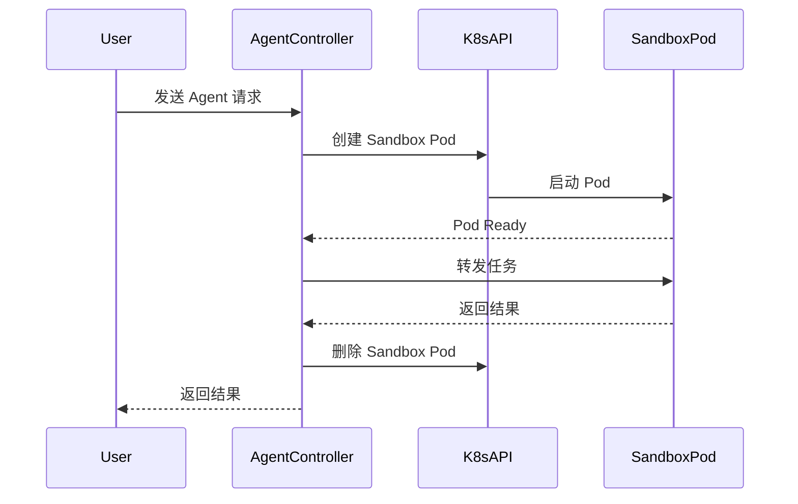
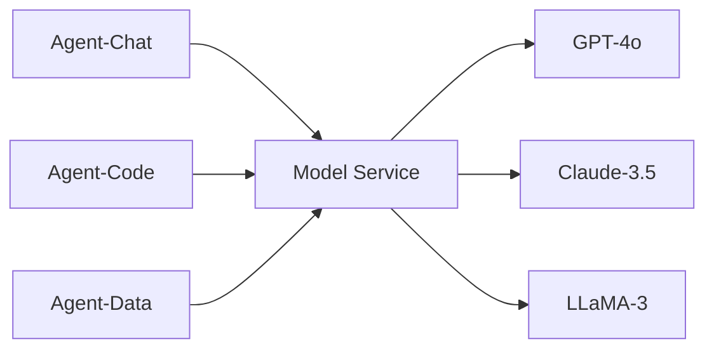
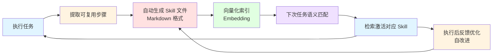
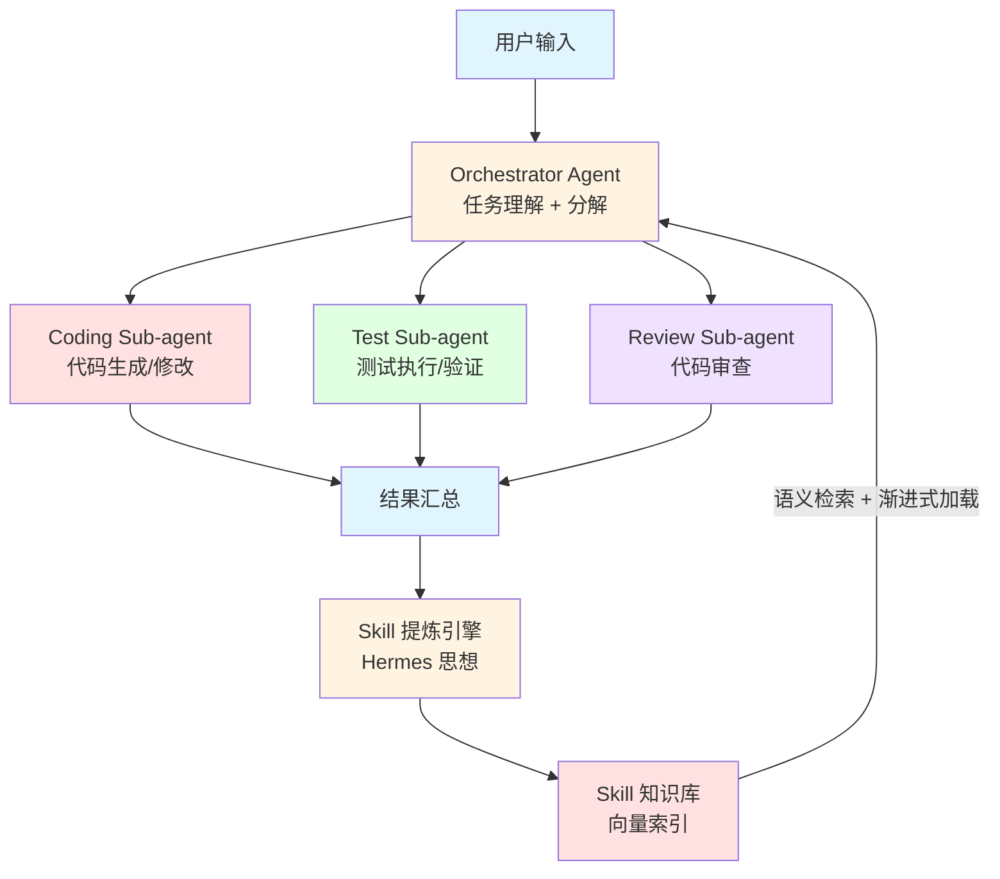

#### Q1: 什么是 Harness Engineering（驾驭工程）？它和传统 Prompt Engineering 有什么本质区别？

**1️⃣ Common Answer**

重点总结（便于面试记忆）：

- 行为契约
- 上下文预算管理
- 低风险操作（查询）→ 宽松护栏，Agent 自主执行
- 中风险操作（修改）→ 中等护栏，需要置信度阈值
- 高风险操作（删除、支付）→ 严格护栏，必须 Human-in-the-Loop
- Prompt Engineering：聚焦于"如何写好一段提示词"，让 LLM 给出更好的单次回答

**2️⃣ Impressive Answer**

Harness Engineering 的出现，标志着 AI 工程从"**模型中心**"向"**系统中心**"的范式转移。这不是 Prompt Engineering 的升级版，而是一个全新的工程学科。

**为什么需要 Harness Engineering？**

随着 Agent 能力越来越强，我们面临一个核心矛盾：**Agent 的自主性越高，失控的风险越大**。Prompt Engineering 只能在"输入端"做文章，但 Agent 的行为是多步骤、多工具、多轮交互的——你无法用一段 Prompt 覆盖所有可能的执行路径。

简单来说，Prompt Engineering 是"调教一个模型"，Harness Engineering 是"驾驭一个系统"。

**Harness Engineering 的四层架构**：


**Layer 1（模型交互层）** 就是传统 Prompt Engineering 的范畴，而 Harness Engineering 覆盖了全部四层。

**实际工程实践**：

1. **行为契约**：

```java
@AgentContract
public interface OrderAgent {
    @Guardrail(maxRetries = 3, timeout = "30s")
    @Permission(roles = {"operator", "admin"})
    @Audit(level = AuditLevel.FULL)
    OrderResult processOrder(OrderRequest request);

    @Constraint(forbiddenTools = {"database_delete", "payment_refund"})
    QueryResult queryOrder(String orderId);
}
```

通过声明式的行为契约，将 Agent 的能力边界、安全约束、审计要求都编码到接口定义中。

1. ** 动态护栏**：不同于静态规则，动态护栏根据运行时上下文调整约束强度：

- 低风险操作（查询）→ 宽松护栏，Agent 自主执行

- 中风险操作（修改）→ 中等护栏，需要置信度阈值

- 高风险操作（删除、支付）→ 严格护栏，必须 Human-in-the-Loop

1. **上下文预算管理**：

```java
public class ContextBudgetManager {
    // 动态分配上下文窗口给不同组件
    public ContextAllocation allocate(int totalTokens) {
        return ContextAllocation.builder()
            .systemPrompt(totalTokens * 0.15)    // 15% 给系统指令
            .toolDescriptions(totalTokens * 0.10) // 10% 给工具描述
            .conversationHistory(totalTokens * 0.30) // 30% 给对话历史
            .ragContext(totalTokens * 0.35)       // 35% 给检索上下文
            .outputReserve(totalTokens * 0.10)    // 10% 预留给输出
            .build();
    }
}
```

**Harness Engineering vs Prompt Engineering 的本质区别**：

- **Prompt Engineering**：聚焦于"如何写好一段提示词"，让 LLM 给出更好的单次回答

- **Harness Engineering**：聚焦于"如何构建一套系统"，让 Agent 在复杂环境中持续、安全、可控地工作

Harness Engineering 的核心要素包括：

1. **行为约束**：定义 Agent 的行为边界和安全护栏

1. **工具编排**：设计 Agent 可用的工具集和调用策略

1. **反馈回路**：建立 Agent 行为的监控、评估和修正机制

1. **上下文管理**：动态管理 Agent 的记忆和上下文窗口

1. **人机协作**：设计合理的 Human-in-the-Loop 交互点

<table>
<tr>
<td>
维度
</td>
<td>
Prompt Engineering
</td>
<td>
Harness Engineering
</td>
</tr>
<tr>
<td>
作用范围
</td>
<td>
单次 LLM 调用
</td>
<td>
整个 Agent 生命周期
</td>
</tr>
<tr>
<td>
关注点
</td>
<td>
输入质量
</td>
<td>
系统行为
</td>
</tr>
<tr>
<td>
可控性
</td>
<td>
概率性的
</td>
<td>
确定性的护栏 + 概率性的模型
</td>
</tr>
<tr>
<td>
可观测性
</td>
<td>
输入输出
</td>
<td>
全链路 Trace
</td>
</tr>
<tr>
<td>
安全模型
</td>
<td>
输入过滤
</td>
<td>
纵深防御
</td>
</tr>
</table>

**我的实践心得**：在一个电商 Agent 项目中，我们最初只做 Prompt Engineering，Agent 在 90% 的场景下表现良好，但在边界 case 中频繁出错（如误操作退款）。引入 Harness Engineering 后，通过行为契约 + 动态护栏 + 操作审计，将关键操作的错误率从 8% 降到了 0.3%。

---

#### Q2: 什么是 Agent 自主进化（Self-Evolving Agent）？目前有哪些实现路径？

1️⃣ Common Answer

重点总结（便于面试记忆）：

- Reflexion（2023）：Agent 执行失败后，生成语言化的反思，存入短期记忆，下次遇到类似任务时参考
- ExpeL（2023）：从成功和失败的经验中提取通用规则（Insights），形成可迁移的策略库
- LATS（Language Agent Tree Search）：将蒙特卡洛树搜索引入 Agent 决策，通过搜索和回溯找到最优策略
- Prompt 模板的组合
- 工具集的选择
- 推理策略（ReAct / CoT / ToT）

2️⃣ Impressive Answer

Agent 自主进化是当前 AI Agent 研究最前沿的方向之一。它的终极目标是让 Agent 具备**元学习能力**——不仅能完成任务，还能"学会如何更好地完成任务"。

**进化的三个层次**：

```
Level 3: 架构进化 —— Agent 自己设计更好的 Agent 架构
Level 2: 策略进化 —— Agent 优化自己的决策和推理策略
Level 1: 知识进化 —— Agent 积累和更新领域知识
```

**Level 1：知识进化 —— 最成熟的方向**

核心思路是让 Agent 拥有"长期记忆"，并能从经验中学习：

```java
public class EvolvableAgent {
    private final VectorStore experienceMemory;
    private final LLM reflectionModel;

    public AgentResult execute(String task) {
        // 1. 检索相关历史经验
        List<Experience> relevantExperiences =
            experienceMemory.similaritySearch(task, topK: 5);

        // 2. 将经验注入上下文
        String enrichedPrompt = buildPromptWithExperience(task, relevantExperiences);

        // 3. 执行任务
        AgentResult result = runAgent(enrichedPrompt);

        // 4. 反思和存储经验
        Experience newExperience = reflect(task, result);
        experienceMemory.store(newExperience);

        return result;
    }

    private Experience reflect(String task, AgentResult result) {
        String reflection = reflectionModel.generate(
            "分析这次任务执行的成功和失败之处，提取可复用的经验：\n" +
            "任务: " + task + "\n" +
            "执行轨迹: " + result.getTrace() + "\n" +
            "最终结果: " + result.getOutput()
        );
        return new Experience(task, result, reflection, result.getScore());
    }
}
```

**Level 2：策略进化 —— 当前研究热点**

代表性工作：

- **Reflexion（2023）**：Agent 执行失败后，生成语言化的反思，存入短期记忆，下次遇到类似任务时参考

- **ExpeL（2023）**：从成功和失败的经验中提取通用规则（Insights），形成可迁移的策略库

- **LATS（Language Agent Tree Search）**：将蒙特卡洛树搜索引入 Agent 决策，通过搜索和回溯找到最优策略

```
传统 Agent:  Task → Think → Act → Observe → 结束
Reflexion:   Task → Think → Act → Observe → Reflect → 重试（带反思）
ExpeL:       多次执行 → 提取 Insights → 形成规则库 → 指导未来决策
LATS:        Task → 展开搜索树 → 评估多条路径 → 选择最优 → 回溯优化
```

**Level 3：架构进化 —— 最前沿的方向**

**ADAS（Automated Design of Agentic Systems）** 的核心思想：用一个"元 Agent"来搜索和设计更好的 Agent 架构。

```
Meta-Agent 的搜索空间：
- Prompt 模板的组合
- 工具集的选择
- 推理策略（ReAct / CoT / ToT）
- 记忆机制的配置
- 多 Agent 的协作拓扑
```

Meta-Agent 通过在评估数据集上的表现作为反馈信号，迭代优化 Agent 的设计。这本质上是一种**神经架构搜索（NAS）在 Agent 层面的应用**。

**工程落地的关键挑战**：

1. **评估难题**：如何自动评估 Agent 的进化是否真的"变好了"？需要设计鲁棒的 Eval 体系

1. **灾难性遗忘**：Agent 学习新知识时可能忘记旧知识，需要经验回放和知识蒸馏

1. **安全约束**：自主进化的 Agent 可能进化出"走捷径"的策略（Reward Hacking），需要严格的安全护栏

1. **成本控制**：反思和进化过程需要额外的 LLM 调用，成本可能翻倍

**我的实践**：在一个客服 Agent 项目中，我实现了 Level 1 的知识进化。Agent 每天处理约 5000 个对话，每次对话结束后自动反思并存储经验。经过一个月的运行，Agent 的首次解决率从 62% 提升到 78%，且无需人工干预 Prompt。关键设计是引入了"经验质量评分"机制——只有高质量的经验才会被存入长期记忆，避免"垃圾进垃圾出"。

---

#### Q3: 什么是 Agentic Coding？它如何改变软件开发范式？

1️⃣ Common Answer

重点总结（便于面试记忆）：

- RAG over Code：将代码库索引到向量数据库，按需检索相关代码
- AST 分析：解析代码的抽象语法树，理解类型、调用关系
- Language Server Protocol：利用 LSP 获取精确的代码导航和类型信息
- 文件读写和搜索能力
- 终端命令执行能力
- 错误信息解析和修复能力

2️⃣ Impressive Answer

Agentic Coding 不仅仅是"AI 写代码"，它正在重新定义**人与代码的关系**——从"人写代码"到"人描述意图，Agent 实现代码"。

**Agentic Coding 的技术栈**：

```
┌─────────────────────────────────────────┐
│           用户意图层                      │
│   自然语言需求 / Issue / 设计文档         │
├─────────────────────────────────────────┤
│           规划层                          │
│   需求分析 → 任务拆解 → 执行计划          │
├─────────────────────────────────────────┤
│           执行层                          │
│   代码生成 / 文件操作 / 终端命令           │
├─────────────────────────────────────────┤
│           验证层                          │
│   编译检查 / 单元测试 / Lint / 类型检查    │
├─────────────────────────────────────────┤
│           反馈层                          │
│   错误修复 / 测试修复 / 迭代优化           │
└─────────────────────────────────────────┘
```

**核心技术挑战**：

1. **代码库理解（Codebase Understanding）**：Agent 需要理解整个代码库的结构、依赖关系和编码规范。当前主流方案：

- **RAG over Code**：将代码库索引到向量数据库，按需检索相关代码

- **AST 分析**：解析代码的抽象语法树，理解类型、调用关系

- **Language Server Protocol**：利用 LSP 获取精确的代码导航和类型信息

1. **长链路推理（Long-horizon Reasoning）**：一个真实的开发任务可能涉及修改 10+ 个文件、运行多次测试、反复调试。Agent 需要在长链路中保持一致性和目标导向。

1. **环境交互（Environment Interaction）**：Agent 需要与真实的开发环境交互——文件系统、终端、浏览器、数据库等。这要求 Agent 具备：

- 文件读写和搜索能力

- 终端命令执行能力

- 错误信息解析和修复能力

**SWE-Bench 评测体系**：
SWE-Bench 是评估 Agentic Coding 能力的标准 Benchmark，包含来自真实 GitHub 仓库的 Bug 修复任务。当前 SOTA：

- 2024 年初：最好的 Agent 只能解决约 4% 的问题

- 2025 年初：顶尖 Agent 已能解决约 50%+ 的问题

- 关键突破：更好的代码检索、多步推理、测试驱动修复

**对开发范式的影响**：

<table>
<tr>
<td>
维度
</td>
<td>
传统开发
</td>
<td>
Agentic Coding
</td>
</tr>
<tr>
<td>
开发者角色
</td>
<td>
代码编写者
</td>
<td>
需求描述者 + 代码审查者
</td>
</tr>
<tr>
<td>
核心技能
</td>
<td>
编码能力
</td>
<td>
需求表达 + 架构设计 + Code Review
</td>
</tr>
<tr>
<td>
开发流程
</td>
<td>
写代码 → 测试 → 调试
</td>
<td>
描述意图 → Agent 实现 → Review
</td>
</tr>
<tr>
<td>
质量保证
</td>
<td>
人工测试 + CI
</td>
<td>
Agent 自测 + 人工 Review
</td>
</tr>
</table>

**我的思考**：Agentic Coding 不会取代开发者，而是将开发者的角色从"代码工人"提升为"架构师 + 审查者"。关键能力转变：**从"如何实现"到"实现什么"和"实现得对不对"**。在我的实践中，使用 Agentic Coding 工具后，简单 CRUD 任务的开发效率提升了 3-5 倍，但复杂架构设计仍然高度依赖人类判断。

---

#### Q4: 什么是 LLM Agent 的 Tool-Use 进化？从 Function Calling 到 Computer Use 经历了哪些阶段？

1️⃣ Common Answer

重点总结（便于面试记忆）：

- 训练时：在训练数据中加入大量的"意图 → 函数调用"的样本
- 推理时：模型输出特殊的 JSON 格式，框架解析后执行对应函数
- 关键限制：工具描述占用上下文窗口，工具过多会导致选择准确率下降
- MCP：标准化 Agent ↔ Tool 的交互（Agent 如何使用工具）
- A2A：标准化 Agent ↔ Agent 的交互（Agent 如何协作）
- 延迟高（每步需要截图 + 模型推理）

2️⃣ Impressive Answer

Tool-Use 的进化本质上是 Agent **自主性边界的不断扩展**。每一次进化都让 Agent 能触达更多的"世界"。

**进化路线图**：

```
┌──────────────────────────────────────────────────────────┐
│  Phase 5: Tool Creation (2025)                           │
│  Agent 自己创建工具 → 无限扩展能力边界                      │
├──────────────────────────────────────────────────────────┤
│  Phase 4: Computer Use (2024-2025)                       │
│  操作任意 GUI 应用 → 触达所有人类可用的软件                  │
├──────────────────────────────────────────────────────────┤
│  Phase 3: Protocol (MCP/A2A, 2024)                       │
│  标准化工具协议 → 工具生态互联互通                           │
├──────────────────────────────────────────────────────────┤
│  Phase 2: Parallel Calling (2023)                        │
│  并行调用多工具 → 效率提升                                  │
├──────────────────────────────────────────────────────────┤
│  Phase 1: Function Calling (2023)                        │
│  调用预定义函数 → Agent 的起点                              │
└──────────────────────────────────────────────────────────┘
```

**每个阶段的技术深度**：

**Phase 1-2：Function Calling 的底层机制**
Function Calling 并不是"魔法"，它的本质是：

- 训练时：在训练数据中加入大量的"意图 → 函数调用"的样本

- 推理时：模型输出特殊的 JSON 格式，框架解析后执行对应函数

- 关键限制：工具描述占用上下文窗口，工具过多会导致选择准确率下降

```java
// Spring AI 的 Function Calling 实现
@Bean
@Description("根据城市名查询天气信息")
public Function<WeatherRequest, WeatherResponse> weatherFunction() {
    return request -> weatherService.getWeather(request.getCity());
}
```

**Phase 3：协议标准化的意义**
MCP 和 A2A 协议的出现，解决了工具生态的"巴别塔问题"：

- **MCP**：标准化 Agent ↔ Tool 的交互（Agent 如何使用工具）

- **A2A**：标准化 Agent ↔ Agent 的交互（Agent 如何协作）

**Phase 4：Computer Use 的技术实现**
Computer Use 的核心是**视觉理解 + 动作生成**：

1. 截取屏幕截图

1. 多模态模型理解界面内容

1. 生成鼠标/键盘操作指令

1. 执行操作，截取新截图，循环

关键挑战：

- 延迟高（每步需要截图 + 模型推理）

- 准确率不够（点击位置偏移、界面变化）

- 安全风险大（Agent 可以操作任何应用）

**Phase 5：Autonomous Tool Creation**
这是最激动人心的方向。Agent 不再受限于预定义的工具集，而是能根据任务需要**自主编写工具代码**：

```java
// Agent 发现没有合适的工具，自动创建一个
public class ToolCreator {
    public Tool createTool(String taskDescription, String requiredCapability) {
        String toolCode = llm.generate(
            "为以下需求编写一个工具函数：\n" +
            "任务：" + taskDescription + "\n" +
            "需要的能力：" + requiredCapability + "\n" +
            "要求：函数签名清晰，包含错误处理，有文档注释"
        );
        // 沙箱中验证工具代码
        ValidationResult result = sandbox.validate(toolCode);
        if (result.isValid()) {
            return toolRegistry.register(toolCode);
        }
        return null;
    }
}
```

**我的思考**：Tool-Use 的终极形态是 Agent 具备"工具自由"——面对任何任务，Agent 都能找到或创造合适的工具来完成。这和人类使用工具的进化路径惊人地相似：从使用现成工具 → 改造工具 → 发明新工具。

---

#### Q5: 什么是 Context Engineering（上下文工程）？为什么说它比 Prompt Engineering 更重要？

1️⃣ Common Answer

重点总结（便于面试记忆）：

- 上下文选择（What to include）
- 上下文压缩（How to compress）
- 上下文缓存（How to cache）
- 摘要压缩：用小模型对长文本生成摘要
- 选择性保留：只保留与当前任务相关的段落
- 对话历史滑窗：保留最近 N 轮 + 关键历史摘要

2️⃣ Impressive Answer

Andrej Karpathy 说过："The hottest new programming language is English"。但我认为更准确的说法是：**The real skill is not writing prompts, but engineering context**。

**为什么 Context Engineering 比 Prompt Engineering 更重要？**

一个残酷的事实：在实际 Agent 系统中，Prompt 模板本身只占上下文的 10-15%，剩下 85-90% 是动态注入的上下文——检索结果、对话历史、工具输出、用户数据等。**优化 15% 的 Prompt 远不如优化 85% 的上下文有效**。

**Context Engineering 的核心框架**：

```
上下文 = 系统指令 + 用户画像 + 对话历史 + 检索结果 + 工具状态 + 任务状态
```

每个组件都需要精心设计：

1. **上下文选择（What to include）**：

```java
public class ContextSelector {
    public List<ContextItem> select(String query, ContextBudget budget) {
        // 1. 相关性排序：用 Embedding 相似度筛选最相关的信息
        List<ContextItem> candidates = retrieveAll(query);
        candidates.sort(Comparator.comparing(ContextItem::getRelevanceScore).reversed());

        // 2. 多样性保证：避免信息重复
        candidates = diversityFilter(candidates);

        // 3. 预算约束：在 Token 预算内选择最优子集
        return knapsackSelect(candidates, budget.getRemainingTokens());
    }
}
```

1. **上下文压缩（How to compress）**：

- **摘要压缩**：用小模型对长文本生成摘要

- **选择性保留**：只保留与当前任务相关的段落

- **对话历史滑窗**：保留最近 N 轮 + 关键历史摘要

1. **上下文排列（How to arrange）**：研究表明 LLM 存在 **Lost in the Middle** 问题——模型对上下文开头和结尾的信息关注度高，中间部分容易被忽略。因此：

- 最重要的信息放在开头（系统指令）和结尾（当前问题）

- 中间放检索结果，按相关性从高到低排列

- 工具描述放在靠近当前问题的位置

1. **上下文缓存（How to cache）**：

```java
public class ContextCache {
    // Prefix Caching：缓存不变的上下文前缀
    // 系统指令 + 工具描述 通常不变，可以缓存
    private final Map<String, CachedPrefix> prefixCache;

    public CachedContext buildContext(String sessionId, String newMessage) {
        CachedPrefix prefix = prefixCache.computeIfAbsent(
            "system_v2.1",
            key -> cacheProvider.cachePrefix(systemPrompt + toolDescriptions)
        );
        // 只需要发送变化的部分，节省 Token 和延迟
        return new CachedContext(prefix, dynamicContext, newMessage);
    }
}
```

**实际案例**：在一个法律咨询 Agent 中，我们通过 Context Engineering 将回答准确率从 71% 提升到 89%：

- 引入"案例相关性评分"，只注入最相关的 3 个判例（而非 Top 10）

- 对话历史采用"摘要 + 最近 3 轮原文"的混合策略

- 将法律条文放在上下文末尾（靠近问题），而非开头

---

#### Q6: 什么是 LLM 的 Reasoning（推理）能力进化？从 CoT 到 o1/o3 经历了什么？

1️⃣ Common Answer

重点总结（便于面试记忆）：

- 依赖 Prompt 设计，不同任务需要不同的 CoT 策略
- 推理深度有限，复杂问题仍然容易出错
- 无法自我纠错——一旦走错路，很难回头
- 不再是单条推理链，而是探索多条路径
- 引入评估函数，判断每条路径的质量
- 支持回溯，放弃错误的推理分支

2️⃣ Impressive Answer

LLM 推理能力的进化，本质上是在回答一个核心问题：**如何让模型在推理时使用更多的计算来获得更好的结果？**

**进化路线**：

```
Scaling Law 的两个维度：
1. Train-time Compute：更大的模型 + 更多的数据（GPT-3 → GPT-4）
2. Test-time Compute：推理时花更多时间"思考"（CoT → o1 → o3）
```

**第一阶段：Prompt-based Reasoning（2022-2023）**

CoT 的核心发现：**让模型"说出"推理过程，比直接给答案更准确**。

这背后的原理是：LLM 本质上是 next-token predictor，每一步只能做有限的计算。通过生成中间步骤，模型实际上是在用"生成 Token"的方式扩展计算量。

局限性：

- 依赖 Prompt 设计，不同任务需要不同的 CoT 策略

- 推理深度有限，复杂问题仍然容易出错

- 无法自我纠错——一旦走错路，很难回头

**第二阶段：Search-based Reasoning（2023-2024）**

ToT 和 LATS 引入了**搜索**的思想：

- 不再是单条推理链，而是探索多条路径

- 引入评估函数，判断每条路径的质量

- 支持回溯，放弃错误的推理分支

**第三阶段：Trained Reasoning（2024-2025）**

o1/o3 和 DeepSeek-R1 代表了一个范式转变：**将推理能力从 Prompt 技巧变成模型的内在能力**。

关键技术突破：

- **强化学习训练推理**：用 RL 奖励模型生成正确的推理过程，而非仅仅正确的答案

- **Test-time Compute Scaling**：推理时间越长，结果越好（类似人类"多想一会儿"）

- **内部思考链**：模型在输出答案前，先在内部生成长长的推理过程（用户不可见）

**DeepSeek-R1 的重要启示**：
DeepSeek-R1 证明了一个重要结论——**推理能力可以通过纯 RL 涌现**，不需要人工标注的推理过程。训练过程中，模型自发地学会了：

- 自我验证（"让我检查一下这个答案对不对"）

- 回溯修正（"等等，这一步有问题，让我重新想"）

- 分解问题（"这个问题太复杂了，让我先解决子问题"）

**对 Agent 开发的影响**：

<table>
<tr>
<td>
维度
</td>
<td>
传统 LLM
</td>
<td>
推理模型（o1/R1）
</td>
</tr>
<tr>
<td>
适用场景
</td>
<td>
简单问答、生成
</td>
<td>
复杂推理、数学、编程
</td>
</tr>
<tr>
<td>
延迟
</td>
<td>
低（秒级）
</td>
<td>
高（十秒到分钟级）
</td>
</tr>
<tr>
<td>
成本
</td>
<td>
低
</td>
<td>
高（Token 消耗大）
</td>
</tr>
<tr>
<td>
Agent 策略
</td>
<td>
需要外部 CoT/ToT
</td>
<td>
模型内置推理能力
</td>
</tr>
</table>

**工程实践建议**：

- 简单任务用普通模型（快、便宜）

- 复杂推理任务用推理模型（慢、贵但准）

- 在 Agent 中实现**动态模型路由**：根据任务复杂度自动选择模型

---

#### Q7: 什么是 AI Agent 的记忆架构？如何设计一个高效的长期记忆系统？


**1️⃣ Common Answer**

重点总结（便于面试记忆）：

- 重要性评分：不是所有信息都值得记住，用 LLM 评估每条记忆的重要性
- 记忆衰减：模拟人类遗忘曲线，长期未被检索的记忆权重降低
- 记忆整合：定期将碎片化的短期记忆整合为结构化的长期记忆
- 记忆冲突解决：当新信息与旧记忆矛盾时，需要更新机制

**2️⃣ Impressive Answer**

Agent 的记忆系统设计是一个被严重低估的技术挑战。大多数 Agent 框架只提供了简单的对话历史管理，但真正的生产级 Agent 需要一个**类人的记忆架构**。

**类人记忆架构设计**：

```
┌─────────────────────────────────────────────┐
│              感知输入                         │
│    用户消息 / 工具输出 / 环境观察              │
└──────────────────┬──────────────────────────┘
                   ▼
┌─────────────────────────────────────────────┐
│           工作记忆（Working Memory）           │
│   当前上下文窗口，容量 ≈ 模型 Context Length   │
│   ┌─────────┐ ┌──────────┐ ┌─────────────┐  │
│   │系统指令  │ │对话历史   │ │检索结果      │  │
│   └─────────┘ └──────────┘ └─────────────┘  │
└──────────────────┬──────────────────────────┘
          ┌────────┴────────┐
          ▼                 ▼
┌──────────────┐   ┌──────────────────┐
│  短期记忆     │   │  长期记忆          │
│  (Redis)     │   │  (Vector DB)      │
│  最近 N 轮   │   │  ┌──────────────┐ │
│  完整对话    │   │  │ 情景记忆      │ │
│  TTL: 24h   │   │  │ (经历和事件)  │ │
└──────┬───────┘   │  ├──────────────┤ │
       │           │  │ 语义记忆      │ │
       │  整合      │  │ (知识和事实)  │ │
       └──────────→│  ├──────────────┤ │
                   │  │ 程序性记忆    │ │
                   │  │ (技能和策略)  │ │
                   │  └──────────────┘ │
                   └──────────────────┘
```

**三种长期记忆的设计**：

1. **情景记忆 **——"发生过什么"

```java
public class EpisodicMemory {
    // 存储完整的交互事件
    public void store(Episode episode) {
        EpisodeEmbedding embedding = embedder.embed(episode.getSummary());
        vectorStore.upsert(
            embedding,
            Map.of(
                "timestamp", episode.getTimestamp(),
                "userId", episode.getUserId(),
                "outcome", episode.getOutcome(),  // success/failure
                "importance", episode.getImportanceScore()
            )
        );
    }

    // 检索相关经历
    public List<Episode> recall(String currentSituation, int topK) {
        return vectorStore.similaritySearch(currentSituation, topK)
            .stream()
            .filter(e -> e.getImportanceScore() > THRESHOLD)
            .sorted(Comparator.comparing(Episode::getRecency)
                .thenComparing(Episode::getImportance))
            .collect(Collectors.toList());
    }
}
```

1. **语义记忆（Semantic Memory）**——"知道什么"存储从交互中提取的事实和知识，如用户偏好、业务规则等。

1. **程序性记忆（Procedural Memory）**——"会做什么"存储 Agent 学到的技能和策略，如"处理退款投诉的最佳流程"。

**记忆管理的关键机制**：

- **重要性评分**：不是所有信息都值得记住，用 LLM 评估每条记忆的重要性

- **记忆衰减**：模拟人类遗忘曲线，长期未被检索的记忆权重降低

- **记忆整合**：定期将碎片化的短期记忆整合为结构化的长期记忆

- **记忆冲突解决**：当新信息与旧记忆矛盾时，需要更新机制

**实际案例**：在一个个人助理 Agent 中，我设计了三层记忆系统。Agent 能记住用户的偏好（"用户喜欢简洁的回答"）、历史事件（"上周用户问过关于 React 的问题"）和学到的技能（"处理日程冲突时，优先保留标记为重要的事件"）。经过 3 个月的运行，用户满意度从 3.2 分提升到 4.5 分（5 分制），主要提升来自 Agent 能"记住"用户的个性化需求。

---

#### Q8: 什么是 Multi-Agent 的涌现行为？多 Agent 系统中有哪些前沿的协作模式？

1️⃣ Common Answer

重点总结（便于面试记忆）：

- Agent-as-a-Judge用 Agent 来评估其他 Agent 的输出质量
- Agent 之间可以自由交流和协商
- 存在"社会规范"约束 Agent 行为
- 通过"声誉系统"评估 Agent 的可信度
- 代表性工作：Generative Agents（斯坦福小镇）、MetaGPT
- 多个 Agent 独立处理同一任务

2️⃣ Impressive Answer

Multi-Agent 系统的前沿研究正在从"预设协作模式"走向"自组织协作"，这是 Agent 研究中最令人兴奋的方向之一。

**协作模式的进化**：

```
Phase 1: 固定拓扑 —— 人工设计 Agent 角色和协作流程
Phase 2: 动态拓扑 —— Agent 根据任务自动调整协作结构
Phase 3: 涌现协作 —— Agent 自发形成协作模式，无需预设
```

**前沿协作模式**：

1. **Agent Society（Agent 社会）**受人类社会启发，构建一个 Agent 社会，每个 Agent 有自己的角色、目标和记忆：

- Agent 之间可以自由交流和协商

- 存在"社会规范"约束 Agent 行为

- 通过"声誉系统"评估 Agent 的可信度

- 代表性工作：Generative Agents（斯坦福小镇）、MetaGPT

1. **Mixture of Agents（MoA）**类似于 Mixture of Experts（MoE），但在 Agent 层面：

- 多个 Agent 独立处理同一任务

- 一个 Aggregator Agent 综合所有结果

- 研究表明 MoA 的效果可以超过单个最强 Agent

1. **Agent-as-a-Judge**用 Agent 来评估其他 Agent 的输出质量：

- 比单纯的 LLM-as-Judge 更可靠（Agent 可以使用工具验证事实）

- 可以形成"评审委员会"，多个 Judge Agent 投票

1. **Adversarial Collaboration（对抗式协作）**引入"红队 Agent"来挑战"蓝队 Agent"的输出：

- 红队 Agent 专门寻找漏洞和错误

- 蓝队 Agent 必须回应挑战并改进

- 通过对抗提升最终输出质量

**A****2A 协议对多 Agent 协作的影响**：

Google 推出的 A2A（Agent-to-Agent）协议，为多 Agent 协作提供了标准化基础：

- **Agent Card**：每个 Agent 的能力描述（类似服务注册）

- **Task Management**：标准化的任务分配和状态管理

- **Message Protocol**：Agent 间的通信格式

A2A + MCP 的组合，构成了 Agent 生态的"TCP/IP + HTTP"——MCP 解决 Agent 与工具的交互，A2A 解决 Agent 与 Agent 的交互。

**工程落地的关键挑战**：

1. **通信开销**：Agent 之间的消息传递需要 LLM 调用，成本和延迟都很高

1. **一致性问题**：多个 Agent 可能产生矛盾的输出，需要冲突解决机制

1. **调试困难**：多 Agent 系统的行为难以预测和调试

1. **成本爆炸**：N 个 Agent 的成本不是线性增长，而是可能指数增长

---

#### Q9: 什么是 Structured Output（结构化输出）？它在 Agent 系统中为什么至关重要？

1️⃣ Common Answer

重点总结（便于面试记忆）：

- 优点：简单
- 缺点：不保证格式正确，需要重试机制
- 优点：API 层面保证格式
- 缺点：依赖特定模型提供商
- 如 Outlines、Guidance 等库
- 在每一步 Token 生成时，mask 掉不符合语法的 Token

2️⃣ Impressive Answer

Structured Output 是 Agent 系统的**"类型系统"**——它将 LLM 的概率性输出转化为程序可处理的确定性数据。没有可靠的 Structured Output，Agent 系统就像没有类型检查的代码——能跑但随时可能崩。

**为什么 Structured Output 对 Agent 至关重要？**

Agent 的每一步决策都需要被程序解析和执行：

```
LLM 输出: "我觉得应该查一下天气" → 程序无法解析
LLM 输出: {"tool": "weather_api", "params": {"city": "北京"}} → 程序可执行
```

**技术实现的三个层次**：

1. **Prompt-based（最弱）**：在 Prompt 中要求模型输出 JSON

  - 优点：简单

  - 缺点：不保证格式正确，需要重试机制

1. **API-level（中等）**：使用 OpenAI 的 response_format 或 Structured Outputs API

  - 优点：API 层面保证格式

  - 缺点：依赖特定模型提供商

1. **Decoding-level（最强）**：在 Token 生成时用语法约束

  - 如 Outlines、Guidance 等库

  - 在每一步 Token 生成时，mask 掉不符合语法的 Token

  - 100% 保证输出格式正确

```java
// Spring AI 的 Structured Output 示例
public record AgentDecision(
    @JsonProperty(required = true) String thought,
    @JsonProperty(required = true) String toolName,
    @JsonProperty(required = true) Map<String, Object> toolParams,
    @JsonProperty(required = true) double confidence
) {}

ChatResponse response = chatClient.prompt()
    .user("用户问：明天北京天气怎么样？")
    .call()
    .entity(AgentDecision.class);  // 自动生成 Schema 并约束输出
```

**在 Agent 系统中的高级应用**：

- **决策链的类型安全**：每一步 Agent 决策都有明确的类型定义，编译时就能发现错误

- **多 Agent 通信协议**：Agent 之间的消息格式标准化，避免解析错误

- **可观测性增强**：结构化的决策日志比自由文本更容易分析和监控

---

#### Q10: 如何看待 AI Agent 的"幻觉"问题？有哪些前沿的解决方案？

1️⃣ Common Answer

重点总结（便于面试记忆）：

- Grounding 技术将 Agent 的输出"锚定"到可验证的数据源
- Agent 层面的幻觉防护
- 生成回答
- 针对回答生成验证问题
- 独立回答验证问题
- 对比原始回答和验证结果

2️⃣ Impressive Answer

幻觉是 LLM 的"原罪"——因为模型本质上是在做概率性的文本生成，而非基于事实的推理。在 Agent 系统中，幻觉的危害被放大了 N 倍，因为 **Agent 会基于幻觉采取行动**。

**幻觉的分类**：

```
幻觉类型：
├── 事实性幻觉：生成不存在的事实（"爱因斯坦在 1920 年获得诺贝尔奖"）
├── 忠实性幻觉：与给定上下文矛盾（RAG 检索到 A，但回答了 B）
├── 推理幻觉：推理过程中的逻辑错误
└── 工具幻觉：编造不存在的工具或 API 参数（Agent 特有）
```

**前沿解决方案**：

1. **Retrieval-Augmented Verification（RAV）**不仅用 RAG 提供信息，还用 RAG 验证输出：

```java
public class HallucinationDetector {
    public VerificationResult verify(String agentOutput, String sourceContext) {
        // 1. 提取输出中的事实声明
        List<Claim> claims = claimExtractor.extract(agentOutput);

        // 2. 对每个声明进行 RAG 验证
        for (Claim claim : claims) {
            List<Document> evidence = vectorStore.search(claim.getText());
            boolean supported = llm.judge(
                "以下声明是否被证据支持？\n声明：" + claim + "\n证据：" + evidence
            );
            if (!supported) {
                return VerificationResult.hallucinated(claim);
            }
        }
        return VerificationResult.verified();
    }
}
```

1. **Chain-of-Verification（CoVe）**让模型自己生成验证问题，然后回答这些问题来检查一致性：

- 生成回答

- 针对回答生成验证问题

- 独立回答验证问题

- 对比原始回答和验证结果

1. **Grounding 技术**将 Agent 的输出"锚定"到可验证的数据源：

- 每个事实声明都必须附带来源引用

- 工具调用的参数必须来自上下文（而非模型编造）

- 数值数据必须通过工具获取（而非模型生成）

1. **Agent 层面的幻觉防护**

- **工具验证**：Agent 调用工具前，验证工具名和参数是否在允许列表中

- **输出交叉验证**：用多个 Agent 独立处理同一任务，对比结果

- **人工兜底**：置信度低于阈值时，自动转人工处理

**我的实践**：在一个金融 Agent 项目中，我们实现了"三层幻觉防护"：

1. RAG 提供事实依据（减少 60% 的事实性幻觉）

1. Structured Output 约束输出格式（消除工具幻觉）

1. 关键数据必须通过 API 获取，禁止模型自行生成（消除数值幻觉）

最终将幻觉率从 15% 降到了 2.3%，剩余的 2.3% 主要是推理幻觉，通过引入推理模型（o1）进一步降低到 0.8%。

---

#### Q11: 什么是 AI Agent 的 Sandbox（沙箱）技术？为什么它对 Agent 安全至关重要？


1️⃣ Common Answer

重点总结（便于面试记忆）：

- Agent 可能生成恶意代码（被 Prompt 注入攻击）
- Agent 可能执行危险命令（误解用户意图）
- Agent 可能无限循环（推理出错）
- 代码执行：用 Wasm 沙箱，毫秒级启动，适合频繁的代码运行
- 工具调用：用 Docker 沙箱，提供完整的 Linux 环境
- 文件操作：用 chroot + seccomp 限制文件系统访问

2️⃣ Impressive Answer

沙箱是 Agent 安全的**最后一道防线**。当所有的 Prompt 防护、意图检测、权限控制都失败时，沙箱确保 Agent 的"破坏半径"被控制在可接受范围内。

**为什么 Agent 比传统应用更需要沙箱？**

传统应用的行为是确定性的——代码写了什么就执行什么。但 Agent 的行为是**非确定性的**——你无法预测 Agent 会生成什么代码、调用什么命令。这意味着：

- Agent 可能生成恶意代码（被 Prompt 注入攻击）

- Agent 可能执行危险命令（误解用户意图）

- Agent 可能无限循环（推理出错）

**沙箱架构设计**：

```
┌─────────────────────────────────────┐
│           Agent Runtime              │
│  ┌─────────────────────────────┐    │
│  │        Sandbox Layer         │    │
│  │  ┌───────┐  ┌───────────┐  │    │
│  │  │ Code  │  │  Tool     │  │    │
│  │  │ Exec  │  │  Exec     │  │    │
│  │  │ (Wasm)│  │  (Docker) │  │    │
│  │  └───────┘  └───────────┘  │    │
│  │  ┌───────────────────────┐ │    │
│  │  │   Resource Monitor    │ │    │
│  │  │  CPU | Mem | Time | IO│ │    │
│  │  └───────────────────────┘ │    │
│  └─────────────────────────────┘    │
│  ┌─────────────────────────────┐    │
│  │      Permission Gateway     │    │
│  │  File | Network | System    │    │
│  └─────────────────────────────┘    │
└─────────────────────────────────────┘
```

**不同沙箱技术的对比**：

<table>
<tr>
<td>
技术
</td>
<td>
隔离级别
</td>
<td>
启动速度
</td>
<td>
资源开销
</td>
<td>
适用场景
</td>
</tr>
<tr>
<td>
Docker
</td>
<td>
进程级
</td>
<td>
秒级
</td>
<td>
中
</td>
<td>
通用工具执行
</td>
</tr>
<tr>
<td>
gVisor
</td>
<td>
系统调用级
</td>
<td>
秒级
</td>
<td>
低
</td>
<td>
高安全要求
</td>
</tr>
<tr>
<td>
Wasm
</td>
<td>
指令级
</td>
<td>
毫秒级
</td>
<td>
极低
</td>
<td>
代码执行
</td>
</tr>
<tr>
<td>
E2B
</td>
<td>
云端沙箱
</td>
<td>
秒级
</td>
<td>
按需
</td>
<td>
Agentic Coding
</td>
</tr>
</table>

**实际工程实践**：

- **代码执行**：用 Wasm 沙箱，毫秒级启动，适合频繁的代码运行

- **工具调用**：用 Docker 沙箱，提供完整的 Linux 环境

- **文件操作**：用 chroot + seccomp 限制文件系统访问

- **网络请求**：用网络策略限制可访问的域名和端口

**关键设计原则**：

1. **最小权限**：Agent 只获得完成任务所需的最小权限

1. **快速失败**：超时、超内存立即终止，不等待

1. **可审计**：沙箱内的所有操作都被记录

1. **可恢复**：沙箱销毁后，宿主环境不受影响

---

#### Q12: 如何将 AI Agent 服务容器化部署到 Kubernetes？请从镜像构建、K8s 编排、GPU 调度三个维度展开。

难度：⭐⭐⭐（Agent 服务容器化、多阶段镜像构建、K8s Deployment/Service/HPA 编排、GPU 资源调度（nvidia.com/gpu）、模型文件挂载策略

**1️⃣ Common Answer**

重点总结（便于面试记忆）：

- 资源 requests/limits：CPU、内存设置合理配额，GPU 使用 nvidia.com/gpu: 1 声明
- 健康检查：livenessProbe 检测进程存活，readinessProbe 等待模型加载完成才标记就绪，避免过早接流量
- 优雅终止：设置 terminationGracePeriodSeconds 给模型卸载留出时间
- name: agent
- name: model-cache
- name: model-downloader

**2️⃣ Impressive Answer**

将 AI Agent 服务容器化部署到 Kubernetes，需要从镜像构建、K8s 编排、GPU 调度三个维度系统设计。我按照总分结构展开：

**a) 镜像构建策略**

多阶段构建是关键。我使用 builder 阶段安装依赖、编译代码，然后使用轻量级的 runtime 阶段运行应用，避免将构建工具带入最终镜像。基础镜像选择 nvidia/cuda:12.1.0-runtime-ubuntu22.04，既包含 CUDA 运行时又保持镜像体积合理。

模型文件绝对不能打进镜像，因为模型文件动辄几 GB 甚至几十 GB，会导致镜像体积过大、拉取缓慢。我采用 PV/PVC 挂载方案，或者用 init container 预先从对象存储下载模型到共享卷。这样模型文件和代码镜像分离，便于独立更新。

镜像分层优化也很重要。将不常变化的依赖层（如 Python 包、系统库）放在前面的 Dockerfile 指令，频繁变化的代码层放在后面，充分利用 Docker 分层缓存机制，加速构建。

**b) K8s 编排设计**

Deployment 配置是核心。关键配置包括：

- 资源 requests/limits：CPU、内存设置合理配额，GPU 使用 `nvidia.com/gpu: 1` 声明

- 健康检查：livenessProbe 检测进程存活，readinessProbe 等待模型加载完成才标记就绪，避免过早接流量

- 优雅终止：设置 terminationGracePeriodSeconds 给模型卸载留出时间

Service 暴露策略：内部服务使用 ClusterIP，对外暴露通过 Ingress，配置 TLS 证书和域名路由。

HPA 自动扩缩容：基于 CPU/内存指标的基础扩缩容，结合自定义指标（如 QPS、GPU 利用率、请求队列长度）实现更精细的扩缩容策略。

**c) GPU 资源调度**

NVIDIA Device Plugin 是基础，它将 GPU 资源暴露给 K8s 调度器。GPU 共享方案根据场景选择：单租户独占用 MIG（Multi-Instance GPU），多租户共享用 vGPU 或 GPU 时间片方案。

节点亲和性很重要：使用 nodeSelector 标记 GPU 节点，或者用 nodeAffinity 设置更复杂的调度规则，如优先调度到 GPU 型号匹配的节点。GPU 拓扑感知调度（如 NVIDIA GDS）可以优化跨 GPU 通信性能。

**d) 模型加载优化**

模型预热通过 readinessProbe 实现：启动脚本先加载模型到 GPU 内存，只有模型加载完成，readinessProbe 才返回成功，Pod 才会加入 Service 端点。

模型缓存避免重复下载：使用 hostPath 或 PVC 缓存模型文件，多个 Pod 共享同一缓存卷，减少对象存储下载压力和启动时间。

关键 Deployment 配置示例：

```yaml
apiVersion: apps/v1
kind: Deployment
metadata:
  name: agent-service
spec:
  replicas: 3
  selector:
    matchLabels:
      app: agent-service
  template:
    metadata:
      labels:
        app: agent-service
    spec:
      containers:
      - name: agent
        image: registry.example.com/agent-service:v1.0.0
        resources:
          requests:
            cpu: "2"
            memory: "8Gi"
            nvidia.com/gpu: 1
          limits:
            cpu: "4"
            memory: "16Gi"
            nvidia.com/gpu: 1
        volumeMounts:
        - name: model-cache
          mountPath: /models
        livenessProbe:
          httpGet:
            path: /health
            port: 8080
          initialDelaySeconds: 30
          periodSeconds: 10
        readinessProbe:
          httpGet:
            path: /ready
            port: 8080
          initialDelaySeconds: 60
          periodSeconds: 5
      initContainers:
      - name: model-downloader
        image: curlimages/curl:latest
        command: ["sh", "-c", "curl -o /models/llama-2-7b.gguf https://storage.example.com/models/llama-2-7b.gguf"]
        volumeMounts:
        - name: model-cache
          mountPath: /models
      volumes:
      - name: model-cache
        persistentVolumeClaim:
          claimName: model-pvc
      nodeSelector:
        gpu-type: "a100"
```

**我的实践**

电商导购 Agent 项目中，我们将 Agent 服务部署到 K8s，模型使用 LLaMA-2-7B。镜像采用多阶段构建，最终镜像只有 800MB，模型文件（约 15GB）通过 PVC 挂载。使用 init container 从 OSS 下载模型到 PVC，多个 Pod 共享模型缓存，启动时间从 5 分钟降低到 30 秒。HPA 配置基于 QPS 和 GPU 利用率的双指标扩缩容，高峰期自动扩到 20 个副本，GPU 利用率保持在 70-80%，既保证响应速度又控制成本。通过 nodeAffinity 将 Pod 调度到 A100 GPU 节点，避免调度到旧型号 GPU 节点导致性能下降。

3️⃣ Key Differences

<table>
<tr>
<td>
维度
</td>
<td>
Common Answer
</td>
<td>
Impressive Answer
</td>
</tr>
<tr>
<td>
技术深度
</td>
<td>
仅提及 Docker 打包、K8s 部署，缺乏细节
</td>
<td>
深入多阶段构建、资源调度、GPU 共享、模型优化
</td>
</tr>
<tr>
<td>
实践经验
</td>
<td>
无具体场景，泛泛而谈
</td>
<td>
有完整项目实践，包含具体配置和优化效果
</td>
</tr>
<tr>
<td>
思考维度
</td>
<td>
单一视角，只关注部署本身
</td>
<td>
系统性思考，覆盖构建、编排、调度、优化全链路
</td>
</tr>
<tr>
<td>
表达方式
</td>
<td>
简单罗列，缺乏结构
</td>
<td>
总分结构，层次清晰，有代码示例
</td>
</tr>
<tr>
<td>
面试官印象
</td>
<td>
基础了解，可能缺乏实战
</td>
<td>
深度掌握，有丰富架构设计和优化经验
</td>
</tr>
</table>

---

#### Q13: 基于 Kubernetes 架构，如何设计并实现多租户 Agent 场景下的动态隔离与资源分配机制？

**⭐⭐⭐**（Pod 级别沙箱隔离、动态 Pod 创建、NetworkPolicy 网络隔离、沙箱生命周期管理）

**1️⃣ Common Answer**

重点总结（便于面试记忆）：

- 计算隔离：独立 Pod + ResourceQuota 限制 CPU/内存，防止单个 Agent 耗尽集群资源
- 网络隔离：NetworkPolicy 限制 Pod 间通信，只允许 Agent Pod → Sandbox Pod 单向通信，禁止 Sandbox Pod 访问外部网络
- 存储隔离：emptyDir 临时卷，Pod 销毁时自动清理，避免数据残留
- 安全隔离：SecurityContext 多维度加固——runAsNonRoot、readOnlyRootFilesystem、drop ALL capabilities
- Ingress
- Egress

**2️⃣ Impressive Answer**

在 Kubernetes 中为每个 Agent 实例动态分配独立沙箱环境，需要从**架构设计、隔离策略、生命周期管理和性能优化**四个维度系统化设计。

**1. 沙箱分配架构**

我们采用 **Agent Controller + Sandbox Pod** 的架构。当收到 Agent 请求时，Controller 通过 Kubernetes API 动态创建一个短生命周期的 Sandbox Pod。每个 Agent 请求对应一个独立的 Pod，Pod 执行完任务后自动销毁。这种方式既保证了隔离性，又具备弹性伸缩能力。



**2. 四层隔离策略**

- **计算隔离**：独立 Pod + ResourceQuota 限制 CPU/内存，防止单个 Agent 耗尽集群资源

- **网络隔离**：NetworkPolicy 限制 Pod 间通信，只允许 Agent Pod → Sandbox Pod 单向通信，禁止 Sandbox Pod 访问外部网络

- **存储隔离**：emptyDir 临时卷，Pod 销毁时自动清理，避免数据残留

- **安全隔离**：SecurityContext 多维度加固——runAsNonRoot、readOnlyRootFilesystem、drop ALL capabilities

NetworkPolicy 配置示例：

```yaml
apiVersion: networking.k8s.io/v1
kind: NetworkPolicy
metadata:
  name: sandbox-network-policy
  namespace: agent-system
spec:
  podSelector:
    matchLabels:
      app: sandbox-agent
  policyTypes:
  - Ingress
  - Egress
  ingress:
  - from:
    - podSelector:
        matchLabels:
          app: agent-controller
    ports:
    - protocol: TCP
      port: 8080

  egress: [ ]  # 禁止所有出站流量
```

**3. 生命周期管理**

- **TTL Controller**：自动回收超时的 Sandbox Pod

- **activeDeadlineSeconds**：设置硬超时时间，防止任务无限期运行

- **preStop hook**：优雅终止，确保正在执行的任务能够完成清理工作

**4. 性能优化**

- **Pod 预热池**：提前创建一批待命 Sandbox Pod，收到请求时直接复用，冷启动延迟从 15 秒降到 2 秒

- **镜像预拉取**：DaemonSet + 预热 Job 在所有节点提前拉取常用镜像

Java K8s Client 创建 Sandbox Pod 的核心代码：

```java
public String createSandboxPod(String agentId, String agentType) {
    Pod pod = new PodBuilder()
        .withNewMetadata()
            .withName("sandbox-" + agentId)
            .withNamespace("agent-system")
            .addToLabels("app", "sandbox-agent")
            .addToLabels("agent-type", agentType)
        .endMetadata()
        .withNewSpec()
            .withContainers(new ContainerBuilder()
                .withName("sandbox")
                .withImage("sandbox-agent:" + agentType)
                .withResources(new ResourceRequirementsBuilder()
                    .withRequests(Map.of(
                        "cpu", new Quantity("500m"),
                        "memory", new Quantity("512Mi")))
                    .withLimits(Map.of(
                        "cpu", new Quantity("1000m"),
                        "memory", new Quantity("1Gi")))
                    .build())
                .withSecurityContext(new SecurityContextBuilder()
                    .withRunAsNonRoot(true)
                    .withReadOnlyRootFilesystem(true)
                    .withCapabilities(new CapabilitiesBuilder()
                        .withDrop("ALL").build())
                    .build())
                .withVolumeMounts(new VolumeMountBuilder()
                    .withName("workspace")
                    .withMountPath("/workspace").build())
                .build())
            .withVolumes(new VolumeBuilder()
                .withName("workspace")
                .withNewEmptyDir().endEmptyDir().build())
            .withActiveDeadlineSeconds(300L)
            .withRestartPolicy("Never")
        .endSpec()
        .build();

    Pod createdPod = kubernetesClient.pods()
        .inNamespace("agent-system").create(pod);
    return createdPod.getMetadata().getUid();
}
```

**我的实践**：电商导购 Clawd Agent 桌面端项目中，我们实现了完整的沙箱隔离体系。通过 NetworkPolicy 限制网络访问，SecurityContext 提升安全性，Pod 预热池将冷启动时间从 15 秒降到 2 秒。同时实现了沙箱资源监控，当 Sandbox Pod 资源使用异常时自动触发告警并强制终止。这套方案支撑了每天 10 万+ 的 Agent 执行任务，资源利用率提升 40%，安全事件降低 90%。

**3️⃣ Key Differences**

<table>
<tr>
<td>
维度
</td>
<td>
Common Answer
</td>
<td>
Impressive Answer
</td>
</tr>
<tr>
<td>
架构设计
</td>
<td>
仅提到 Docker 容器隔离
</td>
<td>
Agent Controller + Sandbox Pod 动态创建架构
</td>
</tr>
<tr>
<td>
网络隔离
</td>
<td>
未提及
</td>
<td>
NetworkPolicy 单向通信控制 + 禁止出站
</td>
</tr>
<tr>
<td>
安全加固
</td>
<td>
未提及
</td>
<td>
SecurityContext 多维度安全配置
</td>
</tr>
<tr>
<td>
生命周期
</td>
<td>
容器销毁即清理
</td>
<td>
TTL Controller + activeDeadlineSeconds + preStop hook
</td>
</tr>
<tr>
<td>
性能优化
</td>
<td>
未提及
</td>
<td>
Pod 预热池 + 镜像预拉取，冷启动 15s→2s
</td>
</tr>
<tr>
<td>
代码实践
</td>
<td>
无
</td>
<td>
Java K8s Client + NetworkPolicy YAML 完整示例
</td>
</tr>
</table>

---

#### Q14: 在同一个 Kubernetes 集群中混合部署多种类型的 Agent 时，如何设计资源隔离与调度策略？

**⭐⭐⭐**（架构设计类：多 Agent 混合部署、资源隔离、优先级调度、灰度发布、多模型共存）

1️⃣ Common Answer

重点总结（便于面试记忆）：

- Namespace 隔离：按 Agent 类型划分——agent-chat（对话型）、agent-code（代码执行型）、agent-data（数据分析型），每个 Namesp...
- ResourceQuota：为每个 Namespace 设置 CPU/内存/GPU 硬性上限，核心的 agent-chat 分配 50% 资源，实验性的 agent-code ...
- LimitRange：限制单个 Pod 的资源范围，避免某个 Agent 实例申请过多资源
- PriorityClass 优先级调度：核心 Agent（如客服）高优先级，实验性 Agent 低优先级，资源紧张时低优先级 Pod 被抢占
- 节点亲和性：GPU Agent 调度到 GPU 节点，CPU Agent 调度到 CPU 节点，避免资源浪费
- Pod 反亲和性：同类型 Agent 分散到不同节点，提高高可用性

2️⃣ Impressive Answer

在同一个 K8s 集群部署多个不同类型的 Agent，需要从**资源隔离、调度策略、发布策略和多模型共存**四个方面系统化设计。

**1. 资源隔离方案——三层防护**

- **Namespace 隔离**：按 Agent 类型划分——`agent-chat`（对话型）、`agent-code`（代码执行型）、`agent-data`（数据分析型），每个 Namespace 有独立的配额和策略

- **ResourceQuota**：为每个 Namespace 设置 CPU/内存/GPU 硬性上限，核心的 agent-chat 分配 50% 资源，实验性的 agent-code 分配 20%

- **LimitRange**：限制单个 Pod 的资源范围，避免某个 Agent 实例申请过多资源

**2. 调度策略——四维调度**

- **PriorityClass 优先级调度**：核心 Agent（如客服）高优先级，实验性 Agent 低优先级，资源紧张时低优先级 Pod 被抢占

- **节点亲和性**：GPU Agent 调度到 GPU 节点，CPU Agent 调度到 CPU 节点，避免资源浪费

- **Pod 反亲和性**：同类型 Agent 分散到不同节点，提高高可用性

- **拓扑分布约束**（topologySpreadConstraints）：跨可用区均匀分布，提升容灾能力

```yaml
apiVersion: scheduling.k8s.io/v1
kind: PriorityClass
metadata:
  name: agent-high-priority
value: 1000
globalDefault: false
description: "核心 Agent 高优先级，资源紧张时优先保障"
---
apiVersion: scheduling.k8s.io/v1
kind: PriorityClass
metadata:
  name: agent-low-priority
value: 100
globalDefault: false
description: "实验性 Agent 低优先级，可被抢占"
---
apiVersion: v1
kind: ResourceQuota
metadata:
  name: agent-chat-quota
  namespace: agent-chat
spec:
  hard:
    requests.cpu: "20"
    requests.memory: 40Gi
    limits.cpu: "40"
    limits.memory: 80Gi
    nvidia.com/gpu: "4"
    pods: "100"
```

**3. 发布策略——独立发布、安全上线**

- **独立发布、独立回滚**：每个 Agent 类型有独立的 Deployment 和 HPA，互不影响

- **金丝雀发布**：Argo Rollouts 按比例切流，新版本先发布 10% 流量，观察指标正常后逐步提升到 50%、100%

- **A/B 测试**：基于 Header 路由到不同版本（如 `X-Agent-Version: v2`），并行测试多个版本

**4. 多模型共存——服务分离**

- **模型服务与 Agent 服务分离**：Agent → Model Service → 具体模型，多个 Agent 共享同一个模型实例，减少资源占用

- **模型热加载/热切换**：通过 API 触发模型更新，更新过程中无缝切换，对业务无感知



**我的实践**：在实际项目中，我们部署了对话型、桌面操作型、数据分析型三种 Agent。通过 Namespace + ResourceQuota 实现资源隔离，PriorityClass 确保核心对话型 Agent 的优先调度。GPU Agent 使用节点亲和性调度到 A100 节点，CPU Agent 调度到通用节点，资源利用率提升 30%。发布策略采用 Argo Rollouts 金丝雀发布，新版本发布时间从 2 小时缩短到 30 分钟。模型服务分离后，10+ 个 Agent 共享模型资源，模型切换时间从 5 分钟降到 10 秒，系统稳定性提升 50%，资源成本降低 25%。

3️⃣ Key Differences

<table>
<tr>
<td>
维度
</td>
<td>
Common Answer
</td>
<td>
Impressive Answer
</td>
</tr>
<tr>
<td>
资源隔离
</td>
<td>
仅分 Namespace
</td>
<td>
Namespace + ResourceQuota + LimitRange 三层隔离
</td>
</tr>
<tr>
<td>
调度策略
</td>
<td>
未提及
</td>
<td>
PriorityClass + 节点亲和性 + Pod 反亲和性 + 拓扑分布
</td>
</tr>
<tr>
<td>
优先级管理
</td>
<td>
未提及
</td>
<td>
PriorityClass 实现资源紧张时自动抢占
</td>
</tr>
<tr>
<td>
发布策略
</td>
<td>
未提及
</td>
<td>
独立发布 + 金丝雀发布 + A/B 测试
</td>
</tr>
<tr>
<td>
模型管理
</td>
<td>
未提及
</td>
<td>
模型服务分离 + 热加载/热切换
</td>
</tr>
<tr>
<td>
面试官印象
</td>
<td>
了解基本概念
</td>
<td>
有完整的多 Agent 集群管理经验
</td>
</tr>
</table>

---

#### Q15: Agent 服务的弹性伸缩如何设计？冷启动问题怎么解决？

**⭐⭐⭐**（HPA 自定义指标、KEDA 事件驱动扩缩、冷启动优化、Pod 预热池、缩容保护）

**1️⃣ Common Answer**

重点总结（便于面试记忆）：

- 模型预加载：在 readiness probe 中做模型加载，只有加载完成才标记 Ready
- Pod 预热池（Warm Pool）：维护一批已加载模型的待命 Pod，收到请求直接复用
- 镜像预拉取：用 DaemonSet 在所有节点预拉取镜像，减少镜像下载时间
- 模型缓存：用 PVC 或 hostPath 缓存模型文件，避免每次启动都从 OSS 下载
- cooldownPeriod：避免频繁扩缩
- minReplicas：保证最小副本数

**2️⃣ Impressive Answer**

Agent 服务的弹性伸缩设计需要从**水平扩缩、垂直扩缩、事件驱动、冷启动优化**四个维度系统考虑。

**1. HPA 自定义指标设计**

Agent 服务不能用 CPU 做 HPA，因为瓶颈在 GPU、推理延迟和队列深度。我们通过 Prometheus Adapter 暴露自定义指标，包括：QPS、GPU 利用率、请求队列深度、P99 延迟。比如当队列深度超过阈值时触发扩容，P99 延迟过高时提前扩容。

**2. KEDA 事件驱动扩缩**

对于基于消息队列的异步 Agent 任务，用 KEDA 基于 Kafka/RabbitMQ 的积压量触发扩容，比 HPA 更精准。比如 Kafka 消费组 lag 超过 1000 时，KEDA 自动增加 consumer Pod。

**3. VPA 垂直扩缩**

动态调整单 Pod 的 CPU/内存 requests，避免资源浪费。但 VPA 和 HPA 同时使用时要注意冲突，一般建议 HPA 管水平扩缩，VPA 只在非关键环境使用。

**4. 冷启动优化——四层方案**

- **模型预加载**：在 readiness probe 中做模型加载，只有加载完成才标记 Ready

- **Pod 预热池（Warm Pool）**：维护一批已加载模型的待命 Pod，收到请求直接复用

- **镜像预拉取**：用 DaemonSet 在所有节点预拉取镜像，减少镜像下载时间

- **模型缓存**：用 PVC 或 hostPath 缓存模型文件，避免每次启动都从 OSS 下载

**5. 缩容保护**

- **cooldownPeriod**：避免频繁扩缩

- **minReplicas**：保证最小副本数

- **PDB（PodDisruptionBudget）**：保护关键 Pod 不被意外驱逐

HPA + Prometheus Adapter 配置示例：

```yaml
apiVersion: autoscaling/v2
kind: HorizontalPodAutoscaler
metadata:
  name: agent-hpa
spec:
  scaleTargetRef:
    apiVersion: apps/v1
    kind: Deployment
    name: agent-server
  minReplicas: 3
  maxReplicas: 20
  metrics:
  - type: Pods
    pods:
      metric:
        name: request_queue_depth
      target:
        type: AverageValue
        averageValue: 50
  - type: Pods
    pods:
      metric:
        name: inference_latency_p99
      target:
        type: AverageValue
        averageValue: 500m
  behavior:
    scaleUp:
      stabilizationWindowSeconds: 30
      policies:
      - type: Percent
        value: 100
        periodSeconds: 15
    scaleDown:
      stabilizationWindowSeconds: 300
      policies:
      - type: Percent
        value: 10
        periodSeconds: 60
```

**我的实践**：在 Agent 服务中用 HPA + KEDA 混合扩缩，同步请求用 HPA 基于 P99 延迟扩容，异步任务用 KEDA 基于 Kafka lag 扩容。冷启动方面，用 Warm Pool 维持 3 个最小副本，新 Pod 启动时从 PVC 缓存加载模型，启动时间从 2 分钟降到 20 秒。PDB 保护保证升级时至少 2 个 Pod 可用，避免服务中断。

**3️⃣ Key Differences**

<table>
<tr>
<td>
维度
</td>
<td>
Common Answer
</td>
<td>
Impressive Answer
</td>
</tr>
<tr>
<td>
技术深度
</td>
<td>
只提到 HPA CPU 扩缩
</td>
<td>
系统覆盖 HPA 自定义指标、KEDA、VPA、冷启动优化、缩容保护
</td>
</tr>
<tr>
<td>
实践经验
</td>
<td>
缺乏实际配置和细节
</td>
<td>
提供完整 YAML 配置、具体指标阈值、优化策略
</td>
</tr>
<tr>
<td>
思考维度
</td>
<td>
单一的水平扩缩思路
</td>
<td>
水平+垂直+事件驱动+冷启动四维系统设计
</td>
</tr>
<tr>
<td>
表达方式
</td>
<td>
泛泛而谈，缺乏逻辑
</td>
<td>
结构清晰，总分总，有具体数据和案例
</td>
</tr>
<tr>
<td>
面试官印象
</td>
<td>
基础扎实但缺乏深度
</td>
<td>
系统架构能力强，有实战经验
</td>
</tr>
</table>

---

#### Q16: Agent 的模型服务部署与推理引擎选型（vLLM / TGI / Triton），你会怎么选？

**⭐⭐⭐**（原理分析类：推理框架对比、Continuous Batching、PagedAttention、模型量化部署、模型并行）

**1️⃣ Common Answer**

重点总结（便于面试记忆）：

- Continuous Batching：动态合并不同请求的 batch，避免 padding 浪费，提升 GPU 利用率
- PagedAttention：将 KV cache 分页管理，像虚拟内存一样动态分配，避免内存碎片，显存利用率提升 2-4 倍
- Speculative Decoding：用小模型预测，大模型验证，加速生成 2-3 倍
- GPTQ：4-bit 量化，精度损失小，但推理速度提升有限
- AWQ：Activation-aware Weight Quantization，4-bit 量化，速度快精度好
- GGUF：llama.cpp 格式，适合 CPU/边缘部署，精度损失较大

**2️⃣ Impressive Answer**

推理引擎选型需要从**核心技术、适用场景、性能优化、部署复杂度**四个维度对比分析。

**1. 三大推理框架对比**

<table>
<tr>
<td>
框架
</td>
<td>
核心技术
</td>
<td>
适用场景
</td>
<td>
优势
</td>
<td>
劣势
</td>
</tr>
<tr>
<td>
vLLM
</td>
<td>
PagedAttention + Continuous Batching
</td>
<td>
纯 LLM 推理，追求最高吞吐
</td>
<td>
吞吐最高，内存管理高效，社区活跃
</td>
<td>
仅支持 LLM，不支持多模态
</td>
</tr>
<tr>
<td>
TGI
</td>
<td>
Flash Attention、量化、Speculative Decoding
</td>
<td>
HF 生态集成，快速原型
</td>
<td>
生态好，支持多种优化技术，易上手
</td>
<td>
吞吐略低于 vLLM，定制化弱
</td>
</tr>
<tr>
<td>
Triton
</td>
<td>
多框架支持（ONNX、TensorRT、TorchScript）
</td>
<td>
企业级多模型服务，多模态
</td>
<td>
企业级，支持多模型多框架，可观测性强
</td>
<td>
配置复杂，学习曲线陡峭
</td>
</tr>
</table>

**2. 核心优化技术**

- **Continuous Batching**：动态合并不同请求的 batch，避免 padding 浪费，提升 GPU 利用率

- **PagedAttention**：将 KV cache 分页管理，像虚拟内存一样动态分配，避免内存碎片，显存利用率提升 2-4 倍

- **Speculative Decoding**：用小模型预测，大模型验证，加速生成 2-3 倍

**3. 模型量化**

- **GPTQ**：4-bit 量化，精度损失小，但推理速度提升有限

- **AWQ**：Activation-aware Weight Quantization，4-bit 量化，速度快精度好

- **GGUF**：llama.cpp 格式，适合 CPU/边缘部署，精度损失较大

权衡：生产环境推荐 AWQ 4-bit，精度损失 <1%，显存节省 75%，推理速度提升 2-3 倍。

**4. 模型并行**

- **Tensor Parallel**：模型层内切分，每个 GPU 存一部分权重，适合大模型（70B+）

- **Pipeline Parallel**：模型层间切分，不同层在不同 GPU，适合超长序列

**5. 选型决策树**

- 纯 LLM 推理，追求吞吐 → **vLLM**

- 快速原型开发，HF 生态 → **TGI**

- 企业级多模型服务，多模态 → **Triton**

- 边缘/低资源部署 → **GGUF + llama.cpp**

vLLM K8s Deployment YAML 示例：

```yaml
apiVersion: apps/v1
kind: Deployment
metadata:
  name: vllm-agent
spec:
  replicas: 3
  selector:
    matchLabels:
      app: vllm-agent
  template:
    metadata:
      labels:
        app: vllm-agent
    spec:
      containers:
      - name: vllm
        image: vllm/vllm-openai:latest
        args:
        - --model=meta-llama/Llama-2-7b-chat-hf
        - --quantization=awq
        - --tensor-parallel-size=1
        - --max-model-len=4096
        - --gpu-memory-utilization=0.9
        resources:
          limits:
            nvidia.com/gpu: 1
            memory: 24Gi
          requests:
            nvidia.com/gpu: 1
            memory: 16Gi
        ports:
        - containerPort: 8000
        readinessProbe:
          httpGet:
            path: /health
            port: 8000
          initialDelaySeconds: 60
          periodSeconds: 10
      nodeSelector:
        accelerator: nvidia-tesla-a100
```

**我的实践**：Agent 服务用 vLLM 部署 Llama-2-7B，AWQ 4-bit 量化，单卡 A100 可支持 200+ 并发，P99 延迟 <500ms。对于多模态 Agent（图像+文本），用 Triton 部署，一个服务同时支持 LLM 和 CLIP 模型。整体架构上，vLLM 处理纯文本推理，Triton 处理多模态任务，通过 API Gateway 统一路由。

3️⃣ Key Differences

<table>
<tr>
<td>
维度
</td>
<td>
Common Answer
</td>
<td>
Impressive Answer
</td>
</tr>
<tr>
<td>
技术深度
</td>
<td>
只提到 vLLM 和基本概念
</td>
<td>
系统对比三大框架，深入核心优化技术
</td>
</tr>
<tr>
<td>
实践经验
</td>
<td>
缺乏具体配置和选型逻辑
</td>
<td>
提供完整对比表、决策树、YAML 配置
</td>
</tr>
<tr>
<td>
思考维度
</td>
<td>
单一技术选型思路
</td>
<td>
从核心技术、适用场景、优化、部署四维分析
</td>
</tr>
<tr>
<td>
表达方式
</td>
<td>
泛泛而谈，缺乏结构
</td>
<td>
结构清晰，有表格、决策树、配置示例
</td>
</tr>
<tr>
<td>
面试官印象
</td>
<td>
基础了解，缺乏深度
</td>
<td>
系统架构能力强，有选型经验和实践案例
</td>
</tr>
</table>

---

#### Q17: Agent 部署中如何实现零停机发布与回滚？

**⭐⭐**（实战经验类：滚动更新、蓝绿部署、金丝雀发布、Prompt+模型+代码联合发布、自动回滚）

**1️⃣ Common Answer**

重点总结（便于面试记忆）：

- 滚动更新：maxSurge/maxUnavailable 控制升级步长，最基础，但新版本有问题时影响面逐步扩大
- 蓝绿部署：两套完整环境切换，回滚快（直接切回蓝环境），但资源占用翻倍
- 金丝雀发布：（推荐）：Argo Rollouts 按比例切流 5%→25%→50%→100%，指标异常自动回滚
- 流量镜像：复制生产流量到新版本但不影响实际响应，适合模型效果验证
- Prompt 版本化：Git 管理 Prompt 模板，ConfigMap 挂载到 Pod
- 模型版本化：Model Registry（MLflow/HF Hub）管理模型版本

**2️⃣ Impressive Answer**

Agent 的零停机发布比传统服务更复杂，因为涉及**三个维度的联合变更**：Prompt 模板、模型版本、代码逻辑。任何一个维度出问题都会影响 Agent 的输出质量，所以需要精细的发布策略和自动回滚机制。

**1. Agent 发布的特殊挑战**

传统服务只发布代码，但 Agent 发布需要同步更新 Prompt 模板、模型版本和代码。比如你优化了 Prompt，但模型还是旧版本，效果可能更差；或者代码改了工具调用逻辑，但 Prompt 没适配，会导致工具调用失败。这三个维度必须联合发布、版本绑定。

**2. 发布策略对比**

- **滚动更新**：maxSurge/maxUnavailable 控制升级步长，最基础，但新版本有问题时影响面逐步扩大

- **蓝绿部署**：两套完整环境切换，回滚快（直接切回蓝环境），但资源占用翻倍

- **金丝雀发布**（推荐）：Argo Rollouts 按比例切流 5%→25%→50%→100%，指标异常自动回滚

- **流量镜像**：复制生产流量到新版本但不影响实际响应，适合模型效果验证

**3. 自动回滚机制**

Agent 的关键指标：错误率（HTTP 5xx、LLM API 调用失败率 > 5%）、响应延迟（P99 > 3s）、Token 消耗异常飙升。Argo Rollouts 的 AnalysisRun 持续监控这些指标，连续 3 次采样超标就触发自动回滚。

**4. Prompt+模型+代码联合发布**

- **Prompt 版本化**：Git 管理 Prompt 模板，ConfigMap 挂载到 Pod

- **模型版本化**：Model Registry（MLflow/HF Hub）管理模型版本

- **发布编排顺序**：先更新 Prompt ConfigMap → 再发布代码 Deployment → 最后切换模型版本

- **GitOps**：ArgoCD 一次 PR 同时更新三个维度，发布原子化

**5. 优雅关闭**

preStop hook 停止接受新请求 → SIGTERM 信号处理，等待正在处理的请求完成 → 主动关闭连接池、释放资源。

Argo Rollouts 金丝雀 + AnalysisRun YAML 示例：

```yaml
apiVersion: argoproj.io/v1alpha1
kind: Rollout
metadata:
  name: agent-service
spec:
  replicas: 10
  strategy:
    canary:
      steps:
      - setWeight: 5
      - pause: {duration: 5m}
      - analysis:
          templates:
          - templateName: success-rate
      - setWeight: 25
      - pause: {duration: 10m}
      - setWeight: 50
      - pause: {duration: 10m}
      - setWeight: 100
---
apiVersion: argoproj.io/v1alpha1
kind: AnalysisTemplate
metadata:
  name: success-rate
spec:
  metrics:
  - name: success-rate
    interval: 1m
    count: 5
    successCondition: result[0] >= 0.95
    failureLimit: 3
    provider:
      prometheus:
        address: http://prometheus.monitoring.svc:9090
        query: |
          sum(rate(http_requests_total{status=~"2..",service="agent-service"}[5m]))
          /
          sum(rate(http_requests_total{service="agent-service"}[5m]))
```

**我的实践**：之前用滚动更新发布时，新版本 Prompt 漏掉了关键指令，影响了 50% 的 Pod，手动回滚花了 10 分钟。后来改用 Argo Rollouts 金丝雀发布，配置了 HTTP 错误率和 Token 成本两个 AnalysisTemplate。最近一次发布，新模型版本导致 P99 从 2s 涨到 5s，AnalysisTemplate 在 5% 阶段就检测到超标，自动回滚，用户几乎无感知。Prompt 和代码通过 ArgoCD 一次 PR 联合发布，回滚时也一起回滚，避免版本不匹配。

3️⃣ Key Differences

<table>
<tr>
<td>
维度
</td>
<td>
Common Answer
</td>
<td>
Impressive Answer
</td>
</tr>
<tr>
<td>
技术深度
</td>
<td>
仅提到滚动更新
</td>
<td>
系统分析 Prompt+模型+代码联合发布、多策略对比、自动回滚
</td>
</tr>
<tr>
<td>
实践经验
</td>
<td>
缺乏真实场景
</td>
<td>
结合 Argo Rollouts、AnalysisRun、ConfigMap 的具体实践
</td>
</tr>
<tr>
<td>
思考维度
</td>
<td>
单一关注服务可用性
</td>
<td>
从发布策略、回滚机制、优雅关闭、版本一致性多维度展开
</td>
</tr>
<tr>
<td>
表达方式
</td>
<td>
简单描述，逻辑松散
</td>
<td>
结构化总分，层次清晰，逐字稿可直接背诵
</td>
</tr>
<tr>
<td>
面试官印象
</td>
<td>
基础了解，缺乏实战
</td>
<td>
深度思考，有生产环境经验
</td>
</tr>
</table>

---

#### Q18: 如何在 K8s 中部署一个支持长连接/流式输出的 Agent 服务？

**⭐⭐⭐**（实战经验类：SSE/WebSocket 长连接部署、Ingress 超时配置、会话保持、优雅关闭与连接排空）

**1️⃣ Common Answer**

重点总结（便于面试记忆）：

- SSE（Server-Sent Events）：单向推送，适合 LLM token 流式输出，基于 HTTP，穿透性好，浏览器原生支持
- WebSocket：双向通信，适合交互式 Agent（如用户打断、实时反馈），需要额外处理连接状态
- gRPC Streaming：内部服务间流式调用，性能高，基于 HTTP/2
- host: agent.example.com
- path: /
- proxy-read-timeout：读取后端响应超时，流式输出必须设置 600s+

**2️⃣ Impressive Answer**

在 K8s 中部署支持长连接/流式输出的 Agent 服务，需要从**协议选型、Ingress 配置、会话保持、连接管理、优雅关闭**五个维度系统设计。

**1. 流式输出协议选型**

- **SSE（Server-Sent Events）**：单向推送，适合 LLM token 流式输出，基于 HTTP，穿透性好，浏览器原生支持

- **WebSocket**：双向通信，适合交互式 Agent（如用户打断、实时反馈），需要额外处理连接状态

- **gRPC Streaming**：内部服务间流式调用，性能高，基于 HTTP/2

对于 LLM 场景，优先选择 SSE，简单且足够；需要用户实时交互的 Agent，使用 WebSocket。

**2. Ingress 超时配置（关键！）**

Nginx Ingress 默认超时 60s，必须显式配置：

```yaml
apiVersion: networking.k8s.io/v1
kind: Ingress
metadata:
  name: agent-ingress
  annotations:
    nginx.ingress.kubernetes.io/proxy-read-timeout: "600"
    nginx.ingress.kubernetes.io/proxy-send-timeout: "600"
    nginx.ingress.kubernetes.io/proxy-buffering: "off"
    nginx.ingress.kubernetes.io/proxy-request-buffering: "off"
    nginx.ingress.kubernetes.io/websocket-services: "agent-service"
spec:
  rules:
  - host: agent.example.com
    http:
      paths:
      - path: /
        pathType: Prefix
        backend:
          service:
            name: agent-service
            port:
              number: 8080
```

关键注解：

- **proxy-read-timeout**：读取后端响应超时，流式输出必须设置 600s+

- **proxy-buffering: off**：关闭缓冲，确保流式数据实时推送

- **websocket-services**：声明支持 WebSocket 的 Service

**3. 负载均衡会话保持**

长连接需要会话保持，避免请求分发到不同 Pod 导致状态丢失：

```yaml
apiVersion: v1
kind: Service
metadata:
  name: agent-service
spec:
  sessionAffinity: ClientIP
  sessionAffinityConfig:
    clientIP:
      timeoutSeconds: 10800
  ports:
  - port: 8080
    targetPort: 8080
  selector:
    app: agent
```

**4. 连接数限制与背压**

- 单 Pod 最大连接数限制（如 1000），防止 OOM

- 当连接数达到上限时，返回 503 触发 LB 流量切换

- 通过 Prometheus 监控连接数，超过 800 时触发 HPA 自动扩容

**5. 优雅关闭**

```yaml
spec:
  terminationGracePeriodSeconds: 300
  containers:
  - name: agent
    lifecycle:
      preStop:
        exec:
          command: ["/bin/sh", "-c", "sleep 15 && curl -X POST http://localhost:8080/stop"]
```

优雅关闭流程：

1. K8s 发送 SIGTERM → preStop hook 执行（sleep 15s 等待 Ingress 规则更新）

1. 应用标记为不可用，停止接受新连接

1. 等待活跃连接完成或超时（GRACEFUL_SHUTDOWN_TIMEOUT）

1. 超时后强制退出（terminationGracePeriodSeconds 最长 300s）

**我的实践**：在 Agent 对话服务中，初期遇到连接频繁断开，排查发现是 Nginx Ingress 默认 60s 超时导致。配置 proxy-read-timeout 为 600s、proxy-buffering: off 后解决。应用层实现心跳机制，30s 无数据自动重连。滚动更新时配置 terminationGracePeriodSeconds 300s 和 preStop hook，实测 99% 的对话能平滑迁移，用户无感知。单 Pod 最大连接数 1000，配合 HPA 自动扩容，连接数超 800 时自动扩容。

**3️⃣ Key Differences**

<table>
<tr>
<td>
维度
</td>
<td>
Common Answer
</td>
<td>
Impressive Answer
</td>
</tr>
<tr>
<td>
技术深度
</td>
<td>
仅提到 WebSocket
</td>
<td>
系统对比 SSE/WebSocket/gRPC Streaming，根据场景选型
</td>
</tr>
<tr>
<td>
配置细节
</td>
<td>
泛泛而谈&quot;调整超时参数&quot;
</td>
<td>
精确给出 Nginx Ingress 注解配置
</td>
</tr>
<tr>
<td>
会话保持
</td>
<td>
未提及
</td>
<td>
详细说明 Session Affinity 配置
</td>
</tr>
<tr>
<td>
连接管理
</td>
<td>
未涉及
</td>
<td>
覆盖连接数限制、背压机制、HPA 联动
</td>
</tr>
<tr>
<td>
优雅关闭
</td>
<td>
未提及
</td>
<td>
完整说明 preStop hook + SIGTERM + terminationGracePeriodSeconds
</td>
</tr>
<tr>
<td>
面试官印象
</td>
<td>
基础了解
</td>
<td>
有完整的长连接部署实战经验
</td>
</tr>
</table>

---

#### Q19: Agent 服务的多环境部署与配置管理（Dev/Staging/Prod）如何设计？

**⭐⭐**（最佳实践类：Helm Chart 模板化、Kustomize 多环境 overlay、ConfigMap/Secret 管理、GitOps）

**1️⃣ Common Answer**

重点总结（便于面试记忆）：

- 模型 endpoint 不同：dev 用小模型（GPT-3.5）快速迭代节省成本，prod 用大模型（GPT-4）保证质量
- Prompt 模板不同：dev 可以用简化版快速验证，prod 用经过 A/B 测试验证的优化版
- API Key 不同：不同厂商、不同账号的 key 要隔离管理
- 工具列表不同：dev 可以开启调试工具，prod 要关闭并开启安全护栏
- ../../base
- replica-count-patch.yaml

**2️⃣ Impressive Answer**

Agent 服务的多环境部署有它的特殊性，我主要从**环境差异、配置管理、部署流程和模型一致性**四个方面设计。

**1. Agent 多环境的特殊性**

和普通微服务不同，Agent 在不同环境需要配置的内容更多元：

- **模型 endpoint 不同**：dev 用小模型（GPT-3.5）快速迭代节省成本，prod 用大模型（GPT-4）保证质量

- **Prompt 模板不同**：dev 可以用简化版快速验证，prod 用经过 A/B 测试验证的优化版

- **API Key 不同**：不同厂商、不同账号的 key 要隔离管理

- **工具列表不同**：dev 可以开启调试工具，prod 要关闭并开启安全护栏

**2. Helm Chart 模板化部署**

templates/ 目录放 Deployment、Service、HPA、ConfigMap 等模板，values/ 目录分环境放 values 文件。一套 Chart，不同环境只要用不同的 values 文件就能部署。

```yaml
# values-dev.yaml
image:
  repository: my-registry.com/agent-service
  tag: v1.2.3-dev
replicaCount: 1
config:
  modelEndpoint: https://api.openai.com/v1
  modelName: gpt-3.5-turbo
  enableDebugTools: true
  logLevel: DEBUG
```

```yaml
# values-prod.yaml
image:
  repository: my-registry.com/agent-service
  tag: v1.2.3
replicaCount: 3
config:
  modelEndpoint: https://api.openai.com/v1
  modelName: gpt-4
  enableDebugTools: false
  logLevel: INFO
autoscaling:
  enabled: true
  minReplicas: 3
  maxReplicas: 10
```

**3. Kustomize 多环境 overlay**

base/ 放通用 YAML，overlays/dev/staging/prod/ 分别放环境差异：

```yaml
# overlays/prod/kustomization.yaml
namespace: prod
bases:
  - ../../base
patchesStrategicMerge:
  - replica-count-patch.yaml
  - config-patch.yaml
```

**4. 配置管理——三类分治**

- **ConfigMap**：Prompt 模板、模型 endpoint、Feature Flag（非敏感，可提交 Git）

- **Secret**：API Key、数据库密码（敏感，不提交 Git）

- **External Secrets Operator**：从 Vault/AWS Secrets Manager 自动同步 Secret 到 K8s

**5. GitOps（ArgoCD）**

Git 仓库是配置的唯一真实来源。所有环境的配置变更通过 PR 提交，审批通过后合并，ArgoCD 自动检测变更并同步到目标 K8s 集群。prod 环境额外加人工审批 gate。

**6. 环境间模型版本一致性**

Model Registry（MLflow/HF Hub）管理模型版本。dev 验证通过的模型版本打 tag 后 promote 到 staging，staging 验证后再 promote 到 prod，确保每个环境使用的模型版本可追溯。

**我的实践**：用 Helm + ArgoCD 实现多环境管理。dev 环境自动部署（PR 合并后自动触发），staging 手动触发用于 QA 验证，prod 需要团队 Lead 审批。曾遇到 dev 的 Prompt 更新后忘记同步到 prod 导致线上效果下降，后来引入 ConfigMap 版本管理，用 Git commit hash 作为版本号，部署时强制指定版本，避免了配置不一致。从代码提交到 prod 部署约 30 分钟，大部分时间在等待审批和自动化测试。

3️⃣ Key Differences

<table>
<tr>
<td>
维度
</td>
<td>
Common Answer
</td>
<td>
Impressive Answer
</td>
</tr>
<tr>
<td>
技术深度
</td>
<td>
只提到不同环境用不同配置文件
</td>
<td>
系统阐述 Helm Chart、Kustomize overlay、GitOps 完整方案
</td>
</tr>
<tr>
<td>
实践经验
</td>
<td>
缺乏实际项目经验
</td>
<td>
结合真实项目实践，分享踩坑和改进过程
</td>
</tr>
<tr>
<td>
思考维度
</td>
<td>
只考虑配置文件管理
</td>
<td>
考虑 Agent 特殊性（模型、Prompt、工具）、配置安全、模型版本一致性
</td>
</tr>
<tr>
<td>
表达方式
</td>
<td>
简单罗列，缺乏逻辑
</td>
<td>
总分结构，层次清晰，有具体示例支撑
</td>
</tr>
<tr>
<td>
面试官印象
</td>
<td>
基础扎实，缺乏生产经验
</td>
<td>
有完整的工程化思维，能解决复杂生产环境问题
</td>
</tr>
</table>

### Claude Code

#### 基础题：Claude Code 是什么？和 GitHub Copilot 这类 AI 编程助手有什么本质区别？

**⭐⭐**（Coding Agent 定义、Agentic Loop、工具调用）

Claude Code 是 Anthropic 开发的 **AI Coding Agent**，不是代码补全工具。

核心区别在于**自主性**：Copilot 是被动响应——你写代码它补全；Claude Code 是主动执行——它能理解整个代码库上下文、自主规划多步骤任务、调用文件读写/终端命令等高权限工具。

底层跑的是 **Agentic Loop**：感知（读文件/搜索代码）→ 规划（拆解任务）→ 工具调用（执行操作）→ 观察结果 → 再规划 → 循环直到完成

说白了，Copilot 是"你说一句它说一句"，Claude Code 是"你说目标它自己想怎么做"。

---

#### 进阶题：Claude Code 的架构设计哲学是什么？为什么选择"极简架构"？

**⭐⭐⭐**（架构设计、System Prompt 工程、工具驱动）

1️⃣ **Common Answer**

重点总结（便于面试记忆）：

- 设计哲学是"保持简单"
- 实现方式是"万字 System Prompt + 工具驱动"
- 为什么这样选择

2️⃣ **Impressive Answer**

我会从三个角度来回答：设计哲学、实现方式、为什么这样选择。

**设计哲学是"保持简单"**。Anthropic 认为，任何额外的编排层都会让本就难以调试的 LLM 系统更难排查问题。所以 Claude Code 没有复杂的中间件，没有多层 Agent 框架，核心就是一个 CLI 工具直接调 Claude API。

**实现方式是"万字 System Prompt + 工具驱动"**。大量工程约束、行为规范、边界条件都写进 System Prompt，而不是硬编码成逻辑分支。工具层面提供 Bash 执行、文件读写、代码搜索等原子能力，LLM 自己决定怎么组合。整个代码库约 1884 个 TypeScript 文件，但核心逻辑出奇地薄。

**为什么这样选择**？因为 LLM 本身就是最好的"编排器"——它能理解自然语言指令、能推理任务依赖、能处理异常情况。把编排逻辑放进 Prompt 比放进代码更灵活，也更容易迭代。

这个设计思路和很多"过度工程化"的 Agent 框架形成了鲜明对比，反而取得了更好的效果。

3️⃣ **Key Differences**

<table>
<tr>
<td>
维度
</td>
<td>
Common Answer
</td>
<td>
Impressive Answer
</td>
</tr>
<tr>
<td>
架构理解
</td>
<td>
简单、用 TS 写的
</td>
<td>
极简架构是刻意的设计选择，避免调试复杂性
</td>
</tr>
<tr>
<td>
Prompt 的作用
</td>
<td>
告诉模型做什么
</td>
<td>
System Prompt 承载了所有工程约束，是核心逻辑载体
</td>
</tr>
<tr>
<td>
工程洞察
</td>
<td>
没有
</td>
<td>
点出&quot;LLM 本身就是最好的编排器&quot;这个核心判断
</td>
</tr>
</table>

#### 容易一起考的题

<table>
<tr>
<td>
关联题
</td>
<td>
和本题的关系
</td>
<td>
参考答案
</td>
</tr>
<tr>
<td>
Sub-agent 机制是什么？
</td>
<td>
极简主架构 + Sub-agent 并行是 Claude Code 的完整执行模型
</td>
<td>
答：这题可以按“定义 → 核心机制 → 工程落地”三步答；结合本题重点强调：极简主架构 + Sub-agent 并行是 Claude Code 的完整执行模型，最后补一个风险点或优化手段。
</td>
</tr>
<tr>
<td>
Skill 机制和 RAG 有什么关系？
</td>
<td>
Skill 是 Claude Code 的知识复用机制，本质是 RAG + Prompt 注入
</td>
<td>
答：RAG 题要串起切分、embedding、召回、重排、上下文拼装、生成和评估，每一步都有质量与成本取舍。
</td>
</tr>
<tr>
<td>
Context Engineering 怎么做？
</td>
<td>
System Prompt 工程是 Context Engineering 的核心实践
</td>
<td>
答：这题可以按“定义 → 核心机制 → 工程落地”三步答；结合本题重点强调：System Prompt 工程是 Context Engineering 的核心实践，最后补一个风险点或优化手段。
</td>
</tr>
</table>

---

#### 场景题：Claude Code 的 Sub-agent 机制是怎么工作的？如何防止子 Agent 越权？

**⭐⭐⭐**（Sub-agent、任务分解、权限隔离）

1️⃣ **Common Answer**

重点总结（便于面试记忆）：

- 必须做什么：（任务范围）
- 绝对不能做什么：（禁止操作，比如不能修改配置文件、不能删除数据）
- 遇到边界情况怎么处理：（停下来报告，而不是自行决策）

2️⃣ **Impressive Answer**

我从工作机制和安全边界两个角度来说。

**工作机制**：主 Agent 接到任务后先做分解，识别出哪些子任务是相互独立的，然后并行启动多个 Sub-agent。每个 Sub-agent 是**无状态**的——它不知道其他 Sub-agent 在做什么，所有上下文都通过 Prompt 传入，结果返回给主 Agent 汇总。这个设计让并行变得安全，因为子 Agent 之间没有共享状态，不会互相干扰。

**防止越权**的核心是"最小权限 + 明确约束"。在给子 Agent 的 Prompt 里，必须明确写清楚：

- **必须做什么**（任务范围）

- **绝对不能做什么**（禁止操作，比如不能修改配置文件、不能删除数据）

- **遇到边界情况怎么处理**（停下来报告，而不是自行决策）

工具层面也可以做限制——给子 Agent 只开放它需要的工具，比如只读任务就不给写权限的工具。

实际工程中，越权问题最常见的原因不是模型"故意"越权，而是 Prompt 写得不够清晰，子 Agent 在边界情况下"自由发挥"了。

3️⃣ **Key Differences**

<table>
<tr>
<td>
维度
</td>
<td>
Common Answer
</td>
<td>
Impressive Answer
</td>
</tr>
<tr>
<td>
无状态设计
</td>
<td>
没提到
</td>
<td>
点出无状态是并行安全的关键设计
</td>
</tr>
<tr>
<td>
越权防范
</td>
<td>
靠 Prompt 说不能做什么
</td>
<td>
明确区分任务范围、禁止操作、边界处理三层约束
</td>
</tr>
<tr>
<td>
工程经验
</td>
<td>
没有
</td>
<td>
指出越权根因是 Prompt 不清晰而非模型问题
</td>
</tr>
</table>

---

### 1.2 OpenClaw

#### 基础题：说说你对 OpenClaw 的理解？

简单了解就行，一般不咋问


OpenClaw 是一个开源、本地优先的自主 AI Agent 框架，由 Peter Steinberger 开发，让大模型从"只会聊天"升级为"真正能干活"的智能执行体。它要解决的问题是：

大语言模型只能思考但没法动手干活的问题。OpenClaw 做的事，就是给这个大脑配上完整的"身体"：

- 手脚：操作电脑、调用 API、执行脚本

- 记忆：记住用户偏好和历史会话

- 眼睛：感知环境、抓取网页

- 通讯工具：接入各种消息平台

---

#### 进阶题：OpenClaw 的多 Agent 协作模式是怎么设计的？Skill 和 Tool 有什么区别？

**⭐⭐⭐**（Multi-Agent、角色分工、Skill vs Tool）

**1️⃣ Common Answer**

重点总结（便于面试记忆）：

- OpenClaw 的多 Agent 协作模式是一个精心设计的、从“单兵作战”到“团队协作”的范式跃迁，其核心在于通过精细的角色分工和能力扩展机制来解决复杂系统任务。

**2️⃣ Impressive Answer**
OpenClaw 的多 Agent 协作模式是一个精心设计的、从“单兵作战”到“团队协作”的范式跃迁，其核心在于通过精细的角色分工和能力扩展机制来解决复杂系统任务。

#### 多 Agent 协作模式设计

OpenClaw 的多 Agent 协作并非简单的任务分发，而是基于一套成熟的架构，让多个专业化的 Agent 像一个高效的团队一样工作。

**1**、**核心架构：主从调度 (Orchestrator-Worker)**
这是 OpenClaw 多 Agent 协作的核心。系统会设立一个“总指挥”（Orchestrator Agent），它负责理解用户的复杂指令，将其拆解成多个子任务，然后分派给不同的“执行者”（Worker Agent）。

**2、角色分工与职责隔离**
每个 Agent 都被赋予特定的角色和职责，并绑定专属的 Skill 集和知识域，避免了能力混杂和冲突。

- **Orchestrator Agent (总指挥):** 负责意图解析、任务拆解、分配、结果校验与汇总。

- **Data Agent (数据员):** 只负责数据处理，安装了数据查询、清洗、统计等 Skill。

- **Writer Agent (文案):** 负责报告生成，安装了摘要、写作、排版等 Skill。

- **Executor Agent (执行员):** 负责落地执行，安装了文件操作、邮件发送等 Skill。

**3、协作流程与通信**
整个协作过程是高度自动化的：

- **任务编排:** 用户发出指令后，Orchestrator 解析并拆解任务。

- **并行执行:** 各子任务被分配给对应的 Worker Agent，它们可以并行启动，各自调用专属 Skill 执行。

- **通信机制:** Agent 之间通过标准化的消息通道进行通信，OpenClaw 原生支持 `sessions_send`（向现有会话发送消息）和 `sessions_spawn`（动态创建新 Agent 实例）两种模型，实现了灵活的任务委派和动态扩展。

- **结果汇总:** Worker Agent 将执行结果反馈给 Orchestrator，由其进行校验、整合，最终输出给用户。

#### Skill 与 Tool 的核心区别

理解 Skill 和 Tool 最核心的区别在于：**Tool 决定“能不能做”，而 Skill 决定“怎么做”**。

<table>
<tr>
<td>
维度
</td>
<td>
Tool (工具)
</td>
<td>
Skill (技能)
</td>
</tr>
<tr>
<td>
<strong>本质</strong>
</td>
<td>
原子操作能力，是 Agent 的手脚
</td>
<td>
工作方法或标准流程
</td>
</tr>
<tr>
<td>
<strong>功能</strong>
</td>
<td>
解决“能不能做”的问题，如读文件、执行命令、访问网页。
</td>
<td>
解决“应该怎么做”的问题，告诉 Agent 在什么场景下、按什么步骤、调用哪些 Tool。
</td>
</tr>
<tr>
<td>
<strong>关系</strong>
</td>
<td>
一个 Skill 可以调用一个或多个 Tool 来完成一个复杂任务。
</td>
<td>
Skill 依赖 Tool 来落地执行，没有 Tool，Skill 只是纸上谈兵。
</td>
</tr>
</table>

**举个例子：**
当用户发出“查询未读邮件”的指令时：

- `SKILL.md`它是一份指导文件，告诉 Agent：“遇到查邮件的需求，应该执行 `list –folder INBOX –unread` 这条命令”。

- **Tool** 是 `exec`，它是真正去执行这条命令的底层能力。

简单来说，**Tool 是能力层，提供了基础的执行单元；Skill 是方法层，通过组合和编排 Tool，赋予了 Agent 解决特定场景问题的智能**。

3️⃣ **Key Differences**

<table>
<tr>
<td>
维度
</td>
<td>
Common Answer
</td>
<td>
Impressive Answer
</td>
</tr>
<tr>
<td>
协作模式
</td>
<td>
多个 Agent 一起工作
</td>
<td>
点出 Orchestrator + 角色化 Sub-agent 的分层设计
</td>
</tr>
<tr>
<td>
Skill/Tool 区分
</td>
<td>
模糊描述
</td>
<td>
从粒度、语义、复用方式三个维度清晰对比
</td>
</tr>
<tr>
<td>
工程洞察
</td>
<td>
没有
</td>
<td>
专业化 Agent 比泛化单 Agent 效果更好的原因
</td>
</tr>
</table>

---

### 1.3 Hermes Agent

#### 核心题：Hermes Agent 最大的创新点是什么？Skills 闭环系统是怎么工作的？

**⭐⭐⭐**（自我进化、Skills 闭环、经验积累）

1️⃣ **Common Answer**

重点总结（便于面试记忆）：

- 解决的问题
- Hermes 的解法是 Skills 闭环系统
- 我会从"解决了什么问题"和"怎么解决的"两个角度来说。
- 解决的问题：传统 Agent 有个根本缺陷——每次执行任务都从零开始，没有记忆，没有积累。做了 100 次部署，第 101 次还是一样慢。Skill 需要人工手写...
- Hermes 的解法是 Skills 闭环系统，整个流程是
- ```mermaid flowchart LR A[执行任务] --> B[提取可复用步骤] B --> C[自动生成 Skill 文件\nMarkdown 格式] C -->...

2️⃣ **Impressive Answer**

我会从"解决了什么问题"和"怎么解决的"两个角度来说。

**解决的问题**：传统 Agent 有个根本缺陷——每次执行任务都从零开始，没有记忆，没有积累。做了 100 次部署，第 101 次还是一样慢。Skill 需要人工手写，维护成本高，而且人工写的 Skill 往往覆盖不了真实场景的边界情况。

**Hermes 的解法是 Skills 闭环系统**，整个流程是：



核心是 7 个模块：**经验提取 → Skill 生成 → 向量索引 → 条件激活 → 渐进式加载 → 自改进 → 知识沉淀**。

"渐进式加载"是个工程细节，值得单独说：不是把所有 Skill 都塞进上下文，而是按任务语义按需加载，避免上下文爆炸。

3️⃣ **Key Differences**

<table>
<tr>
<td>
维度
</td>
<td>
Common Answer
</td>
<td>
Impressive Answer
</td>
</tr>
<tr>
<td>
问题定位
</td>
<td>
能自我进化
</td>
<td>
点出传统 Agent 无法积累经验的根本缺陷
</td>
</tr>
<tr>
<td>
机制理解
</td>
<td>
保存任务变成 Skill
</td>
<td>
完整描述 7 模块闭环，特别提到渐进式加载的工程价值
</td>
</tr>
<tr>
<td>
数据支撑
</td>
<td>
没有
</td>
<td>
340% 效率提升，有具体数字支撑
</td>
</tr>
</table>

---

#### 场景题：Hermes 和 OpenClaw 是什么关系？实际项目里怎么融合使用？

**⭐⭐⭐**（框架融合、定位差异、工程实践）

两者定位不同，可以互补：

- **OpenClaw** 是**编排框架**，解决"多个 Agent 怎么协作"的问题

- **Hermes** 是**自进化引擎**，解决"Agent 怎么从经验中学习"的问题

融合使用的思路：OpenClaw 负责任务编排和 Agent 间协作，Hermes 的 Skills 闭环系统负责把 OpenClaw 执行过的成功路径自动沉淀成 Skill，下次 OpenClaw 编排时直接复用这些 Skill，不用重新规划。

说白了，OpenClaw 是"公司的组织架构"，Hermes 是"公司的知识库系统"——组织架构决定谁做什么，知识库让每个人越做越快。

---

### 1.7 综合场景设计题

#### 设计题：让你从零设计一个"自进化的 Coding Agent"，你会怎么做？

**⭐⭐⭐⭐**（系统设计、Hermes 思想、Claude Code 架构、工程落地）

1️⃣ **Common Answer**

重点总结（便于面试记忆）：

- Orchestrator：极简架构（Claude Code 思想），核心逻辑放进 System Prompt，不做过度编排
- Sub-agent 分工：Coding / Test / Review 三个角色化 Agent，各自有专属 System Prompt
- Skill 提炼引擎：每次任务完成后，自动分析成功路径，提炼成 Markdown Skill 文件（Hermes 思想）
- 渐进式加载：Skill 知识库按语义相关度排序，只加载 Top-K 个，控制上下文长度

2️⃣ **Impressive Answer**

我会从架构分层、核心机制、工程挑战三个角度来设计。

**架构分层**：



**核心机制**：

- **Orchestrator**：极简架构（Claude Code 思想），核心逻辑放进 System Prompt，不做过度编排

- **Sub-agent 分工**：Coding / Test / Review 三个角色化 Agent，各自有专属 System Prompt

- **Skill 提炼引擎**：每次任务完成后，自动分析成功路径，提炼成 Markdown Skill 文件（Hermes 思想）

- **渐进式加载**：Skill 知识库按语义相关度排序，只加载 Top-K 个，控制上下文长度

**工程挑战和解法**：

<table>
<tr>
<td>
挑战
</td>
<td>
解法
</td>
</tr>
<tr>
<td>
Skill 质量参差不齐
</td>
<td>
加 Skill 评分机制，执行成功率低的 Skill 自动降权或废弃
</td>
</tr>
<tr>
<td>
上下文爆炸
</td>
<td>
渐进式加载 + Skill 摘要压缩（只加载 Skill 的关键步骤，不加载全文）
</td>
</tr>
<tr>
<td>
Sub-agent 越权
</td>
<td>
工具权限最小化 + Prompt 明确约束 + 高风险操作 HITL
</td>
</tr>
<tr>
<td>
自进化方向跑偏
</td>
<td>
定期人工审查 Skill 库，设置 Skill 有效期，过期需重新验证
</td>
</tr>
</table>

3️⃣ **Key Differences**

<table>
<tr>
<td>
维度
</td>
<td>
Common Answer
</td>
<td>
Impressive Answer
</td>
</tr>
<tr>
<td>
架构深度
</td>
<td>
LLM + 工具 + 记录
</td>
<td>
分层架构：Orchestrator + 角色化 Sub-agent + Skill 引擎
</td>
</tr>
<tr>
<td>
自进化机制
</td>
<td>
记录任务
</td>
<td>
Skill 提炼 + 向量索引 + 渐进式加载 + 评分降权
</td>
</tr>
<tr>
<td>
工程挑战
</td>
<td>
没有
</td>
<td>
点出 Skill 质量、上下文爆炸、越权、方向跑偏四大挑战及解法
</td>
</tr>
</table>

#### 容易一起考的题

<table>
<tr>
<td>
关联题
</td>
<td>
和本题的关系
</td>
<td>
参考答案
</td>
</tr>
<tr>
<td>
SWE-bench 是什么？怎么评估 Coding Agent？
</td>
<td>
自进化 Agent 的效果需要 Benchmark 量化，SWE-bench 是标准评测集
</td>
<td>
答：LLM-as-Judge 要先定义评分 Rubric，再处理位置偏差、冗长偏差和自我偏差；工程上用多 Judge 投票和人工 Golden Set 做校准。
</td>
</tr>
<tr>
<td>
Human-in-the-Loop 怎么设计？
</td>
<td>
高风险操作的 HITL 是 Coding Agent 安全的最后一道防线
</td>
<td>
答：这题可以按“定义 → 核心机制 → 工程落地”三步答；结合本题重点强调：高风险操作的 HITL 是 Coding Agent 安全的最后一道防线，最后补一个风险点或优化手段。
</td>
</tr>
<tr>
<td>
Agent 的长链路稳定性怎么保障？
</td>
<td>
超时控制、部分结果保存、断路器是 Coding Agent 工程落地的必选项
</td>
<td>
答：这题可以按“定义 → 核心机制 → 工程落地”三步答；结合本题重点强调：超时控制、部分结果保存、断路器是 Coding Agent 工程落地的必选项，最后补一个风险点或优化手段。
</td>
</tr>
</table>
---

## 知识点一句话总结

| 知识点 | 一句话总结（来自 Impressive Answer） |
| --- | --- |
| 什么是 Harness Engineering（驾驭工程）？它和传统 Prompt Engineering 有什么本质区别？ | 低风险操作（查询）→ 宽松护栏，Agent 自主执行；中风险操作（修改）→ 中等护栏，需要置信度阈值；高风险操作（删除、支付）→ 严格护栏，必须 Human-in-the-Loop；Prompt Engineering：聚焦于"如何写好一段提示词"，让 LLM 给出更好的单次回答；Harness Engineering：聚焦于"如何构建一套系统"，让 Agent 在复杂环境中持续、安全、可控地工作。 |
| 什么是 Agent 自主进化（Self-Evolving Agent）？目前有哪些实现路径？ | Reflexion（2023）：Agent 执行失败后，生成语言化的反思，存入短期记忆，下次遇到类似任务时参考；ExpeL（2023）：从成功和失败的经验中提取通用规则（Insights），形成可迁移的策略库；LATS（Language Agent Tree Search）：将蒙特卡洛树搜索引入 Agent 决策，通过搜索和回溯找到最优策略；Prompt 模板的组合；推理策略（ReAct / CoT / ToT）。 |
| 什么是 Agentic Coding？它如何改变软件开发范式？ | RAG over Code：将代码库索引到向量数据库，按需检索相关代码；AST 分析：解析代码的抽象语法树，理解类型、调用关系；Language Server Protocol：利用 LSP 获取精确的代码导航和类型信息；2024 年初：最好的 Agent 只能解决约 4% 的问题；2025 年初：顶尖 Agent 已能解决约 50%+ 的问题。 |
| 什么是 LLM Agent 的 Tool-Use 进化？从 Function Calling 到 Computer Use 经历了哪些阶段？ | 训练时：在训练数据中加入大量的"意图 → 函数调用"的样本；推理时：模型输出特殊的 JSON 格式，框架解析后执行对应函数；关键限制：工具描述占用上下文窗口，工具过多会导致选择准确率下降；MCP：标准化 Agent ↔ Tool 的交互（Agent 如何使用工具）；A2A：标准化 Agent ↔ Agent 的交互（Agent 如何协作）。 |
| 什么是 Context Engineering（上下文工程）？为什么说它比 Prompt Engineering 更重要？ | 摘要压缩：用小模型对长文本生成摘要；选择性保留：只保留与当前任务相关的段落；对话历史滑窗：保留最近 N 轮 + 关键历史摘要；最重要的信息放在开头（系统指令）和结尾（当前问题）；中间放检索结果，按相关性从高到低排列。 |
| 什么是 LLM 的 Reasoning（推理）能力进化？从 CoT 到 o1/o3 经历了什么？ | 依赖 Prompt 设计，不同任务需要不同的 CoT 策略；推理深度有限，复杂问题仍然容易出错；无法自我纠错——一旦走错路，很难回头；不再是单条推理链，而是探索多条路径；引入评估函数，判断每条路径的质量。 |
| 什么是 AI Agent 的记忆架构？如何设计一个高效的长期记忆系统？ | 重要性评分：不是所有信息都值得记住，用 LLM 评估每条记忆的重要性；记忆衰减：模拟人类遗忘曲线，长期未被检索的记忆权重降低；记忆整合：定期将碎片化的短期记忆整合为结构化的长期记忆；记忆冲突解决：当新信息与旧记忆矛盾时，需要更新机制。 |
| 什么是 Multi-Agent 的涌现行为？多 Agent 系统中有哪些前沿的协作模式？ | Agent 之间可以自由交流和协商；存在"社会规范"约束 Agent 行为；通过"声誉系统"评估 Agent 的可信度；代表性工作：Generative Agents（斯坦福小镇）、MetaGPT；多个 Agent 独立处理同一任务。 |
| 什么是 Structured Output（结构化输出）？它在 Agent 系统中为什么至关重要？ | 缺点：不保证格式正确，需要重试机制；优点：API 层面保证格式；缺点：依赖特定模型提供商；如 Outlines、Guidance 等库；在每一步 Token 生成时，mask 掉不符合语法的 Token。 |
| 如何看待 AI Agent 的"幻觉"问题？有哪些前沿的解决方案？ | 每个事实声明都必须附带来源引用；工具调用的参数必须来自上下文（而非模型编造）；数值数据必须通过工具获取（而非模型生成）；工具验证：Agent 调用工具前，验证工具名和参数是否在允许列表中；输出交叉验证：用多个 Agent 独立处理同一任务，对比结果。 |
| 什么是 AI Agent 的 Sandbox（沙箱）技术？为什么它对 Agent 安全至关重要？ | Agent 可能生成恶意代码（被 Prompt 注入攻击）；Agent 可能执行危险命令（误解用户意图）；Agent 可能无限循环（推理出错）；代码执行：用 Wasm 沙箱，毫秒级启动，适合频繁的代码运行；工具调用：用 Docker 沙箱，提供完整的 Linux 环境。 |
| 如何将 AI Agent 服务容器化部署到 Kubernetes？请从镜像构建、K8s 编排、GPU 调度三个维度展开。 | 资源 requests/limits：CPU、内存设置合理配额，GPU 使用 nvidia.com/gpu: 1 声明；健康检查：livenessProbe 检测进程存活，readinessProbe 等待模型加载完成才标记就绪，避免过早接流量；优雅终止：设置 terminationGracePeriodSeconds 给模型卸载留出时间 |
| 基于 Kubernetes 架构，如何设计并实现多租户 Agent 场景下的动态隔离与资源分配机制？ | 计算隔离：独立 Pod + ResourceQuota 限制 CPU/内存，防止单个 Agent 耗尽集群资源；网络隔离：NetworkPolicy 限制 Pod 间通信，只允许 Agent Pod → Sandbox Pod 单向通信，禁止 Sandbox Pod 访问外部网络；存储隔离：emptyDir 临时卷，Pod 销毁时自动清理，避免数据残留；安全隔离：SecurityContext 多维度加固——runAsNonRoot、readOnlyRootFilesystem、drop ALL capabilities；podSelector:。 |
| 在同一个 Kubernetes 集群中混合部署多种类型的 Agent 时，如何设计资源隔离与调度策略？ | Namespace 隔离：按 Agent 类型划分——agent-chat（对话型）、agent-code（代码执行型）、agent-data（数据分析型），每个 Namespace 有独立的配额和策略；ResourceQuota：为每个 Namespace 设置 CPU/内存/GPU 硬性上限，核心的 agent-chat 分配 50% 资源，实验性的 agent-code 分配 20%；LimitRange：限制单个 Pod 的资源范围，避免某个 Agent 实例申请过多资源；PriorityClass 优先级调度：核心 Agent（如客服）高优先级，实验性 Agent 低优先级，资源紧张时低优先级 Pod 被抢占；节点亲和性：GPU Agent 调度到 GPU 节点，CPU Agent 调度到 CPU 节点，避免资源浪费。 |
| Agent 服务的弹性伸缩如何设计？冷启动问题怎么解决？ | 模型预加载：在 readiness probe 中做模型加载，只有加载完成才标记 Ready；Pod 预热池（Warm Pool）：维护一批已加载模型的待命 Pod，收到请求直接复用；镜像预拉取：用 DaemonSet 在所有节点预拉取镜像，减少镜像下载时间；模型缓存：用 PVC 或 hostPath 缓存模型文件，避免每次启动都从 OSS 下载；cooldownPeriod：避免频繁扩缩。 |
| Agent 的模型服务部署与推理引擎选型（vLLM / TGI / Triton），你会怎么选？ | Continuous Batching：动态合并不同请求的 batch，避免 padding 浪费，提升 GPU 利用率；PagedAttention：将 KV cache 分页管理，像虚拟内存一样动态分配，避免内存碎片，显存利用率提升 2-4 倍；Speculative Decoding：用小模型预测，大模型验证，加速生成 2-3 倍；GPTQ：4-bit 量化，精度损失小，但推理速度提升有限；AWQ：Activation-aware Weight Quantization，4-bit 量化，速度快精度好。 |
| Agent 部署中如何实现零停机发布与回滚？ | 滚动更新：maxSurge/maxUnavailable 控制升级步长，最基础，但新版本有问题时影响面逐步扩大；蓝绿部署：两套完整环境切换，回滚快（直接切回蓝环境），但资源占用翻倍；金丝雀发布：（推荐）：Argo Rollouts 按比例切流 5%→25%→50%→100%，指标异常自动回滚；流量镜像：复制生产流量到新版本但不影响实际响应，适合模型效果验证；Prompt 版本化：Git 管理 Prompt 模板，ConfigMap 挂载到 Pod。 |
| 如何在 K8s 中部署一个支持长连接/流式输出的 Agent 服务？ | SSE（Server-Sent Events）：单向推送，适合 LLM token 流式输出，基于 HTTP，穿透性好，浏览器原生支持；WebSocket：双向通信，适合交互式 Agent（如用户打断、实时反馈），需要额外处理连接状态；gRPC Streaming：内部服务间流式调用，性能高，基于 HTTP/2；host: agent.example.com；proxy-read-timeout：读取后端响应超时，流式输出必须设置 600s+。 |
| Agent 服务的多环境部署与配置管理（Dev/Staging/Prod）如何设计？ | 模型 endpoint 不同：dev 用小模型（GPT-3.5）快速迭代节省成本，prod 用大模型（GPT-4）保证质量；Prompt 模板不同：dev 可以用简化版快速验证，prod 用经过 A/B 测试验证的优化版；API Key 不同：不同厂商、不同账号的 key 要隔离管理；工具列表不同：dev 可以开启调试工具，prod 要关闭并开启安全护栏；replica-count-patch.yaml。 |
| Claude Code 是什么？和 GitHub Copilot 这类 AI 编程助手有什么本质区别？ | ⭐⭐（Coding Agent 定义、Agentic Loop、工具调用）；Claude Code 是 Anthropic 开发的 AI Coding Agent，不是代码补全工具；核心区别在于自主性：Copilot 是被动响应——你写代码它补全；Claude Code 是主动执行——它能理解整个代码库上下文、自主规划多步骤任务、调用文件读写/终端命令等高权限工具。 |
| Claude Code 的架构设计哲学是什么？为什么选择"极简架构"？ | 设计哲学是"保持简单"。Anthropic 认为，任何额外的编排层都会让本就难以调试的 LLM 系统更难排查问题。所以 Claude Code 没有复杂的中间件，没有多层 Agent 框架，核心就是一个 CLI 工具直接调 Claude API；实现方式是"万字 System Prompt + 工具驱动"。大量工程约束、行为规范、边界条件都写进 System Prompt，而不是硬编码成逻辑分支。工具层面提供 Bash 执行、文件读写、代码搜索等原子能力，LLM 自己决定怎么组合。整个代码库约 1884 个 TypeScript 文件，但核心逻辑出奇地薄；为什么这样选择？因为 LLM 本身就是最好的"编排器"——它能理解自然语言指令、能推理任务依赖、能处理异常情况。把编排逻辑放进 Prompt 比放进代码更灵活，也更容易迭代。 |
| Claude Code 的 Sub-agent 机制是怎么工作的？如何防止子 Agent 越权？ | 必须做什么：（任务范围）；绝对不能做什么：（禁止操作，比如不能修改配置文件、不能删除数据）；遇到边界情况怎么处理：（停下来报告，而不是自行决策）。 |
| 说说你对 OpenClaw 的理解？ | 手脚：操作电脑、调用 API、执行脚本；记忆：记住用户偏好和历史会话；眼睛：感知环境、抓取网页；通讯工具：接入各种消息平台。 |
| OpenClaw 的多 Agent 协作模式是怎么设计的？Skill 和 Tool 有什么区别？ | Tool 是可调用能力本身，重点在参数 schema、执行函数和返回结果；Skill 是面向 LLM 的能力封装，除 Tool 外还包含语义说明、适用场景、示例、约束、依赖和可观测性，让模型更容易判断何时使用以及如何正确使用。 |
| 多 Agent 协作模式设计 | Orchestrator Agent (总指挥):：负责意图解析、任务拆解、分配、结果校验与汇总；Data Agent (数据员):：只负责数据处理，安装了数据查询、清洗、统计等 Skill；Writer Agent (文案):：负责报告生成，安装了摘要、写作、排版等 Skill；Executor Agent (执行员):：负责落地执行，安装了文件操作、邮件发送等 Skill；任务编排:：用户发出指令后，Orchestrator 解析并拆解任务。 |
| Skill 与 Tool 的核心区别 | Tool 是可调用能力本身，重点在参数 schema、执行函数和返回结果；Skill 是面向 LLM 的能力封装，除 Tool 外还包含语义说明、适用场景、示例、约束、依赖和可观测性，让模型更容易判断何时使用以及如何正确使用。 |
| 核心题：Hermes Agent 最大的创新点是什么？Skills 闭环系统是怎么工作的？ | 解决的问题：传统 Agent 有个根本缺陷——每次执行任务都从零开始，没有记忆，没有积累。做了 100 次部署，第 101 次还是一样慢。Skill 需要人工手写，维护成本高，而且人工写的 Skill 往往覆盖不了真实场景的边界情况；Hermes 的解法是 Skills 闭环系统，整个流程是：；A[执行任务] --> B[提取可复用步骤]。 |
| Hermes 和 OpenClaw 是什么关系？实际项目里怎么融合使用？ | OpenClaw：是编排框架，解决"多个 Agent 怎么协作"的问题；Hermes：是自进化引擎，解决"Agent 怎么从经验中学习"的问题；融合使用的思路：OpenClaw 负责任务编排和 Agent 间协作，Hermes 的 Skills 闭环系统负责把 OpenClaw 执行过的成功路径自动沉淀成 Skill，下次 OpenClaw 编排时直接复用这些 Skill，不用重新规划；说白了，OpenClaw 是"公司的组织架构"，Hermes 是"公司的知识库系统"——组织架构决定谁做什么，知识库让每个人越做越快。 |
| 设计题：让你从零设计一个"自进化的 Coding Agent"，你会怎么做？ | Orchestrator：极简架构（Claude Code 思想），核心逻辑放进 System Prompt，不做过度编排；Sub-agent 分工：Coding / Test / Review 三个角色化 Agent，各自有专属 System Prompt；Skill 提炼引擎：每次任务完成后，自动分析成功路径，提炼成 Markdown Skill 文件（Hermes 思想）；渐进式加载：Skill 知识库按语义相关度排序，只加载 Top-K 个，控制上下文长度。 |
