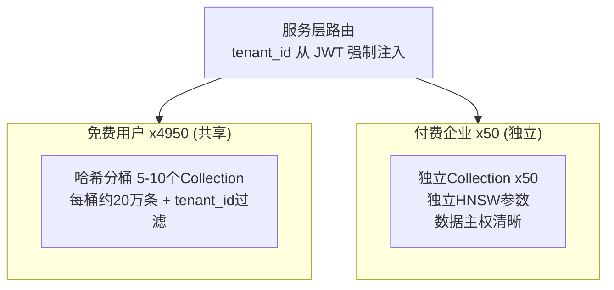
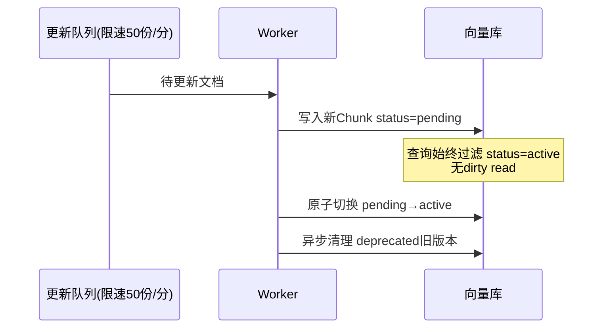

# RAG 实践

## 4.1 RAG 链路设计

### RAG 链路与分块策略

#### 1、基础题：RAG 的完整链路是什么？和直接 Prompt 塞文档有什么区别？

**难度级别**：⭐⭐（索引阶段 vs 检索阶段、上下文窗口限制、动态知识更新）

RAG（检索增强生成）的完整链路分为离线建库和在线推理两阶段。
- 离线阶段：对原始文档进行解析、分块、Embedding 向量化，存入向量数据库。
- 在线阶段：对用户 Query 做同样的 Embedding，在向量库中做相似度检索，召回 Top-K 相关片段，拼接成 Prompt 送入大模型生成最终答案。

与直接塞文档的区别：直接塞文档受模型上下文窗口限制，成本高、易"迷失"在大量无关信息中；RAG 只传递检索到的相关片段，突破长度限制，降低成本，同时提升答案的准确性和可维护性。

---

#### 2、进阶题：文档分块策略有哪几种？各自的优缺点是什么？

**难度级别**：⭐⭐⭐（固定大小、语义分块、递归字符分割、Markdown 结构感知分块、重叠窗口）

**1️⃣ Common Answer**

重点总结（便于面试记忆）：
- 语义完整性
- 检索粒度
- 固定大小分块
- 递归字符分割（RecursiveCharacterTextSplitter）
- 结构感知分块
- 语义分块

**2️⃣ Impressive Answer**

分块策略本质是在**语义完整性**和**检索粒度**之间做权衡，我从策略类型和适用场景两个角度来说：
1. **固定大小分块**：实现简单，但语义割裂风险高；加重叠窗口（overlap 10-15%）可缓解边界信息丢失，适合结构松散的纯文本
1. **递归字符分割（RecursiveCharacterTextSplitter）**：按段落→句子→词递归降级分割，保留语义边界，是目前最通用的方案
1. **结构感知分块**：针对 Markdown/代码/HTML，按标题层级或代码块分割，语义一致性最强，适合技术文档 RAG
1. **语义分块**：用 Embedding 检测相邻句子的语义相似度，在相似度骤降处切割；质量最高但计算开销大，适合高精度场景
1. **父子分块（Parent-Child Chunk）**：小块用于精准检索，大块（父块）回传给 LLM 作为上下文；兼顾召回精度和完整性，是生产中常用的进阶方案

**3️⃣ Key Differences**

<table>
<tr>
<td>
维度
</td>
<td>
Common Answer
</td>
<td>
Impressive Answer
</td>
</tr>
<tr>
<td>
结构性
</td>
<td>
随口列举，没有对比框架
</td>
<td>
从权衡角度切入，分策略逐一分析
</td>
</tr>
<tr>
<td>
技术深度
</td>
<td>
只知道固定长度和段落
</td>
<td>
覆盖 5 种策略，点出父子分块等进阶方案
</td>
</tr>
<tr>
<td>
实践经验
</td>
<td>
说&quot;看情况&quot;，缺乏判断依据
</td>
<td>
给出每种策略的适用场景和生产选型建议
</td>
</tr>
<tr>
<td>
面试官印象
</td>
<td>
知道概念，但没用过
</td>
<td>
有清晰的工程判断力，做过选型对比
</td>
</tr>
</table>

---

#### 3、场景题：RAG 系统召回的文档相关性很差，如何系统性排查和优化？

**难度级别**：⭐⭐⭐（Embedding 模型评估、分块粒度调整、查询改写、混合检索、Rerank）

**1️⃣ Common Answer**

重点总结（便于面试记忆）：
- 先量化问题
- 分块层排查
- Embedding 层排查
- 查询层优化
- 检索层优化

**2️⃣ Impressive Answer**

我会按 RAG 链路分层排查，从数据到模型到检索逐层定位：
1. **先量化问题**：用标注的问答对算 Recall@K 和 MRR，确认是整体差还是特定类型的问题差，缩小排查范围
1. **分块层排查**：检查块大小是否合理（通常 256-512 token），是否存在语义割裂；考虑用父子分块或调整重叠窗口优化
1. **Embedding 层排查**：评估 Embedding 模型是否领域对齐——通用模型在垂直领域可能表现差，考虑换用 BGE、M3E 等中文专用模型，或做领域微调
1. **查询层优化**：用户查询往往口语化，导致和文档语义不匹配；加查询改写（HyDE 假设文档生成）或多查询扩展，提升召回覆盖率
1. **检索层优化**：纯向量检索对关键词不敏感，引入 BM25 + 向量的混合检索，再用 Rerank 模型（如 BGE-Reranker）对 Top-K 重排，通常能显著提升最终精度

**3️⃣ Key Differences**

<table>
<tr>
<td>
维度
</td>
<td>
Common Answer
</td>
<td>
Impressive Answer
</td>
</tr>
<tr>
<td>
结构性
</td>
<td>
零散列举，没有排查思路
</td>
<td>
按链路分层：量化→分块→Embedding→查询→检索
</td>
</tr>
<tr>
<td>
技术深度
</td>
<td>
只说换模型、调阈值
</td>
<td>
覆盖 HyDE、混合检索、Rerank 等进阶手段
</td>
</tr>
<tr>
<td>
实践经验
</td>
<td>
&quot;多试试&quot;，缺乏方法论
</td>
<td>
先量化再定位，有工程化的 Debug 思维
</td>
</tr>
<tr>
<td>
面试官印象
</td>
<td>
没有系统排查能力
</td>
<td>
展示了完整的问题定位和优化闭环能力
</td>
</tr>
</table>

---

#### 4、容易一起考的题

<table>
<tr>
<td>
关联题
</td>
<td>
和本题的关系
</td>
<td>
参考答案
</td>
</tr>
<tr>
<td>
Embedding 模型如何选型？BGE、M3E、OpenAI ada 的区别？
</td>
<td>
分块和检索效果都依赖 Embedding 质量，选型是 RAG 优化的核心决策
</td>
<td>
答：RAG 题要串起切分、embedding、召回、重排、上下文拼装、生成和评估，每一步都有质量与成本取舍。
</td>
</tr>
<tr>
<td>
什么是 HyDE（假设文档生成）？如何提升稀疏查询的召回？
</td>
<td>
查询改写的核心技术，与 RAG 召回优化强相关
</td>
<td>
答：RAG 要串起文档切分、embedding、向量召回、重排、上下文拼装、生成和评估；核心取舍是召回率、准确性、延迟和成本。
</td>
</tr>
<tr>
<td>
Rerank 模型的原理是什么？和向量检索相比有什么优势？
</td>
<td>
RAG 精排阶段的关键技术，与召回质量优化直接相关
</td>
<td>
答：RAG 题要串起切分、embedding、召回、重排、上下文拼装、生成和评估，每一步都有质量与成本取舍。
</td>
</tr>
</table>

---

## 4.2 向量数据库与检索优化

### **向量数据库设计**

##### 1、基础题：什么是向量数据库的 Namespace 隔离？

**难度级别**：⭐（多租户基础概念、数据隔离手段）

Namespace 是向量数据库提供的逻辑分区能力，允许在同一个实例或 Collection 内为不同租户划分独立的命名空间，查询时只在指定 Namespace 内检索，实现数据的逻辑隔离。Namespace 隔离不需要创建独立的 Collection，运维成本低，是多租户场景常用的轻量隔离手段。

---

##### 2、进阶题：在 SaaS 场景下，如何设计 RAG 系统的多租户数据隔离？不同隔离级别的成本与安全性如何权衡？

**难度级别**：⭐⭐⭐（三级隔离方案设计、安全关键点、索引爆炸预防、纵深防御）

**1️⃣ Common Answer**

重点总结（便于面试记忆）：
- Level 1：物理隔离（独立 Collection/Index）
- Level 2：逻辑隔离（共享 Collection + 元数据过滤）
- 混合方案（推荐生产架构）

**2️⃣ Impressive Answer**

我会从三个隔离级别来拆解，然后给出混合方案和安全关键点。
1. **Level 1：物理隔离（独立 Collection/Index）**。每个租户有独立 Collection，跨租户泄露风险几乎为零，支持独立配置索引参数，迁移和删除操作互不影响。代价是索引爆炸问题：10 万个租户就要维护 10 万个 Collection，大多数向量数据库在 Collection 数量超过几千后性能会显著下降，小租户资源浪费也严重。
1. **Level 2：逻辑隔离（共享 Collection + 元数据过滤）**。所有租户数据存在同一 Collection，每条记录携带 `tenant_id` 元数据，查询时强制附加过滤条件。这里有一个安全关键点：`tenant_id` 必须从认证上下文（JWT Token、Session）中提取，绝对不能允许用户自己传入，否则任何人都可以伪造其他租户的 ID 访问数据。
1. **混合方案（推荐生产架构）**。按租户分级：高安全需求的大客户（金融、医疗）用独立 Collection 甚至独立实例；中小租户按数据量分组共享 Collection + 元数据过滤；免费/试用租户完全共享。索引爆炸预防：设置数量监控告警，数据量低于阈值的租户自动归入共享 Collection，超过阈值后迁移到独立 Collection；对长期不活跃的租户做生命周期压缩。

应用层还要做二次过滤：向量库返回结果后，用代码再次验证每条结果的 `tenant_id` 是否匹配，作为纵深防御的兜底，防止向量库 filter 实现存在 bug。

**3️⃣ Key Differences**

<table>
<tr>
<td>
维度
</td>
<td>
Common Answer
</td>
<td>
Impressive Answer
</td>
</tr>
<tr>
<td>
方案覆盖
</td>
<td>
列出两种方案，没有具体适用场景
</td>
<td>
给出三级方案和每个级别的适用场景，提出混合架构
</td>
</tr>
<tr>
<td>
安全细节
</td>
<td>
提到用 tenant_id 过滤，没有说安全隐患
</td>
<td>
明确指出 tenant_id 必须来自认证上下文，防止参数伪造攻击
</td>
</tr>
<tr>
<td>
索引爆炸
</td>
<td>
提到问题存在，但没有解决方案
</td>
<td>
给出数量监控、Namespace 合并、生命周期管理三个预防策略
</td>
</tr>
<tr>
<td>
工程视角
</td>
<td>
无
</td>
<td>
提出应用层二次过滤作为纵深防御，体现安全工程思维
</td>
</tr>
<tr>
<td>
给面试官的印象
</td>
<td>
了解基本隔离方案
</td>
<td>
有完整的架构设计能力，考虑到安全性、成本和运维的多方权衡
</td>
</tr>
</table>

---

##### 3、场景题：公司 RAG 系统有 5000 个租户，其中 4950 个是免费用户（平均每人 200 条文档），50 个是付费企业客户（平均每人 5 万条），如何设计隔离架构？

**难度级别**：⭐⭐⭐（分级隔离落地、成本与安全权衡）

**1️⃣ Common Answer**

重点总结（便于面试记忆）：
- 这是一个典型的二八分布场景：4950 个免费用户贡献约 100 万条向量，50 个付费企业客户贡献约 250 万条向量，数据体量差异悬殊，隔离策略应该完全不同。
- 付费企业客户每人 5 万条，直接给每人分配独立 Collection，50 个 Collection 完全可控，不会有索引爆炸问题。每个 Collection 独立配置 HNS...
- 免费用户 4950 人每人 200 条，总量 100 万条，共享一个 Collection + tenant_id 元数据过滤完全够用...
- 额外考虑：随着免费用户数量增长，单个共享 Collection 的查询性能会下降，可以按注册时间或 ID 哈希把免费用户分到多个 Collection（比如 5-10 个）...
- `mermaid flowchart TD Router[服务层路由\ntenant_id 从 JWT 强制注入] --> F & P subgraph F["免费用户 x49...

**2️⃣ Impressive Answer**

这是一个典型的二八分布场景：4950 个免费用户贡献约 100 万条向量，50 个付费企业客户贡献约 250 万条向量，数据体量差异悬殊，隔离策略应该完全不同。

付费企业客户每人 5 万条，直接给每人分配独立 Collection，50 个 Collection 完全可控，不会有索引爆炸问题。每个 Collection 独立配置 HNSW 参数，互不影响，数据主权清晰，付费客户也更容易接受这个架构。

免费用户 4950 人每人 200 条，总量 100 万条，共享一个 Collection + `tenant_id` 元数据过滤完全够用。关键是把查询路由逻辑封装在服务层，`tenant_id` 从认证 Token 里提取并强制注入过滤条件，用户无法绕过。

额外考虑：随着免费用户数量增长，单个共享 Collection 的查询性能会下降，可以按注册时间或 ID 哈希把免费用户分到多个 Collection（比如 5-10 个），每个 Collection 约 20 万条，维持检索性能，同时不增加太多运维复杂度。



**3️⃣ Key Differences**

<table>
<tr>
<td>
维度
</td>
<td>
Common Answer
</td>
<td>
Impressive Answer
</td>
</tr>
<tr>
<td>
方案适配性
</td>
<td>
给出通用答案，没有结合具体数字分析
</td>
<td>
基于具体数量和数据体量给出定制化方案
</td>
</tr>
<tr>
<td>
扩展性考虑
</td>
<td>
没有考虑免费用户增长后的性能问题
</td>
<td>
提出按哈希分桶预防单 Collection 性能瓶颈
</td>
</tr>
<tr>
<td>
安全工程
</td>
<td>
提到 tenant_id 过滤
</td>
<td>
强调服务层封装和认证上下文强制注入
</td>
</tr>
<tr>
<td>
给面试官的印象
</td>
<td>
知道分级策略，但缺乏具体设计
</td>
<td>
有针对具体场景的架构设计能力
</td>
</tr>
</table>

---

##### 4、容易一起考的题

<table>
<tr>
<td>
关联题
</td>
<td>
和本题的关系
</td>
<td>
参考答案
</td>
</tr>
<tr>
<td>
向量数据库选型如何影响多租户架构设计？
</td>
<td>
Qdrant 的 Payload 过滤和 Pinecone 的 Namespace 能力直接决定隔离方案
</td>
<td>
答：RAG 题要串起切分、embedding、召回、重排、上下文拼装、生成和评估，每一步都有质量与成本取舍。
</td>
</tr>
<tr>
<td>
JWT Token 在 API 权限控制中如何使用？
</td>
<td>
tenant_id 从认证 Token 提取是隔离安全的关键前提
</td>
<td>
答：成本优化先拆 Token、模型、工具和重试四类开销，再用缓存、小模型路由、Prompt 压缩、批处理和限流降级优化。
</td>
</tr>
<tr>
<td>
纵深防御（Defense in Depth）是什么？
</td>
<td>
应用层二次过滤是纵深防御思想在 RAG 安全中的具体应用
</td>
<td>
答：RAG 要串起文档切分、embedding、向量召回、重排、上下文拼装、生成和评估；核心取舍是召回率、准确性、延迟和成本。
</td>
</tr>
</table>

---

### **数据更新权衡**

##### 1、基础题：为什么 RAG 系统的知识库更新不能简单地删掉旧数据再全量重新导入？

**难度级别**：⭐（增量更新必要性）

全量重建会对所有文档重新做 Embedding，成本随文档数量线性增长，对于大型知识库（几万到几十万文档）成本和时间都难以接受。全量重建期间知识库可能处于不可用状态，影响服务连续性。增量更新只处理有变化的文档，大幅降低成本，同时可以做到对用户无感知的滚动更新。

---

##### 2、进阶题：当知识库的源文档发生变更时，如何设计 RAG 系统的增量更新机制？如何避免全量重建带来的性能问题？

**难度级别**：⭐⭐（文档变更检测、增量 Embedding、Upsert 幂等设计、删除同步）

**1️⃣ Common Answer**

重点总结（便于面试记忆）：
- 变更检测用内容哈希，不用文件时间戳
- 更新文档要先删旧 chunk 再插新 chunk
- chunk_id 用确定性设计保证 Upsert 幂等性
- 删除同步是最容易被忽视的环节

**2️⃣ Impressive Answer**

我会把增量更新拆成四个核心步骤来设计，每个步骤都有容易踩的坑。
1. **变更检测用内容哈希，不用文件时间戳**。时间戳可能因为 touch 操作、系统迁移等原因不可靠，内容哈希（SHA256）才能准确反映文件是否真的变了。同时要维护一个文档注册表，记录每个文档的哈希值和对应的 chunk_id 列表，检测时做三路对比：新增（在源目录但不在注册表）、删除（在注册表但不在源目录）、更新（哈希值变化）。
1. **更新文档要先删旧 chunk 再插新 chunk**，不能直接 Upsert。因为文档内容变化可能导致分块数量和边界都发生变化，如果直接 Upsert 旧的 chunk_id，会出现旧 chunk 残留的问题——比如原来 10 个 chunk，更新后变成 7 个，直接 Upsert 只会更新前 7 个，后 3 个旧 chunk 会永久残留在向量库里污染检索结果。
1. **chunk_id 用确定性设计保证 Upsert 幂等性**。推荐用`文件路径 + chunk 序号`做 MD5 生成 chunk_id，同一文件同一位置的 chunk ID 永远一样，这样即使因为网络中断重试处理，也不会产生重复数据。
1. **删除同步是最容易被忽视的环节**。源文档删除时必须同步清理向量库里的所有相关 chunk，否则检索时会召回已删除文档的内容，造成信息污染。工程上还要注意：批量处理时合并 Embedding API 请求降低成本；大批量更新要支持断点续传，单个文档失败不影响整体；把更新任务安排在低峰期执行，防止 Embedding API 请求过于集中。

**3️⃣ Key Differences**

<table>
<tr>
<td>
维度
</td>
<td>
Common Answer
</td>
<td>
Impressive Answer
</td>
</tr>
<tr>
<td>
变更检测
</td>
<td>
知道用哈希对比，没有说为什么不用时间戳
</td>
<td>
解释时间戳不可靠的原因，强调哈希检测的必要性
</td>
</tr>
<tr>
<td>
更新逻辑
</td>
<td>
说到 Upsert，没有提旧 chunk 残留问题
</td>
<td>
指出先删旧 chunk 再插新 chunk 的必要性，以及分块结构变化的原因
</td>
</tr>
<tr>
<td>
ID 设计
</td>
<td>
不涉及
</td>
<td>
给出确定性 chunk_id 设计方案，保证 Upsert 幂等性
</td>
</tr>
<tr>
<td>
工程细节
</td>
<td>
无
</td>
<td>
提出批量 Embedding、断点续传、更新窗口等生产级优化
</td>
</tr>
<tr>
<td>
给面试官的印象
</td>
<td>
了解基本思路，没有工程实践
</td>
<td>
有完整的工程实现思路，能预见边界情况并给出解决方案
</td>
</tr>
</table>

---

##### 3、场景题：知识库有 10 万份文档，每天有约 1000 份文档更新，更新期间服务不能中断，如何设计更新流程？

**难度级别**：⭐⭐⭐（滚动更新、服务连续性、流量切换）

**1️⃣ Common Answer**

重点总结（便于面试记忆）：
- 写时隔离，切换生效
- 这道题的关键约束是"服务不能中断"，意味着更新过程中检索必须始终可用，不能有 dirty read（读到更新了一半的数据）。
- 核心设计是写时隔离，切换生效。新文档的 chunk 写入时先打上 status=pending 标记，检索查询强制过滤 status=active 的 chunk...
- 流量控制也很重要：1000 份文档同时 Embedding 会把 API 配额打满，要做速率限制（比如每分钟处理 50 份），均匀分散在低峰时段（凌晨 1-5 点）处理...
- 监控上要关注两个指标：更新队列积压量（防止更新速度跟不上）和 pending chunk 的年龄（超过 1 小时未切换 active 要告警，说明更新流程卡住了）。
- ```mermaid sequenceDiagram participant Q as 更新队列(限速50份/分) participant W as Worker partic...

**2️⃣ Impressive Answer**

这道题的关键约束是"服务不能中断"，意味着更新过程中检索必须始终可用，不能有 dirty read（读到更新了一半的数据）。

核心设计是**写时隔离，切换生效**。新文档的 chunk 写入时先打上 `status=pending` 标记，检索查询强制过滤 `status=active` 的 chunk，这样更新中的文档不会污染线上检索结果。一批文档的所有 chunk 全部写入完成后，原子地把状态从 `pending` 改为 `active`，同时把旧版本 chunk 标记为 `deprecated`，异步清理。

流量控制也很重要：1000 份文档同时 Embedding 会把 API 配额打满，要做速率限制（比如每分钟处理 50 份），均匀分散在低峰时段（凌晨 1-5 点）处理。同时维护一个更新队列，记录每份文档的处理状态（pending/processing/done/failed），支持失败重试和断点续传。

监控上要关注两个指标：更新队列积压量（防止更新速度跟不上）和 pending chunk 的年龄（超过 1 小时未切换 active 要告警，说明更新流程卡住了）。



**3️⃣ Key Differences**

<table>
<tr>
<td>
维度
</td>
<td>
Common Answer
</td>
<td>
Impressive Answer
</td>
</tr>
<tr>
<td>
服务连续性
</td>
<td>
提到异步更新，没有解决 dirty read 问题
</td>
<td>
设计写时隔离机制，确保更新过程中检索结果始终一致
</td>
</tr>
<tr>
<td>
流量控制
</td>
<td>
提到低峰期，没有具体的速率设计
</td>
<td>
给出速率限制和时间窗口的具体设计思路
</td>
</tr>
<tr>
<td>
可观测性
</td>
<td>
无
</td>
<td>
提出队列积压量和 pending chunk 年龄两个关键监控指标
</td>
</tr>
<tr>
<td>
给面试官的印象
</td>
<td>
知道要异步处理，缺乏系统性设计
</td>
<td>
有完整的生产级更新流程设计，考虑到数据一致性和可观测性
</td>
</tr>
</table>

---

##### 4、容易一起考的题

<table>
<tr>
<td>
关联题
</td>
<td>
和本题的关系
</td>
<td>
参考答案
</td>
</tr>
<tr>
<td>
Embedding 模型的版本升级如何处理？
</td>
<td>
模型升级时所有向量需要重新生成，是增量更新策略的升级版挑战
</td>
<td>
答：RAG 题要串起切分、embedding、召回、重排、上下文拼装、生成和评估，每一步都有质量与成本取舍。
</td>
</tr>
<tr>
<td>
消息队列（Kafka/RabbitMQ）在 AI 系统中有什么应用？
</td>
<td>
增量更新任务队列的工程实现通常依赖消息队列
</td>
<td>
答：Kafka 里 Topic 是逻辑主题，Partition 是物理并行单元，Consumer Group 内一个分区同一时刻只分给一个消费者。
</td>
</tr>
<tr>
<td>
幂等性设计在分布式系统中为什么重要？
</td>
<td>
增量更新的断点续传和重试机制依赖幂等性设计
</td>
<td>
答：幂等性指同一操作重复执行多次结果一致，Agent 场景下可用 requestId、幂等键或状态机防止重试导致重复写入。
</td>
</tr>
</table>

### Milvus / Qdrant 与检索策略

#### 1、基础题：向量相似度检索常用哪几种距离度量？各自适合什么场景？

**难度级别**：⭐⭐（余弦相似度、欧氏距离、内积、归一化影响）

---

#### 2、进阶题：HNSW 索引的原理是什么？为什么它比暴力搜索快？

**难度级别**：⭐⭐⭐（分层图结构、贪心搜索、构建参数 M/efConstruction、精度与速度权衡）

**1️⃣ Common Answer**

重点总结（便于面试记忆）：
- 核心参数权衡
- M：每节点最大连接数，越大精度越高，内存和构建时间成比例增加
- efConstruction：构建时的候选列表大小，越大索引质量越好，但构建越慢
- ef（查询时）：搜索时动态候选数，可运行时调整，是精度和速度的实时权衡旋钮

**2️⃣ Impressive Answer**

HNSW（Hierarchical Navigable Small World）的核心思想是**分层跳跃 + 局部贪心搜索**，我从结构和查询两个维度来说：
1. **分层图结构**：构建时将节点随机分配到多层，底层包含所有节点（全量），上层节点数指数级减少。每个节点与邻居建立双向连接，连接数由参数 M 控制（通常 16-64）
1. **查询过程**：从最高层入口节点开始，贪心地朝查询向量方向移动，逐层降落到底层；底层用 ef（动态候选列表大小）控制搜索范围，最终返回 Top-K 结果
1. **核心参数权衡**：
  - `M`：每节点最大连接数，越大精度越高，内存和构建时间成比例增加
  - `efConstruction`：构建时的候选列表大小，越大索引质量越好，但构建越慢
  - `ef`（查询时）：搜索时动态候选数，可运行时调整，是精度和速度的实时权衡旋钮
1. **复杂度优势**：暴力搜索 O(N·d)，HNSW 平均 O(log N ·d)，百万级向量场景下速度差距可达百倍以上

**3️⃣ Key Differences**

<table>
<tr>
<td>
维度
</td>
<td>
Common Answer
</td>
<td>
Impressive Answer
</td>
</tr>
<tr>
<td>
结构性
</td>
<td>
描述模糊，没有层次感
</td>
<td>
分结构和查询两维度，逻辑清晰
</td>
</tr>
<tr>
<td>
技术深度
</td>
<td>
只知道&quot;多层图&quot;，参数说不清楚
</td>
<td>
详细说明 M/efConstruction/ef 的含义和权衡
</td>
</tr>
<tr>
<td>
实践经验
</td>
<td>
没有提复杂度和实际性能差异
</td>
<td>
给出复杂度对比和百万级场景的直观感受
</td>
</tr>
<tr>
<td>
面试官印象
</td>
<td>
用过但没理解原理
</td>
<td>
理解底层机制，能做参数调优决策
</td>
</tr>
</table>

---

#### 3、场景题：RAG 系统要同时支持语义检索和关键词过滤（如按部门、时间范围），如何设计？

**难度级别**：⭐⭐⭐（标量过滤 + 向量检索、预过滤 vs 后过滤、Payload 索引、性能影响）

**1️⃣ Common Answer**

重点总结（便于面试记忆）：
- 优点：最终结果一定满足过滤条件
- 风险：若候选集过小，向量检索空间不足，召回率下降，极端情况返回空
- 风险：过滤后结果数量不可控，可能所有 Top-K 都被过滤掉

**2️⃣ Impressive Answer**

向量检索和标量过滤的组合，核心在于**过滤时机**的权衡，有两种策略：
1. **预过滤（Pre-filtering）**：先用标量条件（部门=XX，时间范围）筛出候选集，再在候选集上做向量检索
  - 优点：最终结果一定满足过滤条件
  - 风险：若候选集过小，向量检索空间不足，召回率下降，极端情况返回空
1. **后过滤（Post-filtering）**：先向量检索 Top-K，再过滤不满足条件的结果
  - 风险：过滤后结果数量不可控，可能所有 Top-K 都被过滤掉
1. **生产推荐方案**：在向量数据库（Qdrant/Milvus）中对标量字段建 **Payload 索引**，让数据库在向量检索时同步应用过滤条件，利用索引加速标量过滤，避免全量扫描；同时适当放大初始召回数（如 ef=200）保证过滤后仍有足够结果
1. **分区隔离优化**：若按部门过滤是高频场景，可以按部门做 Collection 分区（Milvus Partition），直接缩小检索范围，性能提升最显著

**3️⃣ Key Differences**

<table>
<tr>
<td>
维度
</td>
<td>
Common Answer
</td>
<td>
Impressive Answer
</td>
</tr>
<tr>
<td>
结构性
</td>
<td>
描述混乱，不知道预过滤/后过滤概念
</td>
<td>
明确区分两种策略，并分析各自风险
</td>
</tr>
<tr>
<td>
技术深度
</td>
<td>
只知道&quot;加 filter&quot;
</td>
<td>
理解 Payload 索引、分区优化等底层机制
</td>
</tr>
<tr>
<td>
实践经验
</td>
<td>
未考虑召回率降低的边界情况
</td>
<td>
提出放大 ef 和分区隔离的实际优化手段
</td>
</tr>
<tr>
<td>
面试官印象
</td>
<td>
做过但不理解权衡
</td>
<td>
有完整的设计思维，考虑过极端情况
</td>
</tr>
</table>

---

#### 4、容易一起考的题

<table>
<tr>
<td>
关联题
</td>
<td>
和本题的关系
</td>
<td>
参考答案
</td>
</tr>
<tr>
<td>
Milvus 和 Qdrant 的选型对比是什么？各自适合什么规模？
</td>
<td>
向量数据库底层能力直接决定混合检索的实现方式和性能上限
</td>
<td>
答：RAG 要串起文档切分、embedding、向量召回、重排、上下文拼装、生成和评估；核心取舍是召回率、准确性、延迟和成本。
</td>
</tr>
<tr>
<td>
什么是稀疏向量检索（BM25 Sparse）？和稠密向量检索如何融合？
</td>
<td>
混合检索的进阶形态，与标量过滤场景密切相关
</td>
<td>
答：RAG 题要串起切分、embedding、召回、重排、上下文拼装、生成和评估，每一步都有质量与成本取舍。
</td>
</tr>
<tr>
<td>
向量数据库的数据更新策略是什么？如何处理文档的增删改？
</td>
<td>
生产 RAG 系统的数据一致性问题，与检索设计密切相关
</td>
<td>
答：RAG 题要串起切分、embedding、召回、重排、上下文拼装、生成和评估，每一步都有质量与成本取舍。
</td>
</tr>
</table>

---

## 4.3 Embedding 模型原理与选型

### Embedding 模型核心机制

#### 基础题：Embedding 模型的作用是什么？好的 Embedding 有什么特征？

**难度级别**：⭐（语义向量化、语义相似度、聚类能力、泛化性）

---

#### 进阶题：BGE、M3E、OpenAI Ada 这几款 Embedding 模型有什么区别？如何选型

**难度级别**：⭐⭐⭐（中英文能力差异、上下文长度、开源 vs 闭源、领域适配）

**1️⃣ Common Answer**

重点总结（便于面试记忆）：
- BGE（BAAI General Embedding）系列
- M3E 系列
- OpenAI Ada-002 / text-embedding-3
- 智源开源，有 BGE-base/large 和 BGE-M3（多语言）多个版本
- 中文 MTEB 榜单第一梯队，最大上下文 512-8192 token（M3 支持长文本）
- 优势：开源免费、中文最强、可本地部署、支持微调

**2️⃣ Impressive Answer**

我从模型能力、使用成本和适用场景三个维度对比：
1. **BGE（BAAI General Embedding）系列**：
  - 智源开源，有 BGE-base/large 和 BGE-M3（多语言）多个版本
  - 中文 MTEB 榜单第一梯队，最大上下文 512-8192 token（M3 支持长文本）
  - 优势：开源免费、中文最强、可本地部署、支持微调
  - 适合：中文 RAG、预算有限、数据敏感不能出域的场景
1. **M3E 系列**：
  - 中文专用 Embedding，MTEB 中文榜单常客
  - 轻量级（M3E-base 约 110M 参数），推理速度快
  - 优势：中文场景精度高、资源消耗低、可蒸馏部署
  - 适合：纯中文场景、边缘设备部署、低延迟要求
1. **OpenAI Ada-002 / text-embedding-3**：
  - 闭源 API，text-embedding-3 支持 256-3072 维度可调
  - 英文 MTEB 顶尖，中文中等偏上但不如 BGE
  - 优势：开箱即用、无需维护、多语言均衡
  - 劣势：按 token 计费、数据出域、延迟受网络影响
  - 适合：英文 RAG、快速原型、团队无 ML 运维能力

**选型决策树**：中文优先 BGE-M3 → 纯中文轻量选 M3E → 英文/多语言选 OpenAI → 长文本选 BGE-M3（8K 上下文）

**3️⃣ Key Differences**

<table>
<tr>
<td>
维度
</td>
<td>
Common Answer
</td>
<td>
Impressive Answer
</td>
</tr>
<tr>
<td>
结构性
</td>
<td>
随口列举，没有系统性
</td>
<td>
从三维度对比，最后给出决策树
</td>
</tr>
<tr>
<td>
技术深度
</td>
<td>
只知道&quot;中文/英文&quot;区别
</td>
<td>
详细说明上下文长度、参数量、MTEB 榜单
</td>
</tr>
<tr>
<td>
实践经验
</td>
<td>
&quot;看情况&quot;的模糊建议
</td>
<td>
给出具体场景的选型建议和决策逻辑
</td>
</tr>
<tr>
<td>
面试官印象
</td>
<td>
用过 API 但没深入对比
</td>
<td>
做过技术选型，有清晰的权衡思维
</td>
</tr>
</table>

#### **进阶题：准确率到了瓶颈怎么办？有了解模型微调嘛？**

**1️⃣ Common Answer**

重点总结（便于面试记忆）：
- 方案 A（最快）：用 GPT-4/Claude 生成种子数据，人工筛选
- 方案 B（最真实）：从业务日志里提取真实的用户问题 + 专家回答
- 方案 C（混合）：A 生成初稿，B 的真实数据做质量校验
- 500-1000 条：能让模型学会领域风格和格式
- 3000-5000 条：能显著提升领域准确率
- 10000+ 条：接近全量微调效果

**2️⃣ Impressive Answer**

"我们在 RAG  召回系统中，对 Qwen2.5-7B 做了 LoRA 微调，主要解决通用模型在 xx 领域的两个问题：一是不熟悉 xx 术语和行业黑话，二是输出格式不符合 xx 报告的规范。具体流程是：先从业务日志里提取了 300 条真实的投研问答，再用 Claude 扩充到 800 条，人工筛选后保留 600 条高质量数据。用 LLaMA-Factory 对 Qwen2.5-7B-Instruct 做 LoRA 微调（rank=8，alpha=16），在单卡 A100 上训练了 3 个 epoch，约 2 小时。效果对比：领域问答准确率从 72% 提升到 89%，格式合规率从 60% 提升到 95%，幻觉率从 18% 降到 7%。微调后的模型集成进 RAG 系统，替换了原来的通用 Qwen3.5，整体答疑质量有明显提升。"

**整体流程图**

```
业务需求分析
    ↓
数据准备（最关键，占 60% 工作量）
    ↓
选择微调方法（LoRA / QLoRA / 全量）
    ↓
配置训练参数
    ↓
启动训练 + 监控 loss 曲线
    ↓
效果评估（对比微调前后）
    ↓
部署推理（vLLM / Ollama）
```

**Step 1：数据准备（最重要）**

**数据格式**：Alpaca 格式（最通用）

```json
[
  {
    "instruction": "分析宁德时代2024年Q3的营收情况",
    "input": "营收数据：Q3营收1000亿，同比增长15%，毛利率28%",
    "output": "宁德时代2024年Q3营收表现稳健，营收1000亿元同比增长15%，毛利率维持在28%的健康水平，主要受益于储能业务放量和海外市场拓展..."
  }
]
```

**数据来源**：
- **方案 A（最快）**：用 GPT-4/Claude 生成种子数据，人工筛选
- **方案 B（最真实）**：从业务日志里提取真实的用户问题 + 专家回答
- **方案 C（混合）**：A 生成初稿，B 的真实数据做质量校验

**数据量经验值**：
- 500-1000 条：能让模型学会领域风格和格式
- 3000-5000 条：能显著提升领域准确率
- 10000+ 条：接近全量微调效果

**Step 2：选择微调方法**

<table>
<tr>
<td>
方法
</td>
<td>
显存需求
</td>
<td>
效果
</td>
<td>
适用场景
</td>
</tr>
<tr>
<td>
<strong>全量微调</strong>
</td>
<td>
7B 需要 8×A100
</td>
<td>
最好
</td>
<td>
数据量大、资源充足
</td>
</tr>
<tr>
<td>
<strong>LoRA</strong>
</td>
<td>
7B 约需 16G
</td>
<td>
接近全量
</td>
<td>
单卡 A100，推荐
</td>
</tr>
<tr>
<td>
<strong>QLoRA</strong>
</td>
<td>
7B 约需 10G
</td>
<td>
略低于 LoRA
</td>
<td>
单卡 RTX 4090，消费级 GPU
</td>
</tr>
</table>

**LoRA 核心原理**：

不直接更新原始权重矩阵 W，而是训练两个小矩阵 A（d×r）和 B（r×d），其中 r 远小于 d（如 r=8，d=4096）。推理时 W' = W + BA，参数量从 d² 降到 2dr，当 r=8 时参数量减少 99.6%。

**Step 3：用 LLaMA-Factory 训练（推荐工具）**

```bash
# 安装
pip install llamafactory

# 启动 WebUI（最简单，不用写代码）
llamafactory-cli webui

# 或者用命令行
llamafactory-cli train \
  --model_name_or_path Qwen/Qwen2.5-7B-Instruct \
  --stage sft \
  --do_train \
  --finetuning_type lora \
  --lora_rank 8 \
  --lora_alpha 16 \
  --dataset my_finance_data \
  --template qwen \
  --num_train_epochs 3 \
  --per_device_train_batch_size 2 \
  --gradient_accumulation_steps 4 \
  --learning_rate 1e-4 \
  --output_dir ./output/qwen2.5-7b-finance-lora
```

**关键参数说明**（面试会问）：
- `lora_rank=8`：低秩矩阵的秩，越大效果越好但显存越多，通常 8-16
- `lora_alpha=16`：缩放系数，通常设为 rank 的 2 倍
- `learning_rate=1e-4`：LoRA 的学习率比全量微调大 10 倍（全量通常 1e-5）
- `gradient_accumulation_steps=4`：梯度累积，等效于 batch_size×4，节省显存

**Step 4：监控训练过程**

**看 loss 曲线判断是否正常**：

```
正常情况：
train_loss: 2.5 → 1.8 → 1.2 → 0.8 → 0.6（平滑下降后趋于平稳）
eval_loss:  2.6 → 1.9 → 1.3 → 0.9 → 0.85（略高于 train_loss，正常）

过拟合信号：
train_loss: 2.5 → 0.3（下降太快，说明数据太少或 epoch 太多）
eval_loss:  2.6 → 1.5 → 2.0 → 2.5（先降后升，已过拟合）

欠拟合信号：
train_loss 在 1.5 以上不再下降（数据太少或 learning_rate 太小）
```

**Step 5：效果评估**

```python
# 对比微调前后在测试集上的表现
test_queries = [
    "分析新能源行业的投资机会",
    "宁德时代的核心竞争力是什么",
    ...  # 50条测试问题
]

# 评估指标
# 1. 领域准确率（人工标注）：答案是否符合金融专业标准
# 2. 格式合规率：是否按要求输出结构化格式
# 3. 幻觉率：是否编造不存在的数据
# 4. BLEU/ROUGE：与标准答案的文本相似度
```

---

#### 场景题：RAG 系统在专业领域（如医疗、法律）检索效果差，如何优化 Embedding？

**难度级别**：⭐⭐⭐⭐（领域微调、Contrastive Learning、数据构造、Adapter 方案）

**1️⃣ Common Answer**

重点总结（便于面试记忆）：
- 在查询和文档前加领域前缀，如"以下是医疗问题："、"以下是医疗文档："
- 利用模型预训练中的领域知识，无需训练，可快速验证是否有提升
- 构造三元组数据 (anchor, positive, negative)：医疗问题 - 正确答案 - 错误答案
- 用 InfoNCE 或 Triplet Loss 微调，拉近正样本、推远负样本
- 数据构造可借力 LLM：用 GPT 生成相似问题和干扰答案
- 通常 1000-5000 条高质量三元组即可显著提升领域 MRR

**2️⃣ Impressive Answer**

领域适配的本质是**分布对齐**，我有三层递进方案：
1. **第一层：Prompt 增强**（零成本快速验证）
  - 在查询和文档前加领域前缀，如"以下是医疗问题："、"以下是医疗文档："
  - 利用模型预训练中的领域知识，无需训练，可快速验证是否有提升
1. **第二层：Contrastive Learning 微调**（核心方案）
  - 构造三元组数据 (anchor, positive, negative)：医疗问题 - 正确答案 - 错误答案
  - 用 InfoNCE 或 Triplet Loss 微调，拉近正样本、推远负样本
  - 数据构造可借力 LLM：用 GPT 生成相似问题和干扰答案
  - 通常 1000-5000 条高质量三元组即可显著提升领域 MRR
1. **第三层：Adapter 轻量化方案**（资源受限时）
  - 冻结 Embedding 主干，只训练少量 Adapter 层（LoRA 或 MLP Head）
  - 参数量减少 90% 以上，训练速度快，适合多领域快速切换
  - 配合知识蒸馏，可将微调后的模型压缩到 M3E-base 量级

**关键点**：先评估领域词分布偏移程度（KL 散度），若偏移小则 Prompt 增强足够；若偏移大则必须微调

**3️⃣ Key Differences**

<table>
<tr>
<td>
维度
</td>
<td>
Common Answer
</td>
<td>
Impressive Answer
</td>
</tr>
<tr>
<td>
结构性
</td>
<td>
零散建议，没有层次
</td>
<td>
三层递进方案，从低成本到高投入
</td>
</tr>
<tr>
<td>
技术深度
</td>
<td>
只知道&quot;微调&quot;
</td>
<td>
详述 Contrastive Learning、三元组构造、Adapter
</td>
</tr>
<tr>
<td>
实践经验
</td>
<td>
没有量化概念
</td>
<td>
给出 1000-5000 条数据量级和 KL 散度评估方法
</td>
</tr>
<tr>
<td>
面试官印象
</td>
<td>
听说过微调但没做过
</td>
<td>
有完整的领域适配方法论，能落地执行
</td>
</tr>
</table>

---

#### 容易一起考的题

<table>
<tr>
<td>
关联题
</td>
<td>
和本题的关系
</td>
<td>
参考答案
</td>
</tr>
<tr>
<td>
Contrastive Learning 的原理是什么？InfoNCE Loss 的公式？
</td>
<td>
Embedding 微调的核心理论，与领域适配直接相关
</td>
<td>
答：RAG 要串起文档切分、embedding、向量召回、重排、上下文拼装、生成和评估；核心取舍是召回率、准确性、延迟和成本。
</td>
</tr>
<tr>
<td>
什么是 MTEB 榜单？如何用它评估 Embedding 模型？
</td>
<td>
Embedding 选型的权威参考标准
</td>
<td>
答：RAG 题要串起切分、embedding、召回、重排、上下文拼装、生成和评估，每一步都有质量与成本取舍。
</td>
</tr>
<tr>
<td>
长文本 Embedding 如何处理？超过模型上下文怎么办？
</td>
<td>
RAG 文档分块与 Embedding 能力的配合问题
</td>
<td>
答：RAG 题要串起切分、embedding、召回、重排、上下文拼装、生成和评估，每一步都有质量与成本取舍。
</td>
</tr>
</table>

---

## 4.4 混合检索与 Rerank 机制

### BM25 + 向量融合策略

#### 1、基础题：什么是混合检索？为什么需要结合 BM25 和向量检索？

**难度级别**：⭐⭐（关键词匹配、语义匹配、互补性、Reciprocal Rank Fusion）

---

#### 2、进阶题：混合检索中 BM25 和向量检索的结果如何融合？RRF 的原理是什么？

**难度级别**：⭐⭐⭐（Reciprocal Rank Fusion、加权融合、归一化、参数调优）

**1️⃣ Common Answer**

重点总结（便于面试记忆）：
- RRF（Reciprocal Rank Fusion，倒数排名融合）
- 归一化加权融合
- 公式：RRF_score(d) = Σ 1 / (k + rank_i(d))，其中 i 遍历各检索源，k 是平滑常数（通常 60）
- 核心思想：排名越靠前贡献越大，k 控制头部排名的权重集中度
- 优势：无需归一化、对异常值鲁棒、参数少易调优
- 变体：加权 RRF 可为不同检索源分配不同权重，如向量权重 1.5、BM25 权重 1.0

**2️⃣ Impressive Answer**

融合策略的核心是**排名融合而非分数融合**，因为两种检索的分数空间不一致。主流方案有两种：
1. **RRF（Reciprocal Rank Fusion，倒数排名融合）**：
  - 公式：`RRF_score(d) = Σ 1 / (k + rank_i(d))`，其中 i 遍历各检索源，k 是平滑常数（通常 60）
  - 核心思想：排名越靠前贡献越大，k 控制头部排名的权重集中度
  - 优势：无需归一化、对异常值鲁棒、参数少易调优
  - 变体：加权 RRF 可为不同检索源分配不同权重，如向量权重 1.5、BM25 权重 1.0
1. **归一化加权融合**：
  - 先将 BM25 分数和向量相似度分别归一化到 [0,1]（Min-Max 或 Z-Score）
  - 然后线性加权：`final_score = α * bm25_norm + (1-α) * vector_norm`
  - 需要调优 α 参数（通常 0.3-0.7），并用验证集网格搜索最优值

**生产实践**：RRF 是默认首选，无需调参且效果稳定；若追求极致效果且有标注数据，可用加权融合 + 网格搜索

**3️⃣ Key Differences**

<table>
<tr>
<td>
维度
</td>
<td>
Common Answer
</td>
<td>
Impressive Answer
</td>
</tr>
<tr>
<td>
结构性
</td>
<td>
模糊描述，公式记不清
</td>
<td>
清晰区分 RRF 和加权融合两种方案
</td>
</tr>
<tr>
<td>
技术深度
</td>
<td>
知道 RRF 但说不清公式
</td>
<td>
准确给出公式、参数含义、变体方案
</td>
</tr>
<tr>
<td>
实践经验
</td>
<td>
没有调参经验
</td>
<td>
给出 k=60、α 范围等生产参数建议
</td>
</tr>
<tr>
<td>
面试官印象
</td>
<td>
看过文档但没实践
</td>
<td>
有生产落地经验，知道默认选型和进阶优化
</td>
</tr>
</table>

---

#### 3、场景题：RAG 召回 Top-20 文档后，如何进一步提升最终回答质量？

**难度级别**：⭐⭐⭐⭐（Rerank 模型、Cross-Encoder、两阶段检索、精度与延迟权衡）

**1️⃣ Common Answer**

重点总结（便于面试记忆）：
- 架构设计
- Rerank 模型原理
- 生产权衡
- 第一阶段（粗排）：用轻量 Embedding（如 BGE-base）+ 向量检索快速召回 Top-50~100
- 第二阶段（精排）：用 Cross-Encoder Rerank 模型（如 BGE-Reranker）对 Top-K 逐一计算 query-doc 相关性，重排后取 Top-5 ...
- Cross-Encoder 架构：将 query 和 doc 拼接后输入 BERT，CLS 向量经 MLP 输出相关性分数

**2️⃣ Impressive Answer**

这是典型的**两阶段检索架构**，核心是用 Rerank 模型做精排：
1. **架构设计**：
  - 第一阶段（粗排）：用轻量 Embedding（如 BGE-base）+ 向量检索快速召回 Top-50~100
  - 第二阶段（精排）：用 Cross-Encoder Rerank 模型（如 BGE-Reranker）对 Top-K 逐一计算 query-doc 相关性，重排后取 Top-5 给 LLM
1. **Rerank 模型原理**：
  - Cross-Encoder 架构：将 query 和 doc 拼接后输入 BERT，CLS 向量经 MLP 输出相关性分数
  - 相比向量检索的双塔架构（Bi-Encoder），Cross-Encoder 能做细粒度交互，精度通常高 5-15 个百分点
  - 代价：需对每个候选逐一推理，复杂度 O(K·d)，K 大时延迟显著增加
1. **生产权衡**：
  - 典型配置：粗排 Top-100 → Rerank → Top-5，Rerank 延迟约 100-300ms（可接受）
  - 模型选型：BGE-Reranker-base（快）vs large（准），根据 SLA 选择
  - 优化手段：Rerank 模型蒸馏到更小模型，或用 LoRA 微调领域数据

**3️⃣ Key Differences**

<table>
<tr>
<td>
维度
</td>
<td>
Common Answer
</td>
<td>
Impressive Answer
</td>
</tr>
<tr>
<td>
结构性
</td>
<td>
零散想法，没有架构思维
</td>
<td>
清晰的两阶段架构，分层说明
</td>
</tr>
<tr>
<td>
技术深度
</td>
<td>
知道 Rerank 更准但不知原理
</td>
<td>
解释 Cross-Encoder vs Bi-Encoder 的本质差异
</td>
</tr>
<tr>
<td>
实践经验
</td>
<td>
没有具体配置概念
</td>
<td>
给出 Top-100→Top-5、100-300ms 等生产参数
</td>
</tr>
<tr>
<td>
面试官印象
</td>
<td>
听说过 Rerank
</td>
<td>
有完整架构设计和权衡能力
</td>
</tr>
</table>

---

#### 4、容易一起考的题

<table>
<tr>
<td>
关联题
</td>
<td>
和本题的关系
</td>
<td>
参考答案
</td>
</tr>
<tr>
<td>
Cross-Encoder 和 Bi-Encoder 的区别是什么？各自适用场景？
</td>
<td>
Rerank 模型的架构基础，与混合检索密切相关
</td>
<td>
答：RAG 要串起文档切分、embedding、向量召回、重排、上下文拼装、生成和评估；核心取舍是召回率、准确性、延迟和成本。
</td>
</tr>
<tr>
<td>
如何评估 RAG 系统的检索质量？有哪些核心指标？
</td>
<td>
混合检索和 Rerank 效果评估的方法论
</td>
<td>
答：RAG 题要串起切分、embedding、召回、重排、上下文拼装、生成和评估，每一步都有质量与成本取舍。
</td>
</tr>
<tr>
<td>
什么是 Query Expansion？如何提升长尾查询的召回？
</td>
<td>
检索前的查询优化，与混合检索形成完整链路
</td>
<td>
答：RAG 要串起文档切分、embedding、向量召回、重排、上下文拼装、生成和评估；核心取舍是召回率、准确性、延迟和成本。
</td>
</tr>
</table>

---

## 4.5 向量索引进阶优化

### IVF、PQ 与大规模检索

#### 1、基础题：除了 HNSW，向量索引还有哪些类型？各自适合什么场景？

**难度级别**：⭐⭐（IVF、PQ、LSH、暴力搜索、内存与速度权衡）

---

#### 2、进阶题：IVF 索引的原理是什么？nlist 和 nprobe 参数如何影响检索效果？

**难度级别**：⭐⭐⭐⭐（倒排文件、聚类中心、探测列表、精度 - 内存 - 速度三维权衡）

**1️⃣ Common Answer**

重点总结（便于面试记忆）：
- 构建过程
- 查询过程
- 参数权衡三角
- 用 K-Means 将所有向量聚类成 nlist 个簇，每个簇有一个聚类中心（Centroid）
- 建立倒排索引：每个簇维护一个向量 ID 列表，指向属于该簇的所有向量
- 可选压缩：对簇内向量用 PQ（Product Quantization）压缩，大幅降低内存

**2️⃣ Impressive Answer**

IVF（Inverted File Index）的核心思想是**聚类剪枝**，我从构建、查询、参数三个维度说：
1. **构建过程**：
  - 用 K-Means 将所有向量聚类成 nlist 个簇，每个簇有一个聚类中心（Centroid）
  - 建立倒排索引：每个簇维护一个向量 ID 列表，指向属于该簇的所有向量
  - 可选压缩：对簇内向量用 PQ（Product Quantization）压缩，大幅降低内存
1. **查询过程**：
  - 第一步：计算查询向量与所有 nlist 个聚类中心的距离，找出最近的 nprobe 个簇
  - 第二步：只在这 nprobe 个簇内的向量中做精确搜索（暴力或 HNSW）
  - 剪枝效果：若 nlist=1024、nprobe=8，则只需搜索约 0.8% 的向量
1. **参数权衡三角**：
  - `nlist`：簇数量，经验值 ≈ √N（N 为向量总数）。越大聚类越细，内存增加，构建时间线性增长
  - `nprobe`：探测簇数，是**精度 - 延迟的核心权衡旋钮**。nprobe 翻倍，延迟近似翻倍，Recall@10 提升 5-10%
  - 生产配置：千万级向量通常 nlist=4096、nprobe=16-32，Recall@10 可达 0.9 以上

**对比 HNSW**：IVF 内存占用更低（尤其加 PQ 压缩），适合亿级超大规模；HNSW 查询更快，适合十亿以下、低延迟场景

**3️⃣ Key Differences**

<table>
<tr>
<td>
维度
</td>
<td>
Common Answer
</td>
<td>
Impressive Answer
</td>
</tr>
<tr>
<td>
结构性
</td>
<td>
描述笼统，没有细节
</td>
<td>
分构建、查询、参数三维度，结构完整
</td>
</tr>
<tr>
<td>
技术深度
</td>
<td>
只知道&quot;聚类&quot;概念
</td>
<td>
详述 K-Means 构建、倒排索引、PQ 压缩
</td>
</tr>
<tr>
<td>
实践经验
</td>
<td>
参数关系模糊
</td>
<td>
给出 nlist≈√N、nprobe=16-32 等经验公式
</td>
</tr>
<tr>
<td>
面试官印象
</td>
<td>
看过文档
</td>
<td>
理解底层机制，能做大规模选型决策
</td>
</tr>
</table>

---

#### 3、场景题：亿级向量库（10 亿 +）如何设计索引方案？内存和延迟如何权衡？

**难度级别**：⭐⭐⭐⭐⭐（大规模索引、PQ 压缩、IVF-PQ、多索引融合、SLA 保障）

**1️⃣ Common Answer**

重点总结（便于面试记忆）：
- 存储层：PQ 压缩是核心
- 索引层：IVF-PQ 组合
- 查询层：多索引融合 + GPU 加速
- 原始向量：10 亿 × 768 维 × 4 字节（float32）≈ 3TB，无法全量驻留内存
- PQ（Product Quantization）：将 768 维拆分为 M=32 个子向量，每子向量用 8-bit 量化（256 码本）
- 压缩后：10 亿 × 32 字节 ≈ 32GB，压缩率 100 倍，精度损失约 3-5%

**2️⃣ Impressive Answer**

10 亿向量是**大规模 RAG**的典型场景，我从存储、索引、查询三层设计：
1. **存储层：PQ 压缩是核心**
  - 原始向量：10 亿 × 768 维 × 4 字节（float32）≈ 3TB，无法全量驻留内存
  - PQ（Product Quantization）：将 768 维拆分为 M=32 个子向量，每子向量用 8-bit 量化（256 码本）
  - 压缩后：10 亿 × 32 字节 ≈ 32GB，压缩率 100 倍，精度损失约 3-5%
  - 变体：OPQ（Optimized PQ）加旋转矩阵提升精度，RQ（Residual Quantization）用残差量化进一步提升
1. **索引层：IVF-PQ 组合**
  - IVF 倒排索引 + PQ 压缩存储，是 FAISS 推荐的大规模方案
  - nlist ≈ √10 亿 ≈ 32768，实际取 65536（2^16）便于计算
  - nprobe 根据 SLA 调整：nprobe=64 时 Recall@100≈0.95，延迟约 50-100ms
1. **查询层：多索引融合 + GPU 加速**
  - 若单一 IVF-PQ 精度不足，可用 IVF-PQ + HNSW 双索引，RRF 融合结果
  - GPU 加速：FAISS 支持 GPU 暴力搜索，单卡可处理 1 亿向量，多卡并行可扩展到 10 亿
  - 延迟优化：批量查询、向量预取、热点缓存（高频查询结果缓存）

**生产参考**：10 亿向量、IVF-65536 + PQ32、单卡 A100，Recall@100=0.93 时延迟约 80ms

**3️⃣ Key Differences**

<table>
<tr>
<td>
维度
</td>
<td>
Common Answer
</td>
<td>
Impressive Answer
</td>
</tr>
<tr>
<td>
结构性
</td>
<td>
零散建议，没有系统性
</td>
<td>
分存储、索引、查询三层，架构清晰
</td>
</tr>
<tr>
<td>
技术深度
</td>
<td>
只知道&quot;PQ 压缩&quot;名词
</td>
<td>
详述 PQ 原理、压缩率计算、OPQ/RQ 变体
</td>
</tr>
<tr>
<td>
实践经验
</td>
<td>
没有量化概念
</td>
<td>
给出 3TB→32GB、nprobe=64、80ms 等具体数据
</td>
</tr>
<tr>
<td>
面试官印象
</td>
<td>
没有大规模经验
</td>
<td>
有亿级场景的完整设计方案，可落地
</td>
</tr>
</table>

---

#### 4、容易一起考的题

<table>
<tr>
<td>
关联题
</td>
<td>
和本题的关系
</td>
<td>
参考答案
</td>
</tr>
<tr>
<td>
PQ（Product Quantization）的量化原理是什么？精度损失如何评估？
</td>
<td>
大规模向量存储的核心技术，与 IVF 索引配合使用
</td>
<td>
答：RAG 要串起文档切分、embedding、向量召回、重排、上下文拼装、生成和评估；核心取舍是召回率、准确性、延迟和成本。
</td>
</tr>
<tr>
<td>
FAISS 有哪些常用索引类型？如何选择适合的索引？
</td>
<td>
向量索引选型的方法论，与 IVF-PQ 设计密切相关
</td>
<td>
答：数据库索引题要讲数据结构、匹配规则、回表成本、选择性和慢 SQL 验证，最后落到 explain。
</td>
</tr>
<tr>
<td>
向量数据库的分布式方案有哪些？Milvus 和 Weaviate 的扩展性对比？
</td>
<td>
超大规模场景的水平扩展方案，与单节点索引形成互补
</td>
<td>
答：RAG 题要串起切分、embedding、召回、重排、上下文拼装、生成和评估，每一步都有质量与成本取舍。
</td>
</tr>
</table>

---

## 4.6 RAG 幻觉检测与抑制

### 可信 RAG 与事实一致性

#### 1、基础题：什么是 RAG 幻觉？产生的原因有哪些？

**难度级别**：⭐⭐（事实编造、检索失败、注意力偏差、训练数据污染）

---

#### 2、进阶题：如何检测 RAG 系统是否产生了幻觉？有哪些自动化检测方法？

**难度级别**：⭐⭐⭐⭐（NLI 模型、事实一致性评分、Self-Check、引用溯源）

**1️⃣ Common Answer**

重点总结（便于面试记忆）：
- NLI（Natural Language Inference）模型检测
- Self-Check 自检
- 引用溯源（Citation Grounding）
- 一致性投票（Self-Consistency）
- 用 DeBERTa、RoBERTa-MNLI 等模型，判断"回答"是否被"检索文档"蕴含（Entailment）
- 三分类：Entailment（一致）、Contradiction（矛盾）、Neutral（无关）

**2️⃣ Impressive Answer**

幻觉检测的核心是**事实验证**，主流方案有四类：
1. **NLI（Natural Language Inference）模型检测**：
  - 用 DeBERTa、RoBERTa-MNLI 等模型，判断"回答"是否被"检索文档"蕴含（Entailment）
  - 三分类：Entailment（一致）、Contradiction（矛盾）、Neutral（无关）
  - 若 Contradiction 分数高，则判定为幻觉；精度高但需额外模型推理
1. **Self-Check 自检**：
  - 让 LLM 对回答中的每个原子事实逐一提问："文档中是否提到 X？"
  - 例如回答"马斯克 2024 年收购了 Twitter"，自检问题："检索文档是否提到马斯克收购 Twitter 的时间是 2024 年？"
  - 无需额外模型，但增加 LLM 调用次数，延迟增加 2-5 倍
1. **引用溯源（Citation Grounding）**：
  - 要求模型为每个句子标注引用来源（如 [doc1, para3]）
  - 验证引用是否真实存在且内容匹配，无引用或引用错配则标记为幻觉
  - 生产友好：LangChain、LlamaIndex 均支持引用标注
1. **一致性投票（Self-Consistency）**：
  - 对同一问题采样多次生成（temperature=0.7），若关键事实在多数回答中一致则可信
  - 适用于事实型问题，对开放性问答效果有限

**生产推荐**：引用溯源 + NLI 模型双保险，低延迟场景用前者，高可信场景叠加后者

**3️⃣ Key Differences**

<table>
<tr>
<td>
维度
</td>
<td>
Common Answer
</td>
<td>
Impressive Answer
</td>
</tr>
<tr>
<td>
结构性
</td>
<td>
零散建议，缺乏技术细节
</td>
<td>
四类方案并列，各有原理和适用场景
</td>
</tr>
<tr>
<td>
技术深度
</td>
<td>
只知道&quot;用模型检查&quot;
</td>
<td>
详述 NLI、Self-Check、Citation、Consistency 四种技术
</td>
</tr>
<tr>
<td>
实践经验
</td>
<td>
没有生产方案
</td>
<td>
给出引用溯源 +NLI 的双保险推荐
</td>
</tr>
<tr>
<td>
面试官印象
</td>
<td>
了解概念
</td>
<td>
有完整的检测方案选型能力
</td>
</tr>
</table>

---

#### 3、场景题：如何抑制 RAG 幻觉？从检索和生成两端分别有哪些优化手段？

**难度级别**：⭐⭐⭐⭐⭐（检索质量、Prompt 约束、事实校验、拒绝回答机制）

**1️⃣ Common Answer**

重点总结（便于面试记忆）：
- 提高检索相关性：用混合检索 + Rerank，确保 Top 文档真正相关
- 添加相关性阈值：若最高相似度<0.7，判定为"无可靠信息"，不进入生成阶段
- 文档质量过滤：移除低可信来源（如论坛、未验证内容），只保留权威文档
- 显式指令："请严格基于以下文档回答，若文档中没有相关信息，请明确说明'根据提供的信息无法回答'"
- 引用强制："每个论断必须标注引用来源，格式为 [doc_id]"
- 负面约束："不要编造数据、日期、人名，不要添加文档中没有的信息"

**2️⃣ Impressive Answer**

幻觉抑制需要**检索 - 生成两端协同**，我有五层防御体系：
1. **第一层：检索质量保障**（源头控制）
  - 提高检索相关性：用混合检索 + Rerank，确保 Top 文档真正相关
  - 添加相关性阈值：若最高相似度<0.7，判定为"无可靠信息"，不进入生成阶段
  - 文档质量过滤：移除低可信来源（如论坛、未验证内容），只保留权威文档
1. **第二层：Prompt 约束**（生成时引导）
  - 显式指令："请严格基于以下文档回答，若文档中没有相关信息，请明确说明'根据提供的信息无法回答'"
  - 引用强制："每个论断必须标注引用来源，格式为 [doc_id]"
  - 负面约束："不要编造数据、日期、人名，不要添加文档中没有的信息"
1. **第三层：Fact-Checking 模块**（生成后验证）
  - 用 NLI 模型对"文档 - 回答"对做蕴含判断，矛盾分数>阈值则拦截
  - 对关键实体（人名、日期、数字）做抽取验证，与文档逐一比对
1. **第四层：拒绝回答机制**（边界控制）
  - 当检索结果为空或相关性过低时，触发拒绝回答模板
  - 明确告知用户："当前知识库中没有相关信息"，而非强行生成
1. **第五层：反馈闭环**（持续优化）
  - 收集用户反馈的幻觉案例，加入负样本训练 Rerank 模型
  - 定期用对抗测试（红队测试）主动发现幻觉边界

```yaml
用户提问
    ↓
检索层（召回Top10文档）
    ↓
[检索质量评估] ← 在这里判断召回文档质量
    ├── Context Relevance < 阈值？
    │       ↓ Yes
    │   触发查询改写 → 重新检索
    │       ↓ No
    └── 继续生成
    ↓
生成层（LLM 基于召回文档生成答案）
    ↓
[生成质量评估] ← 在这里判断答案是否有幻觉
    ├── Faithfulness < 阈值？
    │       ↓ Yes
    │   在答案中标注"⚠️ 以下内容可能超出文档范围"
    │       ↓ No
    └── 正常返回答案 + 引用来源
```

指标解释

<table>
<tr>
<td>
指标
</td>
<td>
计算方式
</td>
<td>
含义
</td>
</tr>
<tr>
<td>
<strong>Precision@K</strong>
</td>
<td>
前 K 个召回文档中，相关文档的比例
</td>
<td>
召回的准不准
</td>
</tr>
<tr>
<td>
<strong>Recall@K</strong>
</td>
<td>
相关文档中，有多少被召回到前 K 个
</td>
<td>
召回的全不全
</td>
</tr>
<tr>
<td>
<strong>MRR</strong>（Mean Reciprocal Rank）
</td>
<td>
第一个相关文档排在第几位的倒数均值
</td>
<td>
最相关文档排名靠不靠前
</td>
</tr>
<tr>
<td>
<strong>NDCG@K</strong>
</td>
<td>
考虑排序位置的加权相关性得分
</td>
<td>
综合排序质量
</td>
</tr>
</table>

**3️⃣ Key Differences**

<table>
<tr>
<td>
维度
</td>
<td>
Common Answer
</td>
<td>
Impressive Answer
</td>
</tr>
<tr>
<td>
结构性
</td>
<td>
零散建议，没有层次
</td>
<td>
五层防御体系，从源头到反馈闭环
</td>
</tr>
<tr>
<td>
技术深度
</td>
<td>
只知道&quot;加 Prompt&quot;
</td>
<td>
涵盖检索阈值、NLI 验证、拒绝机制等多元手段
</td>
</tr>
<tr>
<td>
实践经验
</td>
<td>
没有具体策略
</td>
<td>
给出相似度 0.7、对抗测试等生产实践
</td>
</tr>
<tr>
<td>
面试官印象
</td>
<td>
了解问题但无解法
</td>
<td>
有系统性的抑制方案，可落地实施
</td>
</tr>
</table>

---

#### 4、容易一起考的题

<table>
<tr>
<td>
关联题
</td>
<td>
和本题的关系
</td>
<td>
参考答案
</td>
</tr>
<tr>
<td>
什么是对抗测试（Red Teaming）？如何构造 RAG 幻觉的测试用例？
</td>
<td>
幻觉检测的进阶手段，用于主动发现系统边界
</td>
<td>
答：RAG 题要串起切分、embedding、召回、重排、上下文拼装、生成和评估，每一步都有质量与成本取舍。
</td>
</tr>
<tr>
<td>
Fact-Checking 模型的原理是什么？有哪些开源实现？
</td>
<td>
幻觉检测的核心技术，与 NLI 模型密切相关
</td>
<td>
答：这题可以按“定义 → 核心机制 → 工程落地”三步答；结合本题重点强调：幻觉检测的核心技术，与 NLI 模型密切相关，最后补一个风险点或优化手段。
</td>
</tr>
<tr>
<td>
如何评估 RAG 系统的整体质量？除了检索指标还有哪些维度？
</td>
<td>
幻觉率是 RAG 评估的核心指标之一，与检索质量评估形成完整体系
</td>
<td>
答：RAG 题要串起切分、embedding、召回、重排、上下文拼装、生成和评估，每一步都有质量与成本取舍。
</td>
</tr>
</table>

---

## 4.7 RAG 评估体系与可观测性

### RAG 质量评估与监控

#### 1、基础题：RAG 系统有哪些核心评估指标？如何量化检索和生成的质量？

**难度级别**：⭐⭐（Recall@K、MRR、NDCG、Faithfulness、Answer Relevancy）

RAG 评估需要**检索质量**和**生成质量**两个维度分别度量：

**检索质量指标**：
1. **Recall@K**：Top-K 召回结果中包含正确文档的比例，衡量"能不能找到"
1. **MRR（Mean Reciprocal Rank）**：正确文档首次出现的排名倒数的均值，衡量"排得准不准"
1. **NDCG（Normalized Discounted Cumulative Gain）**：考虑排名位置的加权相关性评分，排名越靠前权重越高

**生成质量指标**：
1. **Faithfulness（忠实度）**：回答中的事实是否都能在检索文档中找到依据，衡量"有没有瞎说"
1. **Answer Relevancy（回答相关性）**：回答是否真正回答了用户的问题，衡量"答没答到点上"
1. **Context Precision（上下文精度）**：检索到的文档中，真正对回答有用的比例
1. **Context Recall（上下文召回）**：回答所需的信息在检索文档中的覆盖程度

**核心原则**：检索指标和生成指标要联合看——检索好但生成差说明 LLM 没用好上下文，检索差但生成好可能是模型在"编"

---

#### 2、进阶题：如何搭建 RAG 自动化评估流水线？RAGAS 框架的原理和核心指标是什么？

**难度级别**：⭐⭐⭐（RAGAS、TruLens、LangSmith、Context Precision/Recall、Faithfulness 自动评估）

**1️⃣ Common Answer**

重点总结（便于面试记忆）：
- RAGAS 框架核心原理
- 评估流水线架构设计
- 工具选型对比
- 无需人工标注，用 LLM 作为评判者（LLM-as-Judge）自动评估
- 四大核心指标
- Faithfulness：将回答拆解为原子事实，逐一判断是否被检索文档蕴含

**2️⃣ Impressive Answer**

自动化评估流水线的核心是**用 LLM 评估 LLM**，我从框架原理和流水线设计两个角度来说：
1. **RAGAS 框架核心原理**：
  - 无需人工标注，用 LLM 作为评判者（LLM-as-Judge）自动评估
  - 四大核心指标：
    - **Faithfulness**：将回答拆解为原子事实，逐一判断是否被检索文档蕴含
    - **Answer Relevancy**：用 LLM 从回答反向生成问题，计算生成问题与原始问题的相似度
    - **Context Precision**：检索文档中排名靠前的是否真正相关（加权精度）
    - **Context Recall**：标准答案中的关键信息是否被检索文档覆盖
1. **评估流水线架构设计**：
  - **数据层**：维护 Golden Set（标注的问答对 + 标准检索文档），覆盖高频、长尾、边界场景
  - **执行层**：CI/CD 集成，每次模型/分块/Prompt 变更自动触发评估
  - **指标层**：RAGAS 四指标 + 自定义业务指标（如拒绝回答率、引用准确率）
  - **告警层**：设置基线阈值（如 Faithfulness < 0.85 触发告警），防止质量回退
1. **工具选型对比**：
  - **RAGAS**：开源免费，指标体系完善，适合离线评估
  - **TruLens**：支持实时追踪每次调用的评估分数，适合线上监控
  - **LangSmith**：LangChain 生态，集成 Trace + 评估 + 数据集管理，适合全链路可观测

**3️⃣ Key Differences**

<table>
<tr>
<td>
维度
</td>
<td>
Common Answer
</td>
<td>
Impressive Answer
</td>
</tr>
<tr>
<td>
结构性
</td>
<td>
零散提及，没有体系
</td>
<td>
从框架原理到流水线架构，层次清晰
</td>
</tr>
<tr>
<td>
技术深度
</td>
<td>
只知道&quot;有几个指标&quot;
</td>
<td>
详述每个指标的计算原理和 LLM-as-Judge 机制
</td>
</tr>
<tr>
<td>
实践经验
</td>
<td>
&quot;定期跑脚本&quot;的模糊描述
</td>
<td>
给出 CI/CD 集成、Golden Set、告警阈值等生产方案
</td>
</tr>
<tr>
<td>
面试官印象
</td>
<td>
用过但不理解原理
</td>
<td>
有完整的评估体系设计能力
</td>
</tr>
</table>

---

#### 3、场景题：RAG 系统上线后如何做持续监控和质量回归？发现质量下降如何排查？

**难度级别**：⭐⭐⭐⭐（A/B 测试、Golden Set 回归、漂移检测、告警策略、反馈闭环）

**1️⃣ Common Answer**

重点总结（便于面试记忆）：
- 第一层：实时指标监控
- 第二层：定期回归测试
- 第三层：漂移检测
- 第四层：排查 SOP
- 用 TruLens 或自建模块对每次调用计算 Faithfulness 和 Relevancy 分数
- 监控检索相似度分布：若平均相似度持续下降，说明新增文档与查询分布偏移

**2️⃣ Impressive Answer**

线上质量保障需要**主动监控 + 被动反馈**双通道，我有四层监控体系：
1. **第一层：实时指标监控**
  - 用 TruLens 或自建模块对每次调用计算 Faithfulness 和 Relevancy 分数
  - 监控检索相似度分布：若平均相似度持续下降，说明新增文档与查询分布偏移
  - 监控拒绝回答率：突然升高可能是索引故障，突然降低可能是阈值被误改
1. **第二层：定期回归测试**
  - 维护 Golden Set（200-500 条标注问答对），覆盖核心业务场景
  - 每次变更（Prompt 修改、模型升级、文档更新）自动跑回归，对比基线分数
  - 设置红线：任一核心指标下降超过 3% 则阻断上线
1. **第三层：漂移检测**
  - **查询漂移**：监控用户查询的 Embedding 分布，用 KL 散度检测是否偏离训练分布
  - **文档漂移**：新增文档的主题分布是否与索引整体一致，异常文档可能污染检索
  - **模型漂移**：API 模型（如 GPT-4）的隐式更新可能导致输出风格变化，需定期校验
1. **第四层：排查 SOP**
  - 质量下降时按链路分层排查：检索层（相似度分布）→ 文档层（新增/删除文档）→ 模型层（Prompt/模型变更）→ 数据层（用户查询模式变化）
  - 用 Trace 工具（LangSmith/LangFuse）回溯具体 Bad Case 的完整链路
  - 建立 Bad Case 库，定期复盘并转化为回归测试用例

**3️⃣ Key Differences**

<table>
<tr>
<td>
维度
</td>
<td>
Common Answer
</td>
<td>
Impressive Answer
</td>
</tr>
<tr>
<td>
结构性
</td>
<td>
零散想法，没有体系
</td>
<td>
四层监控体系，从实时到离线
</td>
</tr>
<tr>
<td>
技术深度
</td>
<td>
只知道&quot;看反馈&quot;
</td>
<td>
覆盖漂移检测、KL 散度、Trace 回溯等技术手段
</td>
</tr>
<tr>
<td>
实践经验
</td>
<td>
没有具体策略
</td>
<td>
给出 Golden Set 200-500 条、3% 红线等生产参数
</td>
</tr>
<tr>
<td>
面试官印象
</td>
<td>
没有线上运维经验
</td>
<td>
有完整的质量保障和排查 SOP
</td>
</tr>
</table>

---

#### 4、容易一起考的题

<table>
<tr>
<td>
关联题
</td>
<td>
和本题的关系
</td>
<td>
参考答案
</td>
</tr>
<tr>
<td>
LLM-as-Judge 的原理是什么？如何减少评估偏差？
</td>
<td>
RAGAS 的核心机制，评估准确性直接影响流水线可信度
</td>
<td>
答：LLM-as-Judge 要关注评判标准、位置/冗长/自我偏差、多 Judge 投票和人工 Golden Set 校准。
</td>
</tr>
<tr>
<td>
什么是 LangSmith/LangFuse？如何做 RAG 全链路追踪？
</td>
<td>
评估流水线的基础设施，与可观测性直接相关
</td>
<td>
答：RAG 题要串起切分、embedding、召回、重排、上下文拼装、生成和评估，每一步都有质量与成本取舍。
</td>
</tr>
<tr>
<td>
RAG 系统的 A/B 测试如何设计？如何避免统计偏差？
</td>
<td>
线上质量对比的核心方法，与持续监控形成互补
</td>
<td>
答：RAG 题要串起切分、embedding、召回、重排、上下文拼装、生成和评估，每一步都有质量与成本取舍。
</td>
</tr>
</table>

---

## 4.8 查询理解与改写

### 查询优化与意图理解

#### 1、基础题：什么是查询改写？为什么用户原始查询直接检索效果往往不好？

**难度级别**：⭐⭐（口语化查询、语义鸿沟、模糊表述、多意图混合）

查询改写是指在用户原始查询进入检索系统之前，对其进行优化转换，使其更适合检索的过程。

**用户原始查询效果差的四个原因**：
1. **口语化表述**：用户说"那个东西怎么弄"，但文档写的是"配置方法"——口语和书面语之间存在语义鸿沟
1. **模糊和省略**：用户省略了关键上下文，如"怎么部署"没说部署什么、用什么环境
1. **多意图混合**：一个查询包含多个子问题，如"Redis 和 MySQL 的区别以及各自的使用场景"，单次检索难以同时覆盖
1. **词汇不匹配**：用户用的词和文档用的词不同（如"挂了"vs"服务不可用"），导致关键词检索和语义检索都可能失效

**查询改写的本质**：弥合用户表达和文档表达之间的语义鸿沟，让检索系统"听懂"用户真正想问什么

---

#### 2、进阶题：HyDE、Multi-Query、Step-Back Prompting 等查询改写技术的原理和区别是什么？

**难度级别**：⭐⭐⭐（假设文档生成、多查询扩展、抽象化提问、Query Decomposition）

**1️⃣ Common Answer**

重点总结（便于面试记忆）：
- HyDE（Hypothetical Document Embeddings）
- Multi-Query（多查询扩展）
- Step-Back Prompting（后退提问）
- Query Decomposition（查询分解）
- 原理：让 LLM 先生成一个"假设性回答"，用这个回答的 Embedding 去检索
- 为什么有效：假设回答的语言风格更接近文档（都是陈述句），比问句检索效果好

**2️⃣ Impressive Answer**

查询改写的核心思路是**缩短查询与文档的语义距离**，主流技术有四种，各自解决不同的问题：
1. **HyDE（Hypothetical Document Embeddings）**：
  - 原理：让 LLM 先生成一个"假设性回答"，用这个回答的 Embedding 去检索
  - 为什么有效：假设回答的语言风格更接近文档（都是陈述句），比问句检索效果好
  - 局限：若 LLM 生成的假设回答方向错误，会导致检索偏移；适合事实型问题，不适合开放性问题
1. **Multi-Query（多查询扩展）**：
  - 原理：用 LLM 将原始查询改写为 3-5 个不同角度的查询，分别检索后合并去重
  - 为什么有效：不同表述覆盖不同的语义空间，提高召回覆盖率
  - 示例："Redis 缓存穿透怎么解决" → ["缓存穿透的防护方案"、"布隆过滤器防止缓存穿透"、"空值缓存策略"]
1. **Step-Back Prompting（后退提问）**：
  - 原理：将具体问题抽象为更高层的问题，先检索通用知识，再结合具体问题回答
  - 示例："BGE-M3 的 efConstruction 参数设多少合适" → 先检索"HNSW 索引参数调优原则"
  - 适合：具体参数/配置类问题，文档中可能没有精确匹配但有通用指导
1. **Query Decomposition（查询分解）**：
  - 原理：将复杂多跳问题拆解为多个子问题，逐一检索后合成
  - 示例："对比 Milvus 和 Qdrant 在百万级场景下的性能" → ["Milvus 百万级性能基准"、"Qdrant 百万级性能基准"、"向量数据库性能对比维度"]

**选型建议**：事实型问题首选 HyDE，覆盖率不足用 Multi-Query，具体问题用 Step-Back，复杂问题用 Decomposition

**3️⃣ Key Differences**

<table>
<tr>
<td>
维度
</td>
<td>
Common Answer
</td>
<td>
Impressive Answer
</td>
</tr>
<tr>
<td>
结构性
</td>
<td>
随口列举，没有对比框架
</td>
<td>
四种技术逐一分析原理、优势、局限
</td>
</tr>
<tr>
<td>
技术深度
</td>
<td>
只知道大概思路
</td>
<td>
解释每种技术&quot;为什么有效&quot;的底层逻辑
</td>
</tr>
<tr>
<td>
实践经验
</td>
<td>
&quot;看情况&quot;的模糊建议
</td>
<td>
给出具体示例和选型决策建议
</td>
</tr>
<tr>
<td>
面试官印象
</td>
<td>
看过文档
</td>
<td>
理解原理且能做技术选型
</td>
</tr>
</table>

---

#### 3、场景题：用户输入模糊的对话式查询（如"最近那个政策怎么改的"），RAG 系统如何理解并检索？

**难度级别**：⭐⭐⭐⭐（意图识别、指代消解、时间感知、对话上下文融合、多轮查询改写）

**1️⃣ Common Answer**

重点总结（便于面试记忆）：
- 指代消解
- 时间感知处理
- 意图识别与查询改写
- 兜底策略
- 结合对话历史，将"那个政策"替换为具体实体（如上文提到的"个人所得税专项扣除政策"）
- 实现方式：将最近 3-5 轮对话作为上下文，让 LLM 输出消解后的完整查询

**2️⃣ Impressive Answer**

模糊对话式查询需要**多层理解 + 渐进式改写**，我分四步处理：
1. **指代消解**：
  - 结合对话历史，将"那个政策"替换为具体实体（如上文提到的"个人所得税专项扣除政策"）
  - 实现方式：将最近 3-5 轮对话作为上下文，让 LLM 输出消解后的完整查询
  - 输出："个人所得税专项扣除政策最近怎么改的"
1. **时间感知处理**：
  - "最近"是相对时间，需转换为绝对时间范围
  - 策略：默认映射为最近 3 个月（可配置），在检索时加时间过滤条件
  - 若文档有时间戳字段，用预过滤限定范围；否则在查询中注入时间关键词
1. **意图识别与查询改写**：
  - 识别用户意图：这是一个"变更查询"（问的是"怎么改的"而非"是什么"）
  - 改写为检索友好的查询："个人所得税专项扣除政策 2024 年修订内容变更要点"
  - 可选：用 Multi-Query 生成多个变体覆盖不同表述
1. **兜底策略**：
  - 若消解后仍不确定指代对象，生成澄清问题反问用户："您是指个人所得税专项扣除政策，还是企业所得税优惠政策？"
  - 设置置信度阈值：消解置信度 > 0.8 直接检索，< 0.8 触发澄清

**3️⃣ Key Differences**

<table>
<tr>
<td>
维度
</td>
<td>
Common Answer
</td>
<td>
Impressive Answer
</td>
</tr>
<tr>
<td>
结构性
</td>
<td>
零散想法，没有处理流程
</td>
<td>
四步渐进式处理：消解→时间→改写→兜底
</td>
</tr>
<tr>
<td>
技术深度
</td>
<td>
只说&quot;让 LLM 改写&quot;
</td>
<td>
详述指代消解、时间感知、意图识别等具体技术
</td>
</tr>
<tr>
<td>
实践经验
</td>
<td>
没有边界处理
</td>
<td>
给出置信度阈值、澄清反问等兜底策略
</td>
</tr>
<tr>
<td>
面试官印象
</td>
<td>
没处理过复杂查询
</td>
<td>
有完整的对话式查询处理方案
</td>
</tr>
</table>

---

#### 4、容易一起考的题

<table>
<tr>
<td>
关联题
</td>
<td>
和本题的关系
</td>
<td>
参考答案
</td>
</tr>
<tr>
<td>
什么是 RAG Fusion？和 Multi-Query 有什么区别？
</td>
<td>
查询扩展的进阶方案，用 RRF 融合多查询结果
</td>
<td>
答：RAG 题要串起切分、embedding、召回、重排、上下文拼装、生成和评估，每一步都有质量与成本取舍。
</td>
</tr>
<tr>
<td>
多轮对话中如何维护检索上下文？对话历史如何影响检索？
</td>
<td>
对话式查询改写的前置条件，上下文管理直接影响消解质量
</td>
<td>
答：这题可以按“定义 → 核心机制 → 工程落地”三步答；结合本题重点强调：对话式查询改写的前置条件，上下文管理直接影响消解质量，最后补一个风险点或优化手段。
</td>
</tr>
<tr>
<td>
如何评估查询改写的效果？改写前后的检索质量如何对比？
</td>
<td>
查询改写的效果验证方法，与 RAG 评估体系相关
</td>
<td>
答：RAG 要串起文档切分、embedding、向量召回、重排、上下文拼装、生成和评估；核心取舍是召回率、准确性、延迟和成本。
</td>
</tr>
</table>

---

## 4.9 多模态 RAG

### 多模态文档处理与检索

#### 1、基础题：多模态 RAG 和纯文本 RAG 有什么区别？支持哪些模态？

**难度级别**：⭐⭐（图片、表格、PDF、音视频、多模态 Embedding、模态对齐）

多模态 RAG 是将 RAG 的能力从纯文本扩展到**图片、表格、PDF、音视频**等多种数据模态的技术。

**与纯文本 RAG 的核心区别**：
1. **数据处理层**：纯文本只需分块，多模态需要先做模态解析（OCR、表格提取、音频转写等），将非文本内容转化为可检索的形式
1. **Embedding 层**：纯文本用文本 Embedding，多模态需要跨模态 Embedding（如 CLIP 将图文映射到同一向量空间）或分模态独立 Embedding
1. **检索层**：纯文本单一索引，多模态可能需要多索引（文本索引 + 图片索引）或统一索引
1. **生成层**：纯文本用文本 LLM，多模态需要视觉语言模型（如 GPT-4V、Gemini）理解图片内容

**支持的模态及处理方式**：
- **图片**：CLIP/SigLIP Embedding 或 VLM 生成描述文本
- **表格**：结构化提取为 Markdown/JSON，或转为自然语言描述
- **PDF**：Layout 分析 + OCR + 表格提取 + 图片提取的组合处理
- **音视频**：ASR 转写为文本，关键帧提取为图片

---

#### 2、进阶题：如何对图文混合文档（如技术文档含架构图）做 RAG？有哪些技术方案？

**难度级别**：⭐⭐⭐⭐（多模态 Embedding、CLIP、ColPali、视觉语言模型、图文联合索引）

**1️⃣ Common Answer**

重点总结（便于面试记忆）：
- 方案一：图片转文本（Text-Only Pipeline）
- 方案二：多模态 Embedding 统一索引
- 方案三：ColPali / 文档视觉检索（最前沿）
- 对图片用 VLM（如 GPT-4V）生成详细文本描述，与正文一起做纯文本 RAG
- 优点：复用现有文本 RAG 全套基础设施，改造成本最低
- 缺点：描述可能丢失图片细节（如架构图中的箭头方向、颜色含义）

**2️⃣ Impressive Answer**

图文混合文档的 RAG 有三种主流方案，复杂度和效果递增：
1. **方案一：图片转文本（Text-Only Pipeline）**
  - 对图片用 VLM（如 GPT-4V）生成详细文本描述，与正文一起做纯文本 RAG
  - 优点：复用现有文本 RAG 全套基础设施，改造成本最低
  - 缺点：描述可能丢失图片细节（如架构图中的箭头方向、颜色含义）
  - 适合：快速验证、图片信息密度低的场景
1. **方案二：多模态 Embedding 统一索引**
  - 用 CLIP/SigLIP 将图片和文本映射到同一向量空间
  - 查询时用文本 Embedding 检索，可同时命中文本块和图片
  - 优点：端到端统一，检索时无需区分模态
  - 缺点：CLIP 对复杂图表（如架构图、流程图）的理解能力有限
  - 适合：图片以照片、示意图为主的场景
1. **方案三：ColPali / 文档视觉检索（最前沿）**
  - ColPali 将整个文档页面作为图片输入视觉模型，生成 Token 级 Embedding
  - 跳过 OCR/Layout 分析，直接从视觉层面理解文档
  - 优点：保留完整的视觉布局信息，对表格、图表、公式效果最好
  - 缺点：计算开销大，索引构建慢，模型选择有限
  - 适合：PDF 报告、学术论文等视觉布局重要的场景

**生产推荐**：方案一快速上线 → 方案二提升图片召回 → 方案三处理复杂文档，渐进式升级

**3️⃣ Key Differences**

<table>
<tr>
<td>
维度
</td>
<td>
Common Answer
</td>
<td>
Impressive Answer
</td>
</tr>
<tr>
<td>
结构性
</td>
<td>
零散建议，没有方案对比
</td>
<td>
三种方案递进，各有优劣和适用场景
</td>
</tr>
<tr>
<td>
技术深度
</td>
<td>
只知道 OCR 和多模态模型
</td>
<td>
覆盖 CLIP、ColPali、VLM 等前沿技术
</td>
</tr>
<tr>
<td>
实践经验
</td>
<td>
没有选型思路
</td>
<td>
给出渐进式升级路径和生产建议
</td>
</tr>
<tr>
<td>
面试官印象
</td>
<td>
了解概念
</td>
<td>
有多模态 RAG 的完整技术视野
</td>
</tr>
</table>

---

#### 3、场景题：企业内部有大量 PDF 报表（含表格和图表），如何设计 RAG 系统？

**难度级别**：⭐⭐⭐⭐（PDF 解析、表格结构化、OCR、图表描述生成、混合索引、Layout 分析）

**1️⃣ Common Answer**

重点总结（便于面试记忆）：
- 解析层：结构化提取
- 索引层：混合索引设计
- 检索层：多路召回 + 智能路由
- Layout 分析：用 LayoutLMv3 或 Unstructured.io 识别 PDF 的版面结构（标题、正文、表格、图片区域）
- 文本提取：对正文区域用 pdfplumber 提取，保留段落和标题层级关系
- 表格提取：用 Camelot/Tabula 提取表格结构，转为 Markdown 格式保留行列关系；复杂合并单元格用 Table Transformer 模型

**2️⃣ Impressive Answer**

企业 PDF 报表的 RAG 需要**分层解析 + 多模态索引**，我从解析、索引、检索三层设计：
1. **解析层：结构化提取**
  - **Layout 分析**：用 LayoutLMv3 或 Unstructured.io 识别 PDF 的版面结构（标题、正文、表格、图片区域）
  - **文本提取**：对正文区域用 pdfplumber 提取，保留段落和标题层级关系
  - **表格提取**：用 Camelot/Tabula 提取表格结构，转为 Markdown 格式保留行列关系；复杂合并单元格用 Table Transformer 模型
  - **图表处理**：提取图片后用 VLM 生成结构化描述（如"柱状图显示 2024 年 Q1-Q4 营收分别为 X、Y、Z、W 亿元"）
  - **元数据保留**：提取页码、章节标题、文档标题作为元数据，用于后续过滤
1. **索引层：混合索引设计**
  - 文本块：正常分块 + 文本 Embedding 索引
  - 表格块：整表作为一个块（保留结构），同时生成自然语言摘要辅助检索
  - 图表块：VLM 描述文本 + 原始图片双存储
  - 元数据索引：对文档名、日期、部门等字段建标量索引，支持过滤
1. **检索层：多路召回 + 智能路由**
  - 判断查询类型：数据查询（"Q3 营收多少"）路由到表格索引，概念查询路由到文本索引
  - 表格查询增强：将用户问题转为 SQL-like 查询，在结构化表格上精确匹配
  - 图表查询：用多模态检索匹配相关图表，将图表描述 + 原图一起传给 VLM 生成回答

**3️⃣ Key Differences**

<table>
<tr>
<td>
维度
</td>
<td>
Common Answer
</td>
<td>
Impressive Answer
</td>
</tr>
<tr>
<td>
结构性
</td>
<td>
线性流程，没有分层
</td>
<td>
解析→索引→检索三层架构，每层有具体方案
</td>
</tr>
<tr>
<td>
技术深度
</td>
<td>
只知道 PyPDF
</td>
<td>
覆盖 LayoutLM、Camelot、Table Transformer 等专业工具
</td>
</tr>
<tr>
<td>
实践经验
</td>
<td>
没有处理过复杂 PDF
</td>
<td>
考虑了合并单元格、图表描述、智能路由等细节
</td>
</tr>
<tr>
<td>
面试官印象
</td>
<td>
做过简单 PDF 解析
</td>
<td>
有企业级 PDF RAG 的完整设计方案
</td>
</tr>
</table>

---

#### 4、容易一起考的题

<table>
<tr>
<td>
关联题
</td>
<td>
和本题的关系
</td>
<td>
参考答案
</td>
</tr>
<tr>
<td>
CLIP 和 SigLIP 的原理是什么？在 RAG 中如何使用？
</td>
<td>
多模态 Embedding 的核心技术，图文联合检索的基础
</td>
<td>
答：RAG 题要串起切分、embedding、召回、重排、上下文拼装、生成和评估，每一步都有质量与成本取舍。
</td>
</tr>
<tr>
<td>
什么是 Document AI？LayoutLM 系列模型的原理？
</td>
<td>
PDF 解析的核心技术，与 Layout 分析直接相关
</td>
<td>
答：这题可以按“定义 → 核心机制 → 工程落地”三步答；结合本题重点强调：PDF 解析的核心技术，与 Layout 分析直接相关，最后补一个风险点或优化手段。
</td>
</tr>
<tr>
<td>
视觉语言模型（VLM）如何用于 RAG？GPT-4V vs Gemini 的对比？
</td>
<td>
多模态生成的核心能力，与图表理解密切相关
</td>
<td>
答：RAG 题要串起切分、embedding、召回、重排、上下文拼装、生成和评估，每一步都有质量与成本取舍。
</td>
</tr>
</table>

---

## 4.10 RAG 与 Agent 结合（Agentic RAG）

### 自适应检索与推理增强

#### 1、基础题：什么是 Agentic RAG？和传统 RAG 有什么区别？

**难度级别**：⭐⭐（主动检索决策、多轮推理、自适应检索、路由选择）

Agentic RAG 是将 Agent 的自主决策能力引入 RAG 系统，让模型**主动决定何时检索、检索什么、是否需要再次检索**，而非传统 RAG 的"有问必检"。

**与传统 RAG 的核心区别**：

<table>
<tr>
<td>
维度
</td>
<td>
传统 RAG
</td>
<td>
Agentic RAG
</td>
</tr>
<tr>
<td>
检索决策
</td>
<td>
每次查询都触发检索
</td>
<td>
模型自主判断是否需要检索
</td>
</tr>
<tr>
<td>
检索次数
</td>
<td>
单次检索
</td>
<td>
可多轮迭代检索
</td>
</tr>
<tr>
<td>
查询方式
</td>
<td>
用户原始查询直接检索
</td>
<td>
Agent 自主改写、分解查询
</td>
</tr>
<tr>
<td>
结果处理
</td>
<td>
检索结果直接拼入 Prompt
</td>
<td>
Agent 评估结果质量，不满意则重新检索
</td>
</tr>
<tr>
<td>
多源支持
</td>
<td>
通常单一知识库
</td>
<td>
可路由到不同数据源（知识库、API、数据库）
</td>
</tr>
</table>

**核心能力**：
1. **检索路由**：根据问题类型选择最合适的数据源
1. **自我反思**：评估检索结果是否足够回答问题，不够则补充检索
1. **查询规划**：将复杂问题分解为子问题，逐步检索和推理

---

#### 2、进阶题：Self-RAG、CRAG（Corrective RAG）的原理是什么？如何让模型自主决定何时检索？

**难度级别**：⭐⭐⭐⭐（检索判断 Token、相关性评估、自我反思、检索-生成交替、Critique Token）

**1️⃣ Common Answer**

重点总结（便于面试记忆）：
- Self-RAG（Self-Reflective RAG）
- CRAG（Corrective RAG）
- 生产选型
- Critique Token：核心机制：在模型中训练特殊的，用于自主决策
- 四种 Critique Token
- [Retrieve]：判断是否需要检索（Yes/No/Continue）

**2️⃣ Impressive Answer**

Self-RAG 和 CRAG 代表了 Agentic RAG 的两个核心方向：**检索前决策**和**检索后纠正**。
1. **Self-RAG（Self-Reflective RAG）**：
  - 核心机制：在模型中训练特殊的 **Critique Token**，用于自主决策
  - 四种 Critique Token：
    - `[Retrieve]`：判断是否需要检索（Yes/No/Continue）
    - `[IsRel]`：判断检索文档是否与查询相关
    - `[IsSup]`：判断生成内容是否被文档支持（Fully/Partially/No）
    - `[IsUse]`：判断最终回答是否有用
  - 工作流程：生成过程中动态插入 Critique Token → 若 `[Retrieve]=Yes` 则触发检索 → 用 `[IsRel]` 过滤无关文档 → 用 `[IsSup]` 验证生成内容
  - 训练方式：用 GPT-4 标注 Critique Token，然后微调开源模型（如 Llama）
1. **CRAG（Corrective RAG）**：
  - 核心机制：在检索后增加**质量评估和纠正**环节
  - 三级评估：对检索文档评分为 Correct / Ambiguous / Incorrect
  - 纠正策略：
    - Correct：直接使用，提取关键信息去除噪声
    - Ambiguous：结合检索结果和 Web 搜索补充信息
    - Incorrect：丢弃检索结果，转为 Web 搜索兜底
  - 优势：无需微调模型，用轻量评估器即可实现，工程落地更简单
1. **生产选型**：
  - Self-RAG 精度更高但需要微调，适合有训练资源的团队
  - CRAG 无需微调，用 Prompt + 评估器即可实现，适合快速落地
  - 两者可组合：Self-RAG 做检索决策 + CRAG 做结果纠正

**3️⃣ Key Differences**

<table>
<tr>
<td>
维度
</td>
<td>
Common Answer
</td>
<td>
Impressive Answer
</td>
</tr>
<tr>
<td>
结构性
</td>
<td>
模糊描述，混淆两者
</td>
<td>
清晰区分检索前决策和检索后纠正两个方向
</td>
</tr>
<tr>
<td>
技术深度
</td>
<td>
不知道具体实现
</td>
<td>
详述 Critique Token 机制和三级评估策略
</td>
</tr>
<tr>
<td>
实践经验
</td>
<td>
没有选型概念
</td>
<td>
给出 Self-RAG vs CRAG 的选型建议和组合方案
</td>
</tr>
<tr>
<td>
面试官印象
</td>
<td>
听说过名词
</td>
<td>
理解底层机制，能做技术选型
</td>
</tr>
</table>

---

#### 3、场景题：设计一个能处理复杂多跳问题的 Agentic RAG 系统（如"对比 A 公司和 B 公司最近两年的营收趋势"）

**难度级别**：⭐⭐⭐⭐⭐（查询分解、迭代检索、中间推理、结果合成、多源信息融合）

**1️⃣ Common Answer**

重点总结（便于面试记忆）：
- 阶段一：查询规划（Planner）
- 阶段二：自适应检索（Retriever Agent）
- 阶段三：中间推理（Reasoner）
- 阶段四：结果合成（Synthesizer）
- 用 LLM 将复杂问题分解为子任务 DAG（有向无环图）
- Task1：检索 A 公司 2023 年营收数据

**2️⃣ Impressive Answer**

复杂多跳问题需要**规划-检索-推理-合成**的迭代闭环，我设计四阶段架构：
1. **阶段一：查询规划（Planner）**
  - 用 LLM 将复杂问题分解为子任务 DAG（有向无环图）：
    - Task1：检索 A 公司 2023 年营收数据
    - Task2：检索 A 公司 2024 年营收数据
    - Task3：检索 B 公司 2023 年营收数据
    - Task4：检索 B 公司 2024 年营收数据
    - Task5（依赖 1-4）：对比分析营收趋势
  - 识别可并行的子任务（Task1-4 可并行），减少总延迟
1. **阶段二：自适应检索（Retriever Agent）**
  - 每个子任务独立检索，检索后用 CRAG 评估结果质量
  - 若检索结果不足（如只找到年度总营收，缺少季度明细），自动生成补充查询
  - 数据源路由：结构化数据（营收数字）优先查数据库/表格，非结构化分析查文档
1. **阶段三：中间推理（Reasoner）**
  - 对每个子任务的检索结果做中间推理，提取关键数据点
  - 交叉验证：若 A 公司营收在不同文档中数据矛盾，标记冲突并选择更权威的来源
  - 生成中间结论："A 公司 2023→2024 营收增长 15%，B 公司增长 8%"
1. **阶段四：结果合成（Synthesizer）**
  - 将所有中间结论合成最终回答，确保对比维度一致
  - 添加数据来源引用，标注每个数据点的出处
  - 若存在数据缺失，明确告知用户哪些信息未找到

**关键设计决策**：
- 最大迭代深度限制（如 3 轮），防止无限循环
- 每轮检索设置超时，超时后用已有信息生成部分回答
- 用 LangGraph 实现状态机，管理多阶段流转和错误恢复

**3️⃣ Key Differences**

<table>
<tr>
<td>
维度
</td>
<td>
Common Answer
</td>
<td>
Impressive Answer
</td>
</tr>
<tr>
<td>
结构性
</td>
<td>
简单的&quot;分别检索再合并&quot;
</td>
<td>
四阶段架构：规划→检索→推理→合成
</td>
</tr>
<tr>
<td>
技术深度
</td>
<td>
没有具体实现思路
</td>
<td>
详述 DAG 分解、并行检索、交叉验证等机制
</td>
</tr>
<tr>
<td>
实践经验
</td>
<td>
没有考虑异常情况
</td>
<td>
给出迭代深度限制、超时兜底、LangGraph 实现等工程细节
</td>
</tr>
<tr>
<td>
面试官印象
</td>
<td>
有基本思路但不完整
</td>
<td>
有完整的系统设计能力，考虑了生产级细节
</td>
</tr>
</table>

---

#### 4、容易一起考的题

<table>
<tr>
<td>
关联题
</td>
<td>
和本题的关系
</td>
<td>
参考答案
</td>
</tr>
<tr>
<td>
LangGraph 的核心概念是什么？如何用它实现 Agent 工作流？
</td>
<td>
Agentic RAG 的主流实现框架，与多阶段架构直接相关
</td>
<td>
答：LangGraph 用图和状态机表达 Agent 流程，节点负责执行，边负责路由，State 承载上下文；适合有分支、循环、人工介入的复杂 Agent。
</td>
</tr>
<tr>
<td>
ReAct 和 Plan-and-Solve 的区别是什么？
</td>
<td>
Agent 推理范式的基础，Agentic RAG 的决策机制依赖于此
</td>
<td>
答：ReAct 按 Thought、Action、Observation 循环推进：先规划下一步，再调用工具，最后根据观察结果继续推理或收敛答案。
</td>
</tr>
<tr>
<td>
如何处理 Agent 的无限循环和错误恢复？
</td>
<td>
Agentic RAG 的工程健壮性问题，与生产落地密切相关
</td>
<td>
答：RAG 要串起文档切分、embedding、向量召回、重排、上下文拼装、生成和评估；核心取舍是召回率、准确性、延迟和成本。
</td>
</tr>
</table>

---

## 4.11 RAG 生产工程实践

### 企业级 RAG 架构与运维

#### 1、基础题：RAG 系统的数据更新策略有哪些？如何处理文档的增删改？

**难度级别**：⭐⭐（增量索引、全量重建、版本管理、一致性保障、软删除）

RAG 系统的数据更新需要保证**索引与源数据的一致性**，主要有三种策略：
1. **增量更新**：
  - 新增文档：分块 → Embedding → 写入向量数据库，不影响已有索引
  - 修改文档：先删除旧文档的所有向量，再重新分块写入（先删后增）
  - 删除文档：软删除（标记为不可检索）或硬删除（物理删除向量）
  - 优点：速度快，适合频繁更新；缺点：长期可能产生索引碎片
1. **全量重建**：
  - 定期（如每天凌晨）对全部文档重新分块、Embedding、建索引
  - 用蓝绿部署切换：新索引构建完成后原子切换，旧索引保留用于回滚
  - 优点：索引质量最高，无碎片；缺点：耗时长，资源消耗大
1. **版本化管理**：
  - 每个文档维护版本号，索引中保留版本信息
  - 检索时只返回最新版本的结果，历史版本可按需查询
  - 适合：法规、合同等需要追溯历史版本的场景

**一致性保障**：用消息队列（如 Kafka）异步处理文档变更事件，保证源数据和索引的最终一致性

---

#### 2、进阶题：RAG 系统如何做成本控制？Token 消耗、Embedding 计算、向量存储的成本如何优化？

**难度级别**：⭐⭐⭐（Semantic Cache、分层检索、按需加载、Token 压缩、批量 Embedding）

**1️⃣ Common Answer**

重点总结（便于面试记忆）：
- LLM Token 成本优化（占总成本 60-80%）
- Embedding 计算成本优化
- 向量存储成本优化
- Semantic Cache（语义缓存）：对相似查询（余弦相似度 > 0.95）直接返回缓存结果，可减少 30-50% 的 LLM 调用
- 上下文压缩：用 LLMLingua 或 Recomp 压缩检索文档，去除冗余信息，Token 减少 50-70% 且精度损失 < 3%
- 分层模型策略：简单问题用小模型（GPT-3.5/Qwen-7B），复杂问题用大模型（GPT-4），通过路由器分流

**2️⃣ Impressive Answer**

RAG 成本主要来自三个环节：**LLM Token、Embedding 计算、向量存储**，我逐一优化：
1. **LLM Token 成本优化**（占总成本 60-80%）：
  - **Semantic Cache（语义缓存）**：对相似查询（余弦相似度 > 0.95）直接返回缓存结果，可减少 30-50% 的 LLM 调用
  - **上下文压缩**：用 LLMLingua 或 Recomp 压缩检索文档，去除冗余信息，Token 减少 50-70% 且精度损失 < 3%
  - **分层模型策略**：简单问题用小模型（GPT-3.5/Qwen-7B），复杂问题用大模型（GPT-4），通过路由器分流
  - **控制召回数量**：Rerank 后只取 Top-3~5 而非 Top-10，减少 Context 长度
1. **Embedding 计算成本优化**：
  - **批量处理**：文档入库时批量 Embedding（batch_size=256），比逐条调用 API 便宜 50%+
  - **本地部署**：用 BGE/M3E 本地部署，单卡 A10 可支撑日均百万次 Embedding，成本远低于 API
  - **增量 Embedding**：只对新增/修改的文档做 Embedding，避免全量重算
1. **向量存储成本优化**：
  - **PQ 压缩**：768 维 float32（3KB/向量）→ PQ32（32B/向量），压缩 100 倍
  - **冷热分层**：高频访问的向量放内存（HNSW），低频放磁盘（IVF-PQ），按访问频率自动迁移
  - **TTL 过期**：对时效性文档设置过期时间，自动清理过期向量

**成本量化参考**：百万文档 RAG 系统，优化前月成本约 $3000，优化后可降至 $800-1200

**3️⃣ Key Differences**

<table>
<tr>
<td>
维度
</td>
<td>
Common Answer
</td>
<td>
Impressive Answer
</td>
</tr>
<tr>
<td>
结构性
</td>
<td>
零散建议，没有分类
</td>
<td>
按三大成本环节逐一优化，结构清晰
</td>
</tr>
<tr>
<td>
技术深度
</td>
<td>
只知道&quot;加缓存、用开源&quot;
</td>
<td>
详述 Semantic Cache、LLMLingua、冷热分层等具体技术
</td>
</tr>
<tr>
<td>
实践经验
</td>
<td>
没有量化概念
</td>
<td>
给出 30-50% 缓存命中率、800 等具体数据
</td>
</tr>
<tr>
<td>
面试官印象
</td>
<td>
知道要省钱但不知道怎么省
</td>
<td>
有完整的成本优化方案，可量化 ROI
</td>
</tr>
</table>

---

#### 3、场景题：从 0 到 1 搭建一个企业级 RAG 系统，技术选型和架构设计怎么做？

**难度级别**：⭐⭐⭐⭐⭐（全链路架构、技术栈选型、容量规划、灰度上线、降级方案）

**1️⃣ Common Answer**

重点总结（便于面试记忆）：
- 阶段一：MVP 验证（2-4 周）
- 阶段二：工程化落地（4-8 周）
- 阶段三：生产加固（4-6 周）
- 阶段四：持续优化（长期）
- 目标：验证 RAG 在目标场景的可行性，用最小成本跑通链路
- 技术选型：LlamaIndex（快速原型）+ Qdrant（轻量部署）+ BGE-M3（中文最优）+ GPT-4（效果天花板）

**2️⃣ Impressive Answer**

企业级 RAG 从 0 到 1 需要**分阶段交付**，我按四个阶段设计：
1. **阶段一：MVP 验证（2-4 周）**
  - 目标：验证 RAG 在目标场景的可行性，用最小成本跑通链路
  - 技术选型：LlamaIndex（快速原型）+ Qdrant（轻量部署）+ BGE-M3（中文最优）+ GPT-4（效果天花板）
  - 关键动作：用 50-100 篇核心文档跑通端到端，人工评估 Top-20 问题的回答质量
  - 交付物：可行性报告 + 基线指标（Faithfulness、Relevancy）
1. **阶段二：工程化落地（4-8 周）**
  - 架构设计：
    - 数据层：文档处理 Pipeline（Unstructured.io）→ 分块 → Embedding → 向量数据库
    - 检索层：混合检索（BM25 + 向量）→ Rerank（BGE-Reranker）→ Top-5
    - 生成层：Prompt 模板管理 + LLM 调用 + 引用标注 + 流式输出
    - 评估层：RAGAS 自动评估 + Golden Set 回归
  - 关键决策：
    - 向量数据库：< 1000 万向量选 Qdrant（运维简单），> 1000 万选 Milvus（分布式扩展）
    - LLM：数据敏感选私有化部署（Qwen/Llama），否则选 API（GPT-4/Claude）
1. **阶段三：生产加固（4-6 周）**
  - 高可用：向量数据库主从复制，LLM 多 Provider 故障转移
  - 降级方案：LLM 不可用时返回检索文档摘要；向量库不可用时降级为 BM25 关键词检索
  - 安全防护：输入过滤（Prompt 注入检测）、输出过滤（敏感信息脱敏）、访问控制（RBAC）
  - 可观测性：LangFuse 全链路追踪 + Prometheus 指标监控 + 告警
1. **阶段四：持续优化（长期）**
  - 数据飞轮：收集用户反馈 → 标注 Bad Case → 优化分块/Prompt/Rerank
  - 成本优化：Semantic Cache、模型分层、上下文压缩
  - 能力扩展：多模态支持、Agentic RAG、多轮对话

**3️⃣ Key Differences**

<table>
<tr>
<td>
维度
</td>
<td>
Common Answer
</td>
<td>
Impressive Answer
</td>
</tr>
<tr>
<td>
结构性
</td>
<td>
列举技术栈，没有阶段规划
</td>
<td>
四阶段渐进式交付，每阶段有明确目标和交付物
</td>
</tr>
<tr>
<td>
技术深度
</td>
<td>
只知道选什么
</td>
<td>
详述每个选型的决策依据和边界条件
</td>
</tr>
<tr>
<td>
实践经验
</td>
<td>
没有工程化思维
</td>
<td>
覆盖降级方案、安全防护、数据飞轮等生产级考量
</td>
</tr>
<tr>
<td>
面试官印象
</td>
<td>
做过 Demo
</td>
<td>
有从 0 到 1 的完整落地经验和架构思维
</td>
</tr>
</table>

---

#### 4、容易一起考的题

<table>
<tr>
<td>
关联题
</td>
<td>
和本题的关系
</td>
<td>
参考答案
</td>
</tr>
<tr>
<td>
RAG 系统如何做灰度发布？新旧版本如何平滑切换？
</td>
<td>
生产上线的核心环节，与架构设计中的高可用密切相关
</td>
<td>
答：RAG 题要串起切分、embedding、召回、重排、上下文拼装、生成和评估，每一步都有质量与成本取舍。
</td>
</tr>
<tr>
<td>
如何设计 RAG 系统的降级策略？LLM 不可用时怎么办？
</td>
<td>
生产稳定性的关键保障，与 SLA 设计直接相关
</td>
<td>
答：RAG 题要串起切分、embedding、召回、重排、上下文拼装、生成和评估，每一步都有质量与成本取舍。
</td>
</tr>
<tr>
<td>
RAG 系统的安全风险有哪些？如何防止 Prompt 注入？
</td>
<td>
企业级 RAG 的安全底线，与生产加固阶段密切相关
</td>
<td>
答：RAG 题要串起切分、embedding、召回、重排、上下文拼装、生成和评估，每一步都有质量与成本取舍。
</td>
</tr>
</table>
---

## 知识点一句话总结

| 知识点 | 一句话总结（来自 Impressive Answer） |
| --- | --- |
| RAG 链路与分块策略 | 分块策略本质是在语义完整性和检索粒度之间做权衡，我从策略类型和适用场景两个角度来说：；固定大小分块：实现简单，但语义割裂风险高；加重叠窗口（overlap 10-15%）可缓解边界信息丢失，适合结构松散的纯文本；递归字符分割（RecursiveCharacterTextSplitter）：按段落→句子→词递归降级分割，保留语义边界，是目前最通用的方案。 |
| RAG 的完整链路是什么？和直接 Prompt 塞文档有什么区别？ | 离线阶段：对原始文档进行解析、分块、Embedding 向量化，存入向量数据库；在线阶段：对用户 Query 做同样的 Embedding，在向量库中做相似度检索，召回 Top-K 相关片段，拼接成 Prompt 送入大模型生成最终答案；RAG（检索增强生成）的完整链路分为离线建库和在线推理两阶段；与直接塞文档的区别：直接塞文档受模型上下文窗口限制，成本高、易"迷失"在大量无关信息中；RAG 只传递检索到的相关片段，突破长度限制，降低成本，同时提升答案的准确性和可维护性。 |
| 文档分块策略有哪几种？各自的优缺点是什么？ | 分块策略本质是在语义完整性和检索粒度之间做权衡，我从策略类型和适用场景两个角度来说：；固定大小分块：实现简单，但语义割裂风险高；加重叠窗口（overlap 10-15%）可缓解边界信息丢失，适合结构松散的纯文本；递归字符分割（RecursiveCharacterTextSplitter）：按段落→句子→词递归降级分割，保留语义边界，是目前最通用的方案。 |
| RAG 系统召回的文档相关性很差，如何系统性排查和优化？ | 我会按 RAG 链路分层排查，从数据到模型到检索逐层定位：；先量化问题：用标注的问答对算 Recall@K 和 MRR，确认是整体差还是特定类型的问题差，缩小排查范围；分块层排查：检查块大小是否合理（通常 256-512 token），是否存在语义割裂；考虑用父子分块或调整重叠窗口优化。 |
| 什么是向量数据库的 Namespace 隔离？ | Namespace 是向量数据库提供的逻辑分区能力，允许在同一个实例或 Collection 内为不同租户划分独立的命名空间，查询时只在指定 Namespace 内检索，实现数据的逻辑隔离。Namespace 隔离不需要创建独立的 Collection，运维成本低，是多租户场景常用的轻量隔离手段。 |
| 在 SaaS 场景下，如何设计 RAG 系统的多租户数据隔离？不同隔离级别的成本与安全性如何权衡？ | Level 1：物理隔离（独立 Collection/Index）：每个租户有独立 Collection，跨租户泄露风险几乎为零，支持独立配置索引参数，迁移和删除操作互不影响。代价是索引爆炸问题：10 万个租户就要维护 10 万个 Collection，大多数向量数据库在 Collection 数量超过几千后性能会显著下降，小租户资源浪费也严重；Level 2：逻辑隔离（共享 Collection + 元数据过滤）：所有租户数据存在同一 Collection，每条记录携带 tenant_id 元数据，查询时强制附加过滤条件。这里有一个安全关键点：tenant_id 必须从认证上下文（JWT Token、Session）中提取，绝对不能允许用户自己传入，否则任何人都可以伪造其他租户的 ID 访问数据；混合方案（推荐生产架构）：按租户分级：高安全需求的大客户（金融、医疗）用独立 Collection 甚至独立实例；中小租户按数据量分组共享 Collection + 元数据过滤；免费/试用租户完全共享。索引爆炸预防：设置数量监控告警，数据量低于阈值的租户自动归入共享 Collection，超过阈值后迁移到独立 Collection；对长期不活跃的租户做生命周期压缩。 |
| 公司 RAG 系统有 5000 个租户，其中 4950 个是免费用户（平均每人 200 条文档），50 个是付费企业客户（平均每人 5 万条），如何设计隔离架构？ | 这是一个典型的二八分布场景：4950 个免费用户贡献约 100 万条向量，50 个付费企业客户贡献约 250 万条向量，数据体量差异悬殊，隔离策略应该完全不同；付费企业客户每人 5 万条，直接给每人分配独立 Collection，50 个 Collection 完全可控，不会有索引爆炸问题。每个 Collection 独立配置 HNSW 参数，互不影响，数据主权清晰，付费客户也更容易接受这个架构；免费用户 4950 人每人 200 条，总量 100 万条，共享一个 Collection + tenant_id 元数据过滤完全够用。关键是把查询路由逻辑封装在服务层，tenant_id 从认证 Token 里提取并强制注入过滤条件，用户无法绕过。 |
| 为什么 RAG 系统的知识库更新不能简单地删掉旧数据再全量重新导入？ | 全量重建会对所有文档重新做 Embedding，成本随文档数量线性增长，对于大型知识库（几万到几十万文档）成本和时间都难以接受。全量重建期间知识库可能处于不可用状态，影响服务连续性。增量更新只处理有变化的文档，大幅降低成本，同时可以做到对用户无感知的滚动更新。 |
| 当知识库的源文档发生变更时，如何设计 RAG 系统的增量更新机制？如何避免全量重建带来的性能问题？ | 我会把增量更新拆成四个核心步骤来设计，每个步骤都有容易踩的坑；变更检测用内容哈希，不用文件时间戳：时间戳可能因为 touch 操作、系统迁移等原因不可靠，内容哈希（SHA256）才能准确反映文件是否真的变了。同时要维护一个文档注册表，记录每个文档的哈希值和对应的 chunk_id 列表，检测时做三路对比：新增（在源目录但不在注册表）、删除（在注册表但不在源目录）、更新（哈希值变化）；更新文档要先删旧 chunk 再插新 chunk：不能直接 Upsert。因为文档内容变化可能导致分块数量和边界都发生变化，如果直接 Upsert 旧的 chunk_id，会出现旧 chunk 残留的问题——比如原来 10 个 chunk，更新后变成 7 个，直接 Upsert 只会更新前 7 个，后 3 个旧 chunk 会永久残留在向量库里污染检索结果。 |
| 知识库有 10 万份文档，每天有约 1000 份文档更新，更新期间服务不能中断，如何设计更新流程？ | 这道题的关键约束是"服务不能中断"，意味着更新过程中检索必须始终可用，不能有 dirty read（读到更新了一半的数据）；核心设计是写时隔离，切换生效。新文档的 chunk 写入时先打上 status=pending 标记，检索查询强制过滤 status=active 的 chunk，这样更新中的文档不会污染线上检索结果。一批文档的所有 chunk 全部写入完成后，原子地把状态从 pending 改为 active，同时把旧版本 chunk 标记为 deprecated，异步清理；流量控制也很重要：1000 份文档同时 Embedding 会把 API 配额打满，要做速率限制（比如每分钟处理 50 份），均匀分散在低峰时段（凌晨 1-5 点）处理。同时维护一个更新队列，记录每份文档的处理状态（pending/processing/done/failed），支持失败重试和断点续传。 |
| Milvus / Qdrant 与检索策略 | M：每节点最大连接数，越大精度越高，内存和构建时间成比例增加；efConstruction：构建时的候选列表大小，越大索引质量越好，但构建越慢；ef（查询时）：搜索时动态候选数，可运行时调整，是精度和速度的实时权衡旋钮。 |
| 向量相似度检索常用哪几种距离度量？各自适合什么场景？ | 常用距离包括余弦相似度、点积和欧氏距离：余弦更关注方向，适合文本语义；点积受向量模长影响，常配合归一化向量使用；欧氏距离关注空间距离，更适合数值型向量或图像特征。 |
| HNSW 索引的原理是什么？为什么它比暴力搜索快？ | M：每节点最大连接数，越大精度越高，内存和构建时间成比例增加；efConstruction：构建时的候选列表大小，越大索引质量越好，但构建越慢；ef（查询时）：搜索时动态候选数，可运行时调整，是精度和速度的实时权衡旋钮。 |
| RAG 系统要同时支持语义检索和关键词过滤（如按部门、时间范围），如何设计？ | 优点：最终结果一定满足过滤条件；风险：若候选集过小，向量检索空间不足，召回率下降，极端情况返回空；风险：过滤后结果数量不可控，可能所有 Top-K 都被过滤掉。 |
| Embedding 模型核心机制 | 智源开源，有 BGE-base/large 和 BGE-M3（多语言）多个版本；中文 MTEB 榜单第一梯队，最大上下文 512-8192 token（M3 支持长文本）；优势：开源免费、中文最强、可本地部署、支持微调；适合：中文 RAG、预算有限、数据敏感不能出域的场景；中文专用 Embedding，MTEB 中文榜单常客。 |
| Embedding 模型的作用是什么？好的 Embedding 有什么特征？ | Embedding 模型把文本、图片等内容编码成向量，使语义相近的内容在向量空间距离更近；好的 Embedding 要能区分语义相似与字面相似，支持领域词汇，维度和成本可控，并在检索任务上有稳定召回效果。 |
| BGE、M3E、OpenAI Ada 这几款 Embedding 模型有什么区别？如何选型 | 智源开源，有 BGE-base/large 和 BGE-M3（多语言）多个版本；中文 MTEB 榜单第一梯队，最大上下文 512-8192 token（M3 支持长文本）；优势：开源免费、中文最强、可本地部署、支持微调；适合：中文 RAG、预算有限、数据敏感不能出域的场景；中文专用 Embedding，MTEB 中文榜单常客。 |
| 准确率到了瓶颈怎么办？有了解模型微调嘛？ | 方案 A（最快）：用 GPT-4/Claude 生成种子数据，人工筛选；方案 B（最真实）：从业务日志里提取真实的用户问题 + 专家回答；方案 C（混合）：A 生成初稿，B 的真实数据做质量校验；500-1000 条：能让模型学会领域风格和格式；3000-5000 条：能显著提升领域准确率。 |
| RAG 系统在专业领域（如医疗、法律）检索效果差，如何优化 Embedding？ | 在查询和文档前加领域前缀，如"以下是医疗问题："、"以下是医疗文档："；利用模型预训练中的领域知识，无需训练，可快速验证是否有提升；构造三元组数据 (anchor, positive, negative)：医疗问题 - 正确答案 - 错误答案；用 InfoNCE 或 Triplet Loss 微调，拉近正样本、推远负样本；数据构造可借力 LLM：用 GPT 生成相似问题和干扰答案。 |
| BM25 + 向量融合策略 | 公式：RRF_score(d) = Σ 1 / (k + rank_i(d))，其中 i 遍历各检索源，k 是平滑常数（通常 60）；核心思想：排名越靠前贡献越大，k 控制头部排名的权重集中度；优势：无需归一化、对异常值鲁棒、参数少易调优；变体：加权 RRF 可为不同检索源分配不同权重，如向量权重 1.5、BM25 权重 1.0；先将 BM25 分数和向量相似度分别归一化到 [0,1]（Min-Max 或 Z-Score）。 |
| 什么是混合检索？为什么需要结合 BM25 和向量检索？ | 混合检索把 BM25 的关键词精确匹配和向量检索的语义泛化结合起来，先多路召回再融合排序或重排，能同时解决专有名词、数字、代码等精确匹配和同义表达、意图相近问题。 |
| 混合检索中 BM25 和向量检索的结果如何融合？RRF 的原理是什么？ | 公式：RRF_score(d) = Σ 1 / (k + rank_i(d))，其中 i 遍历各检索源，k 是平滑常数（通常 60）；核心思想：排名越靠前贡献越大，k 控制头部排名的权重集中度；优势：无需归一化、对异常值鲁棒、参数少易调优；变体：加权 RRF 可为不同检索源分配不同权重，如向量权重 1.5、BM25 权重 1.0；先将 BM25 分数和向量相似度分别归一化到 [0,1]（Min-Max 或 Z-Score）。 |
| RAG 召回 Top-20 文档后，如何进一步提升最终回答质量？ | 第一阶段（粗排）：用轻量 Embedding（如 BGE-base）+ 向量检索快速召回 Top-50~100；第二阶段（精排）：用 Cross-Encoder Rerank 模型（如 BGE-Reranker）对 Top-K 逐一计算 query-doc 相关性，重排后取 Top-5 给 LLM；Cross-Encoder 架构：将 query 和 doc 拼接后输入 BERT，CLS 向量经 MLP 输出相关性分数；相比向量检索的双塔架构（Bi-Encoder），Cross-Encoder 能做细粒度交互，精度通常高 5-15 个百分点；代价：需对每个候选逐一推理，复杂度 O(K·d)，K 大时延迟显著增加。 |
| 除了 HNSW，向量索引还有哪些类型？各自适合什么场景？ | 常见向量索引包括 Flat 暴力检索、IVF 倒排聚类、PQ/IVF-PQ 压缩量化、HNSW 图索引和 DiskANN 磁盘索引；Flat 准确但慢，IVF/PQ 适合大规模降成本，HNSW 适合低延迟高召回，DiskANN 适合超大规模低内存场景。 |
| IVF 索引的原理是什么？nlist 和 nprobe 参数如何影响检索效果？ | 用 K-Means 将所有向量聚类成 nlist 个簇，每个簇有一个聚类中心（Centroid）；建立倒排索引：每个簇维护一个向量 ID 列表，指向属于该簇的所有向量；可选压缩：对簇内向量用 PQ（Product Quantization）压缩，大幅降低内存；第一步：计算查询向量与所有 nlist 个聚类中心的距离，找出最近的 nprobe 个簇；第二步：只在这 nprobe 个簇内的向量中做精确搜索（暴力或 HNSW）。 |
| 亿级向量库（10 亿 +）如何设计索引方案？内存和延迟如何权衡？ | 原始向量：10 亿 × 768 维 × 4 字节（float32）≈ 3TB，无法全量驻留内存；PQ（Product Quantization）：将 768 维拆分为 M=32 个子向量，每子向量用 8-bit 量化（256 码本）；压缩后：10 亿 × 32 字节 ≈ 32GB，压缩率 100 倍，精度损失约 3-5%；变体：OPQ（Optimized PQ）加旋转矩阵提升精度，RQ（Residual Quantization）用残差量化进一步提升；IVF 倒排索引 + PQ 压缩存储，是 FAISS 推荐的大规模方案。 |
| 什么是 RAG 幻觉？产生的原因有哪些？ | RAG 幻觉通常来自检索没召回、召回内容不相关、上下文拼装丢失关键信息、Prompt 约束不足或模型无视证据自由发挥；治理要从召回评估、重排、引用约束、答案可溯源和拒答机制一起做。 |
| 如何检测 RAG 系统是否产生了幻觉？有哪些自动化检测方法？ | 用 DeBERTa、RoBERTa-MNLI 等模型，判断"回答"是否被"检索文档"蕴含（Entailment）；三分类：Entailment（一致）、Contradiction（矛盾）、Neutral（无关）；若 Contradiction 分数高，则判定为幻觉；精度高但需额外模型推理；让 LLM 对回答中的每个原子事实逐一提问："文档中是否提到 X？"；例如回答"马斯克 2024 年收购了 Twitter"，自检问题："检索文档是否提到马斯克收购 Twitter 的时间是 2024 年？"。 |
| 如何抑制 RAG 幻觉？从检索和生成两端分别有哪些优化手段？ | 提高检索相关性：用混合检索 + Rerank，确保 Top 文档真正相关；添加相关性阈值：若最高相似度<0.7，判定为"无可靠信息"，不进入生成阶段；文档质量过滤：移除低可信来源（如论坛、未验证内容），只保留权威文档；显式指令："请严格基于以下文档回答，若文档中没有相关信息，请明确说明'根据提供的信息无法回答'"；引用强制："每个论断必须标注引用来源，格式为 [doc_id]"。 |
| RAG 系统有哪些核心评估指标？如何量化检索和生成的质量？ | RAG 评估需要检索质量和生成质量两个维度分别度量：；Recall@K：Top-K 召回结果中包含正确文档的比例，衡量"能不能找到"；MRR（Mean Reciprocal Rank）：正确文档首次出现的排名倒数的均值，衡量"排得准不准"。 |
| 如何搭建 RAG 自动化评估流水线？RAGAS 框架的原理和核心指标是什么？ | 无需人工标注，用 LLM 作为评判者（LLM-as-Judge）自动评估；Faithfulness：将回答拆解为原子事实，逐一判断是否被检索文档蕴含；Answer Relevancy：用 LLM 从回答反向生成问题，计算生成问题与原始问题的相似度；Context Precision：检索文档中排名靠前的是否真正相关（加权精度）；Context Recall：标准答案中的关键信息是否被检索文档覆盖。 |
| RAG 系统上线后如何做持续监控和质量回归？发现质量下降如何排查？ | 用 TruLens 或自建模块对每次调用计算 Faithfulness 和 Relevancy 分数；监控检索相似度分布：若平均相似度持续下降，说明新增文档与查询分布偏移；监控拒绝回答率：突然升高可能是索引故障，突然降低可能是阈值被误改；维护 Golden Set（200-500 条标注问答对），覆盖核心业务场景；每次变更（Prompt 修改、模型升级、文档更新）自动跑回归，对比基线分数。 |
| 查询优化与意图理解 | 原理：让 LLM 先生成一个"假设性回答"，用这个回答的 Embedding 去检索；为什么有效：假设回答的语言风格更接近文档（都是陈述句），比问句检索效果好；局限：若 LLM 生成的假设回答方向错误，会导致检索偏移；适合事实型问题，不适合开放性问题；原理：用 LLM 将原始查询改写为 3-5 个不同角度的查询，分别检索后合并去重；为什么有效：不同表述覆盖不同的语义空间，提高召回覆盖率。 |
| 什么是查询改写？为什么用户原始查询直接检索效果往往不好？ | 查询改写是指在用户原始查询进入检索系统之前，对其进行优化转换，使其更适合检索的过程；口语化表述：用户说"那个东西怎么弄"，但文档写的是"配置方法"——口语和书面语之间存在语义鸿沟；模糊和省略：用户省略了关键上下文，如"怎么部署"没说部署什么、用什么环境。 |
| HyDE、Multi-Query、Step-Back Prompting 等查询改写技术的原理和区别是什么？ | 原理：让 LLM 先生成一个"假设性回答"，用这个回答的 Embedding 去检索；为什么有效：假设回答的语言风格更接近文档（都是陈述句），比问句检索效果好；局限：若 LLM 生成的假设回答方向错误，会导致检索偏移；适合事实型问题，不适合开放性问题；原理：用 LLM 将原始查询改写为 3-5 个不同角度的查询，分别检索后合并去重；为什么有效：不同表述覆盖不同的语义空间，提高召回覆盖率。 |
| 用户输入模糊的对话式查询（如"最近那个政策怎么改的"），RAG 系统如何理解并检索？ | 结合对话历史，将"那个政策"替换为具体实体（如上文提到的"个人所得税专项扣除政策"）；实现方式：将最近 3-5 轮对话作为上下文，让 LLM 输出消解后的完整查询；输出："个人所得税专项扣除政策最近怎么改的"；"最近"是相对时间，需转换为绝对时间范围；策略：默认映射为最近 3 个月（可配置），在检索时加时间过滤条件。 |
| 多模态 RAG 和纯文本 RAG 有什么区别？支持哪些模态？ | 图片：CLIP/SigLIP Embedding 或 VLM 生成描述文本；表格：结构化提取为 Markdown/JSON，或转为自然语言描述；PDF：Layout 分析 + OCR + 表格提取 + 图片提取的组合处理；音视频：ASR 转写为文本，关键帧提取为图片。 |
| 如何对图文混合文档（如技术文档含架构图）做 RAG？有哪些技术方案？ | 对图片用 VLM（如 GPT-4V）生成详细文本描述，与正文一起做纯文本 RAG；优点：复用现有文本 RAG 全套基础设施，改造成本最低；缺点：描述可能丢失图片细节（如架构图中的箭头方向、颜色含义）；适合：快速验证、图片信息密度低的场景；用 CLIP/SigLIP 将图片和文本映射到同一向量空间。 |
| 企业内部有大量 PDF 报表（含表格和图表），如何设计 RAG 系统？ | Layout 分析：用 LayoutLMv3 或 Unstructured.io 识别 PDF 的版面结构（标题、正文、表格、图片区域）；文本提取：对正文区域用 pdfplumber 提取，保留段落和标题层级关系；表格提取：用 Camelot/Tabula 提取表格结构，转为 Markdown 格式保留行列关系；复杂合并单元格用 Table Transformer 模型；图表处理：提取图片后用 VLM 生成结构化描述（如"柱状图显示 2024 年 Q1-Q4 营收分别为 X、Y、Z、W 亿元"）；元数据保留：提取页码、章节标题、文档标题作为元数据，用于后续过滤。 |
| 什么是 Agentic RAG？和传统 RAG 有什么区别？ | 检索决策上，传统 RAG是每次查询都触发检索，Agentic RAG是模型自主判断是否需要检索；检索次数上，传统 RAG是单次检索，Agentic RAG是可多轮迭代检索；查询方式上，传统 RAG是用户原始查询直接检索，Agentic RAG是Agent 自主改写、分解查询；结果处理上，传统 RAG是检索结果直接拼入 Prompt，Agentic RAG是Agent 评估结果质量，不满意则重新检索；多源支持上，传统 RAG是通常单一知识库，Agentic RAG是可路由到不同数据源（知识库、API、数据库）。 |
| Self-RAG、CRAG（Corrective RAG）的原理是什么？如何让模型自主决定何时检索？ | 核心机制：在模型中训练特殊的 Critique Token，用于自主决策；四种 Critique Token：；[Retrieve]：判断是否需要检索（Yes/No/Continue）；[IsRel]：判断检索文档是否与查询相关；[IsSup]：判断生成内容是否被文档支持（Fully/Partially/No）。 |
| 设计一个能处理复杂多跳问题的 Agentic RAG 系统（如"对比 A 公司和 B 公司最近两年的营收趋势"） | 用 LLM 将复杂问题分解为子任务 DAG（有向无环图）：；Task1：检索 A 公司 2023 年营收数据；Task2：检索 A 公司 2024 年营收数据；Task3：检索 B 公司 2023 年营收数据；Task4：检索 B 公司 2024 年营收数据。 |
| 企业级 RAG 架构与运维 | Semantic Cache（语义缓存）：对相似查询（余弦相似度 > 0.95）直接返回缓存结果，可减少 30-50% 的 LLM 调用；上下文压缩：用 LLMLingua 或 Recomp 压缩检索文档，去除冗余信息，Token 减少 50-70% 且精度损失 < 3%；分层模型策略：简单问题用小模型（GPT-3.5/Qwen-7B），复杂问题用大模型（GPT-4），通过路由器分流；控制召回数量：Rerank 后只取 Top-3~5 而非 Top-10，减少 Context 长度；批量处理：文档入库时批量 Embedding（batch_size=256），比逐条调用 API 便宜 50%+。 |
| RAG 系统的数据更新策略有哪些？如何处理文档的增删改？ | 新增文档：分块 → Embedding → 写入向量数据库，不影响已有索引；修改文档：先删除旧文档的所有向量，再重新分块写入（先删后增）；删除文档：软删除（标记为不可检索）或硬删除（物理删除向量）；优点：速度快，适合频繁更新；缺点：长期可能产生索引碎片；定期（如每天凌晨）对全部文档重新分块、Embedding、建索引。 |
| RAG 系统如何做成本控制？Token 消耗、Embedding 计算、向量存储的成本如何优化？ | Semantic Cache（语义缓存）：对相似查询（余弦相似度 > 0.95）直接返回缓存结果，可减少 30-50% 的 LLM 调用；上下文压缩：用 LLMLingua 或 Recomp 压缩检索文档，去除冗余信息，Token 减少 50-70% 且精度损失 < 3%；分层模型策略：简单问题用小模型（GPT-3.5/Qwen-7B），复杂问题用大模型（GPT-4），通过路由器分流；控制召回数量：Rerank 后只取 Top-3~5 而非 Top-10，减少 Context 长度；批量处理：文档入库时批量 Embedding（batch_size=256），比逐条调用 API 便宜 50%+。 |
| 从 0 到 1 搭建一个企业级 RAG 系统，技术选型和架构设计怎么做？ | 目标：验证 RAG 在目标场景的可行性，用最小成本跑通链路；技术选型：LlamaIndex（快速原型）+ Qdrant（轻量部署）+ BGE-M3（中文最优）+ GPT-4（效果天花板）；关键动作：用 50-100 篇核心文档跑通端到端，人工评估 Top-20 问题的回答质量；交付物：可行性报告 + 基线指标（Faithfulness、Relevancy）；数据层：文档处理 Pipeline（Unstructured.io）→ 分块 → Embedding → 向量数据库。 |
