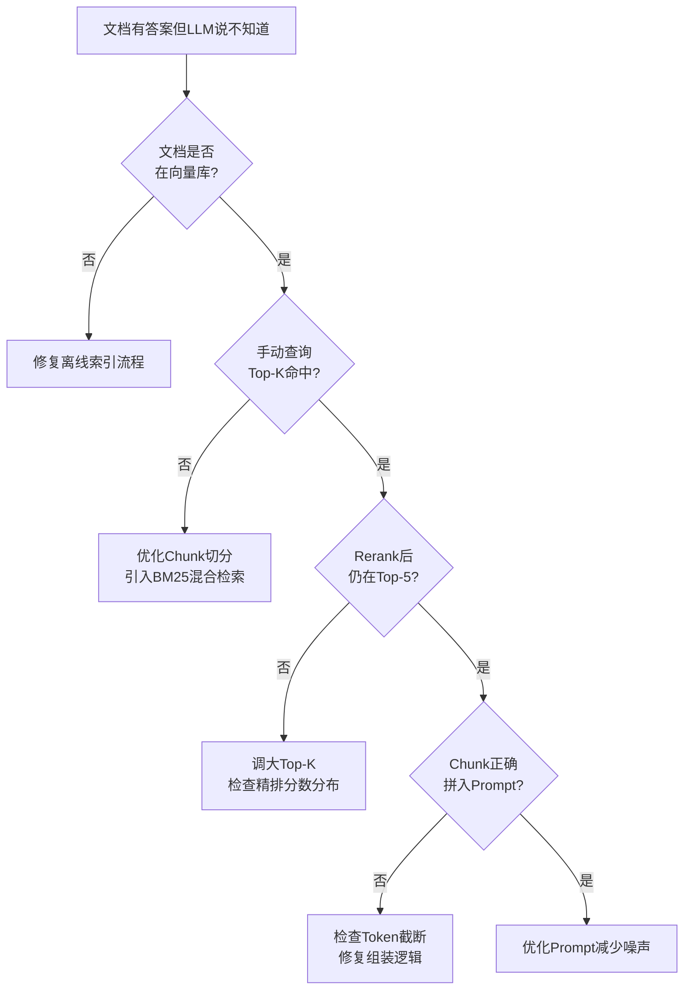
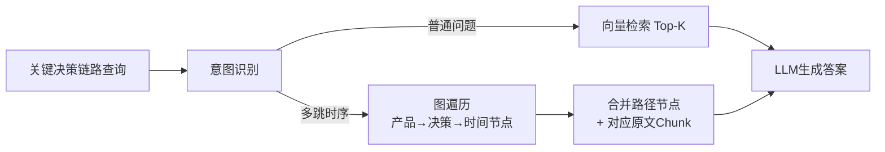
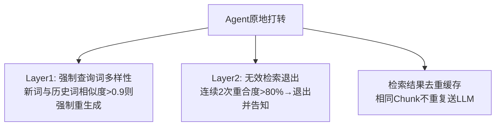

# RAG 技术

### 4.1 RAG 核心流程

#### 离线索引与在线检索生成

##### 1、基础题：RAG 是什么？它为什么能让 LLM 回答训练数据之外的问题？

**难度级别**：⭐（RAG 基本概念、外部知识注入原理）

RAG（Retrieval-Augmented Generation）是一种将检索系统与 LLM 结合的架构。它的核心思路是：先从外部知识库检索与问题相关的文档片段，再把这些片段拼入 Prompt，让 LLM 基于检索到的上下文生成回答。由于知识存储在外部向量库而非模型权重中，可以随时更新，不需要重新训练模型。

---

##### 2、进阶题：请完整描述 RAG 系统的工作流程，包括离线索引与在线检索生成两个阶段，以及工程落地中常见的踩坑点？

**难度级别**：⭐⭐（离线索引流程、在线检索流程、工程踩坑）

**1️⃣ Common Answer**

重点总结（便于面试记忆）：
- 离线索引阶段是一次性批处理，目标是把文档变成可检索的向量索引
- 在线检索阶段是实时链路，每次用户提问都走一遍
- 有一个容易忽视的工程问题是向量维度一致性

**2️⃣ Impressive Answer**

我会从离线、在线两条链路分别拆解，再说工程踩坑：
1. **离线索引阶段是一次性批处理，目标是把文档变成可检索的向量索引**。文档解析是最大难点——PDF 的表格和多栏布局是重灾区，PyPDF2 会把表格按行扫描变成乱序字符串，生产中要用 `pdfplumber` 专门处理表格，或者截图走 OCR/多模态模型。分块用 `RecursiveCharacterTextSplitter`，按段落→句子→词递归切，Chunk Size 512-1024 token，Overlap 10-20%。写库时除了向量本身，`source`、`page_num`、`chunk_id` 等元数据要一起存，方便后续过滤和溯源。
1. **在线检索阶段是实时链路，每次用户提问都走一遍**。Query 先改写扩展，再编码做 ANN 搜索召回 Top-20 到 Top-100，然后用 Cross-Encoder 精排到 Top-5，最后组装上下文调用 LLM 生成。这里要注意控制总 Token 数，防止超出上下文窗口。
1. **有一个容易忽视的工程问题是向量维度一致性**。中途换 Embedding 模型（比如从 `text-embedding-ada-002` 换成 `bge-large-zh`），维度从 1536 变 1024，老数据必须全量重新向量化，否则检索结果会乱掉。另外生产级 RAG 还需要文档版本管理和增量更新机制，文档内容变了向量库没同步，LLM 会给出过时答案。

**3️⃣ Key Differences**

<table>
<tr>
<td>
维度
</td>
<td>
Common Answer
</td>
<td>
Impressive Answer
</td>
</tr>
<tr>
<td>
技术深度
</td>
<td>
只列步骤名称，没说每步的难点
</td>
<td>
逐步拆解每个环节的工程挑战和选型依据
</td>
</tr>
<tr>
<td>
踩坑经验
</td>
<td>
笼统说&quot;PDF 解析不准确&quot;
</td>
<td>
指出具体原因（表格多栏布局）和具体方案（pdfplumber/OCR）
</td>
</tr>
<tr>
<td>
工程视角
</td>
<td>
没有提向量维度一致性、增量更新等
</td>
<td>
覆盖维度一致性、元数据设计、文档版本管理等生产级细节
</td>
</tr>
<tr>
<td>
给面试官的印象
</td>
<td>
了解 RAG 的概念流程
</td>
<td>
真正落地过 RAG，踩过坑，有系统性工程思维
</td>
</tr>
</table>

---

##### 3、场景题：线上 RAG 系统出现"文档明明有答案，但 LLM 却回答不知道"的情况，你如何排查？

**难度级别**：⭐⭐（RAG 链路排查、召回失败定位）

**1️⃣ Common Answer**

重点总结（便于面试记忆）：
- 先确认文档是否在向量库里
- 如果文档在库里，检查召回阶段有没有命中
- 如果召回命中了，检查是否在 Rerank 阶段被过滤掉
- 最后检查上下文组装

**2️⃣ Impressive Answer**

这类问题我会按链路分段排查，快速定位断点：
1. **先确认文档是否在向量库里**。直接查向量库，检查对应文档是否被索引，元数据是否正确，chunk 内容是否完整。如果文档根本没进库，是离线流程问题。
1. **如果文档在库里，检查召回阶段有没有命中**。把用户的 Query 做 Embedding，手动查向量库，看 Top-K 里有没有目标文档片段。如果没有，可能是 Chunk 切得太碎导致语义不完整，或者 Embedding 模型对该领域词汇表达能力弱，可以考虑引入混合检索（BM25 + Dense）弥补。
1. **如果召回命中了，检查是否在 Rerank 阶段被过滤掉**。Reranker 精排 Top-5 时可能把正确片段排到 Top-5 之外。检查精排分数分布，必要时调大 Top-K 数量。
1. **最后检查上下文组装**。确认相关 Chunk 有没有被正确拼入 Prompt，总 Token 数是否超限导致截断。

**3️⃣ Key Differences**

<table>
<tr>
<td>
维度
</td>
<td>
Common Answer
</td>
<td>
Impressive Answer
</td>
</tr>
<tr>
<td>
排查思路
</td>
<td>
猜测可能的原因，无结构
</td>
<td>
按离线索引→召回→精排→组装逐段定位，有明确方法论
</td>
</tr>
<tr>
<td>
解决方案
</td>
<td>
没有给出具体的解决手段
</td>
<td>
每个断点都有对应的修复策略
</td>
</tr>
<tr>
<td>
给面试官的印象
</td>
<td>
缺乏 debug 经验
</td>
<td>
有系统性排查能力，落地过 RAG
</td>
</tr>
</table>

---

##### 4、容易一起考的题

<table>
<tr>
<td>
关联题
</td>
<td>
和本题的关系
</td>
<td>
参考答案
</td>
</tr>
<tr>
<td>
Embedding 模型怎么选？维度影响什么？
</td>
<td>
离线阶段向量化选型直接影响检索质量和维度一致性问题
</td>
<td>
答：RAG 题要串起切分、embedding、召回、重排、上下文拼装、生成和评估，每一步都有质量与成本取舍。
</td>
</tr>
<tr>
<td>
什么是 ANN 近似最近邻搜索？HNSW 和 IVF 有什么区别？
</td>
<td>
在线召回阶段的核心算法，决定检索速度和精度的权衡
</td>
<td>
答：RAG 要串起文档切分、embedding、向量召回、重排、上下文拼装、生成和评估；核心取舍是召回率、准确性、延迟和成本。
</td>
</tr>
<tr>
<td>
如何评估 RAG 系统的效果？用什么指标？
</td>
<td>
离线和在线链路的质量都需要 Recall@K、NDCG 等指标衡量
</td>
<td>
答：RAG 题要串起切分、embedding、召回、重排、上下文拼装、生成和评估，每一步都有质量与成本取舍。
</td>
</tr>
</table>

---

#### 文档分块（Chunking）策略的选型原则

---

##### 1、基础题：为什么 RAG 需要对文档做分块（Chunking）？

**难度级别**：⭐（Chunking 必要性、上下文窗口限制）

LLM 的上下文窗口有长度限制，无法一次性输入整篇文档。分块的目的是把长文档切成小片段，使每个片段能放进上下文窗口，同时通过向量检索精准定位最相关的片段，避免将大量无关内容塞给 LLM，降低噪声干扰。

---

##### 2、进阶题：RAG 中文档分块策略有哪些？如何根据场景选型？Chunk Size 和 Overlap 的经验值怎么定？

**难度级别**：⭐⭐（分块策略对比、选型原则、Chunk Size/Overlap 经验值）

**1️⃣ Common Answer**

重点总结（便于面试记忆）：
- Chunking 策略的选型本质是在检索精度、语义完整性和计算成本三者之间做权衡
- ParentChildSplitter 是容易被忽视但很实用的层次化策略
- Chunk Size 和 Overlap 的经验值

**2️⃣ Impressive Answer**

我会从策略选型和参数调优两个角度来说：
1. **Chunking 策略的选型本质是在检索精度、语义完整性和计算成本三者之间做权衡**。Fixed-Size 按固定字符数切，实现最简单，但完全不考虑语义边界，可能把"然而，这个方案的核心缺陷是……"从中间截断，两个片段单独看都没意义，只适合格式极规整的日志类数据。`RecursiveCharacterTextSplitter` 是生产中的默认首选，按 `\n\n` → `\n` → 句号递归切，最大程度保留语义完整性，计算成本和固定大小差不多。语义分块用 Embedding 相似度在相邻句子之间找边界，效果最好，但每次索引都要跑一遍 Embedding，成本显著上升，适合文档更新不频繁、对质量要求极高的场景。
1. **ParentChildSplitter 是容易被忽视但很实用的层次化策略**。思路是：用大块（1500 token）存完整上下文，用小块（300 token）做检索索引。检索时小块精度高，命中后返回对应大块给 LLM，避免上下文不足的问题。特别适合长文档和技术文档场景。
1. **Chunk Size 和 Overlap 的经验值**：Chunk Size 512-1024 token，Q&A 场景用 512，技术文档用 1024；Overlap 设 10-20%（50-200 token），防止关键信息恰好落在切分边界。注意 Chunk Size 不是越大越好——我们在法律文档项目里用过 2048 token，检索精度反而下降，因为大 Chunk 里混入太多无关内容把相关部分稀释掉了，改回 512 + ParentChildSplitter 组合后召回准确率明显提升。

**3️⃣ Key Differences**

<table>
<tr>
<td>
维度
</td>
<td>
Common Answer
</td>
<td>
Impressive Answer
</td>
</tr>
<tr>
<td>
技术深度
</td>
<td>
列出策略名称，没说各自优劣和适用场景
</td>
<td>
分析每种策略的实现原理、适用场景和计算成本权衡
</td>
</tr>
<tr>
<td>
实践经验
</td>
<td>
Chunk Size 给了经验值但没说为什么
</td>
<td>
解释了 Overlap 存在的原因，给出大 Chunk 反而效果差的反直觉案例
</td>
</tr>
<tr>
<td>
知识广度
</td>
<td>
没有提到 ParentChildSplitter 这种高级策略
</td>
<td>
覆盖了层次化索引这个生产中实用但容易被忽视的方案
</td>
</tr>
<tr>
<td>
给面试官的印象
</td>
<td>
知道主流策略，但感觉没有亲自调过
</td>
<td>
有明确的选型决策逻辑，有踩坑经验，能给出具体建议
</td>
</tr>
</table>

---

##### 3、场景题：用户反馈 RAG 系统检索到的内容经常语义不完整，比如只检索到一段话的后半部分，你怎么解决？

**难度级别**：⭐⭐（Chunk 边界问题、Overlap 调优、层次化索引）

**1️⃣ Common Answer**

重点总结（便于面试记忆）：
- 首先检查当前分块策略
- 其次调整 Overlap
- 最根本的解法是引入 ParentChildSplitter 层次化索引

**2️⃣ Impressive Answer**

语义不完整通常是分块边界设计不合理，有几个方向可以改进：
1. **首先检查当前分块策略**。如果用的是 Fixed-Size 按字符数切，换成 `RecursiveCharacterTextSplitter` 按语义边界（段落→句子）切，能直接改善大部分情况。
1. **其次调整 Overlap**。把 Overlap 从默认的 5% 提高到 15-20%（大约 100-200 token），让相邻 Chunk 有足够重叠，关键信息即便落在边界也能被完整召回。
1. **最根本的解法是引入 ParentChildSplitter 层次化索引**。用小 Chunk（300 token）做精准检索，命中后返回对应的大 Chunk（1500 token）给 LLM，既保证检索精度，又保证上下文完整性。这是生产中解决"语义不完整"问题的标准方案。

**3️⃣ Key Differences**

<table>
<tr>
<td>
维度
</td>
<td>
Common Answer
</td>
<td>
Impressive Answer
</td>
</tr>
<tr>
<td>
解决深度
</td>
<td>
只想到调参，没有分析根本原因
</td>
<td>
从分块策略→参数调优→架构改进分层给出解决方案
</td>
</tr>
<tr>
<td>
方案完整性
</td>
<td>
单一手段，治标不治本
</td>
<td>
给出了层次化索引这个从架构层面彻底解决的方案
</td>
</tr>
<tr>
<td>
给面试官的印象
</td>
<td>
遇到问题只会调参
</td>
<td>
有系统性的问题分析和解决思路
</td>
</tr>
</table>

---

##### 4、容易一起考的题

<table>
<tr>
<td>
关联题
</td>
<td>
和本题的关系
</td>
<td>
参考答案
</td>
</tr>
<tr>
<td>
RecursiveCharacterTextSplitter 和 CharacterTextSplitter 有什么区别？
</td>
<td>
前者是生产首选，理解两者区别是 Chunking 选型的基础
</td>
<td>
答：文档切分要平衡语义完整性和检索粒度，常用固定长度、标题层级、递归切分或语义切分，并通过 overlap 降低边界信息丢失。
</td>
</tr>
<tr>
<td>
ParentChildSplitter 在 LangChain 里怎么实现？
</td>
<td>
层次化索引的具体代码实现，和本题的高级策略直接相关
</td>
<td>
答：LangChain 适合快速搭建 LLM 应用，核心是 Model、Prompt、Chain、Retriever、Tool/Agent；面试要能说清便利性和抽象带来的调试成本。
</td>
</tr>
<tr>
<td>
Embedding 模型的 max_token 限制对 Chunk Size 有什么影响？
</td>
<td>
Chunk Size 的上限由 Embedding 模型的最大输入长度决定
</td>
<td>
答：RAG 题要串起切分、embedding、召回、重排、上下文拼装、生成和评估，每一步都有质量与成本取舍。
</td>
</tr>
</table>

---

### 4.2 检索质量优化

#### 混合检索（Hybrid Search）：稀疏向量与稠密向量的融合

##### 1、基础题：什么是稀疏向量和稠密向量？它们在检索场景中各有什么特点？

**难度级别**：⭐（稀疏/稠密向量基本概念）

稀疏向量（Sparse Vector）基于词频统计，大部分维度为 0，代表算法是 BM25/TF-IDF，优势是精确关键词匹配。稠密向量（Dense Vector）是 Embedding 模型输出的低维连续向量，每个维度都有值，能捕捉语义相似性，处理同义词和近义词。稀疏向量适合精确匹配，稠密向量适合语义理解，两者互补。

---

##### 2、进阶题：什么是混合检索？BM25 稀疏检索和稠密向量检索各有什么优劣？如何通过 RRF 融合两路结果？

**难度级别**：⭐⭐⭐（BM25 vs Dense 的互补性、RRF 算法原理、实测效果）

**1️⃣ Common Answer**

重点总结（便于面试记忆）：
- BM25 和 Dense 检索在本质上是互补的
- RRF 是融合两路结果的经典算法
- 实际效果上

**2️⃣ Impressive Answer**

我会从两路检索的互补性、融合算法和实际效果三个角度来说：
1. **BM25 和 Dense 检索在本质上是互补的**。BM25 是 TF-IDF 的改进版，把文档表示成稀疏的词频向量。优势是精确关键词匹配——查"Python asyncio event loop"能精确命中包含这几个词的文档。但它致命缺陷是完全基于词形匹配，对同义词无能为力，用户说"协程事件循环"，BM25 认为和"asyncio event loop"没有任何关联。Dense 检索则相反，"协程事件循环"和"asyncio event loop"在向量空间里距离很近，但对精确字符串匹配（如产品型号、API 名称）反而不可靠，可能因语义泛化召回不相关内容。
1. **RRF 是融合两路结果的经典算法**，公式是 `score(doc) = Σ 1/(k + rank_i)`，k 通常取 60 用于平滑低排名文档的得分差异。举个例子：某文档在 BM25 排第 2，在 Dense 排第 5，融合得分 = 1/(60+2) + 1/(60+5) ≈ 0.0315。RRF 的好处是不依赖各路得分的绝对值，不需要归一化，实现简单且鲁棒性强。
1. **实际效果上**，在知识库问答项目里实测，混合检索比单路 Dense 检索的 Recall@5 提升约 8-12%，对专业术语类问题（查具体 API 参数）提升最明显，接近 20%。代价是延迟增加，但通常在 50ms 以内，可以接受。Milvus 2.4+ 和 Qdrant 都原生支持混合检索，生产中可以直接用，不需要自己实现 RRF。

**3️⃣ Key Differences**

<table>
<tr>
<td>
维度
</td>
<td>
Common Answer
</td>
<td>
Impressive Answer
</td>
</tr>
<tr>
<td>
原理深度
</td>
<td>
知道 BM25 是&quot;基于词频&quot;，但没说清楚稀疏向量的本质和盲区
</td>
<td>
从向量表示的角度解释稀疏/稠密的本质区别及各自的能力边界
</td>
</tr>
<tr>
<td>
RRF 理解
</td>
<td>
给了公式，但没解释 k 参数的意义和算法优势
</td>
<td>
解释了 k 的平滑作用，用具体例子演示了融合得分计算过程
</td>
</tr>
<tr>
<td>
实践数据
</td>
<td>
说&quot;效果会提升一些&quot;，没有具体数据
</td>
<td>
给出了实测 Recall@5 提升 8-12% 的数据，以及适用场景说明
</td>
</tr>
<tr>
<td>
给面试官的印象
</td>
<td>
了解概念，但不确定是否真正用过
</td>
<td>
有具体数据支撑，知道工具链选型，显然在项目里实际落地过
</td>
</tr>
</table>

---

##### 3、场景题：你的 RAG 系统对专有名词（如产品型号、API 名称）的召回效果很差，你会怎么优化？

**难度级别**：⭐⭐（混合检索的适用场景、BM25 对精确匹配的优势）

**1️⃣ Common Answer**

重点总结（便于面试记忆）：
- 根本原因是 Dense 检索的语义泛化
- 解决方案是引入 BM25 + Dense 混合检索，用 RRF 融合两路结果
- 同时要检查 Chunking 是否把专有名词切断了

**2️⃣ Impressive Answer**

专有名词召回效果差是典型的 Dense 检索盲区问题，核心解法是引入混合检索：
1. **根本原因是 Dense 检索的语义泛化**。Embedding 模型对专有名词（产品型号、API 名称）的处理容易泛化，把"GPT-4o-mini"映射到一个语义宽泛的向量区域，导致召回不精确。这类场景正是 BM25 精确关键词匹配的优势区间。
1. **解决方案是引入 BM25 + Dense 混合检索，用 RRF 融合两路结果**。BM25 能精确命中包含目标词汇的文档，Dense 检索补充语义相关的内容，RRF 融合后专业术语类问题召回率能提升 15-20%。
1. **同时要检查 Chunking 是否把专有名词切断了**。如果一个型号"GPT-4o-mini-2024-07-18"被切成了两个 Chunk，两路检索都会失效。可以在分块前做预处理，把专有名词列入不可切分的保护列表。

**3️⃣ Key Differences**

<table>
<tr>
<td>
维度
</td>
<td>
Common Answer
</td>
<td>
Impressive Answer
</td>
</tr>
<tr>
<td>
问题定位
</td>
<td>
没有分析根本原因，直接尝试调参
</td>
<td>
准确定位到 Dense 检索语义泛化这一根本原因
</td>
</tr>
<tr>
<td>
解决方案
</td>
<td>
换模型或加 Top-K，治标不治本
</td>
<td>
引入混合检索，从架构层面解决专有名词匹配问题
</td>
</tr>
<tr>
<td>
给面试官的印象
</td>
<td>
缺乏对检索原理的深入理解
</td>
<td>
能根据问题特征选择合适的技术方案
</td>
</tr>
</table>

---

##### 4、容易一起考的题

<table>
<tr>
<td>
关联题
</td>
<td>
和本题的关系
</td>
<td>
参考答案
</td>
</tr>
<tr>
<td>
Elasticsearch 的 BM25 和向量检索怎么结合？
</td>
<td>
ES 是实现混合检索的常见工具，和本题的工程实现直接相关
</td>
<td>
答：RAG 题要串起切分、embedding、召回、重排、上下文拼装、生成和评估，每一步都有质量与成本取舍。
</td>
</tr>
<tr>
<td>
RRF 和加权线性融合（Weighted Sum）有什么区别？
</td>
<td>
两种融合策略的对比，RRF 不依赖得分归一化是核心优势
</td>
<td>
答：这题可以按“定义 → 核心机制 → 工程落地”三步答；结合本题重点强调：两种融合策略的对比，RRF 不依赖得分归一化是核心优势，最后补一个风险点或优化手段。
</td>
</tr>
<tr>
<td>
Milvus 的混合检索接口怎么用？
</td>
<td>
本题技术方案的具体代码落地，面试常见延伸
</td>
<td>
答：向量库选型看数据规模、过滤能力、更新频率、延迟和运维；HNSW 适合低延迟高召回，IVF/PQ 更偏大规模压缩和成本控制。
</td>
</tr>
</table>

---

#### Reranker 的原理与效果提升

##### 1、基础题：RAG 中为什么要有召回和精排两个阶段？只用向量检索直接返回 Top-5 不行吗？

**难度级别**：⭐（召回精排分层的必要性）

向量检索（ANN 搜索）本质上是近似计算，在大规模（百万级）文档中速度快，但精度有上限。如果直接从全量文档里用向量检索取 Top-5，精度无法保证。两阶段设计的思路是：先用快速但略粗糙的 ANN 从全量文档召回 Top-100 候选缩小范围，再用更精准但计算量更大的 Cross-Encoder 对这 100 个候选精排到 Top-5，兼顾了速度和精度。

---

##### 2、进阶题：RAG 系统中为什么要引入 Reranker？Bi-Encoder 和 Cross-Encoder 有什么区别？两阶段架构是怎么设计的？

**难度级别**：⭐⭐⭐（Bi-Encoder vs Cross-Encoder 原理、两阶段架构设计、延迟代价分析）

**1️⃣ Common Answer**

重点总结（便于面试记忆）：
- Bi-Encoder 的核心局限是 Query 和 Doc 在编码阶段完全隔离
- Cross-Encoder 把 Query 和文档拼接成一个序列一起输入模型
- 两阶段架构正是为了结合两者优势

**2️⃣ Impressive Answer**

我会从 Bi-Encoder 的本质局限、Cross-Encoder 的工作原理、两阶段架构设计三个角度来说：
1. **Bi-Encoder 的核心局限是 Query 和 Doc 在编码阶段完全隔离**。向量检索的做法是 Query 和文档分别独立编码成向量，用点积或余弦相似度衡量关联度。文档向量可以离线预计算，查询时只需对 Query 做一次编码再做 ANN 搜索，速度极快。但问题也出在这里——模型无法感知 Query 里某个词对判断某篇文档相关性的特殊重要性。比如 Query 是"Python 协程的性能瓶颈"，Bi-Encoder 只能捕捉整体语义，无法精细判断文档里讲 GIL 对协程影响的段落和这个 Query 的深层关联。
1. **Cross-Encoder 把 Query 和文档拼接成一个序列一起输入模型**，格式是 `[CLS] Query [SEP] Document [SEP]`，让 Self-Attention 在 Query 的每个 token 和 Document 的每个 token 之间充分交互，最终输出一个相关性得分。精度显著高于 Bi-Encoder，但代价是不能预计算——每次推理都必须把 Query 和候选 Doc 拼在一起跑一遍，全量检索计算量不可接受。
1. **两阶段架构正是为了结合两者优势**：Stage 1 用 Bi-Encoder + ANN 从全量文档快速召回 Top-100，延迟 20-50ms；Stage 2 用 `BAAI/bge-reranker-v2-m3` 对 Top-100 逐一打分精排到 Top-5，额外增加 100-300ms。100-300ms 的延迟在大多数 RAG 场景下可以接受——LLM 调用本身就要 1-3 秒，Reranker 只占整体链路的 5-15%，但 NDCG@5 能提升约 15%。对延迟极度敏感的场景可以用 `bge-reranker-v2-m3` 蒸馏版，延迟能压到 50ms 以内。

**3️⃣ Key Differences**

<table>
<tr>
<td>
维度
</td>
<td>
Common Answer
</td>
<td>
Impressive Answer
</td>
</tr>
<tr>
<td>
原理理解
</td>
<td>
知道 Bi-Encoder/Cross-Encoder 的结论，但没解释为什么 Bi-Encoder 不精准
</td>
<td>
从编码隔离的角度解释了 Bi-Encoder 的本质局限，让结论有了理论支撑
</td>
</tr>
<tr>
<td>
架构设计
</td>
<td>
说了&quot;先召回再精排&quot;，但没有量化
</td>
<td>
给出了 Top-100 → Top-5 的具体数量，以及各阶段延迟的拆分
</td>
</tr>
<tr>
<td>
效果数据
</td>
<td>
泛泛说&quot;增加延迟 100-300ms&quot;
</td>
<td>
给出了 NDCG@5 提升约 15% 的实测数据，以及延迟占整体链路比例的分析
</td>
</tr>
<tr>
<td>
给面试官的印象
</td>
<td>
背过两阶段架构的概念
</td>
<td>
理解设计取舍，有实测数据，对延迟代价有理性分析
</td>
</tr>
</table>

---

##### 3、场景题：线上 RAG 系统的整体响应延迟过高（超过 5 秒），Reranker 被认为是瓶颈之一，你会怎么优化？

**难度级别**：⭐⭐（Reranker 延迟优化、轻量模型替换、并发优化）

**1️⃣ Common Answer**

重点总结（便于面试记忆）：
- 首先量化 Reranker 在整体链路里的占比
- 如果 Reranker 确实是瓶颈，先看召回量
- 换用轻量蒸馏模型
- 如果多路检索是并行的，确保 Reranker 推理也是批处理模式

**2️⃣ Impressive Answer**

Reranker 的延迟优化有几个层次可以操作：
1. **首先量化 Reranker 在整体链路里的占比**。如果 Reranker 只占 200ms，而 LLM 调用占 3s，优先优化 Reranker 性价比不高，应该先优化 LLM 侧（流式输出、模型选型）。
1. **如果 Reranker 确实是瓶颈，先看召回量**。把 Stage 1 的召回数量从 Top-100 降到 Top-50，Reranker 的计算量直接减半，延迟通常能降 40-50%。同时观察最终精度是否有明显下降，权衡是否可以接受。
1. **换用轻量蒸馏模型**。`bge-reranker-v2-m3` 的蒸馏版延迟能从 200ms 压到 50ms 以内，精度损失通常在 2-3% 以内，大多数场景下可以接受。
1. **如果多路检索是并行的，确保 Reranker 推理也是批处理模式**，一次把 Top-K 候选一起输入而不是逐条推理，能显著提升 GPU 利用率。

**3️⃣ Key Differences**

<table>
<tr>
<td>
维度
</td>
<td>
Common Answer
</td>
<td>
Impressive Answer
</td>
</tr>
<tr>
<td>
优化思路
</td>
<td>
直接减小参数，缺乏系统分析
</td>
<td>
先定位瓶颈占比，再分层优化，有优先级判断
</td>
</tr>
<tr>
<td>
方案完整性
</td>
<td>
只提到换模型一个手段
</td>
<td>
覆盖召回量控制、模型替换、批处理优化多个维度
</td>
</tr>
<tr>
<td>
给面试官的印象
</td>
<td>
遇到性能问题只会&quot;调小参数&quot;
</td>
<td>
有系统性性能分析和分层优化能力
</td>
</tr>
</table>

---

##### 4、容易一起考的题

<table>
<tr>
<td>
关联题
</td>
<td>
和本题的关系
</td>
<td>
参考答案
</td>
</tr>
<tr>
<td>
BGE 系列模型和 OpenAI Embedding 有什么区别？
</td>
<td>
Reranker 常用 BGE 系列，理解模型选型是 Reranker 落地的基础
</td>
<td>
答：RAG 题要串起切分、embedding、召回、重排、上下文拼装、生成和评估，每一步都有质量与成本取舍。
</td>
</tr>
<tr>
<td>
NDCG、MRR、Recall@K 分别是什么？怎么评估检索质量？
</td>
<td>
Reranker 效果提升需要这些指标来量化
</td>
<td>
答：RAG 要串起文档切分、embedding、向量召回、重排、上下文拼装、生成和评估；核心取舍是召回率、准确性、延迟和成本。
</td>
</tr>
<tr>
<td>
召回阶段的 Top-K 怎么定？设太小或太大有什么影响？
</td>
<td>
Top-K 直接影响 Reranker 的输入质量和计算量，是两阶段架构的核心超参
</td>
<td>
答：RAG 要串起文档切分、embedding、向量召回、重排、上下文拼装、生成和评估；核心取舍是召回率、准确性、延迟和成本。
</td>
</tr>
</table>

---

#### Query 改写（Query Rewriting）提升召回质量

##### 1、基础题：为什么用户的原始 Query 直接去检索效果往往不好？

**难度级别**：⭐（Query 和文档的表达鸿沟）

用户提问往往口语化、简短、模糊，而文档里的表达是结构化、专业术语密集的写作风格。两者在向量空间中的距离可能较远，导致语义检索效果不好。比如用户说"Python 里怎么处理并发"，文档里写的是"asyncio 异步编程实践"——语义相关但表达差异很大，直接检索容易召回不准确的内容。

---

##### 2、进阶题：RAG 中有哪些 Query 改写策略？Multi-Query、HyDE、Step-Back Prompting 分别解决什么问题，原理是什么？

**难度级别**：⭐⭐（三种 Query 改写策略的原理、适用场景对比）

**1️⃣ Common Answer**

重点总结（便于面试记忆）：
- Multi-Query 解决的是"表达方式不确定"的问题
- HyDE 解决的是"Query 和文档写作风格差异大"的问题
- Step-Back Prompting 解决的是"问题太细粒度、文档没有直接覆盖"的问题

**2️⃣ Impressive Answer**

这三种策略都是为了解决 Query 和文档之间的表达鸿沟，但解决的是不同维度的问题：
1. **Multi-Query 解决的是"表达方式不确定"的问题**。让 LLM 生成 3-5 个不同角度的子问题并行检索，结果取并集去重，覆盖不同的表达方式和切入角度，召回率显著提升。LangChain 里有 `MultiQueryRetriever` 可以直接用。注意去重不能只做字符串级别，相同内容的不同 Chunk 也要合并，否则会给 LLM 塞重复上下文。代价是额外一次 LLM 调用和多路并行检索。
1. **HyDE 解决的是"Query 和文档写作风格差异大"的问题**。用户的口语问法和专业文档的写作风格在向量空间里距离可能比较远，先让 LLM 生成一个假设性答案，这个答案在语言风格上会更接近真实文档，用它的 Embedding 去检索效果更好。流程是：Query → LLM 生成假设答案 → 对假设答案做 Embedding → 检索真实文档 → LLM 基于真实文档生成最终回答。关键要注意：假设答案可能包含幻觉，但没关系——我们只用它的 Embedding 做检索，不用它的内容作为答案。实测 Recall@3 能提升约 10%，特别适合专业知识问答场景。
1. **Step-Back Prompting 解决的是"问题太细粒度、文档没有直接覆盖"的问题**。比如用户问"LangGraph 里 add_edge 和 add_conditional_edges 有什么区别"，这个问题太细，可能没有文档直接覆盖。Step-Back 后变成"LangGraph 的图状态机工作原理是什么"，能检索到更完整的架构文档，让 LLM 在有完整背景的前提下回答细节问题。

**3️⃣ Key Differences**

<table>
<tr>
<td>
维度
</td>
<td>
Common Answer
</td>
<td>
Impressive Answer
</td>
</tr>
<tr>
<td>
问题定位
</td>
<td>
说&quot;用来提升检索质量&quot;，没说清楚解决的根本问题
</td>
<td>
点出了&quot;Query 和文档表达鸿沟&quot;这个核心矛盾，让三种策略的存在都有了合理性
</td>
</tr>
<tr>
<td>
原理深度
</td>
<td>
HyDE 只说了流程，没解释为什么用假设答案的 Embedding
</td>
<td>
解释了假设答案在向量空间里更接近真实文档语言风格这一核心逻辑
</td>
</tr>
<tr>
<td>
实践细节
</td>
<td>
没有提到去重的层次问题、HyDE 幻觉不影响结果等工程细节
</td>
<td>
覆盖了 Multi-Query 去重要做语义层面、HyDE 只用 Embedding 不用内容等关键细节
</td>
</tr>
<tr>
<td>
给面试官的印象
</td>
<td>
知道三种策略的名字和大概流程
</td>
<td>
能清晰阐述每种策略解决的具体问题，有实测数据，有使用经验
</td>
</tr>
</table>

---

##### 3、场景题：用户反馈系统对"太专业"的问题（如查某个具体 API 的参数说明）召回效果差，同时对"太宽泛"的问题（如问某个框架的整体架构）也效果不好，你会怎么分别应对？

**难度级别**：⭐⭐（不同 Query 类型的改写策略选型）

**1️⃣ Common Answer**

重点总结（便于面试记忆）：
- "太专业"的问题（查具体 API 参数）
- "太宽泛"的问题（问框架整体架构）
- 实际工程中往往不是非此即彼

**2️⃣ Impressive Answer**

这两种问题对应不同的根本原因，需要针对性的策略：
1. **"太专业"的问题（查具体 API 参数）** 是 Dense 检索的盲区——专有名词在向量空间里容易泛化。首选方案是引入混合检索（BM25 + Dense），BM25 能精确命中包含目标词汇的文档。如果问题极其细粒度，还可以结合 Step-Back，先检索 API 所属模块的整体文档，建立上下文后再精准回答细节。
1. **"太宽泛"的问题（问框架整体架构）** 是单一 Query 覆盖面不够的问题。适合用 Multi-Query，让 LLM 从"架构组成""核心概念""工作原理""典型用法"等多个角度生成子问题并行检索，合并去重后能覆盖更全面的文档片段。
1. **实际工程中往往不是非此即彼**，可以在 Query 分类后路由到不同策略：对含有专有名词（通过 NER 或规则识别）的 Query 走混合检索，对宽泛型 Query 走 Multi-Query，资源允许的情况下两者组合使用效果最好。

**3️⃣ Key Differences**

<table>
<tr>
<td>
维度
</td>
<td>
Common Answer
</td>
<td>
Impressive Answer
</td>
</tr>
<tr>
<td>
问题分析
</td>
<td>
没有分析两种问题的根本原因
</td>
<td>
准确识别两种问题的不同根因，分别对症下药
</td>
</tr>
<tr>
<td>
方案针对性
</td>
<td>
方案和问题类型没有明确对应关系
</td>
<td>
每种问题类型都有明确的策略选型依据
</td>
</tr>
<tr>
<td>
工程思维
</td>
<td>
没有考虑组合和路由的可能性
</td>
<td>
提出 Query 分类路由策略，体现系统性工程思维
</td>
</tr>
<tr>
<td>
给面试官的印象
</td>
<td>
知道几种工具，但不知道什么时候用哪个
</td>
<td>
能根据问题特征做精准的策略选型
</td>
</tr>
</table>

---

##### 4、容易一起考的题

<table>
<tr>
<td>
关联题
</td>
<td>
和本题的关系
</td>
<td>
参考答案
</td>
</tr>
<tr>
<td>
RAGFusion 是什么？和 Multi-Query 有什么区别？
</td>
<td>
RAGFusion 在 Multi-Query 基础上加了 RRF 融合，是更完整的方案
</td>
<td>
答：RAG 题要串起切分、embedding、召回、重排、上下文拼装、生成和评估，每一步都有质量与成本取舍。
</td>
</tr>
<tr>
<td>
HyDE 在什么情况下会失效？有什么风险？
</td>
<td>
HyDE 假设答案偏差过大时会引入噪声，是使用时的重要边界条件
</td>
<td>
答：这题可以按“定义 → 核心机制 → 工程落地”三步答；结合本题重点强调：HyDE 假设答案偏差过大时会引入噪声，是使用时的重要边界条件，最后补一个风险点或优化手段。
</td>
</tr>
<tr>
<td>
Query 改写和 Prompt Engineering 有什么关系？
</td>
<td>
Query 改写本质上是通过 Prompt 让 LLM 做 Query 变换，是 Prompt Engineering 的应用
</td>
<td>
答：这题可以按“定义 → 核心机制 → 工程落地”三步答；结合本题重点强调：Query 改写本质上是通过 Prompt 让 LLM 做 Query 变换，是 Prompt Engineering 的应用，最后补一个风险点或优化手段。
</td>
</tr>
</table>

---

### 4.3 向量数据库选型

#### **数据库选型**

##### 1、基础题：向量数据库和关系型数据库有什么本质区别？

**难度级别**：⭐（向量存储、相似度检索、索引结构）

向量数据库存储的是高维浮点向量，核心操作是 ANN（近似最近邻）相似度检索，而关系型数据库存储结构化数据，核心操作是精确匹配和条件过滤。向量数据库使用 HNSW、IVF 等专用索引，天然支持语义相似度查询，适合 RAG、推荐系统等场景，不能直接替代关系型数据库的事务和联表能力。

---

##### 2、进阶题：主流向量数据库（Milvus、Chroma、Qdrant、Pinecone、pgvector）各有什么特点？在不同场景下如何选型？

**难度级别**：⭐⭐（规模边界判断、运维成本权衡、各库差异化能力）

**1️⃣ Common Answer**

重点总结（便于面试记忆）：
- 规模决定起点
- 已有基础设施优先复用
- 生产分布式首选 Milvus，复杂过滤选 Qdrant
- 不想运维但能接受成本，用 Pinecone

**2️⃣ Impressive Answer**

我会从 4 个维度来选型：规模、运维能力、已有基础设施、过滤需求。
1. **规模决定起点**。原型阶段或本地开发，Chroma 零门槛，三行代码起步；但它没有分布式能力，规模到百万量级上限明显，早晚需要迁移，这个代价要提前评估。
1. **已有基础设施优先复用**。如果项目已经跑在 PostgreSQL 上，pgvector 接入成本最低，安装一个扩展就完事，还能直接和关系型数据 JOIN，千万级以内完全够用。
1. **生产分布式首选 Milvus，复杂过滤选 Qdrant**。Milvus 是亿级规模的成熟方案，但依赖 etcd、MinIO、Pulsar，运维复杂度高。Qdrant 用 Rust 实现，最大的差异化在于 Payload 过滤——向量检索和结构化条件过滤在同一索引层面协同，性能损耗小，如果系统需要按部门、时间、文档类型频繁过滤，Qdrant 是更好的选择。
1. **不想运维但能接受成本，用 Pinecone**。全托管 Serverless，适合小团队快速上线，但数据在第三方云上，国内数据合规场景需要谨慎。

选型决策树：原型 → Chroma，有 PG 且规模 < 千万 → pgvector，需要复杂过滤 → Qdrant，亿级且有运维能力 → Milvus，不想运维 → Pinecone。

**3️⃣ Key Differences**

<table>
<tr>
<td>
维度
</td>
<td>
Common Answer
</td>
<td>
Impressive Answer
</td>
</tr>
<tr>
<td>
分析深度
</td>
<td>
列标签词，如&quot;轻量&quot;&quot;分布式&quot;
</td>
<td>
分析每个库的核心差异化能力和规模边界
</td>
</tr>
<tr>
<td>
决策逻辑
</td>
<td>
给基础选型建议，但没有说清依据
</td>
<td>
给出可量化判断条件的决策树
</td>
</tr>
<tr>
<td>
权衡意识
</td>
<td>
未提及 Milvus 运维复杂度、pgvector 规模上限等代价
</td>
<td>
覆盖各方案的代价和边界条件
</td>
</tr>
<tr>
<td>
给面试官的印象
</td>
<td>
知道各库存在，但感觉没有实际用过
</td>
<td>
有清晰选型方法论，能根据约束条件给出有理有据的建议
</td>
</tr>
</table>

---

##### 3、场景题：公司要将内部文档（约 500 万条）接入 RAG，需要支持按部门权限过滤，团队只有 2 名后端工程师，如何选型？

**难度级别**：⭐⭐（多维约束下的选型决策）

**1️⃣ Common Answer**

重点总结（便于面试记忆）：
- 按部门过滤
- 首选 pgvector（如有 PG）或 Qdrant（无 PG）
- 这道题有三个约束要同时满足：500 万条规模、按部门过滤、2 人团队运维能力有限。
- 500 万条规模属于中等偏下，pgvector 和 Qdrant 都能覆盖，Milvus 对这个规模来说运维成本偏高...
- 如果团队已有 PostgreSQL，pgvector 也值得考虑——500 万条用 HNSW 索引没问题，按部门过滤直接用 SQL WHERE，开发体验最好，零额外运维。
- 综合来看：首选 pgvector（如有 PG）或 Qdrant（无 PG），不推荐 Milvus，运维复杂度对 2 人团队来说不划算；Pinecone 可作备选...

**2️⃣ Impressive Answer**

这道题有三个约束要同时满足：500 万条规模、按部门过滤、2 人团队运维能力有限。

500 万条规模属于中等偏下，pgvector 和 Qdrant 都能覆盖，Milvus 对这个规模来说运维成本偏高。关键制约是**按部门过滤**——这要求向量检索和元数据过滤高效协同，Qdrant 的 Payload 过滤在这个场景下有明显优势，不会因为加了过滤条件导致性能大幅下降。

如果团队已有 PostgreSQL，pgvector 也值得考虑——500 万条用 HNSW 索引没问题，按部门过滤直接用 SQL WHERE，开发体验最好，零额外运维。

综合来看：**首选 pgvector（如有 PG）或 Qdrant（无 PG）**，不推荐 Milvus，运维复杂度对 2 人团队来说不划算；Pinecone 可作备选，但数据主权和成本需要评估。

**3️⃣ Key Differences**

<table>
<tr>
<td>
维度
</td>
<td>
Common Answer
</td>
<td>
Impressive Answer
</td>
</tr>
<tr>
<td>
约束分析
</td>
<td>
只看数据量和功能，忽略团队规模
</td>
<td>
同时考量数据量、过滤需求、运维能力三个约束
</td>
</tr>
<tr>
<td>
选型理由
</td>
<td>
模糊的&quot;性能好&quot;&quot;功能全&quot;
</td>
<td>
解释 Qdrant Payload 过滤的具体优势和 pgvector 的低运维优势
</td>
</tr>
<tr>
<td>
排除逻辑
</td>
<td>
无明确排除
</td>
<td>
给出排除 Milvus 的具体理由（运维成本不匹配）
</td>
</tr>
<tr>
<td>
给面试官的印象
</td>
<td>
罗列候选，无决策
</td>
<td>
有工程判断力，能在多重约束下给出确定性建议
</td>
</tr>
</table>

---

##### 4、容易一起考的题

<table>
<tr>
<td>
关联题
</td>
<td>
和本题的关系
</td>
<td>
参考答案
</td>
</tr>
<tr>
<td>
HNSW 索引的原理是什么？
</td>
<td>
各向量库的检索性能都依赖 HNSW，理解原理才能判断参数调优
</td>
<td>
答：核心参数权衡；M：每节点最大连接数，越大精度越高，内存和构建时间成比例增加；efConstruction：构建时的候选列表大小，越大索引质量越好，但构建越慢；ef（查询时）：搜索时动态候选数，可运行时调整，是精度和速度的实时权衡旋钮
</td>
</tr>
<tr>
<td>
RAG 系统的多租户数据隔离怎么做？
</td>
<td>
向量库选型直接影响隔离方案，Qdrant 的 Payload 过滤可以实现行级隔离
</td>
<td>
答：RAG 题要串起切分、embedding、召回、重排、上下文拼装、生成和评估，每一步都有质量与成本取舍。
</td>
</tr>
<tr>
<td>
向量检索 Recall 和 Precision 如何权衡？
</td>
<td>
不同库的索引参数（ef、nprobe）调优方向，是选型后必须面对的问题
</td>
<td>
答：RAG 题要串起切分、embedding、召回、重排、上下文拼装、生成和评估，每一步都有质量与成本取舍。
</td>
</tr>
</table>

---

### 4.4 RAG 评估

#### **RAG  指标**

##### 1、基础题：什么是 RAG 系统评估中的 Faithfulness 指标？

**难度级别**：⭐（RAGAS 指标、幻觉检测）

Faithfulness（忠实度）衡量 LLM 的回答是否完全基于检索到的上下文，是防幻觉的核心指标。计算方式是：先从回答中抽取所有陈述，再判断每条陈述是否能被检索到的 Context 支撑，最后取支撑比例作为分数。分数低说明模型在"编"答案而非从 Context 里提炼。

---

##### 2、进阶题：请介绍 RAGAS 框架的核心指标体系，以及使用 LLM-as-Judge 评估时你遇到过哪些偏差问题？

**难度级别**：⭐⭐⭐（四维评估体系理解、LLM-as-Judge 偏差类型及对策）

**1️⃣ Common Answer**

重点总结（便于面试记忆）：
- RAGAS 四个指标覆盖 RAG 的两条链路
- LLM-as-Judge 的三类典型偏差
- 工程上的校准策略

**2️⃣ Impressive Answer**

我会从两个角度来拆解这个问题：指标体系的设计逻辑，以及 Judge 偏差的工程应对。
1. **RAGAS 四个指标覆盖 RAG 的两条链路**。检索链路：Context Precision 衡量检索噪音（10 个 chunk 只有 2 个有用，精确率 20%）；Context Recall 衡量知识盲区（关键信息没检索到）。生成链路：Faithfulness 防幻觉（陈述能被 Context 支撑的比例）；Answer Relevancy 防跑偏（让 LLM 反向生成问题，和原问题做向量相似度对比）。定位问题时按链路拆解：Recall 低 → 检索策略问题，Precision 低 → 噪音问题，Faithfulness 低 → 生成幻觉，Relevancy 低 → 生成跑偏。
1. **LLM-as-Judge 的三类典型偏差**。位置偏差：LLM 偏好第一个或最后一个候选，A/B 评估时需要随机化顺序；长度偏差：倾向给更长的回答高分，要在 Prompt 里明确"简洁准确优于详细冗余"；自我强化偏差：GPT-4 评估 GPT-4 生成的内容会系统性高分，生产里要引入第二个模型交叉校验。
1. **工程上的校准策略**。在每批评估里加入"锚点样本"（分数已知的黄金用例），通过锚点分数监控 Judge 标准是否漂移；同时每周抽 50-100 条做人工标注，对齐 LLM Judge 和人类判断之间的系统性差距。

**3️⃣ Key Differences**

<table>
<tr>
<td>
维度
</td>
<td>
Common Answer
</td>
<td>
Impressive Answer
</td>
</tr>
<tr>
<td>
指标理解
</td>
<td>
知道四个指标名称和大概含义
</td>
<td>
理解每个指标的计算逻辑和覆盖的链路环节
</td>
</tr>
<tr>
<td>
实践深度
</td>
<td>
停留在&quot;跑个分&quot;的层面
</td>
<td>
能用四个指标组合定位具体问题（检索 vs 生成）
</td>
</tr>
<tr>
<td>
偏差处理
</td>
<td>
知道 LLM Judge 有偏差，说不出具体类型
</td>
<td>
列举位置偏差、长度偏差、自我强化偏差并给出对策
</td>
</tr>
<tr>
<td>
工程视角
</td>
<td>
无
</td>
<td>
提出锚点校准、人工抽样交叉验证等生产级做法
</td>
</tr>
<tr>
<td>
给面试官的印象
</td>
<td>
了解 RAGAS 但没有实战
</td>
<td>
深度使用过评估框架，有踩坑经验和系统性思考
</td>
</tr>
</table>

---

##### 3、场景题：你的 RAG 系统 Faithfulness 分数持续偏低，但 Context Recall 很高，该如何排查和解决？

**难度级别**：⭐⭐⭐（指标组合诊断、生成侧优化）

**1️⃣ Common Answer**

重点总结（便于面试记忆）：
- Recall 高 + Faithfulness 低，这个组合说明"信息检索到了，但模型没有用好"，问题在生成侧，排查方向有三个。
- 首先检查 Context 的利用率。可以抽几条 Faithfulness 低的样本，手动看 LLM 的回答里哪些陈述无法在 Context 里找到支撑。常见原因是 Contex...
- 其次检查 Prompt 约束力度。如果 System Prompt 没有明确限制"只能基于提供的上下文回答"...
- 最后考虑模型能力问题。部分小模型在长 Context 下 Faithfulness 本来就差...

**2️⃣ Impressive Answer**

Recall 高 + Faithfulness 低，这个组合说明"信息检索到了，但模型没有用好"，问题在生成侧，排查方向有三个。

首先检查 Context 的利用率。可以抽几条 Faithfulness 低的样本，手动看 LLM 的回答里哪些陈述无法在 Context 里找到支撑。常见原因是 Context 太长、LLM 注意力分散，导致模型依赖参数记忆而不是 Context——这时可以缩短每个 chunk、减少送入的 Context 数量，或者使用 Lost-in-the-Middle 优化策略（把最重要的 chunk 放在首尾）。

其次检查 Prompt 约束力度。如果 System Prompt 没有明确限制"只能基于提供的上下文回答"，模型会倾向于发挥。加上明确的约束指令，同时加上"如果上下文中没有相关信息，直接说不知道"，能有效提升 Faithfulness。

最后考虑模型能力问题。部分小模型在长 Context 下 Faithfulness 本来就差，如果前两步优化后没有显著改善，需要评估是否需要换更强的基座模型，或者对生成步骤做专项微调。

**3️⃣ Key Differences**

<table>
<tr>
<td>
维度
</td>
<td>
Common Answer
</td>
<td>
Impressive Answer
</td>
</tr>
<tr>
<td>
诊断逻辑
</td>
<td>
直接给解法，没有先定位根因
</td>
<td>
先分析指标组合的含义，确认问题在生成侧再排查
</td>
</tr>
<tr>
<td>
解法深度
</td>
<td>
只提到换模型和加 Prompt 约束
</td>
<td>
覆盖 Context 利用率、Prompt 约束、模型能力三个层次
</td>
</tr>
<tr>
<td>
工程细节
</td>
<td>
无
</td>
<td>
提出 Lost-in-the-Middle 优化、样本手动抽查等具体手段
</td>
</tr>
<tr>
<td>
给面试官的印象
</td>
<td>
会调 Prompt，但没有系统性排查思路
</td>
<td>
有诊断框架，能根据指标组合快速定位问题层次
</td>
</tr>
</table>

---

##### 4、容易一起考的题

<table>
<tr>
<td>
关联题
</td>
<td>
和本题的关系
</td>
<td>
参考答案
</td>
</tr>
<tr>
<td>
LLM-as-Judge 和人工评估各有什么优缺点？
</td>
<td>
RAGAS 评估体系的上层问题，理解 Judge 局限才能设计合理的评估流程
</td>
<td>
答：LLM-as-Judge 要关注评判标准、位置/冗长/自我偏差、多 Judge 投票和人工 Golden Set 校准。
</td>
</tr>
<tr>
<td>
如何构建 RAG 系统的测试集？
</td>
<td>
RAGAS 评估依赖测试集质量，测试集构建方法直接影响评估结果的可信度
</td>
<td>
答：RAG 题要串起切分、embedding、召回、重排、上下文拼装、生成和评估，每一步都有质量与成本取舍。
</td>
</tr>
<tr>
<td>
RAG 系统的 Recall 低怎么优化？
</td>
<td>
和本题互补，Recall 低对应检索侧问题，Faithfulness 低对应生成侧问题
</td>
<td>
答：RAG 题要串起切分、embedding、召回、重排、上下文拼装、生成和评估，每一步都有质量与成本取舍。
</td>
</tr>
</table>

#### **Graph RAG**

---

##### 1、基础题：知识图谱中的三元组是什么？

**难度级别**：⭐（知识图谱基础、实体关系表示）

三元组是知识图谱的基本存储单元，格式为（主体、关系、客体），例如（张三、担任CEO、A公司）。节点表示实体，边表示关系，多个三元组连接成图结构。三元组使得计算机可以通过图遍历来推理实体间的多跳关联，是 Graph RAG 的数据基础。

---

##### 2、进阶题：请介绍 Graph RAG 的核心原理，它解决了传统向量 RAG 的哪些局限性？微软 GraphRAG 的实现思路是什么？

**难度级别**：⭐⭐⭐（图遍历检索机制、社区摘要设计、与向量 RAG 的互补定位）

**1️⃣ Common Answer**

重点总结（便于面试记忆）：
- 向量 RAG 在三类场景会失效
- Graph RAG 分两阶段工作
- 微软 GraphRAG 的创新是社区摘要机制

**2️⃣ Impressive Answer**

我会从三个角度来拆解：向量 RAG 的具体局限、Graph RAG 的工作流程、微软 GraphRAG 的核心创新。
1. **向量 RAG 在三类场景会失效**。多跳推理：问"负责 X 项目的团队之前用过哪些技术栈"，需要先找团队再找技术栈，一次 top-k 很难把两跳信息都捞到；全局聚合：问"整份报告里有哪些风险点"，向量检索只能拿局部相似 chunk；关系密集型查询：涉及人物、组织、事件错综关系的问题，向量相似度无法表达。
1. **Graph RAG 分两阶段工作**。构建阶段：用 LLM 从文档中抽取实体-关系三元组（如 `张三 → 担任CEO → A公司`），存入图数据库，同时保留对应 chunk 作为关系的"证据"。检索阶段：把查询解析成实体和关系，在图上做多跳遍历，把路径上的实体、关系和对应 chunk 一起送给 LLM 生成回答。
1. **微软 GraphRAG 的创新是社区摘要机制**。用 Leiden 算法对知识图谱做社区检测，把强关联实体聚成社区；为每个社区生成报告摘要；全局问答时先在社区摘要层检索，再在实体层细化，形成层次化检索结构。这解决了普通 Graph RAG 无法高效"鸟瞰"全局的问题。

Graph RAG 和 Vector RAG 是互补关系，不是替代：向量检索适合语义相似度查询，构建成本低；Graph RAG 适合关系推理和多跳检索，但知识图谱构建依赖 LLM 抽取，成本和准确率有上限。工程上可以做混合检索：向量检索做第一层快速召回，图遍历做第二层关系增强。

**3️⃣ Key Differences**

<table>
<tr>
<td>
维度
</td>
<td>
Common Answer
</td>
<td>
Impressive Answer
</td>
</tr>
<tr>
<td>
问题定位
</td>
<td>
知道 Graph RAG 能做多跳，说不清向量 RAG 的具体局限
</td>
<td>
精确指出向量 RAG 在多跳推理、全局聚合、关系密集型场景的失效原因
</td>
</tr>
<tr>
<td>
原理深度
</td>
<td>
停留在&quot;抽实体建图谱&quot;的描述
</td>
<td>
拆解构建阶段和检索阶段的具体步骤
</td>
</tr>
<tr>
<td>
GraphRAG 理解
</td>
<td>
知道有社区检测但不理解为什么
</td>
<td>
解释社区摘要解决的是&quot;全局问答&quot;问题，以及分层检索的设计意图
</td>
</tr>
<tr>
<td>
工程视角
</td>
<td>
把两者对立
</td>
<td>
明确提出互补而非替代，给出混合检索的工程方案
</td>
</tr>
<tr>
<td>
给面试官的印象
</td>
<td>
看过 GraphRAG 介绍文章
</td>
<td>
理解设计取舍，有独立的架构判断
</td>
</tr>
</table>

---

##### 3、场景题：用户反馈系统无法回答"某产品从立项到上线，经历了哪些关键决策"这类问题，现有向量 RAG 如何改造？

**难度级别**：⭐⭐⭐（Graph RAG 落地、混合检索设计）

**1️⃣ Common Answer**

重点总结（便于面试记忆）：
- 改造思路：不需要全量替换...
- 需要注意的是知识图谱的构建质量高度依赖 LLM 抽取的准确率，要对抽取结果做人工抽样校验，同时给每条关系保留原文来源，便于答案可溯源。
- `mermaid flowchart LR Q[关键决策链路查询] --> I[意图识别] I -->|普通问题| VEC[向量检索 Top-K] I -->|多跳时序| GR...

**2️⃣ Impressive Answer**

这个问题本质上是多跳时序推理，需要串联"立项文档 → 设计评审 → 关键决策 → 上线报告"这条链路，向量 RAG 一次 top-k 无法覆盖。

改造思路：不需要全量替换，而是在现有向量检索上叠加图增强层。首先对存量文档做实体抽取，重点提取产品名、时间节点、决策事件、负责人这几类实体，构建时序关系图；然后对这类跨时间链路的问题做意图识别，识别出后走图遍历路径而非纯向量检索；最后把遍历路径上的节点和对应原文 chunk 合并，送给 LLM 综合生成答案。

需要注意的是知识图谱的构建质量高度依赖 LLM 抽取的准确率，要对抽取结果做人工抽样校验，同时给每条关系保留原文来源，便于答案可溯源。

**3️⃣ Key Differences**

<table>
<tr>
<td>
维度
</td>
<td>
Common Answer
</td>
<td>
Impressive Answer
</td>
</tr>
<tr>
<td>
问题分析
</td>
<td>
直接说&quot;引入 Graph RAG&quot;
</td>
<td>
先分析为什么是多跳时序推理问题，再给方案
</td>
</tr>
<tr>
<td>
改造方案
</td>
<td>
全量替换
</td>
<td>
叠加式改造，在现有向量 RAG 上增加图增强层
</td>
</tr>
<tr>
<td>
落地细节
</td>
<td>
无
</td>
<td>
提出意图识别、实体类型聚焦、抽取质量校验等工程细节
</td>
</tr>
<tr>
<td>
给面试官的印象
</td>
<td>
知道概念，没有落地经验
</td>
<td>
有完整的改造路径和工程落地意识
</td>
</tr>
</table>

---

##### 4、容易一起考的题

<table>
<tr>
<td>
关联题
</td>
<td>
和本题的关系
</td>
<td>
参考答案
</td>
</tr>
<tr>
<td>
向量 RAG 的 Recall 低怎么优化？
</td>
<td>
Graph RAG 和向量 RAG 的互补定位，要先理解向量 RAG 的边界
</td>
<td>
答：RAG 题要串起切分、embedding、召回、重排、上下文拼装、生成和评估，每一步都有质量与成本取舍。
</td>
</tr>
<tr>
<td>
Neo4j 和向量数据库如何结合使用？
</td>
<td>
Graph RAG 的工程实现通常需要图数据库存储三元组
</td>
<td>
答：RAG 题要串起切分、embedding、召回、重排、上下文拼装、生成和评估，每一步都有质量与成本取舍。
</td>
</tr>
<tr>
<td>
LLM 信息抽取的准确率如何保证？
</td>
<td>
知识图谱的质量直接取决于 LLM 实体抽取的准确率
</td>
<td>
答：这题可以按“定义 → 核心机制 → 工程落地”三步答；结合本题重点强调：知识图谱的质量直接取决于 LLM 实体抽取的准确率，最后补一个风险点或优化手段。
</td>
</tr>
</table>

---

#### **Self-RAG**

##### 1、基础题：传统 RAG 和 Self-RAG 在检索触发机制上的核心区别是什么？

**难度级别**：⭐（按需检索 vs 强制检索）

传统 RAG 对每次查询都强制触发检索，不管问题是否真的需要外部知识。Self-RAG 引入了自我判断机制，模型会先评估当前问题是否需要检索，只有需要时才触发，对于常识性或简单问题直接生成答案，从而减少不必要的检索开销。

---

##### 2、进阶题：请介绍 Self-RAG 的核心机制，它是如何通过 Reflection Token 实现自我批判和按需检索的？

**难度级别**：⭐⭐⭐（四类 Reflection Token 的作用和协作关系、训练方式、工程落地挑战）

**1️⃣ Common Answer**

重点总结（便于面试记忆）：
- 四类 Reflection Token 各司其职
- 四个 Token 形成完整的自我批判闭环
- 工程落地的核心挑战是 Fine-tune 门槛

**2️⃣ Impressive Answer**

我会从三个角度来理解 Self-RAG：Reflection Token 的设计、自我批判闭环的完整逻辑、工程落地的实际挑战。
1. **四类 Reflection Token 各司其职**。`[Retrieve]` 在生成开始或中途判断是否需要检索（yes/no）；`[IsREL]` 在拿到检索结果后判断 Context 是否与问题相关，过滤噪音；`[IsSUP]` 在生成过程中实时监控每句话是否有 Context 支撑，防止中途跑偏；`[IsUSE]` 在生成完成后打整体质量分，可用于多候选答案择优。
1. **四个 Token 形成完整的自我批判闭环**。只有 `[Retrieve]=yes` 才触发检索 → `[IsREL]` 过滤不相关 Context → `[IsSUP]` 实时监控生成 → `[IsUSE]` 评估最终质量。训练方式是用更强的 Critic Model 给训练数据打上 Reflection Token 标签，再用带标签数据 Fine-tune 生成模型——判断能力是"学"出来的，不是规则写死的。
1. **工程落地的核心挑战是 Fine-tune 门槛**。Self-RAG 无法开箱即用，需要对基座模型做监督微调。如果不想 Fine-tune，可以用 Agentic RAG 框架近似替代：在 CoT 里让 LLM 先判断"这道题需要查资料吗"，再决定是否调用检索工具，效果没有 Self-RAG 精细，但在工程上已经足够实用。

**3️⃣ Key Differences**

<table>
<tr>
<td>
维度
</td>
<td>
Common Answer
</td>
<td>
Impressive Answer
</td>
</tr>
<tr>
<td>
Token 理解
</td>
<td>
大概知道有几个控制 token，说不清触发时机
</td>
<td>
清楚列出四个 token 的功能、触发时机和协作关系
</td>
</tr>
<tr>
<td>
机制深度
</td>
<td>
停留在&quot;自己决定检索&quot;的表述
</td>
<td>
解释自我批判闭环的完整逻辑，以及 IsSUP 的实时监控作用
</td>
</tr>
<tr>
<td>
训练理解
</td>
<td>
不了解 Self-RAG 怎么习得判断能力
</td>
<td>
解释 Critic Model 打标签 + Fine-tune 的训练流程
</td>
</tr>
<tr>
<td>
工程视角
</td>
<td>
无
</td>
<td>
指出 Fine-tune 门槛，提出 Agentic RAG 近似替代方案
</td>
</tr>
<tr>
<td>
给面试官的印象
</td>
<td>
读过 Self-RAG 介绍，但不深
</td>
<td>
理解底层机制，有工程落地的独立判断
</td>
</tr>
</table>

---

##### 3、场景题：你的 RAG 系统有大量"今天天气怎么样""你叫什么名字"这类问题也在走检索流程，导致延迟高、成本大，如何优化？

**难度级别**：⭐⭐（按需检索实现、意图分类）

**1️⃣ Common Answer**

重点总结（便于面试记忆）：
- 最轻量的方案是关键词规则过滤：维护一个闲聊意图词库，命中则跳过检索，成本极低但覆盖率有限。
- 更通用的方案是在 LLM 生成前加一个轻量意图分类步骤：用一个小模型（或者在 System Prompt 里加 CoT 判断）先判断"这个问题需要查知识库吗"，输出 yes/n...
- 如果要更精细，可以引入三路分流：闲聊/常识问题 → 直接生成；需要知识库检索的问题 → 走 RAG；需要实时数据的问题 → 走工具调用。分流逻辑用一个轻量分类模型或者 Prom...

**2️⃣ Impressive Answer**

这个问题的本质是"检索决策"前置，有几种实现方式，复杂度和效果递增。

最轻量的方案是关键词规则过滤：维护一个闲聊意图词库，命中则跳过检索，成本极低但覆盖率有限。

更通用的方案是在 LLM 生成前加一个轻量意图分类步骤：用一个小模型（或者在 System Prompt 里加 CoT 判断）先判断"这个问题需要查知识库吗"，输出 yes/no 再决定是否触发检索。这是 Self-RAG 思路的工程近似，不需要 Fine-tune 基座模型。

如果要更精细，可以引入三路分流：闲聊/常识问题 → 直接生成；需要知识库检索的问题 → 走 RAG；需要实时数据的问题 → 走工具调用。分流逻辑用一个轻量分类模型或者 Prompt 来实现，整体延迟和成本能显著降低。

**3️⃣ Key Differences**

<table>
<tr>
<td>
维度
</td>
<td>
Common Answer
</td>
<td>
Impressive Answer
</td>
</tr>
<tr>
<td>
方案完整度
</td>
<td>
给出思路，没有具体实现层次
</td>
<td>
给出规则过滤、意图分类、三路分流三个层次的方案
</td>
</tr>
<tr>
<td>
工程可落地性
</td>
<td>
模糊的&quot;加个判断&quot;
</td>
<td>
每个方案有清晰的实现路径和适用场景
</td>
</tr>
<tr>
<td>
与理论关联
</td>
<td>
无
</td>
<td>
主动关联 Self-RAG 思路，体现知识迁移能力
</td>
</tr>
<tr>
<td>
给面试官的印象
</td>
<td>
知道要做检索决策，没有落地方案
</td>
<td>
有多层次解决方案，能根据成本和效果取舍
</td>
</tr>
</table>

---

##### 4、容易一起考的题

<table>
<tr>
<td>
关联题
</td>
<td>
和本题的关系
</td>
<td>
参考答案
</td>
</tr>
<tr>
<td>
Agentic RAG 和 Self-RAG 有什么关系？
</td>
<td>
Agentic RAG 可以作为 Self-RAG 的工程近似替代，两者目标一致
</td>
<td>
答：RAG 题要串起切分、embedding、召回、重排、上下文拼装、生成和评估，每一步都有质量与成本取舍。
</td>
</tr>
<tr>
<td>
RAG 系统如何控制 Token 成本？
</td>
<td>
按需检索是降低成本的关键策略之一
</td>
<td>
答：RAG 题要串起切分、embedding、召回、重排、上下文拼装、生成和评估，每一步都有质量与成本取舍。
</td>
</tr>
<tr>
<td>
CoT（Chain of Thought）在 RAG 里有什么应用？
</td>
<td>
Self-RAG 的工程近似方案就是在 CoT 里加入检索必要性判断
</td>
<td>
答：RAG 题要串起切分、embedding、召回、重排、上下文拼装、生成和评估，每一步都有质量与成本取舍。
</td>
</tr>
</table>

---

#### **Agentic RAG**

##### 1、基础题：Agentic RAG 和传统 RAG Pipeline 最核心的区别是什么？

**难度级别**：⭐（架构模式差异）

传统 RAG 是固定 Pipeline：每次查询都强制走"检索 → 拼 Prompt → 生成"的线性流程，控制权在流程本身。Agentic RAG 把检索能力封装成工具，交给 Agent 按需调用，Agent 可以自主决定要不要检索、检索哪个知识库、检索几次。本质区别是控制权从流程转移到了 Agent。

---

##### 2、进阶题：什么是 Agentic RAG？在多知识库场景下，Agent 如何实现动态路由和迭代检索？

**难度级别**：⭐⭐⭐（RAG 工具化架构、多知识库路由、迭代检索策略、延迟控制）

**1️⃣ Common Answer**

重点总结（便于面试记忆）：
- 核心架构：把检索能力封装成工具
- 迭代检索是最大优势
- 工程上要控制延迟和成本

**2️⃣ Impressive Answer**

我会从架构设计、路由机制、迭代策略三个角度来拆解。
1. **核心架构：把检索能力封装成工具**。每个知识库对应一个工具函数，工具的 `description` 字段清晰描述"什么问题用这个工具"，LLM 基于描述自动路由。描述越精准，路由越准确——这比硬编码路由规则灵活，也更容易维护。对于复杂问题，Agent 还可以并行调用多个检索工具，同时从多个库召回。
1. **迭代检索是最大优势**。第一次检索结果不满足时，Agent 可以细化查询词（发现结果太宽泛 → 生成更精准的 sub-query）、换知识库（当前库没有答案 → 切换）、分解查询（复杂问题拆成多个子问题分别检索再综合）。这让系统能处理传统 RAG 无法处理的复杂推理问题。
1. **工程上要控制延迟和成本**。迭代检索的代价是延迟不可控，每次迭代都要调 LLM + 向量检索，必须设置最大迭代轮数（一般 3-5 轮）防止无限循环。另外要做检索结果缓存：同一个 query 在一次 Agent 运行中只检索一次，结果缓存在内存里，避免迭代过程中重复检索浪费成本。

**3️⃣ Key Differences**

<table>
<tr>
<td>
维度
</td>
<td>
Common Answer
</td>
<td>
Impressive Answer
</td>
</tr>
<tr>
<td>
架构理解
</td>
<td>
知道&quot;RAG 作为工具&quot;，说不清控制权转移的本质
</td>
<td>
清楚对比两种架构的控制流差异，指出固定 Pipeline 的具体缺陷
</td>
</tr>
<tr>
<td>
路由机制
</td>
<td>
停留在&quot;按问题类型选库&quot;的描述
</td>
<td>
解释工具 description 是路由依据，强调描述精准性的重要性
</td>
</tr>
<tr>
<td>
迭代检索
</td>
<td>
提到&quot;可以多次检索&quot;
</td>
<td>
给出三种迭代策略（细化词、换库、分解），以及最大轮数的工程约束
</td>
</tr>
<tr>
<td>
工程视角
</td>
<td>
无
</td>
<td>
提出检索结果缓存的优化，以及并行检索的设计思路
</td>
</tr>
<tr>
<td>
给面试官的印象
</td>
<td>
了解概念，没有工程落地经验
</td>
<td>
有清晰的架构设计思路，考虑到延迟、成本等工程约束
</td>
</tr>
</table>

---

##### 3、场景题：用户反馈 Agent 在回答复杂问题时经常"原地打转"，同样的知识库查了 5 遍还没有答案，如何解决？

**难度级别**：⭐⭐⭐（迭代检索质量控制、终止条件设计）

**1️⃣ Common Answer**

重点总结（便于面试记忆）：
- 强制查询词多样性
- 设计明确的退出条件
- "原地打转"说明 Agent 的迭代终止条件设计不合理，以及查询词没有实质性变化。需要从两个层面来修复。
- 第一层是强制查询词多样性。每次迭代前检查新的查询词和历史查询词的相似度，如果语义相似度超过阈值（比如 0.9），强制要求 Agent 重新生成更差异化的查询词...
- 第二层是设计明确的退出条件。除了最大迭代轮数限制外，还要检测"无效检索"：如果连续 2 次检索到的结果和历史检索结果重合度超过 80%，认定为无效循环，直接触发退出逻辑，让 A...
- 同时在工程上可以引入检索结果去重缓存，Agent 运行期间对历史检索结果做哈希缓存，完全重复的 chunk 不重复送给 LLM，减少 Token 浪费。

**2️⃣ Impressive Answer**

"原地打转"说明 Agent 的迭代终止条件设计不合理，以及查询词没有实质性变化。需要从两个层面来修复。

第一层是**强制查询词多样性**。每次迭代前检查新的查询词和历史查询词的相似度，如果语义相似度超过阈值（比如 0.9），强制要求 Agent 重新生成更差异化的查询词，或者换用不同的检索策略（从语义检索换成关键词检索）。

第二层是**设计明确的退出条件**。除了最大迭代轮数限制外，还要检测"无效检索"：如果连续 2 次检索到的结果和历史检索结果重合度超过 80%，认定为无效循环，直接触发退出逻辑，让 Agent 基于已有信息回答或者明确告知用户"现有知识库中没有足够信息"。

同时在工程上可以引入检索结果去重缓存，Agent 运行期间对历史检索结果做哈希缓存，完全重复的 chunk 不重复送给 LLM，减少 Token 浪费。

**3️⃣ Key Differences**

<table>
<tr>
<td>
维度
</td>
<td>
Common Answer
</td>
<td>
Impressive Answer
</td>
</tr>
<tr>
<td>
问题诊断
</td>
<td>
直接给解法，没有分析根因
</td>
<td>
指出终止条件设计不合理和查询词无变化两个根本原因
</td>
</tr>
<tr>
<td>
解法深度
</td>
<td>
限制次数 + 换查询词，比较笼统
</td>
<td>
给出查询词相似度检测、无效检索识别两个具体机制
</td>
</tr>
<tr>
<td>
工程细节
</td>
<td>
无
</td>
<td>
提出检索结果去重缓存，减少重复 Token 消耗
</td>
</tr>
<tr>
<td>
给面试官的印象
</td>
<td>
知道要加限制，但没有系统性设计
</td>
<td>
有完整的质量控制思路，考虑到检测和退出机制
</td>
</tr>
</table>

---

##### 4、容易一起考的题

<table>
<tr>
<td>
关联题
</td>
<td>
和本题的关系
</td>
<td>
参考答案
</td>
</tr>
<tr>
<td>
Self-RAG 和 Agentic RAG 有什么关系？
</td>
<td>
Self-RAG 是 Agentic RAG 按需检索思路的理论基础
</td>
<td>
答：RAG 题要串起切分、embedding、召回、重排、上下文拼装、生成和评估，每一步都有质量与成本取舍。
</td>
</tr>
<tr>
<td>
LangGraph 如何实现带循环的 Agent 工作流？
</td>
<td>
Agentic RAG 的迭代检索需要循环结构，LangGraph 是常用实现框架
</td>
<td>
答：LangGraph 用图和状态机表达 Agent 流程，节点负责执行，边负责路由，State 承载上下文；适合有分支、循环、人工介入的复杂 Agent。
</td>
</tr>
<tr>
<td>
Function Calling 和 Tool Use 有什么区别？
</td>
<td>
Agentic RAG 的检索工具通过 Function Calling/Tool Use 实现
</td>
<td>
答：工具调用题要讲 schema 描述、参数校验、权限控制、超时重试、幂等和观测；核心是让模型会选、会用、用错能兜底。
</td>
</tr>
</table>
---

## 知识点一句话总结

| 知识点 | 一句话总结（来自 Impressive Answer） |
| --- | --- |
| RAG 核心流程 | 离线索引阶段是一次性批处理，目标是把文档变成可检索的向量索引：文档解析是最大难点——PDF 的表格和多栏布局是重灾区，PyPDF2 会把表格按行扫描变成乱序字符串，生产中要用 pdfplumber 专门处理表格，或者截图走 OCR/多模态模型。分块用 RecursiveCharacterTextSplitter，按段落→句子→词递归切，Chunk Size 512-1024 token，Overlap 10-20%。写库时除了向量本身，source、page_num、chunk_id 等元数据要一起存，方便后续过滤和溯源；在线检索阶段是实时链路，每次用户提问都走一遍：Query 先改写扩展，再编码做 ANN 搜索召回 Top-20 到 Top-100，然后用 Cross-Encoder 精排到 Top-5，最后组装上下文调用 LLM 生成。这里要注意控制总 Token 数，防止超出上下文窗口；有一个容易忽视的工程问题是向量维度一致性：中途换 Embedding 模型（比如从 text-embedding-ada-002 换成 bge-large-zh），维度从 1536 变 1024，老数据必须全量重新向量化，否则检索结果会乱掉。另外生产级 RAG 还需要文档版本管理和增量更新机制，文档内容变了向量库没同步，LLM 会给出过时答案。 |
| 离线索引与在线检索生成 | 离线索引阶段是一次性批处理，目标是把文档变成可检索的向量索引：文档解析是最大难点——PDF 的表格和多栏布局是重灾区，PyPDF2 会把表格按行扫描变成乱序字符串，生产中要用 pdfplumber 专门处理表格，或者截图走 OCR/多模态模型。分块用 RecursiveCharacterTextSplitter，按段落→句子→词递归切，Chunk Size 512-1024 token，Overlap 10-20%。写库时除了向量本身，source、page_num、chunk_id 等元数据要一起存，方便后续过滤和溯源；在线检索阶段是实时链路，每次用户提问都走一遍：Query 先改写扩展，再编码做 ANN 搜索召回 Top-20 到 Top-100，然后用 Cross-Encoder 精排到 Top-5，最后组装上下文调用 LLM 生成。这里要注意控制总 Token 数，防止超出上下文窗口；有一个容易忽视的工程问题是向量维度一致性：中途换 Embedding 模型（比如从 text-embedding-ada-002 换成 bge-large-zh），维度从 1536 变 1024，老数据必须全量重新向量化，否则检索结果会乱掉。另外生产级 RAG 还需要文档版本管理和增量更新机制，文档内容变了向量库没同步，LLM 会给出过时答案。 |
| RAG 是什么？它为什么能让 LLM 回答训练数据之外的问题？ | RAG（Retrieval-Augmented Generation）是一种将检索系统与 LLM 结合的架构。它的核心思路是：先从外部知识库检索与问题相关的文档片段，再把这些片段拼入 Prompt，让 LLM 基于检索到的上下文生成回答。由于知识存储在外部向量库而非模型权重中，可以随时更新，不需要重新训练模型。 |
| 请完整描述 RAG 系统的工作流程，包括离线索引与在线检索生成两个阶段，以及工程落地中常见的踩坑点？ | 离线索引阶段是一次性批处理，目标是把文档变成可检索的向量索引：文档解析是最大难点——PDF 的表格和多栏布局是重灾区，PyPDF2 会把表格按行扫描变成乱序字符串，生产中要用 pdfplumber 专门处理表格，或者截图走 OCR/多模态模型。分块用 RecursiveCharacterTextSplitter，按段落→句子→词递归切，Chunk Size 512-1024 token，Overlap 10-20%。写库时除了向量本身，source、page_num、chunk_id 等元数据要一起存，方便后续过滤和溯源；在线检索阶段是实时链路，每次用户提问都走一遍：Query 先改写扩展，再编码做 ANN 搜索召回 Top-20 到 Top-100，然后用 Cross-Encoder 精排到 Top-5，最后组装上下文调用 LLM 生成。这里要注意控制总 Token 数，防止超出上下文窗口；有一个容易忽视的工程问题是向量维度一致性：中途换 Embedding 模型（比如从 text-embedding-ada-002 换成 bge-large-zh），维度从 1536 变 1024，老数据必须全量重新向量化，否则检索结果会乱掉。另外生产级 RAG 还需要文档版本管理和增量更新机制，文档内容变了向量库没同步，LLM 会给出过时答案。 |
| 线上 RAG 系统出现"文档明明有答案，但 LLM 却回答不知道"的情况，你如何排查？ | 这类问题我会按链路分段排查，快速定位断点：；先确认文档是否在向量库里：直接查向量库，检查对应文档是否被索引，元数据是否正确，chunk 内容是否完整。如果文档根本没进库，是离线流程问题；如果文档在库里，检查召回阶段有没有命中：把用户的 Query 做 Embedding，手动查向量库，看 Top-K 里有没有目标文档片段。如果没有，可能是 Chunk 切得太碎导致语义不完整，或者 Embedding 模型对该领域词汇表达能力弱，可以考虑引入混合检索（BM25 + Dense）弥补。 |
| 文档分块（Chunking）策略的选型原则 | Chunking 策略的选型本质是在检索精度、语义完整性和计算成本三者之间做权衡：Fixed-Size 按固定字符数切，实现最简单，但完全不考虑语义边界，可能把"然而，这个方案的核心缺陷是"从中间截断，两个片段单独看都没意义，只适合格式极规整的日志类数据。RecursiveCharacterTextSplitter 是生产中的默认首选，按 \n\n → \n → 句号递归切，最大程度保留语义完整性，计算成本和固定大小差不多。语义分块用 Embedding 相似度在相邻句子之间找边界，效果最好，但每次索引都要跑一遍 Embedding，成本显著上升，适合文档更新不频繁、对质量要求极高的场景；ParentChildSplitter 是容易被忽视但很实用的层次化策略：思路是：用大块（1500 token）存完整上下文，用小块（300 token）做检索索引。检索时小块精度高，命中后返回对应大块给 LLM，避免上下文不足的问题。特别适合长文档和技术文档场景；Chunk Size 和 Overlap 的经验值：Chunk Size 512-1024 token，Q&A 场景用 512，技术文档用 1024；Overlap 设 10-20%（50-200 token），防止关键信息恰好落在切分边界。注意 Chunk Size 不是越大越好——我们在法律文档项目里用过 2048 token，检索精度反而下降，因为大 Chunk 里混入太多无关内容把相关部分稀释掉了，改回 512 + ParentChildSplitter 组合后召回准确率明显提升。 |
| 为什么 RAG 需要对文档做分块（Chunking）？ | LLM 的上下文窗口有长度限制，无法一次性输入整篇文档。分块的目的是把长文档切成小片段，使每个片段能放进上下文窗口，同时通过向量检索精准定位最相关的片段，避免将大量无关内容塞给 LLM，降低噪声干扰。 |
| RAG 中文档分块策略有哪些？如何根据场景选型？Chunk Size 和 Overlap 的经验值怎么定？ | Chunking 策略的选型本质是在检索精度、语义完整性和计算成本三者之间做权衡：Fixed-Size 按固定字符数切，实现最简单，但完全不考虑语义边界，可能把"然而，这个方案的核心缺陷是"从中间截断，两个片段单独看都没意义，只适合格式极规整的日志类数据。RecursiveCharacterTextSplitter 是生产中的默认首选，按 \n\n → \n → 句号递归切，最大程度保留语义完整性，计算成本和固定大小差不多。语义分块用 Embedding 相似度在相邻句子之间找边界，效果最好，但每次索引都要跑一遍 Embedding，成本显著上升，适合文档更新不频繁、对质量要求极高的场景；ParentChildSplitter 是容易被忽视但很实用的层次化策略：思路是：用大块（1500 token）存完整上下文，用小块（300 token）做检索索引。检索时小块精度高，命中后返回对应大块给 LLM，避免上下文不足的问题。特别适合长文档和技术文档场景；Chunk Size 和 Overlap 的经验值：Chunk Size 512-1024 token，Q&A 场景用 512，技术文档用 1024；Overlap 设 10-20%（50-200 token），防止关键信息恰好落在切分边界。注意 Chunk Size 不是越大越好——我们在法律文档项目里用过 2048 token，检索精度反而下降，因为大 Chunk 里混入太多无关内容把相关部分稀释掉了，改回 512 + ParentChildSplitter 组合后召回准确率明显提升。 |
| 用户反馈 RAG 系统检索到的内容经常语义不完整，比如只检索到一段话的后半部分，你怎么解决？ | 语义不完整通常是分块边界设计不合理，有几个方向可以改进：；首先检查当前分块策略：如果用的是 Fixed-Size 按字符数切，换成 RecursiveCharacterTextSplitter 按语义边界（段落→句子）切，能直接改善大部分情况；其次调整 Overlap：把 Overlap 从默认的 5% 提高到 15-20%（大约 100-200 token），让相邻 Chunk 有足够重叠，关键信息即便落在边界也能被完整召回。 |
| 什么是稀疏向量和稠密向量？它们在检索场景中各有什么特点？ | 稀疏向量（Sparse Vector）基于词频统计，大部分维度为 0，代表算法是 BM25/TF-IDF，优势是精确关键词匹配。稠密向量（Dense Vector）是 Embedding 模型输出的低维连续向量，每个维度都有值，能捕捉语义相似性，处理同义词和近义词。稀疏向量适合精确匹配，稠密向量适合语义理解，两者互补。 |
| 什么是混合检索？BM25 稀疏检索和稠密向量检索各有什么优劣？如何通过 RRF 融合两路结果？ | 混合检索把 BM25 的关键词精确匹配和向量检索的语义泛化结合起来，先多路召回再融合排序或重排，能同时解决专有名词、数字、代码等精确匹配和同义表达、意图相近问题。 |
| 你的 RAG 系统对专有名词（如产品型号、API 名称）的召回效果很差，你会怎么优化？ | 专有名词召回效果差是典型的 Dense 检索盲区问题，核心解法是引入混合检索：；根本原因是 Dense 检索的语义泛化：Embedding 模型对专有名词（产品型号、API 名称）的处理容易泛化，把"GPT-4o-mini"映射到一个语义宽泛的向量区域，导致召回不精确。这类场景正是 BM25 精确关键词匹配的优势区间；解决方案是引入 BM25 + Dense 混合检索，用 RRF 融合两路结果：BM25 能精确命中包含目标词汇的文档，Dense 检索补充语义相关的内容，RRF 融合后专业术语类问题召回率能提升 15-20%。 |
| Reranker 的原理与效果提升 | 我会从 Bi-Encoder 的本质局限、Cross-Encoder 的工作原理、两阶段架构设计三个角度来说：；Bi-Encoder 的核心局限是 Query 和 Doc 在编码阶段完全隔离：向量检索的做法是 Query 和文档分别独立编码成向量，用点积或余弦相似度衡量关联度。文档向量可以离线预计算，查询时只需对 Query 做一次编码再做 ANN 搜索，速度极快。但问题也出在这里——模型无法感知 Query 里某个词对判断某篇文档相关性的特殊重要性。比如 Query 是"Python 协程的性能瓶颈"，Bi-Encoder 只能捕捉整体语义，无法精细判断文档里讲 GIL 对协程影响的段落和这个 Query 的深层关联；Cross-Encoder 把 Query 和文档拼接成一个序列一起输入模型：格式是 [CLS] Query [SEP] Document [SEP]，让 Self-Attention 在 Query 的每个 token 和 Document 的每个 token 之间充分交互，最终输出一个相关性得分。精度显著高于 Bi-Encoder，但代价是不能预计算——每次推理都必须把 Query 和候选 Doc 拼在一起跑一遍，全量检索计算量不可接受。 |
| RAG 中为什么要有召回和精排两个阶段？只用向量检索直接返回 Top-5 不行吗？ | 向量检索（ANN 搜索）本质上是近似计算，在大规模（百万级）文档中速度快，但精度有上限。如果直接从全量文档里用向量检索取 Top-5，精度无法保证。两阶段设计的思路是：先用快速但略粗糙的 ANN 从全量文档召回 Top-100 候选缩小范围，再用更精准但计算量更大的 Cross-Encoder 对这 100 个候选精排到 Top-5，兼顾了速度和精度。 |
| RAG 系统中为什么要引入 Reranker？Bi-Encoder 和 Cross-Encoder 有什么区别？两阶段架构是怎么设计的？ | 我会从 Bi-Encoder 的本质局限、Cross-Encoder 的工作原理、两阶段架构设计三个角度来说：；Bi-Encoder 的核心局限是 Query 和 Doc 在编码阶段完全隔离：向量检索的做法是 Query 和文档分别独立编码成向量，用点积或余弦相似度衡量关联度。文档向量可以离线预计算，查询时只需对 Query 做一次编码再做 ANN 搜索，速度极快。但问题也出在这里——模型无法感知 Query 里某个词对判断某篇文档相关性的特殊重要性。比如 Query 是"Python 协程的性能瓶颈"，Bi-Encoder 只能捕捉整体语义，无法精细判断文档里讲 GIL 对协程影响的段落和这个 Query 的深层关联；Cross-Encoder 把 Query 和文档拼接成一个序列一起输入模型：格式是 [CLS] Query [SEP] Document [SEP]，让 Self-Attention 在 Query 的每个 token 和 Document 的每个 token 之间充分交互，最终输出一个相关性得分。精度显著高于 Bi-Encoder，但代价是不能预计算——每次推理都必须把 Query 和候选 Doc 拼在一起跑一遍，全量检索计算量不可接受。 |
| 线上 RAG 系统的整体响应延迟过高（超过 5 秒），Reranker 被认为是瓶颈之一，你会怎么优化？ | Reranker 的延迟优化有几个层次可以操作：；首先量化 Reranker 在整体链路里的占比：如果 Reranker 只占 200ms，而 LLM 调用占 3s，优先优化 Reranker 性价比不高，应该先优化 LLM 侧（流式输出、模型选型）；如果 Reranker 确实是瓶颈，先看召回量：把 Stage 1 的召回数量从 Top-100 降到 Top-50，Reranker 的计算量直接减半，延迟通常能降 40-50%。同时观察最终精度是否有明显下降，权衡是否可以接受。 |
| 为什么用户的原始 Query 直接去检索效果往往不好？ | 用户提问往往口语化、简短、模糊，而文档里的表达是结构化、专业术语密集的写作风格。两者在向量空间中的距离可能较远，导致语义检索效果不好。比如用户说"Python 里怎么处理并发"，文档里写的是"asyncio 异步编程实践"——语义相关但表达差异很大，直接检索容易召回不准确的内容。 |
| RAG 中有哪些 Query 改写策略？Multi-Query、HyDE、Step-Back Prompting 分别解决什么问题，原理是什么？ | 这三种策略都是为了解决 Query 和文档之间的表达鸿沟，但解决的是不同维度的问题：；Multi-Query 解决的是"表达方式不确定"的问题：让 LLM 生成 3-5 个不同角度的子问题并行检索，结果取并集去重，覆盖不同的表达方式和切入角度，召回率显著提升。LangChain 里有 MultiQueryRetriever 可以直接用。注意去重不能只做字符串级别，相同内容的不同 Chunk 也要合并，否则会给 LLM 塞重复上下文。代价是额外一次 LLM 调用和多路并行检索；HyDE 解决的是"Query 和文档写作风格差异大"的问题：用户的口语问法和专业文档的写作风格在向量空间里距离可能比较远，先让 LLM 生成一个假设性答案，这个答案在语言风格上会更接近真实文档，用它的 Embedding 去检索效果更好。流程是：Query → LLM 生成假设答案 → 对假设答案做 Embedding → 检索真实文档 → LLM 基于真实文档生成最终回答。关键要注意：假设答案可能包含幻觉，但没关系——我们只用它的 Embedding 做检索，不用它的内容作为答案。实测 Recall@3 能提升约 10%，特别适合专业知识问答场景。 |
| 用户反馈系统对"太专业"的问题（如查某个具体 API 的参数说明）召回效果差，同时对"太宽泛"的问题（如问某个框架的整体架构）也效果不好，你会怎么分别应对？ | 这两种问题对应不同的根本原因，需要针对性的策略：；"太专业"的问题（查具体 API 参数）：是 Dense 检索的盲区——专有名词在向量空间里容易泛化。首选方案是引入混合检索（BM25 + Dense），BM25 能精确命中包含目标词汇的文档。如果问题极其细粒度，还可以结合 Step-Back，先检索 API 所属模块的整体文档，建立上下文后再精准回答细节；"太宽泛"的问题（问框架整体架构）：是单一 Query 覆盖面不够的问题。适合用 Multi-Query，让 LLM 从"架构组成""核心概念""工作原理""典型用法"等多个角度生成子问题并行检索，合并去重后能覆盖更全面的文档片段。 |
| 向量数据库和关系型数据库有什么本质区别？ | 向量数据库存储的是高维浮点向量，核心操作是 ANN（近似最近邻）相似度检索，而关系型数据库存储结构化数据，核心操作是精确匹配和条件过滤。向量数据库使用 HNSW、IVF 等专用索引，天然支持语义相似度查询，适合 RAG、推荐系统等场景，不能直接替代关系型数据库的事务和联表能力。 |
| 主流向量数据库（Milvus、Chroma、Qdrant、Pinecone、pgvector）各有什么特点？在不同场景下如何选型？ | 规模决定起点：原型阶段或本地开发，Chroma 零门槛，三行代码起步；但它没有分布式能力，规模到百万量级上限明显，早晚需要迁移，这个代价要提前评估；已有基础设施优先复用：如果项目已经跑在 PostgreSQL 上，pgvector 接入成本最低，安装一个扩展就完事，还能直接和关系型数据 JOIN，千万级以内完全够用；生产分布式首选 Milvus，复杂过滤选 Qdrant：Milvus 是亿级规模的成熟方案，但依赖 etcd、MinIO、Pulsar，运维复杂度高。Qdrant 用 Rust 实现，最大的差异化在于 Payload 过滤——向量检索和结构化条件过滤在同一索引层面协同，性能损耗小，如果系统需要按部门、时间、文档类型频繁过滤，Qdrant 是更好的选择。 |
| 公司要将内部文档（约 500 万条）接入 RAG，需要支持按部门权限过滤，团队只有 2 名后端工程师，如何选型？ | 这道题有三个约束要同时满足：500 万条规模、按部门过滤、2 人团队运维能力有限；500 万条规模属于中等偏下，pgvector 和 Qdrant 都能覆盖，Milvus 对这个规模来说运维成本偏高。关键制约是按部门过滤——这要求向量检索和元数据过滤高效协同，Qdrant 的 Payload 过滤在这个场景下有明显优势，不会因为加了过滤条件导致性能大幅下降；如果团队已有 PostgreSQL，pgvector 也值得考虑——500 万条用 HNSW 索引没问题，按部门过滤直接用 SQL WHERE，开发体验最好，零额外运维。 |
| 什么是 RAG 系统评估中的 Faithfulness 指标？ | Faithfulness（忠实度）衡量 LLM 的回答是否完全基于检索到的上下文，是防幻觉的核心指标。计算方式是：先从回答中抽取所有陈述，再判断每条陈述是否能被检索到的 Context 支撑，最后取支撑比例作为分数。分数低说明模型在"编"答案而非从 Context 里提炼。 |
| 请介绍 RAGAS 框架的核心指标体系，以及使用 LLM-as-Judge 评估时你遇到过哪些偏差问题？ | RAGAS 四个指标覆盖 RAG 的两条链路：检索链路：Context Precision 衡量检索噪音（10 个 chunk 只有 2 个有用，精确率 20%）；Context Recall 衡量知识盲区（关键信息没检索到）。生成链路：Faithfulness 防幻觉（陈述能被 Context 支撑的比例）；Answer Relevancy 防跑偏（让 LLM 反向生成问题，和原问题做向量相似度对比）。定位问题时按链路拆解：Recall 低 → 检索策略问题，Precision 低 → 噪音问题，Faithfulness 低 → 生成幻觉，Relevancy 低 → 生成跑偏；LLM-as-Judge 的三类典型偏差：位置偏差：LLM 偏好第一个或最后一个候选，A/B 评估时需要随机化顺序；长度偏差：倾向给更长的回答高分，要在 Prompt 里明确"简洁准确优于详细冗余"；自我强化偏差：GPT-4 评估 GPT-4 生成的内容会系统性高分，生产里要引入第二个模型交叉校验；工程上的校准策略：在每批评估里加入"锚点样本"（分数已知的黄金用例），通过锚点分数监控 Judge 标准是否漂移；同时每周抽 50-100 条做人工标注，对齐 LLM Judge 和人类判断之间的系统性差距。 |
| 你的 RAG 系统 Faithfulness 分数持续偏低，但 Context Recall 很高，该如何排查和解决？ | Recall 高 + Faithfulness 低，这个组合说明"信息检索到了，但模型没有用好"，问题在生成侧，排查方向有三个；首先检查 Context 的利用率。可以抽几条 Faithfulness 低的样本，手动看 LLM 的回答里哪些陈述无法在 Context 里找到支撑。常见原因是 Context 太长、LLM 注意力分散，导致模型依赖参数记忆而不是 Context——这时可以缩短每个 chunk、减少送入的 Context 数量，或者使用 Lost-in-the-Middle 优化策略（把最重要的 chunk 放在首尾）；其次检查 Prompt 约束力度。如果 System Prompt 没有明确限制"只能基于提供的上下文回答"，模型会倾向于发挥。加上明确的约束指令，同时加上"如果上下文中没有相关信息，直接说不知道"，能有效提升 Faithfulness。 |
| 知识图谱中的三元组是什么？ | 三元组是知识图谱的基本存储单元，格式为（主体、关系、客体），例如（张三、担任CEO、A公司）。节点表示实体，边表示关系，多个三元组连接成图结构。三元组使得计算机可以通过图遍历来推理实体间的多跳关联，是 Graph RAG 的数据基础。 |
| 请介绍 Graph RAG 的核心原理，它解决了传统向量 RAG 的哪些局限性？微软 GraphRAG 的实现思路是什么？ | 我会从三个角度来拆解：向量 RAG 的具体局限、Graph RAG 的工作流程、微软 GraphRAG 的核心创新；向量 RAG 在三类场景会失效：多跳推理：问"负责 X 项目的团队之前用过哪些技术栈"，需要先找团队再找技术栈，一次 top-k 很难把两跳信息都捞到；全局聚合：问"整份报告里有哪些风险点"，向量检索只能拿局部相似 chunk；关系密集型查询：涉及人物、组织、事件错综关系的问题，向量相似度无法表达；Graph RAG 分两阶段工作：构建阶段：用 LLM 从文档中抽取实体-关系三元组（如张三 → 担任CEO → A公司），存入图数据库，同时保留对应 chunk 作为关系的"证据"。检索阶段：把查询解析成实体和关系，在图上做多跳遍历，把路径上的实体、关系和对应 chunk 一起送给 LLM 生成回答。 |
| 用户反馈系统无法回答"某产品从立项到上线，经历了哪些关键决策"这类问题，现有向量 RAG 如何改造？ | 这个问题本质上是多跳时序推理，需要串联"立项文档 → 设计评审 → 关键决策 → 上线报告"这条链路，向量 RAG 一次 top-k 无法覆盖；改造思路：不需要全量替换，而是在现有向量检索上叠加图增强层。首先对存量文档做实体抽取，重点提取产品名、时间节点、决策事件、负责人这几类实体，构建时序关系图；然后对这类跨时间链路的问题做意图识别，识别出后走图遍历路径而非纯向量检索；最后把遍历路径上的节点和对应原文 chunk 合并，送给 LLM 综合生成答案；需要注意的是知识图谱的构建质量高度依赖 LLM 抽取的准确率，要对抽取结果做人工抽样校验，同时给每条关系保留原文来源，便于答案可溯源。 |
| 传统 RAG 和 Self-RAG 在检索触发机制上的核心区别是什么？ | 传统 RAG 对每次查询都强制触发检索，不管问题是否真的需要外部知识。Self-RAG 引入了自我判断机制，模型会先评估当前问题是否需要检索，只有需要时才触发，对于常识性或简单问题直接生成答案，从而减少不必要的检索开销。 |
| 请介绍 Self-RAG 的核心机制，它是如何通过 Reflection Token 实现自我批判和按需检索的？ | 我会从三个角度来理解 Self-RAG：Reflection Token 的设计、自我批判闭环的完整逻辑、工程落地的实际挑战；四类 Reflection Token 各司其职：[Retrieve] 在生成开始或中途判断是否需要检索（yes/no）；[IsREL] 在拿到检索结果后判断 Context 是否与问题相关，过滤噪音；[IsSUP] 在生成过程中实时监控每句话是否有 Context 支撑，防止中途跑偏；[IsUSE] 在生成完成后打整体质量分，可用于多候选答案择优；四个 Token 形成完整的自我批判闭环：只有 [Retrieve]=yes 才触发检索 → [IsREL] 过滤不相关 Context → [IsSUP] 实时监控生成 → [IsUSE] 评估最终质量。训练方式是用更强的 Critic Model 给训练数据打上 Reflection Token 标签，再用带标签数据 Fine-tune 生成模型——判断能力是"学"出来的，不是规则写死的。 |
| 你的 RAG 系统有大量"今天天气怎么样""你叫什么名字"这类问题也在走检索流程，导致延迟高、成本大，如何优化？ | 最轻量的方案是关键词规则过滤：维护一个闲聊意图词库，命中则跳过检索，成本极低但覆盖率有限；更通用的方案是在 LLM 生成前加一个轻量意图分类步骤：用一个小模型（或者在 System Prompt 里加 CoT 判断）先判断"这个问题需要查知识库吗"，输出 yes/no 再决定是否触发检索。这是 Self-RAG 思路的工程近似，不需要 Fine-tune 基座模型；如果要更精细，可以引入三路分流：闲聊/常识问题 → 直接生成；需要知识库检索的问题 → 走 RAG；需要实时数据的问题 → 走工具调用。分流逻辑用一个轻量分类模型或者 Prompt 来实现，整体延迟和成本能显著降低。 |
| Agentic RAG 和传统 RAG Pipeline 最核心的区别是什么？ | 传统 RAG 是固定 Pipeline：每次查询都强制走"检索 → 拼 Prompt → 生成"的线性流程，控制权在流程本身。Agentic RAG 把检索能力封装成工具，交给 Agent 按需调用，Agent 可以自主决定要不要检索、检索哪个知识库、检索几次。本质区别是控制权从流程转移到了 Agent。 |
| 什么是 Agentic RAG？在多知识库场景下，Agent 如何实现动态路由和迭代检索？ | 核心架构：把检索能力封装成工具：每个知识库对应一个工具函数，工具的 description 字段清晰描述"什么问题用这个工具"，LLM 基于描述自动路由。描述越精准，路由越准确——这比硬编码路由规则灵活，也更容易维护。对于复杂问题，Agent 还可以并行调用多个检索工具，同时从多个库召回；迭代检索是最大优势：第一次检索结果不满足时，Agent 可以细化查询词（发现结果太宽泛 → 生成更精准的 sub-query）、换知识库（当前库没有答案 → 切换）、分解查询（复杂问题拆成多个子问题分别检索再综合）。这让系统能处理传统 RAG 无法处理的复杂推理问题；工程上要控制延迟和成本：迭代检索的代价是延迟不可控，每次迭代都要调 LLM + 向量检索，必须设置最大迭代轮数（一般 3-5 轮）防止无限循环。另外要做检索结果缓存：同一个 query 在一次 Agent 运行中只检索一次，结果缓存在内存里，避免迭代过程中重复检索浪费成本。 |
| 用户反馈 Agent 在回答复杂问题时经常"原地打转"，同样的知识库查了 5 遍还没有答案，如何解决？ | "原地打转"说明 Agent 的迭代终止条件设计不合理，以及查询词没有实质性变化。需要从两个层面来修复；第一层是强制查询词多样性。每次迭代前检查新的查询词和历史查询词的相似度，如果语义相似度超过阈值（比如 0.9），强制要求 Agent 重新生成更差异化的查询词，或者换用不同的检索策略（从语义检索换成关键词检索）；第二层是设计明确的退出条件。除了最大迭代轮数限制外，还要检测"无效检索"：如果连续 2 次检索到的结果和历史检索结果重合度超过 80%，认定为无效循环，直接触发退出逻辑，让 Agent 基于已有信息回答或者明确告知用户"现有知识库中没有足够信息"。 |
