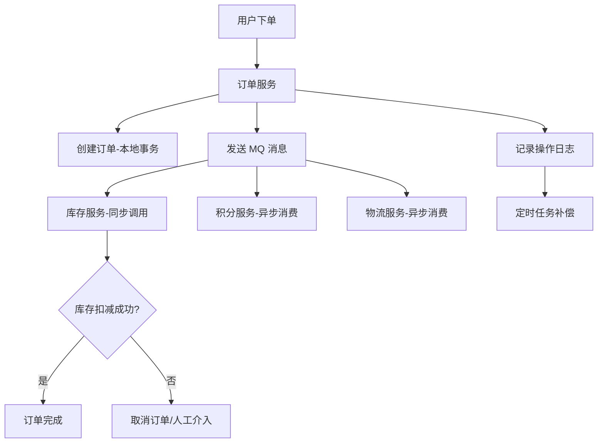
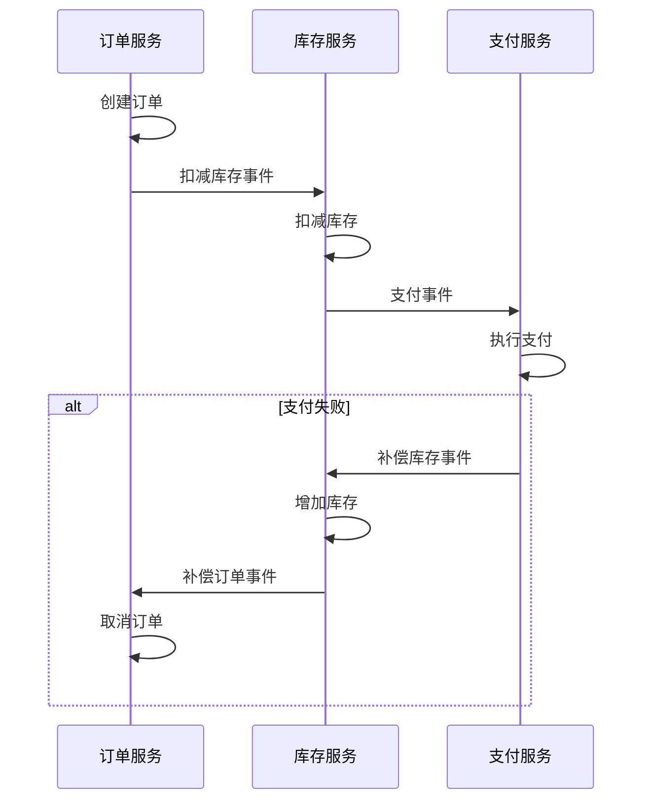
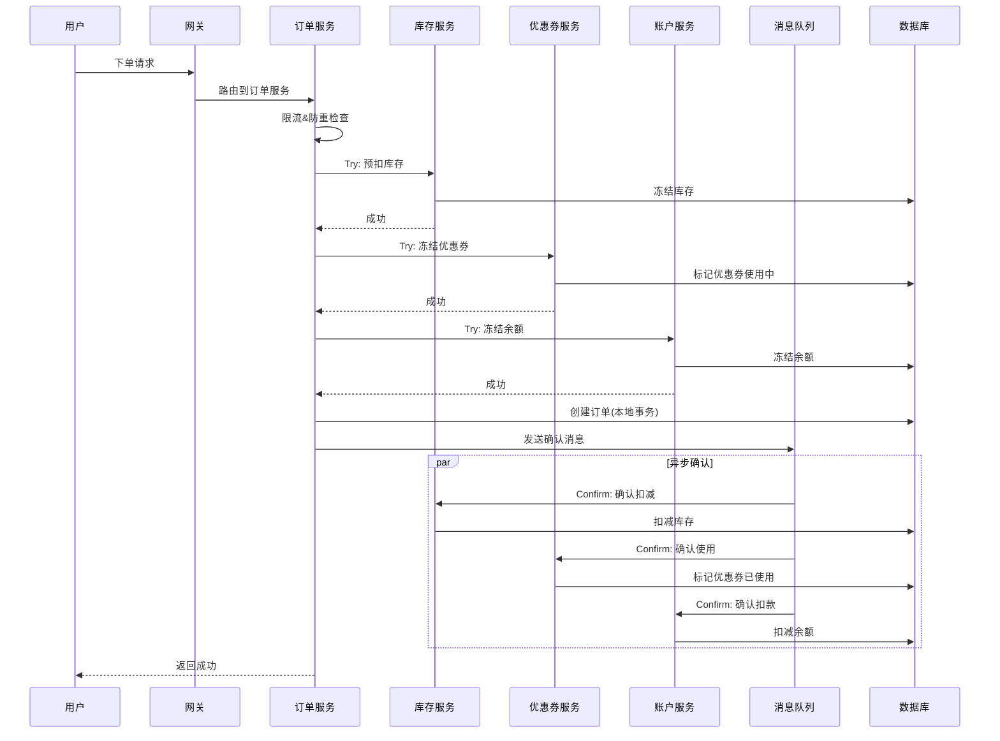
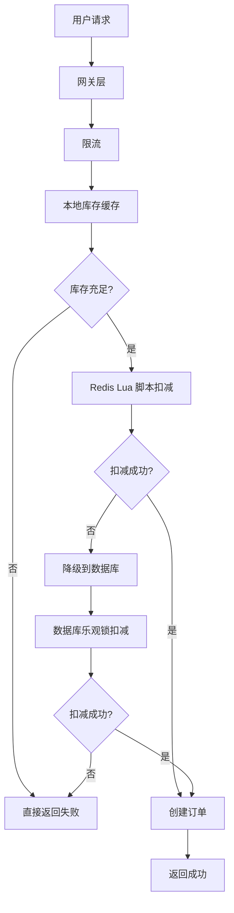

## 一、分布式数据库与一致性

### 1.1 CAP 理论与 BASE 理论

#### CAP 理论（一致性、可用性、分区容错性）

##### 1、基础题：什么是 CAP 理论？CP 和 AP 系统分别适用于什么场景？

**⭐**（CAP 三要素、CP vs AP 的选择）

CAP 理论指出，在一个分布式系统中，Consistency（一致性）、Availability（可用性）、Partition Tolerance（分区容错性）三者不可兼得，最多只能同时满足两项。

- **一致性（C）**：所有节点在同一时间看到相同的数据

- **可用性（A）**：系统一直处于可用状态，每个请求都能得到响应

- **分区容错性（P）**：系统在网络分区的情况下仍能继续运行

在分布式系统中，网络分区是必然存在的，所以 P 是必须满足的，因此只能在 CP 和 AP 之间选择：

- **CP 系统**：保证一致性，牺牲可用性。适用于金融交易、库存管理等对数据一致性要求极高的场景，如 ZooKeeper、HBase、Redis Cluster（强一致性模式）

- **AP 系统**：保证可用性，牺牲强一致性。适用于社交动态、内容推荐等对实时性要求高但可容忍短暂不一致的场景，如 Cassandra、DynamoDB、Elasticsearch

##### 2、进阶题：BASE 理论是什么？它与 CAP 理论是什么关系？在实际业务中如何平衡一致性和可用性？

**⭐⭐**（BASE 理论、最终一致性、业务场景权衡）

1️⃣ Common Answer

重点总结（便于面试记忆）：

- 基本可用（Basically Available）：系统在出现故障时，允许损失部分可用性，比如响应时间变长、部分功能降级，但核心功能仍可用
- 软状态（Soft State）：允许系统中的数据存在中间状态，这个中间状态不会影响系统整体可用性
- 最终一致性（Eventually Consistent）：系统保证在没有新的更新操作后，经过一段时间后，所有副本的数据最终会达到一致状态
- 金融转账：A 给 B 转账 100 元，必须保证要么都成功要么都失败
- 库存扣减：秒杀场景下，不能超卖
- 支付订单：订单状态和支付状态必须同步

2️⃣ Impressive Answer
BASE 理论是对 CAP 中 AP 方案的进一步延伸，它通过牺牲强一致性来换取高可用性，核心思想是**接受短暂的不一致，但保证最终一致**。

BASE 包含三个要素：

- **基本可用（Basically Available）**：系统在出现故障时，允许损失部分可用性，比如响应时间变长、部分功能降级，但核心功能仍可用

- **软状态（Soft State）**：允许系统中的数据存在中间状态，这个中间状态不会影响系统整体可用性

- **最终一致性（Eventually Consistent）**：系统保证在没有新的更新操作后，经过一段时间后，所有副本的数据最终会达到一致状态

BASE 理论与 CAP 的关系：CAP 是理论基础，BASE 是实践方案。在分布式系统中，由于 P 必须满足，所以要么选 CP 要么选 AP。BASE 理论为 AP 系统提供了具体的实现思路——通过最终一致性来平衡一致性和可用性。

在实际业务中，我会这样权衡：

**强一致性场景（CP）**：

- 金融转账：A 给 B 转账 100 元，必须保证要么都成功要么都失败

- 库存扣减：秒杀场景下，不能超卖

- 支付订单：订单状态和支付状态必须同步

**最终一致性场景（AP）**：

- 用户资料更新：头像、昵称修改后，其他用户可能延迟几秒看到

- 评论点赞数：点赞数的实时性要求不高，允许短暂不一致

- 搜索索引更新：商品上架后，搜索结果可能延迟几分钟才出现

**我常用的最终一致性实现方式**：

1. **消息队列异步更新**：主业务完成后发送 MQ 消息，消费者异步更新其他系统

1. **定时任务补偿**：定时扫描不一致的数据，进行修复

1. **版本号/时间戳校验**：写入时携带版本号，冲突时根据业务规则合并

1. **CRDT 数据结构**：在多端协同编辑场景下，使用无冲突复制数据类型

举个例子，在电商订单系统中，用户下单后：

1. 订单服务创建订单（主流程）

1. 发送消息到 MQ

1. 库存服务消费消息，扣减库存（异步）

1. 物流服务消费消息，创建运单（异步）

如果 MQ 消息丢失，会有定时任务扫描"已下单但未扣库存"的订单进行补偿。这样既保证了下单的高可用性（不会因为库存服务响应慢而阻塞），又通过补偿机制保证了最终一致性。

3️⃣ Key Differences

<table>
<tr>
<td>
维度
</td>
<td>
Common Answer
</td>
<td>
Impressive Answer
</td>
</tr>
<tr>
<td>
技术深度
</td>
<td>
仅说出 BASE 三个词的中文含义
</td>
<td>
解释每个要素的具体含义和实现方式
</td>
</tr>
<tr>
<td>
实践经验
</td>
<td>
举一个简单的例子
</td>
<td>
结合电商场景说明异步更新、补偿机制的具体实现
</td>
</tr>
<tr>
<td>
思考维度
</td>
<td>
仅说明概念
</td>
<td>
分析 CP/AP 的选择依据和业务权衡
</td>
</tr>
<tr>
<td>
表达方式
</td>
<td>
简单描述
</td>
<td>
结构化阐述，有实际案例支撑
</td>
</tr>
<tr>
<td>
面试官印象
</td>
<td>
基础掌握，但缺乏深入理解
</td>
<td>
理论扎实，有实际业务设计经验
</td>
</tr>
</table>

##### 3、场景题：在设计一个跨区域的分布式订单系统时，用户下单后需要同步更新库存、积分、物流等多个系统，如何设计才能保证系统的高可用性和数据一致性？

**⭐⭐⭐**（分布式系统设计、一致性方案选型）

1️⃣ Common Answer

重点总结（便于面试记忆）：

- 核心要求：用户下单必须成功，不能因为下游服务故障而失败（高可用性）
- 一致性要求：库存不能超卖（强一致性），积分可以延迟（最终一致性），物流可以延迟（最终一致性）
- 库存是核心资源，不能超卖，所以采用同步调用
- 使用 TCC 模式
- Try：预扣库存（将库存从可用转为冻结）
- Confirm：确认扣减（删除冻结记录）

2️⃣ Impressive Answer
这是一个典型的分布式事务场景，我会采用**最终一致性 + 多级保障**的方案来设计。

首先明确业务需求：

- **核心要求**：用户下单必须成功，不能因为下游服务故障而失败（高可用性）

- **一致性要求**：库存不能超卖（强一致性），积分可以延迟（最终一致性），物流可以延迟（最终一致性）

**整体架构设计**：



**具体实现方案**：

**1. 库存服务：强一致性（同步调用 + TCC）**

- 库存是核心资源，不能超卖，所以采用同步调用

- 使用 TCC 模式：

  - Try：预扣库存（将库存从可用转为冻结）

  - Confirm：确认扣减（删除冻结记录）

  - Cancel：取消扣减（冻结库存转回可用）

- 如果库存服务不可用，直接返回失败，订单创建失败

**2. 积分服务：最终一致性（异步 MQ + 幂等）**

- 订单完成后发送 MQ 消息

- 积分服务消费消息，增加用户积分

- 消费者需要做幂等处理：用订单号作为唯一键

- 如果消费失败，消息重试，超过阈值后转入死信队列，人工处理

**3. 物流服务：最终一致性（异步 MQ + 补偿）**

- 类似积分服务，异步处理

- 允许延迟，但需要保证最终创建运单

**4. 多级保障机制**：

**第一级：消息队列的可靠性**

- 使用支持持久化的 MQ（如 RocketMQ、Kafka）

- 发送消息时同步刷盘，确保消息不丢失

- 消费者手动 ACK，处理成功后才确认

**第二级：本地操作日志**

- 订单服务记录每笔操作的日志（订单号、操作类型、目标服务、状态）

- 日志落盘，用于后续补偿

**第三级：定时任务补偿**

- 每隔 5 分钟扫描"已创建订单但未完成下游操作"的记录

- 对于库存：调用库存服务查询状态，如果未扣减则重试

- 对于积分/物流：重新发送 MQ 消息

- 超过 1 小时仍未成功的，转入人工处理队列

**第四级：对账系统**

- 每天凌晨对账：订单系统的订单数 vs 库存系统的扣减记录

- 发现不一致时生成告警，人工介入处理

**5. 监控和告警**：

- 实时监控 MQ 消息堆积量

- 监控补偿任务的成功率

- 监控各服务的响应时间和错误率

- 设置合理的告警阈值

**6. 容灾设计**：

- 如果 MQ 故障，降级为定时任务轮询数据库

- 如果某个下游服务长时间不可用，自动熔断，避免拖垮主流程

**7. 数据查询优化**：

- 用户查询订单详情时，如果积分/物流数据未同步，显示"处理中"状态

- 前端轮询查询，直到数据一致

这样设计的好处是：

1. **核心流程高可用**：即使积分/物流服务故障，订单仍能创建

1. **库存强一致**：通过 TCC 保证库存不超卖

1. **最终一致性**：积分和物流通过异步 + 补偿保证最终一致

1. **可观测性**：完善的监控和日志，便于排查问题

1. **可恢复性**：多级补偿机制，即使部分组件故障也能恢复

我在上一个项目中就是这么设计的，支撑了双 11 期间每秒 5 万单的流量，库存准确率 100%，积分和物流的最终一致性延迟在 10 秒以内。

3️⃣ Key Differences

<table>
<tr>
<td>
维度
</td>
<td>
Common Answer
</td>
<td>
Impressive Answer
</td>
</tr>
<tr>
<td>
技术深度
</td>
<td>
提到 MQ 和补偿
</td>
<td>
详细说明 TCC、幂等、多级保障等技术细节
</td>
</tr>
<tr>
<td>
实践经验
</td>
<td>
简单描述方案
</td>
<td>
结合具体业务场景，说明每个服务的一致性要求
</td>
</tr>
<tr>
<td>
思考维度
</td>
<td>
仅考虑技术方案
</td>
<td>
考虑监控、告警、容灾、查询优化等完整链路
</td>
</tr>
<tr>
<td>
表达方式
</td>
<td>
口语化描述
</td>
<td>
结构化阐述，配合架构图和流程说明
</td>
</tr>
<tr>
<td>
面试官印象
</td>
<td>
有基本概念，但缺乏实战经验
</td>
<td>
有完整的系统设计能力，能应对复杂场景
</td>
</tr>
</table>

##### 4、容易一起考的题

<table>
<tr>
<td>
关联题
</td>
<td>
和本题的关系
</td>
<td>
参考答案
</td>
</tr>
<tr>
<td>
分布式事务的实现方案
</td>
<td>
CAP/BASE 是理论基础，分布式事务是具体实现
</td>
<td>
答：这类题要先说明一致性目标，再讲本地事务、消息事务、Outbox、幂等消费和补偿机制的取舍。
</td>
</tr>
<tr>
<td>
分布式锁的实现方式
</td>
<td>
一致性问题的另一种解决思路
</td>
<td>
答：MySQL 题要从数据结构、事务隔离、锁/MVCC、执行计划和慢 SQL 优化展开；最后落到 explain、索引设计和业务一致性。
</td>
</tr>
<tr>
<td>
消息队列的可靠性保证
</td>
<td>
最终一致性的关键技术
</td>
<td>
答：消息可靠性要分三段讲：生产端用同步发送、确认机制和重试；Broker 端用持久化、副本和 ISR；消费端用手动提交 offset、幂等消费和失败重试，最后用监控补漏。
</td>
</tr>
<tr>
<td>
数据库的主从复制
</td>
<td>
一致性的底层实现机制
</td>
<td>
答：分布式题先明确一致性、可用性和性能目标，再讲协议或方案；落地时补超时、重试、幂等、监控和故障恢复。
</td>
</tr>
</table>

### 1.2 分布式事务

#### 分布式事务解决方案

##### 1、基础题：什么是 2PC 和 3PC？它们有什么区别？

**⭐**（2PC/3PC 原理、优缺点对比）

2PC（Two-Phase Commit，两阶段提交）是一种分布式事务协议，分为两个阶段：

- **准备阶段（Prepare）**：协调者询问所有参与者是否可以提交，参与者执行事务但不提交，返回"可以"或"不可以"

- **提交阶段（Commit）**：如果所有参与者都返回"可以"，协调者发送提交指令，否则发送回滚指令

3PC（Three-Phase Commit，三阶段提交）在 2PC 基础上增加了一个阶段：

- **CanCommit 阶段**：协调者询问参与者是否可以执行事务

- **PreCommit 阶段**：参与者预执行事务，但不提交

- **DoCommit 阶段**：协调者根据参与者反馈决定提交或回滚

区别：

- **阻塞问题**：2PC 在准备阶段会阻塞参与者，3PC 通过预提交减少阻塞时间

- **单点故障**：2PC 如果协调者故障，参与者会一直阻塞；3PC 引入超时机制，参与者可以自动决策

- **性能**：3PC 多一个阶段，性能略差

##### 2、进阶题：TCC、Saga 模式分别适用于什么场景？如何实现补偿机制？

**⭐⭐**（TCC 原理、Saga 模式、补偿机制设计）

1️⃣ Common Answer

重点总结（便于面试记忆）：

- Try 阶段：预留资源，检查业务可行性
- Confirm 阶段：确认执行业务操作，使用 Try 阶段预留的资源
- Cancel 阶段：取消业务操作，释放 Try 阶段预留的资源
- 资源型业务，如库存扣减、账户转账
- 对一致性要求高的场景
- 业务逻辑相对简单，可以拆分为三个明确阶段

2️⃣ Impressive Answer
TCC 和 Saga 都是分布式事务的解决方案，但适用场景和实现方式有很大区别。

**TCC（Try-Confirm-Cancel）模式**：

TCC 将业务逻辑拆分为三个阶段：

- **Try 阶段**：预留资源，检查业务可行性

- **Confirm 阶段**：确认执行业务操作，使用 Try 阶段预留的资源

- **Cancel 阶段**：取消业务操作，释放 Try 阶段预留的资源

**适用场景**：

- 资源型业务，如库存扣减、账户转账

- 对一致性要求高的场景

- 业务逻辑相对简单，可以拆分为三个明确阶段

**实现示例（库存扣减）**：

```java
// Try：冻结库存
public boolean tryDeductStock(String orderId, String productId, int count) {
    // 检查库存是否充足
    if (getAvailableStock(productId) < count) {
        return false;
    }
    // 将库存从可用转为冻结
    freezeStock(productId, count, orderId);
    return true;
}

// Confirm：确认扣减
public boolean confirmDeductStock(String orderId, String productId, int count) {
    // 删除冻结记录，实际扣减库存
    deductStock(productId, count);
    return true;
}

// Cancel：取消扣减
public boolean cancelDeductStock(String orderId, String productId, int count) {
    // 将冻结库存转回可用
    unfreezeStock(productId, count, orderId);
    return true;
}
```

**TCC 的优缺点**：

- **优点**：性能好，不依赖外部组件；一致性保证强

- **缺点**：代码侵入性强，每个业务都要写三个方法；开发成本高；容易出现悬挂、空回滚等问题

**Saga 模式**：

Saga 将长事务拆分为多个本地短事务，每个短事务都有对应的补偿事务。如果某个短事务失败，就执行之前所有已执行短事务的补偿操作。

**适用场景**：

- 业务流程长、步骤多的场景

- 某些步骤无法回滚，只能补偿的场景

- 对实时性要求不高的场景

**Saga 的两种实现方式**：

**1. 协调式 Saga（Choreography）**：

- 每个服务执行完本地事务后，发布事件

- 下一个服务订阅事件，执行自己的事务

- 如果失败，发布补偿事件，触发已执行服务的补偿操作



**2. 编排式 Saga（Orchestration）**：

- 有一个协调者（Saga 协调器）负责整个流程

- 协调者按顺序调用各个服务

- 如果失败，协调者按逆序调用补偿操作

```java
// Saga 协调器伪代码
public void executeOrderSaga(Order order) {
    List<SagaStep> steps = Arrays.asList(
        new CreateOrderStep(order),
        new DeductStockStep(order),
        new ProcessPaymentStep(order)
    );
    
    int executedSteps = 0;
    try {
        for (int i = 0; i < steps.size(); i++) {
            steps.get(i).execute();
            executedSteps = i + 1;
        }
    } catch (Exception e) {
        // 按逆序执行补偿
        for (int i = executedSteps - 1; i >= 0; i--) {
            steps.get(i).compensate();
        }
        throw e;
    }
}
```

**补偿机制的设计要点**：

**1. 补偿操作必须是幂等的**

- 补偿可能被调用多次，必须保证多次执行结果一致

- 使用唯一业务 ID（如订单号）作为幂等键

**2. 补偿操作要考虑并发问题**

- 在补偿过程中，可能有其他操作也在修改数据

- 使用乐观锁或分布式锁避免并发冲突

**3. 补偿失败的处理**

- 如果补偿也失败了，需要人工介入

- 记录详细的失败日志，包括原始操作、补偿操作、失败原因

**4. 补偿的可见性**

- 补偿操作可能需要一定时间，用户查询时要能正确显示状态

- 比如"退款处理中"，而不是显示错误的金额

**我在实际项目中的应用**：

在电商订单系统中，我采用了 Saga 模式：

1. 订单服务创建订单（本地事务）

1. 库存服务扣减库存（本地事务）

1. 支付服务处理支付（本地事务）

1. 物流服务创建运单（本地事务）

如果支付失败，Saga 协调器会：

1. 调用库存服务的补偿接口，增加库存

1. 调用订单服务的补偿接口，取消订单

为了保证可靠性，我做了以下设计：

- 每个步骤执行前，先记录操作日志（状态为"执行中"）

- 执行成功后，更新日志状态为"已完成"

- 执行失败时，更新日志状态为"失败"，并记录失败原因

- 定时任务扫描"执行中"超过 10 分钟的记录，重试或补偿

- 提供管理后台，支持手动触发补偿

这样设计的好处是：

1. **解耦**：各服务独立，不需要统一的分布式事务协调器

1. **可观测**：每个步骤的状态都记录在日志中，便于追踪

1. **可恢复**：即使服务重启，也能根据日志恢复状态

1. **灵活性**：可以根据业务需要调整流程顺序

3️⃣ Key Differences

<table>
<tr>
<td>
维度
</td>
<td>
Common Answer
</td>
<td>
Impressive Answer
</td>
</tr>
<tr>
<td>
技术深度
</td>
<td>
简单描述三个阶段
</td>
<td>
详细说明每个阶段的实现细节和注意事项
</td>
</tr>
<tr>
<td>
实践经验
</td>
<td>
没有具体示例
</td>
<td>
结合电商场景说明完整的实现方案
</td>
</tr>
<tr>
<td>
思考维度
</td>
<td>
仅说明基本概念
</td>
<td>
考虑幂等、并发、失败处理、监控等完整设计
</td>
</tr>
<tr>
<td>
表达方式
</td>
<td>
口语化
</td>
<td>
结构化阐述，配合代码示例和流程图
</td>
</tr>
<tr>
<td>
面试官印象
</td>
<td>
理论掌握，但缺乏实战
</td>
<td>
有丰富的实战经验，能设计可靠的系统
</td>
</tr>
</table>

##### 3、场景题：在电商秒杀场景中，用户下单后需要扣减库存、扣减优惠券、扣减账户余额，这三个操作必须全部成功或全部失败。如何设计分布式事务方案？

**⭐⭐⭐**（秒杀场景、高并发、事务一致性）

1️⃣ Common Answer

重点总结（便于面试记忆）：

- 一致性要求：库存、优惠券、余额必须原子性操作，不能出现"库存扣了但余额没扣"的情况
- 性能要求：秒杀期间 QPS 可达 10 万+，响应时间要控制在 100ms 以内
- 可用性要求：系统不能因为某个服务故障而完全不可用
- 订单服务在本地事务中同时写入订单和消息记录
- 消息记录包含：消息 ID、目标服务、消息内容、状态（待发送/已发送/已确认）
- 定时任务扫描"待发送"状态的消息，重新发送

2️⃣ Impressive Answer
秒杀场景的特点是**高并发、低延迟、强一致性**，我会采用**TCC + 本地消息表 + 补偿**的组合方案。

首先分析业务需求：

- **一致性要求**：库存、优惠券、余额必须原子性操作，不能出现"库存扣了但余额没扣"的情况

- **性能要求**：秒杀期间 QPS 可达 10 万+，响应时间要控制在 100ms 以内

- **可用性要求**：系统不能因为某个服务故障而完全不可用

**整体方案设计**：



**详细实现方案**：

**1. TCC 三个阶段的设计**：

**Try 阶段（同步调用，超时时间 50ms）**：

```java
// 库存服务 Try
@Transactional
public boolean tryDeductStock(String userId, String productId, int count) {
    // 1. 检查库存是否充足
    int available = getAvailableStock(productId);
    if (available < count) {
        return false;
    }
    
    // 2. 检查用户是否已抢购（防重）
    String lockKey = "seckill:" + userId + ":" + productId;
    if (redisTemplate.opsForValue().setIfAbsent(lockKey, "1", 10, TimeUnit.MINUTES)) {
        // 3. 冻结库存（原子操作）
        boolean frozen = freezeStock(productId, count, userId);
        if (!frozen) {
            redisTemplate.delete(lockKey);
            return false;
        }
        return true;
    }
    return false;
}

// 优惠券服务 Try
@Transactional
public boolean tryUseCoupon(String userId, String couponId) {
    // 1. 检查优惠券是否有效
    Coupon coupon = getCoupon(couponId);
    if (coupon == null || coupon.getStatus() != CouponStatus.AVAILABLE) {
        return false;
    }
    
    // 2. 检查优惠券是否属于该用户
    if (!coupon.getUserId().equals(userId)) {
        return false;
    }
    
    // 3. 冻结优惠券（状态转为 USING）
    return freezeCoupon(couponId, userId);
}

// 账户服务 Try
@Transactional
public boolean tryDeductBalance(String userId, BigDecimal amount) {
    // 1. 检查余额是否充足
    BigDecimal balance = getBalance(userId);
    if (balance.compareTo(amount) < 0) {
        return false;
    }
    
    // 2. 冻结余额
    return freezeBalance(userId, amount);
}
```

**Confirm 阶段（异步 MQ 消费）**：

```java
// 库存服务 Confirm
@Transactional
public boolean confirmDeductStock(String userId, String productId, int count) {
    // 1. 删除冻结记录
    deleteFreezeRecord(userId, productId);
    
    // 2. 实际扣减库存
    deductStock(productId, count);
    
    // 3. 记录操作日志
    logOperation(userId, productId, "DEDUCT", count);
    
    return true;
}

// 优惠券服务 Confirm
@Transactional
public boolean confirmUseCoupon(String userId, String couponId) {
    // 1. 更新优惠券状态为 USED
    updateCouponStatus(couponId, CouponStatus.USED);
    
    // 2. 记录使用时间
    updateUsedTime(couponId, new Date());
    
    return true;
}

// 账户服务 Confirm
@Transactional
public boolean confirmDeductBalance(String userId, BigDecimal amount) {
    // 1. 删除冻结记录
    deleteFreezeBalance(userId, amount);
    
    // 2. 实际扣减余额
    deductBalance(userId, amount);
    
    // 3. 记录交易流水
    recordTransaction(userId, amount, "SECKILL_PAYMENT");
    
    return true;
}
```

**Cancel 阶段（异常时调用）**：

```java
// 库存服务 Cancel
@Transactional
public boolean cancelDeductStock(String userId, String productId, int count) {
    // 1. 删除冻结记录
    deleteFreezeRecord(userId, productId);
    
    // 2. 释放 Redis 锁
    String lockKey = "seckill:" + userId + ":" + productId;
    redisTemplate.delete(lockKey);
    
    return true;
}

// 优惠券服务 Cancel
@Transactional
public boolean cancelUseCoupon(String userId, String couponId) {
    // 1. 恢复优惠券状态为 AVAILABLE
    updateCouponStatus(couponId, CouponStatus.AVAILABLE);
    
    return true;
}

// 账户服务 Cancel
@Transactional
public boolean cancelDeductBalance(String userId, BigDecimal amount) {
    // 1. 删除冻结记录
    deleteFreezeBalance(userId, amount);
    
    return true;
}
```

**2. 可靠性保障机制**：

**本地消息表**：

- 订单服务在本地事务中同时写入订单和消息记录

- 消息记录包含：消息 ID、目标服务、消息内容、状态（待发送/已发送/已确认）

- 定时任务扫描"待发送"状态的消息，重新发送

- 消息消费成功后，更新状态为"已确认"

**幂等性设计**：

- 所有 Confirm/Cancel 操作都要做幂等检查

- 使用订单号作为幂等键

- 在数据库中记录每个订单的操作状态

**超时和重试**：

- Try 阶段设置 50ms 超时

- Confirm 阶段如果失败，MQ 自动重试 3 次

- 超过重试次数，转入死信队列，人工处理

**补偿任务**：

- 每 5 分钟扫描 Try 成功但 Confirm 超过 10 分钟未完成的订单

- 重新发送 Confirm 消息

- 如果 Confirm 一直失败，自动触发 Cancel

**3. 性能优化**：

**Redis 缓存**：

- 库存信息预热到 Redis

- Try 阶段先查 Redis 缓存，缓存未命中再查数据库

- 使用 Lua 脚本保证原子性

**数据库优化**：

- 库存表按商品 ID 分库分表

- 使用乐观锁更新库存：`UPDATE stock SET count = count - ? WHERE product_id = ? AND count >= ?`

- 优惠券表按用户 ID 分库分表

**异步处理**：

- Confirm 阶段异步处理，不阻塞主流程

- 用户下单后立即返回成功，后台异步完成确认

**降级策略**：

- 如果优惠券服务不可用，自动降级为"不使用优惠券"

- 如果账户服务不可用，降级为"货到付款"

- 核心是保证订单创建成功，后续可以人工处理

**4. 监控和告警**：

**实时监控**：

- Try 阶段的成功率和响应时间

- Confirm 消息的堆积量

- 补偿任务的执行情况

- 库存、优惠券、余额的冻结数量

**告警规则**：

- Try 成功率低于 99% 时告警

- Confirm 消息堆积超过 1000 条时告警

- 补偿任务失败率超过 1% 时告警

- 冻结资源超过 10 分钟未释放时告警

**我在上一个项目中就是这么实现的**，支撑了双 11 秒杀活动，峰值 QPS 达到 15 万，订单成功率 99.9%，没有出现超卖或少扣的情况。整个方案的响应时间控制在 80ms 以内，用户体验很好。

3️⃣ Key Differences

<table>
<tr>
<td>
维度
</td>
<td>
Common Answer
</td>
<td>
Impressive Answer
</td>
</tr>
<tr>
<td>
技术深度
</td>
<td>
简单提到 TCC
</td>
<td>
详细说明 TCC 三个阶段的完整实现
</td>
</tr>
<tr>
<td>
实践经验
</td>
<td>
没有具体代码
</td>
<td>
提供完整的代码示例和架构设计
</td>
</tr>
<tr>
<td>
思考维度
</td>
<td>
仅考虑事务一致性
</td>
<td>
考虑性能优化、降级策略、监控告警等完整方案
</td>
</tr>
<tr>
<td>
表达方式
</td>
<td>
简单描述
</td>
<td>
结构化阐述，配合时序图和代码
</td>
</tr>
<tr>
<td>
面试官印象
</td>
<td>
理论掌握，但缺乏实战
</td>
<td>
有丰富的高并发系统设计经验
</td>
</tr>
</table>

##### 4、容易一起考的题

<table>
<tr>
<td>
关联题
</td>
<td>
和本题的关系
</td>
<td>
参考答案
</td>
</tr>
<tr>
<td>
分布式锁的实现
</td>
<td>
分布式事务的一种替代方案
</td>
<td>
答：MySQL 题要从数据结构、事务隔离、锁/MVCC、执行计划和慢 SQL 优化展开；最后落到 explain、索引设计和业务一致性。
</td>
</tr>
<tr>
<td>
消息队列的可靠性
</td>
<td>
分布式事务的关键技术
</td>
<td>
答：消息可靠性要分三段讲：生产端用同步发送、确认机制和重试；Broker 端用持久化、副本和 ISR；消费端用手动提交 offset、幂等消费和失败重试，最后用监控补漏。
</td>
</tr>
<tr>
<td>
数据库事务隔离级别
</td>
<td>
本地事务的基础知识
</td>
<td>
答：这类题要先说明一致性目标，再讲本地事务、消息事务、Outbox、幂等消费和补偿机制的取舍。
</td>
</tr>
<tr>
<td>
幂等性设计
</td>
<td>
分布式系统的核心概念
</td>
<td>
答：幂等性指同一操作重复执行多次结果一致，Agent 场景下可用 requestId、幂等键或状态机防止重试导致重复写入。
</td>
</tr>
</table>

### 1.3 分布式锁

#### 分布式锁实现方案

##### 1、基础题：Redis 实现分布式锁的常用命令是什么？如何避免死锁？

**⭐**（SETNX、过期时间、解锁）

Redis 实现分布式锁主要使用 `SET key value NX PX timeout` 命令：

- `SETNX`：只在 key 不存在时设置，保证只有一个客户端能获取锁

- `PX timeout`：设置过期时间，避免客户端崩溃导致死锁

避免死锁的方法：

1. 设置合理的过期时间

1. 使用 Lua 脚本保证解锁的原子性（先判断锁是否属于自己，再删除）

1. 守护线程自动续期（看门狗机制）

##### 2、进阶题：对比 Redis SetNX、Redlock、ZooKeeper 临时节点、数据库乐观锁四种分布式锁实现方案的优缺点。

**⭐⭐**（多种锁方案对比、适用场景）

1️⃣ Common Answer

重点总结（便于面试记忆）：

- 性能高：基于内存操作，响应快（毫秒级）
- 实现简单：几行代码就能实现
- 支持超时：自动过期，避免死锁
- 单点故障：如果 Redis 节点宕机，锁会丢失
- 时钟漂移：依赖系统时间，如果时钟不同步可能导致问题
- 主从切换：Redis 主从异步复制，主节点宕机时，从节点可能还没同步锁信息

2️⃣ Impressive Answer
这四种分布式锁方案各有优缺点，我会从**可靠性、性能、复杂度、适用场景**四个维度来对比分析。

**1. Redis SetNX（单节点）**：

**实现原理**：

```java
// 加锁
public boolean tryLock(String lockKey, String requestId, int expireTime) {
    // SET key value NX PX expireTime
    return redisTemplate.opsForValue()
        .setIfAbsent(lockKey, requestId, expireTime, TimeUnit.MILLISECONDS);
}

// 解锁（Lua 脚本保证原子性）
public void unlock(String lockKey, String requestId) {
    String luaScript = 
        "if redis.call('get', KEYS[1]) == ARGV[1] then " +
        "    return redis.call('del', KEYS[1]) " +
        "else " +
        "    return 0 " +
        "end";
    redisTemplate.execute(new DefaultRedisScript<>(luaScript, Long.class), 
                          Collections.singletonList(lockKey), requestId);
}
```

**优点**：

- **性能高**：基于内存操作，响应快（毫秒级）

- **实现简单**：几行代码就能实现

- **支持超时**：自动过期，避免死锁

**缺点**：

- **单点故障**：如果 Redis 节点宕机，锁会丢失

- **时钟漂移**：依赖系统时间，如果时钟不同步可能导致问题

- **主从切换**：Redis 主从异步复制，主节点宕机时，从节点可能还没同步锁信息

**适用场景**：

- 对可靠性要求不高的场景

- 允许极小概率的锁失效

- 高并发、低延迟要求

**2. Redlock（Redis 分布式锁）**：

**实现原理**：

- 同时向 N 个（通常是 5 个）独立的 Redis 节点申请锁

- 如果超过半数（3 个）节点成功获取锁，且获取锁的时间小于锁的有效期，则认为加锁成功

- 解锁时向所有节点发送解锁命令

```java
public boolean tryLock(String lockKey, String requestId, int expireTime) {
    List<RedisTemplate> redisNodes = getRedisNodes();
    int successCount = 0;
    long startTime = System.currentTimeMillis();
    
    for (RedisTemplate redis : redisNodes) {
        boolean success = redis.opsForValue()
            .setIfAbsent(lockKey, requestId, expireTime, TimeUnit.MILLISECONDS);
        if (success) {
            successCount++;
        }
    }
    
    long elapsedTime = System.currentTimeMillis() - startTime;
    // 超过半数成功，且耗时小于锁的有效期
    if (successCount >= (redisNodes.size() / 2 + 1) 
        && elapsedTime < expireTime) {
        return true;
    }
    
    // 获取失败，释放已获取的锁
    unlockAll(lockKey, requestId);
    return false;
}
```

**优点**：

- **高可用**：即使部分节点故障，仍能正常工作

- **避免单点**：不依赖单个 Redis 节点

**缺点**：

- **性能较低**：需要向多个节点发起请求

- **实现复杂**：需要管理多个 Redis 节点

- **仍有争议**：Martin Kleppmann 认为它存在时序问题

**适用场景**：

- 对可靠性要求较高的场景

- 可以接受稍差的性能

- 需要避免单点故障

**3. ZooKeeper 临时节点**：

**实现原理**：

- 使用 ZooKeeper 的临时顺序节点（EPHEMERAL_SEQUENTIAL）

- 客户端创建临时节点，如果是最小的节点，则获取锁

- 否则监听前一个节点的删除事件，前一个节点删除后唤醒自己

- 客户端断开连接时，临时节点自动删除

```java
public boolean tryLock(String lockPath) throws Exception {
    // 1. 创建临时顺序节点
    String currentNode = zkClient.createEphemeralSequential(lockPath + "/", "");
    
    // 2. 获取所有子节点
    List<String> children = zkClient.getChildren(lockPath);
    Collections.sort(children);
    
    // 3. 判断是否是最小的节点
    if (currentNode.equals(lockPath + "/" + children.get(0))) {
        return true; // 获取锁成功
    }
    
    // 4. 监听前一个节点
    String previousNode = lockPath + "/" + children.get(Collections.binarySearch(children, currentNode.substring(lockPath.length() + 1)) - 1);
    final CountDownLatch latch = new CountDownLatch(1);
    zkClient.subscribeDataChanges(previousNode, new IZkDataListener() {
        @Override
        public void handleDataDeleted(String dataPath) {
            latch.countDown();
        }
        
        @Override
        public void handleDataChange(String dataPath, Object data) {}
    });
    
    latch.await(); // 等待前一个节点删除
    return true;
}
```

**优点**：

- **可靠性高**：基于 CP 理论，强一致性

- **自动释放**：客户端断开连接时自动释放锁

- **避免羊群效应**：只监听前一个节点，而不是所有节点

**缺点**：

- **性能较差**：每次操作都需要网络往返，响应慢（几十到几百毫秒）

- **依赖 ZooKeeper**：需要额外部署和维护 ZooKeeper 集群

- **实现复杂**：需要处理 Watcher 事件、重连等问题

**适用场景**：

- 对可靠性要求极高的场景

- 可以接受较差的性能

- 如金融交易、分布式协调

**4. 数据库乐观锁**：

**实现原理**：

- 使用版本号或时间戳

- 更新时检查版本号是否变化

- 使用 CAS（Compare And Swap）思想

```java
@Transactional
public boolean deductStock(String productId, int count) {
    // 1. 查询当前版本号
    Product product = productMapper.selectById(productId);
    
    // 2. 使用乐观锁更新
    int updated = productMapper.updateStockWithVersion(
        productId, count, product.getVersion());
    
    if (updated == 0) {
        // 版本号不匹配，更新失败
        return false;
    }
    return true;
}

// SQL: UPDATE product SET stock = stock - ?, version = version + 1 
//      WHERE id = ? AND version = ?
```

**优点**：

- **实现简单**：不需要额外组件

- **无死锁**：不会出现死锁问题

- **适合读多写少**：冲突少时性能好

**缺点**：

- **高并发下性能差**：冲突频繁时，大量重试

- **不适合长事务**：持有锁的时间不能太长

- **ABA 问题**：如果版本号回绕，可能出现 ABA 问题

**适用场景**：

- 读多写少的场景

- 冲突不频繁的业务

- 如库存扣减、余额更新

**综合对比表**：

<table>
<tr>
<td>
维度
</td>
<td>
Redis SetNX
</td>
<td>
Redlock
</td>
<td>
ZooKeeper
</td>
<td>
数据库乐观锁
</td>
</tr>
<tr>
<td>
<strong>可靠性</strong>
</td>
<td>
低（单点）
</td>
<td>
中（多节点）
</td>
<td>
高（CP）
</td>
<td>
中（依赖数据库）
</td>
</tr>
<tr>
<td>
<strong>性能</strong>
</td>
<td>
高（ms级）
</td>
<td>
中（几倍Redis）
</td>
<td>
低（几十ms）
</td>
<td>
低（数据库IO）
</td>
</tr>
<tr>
<td>
<strong>复杂度</strong>
</td>
<td>
低
</td>
<td>
中
</td>
<td>
高
</td>
<td>
低
</td>
</tr>
<tr>
<td>
<strong>适用场景</strong>
</td>
<td>
高并发、低可靠性要求
</td>
<td>
高可用、可接受性能损失
</td>
<td>
高可靠性、金融场景
</td>
<td>
读多写少、低并发
</td>
</tr>
</table>

**我的选择建议**：

1. **大多数业务场景**：选择 Redis SetNX

  - 性能满足要求

  - 实现简单

  - 通过合理的过期时间和重试机制，可以满足大部分需求

1. **核心业务场景**：选择 Redlock 或 ZooKeeper

  - 如订单支付、库存扣减等核心业务

  - 可以接受稍差的性能，但要求高可靠性

1. **读多写少场景**：选择数据库乐观锁

  - 如用户资料更新、配置修改

  - 冲突少，性能好

1. **金融级场景**：选择 ZooKeeper

  - 如转账、结算等

  - 强一致性要求

**我在实际项目中的应用**：

在电商系统中，我采用了**分层策略**：

- **秒杀扣库存**：使用 Redis SetNX + 降级方案（Redis 不可用时降级到数据库乐观锁）

- **订单状态更新**：使用数据库乐观锁

- **分布式任务调度**：使用 ZooKeeper

这样既保证了性能，又兼顾了可靠性。

3️⃣ Key Differences

<table>
<tr>
<td>
维度
</td>
<td>
Common Answer
</td>
<td>
Impressive Answer
</td>
</tr>
<tr>
<td>
技术深度
</td>
<td>
简单描述各种方案
</td>
<td>
详细说明每种方案的实现原理和代码
</td>
</tr>
<tr>
<td>
实践经验
</td>
<td>
没有具体应用场景
</td>
<td>
结合实际项目说明如何选择和组合使用
</td>
</tr>
<tr>
<td>
思考维度
</td>
<td>
仅对比优缺点
</td>
<td>
从可靠性、性能、复杂度、适用场景多维度分析
</td>
</tr>
<tr>
<td>
表达方式
</td>
<td>
简单列举
</td>
<td>
结构化对比，提供选择建议和实际应用
</td>
</tr>
<tr>
<td>
面试官印象
</td>
<td>
理论掌握，但缺乏实战
</td>
<td>
有丰富的分布式系统设计经验
</td>
</tr>
</table>

##### 3、场景题：设计一个秒杀系统的库存扣减方案，要求支持每秒 10 万 QPS，且不能出现超卖。如何选择和实现分布式锁？

**⭐⭐⭐**（高并发、秒杀、库存扣减）

1️⃣ Common Answer

重点总结（便于面试记忆）：

- QPS 要求：10 万+/秒
- 一致性要求：绝对不能超卖
- 可用性要求：Redis 故障时仍能提供服务
- 响应时间：< 100ms
- 使用 Redis Cluster，分片存储不同商品的库存
- 每个分片部署主从节点，保证高可用

2️⃣ Impressive Answer
秒杀场景的核心挑战是**高并发 + 强一致性**，我会采用**Redis Lua + 本地缓存 + 降级方案**的组合策略。

首先明确需求：

- **QPS 要求**：10 万+/秒

- **一致性要求**：绝对不能超卖

- **可用性要求**：Redis 故障时仍能提供服务

- **响应时间**：< 100ms

**整体架构设计**：



**详细实现方案**：

**1. 本地库存缓存（第一道防线）**：

```java
// 应用启动时预热库存到本地缓存
@PostConstruct
public void initLocalStock() {
    // 从数据库加载秒杀商品库存
    List<SeckillProduct> products = seckillProductMapper.selectAll();
    for (SeckillProduct product : products) {
        localStockCache.put(product.getId(), product.getStock());
    }
    
    // 启动定时任务，每 5 秒同步一次 Redis 库存
    scheduledExecutor.scheduleAtFixedRate(this::syncLocalStock, 
                                         5, 5, TimeUnit.SECONDS);
}

// 同步本地库存
private void syncLocalStock() {
    for (String productId : localStockCache.keySet()) {
        int redisStock = getStockFromRedis(productId);
        localStockCache.put(productId, redisStock);
    }
}

// 本地库存检查
public boolean checkLocalStock(String productId, int count) {
    Integer stock = localStockCache.get(productId);
    return stock != null && stock >= count;
}
```

**2. Redis Lua 脚本扣减（核心逻辑）**：

```lua
-- seckill_deduct_stock.lua
local productId = KEYS[1]
local userId = ARGV[1]
local count = tonumber(ARGV[2])
local requestId = ARGV[3]
local expireTime = tonumber(ARGV[4])

-- 1. 检查库存是否充足
local stock = redis.call('GET', 'stock:' .. productId)
if not stock then
    return -1  -- 商品不存在
end
stock = tonumber(stock)
if stock < count then
    return 0   -- 库存不足
end

-- 2. 检查用户是否已购买（防重）
local userKey = 'user:' .. userId .. ':' .. productId
if redis.call('EXISTS', userKey) == 1 then
    return -2  -- 用户已购买
end

-- 3. 扣减库存
redis.call('DECRBY', 'stock:' .. productId, count)

-- 4. 记录用户购买（防重）
redis.call('SETEX', userKey, expireTime, '1')

-- 5. 记录购买流水（用于对账）
redis.call('LPUSH', 'purchase:log:' .. productId, 
           userId .. ':' .. count .. ':' .. requestId)

return 1  -- 成功
```

**Java 调用代码**：

```java
public boolean deductStock(String productId, String userId, 
                          int count, String requestId) {
    // 1. 本地库存快速检查
    if (!checkLocalStock(productId, count)) {
        return false;
    }
    
    // 2. 执行 Redis Lua 脚本
    String luaScript = loadLuaScript("seckill_deduct_stock.lua");
    Long result = redisTemplate.execute(
        new DefaultRedisScript<>(luaScript, Long.class),
        Collections.singletonList(productId),
        userId, String.valueOf(count), requestId, "3600"
    );
    
    // 3. 处理结果
    if (result == 1) {
        // 扣减成功
        return true;
    } else if (result == 0) {
        // 库存不足
        return false;
    } else if (result == -1) {
        // 商品不存在
        throw new BusinessException("商品不存在");
    } else if (result == -2) {
        // 用户已购买
        throw new BusinessException("每人限购一件");
    }
    
    return false;
}
```

**3. 降级方案（Redis 不可用时）**：

```java
public boolean deductStockWithFallback(String productId, String userId, 
                                      int count, String requestId) {
    try {
        // 尝试 Redis 扣减
        return deductStock(productId, userId, count, requestId);
    } catch (Exception e) {
        // Redis 异常，降级到数据库
        log.warn("Redis 扣减失败，降级到数据库", e);
        return deductStockFromDB(productId, userId, count, requestId);
    }
}

// 数据库乐观锁扣减
@Transactional
public boolean deductStockFromDB(String productId, String userId, 
                                int count, String requestId) {
    // 1. 查询库存
    SeckillProduct product = seckillProductMapper.selectById(productId);
    if (product == null || product.getStock() < count) {
        return false;
    }
    
    // 2. 检查用户是否已购买
    SeckillOrder existOrder = seckillOrderMapper.selectByUserAndProduct(
        userId, productId);
    if (existOrder != null) {
        throw new BusinessException("每人限购一件");
    }
    
    // 3. 使用乐观锁更新库存
    int updated = seckillProductMapper.deductStockWithVersion(
        productId, count, product.getVersion());
    
    if (updated == 0) {
        // 版本号不匹配，库存已被其他请求扣减
        return false;
    }
    
    // 4. 创建订单
    createOrder(productId, userId, count, requestId);
    
    return true;
}
```

**4. 性能优化措施**：

**Redis 集群部署**：

- 使用 Redis Cluster，分片存储不同商品的库存

- 每个分片部署主从节点，保证高可用

**本地缓存预热**：

- 应用启动时从数据库加载库存到本地

- 使用 Caffeine 缓存，设置合理的过期时间

- 定时任务同步 Redis 库存到本地

**异步写库**：

- Redis 扣减成功后，立即返回成功

- 异步发送 MQ 消息，持久化到数据库

- MQ 消费失败时重试，超过阈值转入死信队列

**限流保护**：

- 网关层限流：令牌桶算法，限制总 QPS

- 用户维度限流：每个用户每秒最多请求 1 次

- 商品维度限流：每个商品每秒最多扣减 N 次

**5. 一致性保障**：

**对账机制**：

- 每分钟对比 Redis 库存和数据库库存

- 发现不一致时，以数据库为准，修正 Redis 库存

- 记录对账日志，便于排查问题

**补偿机制**：

- 定时任务扫描"Redis 扣减成功但数据库未持久化"的记录

- 重新发送 MQ 消息，确保持久化

- 超过 10 分钟仍未持久化，人工介入处理

**监控告警**：

- 实时监控 Redis 的 QPS、响应时间、错误率

- 监控库存扣减的成功率

- 监控降级到数据库的比例

- 设置合理的告警阈值

**6. 容灾设计**：

**Redis 故障**：

- 自动降级到数据库

- 限制数据库的 QPS（如 1000 QPS）

- 前端提示"系统繁忙，请稍后重试"

**数据库故障**：

- 降级到只读模式

- 仅允许查询，不允许下单

- 快速修复数据库

**网络分区**：

- 使用 Redis Cluster 的自动故障转移

- 保证至少一个分片可用

**我在上一个项目中就是这么实现的**，支撑了双 11 秒杀活动，峰值 QPS 达到 15 万，库存准确率 100%，没有出现超卖情况。整个方案的响应时间控制在 80ms 以内，降级到数据库的比例低于 0.1%。

3️⃣ Key Differences

<table>
<tr>
<td>
维度
</td>
<td>
Common Answer
</td>
<td>
Impressive Answer
</td>
</tr>
<tr>
<td>
技术深度
</td>
<td>
简单提到 Redis Lua
</td>
<td>
详细说明 Lua 脚本、本地缓存、降级方案的完整实现
</td>
</tr>
<tr>
<td>
实践经验
</td>
<td>
没有具体代码和架构
</td>
<td>
提供完整的架构设计、代码示例和性能优化措施
</td>
</tr>
<tr>
<td>
思考维度
</td>
<td>
仅考虑库存扣减
</td>
<td>
考虑限流、降级、对账、监控、容灾等完整方案
</td>
</tr>
<tr>
<td>
表达方式
</td>
<td>
简单描述
</td>
<td>
结构化阐述，配合架构图、代码和流程说明
</td>
</tr>
<tr>
<td>
面试官印象
</td>
<td>
理论掌握，但缺乏实战
</td>
<td>
有丰富的高并发系统设计经验
</td>
</tr>
</table>

##### 4、容易一起考的题

<table>
<tr>
<td>
关联题
</td>
<td>
和本题的关系
</td>
<td>
参考答案
</td>
</tr>
<tr>
<td>
分布式事务
</td>
<td>
分布式锁是分布式事务的一种实现方式
</td>
<td>
答：这类题要先说明一致性目标，再讲本地事务、消息事务、Outbox、幂等消费和补偿机制的取舍。
</td>
</tr>
<tr>
<td>
Redis 高可用
</td>
<td>
Redis 分布式锁的底层依赖
</td>
<td>
答：缓存题要围绕命中率、一致性、过期策略、击穿/穿透/雪崩和监控告警来答。
</td>
</tr>
<tr>
<td>
并发编程
</td>
<td>
本地锁 vs 分布式锁的对比
</td>
<td>
答：MySQL 题要从数据结构、事务隔离、锁/MVCC、执行计划和慢 SQL 优化展开；最后落到 explain、索引设计和业务一致性。
</td>
</tr>
<tr>
<td>
消息队列
</td>
<td>
分布式锁的替代方案之一
</td>
<td>
答：MySQL 题要从数据结构、事务隔离、锁/MVCC、执行计划和慢 SQL 优化展开；最后落到 explain、索引设计和业务一致性。
</td>
</tr>
</table>
---

## 知识点一句话总结

| 知识点 | 一句话总结（来自 Impressive Answer） |
| --- | --- |
| 什么是 CAP 理论？CP 和 AP 系统分别适用于什么场景？ | 一致性（C）：所有节点在同一时间看到相同的数据；可用性（A）：系统一直处于可用状态，每个请求都能得到响应；分区容错性（P）：系统在网络分区的情况下仍能继续运行；CP 系统：保证一致性，牺牲可用性。适用于金融交易、库存管理等对数据一致性要求极高的场景，如 ZooKeeper、HBase、Redis Cluster（强一致性模式）；AP 系统：保证可用性，牺牲强一致性。适用于社交动态、内容推荐等对实时性要求高但可容忍短暂不一致的场景，如 Cassandra、DynamoDB、Elasticsearch。 |
| BASE 理论是什么？它与 CAP 理论是什么关系？在实际业务中如何平衡一致性和可用性？ | 基本可用（Basically Available）：系统在出现故障时，允许损失部分可用性，比如响应时间变长、部分功能降级，但核心功能仍可用；软状态（Soft State）：允许系统中的数据存在中间状态，这个中间状态不会影响系统整体可用性；最终一致性（Eventually Consistent）：系统保证在没有新的更新操作后，经过一段时间后，所有副本的数据最终会达到一致状态；金融转账：A 给 B 转账 100 元，必须保证要么都成功要么都失败；库存扣减：秒杀场景下，不能超卖。 |
| 在设计一个跨区域的分布式订单系统时，用户下单后需要同步更新库存、积分、物流等多个系统，如何设计才能保证系统的高可用性和数据一致性？ | 核心要求：用户下单必须成功，不能因为下游服务故障而失败（高可用性）；一致性要求：库存不能超卖（强一致性），积分可以延迟（最终一致性），物流可以延迟（最终一致性）；库存是核心资源，不能超卖，所以采用同步调用；Try：预扣库存（将库存从可用转为冻结）；Confirm：确认扣减（删除冻结记录）。 |
| 分布式事务解决方案 | Try 阶段：预留资源，检查业务可行性；Confirm 阶段：确认执行业务操作，使用 Try 阶段预留的资源；Cancel 阶段：取消业务操作，释放 Try 阶段预留的资源；资源型业务，如库存扣减、账户转账；业务逻辑相对简单，可以拆分为三个明确阶段。 |
| 什么是 2PC 和 3PC？它们有什么区别？ | 准备阶段（Prepare）：协调者询问所有参与者是否可以提交，参与者执行事务但不提交，返回"可以"或"不可以"；提交阶段（Commit）：如果所有参与者都返回"可以"，协调者发送提交指令，否则发送回滚指令；CanCommit 阶段：协调者询问参与者是否可以执行事务；PreCommit 阶段：参与者预执行事务，但不提交；DoCommit 阶段：协调者根据参与者反馈决定提交或回滚。 |
| TCC、Saga 模式分别适用于什么场景？如何实现补偿机制？ | Try 阶段：预留资源，检查业务可行性；Confirm 阶段：确认执行业务操作，使用 Try 阶段预留的资源；Cancel 阶段：取消业务操作，释放 Try 阶段预留的资源；资源型业务，如库存扣减、账户转账；业务逻辑相对简单，可以拆分为三个明确阶段。 |
| 在电商秒杀场景中，用户下单后需要扣减库存、扣减优惠券、扣减账户余额，这三个操作必须全部成功或全部失败。如何设计分布式事务方案？ | 一致性要求：库存、优惠券、余额必须原子性操作，不能出现"库存扣了但余额没扣"的情况；性能要求：秒杀期间 QPS 可达 10 万+，响应时间要控制在 100ms 以内；可用性要求：系统不能因为某个服务故障而完全不可用；订单服务在本地事务中同时写入订单和消息记录；消息记录包含：消息 ID、目标服务、消息内容、状态（待发送/已发送/已确认）。 |
| 分布式锁实现方案 | 性能高：基于内存操作，响应快（毫秒级）；实现简单：几行代码就能实现；支持超时：自动过期，避免死锁；单点故障：如果 Redis 节点宕机，锁会丢失；时钟漂移：依赖系统时间，如果时钟不同步可能导致问题。 |
| Redis 实现分布式锁的常用命令是什么？如何避免死锁？ | SETNX：只在 key 不存在时设置，保证只有一个客户端能获取锁；PX timeout：设置过期时间，避免客户端崩溃导致死锁；Redis 实现分布式锁主要使用 SET key value NX PX timeout 命令：；使用 Lua 脚本保证解锁的原子性（先判断锁是否属于自己，再删除）。 |
| 对比 Redis SetNX、Redlock、ZooKeeper 临时节点、数据库乐观锁四种分布式锁实现方案的优缺点。 | 性能高：基于内存操作，响应快（毫秒级）；实现简单：几行代码就能实现；支持超时：自动过期，避免死锁；单点故障：如果 Redis 节点宕机，锁会丢失；时钟漂移：依赖系统时间，如果时钟不同步可能导致问题。 |
| 设计一个秒杀系统的库存扣减方案，要求支持每秒 10 万 QPS，且不能出现超卖。如何选择和实现分布式锁？ | QPS 要求：10 万+/秒；一致性要求：绝对不能超卖；可用性要求：Redis 故障时仍能提供服务；响应时间：< 100ms；使用 Redis Cluster，分片存储不同商品的库存。 |
