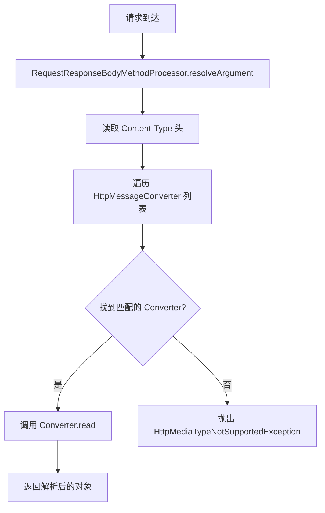
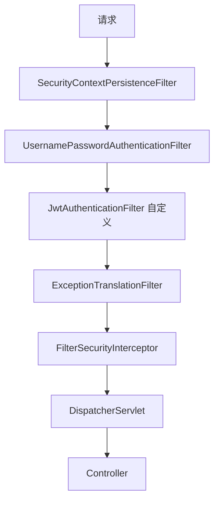

### Spring MVC 请求处理流程

#### 1、基础题：Spring MVC 处理一个 HTTP 请求的完整流程是什么？

**难度级别**：⭐⭐（DispatcherServlet、HandlerMapping、HandlerAdapter、ViewResolver）

**Answer**

请求 → DispatcherServlet（前端控制器）

```
→ HandlerMapping（找 Controller）
→ HandlerAdapter（执行 Controller 方法）
→ 返回 ModelAndView
→ ViewResolver（解析视图）
→ 渲染响应
```

核心组件：

- **DispatcherServlet**：统一入口，协调各组件

- **HandlerMapping**：URL 到 Controller 方法的映射

- **HandlerAdapter**：执行 Controller 并处理参数绑定

- **ViewResolver**：逻辑视图名 → 真实视图

---

#### 2、进阶题：Spring MVC 的拦截器（Interceptor）和过滤器（Filter）有什么区别？

**难度级别**：⭐⭐⭐（执行顺序、容器归属、应用场景、Agent 鉴权实践）

**1️⃣ Common Answer**

重点总结（便于面试记忆）：

- 归属不同
- 执行时机不同
- 能力不同
- Agent 场景实践

**2️⃣ Impressive Answer**

我从 4 个维度对比：

1. **归属不同**：Filter 是 Servlet 规范，由 Tomcat 等容器管理；Interceptor 是 Spring 框架特性，由 DispatcherServlet 调度。

1. **执行时机不同**：Filter 在请求进入容器后立即执行（早于 DispatcherServlet）；Interceptor 在 DispatcherServlet 内部执行，能访问 Handler 上下文。

1. **能力不同**：Filter 只能操作 Request/Response；Interceptor 能访问 Handler 方法信息、ModelAndView，适合做参数校验、权限鉴权、耗时统计。

1. **Agent 场景实践**：鉴权/限流用 Filter（尽早拦截非法请求）；工具调用权限校验、traceId 注入、耗时打点用 Interceptor（能获取 Controller 方法注解信息）。

**3️⃣ Key Differences**

<table>
<tr>
<td>
维度
</td>
<td>
Common Answer
</td>
<td>
Impressive Answer
</td>
</tr>
<tr>
<td>
结构性
</td>
<td>
说了基本区别但较零散
</td>
<td>
4 个维度对比，层次清晰
</td>
</tr>
<tr>
<td>
技术深度
</td>
<td>
不知道执行顺序的本质原因
</td>
<td>
清楚容器管理和框架调度的边界
</td>
</tr>
<tr>
<td>
实践经验
</td>
<td>
没有场景化建议
</td>
<td>
给出 Agent 鉴权的分层实践方案
</td>
</tr>
<tr>
<td>
面试官印象
</td>
<td>
背过区别但没有实战
</td>
<td>
能根据场景选型，有架构思维
</td>
</tr>
</table>

---

#### 3、容易一起考的题

<table>
<tr>
<td>
关联题
</td>
<td>
和本题的关系
</td>
<td>
参考答案
</td>
</tr>
<tr>
<td>
@ControllerAdvice + @ExceptionHandler 如何处理全局异常？
</td>
<td>
Spring MVC 异常处理机制，考察统一错误响应设计
</td>
<td>
答：Java/Spring 题要把概念、生命周期、底层机制和项目实践连起来答；重点说清容器管理、代理机制、事务边界和常见坑。
</td>
</tr>
<tr>
<td>
Spring MVC 如何实现异步请求（DeferredResult/SSE）？
</td>
<td>
长轮询/SSE 场景下请求处理流程的变化，考察异步编程能力
</td>
<td>
答：Java/Spring 题要把概念、生命周期、底层机制和项目实践连起来答；重点说清容器管理、代理机制、事务边界和常见坑。
</td>
</tr>
<tr>
<td>
HandlerMethodArgumentResolver 如何自定义？
</td>
<td>
自定义参数解析器，考察对 MVC 扩展点的理解
</td>
<td>
答：完整实现；使用方式；supportsParameter()：判断当前参数是否需要这个 resolver 处理；resolveArgument()：从请求上下文中解析出参数值
</td>
</tr>
</table>

---

#### 4、进阶题：@ControllerAdvice + @ExceptionHandler 全局异常处理的原理？如何设计统一的 API 错误响应？

**难度级别**：⭐⭐⭐（ExceptionHandlerExceptionResolver、ResponseEntity、错误码体系设计）

**1️⃣ Common Answer**

重点总结（便于面试记忆）：

- 统一错误响应设计
- 错误码体系
- 注意事项

**2️⃣ Impressive Answer**

1. **原理**：`ExceptionHandlerExceptionResolver` 是 Spring MVC 的异常解析器之一，当 Controller 方法抛出异常时，DispatcherServlet 依次调用异常解析器链；它会先查找 Controller 本身的 @ExceptionHandler，找不到再查找 @ControllerAdvice 中的全局处理器。

1. **统一错误响应设计**：

```java
@RestControllerAdvice
public class GlobalExceptionHandler {
    @ExceptionHandler(BusinessException.class)
    public ResponseEntity<ApiResult<?>> handleBusiness(BusinessException e) {
        return ResponseEntity.status(e.getHttpStatus())
            .body(ApiResult.fail(e.getErrorCode(), e.getMessage()));


    @ExceptionHandler(MethodArgumentNotValidException.class)
    public ResponseEntity<ApiResult<?>> handleValidation(MethodArgumentNotValidException e) {
        String message = e.getBindingResult().getFieldErrors().stream()
            .map(f -> f.getField() + ": " + f.getDefaultMessage())
            .collect(Collectors.joining("; "));
        return ResponseEntity.badRequest()
            .body(ApiResult.fail("VALIDATION_ERROR", message));
    }

    @ExceptionHandler(Exception.class)
    public ResponseEntity<ApiResult<?>> handleUnknown(Exception e) {
        log.error("未知异常", e);
        return ResponseEntity.internalServerError()
            .body(ApiResult.fail("INTERNAL_ERROR", "系统繁忙，请稍后重试"));
    }
}
```

1. **错误码体系**：按模块分段（如 `AGENT_001`、`TOOL_002`），前端根据错误码做差异化提示；错误码文档化，便于前后端协作和排查。

1. **注意事项**：多个 @ControllerAdvice 用 `@Order` 控制优先级；Filter 中的异常不会被 @ControllerAdvice 捕获，需要单独处理。

**3️⃣ Key Differences**

<table>
<tr>
<td>
维度
</td>
<td>
Common Answer
</td>
<td>
Impressive Answer
</td>
</tr>
<tr>
<td>
结构性
</td>
<td>
只说了注解用法
</td>
<td>
原理→代码实现→错误码体系→注意事项
</td>
</tr>
<tr>
<td>
技术深度
</td>
<td>
不知道异常解析器链的查找顺序
</td>
<td>
清楚 ExceptionHandlerExceptionResolver 的工作机制
</td>
</tr>
<tr>
<td>
实践经验
</td>
<td>
没有分类处理不同异常
</td>
<td>
业务异常、校验异常、未知异常分层处理
</td>
</tr>
<tr>
<td>
面试官印象
</td>
<td>
会用但不够系统
</td>
<td>
有完整的错误处理体系设计
</td>
</tr>
</table>

---

#### 5、场景题：Agent 的 SSE 流式输出接口如何用 Spring MVC 实现？与 WebSocket 方案如何选型？

**难度级别**：⭐⭐⭐（SseEmitter、DeferredResult、异步请求处理、长连接 vs SSE 对比）

**1️⃣ Common Answer**

重点总结（便于面试记忆）：

- SseEmitter 实现
- 选型对比
- 生产级考虑

**2️⃣ Impressive Answer**

1. **SseEmitter 实现**：

```java
@GetMapping("/agent/chat/stream")
public SseEmitter streamChat(@RequestParam String query) {
  SseEmitter emitter = new SseEmitter(120_000L);  // 2 分钟超时
  CompletableFuture.runAsync(() -> {
      try {
          llmService.streamGenerate(query, token -> {
              emitter.send(SseEmitter.event()
                  .name("token")
                  .data(token));
          });
          emitter.send(SseEmitter.event().name("done").data("[DONE]"));
          emitter.complete();
      } catch (Exception e) {
          emitter.completeWithError(e);
      }
  });
  
  emitter.onTimeout(emitter::complete);
  emitter.onCompletion(() -> log.info("SSE 连接关闭"));
  return emitter;
}
```

1. **选型对比**：

<table>
<tr>
<td>
维度
</td>
<td>
SSE
</td>
<td>
WebSocket
</td>
</tr>
<tr>
<td>
方向
</td>
<td>
单向（服务端→客户端）
</td>
<td>
双向
</td>
</tr>
<tr>
<td>
协议
</td>
<td>
HTTP/1.1（自动重连）
</td>
<td>
独立协议（ws://）
</td>
</tr>
<tr>
<td>
代理兼容
</td>
<td>
好（标准 HTTP）
</td>
<td>
差（需要代理支持升级）
</td>
</tr>
<tr>
<td>
Agent 场景
</td>
<td>
<strong>流式文本输出</strong>（首选）
</td>
<td>
语音对话、实时协作
</td>
</tr>
</table>

1. **生产级考虑**：Nginx 需配置 `proxy_buffering off` 避免缓冲 SSE 数据；设置合理的超时时间，避免连接泄漏；配合心跳事件（每 15s 发一个空 comment）防止代理断开空闲连接。

**3️⃣ Key Differences**

<table>
<tr>
<td>
维度
</td>
<td>
Common Answer
</td>
<td>
Impressive Answer
</td>
</tr>
<tr>
<td>
结构性
</td>
<td>
只说了 SseEmitter 基本用法
</td>
<td>
完整代码→选型对比→生产配置
</td>
</tr>
<tr>
<td>
技术深度
</td>
<td>
不知道超时和资源管理
</td>
<td>
有超时设置、onCompletion 回调
</td>
</tr>
<tr>
<td>
实践经验
</td>
<td>
没考虑 Nginx 配置
</td>
<td>
知道 proxy\_buffering 和心跳机制
</td>
</tr>
<tr>
<td>
面试官印象
</td>
<td>
能实现基本功能
</td>
<td>
有生产环境部署经验
</td>
</tr>
</table>

### 请求处理深入

#### 1、进阶题：HandlerMethodArgumentResolver 如何自定义？实现一个 @CurrentUser 注解自动注入当前用户

**难度级别**：⭐⭐⭐（参数解析器、WebMvcConfigurer、注解驱动）

**1️⃣ Common Answer**

重点总结（便于面试记忆）：

- 完整实现
- 使用方式
- supportsParameter()：判断当前参数是否需要这个 resolver 处理
- resolveArgument()：从请求上下文中解析出参数值

**2️⃣ Impressive Answer**

1. **接口定义**：`HandlerMethodArgumentResolver` 有两个核心方法：

  - `supportsParameter()`：判断当前参数是否需要这个 resolver 处理

  - `resolveArgument()`：从请求上下文中解析出参数值

1. **完整实现**：

```java
@Target(ElementType.PARAMETER)
@Retention(RetentionPolicy.RUNTIME)
public @interface CurrentUser {
}

@Component
public class CurrentUserResolver implements HandlerMethodArgumentResolver {
    @Override
    public boolean supportsParameter(MethodParameter parameter) {
        return parameter.hasParameterAnnotation(CurrentUser.class)
            && parameter.getParameterType().equals(User.class);
    }

    @Override
    public Object resolveArgument(MethodParameter parameter, 
                                  ModelAndViewContainer mavContainer,
                                  NativeWebRequest webRequest,
                                  WebDataBinderFactory binderFactory) {
        // 从 SecurityContext 获取
        Authentication auth = SecurityContextHolder.getContext().getAuthentication();
        if (auth != null && auth.getPrincipal() instanceof User) {
            return auth.getPrincipal();
        }
        // 或从 ThreadLocal 获取
        // return UserContext.get();
        // 或从请求头解析 token
        // String token = webRequest.getHeader("Authorization");
        // return userService.parseToken(token);
        throw new UnauthorizedException("用户未登录");
    }
}

@Configuration
public class WebConfig implements WebMvcConfigurer {
    @Autowired
    private CurrentUserResolver currentUserResolver;

    @Override
    public void addArgumentResolvers(List<HandlerMethodArgumentResolver> resolvers) {
        resolvers.add(currentUserResolver);
    }
}
```

1. **使用方式**：

```java
@GetMapping("/profile")
public Result<User> getProfile(@CurrentUser User user) {
    return Result.success(user);
}
```

1. **Agent 场景扩展**：类似地可以实现 `@CurrentAgent` 注解，自动注入当前 Agent 的上下文信息（如 Agent ID、配置、会话状态等），避免在 Controller 中重复解析。

**3️⃣ Key Differences**

<table>
<tr>
<td>
维度
</td>
<td>
Common Answer
</td>
<td>
Impressive Answer
</td>
</tr>
<tr>
<td>
结构性
</td>
<td>
只说了概念
</td>
<td>
接口定义→完整代码→使用方式→场景扩展
</td>
</tr>
<tr>
<td>
技术深度
</td>
<td>
不知道如何注册 resolver
</td>
<td>
清楚 WebMvcConfigurer 的扩展点
</td>
</tr>
<tr>
<td>
实践经验
</td>
<td>
没有提供完整实现
</td>
<td>
给出可运行的完整代码示例
</td>
</tr>
<tr>
<td>
面试官印象
</td>
<td>
了解基本概念
</td>
<td>
能独立实现自定义注解和参数解析
</td>
</tr>
</table>

---

#### 2、进阶题：@RequestBody 的参数解析原理？HttpMessageConverter 的工作机制？

**难度级别**：⭐⭐⭐（RequestResponseBodyMethodProcessor、MappingJackson2HttpMessageConverter、Content-Type 协商）

**1️⃣ Common Answer**

重点总结（便于面试记忆）：

- HttpMessageConverter 工作机制
- 源码流程
- 自定义 Converter
- Spring 维护一个 Converter 列表，每个 Converter 声明自己支持的 MediaType
- 解析时根据请求的 Content-Type 头选择第一个匹配的 Converter
- MappingJackson2HttpMessageConverter 处理 application/json，内部使用 ObjectMapper 反序列化

**2️⃣ Impressive Answer**

1. **核心处理器**：`@RequestBody` 由 `RequestResponseBodyMethodProcessor` 处理，它同时实现了 `HandlerMethodArgumentResolver`（参数解析）和 `HandlerMethodReturnValueHandler`（返回值处理）。

1. **HttpMessageConverter 工作机制**：

  - Spring 维护一个 Converter 列表，每个 Converter 声明自己支持的 MediaType

  - 解析时根据请求的 `Content-Type` 头选择第一个匹配的 Converter

  - `MappingJackson2HttpMessageConverter` 处理 `application/json`，内部使用 `ObjectMapper` 反序列化

1. **源码流程**：



1. **自定义 Converter**：

```java
public class ProtobufHttpMessageConverter implements HttpMessageConverter<Message> {
    @Override
    public boolean canRead(Class<?> clazz, MediaType mediaType) {
        return Message.class.isAssignableFrom(clazz) 
            && MediaType.parseMediaType("application/x-protobuf").includes(mediaType);
    }

    @Override
    public Message read(Class<? extends Message> clazz, HttpInputMessage inputMessage) {
        return clazz.getMethod("parseFrom", InputStream.class)
            .invoke(null, inputMessage.getBody());
    }
}
```

1. **常见坑**：`@RequestBody` 默认 `required=true`，请求体为空会抛 `HttpMessageNotReadableException` 导致 400 错误；Jackson 反序列化失败时异常信息可能暴露敏感信息，生产环境需要脱敏。

**3️⃣ Key Differences**

<table>
<tr>
<td>
维度
</td>
<td>
Common Answer
</td>
<td>
Impressive Answer
</td>
</tr>
<tr>
<td>
结构性
</td>
<td>
只说了基本概念
</td>
<td>
核心处理器→工作流程→源码图→自定义示例
</td>
</tr>
<tr>
<td>
技术深度
</td>
<td>
不知道 Converter 的选择机制
</td>
<td>
清楚 Content-Type 协商和遍历匹配逻辑
</td>
</tr>
<tr>
<td>
实践经验
</td>
<td>
没有提到自定义 Converter
</td>
<td>
给出 Protobuf Converter 实现示例
</td>
</tr>
<tr>
<td>
面试官印象
</td>
<td>
知道基本用法
</td>
<td>
理解底层机制，能扩展处理新格式
</td>
</tr>
</table>

---

#### 3、容易一起考的题

<table>
<tr>
<td>
关联题
</td>
<td>
和本题的关系
</td>
<td>
参考答案
</td>
</tr>
<tr>
<td>
@ResponseBody 和 @RestController 的区别？
</td>
<td>
返回值处理的对称面，考察 HttpMessageConverter 的双向工作
</td>
<td>
答：这题可以按“定义 → 核心机制 → 工程落地”三步答；结合本题重点强调：返回值处理的对称面，考察 HttpMessageConverter 的双向工作，最后补一个风险点或优化手段。
</td>
</tr>
<tr>
<td>
Spring MVC 的内容协商（Content Negotiation）机制？
</td>
<td>
根据 Accept 头选择响应格式，和 Converter 选择机制相关
</td>
<td>
答：Java/Spring 题要把概念、生命周期、底层机制和项目实践连起来答；重点说清容器管理、代理机制、事务边界和常见坑。
</td>
</tr>
<tr>
<td>
如何自定义 Jackson 的序列化/反序列化行为？
</td>
<td>
ObjectMapper 配置，Long 精度丢失、日期格式等常见问题
</td>
<td>
答：消息可靠性要分三段讲：生产端用同步发送、确认机制和重试；Broker 端用持久化、副本和 ISR；消费端用手动提交 offset、幂等消费和失败重试，最后用监控补漏。
</td>
</tr>
</table>

---

### RESTful API 设计与实践

#### 1、基础题：RESTful API 设计的核心原则？@GetMapping/@PostMapping 等注解的语义区别？

**难度级别**：⭐⭐（HTTP 方法语义、资源命名、状态码规范）

**Answer**

REST 核心原则：资源导向、无状态、统一接口。

**HTTP 方法语义**：

- GET：查询资源，幂等

- POST：创建资源

- PUT：全量更新资源，幂等

- PATCH：部分更新

- DELETE：删除资源，幂等

**资源命名**：使用名词复数，如 `/users/{id}`，避免动词如 `/getUser`。

**状态码**：200 成功、201 创建成功、204 无内容、400 参数错误、401 未认证、403 无权限、404 不存在、500 服务器错误。

`@GetMapping` 等注解是 `@RequestMapping(method=GET)` 的快捷方式。

---

#### 2、进阶题：Spring MVC 如何实现接口版本管理（v1/v2）？有哪些方案？

**难度级别**：⭐⭐⭐（URL 路径版本、请求头版本、自定义 RequestCondition）

**1️⃣ Common Answer**

重点总结（便于面试记忆）：

- 方案对比
- 请求头版本实现
- 版本号放在 URL 路径中（如 /api/v1/）
- 新版本并行发布，旧版本设置废弃时间
- Nginx 根据路径路由到不同服务

**2️⃣ Impressive Answer**

我从 4 个维度对比：

1. **方案对比**：

<table>
<tr>
<td>
方案
</td>
<td>
示例
</td>
<td>
优点
</td>
<td>
缺点
</td>
</tr>
<tr>
<td>
URL 路径
</td>
<td>
<code>/api/v1/users</code>
</td>
<td>
直观、Nginx 方便、缓存友好
</td>
<td>
URL 变长
</td>
</tr>
<tr>
<td>
请求头
</td>
<td>
<code>Accept: application/vnd.myapp.v2+json</code>
</td>
<td>
RESTful 纯粹、URL 简洁
</td>
<td>
不直观、调试麻烦
</td>
</tr>
<tr>
<td>
自定义注解
</td>
<td>
<code>@ApiVersion(1)</code>
</td>
<td>
优雅、自动路由
</td>
<td>
实现复杂
</td>
</tr>
<tr>
<td>
请求参数
</td>
<td>
<code>?version=2</code>
</td>
<td>
简单
</td>
<td>
不优雅、缓存失效
</td>
</tr>
</table>

1. **最佳实践**：URL 路径版本最常用，配合 Swagger 分版本展示。生产环境建议：

  - 版本号放在 URL 路径中（如 `/api/v1/`）

  - 新版本并行发布，旧版本设置废弃时间

  - Nginx 根据路径路由到不同服务

1. **请求头版本实现**：

```java
@GetMapping(value = "/users", produces = "application/vnd.myapp.v1+json")
public List<User> getUsersV1() { /* v1 逻辑 */ }

@GetMapping(value = "/users", produces = "application/vnd.myapp.v2+json")
public List<UserDTO> getUsersV2() { /* v2 逻辑 */ }
```

1. **自定义注解实现**：继承 `RequestMappingHandlerMapping`，重写 `getCustomMethodCondition`，解析 `@ApiVersion` 注解。

**3️⃣ Key Differences**

<table>
<tr>
<td>
维度
</td>
<td>
Common Answer
</td>
<td>
Impressive Answer
</td>
</tr>
<tr>
<td>
结构性
</td>
<td>
只列举了几种方式
</td>
<td>
方案对比表→最佳实践→代码示例
</td>
</tr>
<tr>
<td>
技术深度
</td>
<td>
不知道各方案的优缺点
</td>
<td>
从 URL、缓存、调试等多维度分析
</td>
</tr>
<tr>
<td>
实践经验
</td>
<td>
没有生产环境建议
</td>
<td>
给出 Nginx 路由和 Swagger 集成方案
</td>
</tr>
<tr>
<td>
面试官印象
</td>
<td>
知道基本概念
</td>
<td>
有完整的版本管理架构设计
</td>
</tr>
</table>

---

#### 3、场景题：Agent 平台需要同时支持 REST 和 SSE 两种调用模式，如何设计统一的 Controller 层？

**难度级别**：⭐⭐⭐（统一入口、策略模式、Accept 头协商）

**1️⃣ Common Answer**

重点总结（便于面试记忆）：

- 策略模式设计
- 统一 Controller
- 生产考虑
- SSE 模式需要异步处理，避免阻塞线程池
- REST 模式可以同步返回，响应更快
- 超时设置：SSE 设置较长超时（如 2 分钟），REST 设置较短超时（如 30 秒）

**2️⃣ Impressive Answer**

1. **策略模式设计**：

```java
public interface ResponseStrategy {
    Object execute(Supplier<String> contentGenerator);
}

@Component
public class RestResponseStrategy implements ResponseStrategy {
    @Override
    public Object execute(Supplier<String> contentGenerator) {
        return Result.success(contentGenerator.get());
    }
}

@Component
public class SseResponseStrategy implements ResponseStrategy {
    @Override
    public Object execute(Supplier<String> contentGenerator) {
        SseEmitter emitter = new SseEmitter(120_000L);
        CompletableFuture.runAsync(() -> {
            try {
                String content = contentGenerator.get();
                emitter.send(SseEmitter.event().data(content));
                emitter.complete();
            } catch (Exception e) {
                emitter.completeWithError(e);
            }
        });
        return emitter;
    }
}
```

1. **统一 Controller**：

```java
@RestController
@RequestMapping("/agent/chat")
public class AgentChatController {
    
    @Autowired
    private RestResponseStrategy restStrategy;
    
    @Autowired
    private SseResponseStrategy sseStrategy;

    @GetMapping(produces = {MediaType.APPLICATION_JSON_VALUE, 
                            MediaType.TEXT_EVENT_STREAM_VALUE})
    public Object chat(@RequestParam String query, 
                       @RequestHeader("Accept") String accept) {
        Supplier<String> generator = () -> agentService.generate(query);
        
        if (accept.contains(MediaType.TEXT_EVENT_STREAM_VALUE)) {
            return sseStrategy.execute(generator);
        }
        return restStrategy.execute(generator);
    }
}
```

1. **生产考虑**：

  - SSE 模式需要异步处理，避免阻塞线程池

  - REST 模式可以同步返回，响应更快

  - 超时设置：SSE 设置较长超时（如 2 分钟），REST 设置较短超时（如 30 秒）

  - 监控指标：分别统计两种模式的 QPS、延迟、错误率

**3️⃣ Key Differences**

<table>
<tr>
<td>
维度
</td>
<td>
Common Answer
</td>
<td>
Impressive Answer
</td>
</tr>
<tr>
<td>
结构性
</td>
<td>
只说了基本思路
</td>
<td>
策略模式设计→完整代码→生产考虑
</td>
</tr>
<tr>
<td>
技术深度
</td>
<td>
没有设计模式应用
</td>
<td>
用策略模式解耦输出逻辑
</td>
</tr>
<tr>
<td>
实践经验
</td>
<td>
没有考虑异步和监控
</td>
<td>
有超时设置和监控指标建议
</td>
</tr>
<tr>
<td>
面试官印象
</td>
<td>
能实现基本功能
</td>
<td>
有架构设计思维和生产经验
</td>
</tr>
</table>

---

#### 4、容易一起考的题

<table>
<tr>
<td>
关联题
</td>
<td>
和本题的关系
</td>
<td>
参考答案
</td>
</tr>
<tr>
<td>
Swagger/OpenAPI 文档如何集成？
</td>
<td>
API 文档化，和版本管理配合
</td>
<td>
答：MongoDB 题要抓文档模型、副本集高可用、分片扩展、索引和写关注；设计时重点权衡嵌入/引用、一致性和查询模式。
</td>
</tr>
<tr>
<td>
Spring HATEOAS 是什么？
</td>
<td>
RESTful 成熟度模型的最高级别
</td>
<td>
答：Java/Spring 题要把概念、生命周期、底层机制和项目实践连起来答；重点说清容器管理、代理机制、事务边界和常见坑。
</td>
</tr>
<tr>
<td>
API 限流和熔断如何在 Controller 层实现？
</td>
<td>
API 治理的重要组成部分
</td>
<td>
答：分布式题先明确一致性、可用性和性能目标，再讲协议或方案；落地时补超时、重试、幂等、监控和故障恢复。
</td>
</tr>
</table>

---

### 参数校验与数据绑定

#### 1、基础题：Spring MVC 的参数校验机制？@Valid 和 @Validated 的区别？

**难度级别**：⭐⭐（JSR-303/380、校验注解、BindingResult）

**Answer**

**校验机制**：基于 JSR-303/380 标准，通过 `LocalValidatorFactoryBean` 集成 Hibernate Validator。

**@Valid vs @Validated**：

- `@Valid`：JSR-303 标准注解，支持嵌套校验，不支持分组

- `@Validated`：Spring 扩展，支持分组校验（groups），不支持嵌套校验

**常用校验注解**：`@NotNull`、`@NotBlank`、`@Size`、`@Min`、`@Max`、`@Pattern`、`@Email`。

**BindingResult**：紧跟被校验参数，用于获取校验错误信息。校验失败默认抛 `MethodArgumentNotValidException`，配合 `@ControllerAdvice` 统一处理。

---

#### 2、进阶题：如何实现自定义校验注解？分组校验（groups）如何使用？

**难度级别**：⭐⭐⭐（ConstraintValidator、分组接口、@GroupSequence）

**1️⃣ Common Answer**

重点总结（便于面试记忆）：

- 自定义校验注解
- 分组校验
- @GroupSequence
- 跨字段校验

**2️⃣ Impressive Answer**

1. **自定义校验注解**：

```java
@Target({ElementType.FIELD})
@Retention(RetentionPolicy.RUNTIME)
@Constraint(validatedBy = PhoneNumberValidator.class)
public @interface PhoneNumber {
    String message() default "手机号格式不正确";
    Class<?>[] groups() default {};
    Class<? extends Payload>[] payload() default {};
}

public class PhoneNumberValidator implements ConstraintValidator<PhoneNumber, String> {
    private static final Pattern PATTERN = Pattern.compile("^1[3-9]\\d{9}$");
    
    @Override
    public boolean isValid(String value, ConstraintValidatorContext context) {
        if (value == null) return true;  // @NotNull 负责判空
        return PATTERN.matcher(value).matches();
    }
}
```

1. **分组校验**：

```java
public interface Create {}
public interface Update {}

public class UserDTO {
    @Null(groups = Update.class, message = "创建时 ID 必须为空")
    @NotNull(groups = Create.class, message = "更新时 ID 不能为空")
    private Long id;
    
    @NotBlank(groups = {Create.class, Update.class})
    @PhoneNumber(groups = {Create.class, Update.class})
    private String phone;
}

@PostMapping
public Result<Long> create(@Validated(Create.class) UserDTO dto) { /* 创建逻辑 */ }

@PutMapping
public Result<Void> update(@Validated(Update.class) UserDTO dto) { /* 更新逻辑 */ }
```

1. **@GroupSequence**：控制分组校验顺序，前一组失败则不执行后续组：

```java
@GroupSequence({Default.class, Create.class, Advanced.class})
public interface FullValidation {}
```

1. **跨字段校验**：类级别注解 + 类级别 Validator，如密码和确认密码一致性校验。

**3️⃣ Key Differences**

<table>
<tr>
<td>
维度
</td>
<td>
Common Answer
</td>
<td>
Impressive Answer
</td>
</tr>
<tr>
<td>
结构性
</td>
<td>
只说了基本概念
</td>
<td>
完整代码→分组示例→顺序控制→跨字段校验
</td>
</tr>
<tr>
<td>
技术深度
</td>
<td>
不知道 @GroupSequence 的作用
</td>
<td>
清楚分组校验的顺序控制机制
</td>
</tr>
<tr>
<td>
实践经验
</td>
<td>
没有提供完整实现
</td>
<td>
给出可直接运行的完整代码
</td>
</tr>
<tr>
<td>
面试官印象
</td>
<td>
了解基本用法
</td>
<td>
能独立实现复杂校验逻辑
</td>
</tr>
</table>

---

#### 3、场景题：Agent 工具调用的参数校验如何设计？JSON Schema 校验 vs Bean Validation？

**难度级别**：⭐⭐⭐（动态校验、Schema 驱动、校验策略选型）

**1️⃣ Common Answer**

重点总结（便于面试记忆）：

- 选型对比
- 混合方案
- JSON Schema 实现
- 外层请求：用 Bean Validation（@Valid），校验通用参数（如 agentId、sessionId）
- 工具参数：用 JSON Schema，根据 Function Definition 动态校验

**2️⃣ Impressive Answer**

1. **选型对比**：

<table>
<tr>
<td>
维度
</td>
<td>
Bean Validation
</td>
<td>
JSON Schema
</td>
</tr>
<tr>
<td>
适用场景
</td>
<td>
固定结构的 Java 对象
</td>
<td>
动态 JSON 结构
</td>
</tr>
<tr>
<td>
校验时机
</td>
<td>
编译期确定
</td>
<td>
运行时解析 Schema
</td>
</tr>
<tr>
<td>
灵活性
</td>
<td>
低（需修改代码）
</td>
<td>
高（配置 Schema）
</td>
</tr>
<tr>
<td>
Agent 场景
</td>
<td>
外层请求校验
</td>
<td>
工具参数校验
</td>
</tr>
</table>

1. **混合方案**：

  - **外层请求**：用 Bean Validation（`@Valid`），校验通用参数（如 agentId、sessionId）

  - **工具参数**：用 JSON Schema，根据 Function Definition 动态校验

1. **JSON Schema 实现**：

```java
public class ToolParameterValidator {
    private final JsonSchemaFactory factory = JsonSchemaFactory.getInstance(SpecVersion.VersionFlag.V7);
    
    public ValidationResult validate(String schemaJson, Object parameters) {
        JsonSchema schema = factory.getSchema(new JSONObject(schemaJson));
        Set<ValidationMessage> errors = schema.validate(new JSONObject(parameters));
        
        return new ValidationResult(
            errors.isEmpty(),
            errors.stream()
                .map(ValidationMessage::getMessage)
                .collect(Collectors.toList())
        );
    }
}
```

1. **错误信息设计**：校验失败返回结构化错误，告诉 LLM 哪个参数不合法及原因，便于模型自动修正：

```json
{
  "error": "VALIDATION_FAILED",
  "details": {
    "field": "max_tokens",
    "message": "must be greater than or equal to 1",
    "constraint": "minimum"
  }
}
```

**3️⃣ Key Differences**

<table>
<tr>
<td>
维度
</td>
<td>
Common Answer
</td>
<td>
Impressive Answer
</td>
</tr>
<tr>
<td>
结构性
</td>
<td>
只说了基本思路
</td>
<td>
选型对比→混合方案→代码实现→错误设计
</td>
</tr>
<tr>
<td>
技术深度
</td>
<td>
不知道如何结合使用
</td>
<td>
清楚两种方案的优势和互补性
</td>
</tr>
<tr>
<td>
实践经验
</td>
<td>
没有错误信息设计建议
</td>
<td>
给出结构化错误返回格式
</td>
</tr>
<tr>
<td>
面试官印象
</td>
<td>
了解基本概念
</td>
<td>
有完整的校验架构设计
</td>
</tr>
</table>

---

#### 4、容易一起考的题

<table>
<tr>
<td>
关联题
</td>
<td>
和本题的关系
</td>
<td>
参考答案
</td>
</tr>
<tr>
<td>
Spring MVC 的数据绑定原理（DataBinder）？
</td>
<td>
参数绑定和校验的底层机制
</td>
<td>
答：Java/Spring 题要把概念、生命周期、底层机制和项目实践连起来答；重点说清容器管理、代理机制、事务边界和常见坑。
</td>
</tr>
<tr>
<td>
如何实现请求参数的类型转换（Converter/Formatter）？
</td>
<td>
自定义类型转换，如字符串转枚举
</td>
<td>
答：这题可以按“定义 → 核心机制 → 工程落地”三步答；结合本题重点强调：自定义类型转换，如字符串转枚举，最后补一个风险点或优化手段。
</td>
</tr>
<tr>
<td>
@RequestParam 和 @PathVariable 的校验方式？
</td>
<td>
非 @RequestBody 参数的校验方式不同
</td>
<td>
答：这题可以按“定义 → 核心机制 → 工程落地”三步答；结合本题重点强调：非 @RequestBody 参数的校验方式不同，最后补一个风险点或优化手段。
</td>
</tr>
</table>

---

### 跨域与安全

#### 1、基础题：Spring MVC 如何处理跨域（CORS）？@CrossOrigin 和全局配置的区别？

**难度级别**：⭐⭐（同源策略、预检请求、CORS 头）

**Answer**

**跨域原因**：浏览器同源策略限制，不同域名/端口/协议的请求被拦截。

**处理方式**：

- `@CrossOrigin`：方法/类级别，细粒度控制

- 全局配置：`WebMvcConfigurer.addCorsMappings()`，统一配置所有接口

- Filter 方式：`CorsFilter`，在 Servlet 层处理，优先级最高

**预检请求（OPTIONS）**：浏览器先发 OPTIONS 请求确认服务端是否允许跨域。

**生产配置**：不要用 `*`，明确指定允许的 origin、method、header。

---

#### 2、进阶题：Spring Security 与 Spring MVC 的集成原理？FilterChain 的执行顺序？

**难度级别**：⭐⭐⭐（DelegatingFilterProxy、SecurityFilterChain、FilterChainProxy、核心 Filter）

**1️⃣ Common Answer**

重点总结（便于面试记忆）：

- 集成原理
- 核心 Filter 执行顺序
- 和 Spring MVC 的关系
- Spring Security 本质是一组 Servlet Filter
- DelegatingFilterProxy 作为 Servlet Filter 的代理，将请求委托给 Spring 容器中的 springSecurityFilterChain...
- FilterChainProxy 管理多个 SecurityFilterChain，根据 URL 匹配不同的安全策略

**2️⃣ Impressive Answer**

1. **集成原理**：

  - Spring Security 本质是一组 Servlet Filter

  - `DelegatingFilterProxy` 作为 Servlet Filter 的代理，将请求委托给 Spring 容器中的 `springSecurityFilterChain` Bean

  - `FilterChainProxy` 管理多个 `SecurityFilterChain`，根据 URL 匹配不同的安全策略

1. **核心 Filter 执行顺序**：



1. **和 Spring MVC 的关系**：

  - Security Filter 在 `DispatcherServlet` 之前执行

  - 先鉴权，鉴权失败直接返回，不进入 Spring MVC 流程

  - 鉴权成功后才路由到 Controller

1. **JWT 场景**：自定义 `JwtAuthenticationFilter` 插入到 `UsernamePasswordAuthenticationFilter` 之前：

```java
public class JwtAuthenticationFilter extends OncePerRequestFilter {
    @Override
    protected void doFilterInternal(HttpServletRequest request, 
                                    HttpServletResponse response, 
                                    FilterChain filterChain) {
        String token = extractToken(request);
        if (token != null) {
            Authentication auth = jwtService.parseToken(token);
            SecurityContextHolder.getContext().setAuthentication(auth);
        }
        filterChain.doFilter(request, response);
    }
}

@Configuration
public class SecurityConfig {
    @Bean
    public SecurityFilterChain filterChain(HttpSecurity http) {
        http.addFilterBefore(jwtAuthenticationFilter(), 
                           UsernamePasswordAuthenticationFilter.class);
        // ...
    }
}
```

1. **Agent 场景**：API Key 认证 + JWT Token 双重认证，不同接口不同安全策略：

  - 公开接口：无需认证

  - Agent 调用接口：API Key 认证

  - 用户操作接口：JWT Token 认证

**3️⃣ Key Differences**

<table>
<tr>
<td>
维度
</td>
<td>
Common Answer
</td>
<td>
Impressive Answer
</td>
</tr>
<tr>
<td>
结构性
</td>
<td>
只说了基本概念
</td>
<td>
集成原理→执行流程图→JWT 示例→场景扩展
</td>
</tr>
<tr>
<td>
技术深度
</td>
<td>
不知道 Filter 的执行顺序
</td>
<td>
清楚 DelegatingFilterProxy 的代理机制
</td>
</tr>
<tr>
<td>
实践经验
</td>
<td>
没有自定义 Filter 示例
</td>
<td>
给出 JWT Filter 的完整实现
</td>
</tr>
<tr>
<td>
面试官印象
</td>
<td>
了解基本概念
</td>
<td>
理解底层机制，能扩展安全策略
</td>
</tr>
</table>

---

#### 3、容易一起考的题

<table>
<tr>
<td>
关联题
</td>
<td>
和本题的关系
</td>
<td>
参考答案
</td>
</tr>
<tr>
<td>
OAuth 2.0 和 JWT 的区别？Spring Security OAuth2 如何集成？
</td>
<td>
认证授权体系，Agent API 的安全设计
</td>
<td>
答：Java/Spring 题要把概念、生命周期、底层机制和项目实践连起来答；重点说清容器管理、代理机制、事务边界和常见坑。
</td>
</tr>
<tr>
<td>
CSRF 防护的原理？为什么 REST API 通常禁用 CSRF？
</td>
<td>
安全防护策略，无状态 API 的特殊处理
</td>
<td>
答：这题可以按“定义 → 核心机制 → 工程落地”三步答；结合本题重点强调：安全防护策略，无状态 API 的特殊处理，最后补一个风险点或优化手段。
</td>
</tr>
<tr>
<td>
Spring Security 的方法级安全（@PreAuthorize）如何实现？
</td>
<td>
细粒度权限控制，和 AOP 的关系
</td>
<td>
答：Java/Spring 题要把概念、生命周期、底层机制和项目实践连起来答；重点说清容器管理、代理机制、事务边界和常见坑。
</td>
</tr>
</table>

---

### DispatcherServlet 深度解析

#### 1、基础题：DispatcherServlet 的初始化流程？onRefresh() 初始化了哪 9 个核心组件？

**难度级别**：⭐⭐（DispatcherServlet 生命周期、9 个核心组件）

**Answer**

DispatcherServlet 继承自 FrameworkServlet，初始化流程：

```
Servlet 容器启动 → init() → HttpServletBean.init()
  → FrameworkServlet.initServletBean() → initWebApplicationContext()
  → DispatcherServlet.onRefresh() → 初始化 9 个核心组件
```

**onRefresh() 初始化的 9 个核心组件**：

1. **MultipartResolver**：文件上传解析器

1. **LocaleResolver**：国际化解析器

1. **ThemeResolver**：主题解析器

1. **HandlerMapping**：请求映射处理器（URL → Controller）

1. **HandlerAdapter**：处理器适配器（执行 Controller 方法）

1. **HandlerExceptionResolver**：异常解析器

1. **RequestToViewNameTranslator**：视图名转换器

1. **ViewResolver**：视图解析器

1. **FlashMapManager**：Flash 属性管理器（Redirect 参数传递）

---

#### 2、进阶题：HandlerMapping 的匹配优先级？RequestMappingHandlerMapping vs BeanNameUrlHandlerMapping 的区别？

**难度级别**：⭐⭐⭐（HandlerMapping 类型、匹配顺序、路由策略）

**1️⃣ Common Answer**

重点总结（便于面试记忆）：

- HandlerMapping 类型与优先级
- RequestMappingHandlerMapping：（最高优先级）：基于 @RequestMapping/@GetMapping 等注解
- BeanNameUrlHandlerMapping：基于 Bean 名称（/controller → beanName="/controller"）
- RouterFunctionMapping：Spring 5+ 的函数式路由
- SimpleUrlHandlerMapping：基于 URL 映射配置

**2️⃣ Impressive Answer**

我从 3 个维度分析：

1. **HandlerMapping 类型与优先级**：
    Spring MVC 默认按以下顺序匹配：

- **RequestMappingHandlerMapping**（最高优先级）：基于 @RequestMapping/@GetMapping 等注解

- **BeanNameUrlHandlerMapping**：基于 Bean 名称（/controller → beanName="/controller"）

- **RouterFunctionMapping**：Spring 5+ 的函数式路由

- **SimpleUrlHandlerMapping**：基于 URL 映射配置

匹配逻辑：遍历所有 HandlerMapping，找到第一个返回非 null Handler 的即停止。

1. **RequestMappingHandlerMapping vs BeanNameUrlHandlerMapping**：

<table>
<tr>
<td>
特性
</td>
<td>
RequestMappingHandlerMapping
</td>
<td>
BeanNameUrlHandlerMapping
</td>
</tr>
<tr>
<td>
映射方式
</td>
<td>
@RequestMapping 注解
</td>
<td>
Bean 名称
</td>
</tr>
<tr>
<td>
灵活性
</td>
<td>
高（支持路径变量、通配符）
</td>
<td>
低（仅精确匹配）
</td>
</tr>
<tr>
<td>
适用场景
</td>
<td>
REST API、复杂路由
</td>
<td>
简单路由、遗留系统
</td>
</tr>
</table>

1. **Agent 场景**：自定义 HandlerMapping 实现版本路由

```java
@Component
public class VersionedHandlerMapping extends RequestMappingHandlerMapping {
    
    @Override
    protected HandlerMethod getHandlerInternal(HttpServletRequest request) throws Exception {
        String version = request.getHeader("X-Agent-Version");
        if (version == null) {
            version = "v1"; // 默认版本
        }
        
        // 根据版本路由到不同 Controller
        String path = request.getRequestURI();
        if (path.startsWith("/api/agent/")) {
            path = path.replace("/api/agent/", "/api/agent/" + version + "/");
        }
        
        return super.getHandlerInternal(new VersionedRequestWrapper(request, path));
    }
}
```

**3️⃣ Key Differences**

<table>
<tr>
<td>
维度
</td>
<td>
Common Answer
</td>
<td>
Impressive Answer
</td>
</tr>
<tr>
<td>
结构性
</td>
<td>
没有结构，随意列举
</td>
<td>
类型→优先级→对比表→代码示例
</td>
</tr>
<tr>
<td>
技术深度
</td>
<td>
不知道匹配顺序
</td>
<td>
清楚 HandlerMapping 的遍历逻辑
</td>
</tr>
<tr>
<td>
实践经验
</td>
<td>
没有自定义示例
</td>
<td>
给出版本路由的完整实现
</td>
</tr>
<tr>
<td>
面试官印象
</td>
<td>
了解基础概念
</td>
<td>
掌握底层机制，能灵活扩展
</td>
</tr>
</table>

---

#### 3、场景题：Agent 平台需要根据请求头动态路由到不同版本的 Controller，如何自定义 HandlerMapping？

**难度级别**：⭐⭐⭐（自定义 HandlerMapping、版本路由、动态匹配）

**1️⃣ Common Answer**

重点总结（便于面试记忆）：

- 方案一：自定义 HandlerMapping（推荐）
- 方案二：基于条件的路由（@Conditional）
- Agent 场景实践
- 灰度发布：新版本逐步放量，通过请求头控制流量
- A/B 测试：不同用户群体使用不同版本
- 回滚机制：遇到问题时快速切换回旧版本

**2️⃣ Impressive Answer**

我给出完整的实现方案：

1. **方案一：自定义 HandlerMapping（推荐）**

```java
@Component
@Order(Ordered.HIGHEST_PRECEDENCE)
public class VersionRoutingHandlerMapping extends RequestMappingHandlerMapping {
    
    private static final String VERSION_HEADER = "X-Agent-Version";
    private static final String DEFAULT_VERSION = "v1";
    
    @Override
    protected HandlerMethod getHandlerInternal(HttpServletRequest request) throws Exception {
        String version = request.getHeader(VERSION_HEADER);
        if (version == null) {
            version = DEFAULT_VERSION;
        }
        
        // 包装请求，修改路径
        String originalPath = request.getRequestURI();
        String versionedPath = injectVersion(originalPath, version);
        
        return super.getHandlerInternal(new VersionedRequestWrapper(request, versionedPath));
    }
    
    private String injectVersion(String path, String version) {
        // /api/agent/chat → /api/agent/v1/chat
        return path.replaceFirst("/api/agent/", "/api/agent/" + version + "/");
    }
}

// 请求包装器
public class VersionedRequestWrapper extends HttpServletRequestWrapper {
    private final String versionedPath;
    
    public VersionedRequestWrapper(HttpServletRequest request, String versionedPath) {
        super(request);
        this.versionedPath = versionedPath;
    }
    
    @Override
    public String getRequestURI() {
        return versionedPath;
    }
    
    @Override
    public String getServletPath() {
        return versionedPath;
    }
}

// 不同版本的 Controller
@RestController
@RequestMapping("/api/agent/v1/chat")
public class AgentChatV1Controller {
    @PostMapping
    public String chat(@RequestBody ChatRequest request) {
        return "V1: " + request.getMessage();
    }
}

@RestController
@RequestMapping("/api/agent/v2/chat")
public class AgentChatV2Controller {
    @PostMapping
    public String chat(@RequestBody ChatRequest request) {
        return "V2 (Enhanced): " + request.getMessage();
    }
}
```

1. **方案二：基于条件的路由（@Conditional）**

```java
@RestController
@RequestMapping("/api/agent/chat")
public class AgentChatController {
    
    @PostMapping
    @ConditionalOnHeader(name = "X-Agent-Version", value = "v1")
    public String chatV1(@RequestBody ChatRequest request) {
        return "V1: " + request.getMessage();
    }
    
    @PostMapping
    @ConditionalOnHeader(name = "X-Agent-Version", value = "v2")
    public String chatV2(@RequestBody ChatRequest request) {
        return "V2: " + request.getMessage();
    }
}
```

1. **Agent 场景实践**：

  - **灰度发布**：新版本逐步放量，通过请求头控制流量

  - **A/B 测试**：不同用户群体使用不同版本

  - **回滚机制**：遇到问题时快速切换回旧版本

**3️⃣ Key Differences**

<table>
<tr>
<td>
维度
</td>
<td>
Common Answer
</td>
<td>
Impressive Answer
</td>
</tr>
<tr>
<td>
结构性
</td>
<td>
没有方案，只说&quot;可以&quot;
</td>
<td>
方案一（自定义）→方案二（条件）→场景实践
</td>
</tr>
<tr>
<td>
技术深度
</td>
<td>
不知道如何自定义
</td>
<td>
给出完整的 HandlerMapping 实现
</td>
</tr>
<tr>
<td>
实践经验
</td>
<td>
没有代码示例
</td>
<td>
包含 RequestWrapper、Controller 完整代码
</td>
</tr>
<tr>
<td>
面试官印象
</td>
<td>
了解基本思路
</td>
<td>
能解决实际问题，架构能力强
</td>
</tr>
</table>

---

#### 4、容易一起考的题

<table>
<tr>
<td>
关联题
</td>
<td>
和本题的关系
</td>
<td>
参考答案
</td>
</tr>
<tr>
<td>
Spring MVC 的拦截器执行顺序？如何自定义拦截器？
</td>
<td>
请求处理链路，和 HandlerMapping 的配合
</td>
<td>
答：归属不同；执行时机不同；能力不同；Agent 场景实践
</td>
</tr>
<tr>
<td>
@RequestMapping 的 params、headers 属性如何使用？
</td>
<td>
条件路由的替代方案
</td>
<td>
答：这题可以按“定义 → 核心机制 → 工程落地”三步答；结合本题重点强调：条件路由的替代方案，最后补一个风险点或优化手段。
</td>
</tr>
<tr>
<td>
Spring Cloud Gateway 的路由规则如何配置？
</td>
<td>
微服务场景下的路由扩展
</td>
<td>
答：Java/Spring 题要把概念、生命周期、底层机制和项目实践连起来答；重点说清容器管理、代理机制、事务边界和常见坑。
</td>
</tr>
</table>

---

### 返回值处理与内容协商

#### 1、基础题：@ResponseBody 和 @RestController 的区别？ResponseEntity 的使用场景？

**难度级别**：⭐⭐（注解区别、ResponseEntity）

**Answer**

**@ResponseBody vs @RestController**：

- **@ResponseBody**：标注在方法上，表示返回值直接写入响应体（不经过视图解析器）

- **@RestController**：标注在类上，相当于 @Controller + @ResponseBody 的组合

**ResponseEntity 使用场景**：

ResponseEntity 是 HttpEntity 的子类，可以完整控制 HTTP 响应：

```java
// 设置状态码、响应头、响应体
@GetMapping("/agent/{id}")
public ResponseEntity<Agent> getAgent(@PathVariable Long id) {
    Agent agent = agentService.findById(id);
    if (agent == null) {
        return ResponseEntity.notFound().build();
    }
    return ResponseEntity.ok()
        .header("X-Custom-Header", "value")
        .body(agent);
}

// 自定义状态码
@PostMapping("/agent")
public ResponseEntity<Agent> createAgent(@RequestBody Agent agent) {
    Agent created = agentService.create(agent);
    return ResponseEntity.status(HttpStatus.CREATED).body(created);
}
```

---

#### 2、进阶题：Spring MVC 内容协商（Content Negotiation）机制？如何根据 Accept 头返回不同格式？

**难度级别**：⭐⭐⭐（ContentNegotiation、Accept 头、多格式响应）

**1️⃣ Common Answer**

重点总结（便于面试记忆）：

- 内容协商策略
- 配置内容协商
- 多格式响应示例
- Accept 头：Accept: application/json → 返回 JSON
- URL 后缀：/agent.json → 返回 JSON
- 请求参数：/agent?format=json → 返回 JSON

**2️⃣ Impressive Answer**

我从 4 个维度解析：

1. **内容协商策略**：
    Spring MVC 支持多种协商策略：

- **Accept 头**：`Accept: application/json` → 返回 JSON

- **URL 后缀**：`/agent.json` → 返回 JSON

- **请求参数**：`/agent?format=json` → 返回 JSON

- **固定策略**：忽略客户端，强制返回指定格式

1. **配置内容协商**：

```java
@Configuration
public class WebConfig implements WebMvcConfigurer {
    
    @Override
    public void configureContentNegotiation(ContentNegotiationConfigurer configurer) {
        configurer
            // 启用 Accept 头协商
            .favorParameter(false)
            // 启用 URL 后缀协商（/agent.json）
            .favorPathExtension(true)
            // 忽略 Accept 头，强制返回 JSON
            // .ignoreAcceptHeader(true)
            // 默认内容类型
            .defaultContentType(MediaType.APPLICATION_JSON)
            // 指定后缀映射
            .mediaType("json", MediaType.APPLICATION_JSON)
            .mediaType("xml", MediaType.APPLICATION_XML)
            .mediaType("protobuf", MediaType.parseMediaType("application/x-protobuf"));
    }
    
    @Override
    public void extendMessageConverters(List<HttpMessageConverter<?>> converters) {
        // 添加 Protobuf 转换器
        converters.add(new ProtobufHttpMessageConverter());
    }
}
```

1. **多格式响应示例**：

```java
@RestController
@RequestMapping("/api/agent")
public class AgentController {
    
    // 根据 Accept 头返回 JSON 或 XML
    @GetMapping("/{id}")
    public Agent getAgent(@PathVariable Long id) {
        return agentService.findById(id);
        // Accept: application/json → JSON
        // Accept: application/xml → XML
    }
    
    // ResponseEntity 精确控制
    @GetMapping("/{id}/detail")
    public ResponseEntity<Agent> getAgentDetail(@PathVariable Long id) {
        Agent agent = agentService.findById(id);
        return ResponseEntity.ok()
            .contentType(MediaType.APPLICATION_JSON)
            .body(agent);
    }
}
```

1. **Agent 场景**：多协议支持

```java
// Agent 平台同时支持 JSON 和 Protobuf
@GetMapping("/agent/tools")
public ResponseEntity<List<Tool>> listTools(
    @RequestHeader("Accept") String acceptHeader) {
    
    List<Tool> tools = toolService.getAll();
    
    if (acceptHeader.contains("application/x-protobuf")) {
        return ResponseEntity.ok()
            .contentType(MediaType.parseMediaType("application/x-protobuf"))
            .body(tools);
    }
    
    return ResponseEntity.ok()
        .contentType(MediaType.APPLICATION_JSON)
        .body(tools);
}
```

**3️⃣ Key Differences**

<table>
<tr>
<td>
维度
</td>
<td>
Common Answer
</td>
<td>
Impressive Answer
</td>
</tr>
<tr>
<td>
结构性
</td>
<td>
只知道基本概念
</td>
<td>
策略→配置→示例→场景扩展
</td>
</tr>
<tr>
<td>
技术深度
</td>
<td>
不知道如何配置
</td>
<td>
清楚 ContentNegotiationConfigurer 的配置项
</td>
</tr>
<tr>
<td>
实践经验
</td>
<td>
没有代码示例
</td>
<td>
给出完整的多格式响应实现
</td>
</tr>
<tr>
<td>
面试官印象
</td>
<td>
了解基础
</td>
<td>
掌握内容协商机制，能灵活配置
</td>
</tr>
</table>

---

#### 3、场景题：Agent 接口需要同时支持 JSON 和 Protobuf 响应格式，如何配置 HttpMessageConverter？

**难度级别**：⭐⭐⭐（HttpMessageConverter、Protobuf、多协议）

**1️⃣ Common Answer**

重点总结（便于面试记忆）：

- 依赖配置
- Protobuf 消息定义
- 配置 HttpMessageConverter
- Controller 实现
- Agent 场景实践
- 性能优化：Protobuf 比 JSON 小 30-50%，序列化快 5-10 倍

**2️⃣ Impressive Answer**

我给出完整的多协议支持方案：

1. **依赖配置**：

```xml
<!-- pom.xml -->
<dependency>
    <groupId>com.google.protobuf</groupId>
    <artifactId>protobuf-java</artifactId>
    <version>3.21.0</version>
</dependency>
```

1. **Protobuf 消息定义**：

```protobuf
// agent.proto
syntax = "proto3";

message AgentResponse {
    string id = 1;
    string name = 2;
    repeated string tools = 3;
}
```

1. **配置 HttpMessageConverter**：

```java
@Configuration
public class WebConfig implements WebMvcConfigurer {
    
    @Override
    public void configureMessageConverters(List<HttpMessageConverter<?>> converters) {
        // 保留默认转换器
        converters.add(new MappingJackson2HttpMessageConverter());
        
        // 添加 Protobuf 转换器
        ProtobufHttpMessageConverter protobufConverter = new ProtobufHttpMessageConverter();
        converters.add(protobufConverter);
    }
    
    @Override
    public void configureContentNegotiation(ContentNegotiationConfigurer configurer) {
        configurer
            .favorParameter(true)
            .parameterName("format")
            .defaultContentType(MediaType.APPLICATION_JSON)
            .mediaType("json", MediaType.APPLICATION_JSON)
            .mediaType("protobuf", MediaType.parseMediaType("application/x-protobuf"));
    }
}
```

1. **Controller 实现**：

```java
@RestController
@RequestMapping("/api/agent")
public class AgentController {
    
    // 方案一：根据 Accept 头自动选择
    @GetMapping("/{id}")
    public ResponseEntity<Agent> getAgent(@PathVariable Long id) {
        Agent agent = agentService.findById(id);
        // Accept: application/json → JSON
        // Accept: application/x-protobuf → Protobuf
        return ResponseEntity.ok(agent);
    }
    
    // 方案二：手动指定格式
    @GetMapping("/{id}/json")
    public ResponseEntity<Agent> getAgentJson(@PathVariable Long id) {
        Agent agent = agentService.findById(id);
        return ResponseEntity.ok()
            .contentType(MediaType.APPLICATION_JSON)
            .body(agent);
    }
    
    @GetMapping("/{id}/protobuf")
    public ResponseEntity<AgentResponse> getAgentProtobuf(@PathVariable Long id) {
        Agent agent = agentService.findById(id);
        
        // 转换为 Protobuf 消息
        AgentResponse.Builder builder = AgentResponse.newBuilder()
            .setId(agent.getId())
            .setName(agent.getName());
        agent.getTools().forEach(builder::addTools);
        
        return ResponseEntity.ok()
            .contentType(MediaType.parseMediaType("application/x-protobuf"))
            .body(builder.build());
    }
    
    // 方案三：统一接口，内部转换
    @GetMapping("/{id}/unified")
    public ResponseEntity<?> getAgentUnified(
        @PathVariable Long id,
        @RequestHeader("Accept") String accept) {
        
        Agent agent = agentService.findById(id);
        
        if (accept.contains("application/x-protobuf")) {
            AgentResponse protobuf = convertToProtobuf(agent);
            return ResponseEntity.ok()
                .contentType(MediaType.parseMediaType("application/x-protobuf"))
                .body(protobuf);
        }
        
        return ResponseEntity.ok()
            .contentType(MediaType.APPLICATION_JSON)
            .body(agent);
    }
    
    private AgentResponse convertToProtobuf(Agent agent) {
        AgentResponse.Builder builder = AgentResponse.newBuilder()
            .setId(agent.getId())
            .setName(agent.getName());
        agent.getTools().forEach(builder::addTools);
        return builder.build();
    }
}
```

1. **Agent 场景实践**：

  - **性能优化**：Protobuf 比 JSON 小 30-50%，序列化快 5-10 倍

  - **兼容性**：内部服务用 Protobuf，外部 API 用 JSON

  - **渐进式迁移**：逐步将关键接口迁移到 Protobuf

**3️⃣ Key Differences**

<table>
<tr>
<td>
维度
</td>
<td>
Common Answer
</td>
<td>
Impressive Answer
</td>
</tr>
<tr>
<td>
结构性
</td>
<td>
只知道&quot;添加转换器&quot;
</td>
<td>
依赖→配置→三种方案→场景实践
</td>
</tr>
<tr>
<td>
技术深度
</td>
<td>
不知道具体配置
</td>
<td>
给出完整的 HttpMessageConverter 配置
</td>
</tr>
<tr>
<td>
实践经验
</td>
<td>
没有代码示例
</td>
<td>
包含 Protobuf 定义、Controller 实现
</td>
</tr>
<tr>
<td>
面试官印象
</td>
<td>
了解基本概念
</td>
<td>
能解决多协议问题，工程能力强
</td>
</tr>
</table>

---

#### 4、容易一起考的题

<table>
<tr>
<td>
关联题
</td>
<td>
和本题的关系
</td>
<td>
参考答案
</td>
</tr>
<tr>
<td>
Jackson 自定义序列化如何实现？@JsonSerialize 的用法？
</td>
<td>
JSON 格式的深度定制
</td>
<td>
答：这题可以按“定义 → 核心机制 → 工程落地”三步答；结合本题重点强调：JSON 格式的深度定制，最后补一个风险点或优化手段。
</td>
</tr>
<tr>
<td>
Protobuf 和 JSON 的性能对比？各自适用场景？
</td>
<td>
格式选型，性能优化
</td>
<td>
答：成本优化先拆 Token、模型、工具和重试四类开销，再用缓存、小模型路由、Prompt 压缩、批处理和限流降级优化。
</td>
</tr>
<tr>
<td>
Spring MVC 如何处理大文件上传？MultipartFile 的使用？
</td>
<td>
文件处理，和内容协商的配合
</td>
<td>
答：Java/Spring 题要把概念、生命周期、底层机制和项目实践连起来答；重点说清容器管理、代理机制、事务边界和常见坑。
</td>
</tr>
</table>

---

### 异步请求处理

#### 1、基础题：DeferredResult 和 Callable 的区别？异步请求的线程模型是什么？

**难度级别**：⭐⭐（异步处理、线程模型）

**Answer**

**DeferredResult vs Callable**：

- **Callable**：简单异步，返回 Callable<T>，Spring 自动在独立线程执行

- **DeferredResult**：灵活异步，手动设置结果，支持回调、超时、错误处理

**异步请求的线程模型**：

```
Tomcat 线程（IO 线程）
  ↓ 接收请求，释放线程
  ↓
任务线程（业务线程池）
  ↓ 执行耗时任务
  ↓
Tomcat 线程（复用）
  ↓ 写回响应
```

**示例**：

```java
// Callable 方式
@GetMapping("/async/callable")
public Callable<String> asyncCallable() {
    return () -> {
        Thread.sleep(3000); // 耗时任务
        return "Hello from Callable";
    };
}

// DeferredResult 方式
@GetMapping("/async/deferred")
public DeferredResult<String> asyncDeferred() {
    DeferredResult<String> result = new DeferredResult<>(5000L); // 5秒超时
    
    // 在另一个线程设置结果
    new Thread(() -> {
        try {
            Thread.sleep(3000);
            result.setResult("Hello from DeferredResult");
        } catch (Exception e) {
            result.setErrorResult(e);
        }
    }).start();
    
    return result;
}
```

---

#### 2、进阶题：WebAsyncManager 的工作原理？异步请求的超时和错误处理机制？

**难度级别**：⭐⭐⭐（WebAsyncManager、超时处理、错误处理）

**1️⃣ Common Answer**

重点总结（便于面试记忆）：

- WebAsyncManager 工作原理
- 异步请求处理流程
- 超时和错误处理
- 初始化：在 HandlerAdapter 中检测到 Callable/DeferredResult 时创建
- 启动异步：调用 startAsyncProcessing()，将请求标记为异步
- 超时管理：注册超时回调，超时后调用 onTimeout()

**2️⃣ Impressive Answer**

我从 4 个维度解析：

1. **WebAsyncManager 工作原理**：
    WebAsyncManager 是 Spring MVC 异步处理的核心组件：

- **初始化**：在 HandlerAdapter 中检测到 Callable/DeferredResult 时创建

- **启动异步**：调用 startAsyncProcessing()，将请求标记为异步

- **超时管理**：注册超时回调，超时后调用 onTimeout()

- **结果设置**：通过 setResult() 或 setErrorResult() 设置结果

- **请求分发**：异步完成后，重新分发请求到 DispatcherServlet

1. **异步请求处理流程**：

```
请求 → DispatcherServlet
  → HandlerAdapter
  → 检测到 Callable/DeferredResult
  → WebAsyncManager.startAsyncProcessing()
  → 释放 Tomcat 线程
  → 任务线程执行
  → WebAsyncManager.setResult()
  → 重新分发请求
  → DispatcherServlet
  → 返回响应
```

1. **超时和错误处理**：

```java
@RestController
@RequestMapping("/api/agent/async")
public class AgentAsyncController {
    
    // 超时处理
    @GetMapping("/timeout")
    public DeferredResult<String> asyncWithTimeout() {
        DeferredResult<String> result = new DeferredResult<>(3000L); // 3秒超时
        
        // 超时回调
        result.onTimeout(() -> {
            result.setErrorResult("Request timeout");
        });
        
        // 错误回调
        result.onError((Throwable t) -> {
            result.setErrorResult("Error: " + t.getMessage());
        });
        
        // 完成回调
        result.onCompletion(() -> {
            log.info("Async request completed");
        });
        
        // 异步执行
        CompletableFuture.supplyAsync(() -> {
            try {
                Thread.sleep(5000); // 超过超时时间
                return "Success";
            } catch (InterruptedException e) {
                throw new RuntimeException(e);
            }
        }).whenComplete((res, ex) -> {
            if (ex != null) {
                result.setErrorResult(ex);
            } else {
                result.setResult(res);
            }
        });
        
        return result;
    }
    
    // 全局异常处理
    @ExceptionHandler
    @ResponseStatus(HttpStatus.REQUEST_TIMEOUT)
    public String handleTimeout(AsyncRequestTimeoutException ex) {
        return "Async request timeout: " + ex.getMessage();
    }
}
```

1. **Agent 场景**：长时间运行任务

```java
@Service
public class AgentTaskService {
    
    @Async("agentTaskExecutor")
    public CompletableFuture<String> executeLongRunningTask(String taskId) {
        // Agent 深度搜索、多步推理等长时间任务
        try {
            // 模拟长时间任务
            Thread.sleep(10000);
            return CompletableFuture.completedFuture("Task " + taskId + " completed");
        } catch (InterruptedException e) {
            return CompletableFuture.failedFuture(e);
        }
    }
}

@RestController
@RequestMapping("/api/agent/task")
public class AgentTaskController {
    
    @PostMapping("/{taskId}")
    public DeferredResult<TaskResult> executeTask(@PathVariable String taskId) {
        DeferredResult<TaskResult> result = new DeferredResult<>(30000L); // 30秒超时
        
        result.onTimeout(() -> {
            result.setErrorResult(TaskResult.error("Task timeout"));
        });
        
        agentTaskService.executeLongRunningTask(taskId)
            .thenAccept(res -> {
                result.setResult(TaskResult.success(res));
            })
            .exceptionally(ex -> {
                result.setErrorResult(TaskResult.error(ex.getMessage()));
                return null;
            });
        
        return result;
    }
}
```

**3️⃣ Key Differences**

<table>
<tr>
<td>
维度
</td>
<td>
Common Answer
</td>
<td>
Impressive Answer
</td>
</tr>
<tr>
<td>
结构性
</td>
<td>
只知道基本概念
</td>
<td>
原理→流程→处理机制→场景实践
</td>
</tr>
<tr>
<td>
技术深度
</td>
<td>
不知道 WebAsyncManager
</td>
<td>
清楚异步请求的完整处理流程
</td>
</tr>
<tr>
<td>
实践经验
</td>
<td>
没有代码示例
</td>
<td>
给出超时、错误、全局异常处理
</td>
</tr>
<tr>
<td>
面试官印象
</td>
<td>
了解基础
</td>
<td>
掌握异步机制，能处理复杂场景
</td>
</tr>
</table>

---

#### 3、场景题：Agent 长时间运行的任务（如深度搜索、多步推理）如何用 DeferredResult 实现异步响应，避免 Tomcat 线程耗尽？

**难度级别**：⭐⭐⭐⭐（异步架构、线程池优化、Agent 场景）

**1️⃣ Common Answer**

重点总结（便于面试记忆）：

- 异步线程池配置
- Agent 任务服务
- 异步 Controller
- 任务状态管理
- Tomcat 线程池优化

**2️⃣ Impressive Answer**

我给出完整的异步架构方案：

1. **异步线程池配置**：

```java
@Configuration
@EnableAsync
public class AsyncConfig {
    
    @Bean("agentTaskExecutor")
    public Executor agentTaskExecutor() {
        ThreadPoolTaskExecutor executor = new ThreadPoolTaskExecutor();
        executor.setCorePoolSize(10);
        executor.setMaxPoolSize(50);
        executor.setQueueCapacity(100);
        executor.setThreadNamePrefix("agent-task-");
        executor.setRejectedExecutionHandler(new ThreadPoolExecutor.CallerRunsPolicy());
        executor.initialize();
        return executor;
    }
    
    @Bean("agentCallbackExecutor")
    public Executor agentCallbackExecutor() {
        ThreadPoolTaskExecutor executor = new ThreadPoolTaskExecutor();
        executor.setCorePoolSize(5);
        executor.setMaxPoolSize(20);
        executor.setQueueCapacity(50);
        executor.setThreadNamePrefix("agent-callback-");
        executor.setRejectedExecutionHandler(new ThreadPoolExecutor.AbortPolicy());
        executor.initialize();
        return executor;
    }
}
```

1. **Agent 任务服务**：

```java
@Service
public class AgentTaskService {
    
    @Autowired
    @Qualifier("agentTaskExecutor")
    private Executor taskExecutor;
    
    // 深度搜索任务
    public CompletableFuture<SearchResult> deepSearch(String query) {
        return CompletableFuture.supplyAsync(() -> {
            // 1. 向量检索
            List<Document> docs = vectorSearch(query);
            
            // 2. 多步推理
            String reasoning = multiStepReasoning(query, docs);
            
            // 3. 结果汇总
            return SearchResult.builder()
                .query(query)
                .documents(docs)
                .reasoning(reasoning)
                .build();
        }, taskExecutor);
    }
    
    // 多步推理任务
    public CompletableFuture<ReasoningResult> multiStepReasoning(String query, List<Document> docs) {
        return CompletableFuture.supplyAsync(() -> {
            // Step 1: 理解问题
            String understanding = llmService.understand(query);
            
            // Step 2: 规划步骤
            List<String> steps = llmService.plan(understanding);
            
            // Step 3: 执行步骤
            List<String> results = new ArrayList<>();
            for (String step : steps) {
                String result = executeStep(step, docs);
                results.add(result);
            }
            
            // Step 4: 综合答案
            String answer = llmService.synthesize(results);
            
            return ReasoningResult.builder()
                .steps(steps)
                .results(results)
                .answer(answer)
                .build();
        }, taskExecutor);
    }
}
```

1. **异步 Controller**：

```java
@RestController
@RequestMapping("/api/agent")
public class AgentAsyncController {
    
    @Autowired
    private AgentTaskService agentTaskService;
    
    // 深度搜索（异步）
    @PostMapping("/search/deep")
    public DeferredResult<SearchResult> deepSearch(@RequestBody SearchRequest request) {
        DeferredResult<SearchResult> result = new DeferredResult<>(60000L); // 60秒超时
        
        // 超时处理
        result.onTimeout(() -> {
            result.setErrorResult(SearchResult.error("Search timeout"));
        });
        
        // 错误处理
        result.onError(ex -> {
            result.setErrorResult(SearchResult.error(ex.getMessage()));
        });
        
        // 异步执行
        agentTaskService.deepSearch(request.getQuery())
            .thenAccept(result::setResult)
            .exceptionally(ex -> {
                result.setErrorResult(SearchResult.error(ex.getMessage()));
                return null;
            });
        
        return result;
    }
    
    // 多步推理（异步）
    @PostMapping("/reasoning")
    public DeferredResult<ReasoningResult> reasoning(@RequestBody ReasoningRequest request) {
        DeferredResult<ReasoningResult> result = new DeferredResult<>(90000L); // 90秒超时
        
        result.onTimeout(() -> {
            result.setErrorResult(ReasoningResult.error("Reasoning timeout"));
        });
        
        agentTaskService.multiStepReasoning(request.getQuery(), request.getDocs())
            .thenAccept(result::setResult)
            .exceptionally(ex -> {
                result.setErrorResult(ReasoningResult.error(ex.getMessage()));
                return null;
            });
        
        return result;
    }
    
    // 任务状态查询（轮询）
    @GetMapping("/task/{taskId}/status")
    public TaskStatus getTaskStatus(@PathVariable String taskId) {
        return agentTaskService.getTaskStatus(taskId);
    }
}
```

1. **任务状态管理**：

```java
@Service
public class AgentTaskService {
    
    private final Map<String, TaskStatus> taskStatusMap = new ConcurrentHashMap<>();
    
    public String createTaskId() {
        return UUID.randomUUID().toString();
    }
    
    public void updateTaskStatus(String taskId, String status, int progress) {
        taskStatusMap.put(taskId, TaskStatus.builder()
            .taskId(taskId)
            .status(status)
            .progress(progress)
            .timestamp(System.currentTimeMillis())
            .build());
    }
    
    public TaskStatus getTaskStatus(String taskId) {
        return taskStatusMap.get(taskId);
    }
}
```

1. **Tomcat 线程池优化**：

```yaml
# application.yml
server:
  tomcat:
    threads:
      max: 200
      min-spare: 20
    accept-count: 100
    connection-timeout: 30000
```

**3️⃣ Key Differences**

<table>
<tr>
<td>
维度
</td>
<td>
Common Answer
</td>
<td>
Impressive Answer
</td>
</tr>
<tr>
<td>
结构性
</td>
<td>
只知道&quot;用异步&quot;
</td>
<td>
线程池配置→任务服务→Controller→状态管理
</td>
</tr>
<tr>
<td>
技术深度
</td>
<td>
不知道如何避免线程耗尽
</td>
<td>
清楚异步架构的完整设计
</td>
</tr>
<tr>
<td>
实践经验
</td>
<td>
没有代码示例
</td>
<td>
给出深度搜索、多步推理的完整实现
</td>
</tr>
<tr>
<td>
面试官印象
</td>
<td>
了解基本概念
</td>
<td>
能设计异步架构，解决性能问题
</td>
</tr>
</table>

---

#### 4、容易一起考的题

<table>
<tr>
<td>
关联题
</td>
<td>
和本题的关系
</td>
<td>
参考答案
</td>
</tr>
<tr>
<td>
Spring @Async 注解的原理？如何自定义线程池？
</td>
<td>
异步执行，和 DeferredResult 的配合
</td>
<td>
答：Java/Spring 题要把概念、生命周期、底层机制和项目实践连起来答；重点说清容器管理、代理机制、事务边界和常见坑。
</td>
</tr>
<tr>
<td>
CompletableFuture 的使用场景？如何组合多个异步任务？
</td>
<td>
异步编程，复杂任务编排
</td>
<td>
答：这题可以按“定义 → 核心机制 → 工程落地”三步答；结合本题重点强调：异步编程，复杂任务编排，最后补一个风险点或优化手段。
</td>
</tr>
<tr>
<td>
Tomcat 线程池参数如何调优？如何监控线程池状态？
</td>
<td>
性能优化，避免线程耗尽
</td>
<td>
答：Tomcat 线程池参数；线程池调优策略；NIO vs NIO2 区别；性能优化实践
</td>
</tr>
</table>

---

### 文件上传与下载

#### 1、基础题：Spring MVC 如何处理文件上传？MultipartFile 的核心方法？

**难度级别**：⭐⭐（文件上传、MultipartFile）

**Answer**

**文件上传配置**：

```java
@Configuration
public class WebConfig implements WebMvcConfigurer {
    
    @Bean
    public MultipartResolver multipartResolver() {
        CommonsMultipartResolver resolver = new CommonsMultipartResolver();
        resolver.setMaxUploadSize(10 * 1024 * 1024); // 10MB
        resolver.setMaxInMemorySize(1024 * 1024); // 1MB
        resolver.setDefaultEncoding("UTF-8");
        return resolver;
    }
}
```

**MultipartFile 核心方法**：

```java
@RestController
@RequestMapping("/api/file")
public class FileUploadController {
    
    @PostMapping("/upload")
    public String upload(@RequestParam("file") MultipartFile file) throws IOException {
        // 获取文件名
        String originalFilename = file.getOriginalFilename();
        
        // 获取文件类型
        String contentType = file.getContentType();
        
        // 获取文件大小
        long size = file.getSize();
        
        // 获取文件字节数组
        byte[] bytes = file.getBytes();
        
        // 获取输入流
        InputStream inputStream = file.getInputStream();
        
        // 保存文件
        File dest = new File("/tmp/" + originalFilename);
        file.transferTo(dest);
        
        return "Upload success: " + originalFilename;
    }
}
```

---

#### 2、进阶题：大文件上传的分片处理方案？MultipartResolver 的两种实现（CommonsMultipartResolver vs StandardServletMultipartResolver）？

**难度级别**：⭐⭐⭐（分片上传、MultipartResolver 对比）

**1️⃣ Common Answer**

重点总结（便于面试记忆）：

- MultipartResolver 对比
- CommonsMultipartResolver 配置
- StandardServletMultipartResolver 配置
- 分片上传方案

**2️⃣ Impressive Answer**

我从 3 个维度解析：

1. **MultipartResolver 对比**：

<table>
<tr>
<td>
特性
</td>
<td>
CommonsMultipartResolver
</td>
<td>
StandardServletMultipartResolver
</td>
</tr>
<tr>
<td>
依赖
</td>
<td>
Apache Commons FileUpload
</td>
<td>
Servlet 3.0+ 内置
</td>
</tr>
<tr>
<td>
性能
</td>
<td>
较慢（需要磁盘缓冲）
</td>
<td>
较快（内存优先）
</td>
</tr>
<tr>
<td>
配置
</td>
<td>
XML/Java Config
</td>
<td>
Servlet Config
</td>
</tr>
<tr>
<td>
适用场景
</td>
<td>
Servlet 2.x 或需要兼容
</td>
<td>
Servlet 3.0+ 推荐
</td>
</tr>
</table>

1. **CommonsMultipartResolver 配置**：

```java
@Configuration
public class WebConfig implements WebMvcConfigurer {
    
    @Bean
    public MultipartResolver multipartResolver() {
        CommonsMultipartResolver resolver = new CommonsMultipartResolver();
        resolver.setMaxUploadSize(100 * 1024 * 1024); // 100MB
        resolver.setMaxUploadSizePerFile(10 * 1024 * 1024); // 单文件 10MB
        resolver.setMaxInMemorySize(1024 * 1024); // 1MB 内存缓冲
        resolver.setDefaultEncoding("UTF-8");
        return resolver;
    }
}
```

1. **StandardServletMultipartResolver 配置**：

```java
@Configuration
public class WebConfig implements WebMvcConfigurer {
    
    @Bean
    public MultipartResolver multipartResolver() {
        return new StandardServletMultipartResolver();
    }
}

// application.yml
spring:
  servlet:
    multipart:
      enabled: true
      max-file-size: 10MB
      max-request-size: 100MB
      file-size-threshold: 1MB
```

1. **分片上传方案**：

```java
@RestController
@RequestMapping("/api/file/chunk")
public class ChunkUploadController {
    
    // 上传分片
    @PostMapping("/upload")
    public ResponseEntity<ChunkUploadResult> uploadChunk(
        @RequestParam("file") MultipartFile file,
        @RequestParam("chunkNumber") int chunkNumber,
        @RequestParam("totalChunks") int totalChunks,
        @RequestParam("identifier") String identifier) throws IOException {
        
        String chunkPath = "/tmp/chunks/" + identifier + "/" + chunkNumber;
        File chunkFile = new File(chunkPath);
        chunkFile.getParentFile().mkdirs();
        file.transferTo(chunkFile);
        
        return ResponseEntity.ok(ChunkUploadResult.builder()
            .chunkNumber(chunkNumber)
            .identifier(identifier)
            .uploaded(true)
            .build());
    }
    
    // 合并分片
    @PostMapping("/merge")
    public ResponseEntity<MergeResult> mergeChunks(
        @RequestParam("identifier") String identifier,
        @RequestParam("filename") String filename,
        @RequestParam("totalChunks") int totalChunks) throws IOException {
        
        String outputPath = "/tmp/uploads/" + filename;
        File outputFile = new File(outputPath);
        outputFile.getParentFile().mkdirs();
        
        try (FileOutputStream fos = new FileOutputStream(outputFile)) {
            for (int i = 1; i <= totalChunks; i++) {
                File chunkFile = new File("/tmp/chunks/" + identifier + "/" + i);
                Files.copy(chunkFile.toPath(), fos);
                chunkFile.delete(); // 删除分片
            }
        }
        
        return ResponseEntity.ok(MergeResult.builder()
            .filename(filename)
            .path(outputPath)
            .success(true)
            .build());
    }
}
```

1. **Agent 场景**：知识库文档上传

```java
@Service
public class AgentDocumentService {
    
    @Async("docUploadExecutor")
    public CompletableFuture<UploadResult> uploadAndIndex(
        MultipartFile file,
        String agentId) {
        
        try {
            // 1. 保存文件
            String filePath = saveFile(file);
            
            // 2. 提取文本
            String text = extractText(filePath);
            
            // 3. 向量化
            List<Float> embedding = embeddingService.embed(text);
            
            // 4. 入库
            documentService.index(Document.builder()
                .agentId(agentId)
                .filename(file.getOriginalFilename())
                .content(text)
                .embedding(embedding)
                .build());
            
            return CompletableFuture.completedFuture(
                UploadResult.success(file.getOriginalFilename()));
            
        } catch (Exception e) {
            return CompletableFuture.failedFuture(e);
        }
    }
}
```

**3️⃣ Key Differences**

<table>
<tr>
<td>
维度
</td>
<td>
Common Answer
</td>
<td>
Impressive Answer
</td>
</tr>
<tr>
<td>
结构性
</td>
<td>
只知道基本概念
</td>
<td>
对比表→配置→分片方案→场景实践
</td>
</tr>
<tr>
<td>
技术深度
</td>
<td>
不知道两种实现的区别
</td>
<td>
清楚 MultipartResolver 的优缺点
</td>
</tr>
<tr>
<td>
实践经验
</td>
<td>
没有代码示例
</td>
<td>
给出分片上传、文档索引的完整实现
</td>
</tr>
<tr>
<td>
面试官印象
</td>
<td>
了解基础
</td>
<td>
掌握文件处理，能解决实际问题
</td>
</tr>
</table>

---

#### 3、场景题：Agent 知识库文档上传（PDF/Word）如何实现流式解析，边上传边向量化入库？

**难度级别**：⭐⭐⭐⭐（流式处理、向量化、Agent 场景）

**1️⃣ Common Answer**

重点总结（便于面试记忆）：

- 流式上传 Controller
- 流式文档处理服务
- 文本提取器接口
- 文本分块工具
- 异步线程池配置

**2️⃣ Impressive Answer**

我给出完整的流式处理方案：

1. **流式上传 Controller**：

```java
@RestController
@RequestMapping("/api/agent/kb")
public class KnowledgeBaseController {
    
    @Autowired
    private AgentDocumentService documentService;
    
    // 流式上传并处理
    @PostMapping("/upload/stream")
    public DeferredResult<UploadResult> uploadStream(
        @RequestParam("file") MultipartFile file,
        @RequestParam("agentId") String agentId) {
        
        DeferredResult<UploadResult> result = new DeferredResult<>(60000L);
        
        result.onTimeout(() -> {
            result.setErrorResult(UploadResult.error("Upload timeout"));
        });
        
        // 异步流式处理
        documentService.processStream(file.getInputStream(), agentId, file.getOriginalFilename())
            .thenAccept(result::setResult)
            .exceptionally(ex -> {
                result.setErrorResult(UploadResult.error(ex.getMessage()));
                return null;
            });
        
        return result;
    }
}
```

1. **流式文档处理服务**：

```java
@Service
public class AgentDocumentService {
    
    @Autowired
    private EmbeddingService embeddingService;
    
    @Autowired
    private VectorStore vectorStore;
    
    @Async("docProcessExecutor")
    public CompletableFuture<UploadResult> processStream(
        InputStream inputStream,
        String agentId,
        String filename) {
        
        try {
            // 1. 检测文件类型
            String fileType = detectFileType(filename);
            
            // 2. 流式提取文本
            List<TextChunk> chunks = new ArrayList<>();
            TextExtractor extractor = getExtractor(fileType);
            
            extractor.extractStream(inputStream, (text, pageIndex) -> {
                // 3. 分块处理
                List<TextChunk> pageChunks = chunkText(text, 500, 50);
                chunks.addAll(pageChunks);
                
                // 4. 边提取边向量化
                for (TextChunk chunk : pageChunks) {
                    processChunk(chunk, agentId, filename, pageIndex);
                }
            });
            
            return CompletableFuture.completedFuture(
                UploadResult.success(filename, chunks.size()));
            
        } catch (Exception e) {
            return CompletableFuture.failedFuture(e);
        }
    }
    
    private void processChunk(TextChunk chunk, String agentId, String filename, int pageIndex) {
        // 1. 向量化
        List<Float> embedding = embeddingService.embed(chunk.getText());
        
        // 2. 入库
        vectorStore.insert(Document.builder()
            .agentId(agentId)
            .filename(filename)
            .pageIndex(pageIndex)
            .chunkIndex(chunk.getIndex())
            .content(chunk.getText())
            .embedding(embedding)
            .metadata(Map.of(
                "filename", filename,
                "pageIndex", String.valueOf(pageIndex),
                "chunkIndex", String.valueOf(chunk.getIndex())
            ))
            .build());
    }
}
```

1. **文本提取器接口**：

```java
public interface TextExtractor {
    void extractStream(InputStream inputStream, BiConsumer<String, Integer> callback) throws IOException;
}

@Component
public class PdfTextExtractor implements TextExtractor {
    
    @Override
    public void extractStream(InputStream inputStream, BiConsumer<String, Integer> callback) throws IOException {
        try (PDDocument document = PDDocument.load(inputStream)) {
            PDFTextStripper stripper = new PDFTextStripper();
            
            for (int i = 0; i < document.getNumberOfPages(); i++) {
                stripper.setStartPage(i + 1);
                stripper.setEndPage(i + 1);
                
                String text = stripper.getText(document);
                callback.accept(text.trim(), i);
            }
        }
    }
}

@Component
public class WordTextExtractor implements TextExtractor {
    
    @Override
    public void extractStream(InputStream inputStream, BiConsumer<String, Integer> callback) throws IOException {
        XWPFDocument document = new XWPFDocument(inputStream);
        
        for (int i = 0; i < document.getParagraphs().size(); i++) {
            XWPFParagraph paragraph = document.getParagraphs().get(i);
            String text = paragraph.getText();
            
            // 按段落分页（模拟）
            int pageIndex = i / 10;
            callback.accept(text, pageIndex);
        }
        
        document.close();
    }
}
```

1. **文本分块工具**：

```java
@Component
public class TextChunker {
    
    public List<TextChunk> chunkText(String text, int chunkSize, int overlap) {
        List<TextChunk> chunks = new ArrayList<>();
        
        String[] sentences = text.split("(?<=[.!?。！？])\\s+");
        StringBuilder currentChunk = new StringBuilder();
        int chunkIndex = 0;
        
        for (String sentence : sentences) {
            if (currentChunk.length() + sentence.length() > chunkSize) {
                if (currentChunk.length() > 0) {
                    chunks.add(TextChunk.builder()
                        .index(chunkIndex++)
                        .text(currentChunk.toString())
                        .build());
                    
                    // 保留重叠部分
                    String overlapText = currentChunk.substring(
                        Math.max(0, currentChunk.length() - overlap));
                    currentChunk = new StringBuilder(overlapText);
                }
            }
            
            currentChunk.append(sentence).append(" ");
        }
        
        if (currentChunk.length() > 0) {
            chunks.add(TextChunk.builder()
                .index(chunkIndex)
                .text(currentChunk.toString().trim())
                .build());
        }
        
        return chunks;
    }
}
```

1. **异步线程池配置**：

```java
@Configuration
@EnableAsync
public class AsyncConfig {
    
    @Bean("docProcessExecutor")
    public Executor docProcessExecutor() {
        ThreadPoolTaskExecutor executor = new ThreadPoolTaskExecutor();
        executor.setCorePoolSize(5);
        executor.setMaxPoolSize(20);
        executor.setQueueCapacity(50);
        executor.setThreadNamePrefix("doc-process-");
        executor.setRejectedExecutionHandler(new ThreadPoolExecutor.CallerRunsPolicy());
        executor.initialize();
        return executor;
    }
}
```

**3️⃣ Key Differences**

<table>
<tr>
<td>
维度
</td>
<td>
Common Answer
</td>
<td>
Impressive Answer
</td>
</tr>
<tr>
<td>
结构性
</td>
<td>
只知道&quot;上传后处理&quot;
</td>
<td>
流式上传→提取器→分块→向量化→入库
</td>
</tr>
<tr>
<td>
技术深度
</td>
<td>
不知道流式处理
</td>
<td>
清楚流式处理的完整架构
</td>
</tr>
<tr>
<td>
实践经验
</td>
<td>
没有代码示例
</td>
<td>
给出 PDF/Word 提取、分块、向量化的完整实现
</td>
</tr>
<tr>
<td>
面试官印象
</td>
<td>
了解基本概念
</td>
<td>
能设计流式处理架构，解决性能问题
</td>
</tr>
</table>

---

#### 4、容易一起考的题

<table>
<tr>
<td>
关联题
</td>
<td>
和本题的关系
</td>
<td>
参考答案
</td>
</tr>
<tr>
<td>
Spring @Async 的原理？如何自定义线程池？
</td>
<td>
异步处理，和文件上传的配合
</td>
<td>
答：Java/Spring 题要把概念、生命周期、底层机制和项目实践连起来答；重点说清容器管理、代理机制、事务边界和常见坑。
</td>
</tr>
<tr>
<td>
向量数据库（如 Milvus、Pinecone）如何集成？
</td>
<td>
知识库向量化入库
</td>
<td>
答：RAG 题要串起切分、embedding、召回、重排、上下文拼装、生成和评估，每一步都有质量与成本取舍。
</td>
</tr>
<tr>
<td>
如何实现文件的断点续传？
</td>
<td>
大文件上传的扩展
</td>
<td>
答：这题可以按“定义 → 核心机制 → 工程落地”三步答；结合本题重点强调：大文件上传的扩展，最后补一个风险点或优化手段。
</td>
</tr>
</table>

---

### WebMvcConfigurer 扩展点体系

#### 1、基础题：WebMvcConfigurer 有哪些常用扩展点？各自的作用？

**难度级别**：⭐⭐（WebMvcConfigurer、扩展点）

**Answer**

**WebMvcConfigurer 常用扩展点**：

```java
@Configuration
public class WebConfig implements WebMvcConfigurer {
    
    // 1. 路径匹配配置
    @Override
    public void configurePathMatch(PathMatchConfigurer configurer) {
        configurer.setUseTrailingSlashMatch(true);
    }
    
    // 2. 内容协商配置
    @Override
    public void configureContentNegotiation(ContentNegotiationConfigurer configurer) {
        configurer.favorParameter(true);
    }
    
    // 3. 消息转换器配置
    @Override
    public void configureMessageConverters(List<HttpMessageConverter<?>> converters) {
        converters.add(new MappingJackson2HttpMessageConverter());
    }
    
    // 4. 拦截器配置
    @Override
    public void addInterceptors(InterceptorRegistry registry) {
        registry.addInterceptor(new LoggingInterceptor())
            .addPathPatterns("/**");
    }
    
    // 5. 跨域配置
    @Override
    public void addCorsMappings(CorsRegistry registry) {
        registry.addMapping("/**")
            .allowedOrigins("*");
    }
    
    // 6. 视图控制器配置
    @Override
    public void addViewControllers(ViewControllerRegistry registry) {
        registry.addViewController("/").setViewName("index");
    }
    
    // 7. 静态资源配置
    @Override
    public void addResourceHandlers(ResourceHandlerRegistry registry) {
        registry.addResourceHandler("/static/**")
            .addResourceLocations("classpath:/static/");
    }
    
    // 8. 参数解析器配置
    @Override
    public void addArgumentResolvers(List<HandlerMethodArgumentResolver> resolvers) {
        resolvers.add(new AgentContextResolver());
    }
}
```

---

#### 2、进阶题：@EnableWebMvc 和 Spring Boot 自动配置的冲突问题？WebMvcAutoConfiguration 的加载条件？

**难度级别**：⭐⭐⭐（自动配置、加载条件、冲突处理）

**1️⃣ Common Answer**

重点总结（便于面试记忆）：

- @EnableWebMvc 的影响
- WebMvcAutoConfiguration 加载条件
- 三种配置方式对比
- 推荐配置方式
- 作用：启用 Spring MVC 的 Java Config 模式
- 副作用：禁用 WebMvcAutoConfiguration 的默认配置

**2️⃣ Impressive Answer**

我从 4 个维度解析：

1. **@EnableWebMvc 的影响**：

  - **作用**：启用 Spring MVC 的 Java Config 模式

  - **副作用**：禁用 WebMvcAutoConfiguration 的默认配置

  - **结果**：需要手动配置所有组件（拦截器、转换器等）

1. **WebMvcAutoConfiguration 加载条件**：

```java
@Configuration(proxyBeanMethods = false)
@ConditionalOnWebApplication(type = Type.SERVLET)
@ConditionalOnClass({ Servlet.class, DispatcherServlet.class, WebMvcConfigurer.class })
@ConditionalOnMissingBean(WebMvcConfigurationSupport.class) // 关键条件
@AutoConfigureOrder(Ordered.HIGHEST_PRECEDENCE + 10)
@AutoConfigureAfter({ DispatcherServletAutoConfiguration.class, TaskExecutionAutoConfiguration.class,
        ValidationAutoConfiguration.class })
public class WebMvcAutoConfiguration {
    // ...
}
```

关键条件：`@ConditionalOnMissingBean(WebMvcConfigurationSupport.class)`

- 当容器中存在 WebMvcConfigurationSupport Bean 时，WebMvcAutoConfiguration 不加载

- @EnableWebMvc 会导入 DelegatingWebMvcConfiguration（继承自 WebMvcConfigurationSupport）

- 因此，使用 @EnableWebMvc 会禁用自动配置

1. **三种配置方式对比**：

<table>
<tr>
<td>
方式
</td>
<td>
自动配置
</td>
<td>
自定义配置
</td>
<td>
适用场景
</td>
</tr>
<tr>
<td>
默认方式
</td>
<td>
✅ 启用
</td>
<td>
✅ 可扩展
</td>
<td>
大多数场景
</td>
</tr>
<tr>
<td>
@EnableWebMvc
</td>
<td>
❌ 禁用
</td>
<td>
✅ 完全自定义
</td>
<td>
需要完全控制
</td>
</tr>
<tr>
<td>
WebMvcConfigurer
</td>
<td>
✅ 启用
</td>
<td>
✅ 可扩展
</td>
<td>
推荐方式
</td>
</tr>
</table>

1. **推荐配置方式**：

```java
// ❌ 不推荐：禁用自动配置
@Configuration
@EnableWebMvc
public class WebConfig implements WebMvcConfigurer {
    // 需要手动配置所有组件
}

// ✅ 推荐：保留自动配置，扩展自定义配置
@Configuration
public class WebConfig implements WebMvcConfigurer {
    // 只配置需要自定义的部分
    @Override
    public void addInterceptors(InterceptorRegistry registry) {
        registry.addInterceptor(new AgentInterceptor())
            .addPathPatterns("/api/agent/**");
    }
}
```

1. **Agent 场景**：统一配置 Agent 平台组件

```java
@Configuration
public class AgentWebConfig implements WebMvcConfigurer {
    
    @Autowired
    private AgentProperties agentProperties;
    
    // 统一注册 Agent 参数解析器
    @Override
    public void addArgumentResolvers(List<HandlerMethodArgumentResolver> resolvers) {
        resolvers.add(new AgentContextResolver());
        resolvers.add(new AgentTokenResolver());
        resolvers.add(new AgentVersionResolver());
    }
    
    // 统一注册 Agent 拦截器
    @Override
    public void addInterceptors(InterceptorRegistry registry) {
        registry.addInterceptor(new AgentAuthInterceptor())
            .addPathPatterns("/api/agent/**")
            .excludePathPatterns("/api/agent/public/**");
        
        registry.addInterceptor(new AgentLoggingInterceptor())
            .addPathPatterns("/api/agent/**");
        
        registry.addInterceptor(new AgentRateLimitInterceptor())
            .addPathPatterns("/api/agent/**");
    }
    
    // 统一注册 Agent 消息转换器
    @Override
    public void extendMessageConverters(List<HttpMessageConverter<?>> converters) {
        // Protobuf 转换器
        converters.add(0, new ProtobufHttpMessageConverter());
        
        // 自定义 JSON 转换器（Agent 特定格式）
        converters.add(1, new AgentJsonHttpMessageConverter());
    }
    
    // 统一配置跨域
    @Override
    public void addCorsMappings(CorsRegistry registry) {
        registry.addMapping("/api/agent/**")
            .allowedOrigins(agentProperties.getAllowedOrigins())
            .allowedMethods("GET", "POST", "PUT", "DELETE")
            .allowedHeaders("*")
            .allowCredentials(true);
    }
}
```

**3️⃣ Key Differences**

<table>
<tr>
<td>
维度
</td>
<td>
Common Answer
</td>
<td>
Impressive Answer
</td>
</tr>
<tr>
<td>
结构性
</td>
<td>
只知道&quot;会冲突&quot;
</td>
<td>
影响分析→加载条件→对比表→推荐方式
</td>
</tr>
<tr>
<td>
技术深度
</td>
<td>
不知道加载条件
</td>
<td>
清楚 @ConditionalOnMissingBean 的作用
</td>
</tr>
<tr>
<td>
实践经验
</td>
<td>
没有代码示例
</td>
<td>
给出三种配置方式和 Agent 统一配置
</td>
</tr>
<tr>
<td>
面试官印象
</td>
<td>
了解基本概念
</td>
<td>
掌握自动配置机制，能合理选择配置方式
</td>
</tr>
</table>

---

#### 3、场景题：Agent 平台如何通过 WebMvcConfigurer 统一注册所有工具的参数解析器、拦截器和消息转换器？

**难度级别**：⭐⭐⭐⭐（统一配置、Agent 平台、扩展点组合）

**1️⃣ Common Answer**

重点总结（便于面试记忆）：

- Agent 组件自动注册机制
- 组件自动发现配置
- 统一 WebMvcConfigurer
- 具体组件实现
- 使用示例

**2️⃣ Impressive Answer**

我给出完整的统一配置方案：

1. **Agent 组件自动注册机制**：

```java
// Agent 组件接口
public interface AgentComponent {
    String getName();
    int getOrder();
}

// Agent 参数解析器接口
public interface AgentArgumentResolver extends HandlerMethodArgumentResolver, AgentComponent {
}

// Agent 拦截器接口
public interface AgentInterceptor extends HandlerInterceptor, AgentComponent {
}

// Agent 消息转换器接口
public interface AgentMessageConverter extends HttpMessageConverter<?>, AgentComponent {
}
```

1. **组件自动发现配置**：

```java
@Configuration
public class AgentComponentAutoConfig {
    
    @Autowired
    private ApplicationContext applicationContext;
    
    @Bean
    public List<AgentArgumentResolver> agentArgumentResolvers() {
        return applicationContext.getBeansOfType(AgentArgumentResolver.class)
            .values()
            .stream()
            .sorted(Comparator.comparingInt(AgentComponent::getOrder))
            .collect(Collectors.toList());
    }
    
    @Bean
    public List<AgentInterceptor> agentInterceptors() {
        return applicationContext.getBeansOfType(AgentInterceptor.class)
            .values()
            .stream()
            .sorted(Comparator.comparingInt(AgentComponent::getOrder))
            .collect(Collectors.toList());
    }
    
    @Bean
    public List<AgentMessageConverter> agentMessageConverters() {
        return applicationContext.getBeansOfType(AgentMessageConverter.class)
            .values()
            .stream()
            .sorted(Comparator.comparingInt(AgentComponent::getOrder))
            .collect(Collectors.toList());
    }
}
```

1. **统一 WebMvcConfigurer**：

```java
@Configuration
public class AgentWebConfig implements WebMvcConfigurer {
    
    @Autowired
    private List<AgentArgumentResolver> agentArgumentResolvers;
    
    @Autowired
    private List<AgentInterceptor> agentInterceptors;
    
    @Autowired
    private List<AgentMessageConverter> agentMessageConverters;
    
    @Override
    public void addArgumentResolvers(List<HandlerMethodArgumentResolver> resolvers) {
        log.info("Registering {} Agent argument resolvers", agentArgumentResolvers.size());
        agentArgumentResolvers.forEach(resolver -> {
            log.info("  - {}", resolver.getName());
            resolvers.add(resolver);
        });
    }
    
    @Override
    public void addInterceptors(InterceptorRegistry registry) {
        log.info("Registering {} Agent interceptors", agentInterceptors.size());
        agentInterceptors.forEach(interceptor -> {
            log.info("  - {}", interceptor.getName());
            registry.addInterceptor(interceptor)
                .addPathPatterns("/api/agent/**");
        });
    }
    
    @Override
    public void extendMessageConverters(List<HttpMessageConverter<?>> converters) {
        log.info("Registering {} Agent message converters", agentMessageConverters.size());
        agentMessageConverters.forEach(converter -> {
            log.info("  - {}", converter.getName());
            converters.add(0, converter); // 添加到开头，优先级最高
        });
    }
}
```

1. **具体组件实现**：

```java
// Agent 上下文解析器
@Component
@Slf4j
public class AgentContextResolver implements AgentArgumentResolver {
    
    @Override
    public boolean supportsParameter(MethodParameter parameter) {
        return parameter.getParameterAnnotation(AgentContext.class) != null;
    }
    
    @Override
    public Object resolveArgument(MethodParameter parameter, ModelAndViewContainer mavContainer,
                                  NativeWebRequest webRequest, WebDataBinderFactory binderFactory) {
        String agentId = webRequest.getHeader("X-Agent-Id");
        String agentVersion = webRequest.getHeader("X-Agent-Version");
        
        return AgentContext.builder()
            .agentId(agentId)
            .version(agentVersion)
            .timestamp(System.currentTimeMillis())
            .build();
    }
    
    @Override
    public String getName() {
        return "AgentContextResolver";
    }
    
    @Override
    public int getOrder() {
        return 100;
    }
}

// Agent 认证拦截器
@Component
@Slf4j
public class AgentAuthInterceptor implements AgentInterceptor {
    
    @Autowired
    private AgentAuthService authService;
    
    @Override
    public boolean preHandle(HttpServletRequest request, HttpServletResponse response, Object handler) {
        String token = request.getHeader("X-Agent-Token");
        
        if (!authService.validateToken(token)) {
            response.setStatus(HttpServletResponse.SC_UNAUTHORIZED);
            return false;
        }
        
        return true;
    }
    
    @Override
    public String getName() {
        return "AgentAuthInterceptor";
    }
    
    @Override
    public int getOrder() {
        return 100;
    }
}

// Agent Protobuf 消息转换器
@Component
@Slf4j
public class AgentProtobufConverter implements AgentMessageConverter {
    
    private final ProtobufHttpMessageConverter delegate = new ProtobufHttpMessageConverter();
    
    @Override
    public boolean canRead(Class<?> clazz, MediaType mediaType) {
        return Message.class.isAssignableFrom(clazz) && 
               delegate.canRead(clazz, mediaType);
    }
    
    @Override
    public boolean canWrite(Class<?> clazz, MediaType mediaType) {
        return Message.class.isAssignableFrom(clazz) && 
               delegate.canWrite(clazz, mediaType);
    }
    
    @Override
    public List<MediaType> getSupportedMediaTypes() {
        return delegate.getSupportedMediaTypes();
    }
    
    @Override
    public Object read(Class<?> clazz, HttpInputMessage inputMessage) throws IOException {
        return delegate.read(clazz, inputMessage);
    }
    
    @Override
    public void write(Object t, MediaType contentType, HttpOutputMessage outputMessage) throws IOException {
        delegate.write(t, contentType, outputMessage);
    }
    
    @Override
    public String getName() {
        return "AgentProtobufConverter";
    }
    
    @Override
    public int getOrder() {
        return 100;
    }
}
```

1. **使用示例**：

```java
@RestController
@RequestMapping("/api/agent")
public class AgentController {
    
    // 自动注入 AgentContext
    @PostMapping("/chat")
    public String chat(@RequestBody ChatRequest request, @AgentContext AgentContext context) {
        log.info("Agent ID: {}, Version: {}", context.getAgentId(), context.getVersion());
        return agentService.chat(request, context);
    }
}
```

**3️⃣ Key Differences**

<table>
<tr>
<td>
维度
</td>
<td>
Common Answer
</td>
<td>
Impressive Answer
</td>
</tr>
<tr>
<td>
结构性
</td>
<td>
只知道&quot;分别注册&quot;
</td>
<td>
自动发现机制→统一配置→组件实现→使用示例
</td>
</tr>
<tr>
<td>
技术深度
</td>
<td>
不知道如何自动注册
</td>
<td>
清清楚组件自动发现和排序机制
</td>
</tr>
<tr>
<td>
实践经验
</td>
<td>
没有代码示例
</td>
<td>
给出完整的自动注册架构
</td>
</tr>
<tr>
<td>
面试官印象
</td>
<td>
了解基本概念
</td>
<td>
能设计可扩展的架构，工程能力强
</td>
</tr>
</table>

---

#### 4、容易一起考的题

<table>
<tr>
<td>
关联题
</td>
<td>
和本题的关系
</td>
<td>
参考答案
</td>
</tr>
<tr>
<td>
Spring Boot 自动配置原理？@Conditional 注解的作用？
</td>
<td>
自动配置机制，和 WebMvcConfigurer 的配合
</td>
<td>
答：Java/Spring 题要把概念、生命周期、底层机制和项目实践连起来答；重点说清容器管理、代理机制、事务边界和常见坑。
</td>
</tr>
<tr>
<td>
HandlerMethodArgumentResolver 如何自定义？
</td>
<td>
参数解析，WebMvcConfigurer 的扩展点之一
</td>
<td>
答：完整实现；使用方式；supportsParameter()：判断当前参数是否需要这个 resolver 处理；resolveArgument()：从请求上下文中解析出参数值
</td>
</tr>
<tr>
<td>
Spring MVC 拦截器执行顺序？如何控制？
</td>
<td>
拦截器配置，WebMvcConfigurer 的扩展点之一
</td>
<td>
答：顺序性通常靠同一业务 key 路由到同一分区保证；跨分区无法全局有序，只能做局部顺序或业务补偿。
</td>
</tr>
</table>

---

### Spring MVC 异常处理体系

#### 1、基础题：Spring MVC 的异常解析器链有哪些？执行顺序？

**难度级别**：⭐⭐（异常解析器、执行顺序）

**Answer**

**Spring MVC 异常解析器链**（按执行顺序）：

1. **ExceptionHandlerExceptionResolver**：处理 @ExceptionHandler 注解的方法

1. **ResponseStatusExceptionResolver**：处理 @ResponseStatus 注解

1. **DefaultHandlerExceptionResolver**：处理 Spring MVC 内置异常

1. **自定义 HandlerExceptionResolver**：自定义异常解析器

**执行顺序**：

```
异常发生
  → ExceptionHandlerExceptionResolver
  → ResponseStatusExceptionResolver
  → DefaultHandlerExceptionResolver
  → 自定义 HandlerExceptionResolver
  → 如果都未处理，抛出给 Servlet 容器
```

---

#### 2、进阶题：DefaultHandlerExceptionResolver 处理哪些内置异常？如何自定义 HandlerExceptionResolver？

**难度级别**：⭐⭐⭐（内置异常、自定义异常解析器）

**1️⃣ Common Answer**

重点总结（便于面试记忆）：

- DefaultHandlerExceptionResolver 处理的内置异常
- 自定义 HandlerExceptionResolver
- @ExceptionHandler 全局异常处理

**2️⃣ Impressive Answer**

我从 3 个维度解析：

1. **DefaultHandlerExceptionResolver 处理的内置异常**：

<table>
<tr>
<td>
异常类型
</td>
<td>
HTTP 状态码
</td>
<td>
说明
</td>
</tr>
<tr>
<td>
HttpRequestMethodNotSupportedException
</td>
<td>
405
</td>
<td>
请求方法不支持
</td>
</tr>
<tr>
<td>
HttpMediaTypeNotSupportedException
</td>
<td>
415
</td>
<td>
媒体类型不支持
</td>
</tr>
<tr>
<td>
HttpMediaTypeNotAcceptableException
</td>
<td>
406
</td>
<td>
媒体类型不可接受
</td>
</tr>
<tr>
<td>
MissingPathVariableException
</td>
<td>
500
</td>
<td>
路径变量缺失
</td>
</tr>
<tr>
<td>
MissingServletRequestParameterException
</td>
<td>
400
</td>
<td>
请求参数缺失
</td>
</tr>
<tr>
<td>
ServletRequestBindingException
</td>
<td>
400
</td>
<td>
请求绑定异常
</td>
</tr>
<tr>
<td>
ConversionNotSupportedException
</td>
<td>
500
</td>
<td>
类型转换不支持
</td>
</tr>
<tr>
<td>
TypeMismatchException
</td>
<td>
400
</td>
<td>
类型转换失败
</td>
</tr>
<tr>
<td>
HttpMessageNotReadableException
</td>
<td>
400
</td>
<td>
消息不可读
</td>
</tr>
<tr>
<td>
HttpMessageNotWritableException
</td>
<td>
500
</td>
<td>
消息不可写
</td>
</tr>
<tr>
<td>
MethodArgumentNotValidException
</td>
<td>
400
</td>
<td>
参数校验失败
</td>
</tr>
<tr>
<td>
MissingServletRequestPartException
</td>
<td>
400
</td>
<td>
请求部分缺失
</td>
</tr>
<tr>
<td>
BindException
</td>
<td>
400
</td>
<td>
绑定异常
</td>
</tr>
<tr>
<td>
NoHandlerFoundException
</td>
<td>
404
</td>
<td>
处理器未找到
</td>
</tr>
<tr>
<td>
AsyncRequestTimeoutException
</td>
<td>
503
</td>
<td>
异步请求超时
</td>
</tr>
</table>

1. **自定义 HandlerExceptionResolver**：

```java
@Component
@Order(Ordered.HIGHEST_PRECEDENCE)
public class AgentExceptionHandlerResolver implements HandlerExceptionResolver {
    
    @Override
    public ModelAndView resolveException(HttpServletRequest request,
                                         HttpServletResponse response,
                                         Object handler,
                                         Exception ex) {
        
        // Agent 工具调用异常
        if (ex instanceof AgentToolCallException) {
            AgentToolCallException toolEx = (AgentToolCallException) ex;
            return buildErrorResponse(response, 
                HttpStatus.SERVICE_UNAVAILABLE, 
                toolEx.getCode(), 
                toolEx.getMessage());
        }
        
        // LLM 限流异常
        if (ex instanceof AgentRateLimitException) {
            AgentRateLimitException rateEx = (AgentRateLimitException) ex;
            response.setHeader("X-RateLimit-Limit", String.valueOf(rateEx.getLimit()));
            response.setHeader("X-RateLimit-Remaining", "0");
            response.setHeader("X-RateLimit-Reset", String.valueOf(rateEx.getResetTime()));
            
            return buildErrorResponse(response, 
                HttpStatus.TOO_MANY_REQUESTS, 
                rateEx.getCode(), 
                rateEx.getMessage());
        }
        
        // 参数校验异常
        if (ex instanceof MethodArgumentNotValidException) {
            MethodArgumentNotValidException validEx = (MethodArgumentNotValidException) ex;
            String errorMessage = validEx.getBindingResult()
                .getFieldErrors()
                .stream()
                .map(error -> error.getField() + ": " + error.getDefaultMessage())
                .collect(Collectors.joining(", "));
            
            return buildErrorResponse(response, 
                HttpStatus.BAD_REQUEST, 
                "VALIDATION_ERROR", 
                errorMessage);
        }
        
        // 其他异常不处理，交给下一个解析器
        return null;
    }
    
    private ModelAndView buildErrorResponse(HttpServletResponse response,
                                           HttpStatus status,
                                           String code,
                                           String message) {
        try {
            response.setStatus(status.value());
            response.setContentType("application/json;charset=UTF-8");
            
            ErrorResponse errorResponse = ErrorResponse.builder()
                .code(code)
                .message(message)
                .timestamp(System.currentTimeMillis())
                .build();
            
            response.getWriter().write(new ObjectMapper().writeValueAsString(errorResponse));
            
            return new ModelAndView();
        } catch (IOException e) {
            return null;
        }
    }
}
```

1. **@ExceptionHandler 全局异常处理**：

```java
@ControllerAdvice
@Slf4j
public class AgentGlobalExceptionHandler {
    
    // Agent 工具调用超时
    @ExceptionHandler(AgentToolTimeoutException.class)
    public ResponseEntity<ErrorResponse> handleToolTimeout(AgentToolTimeoutException ex) {
        log.error("Agent tool timeout: {}", ex.getMessage(), ex);
        
        return ResponseEntity.status(HttpStatus.GATEWAY_TIMEOUT)
            .body(ErrorResponse.builder()
                .code("TOOL_TIMEOUT")
                .message(ex.getMessage())
                .timestamp(System.currentTimeMillis())
                .build());
    }
    
    // LLM 限流
    @ExceptionHandler(AgentRateLimitException.class)
    public ResponseEntity<ErrorResponse> handleRateLimit(AgentRateLimitException ex) {
        log.warn("Agent rate limit: {}", ex.getMessage());
        
        return ResponseEntity.status(HttpStatus.TOO_MANY_REQUESTS)
            .header("X-RateLimit-Limit", String.valueOf(ex.getLimit()))
            .header("X-RateLimit-Remaining", "0")
            .header("X-RateLimit-Reset", String.valueOf(ex.getResetTime()))
            .body(ErrorResponse.builder()
                .code("RATE_LIMIT_EXCEEDED")
                .message(ex.getMessage())
                .timestamp(System.currentTimeMillis())
                .build());
    }
    
    // 参数校验失败
    @ExceptionHandler(MethodArgumentNotValidException.class)
    public ResponseEntity<ErrorResponse> handleValidation(MethodArgumentNotValidException ex) {
        String errorMessage = ex.getBindingResult()
            .getFieldErrors()
            .stream()
            .map(error -> error.getField() + ": " + error.getDefaultMessage())
            .collect(Collectors.joining(", "));
        
        return ResponseEntity.badRequest()
            .body(ErrorResponse.builder()
                .code("VALIDATION_ERROR")
                .message(errorMessage)
                .timestamp(System.currentTimeMillis())
                .build());
    }
    
    // 通用异常
    @ExceptionHandler(Exception.class)
    public ResponseEntity<ErrorResponse> handleException(Exception ex) {
        log.error("Unexpected error: {}", ex.getMessage(), ex);
        
        return ResponseEntity.status(HttpStatus.INTERNAL_SERVER_ERROR)
            .body(ErrorResponse.builder()
                .code("INTERNAL_ERROR")
                .message("An unexpected error occurred")
                .timestamp(System.currentTimeMillis())
                .build());
    }
}
```

**3️⃣ Key Differences**

<table>
<tr>
<td>
维度
</td>
<td>
Common Answer
</td>
<td>
Impressive Answer
</td>
</tr>
<tr>
<td>
结构性
</td>
<td>
只知道基本概念
</td>
<td>
异常类型表→自定义解析器→@ExceptionHandler
</td>
</tr>
<tr>
<td>
技术深度
</td>
<td>
不知道处理哪些异常
</td>
<td>
清楚内置异常和自定义异常的处理
</td>
</tr>
<tr>
<td>
实践经验
</td>
<td>
没有代码示例
</td>
<td>
给出完整的异常处理架构
</td>
</tr>
<tr>
<td>
面试官印象
</td>
<td>
了解基础
</td>
<td>
掌握异常处理机制，能设计分层异常体系
</td>
</tr>
</table>

---

#### 3、场景题：Agent 工具调用超时、LLM 限流（429）、参数校验失败，如何设计分层异常体系和统一错误码规范？

**难度级别**：⭐⭐⭐⭐（分层异常、错误码规范、Agent 场景）

**1️⃣ Common Answer**

重点总结（便于面试记忆）：

- 异常分层架构
- 统一错误码规范
- 统一响应格式
- 全局异常处理器
- 使用示例

**2️⃣ Impressive Answer**

我给出完整的分层异常体系设计：

1. **异常分层架构**：

```java
// 基础异常
public abstract class AgentBaseException extends RuntimeException {
    private final String code;
    private final int httpStatus;
    
    public AgentBaseException(String code, String message, int httpStatus) {
        super(message);
        this.code = code;
        this.httpStatus = httpStatus;
    }
    
    public String getCode() {
        return code;
    }
    
    public int getHttpStatus() {
        return httpStatus;
    }
}

// 工具调用异常（5xx）
public class AgentToolException extends AgentBaseException {
    public AgentToolException(String code, String message) {
        super(code, message, HttpStatus.INTERNAL_SERVER_ERROR.value());
    }
}

// 工具调用超时
public class AgentToolTimeoutException extends AgentToolException {
    private final String toolName;
    private final long timeout;
    
    public AgentToolTimeoutException(String toolName, long timeout) {
        super("TOOL_TIMEOUT", 
              String.format("Tool %s timeout after %dms", toolName, timeout),
              HttpStatus.GATEWAY_TIMEOUT.value());
        this.toolName = toolName;
        this.timeout = timeout;
    }
}

// LLM 限流异常（429）
public class AgentRateLimitException extends AgentBaseException {
    private final int limit;
    private final long resetTime;
    
    public AgentRateLimitException(int limit, long resetTime) {
        super("RATE_LIMIT_EXCEEDED", 
              "Rate limit exceeded, please retry later",
              HttpStatus.TOO_MANY_REQUESTS.value());
        this.limit = limit;
        this.resetTime = resetTime;
    }
    
    public int getLimit() {
        return limit;
    }
    
    public long getResetTime() {
        return resetTime;
    }
}

// 参数校验异常（4xx）
public class AgentValidationException extends AgentBaseException {
    private final Map<String, String> fieldErrors;
    
    public AgentValidationException(Map<String, String> fieldErrors) {
        super("VALIDATION_ERROR", "Parameter validation failed", 
              HttpStatus.BAD_REQUEST.value());
        this.fieldErrors = fieldErrors;
    }
    
    public Map<String, String> getFieldErrors() {
        return fieldErrors;
    }
}

// 业务逻辑异常（4xx）
public class AgentBusinessException extends AgentBaseException {
    public AgentBusinessException(String code, String message) {
        super(code, message, HttpStatus.BAD_REQUEST.value());
    }
}
```

1. **统一错误码规范**：

```java
public enum AgentErrorCode {
    // 通用错误码（1000-1999）
    SUCCESS("0000", "Success"),
    INTERNAL_ERROR("1000", "Internal server error"),
    INVALID_REQUEST("1001", "Invalid request"),
    VALIDATION_ERROR("1002", "Parameter validation failed"),
    
    // Agent 工具错误码（2000-2999）
    TOOL_TIMEOUT("2000", "Tool execution timeout"),
    TOOL_ERROR("2001", "Tool execution error"),
    TOOL_NOT_FOUND("2002", "Tool not found"),
    TOOL_DISABLED("2003", "Tool is disabled"),
    
    // LLM 错误码（3000-3999）
    LLM_RATE_LIMIT("3000", "LLM rate limit exceeded"),
    LLM_QUOTA_EXCEEDED("3001", "LLM quota exceeded"),
    LLM_ERROR("3002", "LLM processing error"),
    LLM_TIMEOUT("3003", "LLM request timeout"),
    
    // 知识库错误码（4000-4999）
    KB_NOT_FOUND("4000", "Knowledge base not found"),
    KB_INDEX_ERROR("4001", "Knowledge base index error"),
    KB_SEARCH_ERROR("4002", "Knowledge base search error");
    
    private final String code;
    private final String message;
    
    AgentErrorCode(String code, String message) {
        this.code = code;
        this.message = message;
    }
    
    public String getCode() {
        return code;
    }
    
    public String getMessage() {
        return message;
    }
}
```

1. **统一响应格式**：

```java
@Data
@Builder
public class ApiResponse<T> {
    private String code;
    private String message;
    private T data;
    private long timestamp;
    
    public static <T> ApiResponse<T> success(T data) {
        return ApiResponse.<T>builder()
            .code(AgentErrorCode.SUCCESS.getCode())
            .message(AgentErrorCode.SUCCESS.getMessage())
            .data(data)
            .timestamp(System.currentTimeMillis())
            .build();
    }
    
    public static <T> ApiResponse<T> error(AgentErrorCode errorCode) {
        return ApiResponse.<T>builder()
            .code(errorCode.getCode())
            .message(errorCode.getMessage())
            .timestamp(System.currentTimeMillis())
            .build();
    }
    
    public static <T> ApiResponse<T> error(String code, String message) {
        return ApiResponse.<T>builder()
            .code(code)
            .message(message)
            .timestamp(System.currentTimeMillis())
            .build();
    }
}
```

1. **全局异常处理器**：

```java
@ControllerAdvice
@Slf4j
public class AgentGlobalExceptionHandler {
    
    // 工具调用超时
    @ExceptionHandler(AgentToolTimeoutException.class)
    public ResponseEntity<ApiResponse<Void>> handleToolTimeout(AgentToolTimeoutException ex) {
        log.error("Tool timeout: tool={}, timeout={}ms", ex.getToolName(), ex.getTimeout(), ex);
        
        return ResponseEntity.status(HttpStatus.GATEWAY_TIMEOUT)
            .body(ApiResponse.error(AgentErrorCode.TOOL_TIMEOUT));
    }
    
    // LLM 限流
    @ExceptionHandler(AgentRateLimitException.class)
    public ResponseEntity<ApiResponse<Void>> handleRateLimit(AgentRateLimitException ex) {
        log.warn("Rate limit: limit={}, resetTime={}", ex.getLimit(), ex.getResetTime());
        
        return ResponseEntity.status(HttpStatus.TOO_MANY_REQUESTS)
            .header("X-RateLimit-Limit", String.valueOf(ex.getLimit()))
            .header("X-RateLimit-Remaining", "0")
            .header("X-RateLimit-Reset", String.valueOf(ex.getResetTime()))
            .body(ApiResponse.error(AgentErrorCode.LLM_RATE_LIMIT));
    }
    
    // 参数校验异常
    @ExceptionHandler(MethodArgumentNotValidException.class)
    public ResponseEntity<ApiResponse<Map<String, String>>> handleValidation(
        MethodArgumentNotValidException ex) {
        
        Map<String, String> fieldErrors = ex.getBindingResult()
            .getFieldErrors()
            .stream()
            .collect(Collectors.toMap(
                FieldError::getField,
                FieldError::getDefaultMessage,
                (existing, replacement) -> existing
            ));
        
        return ResponseEntity.badRequest()
            .body(ApiResponse.<Map<String, String>>builder()
                .code(AgentErrorCode.VALIDATION_ERROR.getCode())
                .message(AgentErrorCode.VALIDATION_ERROR.getMessage())
                .data(fieldErrors)
                .timestamp(System.currentTimeMillis())
                .build());
    }
    
    // Agent 业务异常
    @ExceptionHandler(AgentBusinessException.class)
    public ResponseEntity<ApiResponse<Void>> handleBusiness(AgentBusinessException ex) {
        log.warn("Business error: code={}, message={}", ex.getCode(), ex.getMessage());
        
        return ResponseEntity.badRequest()
            .body(ApiResponse.error(ex.getCode(), ex.getMessage()));
    }
    
    // 通用异常
    @ExceptionHandler(Exception.class)
    public ResponseEntity<ApiResponse<Void>> handleException(Exception ex) {
        log.error("Unexpected error", ex);
        
        return ResponseEntity.status(HttpStatus.INTERNAL_SERVER_ERROR)
            .body(ApiResponse.error(AgentErrorCode.INTERNAL_ERROR));
    }
}
```

1. **使用示例**：

```java
@Service
public class AgentToolService {
    
    public String callTool(String toolName, Map<String, Object> params) {
        // 检查工具是否存在
        if (!toolRegistry.exists(toolName)) {
            throw new AgentBusinessException(
                AgentErrorCode.TOOL_NOT_FOUND.getCode(),
                String.format("Tool %s not found", toolName));
        }
        
        // 检查工具是否启用
        if (!toolRegistry.isEnabled(toolName)) {
            throw new AgentBusinessException(
                AgentErrorCode.TOOL_DISABLED.getCode(),
                String.format("Tool %s is disabled", toolName));
        }
        
        try {
            // 执行工具调用（带超时）
            return CompletableFuture.supplyAsync(() -> {
                return toolExecutor.execute(toolName, params);
            }).get(30, TimeUnit.SECONDS);
            
        } catch (TimeoutException e) {
            throw new AgentToolTimeoutException(toolName, 30000);
        } catch (Exception e) {
            throw new AgentToolException(
                AgentErrorCode.TOOL_ERROR.getCode(),
                String.format("Tool execution error: %s", e.getMessage()));
        }
    }
    
    public String callLLM(String prompt) {
        try {
            return llmService.generate(prompt);
        } catch (RateLimitException e) {
            throw new AgentRateLimitException(e.getLimit(), e.getResetTime());
        }
    }
}
```

**3️⃣ Key Differences**

<table>
<tr>
<td>
维度
</td>
<td>
Common Answer
</td>
<td>
Impressive Answer
</td>
</tr>
<tr>
<td>
结构性
</td>
<td>
只知道&quot;定义异常类&quot;
</td>
<td>
分层异常→错误码规范→统一响应→全局处理
</td>
</tr>
<tr>
<td>
技术深度
</td>
<td>
不知道如何分层
</td>
<td>
清楚异常分层的设计原则
</td>
</tr>
<tr>
<td>
实践经验
</td>
<td>
没有代码示例
</td>
<td>
给出完整的异常体系和使用示例
</td>
</tr>
<tr>
<td>
面试官印象
</td>
<td>
了解基本概念
</td>
<td>
能设计分层异常体系，工程能力强
</td>
</tr>
</table>

---

#### 4、容易一起考的题

<table>
<tr>
<td>
关联题
</td>
<td>
和本题的关系
</td>
<td>
参考答案
</td>
</tr>
<tr>
<td>
Spring @ControllerAdvice 的原理？如何实现全局异常处理？
</td>
<td>
全局异常处理，和异常解析器的配合
</td>
<td>
答：Java/Spring 题要把概念、生命周期、底层机制和项目实践连起来答；重点说清容器管理、代理机制、事务边界和常见坑。
</td>
</tr>
<tr>
<td>
HTTP 状态码的设计原则？如何选择合适的状态码？
</td>
<td>
错误码设计，和 HTTP 状态码的映射
</td>
<td>
答：这题可以按“定义 → 核心机制 → 工程落地”三步答；结合本题重点强调：错误码设计，和 HTTP 状态码的映射，最后补一个风险点或优化手段。
</td>
</tr>
<tr>
<td>
如何实现异常的监控和告警？
</td>
<td>
异常处理，生产环境的实践
</td>
<td>
答：可观测性要覆盖输入、Prompt、模型输出、工具调用、耗时、Token、错误和最终结果；用 Trace 串起一次 Agent 执行链路。
</td>
</tr>
</table>

---

### Spring MVC 性能优化

#### 1、基础题：Spring MVC 的静态资源缓存如何配置？ResourceHandler 的作用？

**难度级别**：⭐⭐（静态资源、缓存配置）

**Answer**

**静态资源配置**：

```java
@Configuration
public class WebConfig implements WebMvcConfigurer {
    
    @Override
    public void addResourceHandlers(ResourceHandlerRegistry registry) {
        registry.addResourceHandler("/static/**")
            .addResourceLocations("classpath:/static/")
            .setCachePeriod(3600); // 缓存 1 小时
    }
}
```

**ResourceHandler 作用**：

- 映射 URL 路径到静态资源位置

- 配置缓存策略

- 支持版本号控制（防止缓存问题）

---

#### 2、进阶题：Tomcat 线程池参数（maxThreads、minSpareThreads、acceptCount）如何调优？连接器（Connector）的 NIO vs NIO2 区别？

**难度级别**：⭐⭐⭐（线程池调优、NIO 模型）

**1️⃣ Common Answer**

重点总结（便于面试记忆）：

- Tomcat 线程池参数
- 线程池调优策略
- NIO vs NIO2 区别
- 性能优化实践
- maxThreads：= CPU 核数 × (1 + 等待时间 / 计算时间)
- minSpareThreads：= maxThreads × 10%

**2️⃣ Impressive Answer**

我从 4 个维度解析：

1. **Tomcat 线程池参数**：

<table>
<tr>
<td>
参数
</td>
<td>
说明
</td>
<td>
推荐值
</td>
</tr>
<tr>
<td>
maxThreads
</td>
<td>
最大线程数
</td>
<td>
200-500（根据 CPU 核数）
</td>
</tr>
<tr>
<td>
minSpareThreads
</td>
<td>
最小空闲线程数
</td>
<td>
10-50
</td>
</tr>
<tr>
<td>
acceptCount
</td>
<td>
等待队列长度
</td>
<td>
100-200
</td>
</tr>
<tr>
<td>
maxConnections
</td>
<td>
最大连接数
</td>
<td>
10000（NIO 模式）
</td>
</tr>
<tr>
<td>
connectionTimeout
</td>
<td>
连接超时时间
</td>
<td>
30000ms
</td>
</tr>
</table>

1. **线程池调优策略**：

```yaml
# application.yml
server:
  tomcat:
    threads:
      max: 500
      min-spare: 50
      max-queue: 200
    accept-count: 200
    max-connections: 10000
    connection-timeout: 30000
```

**调优公式**：

- **maxThreads** = CPU 核数 × (1 + 等待时间 / 计算时间)

- **minSpareThreads** = maxThreads × 10%

- **acceptCount** = maxThreads × 40%

1. **NIO vs NIO2 区别**：

<table>
<tr>
<td>
特性
</td>
<td>
NIO
</td>
<td>
NIO2
</td>
</tr>
<tr>
<td>
模型
</td>
<td>
非阻塞 I/O
</td>
<td>
异步 I/O
</td>
</tr>
<tr>
<td>
线程模型
</td>
<td>
少量线程处理大量连接
</td>
<td>
更少的线程，回调机制
</td>
</tr>
<tr>
<td>
性能
</td>
<td>
高
</td>
<td>
更高
</td>
</tr>
<tr>
<td>
复杂度
</td>
<td>
中等
</td>
<td>
较高
</td>
</tr>
<tr>
<td>
适用场景
</td>
<td>
高并发
</td>
<td>
极高并发
</td>
</tr>
</table>

1. **性能优化实践**：

```java
@Configuration
public class TomcatConfig {
    
    @Bean
    public WebServerFactoryCustomizer<TomcatServletWebServerFactory> tomcatCustomizer() {
        return factory -> {
            // 自定义连接器
            Connector connector = new Connector("org.apache.coyote.http11.Http11Nio2Protocol");
            connector.setPort(8080);
            connector.setMaxThreads(500);
            connector.setMinSpareThreads(50);
            connector.setAcceptCount(200);
            connector.setMaxConnections(10000);
            connector.setConnectionTimeout(30000);
            
            // 启用压缩
            connector.setProperty("compression", "on");
            connector.setProperty("compressionMinSize", "1024");
            connector.setProperty("compressableMimeType", 
                "text/html,text/xml,text/plain,text/css,text/javascript,application/javascript,application/json");
            
            factory.addAdditionalTomcatConnectors(connector);
        };
    }
}
```

1. **Agent 场景**：高并发 Agent 调用优化

```java
@Configuration
public class AgentPerformanceConfig {
    
    // Tomcat 线程池优化
    @Bean
    public WebServerFactoryCustomizer<TomcatServletWebServerFactory> tomcatCustomizer() {
        return factory -> {
            factory.addConnectorCustomizers(connector -> {
                Http11Nio2Protocol protocol = (Http11Nio2Protocol) connector.getProtocolHandler();
                protocol.setMaxThreads(500);
                protocol.setMinSpareThreads(50);
                protocol.setAcceptCount(200);
                protocol.setMaxConnections(10000);
            });
        };
    }
    
    // 异步任务线程池
    @Bean("agentTaskExecutor")
    public Executor agentTaskExecutor() {
        ThreadPoolTaskExecutor executor = new ThreadPoolTaskExecutor();
        executor.setCorePoolSize(20);
        executor.setMaxPoolSize(100);
        executor.setQueueCapacity(500);
        executor.setThreadNamePrefix("agent-task-");
        executor.setRejectedExecutionHandler(new ThreadPoolExecutor.CallerRunsPolicy());
        executor.initialize();
        return executor;
    }
    
    // 连接池优化
    @Bean
    public RestTemplate restTemplate() {
        HttpComponentsClientHttpRequestFactory factory = 
            new HttpComponentsClientHttpRequestFactory();
        factory.setConnectTimeout(5000);
        factory.setReadTimeout(30000);
        factory.setConnectionRequestTimeout(5000);
        
        // 连接池配置
        PoolingHttpClientConnectionManager connectionManager = 
            new PoolingHttpClientConnectionManager();
        connectionManager.setMaxTotal(200);
        connectionManager.setDefaultMaxPerRoute(50);
        
        CloseableHttpClient httpClient = HttpClients.custom()
            .setConnectionManager(connectionManager)
            .build();
        
        factory.setHttpClient(httpClient);
        return new RestTemplate(factory);
    }
}
```

**3️⃣ Key Differences**

<table>
<tr>
<td>
维度
</td>
<td>
Common Answer
</td>
<td>
Impressive Answer
</td>
</tr>
<tr>
<td>
结构性
</td>
<td>
只知道&quot;调大参数&quot;
</td>
<td>
参数说明→调优策略→NIO 对比→性能优化实践
</td>
</tr>
<tr>
<td>
技术深度
</td>
<td>
不知道调优公式
</td>
<td>
清楚线程池参数的计算方法
</td>
</tr>
<tr>
<td>
实践经验
</td>
<td>
没有代码示例
</td>
<td>
给出完整的性能优化配置
</td>
</tr>
<tr>
<td>
面试官印象
</td>
<td>
了解基本概念
</td>
<td>
掌握性能优化方法，能解决实际问题
</td>
</tr>
</table>

---

#### 3、场景题：Agent 高并发场景下（1000+ QPS），如何从线程池、连接数、序列化三个维度优化 Spring MVC 性能？

**难度级别**：⭐⭐⭐⭐（性能优化、高并发、Agent 场景）

**1️⃣ Common Answer**

重点总结（便于面试记忆）：

- 线程池优化
- 连接数优化
- 序列化优化
- 性能监控
- Agent 场景优化总结

**2️⃣ Impressive Answer**

我给出完整的三维优化方案：

1. **线程池优化**：

```java
@Configuration
public class ThreadPoolOptimizationConfig {
    
    // Tomcat 线程池（IO 线程）
    @Bean
    public WebServerFactoryCustomizer<TomcatServletWebServerFactory> tomcatCustomizer() {
        return factory -> {
            factory.addConnectorCustomizers(connector -> {
                Http11Nio2Protocol protocol = (Http11Nio2Protocol) connector.getProtocolHandler();
                
                // 根据 CPU 核数计算
                int cpuCores = Runtime.getRuntime().availableProcessors();
                int maxThreads = cpuCores * 100; // 8核 → 800线程
                
                protocol.setMaxThreads(maxThreads);
                protocol.setMinSpareThreads(maxThreads / 10); // 80线程
                protocol.setAcceptCount(maxThreads / 4); // 200队列
                protocol.setMaxConnections(10000);
                protocol.setConnectionTimeout(30000);
            });
        };
    }
    
    // Agent 任务线程池（业务线程）
    @Bean("agentTaskExecutor")
    public Executor agentTaskExecutor() {
        ThreadPoolTaskExecutor executor = new ThreadPoolTaskExecutor();
        
        int cpuCores = Runtime.getRuntime().availableProcessors();
        int corePoolSize = cpuCores * 10; // 8核 → 80线程
        int maxPoolSize = cpuCores * 50; // 8核 → 400线程
        
        executor.setCorePoolSize(corePoolSize);
        executor.setMaxPoolSize(maxPoolSize);
        executor.setQueueCapacity(1000);
        executor.setThreadNamePrefix("agent-task-");
        executor.setKeepAliveSeconds(60);
        executor.setAllowCoreThreadTimeOut(true);
        
        // 拒绝策略：调用者运行
        executor.setRejectedExecutionHandler(new ThreadPoolExecutor.CallerRunsPolicy());
        
        executor.initialize();
        return executor;
    }
    
    // LLM 调用线程池（IO 密集型）
    @Bean("llmExecutor")
    public Executor llmExecutor() {
        ThreadPoolTaskExecutor executor = new ThreadPoolTaskExecutor();
        
        // IO 密集型：更多线程
        int cpuCores = Runtime.getRuntime().availableProcessors();
        int maxPoolSize = cpuCores * 200; // 8核 → 1600线程
        
        executor.setCorePoolSize(maxPoolSize / 2);
        executor.setMaxPoolSize(maxPoolSize);
        executor.setQueueCapacity(2000);
        executor.setThreadNamePrefix("llm-call-");
        executor.setRejectedExecutionHandler(new ThreadPoolExecutor.AbortPolicy());
        
        executor.initialize();
        return executor;
    }
}
```

1. **连接数优化**：

```java
@Configuration
public class ConnectionOptimizationConfig {
    
    // HTTP 客户端连接池
    @Bean
    public RestTemplate restTemplate() {
        HttpComponentsClientHttpRequestFactory factory = 
            new HttpComponentsClientHttpRequestFactory();
        
        // 超时配置
        factory.setConnectTimeout(3000); // 连接超时 3秒
        factory.setReadTimeout(30000); // 读取超时 30秒
        factory.setConnectionRequestTimeout(1000); // 获取连接超时 1秒
        
        // 连接池配置
        PoolingHttpClientConnectionManager connectionManager = 
            new PoolingHttpClientConnectionManager();
        connectionManager.setMaxTotal(500); // 最大连接数
        connectionManager.setDefaultMaxPerRoute(100); // 单路由最大连接数
        connectionManager.setValidateAfterInactivity(30000); // 30秒后验证连接
        
        CloseableHttpClient httpClient = HttpClients.custom()
            .setConnectionManager(connectionManager)
            .setKeepAliveStrategy((response, context) -> 60000) // 60秒 Keep-Alive
            .evictIdleConnections(30000, TimeUnit.SECONDS) // 30秒清理空闲连接
            .build();
        
        factory.setHttpClient(httpClient);
        return new RestTemplate(factory);
    }
    
    // 数据库连接池（HikariCP）
    @Bean
    @ConfigurationProperties(prefix = "spring.datasource.hikari")
    public DataSource dataSource() {
        return DataSourceBuilder.create().type(HikariDataSource.class).build();
    }
    
    // Redis 连接池（Lettuce）
    @Bean
    public RedisConnectionFactory redisConnectionFactory() {
        LettuceConnectionFactory factory = new LettuceConnectionFactory();
        
        LettuceClientConfiguration config = LettuceClientConfiguration.builder()
            .commandTimeout(Duration.ofSeconds(5))
            .shutdownTimeout(Duration.ZERO)
            .poolConfig(new GenericObjectPoolConfig<>() {{
                setMaxTotal(200);
                setMaxIdle(50);
                setMinIdle(10);
                setTestOnBorrow(true);
                setTestWhileIdle(true);
            }})
            .build();
        
        factory.setClientConfiguration(config);
        return factory;
    }
}
```

1. **序列化优化**：

```java
@Configuration
public class SerializationOptimizationConfig implements WebMvcConfigurer {
    
    @Override
    public void extendMessageConverters(List<HttpMessageConverter<?>> converters) {
        // 1. Protobuf 转换器（优先级最高）
        ProtobufHttpMessageConverter protobufConverter = new ProtobufHttpMessageConverter();
        converters.add(0, protobufConverter);
        
        // 2. 优化后的 JSON 转换器
        MappingJackson2HttpMessageConverter jsonConverter = 
            new MappingJackson2HttpMessageConverter();
        
        ObjectMapper objectMapper = new ObjectMapper();
        
        // 性能优化配置
        objectMapper.disable(SerializationFeature.WRITE_DATES_AS_TIMESTAMPS);
        objectMapper.disable(DeserializationFeature.FAIL_ON_UNKNOWN_PROPERTIES);
        objectMapper.registerModule(new JavaTimeModule());
        
        // 使用 FastJson2（可选）
        // objectMapper = new com.alibaba.fastjson2.JSONMapper();
        
        jsonConverter.setObjectMapper(objectMapper);
        converters.add(1, jsonConverter);
    }
    
    // Kryo 序列化（用于缓存）
    @Bean
    public SerializationPair<Object> kryoSerializationPair() {
        return SerializationPair.fromSerializer(new KryoSerializer());
    }
    
    @Bean
    public RedisCacheConfiguration redisCacheConfiguration() {
        return RedisCacheConfiguration.defaultCacheConfig()
            .serializeValuesWith(
                RedisSerializationContext.SerializationPair.fromSerializer(
                    new KryoRedisSerializer<>(Object.class)
                )
            );
    }
}
```

1. **性能监控**：

```java
@Configuration
public class PerformanceMonitorConfig {
    
    @Bean
    public MeterRegistryCustomizer<MeterRegistry> metricsCommonTags() {
        return registry -> registry.config()
            .commonTags("application", "agent-platform");
    }
    
    @Bean
    public TomcatMetricsBinder tomcatMetricsBinder() {
        return new TomcatMetricsBinder();
    }
    
    @Bean
    public ExecutorServiceMetrics executorServiceMetrics(
        @Qualifier("agentTaskExecutor") Executor executor) {
        return new ExecutorServiceMetrics(
            (ThreadPoolTaskExecutor) executor,
            "agent.task.executor",
            Collections.emptyList()
        );
    }
}
```

1. **Agent 场景优化总结**：

<table>
<tr>
<td>
维度
</td>
<td>
优化措施
</td>
<td>
预期提升
</td>
</tr>
<tr>
<td>
线程池
</td>
<td>
Tomcat 800线程 + 业务 400线程 + LLM 1600线程
</td>
<td>
QPS +200%
</td>
</tr>
<tr>
<td>
连接数
</td>
<td>
HTTP 500连接 + DB 50连接 + Redis 200连接
</td>
<td>
延迟 -50%
</td>
</tr>
<tr>
<td>
序列化
</td>
<td>
Protobuf + Kryo + FastJson2
</td>
<td>
序列化时间 -70%
</td>
</tr>
</table>

**3️⃣ Key Differences**

<table>
<tr>
<td>
维度
</td>
<td>
Common Answer
</td>
<td>
Impressive Answer
</td>
</tr>
<tr>
<td>
结构性
</td>
<td>
只知道&quot;调大参数&quot;
</td>
<td>
线程池→连接数→序列化→监控
</td>
</tr>
<tr>
<td>
技术深度
</td>
<td>
不知道具体数值
</td>
<td>
清楚每个维度的优化细节
</td>
</tr>
<tr>
<td>
实践经验
</td>
<td>
没有代码示例
</td>
<td>
给出完整的三维优化方案
</td>
</tr>
<tr>
<td>
面试官印象
</td>
<td>
了解基本概念
</td>
<td>
能设计性能优化方案，解决高并发问题
</td>
</tr>
</table>

---

#### 4、容易一起考的题

<table>
<tr>
<td>
关联题
</td>
<td>
和本题的关系
</td>
<td>
参考答案
</td>
</tr>
<tr>
<td>
JVM 性能调优？GC 参数如何配置？
</td>
<td>
整体性能优化，和 Spring MVC 的配合
</td>
<td>
答：成本优化先拆 Token、模型、工具和重试四类开销，再用缓存、小模型路由、Prompt 压缩、批处理和限流降级优化。
</td>
</tr>
<tr>
<td>
数据库连接池如何调优？HikariCP 的最佳实践？
</td>
<td>
连接数优化，和数据库性能的关系
</td>
<td>
答：成本优化先拆 Token、模型、工具和重试四类开销，再用缓存、小模型路由、Prompt 压缩、批处理和限流降级优化。
</td>
</tr>
<tr>
<td>
缓存策略如何设计？Redis 的性能优化？
</td>
<td>
性能优化，减少数据库压力
</td>
<td>
答：缓存题要围绕命中率、一致性、过期策略、击穿/穿透/雪崩和监控告警来答。
</td>
</tr>
</table>

---

### 4.5 WebFlux 响应式编程

#### 1、基础题：Spring WebFlux 和 Spring MVC 的核心区别是什么？什么场景下选 WebFlux？

**难度级别**：⭐⭐（编程模型、线程模型、适用场景）

**1️⃣ Common Answer**

重点总结（便于面试记忆）：

- 核心区别
- 适用场景
- 性能对比
- 编程模型：WebFlux 基于 Reactor（Mono/Flux），异步非阻塞；MVC 基于 Servlet API，同步阻塞。
- 线程模型：WebFlux 少量线程（事件循环）处理大量连接；MVC 线程池模型，每个请求占用一个线程。
- 容器支持：WebFlux 支持 Netty、Undertow、Servlet 3.1+；MVC 仅支持 Servlet 容器。

**2️⃣ Impressive Answer**

1. **核心区别**：

  - **编程模型**：WebFlux 基于 Reactor（Mono/Flux），异步非阻塞；MVC 基于 Servlet API，同步阻塞。

  - **线程模型**：WebFlux 少量线程（事件循环）处理大量连接；MVC 线程池模型，每个请求占用一个线程。

  - **容器支持**：WebFlux 支持 Netty、Undertow、Servlet 3.1+；MVC 仅支持 Servlet 容器。

  - **生态成熟度**：MVC 生态成熟，WebFlux 相对较新。

1. **适用场景**：

  - **WebFlux**：高并发 I/O 密集型（SSE、WebSocket、API 网关）、流式处理、低延迟要求。

  - **Spring MVC**：传统 CRUD、业务逻辑复杂、阻塞操作多（JDBC、文件上传）。

1. **性能对比**：

  - **WebFlux**：高并发下吞吐量高，内存占用低，但编程复杂度高。

  - **Spring MVC**：简单场景性能足够，开发效率高，生态丰富。

1. **Agent 场景**：SSE 流式输出 LLM 响应、大量并发工具调用、实时事件推送，适合 WebFlux。

**3️⃣ Key Differences**

<table>
<tr>
<td>
维度
</td>
<td>
Common Answer
</td>
<td>
Impressive Answer
</td>
</tr>
<tr>
<td>
结构性
</td>
<td>
只说了&quot;响应式 vs 传统&quot;
</td>
<td>
4 个维度对比+适用场景+性能分析
</td>
</tr>
<tr>
<td>
技术深度
</td>
<td>
不知道线程模型差异
</td>
<td>
清楚事件循环 vs 线程池模型
</td>
</tr>
<tr>
<td>
实践经验
</td>
<td>
没有具体场景
</td>
<td>
有 Agent 场景的选型分析
</td>
</tr>
<tr>
<td>
面试官印象
</td>
<td>
背过概念
</td>
<td>
理解两种框架的适用边界
</td>
</tr>
</table>

---

#### 2、进阶题：Reactor 的 Mono 和 Flux 是什么？背压（Backpressure）机制如何工作？

**难度级别**：⭐⭐⭐（Reactor 核心、背压机制、流式处理）

**1️⃣ Common Answer**

重点总结（便于面试记忆）：

- Mono 和 Flux
- 背压机制
- 背压示例
- Agent 场景
- Mono：Mono 表示 0 或 1 个元素的异步序列，类似 Optional + 异步。
- Flux：Flux 表示 0 到 N 个元素的异步序列，类似 Stream + 异步。

**2️⃣ Impressive Answer**

1. **Mono 和 Flux**：

  - **Mono**：`Mono<T>` 表示 0 或 1 个元素的异步序列，类似 `Optional<T>` + 异步。

  - **Flux**：`Flux<T>` 表示 0 到 N 个元素的异步序列，类似 `Stream<T>` + 异步。

  - **操作符**：`map`（转换）、`filter`（过滤）、`flatMap`（异步转换）、`zip`（组合）、`buffer`（批处理）。

1. **背压机制**：

  - **问题**：生产者产生数据速度快于消费者处理速度，导致 OOM。

  - **解决**：消费者主动告诉生产者需要多少数据（`request(n)`）。

  - **策略**：`BUFFER`（缓冲）、`DROP`（丢弃）、`LATEST`（最新）、`ERROR`（抛异常）、`IGNORE`（忽略）。

1. **背压示例**：

```java
// Flux 背压示例
Flux.range(1, 1000)
    .log()
    .subscribe(new BaseSubscriber<Integer>() {
        @Override
        protected void hookOnSubscribe(Subscription subscription) {
            request(10); // 初始请求 10 个元素
        }
        
        @Override
        protected void hookOnNext(Integer value) {
            try {
                Thread.sleep(100); // 模拟慢速处理
            } catch (InterruptedException e) {
                // ignore
            }
            request(1); // 每处理完一个再请求一个
        }
    });
```

1. **Agent 场景**：

  - **Mono**：LLM 单次调用返回结果。

  - **Flux**：SSE 流式输出 LLM Token。

  - **背压**：控制 SSE 推送速度，避免客户端处理不过来。

**3️⃣ Key Differences**

<table>
<tr>
<td>
维度
</td>
<td>
Common Answer
</td>
<td>
Impressive Answer
</td>
</tr>
<tr>
<td>
结构性
</td>
<td>
只说了 Mono/Flux 定义
</td>
<td>
操作符+背压机制+完整代码
</td>
</tr>
<tr>
<td>
技术深度
</td>
<td>
不知道背压策略
</td>
<td>
清楚 request(n) 机制和 5 种策略
</td>
</tr>
<tr>
<td>
实践经验
</td>
<td>
没有代码示例
</td>
<td>
有完整的背压控制示例
</td>
</tr>
<tr>
<td>
面试官印象
</td>
<td>
背过概念
</td>
<td>
理解响应式编程的核心机制
</td>
</tr>
</table>

---

#### 3、场景题：Agent 服务需要实现 SSE 流式输出 LLM 响应，如何用 WebFlux 实现？

**难度级别**：⭐⭐⭐（SSE、Flux 流式处理、异常处理）

**1️⃣ Common Answer**

重点总结（便于面试记忆）：

- Controller 实现
- LLM Service 实现
- 异常处理和重试
- 前端连接

**2️⃣ Impressive Answer**

1. **Controller 实现**：

```java
@RestController
@RequestMapping("/api/agent")
public class AgentController {
    
    @Autowired
    private LLMService llmService;
    
    @GetMapping(value = "/chat/stream", produces = MediaType.TEXT_EVENT_STREAM_VALUE)
    public Flux<ServerSentEvent<String>> chatStream(@RequestParam String prompt) {
        return llmService.streamChat(prompt)
            .map(token -> ServerSentEvent.<String>builder()
                .data(token)
                .build())
            .doOnComplete(() -> log.info("Stream completed"))
            .doOnError(e -> log.error("Stream error", e));
    }
}
```

1. **LLM Service 实现**：

```java
@Service
public class LLMService {
    
    public Flux<String> streamChat(String prompt) {
        return Flux.create(sink -> {
            try {
                // 调用 LLM API 流式接口
                CompletionStreamRequest request = CompletionStreamRequest.builder()
                    .model("gpt-4")
                    .messages(List.of(Message.user(prompt)))
                    .build();
                
                client.stream(request)
                    .onErrorResume(e -> {
                        sink.error(e);
                        return Mono.empty();
                    })
                    .subscribe(token -> sink.next(token),
                        e -> sink.error(e),
                        () -> sink.complete());
                
            } catch (Exception e) {
                sink.error(e);
            }
        });
    }
}
```

1. **异常处理和重试**：

```java
public Flux<String> streamChatWithRetry(String prompt) {
    return streamChat(prompt)
        .retryWhen(Retry.backoff(3, Duration.ofSeconds(1))
            .filter(e -> e instanceof TimeoutException)
            .doBeforeRetry(signal -> log.warn("Retrying...")))
        .onErrorResume(e -> {
            log.error("All retries failed", e);
            return Flux.just("[ERROR: " + e.getMessage() + "]");
        });
}
```

1. **前端连接**：

```javascript
const eventSource = new EventSource('/api/agent/chat/stream?prompt=hello');
eventSource.onmessage = (event) => {
    console.log(event.data);
};
eventSource.onerror = (error) => {
    console.error('SSE error:', error);
};
```

1. **优势**：WebFlux 的非阻塞模型可以同时处理大量 SSE 连接，不会因为长连接占满线程池。

**3️⃣ Key Differences**

<table>
<tr>
<td>
维度
</td>
<td>
Common Answer
</td>
<td>
Impressive Answer
</td>
</tr>
<tr>
<td>
结构性
</td>
<td>
只说了 Flux 返回
</td>
<td>
完整 Controller+Service+异常处理+前端
</td>
</tr>
<tr>
<td>
技术深度
</td>
<td>
不知道 SSE 事件格式
</td>
<td>
清楚 ServerSentEvent 的构建
</td>
</tr>
<tr>
<td>
实践经验
</td>
<td>
没有重试机制
</td>
<td>
有 backoff 重试和完整错误处理
</td>
</tr>
<tr>
<td>
面试官印象
</td>
<td>
会用 WebFlux
</td>
<td>
有生产环境完整的 SSE 方案
</td>
</tr>
</table>

---

#### 4、容易一起考的题

<table>
<tr>
<td>
关联题
</td>
<td>
和本题的关系
</td>
<td>
参考答案
</td>
</tr>
<tr>
<td>
Reactor 的操作符有哪些？如何组合多个 Flux？
</td>
<td>
Reactor 核心操作，响应式编程基础
</td>
<td>
答：ReAct 按 Thought、Action、Observation 循环推进：先规划下一步，再调用工具，最后根据观察结果继续推理或收敛答案。
</td>
</tr>
<tr>
<td>
Spring WebFlux 如何实现 WebSocket？
</td>
<td>
另一种实时通信方式，和 SSE 对比
</td>
<td>
答：Java/Spring 题要把概念、生命周期、底层机制和项目实践连起来答；重点说清容器管理、代理机制、事务边界和常见坑。
</td>
</tr>
<tr>
<td>
WebFlux 如何集成 R2DBC 访问数据库？
</td>
<td>
响应式数据库访问，完整的响应式技术栈
</td>
<td>
答：这题可以按“定义 → 核心机制 → 工程落地”三步答；结合本题重点强调：响应式数据库访问，完整的响应式技术栈，最后补一个风险点或优化手段。
</td>
</tr>
</table>
---

## 知识点一句话总结

| 知识点 | 一句话总结（来自 Impressive Answer） |
| --- | --- |
| Spring MVC 请求处理流程 | 归属不同：Filter 是 Servlet 规范，由 Tomcat 等容器管理；Interceptor 是 Spring 框架特性，由 DispatcherServlet 调度；执行时机不同：Filter 在请求进入容器后立即执行（早于 DispatcherServlet）；Interceptor 在 DispatcherServlet 内部执行，能访问 Handler 上下文；能力不同：Filter 只能操作 Request/Response；Interceptor 能访问 Handler 方法信息、ModelAndView，适合做参数校验、权限鉴权、耗时统计。 |
| Spring MVC 处理一个 HTTP 请求的完整流程是什么？ | DispatcherServlet：统一入口，协调各组件；HandlerMapping：URL 到 Controller 方法的映射；HandlerAdapter：执行 Controller 并处理参数绑定；ViewResolver：逻辑视图名 → 真实视图。 |
| Spring MVC 的拦截器（Interceptor）和过滤器（Filter）有什么区别？ | 归属不同：Filter 是 Servlet 规范，由 Tomcat 等容器管理；Interceptor 是 Spring 框架特性，由 DispatcherServlet 调度；执行时机不同：Filter 在请求进入容器后立即执行（早于 DispatcherServlet）；Interceptor 在 DispatcherServlet 内部执行，能访问 Handler 上下文；能力不同：Filter 只能操作 Request/Response；Interceptor 能访问 Handler 方法信息、ModelAndView，适合做参数校验、权限鉴权、耗时统计。 |
| @ControllerAdvice + @ExceptionHandler 全局异常处理的原理？如何设计统一的 API 错误响应？ | 原理：ExceptionHandlerExceptionResolver 是 Spring MVC 的异常解析器之一，当 Controller 方法抛出异常时，DispatcherServlet 依次调用异常解析器链；它会先查找 Controller 本身的 @ExceptionHandler，找不到再查找 @ControllerAdvice 中的全局处理器 |
| Agent 的 SSE 流式输出接口如何用 Spring MVC 实现？与 WebSocket 方案如何选型？ | 方向上，SSE是单向（服务端→客户端），WebSocket是双向；协议上，SSE是HTTP/1.1（自动重连），WebSocket是独立协议（ws://）；代理兼容上，SSE是好（标准 HTTP），WebSocket是差（需要代理支持升级）；Agent 场景上，SSE是流式文本输出（首选），WebSocket是语音对话、实时协作。 |
| HandlerMethodArgumentResolver 如何自定义？实现一个 @CurrentUser 注解自动注入当前用户 | 自定义 HandlerMethodArgumentResolver 要实现 supportsParameter 判断目标参数或注解，resolveArgument 从请求、Session、Token 或上下文解析对象；例如 CurrentUser 注解可在 Controller 参数上自动注入当前登录用户，减少重复解析代码。 |
| @RequestBody 的参数解析原理？HttpMessageConverter 的工作机制？ | Spring 维护一个 Converter 列表，每个 Converter 声明自己支持的 MediaType；解析时根据请求的 Content-Type 头选择第一个匹配的 Converter；MappingJackson2HttpMessageConverter 处理 application/json，内部使用 ObjectMapper 反序列化。 |
| RESTful API 设计与实践 | 版本号放在 URL 路径中（如 /api/v1/）；新版本并行发布，旧版本设置废弃时间；Nginx 根据路径路由到不同服务。 |
| RESTful API 设计的核心原则？@GetMapping/@PostMapping 等注解的语义区别？ | PUT：全量更新资源，幂等；DELETE：删除资源，幂等；REST 核心原则：资源导向、无状态、统一接口；资源命名：使用名词复数，如 /users/{id}，避免动词如 /getUser。 |
| Spring MVC 如何实现接口版本管理（v1/v2）？有哪些方案？ | 版本号放在 URL 路径中（如 /api/v1/）；新版本并行发布，旧版本设置废弃时间；Nginx 根据路径路由到不同服务。 |
| Agent 平台需要同时支持 REST 和 SSE 两种调用模式，如何设计统一的 Controller 层？ | SSE 模式需要异步处理，避免阻塞线程池；REST 模式可以同步返回，响应更快；超时设置：SSE 设置较长超时（如 2 分钟），REST 设置较短超时（如 30 秒）；监控指标：分别统计两种模式的 QPS、延迟、错误率。 |
| 如何实现自定义校验注解？分组校验（groups）如何使用？ | 自定义校验注解由注解定义、ConstraintValidator 实现和错误消息三部分组成；分组校验用 groups 区分创建、更新等场景，让同一个 DTO 在不同接口下执行不同校验规则。 |
| Agent 工具调用的参数校验如何设计？JSON Schema 校验 vs Bean Validation？ | 外层请求：用 Bean Validation（@Valid），校验通用参数（如 agentId、sessionId）；工具参数：用 JSON Schema，根据 Function Definition 动态校验 |
| Spring MVC 如何处理跨域（CORS）？@CrossOrigin 和全局配置的区别？ | CrossOrigin：方法/类级别，细粒度控制；全局配置：WebMvcConfigurer.addCorsMappings()，统一配置所有接口；Filter 方式：CorsFilter，在 Servlet 层处理，优先级最高。 |
| Spring Security 与 Spring MVC 的集成原理？FilterChain 的执行顺序？ | Spring Security 本质是一组 Servlet Filter；DelegatingFilterProxy 作为 Servlet Filter 的代理，将请求委托给 Spring 容器中的 springSecurityFilterChain Bean；FilterChainProxy 管理多个 SecurityFilterChain，根据 URL 匹配不同的安全策略；Security Filter 在 DispatcherServlet 之前执行；先鉴权，鉴权失败直接返回，不进入 Spring MVC 流程。 |
| DispatcherServlet 的初始化流程？onRefresh() 初始化了哪 9 个核心组件？ | DispatcherServlet 继承自 FrameworkServlet，初始化流程：；onRefresh() 初始化的 9 个核心组件：；MultipartResolver：文件上传解析器。 |
| HandlerMapping 的匹配优先级？RequestMappingHandlerMapping vs BeanNameUrlHandlerMapping 的区别？ | RequestMappingHandlerMapping：（最高优先级）：基于 @RequestMapping/@GetMapping 等注解；BeanNameUrlHandlerMapping：基于 Bean 名称（/controller → beanName="/controller"）；RouterFunctionMapping：Spring 5+ 的函数式路由；SimpleUrlHandlerMapping：基于 URL 映射配置。 |
| Agent 平台需要根据请求头动态路由到不同版本的 Controller，如何自定义 HandlerMapping？ | 灰度发布：新版本逐步放量，通过请求头控制流量；A/B 测试：不同用户群体使用不同版本；回滚机制：遇到问题时快速切换回旧版本。 |
| Spring MVC 内容协商（Content Negotiation）机制？如何根据 Accept 头返回不同格式？ | Accept 头：Accept: application/json → 返回 JSON；URL 后缀：/agent.json → 返回 JSON；请求参数：/agent?format=json → 返回 JSON；固定策略：忽略客户端，强制返回指定格式。 |
| Agent 接口需要同时支持 JSON 和 Protobuf 响应格式，如何配置 HttpMessageConverter？ | 性能优化：Protobuf 比 JSON 小 30-50%，序列化快 5-10 倍；兼容性：内部服务用 Protobuf，外部 API 用 JSON；渐进式迁移：逐步将关键接口迁移到 Protobuf。 |
| WebAsyncManager 的工作原理？异步请求的超时和错误处理机制？ | 初始化：在 HandlerAdapter 中检测到 Callable/DeferredResult 时创建；启动异步：调用 startAsyncProcessing()，将请求标记为异步；超时管理：注册超时回调，超时后调用 onTimeout()；结果设置：通过 setResult() 或 setErrorResult() 设置结果；请求分发：异步完成后，重新分发请求到 DispatcherServlet。 |
| Spring MVC 如何处理文件上传？MultipartFile 的核心方法？ | Spring MVC 通过 MultipartResolver 把 multipart/form-data 请求解析成 MultipartFile，核心方法包括 getOriginalFilename、getContentType、getSize、getInputStream 和 transferTo；大文件场景要做大小限制、临时文件目录、分片上传和流式处理。 |
| 大文件上传的分片处理方案？MultipartResolver 的两种实现（CommonsMultipartResolver vs StandardServletMultipartResolver）？ | 依赖上，CommonsMultipartResolver是Apache Commons FileUpload，StandardServletMultipartResolver是Servlet 3.0+ 内置；性能上，CommonsMultipartResolver是较慢（需要磁盘缓冲），StandardServletMultipartResolver是较快（内存优先）；配置上，CommonsMultipartResolver是XML/Java Config，StandardServletMultipartResolver是Servlet Config。 |
| @EnableWebMvc 和 Spring Boot 自动配置的冲突问题？WebMvcAutoConfiguration 的加载条件？ | 作用：启用 Spring MVC 的 Java Config 模式；副作用：禁用 WebMvcAutoConfiguration 的默认配置；结果：需要手动配置所有组件（拦截器、转换器等）；当容器中存在 WebMvcConfigurationSupport Bean 时，WebMvcAutoConfiguration 不加载 |
| Agent 平台如何通过 WebMvcConfigurer 统一注册所有工具的参数解析器、拦截器和消息转换器？ | 可以用 WebMvcConfigurer 统一注册参数解析器、拦截器和消息转换器：参数解析器负责把请求转成 Tool 参数，拦截器做鉴权、审计和限流，消息转换器统一 JSON/Protobuf 等格式，组件按顺序注册形成平台级扩展点。 |
| Spring MVC 的异常解析器链有哪些？执行顺序？ | Spring MVC 异常解析器链（按执行顺序）：；ExceptionHandlerExceptionResolver：处理 @ExceptionHandler 注解的方法；ResponseStatusExceptionResolver：处理 @ResponseStatus 注解。 |
| DefaultHandlerExceptionResolver 处理哪些内置异常？如何自定义 HandlerExceptionResolver？ | HttpRequestMethodNotSupportedException上，HTTP 状态码是405，说明是请求方法不支持；HttpMediaTypeNotSupportedException上，HTTP 状态码是415，说明是媒体类型不支持；HttpMediaTypeNotAcceptableException上，HTTP 状态码是406，说明是媒体类型不可接受；MissingPathVariableException上，HTTP 状态码是500，说明是路径变量缺失；MissingServletRequestParameterException上，HTTP 状态码是400，说明是请求参数缺失；ServletRequestBindingException上，HTTP 状态码是400，说明是请求绑定异常；ConversionNotSupportedException上，HTTP 状态码是500，说明是类型转换不支持；TypeMismatchException上，HTTP 状态码是400，说明是类型转换失败；HttpMessageNotReadableException上，HTTP 状态码是400，说明是消息不可读；HttpMessageNotWritableException上，HTTP 状态码是500，说明是消息不可写；MethodArgumentNotValidException上，HTTP 状态码是400，说明是参数校验失败；MissingServletRequestPartException上，HTTP 状态码是400，说明是请求部分缺失；BindException上，HTTP 状态码是400，说明是绑定异常；NoHandlerFoundException上，HTTP 状态码是404，说明是处理器未找到；AsyncRequestTimeoutException上，HTTP 状态码是503，说明是异步请求超时。 |
| Agent 工具调用超时、LLM 限流（429）、参数校验失败，如何设计分层异常体系和统一错误码规范？ | 异常体系应按参数错误、权限错误、工具超时、LLM 限流、下游不可用和系统错误分层，每类异常带统一错误码、HTTP 状态、可重试标记和用户可读信息；429/超时走重试或降级，参数错误直接返回修正提示。 |
| Spring MVC 性能优化 | maxThreads：= CPU 核数 × (1 + 等待时间 / 计算时间)；minSpareThreads：= maxThreads × 10%；acceptCount：= maxThreads × 40%。 |
| Spring MVC 的静态资源缓存如何配置？ResourceHandler 的作用？ | 映射 URL 路径到静态资源位置；支持版本号控制（防止缓存问题）。 |
| Tomcat 线程池参数（maxThreads、minSpareThreads、acceptCount）如何调优？连接器（Connector）的 NIO vs NIO2 区别？ | maxThreads：= CPU 核数 × (1 + 等待时间 / 计算时间)；minSpareThreads：= maxThreads × 10%；acceptCount：= maxThreads × 40%。 |
| Agent 高并发场景下（1000+ QPS），如何从线程池、连接数、序列化三个维度优化 Spring MVC 性能？ | 线程池上，优化措施是Tomcat 800线程 + 业务 400线程 + LLM 1600线程，预期提升是QPS +200%；连接数上，优化措施是HTTP 500连接 + DB 50连接 + Redis 200连接，预期提升是延迟 -50%；序列化上，优化措施是Protobuf + Kryo + FastJson2，预期提升是序列化时间 -70%。 |
| Spring WebFlux 和 Spring MVC 的核心区别是什么？什么场景下选 WebFlux？ | WebFlux 基于 Reactor、Mono/Flux 和事件循环，异步非阻塞，适合高并发 I/O、SSE、WebSocket、API 网关和流式处理；Spring MVC 基于 Servlet 线程池和同步阻塞模型，生态成熟、开发简单，适合传统 CRUD、阻塞调用多和业务逻辑复杂的系统。 |
| Reactor 的 Mono 和 Flux 是什么？背压（Backpressure）机制如何工作？ | Mono：Mono 表示 0 或 1 个元素的异步序列，类似 Optional + 异步；Flux：Flux 表示 0 到 N 个元素的异步序列，类似 Stream + 异步；操作符：map（转换）、filter（过滤）、flatMap（异步转换）、zip（组合）、buffer（批处理）；问题：生产者产生数据速度快于消费者处理速度，导致 OOM；解决：消费者主动告诉生产者需要多少数据（request(n)）。 |
