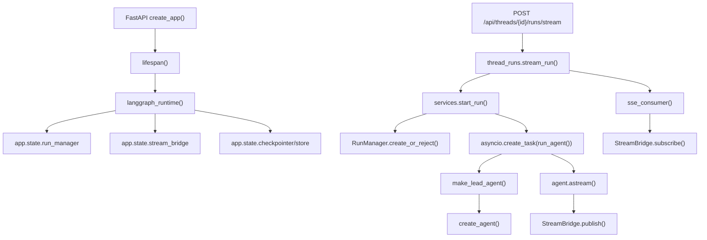

# 后端架构地图

## 总体分层

```text
frontend / IM channels
  |
  | HTTP / SSE / channel messages
  v
backend/app
  ├─ gateway/     FastAPI Gateway、路由、鉴权、服务层
  └─ channels/    飞书、钉钉、Slack、Telegram、微信等 IM 适配
  |
  | imports
  v
backend/packages/harness/deerflow
  ├─ agents/      Lead Agent、ThreadState、中间件、记忆
  ├─ runtime/     RunManager、worker、stream bridge、journal、checkpointer/store
  ├─ tools/       内置工具、subagent 工具、MCP 元数据
  ├─ sandbox/     本地/远程沙箱抽象与文件/命令工具
  ├─ mcp/         MCP client、session pool、工具缓存
  ├─ models/      模型工厂和 provider patch
  ├─ skills/      技能解析、存储、权限、工具策略
  ├─ persistence/ SQL 持久化、thread/run/feedback/user repository
  └─ config/      YAML 配置模型和路径解析
```

## 依赖边界

### 允许

```python
from deerflow.runtime import RunManager
from deerflow.agents.lead_agent.agent import make_lead_agent
from app.gateway.deps import get_run_manager
```

### 禁止

```python
# harness 层禁止导入 app 层
from app.gateway.routers.uploads import router
```

这个边界由 `backend/tests/test_harness_boundary.py` 固化。读代码时要始终记住：`deerflow.*` 应该能作为框架包独立存在，`app.*` 只是具体应用。

## Gateway 启动生命周期

方法级顺序：

1. `backend/app/gateway/app.py::create_app()`
2. `FastAPI(..., lifespan=lifespan)`
3. `lifespan(app)`
4. `get_app_config()`
5. `apply_logging_level(startup_config.log_level)`
6. `langgraph_runtime(app, startup_config)`
7. `_ensure_admin_user(app)`
8. `start_channel_service(startup_config)`
9. `yield`
10. `stop_channel_service()`
11. `AsyncExitStack` 清理 runtime 资源

### `create_app()` 做什么

- 读取 Gateway 配置，决定是否暴露 `/docs`、`/redoc`、`/openapi.json`。
- 创建 `FastAPI` 实例。
- 注册 CORS、CSRF、Auth 中间件。
- include 各业务 router。
- 暴露健康检查和 LangGraph 兼容 API。

### `lifespan()` 做什么

- 启动时读取一次 `startup_config`。
- 进入 `langgraph_runtime()` 初始化运行时对象。
- 检查管理员和孤立线程迁移。
- 启动 IM channel service。
- 关闭时停止 channel service，并释放 runtime 资源。

## `app.state` 上的核心单例

这些对象在 `backend/app/gateway/deps.py::langgraph_runtime()` 中创建：

| 字段 | 类型/来源 | 作用 |
| --- | --- | --- |
| `stream_bridge` | `make_stream_bridge(config)` | run 事件发布/订阅，驱动 SSE |
| `checkpointer` | `make_checkpointer(config)` | LangGraph 线程状态检查点 |
| `store` | `make_store(config)` | LangGraph Store，保存 thread metadata 等 |
| `run_store` | `RunRepository` 或 `MemoryRunStore` | run 行持久化 |
| `feedback_repo` | `FeedbackRepository` | 用户反馈 |
| `thread_store` | `make_thread_store(...)` | 线程元数据 |
| `run_event_store` | `make_run_event_store(...)` | RunJournal 事件日志 |
| `run_manager` | `RunManager(store=run_store)` | 活跃 run 注册表和状态机 |

## 热加载边界

### 请求期热加载

`get_config()` 每次通过 `get_app_config()` 读取当前配置，支持 `config.yaml` mtime 变化后热加载。适合读取：

- 模型列表和模型参数
- 工具开关
- 运行期 prompt/agent 相关配置

### 启动期快照

`langgraph_runtime(app, startup_config)` 中创建的连接型对象必须重启才能变更：

- checkpointer
- store
- persistence engine
- run event store
- stream bridge

原因是它们持有连接、文件句柄、内存队列或 provider 单例。

## 后端阅读大图



