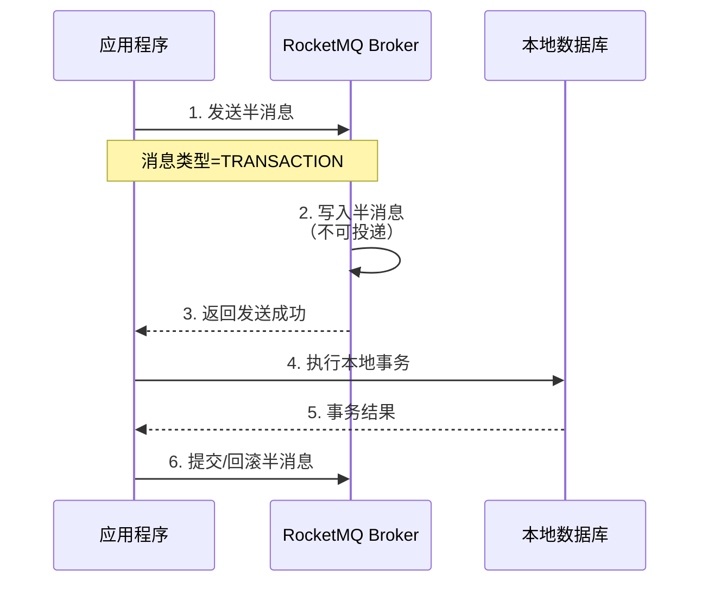
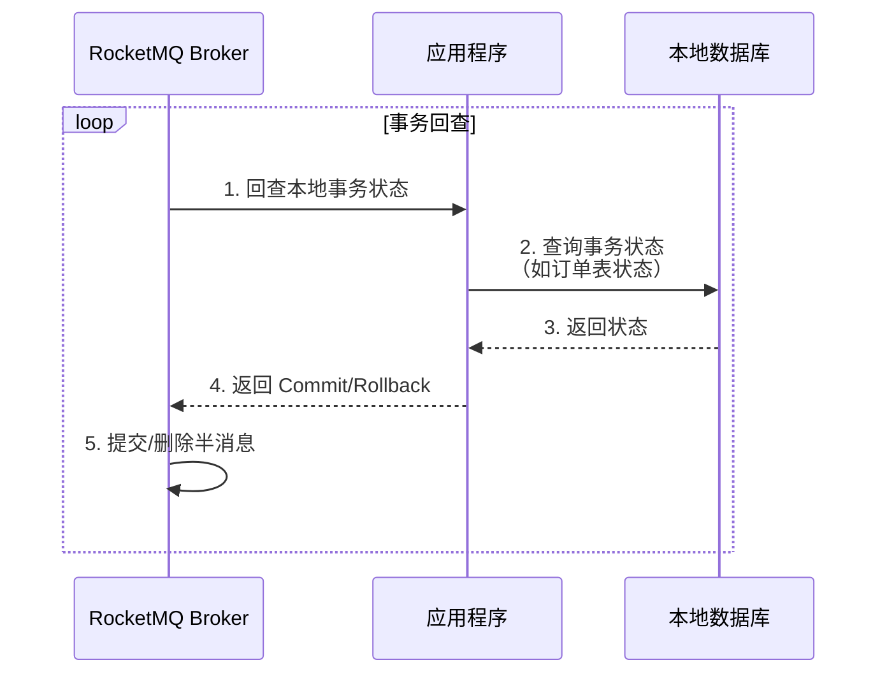
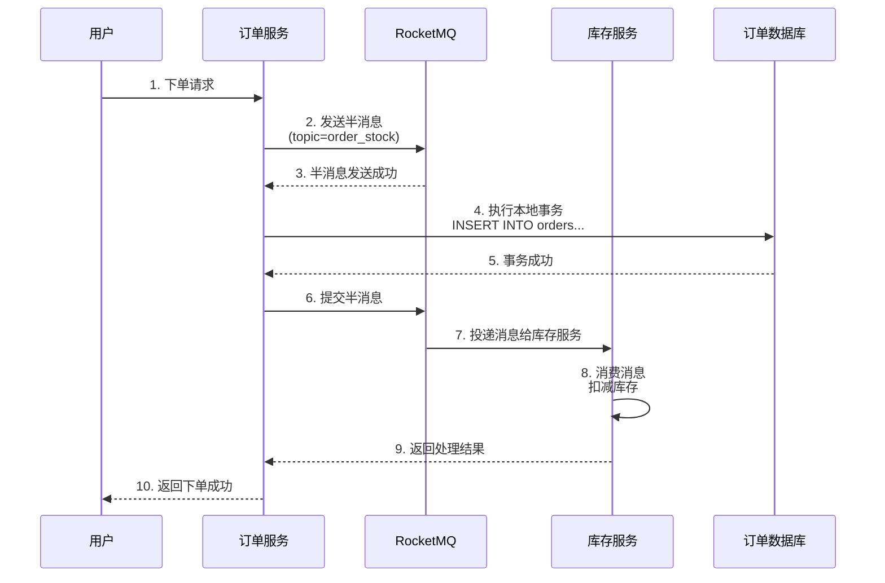
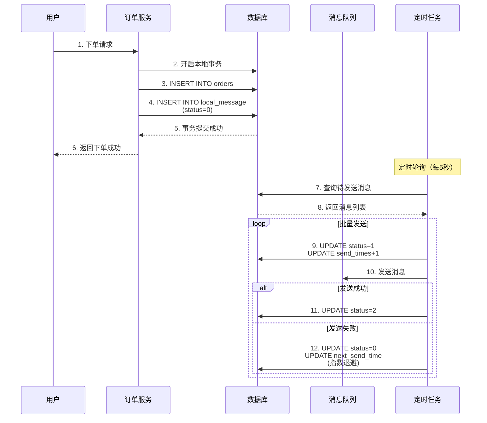
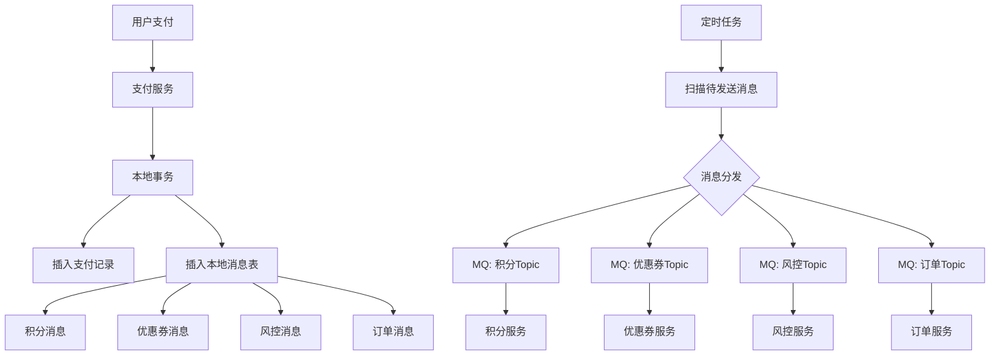
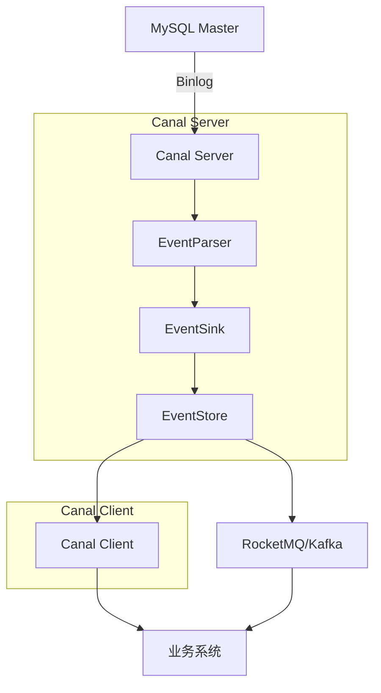
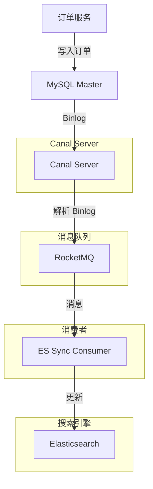
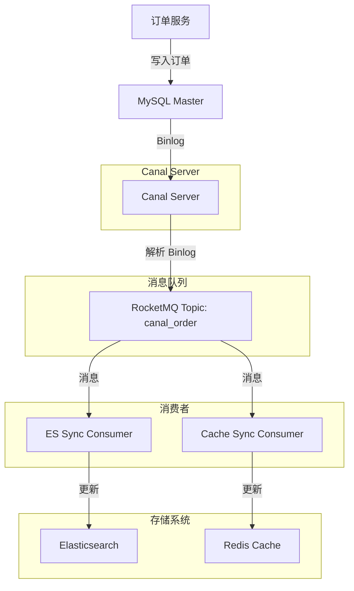
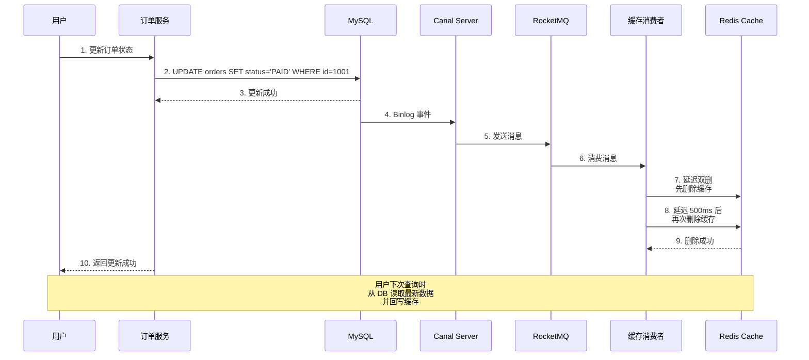
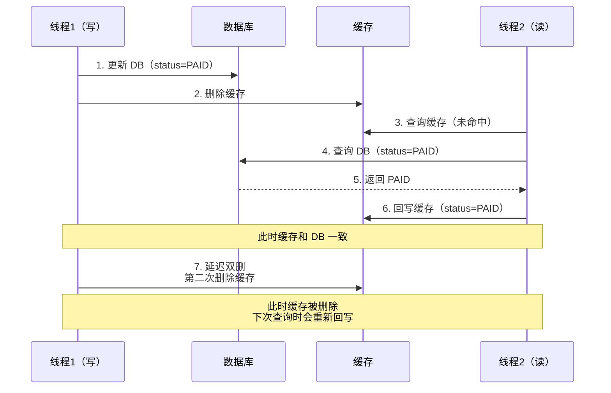

# 消息队列与数据库协同

## 一、消息队列与数据库协同

### 1.1 事务消息与本地消息表

#### RocketMQ 事务消息两阶段提交

##### 1、基础题：什么是 RocketMQ 事务消息？它解决了什么问题？

**⭐**（事务消息的定义、应用场景）

RocketMQ 事务消息是一种保证分布式事务一致性的消息机制，它通过两阶段提交（2PC）的思想，确保本地事务和消息发送的原子性。主要应用于需要保证业务操作和消息通知同时成功或同时失败的场景，如订单创建后异步通知库存系统、支付成功后通知积分系统等。

事务消息的核心思想是：将消息发送和本地事务绑定在一起，通过"半消息"机制和回查机制，最终保证消息与本地事务的一致性。

##### 2、进阶题：请详细说明 RocketMQ 事务消息的两阶段提交流程，以及如何保证消息不丢失？

**⭐⭐**（事务消息的两阶段流程、回查机制、消息可靠性）

1️⃣ Common Answer

重点总结（便于面试记忆）：

- Commit：Broker 将半消息转为正常消息，投递给消费者
- Rollback：Broker 删除半消息
- 两阶段提交 + 事务回查
- 第一阶段：发送半消息（Half Message）
- 不会投递给消费者
- 第二阶段：提交/回滚本地事务

2️⃣ Impressive Answer
RocketMQ 事务消息通过**两阶段提交 + 事务回查**机制来保证分布式事务的一致性。我给你详细讲一下整个流程：

**第一阶段：发送半消息（Half Message）**



应用程序先向 Broker 发送一条"半消息"，Broker 收到后将消息存储在特殊的 Topic（RMQ*SYS*TRANS*HALF*TOPIC）中，但**不会投递给消费者**。此时消息处于"待确认"状态。

**第二阶段：提交/回滚本地事务**
收到半消息发送成功响应后，应用程序执行本地数据库事务。根据本地事务的执行结果，向 Broker 发送 Commit 或 Rollback 指令：

- **Commit**：Broker 将半消息转为正常消息，投递给消费者

- **Rollback**：Broker 删除半消息

**事务回查机制（解决网络异常问题）**
如果应用程序在执行本地事务后崩溃、网络中断，导致 Broker 没收到 Commit/Rollback 指令怎么办？RocketMQ 提供了**事务回查机制**：



Broker 会定期扫描超过一定时间（默认 1 分钟）未确认的半消息，调用应用程序实现的 `TransactionListener.checkLocalTransaction()` 方法进行回查。应用程序需要根据本地事务的状态（如查询订单表）返回 Commit、Rollback 或 Unknown。

**消息不丢失的保障**

1. **同步刷盘**：关键业务配置 `syncMaster` 或 `flushDiskType=SYNC_FLUSH`，保证消息落盘后再返回成功

1. **主从同步**：配置 `asyncMaster` 或 `syncMaster`，保证消息在从机同步后再返回成功

1. **消息重试**：消费者消费失败时自动重试（默认 16 次），可配置重试策略

1. **死信队列**：重试失败的消息进入死信队列，人工介入处理

1. **事务回查兜底**：即使第一阶段成功但第二阶段失败，回查机制也能保证最终一致性

3️⃣ Key Differences

<table>
<tr>
<td>
维度
</td>
<td>
Common Answer
</td>
<td>
Impressive Answer
</td>
</tr>
<tr>
<td>
技术深度
</td>
<td>
只知道两阶段提交概念
</td>
<td>
能详细说明半消息机制、回查机制、状态流转
</td>
</tr>
<tr>
<td>
实践经验
</td>
<td>
缺乏异常场景考虑
</td>
<td>
能说出网络中断、应用崩溃等异常处理方案
</td>
</tr>
<tr>
<td>
思考维度
</td>
<td>
仅关注流程正确性
</td>
<td>
关注消息可靠性、性能优化、生产实践
</td>
</tr>
<tr>
<td>
表达方式
</td>
<td>
平铺直叙
</td>
<td>
用时序图、代码示例辅助说明
</td>
</tr>
<tr>
<td>
面试官印象
</td>
<td>
基础掌握，缺乏深度
</td>
<td>
理解透彻，有生产实战经验
</td>
</tr>
</table>

##### 3、场景题：在电商订单系统中，用户下单成功后需要异步通知库存系统扣减库存，如何保证下单和通知库存的一致性？

**⭐⭐⭐**（事务消息应用、幂等性设计、异常处理）

1️⃣ Common Answer

重点总结（便于面试记忆）：

- RocketMQ 事务消息 + 消息幂等性
- 整体方案设计
- 核心实现代码
- 重点：幂等性设计
- 数据库表设计（支持幂等性）
- 异常场景处理

2️⃣ Impressive Answer
这是一个经典的分布式事务场景，我会用**RocketMQ 事务消息 + 消息幂等性**来保证一致性。让我给你详细设计一下：

**整体方案设计**



**核心实现代码**

订单服务端（生产者）：

```java
// 发送事务消息
Message message = new Message("order_stock", orderId.toString(), orderJson.getBytes());
TransactionSendResult result = producer.sendMessageInTransaction(message, null);

// 实现事务监听器
public class OrderTransactionListener implements TransactionListener {
    
    @Override
    public LocalTransactionState executeLocalTransaction(Message msg, Object arg) {
        // 执行本地事务：插入订单
        try {
            String orderId = new String(msg.getBody());
            orderService.createOrder(orderId);
            return LocalTransactionState.COMMIT_MESSAGE;
        } catch (Exception e) {
            log.error("本地事务执行失败", e);
            return LocalTransactionState.ROLLBACK_MESSAGE;
        }
    }
    
    @Override
    public LocalTransactionState checkLocalTransaction(Message msg, Object arg) {
        // 回查本地事务状态
        String orderId = new String(msg.getBody());
        Order order = orderMapper.selectById(orderId);
        if (order != null && "SUCCESS".equals(order.getStatus())) {
            return LocalTransactionState.COMMIT_MESSAGE;
        } else if (order != null && "FAILED".equals(order.getStatus())) {
            return LocalTransactionState.ROLLBACK_MESSAGE;
        } else {
            return LocalTransactionState.UNKNOW; // 继续回查
        }
    }
}
```

库存服务端（消费者）- **重点：幂等性设计**：

```java
@RocketMQMessageListener(topic = "order_stock", consumerGroup = "stock_group")
public class StockConsumer implements RocketMQListener<OrderMessage> {
    
    @Override
    public void onMessage(OrderMessage message) {
        String orderId = message.getOrderId();
        
        // 幂等性校验：使用数据库唯一索引
        StockDeductRecord record = new StockDeductRecord();
        record.setOrderId(orderId);
        record.setSkuId(message.getSkuId());
        record.setQuantity(message.getQuantity());
        
        try {
            // INSERT 时如果 orderId + skuId 已存在，会抛出唯一索引异常
            stockMapper.insertDeductRecord(record);
            
            // 执行库存扣减
            stockService.deductStock(message.getSkuId(), message.getQuantity());
            
            log.info("库存扣减成功，orderId={}", orderId);
        } catch (DuplicateKeyException e) {
            log.warn("消息已处理过，跳过重复消费，orderId={}", orderId);
        } catch (Exception e) {
            log.error("库存扣减失败，orderId={}", orderId, e);
            // 抛出异常触发 RocketMQ 自动重试
            throw e;
        }
    }
}
```

**数据库表设计（支持幂等性）**

```sql
-- 订单表
CREATE TABLE orders (
    id BIGINT PRIMARY KEY,
    user_id BIGINT,
    total_amount DECIMAL,
    status VARCHAR(20), -- SUCCESS, FAILED
    create_time DATETIME,
    UNIQUE KEY uk_id (id)
);

-- 库存扣减记录表（幂等性表）
CREATE TABLE stock_deduct_record (
    id BIGINT AUTO_INCREMENT PRIMARY KEY,
    order_id BIGINT NOT NULL,
    sku_id BIGINT NOT NULL,
    quantity INT NOT NULL,
    create_time DATETIME,
    UNIQUE KEY uk_order_sku (order_id, sku_id) -- 幂等性关键
);
```

**异常场景处理**

<table>
<tr>
<td>
异常场景
</td>
<td>
处理方案
</td>
</tr>
<tr>
<td>
订单插入成功，但 Commit 指令丢失
</td>
<td>
Broker 回查订单表状态，发现订单成功，提交消息
</td>
</tr>
<tr>
<td>
订单插入失败，但 Rollback 指令丢失
</td>
<td>
Broker 回查订单表状态，发现订单不存在，回滚消息
</td>
</tr>
<tr>
<td>
库存服务消费失败（网络异常）
</td>
<td>
RocketMQ 自动重试（默认 16 次），直到成功
</td>
</tr>
<tr>
<td>
库存服务消费失败（业务异常）
</td>
<td>
重试多次后进入死信队列，人工介入处理
</td>
</tr>
<tr>
<td>
消息重复投递
</td>
<td>
库存服务通过唯一索引保证幂等性
</td>
</tr>
<tr>
<td>
库存服务消费成功但 ACK 丢失
</td>
<td>
RocketMQ 会重新投递，幂等性设计保证不会重复扣减
</td>
</tr>
</table>

**生产环境优化建议**

1. **消息轨迹追踪**：为每个消息设置唯一的 `messageId`，便于问题排查

1. **监控告警**：监控半消息堆积量、回查次数、死信队列消息数

1. **降级策略**：如果 MQ 不可用，降级为定时任务轮询订单表通知库存

1. **性能优化**：批量消费消息，减少网络开销

3️⃣ Key Differences

<table>
<tr>
<td>
维度
</td>
<td>
Common Answer
</td>
<td>
Impressive Answer
</td>
</tr>
<tr>
<td>
技术深度
</td>
<td>
简单说用事务消息
</td>
<td>
详细设计生产者、消费者、幂等性方案
</td>
</tr>
<tr>
<td>
实践经验
</td>
<td>
缺乏异常场景考虑
</td>
<td>
考虑了网络中断、重复消费、消费失败等场景
</td>
</tr>
<tr>
<td>
思考维度
</td>
<td>
仅关注功能实现
</td>
<td>
关注可靠性、可维护性、监控告警
</td>
</tr>
<tr>
<td>
表达方式
</td>
<td>
口头描述
</td>
<td>
用时序图、代码示例、表结构设计说明
</td>
</tr>
<tr>
<td>
面试官印象
</td>
<td>
了解基本概念
</td>
<td>
有完整的生产实战经验
</td>
</tr>
</table>

#### 本地消息表轮询重试

##### 1、基础题：什么是本地消息表？它和 RocketMQ 事务消息有什么区别？

**⭐**（本地消息表的定义、与事务消息的对比）

本地消息表是一种基于数据库的分布式事务解决方案，它将业务操作和消息发送都放在同一个本地事务中，通过定时任务轮扫描未发送的消息进行重试，最终保证消息的可靠性投递。

与 RocketMQ 事务消息的区别：

- **实现复杂度**：本地消息表更简单，不需要依赖 MQ 的特殊功能

- **性能**：本地消息表需要额外的数据库读写，性能略低

- **适用场景**：本地消息表适用于任何 MQ（Kafka、RabbitMQ 等），事务消息仅适用于 RocketMQ

- **一致性保证**：两者都能保证最终一致性，但事务消息的实时性更好

##### 2、进阶题：请设计一个基于本地消息表的订单通知方案，并说明如何保证消息不丢失？

**⭐⭐**（本地消息表设计、轮询重试机制、消息可靠性）

1️⃣ Common Answer

重点总结（便于面试记忆）：

- 将业务操作和消息发送绑定在同一个本地事务中
- 异步轮询重试
- 数据库表设计
- 核心业务流程
- 核心代码实现
- 消息不丢失的保障

2️⃣ Impressive Answer
本地消息表的核心思想是**将业务操作和消息发送绑定在同一个本地事务中**，通过**异步轮询重试**保证消息的最终可靠投递。我给你详细设计一下：

**数据库表设计**

```sql
-- 订单表
CREATE TABLE orders (
    id BIGINT PRIMARY KEY,
    user_id BIGINT,
    total_amount DECIMAL,
    status VARCHAR(20),
    create_time DATETIME
);

-- 本地消息表
CREATE TABLE local_message (
    id BIGINT AUTO_INCREMENT PRIMARY KEY,
    biz_type VARCHAR(50) NOT NULL,  -- 业务类型：ORDER_CREATED
    biz_id BIGINT NOT NULL,          -- 业务ID：订单ID
    topic VARCHAR(100) NOT NULL,     -- MQ Topic
    tag VARCHAR(50),                 -- MQ Tag
    message_body TEXT NOT NULL,      -- 消息内容
    status TINYINT NOT NULL DEFAULT 0, -- 0:待发送 1:发送中 2:发送成功 3:发送失败
    send_times INT DEFAULT 0,        -- 发送次数
    next_send_time DATETIME,         -- 下次发送时间
    create_time DATETIME,
    update_time DATETIME,
    UNIQUE KEY uk_biz (biz_type, biz_id),  -- 防止重复
    INDEX idx_status_time (status, next_send_time) -- 轮询索引
);
```

**核心业务流程**



**核心代码实现**

订单服务（插入订单和消息）：

```java
@Service
public class OrderService {
    
    @Transactional
    public void createOrder(OrderDTO orderDTO) {
        // 1. 插入订单
        Order order = new Order();
        order.setUserId(orderDTO.getUserId());
        order.setTotalAmount(orderDTO.getTotalAmount());
        order.setStatus("SUCCESS");
        orderMapper.insert(order);
        
        // 2. 插入本地消息（同一事务）
        LocalMessage message = new LocalMessage();
        message.setBizType("ORDER_CREATED");
        message.setBizId(order.getId());
        message.setTopic("order_created");
        message.setTag("stock");
        message.setMessageBody(JSON.toJSONString(order));
        message.setStatus(0); // 待发送
        message.setSendTimes(0);
        message.setNextSendTime(new Date());
        localMessageMapper.insert(message);
    }
}
```

定时任务（轮询重试）：

```java
@Component
public class MessageSendScheduler {
    
    // 每5秒执行一次
    @Scheduled(fixedDelay = 5000)
    public void sendPendingMessages() {
        // 1. 查询待发送的消息（分页，避免一次查太多）
        int pageSize = 100;
        List<LocalMessage> messages = localMessageMapper.selectPendingMessages(pageSize);
        
        if (CollectionUtils.isEmpty(messages)) {
            return;
        }
        
        // 2. 批量发送消息
        for (LocalMessage message : messages) {
            try {
                // 2.1 更新状态为发送中（防止重复消费）
                localMessageMapper.updateStatusToSendIng(message.getId());
                
                // 2.2 发送消息到 MQ
                SendResult result = rocketMQTemplate.syncSend(
                    message.getTopic() + ":" + message.getTag(),
                    message.getMessageBody()
                );
                
                if (result.getSendStatus() == SendStatus.SEND_OK) {
                    // 2.3 发送成功，更新状态
                    localMessageMapper.updateStatusToSuccess(message.getId());
                    log.info("消息发送成功，id={}", message.getId());
                } else {
                    throw new RuntimeException("消息发送失败");
                }
                
            } catch (Exception e) {
                log.error("消息发送失败，id={}", message.getId(), e);
                
                // 2.4 发送失败，更新状态和下次发送时间（指数退避）
                int sendTimes = message.getSendTimes() + 1;
                long delaySeconds = (long) Math.pow(2, sendTimes); // 2s, 4s, 8s...
                Date nextSendTime = new Date(System.currentTimeMillis() + delaySeconds * 1000);
                
                localMessageMapper.updateStatusToPending(
                    message.getId(), 
                    sendTimes, 
                    nextSendTime
                );
                
                // 2.5 如果重试次数超过阈值，标记为失败，人工介入
                if (sendTimes >= 10) {
                    localMessageMapper.updateStatusToFailed(message.getId());
                    // 发送告警通知
                    alertService.sendAlert("消息发送失败超过阈值，id=" + message.getId());
                }
            }
        }
    }
}
```

Mapper SQL（关键查询）：

```sql
-- 查询待发送的消息（使用索引，避免全表扫描）
SELECT * FROM local_message 
WHERE status = 0 
  AND next_send_time <= NOW() 
ORDER BY create_time ASC 
LIMIT #{pageSize};

-- 更新状态为发送中（乐观锁，防止并发重复发送）
UPDATE local_message 
SET status = 1, 
    update_time = NOW() 
WHERE id = #{id} AND status = 0;

-- 更新状态为成功
UPDATE local_message 
SET status = 2, 
    update_time = NOW() 
WHERE id = #{id};

-- 更新状态为待发送（重试）
UPDATE local_message 
SET status = 0, 
    send_times = #{sendTimes},
    next_send_time = #{nextSendTime},
    update_time = NOW() 
WHERE id = #{id};
```

**消息不丢失的保障**

1. **本地事务保证**：订单插入和消息插入在同一个事务中，要么都成功，要么都失败

1. **轮询重试机制**：定时任务持续扫描待发送消息，直到成功

1. **指数退避策略**：避免短时间内频繁重试，减少系统压力

1. **失败告警机制**：重试次数超过阈值时人工介入

1. **消息去重**：消费者端需要实现幂等性（如用 `biz_type + biz_id` 做唯一索引）

**与 RocketMQ 事务消息的对比**

<table>
<tr>
<td>
维度
</td>
<td>
本地消息表
</td>
<td>
RocketMQ 事务消息
</td>
</tr>
<tr>
<td>
实现复杂度
</td>
<td>
简单，不依赖 MQ 特殊功能
</td>
<td>
复杂，需要实现事务监听器
</td>
</tr>
<tr>
<td>
性能
</td>
<td>
需要额外的数据库读写，性能略低
</td>
<td>
性能更好，无需额外数据库操作
</td>
</tr>
<tr>
<td>
MQ 适配性
</td>
<td>
适用于所有 MQ（Kafka、RabbitMQ 等）
</td>
<td>
仅适用于 RocketMQ
</td>
</tr>
<tr>
<td>
实时性
</td>
<td>
依赖定时任务轮询，有延迟
</td>
<td>
实时性更好
</td>
</tr>
<tr>
<td>
一致性保证
</td>
<td>
最终一致性
</td>
<td>
最终一致性
</td>
</tr>
<tr>
<td>
适用场景
</td>
<td>
跨 MQ 场景、已有 MQ 不支持事务
</td>
<td>
RocketMQ 环境、对实时性要求高
</td>
</tr>
</table>

3️⃣ Key Differences

<table>
<tr>
<td>
维度
</td>
<td>
Common Answer
</td>
<td>
Impressive Answer
</td>
</tr>
<tr>
<td>
技术深度
</td>
<td>
简单说轮询重试
</td>
<td>
详细设计表结构、定时任务、指数退避
</td>
</tr>
<tr>
<td>
实践经验
</td>
<td>
缺乏生产环境考虑
</td>
<td>
考虑了并发控制、性能优化、告警机制
</td>
</tr>
<tr>
<td>
思考维度
</td>
<td>
仅关注功能实现
</td>
<td>
关注可靠性、可扩展性、与事务消息对比
</td>
</tr>
<tr>
<td>
表达方式
</td>
<td>
口头描述
</td>
<td>
用时序图、代码示例、SQL、对比表格
</td>
</tr>
<tr>
<td>
面试官印象
</td>
<td>
了解基本概念
</td>
<td>
有完整的架构设计能力
</td>
</tr>
</table>

##### 3、场景题：在支付系统中，支付成功后需要通知多个下游系统（如积分、优惠券、风控），如何保证所有通知都成功？

**⭐⭐⭐**（本地消息表应用、多下游通知、失败处理）

1️⃣ Common Answer

重点总结（便于面试记忆）：

- 一对多通知场景
- 本地消息表 + 分发策略
- 整体架构设计
- 数据库表设计
- 核心代码实现
- 异常场景处理

2️⃣ Impressive Answer
这是一个典型的**一对多通知场景**，我会用**本地消息表 + 分发策略**来保证所有下游都能收到通知。让我详细设计一下：

**整体架构设计**



**数据库表设计**

```sql
-- 支付表
CREATE TABLE payment (
    id BIGINT PRIMARY KEY,
    order_id BIGINT,
    user_id BIGINT,
    amount DECIMAL,
    status VARCHAR(20),
    create_time DATETIME
);

-- 本地消息表（支持多下游）
CREATE TABLE local_message (
    id BIGINT AUTO_INCREMENT PRIMARY KEY,
    biz_type VARCHAR(50) NOT NULL,      -- 业务类型：PAYMENT_SUCCESS
    biz_id BIGINT NOT NULL,             -- 业务ID：支付ID
    target_system VARCHAR(50) NOT NULL, -- 目标系统：POINT, COUPON, RISK, ORDER
    topic VARCHAR(100) NOT NULL,        -- MQ Topic
    tag VARCHAR(50),
    message_body TEXT NOT NULL,
    status TINYINT NOT NULL DEFAULT 0,  -- 0:待发送 1:发送中 2:发送成功 3:发送失败
    send_times INT DEFAULT 0,
    next_send_time DATETIME,
    create_time DATETIME,
    update_time DATETIME,
    UNIQUE KEY uk_biz_target (biz_type, biz_id, target_system),
    INDEX idx_status_time (status, next_send_time)
);
```

**核心代码实现**

支付服务（插入支付和多条消息）：

```java
@Service
public class PaymentService {
    
    @Transactional
    public void processPaymentSuccess(PaymentDTO paymentDTO) {
        // 1. 插入支付记录
        Payment payment = new Payment();
        payment.setOrderId(paymentDTO.getOrderId());
        payment.setUserId(paymentDTO.getUserId());
        payment.setAmount(paymentDTO.getAmount());
        payment.setStatus("SUCCESS");
        paymentMapper.insert(payment);
        
        Long paymentId = payment.getId();
        
        // 2. 插入多条本地消息（同一事务）
        List<LocalMessage> messages = buildMessages(paymentId, paymentDTO);
        for (LocalMessage message : messages) {
            localMessageMapper.insert(message);
        }
    }
    
    private List<LocalMessage> buildMessages(Long paymentId, PaymentDTO paymentDTO) {
        List<LocalMessage> messages = new ArrayList<>();
        
        // 积分消息
        messages.add(createMessage(paymentId, "POINT", "point_topic", "add", 
            buildPointMessage(paymentDTO)));
        
        // 优惠券消息
        messages.add(createMessage(paymentId, "COUPON", "coupon_topic", "use", 
            buildCouponMessage(paymentDTO)));
        
        // 风控消息
        messages.add(createMessage(paymentId, "RISK", "risk_topic", "check", 
            buildRiskMessage(paymentDTO)));
        
        // 订单消息
        messages.add(createMessage(paymentId, "ORDER", "order_topic", "update", 
            buildOrderMessage(paymentDTO)));
        
        return messages;
    }
    
    private LocalMessage createMessage(Long bizId, String targetSystem, 
                                      String topic, String tag, String body) {
        LocalMessage message = new LocalMessage();
        message.setBizType("PAYMENT_SUCCESS");
        message.setBizId(bizId);
        message.setTargetSystem(targetSystem);
        message.setTopic(topic);
        message.setTag(tag);
        message.setMessageBody(body);
        message.setStatus(0);
        message.setSendTimes(0);
        message.setNextSendTime(new Date());
        return message;
    }
}
```

定时任务（按目标系统分组批量发送）：

```java
@Component
public class MessageSendScheduler {
    
    @Scheduled(fixedDelay = 5000)
    public void sendPendingMessages() {
        // 1. 按目标系统分组查询，避免跨系统影响
        List<String> targetSystems = Arrays.asList("POINT", "COUPON", "RISK", "ORDER");
        
        for (String targetSystem : targetSystems) {
            sendMessagesByTargetSystem(targetSystem);
        }
    }
    
    private void sendMessagesByTargetSystem(String targetSystem) {
        int pageSize = 50;
        List<LocalMessage> messages = localMessageMapper.selectPendingMessages(
            targetSystem, pageSize);
        
        if (CollectionUtils.isEmpty(messages)) {
            return;
        }
        
        for (LocalMessage message : messages) {
            try {
                // 更新状态为发送中
                localMessageMapper.updateStatusToSendIng(message.getId());
                
                // 发送消息
                SendResult result = rocketMQTemplate.syncSend(
                    message.getTopic() + ":" + message.getTag(),
                    message.getMessageBody()
                );
                
                if (result.getSendStatus() == SendStatus.SEND_OK) {
                    localMessageMapper.updateStatusToSuccess(message.getId());
                    log.info("消息发送成功，system={}, id={}", targetSystem, message.getId());
                } else {
                    throw new RuntimeException("消息发送失败");
                }
                
            } catch (Exception e) {
                log.error("消息发送失败，system={}, id={}", targetSystem, message.getId(), e);
                
                // 失败重试
                int sendTimes = message.getSendTimes() + 1;
                long delaySeconds = calculateDelaySeconds(targetSystem, sendTimes);
                Date nextSendTime = new Date(System.currentTimeMillis() + delaySeconds * 1000);
                
                localMessageMapper.updateStatusToPending(
                    message.getId(), sendTimes, nextSendTime);
                
                if (sendTimes >= getMaxRetryTimes(targetSystem)) {
                    localMessageMapper.updateStatusToFailed(message.getId());
                    alertService.sendAlert(String.format(
                        "消息发送失败超过阈值，system=%s, id=%d", 
                        targetSystem, message.getId()));
                }
            }
        }
    }
    
    // 不同系统配置不同的重试策略
    private long calculateDelaySeconds(String targetSystem, int sendTimes) {
        switch (targetSystem) {
            case "POINT":
                return (long) Math.pow(2, sendTimes); // 2s, 4s, 8s...
            case "COUPON":
                return sendTimes * 5; // 5s, 10s, 15s...
            case "RISK":
                return 1; // 风控需要实时，快速重试
            case "ORDER":
                return (long) Math.pow(2, sendTimes);
            default:
                return (long) Math.pow(2, sendTimes);
        }
    }
    
    private int getMaxRetryTimes(String targetSystem) {
        switch (targetSystem) {
            case "RISK":
                return 20; // 风控允许更多重试
            default:
                return 10;
        }
    }
}
```

**异常场景处理**

<table>
<tr>
<td>
异常场景
</td>
<td>
处理方案
</td>
</tr>
<tr>
<td>
某个下游 MQ 不可用
</td>
<td>
其他下游正常发送，失败的按系统独立重试
</td>
</tr>
<tr>
<td>
某个下游消费失败
</td>
<td>
该下游消息持续重试，不影响其他下游
</td>
</tr>
<tr>
<td>
所有下游都失败
</td>
<td>
按系统独立重试，互不影响
</td>
</tr>
<tr>
<td>
某个下游重试次数超限
</td>
<td>
标记为失败，发送告警，人工介入
</td>
</tr>
<tr>
<td>
消息重复投递
</td>
<td>
下游服务实现幂等性（用 <code>biz_type + biz_id + target_system</code> 做唯一索引）
</td>
</tr>
</table>

**监控告警指标**

1. **待发送消息堆积量**：按目标系统分组监控

1. **发送失败率**：按目标系统统计

1. **平均发送耗时**：监控定时任务执行时间

1. **死信消息数**：重试超限的消息数量

**降级策略**
如果本地消息表出现严重堆积（如超过 10 万条），可以：

1. **增加定时任务线程数**：并行处理不同系统的消息

1. **增加批量大小**：从 50 条增加到 200 条

1. **暂停非核心系统**：暂停优惠券、风控等非核心系统的消息发送

1. **人工干预**：对堆积消息进行批量处理

3️⃣ Key Differences

<table>
<tr>
<td>
维度
</td>
<td>
Common Answer
</td>
<td>
Impressive Answer
</td>
</tr>
<tr>
<td>
技术深度
</td>
<td>
简单说插入多条消息
</td>
<td>
详细设计多下游分发、按系统分组、差异化重试策略
</td>
</tr>
<tr>
<td>
实践经验
</td>
<td>
缺乏异常场景考虑
</td>
<td>
考虑了系统隔离、监控告警、降级策略
</td>
</tr>
<tr>
<td>
思考维度
</td>
<td>
仅关注功能实现
</td>
<td>
关注高可用、可扩展性、生产运维
</td>
</tr>
<tr>
<td>
表达方式
</td>
<td>
口头描述
</td>
<td>
用架构图、代码示例、异常处理表格
</td>
</tr>
<tr>
<td>
面试官印象
</td>
<td>
了解基本概念
</td>
<td>
有完整的系统设计能力
</td>
</tr>
</table>

#### 消息幂等性

##### 1、基础题：什么是消息幂等性？为什么需要消息幂等性？

**⭐**（幂等性定义、产生重复消息的原因）

消息幂等性是指：无论消息被消费多少次，产生的结果都是一样的。即多次消费和一次消费的效果相同。

需要消息幂等性的原因：

1. **生产者重复发送**：网络抖动导致生产者没有收到 Broker 的 ACK，重试发送

1. **消费者重复消费**：消费者消费成功后 ACK 丢失，Broker 重新投递

1. **事务消息回查**：RocketMQ 事务消息的回查机制可能导致消息重复投递

1. **本地消息表重试**：定时任务轮询重试可能导致消息重复发送

##### 2、进阶题：请设计几种消息幂等性方案，并对比它们的优缺点？

**⭐⭐**（幂等性方案设计、方案对比）

1️⃣ Common Answer

重点总结（便于面试记忆）：

- 可靠性高，不依赖外部系统
- 实现简单，无需额外代码
- 天然支持事务一致性
- 需要修改业务表结构
- 不适用于非持久化场景

2️⃣ Impressive Answer
消息幂等性是分布式系统中的核心问题，我会从**业务幂等性**和**技术幂等性**两个维度来设计。给你详细讲一下：

**方案一：数据库唯一索引（推荐）**

这是最可靠、最简单的方案，适用于所有需要持久化的业务场景。

```sql
-- 业务表 + 唯一索引
CREATE TABLE stock_deduct (
    id BIGINT AUTO_INCREMENT PRIMARY KEY,
    order_id BIGINT NOT NULL,
    sku_id BIGINT NOT NULL,
    quantity INT NOT NULL,
    create_time DATETIME,
    UNIQUE KEY uk_order_sku (order_id, sku_id) -- 幂等性关键
);
```

```java
@RocketMQMessageListener(topic = "order_stock", consumerGroup = "stock_group")
public class StockConsumer implements RocketMQListener<OrderMessage> {
    
    @Override
    public void onMessage(OrderMessage message) {
        try {
            // 直接插入，如果已存在会抛出 DuplicateKeyException
            StockDeduct record = new StockDeduct();
            record.setOrderId(message.getOrderId());
            record.setSkuId(message.getSkuId());
            record.setQuantity(message.getQuantity());
            stockMapper.insert(record);
            
            // 执行库存扣减
            stockService.deductStock(message.getSkuId(), message.getQuantity());
            
        } catch (DuplicateKeyException e) {
            log.warn("消息已处理过，跳过重复消费，orderId={}", message.getOrderId());
        }
    }
}
```

**优点**：

- 可靠性高，不依赖外部系统

- 实现简单，无需额外代码

- 天然支持事务一致性

**缺点**：

- 需要修改业务表结构

- 不适用于非持久化场景

---

**方案二：Redis 去重表**

适用于高并发、对性能要求高的场景。

```java
@RocketMQMessageListener(topic = "order_stock", consumerGroup = "stock_group")
public class StockConsumer implements RocketMQListener<OrderMessage> {
    
    @Autowired
    private RedisTemplate<String, String> redisTemplate;
    
    @Override
    public void onMessage(OrderMessage message) {
        String key = "msg:dedup:" + message.getOrderId() + ":" + message.getSkuId();
        
        // SETNX：如果 key 不存在则设置成功，返回 true；否则返回 false
        Boolean success = redisTemplate.opsForValue().setIfAbsent(key, "1", 24, TimeUnit.HOURS);
        
        if (Boolean.TRUE.equals(success)) {
            // 首次消费，执行业务逻辑
            stockService.deductStock(message.getSkuId(), message.getQuantity());
            log.info("消息处理成功，orderId={}", message.getOrderId());
        } else {
            // 重复消费，直接跳过
            log.warn("消息已处理过，跳过重复消费，orderId={}", message.getOrderId());
        }
    }
}
```

**优点**：

- 性能高，Redis 操作快

- 不需要修改业务表结构

**缺点**：

- 依赖 Redis 的可用性

- 需要设置合理的过期时间

- Redis 宕机可能导致重复消费

---

**方案三：状态机 + 数据库乐观锁**

适用于业务状态流转的场景。

```sql
-- 订单表（带版本号）
CREATE TABLE orders (
    id BIGINT PRIMARY KEY,
    status VARCHAR(20) NOT NULL,
    version INT NOT NULL DEFAULT 0, -- 乐观锁版本号
    update_time DATETIME
);
```

```java
@RocketMQMessageListener(topic = "order_update", consumerGroup = "order_group")
public class OrderConsumer implements RocketMQListener<OrderMessage> {
    
    @Override
    public void onMessage(OrderMessage message) {
        // 使用乐观锁更新状态
        int updated = orderMapper.updateStatusWithVersion(
            message.getOrderId(), 
            "PAID", 
            "UNPAID",  // 只有从 UNPAID 状态才能更新为 PAID
            message.getVersion()
        );
        
        if (updated > 0) {
            // 更新成功，执行后续逻辑
            log.info("订单状态更新成功，orderId={}", message.getOrderId());
        } else {
            // 更新失败，说明状态已变更或重复消费
            log.warn("订单状态更新失败或重复消费，orderId={}", message.getOrderId());
        }
    }
}
```

```sql
-- Mapper SQL
UPDATE orders 
SET status = #{newStatus}, 
    version = version + 1,
    update_time = NOW() 
WHERE id = #{orderId} 
  AND status = #{oldStatus} 
  AND version = #{version};
```

**优点**：

- 天然支持业务状态流转

- 避免并发问题

**缺点**：

- 需要业务表有版本号字段

- 实现相对复杂

---

**方案四：分布式锁**

适用于需要保证同一时间只有一个消费者处理消息的场景。

```java
@RocketMQMessageListener(topic = "order_stock", consumerGroup = "stock_group")
public class StockConsumer implements RocketMQListener<OrderMessage> {
    
    @Autowired
    private RedissonClient redissonClient;
    
    @Override
    public void onMessage(OrderMessage message) {
        String lockKey = "lock:order:" + message.getOrderId();
        RLock lock = redissonClient.getLock(lockKey);
        
        try {
            // 尝试获取锁，最多等待 0 秒，锁 10 秒后自动释放
            boolean acquired = lock.tryLock(0, 10, TimeUnit.SECONDS);
            
            if (acquired) {
                try {
                    // 获取锁成功，执行业务逻辑
                    // 先查一下是否已经处理过
                    boolean processed = checkIfProcessed(message.getOrderId());
                    if (!processed) {
                        stockService.deductStock(message.getSkuId(), message.getQuantity());
                        markAsProcessed(message.getOrderId());
                    }
                } finally {
                    lock.unlock();
                }
            } else {
                // 获取锁失败，说明其他消费者正在处理
                log.warn("获取锁失败，跳过重复消费，orderId={}", message.getOrderId());
            }
        } catch (InterruptedException e) {
            Thread.currentThread().interrupt();
            log.error("获取锁被中断", e);
        }
    }
}
```

**优点**：

- 避免并发重复消费

- 可以控制并发度

**缺点**：

- 实现复杂，依赖 Redis

- 性能相对较低

---

**方案对比**

<table>
<tr>
<td>
方案
</td>
<td>
可靠性
</td>
<td>
性能
</td>
<td>
实现复杂度
</td>
<td>
适用场景
</td>
</tr>
<tr>
<td>
数据库唯一索引
</td>
<td>
⭐⭐⭐⭐⭐
</td>
<td>
⭐⭐⭐
</td>
<td>
⭐
</td>
<td>
需要持久化的业务场景
</td>
</tr>
<tr>
<td>
Redis 去重表
</td>
<td>
⭐⭐⭐⭐
</td>
<td>
⭐⭐⭐⭐⭐
</td>
<td>
⭐⭐
</td>
<td>
高并发、对性能要求高
</td>
</tr>
<tr>
<td>
状态机 + 乐观锁
</td>
<td>
⭐⭐⭐⭐⭐
</td>
<td>
⭐⭐⭐⭐
</td>
<td>
⭐⭐⭐
</td>
<td>
业务状态流转场景
</td>
</tr>
<tr>
<td>
分布式锁
</td>
<td>
⭐⭐⭐⭐
</td>
<td>
⭐⭐
</td>
<td>
⭐⭐⭐⭐
</td>
<td>
需要控制并发的场景
</td>
</tr>
</table>

**生产环境推荐组合**

1. **核心业务**：数据库唯一索引（最可靠）

1. **高并发场景**：Redis 去重表 + 数据库唯一索引（双重保障）

1. **状态流转**：状态机 + 乐观锁

1. **特殊场景**：分布式锁 + 数据库唯一索引

3️⃣ Key Differences

<table>
<tr>
<td>
维度
</td>
<td>
Common Answer
</td>
<td>
Impressive Answer
</td>
</tr>
<tr>
<td>
技术深度
</td>
<td>
简单说用 Redis 或数据库
</td>
<td>
详细设计 4 种方案，每种都有完整代码
</td>
</tr>
<tr>
<td>
实践经验
</td>
<td>
缺乏方案对比和场景选择
</td>
<td>
能根据不同场景选择合适的方案，有对比表格
</td>
</tr>
<tr>
<td>
思考维度
</td>
<td>
仅关注功能实现
</td>
<td>
关注可靠性、性能、复杂度的权衡
</td>
</tr>
<tr>
<td>
表达方式
</td>
<td>
口头描述
</td>
<td>
用代码示例、SQL、对比表格详细说明
</td>
</tr>
<tr>
<td>
面试官印象
</td>
<td>
了解基本概念
</td>
<td>
有完整的架构设计能力
</td>
</tr>
</table>

##### 3、场景题：在积分系统中，用户支付成功后需要增加积分，如何保证积分不会重复增加？

**⭐⭐⭐**（幂等性实战、业务幂等性设计）

1️⃣ Common Answer

重点总结（便于面试记忆）：

- 用户支付成功后，需要给用户增加积分
- 积分增加后，用户可以用积分兑换商品
- 如果积分重复增加，会导致用户积分异常，造成资损

2️⃣ Impressive Answer
积分系统的幂等性设计需要考虑**业务幂等性**和**技术幂等性**两个层面。我会用**数据库唯一索引 + 业务状态校验**的双重保障方案。让我详细设计一下：

**业务场景分析**

- 用户支付成功后，需要给用户增加积分

- 积分增加后，用户可以用积分兑换商品

- 如果积分重复增加，会导致用户积分异常，造成资损

**数据库表设计**

```sql
-- 用户积分表
CREATE TABLE user_point (
    id BIGINT AUTO_INCREMENT PRIMARY KEY,
    user_id BIGINT NOT NULL,
    total_point INT NOT NULL DEFAULT 0,
    update_time DATETIME,
    UNIQUE KEY uk_user_id (user_id)
);

-- 积分明细表（幂等性表）
CREATE TABLE point_detail (
    id BIGINT AUTO_INCREMENT PRIMARY KEY,
    user_id BIGINT NOT NULL,
    order_id BIGINT NOT NULL,          -- 关联订单
    point INT NOT NULL,                -- 积分变化量
    type VARCHAR(20) NOT NULL,         -- 类型：PAYMENT_ADD, EXCHANGE_USE
    status TINYINT NOT NULL DEFAULT 0, -- 0:待生效 1:已生效
    create_time DATETIME,
    UNIQUE KEY uk_order (order_id),    -- 幂等性关键：同一订单只能有一条记录
    INDEX idx_user_time (user_id, create_time)
);
```

**核心代码实现**

积分消费者（双重幂等性保障）：

```java
@RocketMQMessageListener(topic = "payment_success", consumerGroup = "point_group")
public class PointConsumer implements RocketMQListener<PaymentMessage> {
    
    @Autowired
    private UserPointMapper userPointMapper;
    
    @Autowired
    private PointDetailMapper pointDetailMapper;
    
    @Override
    public void onMessage(PaymentMessage message) {
        Long userId = message.getUserId();
        Long orderId = message.getOrderId();
        Integer point = calculatePoint(message.getAmount()); // 根据金额计算积分
        
        try {
            // 第一重幂等性：插入积分明细（数据库唯一索引）
            PointDetail detail = new PointDetail();
            detail.setUserId(userId);
            detail.setOrderId(orderId);
            detail.setPoint(point);
            detail.setType("PAYMENT_ADD");
            detail.setStatus(0);
            pointDetailMapper.insert(detail);
            
            // 第二重幂等性：校验订单是否已处理（防止并发重复消费）
            PointDetail existingDetail = pointDetailMapper.selectByOrderId(orderId);
            if (existingDetail != null && existingDetail.getStatus() == 1) {
                log.warn("订单已处理过，跳过重复消费，orderId={}", orderId);
                return;
            }
            
            // 增加用户积分
            int updated = userPointMapper.addPoint(userId, point);
            if (updated > 0) {
                // 更新积分明细状态为已生效
                pointDetailMapper.updateStatus(detail.getId(), 1);
                log.info("积分增加成功，userId={}, orderId={}, point={}", userId, orderId, point);
            } else {
                throw new RuntimeException("增加积分失败");
            }
            
        } catch (DuplicateKeyException e) {
            // 唯一索引冲突，说明订单已处理过
            log.warn("订单已处理过（唯一索引冲突），跳过重复消费，orderId={}", orderId);
            
            // 二次确认：查询订单状态，确保积分已生效
            PointDetail detail = pointDetailMapper.selectByOrderId(orderId);
            if (detail != null && detail.getStatus() == 1) {
                log.info("二次确认：订单积分已生效，orderId={}", orderId);
            } else {
                // 异常情况：订单记录存在但状态未生效，需要人工介入
                log.error("异常：订单记录存在但状态未生效，orderId={}", orderId);
                alertService.sendAlert("积分状态异常，orderId=" + orderId);
            }
            
        } catch (Exception e) {
            log.error("积分处理失败，orderId={}", orderId, e);
            // 抛出异常，触发 RocketMQ 重试
            throw e;
        }
    }
    
    private Integer calculatePoint(BigDecimal amount) {
        // 积分规则：每消费 1 元获得 1 积分
        return amount.intValue();
    }
}
```

Mapper SQL：

```sql
-- 插入积分明细（唯一索引 uk_order）
INSERT INTO point_detail (user_id, order_id, point, type, status, create_time)
VALUES (#{userId}, #{orderId}, #{point}, #{type}, 0, NOW());

-- 查询订单明细
SELECT * FROM point_detail WHERE order_id = #{orderId};

-- 增加用户积分
UPDATE user_point 
SET total_point = total_point + #{point},
    update_time = NOW()
WHERE user_id = #{userId};

-- 更新积分明细状态
UPDATE point_detail 
SET status = 1 
WHERE id = #{id};
```

**异常场景处理**

<table>
<tr>
<td>
异常场景
</td>
<td>
处理方案
</td>
</tr>
<tr>
<td>
消息重复投递
</td>
<td>
第一重：数据库唯一索引拦截&lt;br/&gt;第二重：查询订单状态二次确认
</td>
</tr>
<tr>
<td>
并发重复消费
</td>
<td>
唯一索引保证只有一个消费者能插入成功，其他消费者抛出 DuplicateKeyException
</td>
</tr>
<tr>
<td>
积分增加失败
</td>
<td>
抛出异常，触发 RocketMQ 重试
</td>
</tr>
<tr>
<td>
积分明细已插入但用户积分未增加
</td>
<td>
RocketMQ 重试后，查询订单状态发现 status=0，重新增加积分
</td>
</tr>
<tr>
<td>
积分明细已插入且用户积分已增加，但 ACK 丢失
</td>
<td>
RocketMQ 重新投递，唯一索引冲突，查询状态确认已生效
</td>
</tr>
<tr>
<td>
数据库唯一索引冲突但状态未生效
</td>
<td>
异常情况，发送告警，人工介入
</td>
</tr>
</table>

**监控告警指标**

1. **重复消费次数**：监控 `DuplicateKeyException` 异常次数

1. **积分明细状态异常**：监控 `status=0` 超过 5 分钟的记录

1. **用户积分异常**：监控用户积分突增或突减

1. **消费失败率**：监控 RocketMQ 消费失败率

**测试用例**

```java
@SpringBootTest
public class PointConsumerTest {
    
    @Autowired
    private PointConsumer pointConsumer;
    
    @Test
    public void testIdempotency() {
        PaymentMessage message = new PaymentMessage();
        message.setUserId(1001L);
        message.setOrderId(2001L);
        message.setAmount(new BigDecimal("100"));
        
        // 第一次消费，应该成功
        pointConsumer.onMessage(message);
        
        UserPoint userPoint = userPointMapper.selectByUserId(1001L);
        assertEquals(100, userPoint.getTotalPoint());
        
        // 第二次消费（重复），应该跳过
        pointConsumer.onMessage(message);
        
        userPoint = userPointMapper.selectByUserId(1001L);
        assertEquals(100, userPoint.getTotalPoint()); // 积分不应该增加
    }
}
```

**生产环境优化建议**

1. **积分明细表分区**：按用户 ID 分区，提升查询性能

1. **积分明细表归档**：将 3 个月前的明细数据归档到历史表

1. **积分增加批量处理**：如果消息量大，可以批量处理多个订单

1. **积分变更异步通知**：积分变更后异步通知用户（如推送、短信）

3️⃣ Key Differences

<table>
<tr>
<td>
维度
</td>
<td>
Common Answer
</td>
<td>
Impressive Answer
</td>
</tr>
<tr>
<td>
技术深度
</td>
<td>
简单说用 Redis 或数据库
</td>
<td>
详细设计双重幂等性保障，考虑并发、异常场景
</td>
</tr>
<tr>
<td>
实践经验
</td>
<td>
缺乏异常场景考虑
</td>
<td>
考虑了并发重复消费、状态异常、监控告警
</td>
</tr>
<tr>
<td>
思考维度
</td>
<td>
仅关注功能实现
</td>
<td>
关注业务幂等性、技术幂等性、可维护性
</td>
</tr>
<tr>
<td>
表达方式
</td>
<td>
口头描述
</td>
<td>
用代码示例、SQL、异常处理表格、测试用例
</td>
</tr>
<tr>
<td>
面试官印象
</td>
<td>
了解基本概念
</td>
<td>
有完整的生产实战经验
</td>
</tr>
</table>

##### 4、容易一起考的题

<table>
<tr>
<td>
关联题
</td>
<td>
和本题的关系
</td>
<td>
参考答案
</td>
</tr>
<tr>
<td>
RocketMQ 消息重复投递的原因
</td>
<td>
重复投递是幂等性问题的根源
</td>
<td>
答：幂等消费的核心是用业务唯一键或消息 ID 做去重，写入前查重或使用唯一索引/状态机，保证重试、重复投递时结果只生效一次。
</td>
</tr>
<tr>
<td>
分布式事务的解决方案
</td>
<td>
事务消息和本地消息表都需要考虑幂等性
</td>
<td>
答：这类题要先说明一致性目标，再讲本地事务、消息事务、Outbox、幂等消费和补偿机制的取舍。
</td>
</tr>
<tr>
<td>
数据库唯一索引的使用
</td>
<td>
唯一索引是实现幂等性的重要手段
</td>
<td>
答：数据库索引题要讲数据结构、匹配规则、回表成本、选择性和慢 SQL 验证，最后落到 explain。
</td>
</tr>
<tr>
<td>
Redis 分布式锁的实现
</td>
<td>
分布式锁是实现幂等性的另一种方案
</td>
<td>
答：缓存题要围绕命中率、一致性、过期策略、击穿/穿透/雪崩和监控告警来答。
</td>
</tr>
<tr>
<td>
如何设计高可用的积分系统
</td>
<td>
幂等性是高可用系统的基础
</td>
<td>
答：幂等消费的核心是用业务唯一键或消息 ID 做去重，写入前查重或使用唯一索引/状态机，保证重试、重复投递时结果只生效一次。
</td>
</tr>
</table>

---

### 1.2 CDC 变更数据捕获

#### MySQL Binlog 三种格式

##### 1、基础题：什么是 MySQL Binlog？它有哪几种格式？

**⭐**（Binlog 定义、三种格式）

MySQL Binlog（Binary Log）是 MySQL 的二进制日志，记录了所有对数据库数据进行修改的操作（INSERT、UPDATE、DELETE），主要用于数据恢复、主从复制、数据同步等场景。

Binlog 有三种格式：

1. **STATEMENT**：基于 SQL 语句的复制，记录执行的 SQL 语句

1. **ROW**：基于行的复制，记录每一行数据的变化

1. **MIXED**：混合模式，默认使用 STATEMENT，特殊情况下自动切换到 ROW

##### 2、进阶题：请详细说明 MySQL Binlog 三种格式的区别、优缺点及适用场景？

**⭐⭐**（三种格式的对比、优缺点分析）

1️⃣ Common Answer

重点总结（便于面试记忆）：

- 空间占用小：只记录 SQL 语句，不记录具体数据变化
- 网络传输快：传输的日志量小
- 可读性强：可以直接查看执行的 SQL
- 数据一致性风险：某些函数可能导致主从数据不一致
- 不确定性操作：使用 LIMIT、随机函数等可能导致不一致
- 对数据一致性要求不高的场景

2️⃣ Impressive Answer
MySQL Binlog 的三种格式各有优劣，我会从**数据一致性、性能、空间占用**等维度详细对比。给你详细讲一下：

**格式一：STATEMENT（基于 SQL 语句）**

记录执行的 SQL 语句本身。

```sql
-- 示例：Binlog 记录的内容
UPDATE user SET point = point + 100 WHERE id = 1;
```

**优点**：

- **空间占用小**：只记录 SQL 语句，不记录具体数据变化

- **网络传输快**：传输的日志量小

- **可读性强**：可以直接查看执行的 SQL

**缺点**：

- **数据一致性风险**：某些函数可能导致主从数据不一致
    `\``sql-- 问题示例：NOW() 函数在主从执行时间不同UPDATE user SET last_login = NOW() WHERE id = 1;

-- 问题示例：UUID() 函数每次生成不同的值
INSERT INTO user (id, name, token) VALUES (1, 'Alice', UUID());

`\``

- **不确定性操作**：使用 LIMIT、随机函数等可能导致不一致
    `\``sql-- 问题示例：LIMIT 在不同数据量下结果不同DELETE FROM log WHERE create_time < '2024-01-01' LIMIT 1000;

`\``

**适用场景**：

- 对数据一致性要求不高的场景

- 读写分离的主从复制

- 简单的 CRUD 操作

---

**格式二：ROW（基于行）**

记录每一行数据的变化。

```sql
-- 示例：Binlog 记录的内容
### UPDATE test.user
### WHERE
###   @1=1                    -- id
###   @2='Alice'              -- name
###   @3=100                  -- point (修改前)
### SET
###   @1=1
###   @2='Alice'
###   @3=200                  -- point (修改后)
```

**优点**：

- **数据一致性高**：记录每一行的具体变化，主从数据完全一致

- **支持所有操作**：不受函数、随机值等影响

- **精确恢复**：可以精确恢复到某一行数据的状态

**缺点**：

- **空间占用大**：记录所有行的变化，日志量巨大

- **网络传输慢**：传输的日志量大

- **可读性差**：无法直接查看执行的 SQL

**适用场景**：

- 对数据一致性要求高的场景（如金融、电商）

- 数据同步到 ES、缓存等

- 数据恢复、审计

---

**格式三：MIXED（混合模式）**

默认使用 STATEMENT，在以下情况自动切换到 ROW：

1. 使用了不确定函数（NOW()、UUID()、RAND() 等）

1. 使用了 LIMIT 且没有 ORDER BY

1. 使用了 LOAD DATA INFILE

1. 使用了 INSERT ... SELECT

1. 使用了用户自定义函数

```sql
-- 示例：MIXED 模式下的行为
-- 正常情况：使用 STATEMENT
UPDATE user SET point = point + 100 WHERE id = 1;

-- 自动切换到 ROW：使用 NOW() 函数
UPDATE user SET last_login = NOW() WHERE id = 1;
```

**优点**：

- **兼顾性能和一致性**：大部分情况用 STATEMENT 节省空间，特殊情况用 ROW 保证一致性

- **自动优化**：无需手动配置，MySQL 自动判断

**缺点**：

- **不可控**：切换逻辑由 MySQL 控制，无法精确控制

- **不确定性**：某些情况下可能无法准确预测使用哪种格式

**适用场景**：

- 对性能和一致性都有一定要求的场景

- 不想手动管理 Binlog 格式的场景

---

**三种格式对比**

<table>
<tr>
<td>
维度
</td>
<td>
STATEMENT
</td>
<td>
ROW
</td>
<td>
MIXED
</td>
</tr>
<tr>
<td>
数据一致性
</td>
<td>
⭐⭐
</td>
<td>
⭐⭐⭐⭐⭐
</td>
<td>
⭐⭐⭐⭐
</td>
</tr>
<tr>
<td>
空间占用
</td>
<td>
⭐⭐⭐⭐⭐
</td>
<td>
⭐⭐
</td>
<td>
⭐⭐⭐⭐
</td>
</tr>
<tr>
<td>
网络传输
</td>
<td>
⭐⭐⭐⭐⭐
</td>
<td>
⭐⭐
</td>
<td>
⭐⭐⭐⭐
</td>
</tr>
<tr>
<td>
可读性
</td>
<td>
⭐⭐⭐⭐⭐
</td>
<td>
⭐⭐
</td>
<td>
⭐⭐⭐⭐
</td>
</tr>
<tr>
<td>
恢复精确度
</td>
<td>
⭐⭐
</td>
<td>
⭐⭐⭐⭐⭐
</td>
<td>
⭐⭐⭐⭐
</td>
</tr>
<tr>
<td>
配置复杂度
</td>
<td>
⭐⭐⭐⭐⭐
</td>
<td>
⭐⭐⭐⭐⭐
</td>
<td>
⭐⭐⭐⭐⭐
</td>
</tr>
</table>

**生产环境配置建议**

```sql
-- 查看当前 Binlog 格式
SHOW VARIABLES LIKE 'binlog_format';

-- 设置 Binlog 格式（需要重启 MySQL）
SET GLOBAL binlog_format = 'ROW';  -- 推荐：CDC 场景
SET GLOBAL binlog_format = 'STATEMENT';  -- 主从复制场景
SET GLOBAL binlog_format = 'MIXED';  -- 折中方案

-- 推荐配置：CDC 场景
SET GLOBAL binlog_format = 'ROW';
SET GLOBAL binlog_row_image = 'FULL';  -- 记录修改前后的完整数据
```

**CDC 场景推荐使用 ROW 格式的原因**

1. **数据一致性**：保证同步到 ES、缓存的数据准确

1. **精确变更**：可以获取修改前后的完整数据

1. **支持所有操作**：不受函数、随机值等影响

1. **Canal、Debezium 等工具**：都推荐使用 ROW 格式

3️⃣ Key Differences

<table>
<tr>
<td>
维度
</td>
<td>
Common Answer
</td>
<td>
Impressive Answer
</td>
</tr>
<tr>
<td>
技术深度
</td>
<td>
简单说三种格式的区别
</td>
<td>
详细对比优缺点，给出配置建议
</td>
</tr>
<tr>
<td>
实践经验
</td>
<td>
缺乏场景选择经验
</td>
<td>
能根据不同场景选择合适的格式
</td>
</tr>
<tr>
<td>
思考维度
</td>
<td>
仅关注概念
</td>
<td>
关注数据一致性、性能、空间占用的权衡
</td>
</tr>
<tr>
<td>
表达方式
</td>
<td>
口头描述
</td>
<td>
用代码示例、对比表格、配置命令
</td>
</tr>
<tr>
<td>
面试官印象
</td>
<td>
了解基本概念
</td>
<td>
有生产环境配置经验
</td>
</tr>
</table>

##### 3、场景题：在电商系统中，需要将订单数据实时同步到 Elasticsearch，应该选择哪种 Binlog 格式？为什么？

**⭐⭐⭐**（Binlog 格式选择、CDC 实践）

1️⃣ Common Answer

重点总结（便于面试记忆）：

- 订单数据需要实时同步到 ES，用于商品搜索、订单查询
- 订单状态变更（如待支付 → 已支付 → 已发货）需要实时反映到 ES
- 订单金额、用户信息等变更需要精确同步
- 数据一致性要求高，不能出现订单状态不一致的情况
- ES 数据不准确：订单状态、支付时间等数据不一致
- 搜索结果错误：用户搜索订单时可能查不到或查到错误数据

2️⃣ Impressive Answer
在电商订单同步到 ES 的场景中，**必须使用 ROW 格式**。让我详细分析一下原因：

**场景需求分析**

- 订单数据需要实时同步到 ES，用于商品搜索、订单查询

- 订单状态变更（如待支付 → 已支付 → 已发货）需要实时反映到 ES

- 订单金额、用户信息等变更需要精确同步

- 数据一致性要求高，不能出现订单状态不一致的情况

**为什么不能用 STATEMENT 格式？**

STATEMENT 格式记录的是 SQL 语句，存在以下问题：

```sql
-- 问题 1：使用 NOW() 函数，主从执行时间不同
UPDATE orders 
SET status = 'PAID', 
    pay_time = NOW()  -- 主从执行时间不同，导致 pay_time 不一致
WHERE id = 1001;

-- 问题 2：使用 UUID() 函数，每次生成不同的值
UPDATE orders 
SET order_no = CONCAT(order_no, '_', UUID())  -- 主从生成不同的 UUID
WHERE id = 1001;

-- 问题 3：使用 LIMIT，可能影响不同数量的行
UPDATE orders 
SET status = 'CANCELLED' 
WHERE create_time < '2024-01-01' 
LIMIT 1000;  -- 主从数据量不同，可能影响不同数量的行
```

这些问题会导致：

- **ES 数据不准确**：订单状态、支付时间等数据不一致

- **搜索结果错误**：用户搜索订单时可能查不到或查到错误数据

- **业务异常**：订单状态判断错误，导致业务流程异常

**为什么不能用 MIXED 格式？**

MIXED 格式在大多数情况下使用 STATEMENT，只在特殊情况下切换到 ROW。但问题是：

- **不可控**：MySQL 自动判断切换逻辑，无法精确控制

- **不确定性**：某些情况下可能无法准确预测使用哪种格式

- **风险高**：如果 MySQL 判断失误，会导致数据不一致

**为什么必须使用 ROW 格式？**

ROW 格式记录每一行的具体变化，可以获取修改前后的完整数据：

```sql
-- 示例：订单状态变更
### UPDATE test.orders
### WHERE
###   @1=1001                -- id
###   @2='UNPAID'            -- status (修改前)
###   @3=NULL                -- pay_time (修改前)
### SET
###   @1=1001
###   @2='PAID'              -- status (修改后)
###   @3='2024-03-29 15:00:00'  -- pay_time (修改后)
```

ROW 格式的优势：

1. **数据一致性高**：主从数据完全一致，ES 数据准确

1. **精确变更**：可以获取修改前后的完整数据，便于 ES 更新

1. **支持所有操作**：不受函数、随机值等影响

1. **精确恢复**：如果 ES 同步失败，可以精确恢复到某个时间点

**生产环境配置**

```sql
-- 设置 Binlog 格式为 ROW
SET GLOBAL binlog_format = 'ROW';

-- 设置行镜像为 FULL（记录修改前后的完整数据）
SET GLOBAL binlog_row_image = 'FULL';

-- 验证配置
SHOW VARIABLES LIKE 'binlog_format';
SHOW VARIABLES LIKE 'binlog_row_image';
```

**Canal 配置示例**

```yaml
# canal.properties
canal.serverMode = rocketMQ
canal.mq.servers = 127.0.0.1:9876
canal.mq.producerGroup = canal_producer

# instance.properties
canal.instance.master.address=127.0.0.1:3306
canal.instance.master.journal.name=
canal.instance.master.position=
canal.instance.master.timestamp=
canal.instance.dbUsername=canal
canal.instance.dbPassword=canal
canal.instance.connectionCharset=UTF-8
canal.instance.filter.regex=.*\\..*  # 监听所有表
canal.instance.filter.black.regex=
```

**消费者代码示例（同步订单到 ES）**

```java
@RocketMQMessageListener(topic = "canal_order", consumerGroup = "es_sync_group")
public class OrderToEsConsumer implements RocketMQListener<CanalMessage> {
    
    @Autowired
    private ElasticsearchRestTemplate esTemplate;
    
    @Override
    public void onMessage(CanalMessage message) {
        List<CanalEntry.Entry> entries = message.getEntries();
        
        for (CanalEntry.Entry entry : entries) {
            if (entry.getEntryType() == CanalEntry.EntryType.ROWDATA) {
                CanalEntry.RowChange rowChange = CanalEntry.RowChange.parseFrom(entry.getStoreValue());
                
                for (CanalEntry.RowData rowData : rowChange.getRowDatasList()) {
                    String tableName = entry.getHeader().getTableName();
                    
                    if ("orders".equals(tableName)) {
                        if (rowChange.getEventType() == CanalEntry.EventType.INSERT) {
                            // 新增订单，插入到 ES
                            Order order = parseOrder(rowData.getAfterColumnsList());
                            esTemplate.save(order);
                            
                        } else if (rowChange.getEventType() == CanalEntry.EventType.UPDATE) {
                            // 更新订单，更新到 ES
                            Order order = parseOrder(rowData.getAfterColumnsList());
                            esTemplate.save(order);
                            
                        } else if (rowChange.getEventType() == CanalEntry.EventType.DELETE) {
                            // 删除订单，从 ES 删除
                            Long orderId = parseOrderId(rowData.getBeforeColumnsList());
                            esTemplate.delete(orderId, Order.class);
                        }
                    }
                }
            }
        }
    }
}
```

**异常场景处理**

<table>
<tr>
<td>
异常场景
</td>
<td>
处理方案
</td>
</tr>
<tr>
<td>
ES 同步失败
</td>
<td>
消息重试，直到成功
</td>
</tr>
<tr>
<td>
ES 不可用
</td>
<td>
消息堆积在 MQ，ES 恢复后自动消费
</td>
</tr>
<tr>
<td>
Binlog 丢失
</td>
<td>
Canal 记录消费位点，可以从上次位点继续消费
</td>
</tr>
<tr>
<td>
数据不一致
</td>
<td>
定时任务全量比对 DB 和 ES 数据，修复不一致数据
</td>
</tr>
</table>

**监控告警指标**

1. **Binlog 延迟**：监控 Canal 消费 Binlog 的延迟时间

1. **ES 同步延迟**：监控消息从 MQ 到 ES 的延迟时间

1. **同步失败率**：监控 ES 同步失败的次数

1. **数据一致性**：定时比对 DB 和 ES 的数据一致性

3️⃣ Key Differences

<table>
<tr>
<td>
维度
</td>
<td>
Common Answer
</td>
<td>
Impressive Answer
</td>
</tr>
<tr>
<td>
技术深度
</td>
<td>
简单说用 ROW 格式
</td>
<td>
详细分析 STATEMENT 和 MIXED 的问题，说明 ROW 的优势
</td>
</tr>
<tr>
<td>
实践经验
</td>
<td>
缺乏生产环境考虑
</td>
<td>
考虑了配置、异常处理、监控告警
</td>
</tr>
<tr>
<td>
思考维度
</td>
<td>
仅关注格式选择
</td>
<td>
关注数据一致性、生产实践、异常处理
</td>
</tr>
<tr>
<td>
表达方式
</td>
<td>
口头描述
</td>
<td>
用代码示例、配置命令、异常处理表格
</td>
</tr>
<tr>
<td>
面试官印象
</td>
<td>
了解基本概念
</td>
<td>
有完整的 CDC 实战经验
</td>
</tr>
</table>

##### 4、容易一起考的题

<table>
<tr>
<td>
关联题
</td>
<td>
和本题的关系
</td>
<td>
参考答案
</td>
</tr>
<tr>
<td>
MySQL 主从复制的原理
</td>
<td>
Binlog 是主从复制的基础
</td>
<td>
答：数据库索引题要讲数据结构、匹配规则、回表成本、选择性和慢 SQL 验证，最后落到 explain。
</td>
</tr>
<tr>
<td>
Canal 的架构原理
</td>
<td>
Canal 基于 Binlog 实现 CDC
</td>
<td>
答：Change Stream 是 MongoDB 原生变更订阅，适合同步 MongoDB 数据变化；Canal + Binlog 面向 MySQL 生态。比较时看数据源、可靠性、延迟、断点续传和运维复杂度。
</td>
</tr>
<tr>
<td>
如何保证数据一致性
</td>
<td>
ROW 格式是保证数据一致性的关键
</td>
<td>
答：Canal + RocketMQ + 多消费者；整体架构设计；核心实现步骤；步骤 1：配置 Canal
</td>
</tr>
<tr>
<td>
Elasticsearch 的数据同步方案
</td>
<td>
Binlog + Canal 是常用的同步方案
</td>
<td>
答：Elasticsearch 核心是倒排索引、分词、相关性排序和分片副本；工程上关注 mapping 设计、写入刷新、深分页和集群稳定性。
</td>
</tr>
</table>

---

#### Canal 架构原理

##### 1、基础题：什么是 Canal？它解决了什么问题？

**⭐**（Canal 定义、应用场景）

Canal 是阿里巴巴开源的 MySQL Binlog 增量订阅&消费组件，通过模拟 MySQL Slave 的交互协议，伪装成 MySQL Slave，向 MySQL Master 发送 dump 协议，MySQL Master 接收到 dump 请求后推送 Binlog 给 Canal，Canal 解析 Binlog 后发送到消息队列或存储到其他系统。

主要应用场景：

- **数据库镜像**：数据库实时备份

- **数据同步**：将 MySQL 数据同步到 ES、Redis、MongoDB 等

- **缓存更新**：数据库变更后自动更新缓存

- **数据解耦**：将数据库变更事件化，解耦业务系统

##### 2、进阶题：请详细说明 Canal 的架构原理，以及它如何保证数据不丢失？

**⭐⭐**（Canal 架构、数据可靠性保证）

1️⃣ Common Answer

重点总结（便于面试记忆）：

- Binlog 文件名：mysql-bin.000001
- Binlog 位置：1000
- 时间戳：1648560000000

2️⃣ Impressive Answer
Canal 的核心原理是**模拟 MySQL Slave 的交互协议**，通过**EventParser 解析 Binlog**、**EventSink 过滤和路由**、**EventStore 存储事件**、**EventAck 确认机制**来保证数据可靠性。让我详细讲一下：

**Canal 整体架构**



**核心组件详解**

**1. EventParser（事件解析器）**

负责模拟 MySQL Slave，向 MySQL Master 发送 dump 协议，接收并解析 Binlog。

```java
// EventParser 核心逻辑
public class EventParser {
    
    private MySQLConnection mysqlConnection;
    
    public void start() {
        // 1. 连接 MySQL Master
        mysqlConnection.connect();
        
        // 2. 发送 dump 协议，请求 Binlog
        BinlogDumpCommand dumpCommand = new BinlogDumpCommand();
        dumpCommand.setBinlogFileName("mysql-bin.000001");
        dumpCommand.setBinlogPosition(1000);
        mysqlConnection.sendCommand(dumpCommand);
        
        // 3. 接收 Binlog Event
        while (true) {
            BinlogEvent event = mysqlConnection.receiveEvent();
            
            // 4. 解析 Binlog Event
            if (event instanceof QueryEvent) {
                // QUERY 事件（DDL）
                parseQueryEvent((QueryEvent) event);
            } else if (event instanceof TableMapEvent) {
                // TABLE_MAP 事件（表结构映射）
                parseTableMapEvent((TableMapEvent) event);
            } else if (event instanceof WriteRowsEvent) {
                // WRITE_ROWS 事件（INSERT）
                parseWriteRowsEvent((WriteRowsEvent) event);
            } else if (event instanceof UpdateRowsEvent) {
                // UPDATE_ROWS 事件（UPDATE）
                parseUpdateRowsEvent((UpdateRowsEvent) event);
            } else if (event instanceof DeleteRowsEvent) {
                // DELETE_ROWS 事件（DELETE）
                parseDeleteRowsEvent((DeleteRowsEvent) event);
            }
        }
    }
}
```

**2. EventSink（事件过滤器）**

负责过滤和路由 Binlog 事件，支持表名过滤、字段过滤等。

```java
// EventSink 核心逻辑
public class EventSink {
    
    private List<CanalEventFilter> filters;
    private EventStore eventStore;
    
    public boolean sink(CanalEntry.Entry entry) {
        // 1. 表名过滤
        String tableName = entry.getHeader().getTableName();
        if (!isTableAllowed(tableName)) {
            return false;
        }
        
        // 2. 字段过滤
        if (entry.getEntryType() == CanalEntry.EntryType.ROWDATA) {
            CanalEntry.RowChange rowChange = CanalEntry.RowChange.parseFrom(entry.getStoreValue());
            filterColumns(rowChange);
        }
        
        // 3. 路由到不同的 EventStore
        routeToEventStore(entry);
        
        return true;
    }
}
```

**3. EventStore（事件存储器）**

负责存储 Binlog 事件，支持内存存储、文件存储、混合存储。

```java
// EventStore 核心逻辑
public class MemoryEventStore implements EventStore {
    
    private RingBuffer<CanalEntry.Entry> ringBuffer;
    private PositionManager positionManager;
    
    public void put(CanalEntry.Entry entry) {
        // 1. 存储事件到 RingBuffer
        ringBuffer.put(entry);
        
        // 2. 记录位点
        LogPosition position = buildPosition(entry);
        positionManager.persist(position);
    }
    
    public CanalEntry.Entry get(Position position) {
        // 1. 从 RingBuffer 获取事件
        CanalEntry.Entry entry = ringBuffer.get(position);
        
        // 2. 更新消费位点
        positionManager.update(position);
        
        return entry;
    }
}
```

**4. EventAck（确认机制）**

负责确认消费位点，保证数据不丢失。

```java
// EventAck 核心逻辑
public class EventAck {
    
    private PositionManager positionManager;
    
    public void ack(LogPosition position) {
        // 1. 更新消费位点
        positionManager.update(position);
        
        // 2. 持久化位点（防止重启丢失）
        positionManager.persist(position);
        
        // 3. 定时清理已确认的事件
        cleanConfirmedEvents(position);
    }
}
```

**数据可靠性保证机制**

**1. 位点记录（Position）**

Canal 记录了三个关键位点：

- **Binlog 文件名**：`mysql-bin.000001`

- **Binlog 位置**：`1000`

- **时间戳**：`1648560000000`

```java
// 位点记录
public class LogPosition {
    private String journalName;      // Binlog 文件名
    private Long position;           // Binlog 位置
    private Long timestamp;          // 时间戳
    private String gtid;             // GTID（MySQL 5.6+）
}
```

**2. 位点持久化**

位点存储在文件中，防止 Canal 重启后丢失：

```properties
# canal.properties
canal.instance.master.journal.name=mysql-bin.000001
canal.instance.master.position=1000
canal.instance.master.timestamp=1648560000000
```

**3. 消费确认机制**

Canal Client 消费成功后发送 ACK 确认：

```java
// Canal Client 消费代码
CanalConnector connector = CanalConnectors.newSingleConnector(
    new InetSocketAddress("127.0.0.1", 11111),
    "example",
    "",
    ""
);

connector.connect();
connector.subscribe(".*\\..*");

while (true) {
    Message message = connector.getWithoutAck(100);  // 获取 100 条消息
    long batchId = message.getId();
    
    try {
        List<CanalEntry.Entry> entries = message.getEntries();
        
        // 处理消息
        for (CanalEntry.Entry entry : entries) {
            // 业务处理
        }
        
        // 处理成功，ACK 确认
        connector.ack(batchId);
        
    } catch (Exception e) {
        // 处理失败，不 ACK，下次继续消费
        connector.rollback(batchId);
    }
}
```

**4. HA 高可用**

Canal 支持 HA 高可用，主节点宕机后自动切换：

```yaml
# canal.properties
canal.register.ip = 127.0.0.1
canal.port = 11111
canal.zkServers = 127.0.0.1:2181  # ZooKeeper 地址
canal.cluster.mode = true  # 集群模式
```

**异常场景处理**

<table>
<tr>
<td>
异常场景
</td>
<td>
处理方案
</td>
</tr>
<tr>
<td>
Canal 消费失败
</td>
<td>
不发送 ACK，下次继续消费
</td>
</tr>
<tr>
<td>
Canal 重启
</td>
<td>
从位点文件恢复消费位点
</td>
</tr>
<tr>
<td>
MySQL Master 切换
</td>
<td>
Canal 自动重新连接新的 Master
</td>
</tr>
<tr>
<td>
消息队列不可用
</td>
<td>
Canal 暂停消费，MQ 恢复后继续
</td>
</tr>
<tr>
<td>
Binlog 丢失
</td>
<td>
Canal 记录位点，可以从上次位点继续
</td>
</tr>
</table>

**生产环境配置建议**

```yaml
# canal.properties
canal.serverMode = rocketMQ  # 使用 RocketMQ
canal.mq.servers = 127.0.0.1:9876
canal.mq.producerGroup = canal_producer
canal.mq.topic = canal_order  # Topic 名称
canal.mq.partition = 0  # 分区数

# instance.properties
canal.instance.master.address=127.0.0.1:3306
canal.instance.dbUsername=canal
canal.instance.dbPassword=canal
canal.instance.connectionCharset=UTF-8
canal.instance.filter.regex=.*\\..*  # 监听所有表
canal.instance.filter.black.regex=mysql\\.slave_.*  # 黑名单

# 性能优化
canal.instance.network.receiveBufferSize = 16384
canal.instance.network.sendBufferSize = 16384
canal.instance.memory.batch.mode = MEMSIZE  # 内存批处理模式
canal.instance.memory.buffer.size = 32768  # 缓冲区大小
```

**监控告警指标**

1. **Binlog 延迟**：监控 Canal 消费 Binlog 的延迟时间

1. **消费堆积**：监控 EventStore 的堆积量

1. **消费失败率**：监控消费失败的次数

1. **HA 切换次数**：监控主节点切换次数

3️⃣ Key Differences

<table>
<tr>
<td>
维度
</td>
<td>
Common Answer
</td>
<td>
Impressive Answer
</td>
</tr>
<tr>
<td>
技术深度
</td>
<td>
简单说模拟 Slave
</td>
<td>
详细说明 EventParser、EventSink、EventStore、EventAck
</td>
</tr>
<tr>
<td>
实践经验
</td>
<td>
缺乏生产环境考虑
</td>
<td>
考虑了位点持久化、HA 高可用、异常处理
</td>
</tr>
<tr>
<td>
思考维度
</td>
<td>
仅关注基本原理
</td>
<td>
关注数据可靠性、性能优化、监控告警
</td>
</tr>
<tr>
<td>
表达方式
</td>
<td>
口头描述
</td>
<td>
用架构图、代码示例、配置文件、异常处理表格
</td>
</tr>
<tr>
<td>
面试官印象
</td>
<td>
了解基本概念
</td>
<td>
有完整的 Canal 实战经验
</td>
</tr>
</table>

##### 3、场景题：在电商系统中，需要将订单数据实时同步到 Elasticsearch，如何用 Canal 实现？

**⭐⭐⭐**（Canal 实战、数据同步方案）

1️⃣ Common Answer

重点总结（便于面试记忆）：

- Canal + RocketMQ + Elasticsearch
- 整体架构设计
- 核心实现步骤
- 步骤 1：配置 MySQL
- 步骤 2：配置 Canal Server
- 步骤 3：消费者代码（同步订单到 ES）

2️⃣ Impressive Answer
这是一个典型的 CDC 场景，我会用 **Canal + RocketMQ + Elasticsearch** 的架构来实现实时同步。让我详细设计一下：

**整体架构设计**



**核心实现步骤**

**步骤 1：配置 MySQL**

```sql
-- 确保 MySQL 开启 Binlog
SHOW VARIABLES LIKE 'log_bin';

-- 设置 Binlog 格式为 ROW
SET GLOBAL binlog_format = 'ROW';

-- 设置行镜像为 FULL
SET GLOBAL binlog_row_image = 'FULL';

-- 创建 Canal 用户
CREATE USER 'canal'@'%' IDENTIFIED BY 'canal';
GRANT SELECT, REPLICATION SLAVE, REPLICATION CLIENT ON *.* TO 'canal'@'%';
FLUSH PRIVILEGES;

-- 验证权限
SHOW GRANTS FOR 'canal'@'%';
```

**步骤 2：配置 Canal Server**

```yaml
# canal.properties
canal.serverMode = rocketMQ
canal.mq.servers = 127.0.0.1:9876
canal.mq.producerGroup = canal_producer
canal.mq.topic = canal_order
canal.mq.partition = 0
canal.mq.partitionHash = .*\\..*:id  # 按 id 分区

# instance.properties
canal.instance.master.address=127.0.0.1:3306
canal.instance.master.journal.name=
canal.instance.master.position=
canal.instance.master.timestamp=
canal.instance.dbUsername=canal
canal.instance.dbPassword=canal
canal.instance.connectionCharset=UTF-8
canal.instance.filter.regex=shop\\.orders  # 只监听 shop.orders 表
canal.instance.filter.black.regex=
canal.instance.network.receiveBufferSize = 16384
canal.instance.network.sendBufferSize = 16384
canal.instance.memory.batch.mode = MEMSIZE
canal.instance.memory.buffer.size = 32768
```

**步骤 3：消费者代码（同步订单到 ES）**

```java
@RocketMQMessageListener(topic = "canal_order", consumerGroup = "es_sync_group")
public class OrderToEsConsumer implements RocketMQListener<MessageExt> {
    
    @Autowired
    private ElasticsearchRestTemplate esTemplate;
    
    @Autowired
    private OrderMapper orderMapper;
    
    @Override
    public void onMessage(MessageExt message) {
        try {
            // 1. 解析 Canal 消息
            CanalMessage canalMessage = JSON.parseObject(new String(message.getBody()), CanalMessage.class);
            
            for (CanalEntry.Entry entry : canalMessage.getEntries()) {
                if (entry.getEntryType() == CanalEntry.EntryType.ROWDATA) {
                    CanalEntry.RowChange rowChange = CanalEntry.RowChange.parseFrom(entry.getStoreValue());
                    String tableName = entry.getHeader().getTableName();
                    
                    if ("orders".equals(tableName)) {
                        handleOrderChange(rowChange);
                    }
                }
            }
            
        } catch (Exception e) {
            log.error("同步订单到 ES 失败", e);
            // 抛出异常，触发 RocketMQ 重试
            throw e;
        }
    }
    
    private void handleOrderChange(CanalEntry.RowChange rowChange) {
        CanalEntry.EventType eventType = rowChange.getEventType();
        
        if (eventType == CanalEntry.EventType.INSERT) {
            // 新增订单
            for (CanalEntry.RowData rowData : rowChange.getRowDatasList()) {
                Order order = parseOrder(rowData.getAfterColumnsList());
                esTemplate.save(order);
                log.info("新增订单同步到 ES 成功，orderId={}", order.getId());
            }
            
        } else if (eventType == CanalEntry.EventType.UPDATE) {
            // 更新订单
            for (CanalEntry.RowData rowData : rowChange.getRowDatasList()) {
                Order order = parseOrder(rowData.getAfterColumnsList());
                esTemplate.save(order);
                log.info("更新订单同步到 ES 成功，orderId={}", order.getId());
            }
            
        } else if (eventType == CanalEntry.EventType.DELETE) {
            // 删除订单
            for (CanalEntry.RowData rowData : rowChange.getRowDatasList()) {
                Long orderId = parseOrderId(rowData.getBeforeColumnsList());
                esTemplate.delete(orderId, Order.class);
                log.info("删除订单同步到 ES 成功，orderId={}", orderId);
            }
        }
    }
    
    private Order parseOrder(List<CanalEntry.Column> columns) {
        Order order = new Order();
        for (CanalEntry.Column column : columns) {
            String name = column.getName();
            String value = column.getValue();
            
            switch (name) {
                case "id":
                    order.setId(Long.parseLong(value));
                    break;
                case "order_no":
                    order.setOrderNo(value);
                    break;
                case "user_id":
                    order.setUserId(Long.parseLong(value));
                    break;
                case "status":
                    order.setStatus(value);
                    break;
                case "total_amount":
                    order.setTotalAmount(new BigDecimal(value));
                    break;
                case "create_time":
                    order.setCreateTime(parseDateTime(value));
                    break;
                case "update_time":
                    order.setUpdateTime(parseDateTime(value));
                    break;
            }
        }
        return order;
    }
    
    private Long parseOrderId(List<CanalEntry.Column> columns) {
        for (CanalEntry.Column column : columns) {
            if ("id".equals(column.getName())) {
                return Long.parseLong(column.getValue());
            }
        }
        return null;
    }
}
```

**步骤 4：Elasticsearch 文档设计**

```java
@Document(indexName = "orders")
public class Order {
    
    @Id
    private Long id;
    
    @Field(type = FieldType.Keyword)
    private String orderNo;
    
    @Field(type = FieldType.Long)
    private Long userId;
    
    @Field(type = FieldType.Keyword)
    private String status;
    
    @Field(type = FieldType.Double)
    private BigDecimal totalAmount;
    
    @Field(type = FieldType.Date, format = DateFormat.date_hour_minute_second)
    private Date createTime;
    
    @Field(type = FieldType.Date, format = DateFormat.date_hour_minute_second)
    private Date updateTime;
    
    // getter/setter...
}
```

**异常场景处理**

<table>
<tr>
<td>
异常场景
</td>
<td>
处理方案
</td>
</tr>
<tr>
<td>
ES 不可用
</td>
<td>
消息堆积在 MQ，ES 恢复后自动消费
</td>
</tr>
<tr>
<td>
ES 同步失败
</td>
<td>
消息重试（默认 16 次），重试失败进入死信队列
</td>
</tr>
<tr>
<td>
Canal 消费延迟
</td>
<td>
监控告警， Canal 自动从上次位点继续消费
</td>
</tr>
<tr>
<td>
数据不一致
</td>
<td>
定时任务全量比对 DB 和 ES 数据，修复不一致数据
</td>
</tr>
<tr>
<td>
消息重复消费
</td>
<td>
ES 使用 <code>id</code> 作为文档 ID，天然支持幂等性
</td>
</tr>
</table>

**监控告警指标**

1. **Canal 延迟**：监控 Canal 消费 Binlog 的延迟时间

1. **ES 同步延迟**：监控消息从 MQ 到 ES 的延迟时间

1. **同步失败率**：监控 ES 同步失败的次数

1. **数据一致性**：定时比对 DB 和 ES 的数据一致性

**性能优化建议**

1. **批量消费**：设置 `consumeMessageBatchMaxSize=10`，批量消费消息

1. **异步消费**：使用 `@RocketMQMessageListener(consumeMode = ConsumeMode.CONCURRENTLY)` 并发消费

1. **ES 批量写入**：使用 `esTemplate.saveAll()` 批量写入 ES

1. **索引分区**：按时间分区索引，如 `orders_202403`、`orders_202404`

**测试用例**

```java
@SpringBootTest
public class OrderToEsConsumerTest {
    
    @Autowired
    private OrderMapper orderMapper;
    
    @Autowired
    private ElasticsearchRestTemplate esTemplate;
    
    @Test
    public void testSyncOrderToEs() {
        // 1. 插入订单到 MySQL
        Order order = new Order();
        order.setOrderNo("ORD20240329001");
        order.setUserId(1001L);
        order.setStatus("UNPAID");
        order.setTotalAmount(new BigDecimal("100.00"));
        order.setCreateTime(new Date());
        order.setUpdateTime(new Date());
        orderMapper.insert(order);
        
        // 2. 等待 Canal 同步
        Thread.sleep(5000);
        
        // 3. 查询 ES
        Order esOrder = esTemplate.get(order.getId(), Order.class);
        
        // 4. 验证数据
        assertNotNull(esOrder);
        assertEquals(order.getOrderNo(), esOrder.getOrderNo());
        assertEquals(order.getUserId(), esOrder.getUserId());
        assertEquals(order.getStatus(), esOrder.getStatus());
    }
}
```

3️⃣ Key Differences

<table>
<tr>
<td>
维度
</td>
<td>
Common Answer
</td>
<td>
Impressive Answer
</td>
</tr>
<tr>
<td>
技术深度
</td>
<td>
简单说用 Canal + MQ
</td>
<td>
详细设计 MySQL 配置、Canal 配置、消费者代码
</td>
</tr>
<tr>
<td>
实践经验
</td>
<td>
缺乏生产环境考虑
</td>
<td>
考虑了异常处理、监控告警、性能优化
</td>
</tr>
<tr>
<td>
思维维度
</td>
<td>
仅关注功能实现
</td>
<td>
关注数据一致性、可靠性、可维护性
</td>
</tr>
<tr>
<td>
表达方式
</td>
<td>
口头描述
</td>
<td>
用架构图、代码示例、配置文件、异常处理表格
</td>
</tr>
<tr>
<td>
面试官印象
</td>
<td>
了解基本概念
</td>
<td>
有完整的 CDC 实战经验
</td>
</tr>
</table>

##### 4、容易一起考的题

<table>
<tr>
<td>
关联题
</td>
<td>
和本题的关系
</td>
<td>
参考答案
</td>
</tr>
<tr>
<td>
MySQL Binlog 三种格式
</td>
<td>
Canal 基于 Binlog 实现，格式选择影响 Canal 功能
</td>
<td>
答：Change Stream 是 MongoDB 原生变更订阅，适合同步 MongoDB 数据变化；Canal + Binlog 面向 MySQL 生态。比较时看数据源、可靠性、延迟、断点续传和运维复杂度。
</td>
</tr>
<tr>
<td>
如何保证数据一致性
</td>
<td>
Canal 通过位点记录保证数据一致性
</td>
<td>
答：Canal + RocketMQ + 多消费者；整体架构设计；核心实现步骤；步骤 1：配置 Canal
</td>
</tr>
<tr>
<td>
Elasticsearch 的数据同步方案
</td>
<td>
Canal + MQ 是常用的 ES 同步方案
</td>
<td>
答：Elasticsearch 核心是倒排索引、分词、相关性排序和分片副本；工程上关注 mapping 设计、写入刷新、深分页和集群稳定性。
</td>
</tr>
<tr>
<td>
分布式系统的数据同步
</td>
<td>
Canal 是 CDC 技术的典型实现
</td>
<td>
答：分布式题先明确一致性、可用性和性能目标，再讲协议或方案；落地时补超时、重试、幂等、监控和故障恢复。
</td>
</tr>
</table>

---

#### DB 变更同步 ES/缓存

##### 1、基础题：为什么要将数据库变更同步到 Elasticsearch 和缓存？

**⭐**（同步原因、应用场景）

将数据库变更同步到 Elasticsearch 和缓存的主要原因：

1. **性能优化**：

  - Elasticsearch 支持全文搜索、复杂查询，查询性能远高于 MySQL

  - 缓存（Redis）读取速度极快，可以减轻数据库压力

1. **读写分离**：

  - MySQL 用于写操作（OLTP）

  - Elasticsearch 用于读操作（OLAP）

  - 缓存用于热点数据读取

1. **业务解耦**：

  - 数据库变更后自动同步到 ES 和缓存，业务代码无需关心同步逻辑

  - 避免业务代码中耦合同步逻辑

1. **数据一致性**：

  - 通过 CDC（Canal）实时同步，保证数据一致性

  - 避免定时同步带来的数据延迟

##### 2、进阶题：请设计一个数据库变更同步到 Elasticsearch 和缓存的方案，并说明如何保证数据一致性？

**⭐⭐**（同步方案设计、数据一致性保证）

1️⃣ Common Answer

重点总结（便于面试记忆）：

- Canal + RocketMQ + 多消费者
- 整体架构设计
- 核心实现步骤
- 步骤 1：配置 Canal
- 步骤 2：ES 同步消费者
- 步骤 3：缓存同步消费者

2️⃣ Impressive Answer
我会设计一个 **Canal + RocketMQ + 多消费者** 的架构，实现数据库变更实时同步到 ES 和缓存。让我详细讲一下：

**整体架构设计**



**核心实现步骤**

**步骤 1：配置 Canal**

```yaml
# canal.properties
canal.serverMode = rocketMQ
canal.mq.servers = 127.0.0.1:9876
canal.mq.producerGroup = canal_producer
canal.mq.topic = canal_order
canal.mq.partition = 0
canal.mq.partitionHash = .*\\..*:id

# instance.properties
canal.instance.master.address=127.0.0.1:3306
canal.instance.dbUsername=canal
canal.instance.dbPassword=canal
canal.instance.connectionCharset=UTF-8
canal.instance.filter.regex=shop\\.orders
```

**步骤 2：ES 同步消费者**

```java
@RocketMQMessageListener(topic = "canal_order", consumerGroup = "es_sync_group")
public class OrderToEsConsumer implements RocketMQListener<MessageExt> {
    
    @Autowired
    private ElasticsearchRestTemplate esTemplate;
    
    @Override
    public void onMessage(MessageExt message) {
        try {
            CanalMessage canalMessage = JSON.parseObject(new String(message.getBody()), CanalMessage.class);
            
            for (CanalEntry.Entry entry : canalMessage.getEntries()) {
                if (entry.getEntryType() == CanalEntry.EntryType.ROWDATA) {
                    CanalEntry.RowChange rowChange = CanalEntry.RowChange.parseFrom(entry.getStoreValue());
                    String tableName = entry.getHeader().getTableName();
                    
                    if ("orders".equals(tableName)) {
                        handleOrderChange(rowChange);
                    }
                }
            }
            
        } catch (Exception e) {
            log.error("同步订单到 ES 失败", e);
            throw e;
        }
    }
    
    private void handleOrderChange(CanalEntry.RowChange rowChange) {
        CanalEntry.EventType eventType = rowChange.getEventType();
        
        for (CanalEntry.RowData rowData : rowChange.getRowDatasList()) {
            if (eventType == CanalEntry.EventType.INSERT || eventType == CanalEntry.EventType.UPDATE) {
                // 新增或更新订单
                Order order = parseOrder(rowData.getAfterColumnsList());
                esTemplate.save(order);
                
            } else if (eventType == CanalEntry.EventType.DELETE) {
                // 删除订单
                Long orderId = parseOrderId(rowData.getBeforeColumnsList());
                esTemplate.delete(orderId, Order.class);
            }
        }
    }
}
```

**步骤 3：缓存同步消费者**

```java
@RocketMQMessageListener(topic = "canal_order", consumerGroup = "cache_sync_group")
public class OrderToCacheConsumer implements RocketMQListener<MessageExt> {
    
    @Autowired
    private RedisTemplate<String, Object> redisTemplate;
    
    @Override
    public void onMessage(MessageExt message) {
        try {
            CanalMessage canalMessage = JSON.parseObject(new String(message.getBody()), CanalMessage.class);
            
            for (CanalEntry.Entry entry : canalMessage.getEntries()) {
                if (entry.getEntryType() == CanalEntry.EntryType.ROWDATA) {
                    CanalEntry.RowChange rowChange = CanalEntry.RowChange.parseFrom(entry.getStoreValue());
                    String tableName = entry.getHeader().getTableName();
                    
                    if ("orders".equals(tableName)) {
                        handleOrderChange(rowChange);
                    }
                }
            }
            
        } catch (Exception e) {
            log.error("同步订单到缓存失败", e);
            throw e;
        }
    }
    
    private void handleOrderChange(CanalEntry.RowChange rowChange) {
        CanalEntry.EventType eventType = rowChange.getEventType();
        
        for (CanalEntry.RowData rowData : rowChange.getRowDatasList()) {
            String orderKey = "order:" + parseOrderId(rowData.getAfterColumnsList());
            
            if (eventType == CanalEntry.EventType.INSERT || eventType == CanalEntry.EventType.UPDATE) {
                // 新增或更新订单
                Order order = parseOrder(rowData.getAfterColumnsList());
                redisTemplate.opsForValue().set(orderKey, order, 1, TimeUnit.HOURS);
                
            } else if (eventType == CanalEntry.EventType.DELETE) {
                // 删除订单
                redisTemplate.delete(orderKey);
            }
        }
    }
}
```

**数据一致性保证机制**

**1. 消息幂等性**

ES 和缓存都使用唯一 ID 作为主键，天然支持幂等性：

```java
// ES 使用文档 ID
@Document(indexName = "orders")
public class Order {
    @Id
    private Long id;  // 唯一 ID
}

// 缓存使用唯一 Key
String orderKey = "order:" + orderId;
```

**2. 消息重试机制**

RocketMQ 自动重试，直到成功或达到最大重试次数：

```java
// 消费失败时抛出异常，触发重试
catch (Exception e) {
    log.error("同步失败", e);
    throw e;  // 触发 RocketMQ 重试
}
```

**3. 死信队列处理**

重试失败的消息进入死信队列，人工介入处理：

```java
// 监听死信队列
@RocketMQMessageListener(topic = "%DLQ%canal_order", consumerGroup = "dlq_handler_group")
public class DlqHandler implements RocketMQListener<MessageExt> {
    
    @Override
    public void onMessage(MessageExt message) {
        // 人工介入处理死信消息
        log.error("死信消息，需要人工处理，message={}", message);
        alertService.sendAlert("死信消息：" + message.getMsgId());
    }
}
```

**4. 数据一致性校验**

定时任务校验 DB、ES、缓存的数据一致性：

```java
@Component
public class DataConsistencyCheck {
    
    @Scheduled(cron = "0 0 2 * * ?")  // 每天凌晨 2 点执行
    public void checkConsistency() {
        // 1. 查询 DB 中的订单
        List<Order> dbOrders = orderMapper.selectAll();
        
        // 2. 查询 ES 中的订单
        List<Order> esOrders = esTemplate.searchForList(Query.findAll(), Order.class);
        
        // 3. 查询缓存中的订单
        List<Order> cacheOrders = new ArrayList<>();
        for (Order order : dbOrders) {
            String orderKey = "order:" + order.getId();
            Order cacheOrder = (Order) redisTemplate.opsForValue().get(orderKey);
            if (cacheOrder != null) {
                cacheOrders.add(cacheOrder);
            }
        }
        
        // 4. 比对数据一致性
        List<Order> inconsistentOrders = findInconsistentOrders(dbOrders, esOrders, cacheOrders);
        
        // 5. 修复不一致数据
        for (Order order : inconsistentOrders) {
            fixInconsistentOrder(order);
        }
    }
}
```

**异常场景处理**

<table>
<tr>
<td>
异常场景
</td>
<td>
处理方案
</td>
</tr>
<tr>
<td>
ES 不可用
</td>
<td>
消息堆积在 MQ，ES 恢复后自动消费
</td>
</tr>
<tr>
<td>
缓存不可用
</td>
<td>
消息堆积在 MQ，缓存恢复后自动消费
</td>
</tr>
<tr>
<td>
ES 同步失败
</td>
<td>
消息重试（默认 16 次），重试失败进入死信队列
</td>
</tr>
<tr>
<td>
缓存同步失败
</td>
<td>
消息重试（默认 16 次），重试失败进入死信队列
</td>
</tr>
<tr>
<td>
消息重复消费
</td>
<td>
ES 和缓存使用唯一 ID，天然支持幂等性
</td>
</tr>
<tr>
<td>
数据不一致
</td>
<td>
定时任务校验并修复不一致数据
</td>
</tr>
</table>

**性能优化建议**

1. **批量消费**：设置 `consumeMessageBatchMaxSize=10`，批量消费消息

1. **异步消费**：使用 `@RocketMQMessageListener(consumeMode = ConsumeMode.CONCURRENTLY)` 并发消费

1. **ES 批量写入**：使用 `esTemplate.saveAll()` 批量写入 ES

1. **缓存批量更新**：使用 `redisTemplate.opsForValue().multiSet()` 批量更新缓存

1. **消息分区**：按订单 ID 分区，保证同一订单的消息顺序性

```java
// 批量消费配置
@RocketMQMessageListener(
    topic = "canal_order",
    consumerGroup = "es_sync_group",
    consumeMode = ConsumeMode.CONCURRENTLY,
    consumeThreadMax = 10  // 最大消费线程数
)
```

**监控告警指标**

1. **Canal 延迟**：监控 Canal 消费 Binlog 的延迟时间

1. **ES 同步延迟**：监控消息从 MQ 到 ES 的延迟时间

1. **缓存同步延迟**：监控消息从 MQ 到缓存的延迟时间

1. **同步失败率**：监控 ES 和缓存同步失败的次数

1. **数据一致性**：定时比对 DB、ES、缓存的数据一致性

3️⃣ Key Differences

<table>
<tr>
<td>
维度
</td>
<td>
Common Answer
</td>
<td>
Impressive Answer
</td>
</tr>
<tr>
<td>
技术深度
</td>
<td>
简单说用 Canal + MQ
</td>
<td>
详细设计多消费者架构、一致性保证机制
</td>
</tr>
<tr>
<td>
实践经验
</td>
<td>
缺乏异常场景考虑
</td>
<td>
考虑了死信队列、数据一致性校验、性能优化
</td>
</tr>
<tr>
<td>
思维维度
</td>
<td>
仅关注功能实现
</td>
<td>
关注数据一致性、可靠性、性能优化
</td>
</tr>
<tr>
<td>
表达方式
</td>
<td>
口头描述
</td>
<td>
用架构图、代码示例、异常处理表格、监控指标
</td>
</tr>
<tr>
<td>
面试官印象
</td>
<td>
了解基本概念
</td>
<td>
有完整的 CDC 实战经验
</td>
</tr>
</table>

##### 3、场景题：在电商系统中，订单状态变更后需要实时更新缓存，如何保证缓存和数据库的一致性？

**⭐⭐⭐**（缓存一致性、实战场景）

1️⃣ Common Answer

重点总结（便于面试记忆）：

- 订单状态变更（如待支付 → 已支付 → 已发货）需要实时更新缓存
- 用户查询订单时优先从缓存读取，缓存不存在时从 DB 读取并回写缓存
- 需要保证缓存和数据库的强一致性，避免用户看到过期数据

2️⃣ Impressive Answer
订单状态变更的缓存一致性是一个经典问题，我会用 **Canal + Redis + 延迟双删** 的方案来保证强一致性。让我详细设计一下：

**场景需求分析**

- 订单状态变更（如待支付 → 已支付 → 已发货）需要实时更新缓存

- 用户查询订单时优先从缓存读取，缓存不存在时从 DB 读取并回写缓存

- 需要保证缓存和数据库的强一致性，避免用户看到过期数据

**整体架构设计**



**核心实现步骤**

**步骤 1：配置 Canal 监听订单表**

```yaml
# instance.properties
canal.instance.master.address=127.0.0.1:3306
canal.instance.dbUsername=canal
canal.instance.dbPassword=canal
canal.instance.connectionCharset=UTF-8
canal.instance.filter.regex=shop\\.orders  # 只监听订单表
```

**步骤 2：缓存更新消费者（延迟双删）**

```java
@RocketMQMessageListener(topic = "canal_order", consumerGroup = "cache_sync_group")
public class OrderCacheConsumer implements RocketMQListener<MessageExt> {
    
    @Autowired
    private RedisTemplate<String, Object> redisTemplate;
    
    @Autowired
    private OrderMapper orderMapper;
    
    @Override
    public void onMessage(MessageExt message) {
        try {
            CanalMessage canalMessage = JSON.parseObject(new String(message.getBody()), CanalMessage.class);
            
            for (CanalEntry.Entry entry : canalMessage.getEntries()) {
                if (entry.getEntryType() == CanalEntry.EntryType.ROWDATA) {
                    CanalEntry.RowChange rowChange = CanalEntry.RowChange.parseFrom(entry.getStoreValue());
                    String tableName = entry.getHeader().getTableName();
                    
                    if ("orders".equals(tableName)) {
                        handleOrderChange(rowChange);
                    }
                }
            }
            
        } catch (Exception e) {
            log.error("更新缓存失败", e);
            throw e;
        }
    }
    
    private void handleOrderChange(CanalEntry.RowChange rowChange) {
        CanalEntry.EventType eventType = rowChange.getEventType();
        
        for (CanalEntry.RowData rowData : rowChange.getRowDatasList()) {
            Long orderId = parseOrderId(rowData.getAfterColumnsList());
            String orderKey = "order:" + orderId;
            
            if (eventType == CanalEntry.EventType.UPDATE) {
                // 更新订单，执行延迟双删
                delayedDoubleDelete(orderId, orderKey);
                
            } else if (eventType == CanalEntry.EventType.DELETE) {
                // 删除订单，直接删除缓存
                redisTemplate.delete(orderKey);
            }
        }
    }
    
    private void delayedDoubleDelete(Long orderId, String orderKey) {
        // 第一次删除缓存
        redisTemplate.delete(orderKey);
        log.info("第一次删除缓存成功，orderId={}", orderId);
        
        // 延迟 500ms 后第二次删除缓存
        ScheduledExecutorService scheduler = Executors.newSingleThreadScheduledExecutor();
        scheduler.schedule(() -> {
            try {
                // 第二次删除缓存
                redisTemplate.delete(orderKey);
                log.info("第二次删除缓存成功，orderId={}", orderId);
            } catch (Exception e) {
                log.error("第二次删除缓存失败，orderId={}", orderId, e);
            }
        }, 500, TimeUnit.MILLISECONDS);
    }
}
```

**步骤 3：订单查询接口（Cache Aside 模式）**

```java
@Service
public class OrderService {
    
    @Autowired
    private OrderMapper orderMapper;
    
    @Autowired
    private RedisTemplate<String, Object> redisTemplate;
    
    public Order getOrderById(Long orderId) {
        String orderKey = "order:" + orderId;
        
        // 1. 先查缓存
        Order order = (Order) redisTemplate.opsForValue().get(orderKey);
        
        if (order != null) {
            log.info("缓存命中，orderId={}", orderId);
            return order;
        }
        
        // 2. 缓存不存在，查数据库
        log.info("缓存未命中，查询数据库，orderId={}", orderId);
        order = orderMapper.selectById(orderId);
        
        if (order != null) {
            // 3. 回写缓存
            redisTemplate.opsForValue().set(orderKey, order, 1, TimeUnit.HOURS);
            log.info("回写缓存成功，orderId={}", orderId);
        }
        
        return order;
    }
}
```

**为什么需要延迟双删？**

延迟双删是为了解决**并发读写**导致的数据不一致问题：



如果没有延迟双删，可能出现以下问题：

1. 线程 1 更新 DB（status=PAID）

1. 线程 1 删除缓存

1. 线程 2 查询缓存（未命中）

1. 线程 2 查询 DB（status=PAID）

1. 线程 2 回写缓存（status=PAID）

1. 此时缓存和 DB 一致

但如果线程 1 的 Canal 消息消费延迟，可能出现：

1. 线程 1 更新 DB（status=PAID）

1. 线程 1 删除缓存

1. 线程 2 查询缓存（未命中）

1. 线程 2 查询 DB（status=PAID）

1. 线程 2 回写缓存（status=PAID）

1. 线程 1 的 Canal 消息消费成功，删除缓存

1. 此时缓存被删除，下次查询时会重新回写

延迟双删可以保证在 Canal 消息消费期间，如果其他线程查询了 DB 并回写了缓存，延迟双删会再次删除缓存，确保下次查询时获取最新数据。

**异常场景处理**

<table>
<tr>
<td>
异常场景
</td>
<td>
处理方案
</td>
</tr>
<tr>
<td>
Canal 消费延迟
</td>
<td>
延迟双删保证缓存最终一致性
</td>
</tr>
<tr>
<td>
缓存删除失败
</td>
<td>
消息重试，直到成功
</td>
</tr>
<tr>
<td>
消息重复消费
</td>
<td>
缓存删除是幂等操作，重复删除无影响
</td>
</tr>
<tr>
<td>
缓存和 DB 不一致
</td>
<td>
定时任务校验并修复不一致数据
</td>
</tr>
<tr>
<td>
并发读写
</td>
<td>
延迟双删 + Cache Aside 模式保证一致性
</td>
</tr>
</table>

**监控告警指标**

1. **Canal 延迟**：监控 Canal 消费 Binlog 的延迟时间

1. **缓存更新延迟**：监控消息从 MQ 到缓存的延迟时间

1. **缓存命中率**：监控缓存的命中率

1. **数据一致性**：定时比对 DB 和缓存的数据一致性

**性能优化建议**

1. **批量删除缓存**：使用 `redisTemplate.delete(keys)` 批量删除缓存

1. **异步删除**：使用线程池异步执行延迟双删

1. **缓存预热**：系统启动时预热热点订单数据

1. **缓存分区**：按订单 ID 分区缓存，提升查询性能

```java
// 批量删除缓存
public void batchDeleteCache(List<Long> orderIds) {
    List<String> keys = orderIds.stream()
        .map(orderId -> "order:" + orderId)
        .collect(Collectors.toList());
    redisTemplate.delete(keys);
}
```

3️⃣ Key Differences

<table>
<tr>
<td>
维度
</td>
<td>
Common Answer
</td>
<td>
Impressive Answer
</td>
</tr>
<tr>
<td>
技术深度
</td>
<td>
简单说用 Canal 更新缓存
</td>
<td>
详细设计延迟双删方案，说明为什么需要延迟双删
</td>
</tr>
<tr>
<td>
实践经验
</td>
<td>
缺乏并发场景考虑
</td>
<td>
考虑了并发读写、消息延迟、异常处理
</td>
</tr>
<tr>
<td>
思维维度
</td>
<td>
仅关注功能实现
</td>
<td>
关注数据一致性、并发安全、性能优化
</td>
</tr>
<tr>
<td>
表达方式
</td>
<td>
口头描述
</td>
<td>
用时序图、代码示例、异常处理表格
</td>
</tr>
<tr>
<td>
面试官印象
</td>
<td>
了解基本概念
</td>
<td>
有完整的缓存一致性实战经验
</td>
</tr>
</table>

##### 4、容易一起考的题

<table>
<tr>
<td>
关联题
</td>
<td>
和本题的关系
</td>
<td>
参考答案
</td>
</tr>
<tr>
<td>
缓存一致性方案
</td>
<td>
延迟双删是缓存一致性的重要方案
</td>
<td>
答：这类题要先说明一致性目标，再讲本地事务、消息事务、Outbox、幂等消费和补偿机制的取舍。
</td>
</tr>
<tr>
<td>
Canal 的架构原理
</td>
<td>
Canal 是实现缓存同步的关键组件
</td>
<td>
答：Change Stream 是 MongoDB 原生变更订阅，适合同步 MongoDB 数据变化；Canal + Binlog 面向 MySQL 生态。比较时看数据源、可靠性、延迟、断点续传和运维复杂度。
</td>
</tr>
<tr>
<td>
Redis 的使用场景
</td>
<td>
缓存是 Redis 的典型使用场景
</td>
<td>
答：缓存题要围绕命中率、一致性、过期策略、击穿/穿透/雪崩和监控告警来答。
</td>
</tr>
<tr>
<td>
如何保证高并发下的数据一致性
</td>
<td>
缓存一致性是高并发数据一致性的重要部分
</td>
<td>
答：这类题要先说明一致性目标，再讲本地事务、消息事务、Outbox、幂等消费和补偿机制的取舍。
</td>
</tr>
</table>
---

## 知识点一句话总结

| 知识点 | 一句话总结（来自 Impressive Answer） |
| --- | --- |
| 事务消息与本地消息表 | Commit：Broker 将半消息转为正常消息，投递给消费者；Rollback：Broker 删除半消息；RocketMQ 事务消息通过两阶段提交 + 事务回查机制来保证分布式事务的一致性。我给你详细讲一下整个流程：；第一阶段：发送半消息（Half Message）。 |
| RocketMQ 事务消息两阶段提交 | RocketMQ 事务消息通过半消息、执行本地事务、提交或回滚消息、Broker 事务回查来保证本地事务和消息投递最终一致；关键是本地事务状态可查询、消费端幂等、异常时可补偿。 |
| 什么是 RocketMQ 事务消息？它解决了什么问题？ | RocketMQ 事务消息通过半消息、执行本地事务、提交或回滚消息、Broker 事务回查来保证本地事务和消息投递最终一致；关键是本地事务状态可查询、消费端幂等、异常时可补偿。 |
| 请详细说明 RocketMQ 事务消息的两阶段提交流程，以及如何保证消息不丢失？ | 消息不丢失要分三段保证：生产端同步发送、确认和重试；Broker 端持久化、复制和足够副本确认；消费端处理成功后再提交 offset，并配合幂等消费、失败重试、死信队列和监控补偿。 |
| 在电商订单系统中，用户下单成功后需要异步通知库存系统扣减库存，如何保证下单和通知库存的一致性？ | 订单插入成功，但 Commit 指令丢失：Broker 回查订单表状态，发现订单成功，提交消息；订单插入失败，但 Rollback 指令丢失：Broker 回查订单表状态，发现订单不存在，回滚消息；库存服务消费失败（网络异常）：RocketMQ 自动重试（默认 16 次），直到成功；库存服务消费失败（业务异常）：重试多次后进入死信队列，人工介入处理；消息重复投递：库存服务通过唯一索引保证幂等性；库存服务消费成功但 ACK 丢失：RocketMQ 会重新投递，幂等性设计保证不会重复扣减。 |
| 什么是本地消息表？它和 RocketMQ 事务消息有什么区别？ | RocketMQ 事务消息通过半消息、执行本地事务、提交或回滚消息、Broker 事务回查来保证本地事务和消息投递最终一致；关键是本地事务状态可查询、消费端幂等、异常时可补偿。 |
| 请设计一个基于本地消息表的订单通知方案，并说明如何保证消息不丢失？ | 消息不丢失要分三段保证：生产端同步发送、确认和重试；Broker 端持久化、复制和足够副本确认；消费端处理成功后再提交 offset，并配合幂等消费、失败重试、死信队列和监控补偿。 |
| 在支付系统中，支付成功后需要通知多个下游系统（如积分、优惠券、风控），如何保证所有通知都成功？ | 某个下游 MQ 不可用：其他下游正常发送，失败的按系统独立重试；某个下游消费失败：该下游消息持续重试，不影响其他下游；所有下游都失败：按系统独立重试，互不影响；某个下游重试次数超限：标记为失败，发送告警，人工介入；消息重复投递：下游服务实现幂等性（用 biz_type + biz_id + target_system 做唯一索引）。 |
| 什么是消息幂等性？为什么需要消息幂等性？ | 消息幂等性是指：无论消息被消费多少次，产生的结果都是一样的。即多次消费和一次消费的效果相同；生产者重复发送：网络抖动导致生产者没有收到 Broker 的 ACK，重试发送；消费者重复消费：消费者消费成功后 ACK 丢失，Broker 重新投递。 |
| 请设计几种消息幂等性方案，并对比它们的优缺点？ | 可靠性高，不依赖外部系统；消息幂等性是分布式系统中的核心问题，我会从业务幂等性和技术幂等性两个维度来设计。给你详细讲一下：；这是最可靠、最简单的方案，适用于所有需要持久化的业务场景。 |
| 在积分系统中，用户支付成功后需要增加积分，如何保证积分不会重复增加？ | 用户支付成功后，需要给用户增加积分；积分增加后，用户可以用积分兑换商品；如果积分重复增加，会导致用户积分异常，造成资损。 |
| 什么是 MySQL Binlog？它有哪几种格式？ | MySQL Binlog（Binary Log）是 MySQL 的二进制日志，记录了所有对数据库数据进行修改的操作（INSERT、UPDATE、DELETE），主要用于数据恢复、主从复制、数据同步等场景；STATEMENT：基于 SQL 语句的复制，记录执行的 SQL 语句；ROW：基于行的复制，记录每一行数据的变化。 |
| 请详细说明 MySQL Binlog 三种格式的区别、优缺点及适用场景？ | 空间占用小：只记录 SQL 语句，不记录具体数据变化；网络传输快：传输的日志量小；可读性强：可以直接查看执行的 SQL；数据一致性风险：某些函数可能导致主从数据不一致；不确定性操作：使用 LIMIT、随机函数等可能导致不一致。 |
| 在电商系统中，需要将订单数据实时同步到 Elasticsearch，应该选择哪种 Binlog 格式？为什么？ | 订单数据需要实时同步到 ES，用于商品搜索、订单查询；订单状态变更（如待支付 → 已支付 → 已发货）需要实时反映到 ES；订单金额、用户信息等变更需要精确同步；数据一致性要求高，不能出现订单状态不一致的情况；ES 数据不准确：订单状态、支付时间等数据不一致。 |
| Canal 架构原理 | Binlog 文件名：mysql-bin.000001；Binlog 位置：1000；时间戳：1648560000000。 |
| 什么是 Canal？它解决了什么问题？ | 数据库镜像：数据库实时备份；数据同步：将 MySQL 数据同步到 ES、Redis、MongoDB 等；缓存更新：数据库变更后自动更新缓存；数据解耦：将数据库变更事件化，解耦业务系统。 |
| 请详细说明 Canal 的架构原理，以及它如何保证数据不丢失？ | Binlog 文件名：mysql-bin.000001；Binlog 位置：1000；时间戳：1648560000000。 |
| 在电商系统中，需要将订单数据实时同步到 Elasticsearch，如何用 Canal 实现？ | ES 不可用：消息堆积在 MQ，ES 恢复后自动消费；ES 同步失败：消息重试（默认 16 次），重试失败进入死信队列；Canal 消费延迟：监控告警， Canal 自动从上次位点继续消费；数据不一致：定时任务全量比对 DB 和 ES 数据，修复不一致数据；消息重复消费：ES 使用 id 作为文档 ID，天然支持幂等性。 |
| DB 变更同步 ES/缓存 | ES 不可用：消息堆积在 MQ，ES 恢复后自动消费；缓存不可用：消息堆积在 MQ，缓存恢复后自动消费；ES 同步失败：消息重试（默认 16 次），重试失败进入死信队列；缓存同步失败：消息重试（默认 16 次），重试失败进入死信队列；消息重复消费：ES 和缓存使用唯一 ID，天然支持幂等性；数据不一致：定时任务校验并修复不一致数据。 |
| 为什么要将数据库变更同步到 Elasticsearch 和缓存？ | Elasticsearch 支持全文搜索、复杂查询，查询性能远高于 MySQL；缓存（Redis）读取速度极快，可以减轻数据库压力；MySQL 用于写操作（OLTP）；Elasticsearch 用于读操作（OLAP）；数据库变更后自动同步到 ES 和缓存，业务代码无需关心同步逻辑。 |
| 请设计一个数据库变更同步到 Elasticsearch 和缓存的方案，并说明如何保证数据一致性？ | ES 不可用：消息堆积在 MQ，ES 恢复后自动消费；缓存不可用：消息堆积在 MQ，缓存恢复后自动消费；ES 同步失败：消息重试（默认 16 次），重试失败进入死信队列；缓存同步失败：消息重试（默认 16 次），重试失败进入死信队列；消息重复消费：ES 和缓存使用唯一 ID，天然支持幂等性；数据不一致：定时任务校验并修复不一致数据。 |
| 在电商系统中，订单状态变更后需要实时更新缓存，如何保证缓存和数据库的一致性？ | 订单状态变更（如待支付 → 已支付 → 已发货）需要实时更新缓存；用户查询订单时优先从缓存读取，缓存不存在时从 DB 读取并回写缓存；需要保证缓存和数据库的强一致性，避免用户看到过期数据。 |
