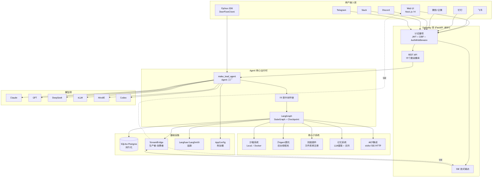

# DeerFlow：前言

如果你已经用过 LangChain / LangGraph 跑通过 Agent Demo，或者看过各种"接个 API 就跑"的教程，那么 DeerFlow 会带你走到下一站：**把一个 Agent 项目从"能跑"做到"能扛真实流量、能持续进化"。**

DeerFlow 要解决的问题不只是"让模型回答问题"，而是用 `Agent 核心循环 + 19 层中间件链 + 沙箱隔离 + 子 Agent 委托 + 技能插件 + 长期记忆 + MCP 协议 + 流桥推送 + IM 多渠道` 一整套组合，搭一个**可独立发布、可嵌入任何应用的 AI 超级 Agent 框架**。



*DeerFlow 系统架构图*

它不是一个简单的 LangChain 封装，而是一个**完整的 Agent 运行时框架**。上层的 FastAPI Gateway + IM 集成只是基于这个框架构建的一个具体应用，框架本身可以被任何其他 Python 应用内嵌使用。

---

## 1 这套项目重点学什么

很多教程会告诉你"用 LangChain 的 `create_agent` 就能做 Agent"，这当然能跑，但离一个生产环境下能用的 Agent 应用还差很远。

在 DeerFlow 里，重点不是让模型说得更顺，而是解决这些更具体的工程问题：

- 一个 Agent 请求进来，如何经过 19 层中间件的层层处理，每一层解决什么问题；

- 沙箱里的 bash 命令如何被审计和拦截，如何防止 `rm -rf /`、`curl | bash` 等危险操作；

- 大模型输出过多工具调用时如何限流，工具返回内容过大时如何外部化到磁盘；

- 50 轮对话之后 token 怎么不爆掉，Prompt Cache 命中率怎么不掉；

- 后端跑十几秒的长任务，前端怎么不傻等、怎么通过 SSE 实时看到 Agent 每一步在做什么；

- 用户上一轮说的偏好，下一轮怎么让 Agent 还记得；

- 技能（Skill）如何像插件一样安全地安装、扫描、启用、禁用，而不需要修改框架代码；

- MCP 协议的工具如何延迟加载、按需发现、会话池复用；

- 多个 IM 平台（飞书、钉钉、微信、Discord、Slack、Telegram）如何通过统一的 Channel 抽象接入。

所以，这套项目更像一条 **工程进阶线**：从 Agent 核心循环的基本概念开始，逐步把中间件链、沙箱隔离、子 Agent 委托、技能插件、长期记忆、MCP 协议、流桥推送、IM 多渠道一层层串起来，最后落到一个真正能嵌入任何应用、能持续优化的 Agent 框架。

学完之后，你应该能说清楚三件事：

1. 一个生产级 Agent 框架需要哪些基础设施，每一层为什么必须存在；

2. 中间件链模式比写死在 Agent 循环里强在哪，什么场景下值得用；

3. 一个 Agent 框架从用户输入到结果输出，中间到底经过了哪些层，每一层的设计权衡是什么。

---

## 2 这个项目最终做成什么样

从用户视角看，DeerFlow 是一个"能聊天、能执行代码、能搜索网页、能调用外部工具"的 AI 助手。

用户可以：

```
帮我分析这份 CSV 数据，画出销售趋势图
```

系统背后会按需做这些事：

1. UploadsMiddleware 检测到文件上传，将文件注入对话上下文；
2. SandboxMiddleware 获取或创建该线程的沙箱实例；
3. 模型决定调用 `bash` 工具读取 CSV 文件；
4. GuardrailMiddleware 审计 bash 命令，确认安全后放行；
5. 模型调用 `write_file` 工具生成 Python 分析脚本；
6. 模型调用 `bash` 工具执行脚本；
7. 模型调用 `present_file` 工具将生成的图表展示给用户；
8. MemoryMiddleware 将"用户喜欢数据分析"写入长期记忆；
9. TitleMiddleware 自动生成线程标题"销售趋势数据分析"；
10. StreamBridge 将每一步的进展通过 SSE 实时推送到前端。

执行过程中，前端不是简单"等待中"，而是通过 **SSE 事件流** 实时显示每一步：

```
正在读取 CSV 文件...
正在生成分析脚本...
正在执行 Python 脚本...
正在生成图表...
图表已生成 ✅
```

---

## 3 章节怎么安排

这套文档分成两段。

**第一段是核心框架剖析**，主要对应第 1 到 8 章。把 Agent 核心循环、中间件链、沙箱、子 Agent、技能、记忆、模型层、MCP 这些通用能力一个个讲清楚：

| 章节 | 重点 |
| --- | --- |
| 第 1 章 | 建立 Agent 核心循环的定位：LangGraph 状态图 vs 传统 while 循环 |
| 第 2 章 | 理解 19 层中间件链：每一层解决什么问题，为什么这个顺序 |
| 第 3 章 | 理解沙箱执行系统：虚拟路径映射、审计、安全防护、文件操作锁 |
| 第 4 章 | 理解子 Agent 委托：后台线程池、隔离事件循环、task 工具 |
| 第 5 章 | 理解技能插件系统：存储抽象、安全扫描、YAML 解析、安装流程 |
| 第 6 章 | 理解长期记忆：LLM 驱动提取、去抖队列、原子文件写入 |
| 第 7 章 | 理解模型集成层：多 Provider 适配、thinking/vision 支持 |
| 第 8 章 | 理解 MCP 协议集成：会话池、OAuth、工具缓存、延迟加载 |

**第二段是应用层与工程化**，主要对应第 9 到 14 章。把 Gateway API、IM 渠道、流桥推送、配置系统、测试体系这些工程能力串起来：

| 章节 | 重点 |
| --- | --- |
| 第 9 章 | 理解流桥与运行时：StreamBridge 解耦、RunManager 生命周期、SSE 推送 |
| 第 10 章 | 理解 FastAPI Gateway：认证鉴权、CSRF 防护、REST API 设计 |
| 第 11 章 | 理解 IM 多渠道集成：Channel 抽象、MessageBus、流式卡片更新 |
| 第 12 章 | 理解配置系统：热加载 vs 重启生效、分层配置、扩展配置 |
| 第 13 章 | 理解前端架构：Next.js App Router、流式渲染、状态管理 |
| 第 14 章 | 理解工程化体系：测试金字塔、CI 边界检查、代码质量保障 |

这样安排的好处是：前面 8 章是"装备库"，每个核心能力独立剖析；后面 6 章是"打 boss"，把这些能力在真实的应用场景中串起来。你不会一开始就被完整的 Gateway + IM 集成淹没，也不会只停留在零散的能力示例里。

---

## 4 技术栈全景

这个项目用到的技术不少，但每个技术都有明确位置。

| 模块 | 技术栈 | 在项目里的作用 |
| --- | --- | --- |
| Agent 运行时 | LangGraph StateGraph + Checkpoint | 核心循环：状态管理、条件分支、断点恢复 |
| Agent 创建 | LangChain `create_agent` + Middleware | Agent 工厂：模型绑定、工具装配、中间件链 |
| 中间件系统 | 19 个 Middleware（before_agent/before_model/after_model/wrap_tool_call） | 横切关注点：上传注入、错误处理、摘要、审计、循环检测 |
| 沙箱执行 | LocalSandbox（文件系统）/ AioSandbox（Docker 容器） | 隔离执行：bash、文件读写、glob、grep |
| 子 Agent | 后台线程池 + 隔离事件循环 | 任务委托：并行执行、结果收集、取消传播 |
| 技能系统 | SKILL.md + YAML Frontmatter + 文件系统存储 | 插件扩展：技能发现、安全扫描、工具白名单 |
| 记忆系统 | JSON 文件存储 + LLM 提取 + 去抖队列 | 跨会话记忆：事实存取、偏好追踪、强化/纠偏 |
| 模型层 | LangChain `init_chat_model` + 多 Provider 补丁 | 多模型支持：Claude/GPT/DeepSeek/vLLM/MindIE/Codex |
| MCP 集成 | `langchain-mcp-adapters` + 会话池 | 外部工具：stdio/SSE/HTTP 传输、OAuth 认证 |
| 流桥 | StreamBridge（生产者-消费者解耦） | 实时推送：SSE 事件流、心跳、断连处理 |
| 持久化 | SQLAlchemy async + SQLite/Postgres + Alembic | 数据存储：反馈、运行事件、线程元数据、用户 |
| 追踪 | Langfuse / LangSmith 回调 | 可观测性：Token 用量、步骤归属、Trace 元数据 |
| 后端服务 | FastAPI + Uvicorn + asyncio | HTTP API：认证、路由、依赖注入、SSE 端点 |
| IM 集成 | 飞书/钉钉/微信/企微/Discord/Slack/Telegram SDK | 多渠道接入：消息收发、流式推送、文件传输 |
| 前端页面 | Next.js 14 (App Router) + TypeScript + Tailwind + shadcn/ui | Web UI：对话界面、Agent 管理、设置面板 |
| 测试 | pytest + pytest-asyncio + blockbuster + Playwright + Vitest | 质量保障：~230 单元测试 + E2E + 阻塞 IO 检测 |
| 环境管理 | uv (Python) + pnpm (Node.js) | 依赖管理：workspace 模式、锁文件 |

你不需要把每个技术都学到很深才开始。更好的方式是：先看它在项目链路里解决什么问题，再回到对应章节看实现细节。

---

## 5 这套项目不刻意覆盖什么

DeerFlow 适合入门到进阶阶段学习，但它不是完整的商业产品。

当前版本重点覆盖的是 Agent 框架主链路：

```
用户输入
  → 19 层中间件链（上传注入 → 错误处理 → 沙箱审计 → 摘要压缩 → 循环检测 → ...）
  → Agent 核心循环（Think → Act → Observe）
  → 沙箱安全执行（bash/ls/read/write/glob/grep）
  → 子 Agent 委托（后台线程池 + 隔离事件循环）
  → 技能插件注入（工具白名单过滤）
  → MCP 外部工具（延迟加载 + 会话池）
  → 记忆持久化（LLM 提取 + 去抖队列）
  → StreamBridge SSE 推送
  → Gateway REST API + IM 多渠道
```

有些能力没有展开，比如：

- 多模态视觉理解的深度集成（当前有 `view_image` 工具，但未做图像内容分析 pipeline）；
- 大规模分布式部署（多实例 StreamBridge 共享、Redis 后端）；
- 细粒度的费率限制和配额管理；
- 向量数据库和 RAG pipeline（可作为 MCP 工具或技能集成）；
- 强化学习训练闭环；
- A/B 实验框架。

这些能力都重要，但不适合一开始全部放进来。第一版先把 **Agent 框架主链路 + 工程基础设施** 讲清楚，后面可以再逐层扩展，会更容易学，也更容易改。

---

## 6 项目目录结构

```
deer-flow/
├── backend/                          # Python 后端主目录
│   ├── app/                          # 应用层（不发布的 Python 包）
│   │   ├── gateway/                  # FastAPI Gateway
│   │   │   ├── app.py                # 应用工厂 + 生命周期管理
│   │   │   ├── routers/              # REST API 端点（~15 个路由模块）
│   │   │   ├── auth/                 # 认证子系统（JWT/bcrypt/SQLite）
│   │   │   ├── auth_middleware.py    # 认证中间件
│   │   │   ├── csrf_middleware.py    # CSRF 防护中间件
│   │   │   └── services.py           # Run 生命周期 + SSE 格式化
│   │   └── channels/                 # IM 平台集成
│   │       ├── base.py               # Channel 抽象基类
│   │       ├── manager.py            # 消息分发 + Agent 调用
│   │       ├── message_bus.py        # 异步发布/订阅总线
│   │       ├── feishu.py             # 飞书（流式卡片）
│   │       ├── dingtalk.py           # 钉钉（AI 卡片流）
│   │       ├── wechat.py             # 微信（iLink 长轮询）
│   │       ├── wecom.py              # 企微（WebSocket 流）
│   │       ├── discord.py            # Discord
│   │       ├── slack.py              # Slack（Socket Mode）
│   │       └── telegram.py           # Telegram（长轮询）
│   ├── packages/harness/             # deerflow-harness pip 包（核心框架）
│   │   └── deerflow/
│   │       ├── agents/               # Agent 编排
│   │       │   ├── lead_agent/       # 主 Agent 工厂 + 系统提示
│   │       │   ├── memory/           # 记忆子系统
│   │       │   ├── middlewares/      # 19 个中间件
│   │       │   ├── factory.py        # 纯 Python Agent 工厂
│   │       │   └── thread_state.py   # 线程状态定义
│   │       ├── sandbox/              # 沙箱执行系统
│   │       ├── subagents/            # 子 Agent 委托系统
│   │       ├── skills/               # 技能插件系统
│   │       ├── models/               # 多 Provider 模型层
│   │       ├── mcp/                  # MCP 协议集成
│   │       ├── runtime/              # LangGraph 运行时
│   │       │   ├── runs/             # Run 管理器 + Worker
│   │       │   ├── stream_bridge/    # 流桥（生产者-消费者）
│   │       │   ├── checkpointer/     # 检查点持久化
│   │       │   └── store/            # KV 存储
│   │       ├── config/               # 配置系统（~25 个配置模型）
│   │       ├── persistence/          # SQLAlchemy ORM + 迁移
│   │       ├── tools/                # 工具系统 + 内置工具
│   │       ├── community/            # 第三方工具集成
│   │       ├── guardrails/           # 守卫系统
│   │       ├── tracing/              # Langfuse/LangSmith 追踪
│   │       ├── uploads/              # 文件上传管理
│   │       └── client.py             # 嵌入式 Python 客户端
│   └── tests/                        # ~230+ 测试文件
├── frontend/                         # Next.js 前端应用
│   └── src/
│       ├── app/                      # App Router 页面
│       ├── components/               # UI 组件（ai-elements/shadcn/workspace）
│       ├── core/                     # 业务逻辑层（API/认证/状态/流渲染）
│       └── content/                  # MDX 文档（中英文）
├── skills/                           # Agent 技能目录
│   ├── public/                       # 20 个公开技能
│   └── custom/                       # 用户自定义技能
├── docker/                           # Docker 部署配置
├── scripts/                          # 运维和工具脚本
├── docs/                             # 项目文档
├── config.yaml                       # 主配置文件
├── extensions_config.json            # 扩展配置（MCP + 技能启用状态）
└── Makefile                          # 根级命令入口
```

---

## 7 建议怎么学

如果你是第一次接触 DeerFlow 这种工程化的 Agent 框架，不建议直接从 `app/gateway/app.py` 开始看。它背后依赖了中间件链、沙箱、子 Agent、技能、MCP、流桥——一上来就读会被淹没。

更稳的顺序是：

```
先看第 1 章，知道 Agent 核心循环在 LangGraph 上怎么落地
  → 看第 2 章，理解 19 层中间件链的每一层做什么、为什么这个顺序
  → 看第 3 章，理解沙箱如何隔离执行、如何审计危险命令
  → 看第 4 章，理解子 Agent 如何被委托、如何在隔离线程中执行
  → 看第 5 章，理解技能如何被加载、扫描、启用
  → 看第 6 章，理解记忆如何被 LLM 提取、去抖写入
  → 看第 7 到 8 章，依次理解模型层和 MCP 集成
  → 从第 9 章进入应用层：流桥、Gateway、IM、配置
  → 第 10 章看懂 FastAPI Gateway 的认证鉴权
  → 第 11 章理解 IM 多渠道如何统一抽象
  → 第 12 到 14 章看配置系统、前端、测试工程化
```

---

如果你已经准备好了，就从下一章开始，正式进入 DeerFlow 的深度剖析。

后面的内容会按照 **"Agent 核心循环 → 中间件链 → 沙箱系统 → 子 Agent 委托 → 技能插件 → 记忆系统 → 模型层 → MCP 集成 → 流桥运行时 → Gateway API → IM 多渠道 → 配置系统 → 前端架构 → 工程化测试"** 这条主线，逐步把整套框架拆开讲清楚。

学完之后，你收获的不只是"看懂了一个 Agent 项目"，而是能说清楚：一个工业级的 Agent 框架为什么要这样设计，中间件链、沙箱隔离、技能插件、MCP 协议、流桥推送在一条完整业务链路里分别解决什么问题，以及当老板某天问你"为什么这条链路这么慢 / 这么贵 / 这么不稳"时，你知道该从哪一层下刀。
