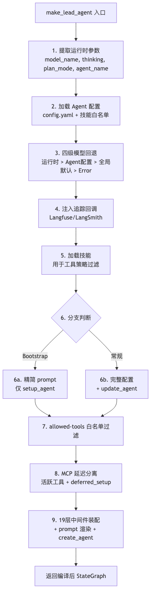

# 01 Agent 核心循环与 LangGraph 运行时

**本章课程目标：**

- 建立对 DeerFlow Agent 核心循环的定位：LangGraph StateGraph 作为执行引擎的角色。
- 理解 `make_lead_agent` 的 9 步构造流程：从模型选择到中间件装配。
- 理解 ThreadState 的自定义 Reducer 设计：为什么需要 `merge_artifacts`、`merge_todos`。
- 初步认识 DeerFlow 里的 19 层中间件、沙箱工具、内置工具在 Agent 循环中的位置。

**学习建议：** 这一章先建立概念地图。建议边读边画一条线：用户输入进来 → 中间件链做了什么 → Agent 怎么决策 → 调了哪个工具 → 观察结果后决定继续还是收尾。这条线画清楚了，后面的代码和工程就有框架可挂。

---

## 1、本章导读

### 1.1 先看清这章在整体中的位置

DeerFlow 的核心执行引擎基于 LangGraph。但 DeerFlow 不是 LangGraph 的简单封装——它在 LangGraph 的基础上构建了一整套**生产级基础设施**：19 层中间件链、沙箱隔离、子 Agent 委托、技能插件、MCP 工具集成、长期记忆、流桥推送。

本章聚焦于最核心的问题：**DeerFlow 的 Agent 到底怎么跑起来的？**

### 1.2 本章先做什么，不做什么

本章完成的是：

1. 搞清楚 LangGraph StateGraph 在 DeerFlow 中的角色。
2. 看懂 `make_lead_agent` 的完整构造流程。
3. 理解 ThreadState 的设计考量。

暂时不碰的是：

- 每个中间件的具体实现（第 2 章）。
- 沙箱执行细节（第 3 章）。
- 子 Agent 委托机制（第 4 章）。

---

## 2、LangGraph StateGraph 作为执行引擎

### 2.1 为什么选 LangGraph 而不是纯 while 循环

Agent 最基础的形式就是一个 `while` 循环：模型输出 → 调工具 → 拿结果 → 再输出，串行到底。这在 demo 里够用，但进了生产环境，会撞上三个现实问题：

| 问题 | while 循环 | LangGraph StateGraph |
| --- | --- | --- |
| 断点续传 | 需要自己实现序列化/反序列化 | 内置 Checkpoint 持久化，支持中断恢复 |
| 条件分支 | 需要大量 if/else 嵌套 | 条件边天然表达"如果 A 则走 B，否则走 C" |
| 并行执行 | 需要自己管理 asyncio 任务 | `Send()` API 天然支持 fan-out |
| 人机协作 | 需要自己实现暂停/恢复机制 | `interrupt` 内置支持人工审批节点 |
| 状态管理 | 手动维护 dict | `AgentState` + 自定义 Reducer 自动合并 |

DeerFlow 选择 LangGraph 的核心原因是：**LangGraph 的 StateGraph 天然契合 AgentLoop 的 Think → Act → Observe 循环**——每一轮天然映射为图的节点 + 条件边。fork 子 Agent 时，每个子 Agent 有自己的 `thread_id` + checkpoint，状态完全隔离。

### 2.2 DeerFlow 中的 LangGraph 入口

在 `backend/langgraph.json` 中注册了图入口：

```json
{
  "graphs": {
    "lead_agent": "deerflow.agents:make_lead_agent"
  },
  "auth": {
    "path": "./app/gateway/langgraph_auth.py:auth"
  }
}
```

`make_lead_agent` 是一个**图工厂函数**，每次有新的运行请求时被调用，返回一个编译好的 `StateGraph`。

---

## 3、make_lead_agent：9 步构造流程

`packages/harness/deerflow/agents/lead_agent/agent.py` 中的 `make_lead_agent` 是框架的核心入口。它执行 9 步构造流程：




### 3.1 步骤 1-2：提取参数 + 加载配置

```python
# agent.py 核心逻辑（简化）
def make_lead_agent(config: RunnableConfig):
    # 1. 从 config.configurable 和 config.context 合并运行时参数
    runtime = _get_runtime_config(config)
    model_name = runtime.get("model_name")
    thinking_enabled = runtime.get("thinking_enabled")
    is_plan_mode = runtime.get("is_plan_mode")
    agent_name = runtime.get("agent_name")
    is_bootstrap = runtime.get("is_bootstrap")

    # 2. 加载 Agent 配置
    agent_config = _load_agent_config(agent_name)
    skill_names = _available_skill_names(agent_config)
```

### 3.2 步骤 3：四级模型回退

模型选择不是简单的"用一个默认的"，而是四级回退链：

```python
def _resolve_model_name(model_name, agent_config, app_config):
    # 优先级：用户运行时指定 > Agent 配置指定 > 全局默认 > 抛异常
    if model_name:
        return model_name
    if agent_config and agent_config.model_name:
        return agent_config.model_name
    if app_config.default_model_name:
        return app_config.default_model_name
    raise ValueError("No model configured")
```

这种设计允许不同 Agent 使用不同模型，同时保留了用户运行时覆盖的能力。

### 3.3 步骤 4：追踪回调注入

追踪（Langfuse/LangSmith）回调在图根处挂载，而不是在模型创建时挂载。这是为了避免双重 span：

```python
# 在图根挂载追踪回调
callbacks = build_tracing_callbacks(app_config)
if callbacks:
    config = patch_config(config, callbacks=callbacks)
```

而 `create_chat_model(attach_tracing=True)` 创建的模型默认带回调——所以 `make_lead_agent` 在创建模型时传 `attach_tracing=False`，让追踪完全由图层控制。

### 3.4 步骤 5-7：技能白名单 + 工具过滤

技能系统的 `allowed-tools` 白名单在这里发挥作用：

```python
# 如果任何技能声明了 allowed-tools，则过滤工具
tools = filter_tools_by_skill_allowed_tools(tools, enabled_skills)
```

关键设计：如果多个技能声明了白名单，取**并集**；如果某个技能声明了白名单但另一个没有，**未声明的不会放宽为全允许**。

### 3.5 步骤 8：MCP 工具延迟加载

MCP 工具的 JSON Schema 可能非常大（几百 KB），全部绑定到模型会导致 prompt 膨胀。DeerFlow 的解决方案是**分离为活跃集合和延迟集合**：

```python
def _assemble_deferred(mcp_tools, tool_search_enabled):
    if not tool_search_enabled:
        return mcp_tools, {}, None

    # 活跃工具：内置 + 配置的工具
    active_tools = [...]
    # 延迟工具：MCP 工具
    deferred_setup = DeferredToolSetup(mcp_tools)

    return active_tools, deferred_tools, tool_search_tool
```

模型只能看到活跃工具和 `tool_search` 工具。当它需要 MCP 工具时，先调用 `tool_search` 查找，然后该工具的 schema 被"提升"到活跃集合。

### 3.6 步骤 9：中间件链 + Agent 创建

最后一步是装配中间件链并创建 Agent：

```python
def _build_middlewares(...):
    middlewares = []
    # 运行时间件（所有 Agent 共享）
    middlewares.extend(build_lead_runtime_middlewares(...))
    # 功能中间件（按需启用）
    if summarization_config:
        middlewares.append(_create_summarization_middleware(...))
    if todo_enabled:
        middlewares.append(TodoMiddleware(...))
    if token_usage_enabled:
        middlewares.append(TokenUsageMiddleware(...))
    # ...更多中间件
    # ClarificationMiddleware 必须最后
    middlewares.append(ClarificationMiddleware(...))
    return middlewares
```

中间件的严格排序至关重要（详见第 2 章）。

---

## 4、ThreadState：自定义 Reducer 设计

`packages/harness/deerflow/agents/thread_state.py` 定义了 `ThreadState`，它扩展了 LangGraph 的 `AgentState`，添加了 DeerFlow 特有的状态字段。

### 4.1 状态字段总览

| 字段 | 类型 | Reducer | 用途 |
| --- | --- | --- | --- |
| `sandbox` | `SandboxState` | 默认覆盖 | 当前线程的沙箱 ID |
| `thread_data` | `ThreadDataState` | 默认覆盖 | workspace/uploads/outputs 路径 |
| `title` | `str` | 默认覆盖 | 自动生成的线程标题 |
| `artifacts` | `list` | `merge_artifacts` | 生成的文件列表（按 key 去重） |
| `todos` | `list` | `merge_todos` | 计划模式的 TodoList（最后非 None 胜出） |
| `uploaded_files` | `list` | 默认覆盖 | 当前轮次上传的文件元数据 |
| `viewed_images` | `dict` | `merge_viewed_images` | 内联图片 base64 数据（空 dict 清除） |
| `promoted` | `PromotedTools` | `merge_promoted` | 延迟 MCP 工具提升状态（按 catalog_hash 作用域） |

### 4.2 自定义 Reducer 详解

**`merge_artifacts`** — 用 key 去重，后来的覆盖先前的：

```python
def merge_artifacts(left: list, right: list) -> list:
    merged = {a["key"]: a for a in left}
    for a in right:
        merged[a["key"]] = a
    return list(merged.values())
```

**`merge_todos`** — 最后非 None 值胜出（不是合并）：

```python
def merge_todos(left: list, right: list) -> list:
    return right if right is not None else left
```

这个设计的原因是 TodoList 是"全量替换"语义而不是"增量追加"。

**`merge_viewed_images`** — 空 dict 会清除之前的数据：

```python
def merge_viewed_images(left: dict, right: dict) -> dict:
    if not right:  # 空 dict 表示"已消费，清除"
        return {}
    return {**left, **right}
```

这个设计确保图片数据不会在状态中无限累积。

**`merge_promoted`** — 按 `catalog_hash` 作用域隔离：

```python
def merge_promoted(left: PromotedTools, right: PromotedTools) -> PromotedTools:
    if right.catalog_hash != left.catalog_hash:
        return right  # MCP 工具目录变了，全量替换
    # 合并提升的工具名称
    return PromotedTools(
        tools={**left.tools, **right.tools},
        catalog_hash=left.catalog_hash
    )
```

---

## 5、DeerFlow 与 LangGraph 的关系：一张图说明

```mermaid
flowchart TB
    subgraph "DeerFlow 框架层"
        MLA[make_lead_agent]
        MW[19 层中间件链]
        TS[ThreadState]
        SP[系统提示模板]
    end

    subgraph "LangGraph 执行引擎"
        SG[StateGraph]
        CP[Checkpointer]
        ST[Store]
        BR[条件分支 + 循环]
    end

    subgraph "LangChain 基础层"
        CA[create_agent]
        CM[create_chat_model]
        TL[@tool 装饰器]
    end

    MLA -->|组装| MW
    MLA -->|定义| TS
    MLA -->|渲染| SP
    MLA -->|调用| CA
    CA -->|使用| SG
    SG -->|持久化| CP
    SG -->|存储| ST
    CA -->|绑定| CM
    CA -->|绑定| TL

    style MLA fill:#4A90D9,color:#fff
    style MW fill:#50C878,color:#fff
    style TS fill:#50C878,color:#fff
```

**LangChain** 提供 Agent 的"零件"（模型、工具、提示词）；**LangGraph** 提供 Agent 的"骨架"（循环、分支、断点）；**DeerFlow** 在两者之上构建了"生产级外骨骼"（中间件链、沙箱、记忆、技能、MCP、流桥）。

---

## 6、三种 Agent 创建方式对比

DeerFlow 提供了三种 Agent 创建方式，适用不同场景：

| 方式 | 入口 | 配置来源 | 适用场景 |
| --- | --- | --- | --- |
| `make_lead_agent` | LangGraph 图工厂 | `config.yaml` + `RunnableConfig` | Gateway 运行时、LangGraph Server |
| `create_deerflow_agent` | 纯 Python 函数 | 函数参数 | 程序化控制、单元测试 |
| `DeerFlowClient` | 嵌入式 Python 客户端 | `AppConfig` 单例 | 内嵌到其他 Python 应用 |

### 6.1 `make_lead_agent` — 配置驱动

被 `langgraph.json` 引用，由 LangGraph 运行时调用。每次调用时从 `RunnableConfig` 中提取运行时参数，从全局 `AppConfig` 中读取静态配置。

### 6.2 `create_deerflow_agent` — 参数驱动

位于 `packages/harness/deerflow/agents/factory.py`，是一个纯函数：

```python
def create_deerflow_agent(
    model,
    tools,
    *,
    system_prompt,
    features: RuntimeFeatures,  # 声明式功能开关
    middlewares: list | None = None,
    state_schema: type = ThreadState,
    ...
):
```

`RuntimeFeatures` 是声明式开关集合：

```python
@dataclass
class RuntimeFeatures:
    sandbox: bool = False
    dangling_tool_call: bool = True
    guardrail: bool = False
    summarization: bool = False
    todo: bool = False
    memory: bool = False
    vision: bool = False
    subagent: bool = False
    loop_detection: bool = False
    # ...
```

这种设计使得中间件链的构建和 Agent 的创建完全解耦——你在测试时可以只启用需要的中间件。

### 6.3 `DeerFlowClient` — 嵌入式 SDK

位于 `packages/harness/deerflow/client.py`，提供无需 HTTP 的进程内 Agent 调用：

```python
from deerflow.client import DeerFlowClient

client = DeerFlowClient()

# 流式聊天
async for event in client.stream("Hello", thread_id="abc"):
    print(event)

# 或同步聊天
response = client.chat("Hello", thread_id="abc")
```

它内部复用了与 Gateway 完全相同的 Agent 创建逻辑（`make_lead_agent` + 中间件链），但通过自己的流处理管道输出事件。

---

## 7、本章小结

1. DeerFlow 选择 LangGraph 作为执行引擎，核心原因：**内置 Checkpoint（断点续传）、条件分支（天然表达 Agent 决策）、状态管理（自定义 Reducer）**。

2. `make_lead_agent` 执行 9 步构造：**参数提取 → 配置加载 → 模型回退 → 追踪注入 → 技能加载 → 分支判断 → 白名单过滤 → MCP 延迟分离 → 中间件装配 + Agent 创建**。

3. `ThreadState` 通过 5 个自定义 Reducer（`merge_artifacts`、`merge_todos`、`merge_viewed_images`、`merge_promoted`）实现了精细的状态合并策略。

4. DeerFlow 提供三种 Agent 创建方式：**配置驱动（`make_lead_agent`）、参数驱动（`create_deerflow_agent`）、嵌入式 SDK（`DeerFlowClient`）**，覆盖从生产部署到单元测试的全部场景。
