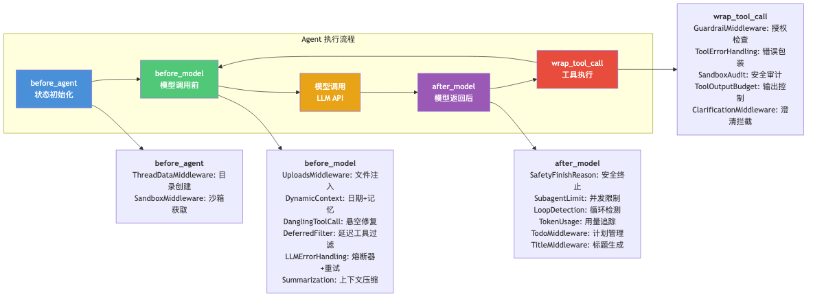
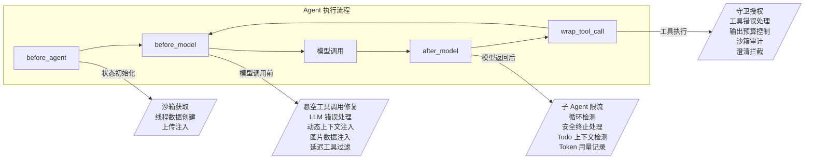
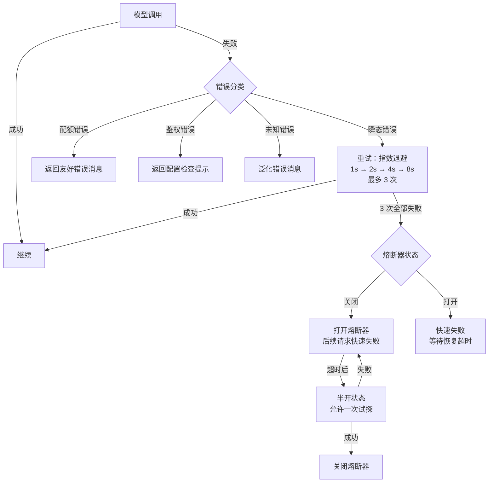

# 02 中间件链架构

**本章课程目标：**

- 理解 DeerFlow 为什么要用 19 层中间件，而不是把所有逻辑写在 Agent 循环里。
- 理解中间件的四个拦截点（`before_agent` / `before_model` / `after_model` / `wrap_tool_call`）各自适合什么场景。
- 看懂每一层中间件解决什么问题、为什么这个顺序、出错了会怎样。
- 建立"横切关注点 = 中间件"的思维方式。

**学习建议：** 这章信息量大，建议先看中间件总览图建立全局印象，再逐层深入。每一层问自己三个问题：它拦截哪个阶段？它输入什么输出什么？如果它挂了 Agent 还能继续吗？

---

## 1、为什么需要中间件链

### 1.1 把横切关注点从 Agent 核心循环中抽离

如果不使用中间件，所有逻辑都塞进 Agent 循环里，代码会变成这样：

```python
# 反模式：所有逻辑耦合在一起
async def agent_loop(messages, tools):
    # 上传文件注入
    messages = inject_uploads(messages)
    # 沙箱初始化
    sandbox = await acquire_sandbox(thread_id)
    # 工具调用
    response = await model.ainvoke(messages)
    # 错误处理
    try:
        tool_results = await execute_tools(response.tool_calls)
    except Exception as e:
        tool_results = [ToolMessage(content=str(e), status="error")]
    # 审计
    audit_tool_calls(response.tool_calls)
    # 输出截断
    tool_results = truncate_outputs(tool_results)
    # 循环检测
    if detect_loop(response.tool_calls):
        response = strip_tool_calls(response)
    # ... 还有 10 个横切关注点
```

中间件模式把每个横切关注点封装为独立的类，让 Agent 核心循环保持简洁：

```python
# 中间件模式：每个关注点独立封装
agent = create_agent(
    model, tools,
    middleware=[
        UploadsMiddleware(),        # 上传注入
        SandboxMiddleware(),        # 沙箱生命周期
        ToolErrorHandlingMiddleware(),  # 工具错误处理
        SandboxAuditMiddleware(),   # 安全审计
        ToolOutputBudgetMiddleware(),   # 输出预算
        LoopDetectionMiddleware(),  # 循环检测
        # ...
    ]
)
```



### 1.2 四个拦截点

DeerFlow 的中间件遵循 LangChain 的 Middleware 协议，有四个拦截点：



| 拦截点 | 触发时机 | 适合什么 | 不适合什么 |
| --- | --- | --- | --- |
| `before_agent` | Agent 第一次运行前 | 状态初始化、资源获取 | 每次模型调用都需要做的事情 |
| `before_model` | 每次模型调用前 | 上下文注入、消息修复 | 只执行一次的事情 |
| `after_model` | 每次模型返回后 | 响应验证、调用限流 | 需要修改工具执行结果的事情 |
| `wrap_tool_call` | 每次工具调用 | 安全审计、错误包装、输出控制 | 需要修改模型输入的事情 |

---

## 2、19 层中间件全览

以下是 DeerFlow 中完整的中间件链，按严格顺序排列：

| 序号 | 中间件 | 拦截点 | 核心职责 |
| --- | --- | --- | --- |
| 1 | `ThreadDataMiddleware` | `before_agent` | 创建线程隔离的 workspace/uploads/outputs 目录 |
| 2 | `UploadsMiddleware` | `before_model` | 注入 `<uploaded_files>` 块到对话 |
| 3 | `DynamicContextMiddleware` | `before_model` | 注入 `<system-reminder>`（日期 + 记忆） |
| 4 | `ViewImageMiddleware` | `before_model` | 注入已查看图片的 base64 数据 |
| 5 | `DanglingToolCallMiddleware` | `before_model` | 为孤立 `tool_calls` 注入占位 ToolMessage |
| 6 | `DeferredToolFilterMiddleware` | `before_model` | 阻止未提升的延迟 MCP 工具调用 |
| 7 | `LLMErrorHandlingMiddleware` | `before_model` | 熔断器 + 重试 + 指数退避 |
| 8 | `SafetyFinishReasonMiddleware` | `after_model` | 安全终止检测 + 剥离 tool_calls |
| 9 | `SubagentLimitMiddleware` | `after_model` | 限制并发 task 工具调用数 |
| 10 | `LoopDetectionMiddleware` | `after_model` | 哈希 + 频率双模式循环检测 |
| 11 | `TokenUsageMiddleware` | `after_model` | Token 用量记录 + 步骤归属 |
| 12 | `TodoMiddleware` | `after_model` | 计划模式上下文丢失检测 + 过早退出防护 |
| 13 | `TitleMiddleware` | `after_model` | 首次完整轮换后自动生成标题 |
| 14 | `MemoryMiddleware` | `after_agent` | 将会话入队等待记忆更新 |
| 15 | `SummarizationMiddleware` | `before_model` | 上下文压缩 + 技能恢复 |
| 16 | `SandboxMiddleware` | `before_agent` + `after_agent` | 沙箱生命周期管理 |
| 17 | `GuardrailMiddleware` | `wrap_tool_call` | 工具调用前授权检查 |
| 18 | `ToolErrorHandlingMiddleware` | `wrap_tool_call` | 将工具异常包装为 ToolMessage |
| 19 | `ClarificationMiddleware` | `wrap_tool_call` | 拦截 ask_clarification → 中断执行 |

### 2.1 顺序为什么重要

中间件的顺序决定了"谁先看到什么"。几条关键原则：

**1. 错误处理必须在最外层（最先执行，最后返回）**

`LLMErrorHandlingMiddleware` 和 `ToolErrorHandlingMiddleware` 需要捕获下游所有错误。如果它们排在审计后面，审计看到的可能是未处理的异常。

**2. 上下文注入必须在模型调用前**

`DynamicContextMiddleware` 注入的系统提醒必须是模型看到的最后一条消息——如果它在 `UploadsMiddleware` 之前执行，上传文件信息可能跑到系统提醒后面。

**3. 安全审计必须在工具执行时**

`SandboxAuditMiddleware` 必须拦截工具调用——如果它在 `ToolErrorHandlingMiddleware` 之后，错误已经被包装成 ToolMessage，审计就看不到原始调用了。

**4. 澄清拦截必须在最后**

`ClarificationMiddleware` 通过 `Command(goto=END)` 中断执行流——它后面的中间件将不会被执行。

---

## 3、逐层剖析

### 3.1 ThreadDataMiddleware — 线程目录初始化

**拦截点：** `before_agent`

**核心代码：** `packages/harness/deerflow/agents/middlewares/thread_data_middleware.py`

为每个线程创建隔离的目录结构：

```
{user_data_dir}/
└── users/
    └── {user_id}/
        └── threads/
            └── {thread_id}/
                ├── workspace/   # Agent 工作目录
                ├── uploads/     # 用户上传文件
                └── outputs/     # Agent 生成文件
```

两种初始化模式：
- **惰性模式**（`lazy_init=True`）：只计算路径，不立即创建目录。在首次文件操作时才创建。
- **急切模式**（`lazy_init=False`）：在 Agent 启动时立即创建所有目录。

### 3.2 UploadsMiddleware — 上传文件注入

**拦截点：** `before_model`

**核心代码：** `packages/harness/deerflow/agents/middlewares/uploads_middleware.py`

将前端通过 `additional_kwargs.files` 传递的文件元数据格式化为 `<uploaded_files>` XML 块，注入到最后一条 HumanMessage 之前。

```
<uploaded_files>
- report.csv (text/csv, 245 KB)
  Outline:
    Line 1: Date,Sales,Region,Product
    Line 2: 2024-01-01,1500,East,Widget A
    ...
- presentation.pptx (application/vnd.openxmlformats-officedocument.presentationml.presentation, 1.2 MB)
  [Document converted to markdown]
</uploaded_files>
```

对于 PDF/PPT/Excel/Word 等可转换文档，使用 `markitdown` 自动提取文本内容，让模型能直接"看到"文档内容。

### 3.3 DynamicContextMiddleware — 动态上下文注入

**拦截点：** `before_model`

**核心代码：** `packages/harness/deerflow/agents/middlewares/dynamic_context_middleware.py`

这是 DeerFlow 实现 **Prompt Cache 友好** 的关键设计。

**问题：** 如果每次请求都把当前日期和记忆嵌入系统提示，系统提示就变成动态的了——无法被 Prompt Cache 复用，每次请求都要重新计算 prefix cache。

**解决方案：** 系统提示保持**完全静态**，动态内容（日期、记忆）作为 `<system-reminder>` 消息注入到对话历史中：

```
<system-reminder>
Current date: 2026-06-16
User preferences:
- Prefers Python over R for data analysis
- Works primarily with CSV files
</system-reminder>
```

消息 ID 交换技巧：

```python
# 原始：user_msg (id="abc")
# 注入后：reminder_msg (id="abc"), user_msg (id="abc__user")
# LangGraph 的 add_messages 按 ID 去重，所以原始 user_msg 被替换
# 但 reminder_msg 借用原始 ID，确保顺序正确
```

**跨午夜优化：** 当日期变化时，只注入轻型更新（仅日期），不重复注入完整记忆。

### 3.4 ViewImageMiddleware — 图片注入

**拦截点：** `before_model`

**核心代码：** `packages/harness/deerflow/agents/middlewares/view_image_middleware.py`

当模型调用 `view_image` 工具读取图片后，在下一轮模型调用前，将 base64 编码的图片数据作为 HumanMessage 注入：

```python
# view_image 工具调用完成后
# 下一轮 before_model 时：
messages.append(HumanMessage(content=[
    {"type": "image_url", "image_url": {"url": "data:image/png;base64,..."}}
]))
```

仅在模型支持视觉且图片尚未注入时触发。

### 3.5 DanglingToolCallMiddleware — 悬空工具调用修复

**拦截点：** `before_model`

**核心代码：** `packages/harness/deerflow/agents/middlewares/dangling_tool_call_middleware.py`

**问题：** 某些 LLM Provider 的 API 在 `additional_kwargs.tool_calls` 中返回工具调用，但 LangChain 可能没有正确解析到结构化的 `tool_calls` 字段。或者上下文被压缩后，ToolMessage 被丢弃但 tool_call 还在。

**解决方案：** 在每次模型调用前，扫描消息历史，为缺少对应 ToolMessage 的 tool_calls 注入占位符：

```python
for msg in messages:
    if isinstance(msg, AIMessage) and msg.tool_calls:
        for tc in msg.tool_calls:
            if not has_corresponding_tool_message(messages, tc["id"]):
                # 注入占位 ToolMessage
                placeholder = ToolMessage(
                    content="[This tool call result was lost due to context truncation]",
                    tool_call_id=tc["id"],
                    status="error"
                )
```

### 3.6 DeferredToolFilterMiddleware — 延迟工具过滤

**拦截点：** `before_model`

**核心代码：** `packages/harness/deerflow/agents/middlewares/deferred_tool_filter_middleware.py`

**问题：** MCP 工具的 Schema 可能很大，全部绑定到模型会导致 prompt 膨胀。DeerFlow 将这些工具标记为"延迟"——模型看不到它们的 schema，需要通过 `tool_search` 工具按需发现。

**风险：** 模型可能"猜"到一个延迟工具的名称并直接调用它（跳过 `tool_search`）。

**解决方案：** 这个中间件拦截模型输出，检查是否有对延迟工具的调用。如果有，注入提示引导模型先用 `tool_search`：

```
The tool 'github_search_code' is available but its schema is currently deferred.
Please use the tool_search tool to find it first.
```

### 3.7 LLMErrorHandlingMiddleware — 熔断器 + 重试

**拦截点：** `before_model`

**核心代码：** `packages/harness/deerflow/agents/middlewares/llm_error_handling_middleware.py`

这是 DeerFlow 中最复杂的错误处理逻辑，实现了三层防护：



错误分类：

| 错误类型 | 识别方式 | 处理策略 |
| --- | --- | --- |
| 瞬态（Rate Limit / Server Error） | HTTP 429 / 5xx | 重试 + 指数退避 |
| 配额（Insufficient Quota） | 错误消息关键字匹配 | 不重试，返回提示 |
| 鉴权（Invalid API Key） | HTTP 401 / 403 | 不重试，返回提示 |
| 内容过滤 | finish_reason = content_filter | 不重试，由 SafetyFinishReasonMiddleware 处理 |

熔断器配置（`config.yaml`）：

```yaml
llm_error_handling:
  circuit_breaker:
    failure_threshold: 5      # 5 次失败后打开熔断器
    recovery_timeout: 60      # 60 秒后尝试恢复
```

### 3.8 SafetyFinishReasonMiddleware — 安全终止处理

**拦截点：** `after_model`

**核心代码：** `packages/harness/deerflow/agents/middlewares/safety_finish_reason_middleware.py`

当 LLM Provider 因为安全原因截断响应时（如 Anthropic 的 `refusal`、OpenAI 的 `content_filter`），模型可能仍然返回了部分 `tool_calls`，但这些工具调用的参数可能不完整。

**处理：** 检测到安全终止时，剥离所有 `tool_calls`，发出 `safety_termination` SSE 事件，记录审计日志。

可配置的检测器：

```yaml
safety_finish_reason:
  detectors:
    - openai_content_filter
    - anthropic_refusal
    - gemini_safety
```

### 3.9 SubagentLimitMiddleware — 子 Agent 限流

**拦截点：** `after_model`

**核心代码：** `packages/harness/deerflow/agents/middlewares/subagent_limit_middleware.py`

**问题：** 模型可能在一次响应中发起 10 个并行的 `task` 工具调用。这不仅消耗大量资源，而且子 Agent 之间可能相互干扰。

**解决方案：** 硬限制单次响应中的 `task` 工具调用数量（默认 3，范围 [2, 4]）。超出的调用被截断：

```python
if len(task_calls) > limit:
    truncated = task_calls[:limit]
    # 注入提醒
    messages.append(HumanMessage(
        content=f"Limited to {limit} concurrent subagent calls. "
                f"Remaining {len(task_calls) - limit} calls were dropped."
    ))
```

### 3.10 LoopDetectionMiddleware — 双模式循环检测

**拦截点：** `after_model`

**核心代码：** `packages/harness/deerflow/agents/middlewares/loop_detection_middleware.py`

两层检测机制：

**（1）基于哈希的工具调用重复检测**

```
归一化工具调用 (name, salient_args) → MD5 哈希 → 追踪重复次数
3 次相同哈希 → 警告注入
5 次相同哈希 → 硬停止（剥离所有 tool_calls）
```

**（2）基于频率的单一工具过用检测**

```
read_file 被调用 30 次 → 警告
read_file 被调用 50 次 → 硬停止
```

每个工具的阈值可通过 `tool_freq_overrides` 配置：

```yaml
loop_detection:
  hash_threshold_warn: 3
  hash_threshold_stop: 5
  freq_threshold_warn: 30
  freq_threshold_stop: 50
  tool_freq_overrides:
    bash: { warn: 20, stop: 40 }
```

关键实现细节：
- 使用 `OrderedDict` 追踪，带 LRU 驱逐，防止内存泄漏
- 按线程隔离追踪状态
- 警告通过 `wrap_model_call` 注入（带 `name="loop_warning"`），而不是修改图状态

### 3.11 TokenUsageMiddleware — Token 用量追踪

**拦截点：** `after_model`

**核心代码：** `packages/harness/deerflow/agents/middlewares/token_usage_middleware.py`

记录每次 LLM 调用的 token 使用情况，并按步骤归属：

```python
token_usage_attribution = {
    "step_type": "tool_execution",  # 或 "subagent" / "search" / "file_presentation" / "clarification"
    "tool_name": "bash",
    "input_tokens": 1500,
    "output_tokens": 200,
}
```

**子 Agent Token 合并：** 子 Agent 的 token 使用情况通过 `tool_call_id` 缓存关联到父 Agent 的 `AIMessage`。

### 3.12 TodoMiddleware — 计划模式管理

**拦截点：** `after_model`

**核心代码：** `packages/harness/deerflow/agents/middlewares/todo_middleware.py`

扩展 LangChain 的 `TodoListMiddleware`，添加了两个 DeerFlow 特有的能力：

**（1）上下文丢失检测：** 当 TodoList 的 `write_todos` 工具调用从历史中被截断（摘要压缩后），注入提醒让模型重新生成。

**（2）过早退出防护：** 当还有未完成的 Todo 但模型试图给出最终答案时，注入提醒并跳回 Think 阶段。最多 2 次提醒后允许退出（防止无限循环）。

### 3.13 TitleMiddleware — 自动标题生成

**拦截点：** `after_model`

**核心代码：** `packages/harness/deerflow/agents/middlewares/title_middleware.py`

首次完整的轮换（用户消息 + AI 回复）后，使用轻量级 LLM 调用自动生成线程标题：

```python
# 标题生成 prompt（简化）
"Generate a short title (max 60 chars) for this conversation: ..."

# 失败时回退到本地标题
fallback = truncate(user_message, max_length=60)
```

标题会被写入 `ThreadState.title` 并同步到 `ThreadMetaStore`。

### 3.14 MemoryMiddleware — 记忆入队

**拦截点：** `after_agent`

**核心代码：** `packages/harness/deerflow/agents/middlewares/memory_middleware.py`

在每次 Agent 完成后，将当前会话入队以进行记忆更新。使用 `add()`（非 `add_nowait()`）进行去抖处理。

关键实现：在 `ContextVar` 仍然存活时捕获 `user_id`，使其能跨越 `threading.Timer` 边界传递到后台更新线程。

### 3.15 SummarizationMiddleware — 上下文压缩

**拦截点：** `before_model`

**核心代码：** `packages/harness/deerflow/agents/middlewares/summarization_middleware.py`

扩展 LangChain 的 `SummarizationMiddleware`，添加了两个关键能力：

**（1）摘要前记忆冲入：** 在压缩消息之前，通过 `BeforeSummarizationHook`（`memory_flush_hook`）将消息紧急冲入记忆更新队列。因为消息即将被丢弃，必须在此之前提取记忆。

**（2）技能恢复：** 识别读取技能文件的工具调用轮次，将最近加载的技能包恢复到保留区域，确保模型在压缩后仍然知道可用技能。

### 3.16 SandboxMiddleware — 沙箱生命周期

**拦截点：** `before_agent` + `after_agent`

**核心代码：** `packages/harness/deerflow/sandbox/middleware.py`

管理沙箱的获取和释放：

- `before_agent`：根据 `lazy_init` 配置决定是否立即获取沙箱
- `after_agent`：释放沙箱资源
- 同一线程的多次轮换间复用沙箱实例

### 3.17 GuardrailMiddleware — 工具调用守卫

**拦截点：** `wrap_tool_call`

**核心代码：** `packages/harness/deerflow/guardrails/middleware.py`

在工具执行前通过 `GuardrailProvider` 评估授权：

```python
decision = guardrail_provider.evaluate(GuardrailRequest(
    tool_name="bash",
    tool_args={"command": "rm -rf /"},
    thread_id=thread_id,
    user_id=user_id,
))

if decision.allowed:
    return await original_tool_call()
else:
    return ToolMessage(
        content=f"Tool call blocked: {decision.reason}",
        status="error"
    )
```

支持 `fail_closed`（默认：守卫故障时拒绝）和 `fail_open`（守卫故障时放行）。

### 3.18 ToolErrorHandlingMiddleware — 工具错误包装

**拦截点：** `wrap_tool_call`

**核心代码：** `packages/harness/deerflow/agents/middlewares/tool_error_handling_middleware.py`

将所有工具异常包装为 `ToolMessage`，而不是让异常传播到 Agent 循环：

```python
try:
    result = await original_tool_call()
    return result
except GraphBubbleUp:
    raise  # 控制流信号，不包装
except Exception as e:
    return ToolMessage(
        content=f"Tool execution failed: {str(e)[:500]}",
        tool_call_id=tool_call_id,
        status="error"
    )
```

### 3.19 ClarificationMiddleware — 澄清拦截

**拦截点：** `wrap_tool_call`

**核心代码：** `packages/harness/deerflow/agents/middlewares/clarification_middleware.py`

**必须最后**出现在中间件链中。

当模型调用 `ask_clarification` 工具时，格式化人类可读的消息，然后通过 `Command(goto=END)` 中断 Agent 执行，将澄清问题返回给用户。用户回答后 Agent 从中断点恢复。

---

## 4、中间件链的装配逻辑

`_build_middlewares()` 函数按严格顺序构建中间件列表：

```python
def _build_middlewares(
    app_config, agent_config, runtime_features,
    sandbox_provider, summarization_config,
    token_usage_config, memory_config,
    tool_output_config, guardrails_config,
    ...
):
    middlewares = []

    # === 运行时间件（所有 Agent 共享）===
    middlewares.extend([
        ToolOutputBudgetMiddleware(tool_output_config),
        ThreadDataMiddleware(...),
        SandboxMiddleware(sandbox_provider, ...),
        UploadsMiddleware(...),
        DynamicContextMiddleware(...),
        DanglingToolCallMiddleware(),
        LLMErrorHandlingMiddleware(...),
        GuardrailMiddleware(guardrails_config),
        SandboxAuditMiddleware(),
        ToolErrorHandlingMiddleware(),
    ])

    # === 功能中间件（按需启用）===
    if summarization_config:
        middlewares.append(SummarizationMiddleware(...))

    if runtime_features.todo:
        middlewares.append(TodoMiddleware(...))

    if token_usage_config.enabled:
        middlewares.append(TokenUsageMiddleware(...))

    if runtime_features.title:
        middlewares.append(TitleMiddleware(...))

    if memory_config.enabled:
        middlewares.append(MemoryMiddleware(...))

    if runtime_features.vision:
        middlewares.append(ViewImageMiddleware(...))

    if runtime_features.subagent:
        middlewares.extend([
            DeferredToolFilterMiddleware(...),
            SubagentLimitMiddleware(...),
        ])

    middlewares.append(LoopDetectionMiddleware(...))
    middlewares.append(SafetyFinishReasonMiddleware(...))

    # === 澄清中间件：必须最后 ===
    middlewares.append(ClarificationMiddleware(...))

    return middlewares
```

---

## 5、中间件设计原则总结

| 原则 | 说明 | 违反示例 |
| --- | --- | --- |
| 单一职责 | 每个中间件只做一件事 | 把上传注入和文件转换写在同一个中间件里 |
| 失败隔离 | 一个中间件的异常不应影响其他中间件 | 审计异常导致工具调用失败 |
| 顺序敏感 | 错误处理在外层，上下文注入在里层 | 在审计之前注入用户内容 |
| 可配置 | 中间件的启用/禁用和行为应由配置驱动 | 硬编码循环检测阈值 |
| 状态无感 | 中间件不应直接修改 LangGraph 状态 | 在 before_model 中修改 ThreadState |

---

## 6、本章小结

1. DeerFlow 的 19 层中间件将**横切关注点从 Agent 核心循环中抽离**，每个中间件遵循单一职责原则。

2. 四个拦截点各有适用场景：**`before_agent`（初始化）、`before_model`（注入/修复）、`after_model`（验证/限流）、`wrap_tool_call`（审计/包装）**。

3. 中间件的**严格排序**决定了数据处理管道——错误处理在外层、上下文注入在中间、安全审计在工具执行时、澄清拦截在最后。

4. 关键设计模式：**熔断器（LLMErrorHandling）、去抖队列（Memory）、双模式检测（LoopDetection）、延迟加载（DeferredToolFilter）**。
