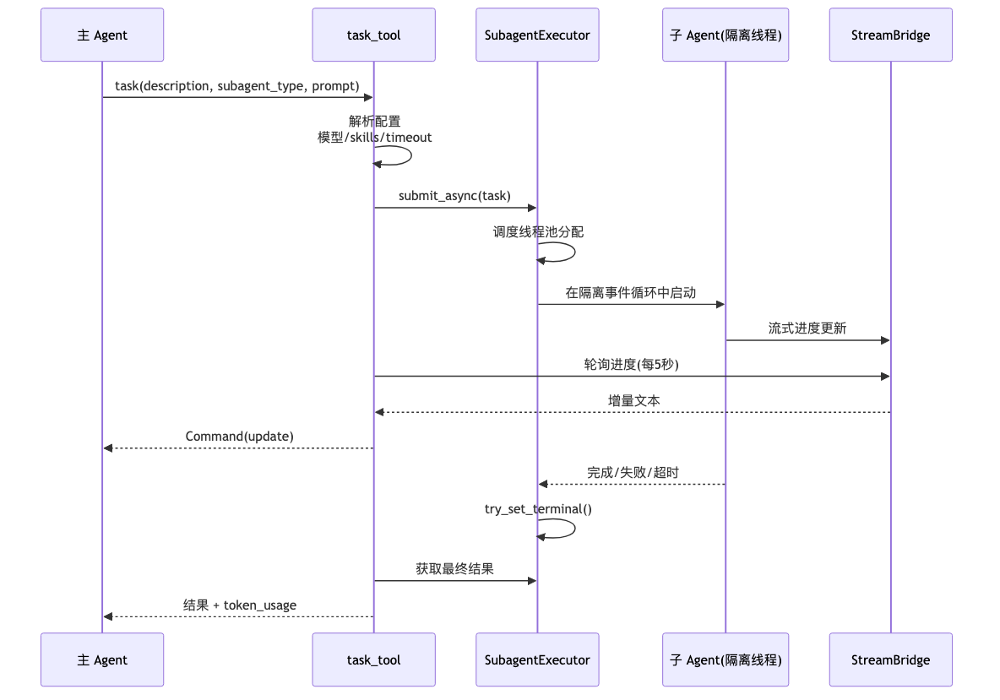
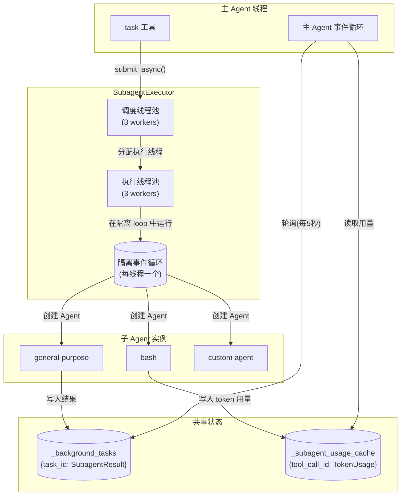
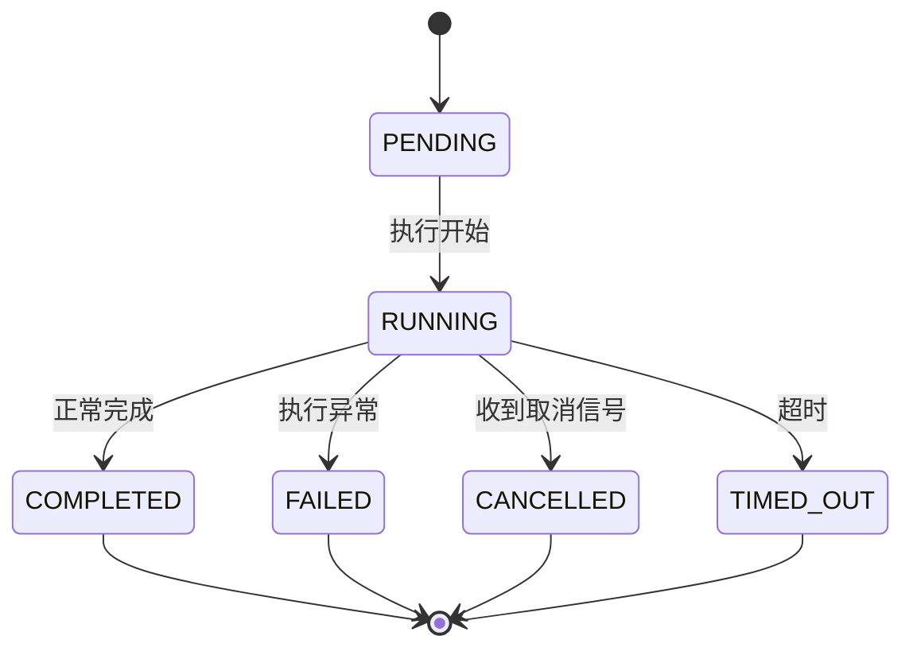
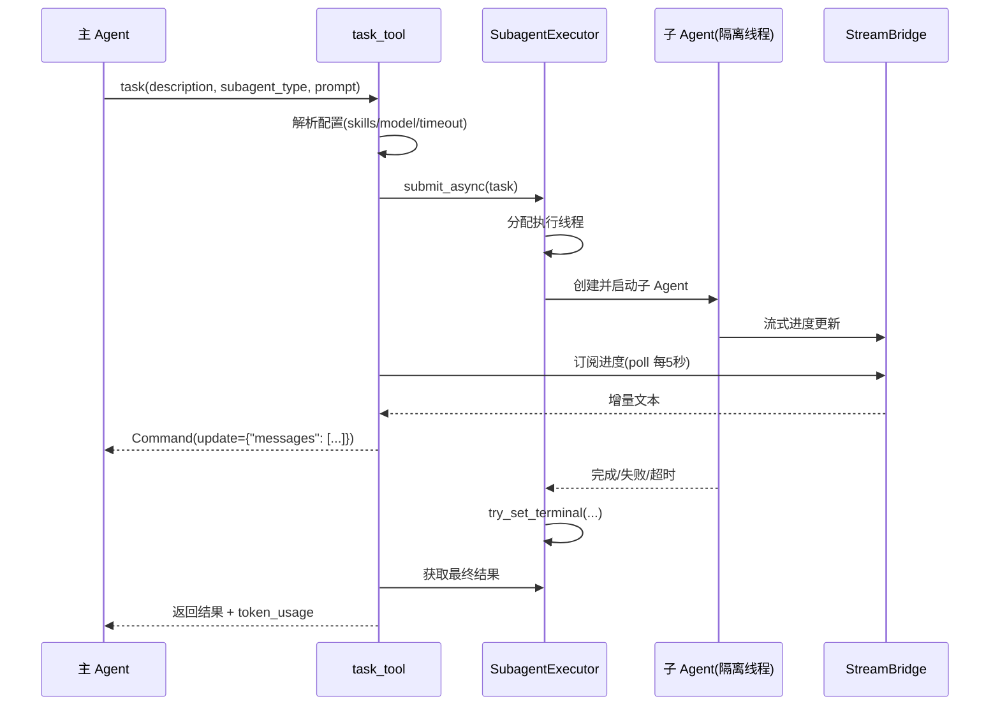

# 04 子 Agent 委托系统

**本章课程目标：**

- 理解 DeerFlow 的子 Agent 委托设计：为什么用后台线程池 + 隔离事件循环，而不是 LangGraph 的 `Send()` API。
- 看懂 `task` 工具的完整执行流程：提交 → 轮询 → 流式更新 → 取消传播。
- 理解 `SubagentResult` 的状态机设计和"一次写入"语义。
- 理解子 Agent 与主 Agent 的配置继承关系：模型、技能白名单、超时。

**学习建议：** 先看 `SubagentExecutor` 的整体架构图，再看 `task_tool` 的执行流程。特别关注取消传播——这是分布式 Agent 系统中最容易被忽略的难点。

---

## 1、为什么需要子 Agent 委托

### 1.1 三种典型场景

| 场景 | 例子 | 为什么需要子 Agent |
| --- | --- | --- |
| 并行任务 | "同时分析这三个 CSV 文件" | 三个分析互不依赖，可以并行执行 |
| 上下文隔离 | "帮我审查这份 5000 行的代码" | 代码审查产生大量中间消息，不应污染主对话 |
| 专长委托 | "用 Python 做复杂的统计分析" | bash 专长子 Agent 比通用 Agent 更高效 |

### 1.2 为什么不用 LangGraph 的 Send() API

LangGraph 的 `Send()` API 支持在图中 fan-out 到多个子图。但 DeerFlow 选择了自己的子 Agent 系统，原因是：

| 需求 | LangGraph Send() | DeerFlow Subagent |
| --- | --- | --- |
| 独立事件循环 | 共享父图事件循环 | 隔离的持久事件循环 |
| 超时控制 | 图级超时 | 每子 Agent 独立超时 |
| 流式进度报告 | 需要自定义 channel | 通过 `StreamBridge` 原生支持 |
| 结果收集 | 图状态合并 | `SubagentResult` 结构化结果 |
| 取消传播 | 需要自行实现 | 内置 `CancelledError` 传播 |
| 工具限制 | 子图工具与父图相同 | 每子 Agent 可配置不同工具集 |

简而言之：LangGraph 的 `Send()` 适合图的内部并行，而 DeerFlow 的子 Agent 系统适合**隔离、可观测、可打断**的外部委托。

---

## 2、整体架构





### 2.1 为什么用持久隔离事件循环

子 Agent 在后台线程的独立 `asyncio.AbstractEventLoop` 中运行。每次执行不会创建新的事件循环——使用 `_get_isolated_subagent_loop()` 获取线程持久化的循环。

```python
# 不使用（每次创建新 loop，连接复用失效）：
async def execute():
    loop = asyncio.new_event_loop()
    result = loop.run_until_complete(agent.astream(...))
    loop.close()

# 使用（复用 loop，保持连接池活跃）：
def _get_isolated_subagent_loop():
    thread_id = threading.get_ident()
    if thread_id not in _loops:
        loop = asyncio.new_event_loop()
        _loops[thread_id] = loop
        # 在线程退出时清理
    return _loops[thread_id]
```

---

## 3、SubagentResult 状态机

```python
@dataclass
class SubagentResult:
    task_id: str
    status: str  # PENDING → RUNNING → COMPLETED / FAILED / CANCELLED / TIMED_OUT
    ai_messages: list[AIMessage] | None = None
    token_usage: dict | None = None
    error: str | None = None

    _lock: threading.Lock = field(default_factory=threading.Lock)
    _terminal_set: bool = False

    def try_set_terminal(self, status: str, **kwargs) -> bool:
        """只有第一次从非终止态到终止态的转换会被接受"""
        with self._lock:
            if self._terminal_set:
                return False  # 忽略后续写入
            if status in ("PENDING", "RUNNING"):
                self.status = status
                return True
            # 终止态：只接受一次
            self.status = status
            self._terminal_set = True
            for k, v in kwargs.items():
                setattr(self, k, v)
            return True
```

状态转换图：



`try_set_terminal()` 的"一次写入"语义确保了多线程环境下的状态一致性——当取消线程和执行线程同时尝试写入时，只有第一个能成功。

---

## 4、task_tool 完整流程



### 4.1 配置解析

```python
# task_tool 核心逻辑（简化）
def task(description: str, subagent_type: str, prompt: str, runtime: Runtime):
    # 1. 解析子 Agent 配置
    subagent_config = get_subagent_config(subagent_type)

    # 2. 合并技能白名单（父级白名单 ∩ 子级技能）
    parent_skills = runtime.config.get("skill_names", [])
    skills = intersect_skills(parent_skills, subagent_config.skills)

    # 3. 解析模型（子 Agent 配置 > 父模型 > 全局默认）
    model_name = resolve_subagent_model_name(subagent_config, parent_model)

    # 4. 构建任务
    task = SubagentTask(
        description=description,
        subagent_type=subagent_type,
        prompt=prompt,
        model_name=model_name,
        skills=skills,
        config_patches={...},
    )

    # 5. 提交执行
    task_id = SubagentExecutor.submit(task)
```

### 4.2 轮询与流式更新

```python
# task_tool 中的轮询逻辑（简化）
async def _poll_subagent(task_id, stream_bridge):
    accumulated_text = ""
    while True:
        result = SubagentExecutor.get_result(task_id)
        if result.status in ("COMPLETED", "FAILED", "CANCELLED", "TIMED_OUT"):
            yield final_update(result)
            return

        # 每 5 秒检查一次进度
        await asyncio.sleep(5)

        # 获取增量更新
        new_messages = stream_bridge.get_incremental(task_id)
        if new_messages:
            accumulated_text += new_messages
            yield progress_update(accumulated_text)
```

### 4.3 取消传播

取消是子 Agent 系统中最复杂的部分：

```python
# task_tool 中的取消处理
try:
    async for update in _poll_subagent(task_id, stream_bridge):
        yield update
except asyncio.CancelledError:
    # 主 Agent 被取消 → 传播到子 Agent
    SubagentExecutor.request_cancel(task_id)

    # 等待子 Agent 优雅退出（捕获 token 使用情况）
    try:
        await asyncio.wait_for(
            _wait_for_subagent_exit(task_id),
            timeout=10  # 最多等 10 秒
        )
    except asyncio.TimeoutError:
        pass  # 超时则放弃等待

    raise  # 重新抛出 CancelledError
```

---

## 5、SubagentExecutor 实现细节

```python
class SubagentExecutor:
    _scheduler_pool = ThreadPoolExecutor(max_workers=3)
    _execution_pool = ThreadPoolExecutor(max_workers=3)

    @staticmethod
    def submit(task: SubagentTask) -> str:
        task_id = str(uuid.uuid4())
        result = SubagentResult(task_id=task_id, status="PENDING")

        with _lock:
            _background_tasks[task_id] = result

        # 调度到线程池
        _scheduler_pool.submit(
            _execution_pool.submit,
            _execute_subagent,
            task, result
        )

        return task_id

    @staticmethod
    def _execute_subagent(task: SubagentTask, result: SubagentResult):
        loop = _get_isolated_subagent_loop()
        try:
            loop.run_until_complete(_aexecute(task, result))
        except Exception as e:
            result.try_set_terminal("FAILED", error=str(e))

    @staticmethod
    async def _aexecute(task: SubagentTask, result: SubagentResult):
        result.try_set_terminal("RUNNING")

        # 创建子 Agent（复用中间件构建，但 subagent_enabled=False 防止递归）
        agent = create_deerflow_agent(
            model=_resolve_model(task),
            tools=_resolve_tools(task),
            system_prompt=task.system_prompt,
            features=RuntimeFeatures(
                subagent=False,  # 防止递归嵌套
                # 其他功能按需启用
            ),
        )

        # 流式执行
        messages = []
        async for event in agent.astream(
            {"messages": [HumanMessage(content=task.prompt)]},
            config={"configurable": {"thread_id": task.thread_id}}
        ):
            # 协作式取消检查
            if _cancel_requests.get(task.task_id):
                result.try_set_terminal("CANCELLED")
                return

            messages.extend(event.get("messages", []))

        result.try_set_terminal(
            "COMPLETED",
            ai_messages=[m for m in messages if isinstance(m, AIMessage)],
            token_usage=_collect_token_usage(messages)
        )
```

---

## 6、内置子 Agent

### 6.1 general-purpose

```python
# builtins/general_purpose.py
GENERAL_PURPOSE_CONFIG = SubagentConfig(
    name="general-purpose",
    description="General-purpose agent for complex multi-step tasks",
    tools="all",                     # 继承所有工具
    disallowed_tools=["task"],       # 但不能递归创建子 Agent
    model="inherit",                 # 使用父 Agent 的模型
    max_turns=50,
    timeout_seconds=900,             # 15 分钟
)
```

### 6.2 bash

```python
# builtins/bash_agent.py
BASH_CONFIG = SubagentConfig(
    name="bash",
    description="Bash specialist agent for shell commands and scripting",
    tools=["bash", "ls", "read_file", "write_file", "glob", "grep"],
    disallowed_tools=["task"],
    model="inherit",
    max_turns=30,
    timeout_seconds=600,             # 10 分钟
)
```

### 6.3 自定义子 Agent

在 `config.yaml` 中定义：

```yaml
subagents:
  custom:
    - name: code-reviewer
      description: Expert code reviewer
      system_prompt: |
        You are a senior code reviewer. Focus on:
        - Security vulnerabilities
        - Performance issues
        - Code style violations
      tools: [read_file, grep, glob]
      model: claude-sonnet-4-6
      max_turns: 20
      timeout_seconds: 300
```

---

## 7、配置继承关系

子 Agent 的配置按以下优先级解析：

```
1. 子 Agent 自身配置（config.yaml subagents.custom）
2. task_tool 调用时的运行时覆盖
3. 父 Agent 的配置（model_name, skill_names）
4. 全局默认配置
```

```python
def resolve_subagent_model_name(config: SubagentConfig, parent_model: str) -> str:
    if config.model and config.model != "inherit":
        return config.model
    if parent_model:
        return parent_model
    return get_app_config().default_model_name
```

---

## 8、本章小结

1. DeerFlow 的子 Agent 系统采用**后台线程池 + 隔离事件循环**架构，每个子 Agent 在独立的 asyncio 循环中运行，互不干扰。

2. `SubagentResult` 的状态机通过 `try_set_terminal()` 实现"一次写入"语义，确保多线程环境下的状态一致性。

3. `task_tool` 的完整流程包括：**配置解析（模型/技能/超时）→ 提交执行 → 轮询进度（每 5 秒）→ 流式更新 → 取消传播（等待优雅退出）→ 结果收集 + Token 合并**。

4. 子 Agent 禁止递归创建子 Agent（`subagent_enabled=False`），防止资源爆炸。

5. 配置继承遵循"子 Agent > 运行时覆盖 > 父 Agent > 全局默认"的优先级链。
