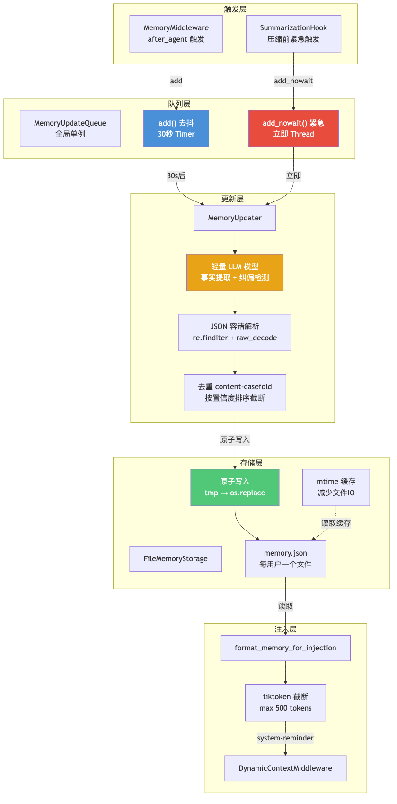
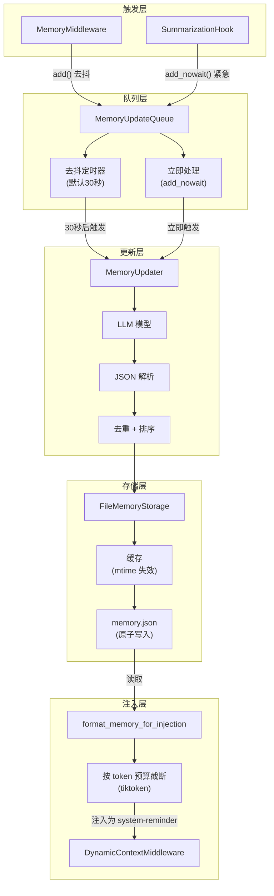
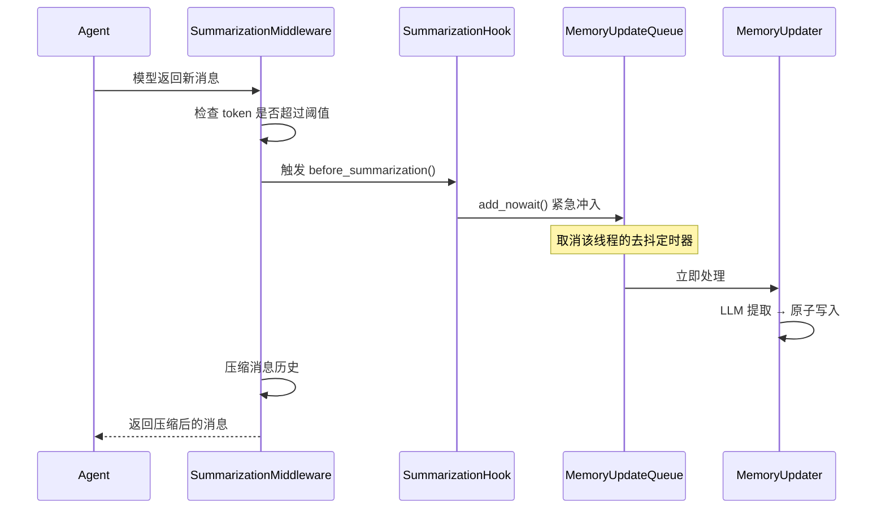

# 06 长期记忆系统

**本章课程目标：**

- 理解 DeerFlow 记忆系统的三层架构：存储层（JSON 文件）、更新层（LLM 驱动提取）、队列层（去抖触发）。
- 看懂 LLM 驱动的事实提取流程：从对话文本到结构化事实（增/删/改）。
- 理解去抖队列的设计：为什么需要 30 秒延迟、什么时候需要 `add_nowait()` 紧急冲入。
- 理解纠偏/强化检测如何影响记忆更新行为。

**学习建议：** 先看存储层的文件结构和缓存策略，再看更新层的 LLM 提取逻辑，最后看队列层的去抖和冲入机制。特别关注 `add_nowait()` 的触发场景——这是记忆系统和摘要压缩的关键交互点。

---

## 1、三层架构总览





---

## 2、存储层：JSON 文件 + mtime 缓存

### 2.1 文件结构

```
{base_dir}/
└── users/
    └── {user_id}/
        └── memory.json
```

每个用户一个 `memory.json` 文件，包含所有 Agent 的记忆数据：

```json
{
  "agent_name": {
    "user_context": "User is a data scientist working primarily with Python...",
    "facts": [
      {
        "id": "fact_001",
        "content": "User prefers Python over R for data analysis",
        "confidence": 0.9,
        "created_at": "2026-06-01T10:00:00Z",
        "updated_at": "2026-06-15T14:00:00Z",
        "source": "conversation",
        "references": ["thread_abc123_msg_3"]
      },
      {
        "id": "fact_002",
        "content": "User works with CSV files primarily",
        "confidence": 0.85,
        "created_at": "2026-06-02T09:00:00Z",
        "updated_at": "2026-06-02T09:00:00Z"
      }
    ],
    "history": [
      {
        "query": "Analyze sales data from Q1",
        "timestamp": "2026-06-15T14:00:00Z",
        "summary": "User requested sales analysis..."
      }
    ]
  }
}
```

### 2.2 原子写入

```python
class FileMemoryStorage(MemoryStorage):
    async def awrite(self, user_id: str, agent_name: str, data: dict):
        filepath = self._get_filepath(user_id)
        os.makedirs(os.path.dirname(filepath), exist_ok=True)

        # 读取现有数据（保留其他 Agent 的记忆）
        existing = await self.aread_all(user_id)
        existing[agent_name] = data

        # 原子写入：写入临时文件 → 重命名
        tmp_path = filepath + ".tmp"
        with open(tmp_path, 'w') as f:
            json.dump(existing, f, indent=2)

        os.replace(tmp_path, filepath)  # 原子操作
```

### 2.3 mtime 缓存

```python
class FileMemoryStorage(MemoryStorage):
    def __init__(self):
        self._cache: dict[str, tuple[float, dict]] = {}  # (mtime, data)

    async def aread(self, user_id: str, agent_name: str) -> dict | None:
        filepath = self._get_filepath(user_id)
        if not os.path.exists(filepath):
            return None

        current_mtime = os.path.getmtime(filepath)
        if filepath in self._cache:
            cached_mtime, cached_data = self._cache[filepath]
            if cached_mtime == current_mtime:
                return cached_data.get(agent_name)

        # 缓存失效，重新读取
        with open(filepath) as f:
            data = json.load(f)
        self._cache[filepath] = (current_mtime, data)
        return data.get(agent_name)
```

mtime 缓存避免了每次读取记忆时的文件 I/O。在多进程部署中需要考虑缓存一致性（当前版本以单进程为主）。

---

## 3、更新层：LLM 驱动的事实提取

### 3.1 提取 Prompt

```python
# prompt.py
MEMORY_UPDATE_PROMPT = """You are a memory manager. Analyze the conversation and extract structured facts about the user.

Current memory:
{current_memory}

Recent conversation:
{conversation}

Extract the following in JSON format:
{{
  "user_context": "Brief summary of what you know about the user (1-2 sentences)",
  "facts_to_add": [
    {{"content": "User prefers X over Y", "confidence": 0.8, "source": "explicit" | "implicit"}}
  ],
  "facts_to_update": [
    {{"id": "fact_001", "content": "Updated content", "confidence": 0.9}}
  ],
  "facts_to_delete": ["fact_003"],
  "history_entries": [
    {{"query": "What the user asked", "summary": "What happened"}}
  ]
}}

Rules:
- Only extract PERSONALIZED, PERSISTENT facts. Do NOT extract:
  * Temporary preferences for this task only
  * Generic knowledge (e.g., "Python is a programming language")
  * Facts about the assistant's own capabilities
- Merge overlapping facts rather than creating duplicates
- Confidence >= 0.7 for explicit user statements, 0.4-0.6 for implicit
- Delete facts that have been explicitly contradicted
"""
```

### 3.2 提取流程

```python
class MemoryUpdater:
    async def aupdate(self, user_id: str, agent_name: str, messages: list) -> dict:
        # 1. 格式化对话为纯文本
        conversation = format_conversation_for_update(messages)

        # 2. 加载当前记忆
        current_memory = await self.storage.aread(user_id, agent_name) or {}

        # 3. 构建 Prompt + 调用 LLM
        prompt = MEMORY_UPDATE_PROMPT.format(
            current_memory=json.dumps(current_memory, indent=2),
            conversation=conversation
        )
        response = await asyncio.to_thread(
            self.model.invoke, prompt
        )

        # 4. 解析 LLM 输出的 JSON
        updates = self._parse_json_response(response.content)

        # 5. 应用更新
        updated = self._apply_updates(current_memory, updates)

        # 6. 原子写入
        await self.storage.awrite(user_id, agent_name, updated)

        return updated
```

### 3.3 JSON 解析容错

```python
def _parse_json_response(self, text: str) -> dict:
    """从 LLM 输出中提取 JSON，容错处理"""
    # 1. 尝试直接解析
    try:
        return json.loads(text)
    except json.JSONDecodeError:
        pass

    # 2. 尝试提取 ```json 代码块
    match = re.search(r'```json\s*(.*?)\s*```', text, re.DOTALL)
    if match:
        return json.loads(match.group(1))

    # 3. 使用 re.finditer 扫描每个 {，逐个尝试 raw_decode
    for match in re.finditer(r'\{', text):
        try:
            obj, end = json.JSONDecoder().raw_decode(text, match.start())
            if isinstance(obj, dict) and "facts_to_add" in obj:
                return obj
        except json.JSONDecodeError:
            continue

    # 4. 全部失败，返回空更新
    return {"facts_to_add": [], "facts_to_update": [], "facts_to_delete": [], "history_entries": []}
```

### 3.4 去重与排序

```python
def _apply_updates(self, current: dict, updates: dict) -> dict:
    facts = current.get("facts", [])

    # 删除被标记的事实
    delete_ids = set(updates.get("facts_to_delete", []))
    facts = [f for f in facts if f["id"] not in delete_ids]

    # 更新已存在的事实
    for update in updates.get("facts_to_update", []):
        for i, fact in enumerate(facts):
            if fact["id"] == update["id"]:
                facts[i] = {**fact, **update, "updated_at": now_iso()}

    # 添加新事实（content-casefold 去重）
    existing_contents = {f["content"].casefold() for f in facts}
    for new_fact in updates.get("facts_to_add", []):
        if new_fact["content"].casefold() not in existing_contents:
            new_fact["id"] = f"fact_{uuid4().hex[:8]}"
            new_fact["created_at"] = now_iso()
            facts.append(new_fact)
            existing_contents.add(new_fact["content"].casefold())

    # 按置信度排序，限制最大数量
    facts.sort(key=lambda f: f.get("confidence", 0), reverse=True)
    facts = facts[:self.max_facts]  # 默认 max_facts=100

    return {
        **current,
        "facts": facts,
        "user_context": updates.get("user_context", current.get("user_context", "")),
        "history": (current.get("history", []) + updates.get("history_entries", []))[-50:]
    }
```

---

## 4、队列层：去抖 + 紧急冲入

### 4.1 MemoryUpdateQueue 设计

```python
class MemoryUpdateQueue:
    _instance = None  # 全局单例

    def __init__(self, debounce_seconds: float = 30.0):
        self._timers: dict[str, threading.Timer] = {}
        self._lock = threading.Lock()

    def add(self, thread_id: str, user_id: str, agent_name: str,
            messages: list, model, storage):
        """去抖入队：重置定时器，30 秒后触发"""
        key = f"{thread_id}:{agent_name}"

        with self._lock:
            # 取消已有定时器
            if key in self._timers:
                self._timers[key].cancel()

            # 创建新定时器
            timer = threading.Timer(
                self.debounce_seconds,
                self._process,
                args=[thread_id, user_id, agent_name, messages, model, storage]
            )
            self._timers[key] = timer
            timer.start()

    def add_nowait(self, thread_id: str, user_id: str, agent_name: str,
                   messages: list, model, storage):
        """紧急冲入：立即处理，不经过去抖"""
        # 取消该 key 的去抖定时器（如果有的话）
        with self._lock:
            if (key := f"{thread_id}:{agent_name}") in self._timers:
                self._timers[key].cancel()
                del self._timers[key]

        # 在后台线程立即处理
        threading.Thread(
            target=self._process,
            args=[thread_id, user_id, agent_name, messages, model, storage]
        ).start()
```

### 4.2 去抖策略

| 事件 | 使用的方法 | 原因 |
| --- | --- | --- |
| Agent 完成一轮对话 | `add()` | 用户可能继续对话，去抖避免过度更新 |
| 摘要压缩即将发生 | `add_nowait()` | 消息即将被丢弃，必须立即提取记忆 |
| 用户手动触发 `/memory update` | `add_nowait()` | 用户明确要求，立即处理 |

### 4.3 user_id 捕获

```python
class MemoryMiddleware:
    async def aafter_agent(self, state, runtime):
        # 在 ContextVar 仍然存活时捕获 user_id
        # ContextVar 在异步上下文中会传播，但在 threading.Timer 回调中会丢失
        user_id = get_effective_user_id()
        agent_name = runtime.config.get("agent_name", "default")

        # user_id 被封存在闭包中，可以跨越 Timer 边界
        MemoryUpdateQueue.instance().add(
            thread_id=runtime.thread_id,
            user_id=user_id,
            agent_name=agent_name,
            messages=state["messages"],
            model=self._resolve_memory_model(),
            storage=self._resolve_storage()
        )
```

---

## 5、记忆注入：DynamicContextMiddleware

### 5.1 格式化

```python
# prompt.py
def format_memory_for_injection(memory: dict, max_tokens: int = 500) -> str:
    if not memory:
        return ""

    lines = []
    facts = sorted(memory.get("facts", []), key=lambda f: f.get("confidence", 0), reverse=True)

    if memory.get("user_context"):
        lines.append(f"**User Context:** {memory['user_context']}")

    if facts:
        lines.append("**Known Facts:**")
        for fact in facts:
            lines.append(f"- {fact['content']} (confidence: {fact.get('confidence', 0):.0%})")

    # 按 token 预算截断（使用 tiktoken）
    full_text = "\n".join(lines)
    return truncate_by_tokens(full_text, max_tokens)
```

### 5.2 注入为 system-reminder

记忆不嵌入系统提示——它通过 `DynamicContextMiddleware` 作为 `<system-reminder>` 注入：

```
<system-reminder>
**Known Facts:**
- User prefers Python over R for data analysis (confidence: 90%)
- User works with CSV files primarily (confidence: 85%)
- User dislikes plastic packaging (confidence: 75%)
</system-reminder>
```

这样系统提示保持静态，最大化 Prompt Cache 的复用率。

---

## 6、纠偏与强化检测

### 6.1 问题

用户可能纠正或强化之前的偏好：
- "不对，我是说不要塑料的"（纠偏）
- "记住，我真的真的很讨厌塑料"（强化）

### 6.2 检测逻辑

```python
# message_processing.py
def detect_correction(messages: list) -> bool:
    """检查最近 6 条人类消息中是否包含纠偏信号"""
    recent = [m for m in messages if isinstance(m, HumanMessage)][-6:]
    text = " ".join(m.content for m in recent).lower()

    patterns = [
        r"no[,.\s]*that'?s? not what i (meant|said)",
        r"不对",
        r"不是这样",
        r"you misunderstood",
        r"that'?s? wrong",
        r"错了",
    ]

    return any(re.search(p, text) for p in patterns)

def detect_reinforcement(messages: list) -> bool:
    """检查是否在强化之前的偏好（仅在没检测到纠偏时检查）"""
    recent = [m for m in messages if isinstance(m, HumanMessage)][-6:]
    text = " ".join(m.content for m in recent).lower()

    patterns = [
        r"(remember|记住).*(really|真的|非常|very|always|总是)",
        r"i (really|truly|strongly) (prefer|like|want|hate|dislike)",
        r"(非常重要|很关键|一定要)",
    ]

    return any(re.search(p, text) for p in patterns)
```

检测到纠偏时：将删除信号传递给 MemoryUpdater，提高对应事实的删除优先级。
检测到强化时：将对应事实的置信度提升到 0.95+。

---

## 7、与摘要压缩的交互



这个交互是记忆系统最精妙的部分：**摘要压缩前必须先把记忆冲入**——因为消息即将被丢弃，这是最后的机会从中提取记忆。

---

## 8、配置参数

```yaml
# config.yaml - 记忆系统配置
memory:
  enabled: true
  storage:
    type: file                        # 文件存储
    base_dir: .deer-flow              # 存储根目录
  updater:
    model_name: claude-haiku-4-5      # 用于提取记忆的模型（应使用轻量模型）
    max_facts: 100                    # 最大事实数
    min_confidence: 0.4               # 最低置信度阈值
  queue:
    debounce_seconds: 30              # 去抖延迟
  injection:
    max_tokens: 500                   # 注入到 prompt 的最大 token 数
```

---

## 9、本章小结

1. DeerFlow 记忆系统分为三层：**存储层（JSON + mtime 缓存 + 原子写入）、更新层（LLM 提取 + JSON 容错 + 去重排序）、队列层（去抖 + 紧急冲入）**。

2. LLM 驱动的更新支持**增/删/改**三种操作，通过 content-casefold 去重，按置信度排序后截断。

3. 去抖队列默认 30 秒延迟，通过 `add_nowait()` 在摘要压缩前紧急冲入——这是记忆系统和摘要压缩的关键交互。

4. 纠偏/强化检测通过中英文正则模式匹配，影响记忆更新的行为（纠偏 → 提高删除优先级，强化 → 提升置信度）。

5. 记忆通过 `DynamicContextMiddleware` 注入为 `<system-reminder>`，保持系统提示静态以最大化 Prompt Cache 复用。
