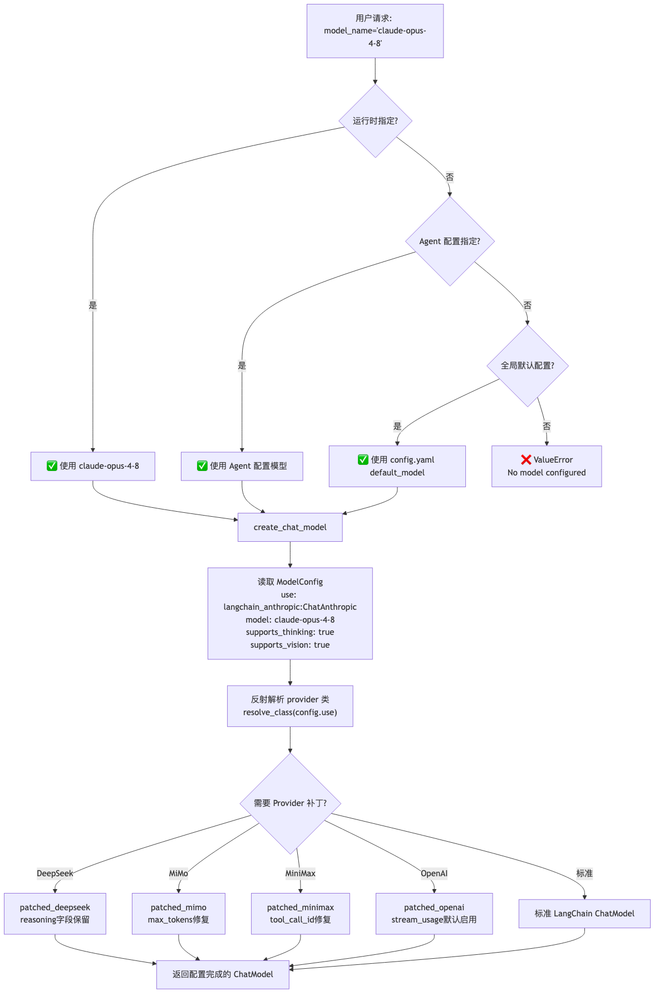
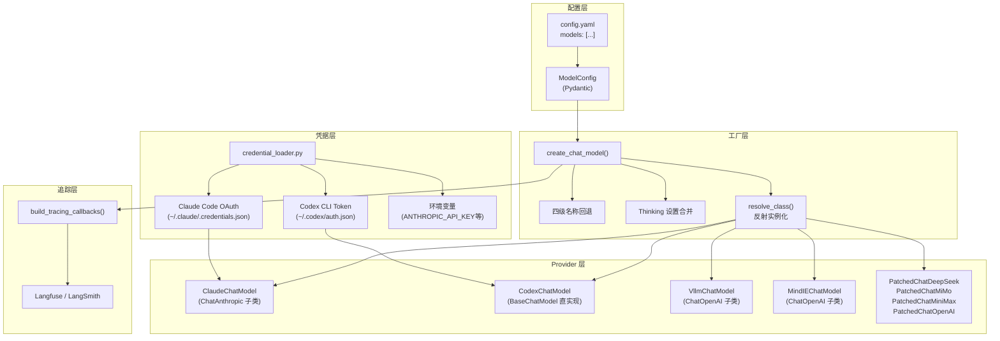

# 07 模型集成层

**本章课程目标：**

- 理解 `create_chat_model()` 工厂函数的配置驱动设计：从 `config.yaml` 到模型实例的 10 步流水线。
- 看懂多 Provider 适配架构：Claude（Anthropic 原生 + OAuth）、GPT（OpenAI Codex Responses API）、DeepSeek、vLLM、MindIE（华为）、MiMo（小米）、MiniMax 各有什么特点。
- 理解四级模型名称回退链和凭据自动发现机制。
- 理解 Provider 补丁模式：为什么需要 `patched_*.py`，`assistant_payload_replay.py` 如何实现签名匹配恢复。
- 理解 Prompt Caching 策略：4 个断点分配、OAuth 路径的缓存禁用、静态系统提示的设计意图。
- 理解 `attach_tracing` 参数为什么在 LangGraph 图调用时必须传 `False`。

**学习建议：** 先看 `create_chat_model()` 的主流程建立全局概念，再看各 Provider 的差异化实现。重点关注补丁模式——这是 LangChain 生态中 Provider 特定字段丢失的通用问题的经典解决方案。

---

## 1、架构总览：配置驱动的模型工厂

DeerFlow 的模型集成层不是简单的"调一个 API 客户端"——它是**配置驱动 + 反射实例化 + 多 Provider 适配 + 凭据自动发现 + Prompt Caching + Thinking 能力检测**的完整链路。





---

## 2、create_chat_model()：10 步工厂流水线

`packages/harness/deerflow/models/factory.py` 中的 `create_chat_model()` 是整个模型层的中央 IoC 入口。它执行 10 步流水线：

```python
def create_chat_model(
    name: str | None = None,
    thinking_enabled: bool = False,
    *,
    app_config: AppConfig | None = None,
    attach_tracing: bool = True,
    **kwargs
) -> BaseChatModel:
```

### 2.1 步骤 1-3：名称解析 → 配置查找 → 类解析

```python
# 步骤 1：如果 name 为 None，取 models 列表的第一个
if name is None:
    name = config.models[0].name

# 步骤 2：从 config.models 列表中按 name 查找 ModelConfig
model_config = config.get_model_config(name)
if model_config is None:
    raise ValueError(f"Model '{name}' not found in config")

# 步骤 3：反射解析 Provider 类
model_class = resolve_class(model_config.use, BaseChatModel)
# 例如 "deerflow.models.claude_provider:ClaudeChatModel" → ClaudeChatModel 类
```

### 2.2 步骤 4：设置提取

```python
# 从 ModelConfig 中提取 Provider 级设置，排除元字段
model_settings = model_config.model_dump(
    exclude_none=True,
    exclude={"use", "name", "display_name", "description",
             "supports_thinking", "supports_reasoning_effort",
             "supports_vision", "when_thinking_enabled",
             "when_thinking_disabled", "thinking"}
)
# 剩余字段（api_key, base_url, model, max_tokens, temperature 等）
# 直接传递给 Provider 构造函数
```

`ModelConfig` 的 `ConfigDict(extra="allow")` 设计非常关键——它允许配置文件中出现任意 Provider 特定字段（如 `enable_prompt_caching`、`auto_thinking_budget`），这些字段被透明传递到 Provider 构造函数。

### 2.3 步骤 5-6：Thinking 设置合并

这是工厂中最复杂的逻辑块，处理三种 thinking 状态：

```python
# 合并简写 thinking 字段到 when_thinking_enabled
effective_wte = _deep_merge_dicts(
    model_config.when_thinking_enabled or {},
    model_config.thinking or {}
)

if thinking_enabled:
    # 验证模型支持 thinking
    if not model_config.supports_thinking:
        raise ValueError(f"Model '{name}' does not support thinking")
    # 将 effective_wte 合并到 model_settings
    _deep_merge_dicts(model_settings, effective_wte)
else:
    # 尝试四种机制禁用 thinking
    if model_config.when_thinking_disabled:
        _deep_merge_dicts(model_settings, model_config.when_thinking_disabled)
    elif "extra_body" in effective_wte and "thinking" in effective_wte["extra_body"]:
        # OpenAI 兼容网关：注入 thinking.type="disabled"
        ...
    elif "chat_template_kwargs" in effective_wte.get("extra_body", {}):
        # vLLM：通过 chat_template_kwargs 禁用
        model_settings["extra_body"]["chat_template_kwargs"] = \
            _vllm_disable_chat_template_kwargs(...)
    else:
        # 原生 Anthropic：setting thinking={"type": "disabled"}
        model_settings["thinking"] = {"type": "disabled"}
```

四种禁用机制按优先级排列：用户显式配置 → OpenAI 兼容网关 → vLLM → 原生 API。

### 2.4 步骤 7-8：Provider 特定处理 + 实例化

```python
# Codex：剥离 max_tokens，映射 reasoning_effort
if model_class is CodexChatModel:
    model_settings.pop("max_tokens", None)
    if thinking_enabled:
        model_settings["reasoning_effort"] = model_settings.get("reasoning_effort", "medium")
    else:
        model_settings["reasoning_effort"] = "none"

# MindIE：限制重试次数防止超时级联
if model_class is MindIEChatModel:
    model_settings.setdefault("max_retries", 1)

# 全局默认：启用 stream_usage
_enable_stream_usage_by_default(model_config.use, model_settings)

# 实例化
model_instance = model_class(**kwargs, **model_settings)
```

### 2.5 步骤 9-10：追踪附加

```python
if attach_tracing:
    callbacks = build_tracing_callbacks(app_config)
    if callbacks:
        model_instance.callbacks = callbacks

return model_instance
```

---

## 3、四级模型名称回退

模型选择不是简单的"用一个默认的"，而是四级回退链：

| 优先级 | 来源 | 说明 |
| --- | --- | --- |
| 1 | 运行时参数 `name` | 用户在请求中显式指定，或 `RunnableConfig` 中携带 |
| 2 | Agent 配置 `agent_config.model_name` | 在 `config.yaml` 的 `agents.<name>.model_name` 中配置 |
| 3 | 全局默认 `app_config.default_model_name` | 或 `config.models[0].name` |
| 4 | 抛异常 `ValueError` | 如果以上全部为空，拒绝运行 |

```python
def _resolve_model_name(
    model_name: str | None,
    agent_config: AgentConfig | None,
    app_config: AppConfig
) -> str:
    if model_name:
        return model_name
    if agent_config and agent_config.model_name:
        return agent_config.model_name
    if app_config.models:
        return app_config.models[0].name
    raise ValueError("No model configured")
```

这种设计允许不同 Agent 使用不同模型（例如 lead_agent 用 Sonnet，bash 子 Agent 用 Haiku），同时保留了用户运行时覆盖的能力。

---

## 4、多 Provider 适配架构

### 4.1 Provider 全景

| Provider | 类 | 基类 | 特点 |
| --- | --- | --- | --- |
| Claude (Anthropic) | `ClaudeChatModel` | `ChatAnthropic` | OAuth 支持、Prompt Caching、自动 thinking 预算 |
| GPT (Codex) | `CodexChatModel` | `BaseChatModel` | 直连 `chatgpt.com` Responses API、SSE 流解析 |
| vLLM | `VllmChatModel` | `ChatOpenAI` | 保留 `reasoning` 字段、chat_template_kwargs 规范化 |
| MindIE (华为) | `MindIEChatModel` | `ChatOpenAI` | XML 工具调用解析、流式回退、换行符解码 |
| DeepSeek | `PatchedChatDeepSeek` | `ChatDeepSeek` | 保留 `reasoning_content` |
| MiMo (小米) | `PatchedChatMiMo` | `ChatOpenAI` | 保留 `reasoning_content`（流式 + 非流式） |
| MiniMax | `PatchedChatMiniMax` | `ChatOpenAI` | 解析 `reasoning_details` + 内联 `<think>` 标签 |
| Gemini (OpenAI 网关) | `PatchedChatOpenAI` | `ChatOpenAI` | 保留 `thought_signature`（tool_calls） |

### 4.2 ClaudeChatModel：OAuth + 缓存 + 重试

`packages/harness/deerflow/models/claude_provider.py`

这是最复杂的 Provider 实现。它的 `model_post_init()` 自动执行凭据加载：

```python
def model_post_init(self, __context):
    # 1. 如果没有 API key（或 key 是占位符），尝试 OAuth 凭据
    if not self.api_key or self.api_key == "placeholder":
        cred = load_claude_code_credential()
        if cred:
            self._is_oauth = True
            self._oauth_access_token = cred.access_token
            # 设置 OAuth 专用的 anthropic-beta headers
            # 禁用 Prompt Caching（OAuth token 限制 4 个 cache_control 块）
            self.enable_prompt_caching = False
```

内置重试机制（指数退避 + 20% 抖动）：

```python
def _calc_backoff_ms(self, attempt: int, error: Exception) -> int:
    base = 2000 * (2 ** (attempt - 1))  # 2s, 4s, 8s
    jitter = int(base * 0.2 * random.random())
    if hasattr(error, 'response') and 'Retry-After' in error.response.headers:
        return int(error.response.headers['Retry-After']) * 1000
    return base + jitter
```

### 4.3 CodexChatModel：完全自定义实现

`packages/harness/deerflow/models/openai_codex_provider.py`

Codex Provider 是完全从零实现的 `BaseChatModel` 子类，不依赖 `langchain_openai`。它直连 `chatgpt.com/backend-api/codex/responses` 端点：

- 消息转换：将 LangChain 消息格式转换为 Responses API 的 `instructions` + `input_items` 格式
- SSE 流解析：手动解析 `data:` 前缀和 `[DONE]` 标记
- 工具绑定：`bind_tools()` 将 LangChain 工具转换为 Responses API function 格式
- 凭据自动加载：从 `~/.codex/auth.json` 读取 access_token

### 4.4 vLLM / MindIE / 补丁 Provider 的共同模式

所有 `ChatOpenAI` 子类 Provider 都解决同一类问题：**LangChain 的序列化会丢弃 Provider 特定的 `additional_kwargs` 字段**。

以 vLLM 为例——vLLM 在 assistant 消息上返回一个非标准的 `reasoning` 字段，但 `ChatOpenAI._create_chat_result()` 不会将其复制到 `AIMessage.additional_kwargs`：

```python
class VllmChatModel(ChatOpenAI):
    def _create_chat_result(self, response, generation_info):
        result = super()._create_chat_result(response, generation_info)
        # 将 vLLM 的 reasoning 字段复制到 AIMessage
        for choice, gen in zip(response.choices, result.generations):
            if hasattr(choice.message, 'reasoning'):
                gen.message.additional_kwargs['reasoning'] = choice.message.reasoning
                gen.message.additional_kwargs['reasoning_content'] = \
                    _reasoning_to_text(choice.message.reasoning)
        return result
```

MindIE（华为）更复杂——它将工具调用编码为 XML 格式，需要完整的 XML 解析器来恢复结构化 tool_calls。

---

## 5、Provider 补丁模式：为什么需要 patched_*.py

### 5.1 问题根源

LangChain 的 `_get_request_payload()` 方法序列化消息历史为 API 请求字典。这个过程中，`AIMessage.additional_kwargs` 中的 Provider 特定字段（如 DeepSeek 的 `reasoning_content`、Gemini 的 `thought_signature`）会被丢弃——因为 LangChain 不知道这些字段的存在。

**结果：** 第二轮对话时，模型看不到上一轮的推理过程，行为出现偏差。

### 5.2 解决方案：签名匹配恢复

`packages/harness/deerflow/models/assistant_payload_replay.py` 实现了通用的恢复机制：

```python
def restore_assistant_payloads(
    payload_messages: list[dict],
    original_messages: list[BaseMessage],
    restore: AssistantPayloadRestorer
) -> None:
    # 策略 1：快速路径——如果长度匹配，平行对齐
    if len(payload_messages) == len(original_messages):
        for p_msg, o_msg in zip(payload_messages, original_messages):
            if p_msg.get("role") == "assistant" and isinstance(o_msg, AIMessage):
                restore(p_msg, o_msg)
        return

    # 策略 2：慢速路径——通过签名匹配
    # 签名为 content 摘要 + tool_call IDs 的串联
    payload_sigs = [_assistant_signature(m) for m in payload_messages]
    ai_sigs = [_ai_signature(m) for m in original_messages]

    # 对每个 payload 消息，找到签名匹配的 AI 消息
    for p_idx, p_sig in enumerate(payload_sigs):
        match_idx = _match_ai_message(p_sig, ai_sigs)
        if match_idx is not None:
            restore(payload_messages[p_idx], original_messages[match_idx])
```

每个补丁 Provider 只需实现自己的 `restore` 函数：

| 补丁 | restore 函数 | 恢复的字段 |
| --- | --- | --- |
| `patched_deepseek.py` | `restore_reasoning_content` | `additional_kwargs["reasoning_content"]` |
| `patched_mimo.py` | `restore_reasoning_content` | `additional_kwargs["reasoning_content"]` |
| `patched_openai.py` | `_restore_tool_call_signatures` | `tool_calls[*].thought_signature` |

### 5.3 patched_minimax.py：更复杂的推理提取

MiniMax 的推理输出有两种格式：结构化的 `reasoning_details` 和内联的 `<think>` 标签。补丁同时处理两者：

```python
def _create_chat_result(self, response, generation_info):
    result = super()._create_chat_result(response, generation_info)

    # 1. 从 reasoning_details 提取
    if hasattr(choice.message, 'reasoning_details'):
        reasoning_text = _extract_reasoning_text(choice.message.reasoning_details)

    # 2. 从内联 <think> 标签提取并清除
    content = gen.message.content or ""
    think_text, clean_content = _strip_inline_think_tags(content)

    # 3. 合并去重
    gen.message.additional_kwargs['reasoning_content'] = \
        _merge_reasoning(reasoning_text, think_text)
    gen.message.content = clean_content
```

---

## 6、凭据加载：从环境变量到 OAuth Token

`packages/harness/deerflow/models/credential_loader.py` 实现了两级凭据自动发现。

### 6.1 Claude Code OAuth 凭据（4 级回退）

```
1. $CLAUDE_CODE_OAUTH_TOKEN 或 $ANTHROPIC_AUTH_TOKEN 环境变量
2. $CLAUDE_CODE_OAUTH_TOKEN_FILE_DESCRIPTOR（os.read(fd, 1MB)）
3. $CLAUDE_CODE_CREDENTIALS_PATH 文件
4. ~/.claude/.credentials.json 默认路径
```

凭据 JSON 格式来自 Claude Code CLI：

```json
{
  "claudeAiOauth": {
    "accessToken": "sk-ant-oat01-...",
    "refreshToken": "sk-ant-ort01-...",
    "expiresAt": 1773430695128,
    "scopes": ["user:inference"]
  }
}
```

OAuth token 通过 `sk-ant-oat` 前缀识别。过期检测提前 1 分钟缓冲。

### 6.2 Codex CLI Token（2 级回退）

```
1. $CODEX_AUTH_PATH 覆盖
2. ~/.codex/auth.json 默认路径
```

支持旧版扁平格式和嵌套 `tokens` 格式。

### 6.3 零配置设计

这套凭据加载使得 DeerFlow 可以自动拾取用户已有的 Claude Code 或 Codex CLI 登录凭据，而不需要用户在 `config.yaml` 中重复配置 API key。如果用户显式配置了 `api_key`，则跳过自动加载。

---

## 7、Prompt Caching 策略

### 7.1 4 断点分配

Anthropic API 限制每个请求最多 4 个 `cache_control` 断点。`ClaudeChatModel._apply_prompt_caching()` 将其分配为：

```python
def _apply_prompt_caching(self, payload: dict) -> None:
    candidates = []

    # 断点 1：系统提示的所有文本块
    system = payload.get("system")
    if isinstance(system, str):
        payload["system"] = [{"type": "text", "text": system}]
    for block in payload["system"]:
        candidates.append(block)

    # 断点 2-4：最近的 prompt_cache_size 条消息内容块
    messages = payload.get("messages", [])
    recent = messages[-self.prompt_cache_size:]  # 默认 3
    for msg in recent:
        content = msg.get("content")
        if isinstance(content, str):
            msg["content"] = [{"type": "text", "text": content}]
        for block in msg["content"]:
            candidates.append(block)

    # 最后一个断点：最后的工具定义
    if tools := payload.get("tools"):
        candidates.append(tools[-1])

    # 应用 cache_control 到最后 4 个候选块
    for block in candidates[-4:]:
        block["cache_control"] = {"type": "ephemeral"}
```

### 7.2 为什么系统提示必须保持静态

这是 DeerFlow 整体架构的关键设计决策。如果系统提示中包含动态内容（日期、记忆、用户偏好），每次请求都会改变系统文本块的内容，导致 Anthropic 的 Prompt Cache 完全无法命中。

DeerFlow 的解决方案：**系统提示完全静态**，动态内容通过 `DynamicContextMiddleware` 注入为 `<system-reminder>` 消息：

```
System: You are a helpful AI assistant...
User: <system-reminder>Current date: 2026-06-16...</system-reminder>
User: 帮我分析这份数据...
```

这样静态系统提示可以持续命中 Cache，而每会话变化的 `<system-reminder>` 在消息列表中自然能被最近 3 条消息的缓存覆盖。

### 7.3 OAuth 路径的特殊处理

当使用 OAuth token 时，Anthropic 的 OAuth 限制为最多 4 个 `cache_control` 块（与 API key 的计数方式不同）。因此：

```python
if self._is_oauth:
    self.enable_prompt_caching = False  # 完全禁用
    # 在发送前剥离所有 cache_control
    _strip_cache_control(payload)
```

---

## 8、attach_tracing 参数：为什么必须分场景处理

`attach_tracing` 控制是否将 Langfuse/LangSmith 回调直接附加到模型实例。

| 场景 | `attach_tracing` | 原因 |
| --- | --- | --- |
| `make_lead_agent`（图工厂） | `False` | 追踪回调已在图根挂载，模型再挂载会导致双重 span |
| `TitleMiddleware` 生成标题 | `False` | 中间件调用在图的上下文中，图已提供追踪 |
| `DeerFlowClient.stream()` | `False` | 客户端的图根已挂载追踪 |
| `MemoryUpdater` 提取记忆 | `True` | 独立调用，没有图上下文，需要自己的追踪 |
| 独立脚本/工具调用 | `True` | 不在任何图的上下文中运行 |

**核心原则：** 在 LangGraph 图上下文中创建模型时传 `False`，在独立调用中创建模型时传 `True`。

双重 span 的问题不仅仅是冗余——更严重的是，嵌套 observation 在 Langfuse 中会丢失 `session_id`/`user_id` 等元数据，因为 Langfuse 对嵌套 observation 会剥离这些字段。

---

## 9、能力检测：thinking / reasoning_effort / vision

### 9.1 ModelConfig 声明

```yaml
# config.yaml 示例
models:
  - name: claude-sonnet-4-6
    use: deerflow.models.claude_provider:ClaudeChatModel
    model: claude-sonnet-4-6
    supports_thinking: true          # 支持扩展思考
    supports_reasoning_effort: false # 不支持 reasoning_effort 参数
    supports_vision: true            # 支持图像理解
    max_tokens: 8192
    when_thinking_enabled:
      thinking:
        type: enabled
        budget_tokens: 4096
```

### 9.2 能力字段的作用

| 字段 | 在工厂中的作用 | 在中间件中的作用 |
| --- | --- | --- |
| `supports_thinking` | 启用 thinking 时验证；禁用时选择禁用策略 | — |
| `supports_reasoning_effort` | 不支持时从 kwargs 中移除 `reasoning_effort` | — |
| `supports_vision` | — | `ViewImageMiddleware` 检查此标志决定是否注入图片 |

`supports_vision` 不在工厂中使用——它在 `ViewImageMiddleware` 中单独检查，因为视觉支持是 Agent 运行时的决策而非模型创建时的决策。

---

## 10、配置全景

```yaml
# config.yaml - 模型集成层完整配置示例
models:
  # Anthropic Claude（OAuth 零配置）
  - name: claude-sonnet-4-6
    display_name: Claude Sonnet 4.6
    description: Anthropic Claude Sonnet 4.6 via Claude Code OAuth
    use: deerflow.models.claude_provider:ClaudeChatModel
    model: claude-sonnet-4-6
    max_tokens: 8192
    supports_thinking: true
    supports_vision: true
    enable_prompt_caching: true
    prompt_cache_size: 3
    auto_thinking_budget: true
    when_thinking_enabled:
      thinking:
        type: enabled
        budget_tokens: 4096

  # OpenAI Codex（Codex CLI Token 零配置）
  - name: gpt-5.4
    display_name: GPT-5.4 (Codex)
    use: deerflow.models.openai_codex_provider:CodexChatModel
    model: gpt-5.4
    supports_reasoning_effort: true
    supports_vision: true

  # vLLM（本地部署）
  - name: qwen3-235b
    use: deerflow.models.vllm_provider:VllmChatModel
    model: Qwen/Qwen3-235B-A22B
    base_url: http://localhost:8000/v1
    api_key: not-needed
    max_tokens: 4096
    supports_thinking: true
    when_thinking_enabled:
      extra_body:
        chat_template_kwargs:
          enable_thinking: true

  # DeepSeek（补丁）
  - name: deepseek-v3
    use: deerflow.models.patched_deepseek:PatchedChatDeepSeek
    model: deepseek-chat
    api_key: $DEEPSEEK_API_KEY
    base_url: https://api.deepseek.com/v1
    supports_thinking: true

  # Gemini Thinking（通过 OpenAI 兼容网关 + 补丁）
  - name: gemini-2.5-pro-thinking
    use: deerflow.models.patched_openai:PatchedChatOpenAI
    model: google/gemini-2.5-pro-preview
    api_key: $GEMINI_API_KEY
    base_url: https://your-openai-compat-gateway/v1
    supports_thinking: true
    supports_vision: true
    when_thinking_enabled:
      extra_body:
        thinking:
          type: enabled

  # 华为 MindIE
  - name: mindie-qwen
    use: deerflow.models.mindie_provider:MindIEChatModel
    model: qwen3-235b
    base_url: https://mindie-endpoint/v1
    api_key: $MINDIE_API_KEY
    max_retries: 1
```

---

## 11、本章小结

1. `create_chat_model()` 是一个 **10 步工厂流水线**：名称解析 → 配置查找 → 类解析 → 设置提取 → Thinking 合并 → Provider 特定处理 → stream_usage → 实例化 → 追踪附加。

2. 四级模型名称回退（运行时参数 > Agent 配置 > 全局默认 > 抛异常）支持**不同 Agent 使用不同模型**，同时保留用户运行时覆盖。

3. 多 Provider 架构通过**子类化 LangChain 基类 + 重写关键方法**实现适配。ClaudeChatModel 最复杂（OAuth + 缓存 + 重试），CodexChatModel 最独立（完全自定义的 BaseChatModel 实现）。

4. **补丁模式**是解决 LangChain 序列化丢失 Provider 特定字段的通用方案。`assistant_payload_replay.py` 通过签名匹配实现内容对齐，各补丁只需提供字段恢复函数。

5. 凭据加载实现**零配置自动发现**：Claude Code OAuth（4 级回退）+ Codex CLI Token（2 级回退），拾取用户已有的登录凭据。

6. Prompt Caching 策略：**4 个断点分配**（系统提示 → 最近 3 条消息 → 最后工具定义），系统提示保持**静态**以最大化 Cache 复用，OAuth 路径因限制而**禁用缓存**。

7. `attach_tracing=False` 在图调用中是**必须的**，否则导致双重 span 和元数据丢失。
