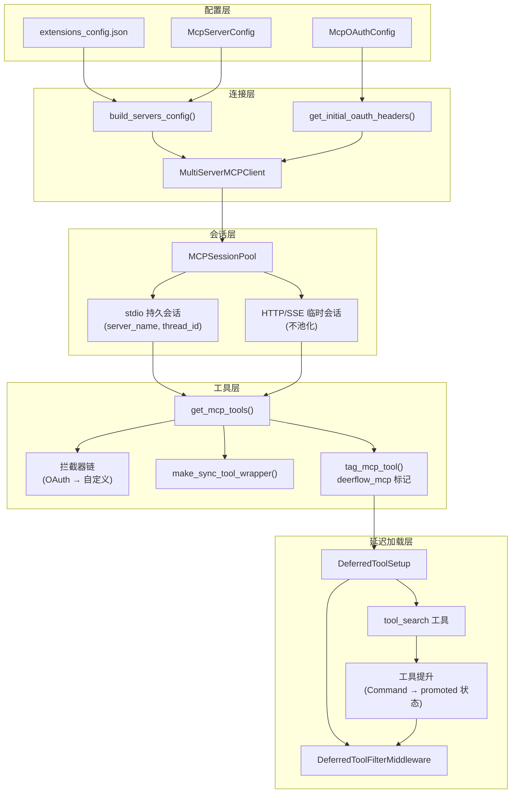
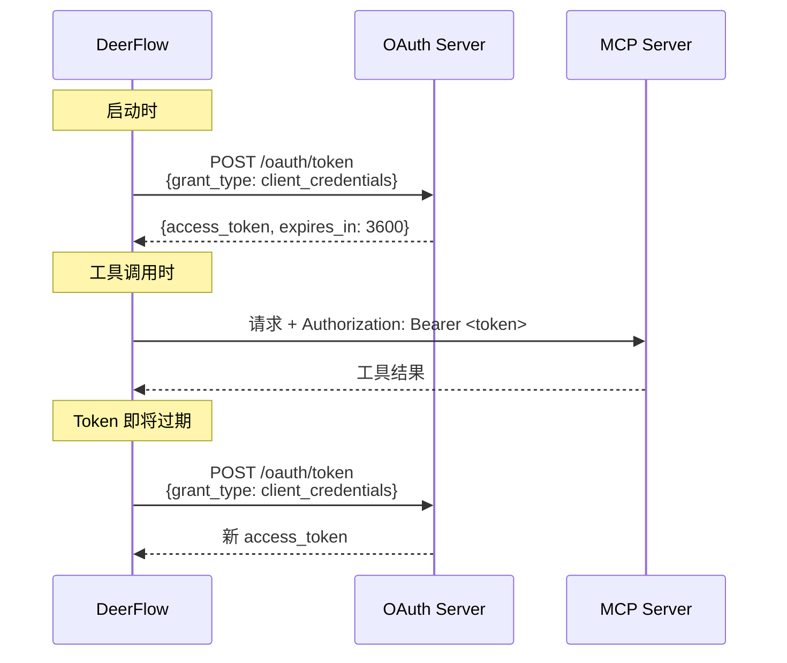
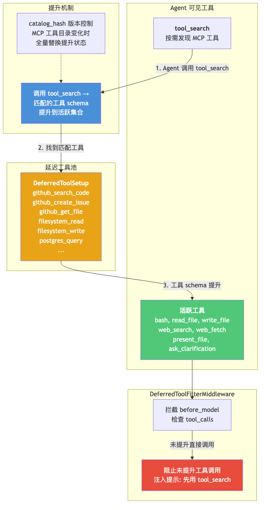
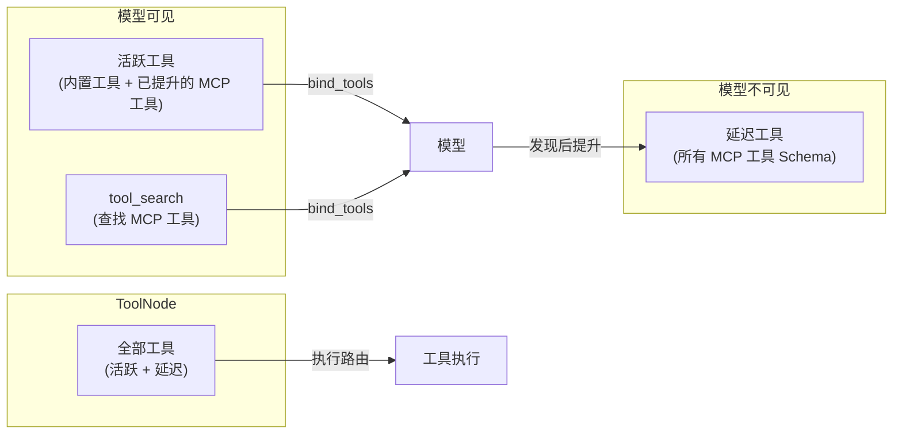
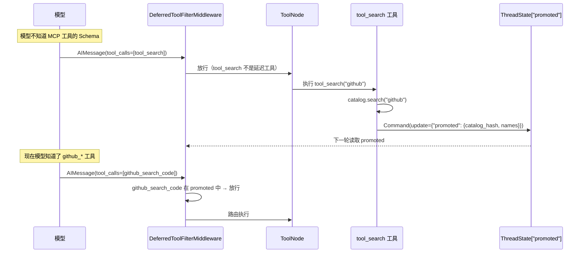

# 08 MCP 协议集成

**本章课程目标：**

- 理解 MCP（Model Context Protocol）的核心概念和 DeerFlow 的集成架构。
- 看懂三种传输类型（stdio、SSE、HTTP）的差异和会话池的适用条件。
- 理解会话池的 `(server_name, thread_id)` 隔离设计、LRU 驱逐和事件循环安全处理。
- 理解 OAuth 令牌流：`client_credentials` 和 `refresh_token` 两种授权模式的全生命周期管理。
- 理解延迟工具加载的设计意图：MCP 工具 Schema 按需发现，避免 Prompt 膨胀。
- 理解工具提升机制：`tool_search` → `Command` 写入 → `DeferredToolFilterMiddleware` 读取的完整闭环。
- 理解自定义拦截器链和异步转同步的包装器设计。

**学习建议：** 先建立"多服务器 → 多传输 → 会话池 → 工具集"的整体概念，再逐层深入各个子系统的设计细节。特别关注延迟加载和工具提升的 LangGraph 状态闭环——这是 MCP 集成中最精妙的设计。

---

## 1、MCP 集成架构总览

MCP（Model Context Protocol）是 Anthropic 提出的开放协议，用于标准化 AI 模型与外部工具/数据源的交互。DeerFlow 通过 `langchain-mcp-adapters` 作为桥接层，构建了一套完整的 MCP 集成系统：



---

## 2、三种传输类型：stdio vs SSE vs HTTP

### 2.1 配置差异

```json
{
  "mcpServers": {
    "playwright": {
      "type": "stdio",
      "command": "npx",
      "args": ["-y", "@anthropic/mcp-server-playwright"],
      "env": { "PLAYWRIGHT_BROWSERS_PATH": "/tmp/pw" }
    },
    "github": {
      "type": "http",
      "url": "https://api.github.com/mcp",
      "headers": { "Authorization": "Bearer ${GITHUB_TOKEN}" }
    },
    "filesystem": {
      "type": "sse",
      "url": "http://localhost:8001/sse"
    }
  }
}
```

### 2.2 传输类型对比

| 特性 | stdio | SSE | HTTP |
| --- | --- | --- | --- |
| **连接方式** | 子进程 stdin/stdout | HTTP + SSE 长连接 | HTTP 请求/响应 |
| **配置字段** | `command` + `args` + `env` | `url` + `headers` | `url` + `headers` |
| **会话状态** | **有状态**（子进程存活期间保持） | 可变（取决于服务端实现） | 通常无状态 |
| **会话池** | ✅ 池化管理 | ❌ 不池化（TaskGroup 冲突） | ❌ 不池化（TaskGroup 冲突） |
| **典型用途** | 浏览器自动化（Playwright）、本地数据库 | 外部服务、云端 MCP 服务器 | RESTful MCP 服务 |
| **资源开销** | 每个会话一个子进程 | 每个请求建立连接 | 每个请求建立连接 |

### 2.3 为什么 HTTP/SSE 不池化

`langchain-mcp-adapters` 的 HTTP/SSE 传输内部使用 anyio `TaskGroup` 管理连接生命周期。这些 `TaskGroup` 无法从不同的 asyncio 任务中安全关闭——在会话池中跨任务复用会导致 `RuntimeError`。这是已确认的限制（代码注释 `#3203`）：

```python
# tools.py 中的关键分发逻辑
if connection.transport_type == "stdio":
    # stdio：包装为池化工具
    tool = _make_session_pool_tool(tool, server_name, connection, tool_interceptors)
else:
    # HTTP/SSE：保持原样，每次调用创建新会话
    # 原因：anyio TaskGroup 不能跨异步任务清理
    pass
```

---

## 3、会话池设计：MCPSessionPool

### 3.1 为什么需要池

对于 stdio 传输，每个 MCP 服务器是一个**子进程**。如果不使用池，每次工具调用都会：
1. 启动新的子进程
2. 通过 stdin/stdout 初始化 MCP 会话
3. 执行工具调用
4. 关闭子进程

这对于有状态服务器（如 Playwright——浏览器实例需要跨调用保持）是灾难性的。会话池让同一线程的连续工具调用共享一个持久子进程。

### 3.2 键控方案：`(server_name, thread_id)` 隔离

```python
class MCPSessionPool:
    def __init__(self):
        self._sessions: OrderedDict[tuple[str, str], ClientSession] = OrderedDict()
        self._loops: dict[tuple[str, str], asyncio.AbstractEventLoop] = {}
        self._context_managers: dict[tuple[str, str], Any] = {}
        self._lock = threading.Lock()
```

键是 `(server_name, scope_key)`，其中 `scope_key` 默认就是 `thread_id`。这确保了：

- **同一线程**的两个连续工具调用（比如先 `browser_navigate` 再 `browser_click`）共享同一个浏览器实例。
- **不同线程**的工具调用获得独立的浏览器实例，互不干扰。

### 3.3 get_session() 的三阶段设计

```python
def get_session(self, server_name: str, scope_key: str, connection) -> ClientSession:
    key = (server_name, scope_key)
    evicted = None

    # === 阶段 1：持锁快速检查/变更（无 I/O 等待）===
    with self._lock:
        if key in self._sessions:
            current_loop = self._loops.get(key)
            if current_loop is asyncio.get_running_loop():
                # 同事件循环：命中缓存
                self._sessions.move_to_end(key)
                return self._sessions[key]
            else:
                # 不同事件循环（同步包装器场景）：驱逐
                evicted = key
                del self._sessions[key]

        # LRU 驱逐
        if len(self._sessions) >= self.MAX_SESSIONS:
            oldest = next(iter(self._sessions))
            evicted = oldest
            del self._sessions[oldest]

    # === 阶段 2：退出锁后清理被驱逐的会话 ===
    if evicted and evicted in self._context_managers:
        # 在原始事件循环上调度关闭
        ...

    # === 阶段 3：创建新会话 ===
    session = create_session(connection)
    await session.__aenter__()
    await session.initialize()

    with self._lock:
        self._sessions[key] = session
        self._loops[key] = asyncio.get_running_loop()

    return session
```

三阶段设计的关键在于 **持锁时间最短**——只在阶段 1 和阶段 3 的注册部分持锁，会话创建和初始化（可能涉及子进程启动）在锁外完成。

### 3.4 事件循环安全

会话池使用 `threading.Lock` 而非 `asyncio.Lock`，因为：
- 异步路径（`async def` 工具调用）和同步路径（通过 `make_sync_tool_wrapper` 转换）都可能访问池。
- `asyncio.Lock` 在非所属事件循环中无法正确工作。

当检测到会话属于不同事件循环时（在同步包装器路径中可能发生），会话被驱逐并重新创建。

### 3.5 生命周期方法

| 方法 | 用途 | 触发场景 |
| --- | --- | --- |
| `close_scope(scope_key)` | 释放某线程的所有会话 | 线程清理 |
| `close_server(server_name)` | 释放某服务器的所有会话 | MCP 服务器配置更新 |
| `close_all()` | 释放所有会话 | 缓存重置、服务关闭 |
| `close_all_sync()` | 同步安全关闭 | 无事件循环的线程中调用 |

---

## 4、OAuth 令牌流

### 4.1 配置格式

```json
{
  "mcpServers": {
    "enterprise-api": {
      "type": "http",
      "url": "https://api.enterprise.com/mcp",
      "oAuth": {
        "enabled": true,
        "tokenUrl": "https://auth.enterprise.com/oauth/token",
        "clientId": "deerflow-client",
        "clientSecret": "${ENTERPRISE_CLIENT_SECRET}",
        "grantType": "client_credentials",
        "scopes": ["mcp:read", "mcp:write"],
        "tokenField": "access_token",
        "expiresInField": "expires_in",
        "refreshSkewSeconds": 60
      }
    }
  }
}
```

### 4.2 两种授权模式



**`client_credentials` 模式：** 适用于服务器到服务器的通信。DeerFlow 使用 `client_id` + `client_secret` 向 token URL 发起请求。

**`refresh_token` 模式：** 适用于有 refresh_token 的场景。需要在配置中提供 `refreshToken`，可选提供 `client_id` / `client_secret`。

### 4.3 TokenManager 设计

```python
class OAuthTokenManager:
    def __init__(self, oauth_by_server: dict[str, McpOAuthConfig]):
        self._oauth = oauth_by_server
        self._tokens: dict[str, _OAuthToken] = {}
        self._locks: dict[str, asyncio.Lock] = {}  # 按服务器加锁

    async def get_authorization_header(self, server_name: str) -> str | None:
        oauth = self._oauth.get(server_name)
        if not oauth:
            return None

        # 检查缓存 + 过期
        token = self._tokens.get(server_name)
        if token and not self._is_expiring(token, oauth):
            return f"Bearer {token.access_token}"

        # 按服务器加锁，防止雷群效应
        lock = self._locks.setdefault(server_name, asyncio.Lock())
        async with lock:
            # 双重检查（可能在等待锁期间已被其他协程刷新）
            token = self._tokens.get(server_name)
            if token and not self._is_expiring(token, oauth):
                return f"Bearer {token.access_token}"

            # 获取新令牌
            new_token = await self._fetch_token(oauth)
            self._tokens[server_name] = new_token
            return f"Bearer {new_token.access_token}"
```

### 4.4 双重注入点

OAuth 令牌需要在两个时机注入：

1. **初始连接时**（`get_initial_oauth_headers`）：在 `MultiServerMCPClient` 建立连接时注入 `Authorization` 头，用于工具发现和会话初始化。

2. **每次工具调用时**（`build_oauth_tool_interceptor`）：通过拦截器在每次工具调用前刷新并注入令牌，确保长时间运行的会话不会因令牌过期而失败。

---

## 5、工具缓存：mtime 失效

### 5.1 为什么需要缓存

MCP 工具的发现过程涉及：
1. 连接到所有 MCP 服务器
2. 调用 `session.list_tools()` 获取工具列表
3. 为每个工具构建 LangChain `StructuredTool`

这个过程开销大（特别是涉及多个远程服务器时），不应在每次 Agent 调用时重复。

### 5.2 mtime 失效策略

```python
# cache.py
_mcp_tools_cache: list[BaseTool] | None = None
_cache_initialized: bool = False
_config_mtime: float | None = None

def _is_cache_stale() -> bool:
    if not _cache_initialized:
        return False
    current_mtime = _get_config_mtime()  # os.path.getmtime(extensions_config.json)
    if current_mtime is not None and _config_mtime is not None:
        return current_mtime > _config_mtime
    return False

def get_cached_mcp_tools() -> list[BaseTool]:
    if _is_cache_stale():
        reset_mcp_tools_cache()  # 关闭所有会话 + 清空缓存

    if _mcp_tools_cache is None:
        _mcp_tools_cache = initialize_mcp_tools()
        _config_mtime = _get_config_mtime()
        _cache_initialized = True

    return _mcp_tools_cache
```

当用户通过 Gateway API 修改 `extensions_config.json` 时，mtime 变化会触发缓存失效。下一次 `get_cached_mcp_tools()` 调用会重新发现所有 MCP 工具并重建会话池。

### 5.3 缓存重置的连锁反应

```
extensions_config.json 变更
  → mtime 失效检测
    → reset_mcp_tools_cache()
      → session_pool.close_all_sync() // 关闭所有 stdio 子进程
      → reset_session_pool()          // 清空池注册表
      → _mcp_tools_cache = None       // 清空工具缓存
```

---

## 6、延迟工具加载：Schema 按需发现



### 6.1 问题

MCP 服务器的工具 Schema 可能非常庞大。例如 GitHub MCP 服务器提供 20+ 个工具，每个工具的 JSON Schema 包含完整的参数定义、枚举值、描述——全部绑定到模型会轻易占用数千 token 的 prompt 预算。

### 6.2 解决方案：活跃工具 + 延迟工具



关键设计：LangGraph 的 **ToolNode 包含全部工具**（活跃 + 延迟），但**模型的 `bind_tools` 只包含活跃工具和 `tool_search`**。这样：
- 模型不会看到 20 个 GitHub 工具的完整 Schema（节省数千 token）
- 但如果模型通过 `tool_search` 发现了某个工具并调用它，ToolNode 能正确路由执行

### 6.3 DeferredToolCatalog：工具目录

```python
@dataclass(frozen=True)
class DeferredToolCatalog:
    tools: tuple[BaseTool, ...]

    @cached_property
    def names(self) -> frozenset[str]:
        return frozenset(t.name for t in self.tools)

    @cached_property
    def hash(self) -> str:
        """稳定短哈希（16 hex chars），基于排序后的工具名称 + Schema"""
        ...

    def search(self, query: str) -> list[BaseTool]:
        """按查询搜索工具"""
        # 支持三种查询语法：
        # "select:Name1,Name2" — 精确名称匹配
        # "+required pattern"    — 要求名称包含 required，按 pattern 排序
        # "regex_pattern"        — 正则搜索 name + description
        ...
```

### 6.4 tool_search 工具

```python
def build_tool_search_tool(catalog: DeferredToolCatalog) -> BaseTool:
    @tool
    def tool_search(query: str) -> str:
        """Search for available MCP tools by name or description."""
        results = catalog.search(query)
        # 返回 Command 将匹配的工具名称写入 promoted 状态
        return Command(update={
            "promoted": {
                "catalog_hash": catalog.hash,
                "names": [t.name for t in results]
            },
            "messages": [ToolMessage(
                content=format_search_results(results),
                tool_call_id=...
            )]
        })
```

---

## 7、工具提升机制：LangGraph 状态闭环

### 7.1 完整流程



### 7.2 DeferredToolFilterMiddleware

```python
class DeferredToolFilterMiddleware(AgentMiddleware):
    def __init__(self, deferred_names: frozenset[str], catalog_hash: str | None):
        self._deferred_names = deferred_names
        self._catalog_hash = catalog_hash

    def _promoted(self, state) -> set[str]:
        promoted = state.get("promoted")
        if not promoted:
            return set()
        # 目录哈希不匹配 → 旧的提升无效
        if promoted.get("catalog_hash") != self._catalog_hash:
            return set()
        return set(promoted.get("names", []))

    def _hidden(self, state) -> set[str]:
        return self._deferred_names - self._promoted(state)

    def wrap_model_call(self, request, handler):
        # 从模型的 bind_tools 中移除隐藏的工具
        hidden = self._hidden(request.state)
        filtered_tools = [t for t in request.tools if t.name not in hidden]
        return handler(request.override(tools=filtered_tools))

    def wrap_tool_call(self, request, handler):
        # 如果模型调用了未提升的延迟工具，阻止并提示
        if request.tool_name in self._hidden(request.state):
            return ToolMessage(
                content=f"The tool '{request.tool_name}' is available but its "
                        f"schema is currently deferred. Use tool_search to find it first.",
                tool_call_id=request.tool_call_id,
                status="error"
            )
        return handler(request)
```

### 7.3 catalog_hash 的作用

`catalog_hash` 确保工具提升具有**配置版本感知**：

```
场景：用户修改 extensions_config.json，添加了新的 MCP 服务器
  → MCP 工具目录变化
    → catalog_hash 变化
      → DeferredToolFilterMiddleware 的旧 catalog_hash 不匹配
        → 所有旧的 promoted 条目被忽略
          → 模型需要重新调用 tool_search 发现新工具
```

`ThreadState["promoted"]` 的自定义 Reducer 进一步强化了这个设计：

```python
def merge_promoted(left: PromotedTools, right: PromotedTools) -> PromotedTools:
    if right.catalog_hash != left.catalog_hash:
        return right  # 目录变了，全量替换
    # 合并提升的工具名称
    return PromotedTools(
        tools={**left.tools, **right.tools},
        catalog_hash=left.catalog_hash
    )
```

---

## 8、自定义拦截器链

### 8.1 配置声明

```json
{
  "mcpServers": { "...": "..." },
  "mcpInterceptors": [
    "my_package.interceptors:build_logging_interceptor",
    "my_package.interceptors:build_rate_limit_interceptor"
  ]
}
```

### 8.2 拦截器构建

```python
# tools.py 中的拦截器链构建
tool_interceptors = []

# OAuth 拦截器（总是最先执行）
oauth_interceptor = build_oauth_tool_interceptor(extensions_config)
if oauth_interceptor:
    tool_interceptors.append(oauth_interceptor)

# 自定义拦截器
for interceptor_path in extensions_config.model_extra.get("mcpInterceptors", []):
    builder = resolve_variable(interceptor_path)
    interceptor = builder()
    tool_interceptors.append(interceptor)

# 构建嵌套调用链：interceptor_1 → interceptor_2 → ... → base_handler
async def base_handler(request):
    result = await session.call_tool(
        request.tool_name,
        request.args,
        meta={"headers": dict(request.headers)} if request.headers else None
    )
    return result

async def build_chain(handler, interceptors):
    wrapped = handler
    for interceptor in reversed(interceptors):
        prev = wrapped
        async def make_wrapper(inner, ic):
            async def wrapper(req):
                return await ic(req, inner)
            return wrapper
        wrapped = await make_wrapper(wrapped, interceptor)
    return wrapped
```

### 8.3 拦截器接口

自定义拦截器是一个异步可调用对象，接收 `MCPToolCallRequest` 和 `handler`：

```python
async def my_interceptor(request: MCPToolCallRequest, handler) -> Any:
    # 修改请求头
    request = request.override(headers={
        **request.headers,
        "X-Custom-Header": "value"
    })
    # 转发到下一个拦截器或 base_handler
    return await handler(request)
```

如果拦截器设置了 `request.headers`，这些头会通过 `meta={"headers": ...}` 传递到底层 MCP `session.call_tool()`——即使在无状态的 stdio 传输中也能传递认证信息。

---

## 9、同步包装器：弥合异步鸿沟

### 9.1 问题

LangChain 的 `@tool` 装饰器要求工具要么有 `func`（同步），要么有 `coroutine`（异步）。MCP 工具是原生异步的（`coroutine` 属性），但 DeerFlow 的某些调用路径是同步的（如 `DeerFlowClient.chat()`）。

### 9.2 解决方案

`packages/harness/deerflow/tools/sync.py` 中的 `make_sync_tool_wrapper()`：

```python
def make_sync_tool_wrapper(coro, tool_name: str):
    def sync_func(*args, **kwargs):
        loop = asyncio.get_event_loop()
        if loop.is_running():
            # 事件循环正在运行（在异步上下文中同步调用）
            # 在独立线程中运行，复制 contextvars
            with ThreadPoolExecutor(max_workers=1) as executor:
                future = executor.submit(
                    lambda: asyncio.run(coro(*args, **kwargs))
                )
                return future.result()
        else:
            # 没有运行中的事件循环（纯同步环境）
            return asyncio.run(coro(*args, **kwargs))

    return sync_func
```

在 `get_mcp_tools()` 的末尾，所有没有 `func` 的 MCP 工具都被修补：

```python
for tool in mcp_tools:
    if not hasattr(tool, 'func') and hasattr(tool, 'coroutine'):
        tool.func = make_sync_tool_wrapper(tool.coroutine, tool.name)
```

---

## 10、MCP 工具标记

`packages/harness/deerflow/tools/mcp_metadata.py` 是一个轻量级模块，定义了 MCP 工具的识别机制：

```python
MCP_TOOL_METADATA_KEY = "deerflow_mcp"

def tag_mcp_tool(tool: BaseTool) -> BaseTool:
    tool.metadata[MCP_TOOL_METADATA_KEY] = True
    return tool

def is_mcp_tool(tool: BaseTool) -> bool:
    return tool.metadata.get(MCP_TOOL_METADATA_KEY, False)
```

这个标记在延迟工具加载中至关重要——`build_deferred_tool_setup()` 通过 `is_mcp_tool()` 识别哪些工具应该被延迟加载。模块被刻意设计为叶子模块，不导入其他模块，避免循环导入。

---

## 11、本章小结

1. DeerFlow 的 MCP 集成通过 **`langchain-mcp-adapters` + 会话池 + 延迟加载 + 拦截器链** 四层架构，实现了多服务器、多传输类型的统一工具接入。

2. 三种传输类型中，**stdio 需要会话池**管理子进程生命周期，HTTP/SSE 因 anyio TaskGroup 限制**不能池化**。会话池按 `(server_name, thread_id)` 键控实现线程间隔离。

3. OAuth 令牌流支持 **`client_credentials` 和 `refresh_token`** 两种模式，通过**双重注入**（初始连接 + 每次工具调用）确保令牌有效性。按服务器的 `asyncio.Lock` 防止雷群效应。

4. 工具缓存通过 **mtime 失效** 实现运行时重载：修改 `extensions_config.json` 后缓存自动失效，触发会话池重置和工具重新发现。

5. **延迟工具加载**是 MCP 集成的核心优化：模型只看到活跃工具和 `tool_search`，MCP 工具的完整 Schema 通过 `tool_search` 按需发现，避免 Prompt 膨胀数千 token。

6. **工具提升机制**通过 LangGraph 状态实现闭环：`tool_search` 输出 `Command` 写入 `promoted` 状态 → `ThreadState` 持久化 → `DeferredToolFilterMiddleware` 读取并放行对应工具。`catalog_hash` 确保配置变更时旧的提升自动失效。

7. 自定义拦截器链支持在 OAuth 之外注入任意请求处理逻辑。`make_sync_tool_wrapper` 弥合了 MCP 工具异步实现与 DeerFlow 同步调用路径之间的鸿沟。
