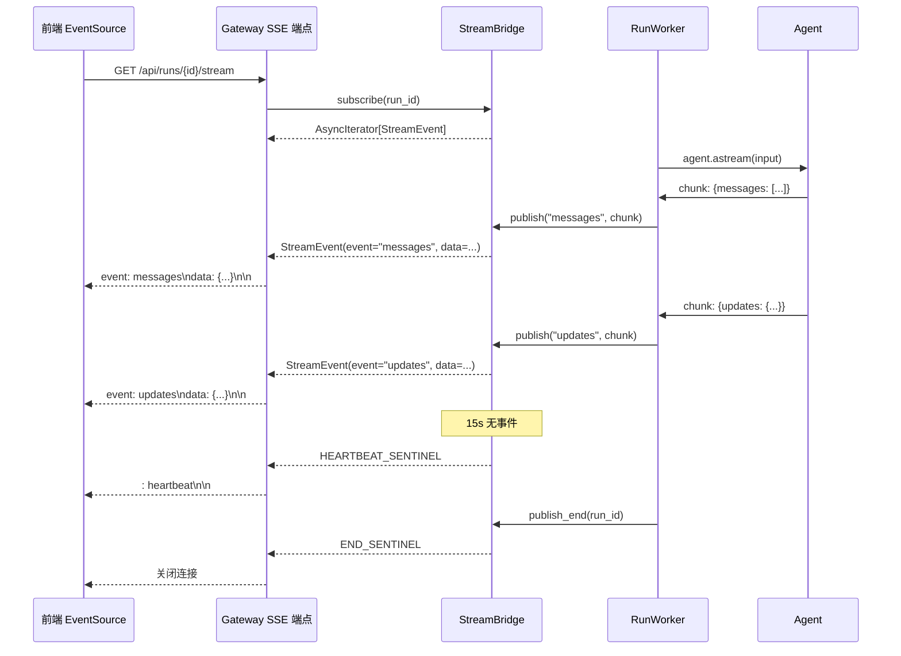
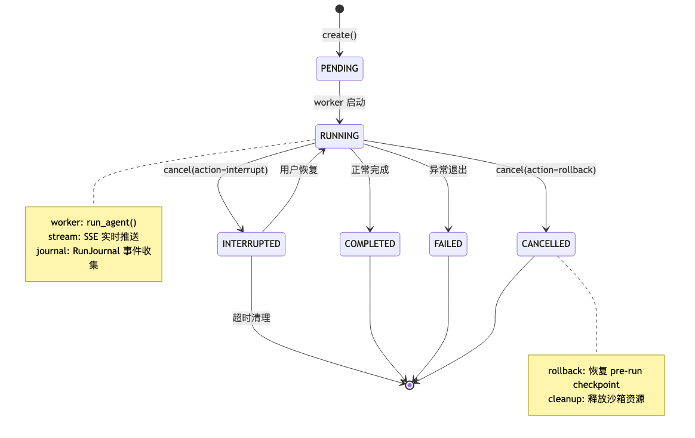
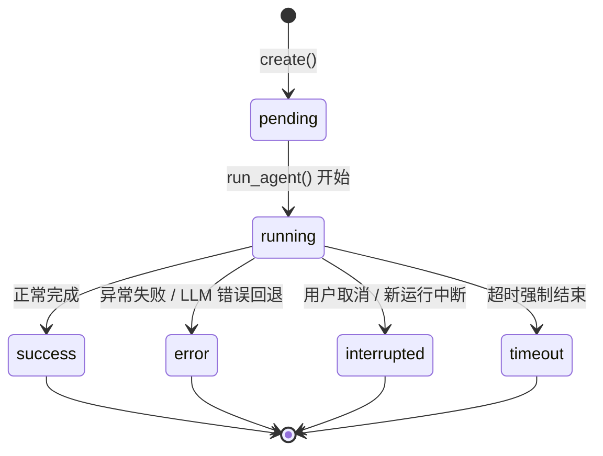

# 09 流桥与运行时

**本章课程目标：**

- 理解 StreamBridge 的生产者-消费者解耦模式：为什么 Agent Worker 和 SSE 端点必须分离。
- 看懂 MemoryStreamBridge 的内部实现：`asyncio.Condition` 同步、事件缓冲区、心跳机制。
- 理解 SSE 事件流的完整链路：从 Agent 流式输出到前端 EventSource 的每一步转换。
- 理解 RunManager 的完整生命周期：创建 → 运行 → 取消 → 完成，以及多任务策略。
- 理解 RunWorker（`run_agent`）的执行流程：后台 asyncio 任务管理、流式消费、异常处理。
- 理解 RunJournal 的 Buffered 事件收集和 Token 去重追踪设计。
- 理解孤运行调和与 `on_disconnect` 的取消 vs 继续语义。

**学习建议：** 这是一章"连接型"内容——流桥连接了前面所有章节的内部处理与外部世界。建议先看 SSE 事件流的全景链路图，再分别深入 StreamBridge、RunManager、RunWorker 三个子系统。

---

## 1、架构全景：从 Agent Worker 到前端 EventSource

```mermaid
flowchart TB
    subgraph "Gateway API 层"
        REQ[POST /api/runs]
        SSE[SSE 端点<br/>GET /api/runs/{id}/stream]
    end

    subgraph "运行时层"
        RM[RunManager]
        RW["RunWorker<br/>(run_agent 在 asyncio.Task 中)"]
        SB[StreamBridge]
    end

    subgraph "Agent 执行层"
        AGENT["make_lead_agent() →<br/>agent.astream()"]
        MW[19 层中间件]
        TOOLS[工具调用]
    end

    subgraph "持久化层"
        CP[Checkpointer]
        RS[RunStore]
        TS[ThreadStore]
        RJ[RunJournal]
    end

    REQ -->|"create_or_reject()"| RM
    RM -->|"asyncio.create_task()"| RW
    RW --> AGENT
    AGENT --> MW
    AGENT --> TOOLS
    AGENT -->|"publish(event)"| SB
    SB -->|"subscribe()"| SSE
    SSE -->|"text/event-stream"| FRONTEND[前端 EventSource]

    RW <-->|"checkpoint"| CP
    RW -->|"完成数据"| RS
    RW -->|"标题同步"| TS
    RW -->|"回调事件"| RJ
```

核心设计原则：**Agent Worker（生产者）和 SSE 端点（消费者）通过 StreamBridge 完全解耦**。Worker 不知道前端的存在，SSE 端点不知道 Agent 的内部状态——它们只通过 `publish()` / `subscribe()` 接口交互。

---

## 2、StreamBridge：生产者-消费者解耦

### 2.1 抽象协议

`packages/harness/deerflow/runtime/stream_bridge/base.py` 定义了 `StreamBridge` 的抽象接口：

```python
@dataclass(frozen=True)
class StreamEvent:
    id: str       # 单调递增的事件 ID（SSE id: 字段，支持 Last-Event-ID 重连）
    event: str    # SSE 事件名
    data: Any     # 事件负载（预序列化字符串）

HEARTBEAT_SENTINEL = StreamEvent(id="", event="__heartbeat__", data=None)
END_SENTINEL = StreamEvent(id="", event="__end__", data=None)

class StreamBridge(ABC):
    @abstractmethod
    async def publish(self, run_id: str, event: str, data: Any) -> None: ...
    @abstractmethod
    async def publish_end(self, run_id: str) -> None: ...
    @abstractmethod
    def subscribe(self, run_id: str, *, last_event_id: str | None = None,
                  heartbeat_interval: float = 15.0) -> AsyncIterator[StreamEvent]: ...
    @abstractmethod
    async def cleanup(self, run_id: str, *, delay: float = 0) -> None: ...
```

### 2.2 设计要点

| 设计元素 | 说明 |
| --- | --- |
| **`StreamEvent.id`** | 单调递增的字符串 ID。用作 SSE 的 `id:` 字段，前端 `EventSource` 重连时通过 `Last-Event-ID` 头传给服务端，实现断线续传 |
| **`HEARTBEAT_SENTINEL`** | 15 秒无事件时发出。防止代理/负载均衡器因空闲超时断开连接 |
| **`END_SENTINEL`** | 生产者完成后发出。告知消费者流已终结，可以关闭迭代器和 SSE 连接 |
| **`cleanup(delay)`** | 延迟清理资源。给晚到的订阅者（如页面刷新后重新订阅）一个时间窗口拉取事件 |

### 2.3 为什么不用 LangGraph Platform 的内置流

DeerFlow 实现了自己的 StreamBridge 而不是直接使用 LangGraph Platform 的 Queue + StreamManager，原因是：

| 需求 | LangGraph Platform 内置 | DeerFlow StreamBridge |
| --- | --- | --- |
| 独立部署（无 LangGraph Server） | 依赖 LangGraph Server | 独立运行 |
| Redis 后端（多实例） | 内置 | Phase 2 计划中 |
| Last-Event-ID 重连 | 依赖 Server 实现 | 内置支持 |
| 心跳机制 | 不同 Server 实现不同 | 统一的 15s 心跳 |
| 延迟 cleanup | 无 | 支持（给晚到订阅者时间窗口） |

---

## 3、MemoryStreamBridge 实现

`packages/harness/deerflow/runtime/stream_bridge/memory.py` 是进程内内存实现，适用于单实例部署。

### 3.1 内部数据结构

```python
@dataclass
class _RunStream:
    events: list[StreamEvent]           # 事件缓冲区（按 run_id 隔离）
    condition: asyncio.Condition        # 生产者-消费者同步
    ended: bool                         # 是否已结束
    start_offset: int                   # 缓冲区修剪后的逻辑偏移
```

### 3.2 发布（生产者侧）

```python
class MemoryStreamBridge(StreamBridge):
    def __init__(self, queue_maxsize: int = 256):
        self._streams: dict[str, _RunStream] = {}
        self._counters: dict[str, int] = {}  # 每 run_id 的事件计数器
        self._maxsize = queue_maxsize

    async def publish(self, run_id: str, event: str, data: Any) -> None:
        stream = self._get_or_create_stream(run_id)

        async with stream.condition:
            # 生成事件
            event_id = self._next_id(run_id)
            stream.events.append(StreamEvent(id=event_id, event=event, data=data))

            # 缓冲区上限：从前面修剪
            if len(stream.events) > self._maxsize:
                excess = len(stream.events) - self._maxsize
                stream.events = stream.events[excess:]
                stream.start_offset += excess

            # 唤醒所有等待的消费者
            stream.condition.notify_all()
```

### 3.3 订阅（消费者侧）

```python
def subscribe(self, run_id: str, *, last_event_id: str | None = None,
              heartbeat_interval: float = 15.0) -> AsyncIterator[StreamEvent]:
    stream = self._get_or_create_stream(run_id)

    async def iterator():
        # 解析重连偏移
        if last_event_id:
            for i, evt in enumerate(stream.events):
                if evt.id == last_event_id:
                    start_idx = i + 1
                    break
        else:
            start_idx = 0

        while True:
            async with stream.condition:
                # 检查是否有新事件
                if start_idx < len(stream.events):
                    # 如果消费者落后于缓冲区，从最旧的保留事件开始
                    effective_start = max(start_idx,
                        len(stream.events) - self._maxsize + stream.start_offset)
                    for evt in stream.events[effective_start:]:
                        yield evt
                    start_idx = len(stream.events)

                # 检查是否结束
                if stream.ended:
                    yield END_SENTINEL
                    return

                # 等待新事件或超时
                try:
                    await asyncio.wait_for(
                        stream.condition.wait(),
                        timeout=heartbeat_interval
                    )
                except asyncio.TimeoutError:
                    yield HEARTBEAT_SENTINEL

    return iterator()
```

### 3.4 同步机制精讲

`asyncio.Condition` 是核心同步原语：

```
生产者：                         消费者：
  acquire lock                     acquire lock
  events.append(...)                check events since start_idx
  condition.notify_all()            if no new events:
  release lock                       await condition.wait()
                                     (释放锁，挂起，直到 notify 或超时)
                                   release lock
                                   yield events
```

消费者在三种情况下被唤醒：
1. **有新事件**（生产者调用 `notify_all()`）
2. **流已结束**（`stream.ended = True`，在 `wait()` 返回后检查）
3. **心跳超时**（15s 无事件，`wait_for` 抛出 `TimeoutError`）

---

## 4、SSE 事件流：从 Worker 到前端

### 4.1 完整链路



### 4.2 LangGraph stream_mode 到 SSE 事件的映射

| LangGraph stream_mode | SSE 事件名 | 说明 |
| --- | --- | --- |
| `"values"` | `values` | 每次状态变更后的完整状态快照 |
| `"updates"` | `updates` | 每次节点执行后的增量状态变化 |
| `"messages"` | `messages` | 仅消息变更（LLM token 流式输出） |
| `"metadata"` | `metadata` | 运行元数据（run_id、thread_id） |
| `"error"` | `error` | 运行异常信息 |
| `"safety_termination"` | `safety_termination` | 安全终止事件 |
| `"heartbeat"` | —（`__heartbeat__` 哨兵） | 连接保活 |

---

## 5、RunManager：运行生命周期管理



### 5.1 RunRecord 和状态机

`packages/harness/deerflow/runtime/runs/schemas.py` 定义了 `RunStatus` 状态机：



`RunRecord` 是运行期记录数据类，关键字段：

```python
@dataclass
class RunRecord:
    run_id: str
    thread_id: str
    assistant_id: str | None
    status: RunStatus
    on_disconnect: DisconnectMode        # cancel 或 continue
    multitask_strategy: str              # reject / interrupt / rollback
    task: asyncio.Task | None            # 关联的后台 asyncio 任务
    abort_event: asyncio.Event           # 取消信号
    abort_action: str                    # "interrupt" 或 "rollback"
    error: str | None

    # Token 追踪
    total_input_tokens: int
    total_output_tokens: int
    total_tokens: int
    llm_call_count: int
    lead_agent_tokens: int
    subagent_tokens: int
    middleware_tokens: int
```

### 5.2 create_or_reject()：多任务策略

```python
async def create_or_reject(self, thread_id, assistant_id=None, *,
                           on_disconnect=DisconnectMode.cancel,
                           multitask_strategy="reject",
                           **kwargs) -> RunRecord:
    async with self._lock:
        # 检查线程中是否有进行中的运行
        inflight = [r for r in self._runs.values()
                    if r.thread_id == thread_id
                    and r.status in (RunStatus.pending, RunStatus.running)]

        if inflight:
            if multitask_strategy == "reject":
                raise ConflictError(
                    f"Thread {thread_id} already has an active run"
                )
            elif multitask_strategy == "interrupt":
                # 取消所有进行中的运行（保留检查点）
                for record in inflight:
                    await self.cancel(record.run_id, action="interrupt")
            elif multitask_strategy == "rollback":
                # 取消并回滚到运行前检查点
                for record in inflight:
                    await self.cancel(record.run_id, action="rollback")
            else:
                raise UnsupportedStrategyError(multitask_strategy)

        # 创建新运行
        return await self.create(thread_id, assistant_id, **kwargs)
```

### 5.3 三种多任务策略对比

| 策略 | 行为 | 检查点 | 适用场景 |
| --- | --- | --- | --- |
| `reject` | 拒绝新请求，返回 409 Conflict | 不受影响 | 严格串行对话 |
| `interrupt` | 取消旧运行，创建新运行 | **保留**（Agent 停在中断点） | 用户改主意重新提问 |
| `rollback` | 取消旧运行，回滚状态 | **回滚**到运行前的快照 | 用户纠正错误指令 |

### 5.4 取消执行

```python
async def cancel(self, run_id: str, *, action: str = "interrupt") -> bool:
    record = self._runs.get(run_id)
    if record is None:
        return False

    # 如果已经被中断过，幂等返回
    if record.status == RunStatus.interrupted:
        return True

    # 设置取消信号
    record.abort_action = action
    record.abort_event.set()

    # 取消 asyncio 任务
    if record.task and not record.task.done():
        record.task.cancel()

    await self.set_status(run_id, RunStatus.interrupted)
    return True
```

---

## 6、RunWorker（run_agent）：后台执行引擎

`packages/harness/deerflow/runtime/runs/worker.py` 中的 `run_agent()` 是真正的 Agent 执行器。它在 `asyncio.Task` 中运行，通过 `StreamBridge` 发布事件。

### 6.1 执行流程

```python
async def run_agent(
    bridge: StreamBridge,
    run_manager: RunManager,
    record: RunRecord,
    *,
    ctx: RunContext,
    agent_factory,       # make_lead_agent 或自定义工厂
    graph_input: dict,   # {"messages": [HumanMessage(...)]}
    config: dict,        # RunnableConfig
    stream_modes: list[str] | None = None,
    interrupt_before: list[str] | None = None,
    interrupt_after: list[str] | None = None,
) -> None:
    run_id = record.run_id
    thread_id = record.thread_id

    try:
        # 1. 初始化 RunJournal（事件收集 + Token 追踪）
        journal = None
        if ctx.event_store:
            journal = RunJournal(run_id, thread_id, ctx.event_store, ...)

        # 2. 标记为 running
        await run_manager.set_status(run_id, RunStatus.running)

        # 3. 捕获运行前检查点快照（用于 rollback）
        pre_run_snapshot = await _capture_pre_run_snapshot(
            ctx.checkpointer, thread_id
        )

        # 4. 发布元数据
        await bridge.publish(run_id, "metadata", {
            "run_id": run_id,
            "thread_id": thread_id
        })

        # 5. 构建运行时上下文
        runtime_context = _build_runtime_context(
            run_id, thread_id, ctx.app_config, journal
        )

        # 6. 构建 Agent
        runnable_config = {**config, "context": runtime_context}
        agent = agent_factory(config=runnable_config)

        # 7. 流式执行
        async for chunk in agent.astream(
            graph_input,
            config=runnable_config,
            stream_mode=stream_modes or ["updates", "messages"]
        ):
            # 检查取消信号
            if record.abort_event.is_set():
                break

            # 发布事件
            mode, data = _unpack_stream_item(chunk)
            event_name = _lg_mode_to_sse_event(mode)
            await bridge.publish(run_id, event_name, data)

        # 8. 确定最终状态
        if record.abort_event.is_set():
            if record.abort_action == "rollback":
                await _rollback_to_pre_run_checkpoint(...)
                await run_manager.set_status(run_id, RunStatus.error,
                    error="Rolled back by user")
            else:
                await run_manager.set_status(run_id, RunStatus.interrupted)
        elif _has_llm_error_fallback(chunk, journal):
            await run_manager.set_status(run_id, RunStatus.error,
                error=_extract_llm_error_fallback_message(chunk, journal))
        else:
            await run_manager.set_status(run_id, RunStatus.success)

    except asyncio.CancelledError:
        # 处理取消（与 abort_event 逻辑相同）
        ...
    except Exception as e:
        logger.exception(f"Run {run_id} failed")
        await run_manager.set_status(run_id, RunStatus.error, error=str(e))
        await bridge.publish(run_id, "error", {"message": str(e)})

    finally:
        # 9. 清理
        if journal:
            await journal.flush()  # 强制 flush 剩余事件
            completion_data = journal.get_completion_data()
            await run_manager.update_run_completion(run_id, **completion_data)

        # 同步标题到 ThreadStore
        await _sync_title_from_checkpoint(...)

        # 标记流结束
        await bridge.publish_end(run_id)

        # 延迟清理（给晚到订阅者时间窗口）
        await bridge.cleanup(run_id, delay=60)
```

### 6.2 检查点回滚

当 `abort_action == "rollback"` 时，执行检查点回滚：

```python
async def _rollback_to_pre_run_checkpoint(
    checkpointer, thread_id, run_id,
    pre_run_checkpoint_id, pre_run_snapshot, snapshot_capture_failed
) -> None:
    if checkpointer is None:
        return  # 无检查点，NOP

    if pre_run_snapshot is None:
        # 全新线程（运行前无检查点）：删除线程重置为空状态
        await checkpointer.adelete_thread(thread_id)
    else:
        # 恢复运行前的检查点（带新 ID 和时间戳）
        restored = copy.deepcopy(pre_run_snapshot)
        restored["id"] = str(uuid.uuid4())
        restored["ts"] = datetime.now(UTC).isoformat()
        await checkpointer.aput(thread_id, restored)
```

---

## 7、RunJournal：事件收集与 Token 追踪

`packages/harness/deerflow/runtime/journal.py` 实现了 LangChain `BaseCallbackHandler`，位于回调机制和 `RunEventStore` 之间。

### 7.1 设计约束

1. **不实现 `on_llm_new_token`**：只通过 `on_llm_end` 获取完整消息，避免流式 token 的回调风暴。
2. **从 `on_chat_model_start` 提取 human 消息**：比 `on_chain_start`（每个节点都触发）更可靠。
3. **按调用方分桶 Token**：`lead_agent` / `subagent:{name}` / `middleware:{name}` 三个桶。

### 7.2 缓冲写入

```python
class RunJournal(BaseCallbackHandler):
    def __init__(self, run_id, thread_id, event_store, *,
                 track_token_usage=True, flush_threshold=20,
                 progress_reporter=None, progress_flush_interval=5.0):
        self._buffer: list[dict] = []
        self._flush_threshold = flush_threshold
        self._pending_flush: asyncio.Task | None = None

    def _flush_sync(self):
        """同步调度异步 flush，去重防止并发写入"""
        if self._pending_flush and not self._pending_flush.done():
            return  # 已有 pending flush，跳过

        batch = self._buffer[:]
        self._buffer.clear()

        self._pending_flush = asyncio.create_task(
            self._event_store.put_batch(self._run_id, batch)
        )

    def on_llm_end(self, response, **kwargs):
        # 累积 Token
        self._accumulate_usage(response)

        # 追加事件
        self._buffer.append({
            "type": "llm_response",
            "timestamp": datetime.now(UTC).isoformat(),
            "data": response.llm_output
        })

        # 到达阈值时 flush
        if len(self._buffer) >= self._flush_threshold:
            self._flush_sync()
```

### 7.3 Token 去重

```python
class RunJournal:
    def __init__(self, ...):
        self._counted_llm_run_ids: set[str] = set()  # 去重集合

    def _accumulate_usage(self, response):
        run_id = response.run_id
        if run_id in self._counted_llm_run_ids:
            return  # 已计数，跳过（LangChain 可能触发重复回调）

        self._counted_llm_run_ids.add(run_id)
        usage = response.llm_output.get("token_usage", {})

        # 按调用方分桶
        caller = self._current_caller()  # "lead_agent" / "subagent:bash" / "middleware:title"
        if caller == "lead_agent":
            self._lead_agent_tokens += usage.get("total_tokens", 0)
        elif caller.startswith("subagent:"):
            self._subagent_tokens += usage.get("total_tokens", 0)
        else:
            self._middleware_tokens += usage.get("total_tokens", 0)

        self._total_input_tokens += usage.get("input_tokens", 0)
        self._total_output_tokens += usage.get("output_tokens", 0)
        self._llm_call_count += 1
```

### 7.4 进度报告节流

```python
class RunJournal:
    async def _maybe_report_progress(self):
        """节流进度写入，每 progress_flush_interval 秒一次"""
        now = time.monotonic()
        if now - self._last_progress_flush < self._progress_flush_interval:
            return
        self._last_progress_flush = now

        if self._progress_reporter:
            await self._progress_reporter({
                "total_input_tokens": self._total_input_tokens,
                "total_output_tokens": self._total_output_tokens,
                "llm_call_count": self._llm_call_count,
            })
```

---

## 8、孤运行调和

### 8.1 问题

当 Gateway 进程重启时（部署、崩溃恢复），内存中的 `asyncio.Task` 全部丢失。但持久化存储（SQLite）中可能仍有标记为 `pending` 或 `running` 的行——这些是"孤运行"。

如果不处理，前端会看到这些运行永久处于"执行中"状态。

### 8.2 调和逻辑

```python
async def reconcile_orphaned_inflight_runs(
    self, *, error: str, before: datetime | None = None
) -> list[RunRecord]:
    if self._store is None:
        return []  # 无持久化存储，无需调和

    # 从持久化存储中列出 pending/running 的运行
    rows = await self._store.list_inflight(before=before)

    orphaned = []
    for row in rows:
        run_id = row["run_id"]
        # 检查内存中是否有活跃任务
        record = self._runs.get(run_id)
        if record is None or record.task is None or record.task.done():
            # 孤运行：标记为 error
            await self.set_status(run_id, RunStatus.error, error=error)
            orphaned.append(row)

    return orphaned
```

此方法在 Gateway 启动时调用：

```python
# app.py 中的 lifespan 启动逻辑
await run_manager.reconcile_orphaned_inflight_runs(
    error="Server restarted while run was in progress",
    before=startup_time
)
```

---

## 9、on_disconnect：取消 vs 继续

### 9.1 两种策略

| 模式 | 行为 | 适用场景 |
| --- | --- | --- |
| `cancel`（默认） | 客户端断开 SSE 连接后立即取消后台运行 | Web UI（用户关闭页面 = 不再需要结果） |
| `continue_` | 客户端断开后运行继续在后台完成 | API 调用、IM 渠道（用户离线但仍然需要结果） |

### 9.2 实现

```python
# Gateway SSE 端点中的断开处理
async def event_stream(run_id: str, run_manager: RunManager, bridge: StreamBridge):
    try:
        async for event in bridge.subscribe(run_id):
            if event is HEARTBEAT_SENTINEL:
                yield ": heartbeat\n\n"
            elif event is END_SENTINEL:
                break
            else:
                yield f"id: {event.id}\n"
                yield f"event: {event.event}\n"
                yield f"data: {event.data}\n\n"
    except asyncio.CancelledError:
        # 客户端断开连接
        record = await run_manager.get(run_id)
        if record and record.on_disconnect == DisconnectMode.cancel:
            await run_manager.cancel(run_id, action="interrupt")
        # continue_ 模式：什么都不做，运行在后台继续
```

### 9.3 IM 渠道的特殊性

对于飞书、钉钉等 IM 渠道，`on_disconnect` 通常设为 `continue_`：

1. 用户在 IM 中发送消息后可能立即关闭聊天窗口
2. Agent 需要时间处理（可能几分钟）
3. 处理完成后通过 IM SDK 主动推送结果

这与 Web UI 的场景完全不同——Web UI 中用户主动关闭页面通常意味着不再关心结果。

---

## 10、RunContext 和依赖注入

`packages/harness/deerflow/runtime/runs/worker.py` 定义了 `RunContext`：

```python
@dataclass(frozen=True)
class RunContext:
    checkpointer: Any              # LangGraph Checkpointer
    store: Any | None = None       # LangGraph Store
    event_store: Any | None = None # RunEventStore（供 RunJournal 使用）
    run_events_config: Any | None = None
    thread_store: Any | None = None
    app_config: AppConfig | None = None
```

这些依赖通过 `_build_runtime_context()` 注入到 LangGraph 的运行时上下文：

```python
def _build_runtime_context(
    run_id: str, thread_id: str,
    app_config: AppConfig | None,
    journal: RunJournal | None
) -> dict:
    return {
        "thread_id": thread_id,
        "run_id": run_id,
        "app_config": app_config,
        "__run_journal": journal,  # 中间件可以通过这个通道写入审计事件
    }
```

运行时上下文通过 `config["context"]` 传递到所有中间件和工具中，使得任何 Agent 内部组件都能访问运行元数据。

---

## 11、配置参数

```yaml
# config.yaml - 运行时配置
runtime:
  # 流桥
  stream_bridge:
    type: memory                     # memory（当前）/ redis（Phase 2）
    queue_maxsize: 256               # 每 stream 最大保留事件数
    heartbeat_interval: 15.0         # 心跳间隔（秒）
    cleanup_delay: 60                # 流结束后延迟清理（秒）

  # 运行
  runs:
    default_multitask_strategy: reject   # reject / interrupt / rollback
    default_on_disconnect: cancel        # cancel / continue

  # 持久化
  persistence:
    store: sqlite                    # 运行记录存储后端
    retry_policy:
      max_attempts: 5
      initial_delay: 0.05
      max_delay: 1.0
      backoff_factor: 2.0

  # 日志
  journal:
    flush_threshold: 20              # 事件批处理大小
    progress_flush_interval: 5.0     # Token 进度报告间隔（秒）
```

---

## 12、本章小结

1. **StreamBridge** 实现了 Agent Worker 和 SSE 端点的**生产者-消费者解耦**。`MemoryStreamBridge` 使用 `asyncio.Condition` 实现进程内同步，支持 `Last-Event-ID` 重连和 15s 心跳保活。

2. SSE 事件流完整链路：**`agent.astream()` chunk → `bridge.publish()` → `condition.notify_all()` → `subscribe()` 迭代 → Gateway SSE 端点 → 前端 EventSource**。

3. **RunManager** 管理完整的运行生命周期：`pending → running → success/error/interrupted/timeout`。三种多任务策略（reject/interrupt/rollback）处理同一线程的并发请求。

4. **RunWorker（`run_agent`）** 在 `asyncio.Task` 中执行 Agent，流式消费 `astream` 输出，检查 `abort_event` 实现协作式取消。`CancelledError` 和 `abort_event` 双路径确保取消可靠性。

5. **检查点回滚**在 `rollback` 策略下将线程状态恢复到运行前的快照。全新线程回滚通过删除线程实现，已有线程通过恢复旧检查点实现。

6. **RunJournal** 通过 LangChain 回调机制收集事件和 Token 用量：**缓冲写入（flush_threshold=20）+ 去重（`_counted_llm_run_ids`）+ 按调用方分桶（lead_agent/subagent/middleware）+ 进度节流（5s 间隔）**。

7. **孤运行调和**在 Gateway 启动时将持久化存储中的 `pending`/`running` 行标记为 `error`，防止 UI 显示僵尸状态。

8. **`on_disconnect`** 语义区分 Web UI（`cancel`——用户关闭页面即取消）和 IM 渠道（`continue_`——运行继续在后台完成）。
