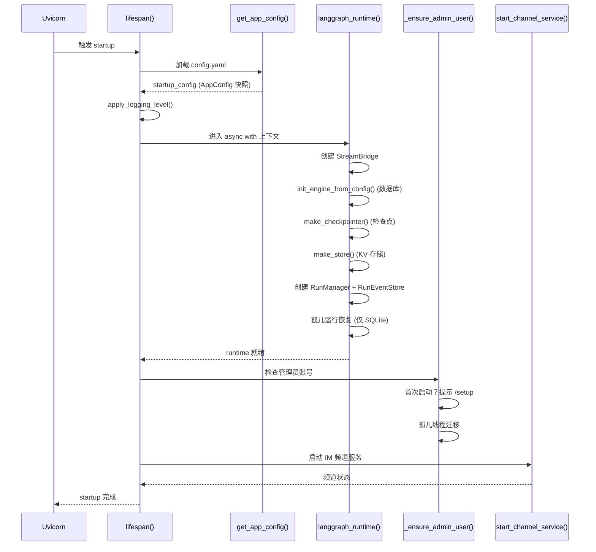
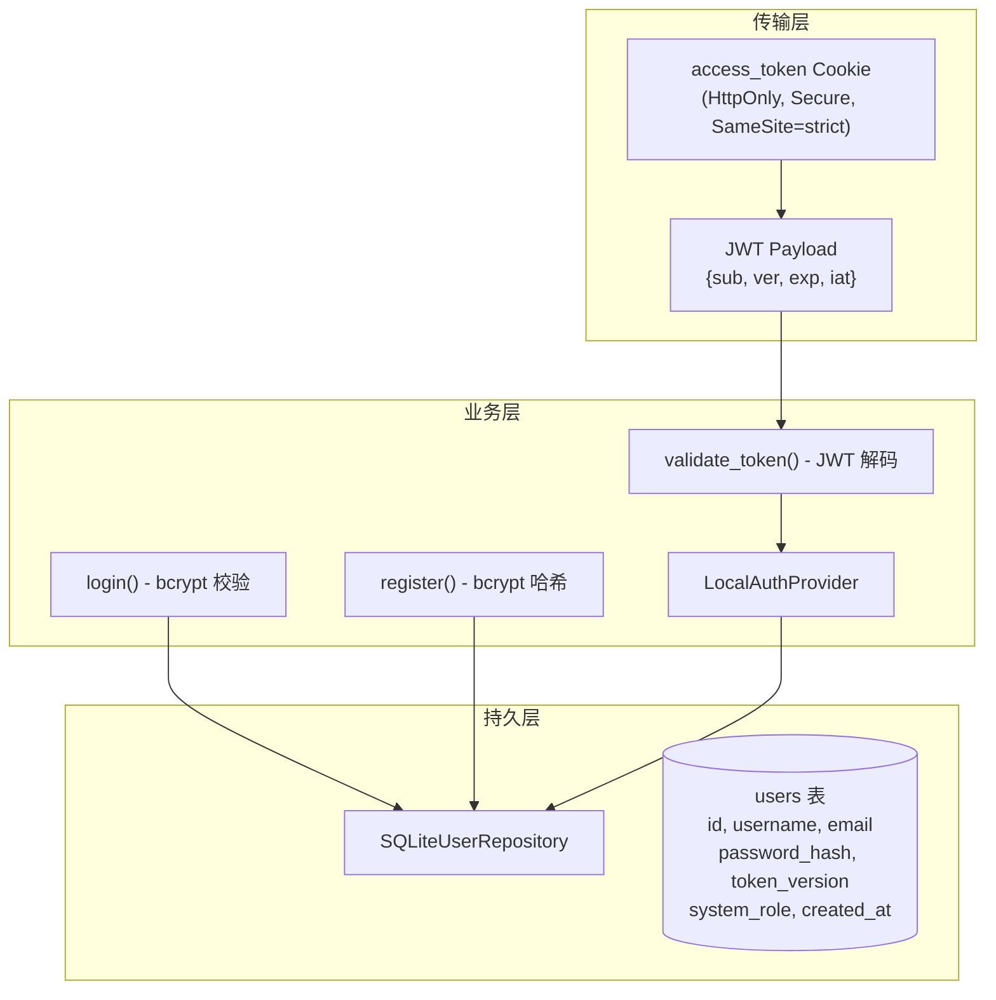
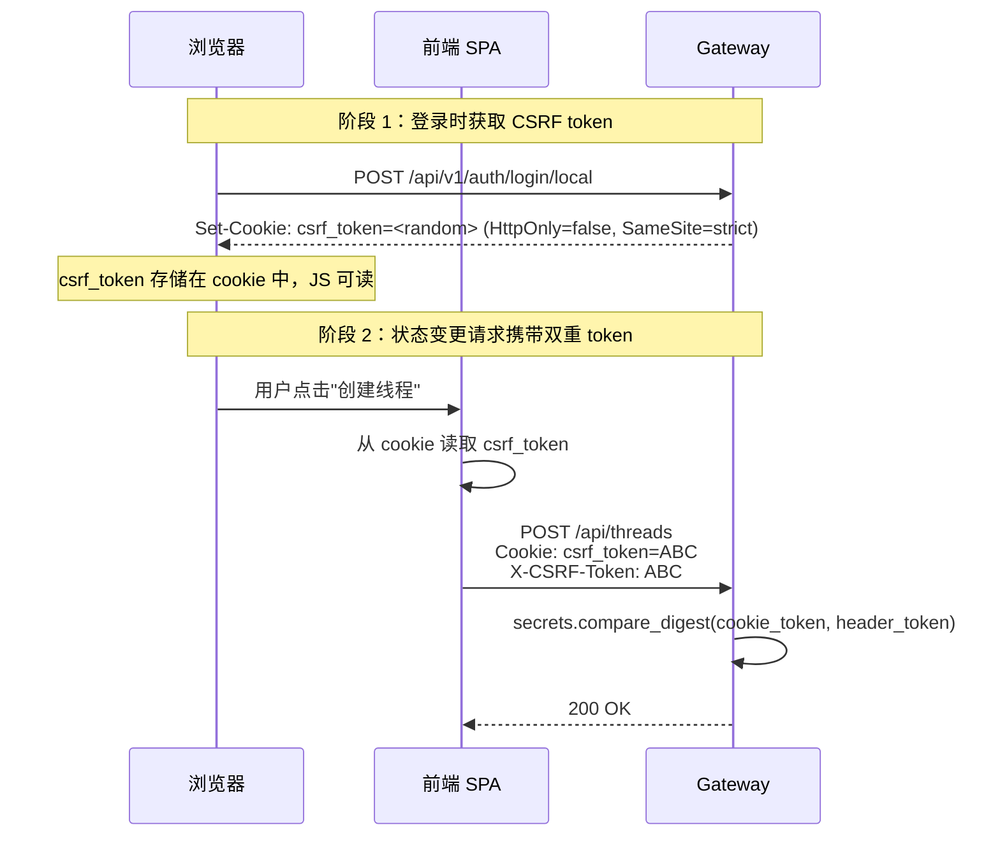

# 10 FastAPI Gateway 与前后端闭环

**本章课程目标：**

- 理解 `create_app()` 中的中间件注册顺序与失败关闭安全兜底设计。
- 看懂 Lifespan 管理的完整流程：配置加载、运行时初始化、IM 渠道启动、孤儿线程迁移。
- 理解认证系统的三层架构：JWT + bcrypt 令牌层、LocalAuthProvider 业务层、UserRepository (SQLite) 持久层。
- 掌握 AuthMiddleware 的公开路径白名单与内部认证旁路机制。
- 掌握 CSRFMiddleware 的 Double-Submit Cookie 模式与认证端点来源校验。
- 理解 `require_auth` 与 `require_permission` 装饰器的权限模型与所有权校验。
- 看懂 REST API 设计：~15 个路由模块的职责划分。
- 理解 SSE 流式端点与 `sse_consumer()` 的客户端断连处理策略。
- 看懂内部认证机制（X-DeerFlow-Internal-Token）如何支撑频道 Worker 的受信调用。
- 理解 LangGraph Platform 兼容层与 Gateway 一致性测试。

**学习建议：** 先看 `create_app()` 的中间件注册顺序（第 1 节），理解"中间件链即安全边界"的设计理念。然后进入认证系统（第 3-6 节），理解从 JWT 签发到权限校验的完整链路。最后看 SSE 流式端点（第 8-9 节）和内部认证（第 10 节），理解 Gateway 如何同时服务浏览器前端和 IM 频道 Worker 两类客户端。

---

## 1、create_app()：应用装配与中间件注册顺序

### 1.1 装配全景

`create_app()` 是 Gateway 的工厂函数，负责将 FastAPI 实例、中间件链、路由模块组装为一个可运行的应用。它不是简单的"New一个App"——中间件的注册顺序决定了安全边界，路由的挂载顺序影响 OpenAPI 文档的组织。

```python
def create_app() -> FastAPI:
    app = FastAPI(
        title="DeerFlow API Gateway",
        lifespan=lifespan,          # 生命周期管理
        docs_url=...,               # 生产环境可关闭
    )

    # 第一层：认证 —— 拒绝所有未认证请求（失败关闭）
    app.add_middleware(AuthMiddleware)

    # 第二层：CSRF —— 对所有状态变更请求执行 Double-Submit Cookie 校验
    app.add_middleware(CSRFMiddleware)

    # 第三层：CORS —— 同源部署默认安全，跨域浏览器客户端需显式白名单
    if cors_origins := get_configured_cors_origins():
        app.add_middleware(CORSMiddleware, ...)

    # ~15 个路由模块按资源类别挂载
    app.include_router(models.router)        # /api/models
    app.include_router(mcp.router)           # /api/mcp
    # ... 其余 13 个路由模块
    app.include_router(runs.router)          # /api/runs

    return app
```

### 1.2 中间件注册顺序的设计理由

| 层级 | 中间件 | 执行时机 | 设计理由 |
| --- | --- | --- | --- |
| 1 | AuthMiddleware | 最先执行 | **失败关闭安全兜底**：任何非公开路径的未认证请求在此被 401 拦截，不会流入下游。即使后续路由忘记加 `@require_auth`，恶意请求也无法穿透。 |
| 2 | CSRFMiddleware | 第二执行 | **状态变更保护**：POST/PUT/DELETE/PATCH 请求必须携带 `X-CSRF-Token` 请求头，且值必须与 cookie 中的 `csrf_token` 一致。认证端点（login/register）豁免 Double-Submit 但执行 Origin 校验。 |
| 3 | CORSMiddleware | 第三执行 | **浏览器跨域控制**：仅在 `GATEWAY_CORS_ORIGINS` 环境变量被显式设置时才注册。同源部署（通过 nginx 统一入口）不需要 CORS。CSRF 和 CORS 共享同一份 `GATEWAY_CORS_ORIGINS` 白名单，保持来源校验的一致性。 |

**设计原则**：Starlette/FastAPI 的中间件按 `add_middleware` 的注册顺序执行——先注册的中间件先收到请求、最后收到响应。因此 Auth 在最外层做"门禁"，CSRF 在次外层做"防盗链"，CORS 在最内层（可选）做"跨域放行"。

---

## 2、Lifespan 管理：从启动到关闭的完整流程

### 2.1 启动流程



### 2.2 startup_config 快照 vs 请求期热加载

`lifespan()` 只在启动时获取一次 `AppConfig` 快照（`startup_config`），用于初始化基础设施组件。这个快照**不会被缓存到 `app.state`**——请求期的配置解析始终通过 `get_app_config()` 实时读取，确保 `config.yaml` 的修改在下一个请求即时生效。

| 组件 | 绑定时机 | 是否支持热加载 | 说明 |
| --- | --- | --- | --- |
| StreamBridge | 启动期 | 否（需重启） | 持有活动连接和单例 provider |
| SQLAlchemy Engine | 启动期 | 否（需重启） | `init_engine_from_config()` 仅执行一次 |
| Checkpointer | 启动期 | 否（需重启） | 绑定到特定后端（SQLite/Postgres） |
| RunEventStore | 启动期 | 否（需重启） | 选择内存或 SQL 实现 |
| RunManager | 启动期 | 否（需重启） | 绑定到 RunStore |
| `models[*].max_tokens` | 请求期 | 是（即时生效） | 通过 `get_app_config()` 实时解析 |
| `summarization.*` | 请求期 | 是（即时生效） | 同上 |
| `memory.*` | 请求期 | 是（即时生效） | 同上 |

### 2.3 关闭流程

关闭流程在 `yield` 之后执行，关键设计是 **5 秒超时边界**：

```python
_SHUTDOWN_HOOK_TIMEOUT_SECONDS = 5.0

async with langgraph_runtime(app, startup_config):
    # ... 启动逻辑 ...
    yield
    # --- 关闭逻辑 ---
    await asyncio.wait_for(stop_channel_service(), timeout=5.0)
```

这个超时保护了 uvicorn 的 reload supervisor：如果某个频道 Worker 卡在关闭流程中（例如等待远程 API 响应），Gateway 进程不会无限期挂起，5 秒后强制退出。

### 2.4 孤儿线程迁移

`_ensure_admin_user()` 在首次启动时检测管理员账号，并在管理员已存在时执行 LangGraph Store 中孤儿线程的迁移。这一步覆盖了"无认证模式升级到有认证模式"的路径——旧数据中的线程元数据没有 `user_id` 字段，迁移会将它们归属到管理员账号下，保持可访问性。

使用游标分页（每页 500 条）而非固定 `limit=1000`，确保在包含数千条目的环境中安全完成全量迁移。

---

## 3、认证系统：JWT + bcrypt + SQLite

### 3.1 三层架构



### 3.2 JWT 令牌设计

访问令牌（access_token）以 HttpOnly cookie 形式下发，包含以下载荷：

```json
{
  "sub": "user-uuid-here",
  "ver": 1,
  "exp": 1760000000,
  "iat": 1750000000
}
```

关键字段：
- `sub`：用户唯一标识，对应 `users` 表的主键。
- `ver`：令牌版本号，与 `users.token_version` 比对。当用户修改密码时，`token_version` 递增，所有旧令牌立即失效——无需维护黑名单。
- `exp`：过期时间，默认 7 天。

### 3.3 bcrypt 密码哈希

`LocalAuthProvider` 使用 bcrypt 进行密码哈希和校验。注册时对明文密码执行 `bcrypt.hashpw()`，登录时通过 `bcrypt.checkpw()` 进行常量时间比对。**密码永远不会以明文形式离开 `LocalAuthProvider`**，其他层（包括 UserRepository）只接触哈希值。

### 3.4 UserRepository (SQLite)

`SQLiteUserRepository` 通过共享的 SQLAlchemy session factory 操作 `users` 表。核心方法：

| 方法 | 说明 |
| --- | --- |
| `get_by_id(user_id)` | 按主键查询用户 |
| `get_by_username(username)` | 按用户名查询（登录用） |
| `create_user(...)` | 创建用户（注册用） |
| `update_token_version(user_id)` | 密码修改后递增版本号，使旧令牌失效 |
| `count_admin_users()` | 统计管理员数量（首次启动检测用） |

---

## 4、AuthMiddleware：公开路径白名单与内部认证旁路

### 4.1 公开路径白名单

```python
_PUBLIC_PATH_PREFIXES = ("/health", "/docs", "/redoc", "/openapi.json")

_PUBLIC_EXACT_PATHS = frozenset({
    "/api/v1/auth/login/local",
    "/api/v1/auth/register",
    "/api/v1/auth/logout",
    "/api/v1/auth/setup-status",
    "/api/v1/auth/initialize",
})
```

公开路径分两类：
- **基础设施路径**（前缀匹配）：`/health`、`/docs`、`/redoc`、`/openapi.json`——这些是运维和 API 文档入口，永远不需要认证。
- **认证路径**（精确匹配）：登录、注册、登出、初始化状态查询——这些是认证流程本身的入口，用户在没有令牌时也需要访问。

注意 `/api/v1/auth/me`、`/api/v1/auth/change-password` 等端点**不在公开白名单中**——它们需要有效的 access_token。

### 4.2 两阶段校验

```
请求进入
  ├─ 路径在白名单？ → 放行
  ├─ 路径不在白名单？
  │   ├─ 请求头含有效 X-DeerFlow-Internal-Token？ → 注入内部用户，放行
  │   ├─ Cookie 中缺少 access_token？ → 401 NOT_AUTHENTICATED
  │   └─ Cookie 存在 access_token？
  │       ├─ JWT 解码失败（过期/格式错误/用户不存在/版本不匹配）→ 401 + 细粒度错误码
  │       └─ JWT 解码成功 → 注入 request.state.user + request.state.auth，放行
```

关键设计：即使 `@require_auth` 装饰器在特定路由上缺失，AuthMiddleware 仍然会拒绝未认证的请求。这是**失败关闭（fail-closed）安全兜底**——路由代码的遗漏不会导致安全漏洞。

### 4.3 用户上下文传播

认证通过后，中间件做两件事：
1. 将 `User` 对象写入 `request.state.user`（供 FastAPI 依赖注入消费）。
2. 将用户通过 `set_current_user()` 注入到 `deerflow.runtime.user_context` ContextVar（供仓库层的归属过滤自动生效）。

ContextVar 在异步上下文中自动传播，因此工具执行期间的 `get_effective_user_id()` 可以正确拿到当前用户，无需每个工具函数显式传递用户参数。

---

## 5、CSRFMiddleware：Double-Submit Cookie 模式

### 5.1 为什么需要 CSRF 防护

浏览器会自动携带同域下的所有 cookie（包括 `access_token`）。如果 Gateway 没有 CSRF 防护，攻击者可以在第三方网站上构造一个隐藏表单，诱使已登录用户向 Gateway 提交状态变更请求——浏览器会附上 cookie 认证，攻击者以用户身份执行操作。

### 5.2 Double-Submit Cookie 模式



CSRFMiddleware 的核心逻辑：

```python
async def dispatch(self, request, call_next):
    if should_check_csrf(request) and not is_auth_endpoint(request):
        cookie_token = request.cookies.get("csrf_token")
        header_token = request.headers.get("X-CSRF-Token")

        if not cookie_token or not header_token:
            return 403  # 缺少任一 token

        if not secrets.compare_digest(cookie_token, header_token):
            return 403  # token 不匹配

    response = await call_next(request)

    # 认证端点 POST 请求：下发新的 csrf_token
    if is_auth_endpoint(request) and request.method == "POST":
        response.set_cookie(
            key="csrf_token",
            value=generate_csrf_token(),
            httponly=False,  # JS 必须可读（Double-Submit 的核心前提）
            secure=is_https,
            samesite="strict",
        )
    return response
```

### 5.3 认证端点的特殊处理

认证端点（login/register/initialize）在首次访问时用户还没有 CSRF token，因此豁免 Double-Submit 校验。但它们仍会创建会话 cookie（access_token），所以必须执行 **Origin 校验**——防止登录 CSRF 攻击：

```python
def is_allowed_auth_origin(request):
    origin = request.headers.get("origin")
    if not origin:
        return True  # 非浏览器客户端（curl、移动端）放行

    normalized = _normalize_origin(origin)
    # 仅接受同源或 GATEWAY_CORS_ORIGINS 中显式配置的来源
    return normalized in _configured_cors_origins() or normalized == _request_origin(request)
```

### 5.4 CSRF 豁免路径

| 豁免规则 | 路径 | 原因 |
| --- | --- | --- |
| 认证端点 | `/api/v1/auth/login/local`, `/api/v1/auth/register`, `/api/v1/auth/logout`, `/api/v1/auth/initialize` | 首次访问无 token，但执行 Origin 校验 |
| `/api/v1/auth/me` | 明确排除 | 仅 GET 读取当前用户信息 |

---

## 6、权限模型：require_auth 与 require_permission

### 6.1 资源:动作 权限模型

DeerFlow 采用简单的 `资源:动作` 权限模型：

| 权限常量 | 含义 |
| --- | --- |
| `threads:read` | 查看线程 |
| `threads:write` | 创建/更新线程 |
| `threads:delete` | 删除线程 |
| `runs:create` | 触发 Agent 运行 |
| `runs:read` | 查看运行状态 |
| `runs:cancel` | 取消运行 |

当前版本所有已认证用户拥有全部权限（`_ALL_PERMISSIONS`），权限模型的结构已就位，未来可从用户数据库或外部策略服务读取实际权限。

### 6.2 装饰器链

```python
@router.get("/{thread_id}")
@require_auth                          # ① 先认证（抛出 401）
@require_permission("threads", "read", owner_check=True)  # ② 再鉴权（抛出 403/404）
async def get_thread(thread_id: str, request: Request):
    ...
```

装饰器按从下到上的顺序执行（Python 装饰器语义）：
1. `require_auth` 先执行：解析 JWT → 查询用户 → 注入 `request.state.auth`。未认证抛 401。
2. `require_permission` 后执行：检查 `resource:action` 权限 → 可选的所有权校验。无权限抛 403，不拥有资源抛 404。

### 6.3 所有权校验

`require_permission(owner_check=True)` 在权限校验之后增加所有权校验：

```python
if owner_check:
    thread_store = get_thread_store(request)
    allowed = await thread_store.check_access(
        thread_id,
        str(auth.user.id),
        require_existing=require_existing,  # 破坏性操作要求行必须存在
    )
    if not allowed:
        raise HTTPException(status_code=404, detail=f"Thread {thread_id} not found")
```

`check_access` 的逻辑：
- 线程行存在且 `user_id` 匹配 → 允许。
- 线程行不存在 → 取决于 `require_existing`：`False` 时允许（未跟踪的旧线程），`True` 时拒绝。
- 线程行存在但 `user_id` 不匹配 → 拒绝（404，不暴露线程存在性）。

### 6.4 测试桩

装饰器内置了测试友好设计：

```python
if getattr(request, "_deerflow_test_bypass_auth", False):
    return await func(*args, **kwargs)
```

当请求对象设置了 `_deerflow_test_bypass_auth = True` 时，装饰器跳过认证逻辑。这使得单元测试可以直接调用被装饰的处理器而无需模拟完整的 JWT 流程。

---

## 7、REST API 设计：~15 个路由模块

### 7.1 路由模块总览

| 路由模块 | 挂载路径 | 核心端点 |
| --- | --- | --- |
| `models` | `/api/models` | `GET /` 列表、`GET /{name}` 详情 |
| `mcp` | `/api/mcp` | `GET /config`、`PUT /config` |
| `memory` | `/api/memory` | `GET /` 数据、`POST /reload`、`GET /config`、`GET /status` |
| `skills` | `/api/skills` | `GET /` 列表、`GET /{name}` 详情、`PUT /{name}` 切换启用、`POST /install` 安装 |
| `artifacts` | `/api/threads/{id}/artifacts` | `GET /{path}` 下载产物 |
| `uploads` | `/api/threads/{id}/uploads` | `POST /` 上传、`GET /list` 列表、`DELETE /{filename}` 删除 |
| `threads` | `/api/threads/{id}` | `DELETE /` 清理线程数据 |
| `agents` | `/api/agents` | `GET /` 列表、`POST /` 创建、`GET /{name}` 详情、`PUT /{name}` 更新、`DELETE /{name}` 删除 |
| `suggestions` | `/api/threads/{id}/suggestions` | `POST /` 生成后续问题建议 |
| `channels` | `/api/channels` | `GET /status`、`POST /{name}/restart` |
| `assistants_compat` | `/api/assistants` | LangGraph Platform 兼容存根 |
| `auth` | `/api/v1/auth` | 登录、注册、登出、修改密码、初始化 |
| `feedback` | `/api/threads/{id}/runs/{rid}/feedback` | CRUD + 聚合统计 |
| `thread_runs` | `/api/threads/{id}/runs` | `POST /` 创建、`POST /stream` SSE 流、`POST /wait` 阻塞等待、`GET /` 列表、`GET /{rid}` 详情、`POST /{rid}/cancel`、`GET /{rid}/join` 加入流、`GET /{rid}/messages` 分页消息 |
| `runs` | `/api/runs` | `POST /stream` 无状态流、`POST /wait` 无状态等待 |

### 7.2 设计模式

所有路由模块遵循统一模式：
- **Pydantic 模型**：请求/响应使用 Pydantic BaseModel 定义，自动校验和文档生成。
- **依赖注入**：通过 `app/gateway/deps.py` 中的 getter 函数从 `app.state` 获取单例，缺失时抛 503。
- **服务委托**：复杂业务逻辑（如运行生命周期）委托给 `services.py`，路由模块保持轻量。
- **认证/鉴权**：通过装饰器声明，不侵入业务逻辑。

---

## 8、SSE 流式端点

### 8.1 两种流式端点

| 端点 | 方法 | 用途 |
| --- | --- | --- |
| `/api/threads/{id}/runs/stream` | POST | 创建运行并以 SSE 流式返回，适用于前端 `useStream` Hook |
| `/api/runs/stream` | POST | 无状态运行（无需预创建线程）的流式端点 |
| `/api/threads/{id}/runs/{rid}/join` | GET | 重新加入一个已在运行的流（断线重连场景） |

流式端点返回 `text/event-stream` 响应，SSE 帧格式与 LangGraph Platform 协议一致：

```
event: metadata
data: {"run_id": "abc123", "attempt": {"id": "..."}}

event: values
data: {"messages": [...], "artifacts": []}

event: messages-tuple
data: [{"type": "AIMessageChunk", "content": "我正在分析数据..."}, ...]

event: end
data: null

```

### 8.2 流模式配置

`stream_mode` 参数控制流的粒度：

| 模式 | 含义 |
| --- | --- |
| `values` | 每次状态更新时推送完整状态快照（默认） |
| `messages-tuple` | 逐消息增量推送（AI 文本为增量 delta） |
| `custom` | 推送 `StreamWriter` 产生的自定义事件 |

前端 `useStream` Hook 默认使用 `["values", "messages-tuple"]` 组合。

---

## 9、sse_consumer() 与 wait_for_run_completion()

### 9.1 sse_consumer() 的设计

`sse_consumer()` 是流式端点的核心生成器，负责从 StreamBridge 消费事件并产出 SSE 帧：

```python
async def sse_consumer(bridge, record, request, run_mgr):
    last_event_id = request.headers.get("Last-Event-ID")
    try:
        async for entry in bridge.subscribe(record.run_id, last_event_id=last_event_id):
            if await request.is_disconnected():
                break

            if entry is HEARTBEAT_SENTINEL:
                yield ": heartbeat\n\n"       # SSE 注释帧，保持连接
                continue

            if entry is END_SENTINEL:
                yield format_sse("end", None)  # 运行结束
                return

            yield format_sse(entry.event, entry.data)
    finally:
        if record.status in (pending, running):
            if record.on_disconnect == DisconnectMode.cancel:
                await run_mgr.cancel(record.run_id)  # 客户端断开时取消运行
```

关键设计点：

| 设计 | 说明 |
| --- | --- |
| `Last-Event-ID` 支持 | 客户端断线重连时可传入最后收到的事件 ID，StreamBridge 从该位置继续推送（取决于 `stream_resumable` 配置） |
| 心跳帧 | `: heartbeat\n\n` 是 SSE 标准的注释帧，不触发客户端事件，但保持 TCP 连接活跃（防止代理超时断连） |
| `END_SENTINEL` 哨兵 | 当运行进入终止状态时，StreamBridge 推送 `END_SENTINEL`，sse_consumer 发送 `end` 事件后正常退出生成器 |
| `on_disconnect` 语义 | `cancel`（默认）：客户端断开时取消后台运行，节省模型调用成本。`continue`：后台继续运行，事件直接丢弃 |

### 9.2 wait_for_run_completion() 的设计

早期的 `/wait` 端点直接 `await record.task`，存在两个问题：
1. 客户端断开时，task 可能被 `CancelledError` 吞掉，未完成的运行被伪装成正常完成。
2. 无法处理心跳和断连语义。

`wait_for_run_completion()` 复用了与 `sse_consumer()` 相同的 StreamBridge 订阅机制：

```python
async def wait_for_run_completion(bridge, record, request, run_mgr):
    completed = False
    try:
        async for entry in bridge.subscribe(record.run_id):
            if entry is END_SENTINEL:
                completed = True
                return True
            if await request.is_disconnected():
                break
        return False  # 客户端断开
    finally:
        if not completed and record.status in (pending, running):
            if record.on_disconnect == DisconnectMode.cancel:
                await run_mgr.cancel(record.run_id)
```

每次 StreamBridge 推送事件时都轮询 `request.is_disconnected()`。当 Agent 长时间没有事件产出时，心跳哨兵保证至少每个 `heartbeat_interval` 触发一次唤醒——断连检测不会因为 Agent 正在执行长工具调用而延迟。

---

## 10、内部认证：X-DeerFlow-Internal-Token

### 10.1 设计动机

IM 频道 Worker（飞书、Slack 等）通过 `langgraph-sdk` HTTP 客户端与 Gateway 通信。它们不在浏览器中运行，没有 cookie 会话。但 Gateway 的 AuthMiddleware 默认拒绝所有非公开路径的未认证请求。内部认证机制为这些受信的进程内/同部署调用方提供了免 cookie 的认证通道。

### 10.2 实现

```python
INTERNAL_AUTH_HEADER_NAME = "X-DeerFlow-Internal-Token"

def _load_internal_auth_token():
    token = os.environ.get("DEER_FLOW_INTERNAL_AUTH_TOKEN")
    if token:
        return token
    return secrets.token_urlsafe(32)  # 未设置则随机生成

def is_valid_internal_auth_token(token):
    return bool(token) and secrets.compare_digest(token, _INTERNAL_AUTH_TOKEN)
```

内部令牌的生成策略：
- 优先使用 `DEER_FLOW_INTERNAL_AUTH_TOKEN` 环境变量（生产环境建议设置，便于多实例共享）。
- 未设置时自动生成 32 字节随机令牌（开发环境便利）。

AuthMiddleware 在处理非公开路径请求时，先检查 `X-DeerFlow-Internal-Token` 请求头：

```python
if is_valid_internal_auth_token(request.headers.get("X-DeerFlow-Internal-Token")):
    user = get_internal_user()  # SimpleNamespace(id="default", system_role="internal")
    request.state.user = user
    # ... 继续处理 ...
```

内部用户被标记为 `system_role = "internal"`，在 `inject_authenticated_user_context()` 中被跳过——内部调用方的 `user_id` 不会被写入运行上下文，避免了"所有 IM 频道消息都以 `default` 用户身份记录"的问题。

### 10.3 CSRF 配合

频道 Manager 初始化时生成一个 CSRF token，并在每次 HTTP 请求中携带匹配的 cookie 和 header：

```python
self._csrf_token = generate_csrf_token()

client = get_client(
    url=self._langgraph_url,
    headers={
        **create_internal_auth_headers(),
        CSRF_HEADER_NAME: self._csrf_token,
        "Cookie": f"{CSRF_COOKIE_NAME}={self._csrf_token}",
    },
)
```

这确保了频道 Worker 的状态变更请求（如创建线程、触发运行）能通过 CSRFMiddleware 的校验。

---

## 11、LangGraph Platform 兼容层

### 11.1 兼容策略

DeerFlow Gateway 实现了 LangGraph Platform API 的一个子集，使得 `@langchain/langgraph-sdk` 的 React Hook（如 `useStream`）和 Python SDK 无需修改即可使用。兼容层覆盖：

| LangGraph Platform API | DeerFlow 实现 |
| --- | --- |
| `POST /threads` | 通过 `langgraph-sdk` 客户端调用 Gateway 内部端点 |
| `POST /threads/{id}/runs/stream` | `thread_runs.py` 的 `stream_run` 端点 |
| `POST /threads/{id}/runs/wait` | `thread_runs.py` 的 `wait_run` 端点 |
| `GET /threads/{id}/runs/{rid}/join` | `thread_runs.py` 的 `join_run` 端点 |
| `GET /threads/{id}/state` | 通过 checkpointer 读取状态 |
| `/api/assistants` | `assistants_compat.py` 存根路由 |

### 11.2 build_run_config() 的兼容处理

`build_run_config()` 处理 LangGraph >= 0.6.0 引入的 `context` 字段与旧版 `configurable` 字段的兼容：

```python
if "context" in request_config:
    # LangGraph >= 0.6.0: 使用 context 而非 configurable
    config["context"] = dict(request_config["context"])
else:
    # 旧版兼容：使用 configurable
    config["configurable"] = {"thread_id": thread_id}
```

自定义 Agent 的名称通过 `agent_name` 注入到 `context` 或 `configurable` 中，`make_lead_agent` 读取该键加载对应的 `SOUL.md` 和配置——与 IM 频道路径保持一致。

### 11.3 normalize_input() 的消息转换

前端传来的消息可能是字典格式（`{role: "human", content: "..."}`），需要转换为 LangChain 的 `BaseMessage` 对象。`normalize_input()` 通过 `langchain_core.messages.utils.convert_to_messages` 完成转换，保留 `additional_kwargs`（如上传文件元数据）、`id`、`name` 等字段：

```python
if msg.get("type") == "human":
    converted.extend(convert_to_messages([msg]))
```

格式错误的消息在边界处被拦截为 400（而非 500），并附带出错索引，便于客户端调试和重试。

---

## 12、Gateway 一致性测试

### 12.1 TestGatewayConformance 设计

`tests/test_client.py` 中的 `TestGatewayConformance` 类验证 `DeerFlowClient`（嵌入式客户端）的返回格式与 Gateway Pydantic 响应模型完全一致：

```python
class TestGatewayConformance:
    def test_models_list_conforms_to_gateway_response(self):
        client_response = client.list_models()
        # 通过 Gateway 的 Pydantic 模型校验——若有字段缺失则抛出 ValidationError
        ModelsListResponse.model_validate(client_response)

    def test_skills_list_conforms_to_gateway_response(self):
        client_response = client.list_skills()
        SkillsListResponse.model_validate(client_response)
    # ... 覆盖所有 dict-returning 方法
```

如果 Gateway 添加了新的必填字段而 `DeerFlowClient` 未同步更新，Pydantic 的 `model_validate()` 会抛出 `ValidationError`，CI 立即捕获漂移。

### 12.2 覆盖范围

| 测试方法 | 对应 Gateway 响应模型 |
| --- | --- |
| `test_models_list_conforms` | `ModelsListResponse` |
| `test_model_detail_conforms` | `ModelResponse` |
| `test_skills_list_conforms` | `SkillsListResponse` |
| `test_skill_detail_conforms` | `SkillResponse` |
| `test_skill_install_conforms` | `SkillInstallResponse` |
| `test_mcp_config_conforms` | `McpConfigResponse` |
| `test_upload_response_conforms` | `UploadResponse` |
| `test_memory_config_conforms` | `MemoryConfigResponse` |
| `test_memory_status_conforms` | `MemoryStatusResponse` |

这种"Gateway 和嵌入式客户端共享同一组 Pydantic 模型作为契约"的设计，确保了无论通过 HTTP API 还是进程内调用，上层消费代码（前端、IM 频道、外部集成）都能获得一致的响应格式。

---

## 13、本章小结

1. **中间件链即安全边界**：AuthMiddleware（失败关闭门禁）→ CSRFMiddleware（状态变更保护）→ CORSMiddleware（跨域放行）的顺序是有意为之的纵深防御设计。

2. **Lifespan 管理将配置分为两类**：启动期快照用于绑定基础设施（数据库连接、检查点后端、流桥接器），请求期热加载用于参数调优（模型配置、摘要参数、记忆阈值），两者边界清晰。

3. **JWT + token_version 机制**实现了无黑名单的令牌吊销：密码修改时递增 `token_version`，所有旧令牌天然失效。

4. **AuthMiddleware 的失败关闭设计**：即使路由忘记加 `@require_auth`，未认证请求也会在中间件层被拦截——路由代码的遗漏不会导致安全漏洞。

5. **CSRFMiddleware 对认证端点做 Origin 校验**：虽然豁免 Double-Submit Cookie 检查，但通过来源白名单防止登录 CSRF 攻击。

6. **`sse_consumer()` 和 `wait_for_run_completion()` 共享 StreamBridge 订阅机制**：心跳哨兵保证断连检测即使在一个长工具调用期间也不会延迟，`on_disconnect` 语义决定了后台运行是取消还是继续。

7. **内部认证令牌（X-DeerFlow-Internal-Token）**为 IM 频道 Worker 提供了免 cookie 的受信调用通道，配合 CSRF token 对实现了完整的 HTTP 安全校验。

8. **Gateway 一致性测试**确保了嵌入式客户端和 HTTP API 共享同一份响应契约——Pydantic 模型是唯一的真相来源（Single Source of Truth）。
