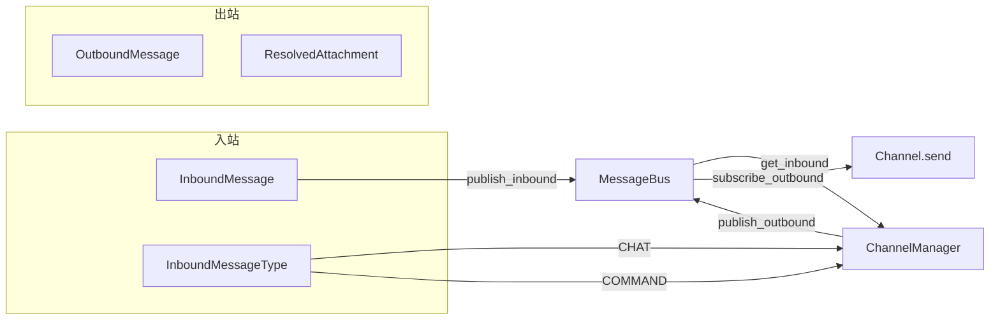

# 11 IM 多渠道集成

**本章课程目标：**

- 理解 Channel 抽象基类的设计哲学：start/stop/send 生命周期 + supports_streaming 能力声明。
- 看懂 MessageBus 的异步发布/订阅模型：InboundMessage、OutboundMessage、ResolvedAttachment 三种消息类型。
- 掌握 ChannelManager 的核心调度逻辑：消息路由、线程创建、Agent 调用、流式与非流式分支。
- 理解 ChannelStore 的 JSON 文件持久化设计与原子写入策略。
- 理解 ChannelService 的生命周期管理：配置解析、渠道注册、懒加载启动。
- 看懂七种 IM 渠道实现的设计差异：流式卡片、长轮询、WebSocket、加密通信。
- 理解流式渠道与非流式渠道在 ChannelManager 中的不同处理路径。
- 看懂跨渠道文件处理的完整链路：下载、落盘、上传、产物解析。
- 理解命令系统与错误处理的每消息隔离边界设计。

**学习建议：** 先看 Channel 抽象基类和 MessageBus（第 1-2 节），建立"渠道实现只需关心收发，调度逻辑集中在 Manager"的心智模型。然后看 ChannelManager 的调度循环（第 3 节），理解流式与非流式两条路径的区别。最后逐个看七个渠道实现（第 6 节），对比它们在流式支持、文件处理、消息格式上的差异。

---

## 1、Channel 抽象基类：统一的生命周期

### 1.1 基类设计

```python
class Channel(ABC):
    def __init__(self, name: str, bus: MessageBus, config: dict):
        self.name = name
        self.bus = bus              # 所有渠道共享同一 MessageBus
        self.config = config        # 平台特定配置（凭据、webhook URL 等）
        self._running = False

    # --- 生命周期 ---
    async def start(self) -> None: ...    # 启动监听
    async def stop(self) -> None: ...     # 优雅停止

    # --- 出站 ---
    async def send(self, msg: OutboundMessage) -> None: ...
    async def send_file(self, msg, attachment) -> bool: ...

    # --- 能力声明 ---
    @property
    def supports_streaming(self) -> bool:
        return False  # 默认不支持流式
```

Channel 基类只定义最小接口。每个渠道实现只需做三件事：
1. **启动时**：建立与外部平台的连接（WebSocket、长轮询、webhook 监听），收到消息后调用 `_make_inbound()` 包装为 `InboundMessage`，通过 `bus.publish_inbound()` 入队。
2. **运行时**：通过 `_on_outbound()` 回调接收 `OutboundMessage`，调用 `send()` 将回复发送回平台。
3. **停止时**：关闭连接，清理资源。

### 1.2 入站消息工厂

```python
def _make_inbound(self, chat_id, user_id, text, *, msg_type=CHAT, thread_ts=None, files=None, metadata=None):
    return InboundMessage(
        channel_name=self.name,
        chat_id=chat_id,
        user_id=user_id,
        text=text,
        msg_type=msg_type,
        thread_ts=thread_ts,
        files=files or [],
        metadata=metadata or {},
    )
```

渠道实现不直接构造 `InboundMessage`，而是通过 `_make_inbound()` 工厂方法——它自动填充 `channel_name`，确保消息的来源渠道标识正确。

### 1.3 出站回调

```python
async def _on_outbound(self, msg: OutboundMessage):
    if msg.channel_name == self.name:
        await self.send(msg)                 # 先发文本
        for attachment in msg.attachments:   # 再传文件
            await self.send_file(msg, attachment)
```

`_on_outbound` 在 `Channel.start()` 时注册到 MessageBus。文本发送失败时完全跳过文件上传——避免出现"只收到文件没有解释文本"的局部交付。

### 1.4 能力声明表

| 渠道 | supports_streaming | 文件下载 | 文件上传 | 加密 |
| --- | --- | --- | --- | --- |
| 飞书 | 是（卡片增量更新） | 是 | 是 | — |
| 钉钉 | 是（AI Card 流式） | 是 | 否 | — |
| 企微 | 是（WebSocket 流式） | 是（AES 解密） | 否 | — |
| 微信 | 否（长轮询） | 是（本地+HTTP） | 否 | AES |
| Discord | 否（mention/thread 模式） | 是 | 否 | — |
| Slack | 否（Socket Mode） | 是 | 是 | — |
| Telegram | 否（长轮询） | 是 | 否 | — |

---

## 2、MessageBus：异步发布/订阅中心

### 2.1 三种消息类型



**InboundMessage**——从 IM 渠道发往调度器的消息：
```python
@dataclass
class InboundMessage:
    channel_name: str           # 来源渠道（"feishu"/"slack"/...）
    chat_id: str                # 平台会话标识
    user_id: str                # 平台用户标识
    text: str                   # 消息文本
    msg_type: InboundMessageType # CHAT 或 COMMAND
    thread_ts: str | None       # 平台线程标识（用于主题内回复）
    topic_id: str | None        # 映射到 DeerFlow 线程的主题 ID
    files: list[dict]           # 文件附件元数据
    metadata: dict              # 任意附加数据
    created_at: float           # Unix 时间戳
```

**OutboundMessage**——从调度器发回渠道的响应：
```python
@dataclass
class OutboundMessage:
    channel_name: str           # 目标渠道
    chat_id: str                # 目标会话
    thread_id: str              # DeerFlow 线程 ID
    text: str                   # 响应文本
    artifacts: list[str]        # 产物虚拟路径列表
    attachments: list[ResolvedAttachment]  # 已解析的文件附件
    is_final: bool              # 是否为流式响应中的最后一条
    thread_ts: str | None       # 平台线程标识
    metadata: dict
    created_at: float
```

**ResolvedAttachment**——已解析为主机文件系统路径的附件：
```python
@dataclass
class ResolvedAttachment:
    virtual_path: str           # 虚拟路径（/mnt/user-data/outputs/report.pdf）
    actual_path: Path           # 主机路径
    filename: str               # 文件名
    mime_type: str              # MIME 类型
    size: int                   # 字节数
    is_image: bool              # 是否为图片
```

### 2.2 入站队列

```python
class MessageBus:
    def __init__(self):
        self._inbound_queue: asyncio.Queue[InboundMessage] = asyncio.Queue()
        self._outbound_listeners: list[OutboundCallback] = []

    async def publish_inbound(self, msg):       # 渠道 → 入队
        await self._inbound_queue.put(msg)

    async def get_inbound(self) -> InboundMessage:  # 调度器 → 出队
        return await self._inbound_queue.get()
```

入站方向使用 `asyncio.Queue`——天然支持背压：如果调度器处理不过来，队列会自然堆积，`put()` 会等待消费者腾出空间。

### 2.3 出站监听器

```python
def subscribe_outbound(self, callback: OutboundCallback):
    self._outbound_listeners.append(callback)

async def publish_outbound(self, msg: OutboundMessage):
    for callback in self._outbound_listeners:
        try:
            await callback(msg)
        except Exception:
            logger.exception("Error in outbound callback for channel=%s", msg.channel_name)
```

出站方向使用回调列表——多个渠道可以同时订阅。每个回调的异常被独立捕获，一个渠道的回调失败不影响其他渠道的消息投递。

---

## 3、ChannelManager：核心调度器

### 3.1 调度循环

```python
class ChannelManager:
    async def _dispatch_loop(self):
        while self._running:
            try:
                msg = await asyncio.wait_for(self.bus.get_inbound(), timeout=1.0)
            except TimeoutError:
                continue  # 无消息，继续轮询

            task = asyncio.create_task(self._handle_message(msg))
            task.add_done_callback(self._log_task_error)
```

调度循环使用 1 秒超时的 `wait_for`——既保证消息的及时处理（最多 1 秒延迟），又不占用 CPU 空转。每条消息被包装为独立的 `asyncio.Task`，由信号量控制并发度（默认 `max_concurrency=5`）。

### 3.2 消息处理：命令 vs 聊天

```python
async def _handle_message(self, msg):
    async with self._semaphore:
        if msg.msg_type == InboundMessageType.COMMAND:
            await self._handle_command(msg)
        else:
            await self._handle_chat(msg)
```

命令（以 `/` 开头）走本地处理路径，聊天消息走 Agent 调用路径。两者都在信号量保护下执行，但错误处理策略不同——命令错误返回友好提示，聊天错误返回通用错误消息。

### 3.3 聊天处理：流式 vs 非流式分支

```mermaid
flowchart TB
    MSG[入站聊天消息] --> STORE{查找已有线程?}
    STORE -->|有| REUSE[复用线程]
    STORE -->|无| CREATE[创建新线程<br/>client.threads.create()]
    CREATE --> MAP[存储映射<br/>store.set_thread_id()]

    REUSE --> PARAMS[_resolve_run_params<br/>合并 assistant_id/config/context]
    MAP --> PARAMS

    PARAMS --> FILES{有文件附件?}
    FILES -->|有| DOWNLOAD[下载并落盘到沙盒 uploads/]
    FILES -->|无| STREAM{渠道支持流式?}
    DOWNLOAD --> STREAM

    STREAM -->|是| STREAM_CHAT[_handle_streaming_chat<br/>runs.stream + 增量更新]
    STREAM -->|否| WAIT_CHAT[_handle_chat<br/>runs.wait + 一次性返回]
```

### 3.4 流式聊天处理（飞书/企微/钉钉 AI Card）

```python
async def _handle_streaming_chat(self, client, msg, thread_id, ...):
    streamed_buffers: dict[str, str] = {}   # message_id → 累积文本
    latest_text = ""
    last_published_text = ""
    last_publish_at = 0.0

    async for chunk in client.runs.stream(..., stream_mode=["messages-tuple", "values"]):
        event = chunk.event
        data = chunk.data

        if event == "messages-tuple":
            # 增量数据：按 message_id 累积文本
            accumulated, msg_id = _accumulate_stream_text(buffers, current_msg_id, data)
            if accumulated:
                latest_text = accumulated

        elif event == "values":
            # 全量快照：提取完整响应文本
            snapshot = _extract_response_text(data)
            if snapshot:
                latest_text = snapshot

        # 节流：至少间隔 0.35 秒才发布一次中间更新
        now = time.monotonic()
        if last_published_text and now - last_publish_at < 0.35:
            continue

        await bus.publish_outbound(OutboundMessage(
            text=latest_text, is_final=False, ...
        ))
        last_published_text = latest_text
        last_publish_at = now

    # finally：发布最终响应
    await bus.publish_outbound(OutboundMessage(
        text=response_text, is_final=True, artifacts=artifacts, ...
    ))
```

关键设计：

| 设计点 | 说明 |
| --- | --- |
| 双模式组合 | `messages-tuple` 提供增量文本片段（按 `message_id` 累积），`values` 提供全量状态快照（兜底和最终状态获取） |
| 节流间隔 | 0.35 秒最小间隔防止消息过于频繁导致平台限流（飞书卡片 API 有频率限制） |
| `is_final=False/True` | 中间更新标记为非最终，渠道实现据此决定是"编辑已有卡片"还是"发送新消息" |
| finally 保证 | 即使流式循环中抛异常，finally 块也会发布最终消息（含错误信息或最后累积的文本） |

### 3.5 非流式聊天处理（Slack/Telegram/Discord/微信）

```python
async def _handle_chat(self, msg, ...):
    result = await client.runs.wait(
        thread_id, assistant_id,
        input={"messages": [{"role": "human", "content": msg.text}]},
        config=run_config,
        context=run_context,
        multitask_strategy="reject",   # 线程忙时拒绝新请求
    )

    response_text = _extract_response_text(result)       # 提取最后一条 AI 消息
    artifacts = _extract_artifacts(result)                # 提取本轮产物
    response_text, attachments = _prepare_artifact_delivery(thread_id, response_text, artifacts)

    await bus.publish_outbound(OutboundMessage(
        text=response_text, artifacts=artifacts, attachments=attachments, is_final=True, ...
    ))
```

非流式路径的核心差异：`runs.wait()` 阻塞等待 Agent 完成，一次性返回最终结果。`multitask_strategy="reject"` 确保同一线程不会并发执行多个运行——如果用户在上一条消息处理完之前又发了一条，新请求会被拒绝并返回 "This conversation is already processing another request"。

### 3.6 运行参数解析

`_resolve_run_params()` 按四层优先级合并运行参数：

```
user_layer (最高优先级)
  → channel_layer
    → default_session
      → DEFAULT_RUN_CONFIG / DEFAULT_RUN_CONTEXT (最低优先级)
```

每层可覆盖 `assistant_id`、`config`、`context`。这意味着可以为特定渠道甚至特定用户配置不同的 Agent、模型和参数：

```yaml
# config.yaml channels 段
channels:
  feishu:
    session:
      config:
        configurable:
          model_name: "claude-sonnet-4-5"
      context:
        thinking_enabled: true
    users:
      "ou_xxx":                    # 特定用户的覆盖
        context:
          model_name: "claude-opus-4-5"  # VIP 用户用更强模型
```

---

## 4、ChannelStore：JSON 文件持久化

### 4.1 数据模型

```json
{
  "feishu:oc_abc123": {
    "thread_id": "uuid-1",
    "user_id": "ou_xxx",
    "created_at": 1700000000.0,
    "updated_at": 1700000100.0
  },
  "feishu:oc_abc123:topic_thread_001": {
    "thread_id": "uuid-2",
    "user_id": "ou_yyy",
    "created_at": 1700000200.0,
    "updated_at": 1700000200.0
  },
  "slack:C0812345678": {
    "thread_id": "uuid-3",
    "user_id": "U0123456789",
    "created_at": 1700000300.0,
    "updated_at": 1700000300.0
  }
}
```

键的拼装规则：
- 根对话：`{channel_name}:{chat_id}`
- 子主题：`{channel_name}:{chat_id}:{topic_id}`

### 4.2 原子写入

```python
def _save(self):
    fd = tempfile.NamedTemporaryFile(
        mode="w", dir=self._path.parent,
        suffix=".tmp", delete=False,
    )
    try:
        json.dump(self._data, fd, indent=2)
        fd.close()
        Path(fd.name).replace(self._path)  # 原子 rename
    except BaseException:
        fd.close()
        Path(fd.name).unlink(missing_ok=True)
        raise
```

写入临时文件 → `os.replace()`（POSIX 原子操作）——确保 store.json 不会出现"写到一半进程崩溃导致文件损坏"的情况。

### 4.3 线程锁保护

```python
self._lock = threading.Lock()

def set_thread_id(self, ...):
    with self._lock:
        self._data[key] = {...}
        self._save()
```

虽然 ChannelManager 在单进程的 asyncio 事件循环中运行，但 `threading.Lock` 提供了额外的防御——如果未来有多线程访问 store 的场景（如健康检查端点），不会出现数据竞争。

---

## 5、ChannelService：生命周期管理

### 5.1 启动流程

```python
class ChannelService:
    async def start(self):
        await self.manager.start()   # 先启动调度器

        for name, config in self._config.items():
            if not config.get("enabled", False):
                # 有凭据但未启用的渠道：警告用户
                continue

            await self._start_channel(name, config)
```

调度器先于渠道启动——确保渠道入队时消费者已经就绪。

### 5.2 渠道懒加载

```python
_CHANNEL_REGISTRY = {
    "feishu": "app.channels.feishu:FeishuChannel",
    "slack": "app.channels.slack:SlackChannel",
    # ...
}

async def _start_channel(self, name, config):
    channel_cls = resolve_class(_CHANNEL_REGISTRY[name], base_class=None)
    channel = channel_cls(bus=self.bus, config=config)
    await channel.start()
```

渠道类通过反射加载（`resolve_class` 解析 `"module.path:ClassName"` 字符串）。只启动已启用且有凭据的渠道——配置了 `feishu.app_id` 但 `feishu.enabled: false` 的渠道不会被加载。

### 5.3 凭据检测

```python
_CHANNEL_CREDENTIAL_KEYS = {
    "feishu": ["app_id", "app_secret"],
    "slack": ["bot_token", "app_token"],
    "telegram": ["bot_token"],
    "dingtalk": ["client_id", "client_secret"],
    # ...
}
```

启动时检查：渠道 `enabled: false` 但有凭据 → 打印 warning 提醒用户。这个设计防止了"用户配置了凭据但忘记设置 `enabled: true`"的静默失败。

### 5.4 全局单例

```python
_channel_service: ChannelService | None = None

async def start_channel_service(app_config) -> ChannelService:
    global _channel_service
    if _channel_service is not None:
        return _channel_service
    _channel_service = ChannelService.from_app_config(app_config)
    await _channel_service.start()
    return _channel_service
```

`start_channel_service()` 只创建一次单例，重复调用直接返回已有实例。在 `lifespan()` 中调用，Gateway 关闭时通过 `stop_channel_service()` 清理。

---

## 6、七种渠道实现

### 6.1 飞书（FeishuChannel）—— 流式卡片

飞书是流式体验最完整的渠道实现。核心机制：

1. **接收**：通过飞书开放平台 SDK 注册事件回调（`im.message.receive_v1`）。
2. **首次回复**：用户发消息后，先发送一个"正在思考..."的占位卡片（`msg_type: "interactive"`），获得 `message_id`。
3. **流式更新**：收到 `OutboundMessage(is_final=False)` 时，调用飞书"更新消息卡片"API（`update_multi: true`），在同一个卡片上不断刷新 AI 的回复文本。
4. **最终状态**：收到 `OutboundMessage(is_final=True)` 时，执行最后一次卡片更新，移除"正在输入"动画，展示完整回复和产物列表。

实现示例：

```python
# feishu.py 核心逻辑简化
async def _on_outbound(self, msg: OutboundMessage):
    if msg.is_final:
        await self._patch_card(msg, is_final=True)
    else:
        await self._patch_card(msg, is_final=False)

async def _patch_card(self, msg, is_final):
    card = self._build_card(msg.text, is_final=is_final)
    await self._client.im_v1.message.update(
        message_id=self._running_card_id,
        content=json.dumps(card),
    )
```

飞书还实现了 `receive_file()`：下载用户发送的图片/文件到沙盒 uploads 目录，在消息文本中插入文件路径，让模型可以访问。

### 6.2 钉钉（DingTalkChannel）—— AI Card 流式

钉钉支持两种模式：
- **普通模式**：回复 `sampleMarkdown` 消息，一次性返回。
- **AI Card 流式模式**（需配置 `card_template_id`）：创建 AI Card 模板后，通过 `PUT /v1.0/card/streaming` 逐步推送内容。

实现逻辑：

```python
if card_template_id:
    # 创建卡片 → 流式更新 → 最终化
    card_id = await self._create_ai_card(msg)
    async for chunk in runs.stream(...):
        await self._stream_card_content(card_id, chunk_text)
    await self._finalize_card(card_id)
else:
    # 回退为普通 markdown
    await self._send_markdown(msg, response_text)
```

### 6.3 企微（WeComChannel）—— WebSocket 流式

企微使用 WebSocket 长连接与企微服务端通信，支持流式回复。入站文件通过 AES 解密（`decrypt_file(data, aeskey)`）后落盘。企微的文件结构较复杂——消息体中的文件引用可能包含加密密钥，需要在下载后解密才能得到原始内容。

### 6.4 微信（WeChatChannel）—— iLink 长轮询 + AES 加密

微信渠道通过 iLink 网关接入，使用长轮询方式接收消息。所有通信内容经过 AES 加密/解密。入站文件优先从本地路径读取（`msg.files[*].path`），其次通过 HTTP URL 下载。

### 6.5 Discord（DiscordChannel）—— mention-only + thread 模式

Discord 渠道支持两种触发模式：
- **Mention-only**：只有 @机器人 的消息才触发 Agent 回复——避免公共频道中的噪音。
- **Thread 模式**：在已有 Discord Thread 中自动回复。

实现逻辑：

```python
async def on_message(self, message):
    if message.author.bot:
        return  # 忽略自身消息

    if not self.bot.user.mentioned_in(message):
        return  # mention-only 模式：只响应 @机器人

    await self.bus.publish_inbound(self._make_inbound(
        chat_id=str(message.channel.id),
        user_id=str(message.author.id),
        text=message.content,
        thread_ts=str(message.id),  # 用于 Discord 的 reply 功能
    ))
```

### 6.6 Slack（SlackChannel）—— Socket Mode + mrkdwn 转换

Slack 使用 Socket Mode（WebSocket 连接）而非 HTTP webhook，适合防火墙后的部署。AI 回复文本中的 Markdown 被转换为 Slack 的 `mrkdwn` 格式。Slack 是少数支持文件上传的渠道——产物文件通过 `files.upload_v2()` API 上传到 Slack 频道。

### 6.7 Telegram（TelegramChannel）—— 长轮询 + reply 线程

Telegram 使用长轮询（`getUpdates`）模式接收消息。支持 `reply_to_message_id` 参数实现消息线程。长轮询的实现通过 Telegram Bot API 的 `timeout` 参数——设置较长的超时（如 30 秒）减少 HTTP 请求频率。

### 6.8 渠道特性对比

| 特性 | 飞书 | 钉钉 | 企微 | 微信 | Discord | Slack | Telegram |
| --- | --- | --- | --- | --- | --- | --- | --- |
| 连接方式 | Webhook | Webhook | WebSocket | 长轮询 | WebSocket | WebSocket | 长轮询 |
| 流式支持 | 是（卡片更新） | 是（AI Card） | 是（WebSocket） | 否 | 否 | 否 | 否 |
| 文件下载 | 是 | 是 | 是（AES 解密） | 是 | 是 | 是 | 是 |
| 文件上传 | 是 | 否 | 否 | 否 | 否 | 是 | 否 |
| 加密通信 | — | — | AES | AES | — | — | — |
| 消息格式 | 交互式卡片 | Markdown/AI Card | Markdown | 文本 | Embed | mrkdwn | Markdown |
| 线程支持 | 话题 | — | — | — | Thread | Thread | Reply |
| mention 过滤 | 否 | 否 | 否 | 否 | 是（可选） | 否 | 否 |

---

## 7、流式 vs 非流式：两种响应策略

### 7.1 策略对比

| 维度 | 流式渠道（飞书/企微/钉钉） | 非流式渠道（Slack/Telegram/Discord/微信） |
| --- | --- | --- |
| API 调用 | `client.runs.stream()` | `client.runs.wait()` |
| 用户感知延迟 | 几乎实时（首个 token 即可展示） | 等待完整回复（可能数十秒） |
| 中间更新 | 每 0.35 秒发布一次增量 | 无中间更新 |
| 最终响应 | finally 块中发布完整结果 + 产物 | 一次性发布完整结果 + 产物 |
| 错误处理 | 流异常时 finally 中展示错误消息 | 异常立即返回错误消息 |
| 平台体验 | 对话气泡"逐字出现"效果 | 完整消息一次性出现 |

### 7.2 为什么不是所有渠道都做流式

流式需要满足两个前提：
1. **平台 API 支持消息编辑**：飞书的卡片更新、企微的 WebSocket 推送都支持"发送后修改"；而 Telegram 的 API 不支持编辑已发送的机器人消息（`editMessageText` 仅在 inline keyboard 场景可用）。
2. **消息格式兼容**：Slack 的 `mrkdwn` 格式要求消息块结构完整，逐字追加需要每次重建整个 Block Kit 结构，实现成本和 API 调用量都较高。

ChannelManager 通过 `CHANNEL_CAPABILITIES` 和渠道实例的 `supports_streaming` 属性自动选择策略——渠道实现只需声明能力，调度器自动走对应的处理路径。

---

## 8、跨渠道文件处理

### 8.1 入站文件：从 IM 平台到沙盒


不同渠道的文件读取器：

```python
INBOUND_FILE_READERS = {}

register_inbound_file_reader("wecom", _read_wecom_inbound_file)   # HTTP + AES 解密
register_inbound_file_reader("wechat", _read_wechat_inbound_file) # 本地路径优先 → HTTP

# 其他渠道默认使用 _read_http_inbound_file（直接 HTTP GET）
```

### 8.2 出站文件：从沙盒产物到 IM 平台

```python
def _resolve_attachments(thread_id, artifacts):
    # 仅接受 /mnt/user-data/outputs/ 下的路径
    # 拒绝 uploads/、workspace/ 路径（防止泄露）
    for virtual_path in artifacts:
        if not virtual_path.startswith("/mnt/user-data/outputs/"):
            logger.warning("rejected non-outputs artifact path: %s", virtual_path)
            continue
        actual = paths.resolve_virtual_path(thread_id, virtual_path)
        # 校验解析后的路径确实在 outputs 目录下（防路径穿越）
        actual.resolve().relative_to(outputs_dir)
        attachments.append(ResolvedAttachment(
            virtual_path=virtual_path,
            actual_path=actual,
            filename=actual.name,
            mime_type=...,
            size=actual.stat().st_size,
            is_image=mime.startswith("image/"),
        ))
```

安全边界：**只允许 `/mnt/user-data/outputs/` 下的文件**。任何 `uploads/` 或 `workspace/` 下的路径被静默拒绝。产物路径解析后还会做一次 `relative_to()` 校验——即使通过了前缀检查，仍防止符号链接或 `../` 导致的路径穿越。

### 8.3 不支持上传的渠道回退

如果渠道不支持文件上传（`send_file()` 返回 `False`），文件名会被追加到响应文本中作为回退：

```
Created File: 📎 report.pdf
```

用户至少能从文本中知道有文件生成了，可以通过 Web UI 下载。

---

## 9、命令系统

### 9.1 命令列表

```python
KNOWN_CHANNEL_COMMANDS = frozenset({
    "/bootstrap", "/new", "/status", "/models", "/memory", "/help"
})
```

| 命令 | 处理方式 | 说明 |
| --- | --- | --- |
| `/bootstrap` | 委托给 `_handle_chat`（`is_bootstrap=True`） | 启动引导会话，启用 `setup_agent` 工具 |
| `/new` | 通过 SDK 创建新线程 | 开始全新对话，旧线程保留 |
| `/status` | 查询 ChannelStore | 显示当前线程 ID |
| `/models` | 调用 Gateway `/api/models` | 列出可用模型 |
| `/memory` | 调用 Gateway `/api/memory` | 显示记忆状态 |
| `/help` | 本地生成 | 显示所有可用命令 |

### 9.2 bootstrap 的特殊处理

`/bootstrap` 是命令中最特殊的一个——它不是本地处理，而是将消息类型从 `COMMAND` 改为 `CHAT`，并附加 `extra_context={"is_bootstrap": True}`。这使得 Agent 在引导模式下获得 `setup_agent` 工具，可以创建和配置自定义 Agent。

---

## 10、错误处理：每消息隔离边界

### 10.1 错误分类

| 错误类型 | 处理方式 | 用户看到的消息 |
| --- | --- | --- |
| `ConflictError`（线程忙） | 捕获后返回友好提示 | "This conversation is already processing..." |
| `InvalidChannelSessionConfigError`（配置错误） | 日志记录 + 返回错误详情 | 配置错误的描述文本 |
| 通用异常 | 日志记录完整堆栈 | "An internal error occurred. Please try again." |
| 出站回调异常 | 独立捕获，不影响其他渠道 | 仅影响该渠道的消息投递 |

### 10.2 任务级错误隔离

```python
task = asyncio.create_task(self._handle_message(msg))
task.add_done_callback(self._log_task_error)

@staticmethod
def _log_task_error(task: asyncio.Task):
    if task.cancelled():
        return
    exc = task.exception()
    if exc:
        logger.error("[Manager] unhandled error in message task: %s", exc, exc_info=exc)
```

每条消息是独立的 `asyncio.Task`。一条消息的处理异常不会影响其他消息的处理——调度循环继续运行，其他队列中的消息正常消费。未处理的异常通过 `add_done_callback` 记录到日志，不会被静默吞噬。

---

## 11、本章小结

1. **Channel 抽象基类定义最小接口**：`start()/stop()/send()` 三个方法，加上 `supports_streaming` 能力声明——渠道实现只需关心与平台的通信细节，调度逻辑集中在 ChannelManager。

2. **MessageBus 解耦渠道与调度器**：入站用 `asyncio.Queue`（天然背压），出站用回调列表（广播模式）。渠道不知道调度器的存在，调度器不关心渠道的具体实现。

3. **ChannelManager 按渠道能力自动选择策略**：流式渠道走 `runs.stream` + 0.35 秒节流 + `is_final` 标记；非流式渠道走 `runs.wait` + `multitask_strategy="reject"` 防并发。

4. **ChannelStore 用最简单的 JSON 文件 + 原子 rename**：键结构 `channel:chat:topic` 天然支持子主题映射，`threading.Lock` 保证写入安全。

5. **文件处理链路有明确的安全边界**：入站文件只写入沙盒 `uploads/` 目录；出站产物只读取 `outputs/` 目录，拒绝路径穿越。

6. **每个消息是独立的 asyncio.Task**：一条消息失败不影响其他消息，异常被完整记录而不是静默吞噬。

7. **七种渠道实现覆盖了主流的连接模式**：Webhook（飞书/钉钉）、WebSocket（企微/Discord/Slack）、长轮询（微信/Telegram）、流式卡片（飞书/钉钉）、加密通信（企微/微信 AES）。
