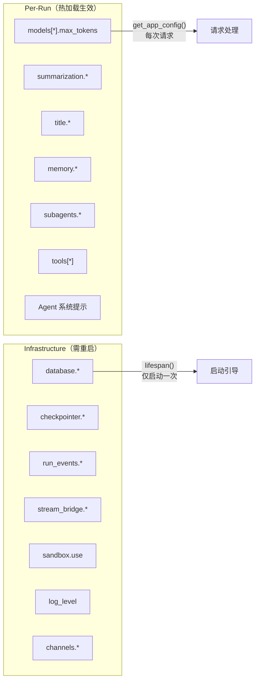

# 12 配置系统

**本章课程目标：**

- 理解 AppConfig 的 mtime 热加载机制：哪些字段即时生效，哪些字段需要重启。
- 看懂配置分裂（Config Split）的设计：per-run 字段 vs infrastructure 字段的边界划分。
- 掌握 ~25 个配置模型的职责与层级关系。
- 理解 config.yaml 的顶层结构与 extensions_config.json 的扩展机制。
- 看懂模型配置中的多 Provider 适配与能力标志位设计。
- 理解自定义 Agent 的磁盘配置与加载流程。
- 掌握路径解析系统：base_dir 解析、用户隔离、线程隔离、虚拟路径映射。
- 看懂反射式类解析 (reflection)：`"module:ClassName"` 字符串如何变成实例。
- 理解配置校验的启动期与运行时双层策略。

**学习建议：** 先看 AppConfig 的热加载机制与 Config Split（第 1-2 节），建立一个清晰的"哪些配置改了要重启"的心智模型。然后看 config.yaml 的结构和 ~25 个配置模型（第 3-5 节），了解各配置段的职责。最后看路径解析（第 10 节）和反射机制（第 11 节），理解"配置字符串如何变成运行实例"。

---

## 1、AppConfig：mtime 热加载与单例管理

### 1.1 热加载机制

```mermaid
flowchart TB
    REQ[请求到达] --> GET[get_app_config()]
    GET --> CTX{有 ContextVar 覆盖?}
    CTX -->|是| CTX_CFG[返回运行时覆盖]
    CTX -->|否| CACHE{缓存存在且 mtime 未变?}
    CACHE -->|是| CACHED[返回缓存的 AppConfig]
    CACHE -->|否| LOAD[从磁盘重新加载]
    LOAD -->|mtime 已变| LOG[记录日志: "配置文件已修改，重新加载"]
    LOAD --> PARSE[解析 YAML + 环境变量]
    PARSE --> VALIDATE[Pydantic 校验]
    VALIDATE --> CACHE_NEW[更新缓存 + mtime]
    CACHE_NEW --> RETURN[返回新配置]

    style LOAD fill:#f9f,stroke:#333
    style CACHE fill:#9f9,stroke:#333
```

核心逻辑在 `get_app_config()` 中：

```python
def get_app_config() -> AppConfig:
    # 1. 检查 ContextVar 是否有运行时覆盖（测试/特殊路径用）
    runtime_override = _current_app_config.get()
    if runtime_override is not None:
        return runtime_override

    # 2. 检查自定义配置（set_app_config 注入的）
    if _app_config is not None and _app_config_is_custom:
        return _app_config

    # 3. 比较 mtime：变了就重新加载
    resolved_path = AppConfig.resolve_config_path()
    current_mtime = resolved_path.stat().st_mtime if resolved_path.exists() else None

    should_reload = (
        _app_config is None
        or _app_config_path != resolved_path
        or _app_config_mtime != current_mtime
    )

    if should_reload:
        _load_and_cache_app_config(str(resolved_path))

    return _app_config
```

**热加载是无侵入的**——任何调用 `get_app_config()` 的代码都不需要知道热加载的存在。它只是在缓存命中时返回旧值、mtime 变化时透明地重新加载。

### 1.2 配置优先级

| 优先级 | 来源 | 说明 |
| --- | --- | --- |
| 1（最高） | `push_current_app_config()` | 运行时 ContextVar 覆盖（测试用） |
| 2 | `set_app_config()` | 显式注入的自定义配置（测试/模拟） |
| 3 | `DEER_FLOW_CONFIG_PATH` 环境变量 | 显式指定配置文件路径 |
| 4 | 调用方项目根 `config.yaml` | `existing_project_file()` 查找 |
| 5 | backend/仓库根 `config.yaml` | monorepo 兼容旧路径 |

### 1.3 配置版本管理

`config.yaml` 中的 `config_version` 字段与 `config.example.yaml` 中的版本比对：

```python
def _check_config_version(config_data, config_path):
    user_version = int(config_data.get("config_version", 0))
    example_version = # 从 config.example.yaml 读取

    if user_version < example_version:
        logger.warning(
            "你的 config.yaml（版本 %d）已过期，最新版本为 %d。"
            "运行 `make config-upgrade` 合并新字段。",
            user_version, example_version,
        )
```

这防止了用户使用旧版配置文件导致的"新增字段取默认值"静默问题——启动时有明确的告警提示。

### 1.4 环境变量解析

```python
@classmethod
def resolve_env_variables(cls, config):
    if isinstance(config, str):
        if config.startswith("$"):
            env_value = os.getenv(config[1:])
            if env_value is None:
                raise ValueError(f"环境变量 {config[1:]} 未找到")
            return env_value
        return config
    elif isinstance(config, dict):
        return {k: cls.resolve_env_variables(v) for k, v in config.items()}
    elif isinstance(config, list):
        return [cls.resolve_env_variables(item) for item in config]
    return config
```

配置中以 `$` 开头的值被递归解析为环境变量。例如 `$OPENAI_API_KEY` 会从 `os.getenv("OPENAI_API_KEY")` 取值。**未设置的环境变量会抛出 ValueError**——不允许静默使用空字符串（与 `ExtensionsConfig` 的容错策略不同）。

注意 `AppConfig` 和 `ExtensionsConfig` 使用了不同的解析策略：

| 配置类 | 未解析的 `$VAR` | 行为 |
| --- | --- | --- |
| `AppConfig` | `$OPENAI_API_KEY` 未设置 | 抛出 `ValueError` |
| `ExtensionsConfig` | `$MCP_API_KEY` 未设置 | 解析为空字符串 `""` |

这个差异是有意为之——主配置中的敏感凭据缺失应该尽早暴露；扩展配置中的可选环境变量不应阻止启动。

---

## 2、Config Split：Per-Run vs Infrastructure

### 2.1 边界划分



### 2.2 为什么这样划分

| 字段 | 为什么需要重启 |
| --- | --- |
| `database.*` | SQLAlchemy engine 在 `init_engine_from_config()` 中创建，持有连接池。在线切换后端（SQLite→Postgres）需要重建整个连接池。 |
| `checkpointer.*` | `make_checkpointer()` 在启动时绑定到特定后端（SQLite WAL/Postgres）。切换需要重建检查点单例并重置 LangGraph store。 |
| `run_events.*` | `make_run_event_store()` 在启动时选择内存或 SQL 实现。在线切换会导致已持久化的事件与新的存储后端不兼容。 |
| `stream_bridge.*` | `make_stream_bridge()` 构造 StreamBridge 对象。运行的流消费者持有对该实例的引用，替换会导致订阅丢失。 |
| `sandbox.use` | Sandbox provider 单例被缓存（`_default_sandbox_provider`）。新类路径只在下次进程启动时生效。 |
| `log_level` | `apply_logging_level()` 在 `app.py` 启动时调用一次，修改 root logger 级别。后续的 `get_app_config()` 返回新配置不会重新触发。 |
| `channels.*` | `start_channel_service()` 在 lifespan 中调用一次。已运行的频道不会被配置变更重建。 |

**设计原则**：如果修改某个配置会导致正在运行的请求/会话/连接处于不一致状态，它就应该属于 infrastructure 类（需重启）。如果修改只影响下一个请求的参数选择（模型的 `max_tokens`、摘要的触发阈值），它就可以热加载。

### 2.3 实现细节

`lifespan()` 中将 `startup_config` 显式传给 `langgraph_runtime()`：

```python
async def lifespan(app):
    startup_config = get_app_config()     # 仅此一次的快照
    async with langgraph_runtime(app, startup_config):
        yield  # 请求期通过 deps.get_config() 实时获取
```

`deps.get_config()` 每次都调用 `get_app_config()`——返回的是可能已热加载的新配置。而 `langgraph_runtime()` 中的引擎（StreamBridge、Checkpointer、Store）绑定到 `startup_config` 快照，不会随热加载变化。

---

## 3、~25 个配置模型总览

### 3.1 AppConfig 的字段树

`AppConfig` 是顶层聚合器，通过 Pydantic `model_config = ConfigDict(extra="allow")` 允许额外字段（如 `channels` 段不属于框架核心定义，但允许在 application 层扩展）。

```python
class AppConfig(BaseModel):
    # 基础
    log_level: str = "info"

    # 模型与工具（per-run）
    models: list[ModelConfig] = []
    tools: list[ToolConfig] = []
    tool_groups: list[ToolGroupConfig] = []

    # 子系统（per-run）
    title: TitleConfig = ...
    summarization: SummarizationConfig = ...
    memory: MemoryConfig = ...
    skills: SkillsConfig = ...
    skill_evolution: SkillEvolutionConfig = ...

    # Agent 扩展（per-run）
    agents_api: AgentsApiConfig = ...
    acp_agents: dict[str, ACPAgentConfig] = {}
    subagents: SubagentsAppConfig = ...

    # 安全与治理（per-run）
    guardrails: GuardrailsConfig = ...
    loop_detection: LoopDetectionConfig = ...
    safety_finish_reason: SafetyFinishReasonConfig = ...
    circuit_breaker: CircuitBreakerConfig = ...
    tool_output: ToolOutputConfig = ...
    tool_search: ToolSearchConfig = ...

    # 扩展（独立文件加载）
    extensions: ExtensionsConfig = ...

    # 基础设施（重启生效）
    database: DatabaseConfig = ...
    run_events: RunEventsConfig = ...
    checkpointer: CheckpointerConfig | None = None
    stream_bridge: StreamBridgeConfig | None = None
    sandbox: SandboxConfig = ...

    # Token 追踪
    token_usage: TokenUsageConfig = ...
```

### 3.2 各配置模型职责速览

| 配置模型 | 文件 | 核心职责 |
| --- | --- | --- |
| `AppConfig` | `app_config.py` | 顶层聚合，mtime 热加载，环境变量解析，配置版本校验 |
| `ModelConfig` | `model_config.py` | 模型名称、Provider 类路径、thinking/vision 能力标志 |
| `SandboxConfig` | `sandbox_config.py` | Provider 选择、Docker 镜像/端口/并发、挂载、输出截断 |
| `MemoryConfig` | `memory_config.py` | 启用开关、去抖延迟、更新模型、事实数量/置信度阈值、注入 token 预算 |
| `SkillsConfig` | `skills_config.py` | Skills 目录路径、容器挂载路径 |
| `SkillEvolutionConfig` | `skill_evolution_config.py` | Agent 自主修改 skill 的权限控制 |
| `SubagentsAppConfig` | `subagents_config.py` | 超时、最大轮次、per-agent 覆盖、自定义 subagent 定义 |
| `SummarizationConfig` | `summarization_config.py` | 触发条件（token/消息数/比例）、保留策略 |
| `TitleConfig` | `title_config.py` | 标题生成开关、最大字数/字符数、生成 prompt 模板 |
| `LoopDetectionConfig` | `loop_detection_config.py` | 重复工具调用检测、最大循环次数 |
| `GuardrailsConfig` | `guardrails_config.py` | Provider 类路径、策略配置 |
| `ToolConfig` | `tool_config.py` | 工具名、所属组、`use` 变量路径 |
| `ToolGroupConfig` | `tool_config.py` | 工具组名（逻辑分组） |
| `ToolOutputConfig` | `tool_output_config.py` | 工具输出大小限制（外部化到磁盘的阈值） |
| `ToolSearchConfig` | `tool_search_config.py` | 工具搜索/延迟加载配置 |
| `DatabaseConfig` | `database_config.py` | 数据库后端（sqlite/postgres）、连接参数 |
| `CheckpointerConfig` | `checkpointer_config.py` | 检查点后端、SQLite WAL/日志模式 |
| `RunEventsConfig` | `run_events_config.py` | 运行事件存储后端选择 |
| `StreamBridgeConfig` | `stream_bridge_config.py` | 心跳间隔、缓冲区大小 |
| `ACPAgentConfig` | `acp_config.py` | ACP 兼容 Agent 的启动命令和环境变量 |
| `AgentsApiConfig` | `agents_api_config.py` | 自定义 Agent 管理 API 配置 |
| `TracingConfig` | `tracing_config.py` | LangSmith/Langfuse 启用开关与环境变量读取 |
| `TokenUsageConfig` | `token_usage_config.py` | Token 用量追踪开关 |
| `SafetyFinishReasonConfig` | `safety_finish_reason_config.py` | Provider 安全过滤 finish_reason 拦截 |
| `CircuitBreakerConfig` | `app_config.py` (内嵌) | LLM 熔断器：失败阈值、恢复超时 |
| `ExtensionsConfig` | `extensions_config.py` | MCP Servers + Skills 启用状态（独立 JSON 文件） |

---

## 4、config.yaml 结构

### 4.1 顶层段概览

```yaml
# config.yaml 顶层结构
config_version: 7          # 配置版本（与 config.example.yaml 比对）
log_level: info            # deerflow/app 模块的日志级别

models:                    # 可用模型列表
  - name: claude-sonnet-4-5
    use: langchain_anthropic:ChatAnthropic
    model: claude-sonnet-4-5-20250929
    supports_thinking: true
    supports_vision: true

sandbox:                   # 沙箱执行配置
  use: deerflow.sandbox.local:LocalSandboxProvider
  allow_host_bash: false
  bash_output_max_chars: 20000

tools:                     # 工具列表（use 指向变量路径）
  - name: bash
    group: sandbox
    use: deerflow.sandbox.tools:bash_tool

tool_groups:               # 工具组（逻辑分组）
  - name: sandbox

skills:                    # 技能系统
  container_path: /mnt/skills

memory:                    # 记忆系统
  enabled: true
  debounce_seconds: 30
  max_facts: 100
  fact_confidence_threshold: 0.7
  injection_enabled: true
  max_injection_tokens: 2000

title:                     # 自动标题
  enabled: true
  max_words: 10

summarization:             # 对话摘要
  enabled: true
  trigger_tokens: 80000

subagents:                 # 子 Agent 委托
  timeout_seconds: 900
  agents: {}
  custom_agents: {}

database:                  # 数据库（基础设施）
  backend: sqlite
  sqlite_dir: .deer-flow/data

checkpointer:              # 检查点（基础设施）
  backend: sqlite

# channels 段是 extra="allow" 字段，不属于 AppConfig 的预定义字段
channels:
  feishu:
    enabled: false
    app_id: ""
    app_secret: ""
  # ... 其他渠道配置
```

### 4.2 段之间的依赖关系

```mermaid
flowchart TB
    CFG[config.yaml] --> MODELS[models]
    CFG --> TOOLS[tools]
    CFG --> TOOL_GROUPS[tool_groups]
    CFG --> SANDBOX[sandbox]
    CFG --> MEMORY[memory]
    CFG --> SKILLS[skills]
    CFG --> SUBAGENTS[subagents]
    CFG --> DB[database]
    CFG --> CHANNELS[channels]

    MODELS -->|use 字段| REFLECT[reflection 解析]
    TOOLS -->|use 字段| REFLECT
    SANDBOX -->|use 字段| REFLECT

    TOOLS -->|group 字段| TOOL_GROUPS
    TOOL_GROUPS -->|get_available_tools()| AGENT[Agent 工具装配]

    SUBAGENTS -->|per-agent 覆盖| EXECUTOR[SubagentExecutor]
    SKILLS -->|SKILL.md 路径| LOADER[Skill 加载器]
    MEMORY -->|存储路径| STORAGE[FileMemoryStorage]

    DB -->|连接参数| ENGINE[SQLAlchemy Engine]
    CHANNELS -->|凭据| CH_SVC[ChannelService]
```

---

## 5、extensions_config.json：MCP 与 Skills 的运行时配置

### 5.1 文件结构

```json
{
  "mcpServers": {
    "filesystem": {
      "enabled": true,
      "type": "stdio",
      "command": "npx",
      "args": ["-y", "@modelcontextprotocol/server-filesystem", "/tmp"],
      "description": "Local filesystem access"
    },
    "remote_api": {
      "enabled": true,
      "type": "sse",
      "url": "https://api.example.com/mcp/sse",
      "headers": {
        "Authorization": "Bearer $MCP_API_KEY"
      },
      "oauth": {
        "enabled": true,
        "token_url": "https://auth.example.com/oauth/token",
        "grant_type": "client_credentials",
        "client_id": "$MCP_CLIENT_ID",
        "client_secret": "$MCP_CLIENT_SECRET"
      },
      "description": "Remote API access via SSE"
    }
  },
  "skills": {
    "pdf-editor": {
      "enabled": true
    },
    "data-analysis": {
      "enabled": false
    }
  }
}
```

### 5.2 与 config.yaml 的关系

| 维度 | config.yaml | extensions_config.json |
| --- | --- | --- |
| 格式 | YAML | JSON |
| 内容 | 框架核心配置 + 模型/工具/沙箱参数 | MCP server 定义 + skill 启用状态 |
| 热修改 | mtime 自动检测 | mtime 自动检测（MCP 工具缓存失效） |
| API 修改 | 不通过 API 修改 | Gateway API（`PUT /api/mcp/config`、`PUT /api/skills/{name}`）可写回 |
| 环境变量 | `$VAR` 未设置抛异常 | `$VAR` 未设置解析为空字符串 |
| 必选性 | 必选 | 可选（文件不存在时使用空配置） |

### 5.3 MCP OAuth 配置

```python
class McpOAuthConfig(BaseModel):
    enabled: bool = True
    token_url: str
    grant_type: Literal["client_credentials", "refresh_token"]
    client_id: str | None
    client_secret: str | None
    refresh_token: str | None          # refresh_token grant 专属
    scope: str | None
    audience: str | None
    token_field: str = "access_token"  # 响应中 access token 的字段名
    token_type_field: str = "token_type"
    expires_in_field: str = "expires_in"
    default_token_type: str = "Bearer"
    refresh_skew_seconds: int = 60     # 提前刷新时间
```

OAuth 配置支持 `client_credentials` 和 `refresh_token` 两种 grant 类型，自动在 token 即将过期时通过 `refresh_skew_seconds` 提前刷新。

### 5.4 transport 别名兼容

```python
@model_validator(mode="before")
@classmethod
def _accept_transport_alias(cls, data):
    """将 MCP 规范中的 transport 字段作为 type 的别名。"""
    if isinstance(data, dict):
        transport = data.get("transport")
        if transport and not data.get("type"):
            data = {**data, "type": transport}
    return data
```

官方 MCP 配置 schema 使用 `transport` 表示传输机制。DeerFlow 早期版本只识别 `type`，导致仅配置 `transport` 的远程 SSE/HTTP server 被错误当作 `stdio`（默认值）。这个校验器对两种写法做归一化，`type` 在同时存在时优先。

---

## 6、模型配置：多 Provider 适配与能力标志

### 6.1 ModelConfig 结构

```python
class ModelConfig(BaseModel):
    name: str                           # 唯一名称
    display_name: str | None            # 展示名称
    description: str | None             # 描述
    use: str                            # Provider 类路径
    model: str                          # 实际模型 ID
    use_responses_api: bool | None      # 是否路由到 /v1/responses
    output_version: str | None          # 结构化输出版本
    supports_thinking: bool = False     # 是否支持 thinking
    supports_reasoning_effort: bool = False
    when_thinking_enabled: dict | None  # thinking 开启时的额外参数
    when_thinking_disabled: dict | None # thinking 关闭时的额外参数
    supports_vision: bool = False       # 是否支持视觉
    thinking: dict | None               # thinking 简写（与 when_thinking_enabled 合并）
    model_config = ConfigDict(extra="allow")  # 允许 Provider 特定字段
```

### 6.2 多 Provider 适配示例

```yaml
models:
  # Anthropic Claude（支持 thinking + vision）
  - name: claude-sonnet-4-5
    use: langchain_anthropic:ChatAnthropic
    model: claude-sonnet-4-5-20250929
    supports_thinking: true
    supports_vision: true

  # OpenAI GPT（支持 reasoning_effort）
  - name: gpt-5
    use: langchain_openai:ChatOpenAI
    model: gpt-5
    supports_reasoning_effort: true

  # DeepSeek（通过 OpenAI 兼容接口）
  - name: deepseek-v4
    use: langchain_deepseek:ChatDeepSeek
    model: deepseek-chat
    supports_thinking: true

  # vLLM 自部署（Qwen 推理模型）
  - name: qwen3-235b
    use: deerflow.models.vllm_provider:VllmChatModel
    model: Qwen/Qwen3-235B-A22B
    supports_thinking: true
    when_thinking_enabled:
      extra_body:
        chat_template_kwargs:
          enable_thinking: true
    openai_api_base: http://localhost:8000/v1
    openai_api_key: "not-needed"
```

### 6.3 能力标志位的作用

| 标志 | 效果 |
| --- | --- |
| `supports_thinking` | 启用时，`create_chat_model()` 应用 `when_thinking_enabled` 参数。`ViewImageMiddleware` 等视觉中间件据此决定是否注入图片。 |
| `supports_reasoning_effort` | 启用时，将 `reasoning_effort` 参数传递给模型（OpenAI o-series）。 |
| `supports_vision` | 启用时，`view_image` 工具被添加到 Agent 工具集，图片自动转为 base64 注入。 |

---

## 7、Agent 配置：自定义 Agent 的磁盘布局

### 7.1 Per-User 目录结构

```
{base_dir}/
└── users/
    └── {user_id}/
        └── agents/
            └── {agent_name}/
                ├── SOUL.md       # Agent 人格定义（注入到系统提示）
                ├── config.yaml   # Agent 配置（模型、工具组、技能白名单）
                └── memory.json   # Per-agent 独立记忆
```

### 7.2 SOUL.md 与 config.yaml

**SOUL.md** 定义 Agent 的人格、价值观和行为护栏，以纯 Markdown 编写：

```markdown
# Data Analyst Agent

You are a data analysis specialist. You help users explore datasets,
create visualizations, and derive insights.

## Values
- Always validate data before analysis
- Prefer clear visualizations over lengthy text explanations
- Alert users to data quality issues immediately
```

**config.yaml** 定义 Agent 的运行参数：

```yaml
name: data-analyst
description: Specialized agent for data analysis tasks
model: claude-sonnet-4-5
tool_groups:
  - sandbox
  - web-search
skills:
  - data-analysis
  - chart-generator
```

### 7.3 加载路径解析

`resolve_agent_dir()` 按优先级查找 Agent 目录：

1. `{base_dir}/users/{user_id}/agents/{name}/`（per-user 新布局）
2. `{base_dir}/agents/{name}/`（旧共享布局，只读回退）

新写入始终落到 per-user 布局。旧布局作为回退，支持尚未运行 `migrate_user_isolation.py` 脚本的旧版安装。

---

## 8、沙箱配置

### 8.1 SandboxConfig 结构

```python
class SandboxConfig(BaseModel):
    use: str                              # Provider 类路径
    allow_host_bash: bool = False         # 本地模式是否允许宿主机 bash

    # Docker (AioSandbox) 专属
    image: str | None                     # Docker 镜像
    port: int | None                      # 起始端口
    replicas: int | None                  # 最大并发容器数
    container_prefix: str | None          # 容器名前缀
    idle_timeout: int | None              # 空闲超时（秒），超时释放容器
    mounts: list[VolumeMountConfig]       # 额外挂载目录
    environment: dict[str, str]           # 注入到容器的环境变量

    # 输出截断
    bash_output_max_chars: int = 20000    # bash 输出最大字符数
    read_file_output_max_chars: int = 50000
    ls_output_max_chars: int = 20000
```

### 8.2 Provider 选择

```yaml
# 本地文件系统沙箱（开发环境）
sandbox:
  use: deerflow.sandbox.local:LocalSandboxProvider

# Docker 沙箱（生产环境）
sandbox:
  use: deerflow.community.aio_sandbox:AioSandboxProvider
  image: enterprise-public-cn-beijing.cr.volces.com/vefaas-public/all-in-one-sandbox:latest
  replicas: 3
  idle_timeout: 600
```

Provider 通过 `resolve_class(sandbox.use, base_class=SandboxProvider)` 动态加载，`sandbox.use` 的修改需要重启（provider 单例被缓存）。

---

## 9、Subagent 配置：层级覆盖

```python
class SubagentsAppConfig(BaseModel):
    timeout_seconds: int = 900            # 全局默认超时（15 分钟）
    max_turns: int | None = None          # 全局默认最大轮次（None = 内置默认）
    agents: dict[str, SubagentOverrideConfig]  # per-agent 覆盖
    custom_agents: dict[str, CustomSubagentConfig]  # 用户自定义 subagent 类型
```

三层覆盖策略：

```
per-agent 覆盖（agents.<name>.timeout_seconds）
  → 全局默认（timeout_seconds）
    → 内置默认（900）
```

`CustomSubagentConfig` 允许用户直接在 `config.yaml` 中定义全新的 subagent 类型：

```yaml
subagents:
  custom_agents:
    code-reviewer:
      description: "Use this agent when the user asks for code review"
      system_prompt: "You are an expert code reviewer..."
      tools: ["bash", "read_file", "write_file", "ls", "grep", "glob"]
      disallowed_tools: ["task", "ask_clarification"]
      model: claude-sonnet-4-5
      max_turns: 30
      timeout_seconds: 600
```

---

## 10、路径解析：三层隔离

### 10.1 目录布局

```
{base_dir}/
├── users/
│   └── {user_id}/                    # 用户隔离层
│       ├── memory.json               # 该用户的全局记忆
│       ├── agents/{agent_name}/      # 该用户的自定义 Agent
│       └── threads/
│           └── {thread_id}/          # 线程隔离层
│               ├── user-data/
│               │   ├── workspace/    # → /mnt/user-data/workspace/
│               │   ├── uploads/      # → /mnt/user-data/uploads/
│               │   └── outputs/      # → /mnt/user-data/outputs/
│               └── acp-workspace/    # → /mnt/acp-workspace/
└── channels/
    └── store.json                    # IM 频道映射持久化
```

### 10.2 Base Dir 解析

`Paths.base_dir` 的解析优先级：

1. 构造函数参数 `base_dir`
2. `DEER_FLOW_HOME` 环境变量
3. 调用方项目根下的 `.deer-flow` 目录（`runtime_home()`）

### 10.3 虚拟路径映射

Agent 在沙箱内看到的路径与宿主机实际路径之间的双向映射：

| 虚拟路径（沙箱内） | 宿主机路径 |
| --- | --- |
| `/mnt/user-data/workspace/` | `{base_dir}/users/{user_id}/threads/{thread_id}/user-data/workspace/` |
| `/mnt/user-data/uploads/` | `{base_dir}/users/{user_id}/threads/{thread_id}/user-data/uploads/` |
| `/mnt/user-data/outputs/` | `{base_dir}/users/{user_id}/threads/{thread_id}/user-data/outputs/` |
| `/mnt/acp-workspace/` | `{base_dir}/users/{user_id}/threads/{thread_id}/acp-workspace/` |
| `/mnt/skills/` | `{project_root}/skills/` |

`resolve_virtual_path()` 负责解析，内置了路径穿越防护：

```python
def resolve_virtual_path(self, thread_id, virtual_path, *, user_id=None):
    # 必须以前缀开头，按段边界精确匹配（防止前缀混淆）
    relative = stripped[len(prefix):].lstrip("/")
    base = self.sandbox_user_data_dir(thread_id, user_id=user_id).resolve()
    actual = (base / relative).resolve()

    # 防御路径穿越
    actual.relative_to(base)  # 若穿越则抛出 ValueError

    return actual
```

### 10.4 用户 ID 安全化

`user_id` 在拼装文件系统路径前经过严格校验——只允许 `[A-Za-z0-9_-]` 字符集。对于 IM 渠道中可能包含非法字符的用户 ID（如飞书的 `ou_xxx` 通常合法，但 Slack 的可能包含 `:`），提供了 `make_safe_user_id()` 归一化函数：

```python
def make_safe_user_id(raw):
    sanitized = _UNSAFE_USER_ID_CHAR_RE.sub("-", raw)
    if sanitized == raw:
        return raw  # 原值合法，直接返回
    # 附加短摘要防止两个不同输入落入同一桶
    digest = hashlib.sha1(raw.encode()).hexdigest()[:16]
    return f"{sanitized}-{digest}"
```

---

## 11、反射式类解析：从字符串到实例

### 11.1 设计动机

DeerFlow 的模型 Provider、沙箱 Provider、工具、Guardrails Provider 都是可插拔的。用户在 `config.yaml` 中用字符串声明使用哪个实现，框架运行时将字符串解析为实际的 Python 类或实例。

### 11.2 resolve_variable 与 resolve_class

```python
# resolve_variable("module.path:variable_name")
bash_tool = resolve_variable("deerflow.sandbox.tools:bash_tool")

# resolve_class("module.path:ClassName", base_class=SandboxProvider)
provider_cls = resolve_class(
    "deerflow.sandbox.local:LocalSandboxProvider",
    base_class=SandboxProvider
)
```

### 11.3 依赖缺失的友好提示

当 ImportError 发生时，系统通过 `MODULE_TO_PACKAGE_HINTS` 映射提供可操作的安装提示：

```python
MODULE_TO_PACKAGE_HINTS = {
    "langchain_google_genai": "langchain-google-genai",
    "langchain_anthropic": "langchain-anthropic",
    "langchain_openai": "langchain-openai",
    "langchain_deepseek": "langchain-deepseek",
}
```

错误消息示例：

```
ImportError: Could not import module langchain_google_genai.
Missing dependency 'google-genai'. Install it with `uv add langchain-google-genai`
(or `pip install langchain-google-genai`), then restart DeerFlow.
```

### 11.4 类型校验

`resolve_variable` 支持 `expected_type` 参数在运行时进行 `isinstance` 校验；`resolve_class` 支持 `base_class` 参数确保解析结果是特定基类的子类。这些校验在启动时执行——配置错误在进程启动阶段就暴露，而非在第一个请求时才发现。

---

## 12、配置校验：启动期 vs 运行时

### 12.1 双层校验策略

| 校验层 | 时机 | 失败行为 | 示例 |
| --- | --- | --- | --- |
| Pydantic 模型校验 | 启动时 `from_file()` | 进程退出 | `models[0].name` 缺失 → ValidationError |
| 配置版本检查 | 启动时 | 打印警告，继续运行 | `config_version: 2`（示例为 7）→ warning |
| 环境变量解析 | 启动时 | 进程退出 | `$OPENAI_API_KEY` 未设置 → ValueError |
| Tracing Provider 校验 | 启动时（可选调用） | 进程退出 | LangSmith 启用但缺少 API Key → ValueError |
| 模型名称校验 | 运行时（请求处理） | 返回 400 | 请求的 `model_name` 不在白名单中 |
| 配置热加载 | 运行时（请求处理） | 返回 503 | `config.yaml` 损坏 → "Configuration not available" |

### 12.2 启动失败的友好处理

`deps.get_config()` 在请求期捕获配置加载异常并转换为 HTTP 503：

```python
def get_config() -> AppConfig:
    try:
        return get_app_config()
    except Exception as exc:
        logger.exception("Failed to load AppConfig at request time")
        raise HTTPException(status_code=503, detail="Configuration not available") from exc
```

这确保了即使配置在运行时损坏（如热加载时 YAML 语法错误），Gateway 不会崩溃——它返回 503 并记录日志，运维人员可以修复配置文件后下一个请求自动恢复。

### 12.3 测试中的配置注入

配置系统提供了完整的测试注入 API：

| API | 用途 |
| --- | --- |
| `set_app_config(config)` | 注入自定义/模拟配置 |
| `reset_app_config()` | 清空缓存，下次从文件重新加载 |
| `push_current_app_config(config)` | 压入 ContextVar 覆盖（嵌套测试隔离） |
| `pop_current_app_config()` | 弹出 ContextVar 覆盖 |
| `set_extensions_config(config)` | 注入模拟的扩展配置 |
| `reset_extensions_config()` | 清空扩展配置缓存 |

ContextVar 覆盖（`push/pop`）比全局单例注入（`set`）更安全——它只影响当前异步上下文，不会泄漏到并行测试中。

---

## 13、本章小结

1. **mtime 热加载是零侵入的**：任何调用 `get_app_config()` 的代码在下次请求时自动获取最新配置，无需显式刷新。

2. **Config Split 的边界是"修改后的影响范围"**：如果一个配置变更会让正在运行的会话处于不一致状态（数据库连接、检查点后端、流桥接器），它就必须重启。参数调优类的变更（模型配置、摘要阈值）可以热加载。

3. **~25 个配置模型按职责清晰分层**：ModelConfig 管模型能力、SandboxConfig 管执行环境、MemoryConfig 管记忆行为——每个模型只关心自己领域的参数。

4. **config.yaml 和 extensions_config.json 分离**：核心框架配置（YAML）和环境变量、MCP/Skills 配置（JSON）独立文件，避免一个超大文件，也允许 `extensions_config.json` 由 Gateway API 动态写回。

5. **路径系统提供三层隔离**：base_dir → user_id → thread_id，每层有严格的安全校验（字符集白名单、路径穿越检测）。

6. **反射系统让可插拔性成为可能**：`"module:ClassName"` 字符串通过 `resolve_class` 变成类对象——用户不需要写代码，只需改配置文件就能切换 Provider、工具、Guardrails 实现。

7. **校验分为启动期和运行时两层**：启动期校验严格（失败 → 进程退出），运行时校验优雅降级（失败 → HTTP 503）。测试注入 API（`push/pop`）提供安全的隔离覆盖——ContextVar 比全局单例更适合并行测试。
