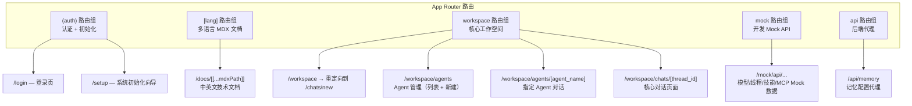
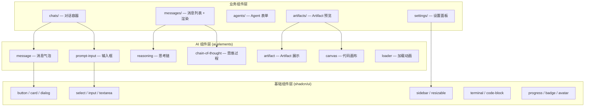
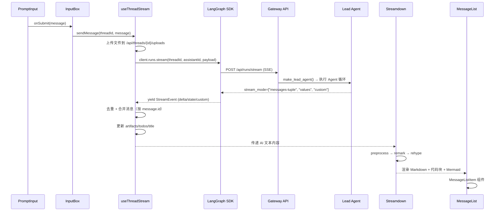

# 13 前端架构

**本章课程目标：**

- 理解 DeerFlow 前端的 Next.js 16 App Router 架构：三种路由组（auth/lang/workspace）的组织方式。
- 看懂三层组件架构：shadcn/ui 基础层 → ai-elements AI 组件层 → workspace 业务组件层。
- 理解核心业务逻辑层的设计：API Client + CSRF 防护、流式渲染管线、状态管理（React Query + localStorage）。
- 看懂消息流的完整链路：从 prompt-input 输入 → streamdown 流式渲染 → message 组件呈现。
- 理解 Artifact 系统、国际化、Agent 管理、线程管理、设置页面、Mock API 的工程实现。

**学习建议：** 先看路由分组建立空间布局的概念，再看三层组件架构理解UI分层，然后跟踪一次完整的消息流链路（prompt-input → streamdown → message）。特别关注 `langgraph-sdk` 的流式集成和 CSRF 防护机制——这是前后端安全的两个关键点。

---

## 1、路由架构：App Router 三组路由

DeerFlow 前端基于 Next.js 16 App Router，通过 Route Group 组织三个不同关注面的页面：



### 1.1 路由组功能划分

| 路由组 | 目录 | 用途 | 渲染模式 |
| --- | --- | --- | --- |
| `(auth)` | `src/app/(auth)/` | 登录、系统初始化（setup wizard） | 服务端渲染（验证用户状态） |
| `[lang]` | `src/app/[lang]/` | 中英文技术文档（MDX 驱动） | 静态生成 + ISR |
| `workspace` | `src/app/workspace/` | 核心工作空间：对话、Agent 管理 | 客户端渲染（`"use client"`） |
| `mock` | `src/app/mock/` | 开发用 Mock API（仅 `NEXT_PUBLIC_MOCK_API=true`） | API Route Handlers |
| `api` | `src/app/api/` | Next.js API 路由（后端代理） | API Route Handlers |

### 1.2 workspace 路由下的页面布局

`/workspace` 路由采用统一的 Shell 布局（`layout.tsx`），包含：

- **左侧边栏**（`WorkspaceSidebar`）：线程列表、Agent 入口、设置入口
- **主内容区**：根据子路由动态切换
  - `/workspace/chats/[thread_id]`：核心对话页面（`ChatPage`）
  - `/workspace/agents`：Agent 列表管理页
  - `/workspace/agents/new`：创建新 Agent
  - `/workspace/agents/[agent_name]`：指定 Agent 的对话页面

`/workspace` 根路径的作用是路由分发：生产模式下重定向到 `/workspace/chats/new`，静态演示模式下读取 `public/demo/threads/` 找到第一个线程并跳转。

---

## 2、三层 UI 组件架构

DeerFlow 前端的组件分为三个层级，每一层有明确的职责边界：



### 2.1 基础组件层（shadcn/ui）

`src/components/ui/` 包含约 30 个从 shadcn/ui 注册表自动生成的组件，覆盖按钮、卡片、对话框、下拉菜单、选择器、分隔线、工具提示、终端模拟器、可拖动面板等基础交互元件。

关键设计：这些组件通过 `cn()` 工具函数（`clsx + tailwind-merge`）实现条件样式合并，所有组件标记为 ESLint 忽略（自动生成）。

### 2.2 AI 组件层（ai-elements）

`src/components/ai-elements/` 包含约 27 个从 Vercel AI SDK 注册表生成的组件，是连接基础 UI 和 AI 业务逻辑的桥梁：

| 组件 | 用途 | 核心能力 |
| --- | --- | --- |
| `prompt-input` | 富文本输入框 | 文件附件、模式切换、上下文编辑 |
| `message` | 消息气泡渲染 | 支持 Markdown、代码块、工具调用 |
| `reasoning` | 推理过程展示 | 折叠/展开、流式内容更新 |
| `chain-of-thought` | 思维链可视化 | 步骤追踪、分支展示 |
| `artifact` | Artifact 容器 | 代码/文档/图表的展示和交互 |
| `canvas` | 代码画布 | 语法高亮、行号、复制 |
| `loader` | 加载动画 | shimmer 效果、打字机动画 |
| `sources` | 引用来源 | 结构化展示搜索来源 |
| `task` | 子任务卡片 | 子 Agent 状态展示 |

### 2.3 业务组件层（workspace）

`src/components/workspace/` 是 DeerFlow 特有的业务组件，直接面向用户交互：

| 子目录/文件 | 职责 |
| --- | --- |
| `chats/` | 对话容器（ChatBox）、线程上下文管理 |
| `messages/` | 消息列表虚拟滚动、Markdown 渲染、子任务卡片、Token 用量行内展示 |
| `agents/` | Agent 创建/编辑表单、欢迎页 |
| `settings/` | 约 8 个设置页面：账户、外观、通知、记忆、技能、工具、MCP、关于 |
| `artifacts/` | Artifact 预览面板、文件树 |
| `input-box.tsx` | 输入框容器（状态协调、上传处理） |
| `workspace-sidebar.tsx` | 侧边栏（线程列表、命令面板入口） |
| `token-usage-indicator.tsx` | Token 用量弹出面板 |
| `export-trigger.tsx` | 对话导出（Markdown） |
| `todo-list.tsx` | 计划模式 Todo 列表 |

---

## 3、核心业务逻辑层

`src/core/` 是前端的心脏，承载了所有不与 React 直接耦合的业务逻辑。每个子模块通过 `index.ts` 导出公共 API。

### 3.1 API Client 与 Fetcher

`core/api/api-client.ts` 管理 LangGraph SDK 客户端单例：

```typescript
// 核心设计：三个客户端模式
function createCompatibleClient(isMock?: boolean): LangGraphClient {
  if (isStaticWebsiteOnly() && !isMock) {
    return createStaticClient();   // 静态演示模式
  }
  const client = new LangGraphClient({
    apiUrl: getLangGraphBaseURL(isMock),
    onRequest: injectCsrfHeader,   // 每次请求前注入 CSRF 头
  });
  // 包装 stream/joinStream 以处理 inactive run 错误
  return client;
}
```

`core/api/fetcher.ts` 提供了带 CSRF 保护的 `fetch` 封装：

```typescript
// 双重提交 Cookie 模式（Double Submit Cookie）
export async function fetch(input: RequestInfo, init?: RequestInit): Promise<Response> {
  // 对状态变更方法（POST/PUT/DELETE/PATCH）自动注入 X-CSRF-Token 头
  if (isStateChangingMethod(init?.method ?? "GET")) {
    const token = readCsrfCookie();  // 从 csrf_token cookie 读取
    if (token) headers.set("X-CSRF-Token", token);
  }
  // 401 自动跳转登录页
  if (res.status === 401) window.location.href = buildLoginUrl(...);
}
```

### 3.2 Auth Provider 与 Gateway 配置

`core/auth/` 实现了 SSR 安全认证链：

| 文件 | 职责 |
| --- | --- |
| `server.ts` | 服务端认证主入口：`getServerSideUser()` 返回标记联合类型 `AuthResult` |
| `gateway-config.ts` | Gateway 内部 URL 配置解析 |
| `types.ts` | `AuthResult` 联合类型（`authenticated \| unauthenticated \| gateway_unavailable \| config_error \| system_setup_required \| needs_setup`） |
| `static-user.ts` | 静态网站模式的模拟用户 |

认证流程：

```
1. 读取 access_token cookie
2. 无 cookie → 调用 /api/v1/auth/setup-status 检查是否需要初始化
3. 有 cookie → 调用 /api/v1/auth/me 验证用户身份
4. 返回 AuthResult（调用方用 exhaustiveness check 处理所有分支）
```

### 3.3 Streamdown 流式渲染管线

`core/streamdown/` 是 DeerFlow 流式 Markdown 渲染的核心：

```
preprocess.ts（预处理）
  ↓ 检测 Mermaid 块，规范化特殊语法
plugins.ts（插件配置）
  ↓ 装配 remark + rehype 插件链
mermaid.ts（Mermaid 图表渲染）
  ↓ 运行时渲染流程图/时序图/甘特图
```

插件组合策略：

| 插件集 | 用途 | 组件 |
| --- | --- | --- |
| `streamdownPlugins` | AI 回复标准渲染 | `remarkGfm` + `remarkMath` + `rehypeRaw` + `rehypeKatex` |
| `streamdownPluginsWithWordAnimation` | 带逐字动画的渲染 | 同上 + `rehypeSplitWordsIntoSpans`（CSS animation） |
| `reasoningPlugins` | 推理内容渲染 | 不含 `rehypeRaw`（防止 LLM 幻觉 HTML 标签如 `<simd>` 被渲染为 DOM） |
| `humanMessagePlugins` | 人类消息渲染 | 不含 autolink（防止 URL 泄漏到相邻文本） |

### 3.4 状态管理

DeerFlow 的状态分为两类，使用不同的管理策略：

| 状态类型 | 管理方式 | 示例 |
| --- | --- | --- |
| 用户设置 | `localStorage` + React Context | 语言、外观、Token 用量偏好、通知偏好 |
| 服务端状态 | TanStack React Query | 线程列表、Token 用量统计、Agent 列表、MCP 配置 |
| 实时流状态 | `@langchain/langgraph-sdk/react` 的 `useStream` | 对话消息流、Artifact 更新、Todo 变更 |
| UI 瞬态 | `useState` / `useRef` | 欢迎模式切换、输入框焦点、折叠面板状态 |

`core/settings/` 模块管理两种设置：

- **线程级设置**（`useThreadSettings`）：上下文模式、技能白名单、模型选择（与特定线程绑定，通过 LangGraph SDK 同步到后端）
- **本地设置**（`useLocalSettings`）：外观主题、语言、Token 用量显示偏好（纯前端，localStorage 持久化）

---

## 4、消息流全链路

从用户输入到 AI 回复渲染的完整链路：



### 4.1 流模式配置

```typescript
// core/threads/hooks.ts — 三种流模式同时订阅
stream_mode: ["messages-tuple", "values", "custom"]
// messages-tuple: AI 文本增量（delta per chunk，按 id 累积重构完整消息）
//                工具调用 + 工具结果（每个 emit 一次）
// values:        完整状态快照（title, messages, artifacts, todos）
// custom:        StreamWriter 自定义事件转发
```

### 4.2 消息去重策略

流式传输中可能出现重复消息块，`useThreadStream` 通过两层去重保证数据一致性：

- `dedupeMessagesByIdentity()`：按 `message.id` 或 `tool:tool_call_id` 取最后出现位置
- 不可见消息过滤：`isHiddenFromUIMessage()` 过滤掉中间件注入的 `<system-reminder>`、摘要占位符等

### 4.3 新线程生命周期

新线程的创建时机是一个精妙的设计决策——**不是页面加载时创建，而是用户发送第一条消息时创建**：

1. 用户访问 `/workspace/chats/new` → `isNewThread = true`，显示欢迎布局
2. 用户输入第一条消息 → `onSend` 回调触发，欢迎模式立即转变为聊天布局
3. `useStream` 向 SDK 发送消息 → LangGraph SDK 自动创建线程
4. 后端返回 `thread_id` → `onStart` 回调将线程 ID 写入 URL（使用 `history.replaceState` 而非 Next.js router，避免组件重新挂载丢失流状态）

---

## 5、Artifact 系统

Artifact 是 Agent 生成的代码/文档/图表，由 `present_file` 工具触发。前端通过 `core/artifacts/` 模块管理其加载和预览：

### 5.1 加载流程

```
Agent 调用 present_file 工具
  → 后端将文件写入沙箱 outputs/ 目录
  → 前端收到 artifact 更新（通过 stream mode "values"）
  → core/artifacts/loader.ts 通过 /api/threads/{id}/artifacts/{path} 获取文件内容
  → 根据 MIME 类型决定渲染方式
```

### 5.2 安全策略

Artifact 的 XSS 防护通过服务端强制下载头实现：

```python
# backend/app/gateway/routers/artifacts.py
ACTIVE_CONTENT_TYPES = {"text/html", "application/xhtml+xml", "image/svg+xml"}
if mime_type in ACTIVE_CONTENT_TYPES:
    headers["Content-Disposition"] = "attachment"  # 强制下载
```

前端 `ArtifactPreview` 组件通过 `<iframe sandbox>` 展示安全的 HTML/SVG 内容，可执行内容始终隔离。

---

## 6、国际化（i18n）

`core/i18n/` 实现了轻量级国际化方案，无需第三方库：

```typescript
// 支持的语言
export const SUPPORTED_LOCALES = ["en-US", "zh-CN"] as const;

// 语言检测优先级：User 设置 > 浏览器语言 > 默认 en-US
export function detectLocale(): Locale {
  const browserLang = navigator.language;
  return normalizeLocale(browserLang);  // zh* → zh-CN, 其他 → en-US
}
```

核心设计特点：

- **类型安全**：`Translations` 接口确保中英文翻译文件的键完全对齐（TypeScript 编译时检查）
- **零运行时开销**：翻译对象在构建时内联，无 JSON 异步加载
- **Context 注入**：通过 `I18nProvider` + React Context 在组件树中共享当前语言
- **MDX 文档**：`[lang]` 路由组通过 `generateStaticParams` 为每种语言生成独立的文档页面

翻译文件结构（`src/core/i18n/locales/`）：

| 文件 | 内容 |
| --- | --- |
| `en-US.ts` | 英文翻译（~800+ 条） |
| `zh-CN.ts` | 中文翻译（~800+ 条） |
| `types.ts` | `Translations` 接口定义（编译时约束） |

---

## 7、Agent 管理页面

Agent 管理功能通过三块页面组合：

### 7.1 Agent 列表页（`/workspace/agents`）

展示所有可用 Agent（内置 + 自定义），支持筛选、搜索。每个 Agent 卡片显示名称、描述、技能列表、模型配置。

### 7.2 新建 Agent 页（`/workspace/agents/new`）

通过分步表单引导用户创建自定义 Agent：
1. 基础信息（名称、描述、图标）
2. 模型选择（从 Gateway API 获取可用模型列表）
3. 技能配置（从技能系统获取可用技能）
4. 系统提示编辑（`SOUL.md` Markdown）

后端通过 `setup_agent` 工具（bootstrap 模式）持久化新 Agent 的 `SOUL.md` 和 `config.yaml`。

### 7.3 指定 Agent 对话（`/workspace/agents/[agent_name]`）

复用 `ChatPage` 组件，通过 `assistantId` 参数指定 Agent。在 URL 中保留 `agent_name` 参数，侧边栏高亮当前 Agent。

---

## 8、线程管理

### 8.1 线程历史

左侧边栏通过 `useThreads()` Hook（React Query）获取线程列表，支持：
- 按更新时间排序
- 搜索过滤
- 删除线程（调用 Gateway + LangGraph API，同时清理本地目录）

### 8.2 线程导出

`export-trigger.tsx` 将对话导出为 Markdown 格式：

```
# Thread Title
**Date**: 2026-06-16
**Model**: claude-sonnet-4-5

## User
帮我分析这份数据...

## Assistant
好的，让我先读取文件...
```

### 8.3 Token 用量可视化

`token-usage-indicator.tsx` 提供两种 Token 用量展示模式：
- **行内模式**：在每条 AI 消息下方显示 Token 消耗
- **弹出面板模式**：点击顶部用量指示器查看线程级别 Token 聚合统计

数据来源：`/api/threads/{id}/token-usage`（通过 React Query 缓存，后台自动刷新）。

---

## 9、设置页面

设置面板（`settings-dialog.tsx`）以侧边栏导航组织 7 个设置页：

| 设置页 | 功能 |
| --- | --- |
| 账户（Account） | 用户信息、密码修改 |
| 外观（Appearance） | 主题切换（亮色/暗色/系统）、字体大小 |
| 通知（Notification） | 浏览器通知开关、通知内容偏好 |
| 记忆（Memory） | 记忆数据查看、手动重新加载、置信度阈值调整 |
| 技能（Skills） | 技能启用/禁用、安装新技能（上传 .skill 文件） |
| 工具（Tools） | MCP 工具配置、工具组开关 |
| 关于（About） | 版本信息、构建信息、GitHub 链接 |

每个设置页通过 Gateway API 或 LangGraph SDK 读写后端配置，`extensions_config.json` 的修改通过 `PUT /api/mcp/config` 和 `PUT /api/skills/{name}` 端点持久化。

---

## 10、Mock API 路由

`src/app/mock/api/` 在 `NEXT_PUBLIC_MOCK_API=true` 时激活，提供完整的后端模拟，支持前端在没有后端的环境下独立开发和 E2E 测试：

| Mock 端点 | 模拟数据 |
| --- | --- |
| `GET /mock/api/models` | 模型列表（Claude Sonnet, GPT-4o 等） |
| `GET /mock/api/threads/search` | 线程搜索（返回预置演示线程） |
| `GET /mock/api/threads/[thread_id]/history` | 线程历史（预置对话数据） |
| `GET /mock/api/threads/[thread_id]/artifacts/[[...path]]` | Artifact 文件内容 |
| `GET /mock/api/skills` | 可用技能列表 |
| `GET /mock/api/mcp/config` | MCP 服务器配置 |

Mock 数据源来自 `public/demo/threads/` 目录下的预置 JSON 文件，用于静态演示模式（`NEXT_PUBLIC_STATIC_WEBSITE_ONLY=true`）和 E2E 测试。

---

## 11、E2E 测试与单元测试

### 11.1 Playwright E2E 测试

`tests/e2e/` 包含 8 个 E2E 测试文件，覆盖核心用户旅程：

| 测试文件 | 覆盖场景 |
| --- | --- |
| `chat.spec.ts` | 对话创建、消息发送、流式响应 |
| `agent-chat.spec.ts` | 指定 Agent 对话 |
| `sidebar.spec.ts` | 侧边栏导航、线程切换 |
| `thread-history.spec.ts` | 历史加载、滚动分页 |
| `thread-history-mermaid.spec.ts` | Mermaid 图渲染 |
| `artifact-preview.spec.ts` | Artifact 预览面板 |
| `landing.spec.ts` | 着陆页导航 |
| `chat-thread-init-ordering.spec.ts` | 线程初始化顺序 |

所有 E2E 测试通过 `page.route()` 网络拦截模拟后端 API，不依赖真实后端。

### 11.2 Vitest 单元测试

`tests/unit/` 镜像 `src/` 目录结构，覆盖核心业务逻辑：

| 测试类别 | 测试文件 | 覆盖内容 |
| --- | --- | --- |
| API 层 | `api-client.test.ts`, `stream-mode.test.ts` | 客户端创建、流模式配置 |
| 认证 | `server.test.ts`, `gateway-config.test.ts` | SSR 认证、配置解析 |
| 流渲染 | `mermaid.test.ts`, `plugins.test.ts` | Mermaid 规范化、插件装配 |
| 消息 | `utils.test.ts`, `usage.test.ts`, `usage-model.test.ts` | 消息合并、Token 统计 |
| 线程 | `api.test.ts`, `export.test.ts`, `token-usage.test.ts`, `message-merge.test.ts` | API 调用、导出、用量 |
| Artifact | `utils.test.ts`, `preview.test.ts` | 加载、预览 |
| 上传 | `file-validation.test.ts`, `prompt-input-files.test.ts` | 文件验证、输入框整合 |

---

## 12、本章小结

1. DeerFlow 前端基于 **Next.js 16 App Router**，通过三组路由（auth / lang / workspace）分离认证、文档和核心工作空间。

2. 三层组件架构实现了关注点分离：**shadcn/ui（基础交互）→ ai-elements（AI 专用组件）→ workspace（业务组件）**。

3. 核心业务逻辑层的 API Client 实现了 **CSRF 双重提交 Cookie 防护**和**三种客户端模式**（标准/静态/Mock）。

4. 流式消息渲染管线：**preprocess → remark → rehype → streamdown**，针对 AI 回复、推理内容、人类消息使用**不同的插件组合**。

5. 新线程**延迟创建**（第一条消息发送时才创建）避免了空线程污染后端存储。

6. 国际化为**编译时类型安全的零依赖方案**，中英文翻译文件通过 TypeScript 接口约束保证完整性。

7. Mock API 路由支持**前后端完全解耦的独立开发**和 Playwright E2E 测试。
