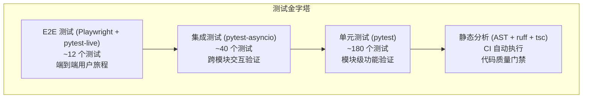
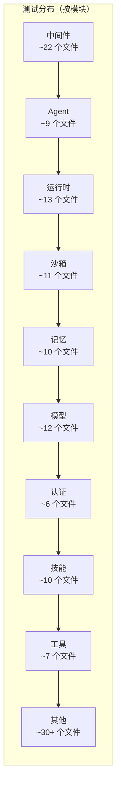
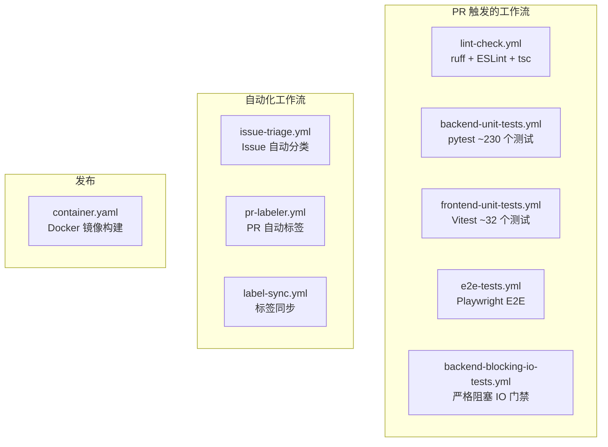

# 14 工程化与测试体系

**本章课程目标：**

- 理解 DeerFlow 的测试金字塔布局：从单元测试到 E2E 的层次化覆盖策略。
- 看懂 ~230+ 测试文件的分类体系：Agent、中间件、认证、通道、配置、MCP、记忆、模型、运行时、沙箱、技能、子 Agent、线程、工具、上传、追踪等。
- 理解项目边界检查：harness 包与 app 层的单向依赖关系，以及 CI 中的强制执行机制。
- 理解阻塞 IO 检测：blockbuster 运行时门 + 静态 AST 分析的互补设计。
- 理解 CI/CD 管道：GitHub Actions 工作流矩阵和 pre-commit 钩子。
- 理解运维脚本体系：设置向导、系统诊断、配置升级的自动化流程。

**学习建议：** 先从测试金字塔总览建立全局印象，然后按模块分类逐一了解每类测试的覆盖重点。特别关注 `test_harness_boundary.py` 和阻塞 IO 检测——它们是项目质量的"硬约束"，不是锦上添花。

---

## 1、测试体系总览

DeerFlow 维护了 ~230+ 个后端测试文件和 ~30+ 个前端测试文件，形成了从单元到集成的完整验证链：



### 1.1 测试基础设施配置

```toml
# backend/pyproject.toml
[tool.pytest.ini_options]
markers = [
    "no_auto_user: 禁用 conftest 的自动 user contextvar fixture",
    "allow_blocking_io: 在 tests/blocking_io/ 中退出 strict Blockbuster 门禁",
]

[dependency-groups]
dev = [
    "blockbuster>=1.5.26,<1.6",   # 阻塞 IO 检测
    "pytest>=9.0.3",               # 测试框架
    "pytest-asyncio>=1.3.0",       # 异步测试支持
    "ruff>=0.14.11",               # 代码格式化
]
```

### 1.2 测试目录结构

```
backend/tests/
├── conftest.py                     # 全局 fixture（user context 注入等）
├── _agent_e2e_helpers.py          # Agent E2E 测试公共工具
├── _router_auth_helpers.py        # 路由认证测试公共工具
├── blocking_io/                    # 阻塞 IO 回归测试（严格门禁）
├── support/detectors/             # 检测器实现
│   ├── blocking_io_runtime.py     # 运行时 blockbuster 门
│   └── blocking_io_static.py      # 静态 AST 扫描
└── test_*.py                       # ~180 个单元测试文件
```

---

## 2、测试分类与覆盖

### 2.1 Agent / Lead Agent 测试

| 测试文件 | 覆盖内容 |
| --- | --- |
| `test_create_deerflow_agent.py` | Agent 工厂函数的基本创建逻辑 |
| `test_create_deerflow_agent_live.py` | Agent 工厂函数的实时模型调用 |
| `test_custom_agent.py` | 自定义 Agent 的 SOUL.md 和配置管理 |
| `test_setup_agent_tool.py` | Bootstrap 模式下 `setup_agent` 工具 |
| `test_update_agent_tool.py` | 运行时 `update_agent` 自更新工具 |
| `test_setup_agent_e2e_user_isolation.py` | setup_agent 的用户隔离 |
| `test_setup_agent_http_e2e_real_server.py` | setup_agent 的 HTTP E2E |
| `test_update_agent_e2e_user_isolation.py` | update_agent 的用户隔离 |
| `test_assistant_payload_replay.py` | 助手参数重放验证 |

### 2.2 中间件测试

每个中间件都有独立测试文件，外加集成测试：

| 测试文件 | 对应中间件 |
| --- | --- |
| `test_thread_data_middleware.py` | ThreadDataMiddleware |
| `test_uploads_middleware_core_logic.py` | UploadsMiddleware |
| `test_dynamic_context_middleware.py` | DynamicContextMiddleware |
| `test_view_image_middleware.py` | ViewImageMiddleware |
| `test_dangling_tool_call_middleware.py` | DanglingToolCallMiddleware |
| `test_deferred_filter_middleware.py` | DeferredToolFilterMiddleware |
| `test_deferred_promotion_integration.py` | 延迟工具提升集成测试 |
| `test_deferred_tool_crosscontext.py` | 跨上下文延迟工具 |
| `test_deferred_tool_promotion_real_llm.py` | 真实 LLM 的延迟工具提升 |
| `test_loop_detection_middleware.py` | LoopDetectionMiddleware |
| `test_safety_finish_reason_middleware.py` | SafetyFinishReasonMiddleware |
| `test_safety_finish_reason_graph_integration.py` | 安全终止的图集成 |
| `test_safety_termination_detectors.py` | 安全终止检测器 |
| `test_subagent_limit_middleware.py` | SubagentLimitMiddleware |
| `test_todo_middleware.py` | TodoMiddleware |
| `test_title_middleware_core_logic.py` | TitleMiddleware |
| `test_summarization_middleware.py` | SummarizationMiddleware |
| `test_sandbox_middleware.py` | SandboxMiddleware |
| `test_sandbox_audit_middleware.py` | SandboxAuditMiddleware |
| `test_tool_error_handling_middleware.py` | ToolErrorHandlingMiddleware |
| `test_tool_output_budget_middleware.py` | ToolOutputBudgetMiddleware |
| `test_clarification_middleware.py` | ClarificationMiddleware |
| `test_token_usage_middleware.py` | TokenUsageMiddleware |

### 2.3 认证测试

| 测试文件 | 覆盖内容 |
| --- | --- |
| `test_auth.py` | JWT Token 生成与验证 |
| `test_auth_config.py` | 认证配置解析（允许/禁止模式） |
| `test_auth_errors.py` | 认证错误码与异常处理 |
| `test_auth_middleware.py` | Gateway 认证中间件 |
| `test_auth_type_system.py` | AuthResult 类型系统完整性 |
| `test_csrf_middleware.py` | CSRF 双重提交 Cookie 验证 |

### 2.4 通道测试

| 测试文件 | 覆盖内容 |
| --- | --- |
| `test_channels.py` | Channel 抽象基类和 Manager 调度 |
| `test_feishu_parser.py` | 飞书消息格式解析 |
| `test_dingtalk_channel.py` | 钉钉 AI 卡片流推送 |
| `test_discord_channel.py` | Discord 集成 |
| `test_wechat_channel.py` | 微信 iLink 长轮询 |
| `test_channel_file_attachments.py` | 多渠道文件附件处理 |

### 2.5 配置测试

| 测试文件 | 覆盖内容 |
| --- | --- |
| `test_app_config_reload.py` | 配置热加载（mtime 检测 → 自动重载） |
| `test_config_version.py` | 配置版本比较与升级提示 |
| `test_gateway_config_freshness.py` | Gateway 配置新鲜度验证 |
| `test_model_config.py` | 模型配置解析 |
| `test_token_usage_config.py` | Token 用量配置 |
| `test_tracing_config.py` | 追踪系统配置（Langfuse/LangSmith） |

### 2.6 客户端测试

| 测试文件 | 覆盖内容 |
| --- | --- |
| `test_client.py` | 嵌入式客户端 77 个单元测试 + `TestGatewayConformance` |
| `test_client_e2e.py` | 客户端 E2E 流程 |
| `test_client_live.py` | 真实环境集成测试 |
| `test_client_message_serialization.py` | 消息序列化/反序列化 |
| `test_client_langfuse_metadata.py` | 客户端 Langfuse 元数据注入 |

`TestGatewayConformance` 是客户端测试的精髓——它验证 `DeerFlowClient` 的每个 dict 返回值都符合 Gateway Pydantic 响应模型。如果 Gateway 新增必须字段而客户端未提供，Pydantic `ValidationError` 会立即在 CI 中暴露。

### 2.7 MCP 测试

| 测试文件 | 覆盖内容 |
| --- | --- |
| `test_mcp_client_config.py` | MCP 客户端配置解析 |
| `test_mcp_config_secrets.py` | 凭证引用的环境变量展开（`$ENV_VAR`） |
| `test_mcp_oauth.py` | OAuth 认证流程（client_credentials / refresh_token） |
| `test_mcp_session_pool.py` | 会话池复用与超时 |
| `test_mcp_custom_interceptors.py` | 自定义拦截器 |
| `test_mcp_sync_wrapper.py` | 同步包装器 |

### 2.8 记忆测试

| 测试文件 | 覆盖内容 |
| --- | --- |
| `test_memory_queue.py` | 去抖队列：延迟触发、线程隔离 |
| `test_memory_queue_user_isolation.py` | 队列的用户隔离 |
| `test_memory_storage.py` | 文件存储：原子写入、mtime 缓存 |
| `test_memory_storage_user_isolation.py` | 存储的用户隔离 |
| `test_memory_updater.py` | LLM 更新器：提取、去重、排序 |
| `test_memory_updater_user_isolation.py` | 更新器的用户隔离 |
| `test_memory_prompt_injection.py` | 记忆注入到 Prompt |
| `test_memory_thread_meta_isolation.py` | 线程元数据隔离 |
| `test_memory_router.py` | 记忆 REST API 端点 |
| `test_memory_upload_filtering.py` | 上传文件过滤 |

### 2.9 模型测试

| 测试文件 | 覆盖内容 |
| --- | --- |
| `test_model_factory.py` | 模型工厂：四级回退、thinking/vision 切换 |
| `test_credential_loader.py` | 凭证加载：环境变量展开 |
| `test_patched_openai.py` | OpenAI Provider 补丁 |
| `test_patched_deepseek.py` | DeepSeek Provider 补丁 |
| `test_patched_mimo.py` | Mimo Provider 补丁 |
| `test_patched_minimax.py` | MiniMax Provider 补丁 |
| `test_codex_provider.py` | Codex Provider |
| `test_vllm_provider.py` | vLLM reasoning 字段保留 |
| `test_mindie_provider.py` | MindIE Provider |
| `test_claude_provider_oauth_billing.py` | Claude Provider OAuth 计费 |
| `test_claude_provider_prompt_caching.py` | Prompt Cache 命中率验证 |
| `test_cli_auth_providers.py` | CLI 认证 Provider |

### 2.10 运行时 / Runs 测试

| 测试文件 | 覆盖内容 |
| --- | --- |
| `test_runtime_lifecycle_e2e.py` | 运行时生命周期端到端 |
| `test_run_manager.py` | RunManager 创建、取消、状态转换 |
| `test_run_naming.py` | Run 名自动生成 |
| `test_run_journal.py` | 运行日志记录 |
| `test_run_worker_rollback.py` | Worker 回滚策略 |
| `test_run_repository.py` | 持久化存储读写 |
| `test_run_event_store.py` | 事件存储 |
| `test_runs_api_endpoints.py` | Runs REST API |
| `test_cancel_run_idempotent.py` | 取消运行的幂等性 |
| `test_gateway_run_recovery.py` | 运行恢复 |
| `test_gateway_runtime_cleanup.py` | 运行时资源清理 |
| `test_gateway_lifespan_shutdown.py` | Gateway 生命周期优雅关闭 |
| `test_wait_disconnect_handling.py` | 客户端断连处理 |

### 2.11 沙箱测试

| 测试文件 | 覆盖内容 |
| --- | --- |
| `test_aio_sandbox.py` | Docker 沙箱接口 |
| `test_aio_sandbox_local_backend.py` | 本地后端模拟 Docker |
| `test_aio_sandbox_provider.py` | 沙箱 Provider 工厂 |
| `test_aio_sandbox_readiness.py` | 沙箱就绪检测 |
| `test_remote_sandbox_backend.py` | 远程沙箱后端 |
| `test_docker_sandbox_mode_detection.py` | Docker 模式检测 |
| `test_sandbox_search_tools.py` | 搜索工具（grep/glob/ripgrep） |
| `test_sandbox_tools_security.py` | 安全审计模式匹配 |
| `test_sandbox_memory_profile_script.py` | 内存分析脚本 |
| `test_sandbox_orphan_reconciliation.py` | 孤儿沙箱清理 |
| `test_sandbox_orphan_reconciliation_e2e.py` | 孤儿清理 E2E |
| `test_provisioner_kubeconfig.py` | Kubernetes 配置 Provisioner |
| `test_provisioner_pvc_volumes.py` | PVC 卷挂载 |

### 2.12 技能测试

| 测试文件 | 覆盖内容 |
| --- | --- |
| `test_skills_loader.py` | 技能发现 + 加载 |
| `test_skills_parser.py` | YAML Frontmatter 解析 |
| `test_skills_validation.py` | 技能元数据校验 |
| `test_skills_installer.py` | .skill 文件解压和安装 |
| `test_skills_bundled.py` | 内置技能清单验证 |
| `test_skills_custom_router.py` | 自定义技能路由 |
| `test_security_scanner.py` | 安全扫描（路径遍历、zip bomb） |
| `test_skill_permissions.py` | 技能权限隔离 |
| `test_skill_manage_tool.py` | 技能管理工具 |
| `test_skills_archive_root.py` | 技能存档根目录 |

### 2.13 子 Agent 测试

| 测试文件 | 覆盖内容 |
| --- | --- |
| `test_subagent_executor.py` | Executor：线程池、事件循环、取消传播 |
| `test_subagent_token_collector.py` | Token 收集与合并 |
| `test_subagent_prompt_security.py` | 注入到子 Agent 的 Prompt 安全 |
| `test_subagent_skills_config.py` | 子 Agent 技能配置继承 |
| `test_subagent_timeout_config.py` | 子 Agent 超时配置 |

### 2.14 线程测试

| 测试文件 | 覆盖内容 |
| --- | --- |
| `test_thread_state_promoted.py` | promoted 状态合并（catalog_hash 作用域） |
| `test_thread_state_reducers.py` | 自定义 Reducer（merge_artifacts / merge_todos / merge_viewed_images） |
| `test_thread_token_usage.py` | Token 用量聚合 |
| `test_thread_meta_repo.py` | 线程元数据存储 |
| `test_threads_router.py` | 线程 REST API |
| `test_thread_run_messages_pagination.py` | 消息分页 |

### 2.15 工具测试

| 测试文件 | 覆盖内容 |
| --- | --- |
| `test_task_tool_core_logic.py` | task 工具核心逻辑 |
| `test_task_tool_usage_recorder.py` | 工具用量记录 |
| `test_present_file_tool_core_logic.py` | present_file 工具 |
| `test_tool_search.py` | tool_search 工具（MCP 发现） |
| `test_tool_deduplication.py` | 工具去重（MCP + 内置 + 技能） |
| `test_tool_args_schema_no_pydantic_warning.py` | Schema 无 Pydantic 警告 |
| `test_tool_output_truncation.py` | 工具输出截断 |

### 2.16 其他模块测试

| 测试文件 | 覆盖内容 |
| --- | --- |
| `test_uploads_manager.py` / `test_uploads_router.py` | 上传管理、文件列表、删除 |
| `test_file_conversion.py` | PDF/PPT/Excel/Word → Markdown 转换 |
| `test_feedback.py` | 用户反馈（点赞/点踩） |
| `test_suggestions_router.py` | 后续问题建议生成 |
| `test_artifacts_router.py` | Artifact 服务与下载 |
| `test_sse_format.py` | SSE 事件格式化 |
| `test_stream_bridge.py` | 流桥生产者-消费者 |
| `test_serialization.py` / `test_serialize_message_content.py` | 消息序列化 |
| `test_checkpointer.py` / `test_checkpointer_none_fix.py` | Checkpoint 持久化 |
| `test_persistence_scaffold.py` / `test_persistence_timezone.py` | 数据库脚手架 + 时区 |
| `test_tracing_factory.py` / `test_tracing_metadata.py` | 追踪回调工厂 + 元数据 |
| `test_worker_langfuse_metadata.py` | Worker 的 Langfuse 元数据 |
| `test_exa_tools.py` / `test_firecrawl_tools.py` / `test_serper_tools.py` | 第三方工具集成 |
| `test_reflection_resolvers.py` | 反射解析（resolve_variable / resolve_class） |
| `test_readability.py` | 可读性提取 |
| `test_utils_time.py` | 时间工具函数 |
| `test_user_context.py` | User Context 传递 |
| `test_owner_isolation.py` / `test_paths_user_isolation.py` / `test_migration_user_isolation.py` | 多用户隔离 |

### 2.17 测试分类总结



---

## 3、项目边界执行

### 3.1 Harness 与 App 的单向依赖

DeerFlow 的后端分为两层，严格的单向依赖关系：

```
app/ (应用层)
  ↓ import
deerflow/ (核心框架层)
  ✗ 禁止 import app
```

这个边界之所以重要：`deerflow-harness` 是一个可独立发布的 pip 包——它不应该也不可以依赖 `app/` 中的 Gateway 或 IM 通道代码。

### 3.2 test_harness_boundary.py

```python
# backend/tests/test_harness_boundary.py
HARNESS_ROOT = Path(__file__).parent.parent / "packages" / "harness" / "deerflow"
BANNED_PREFIXES = ("app.",)

def test_harness_does_not_import_app():
    """扫描 harness 包下所有 .py 文件，检测任何 'from app.' 或 'import app.'"""
    violations = []
    for py_file in sorted(HARNESS_ROOT.rglob("*.py")):
        for line_no, module in _collect_imports(py_file):
            if any(module.startswith(p) for p in BANNED_PREFIXES):
                violations.append(f"{py_file}:{line_no}: imports {module}")
    assert not violations, f"Harness must not import app:\n" + "\n".join(violations)
```

该测试在 CI 中**硬失败**（hard-fail），任何违反边界的代码都无法合并。

---

## 4、阻塞 IO 检测

DeerFlow 的异步事件循环不能被同步阻塞 IO 调用阻塞——这会导致整个 worker 停滞。DeerFlow 使用两层互补检测机制：

### 4.1 运行时门：Blockbuster

`tests/blocking_io/` 目录下的测试被 Blockbuster 插件严格包裹：

```python
# tests/support/detectors/blocking_io_runtime.py
# 每个测试都运行在 Blockbuster 上下文中，监控 app.* 和 deerflow.* 的调用
# 任何在 asyncio 事件循环上执行同步阻塞 IO 的操作→ BlockingError → 测试失败
```

回归锚点测试：

| 锚点测试 | 保护内容 |
| --- | --- |
| `test_skills_load.py` | 技能加载的 `asyncio.to_thread` 卸载（修复 #1917） |
| `test_sqlite_lifespan.py` | SQLite 路径解析的异步卸载（修复 #1912） |
| `test_jsonl_run_event_store.py` | JSONL 事件存储的文件 IO 卸载（修复 #3084） |
| `test_uploads_middleware.py` | 上传目录扫描的异步卸载 |
| `test_gate_smoke.py` | 门禁本身的有效性验证 + opt-out 标记测试 |

### 4.2 静态分析：AST 扫描

`scripts/detect_blocking_io_static.py` 通过 AST 解析扫描异步函数和中间件钩子中的同步阻塞调用：

```
扫描范围: app/ + packages/harness/deerflow/ + scripts/
检测内容: open(), os.read(), requests.get(), socket.*, subprocess.*, time.sleep()
输出格式: JSON（.deer-flow/blocking-io-findings.json）
字段: priority, location, blocking_call, event_loop_exposure, reason, code
```

静态分析是**信息性工具**（非 CI 硬失败），为开发者提供审查清单。

### 4.3 线程边界检测

`scripts/detect_thread_boundaries.py` 扫描异步/同步边界点，帮助开发者理解哪些同步函数可能运行在事件循环上。

---

## 5、CI/CD 管道

DeerFlow 使用 GitHub Actions 构建完整的 CI/CD 管道（`.github/workflows/`）：



### 5.1 工作流矩阵

| 工作流 | 触发条件 | 关键步骤 |
| --- | --- | --- |
| `lint-check.yml` | 每次 PR | ruff check + ruff format --check + ESLint + tsc --noEmit |
| `backend-unit-tests.yml` | 每次 PR | pytest（含 `test_harness_boundary.py` 硬失败） |
| `frontend-unit-tests.yml` | 每次 PR | Vitest run（~32 单元测试） |
| `backend-blocking-io-tests.yml` | 每次 PR | pytest tests/blocking_io/（严格 Blockbuster 门禁） |
| `e2e-tests.yml` | 每次 PR | Playwright Chromium E2E |
| `container.yaml` | main 分支推送 | Docker 镜像构建 |

### 5.2 Pre-commit 钩子

通过 `make install` 自动安装：

```yaml
# .pre-commit-config.yaml
repos:
  - repo: https://github.com/astral-sh/ruff-pre-commit
    hooks:
      - id: ruff          # Lint 检查
      - id: ruff-format   # 格式化
```

---

## 6、Docker 部署

### 6.1 docker-compose.yaml

生产部署包含三个核心服务：

| 服务 | 镜像/构建 | 端口 | 职责 |
| --- | --- | --- | --- |
| `gateway` | 本地构建（`backend/Dockerfile`） | 8001 | FastAPI Gateway + IM 通道 |
| `frontend` | 本地构建（`frontend/Dockerfile`） | 3000 | Next.js 前端（standalone 模式） |
| `nginx` | `nginx:alpine` | 2026 | 反向代理 + 静态文件服务 |

开发模式增加：
- `docker-compose-dev.yaml` 使用卷挂载实现热重载
- `provisioner/` 仅在 Kubernetes 沙箱模式下启动

### 6.2 Nginx 配置

```nginx
# docker/nginx/default.conf
location /api/langgraph/ {
    proxy_pass http://gateway:8001/api/;      # LangGraph SDK 路径 → Gateway
}
location /api/ {
    proxy_pass http://gateway:8001/api/;       # REST API → Gateway
}
location / {
    proxy_pass http://frontend:3000;            # 其他 → Next.js
}
```

### 6.3 启动脚本

| 脚本 | 用途 |
| --- | --- |
| `scripts/serve.sh` | 本地开发/生产服务启动（支持 foreground/daemon/dev/prod 模式） |
| `scripts/docker.sh` | Docker 开发环境管理 |
| `scripts/deploy.sh` | Docker 生产部署 |
| `scripts/cleanup-containers.sh` | 容器清理 |
| `scripts/setup-sandbox.sh` | 沙箱镜像预拉取 |
| `scripts/start-daemon.sh` | 后台守护进程启动 |

---

## 7、设置向导（Setup Wizard）

`scripts/setup_wizard.py` 是交互式首次配置工具：

```
$ make setup
  → 进入交互式向导
  → 1. 检测系统环境（Python/Node.js/pnpm/Docker）
  → 2. 生成 config.yaml（交互式问答）
  → 3. 配置模型 Provider + API Key
  → 4. 生成 extensions_config.json
  → 5. 安装依赖 + pre-commit 钩子
  → 6. 预拉取沙箱镜像
```

### 7.1 测试覆盖

`test_setup_wizard.py` 验证向导的每个步骤的输出和边界情况。

---

## 8、系统诊断（Doctor Script）

`scripts/doctor.py` 是系统健康检查工具（对应 `make doctor`）：

```
检查项:
  ├── Python 版本 ≥ 3.12
  ├── Node.js 版本 ≥ 22
  ├── pnpm 版本 ≥ 10.26
  ├── config.yaml 存在 + 格式正确
  ├── config_version 一致性
  ├── extensions_config.json 存在 + 格式正确
  ├── 模型 Provider 凭证可用性
  ├── Docker 可用性（如配置了沙箱）
  ├── 端口占用检测（2026/3000/8001）
  └── 磁盘空间检查
```

`test_doctor.py` 覆盖诊断脚本的各种场景。

---

## 9、配置升级（Config Upgrade）

`config-upgrade.sh`（`make config-upgrade`）解决配置文件版本演进问题：

```
config.example.yaml (v3)  ← 发布新字段
config.yaml        (v2)  ← 用户当前版本
         ↓
  config-upgrade.sh
         ↓
config.yaml        (v3)  ← 自动合并缺失字段
```

工作原理：
1. 对比用户 `config.yaml` 的 `config_version` 与 `config.example.yaml` 的版本
2. 列出缺失的字段（递归 diff）
3. 将缺失字段从 `config.example.yaml` 合并到 `config.yaml`
4. 更新 `config_version` 字段
5. 保留用户自定义值不覆盖

`test_config_version.py` 验证版本比较逻辑。

---

## 10、代码质量保障

### 10.1 Ruff 配置

```toml
# backend/pyproject.toml (ruff 配置)
line-length = 240
# 使用双引号、空格缩进、Python 3.12+ 类型提示
```

### 10.2 前端代码质量

| 工具 | 检查内容 |
| --- | --- |
| ESLint | 导入顺序（builtin → external → internal → parent → sibling）、未使用变量前缀 `_` |
| TypeScript (`tsc --noEmit`) | 类型完整性、接口对齐 |
| Prettier（通过 ESLint 插件） | 代码格式 |

### 10.3 附加检查脚本

| 脚本 | 用途 |
| --- | --- |
| `scripts/check.py` | 系统环境综合检查 |
| `scripts/check.sh` | Shell 版本的依赖检查 |
| `scripts/detect_uv_extras.py` | 检测未声明的 uv extras 依赖 |
| `scripts/sync_labels.py` | GitHub Issue 标签同步 |
| `scripts/sandbox_memory_profile.py` | 沙箱内存分析 |
| `scripts/tool-error-degradation-detection.sh` | 工具错误降级检测 |

---

## 11、本章小结

1. DeerFlow 维护了 **~230+ 后端测试文件 + ~32 前端单元测试 + 8 E2E 测试**，覆盖了 Agent、中间件、认证、通道、配置、MCP、记忆、模型、运行时、沙箱、技能、子 Agent、线程、工具、上传、追踪等全部模块。

2. **项目边界检查**（`test_harness_boundary.py`）确保 `deerflow-harness` 包不依赖 `app/` 层——这是可独立发布的前提，CI 硬失败强制。

3. **阻塞 IO 检测**采用双层互补设计：**Blockbuster 运行时门（CI 硬失败）+ 静态 AST 扫描（信息性审查）**，确保 asyncio 事件循环不被阻塞。

4. **GitHub Actions CI** 包含 5 个 PR 触发工作流（lint / 后端测试 / 前端测试 / 阻塞 IO / E2E）和 4 个自动化工作流（Issue 分类、PR 标签、标签同步、容器构建）。

5. **Docker 生产部署**通过 nginx 反向代理统一入口（端口 2026），前端 standalone 模式 + Gateway + 可选 Provisioner。

6. **运维脚本体系**包括交互式设置向导、系统诊断、配置升级，每个脚本都有对应的测试覆盖。
