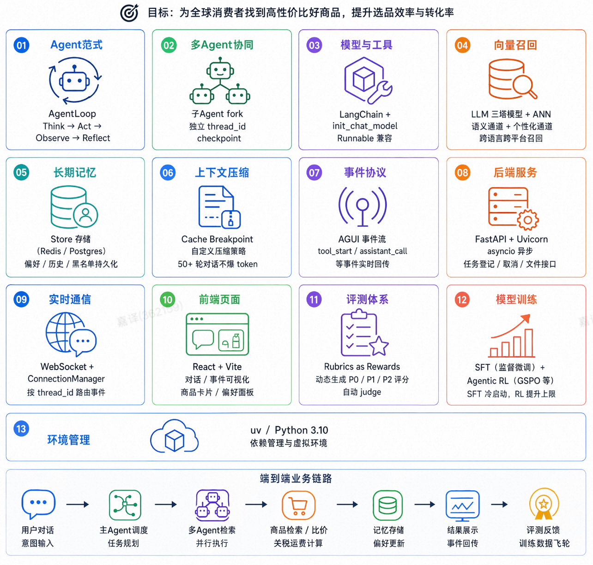

# 阅读必看

> 面试口径：HarmonyDev 是服务 HarmonyOS / OpenHarmony 开发的 AI 开发助手；系统实现主体是 Python Agent 后端 + LocalAgent Gateway + Web/DevEco 面板，不要求运行在鸿蒙设备上。鸿蒙相关内容是被服务的开发对象，包括 ArkTS、ArkUI、Ability、Stage 模型、构建日志和官方文档。

| **资料定位** 这套 Markdown 用来帮助你把 HarmonyDev 项目在面试中讲清楚：项目服务 HarmonyOS / OpenHarmony 开发，但系统实现主体是 Python Agent 后端 + LocalAgent Gateway + Web/DevEco 面板。 | **源码口径** 面试时不把它包装成完整商业 IDE，也不宣称系统本身运行在鸿蒙设备上。重点讲 AgentLoop、多源检索、长期记忆、评测闭环和工程化边界。 | **阅读建议** 先按目录建立项目全局图，再回到三塔召回、DocSearch、CompatCheck、APIInsight、主 AgentLoop 这些高频追问模块做深挖。 |
| --- | --- | --- |

| **1、怎么做笔记** 建议每章只记三类内容：解决的问题、关键设计取舍、面试中能落地说明的边界。不要把规划说成已上线能力。 | **2、文章目录在哪里** 按第 1-8 章理解基础能力，按第 9-15 章理解 HarmonyDev 项目落地。 | **3、如何验证理解？** 每看完一章，用一句话回答“为什么不用更简单方案”，再准备一个可追问的 trade-off。 | **4、阅读姿势** **时间充裕：** 从第 1 章顺序学到第 15 章，基础铺垫 + 项目实战完整走一遍 **时间紧张：** 这几章务必掌握，其它再花时间补： - AgentLoop 范式与核心概念（第 1 章） - 多 Agent fork 策略与三件事判断（第 3 章） - 三塔召回 + Embedding 训练（第 4 章 + 4-2 章） - 评测与训练闭环（第 8 章） - HarmonyDev 项目总览 + 主 AgentLoop 组装（第 9 章 + 第 14 章） **面试突击：** 重点看每章的 Mermaid 架构图和对比表格，速读正文叙述 |
| --- | --- | --- | --- |

# **Release Note**

| 版本 | 更新方向 | 更新时间 |
| --- | --- | --- |
|  |  |  |
| v1.0 | 项目文档初版，主体章节完整落地 含 AgentLoop 范式、多 Agent fork、三塔召回、 Embedding 训练、Reranker、Cache Breakpoint、 长期记忆、AGUI、评测训练、HarmonyDev 项目全链路 | 2026-06-13 |
|  |  |  |
|  |  |  |
|  |  |  |

# **一、为什么需要这份资料？**

具备 LangChain / LangGraph 基础后，很多开发者会遇到一个更现实的问题：**"然后呢？"**

能跑通一个 Agent Demo 和能做一个**具备生产化演进路径、可持续迭代**的 Agent 项目之间，隔着一堆工程化的坑：

- 多 Agent 什么时候该 fork、什么时候主 loop 自己处理就够了？

- 50 轮对话之后 token 爆了怎么办，Prompt Cache 命中率怎么保？

- 后端跑十几秒的长任务，前端怎么避免长时间无反馈？

- 用户上一轮说"不要使用废弃 API"，下一轮 Agent 还记得吗？

- 每天大量 bad case 不靠 prompt 修，怎么靠评测 + 训练把模型行为真正对齐？

这套「鸿蒙开发助手」项目就是围绕这些问题展开的。

---

# **二、核心价值与差异化**

- **完整工程链路**：不是"接个 API 跑 Demo"，而是从 AgentLoop 范式 → 多 Agent 协同 → 三塔召回 → 上下文压缩 → 长期记忆 → AGUI 实时推送 → 评测训练闭环 → LocalAgent / Web/DevEco 前端闭环，一条主线串到底。

- **大量架构图与对比表格**：每个核心概念都配有 Mermaid 流程图或架构对比表，帮你建立直觉而不是死记文字。

- **先拆能力再做集成**：前 8 章独立打磨每个能力模块，后 7 章放进真实 HarmonyDev 项目实战。不会被完整项目淹没，也不会只停留在零散示例里。

- **对标真实面试**：每章覆盖的知识点都可直接对应 Agent 方向面试高频考点。

---

# **三、章节全景**

## **01 · 基础能力铺垫（第 1 ~ 8 章）**

把 AgentLoop、多 Agent fork、向量召回、上下文压缩、长期记忆、AGUI、评测训练这些通用能力一个个讲清楚。

**AgentLoop 范式与多 Agent 协同 — 地基**

| 核心内容 |
| --- |
| 前言：项目定位、最终效果、技术栈全景、学习路线 |
| AgentLoop 核心循环 Think → Act → Observe → Reflect；四种运行时架构对比；为什么选 LangGraph |
| 跑通最小 AgentLoop 示例；多轮工具调用的 stream 解析 |
| 子 Agent fork 的三件事判断：**并行 / 隔离 / 链深**；fork 机制的工具化封装 |
| 架构选型对比：AgentLoop vs Plan-and-Execute；同质 fork vs CrewAI / AutoGen 等多 Agent 方案 |

**三塔召回与语义检索 — 召回引擎**

| 核心内容 |
| --- |
| LLM 三塔模型（问题意图塔 / API 文档塔 / 工程上下文塔）；文档语义 + 工程上下文双通道解耦但联训 |
| 向量基础设施选型：Faiss（召回层）vs OpenSearch（应用层）双栈架构 |
| Embedding / Reranker 训练设计（CPT → SFT → DPO、BCE → Margin → NDCG → DPO），面试中按“可实验路径”讲，不宣称已完整上线 |

**工程基础设施 — 让 Agent 能扛**

| 核心内容 |
| --- |
| Cache Breakpoint 上下文压缩：破解"压缩越多缓存越掉"的死循环 |
| 长期记忆 Store：开发者画像 / 历史方案 / 禁用 API 跨会话持久化 |
| AGUI 事件协议 + WebSocket：前端实时可见 Agent 每一步在做什么 |
| Rubric 评测 → 高分轨迹沉淀 → SFT/RL 实验规划的数据飞轮闭环 |

## **02 · HarmonyDev 项目实战（第 9 ~ 15 章）**

把前面的能力放进真实的鸿蒙开发助手项目里，从工程初始化到前后端闭环。

**项目工程与工具实现 — 搭骨架、造零件**

| 核心内容 |
| --- |
| HarmonyDev 项目总览：最终目标、整体架构、工程目录结构 |
| 基础模块搭建：`.env` 配置、模型初始化、上下文管理、监控上报、路径工具 |
| DocSearch 文档检索工具：多源检索场景下主 loop fork 多个同质子 Agent 各自调用 |
| SolutionCompare 修复方案对比 + CompatCheck 版本兼容估算 |
| APIInsight Kit 能力洞察工具 + RAG 鸿蒙知识库准备 |
| RAG 工程化补丁：数据生产 · Hybrid DSL · Rerank 精排 · 召回评测 |

**组装与闭环 — 让系统跑起来**

| 核心内容 |
| --- |
| 主 AgentLoop 组装：落地"主 loop fork 同质子 AgentLoop 完成子任务"的多 Agent 协同机制 |
| LocalAgent Gateway + WebSocket/SSE + Web/DevEco 前端面板，完成从用户输入到修复方案建议列表的完整闭环 |

---

# **四、面试表达建议**

面试讲述时，建议把 HarmonyDev 按下面四层来讲：

1. **项目定位**：服务 HarmonyOS / OpenHarmony 开发的 AI 开发助手，不是基于鸿蒙技术实现的客户端应用。

1. **核心链路**：用户问题 → Planner 拆解 → 多源 DocSearch → SolutionCompare / CompatCheck → PatchPicker → DevSummary。

1. **技术亮点**：AgentLoop、同质子 Agent fork、三塔召回、长期记忆、AGUI 事件流、Rubric 评测闭环。

1. **边界诚实**：SFT / RL 是后续实验规划；当前重点讲评测闭环、高分轨迹沉淀和工程化可观测。

---

# **📚 五、前置知识建议**

- **必须掌握**：Python 基础、LangChain 基本概念（Chain / Tool / Agent）

- **建议了解**：向量数据库概念（Embedding / ANN）

- **不需要提前学**：FastAPI、WebSocket、强化学习 —— 这些在对应章节会讲

---

# **💬 六、反馈与维护**

后续维护时优先检查三类内容：项目背景是否仍然服务鸿蒙开发、技术选型是否仍然符合 Python Agent + Web/DevEco 面板边界、训练/评测表述是否避免把规划说成已上线能力。
