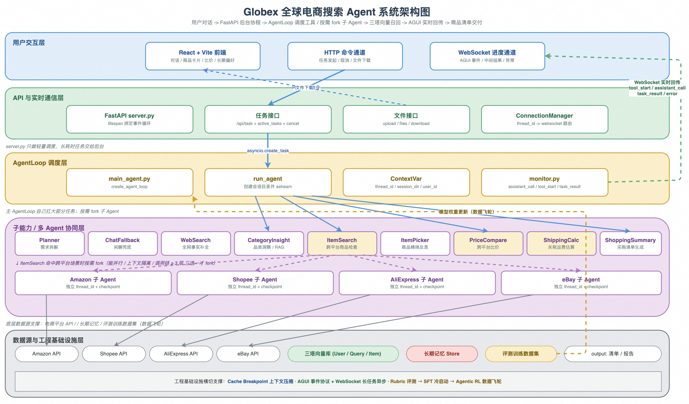

# 鸿蒙开发助手：前言

这份文档围绕「鸿蒙开发助手 Agent」项目展开，重点是把 Agent 工程能力放到 HarmonyOS / OpenHarmony 开发辅助场景里讲清楚。

如果你已经具备 LangChain / LangGraph 基础，或接触过 Coding Agent、旅游 Agent、通用客服 Agent 这类示例，这份文档的重点是：**把一个 Agent 项目从"能跑"推进到"具备生产化演进路径、可持续迭代"。**

「鸿蒙开发助手」要解决的问题不只是"让模型回答问题"，而是用 `AgentLoop + 多 Agent + 三塔召回 + 评测训练闭环` 一整套组合，搭一个面向 HarmonyOS / OpenHarmony 开发场景的对话式开发助手。用户输入"想实现 ArkUI 页面状态恢复方案"，系统能跨 HarmonyOS 官方文档、OpenHarmony 文档、示例工程、版本迁移说明同时检索，自动方案对比、算版本兼容，最后给一份带文档依据和验证步骤的修复建议。

**整个项目对外的代号叫 HarmonyDev。**



*HarmonyDev 系统架构图*

它可能还不是一个完整的生产系统，但可以作为一条完整工程链路来复盘。文档会围绕这些工程化概念展开：AgentLoop 范式、多 Agent fork 策略、Prompt Cache Breakpoint 上下文压缩、自我进化、 AGUI 事件协议、长期记忆 Store、Rubric 评测 + SFT/RL 实验规划的数据飞轮。这些能力放在一起，才构成一个能持续演进的 Agent 应用。

---

## 1 这套项目重点学什么

很多 Agent 示例会把问题简化成"接一个搜索 API 就能做 Agent"，这当然能跑，但离一个真实场景下能用的鸿蒙开发助手 还差很远。

在「鸿蒙开发助手」里，重点不是让模型说得更顺，而是解决这些更具体的工程问题：

- 一个开发问题什么时候该并行搜多个资料源，什么时候主 loop 自己处理就够了；

- 50 轮对话之后 token 怎么不爆掉，缓存命中率怎么不掉；

- 后端跑十几秒的长任务，前端怎么避免长时间无反馈、怎么实时看到 Agent 正在干什么；

- 用户上一轮说"不要使用废弃 API"，下一轮怎么让 Agent 还记得；

- 每天大量的 bad case 怎么不再靠 prompt 修，而是靠评测 + 训练把模型行为真正"对齐"；

- 外部大模型一升级线上就抖动，怎么把模型行为变得可控、可迭代。

所以，这套项目更像一条 **工程进阶线**：从 AgentLoop 的基本概念开始，逐步把 fork 策略、向量召回、上下文压缩、长期记忆、事件协议、评测训练一层层串起来，最后落到一个具备多源检索、可观测和可迭代能力的鸿蒙开发助手。

读完这份文档后，你应该能说清楚三件事：

1. AgentLoop 这种范式比传统 Workflow 强在哪，什么场景下值得用；

1. 多 Agent、向量召回、长期记忆、评测训练这些能力分别解决一个真实 Agent 项目里的哪类工程问题；

1. 一个对话式鸿蒙开发助手从用户问题到修复建议交付，中间到底经过了哪些层，每一层为什么必须存在。

---

## 2 这个项目最终做成什么样

从用户视角看，它是一个"会帮你查文档、读工程、诊断问题并生成补丁建议的开发助手"。

用户可以提出这样的任务：

```
我这个 ArkUI 页面从详情页返回后状态丢失了，目标 HarmonyOS 5.0，最好不要使用废弃 API，保持项目现有代码风格。
```

系统背后会按需做这些事：

1. Planner 拆解开发问题：目标 HarmonyOS 5.0、API 约束（不要使用废弃 API）、代码风格约束（项目现有代码风格）、Kit 领域（ArkUI 状态管理问题）；

1. APIInsight 调鸿蒙知识库，判断这个问题通常关联哪些 API、生命周期和状态管理方案；

1. DocSearch 触发多源文档并行 fork，HarmonyOS 官方文档 / OpenHarmony 文档 / 示例工程 / 版本迁移说明 同时搜；

1. 每个资料源的子 Agent 独立跑 DocSearch + CompatCheck（校验 API 版本和适用范围）；

1. 主 loop 合流后用 SolutionCompare 判断“哪条修复路径最稳”；

1. PatchPicker 按工程约束（不要使用废弃 API、项目现有代码风格）做二次筛选；

1. DevSummary 给一份带依据和验证步骤的修复方案；

1. 同时把"不要使用废弃 API""偏好项目现有代码风格"等开发者画像写入 Store，下次自动生效。

执行过程中，前端不是简单"等待中"，而是通过 **AGUI 事件协议 + WebSocket** 实时显示每一步：

```
Planner 正在拆解开发问题...
DocSearch 正在多源并行检索鸿蒙文档...
SolutionCompare 正在对比修复方案...
PatchPicker 已过滤掉若干条不兼容写法...
DevSummary 正在生成修复说明...
```

如果任务生成了文件（比如完整的修复方案报告），页面还会展示补丁和报告列表，用户可以直接下载。

---

## 3 章节怎么安排

这套项目分成两段。

**第一段是基础能力铺垫**，主要对应第 1 到 8 章。这一段把 AgentLoop 范式、多 Agent fork、向量召回、上下文压缩、长期记忆、AGUI、评测训练这些通用能力一个个讲清楚：

| 章节 | 重点 |
| --- | --- |
| 第 1 章 | 建立 AgentLoop 的定位：与 Workflow / ReAct / DeepAgents 的区别 |
| 第 2 章 | 跑通最小示例，理解 Think → Act → Observe → Reflect 循环 |
| 第 3 章 | 学会 fork 子 Agent 的三件事判断：并行 / 隔离 / 链深 |
| 第 4 章 | 理解 LLM 三塔召回，文档语义 + 工程上下文双通道解耦但联训 |
| 第 5 章 | 理解 Cache Breakpoint，破解"压缩越多缓存越掉"的死循环 |
| 第 6 章 | 理解长期记忆 Store，让 Agent 跨会话记得用户 |
| 第 7 章 | 理解 AGUI 事件协议 + WebSocket，让前端不再长时间无反馈 |
| 第 8 章 | 理解 Rubric 评测 → 高分轨迹沉淀 → SFT/RL 实验规划的数据飞轮闭环 |

**第二段是 HarmonyDev 项目主线**，主要对应第 9 到 15 章。把前面的能力放回到一个真实的鸿蒙开发助手项目里：

| 章节 | 重点 |
| --- | --- |
| 第 9 章 | 看清 HarmonyDev 最终项目目标、整体架构和工程目录 |
| 第 10 章 | 搭好 `.env`、模型配置、上下文管理、监控上报、路径工具等基础底座 |
| 第 11 章 | 实现多源文档检索子 Agent，接入HarmonyOS 官方文档 / OpenHarmony 文档 / 示例工程 / 版本迁移说明 |
| 第 12 章 | 实现修复方案对比 + 版本兼容估算子 Agent |
| 第 13 章 | 实现Kit 能力洞察子 Agent，准备 RAG 鸿蒙知识库 |
| 第 14 章 | 组装主 AgentLoop，把九个工具 + 多 Agent fork 协同串起来 |
| 第 15 章 | 用 LocalAgent Gateway + WebSocket/SSE + Web/DevEco 前端面板完成闭环 |

这样安排的好处是：前面 8 章沉淀通用能力，后面 7 章把这些能力放进 HarmonyDev 主链路里做集成验证。这样既能看清单点设计，也能解释完整链路为什么成立。

---

## 4 技术栈和学习重点

这个项目用到的技术不少，但每个技术都有明确位置。

| 模块 | 技术栈 | 在项目里的作用 |
| --- | --- | --- |
| Agent 范式 | AgentLoop（基于 LangGraph / DeepAgents 二次抽象） | 主智能体的核心循环：Think → Act → Observe → Reflect |
| 多 Agent 协同 | 子 Agent fork + 独立 thread_id + checkpoint | 多源并行检索 / 上下文隔离的深任务 |
| 模型与工具 | LangChain + `init_chat_model` | 统一封装大模型、工具声明、Runnable 兼容 |
| 向量召回 | 问题意图塔 + API 文档塔 + 工程上下文塔 + Hybrid 检索 | 跨语言多源API/代码片段向量召回，文档语义 + 工程上下文双通道 |
| 长期记忆 | Store（结构化开发者画像存储，可基于 Redis / Postgres） | 开发者画像 / 历史方案 / 禁用 API 跨会话持久化 |
| 上下文压缩 | Cache Breakpoint + 自定义压缩策略 | 让 50+ 轮对话不爆 token，同时保住 Prompt Cache 命中率 |
| 事件协议 | AGUI 事件流（tool_start / assistant_call / ...） | 前端实时可见 Agent 在做什么 |
| 本地服务 | LocalAgent Gateway（FastAPI / Uvicorn 可选）+ asyncio | 长任务异步、任务表登记、取消、文件与补丁接口 |
| 实时通信 | WebSocket + ConnectionManager | 按 thread_id 路由事件到对应前端 |
| 操作界面 | React/Vite Web 控制台 / DevEco Tool Window | 对话框、AGUI 事件可视化、补丁卡片、开发者画像面板 |
| 评测体系 | Rubrics as Rewards（动态可信度细则） | 每条 query 动态生成 P0/P1/P2 可信度细则，自动 judge |
| 训练规划 | SFT / Agentic RL（后续规划） | 当前口径只讲评测闭环和高分轨迹沉淀，不宣称已上线 RL 训练链路 |
| 环境管理 | uv / Python 3.10 | 管理依赖与虚拟环境 |

你不需要把每个技术都学到很深才开始。更好的方式是：先看它在项目链路里解决什么问题，再回到对应章节看实现细节。

---

## 5 这套项目不刻意覆盖什么

「鸿蒙开发助手」适合工程化实践阶段学习，但它不是完整 IDE 级开发平台。

当前版本重点覆盖的是 Agent 主链路：

```
对话式开发问题理解
  -> 多 Agent 并行 / 串行调度
  -> 多源文档检索 + 方案对比 + 版本兼容
  -> 三塔召回（文档语义 + 工程上下文）
  -> 长期记忆与偏好持久化
  -> AGUI 实时事件回传
  -> 评测 + 训练数据飞轮
```

有些IDE 工程级能力没有展开，比如：

- DevEco Studio 深度插件权限、团队账号体系与私有仓库授权；

- 补丁自动应用 / CI 校验 / Merge Request 闭环；

- 多 HarmonyOS 版本 API 兼容矩阵与迁移策略；

- 页面截图视觉理解 / 多模态检索；

- 私有仓库权限、代码安全扫描、离线环境适配；

- 官方文档版本同步与索引一致性；

- 用户隐私合规（GDPR / CCPA）；

- 大规模 RL 训练所需的分布式集群与 reward model 服务。

这些能力都重要，但不适合一开始全部放进来。第一版先把 **Agent 主链路 + 工程基础设施** 讲清楚，后面可以再逐层扩展，会更容易学，也更容易改。

---

## 6 项目目录结构

最终项目的主要结构如下：

```
harmonydev-agent/
├── app/                         # 后端源码主目录
│   ├── agent/                   # AgentLoop 主体与子 Agent 配置
│   │   ├── sub_agents/          # 多源子 Agent、Kit 能力洞察子 Agent 等
│   │   ├── llm.py               # 大模型初始化
│   │   ├── main_agent.py        # 主 AgentLoop 组装与 run_agent 执行入口
│   │   └── prompts.py           # 读取提示词配置
│   ├── api/                     # FastAPI 接口层、上下文和 AGUI 实时推送
│   │   ├── context.py           # ContextVar 保存 thread_id / session_dir
│   │   ├── monitor.py           # AGUI 事件统一封装（tool_start / assistant_call ...）
│   │   └── server.py            # 任务、取消、上传、文件、WebSocket 接口
│   ├── tools/                   # 九大工具实现（Planner / DocSearch / SolutionCompare ...）
│   ├── recall/                  # LLM 三塔召回客户端
│   ├── memory/                  # 长期记忆 Store 封装
│   ├── compress/                # Cache Breakpoint 上下文压缩策略
│   ├── eval/                    # Rubric 评测体系与训练数据采集
│   └── output/                  # 每个会话生成的补丁 / 报告
├── web-console/                    # Web 控制台 / DevEco 插件项目
├── docker/                      # 本地服务（向量库、Redis 等）的 Docker Compose
├── examples/                    # 1 到 8 章对应的能力示例脚本
├── tests/                       # 工具、连接管理、取消任务等测试
├── pyproject.toml               # Python 项目配置
└── requirements.txt             # 依赖建议列表
```

---

## 7 建议怎么学

如果你是第一次接触 AgentLoop 范式，不建议直接从最终版的 `main_agent.py` 开始看。它背后依赖了多 Agent fork、上下文压缩、长期记忆、AGUI、ContextVar、monitor、异步流式执行——一上来就读会被淹没。

更稳的顺序是：

```
先看第 1 章，知道 AgentLoop 解决什么问题
  -> 跑第 2 章，熟悉 Think → Act → Observe → Reflect 循环
  -> 看第 3 章，掌握子 Agent fork 三件事判断
  -> 看第 4 到 8 章，依次理解召回 / 压缩 / 记忆 / AGUI / 评测训练
  -> 从第 9 章进入真实 HarmonyDev 项目
  -> 第 10 章看懂工程底座（配置、上下文、监控）
  -> 第 11 到 13 章实现三个多源子 Agent
  -> 第 14 章组装主 AgentLoop 和多 Agent 协同
  -> 第 15 章接上 LocalAgent Gateway + WebSocket/SSE + Web/DevEco 前端
```

---

接下来进入「鸿蒙开发助手」的项目主线。

后面的内容会按照 **"AgentLoop 范式 → 多 Agent 协同 → 三塔召回 → 上下文压缩 → 长期记忆 → AGUI 事件协议 → 评测训练闭环 → HarmonyDev 项目工程初始化 → 多源子 Agent → 主 AgentLoop 组装 → LocalAgent 与 Web/DevEco 前端闭环"** 这条主线，逐步把整套项目拆开讲清楚。

读完这份文档后，你收获的不只是"跑通了一个鸿蒙开发助手 Demo"，而是能说清楚：一个工业级的 Agent 应用为什么要这样设计，AgentLoop、向量召回、长期记忆、AGUI、评测训练在一条完整业务链路里分别解决什么问题，以及当评审追问"为什么这条链路这么慢 / 这么贵 / 这么不稳"时，你能定位该从哪一层优化。
