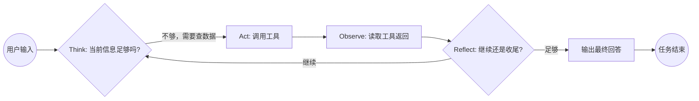

# 01 AgentLoop范式与鸿蒙开发助手 Agent核心概念

> 面试口径：HarmonyDev 是服务 HarmonyOS / OpenHarmony 开发的 AI 开发助手；系统实现主体是 Python Agent 后端 + LocalAgent Gateway + Web/DevEco 面板，不要求运行在鸿蒙设备上。鸿蒙相关内容是被服务的开发对象，包括 ArkTS、ArkUI、Ability、Stage 模型、构建日志和官方文档。


**模块目标：**

- 建立对 AgentLoop 范式的定位：它和传统 Workflow、ReAct 的关系与区别。

- 理解 AgentLoop 的核心循环：Think → Act → Observe → Reflect，以及它为什么适合鸿蒙开发助手场景。

- 初步认识 HarmonyDev 项目里的九个工具、四个核心约束，以及它们在 AgentLoop 循环中的位置。

**阅读重点：** 这一章不写代码，先建立概念地图。建议边读边画一条线：用户输入进来 → 主 AgentLoop 做了什么判断 → 调了哪个工具 → 观察结果后决定继续还是收尾。这条线画清楚了，后面的代码和工程就有框架可挂。

---

## 1、本章导读

### 1.1 先看清这章在整体中的位置

在前言里我们提到，这套项目分成两段：第 1 到 8 章是能力铺垫，第 9 到 15 章是 HarmonyDev 项目主线。

本章是第一段的起点。它的作用是回答一个最基本的问题：**HarmonyDev 项目里的"智能体"到底按什么方式运行？**

如果你之前用过 LangChain 的 Agent 或 LangGraph 的 StateGraph，可能会觉得"不就是让模型调工具吗"。这个理解没错，但还不够。AgentLoop 比"模型调工具"多了两件事：

1. 它不是调一次就结束，而是持续循环，直到自己判断"信息够了，可以收尾"。

1. 它能在循环过程中 fork 出自己的同质副本，让副本去处理子任务，自己继续主线。

这两点决定了后面所有章节的设计基础。

### 1.2 本章先做什么，不做什么

本章完成的是：

1. 搞清楚 AgentLoop 的核心循环长什么样。

1. 对比同类方案，知道它"强在哪"和"适合什么场景"。

1. 看一遍九个工具的全貌，建立分工印象。

暂时不碰的是：

- 环境搭建和依赖安装（下一章）。

- 具体代码怎么写、stream 怎么读（下一章）。

- 多 Agent fork 的三件事判断（第 3 章）。

---

## 2、什么是 AgentLoop

### 2.1 核心循环：Think → Act → Observe → Reflect

AgentLoop 是一种让模型"持续工作到任务完成"的执行范式。它的核心循环可以用四个词概括：

| 阶段 | 做什么 |
| --- | --- |
| Think | 分析当前状态，决定下一步该调用哪个工具、还是直接回答 |
| Act | 执行工具调用（如 DocSearch / SolutionCompare），拿到工具返回结果 |
| Observe | 读取工具返回的内容，评估信息是否足够 |
| Reflect | 判断：信息够了就走 Summary 收尾；不够就回到 Think 继续规划下一步 |

这个循环不是固定执行一次，而是**可以反复进行**。一次完整的用户任务，可能经历 3 到 10+ 次循环，直到主 AgentLoop 自己决定"够了"。



### 2.2 和"单次工具调用"的区别

传统的"LLM + 工具调用"通常是这样的：

```
用户提问 → 模型决定调一个工具 → 拿到结果 → 直接输出
```

这种方式适合简单查询（"今天天气怎么样"），但不适合复杂任务。比如用户说"帮我对比一套 ArkUI 状态管理修复方案"，模型需要：

1. 先拆解需求（API 约束、版本约束、Kit 领域）；

1. 再多源资料检索；

1. 搜完之后还要方案对比、做兼容性检查；

1. 最后才能给出建议列表。

如果只调用一次工具就结束，根本完不成这个链路。AgentLoop 让模型可以"想多少步就走多少步"，自己判断终止条件。

### 2.3 AgentLoop 不是一个框架名，是一种范式

需要澄清的一点：AgentLoop 不是某个具体的开源库。它是一种**设计范式**——你可以基于 LangChain、甚至纯 OpenAI SDK 实现它。

在 HarmonyDev 项目里，我们基于 LangChain 的底层能力（检查点、状态图、工具声明）来实现 AgentLoop 范式。但后面讲的所有概念（Think/Act/Observe/Reflect、fork 同质子 Agent、thread_id 隔离）都是**范式层的设计**，不绑定任何特定框架。

---

## 3、AgentLoop 的实现方案对比

上一节说了 AgentLoop 是一种范式。但要把它落到代码里，你需要一个"执行引擎"——也就是承载 Think → Act → Observe → Reflect 这个循环的运行时架构。

AgentLoop 最基础的形式就是一个 `while` 循环：模型输出 → 调工具 → 拿结果 → 再输出，串行到底。这在 demo 里够用，但进了生产环境，会撞上三个现实问题：**需要并行、需要断点续传、需要多 Agent 协同**。

所以，真正能让 AgentLoop 范式落地的，是下面这四类运行时架构。它们不是"替代 AgentLoop"，而是**用不同的工程手段承载同一套思考逻辑**。

### 3.1 四类运行时架构对比

| 架构 | 代表框架 | 核心机制 | 适合场景 |
| --- | --- | --- | --- |
| 状态图 / 有限状态机 | LangGraph、XState | 节点 + 边，支持分支、并行、持久化断点 | 多步骤工作流、人机协作审批流 |
| 事件驱动 / 消息总线 | AutoGen、CrewAI | 发布/订阅，Agent 间异步解耦通信 | 多 Agent 辩论/协作、实时对话集群 |
| 规划-执行分离 | Plan-and-Solve、LATS | Planner 拆任务 → Executor 逐步执行，可纠错重规划 | 复杂研究任务、跨系统集成 |
| 基于规则的流水线 | Dify Workflow、Coze Bot Flow | 预定义 DAG，LLM 作为黑盒节点被调用 | 通用客服 SOP、数据 ETL、标准化业务 |

### 3.2 为什么 HarmonyDev 选 LangChain（状态图路线）

回到本项目的实际技术栈：四类架构中，HarmonyDev 走的是 **状态图路线**，具体技术选型是 **LangChain + LangGraph**。

这个选择不是拍脑袋，而是和另外三类架构逐一比较后的取舍：

**（1）为什么不用事件驱动（AutoGen / CrewAI）？**

事件驱动架构的强项是"多 Agent 松耦合协作"——每个 Agent 独立运行、通过消息总线通信，适合 Agent 数量多且互不依赖的场景。但 HarmonyDev 的开发任务链路是**强顺序依赖**的：必须先查 API/代码片段、再方案对比、再筛选、最后出建议列表。用事件驱动意味着要把这条链拆成一堆异步消息，编排复杂度反而更高，而且断点续传和人工审批需要额外自建基础设施。

**（2）为什么不用规划-执行分离（Plan-and-Solve / LATS）？**

规划-执行架构的核心是"先把完整计划列出来，再逐步执行"，适合科研、代码生成这类任务。但鸿蒙开发助手的关键难点不是"拆不出计划"——用户说"实现ArkUI 状态管理问题"，计划本身就几句话——而是在**执行过程中碰到的硬约束**：搜索结果里有 大量废弃写法、某个资料源没有版本覆盖、目标版本与候选 API 不兼容。这些信息只有执行到那一步才能知道，预先列计划没有意义。AgentLoop 的 Reflect 阶段更能应对这种"边走边看"的场景。

**（3）为什么不用基于规则的流水线（Dify / Coze）？**

流水线架构的确定性确实适合标准化业务，但 HarmonyDev 要求用户自由输入"ArkUI 页面状态恢复方案，不要使用废弃 API，喜欢项目现有代码风格"——这种开放式的开发问题无法预定义为固定 DAG。如果硬用流水线做，每多一种偏好组合就要画一条分支，维护成本会随需求复杂度指数增长。

**（4）为什么选 LangChain + LangGraph（状态图路线）？**

排除了以上三类，状态图路线最适合 HarmonyDev，具体落地为 LangChain + LangGraph 组合：

- **LangChain** 负责上层抽象：统一大模型接入（`init_chat_model`）、工具声明与绑定、Runnable 链式组合、消息格式标准化。

- **LangGraph** 是 LangChain 生态中专门做状态图的子项目，负责底层执行引擎：循环控制、状态持久化（checkpoint）、条件分支、并行调度。

可以这样理解：**LangChain 写 Agent 的"零件"（模型、工具、提示词），LangGraph 写 Agent 的"骨架"（循环、分支、断点恢复）**。

选这套组合有三个直接理由：

1. **状态图天然契合 AgentLoop**：Think → Act → Observe → Reflect 每一轮天然映射为 LangGraph 的节点 + 条件边。fork 子 Agent 时，每个子 Agent 有自己的 `thread_id` + checkpoint，状态完全隔离，并行搜索多个资料源直接用图的并发语义表达。

1. **生态统一**：工具定义（`@tool`）和状态图定义在同一个生态里，不需要桥接层。模型接入、提示词模板、输出解析都是一套 API——这意味着项目实现不需要在多个框架间来回切换。

1. **生产可用**：checkpoint 持久化支持中断恢复和人工审批，断点续传能力是直接用 `while` 循环做不到的。

---

## 4、为什么鸿蒙开发助手需要 AgentLoop

### 4.1 传统搜索的三大瓶颈

在前言里提过，传统鸿蒙开发助手存在三个老大难：

| 瓶颈 | 具体表现 | 根因 |
| --- | --- | --- |
| 语义浅 | 用户说"低改动的 ArkUI 状态恢复方案"，系统只能关键词匹配 | 没有拆解需求的能力 |
| ID 稀疏 | 长尾 API/代码片段、新版本 API、多源 API/代码片段缺乏行为数据 | 协同信号不足 |
| 个性化与相关性打架 | 想推个性化的API/代码片段，但推出来跟 query 不相关 | 两个目标各自优化，缺乏统一决策 |

### 4.2 HarmonyDev 怎么解决

这三个瓶颈不是单靠 AgentLoop 一层就能搞定的。HarmonyDev 的整体解法是**决策层（AgentLoop）+ 召回层（三塔召回 / 语义搜索）**两层配合——AgentLoop 负责怎么规划、怎么调度、怎么纠错；三塔召回负责每一次检索本身的语义理解和个性化匹配（具体见第 4 章）。

| 瓶颈 | 决策层：AgentLoop 怎么做 | 召回层：三塔召回 / 语义搜索怎么做 |
| --- | --- | --- |
| 语义浅 | Think 阶段：Planner 工具拆解用户自然语言，提取结构化约束 | 问题意图塔把自然语言编码成语义向量，"状态保存"和"状态容器"在向量空间里相邻，不再依赖字面关键词 |
| ID 稀疏 | Act 阶段：fork 多源并行检索只是扩大候选**来源**，解决不了“无行为数据”这个根因（治标） | **这里才是治本**：API 文档塔用API/代码片段内容特征（标题 / 类目 / 约束 / 描述）编码，长尾、新品、跨语言API/代码片段没有行为 ID 也能进向量库被召回 |
| 个性化打架 | Reflect 阶段：PatchPicker 工具基于用户开发者画像做二次筛选，兼顾两者 | 工程上下文塔把开发者画像编码成向量，与 问题意图向量在召回阶段就联合打分，而不是事后再打补丁 |

简单说：**AgentLoop 让"搜索"从一个一步到位的管道，变成了一个可以反复规划、反复调整的循环；三塔召回让循环里的每一次检索本身就带着语义理解和个性化偏好。** 两者缺一不可——只有 AgentLoop 没有语义召回，决策再好底层也只是关键词匹配；只有语义召回没有 AgentLoop，单轮命中再准也搞不定修复方案对比、约束补全这种多步任务。

---

## 5、一个最小的 AgentLoop 概念模型

不看代码，先用伪代码描述 AgentLoop 的最小模型：

```python
# 伪代码：AgentLoop 最小概念模型
def agent_loop(user_query, tools, system_prompt):
    messages = [system_prompt, user_query]

    while True:
        # Think: 模型根据当前消息历史做决策
        response = llm.generate(messages)

        if response.is_final_answer():
            # Reflect 判断：信息足够，直接输出
            return response.content

        if response.has_tool_call():
            # Act: 执行工具调用
            tool_name = response.tool_call.name
            tool_args = response.tool_call.arguments
            result = tools[tool_name].execute(tool_args)

            # Observe: 把工具结果追加到消息历史
            messages.append(response)          # 模型的工具调用请求
            messages.append(tool_result(result))  # 工具返回的结果

            # Reflect: 下一轮循环开始时，模型会看到工具结果，再次 Think
            continue
```

这段伪代码里有三个关键点：

1. `while True`：循环不是外部控制的，是模型自己决定什么时候 break（通过 `is_final_answer()`）。

1. **消息历史不断追加**：每次工具调用的结果都会成为下一轮 Think 的输入。

1. **没有预设步骤数**：模型可以调 1 次工具就结束，也可以调 10 次。

---

## 6、九个工具在 AgentLoop 中的位置

HarmonyDev 项目里，主 AgentLoop 可以调用九个工具。这些工具不是"子智能体"，它们是主 loop 循环里的"行动选项"。

| 工具名 | 归属 | 什么时候被主 loop 调用 |
| --- | --- | --- |
| Planner | 内部 | Think 阶段判断"需求复杂，需要拆解"时 |
| ChatFallback | 内部 | Think 阶段判断"这不是开发问题，是闲聊"时 |
| WebSearch | 外部 | Think 阶段判断"需要外部事实补全"时 |
| APIInsight | 外部 | Think 阶段判断"需要Kit 领域趋势 / API 文档卡片"时 |
| DocSearch | 外部 | Think 阶段判断"需要检索API/代码片段"时 |
| PatchPicker | 内部 | Reflect 阶段判断"搜回来的API/代码片段需要二次筛选"时 |
| SolutionCompare | 外部 | Reflect 阶段判断"需要修复方案对比"时 |
| CompatCheck | 外部 | Act 阶段计算"版本兼容"时（通常和 DocSearch 配合） |
| DevSummary | 内部 | Reflect 阶段判断"信息足够，可以生成修复建议列表"时 |

这里有两个容易混的点：

- **内部工具**不需要调外部 API，靠模型自身能力完成（如 Planner 本质是结构化输出、PatchPicker 本质是偏好过滤）。

- **外部工具**需要调用真实的搜索引擎、方案对比接口或 RAG 知识库。

不需要现在记住每个工具的细节。后面第 11-13 章会逐个实现它们。这里只需要知道：**主 AgentLoop 在每一轮 Think 时，会从这九个选项中挑一个（或不挑，直接回答）。**

---

## 7、AgentLoop 的四个核心约束

每一个 AgentLoop 实例（无论是主 Agent 还是 fork 出来的子 Agent）都有四个核心约束：

| 约束 | 作用 | 类比 |
| --- | --- | --- |
| `thread_id` | 当前会话的唯一标识，串起 WebSocket / 任务表 / 检查点 / 文件目录 | 身份证号 |
| `checkpoint` | 保存当前执行到第几轮、消息历史是什么，支持断点恢复 | 存档点 |
| `tool_set` | 这个 AgentLoop 实例可以调用的工具集合 | 工具箱 |
| `system_prompt` | 指导模型行为的系统提示词，定义了"你是谁、你该怎么做" | 角色说明书 |

关键理解：**当主 AgentLoop fork 出一个同质子 Agent 时，子 Agent 会获得独立的 **`thread_id`** 和 **`checkpoint`**，但共享同一套 **`tool_set`** 和 **`system_prompt`**。** 这就是"同质"的含义——它们是主 Agent 的完整克隆，只是执行上下文独立。

---

**本章小结：**

到这里，你应该对 AgentLoop 有了一个完整的概念印象：

1. AgentLoop 是一种让模型"持续循环直到任务完成"的执行范式，核心是 Think → Act → Observe → Reflect 循环。

1. 将 AgentLoop 落到工程里，HarmonyDev 选的是 LangChain（上层零件）+ LangGraph（底层状态图循环），这套组合既保留了 AgentLoop 的灵活性，又获得了并行、断点续传、多 Agent 隔离等生产级能力。

1. 鸿蒙开发助手之所以需要 AgentLoop，是因为复杂的开发问题无法一步到位，需要反复规划、检索、比较、筛选。

1. 九个工具是主 loop 循环中的"行动选项"，不是独立的子智能体。

1. 每个 AgentLoop 实例有四个核心约束：`thread_id`、`checkpoint`、`tool_set`、`system_prompt`。

下一章「[AgentLoop 快速入门与多轮工具调用](<04-02 AgentLoop快速入门与多轮工具调用.md>)」会搭建环境、跑通第一个 AgentLoop 示例，你会真正看到 Think → Act → Observe → Reflect 在代码里是怎么发生的。
