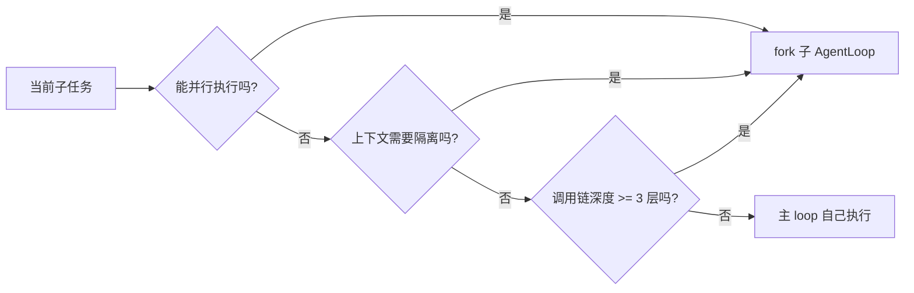
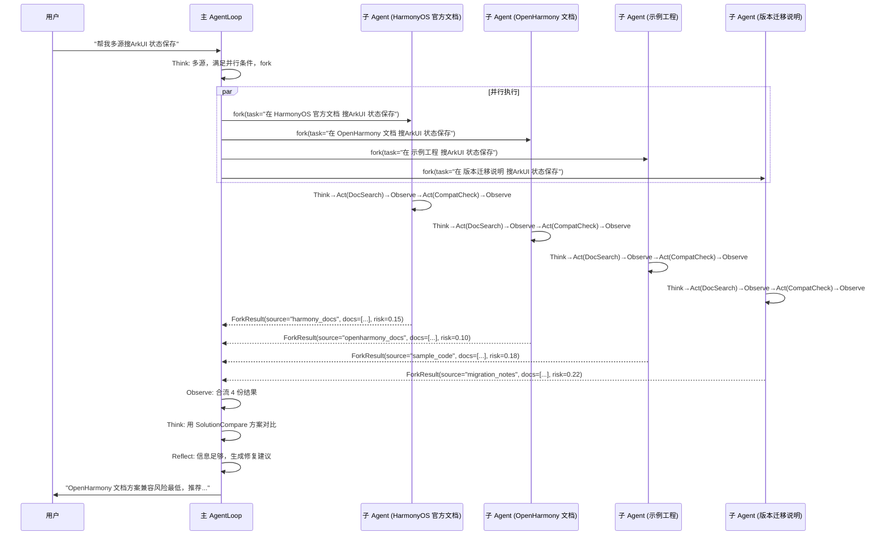

# 03-0 主AgentLoop按需fork同质子AgentLoop的策略与三件事判断

> 面试口径：HarmonyDev 是服务 HarmonyOS / OpenHarmony 开发的 AI 开发助手；系统实现主体是 Python Agent 后端 + LocalAgent Gateway + Web/DevEco 面板，不要求运行在鸿蒙设备上。鸿蒙相关内容是被服务的开发对象，包括 ArkTS、ArkUI、Ability、Stage 模型、构建日志和官方文档。


**模块目标：**

- 理解为什么单个 AgentLoop 不够用：上下文污染、串行等待、调用链过深三大瓶颈。

- 掌握"同质子 AgentLoop"的核心概念：它是主 Agent 的完整克隆，不是预设的特定职能 Agent。

- 学会三件事判断：什么时候该 fork、什么时候主 loop 自己扛。

**阅读重点：** 本章是整个 HarmonyDev 多 Agent 架构的设计核心。建议重点理解"三件事判断"那张决策流程图——后面所有涉及多 Agent 的章节都在这个框架内做决定。如果你只能记住一件事，记住：**不是越多 Agent 越好，fork 有成本，满足条件才 fork。**

---

## 1、本章导读

上一章跑通了单 AgentLoop 的多轮循环。你可能已经注意到一个问题：如果模型要多源搜同一个开发问题，按上一章的方式，它只能顺序调用 4 次 `doc_search`——串行等待，效率很低。

更深层的问题是：如果某个子任务需要读取十几份版本迁移说明（比如用户说"帮我对比三个 API 在 HarmonyOS 5.0 的兼容差异"），这些原文全部追加到主 loop 的消息历史里，会严重污染原本"在修 ArkUI 状态管理问题"的对话上下文。

这两个问题指向同一个解法：**让主 AgentLoop fork 出自己的副本，去独立执行子任务。**

---

## 2、为什么单个 AgentLoop 不够用

### 2.1 三大瓶颈

| 瓶颈 | 场景示例 | 后果 |
| --- | --- | --- |
| 上下文污染 | 读取十几份版本迁移说明追加到主 loop | 主 loop 原本的"ArkUI 状态管理问题"话题被淹没 |
| 串行等待 | 顺序搜HarmonyOS 官方文档 → OpenHarmony 文档 → 示例工程 → 版本迁移说明 | 30 秒才能拿到全部结果 |
| 调用链过深 | 查官方文档 → 查版本说明 → 查本地调用点 → 生成补丁 → 跑验证（5 层工具调用） | 消息历史膨胀，模型注意力分散 |

### 2.2 单 loop 的极限在哪

单 AgentLoop 适合处理的任务特征：

```
- 单一目标
- 2-3 次工具调用就能完成
- 中间结果不会严重膨胀上下文
- 不需要并行
```

一旦任务超出这些特征，就需要 fork。

---

## 3、"同质子 AgentLoop"到底是什么

### 3.1 核心概念

当主 AgentLoop 判断某个子任务需要独立处理时，它会 **fork 出一个自己的完整克隆**：

```
主 AgentLoop（主体）
  ├─ tool_set: [Planner, DocSearch, SolutionCompare, CompatCheck, ...]
  ├─ system_prompt: "你是 HarmonyDev 鸿蒙开发助手..."
  ├─ thread_id: "main-001"
  └─ checkpoint: 第 5 轮循环

fork 出的子 AgentLoop（克隆）
  ├─ tool_set: [Planner, DocSearch, SolutionCompare, CompatCheck, ...]  ← 完全相同
  ├─ system_prompt: "你是 HarmonyDev 鸿蒙开发助手..."                          ← 完全相同
  ├─ thread_id: "sub-001-harmony_docs"                                       ← 独立
  └─ checkpoint: 第 0 轮（全新开始）                                    ← 独立
```

关键理解：

- **同质**：子 Agent 和主 Agent 拥有完全相同的 `tool_set` 和 `system_prompt`。它不是一个"弱化版"或"特定职能版"的 Agent。

- **独立**：子 Agent 有自己的 `thread_id` 和 `checkpoint`，执行过程中产生的消息历史不会回到主 loop。

- **收敛**：子 Agent 完成任务后，只把最终结果以结构化 schema 的形式回传给主 loop。

### 3.2 和"主从异构子智能体"的区别

在传统的异构多 Agent 项目里，子智能体通常是异构的——每个子智能体有不同的工具集和 system_prompt（网络搜索助手只有 Tavily，数据库助手只有 SQL 工具）。

HarmonyDev 的设计不同：

| 维度 | 传统异构方案 | HarmonyDev（同质 fork） |
| --- | --- | --- |
| 子 Agent 工具集 | 各自不同（按职能分配） | 和主 Agent 完全相同 |
| 子 Agent 数量 | 固定 3 个（预先定义） | 动态（按需 fork，可以是 1 个也可以 10 个） |
| 决策权归属 | 主智能体选择调哪个子智能体 | 主 loop 决定"fork 几个，每个做什么" |
| 递归能力 | 不支持（子不能再派子） | 支持（子 Agent 也可以继续 fork） |

---

## 4、三件事判断：什么时候该 fork

### 4.1 决策流程

主 AgentLoop 在每轮 Think 阶段，除了判断"调哪个工具"，还要判断"要不要 fork"。判断依据是三件事：



**三个条件满足任意一个，就 fork。否则主 loop 自己扛。**

### 4.2 三件事详解

| 判断条件 | 什么意思 | 典型场景 |
| --- | --- | --- |
| 能并行执行 | 多个子任务之间没有依赖关系，可以同时跑 | 同时在 4 类资料源搜同一个开发问题 |
| 上下文需要隔离 | 子任务会产生大量中间数据，塞回主 loop 会污染对话上下文 | 读取十几份版本迁移说明做兼容对比 |
| 调用链深度 >= 3 层 | 子任务本身需要 3 次以上工具调用才能完成，消息历史会膨胀 | 查官方文档 → 查版本说明 → 查本地调用点 → 生成补丁 → 跑验证 |

### 4.3 主 loop 自己扛的场景

| 场景 | 为什么不 fork |
| --- | --- |
| 澄清追问 | 只需要生成一段话，不调工具 |
| 单次工具调用 | 一次 Think → Act → Observe 就够了 |
| Summary 生成 | 基于已有信息整理输出，不需要额外检索 |
| 闲聊兜底 | ChatFallback 直接回复，不需要独立上下文 |

这些场景 fork 的成本（创建实例 + 等待启动 + schema 回传）高于收益。

---

## 5、fork 的工程实现：通过 dispatch_tool 触发

### 5.1 核心机制：dispatch_tool

fork 不是主 loop 手动创建子 Agent 实例——它是通过一个叫 `dispatch_tool` 的工具触发的。主 AgentLoop 在 Think 阶段判断"这个子任务需要独立执行"时，会调用 `dispatch_tool`，把子任务的需求描述传进去。`dispatch_tool` 内部负责：

1. fork 一个同质的 AgentLoop 实例（相同的 tool_set + system_prompt）；

1. 把 demands 作为用户输入交给子 Agent 执行；

1. 等子 Agent 跑完后，只返回结构化结果给主 loop。

从主 loop 的视角看，`dispatch_tool` 就是一个普通工具——"我调了一个工具，拿到了结果"。但它内部实际上是启动了一个完整的 AgentLoop 去完成任务。

```python
from langchain_core.tools import tool
from app.agent.llm import get_llm
from langgraph.prebuilt import create_react_agent

# 全局工具集和 system_prompt（主/子 Agent 共享）
FULL_TOOL_SET = [...]  # 九个工具
SYSTEM_PROMPT = "你是 HarmonyDev 鸿蒙开发助手..."

@tool
async def dispatch_tool(demands: str) -> str:
    """将一个子任务派给独立的 AgentLoop 执行。

    适用场景：
    - 子任务可以并行执行（如多源搜索）
    - 子任务会产生大量中间数据，需要上下文隔离
    - 子任务调用链深度 >= 3 层

    Args:
        demands: 子任务的自然语言描述，如"在HarmonyOS 官方文档搜索ArkUI 状态保存，并计算版本兼容"
    """
    from uuid import uuid4

    # fork 同质子 AgentLoop
    sub_agent = create_react_agent(
        model=get_llm(),
        tools=FULL_TOOL_SET,
        prompt=SYSTEM_PROMPT,
    )

    # 独立的 thread_id，上下文完全隔离
    sub_thread_id = f"sub-{uuid4().hex[:8]}"
    config = {"configurable": {"thread_id": sub_thread_id}}

    # 子 Agent 执行任务
    result = await sub_agent.ainvoke(
        {"messages": [("user", demands)]},
        config=config,
    )

    # 只返回最终回答，不回传中间消息历史
    final_message = result["messages"][-1].content
    return final_message
```

### 5.2 主 loop 视角：dispatch_tool 和其他工具没有区别

对主 AgentLoop 来说，`dispatch_tool` 和 `doc_search`、`solution_compare` 在接口层面完全一致——都是"传入参数，返回字符串"。区别只在内部实现：

| 工具 | 内部实现 | 主 loop 看到的 |
| --- | --- | --- |
| `doc_search` | 直接调用搜索 API，返回API/代码片段列表 | 传入 query，返回API/代码片段结果 |
| `solution_compare` | 直接调用方案对比 API，返回实现成本 | 传入API/代码片段名，返回实现成本结果 |
| `dispatch_tool` | fork 一个完整的 AgentLoop 去执行任务 | 传入 demands，返回任务结果 |

这种设计的好处是：**主 loop 不需要"知道"自己在 fork**。它只是在 Think 阶段判断"这个子任务比较复杂，交给 dispatch_tool 去处理"。至于 dispatch_tool 内部是怎么实现的（fork 了一个完整的 AgentLoop），主 loop 不关心。

### 5.3 并行 fork：主 loop 一次调用多个 dispatch_tool

当主 loop 判断"需要同时在 4 类资料源搜索"时，它会在同一轮 Think 中生成多次 `dispatch_tool` 调用（或通过 `parallel_dispatch_tool` 变体一次性提交多个 demands）：

```python
@tool
async def parallel_dispatch_tool(demands_list: list[str]) -> str:
    """并行派发多个子任务给独立的 AgentLoop 执行。

    Args:
        demands_list: 多个子任务的描述列表
    """
    import asyncio
    from uuid import uuid4

    async def run_one(demands: str) -> str:
        sub_agent = create_react_agent(
            model=get_llm(),
            tools=FULL_TOOL_SET,
            prompt=SYSTEM_PROMPT,
        )
        config = {"configurable": {"thread_id": f"sub-{uuid4().hex[:8]}"}}
        result = await sub_agent.ainvoke(
            {"messages": [("user", demands)]},
            config=config,
        )
        return result["messages"][-1].content

    # 并行执行所有子任务
    results = await asyncio.gather(*[run_one(d) for d in demands_list])
    return "\n---\n".join(results)
```

主 loop 的视角：

```
Think: 需要多源资料检索，调用 parallel_dispatch_tool
Act: parallel_dispatch_tool(demands_list=[
    "在HarmonyOS 官方文档搜索ArkUI 状态保存并计算版本兼容",
    "在 OpenHarmony 文档 搜索ArkUI 状态保存并计算版本兼容",
    "在示例工程搜索ArkUI 状态保存并计算版本兼容",
    "在 版本迁移说明 搜索ArkUI 状态保存并计算版本兼容"
])
Observe: 拿到 4 份资料源结果
Think: 用 SolutionCompare 方案对比...
```

### 5.4 主 loop 合流

主 loop 拿到 `dispatch_tool` / `parallel_dispatch_tool` 的返回值后，它只是一段精简的结构化文本，而不是子 Agent 执行过程中的 20+ 条消息历史。这就是"上下文隔离"的价值。

---

## 6、多源并行检索案例

用时序图展示完整的 fork 过程：



注意几个关键点：

1. 四个子 Agent 是**并行**执行的（`asyncio.gather`），不是顺序串行。

1. 每个子 Agent 内部自主完成了 2 次工具调用（DocSearch + CompatCheck），主 loop 不需要关心子 Agent 内部怎么规划。

1. 子 Agent 回传的是结构化的 `ForkResult`，不是原始消息历史。

1. 主 loop 合流后继续自己的 Think → Reflect 循环。

---

## 7、主 loop 自己扛 vs fork 的成本对比

| 场景 | 处理方式 | 原因 |
| --- | --- | --- |
| 多源搜同一API/代码片段 | fork 4 个 | 满足"能并行"，30s → 8s |
| 对比 3 个 API/代码片段的版本兼容说明 | fork 1 个 | 满足"上下文隔离"，十几页说明不污染主 loop |
| 用户追问"第二个方案风险在哪" | 主 loop 自己 | 单次工具调用，fork 反而更慢（创建实例有开销） |
| 用户说"不要了谢谢" | 主 loop 自己 | 闲聊兜底，一句话搞定，fork 零收益 |
| 查 API/代码片段 → 查版本说明 → 查示例代码 → 做兼容性检查 | fork 1 个 | 调用链 >= 3 层，中间结果会膨胀主 loop 上下文 |

**核心原则：fork 有成本（创建实例 + 网络往返 + 结果解析），只有收益大于成本时才 fork。**

---

## 8、常见误区

### 8.1 误区一：每个工具调用都 fork 一个子 Agent

错。大部分工具调用都是"单次 Think → Act → Observe"就搞定的事，主 loop 自己调比 fork 快得多。

### 8.2 误区二：子 Agent 应该有不同的工具集

错（在 HarmonyDev 架构里）。同质 fork 的核心价值是**统一和弹性**——子 Agent 和主 Agent 有完全相同的能力，只是执行上下文独立。如果你给子 Agent 减配工具集，它遇到意外情况就没法灵活应对。

### 8.3 误区三：fork 越多越快

不一定。每个 fork 都有创建实例、建立 checkpoint、执行推理、回传结果的开销。如果子任务本身只需要 1 秒完成，fork 的开销可能也要 1 秒——总时间不减反增。

### 8.4 正确心智模型

```
fork 是一个"投入产出"决策：
- 投入：创建实例 + 网络开销 + 结果解析
- 产出：并行加速 / 上下文隔离 / 避免主 loop 膨胀

满足三件事之一 = 产出 > 投入 → fork
都不满足 = 产出 < 投入 → 主 loop 自己扛
```

---

**本章小结：**

到这里，你应该能完整理解 HarmonyDev 的多 Agent 范式：

1. 主 AgentLoop 在遇到复杂子任务时，会 fork 出**同质的子 AgentLoop**（完整克隆，拥有相同工具集和 system_prompt）。

1. 子 Agent 有独立的 `thread_id` 和 `checkpoint`，执行过程完全隔离，完成后只回传结构化结果。

1. 三件事判断：**能并行 / 上下文要隔离 / 调用链 >= 3 层**——满足任意一个就 fork，否则主 loop 自己扛。

1. fork 有成本，不是越多越好。大部分简单任务（追问、单次调用、闲聊）主 loop 自己处理更高效。

1. 这套设计天然支持递归：子 Agent 也可以继续 fork 孙 Agent，能力无限可复用。

下一章「[架构选型：为什么是 AgentLoop 与同质子 AgentLoop fork](<06-03-1 架构选型与 fork 子AgentLoop.md>)」会退一步讲为什么主范式选 AgentLoop 而不是 PAE、多 Agent 选同质 fork 而不是 Supervisor-Workers / Network / Hierarchical——这两个背后的选型是同一个理由。之后「[LLM 三塔召回与工程语义双通道](<07-04-0 鸿蒙开发助手三塔召回与工程语义.md>)」进入召回层，讲 AgentLoop 调用 DocSearch 工具时，底下的向量检索引擎是怎么设计的。
