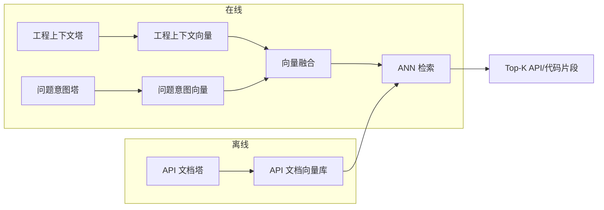

# 04-0 LLM三塔召回与工程语义

> 面试口径：HarmonyDev 是服务 HarmonyOS / OpenHarmony 开发的 AI 开发助手；系统实现主体是 Python Agent 后端 + LocalAgent Gateway + Web/DevEco 面板，不要求运行在鸿蒙设备上。鸿蒙相关内容是被服务的开发对象，包括 ArkTS、ArkUI、Ability、Stage 模型、构建日志和官方文档。


**模块目标：**

- 理解为什么 AgentLoop 调用 `doc_search` 时，底层需要一个向量召回引擎，以及它和传统关键词匹配的区别。

- 掌握"三塔"模型结构：问题意图塔、API 文档塔、工程上下文塔各自编码什么信息，最终如何做向量匹配。

- 理解"解耦式双通道"设计：语义通路保相关性、工程上下文通路保转化，两者独立训练但联合检索。

**阅读重点：** 本章是召回层的设计原理，偏模型架构方向。如果你更关注 Agent 工程侧（AGUI / 长期记忆 / 评测训练），可以先跳过细节，只看 3.1 和 5 两节建立整体印象，后面需要时再回来。但如果你想理解"为什么 doc_search 能搜得准"，本章是底层答案。

---

## 1、本章导读

### 1.1 召回层在整体架构中的位置

在前面三章里，我们搭建了 AgentLoop 的决策层：主 loop 通过 Think → Act → Observe → Reflect 循环调用工具，遇到复杂子任务时通过 `task_tool` fork 同质子 Agent。

但有一个问题没回答：**当主 loop 调用 `doc_search(query="ArkUI 页面返回后状态丢失")` 时，这个工具内部到底怎么从官方文档、OpenHarmony 文档、示例工程和本地代码里找到真正相关的几十段材料？**

答案是：向量召回。`doc_search` 的内部实现不是简单的关键词匹配，而是把开发问题、API 文档片段和工程上下文都编码成向量，在向量空间里做最近邻检索（ANN）。

### 1.2 本章先做什么，不做什么

本章完成的是：

1. 理解三塔模型为什么要分三个塔（Intent / Doc / Context），每个塔编码什么。

1. 理解双通道（语义 + 个性化）为什么要解耦。

1. 看懂一次完整的向量检索流程。

暂时不碰的：

- 模型训练细节（SFT / RL 放第 8 章）。

- 在线部署架构（引擎、缓存、QPS 放项目主线章节）。

---

## 2、为什么需要向量召回

### 2.1 传统关键词匹配的局限

普通文档搜索的核心是 BM25 或 TF-IDF 关键词匹配：用户输入“页面返回后状态丢失”，系统只找标题或正文里包含这些字面词的文档片段。

这种方式有三个致命问题：

| 问题 | 示例 | 根因 |
| --- | --- | --- |
| 同义不匹配 | 用户说“页面返回后数据没了”，文档写的是 `LocalStorage` / `AppStorage` | 词不一样就搜不到 |
| 意图不理解 | 用户贴的是 hvigor 报错或 ArkUI 现象，文档标题却是生命周期 / 路由 / 状态管理 | 无法理解开发意图 |
| 工程上下文缺失 | 两个项目问同一个问题，一个是 Stage 模型，一个是旧 FA 模型 | 没有结合工程约束 |

### 2.2 向量召回怎么解决

向量召回的核心思路：**把 query 和API/代码片段都映射到同一个向量空间，用向量距离代替词匹配。**

- "状态保存"和"状态容器"在向量空间里距离很近（语义相似）。

- "页面返回后状态丢失"会被编码成一个包含"页面状态""便携""商务"等语义的向量。

- 不同用户的 query 向量可以叠加个性化偏好，让同一个词搜出不同结果。

---

## 3、三塔模型：工程上下文塔 / 问题意图塔 / API 文档塔

### 3.1 为什么是三个塔

传统双塔模型只有 问题意图塔和 API 文档塔。但在鸿蒙开发助手里，**用户的开发者画像**（历史行为、采纳频率、Kit 领域倾向）和**当前 query 的即时意图**是两件不同的事。

- 问题意图塔：编码"用户这次搜了什么"（即时意图）。

- 工程上下文塔：编码"这个用户长期喜欢什么"（历史偏好）。

- API 文档塔：编码"这件API/代码片段是什么"（API/代码片段特征）。

三个塔各自独立编码，最终通过向量相似度做匹配。

### 3.2 每个塔的输入是什么

| 塔 | 输入信息 | 编码目标 |
| --- | --- | --- |
| 问题意图塔 | 用户自然语言问题、报错日志、期望版本、任务类型 | 生成代表“这次开发问题”的向量 |
| API 文档塔 | HarmonyOS / OpenHarmony 文档、API 说明、示例代码、版本说明 | 生成代表“这段文档或代码片段”的向量 |
| 工程上下文塔 | 当前项目的 module.json5、oh-package.json5、页面代码、依赖、目标设备和历史偏好 | 生成代表“当前工程约束”的向量 |

### 3.3 匹配方式

检索时，把 工程上下文向量和 问题意图向量融合成一个"请求向量"，然后和所有 API 文档向量做 ANN（近似最近邻）检索：

```
请求向量 = f(User_vec, Query_vec)
检索结果 = ANN_search(请求向量, Doc_向量库, top_k=100)
```

这里的 `f()` 是一个融合函数（可以是拼接、加权求和或注意力机制）。



---

## 4、解耦式双通道：语义 + 个性化

### 4.1 为什么要解耦

如果把语义相关性和工程适配度放在同一个模型里训练，会出现**跷跷板问题**：

- 优化相关性 → 工程适配指标下降。

- 优化个性化 → 搜出来的API/代码片段和 query 不相关。

这是因为两个目标的梯度方向经常冲突：相关性要求"搜 ArkUI 状态保存就返回状态保存"，工程适配要求"当前项目目标版本是 HarmonyOS 5.0、禁用废弃 API、优先低改动方案"。如果只用一个向量空间承载两类目标，模型容易把语义相关性和工程约束混在一起。

### 4.2 双通道设计

HarmonyDev 的解法是把两个任务拆成两个独立的通道，各自训练但联合检索：

| 通道 | 训练目标 | 输入 | 输出 |
| --- | --- | --- | --- |
| 语义通路 | 问题-文档 文本相关性 | Query + API 文档文本 | 相关性向量 |
| 工程上下文通路 | Intent-Doc-Context 转化预估 | Context + Intent + Doc | 个性化向量 |

最终检索时，两个通道的向量融合后一起做 ANN：

```
最终向量 = α × 语义向量 + β × 个性化向量
检索结果 = ANN_search(最终向量, Doc_向量库, top_k=100)
```

### 4.3 为什么这样设计有效

| 维度 | 单通道（混合） | 双通道（解耦） |
| --- | --- | --- |
| 相关性 | 容易被个性化拉偏 | 语义通路独立保障 |
| 个性化 | 容易被相关性约束 | 工程上下文通路独立优化 |
| 训练稳定性 | 两个目标梯度冲突 | 各自收敛不干扰 |
| 可解释性 | 不知道结果是因为相关还是因为偏好 | 可以分别看两个通路的贡献 |

---

## 5、和 AgentLoop 的关系

回到整体架构：

```
用户输入 "ArkUI 页面返回后状态丢失"
  → 主 AgentLoop Think: 需要搜索API/代码片段
  → Act: doc_search(query="ArkUI 页面返回后状态丢失")
    → doc_search 内部：
      1. 问题意图塔编码 "ArkUI 状态保存" → 问题意图向量
      2. 工程上下文塔编码 当前用户历史 → 工程上下文向量
      3. 融合 → 请求向量
      4. ANN 检索 API 文档向量库 → Top-100 API/代码片段
      5. 返回结构化API/代码片段列表
  → Observe: 拿到若干相关文档片段和工程代码位置
  → Think: 调 patch_picker 按偏好筛选...
```

对主 AgentLoop 来说，三塔召回是 `doc_search` 工具的**内部实现细节**。主 loop 不需要知道底下有三个塔、有 ANN 检索。它只关心"调了 doc_search，拿到了API/代码片段列表"。

但对整个系统来说，这一层决定了**搜得准不准**——如果召回层返回的 100 件API/代码片段就已经不相关，后面 PatchPicker 怎么挑也挑不出好结果。

---

## 6、训练信号从哪来

### 6.1 多任务训练

三塔模型不是只靠一个 loss 训练的，而是多任务联合：

| 任务 | 正样本 | 负样本 | 作用 |
| --- | --- | --- | --- |
| 采纳任务 | 开发者实际采纳的 | 展示但未采纳的 | 学习可落地性信号 |
| 引用任务 | 回答中被引用且验证通过的文档 | 召回但未引用的文档 | 学习证据质量 |
| 覆盖任务 | 被召回的候选 | 未召回文档块 | 保证基础召回覆盖 |
| 精排一致性 | 精排高分的 | 精排低分的 | 对齐和后续排序的一致性 |

### 6.2 和第 8 章（评测训练闭环）的关系

三塔模型的训练是**召回层自己的事**，和第 8 章讲的 Agentic RL 是两条独立的训练链路：

| 训练对象 | 优化目标 | 方法 | 章节 |
| --- | --- | --- | --- |
| 三塔召回模型 | 召回 API 文档、示例代码和工程片段的相关性 | 对比学习 + Reranker 蒸馏 | 本章 |
| AgentLoop 主模型 | Agent 决策和工具调用质量 | Rubric + SFT + RL | 第 8 章 |

两者独立但协同：召回层搜得准 → Agent 调 `doc_search` 拿到的结果质量高 → Agent 整体任务完成率高。

---

**本章小结：**

到这里，你应该理解了 HarmonyDev 召回层的设计原理：

1. `doc_search` 工具的内部实现是向量召回，不是关键词匹配。三塔模型把 Intent / Doc / Context 各自编码成向量，通过 ANN 检索做匹配。

1. 三个塔各司其职：工程上下文塔建模开发者画像，问题意图塔建模即时意图，API 文档塔建模API/代码片段特征。

1. 解耦式双通道（语义 + 个性化）解决了相关性和个性化的跷跷板问题——各自训练、联合检索。

1. 对主 AgentLoop 来说，召回层是 `doc_search` 的内部实现细节，主 loop 只关心"调了工具、拿到结果"。

1. 三塔模型的训练和 AgentLoop 主模型的训练是两条独立链路，各自优化各自的指标。

本章主线讲的是「三塔模型 + ANN 检索」本身；“三塔训出来的向量会被塞进哪个数据库、第 6 / 13 章的应用层向量又该用什么、`Faiss` / `Milvus` / `OpenSearch` 怎么选”这些选型问题体量较大，独立成姊妹章 [4-1 向量基础设施选型与 OpenSearch 演进方向](<08-04-1 向量基础设施选型与OpenSearch演进方向.md>)，推荐看完本章后续上。

下一章「[Cache Breakpoint 上下文压缩与缓存治理](<10-05 Cache-Breakpoint上下文压缩与缓存治理.md>)」回到工程层，讲 50 轮对话之后 token 怎么不爆掉的问题。
