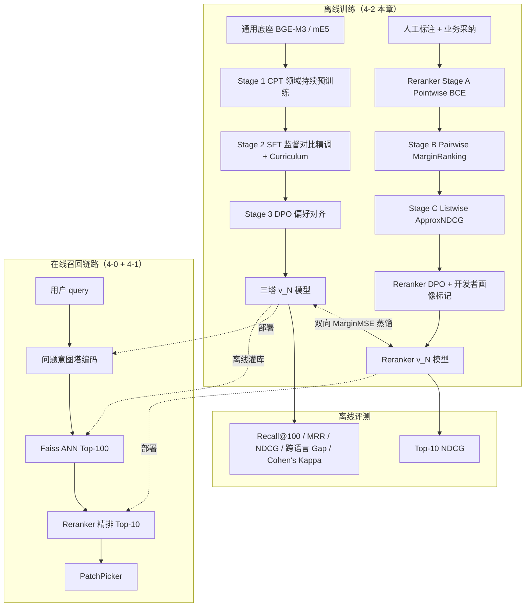

# 04-2 Embedding训练与Reranker精排

> 面试口径：HarmonyDev 是服务 HarmonyOS / OpenHarmony 开发的 AI 开发助手；系统实现主体是 Python Agent 后端 + LocalAgent Gateway + Web/DevEco 面板，不要求运行在鸿蒙设备上。鸿蒙相关内容是被服务的开发对象，包括 ArkTS、ArkUI、Ability、Stage 模型、构建日志和官方文档。


**模块目标：**

- 看清三塔模型从「架构」到「训得准」之间到底差哪些事——架构只占 30%，剩下 70% 是数据 / 损失 / 训练范式。

- 掌握 embedding 训练的 **三阶段范式**：领域持续预训练 → 监督对比精调 → 偏好对齐。

- 理解为什么召回层之外还必须配 Reranker——这是双塔 bi-encoder 的物理上限决定的，不是工程偏好。

- 掌握 **Embedding ↔ Reranker 协同训练**：解决"召回认为 Top1 / Reranker 认为 Top50"的不一致问题。

- 拿到一份在 HarmonyDev 中英双语文档场景下可直接落地的「数据 → 损失 → 三阶段 → 协同 → 评测 → 部署」建议列表。

**阅读重点：** 这一章是 [4-0 LLM 三塔召回与工程语义双通道](<07-04-0 鸿蒙开发助手三塔召回与工程语义.md>) 的「训练侧补完」——4-0 讲三塔长什么样，本章讲怎么把它训准、训稳。读时先记三条主线：

1. **embedding 准确性 = 数据 + loss + Hard Negative 迭代**，模型架构只占小头。

1. **Reranker 不是"重复造轮子"，是 bi-encoder 数学结构注定的必备补丁**——双塔无法看到 query × 文档/API 片段的交叉信号，cross-encoder 才能。

1. **Embedding 和 Reranker 必须协同训练**，否则召回和精排各自最优、整体不优。

---

## 1、本章导读

### 1.1 4-0 没讲清楚的事

[4-0](<07-04-0 鸿蒙开发助手三塔召回与工程语义.md>) 把三塔（Intent / Doc / Context）的架构和「文档语义 + 工程上下文双通道」融合讲了，但有几件事故意没展开：

- 三塔模型用什么数据训？正负样本怎么造？中英双语文档场景的「假负样本」怎么过滤？

- 用什么 loss？为什么 InfoNCE 是事实标准、还需要哪些改进？

- 怎么评测「训得准不准」？哪些指标该卡线？跨语言独立怎么评？

- 为什么生产链路里召回之外还要再加一个 Reranker？两者怎么协同训练？

这一章把这四件事补齐。

### 1.2 本章做什么，不做什么

做的：

1. embedding 训练的 **数据配方**（含假负样本过滤）+ **InfoNCE 四改进** + **三阶段训练范式**（含偏好对齐）。

1. **Hard Negative Mining** 的迭代流程——业界共识但很多项目省掉，省掉就是上限低。

1. **Reranker** 的本质必要性、选型、**三阶段损失**、LoRA 微调骨架、开发者偏好对齐、工程化部署。

1. **Embedding ↔ Reranker 协同训练**：双向 MarginMSE 蒸馏 + 渐进式 HN 挖掘升级版。

1. 训练 + 部署全链路图，把 4-0 三塔 + 本章训练 + Reranker 串成一条线。

暂时不碰：

- 三塔模型本身的架构（已在 [4-0](<07-04-0 鸿蒙开发助手三塔召回与工程语义.md>)）。

- 向量库选型（已在 [4-1](<08-04-1 向量基础设施选型与OpenSearch演进方向.md>)）。

- 完整训练框架的工程代码（留给生产部署章节）。

---

## 2、Embedding 准确性是个工程问题

### 2.1 通用模型在业务域上为什么不够

直接拿 `BGE-M3` 或 `mE5` 这类通用模型在 HarmonyDev 多源文档鸿蒙开发场景做 cosine 相似度实测：

| Query 对 | 期望（语义等价） | 实测 cosine | 是否达标 |
| --- | --- | --- | --- |
| 「页面返回后状态丢失」 vs 「ArkUI LocalStorage sample」 | ≥ 0.85 | 0.62 | ❌ |
| 「低改动的 ArkUI 状态恢复方案」 vs 「路由返回后保留页面状态」 | ≥ 0.80 | 0.58 | ❌ |
| 「不要使用废弃 APIArkUI 状态管理方案」 vs 「AppStorage 示例」 | ≥ 0.75 | 0.41 | ❌ |

**结论**：通用 embedding 模型的语义空间不是为鸿蒙开发域 + 跨语言场景训的，三类典型表达都掉到「不及格」线下。HarmonyDev 必须在通用底座上做 **领域持续预训练 + 业务对比精调 + 偏好对齐** 三阶段。

### 2.2 准确性的三个维度

| 维度 | 业务体现 | 主指标 |
| --- | --- | --- |
| 同义性 | 「状态保存」≈「状态容器」 | Recall@10 |
| 跨语言一致性 | 「页面状态保存」≈「page state persistence」 | 跨语言 Recall Gap、cosine 通过率 |
| 业务相关性 | 「修复 ArkUI 状态丢失问题」→ 推对应偏好 | NDCG@10 + 人工评测 |

多源文档鸿蒙开发比纯中文鸿蒙开发难就难在第二维：**同一API/代码片段在不同平台语言不同，必须让 embedding 在跨语言下仍然相邻**。

---

## 3、训练数据怎么造

### 3.1 正样本：四档来源加权采样

业界共识：正样本不是越多越好，而是 **按质量加权采样**。

| 来源 | 信号强度 | 规模 | 噪声 | 推荐采样权重 |
| --- | --- | --- | --- | --- |
| 人工标注 query-doc 对 | 最高 | ~5 万 | 极低 | **40%** |
| 业务采纳日志（query → 采纳文档/API 片段） | 高 | ~500 万 | 低 | **35%** |
| 跨语言同一 API对齐对（同一 API 多源多语言标题） | 中-高 | ~200 万 | 低 | **15%** |
| LLM 翻译增强对（GPT/Qwen 翻译标题） | 中 | ~1000 万 | 中 | **10%** |

**关键点**：高质量数据可以重复使用（一个 epoch 见 3-5 次），低质量数据每条只见一次。

### 3.2 负样本：四档配方（决定模型上限）

| 负样本类型 | 怎么构造 | 比例 | 训练价值 |
| --- | --- | --- | --- |
| In-batch negatives | 同 batch 里其他 query 的正例当负例 | 基础 | 免费、规模大 |
| **同类目 BM25 Hard** | BM25 Top-20 中的非采纳API/代码片段 | 40% | **拉开模型差距** |
| **跨语言混淆 Hard** | API 名称相近但能力、版本或适用场景不符的多语言 API/代码片段 | 30% | 中英双语文档场景核心 |
| **语义相近 Hard** | 上一版 embedding 检索 TopK 的非相关项 | 30% | 自我蒸馏 |

为什么 hard negative 关键：

```
easy negative：模型早就分得开，再训一万轮也无增量
hard negative：模型当前正在犯错的样本，每一条都对应高价值错误样本
```

**Hard Negative Mining 节奏**：每训练 1 个 epoch 用当前 checkpoint 重新挖一次，否则负样本会「过时」，训练信号失效。

### 3.3 ⭐ 假负样本过滤（中英双语文档场景必做）

多源文档鸿蒙开发的一个隐性大坑：**「假负样本」**——同一 API/代码片段的不同资料源、不同语言版本被错当成负例：

```
正例：「页面返回后状态丢失」 → HarmonyOS 官方文档 API 条目-A001（英文标题：ArkUI LocalStorage sample）
"负例"：OpenHarmony 文档 API 条目-B205（中文标题：LocalStorage 页面状态保存示例）
   ↑ 实际上是同一 API，被错标成负例 → 模型学到错误信号
```

**双重过滤策略**：

```
负样本 = 候选负样本
       - API/代码片段 ID 相同的（多源同一 API 数据库 join 剔除）
       - 规范化 API 名 / 示例工程路径相同的（视为同一 API 或同一示例）
```

不做这一步，跨语言对齐 loss 会被 10-20% 的噪声拖累。

### 3.4 Hard Negative Mining 的迭代范式

```
v0 模型（通用底座 BGE-M3 / mE5）
   ↓ 用 v0 召回 Top-100
   ↓ 取「展示但未采纳 + API/代码片段 ID 不重复 + API 名/示例路径不同」的 Top-100 → hard negative
   ↓ 训 v1
   ↓ 用 v1 重新挖 hard negative
   ↓ 训 v2
   ↓ ... 业界经验 3-5 轮收敛
```

收益曲线（Recall@100）：

| 轮次 | 起点 | 提升 |
| --- | --- | --- |
| 通用底座 v0 | 0.62 | — |
| Stage 2 训完（v1） | 0.78 | +0.16 |
| HN 第 1 轮（v2） | 0.85 | +0.07 |
| HN 第 2 轮（v3） | 0.88 | +0.03 |
| HN 第 3 轮（v4） | 0.89 | +0.01（边际收敛） |

---

## 4、Loss 函数：InfoNCE 的四个改进点

### 4.1 主损失：InfoNCE

```
                   exp( sim(q, d⁺) / τ )
L = -log ──────────────────────────────────────
          Σ_{i=0..N} exp( sim(q, dᵢ) / τ )
```

- `q`：query 向量

- `d⁺`：正例 item 向量

- `dᵢ`：batch 内所有候选（含 1 个正例 + N-1 个负例）

- `τ`：温度系数（关键超参）

### 4.2 改进 1：动态温度

中英双语文档场景的关键调参——**不同语言对用不同温度**：

| 对类型 | τ 值 | 原因 |
| --- | --- | --- |
| 跨语言对 | 0.02 | 跨语言天然距离更远，需要更"锋利"的 loss |
| 同语言对 | 0.05 | 标准值 |

经验：**温度系数是隐性大坑**——默认 0.05 在纯中文场景没问题，但跨语言场景同温度训出来 Recall@100 会低 5-8%。

### 4.3 改进 2：Hard 负样本加权

不所有负样本同等重要：

```
L_compat_weighted = -log [ exp(sim(q,d⁺)/τ) /
                    ( exp(sim(q,d⁺)/τ) + Σ wᵢ × exp(sim(q,dᵢ)/τ) ) ]

其中 wᵢ = 2.0  if dᵢ 是 hard negative
       wᵢ = 1.0  otherwise
```

防止模型对 hard negative 过于自信、把它误判成正例。

### 4.4 改进 3：跨语言对齐辅助损失 `L_align`

多源文档鸿蒙开发专属——把同义跨语言 query 之间的距离单独拉近：

```
L_align = InfoNCE( encode(中文 query), encode(同义英文 query) )
```

正例对来源：

1. **LLM 自动构造**：用 GPT-4 / Qwen 把同一 API/代码片段标题翻译成多语言（中文 / 英文等）。

1. **资料源对应数据**：同Kit在官方/开源文档中的中英文标题。

### 4.5 改进 4：假负样本过滤（已在 §3.3 详述）

体现在 loss 上就是：构造负样本的索引集合 `N` 严格剔除 API/代码片段 ID + 规范化 API 名 / 示例路径相同的同一 API。

### 4.6 三塔双通道 + 跨语言对齐的整合 loss

对应 [4-0](<07-04-0 鸿蒙开发助手三塔召回与工程语义.md>) 的「语义 + 个性化」双通道：

```
L_total = α · L_semantic + β · L_personalize + γ · L_align

L_semantic    = InfoNCE_dynamic_τ( 问题意图塔输出, API 文档塔输出 )
L_personalize = InfoNCE_dynamic_τ( fuse(工程上下文塔, 问题意图塔), API 文档塔输出 )
L_align       = InfoNCE_dynamic_τ( 中文 query 编码, 同义多语言编码 )
```

经验权重：`α=0.5, β=0.4, γ=0.1`。`L_align` 比重不大但缺了跨语言场景就会塌。

---

## 5、三阶段训练范式

完整的 Post-Training 流程是三阶段，每阶段目标、数据、超参都不同：

```
通用底座（BGE-M3 / mE5 / MGTE）
   ↓
Stage 1：领域持续预训练（CPT）   — 让模型理解鸿蒙开发文档语料分布
   ↓
Stage 2：监督对比精调（SFT）     — 问题-文档 相关性对比学习
   ↓
Stage 3：偏好对齐（DPO）         — 对齐人类细粒度判断 / 跨文化偏好
   ↓
生产模型 v_N
```

### 5.1 Stage 1：领域持续预训练（CPT）

**目标**：弥合通用语料与鸿蒙 API 文档语料的分布差距，**不改变跨语言对齐能力**。

**任务一：多语言 MLM**

| 数据 | 全量API/代码片段标题 + 约束 + 描述（无标注） |
| --- | --- |
| 标准 mask | 普通词以 15% 概率 mask |
| 特殊处理 1 | **Kit名 / API 条目 / 型号低 mask 概率（5%）**——避免遗忘专有名词 |
| 特殊处理 2 | **版本号、API level、错误码整体 mask**——强迫模型理解工程约束语义 |
| 特殊处理 3 | **跨语言同字段混合输入**（zh 标题 + en 约束拼接） |

**任务二：多语言句对预测**

| 正对 | 同一 API/代码片段的不同语言标题 |
| --- | --- |
| 负对 | 同类目不同API/代码片段的标题 |
| 目标 | 在无标注情况下建立跨语言锚点 |

**关键超参**：

| 超参 | 值 | 原因 |
| --- | --- | --- |
| 学习率 | **1e-5** | 远小于下游精调，**防止灾难遗忘** |
| 步数 | 5-10 万步 | 足够适配鸿蒙开发域，不必到收敛 |
| 数据 | 覆盖所有目标语言 + **温度采样平衡**（小语种数据少要上采样） | — |

### 5.2 Stage 2：监督对比精调（SFT）

**目标**：让 v0 模型适配鸿蒙开发域 + 中英双语文档场景的相关性判断。

**Curriculum Learning（阶段式训练）**：

| 阶段 | 数据难度 | 目标 | lr 调整 |
| --- | --- | --- | --- |
| Week 1 | 随机 + In-batch 负样本 | 学习基本语义区分 | 5e-6 |
| Week 2 | 加入同类目 BM25 Hard | 学习细粒度区分 | warmup 500 步 |
| Week 3 | 全量 4 档 Hard 负样本 | 对齐真实召回场景分布 | warmup 500 步 |
| Week 4 | + Reranker 蒸馏信号 | 向 Reranker 看齐（见 §11） | warmup 500 步 |

**关键超参**：

| 超参 | 值 | 原因 |
| --- | --- | --- |
| 学习率 | **5e-6** | 比 Stage 1 小一个量级，防灾难遗忘 |
| Epoch | 3-5 | 看 dev 集 Recall@100 收敛 |
| Batch | 大批（≥ 1024） | In-batch 负样本规模足够 |

### 5.3 Stage 3：偏好对齐（Embedding-DPO）

**为什么需要这一阶段**：

| SFT 阶段问题 | 偏好对齐解法 |
| --- | --- |
| 只学了"采纳"信号，分不清冲动采纳 vs 精准采纳 | 用偏好对（A 优于 B）显式建模 |
| 硬标签（0/1）无法表达"差不多相关"的细粒度判断 | DPO 学习连续偏好分 |
| 开发者偏好差异被平均掉 | 按开发者画像分桶训练 / 在输入打画像标记 |

**偏好数据构建**：

| 来源 | 怎么构造 |
| --- | --- |
| 人工标注转换 | A=3 分、B=1 分 → 偏好对（A>B），只取分差 ≥ 2 |
| A/B 实验结果 | 同一 query 展示不同 API/代码片段，采纳 A 未采纳 B → A>B |
| 开发者画像偏好 | 同一 query 在不同工程背景下的采纳差异（如新项目优先官方推荐写法，迁移项目优先低改动方案） |

**Embedding-DPO 公式**（标准 DPO 不能直接用，需改造）：

```
L_DPO = -log σ [ β × (sim(q,d⁺) - sim(q,d⁻))
                - β × (sim_ref(q,d⁺) - sim_ref(q,d⁻)) ]

  sim_ref：Stage 2 训出的 SFT 模型（冻结）作为参考
  β：控制偏离参考模型的程度（推荐 0.1-0.5）
```

**关键超参**：

| 超参 | 值 | 原因 |
| --- | --- | --- |
| 学习率 | **1e-6** | 比 SFT 再小一个量级 |
| 负样本 | **不能用 In-batch**——会干扰偏好对的对比信号 | 每个偏好对单独算 |
| β | 0.1-0.5 | 越大越偏离 SFT 模型 |

### 5.4 三阶段对照

| 阶段 | 数据 | lr | epoch | 主要解决 | Recall@100 收益 |
| --- | --- | --- | --- | --- | --- |
| Stage 1 CPT | 全量API/代码片段语料（无标注） | 1e-5 | 5-10w 步 | 适配鸿蒙开发域语料分布 | 0 → 0.65 |
| Stage 2 SFT | query-doc 对 + 4 档 hard neg | 5e-6 | 3-5 | 对齐相关性判断 | 0.65 → 0.85 |
| Stage 3 DPO | 偏好对（人工 + A/B + 开发者画像） | 1e-6 | 1-2 | 细粒度偏好 + 工程场景适配 | 0.85 → 0.88+ |

### 5.5 冷启动期：怎么把训练数据造出来

业务采纳日志为零时的核心命题不是「能不能训」（CPT 总是能跑），而是 **「怎么把训练数据造出来，且不让合成数据把模型带偏」**。本节专门讲数据侧。

#### 5.5.1 Day 0 能用的四类素材

| 素材 | Day 0 是否有 | 主要用途 |
| --- | --- | --- |
| API 知识库本身（标题 / 描述 / Kit / 约束 / 示例路径） | ✅ 有 | LLM 改写生成 query；规范化 API 名和示例路径做去重、配对 |
| 公开多语言通用业务数据集（mMARCO / xPQA / DuReader 鸿蒙开发部分） | ✅ 有 | 通用语义底座 + 跨语言对齐种子 |
| 官方文档中英标题（同一 API 在 HarmonyOS 官方文档英文站 vs 示例工程中文站） | ✅ 有 | **跨语言对齐路的金标**——非合成、非翻译腔 |
| 业务采纳日志 | ❌ 没有 | 等业务上线后采集，不在冷启动范畴 |

**最容易被忽视的是第三档**：多源文档项目通常已经在多资料源拿到同一 API 的多语言官方标题，这是天然的「同一 API 不同语言」对齐对，质量比 LLM 翻译高一个量级。

#### 5.5.2 LLM 合成正样本：query 的五档生成

不是简单一句「生成 5 个 query」，而是按 **搜索意图层级** 结构化生成。否则合成数据全是同一类表达，模型学不到泛化：

| 档位 | query 类型 | 例子 | 训练价值 |
| --- | --- | --- | --- |
| L1 | 直接搜（核心词） | 「LocalStorage 页面状态保存」 | 学基础实体匹配 |
| L2 | 约束扩展搜 | 「HarmonyOS 5.0 页面返回后保留 ArkUI 页面状态」 | 学约束同义 |
| L3 | 场景搜 | 「从详情页返回列表页后筛选条件不要丢」 | 学语义跨度 |
| L4 | 模糊需求搜 | 「页面切回来数据怎么没了」 | 学口语化 query |
| L5 | 跨语言改写（L1-L4 各生成英 / 越 / 印 4 语） | 「ArkUI LocalStorage sample」 | 跨语言对齐 |

**Prompt 模板**（关键：逐档要求，不能笼统）：

```
给定API/代码片段：
  标题：{doc_title}
  类目：{category}
  核心约束：{attributes}（API 约束 / 目标版本 / Kit / 适用场景等，不含实现成本）

请按以下五档分别生成 query，每档 1-2 条：
[L1 直接搜] 用户记得API/代码片段大致名称时怎么搜，包含核心词
[L2 约束搜] 用户记得 1-2 个约束但不记得Kit 领域时怎么搜
[L3 场景搜] 用户从使用场景出发怎么搜（不出现Kit 领域词）
[L4 模糊搜] 用户用口语化、不完整描述时怎么搜
[L5 跨语言] 把上面四档改写成英文开发者常用表达，不要直译

约束：
- 每条 query 句式必须不同，不要套用「我想要 X 的 Y」这种模板
- 不准照抄API/代码片段标题里连续 4 字以上的片段
- 用真实用户口吻，不要营销语
```

#### 5.5.3 LLM 合成的四个坑 + 治理

合成数据如果不做清洗，训出来的模型大概率比通用底座还差。四个常见坑：

| 坑 | 后果 | 治理 |
| --- | --- | --- |
| 90% 的 query 是同一句式模板 | 模型只学模板，泛化崩 | 温度 ≥ 0.9 + 显式要求每条句式不同 + 跑完用 SimHash 去重相似度 > 0.85 的 |
| LLM 倾向直接照抄API/代码片段标题 | embedding 退化为「标题字面相似度」模型 | Prompt 显式禁止 + 后处理用最长公共子串过滤连续 4 字命中 |
| 跨语言改写有翻译腔（拼音直译 / 语序颠倒） | 训出来的对齐是「翻译质量」不是「用户表达」 | **优先用官方文档中英标题对**（§5.5.1 第三档）替代 LLM 改写 |
| 头部Kit 领域生成多、长尾Kit 领域生成少 | 长尾召回质量低 | 按Kit 领域分桶采样API/代码片段，保证每个长尾Kit 领域至少 50 条合成对 |

#### 5.5.4 负样本：冷启动期能造和不能造的

**冷启动期不能用**：

- ❌ **ANN hard negative**：自己挖自己的负样本，模型陷入自蒸馏漩涡（v0 错的 → v1 当 hard 学进去 → 错得更深）

- ❌ **LLM 合成负样本**：LLM 不知道「什么算无关」，给的“负例”经常是似是而非的弱相关（伪 hard），训出来反向漂移

**冷启动期能用**：

| 来源 | 怎么造 | 难度 | 比例 |
| --- | --- | --- | --- |
| In-batch negatives | 同 batch 其他 query 的正例当负例 | Easy（必备） | 基础 |
| **跨类目随机负样本** | 给每个API/代码片段打类目标签，从远类目随机抽 | Easy | 50% |
| **BM25 同类目 hard** | BM25 在**同类目内**召回，取标题字面命中但子类型不同的 | **Hard，核心** | 50% |

例：API/代码片段「LocalStorage 页面状态保存」，BM25 同 Kit hard 是：

- 「LocalStorage 跨页面共享状态」（同 API 约束同大类目，能力边界不同）

- 「页面状态持久化到本地文件」（同场景同大类目，实现方式不同）

这种 hard negative **不靠模型自挖、不靠 LLM 合成**，纯靠 BM25 + 类目结构挖出来，没有自蒸馏偏置风险。

#### 5.5.5 跨语言混淆负样本（多源文档必造）

中英双语文档场景一个独有的负样本类型——「**跨语言长得像但根本不同**」的API/代码片段对：

```
正例对：「ArkUI LocalStorage page state persistence」 ↔ 「LocalStorage 页面状态保存」
        （同一 API 多源官方多语言标题）

负例对：「ArkUI LocalStorage page state persistence」 ↔ 「LocalStorage 跨 Ability 数据共享」
        （都包含 LocalStorage，但生命周期边界和适用场景完全不同）
```

挖法：

1. 先在API 知识库做跨语言聚类（用通用 BGE-M3 cosine ≥ 0.75 召回近邻）

1. 对每个近邻对，看「Ability 范围 / 生命周期 / 适用 API Level」这些**结构化字段**是否冲突

1. 字段冲突的 = 跨语言混淆负样本

**这一档绝对不能 LLM 合成**——LLM 没有官方 API 条目 的结构化约束数据，造出来全是想象。

#### 5.5.6 冷启动数据混合配比

把上面五种数据按比例混进 Stage 2 SFT 训练 batch：

| 数据来源 | 占比 | 进入哪一路 loss |
| --- | --- | --- |
| 公开多语言通用语义数据集（mMARCO 等） | 40% | L_semantic 主路 |
| API 知识库 LLM 合成正样本 | 25% | L_semantic 主路 |
| 官方文档中英标题对齐对 | 20% | **L_align 跨语言对齐路（核心）** |
| BM25 同类目 hard 负样本 | 10% | 负样本池 |
| 跨语言混淆负样本 | 5% | 负样本池 |

公开数据占比最高、合成数据占比次之，是因为**合成数据噪声最大，宁愿少用、不要训歪**。

#### 5.5.7 数据质量五条红线

每批合成数据进入训练前，必须过五个自动检查：

| 校验项 | 阈值 | 触发后怎么办 |
| --- | --- | --- |
| 重复模板率（SimHash > 0.85 的 query 占比） | < 15% | LLM 重新生成 + 提温度 |
| API/代码片段标题照抄率（query 含标题连续 4 字以上） | < 10% | 换 prompt 模板 |
| 跨语言翻译腔比例（拼音直译 / 语序颠倒） | < 20% | 用官方文档中英对齐数据替代 LLM 翻译 |
| 长尾Kit 领域覆盖率 | ≥ 80% | 按Kit 领域分桶补 |
| 抽样人工标注一致率（5% 抽检） | ≥ 75% | 整批废掉重生成 |

**任何一条不达标的批次直接废掉**，不要试图“修一修再用”——合成数据的坏味道会在 Hard Negative Mining 第 1-2 轮里被指数放大。

---

## 6、评测：怎么知道训出来准了

### 6.1 评测集构造的红线

**绝对不要用爬来的通用业务数据当评测集**——分布偏移严重，离线指标飞涨但线上采纳率不动甚至下降。

正确做法：

1. **从业务真实日志切片**：选一段历史时间窗（建议多源 + 跨季节 + 至少 3 个月）。

1. **不能用与训练同期数据**：必须留 holdout，否则评测形同虚设。

1. **建议规模**：1-3 万条 query，每条平均 2-5 个标注正例。

1. **人工抽检**：5% 抽样人工 review label 质量，采纳偏置严重的 query 直接剔除。

### 6.2 三大核心指标 + HarmonyDev 阈值

| 指标 | 含义 | 召回层 HarmonyDev 阈值 |
| --- | --- | --- |
| Recall@100 | Top-100 召回里覆盖正例的比例 | ≥ 0.85 |
| MRR@10 | 第一个正例的倒数平均排名 | ≥ 0.45 |
| NDCG@10 | 考虑相关度等级的排序质量（多档相关度） | ≥ 0.55 |

### 6.3 跨语言独立评测（多源文档必加）

```
跨语言 Recall Gap = | Recall_zh@100 - Recall_en@100 |
HarmonyDev 阈值：≤ 0.05（差距 ≤ 5%）

跨语言 cosine 通过率 = ( 同义跨语言 query 对中 cosine ≥ 0.80 的对数 ) / ( 总对数 )
HarmonyDev 阈值：≥ 75%

人工标注 Cohen's Kappa（跨语言一致性） ≥ 0.75
   同一 (query, doc) 不同语言版本的标注分差 ≤ 1
```

### 6.4 离线指标 ↔ 线上效果的关联

离线 Recall@100 涨 5%，线上采纳率或人工满意度通常只涨 1-2%。**比例不是 1:1**。常见的「离线涨线上不动」原因：

- 评测集分布偏离线上真实分布（不同 query 频次权重）

- Reranker 在兜底，召回层提升被「打平」

- 评测集 label 噪声太大，离线提升大部分是噪声

---

## 7、为什么需要 Reranker

### 7.1 双塔 bi-encoder 的表达瓶颈

三塔（包括所有双塔模型）的本质限制：**Query 和 Item 是分别独立编码的，向量在生成时彼此看不见**。

```
bi-encoder（双塔 / 三塔）：
   Query  ──[编码器 A]──> q_vec  \
                                  ──[cosine]──> 分数
   Item   ──[编码器 B]──> d_vec  /

   ⚠ q_vec 和 d_vec 是各自独立产生的，无法做交叉注意力

cross-encoder（精排）：
   Query + Item → [拼接] → [编码器] → 直接输出分数

   ✅ 模型每一层都能看到 query 和 item 的 token 间交互
```

### 7.2 职责分层：谁该处理什么信号

在写 Reranker 例子之前必须先讲清一件事——**搜索链路里有四类信号，分别由四个组件处理**，越界就出问题：

| 信号类型 | 谁处理 | 例子 |
| --- | --- | --- |
| **数值 / 枚举硬约束** | Agent 直接拆参数 → 工具 filter | 目标版本满足 HarmonyOS 5.0、可信度 ≥ 4.0、Kit = X、source = harmony_docs、target_version = HarmonyOS 5.0 |
| **结构化排序键** | 工具 sort 参数 | 按采纳次数降序、按实现成本升序、按文档更新时间 |
| **语义近似召回** | Embedding（三塔 + Faiss） | “状态保存 ≈ 状态容器”、“canvas ≈ LocalStorage”、“页面状态恢复方案 ≈ 状态恢复方案” |
| **语义细粒度精排** | Reranker（cross-encoder） | “不要使用废弃 API vs 废弃 API”（同义识别）、标题/描述一致性、套装真假识别 |

**职责越界 = bug**：

- **让 Embedding 学实现成本**：训练数据噪声放大（同 query 不同价位都是正例），跨域迁移直接崩。

- **让 Reranker 看实现成本 / 可信度**：召回前 filter 已经把不达标的全过滤掉了，Reranker 看到的候选都满足约束——再去“识别”等于让它干已经做完的事，还会被这些数值字段的噪声干扰。

- **让 Agent 自己判断语义近似**：Agent 不可能在每次 query 都列举“LocalStorage / canvas / @Provide/@Consume”所有同义词，这是 Embedding 该干的。

记住一句话：**Reranker 只看语义，硬约束让 Agent 通过 toolcall 提前过滤掉**。

### 7.3 在 HarmonyDev 的具体例子

主 AgentLoop 处理用户 query「ArkUI 页面返回后状态丢失，目标 HarmonyOS 5.0，不要使用废弃 API」时：

```
Step 1：Agent 直接拆参数（数值 / 枚举硬约束都在这一步搞定）
   doc_search(
       query          = "ArkUI 页面返回后状态丢失",  # 留给召回层的语义部分
       target_version = "HarmonyOS 5.0",         # 版本硬约束
       deprecated     = False,                   # 枚举硬约束
       kit            = "ArkUI",                 # 结构化过滤
       sort_by        = "confidence_desc",       # 结构化排序
   )

Step 2：召回层（三塔 + Faiss）只对 query 文本做语义召回
   语义召回 Top-100：所有候选已满足 target_version / deprecated / kit 约束
   候选示例（cosine 都在 0.83-0.85，靠语义分不开）：
      A. LocalStorage 页面状态保存方案：ArkUI 状态管理方案 + 路由返回处理 + 状态保存
      B. LocalStorage 页面状态示例（实际只覆盖单页面状态，标题写“组合方案”）
      C. 跨 Ability 组合方案：全局状态 + 路由缓存 + 生命周期监听

Step 3：Reranker（cross-encoder）做细粒度语义打分
   - A：标题 vs 描述一致，“ArkUI 状态管理方案 + 路由返回处理 + 状态保存”对齐 query 的“ArkUI 状态管理问题”语义     → 0.92
   - B：标题写“组合方案”但描述只覆盖单页面状态 → 标题/描述不一致，cross-encoder 能抓到  → 0.41
   - C：是“跨 Ability 组合方案”不是“页面返回状态保存”，能力域语义偏离                         → 0.55

   重排：A > C > B
```

注意三件事：

- **目标版本、废弃状态、Kit、可信度这类硬约束** 在 Step 1 已经被 toolcall filter 过滤掉，根本不进入召回候选。

- **Embedding 召回** 处理的是“页面返回后数据没了 ≈ 页面状态保存”、“组合方案 ≈ 路由返回处理”这种语义近似。

- **Reranker** 处理的是“标题写组合方案但实际只覆盖单页面状态”、“跨 Ability 方案 ≠ 页面返回状态保存”这种**只有同时看 query 和文档全文才能识别**的细粒度语义不一致——这才是 cross-encoder 的结构优势所在。

**Reranker 不是锦上添花，是召回层 → 推荐结果之间的必经一步**。

---

## 8、Reranker 在召回链路里的位置

### 8.1 链路图

```
用户 query
   ↓
问题意图塔 + 工程上下文塔 → 请求向量
   ↓
Faiss ANN（HNSW + IP）→ Top-100 候选
   ↓
Reranker（cross-encoder）→ 精排 Top-10
   ↓
PatchPicker 工具（Reflect 阶段二次筛选）
   ↓
主 AgentLoop
```

### 8.2 延迟版本约束

| 阶段 | P99 延迟 | 备注 |
| --- | --- | --- |
| Query / 工程上下文塔编码 | < 30 ms | 双塔预热好后单条编码很快 |
| Faiss ANN（HNSW，1000w 库） | < 50 ms | 单机 HNSW 上千万级常见水准 |
| Reranker（Top-100 精排） | 50-100 ms | FP16 + 批处理 + GPU 是必要条件 |
| **总召回延迟** | **< 200 ms** | 留 50ms buffer 给网络和反序列化 |

**Reranker 的延迟敏感度极高**——CPU 跑 Top-100 cross-encoder 通常在 500ms+，必须 GPU 化。这是 Reranker 部署的第一坑。

---

## 9、Reranker 选型对比

| 模型 | 多语言 | 模型大小 | 部署成本 | 适合场景 |
| --- | --- | --- | --- | --- |
| **BGE-Reranker-v2-m3** | 100+ | 567M | 中 | **HarmonyDev 推荐**——平衡点最好 |
| Jina Reranker v2 | 多语言 | 278M | 低 | 中小流量 |
| Cohere Rerank 3 | 100+ | API only | 按调用计费 | 不想自部署，但单价较贵 |
| BGE-Reranker-v2-MiniCPM | 多语言 | 2.8B | 高 | 极致质量，需多卡部署 |
| BGE-Reranker-v2-LLM | 多语言 | 7B | 极高 | 实验研究，生产慎用 |

**HarmonyDev 选 **`BGE-Reranker-v2-m3` 的核心理由：

1. **官方/开源文档中英混合，Reranker 需要多语言能力**——v2-m3 在 100+ 种语言上有训练数据。

1. **567M 参数 GPU 单卡能跑**——A10/T4 都行，FP16 下批处理 128 候选 P99 < 80ms。

1. **可 LoRA 微调 + DPO 偏好对齐**——业务定制成本低。

---

## 10、Reranker 训练：三阶段损失 + 偏好对齐

### 10.1 输入格式 + 截断优先级

```
输入模板：
  [CLS] {Query} [SEP] {API/代码片段标题} [SEP] {Kit} {能力域} {核心约束} [SEP]

API/代码片段文本截断优先级：
  标题（100 词） > Kit + 能力域（20 词） > 约束（80 词） > 描述（截断丢弃）

总长度：Query(32) + Doc(200) ≤ 256 Token
```

> **《核心约束》的边界**：仅指 API 约束、目标版本、Kit、适用场景这类**语义文本约束**，不包括实现成本、版本可用性、采纳次数、兼容性风险、可信度这类**结构化数值字段**——按 §7.2 的职责分层表，后者由 Agent → toolcall filter 处理，**不该塞进 Reranker 的输入文本**。把实现成本放进 Reranker 输入会带来两个问题：① 模型把“低成本 = 相关”当成强信号学进去，泛化崩；② 候选集本来就已满足实现成本约束，再让 Reranker 看一遍纯属浪费 token。

### 10.2 4 档相关性标注

| 分数 | 含义 |
| --- | --- |
| 3 分 | 完全相关（精准命中 query 意图） |
| 2 分 | 相关（满足核心需求，非最优） |
| 1 分 | 边缘相关（部分满足） |
| 0 分 | 不相关 |

**跨语言一致性要求**：同一 (query, doc) 对的不同语言版本打分差异 ≤ 1 分；定期做跨语言一致性校验（**Cohen's Kappa ≥ 0.75**）。

### 10.3 三阶段损失（核心升级）

Reranker 训练分三段进行，每段目标和损失不同：

**Stage A：Pointwise 热启（1-2 天）**

```
损失：BCE 二分类
正样本 = 3 分，负样本 = 0 分
目标：让模型不从随机初始化开始学排序，避免冷启动训不动
```

**Stage B：Pairwise 过渡（1-2 天）**

```
损失：MarginRanking
要求：score(相关) - score(不相关) > margin
margin 随难度动态调整（hard 对用大 margin，easy 对用小 margin）
```

**Stage C：Listwise 精调（3-5 天，核心）**

```
损失：ApproxNDCG
直接优化业务指标 NDCG@10

每个 query 采样：1 个 3 分 + 1 个 2 分 + 2 个 1 分 + 3 个 0 分
保持相关性分布真实，不过度采样负样本
```

**为什么三阶段**：

```
直接 Listwise → 模型从随机初始化学排序，loss 极不稳定
直接 Pointwise → 模型只会"判断相关/不相关"，不会"排序"
三阶段 → 先学判断（A），再学比较（B），最后学精确排序（C）
```

### 10.4 ⭐ Reranker 偏好对齐（DPO + 开发者画像标记）

SFT 阶段后，再上一层 DPO 解决不同工程背景下的偏好差异：

**输入格式（带开发者画像标记）**：

```
Chosen:   [CLS] [PROFILE:migration_project] Query [SEP] 优质API/代码片段文本 [SEP]
Rejected: [CLS] [PROFILE:migration_project] Query [SEP] 次优API/代码片段文本 [SEP]
```

让同一模型学不同工程背景下的偏好（新项目偏官方推荐写法、迁移项目偏低改动方案、性能敏感项目偏低开销实现）。

**DPO 损失**：与标准 LM-DPO 一致，但 reward 来自 Reranker 打分头；参考模型是 Stage C 训完的 SFT Reranker（冻结）。

### 10.5 LoRA 微调骨架

```python
# scripts/train_reranker.py
from datasets import load_dataset
from peft import LoraConfig, get_peft_model
from transformers import AutoModelForSequenceClassification, AutoTokenizer, Trainer, TrainingArguments

BASE_MODEL = "BAAI/bge-reranker-v2-m3"

tokenizer = AutoTokenizer.from_pretrained(BASE_MODEL)
model     = AutoModelForSequenceClassification.from_pretrained(
    BASE_MODEL, num_labels=4
)

# LoRA：只训部分参数，业务定制成本低
lora_config = LoraConfig(
    r=16,
    lora_alpha=32,
    target_modules=["query", "value"],   # 只在 attention 的 Q/V 上插
    lora_dropout=0.1,
    bias="none",
    task_type="SEQ_CLS",
)
model = get_peft_model(model, lora_config)

dataset = load_dataset("json", data_files="data/reranker_train.jsonl")

def preprocess(ex):
    # 注意：query 前面拼上开发者画像标记
    query_with_profile = f"[PROFILE:{ex['profile']}] {ex['query']}"
    enc = tokenizer(
        query_with_profile, ex["doc_text"],
        truncation=True, max_length=256, padding="max_length",
    )
    enc["labels"] = ex["label"]
    return enc

ds = dataset.map(preprocess, batched=False)

args = TrainingArguments(
    output_dir="outputs/reranker-harmonydev-v1",
    num_train_epochs=3,
    per_device_train_batch_size=32,
    learning_rate=1e-4,        # LoRA 用大一点的 lr
    fp16=True,
    logging_steps=50,
    save_strategy="epoch",
    eval_strategy="epoch",
)

Trainer(model=model, args=args, train_dataset=ds["train"]).train()
```

### 10.6 工程化部署 5 个关注点

| 关注点 | 推荐值 | 不做会怎样 |
| --- | --- | --- |
| 量化 | FP16（必做）/ INT8（可选） | FP32 显存翻倍，延迟翻倍 |
| 批处理 | 每批 64-128 候选打包 | 单条推理 GPU 利用率 < 20% |
| GPU 部署 | 至少 T4 / A10 | CPU 跑 Top-100 P99 飙到 500ms+ |
| 候选数限制 | Top-100 → Top-10 | Top-1000 不实用，延迟会爆 |
| 模型 warmup | 服务启动后预热 100 条假请求 | 第一批真实请求会被冷启动延迟坑 |

---

## 11、⭐ Embedding ↔ Reranker 协同训练

### 11.1 召回 - 精排不一致问题

```
Embedding 召回的 Top-100，Reranker 认为 Top-1 可能只排在第 50 位
原因：两个模型优化目标不一致——Embedding 只看向量空间距离，
       Reranker 学到的是「人工标注的细粒度相关性」
```

各自最优 ≠ 整体最优。必须协同训练。

### 11.2 双向 MarginMSE 蒸馏

**方向 1：Reranker → Embedding（主要方向）**

```
用 Reranker 对 (query, doc) 的打分作为软标签
指导 Embedding 学习更接近 Reranker 判断的向量空间

损失：L_distill = MarginMSE( sim_emb(q,d), score_reranker(q,d) )
权重：在 Stage 2 SFT 后期加入，约占总 loss 的 0.2
```

**方向 2：Embedding → Reranker（辅助方向）**

```
Embedding 检索的 TopK 作为 Reranker 的训练候选集
确保 Reranker 见过的是真实召回分布，而不是人工构造的候选

实现：每轮 Embedding 训练后，重新生成 Reranker 的训练候选集
```

### 11.3 协同迭代节奏

```
Round 1: Embedding 训练 1 epoch（Stage 2）
   ↓ 用 Embedding 检索更新 Reranker 训练候选集
Round 2: Reranker 训练 1 epoch（Stage A/B/C）
   ↓ 用 Reranker 打分更新 Embedding 软标签
Round 3: Embedding 训练 1 epoch（带蒸馏 loss）
   ↓ ...
迭代 3-5 轮收敛（dev 集 NDCG@10 不再上涨）
```

### 11.4 渐进式 Hard 负样本挖掘升级版

普通 HN 挖掘只用 Embedding 自挖，**升级版用 Embedding + Reranker 联合过滤**：

| 轮次 | 挖掘方式 | 难度 |
| --- | --- | --- |
| Round 0 | BM25 召回 Top-100 中的非采纳API/代码片段 | 易 |
| Round 1 | Embedding v1 召回 Top-100 中的非采纳API/代码片段 | 中 |
| **Round 2** | Embedding v2 召回 Top-200，**Reranker 打分 > 0.3 但开发者未采纳** | **难** |
| Round 3+ | 持续迭代 | 极难 |

**Round 2 是关键**——「Reranker 都觉得相关但开发者未采纳」的 API/代码片段，是模型当前认知和真实工程可落地性之间最大的 gap，每一条都是高价值负样本。

**停止条件**：

- Hard 负样本的 Embedding 相似度趋于稳定（轮次间变化 < 1%）

- 或达到预设迭代轮数（通常 3-5 轮）

---

## 12、训练 + 部署全链路



这张图把 [4-0](<07-04-0 鸿蒙开发助手三塔召回与工程语义.md>)（架构）+ [4-1](<08-04-1 向量基础设施选型与OpenSearch演进方向.md>)（向量库）+ 本章（训练 + 协同 + Reranker）三件事串成一条线：

- **离线训练**（左上）→ 三塔 + Reranker，**双向蒸馏**让两者协同最优

- **离线评测**（中）→ 卡阈值，不达标不上线

- **在线召回**（下）→ 三塔编码 → Faiss 召回 → Reranker 精排 → PatchPicker

---

## 13、迭代节奏建议（10 周）

| 周期 | 做什么 | 预期收益 |
| --- | --- | --- |
| 第 1 周 | 用 BGE-M3 直接当三塔底座，跑通离线评测 | Recall@100 基线 0.62-0.68 |
| 第 2 周 | Stage 1 CPT 领域持续预训练（5w 步） | Recall@100 → 0.65 |
| 第 3-4 周 | Stage 2 SFT + Curriculum Learning + 跨语言对齐 loss | Recall@100 → 0.78 |
| 第 5-6 周 | HN Mining 第 1-2 轮迭代 | Recall@100 → 0.85 |
| 第 7 周 | BGE-Reranker-v2-m3 直接部署（不微调） | NDCG@10 +0.05-0.08 |
| 第 8 周 | Reranker 三阶段 SFT（Pointwise → Pairwise → Listwise） | NDCG@10 再 +0.03-0.05 |
| 第 9 周 | Embedding ↔ Reranker 双向蒸馏 + Round 2 联合 HN 挖掘 | Recall@100 → 0.88，NDCG@10 +0.02 |
| 第 10 周 | Stage 3 DPO + Reranker DPO（开发者画像标记） | NDCG@10 再 +0.02，工程场景偏好对齐 |
| 持续 | 每月一轮 HN Mining + 每季度一轮 DPO 偏好刷新 | 应对数据漂移 |

**别一开始就追求最优**——先用通用模型跑通整条链路（包括评测和部署），再分阶段优化。

---

**本章小结：**

到这里，你应该理解 HarmonyDev 召回层从「架构」到「上线」之间的全部训练侧工作：

1. **embedding 准确性 = 数据 + loss + Hard Negative 迭代**，模型架构只占 30%；负样本质量决定上限。**假负样本过滤**（同一 API 在不同资料源 / 不同语言下的双重去重）在中英双语文档场景必做。

1. **三阶段训练范式**：CPT 领域持续预训练（lr=1e-5）→ SFT 监督对比精调（lr=5e-6 + Curriculum Learning）→ DPO 偏好对齐（lr=1e-6）。每阶段 lr 必须不同，否则灾难性遗忘。

1. **InfoNCE 四改进**：动态温度（跨语言 0.02 / 同语言 0.05）+ Hard 负样本加权 ×2 + 跨语言对齐辅助 loss `L_align` + 假负样本过滤。

1. **评测必须从业务真实日志切**，三大指标（Recall@100 ≥ 0.85、NDCG@10 ≥ 0.55）+ 多源文档专属（Recall Gap ≤ 5%、Cohen's Kappa ≥ 0.75）。

1. **Reranker 是双塔 bi-encoder 表达瓶颈决定的必备补丁**，cross-encoder 才能看到 query × doc 交叉信号。

1. **Reranker 训练三阶段损失**：Pointwise BCE 热启 → Pairwise MarginRanking 过渡 → **Listwise ApproxNDCG**（直接对齐业务指标）→ DPO 偏好对齐（带开发者画像标记）。

1. **Embedding ↔ Reranker 协同训练**：双向 MarginMSE 蒸馏 + 渐进式 HN 挖掘升级版（Round 2 用「Reranker 打分 > 0.3 但开发者未采纳」精准定位最难负样本）。

1. **HarmonyDev 选 **`BGE-Reranker-v2-m3`** + LoRA 微调**，部署延迟版本约束 50-100ms，必须 GPU + FP16 + 批处理 + warmup。

1. **召回链路最终形态**：三塔编码 → Faiss Top-100 → Reranker Top-10 → PatchPicker。

下一章 [5 Cache Breakpoint 上下文压缩与缓存治理](<10-05 Cache-Breakpoint上下文压缩与缓存治理.md>) 回到 AgentLoop 工程层，讲 50 轮对话之后 token 怎么不爆掉的问题。
