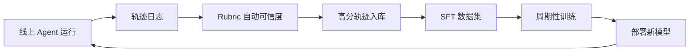

# 08 Rubric评测与评测闭环与SFT/RL规划

> 面试口径：HarmonyDev 是服务 HarmonyOS / OpenHarmony 开发的 AI 开发助手；系统实现主体是 Python Agent 后端 + LocalAgent Gateway + Web/DevEco 面板，不要求运行在鸿蒙设备上。鸿蒙相关内容是被服务的开发对象，包括 ArkTS、ArkUI、Ability、Stage 模型、构建日志和官方文档。


**模块目标：**

- 理解为什么"评测体系是 Agent 项目的关键约束"——没有 Rubric 就没有 reward，没有 reward 就没有训练。

- 掌握 Rubrics as Rewards（RaR）思路：对每条 query 动态生成专属可信度细则，分 P0/P1/P2 三档。

- 理解高分轨迹沉淀 + SFT / Agentic RL（后续规划）的实验路径，以及它们分别解决什么问题。

**阅读重点：** 这一章是整个 HarmonyDev 工程基础设施层的关键收束模块——它决定了项目能不能持续进化。如果你只能记住一件事：**没有评测体系，所有"优化"都只是在赌。** 有了评测，你才敢做训练，才有"持续进化"四个字。

---

## 1、本章导读

### 1.1 一个项目启动时几乎没人重视的事

HarmonyDev 项目第一版完全靠 prompt engineering 调出来的：写 system prompt、调工具描述、改 Few-Shot 示例。

每天的工作就是修 bad case：

```
今天：用户搜"页面返回后状态丢失"返回无关 API → 改 system prompt
明天：用户搜"接口适配"返回不兼容方案 → 加判断规则
后天：外部模型升级了，整体效果抖动 → 整段 prompt 失效，重头调
```

最致命的是最后一条：**模型版本一升级，线上抖动一天，团队完全被动**——既不知道哪儿坏了、也不敢动。

### 1.2 这种状态下你没在"优化"，你在"打地鼠"

修 A case 又冒出 B case，永远没有"系统性变好"的时刻。这不是优化方法的问题，是**没有评测体系**的问题：

- 没有评测，你不知道哪些 case 修好了、哪些没有。

- 没有评测，你不知道这次改 prompt 是变好了还是变坏了。

- 没有评测，你不敢做训练——因为没有 reward 信号。

本章讲的就是怎么从"打地鼠"升级到"数据驱动"。

---

## 2、Rubrics as Rewards：核心思路

### 2.1 不再问"这个回答好不好"

传统评测的问法："这个回答好不好？给个 1-10 分。"

这种问法的问题是太抽象。同一条回答，不同评测人可能给 5 分到 8 分不等，且无法定位"为什么不是 9 分"。

### 2.2 改问"针对这个特定的需求，回答是否满足以下关键维度"

Rubrics as Rewards（RaR）的思路：**为每一条 query 动态生成专属的可信度细则**，再根据细则逐项打分。

例：用户 query 是"ArkUI 页面从详情页返回列表页后状态丢失，目标 HarmonyOS 5.0 / Stage 模型，不要使用废弃 API，保持项目现有代码风格，优先低改动方案。"

针对这条 query，系统调用强模型动态生成的 Rubric：

| 类别 | 维度 | 判定描述 | 权重 |
| --- | --- | --- | --- |
| P0 | 版本与 API 红线 | 建议废弃 API、错误 Kit 或与 HarmonyOS 5.0 / Stage 模型不兼容的写法 → 直接判 fail | Essential（一票否决） |
| P0 | 工程约束 | 方案明显破坏现有代码风格，或需要大范围重构但用户要求低改动 → 直接判 fail | Essential（一票否决） |
| P1 | 组件调用合理性 | 必须包含需求拆解、DocSearch、APIInsight、CompatCheck 和 PatchPicker | Important（fail 扣 2 分） |
| P1 | Query 拆解合理性 | 必须覆盖页面场景、目标版本、状态作用域、禁用废弃 API、代码风格偏好 | Important（fail 扣 2 分） |
| P2 | 需求覆盖度 | 5 分：完美覆盖；3 分：部分覆盖；1 分：泛泛 | Scored（1-5） |
| P2 | 场景洞察力 | 5 分：能区分 ArkUI 页面状态、跨页面共享状态、Ability 生命周期和 Stage 模型边界；1 分：只给泛泛建议 | Scored（1-5） |
| P2 | 决策建议价值 | 5 分：组合策略 + API 约束对比；1 分：无实质建议 | Scored（1-5） |

注意两点：

1. **Rubric 是针对这条 query 动态生成的**——换一条 query（"WebSocket 断连后页面没有收到 AGUI 事件"），Rubric 完全不同。

1. **三档结构**：P0 红线一票否决、P1 规范扣分、P2 质量打分。

---

## 3、三档可信度细则

### 3.1 P0：业务红线

| 例子 | 触发条件 |
| --- | --- |
| 建议废弃 API | API/代码片段命中废弃或不推荐写法 |
| 方案复杂度远超当前工程约束 | 方案需要大范围重构，但用户明确要求低改动 |
| 泄露内部 ID 或工具名 | 输出里出现 `doc_id` 等 |
| 忽略目标版本 | 把只适用于旧模型或旧版本的方案推荐给 HarmonyOS 5.0 / Stage 模型场景 |

P0 项是"一票否决"——只要任意一项 fail，整体直接判 fail，无论 P1/P2 拿了多少分。

### 3.2 P1：执行规范

| 例子 | 触发条件 |
| --- | --- |
| Summary 模块完整性 | DevSummary 必须存在 |
| 工具调用顺序 | 多源检索场景必须包含 DocSearch + APIInsight + CompatCheck |
| Markdown 结构 | API 文档卡片必须有标题、适用版本、实现成本和理由 |
| 效率约束 | 不能死循环（同工具 5 次以上） |

P1 项每违反一项扣 2 分。

### 3.3 P2：质量打分

| 维度 | 1 分 | 5 分 |
| --- | --- | --- |
| 需求覆盖度 | 泛泛推荐 | 完美覆盖用户所有显式 + 隐式需求 |
| 场景洞察力 | 泛泛建议 | 体现鸿蒙开发专业视角（如 ArkUI 状态作用域、Ability 生命周期、Stage 模型边界） |
| 决策建议价值 | 无实质建议 | 提供组合策略 / 对比分析 / API 约束建议 |

P2 项是 1-5 分的打分制。

---

## 4、自动化评测流程

### 4.1 完整流程

```
1. 用户 query 进入
2. 调强模型（如 GPT-5 / Qwen-Max）→ 动态生成 Rubric
3. HarmonyDev Agent 执行 → 产出回答
4. 调 judge 模型（带 Rubric + Agent 回答）→ 逐项打分
5. 计算总分 = α × P0 + β × Σ P1 + γ × Σ P2
6. 入库（query, agent 回答, Rubric, 分数）→ 评测数据集
```

### 4.2 一致性验证

自动化 Rubric 评分需要和人工复核集做一致性验证；在没有真实标注实验前，只能说它用于提升复核效率，不能宣称替代大部分人工评测。

---

## 5、SFT 实验规划：让模型先学会范式

### 5.1 为什么需要 SFT

如果直接对一个开源基座（如 Qwen3-35B-A3B）跑 Agentic RL（规划），**奖励太稀疏**——模型一开始连 AgentLoop 范式都不会，工具调用格式都错，根本拿不到正向 reward 信号。

SFT（监督微调）的作用是让模型先学会"基本范式"：

- 什么时候该 Think

- 什么时候该调 DocSearch

- 什么时候该收尾给 DevSummary

- 工具调用的 JSON 格式

- 多轮循环的节奏

### 5.2 SFT 数据从哪来

**RaR 高分轨迹自动入库**：

```
评测系统每天跑大量 query
  → judge 给出分数
  → 分数 >= 阈值（如 70）的轨迹自动进入 SFT 训练集
  → 周期性微调基座
```

这是一条**可演进的数据链路**——评测越多，高分轨迹越多，后续才有条件做 SFT/RL 实验。面试中不要把规划说成已经完成。

### 5.3 SFT 的训练记录

示例实验口径：如果有真实训练日志，再说明 loss 曲线；面试中默认只说完成了评测闭环和高分轨迹沉淀，SFT/RL 属于后续规划。

这说明：**SFT 数据集（RaR 高分轨迹）信息密度高、噪声低**，模型能高效"内化"领域知识。

---

## 6、Agentic RL（规划）：继续探索质量上限

### 6.1 RL 在哪一步介入

```
Qwen3-35B-A3B 基座
  → SFT 实验（学会 AgentLoop 范式）→ 观察离线评测分变化
  → Agentic RL（后续规划）→ 继续探索工具调用与多步修复质量；没有完整实验前不做外部模型对比结论
```

SFT 解决"会不会"的问题，RL 可以作为后续优化方向；面试中当前只承诺 Rubric 评测和高分轨迹沉淀已经设计清楚。

### 6.2 reward 函数的五个维度

| reward 维度 | 关注点 | 关键校验 |
| --- | --- | --- |
| 响应质量奖励 | 终极目标——最终回答的专业度 | 直接映射 RaR 评测分数 |
| 过程合规奖励 | 推理范式正确——避免无效探索 | 工具调用顺序、终结工具校验、效率约束 |
| Query 拆解奖励 | 中间步骤——搜索词精准度 | 评估生成的搜索词是否具体、是否覆盖多需求 |
| API/代码片段相关性奖励 | 结果匹配度——召回的API/代码片段满足约束 | 实现成本、约束是否符合 query 要求 |
| 格式与安全奖励 | 系统安全——防止泄露内部数据 | 一票否决：泄露 doc_id / 工具名 |

最终 reward = 五维归一化后加权求和。

### 6.3 算法选型

HarmonyDev 用 **GSPO**（Group Sequence Policy Optimization）这类序列级算法：

| 维度 | Token 级算法（如标准 PPO） | 序列级算法（GSPO） |
| --- | --- | --- |
| 重要性比率 | 单 token 概率比 | 整个序列的几何平均比率 |
| 方差 | 长序列下方差大、训练不稳定 | 平滑后稳定 |
| MoE 友好性 | 专家路径切换会震荡 | 只要序列连贯，对 MoE 友好 |

### 6.4 训练后的核心收益

这部分是后续训练规划，面试中不要说成已经完成；真正重要的是：

- **行为可控**：不再因为厂商版本升级而抖动一整天。

- **新版本可发布**：badcase 想修就能定向修，不再靠 prompt 救。

- **只讲受控离线评测与内部基线对比**：在复杂鸿蒙开发任务链路上，后续可比较“接入工程上下文的专用 Agent”与“未接工程上下文的普通问答基线”，但不把规划说成已完成效果。

---

## 7、数据飞轮：闭环起来才有威力

### 7.1 完整闭环



### 7.2 飞轮的几个关键点

| 关键点 | 为什么重要 |
| --- | --- |
| 自动可信度 | 没有自动 judge，人工抽样跟不上线上数据增长 |
| Rubric 动态化 | 不同 query 用不同细则，避免"通用模板"打分失真 |
| 高分阈值 | 只用高质量数据训练，避免"以错训错" |
| 周期性发布 | 模型行为持续微调，跟随业务演进 |

### 7.3 飞轮和厂商升级的关系

通用外部大模型会持续升级，但你**用不上它的训练数据飞轮**——它的数据飞轮是为通用任务优化的，不会专门优化你的鸿蒙开发场景。

HarmonyDev 的数据飞轮是**领域专属**的——它学的是 鸿蒙开发的对话节奏、Rubric 红线、开发者画像分布。这套领域知识是通用模型学不到的。

---

## 8、和前面章节的关系

| 章节 | 为本章贡献了什么 |
| --- | --- |
| 第 1-3 章 | AgentLoop 范式 + fork 策略 → RL 训练的 action space |
| 第 4 章 | 三塔召回 → DocSearch 工具的输出质量影响 reward |
| 第 5 章 | Cache Breakpoint → 训练时的 prompt 结构和线上一致 |
| 第 6 章 | 长期记忆 → 开发者画像作为训练时的额外 context |
| 第 7 章 | AGUI 事件流 → 训练时记录每一步事件，用于 reward 拆解 |

每一章的工程能力都给评测训练闭环贡献了一块拼图。**没有前面 7 章，第 8 章没法落地；没有第 8 章，前面 7 章不能持续进化。**

---

**本章小结：**

到这里，你应该能完整理解 HarmonyDev 的评测训练闭环：

1. 评测体系是 Agent 项目的关键约束——没有 Rubric 就没有 reward，没有 reward 就只能靠 prompt 长期反复修 bad case。

1. Rubrics as Rewards 思路：对每条 query 动态生成专属可信度细则，分 P0 红线 / P1 规范 / P2 质量三档。

1. 自动 judge 需要用人工复核集校准；当前面试口径只说完成了评测流程设计和高分轨迹沉淀。

1. 两阶段训练规划：SFT 实验让模型学习 AgentLoop 范式，Agentic RL（规划）作为后续质量上限探索。

1. 数据飞轮的规划链路是线上 → 评测 → 高分轨迹沉淀 → SFT/RL 实验 → 灰度部署，模型行为可控，不再被厂商版本升级牵着走。

到此，第 1-8 章的能力铺垫全部完成。下一章「[HarmonyDev 项目总览与工程初始化](<14-09 HarmonyDev项目总览与工程初始化.md>)」开始正式进入项目主线，把前面 8 章的所有能力放进一个真实的鸿蒙开发助手项目里。
