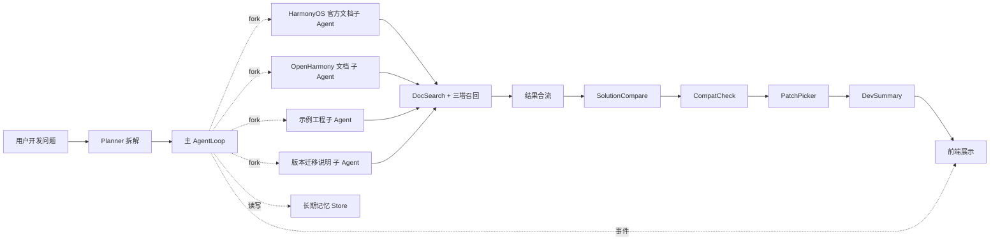
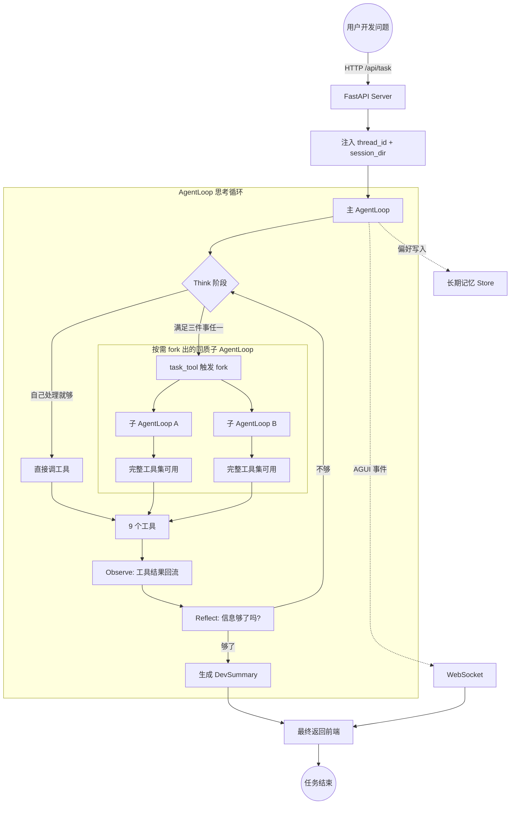

# 09 HarmonyDev 项目总览与工程初始化

> 面试口径：HarmonyDev 是服务 HarmonyOS / OpenHarmony 开发的 AI 开发助手；系统实现主体是 Python Agent 后端 + LocalAgent Gateway + Web/DevEco 面板，不要求运行在鸿蒙设备上。鸿蒙相关内容是被服务的开发对象，包括 ArkTS、ArkUI、Ability、Stage 模型、构建日志和官方文档。


**模块目标：**

- 理解 HarmonyDev 要解决的真实问题：多源对话式鸿蒙开发助手，不是普通的检索框。

- 建立对项目整体架构的第一印象：1 个主 AgentLoop、N 个同质子 AgentLoop（按需 fork）、9 个核心工具、5 类基础设施（向量召回 / 长期记忆 / 上下文压缩 / AGUI / 评测训练）。

- 理解 `thread_id`、`session_dir`、WebSocket 在前后端联动里的位置，以及目录结构里每一层支撑链路上的哪一段。

**阅读重点：** 这一章是 HarmonyDev 项目的工程地图。前面 1 到 8 章的能力，现在要回到一个真实项目里被组装起来。建议边读边在脑子里画一条链路：用户输入开发问题，主 AgentLoop 拆解，按需 fork 同质子 AgentLoop 多源并行检索，结果合流后方案对比筛选，最后回流给前端。目录不用死记，先知道每一类文件支撑链路上的哪一段。

---

## 1、本章导读

### 1.1 先看最终要做成什么样

HarmonyDev 项目对外是一个面向鸿蒙开发的对话式开发助手。用户可以输入开发问题，也可以上传报错日志、关键源码片段或 hvigor 构建日志，后端 AgentLoop 会多源检索、方案对比、算版本兼容，最终整理一份带文档依据和验证步骤的修复建议。

```
用户："我这个 ArkUI 页面从详情页返回后状态丢失了，目标 HarmonyOS 5.0，最好不要使用废弃 API，保持项目现有代码风格。"

页面实时显示：
[Planner] 正在拆解需求：目标 HarmonyOS 5.0 / 不要使用废弃 API / 偏好项目现有代码风格 / ArkUI 状态管理问题
[APIInsight] 正在查API 文档卡片……
[DocSearch ×4] 正在跨 HarmonyOS 官方文档 / OpenHarmony 文档 / 示例工程 / 版本迁移说明并行检索……
[SolutionCompare] 正在方案对比……
[PatchPicker] 已为你过滤掉 若干条不兼容写法……
[DevSummary] 生成中……

最终：3 件API/代码片段的修复建议 + 技术依据 + 多源实现成本对照表
```

入口看似简单，但背后远不止"接一个搜索 API"。

### 1.2 本章先做什么，不做什么

本章属于项目初始化，要完成的是：

1. 看懂项目目标和整体架构。

1. 理解"主 AgentLoop + 按需 fork 同质子 AgentLoop + 9 个工具 + 5 类基础设施"的拓扑结构。

1. 理解前端、后端服务、WebSocket 进度推送之间的关系。

1. 看懂项目目录结构，知道后续代码应该放在哪里。

主 AgentLoop、子 AgentLoop fork 触发、具体工具实现会在第 10 到 15 章继续推进。本章先把项目地图看清楚。

---

## 2、HarmonyDev 要解决什么问题

### 2.1 普通"接搜索 API"为什么不够

很多通用问答助手的实现是这样：

```
用户提问 -> 把 query 透传给某个搜索引擎 -> 把结果列出来
```

这种链路在三类场景下会立刻露馅：

| 场景 | 普通搜索方式的问题 |
| --- | --- |
| "ArkUI 页面状态恢复方案，不要使用废弃 API" | 透传给搜索引擎只能命中字面词，命中不了"页面返回后状态丢失""不要使用废弃 API" |
| "同一个 ArkUI 状态问题，官方文档、示例工程和当前项目代码该怎么看？" | 单一资料源无法判断真实修改点；需要多源证据合流 |
| "上次说不要使用废弃 API，这次还按这个偏好走" | 没有长期记忆，每次都得让用户重复一遍 |

### 2.2 HarmonyDev "深"在哪里

HarmonyDev 的"深"，不是界面更复杂、提示词更长，而是**信息来源更多 + 决策链路可以反复迭代 + 跨会话记得用户**。



主要接入这几类信息源：

| 信息源 | 适合解决什么问题 | 在项目里的承接方式 |
| --- | --- | --- |
| 模型自身知识 | 通用Kit 能力常识、约束词解释 | 主 AgentLoop 直接 Think 阶段调用 |
| 多源开发资料 | 官方文档、OpenHarmony 文档、示例工程、本地项目代码、迁移说明 | DocSearch / ProjectInspect / CompatCheck 工具 |
| 三塔召回 | 语义召回 + 个性化召回（不要使用废弃 API/项目现有代码风格） | 问题意图塔 + API 文档塔 + 工程上下文塔 + Hybrid 检索 |
| Kit 能力域常用方案知识 | "这个 Kit 能力下当前常用的是哪些方案" | APIInsight + RAG 鸿蒙知识库 |
| Web 实时资料 | 官方变更说明、社区 Issue、版本迁移案例 | WebSearch（兜底） |
| 用户开发者画像 | "上次说不要使用废弃 API" | 长期记忆 Store |

### 2.3 可以把它理解成"会替你完成开发任务的研究员"

HarmonyDev 模拟的是一个会替你做功课的开发助手：

```
先理解你要什么
  -> 判断现在的信息够不够下结论
  -> 不够就 fork 子 Agent 去不同资料源和本地工程同时查证
  -> 收齐结果回来方案对比、做兼容性检查
  -> 按工程约束做二次筛选
  -> 给修复建议 + 技术依据
  -> 把这次学到的偏好沉淀到长期记忆里
```

这就是 HarmonyDev 和"接搜索 API 的开发 bot"的本质区别——它不是查一次就结束，而是围绕一个开发目标组织一串可观察、可压缩、可持续优化的任务步骤。

---

## 3、整体架构：主 + 同质子 + 工具 + 基础设施

### 3.1 主 AgentLoop 负责统筹

HarmonyDev 用的不是预定义异构子智能体，而是**主 AgentLoop + 按需 fork 同质子 AgentLoop** 的范式。

主 AgentLoop 像一个有完整能力的研究员，它自己就能调用全部 9 个工具，包括 DocSearch、SolutionCompare、DevSummary。它的职责是：

- 理解用户开发问题；

- 拆解成子目标（问题类型 / Kit 领域 / 目标版本 / 工程文件 / 验证方式 / ...）；

- 在每一轮 Think 阶段判断：这个子目标我自己处理就够了，还是该 fork 一个同质子 Agent 去并行 / 隔离地干；

- 收齐子 Agent 回传的结构化结果，继续下一轮决策；

- 最终输出 DevSummary。

### 3.2 同质子 AgentLoop：fork 出来的"自己"

第 3 章已经讲过：子 AgentLoop 不是预先定义好的异构 worker，而是主 loop 通过 `task_tool(demands)` 工具触发后**fork 出来的一份完整克隆**——同样的工具集、同样的 system prompt、同样的思考能力。

子 AgentLoop 区别于主 loop 的只有四件事：

| 维度 | 主 AgentLoop | 同质子 AgentLoop |
| --- | --- | --- |
| thread_id | 用户会话的 thread_id | `sub-{uuid8}`（独立） |
| checkpoint | 用户主线对话历史 | 子任务专属（不污染主 loop） |
| 输入 | 用户原始 query | 主 loop 派给的 `demands` 字符串 |
| 返回值 | 直接回传给前端 | 返回给主 loop 的 `task_tool(...)` 当字符串 |

主 loop 看到的，子 Agent 不过是一次普通工具调用。这种设计让多 Agent 协同对主 loop 完全透明。

### 3.3 fork 触发的三件事判断

主 AgentLoop 在每一轮 Think 阶段，会判断当前子任务**是否满足以下任一条件**，满足就 fork：

| 条件 | 含义 | HarmonyDev 内的典型场景 |
| --- | --- | --- |
| 能并行 | 多个子任务彼此独立，并行能直接缩短延迟 | 多源同时调 DocSearch |
| 上下文隔离 | 子任务上下文很大，不能污染主 loop | 一次性读取多个源码文件、日志片段和文档段落，避免污染主上下文 |
| 调用链 ≥ 3 | 子任务自己内部还要 Think → Act → Observe 多轮 | Kit 能力洞察先看常用方案 → 看约束 → 看方案复杂度区间 |

不满足任一条件，就主 loop 自己处理。

### 3.4 9 个核心工具

可以把整个项目记成一句话：**1 主 + N 同质子 + 9 工具 + 5 基础设施。**

9 个工具按归属和触发场景拆开看：

| 工具 | 调用者 | 作用 |
| --- | --- | --- |
| `Planner` | 主 loop | 把开发问题拆解成结构化的版本约束 / Kit 领域 / 偏好 / 约束 |
| `ChatFallback` | 主 loop | 闲聊 / 不需要检索的兜底问答 |
| `WebSearch` | 主 loop / 子 Agent | 官方变更、社区 Issue、迁移案例等外部资料检索 |
| `APIInsight` | 主 loop（或 fork） | Kit 能力边界、常见坑、版本差异和替代方案洞察 |
| `DocSearch` | 主 loop / 子 Agent | 多源文档、示例工程和本地代码片段检索 |
| `PatchPicker` | 主 loop（或 fork） | 在合流证据中筛选最小修改面和补丁候选 |
| `SolutionCompare` | 主 loop | 不同修复路径的改动范围、风险和可验证性对比 |
| `CompatCheck` | 主 loop / 子 Agent | API Level、Stage/FA 模型、设备能力和废弃 API 检查 |
| `DevSummary` | 主 loop | 生成最终修复建议 + 技术依据（终结性工具） |

注意 `task_tool` 不在这个表里。它不是业务工具，而是**触发 fork 的元工具**——主 loop 调它意味着"派一个同质子 Agent 去执行这段 demands"。

### 3.5 5 类基础设施

HarmonyDev 的工程门槛集中在基础设施层。每一类对应前面已经学过的一章：

| 基础设施 | 解决什么 | 对应章节 |
| --- | --- | --- |
| 三塔召回 | 跨语言 / 个性化召回，让 DocSearch 不只是命中字面词 | 第 4-0 章 |
| 向量基础设施选型 | Faiss / OpenSearch 双栈分层选型与选型论证 | 第 4-1 章 |
| Cache Breakpoint | 50 轮对话后 token 不爆 + 缓存命中率不掉 | 第 5 章 |
| 长期记忆 Store | 开发者画像跨会话持久化 | 第 6 章 |
| AGUI 事件协议 | 长任务前端实时可见 | 第 7 章 |
| 评测闭环 | Rubric → 高分轨迹沉淀 → 后续 SFT/RL，当前先保证模型行为可观测 | 第 8 章 |

后续章节会把这 5 类基础设施真正接到 9 个工具上。

### 3.6 思考循环：Think → Act → Observe → Reflect（可 fork）

HarmonyDev 主 AgentLoop 的核心是这个循环：



这张图要抓住三个关键点：

- FastAPI 接到任务后异步启动主 AgentLoop，立刻返回 `thread_id`，不等待结果；

- 主 loop 在 Think 阶段做"自己处理 vs fork 子 Agent"的判断，fork 对主 loop 全透明；

- 工具结果回流后进入 Reflect，可以反复 Think → Act → Observe，直到信息足够才生成 DevSummary。

---

## 4、技术栈速览

按"智能体、接口、数据源、工程辅助"四层理解：

| 层次 | 技术 | 在项目里的作用 |
| --- | --- | --- |
| Agent 范式 | AgentLoop（基于 LangChain 二次抽象） | 主 / 同质子的 Think → Act → Observe → Reflect 循环 |
| Fork 机制 | `task_tool(demands)` 元工具 | 主 loop 透明触发同质子 AgentLoop |
| 模型接入 | LangChain + `init_chat_model` | 统一封装大模型、工具声明、Runnable 兼容 |
| 向量召回层 | LLM 三塔模型 + Faiss（HNSW + IP，生产演进 Milvus） | 跨语言多源API/代码片段文档语义 + 工程上下文双通道召回 |
| 向量应用层 | OpenSearch（Hybrid Query + COSINE + ik） | 开发者画像、RAG Kit 领域知识库：语义 + 全文 + 标量三路加权融合 |
| 长期记忆 | Store 接口（LangGraph BaseStore + OpenSearch 后端） | 偏好 / 黑名单 / 历史选择跨会话持久化 |
| 上下文压缩 | Cache Breakpoint + 自定义压缩策略 | 50+ 轮对话不爆 token，同时保 Prompt Cache 命中率 |
| 事件协议 | AGUI 标准事件流 | 前端实时可见 Agent 在做什么 |
| 后端服务 | FastAPI + Uvicorn + asyncio | 长任务异步、active_tasks 表、取消、文件接口 |
| 实时通信 | WebSocket + ConnectionManager | 按 thread_id 路由事件到对应前端 |
| 操作界面 | React/Vite Web 控制台 / DevEco Tool Window | 对话框、AGUI 事件可视化、补丁卡片、开发者画像面板 |
| 评测体系 | Rubrics as Rewards | 每条 query 动态生成 P0/P1/P2 可信度细则 |
| 训练规划 | 高分轨迹沉淀 + SFT/RL 实验预留 | 当前实现先保证评测闭环和轨迹数据可沉淀 |
| 异步上下文 | `asyncio` + `ContextVar` | 多用户并发任务隔离 + thread_id 跨层透明传递 |
| 路径管理 | `pathlib` + `shutil` | 解析上传 / 输出 / 会话目录路径 |
| 环境配置 | `python-dotenv` | 从 `.env` 读取模型 / 召回 / Store / 文档源 / 工程扫描配置 |
| 环境管理 | uv + Python 3.10 | 管理依赖与虚拟环境 |

当前阶段最重要的三件事：**AgentLoop 怎么组织（包括 fork）**、**FastAPI + WebSocket 怎么实时通信**、**ContextVar + 会话目录怎么不串台**。

> 向量库选型（为什么召回层用 `Faiss`、应用层用 `OpenSearch`）的完整论证、Pre/Post/Hybrid 三种检索模式对比、以及主流 8 家向量库的横向评估，集中在 [第 4-1 章 向量基础设施选型与 OpenSearch 演进方向](<08-04-1 向量基础设施选型与OpenSearch演进方向.md>)。

---

## 5、前后端交互与实时进度

### 5.1 为什么不能只用普通 HTTP

普通 HTTP 是这样的：

```
客户端请求一次 -> 服务端处理完 -> 返回一次响应
```

但 HarmonyDev 的一次任务可能包含：

```
1. 创建会话目录
2. Planner 拆解
3. fork 4 个多源子 Agent
4. 各子 Agent 内部 DocSearch + 三塔召回 + CompatCheck
5. 结果合流
6. SolutionCompare + PatchPicker
7. DevSummary
```

整个过程可能 15-20 秒。如果前端没有任何反馈，用户会以为系统挂了。所以 HarmonyDev 用 **HTTP 启动任务 + WebSocket 推送过程事件** 的组合（详见第 7 章）。

### 5.2 thread_id 和 session_dir

从前端到后端，有两个值贯穿全链路：

| 名称 | 解决的问题 | 一句话理解 |
| --- | --- | --- |
| `thread_id` | 当前任务的进度推给哪个前端连接 + checkpoint 隔离 | 本次会话的身份 ID |
| `session_dir` | 当前任务生成的补丁 / 报告写到哪个目录 | 本次任务的工作文件夹 |

完整链路：

```
前端发起任务
  -> 后端创建 thread_id 和 session_dir
  -> 通过 ContextVar 写入当前请求上下文
  -> 主 AgentLoop 和工具执行时随时读取上下文
  -> monitor 根据 thread_id 把 AGUI 事件发送到对应前端
  -> 文件工具根据 session_dir 写入当前会话目录
  -> 即使 fork 子 Agent，子 Agent 也能从 ContextVar 拿到主 loop 的 session_dir
```

如果这两个值串台，A 用户的进度会推给 B 用户，A 的子 Agent 会写进 B 的目录里。

### 5.3 context.py 和 monitor.py 分别管什么

| 文件 | 负责什么 | 一句话记忆 |
| --- | --- | --- |
| `app/api/context.py` | 保存当前任务的 `thread_id` + `session_dir` | 我是谁，文件夹在哪 |
| `app/api/monitor.py` | 把工具调用 / fork / 结果等 AGUI 事件发送到前端 | 我现在正在做什么 |

后续工具实现里只要调一句 `monitor.report_tool_start("doc_search", ...)`，前端就能看到执行过程，不需要工具关心 thread_id、WebSocket 路由这些细节。

---

## 6、项目工程目录与依赖准备

### 6.1 同步依赖

仓库里已经准备好 `pyproject.toml`、`uv.lock`、基础目录与初始化代码。拿到仓库后，进入 `harmonydev-agent` 根目录：

```bash
uv add -r requirements.txt
uv sync
```

| 命令 | 作用 |
| --- | --- |
| `uv add -r requirements.txt` | 读取依赖建议列表，写入 `pyproject.toml`，更新 `uv.lock` |
| `uv sync` | 根据 `pyproject.toml` + `uv.lock` 创建或更新 `.venv`，让本地环境对齐声明 |

同步完成后做一次连通性检查：

```bash
uv run python -V
uv run python -c "import langgraph, langchain, fastapi, faiss; print('ok')"
```

### 6.2 项目目录结构

```
harmonydev-agent/
├── app/                          # 后端业务代码主目录
│   ├── agent/                    # AgentLoop 主体与 fork 机制
│   │   ├── llm.py                # 统一创建大模型对象
│   │   ├── prompts.py            # 读取 app/prompt/prompts.yml
│   │   ├── main_agent.py         # 后续章节补充：主 AgentLoop 组装入口
│   │   ├── task_tool.py          # 后续章节补充：fork 同质子 AgentLoop 的元工具
│   │   └── system_prompt.py      # 主 / 子共用的 system prompt 拼装
│   ├── api/                      # FastAPI、WebSocket、上下文与监控
│   │   ├── context.py            # 保存 thread_id + session_dir 的 ContextVar
│   │   ├── monitor.py            # 推送 AGUI 事件（tool_start / tool_end / task_result）
│   │   ├── connection.py         # ConnectionManager：thread_id → WebSocket 路由
│   │   └── server.py             # 后续章节补充：FastAPI 服务入口
│   ├── tools/                    # 9 个核心工具实现
│   │   ├── planner.py            # 后续章节补充：意图拆解
│   │   ├── chat_fallback.py      # 兜底闲聊
│   │   ├── web_search.py         # 外部资料检索
│   │   ├── api_insight.py   # 后续章节补充：Kit 领域常用方案洞察（基于 RAG 鸿蒙知识库）
│   │   ├── doc_search.py        # 后续章节补充：多源文档检索
│   │   ├── patch_picker.py        # 候选集二次筛选
│   │   ├── solution_compare.py      # 后续章节补充：修复方案对比
│   │   ├── compat_check.py      # 后续章节补充：版本兼容估算
│   │   └── dev_summary.py   # 终结性工具：生成修复建议
│   ├── recall/                   # LLM 三塔召回客户端
│   │   ├── tower_user.py         # 工程上下文塔
│   │   ├── tower_query.py        # 问题意图塔
│   │   ├── tower_item.py         # API 文档塔
│   │   └── ann.py                # ANN 索引访问（Faiss / Milvus）
│   ├── memory/                   # 长期记忆 Store
│   │   ├── store.py              # PreferenceEntry 读写
│   │   └── injector.py           # 注入 system prompt 末尾
│   ├── compress/                 # Cache Breakpoint 上下文压缩
│   │   ├── breakpoint.py         # 计算压缩边界
│   │   └── compressor.py         # 边界以前的消息压缩成摘要
│   ├── eval/                     # 评测与训练数据采集
│   │   ├── rubric.py             # 动态生成 Rubric
│   │   ├── judge.py              # 自动 judge 打分
│   │   └── trace_logger.py       # 高分轨迹入库
│   ├── prompt/                   # 提示词配置
│   │   └── prompts.yml           # 主 / 子共用 system prompt + 工具描述
│   └── utils/                    # 普通 Python 工具函数
│       ├── path_utils.py         # 解析上传 / 输出 / 会话目录路径
│       └── thread_ctx.py         # 设置 / 读取 ContextVar 的封装
├── web-console/                     # Web 控制台 / DevEco 插件项目
├── docker/                       # 本地服务（向量库、Redis 等）的 Docker Compose
├── examples/                     # 第 1 到 8 章对应的能力示例脚本
├── tests/                        # 工具、连接管理、取消任务等测试
├── output/                       # 运行时生成：补丁 / 报告
├── uploaded/                     # 运行时生成：用户上传文件
├── .env.example                  # 环境变量示例
├── .env                          # 本地真实配置，不提交仓库
├── .python-version
├── pyproject.toml
└── uv.lock
```

### 6.3 区分两类"工具"

| 类型 | 给谁用 | 例子 |
| --- | --- | --- |
| Agent Tool | 给模型调用 | `doc_search` / `solution_compare` / `task_tool` |
| Python Utils | 给代码调用 | 路径解析、ContextVar 封装、ANN 索引访问 |

`app/utils/`、`app/recall/`、`app/memory/` 不会暴露给模型。它们是后端内部能力；某个 Agent Tool 在内部可以调用它们。例如 `doc_search` 这个 Agent Tool 内部会调用 `app/recall/` 下的三塔召回客户端，但模型看到的只是工具入参 `query` 和返回值结构。

---

**本章小结：**

到这里，我们完成了 HarmonyDev 项目的总览和工程地图。现在你应该已经清楚：

- HarmonyDev 不是普通的"接搜索 API"，而是一个多源、可方案对比、可记忆、可持续训练的对话式鸿蒙开发助手；

- 整体架构是 **1 主 + 按需 fork 的同质子 + 9 工具 + 5 基础设施**，主 / 子之间通过 `task_tool(demands)` 透明协作；

- 主 AgentLoop 在 Think 阶段按"能并行 / 上下文隔离 / 链深 ≥ 3"三件事判断是否 fork；

- 前端任务通过 HTTP 启动 + WebSocket 推送过程事件，`thread_id` 和 `session_dir` 贯穿全链路且通过 ContextVar 透明传递；

- 项目目录已经按"AgentLoop / API / 工具 / 召回 / 记忆 / 压缩 / 评测"分层，每一层支撑链路上的特定一段。

下一章「[基础模块与模型配置](<15-10 基础模块与模型配置.md>)」会继续进入具体代码：`.env`、`context.py`、`monitor.py`、`thread_ctx.py`、`path_utils.py`、`llm.py` 和提示词配置——把这一章的"地图"落到可运行的"骨架"。
