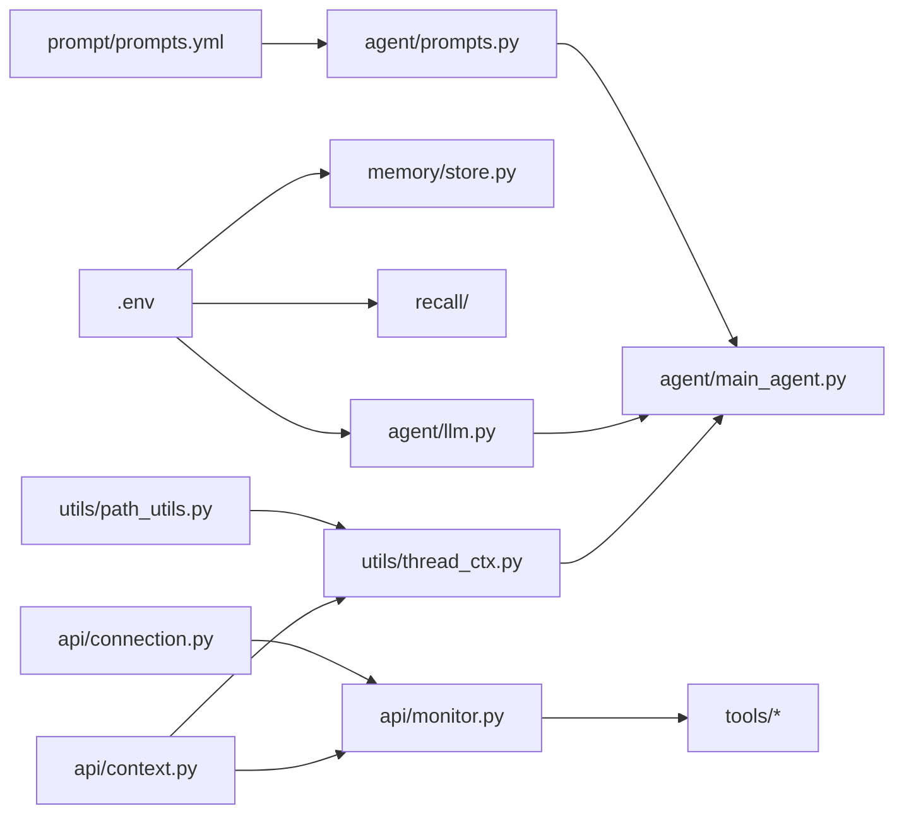

# 10 - HarmonyDev 基础模块与模型配置

> 面试口径：HarmonyDev 是服务 HarmonyOS / OpenHarmony 开发的 AI 开发助手；系统实现主体是 Python Agent 后端 + LocalAgent Gateway + Web/DevEco 面板，不要求运行在鸿蒙设备上。鸿蒙相关内容是被服务的开发对象，包括 ArkTS、ArkUI、Ability、Stage 模型、构建日志和官方文档。


---

**模块目标：**

- 准备 `.env`，把模型、三塔召回、Store、多源 API 等配置从代码里拆出来。

- 理解 `ContextVar` 如何保存当前任务的 `thread_id` 和 `session_dir`，避免多用户并发请求串台，并保证 fork 出去的子 AgentLoop 仍能拿到主 loop 的会话上下文。

- 理解 `monitor.py` 如何把 AGUI 事件（tool_start / tool_end / fork / task_result）发送到前端。

- 熟悉 `connection.py` 这个 thread_id → WebSocket 路由的核心组件。

- 熟悉 `path_utils.py`、`thread_ctx.py` 这两个普通工具模块的职责。

- 完成 `agent/llm.py`、`prompt/prompts.yml`、`agent/prompts.py` 这组模型与提示词配置。

**阅读重点：** 这一章看的是项目底座，不是零散工具函数。可以顺着"配置入口 → 请求上下文 → 实时进度 → 路径与上下文工具 → 模型与提示词"追一遍，边读边问：这个模块被谁创建、被谁调用、出问题会影响哪条链路。把这些底座看清楚，后面写主 AgentLoop 和 9 个工具时会轻很多。

---

上一章已经完成 HarmonyDev 项目的整体认识：项目要解决什么问题、主 AgentLoop 与按需 fork 的同质子 AgentLoop 如何配合、9 个工具与 5 类基础设施的拓扑、前后端为什么需要 `thread_id` 和 AGUI 实时进度，以及仓库目录与依赖如何准备。

本章继续往下走，但不急着写 DocSearch、SolutionCompare 这些业务工具。我们先把它们会依赖的基础模块准备好：

| 模块 | 解决什么问题 |
| --- | --- |
| `.env` | 把模型、三塔召回、Store、文档源 / 工程扫描 等配置集中管理 |
| `api/context.py` | 在一次请求链路中保存当前任务的身份和会话目录 |
| `api/monitor.py` | 把 AGUI 事件（tool_start / fork / task_result）发送到前端 |
| `api/connection.py` | 维护 thread_id → WebSocket 的路由表，处理重连与并发 |
| `utils/thread_ctx.py` | 封装 ContextVar 的读写，让 fork 出去的子 Agent 也能继承 |
| `utils/path_utils.py` | 统一解析上传 / 输出 / 会话目录路径 |
| `agent/llm.py` | 统一创建大模型对象（主 loop 与子 loop 共用同一个 LLM） |
| `prompt/prompts.yml` | 用 YAML 集中管理 system prompt 与工具描述 |
| `agent/prompts.py` | 从 YAML 中读取提示词配置，供主 / 子 AgentLoop 组装时使用 |

可以把本章看成"业务工具之前的地基"。这些模块写清楚以后，后面新增工具、主 / 子 AgentLoop 和接口时，就不用在每个文件里重复处理配置、路径、上下文和模型初始化。

---

## 1、配置入口：.env

### 1.1 .env 配置

项目对应文件路径：`harmonydev-agent/.env`。复制 `.env.example` 为 `.env`，再把占位值改成你的实际配置。

```dotenv
# ========== LLM 配置 ==========
# 主 / 子 AgentLoop 共用同一个 LLM（同质 fork 的核心要求）
OPENAI_BASE_URL=https://dashscope.aliyuncs.com/compatible-mode/v1
OPENAI_API_KEY=你的大模型_API_KEY
LLM_MAIN=qwen3-30b-a3b-instruct
LLM_JUDGE=qwen-max

# ========== 三塔召回 ==========
# Faiss / Milvus 选其一即可
ANN_BACKEND=faiss
ANN_INDEX_PATH=./data/item_index.faiss
TOWER_USER_ENDPOINT=http://localhost:8081/encode/user
TOWER_QUERY_ENDPOINT=http://localhost:8081/encode/query
TOWER_ITEM_ENDPOINT=http://localhost:8081/encode/item

# ========== 长期记忆 Store ==========
STORE_BACKEND=redis        # redis / postgres
STORE_REDIS_URL=redis://localhost:6379/2

# ========== 多源文档检索 ==========
HARMONY_DOCS_API_KEY=占位
SHOPEE_API_KEY=占位
ALIEXPRESS_API_KEY=占位
EBAY_API_KEY=占位

# ========== Web 兜底搜索 ==========
TAVILY_API_KEY=你的_TAVILY_API_KEY

# ========== 上下文压缩 ==========
COMPRESS_KEEP_RECENT=3      # 保留最近 N 次工具调用不压缩
COMPRESS_MAX_TOKENS=12000   # 单条消息超过则触发压缩

# ========== AGUI / WebSocket ==========
WS_PING_INTERVAL=20

# ========== 评测训练 ==========
RUBRIC_HIGH_SCORE=70        # >= 该分数自动入 SFT 训练集
TRACE_LOG_DIR=./data/traces
```

**当前阶段最先要保证可用的是 LLM 配置**。三塔召回服务、Store、多源 API 这些可以先占位，等对应章节再补成真实值。

### 1.2 .env 之外的配置该放哪

不是所有东西都适合放 `.env`：

| 类型 | 放哪里 | 原因 |
| --- | --- | --- |
| 密钥 / endpoint | `.env` | 运行环境差异大，不能写死在代码里 |
| 模型温度 / topp | `prompts.yml` 或代码常量 | 影响生成行为，跟提示词强相关，便于版本管理 |
| Rubric 模板 | `app/eval/rubric.py` | 是结构化代码逻辑，不是简单 K-V |
| Cache Breakpoint 阈值 | `.env` | 部署期会按环境调整 |

`.env` 里只放"环境相关"的内容，结构化逻辑别塞进来。

---

## 2、请求上下文：api/context.py

### 2.1 它解决什么问题

HarmonyDev 是异步 Web 服务，同一时间可能有多个用户请求在执行；并且主 AgentLoop 还会按需 fork 出同质子 AgentLoop。如果用全局变量保存当前用户的 `thread_id` 或 `session_dir`，就会立刻串台。

典型问题：

```
用户 A 的任务还没结束
用户 B 的任务进来了
全局变量被 B 覆盖
用户 A 的进度推给了 B
A fork 出去的子 Agent 写到了 B 的 session_dir 里
```

`asyncio` 是单线程协程并发——很多请求在同一个事件循环里交替推进。Python 提供 `ContextVar` 来解决这种"线程内多任务"的隔离：每个 asyncio Task 有自己独立的 ContextVar 副本，互不影响。

### 2.2 实现

```python
# app/api/context.py
from contextvars import ContextVar
from pathlib import Path
from typing import Optional

# 当前请求的 thread_id（由 /api/task 入口设置）
_thread_id_var: ContextVar[Optional[str]] = ContextVar(
    "globex_thread_id", default=None
)

# 当前请求的会话目录（输出文件落到这里）
_session_dir_var: ContextVar[Optional[Path]] = ContextVar(
    "globex_session_dir", default=None
)

def set_thread_context(thread_id: str, session_dir: Path) -> None:
    """请求入口处调用，写入本次任务的身份信息。"""
    _thread_id_var.set(thread_id)
    _session_dir_var.set(session_dir)

def get_thread_id() -> Optional[str]:
    return _thread_id_var.get()

def get_session_dir() -> Optional[Path]:
    return _session_dir_var.get()
```

### 2.3 fork 子 AgentLoop 时上下文怎么传

ContextVar 的关键特性是 `asyncio.create_task`** 会自动复制当前 Task 的 ContextVar 快照**。也就是说，主 loop 在执行 `task_tool(demands)` 时——如果内部用 `await sub_agent.ainvoke(...)`——子 Agent 自然继承主 loop 的 thread_id 和 session_dir。

但是！如果想让子 Agent **写自己的 thread_id**（用于 checkpoint 隔离）但**继承主 loop 的 session_dir**（保证文件落到同一个目录），就需要在 `task_tool` 内部显式覆盖：

```python
# app/agent/task_tool.py（节选）
@tool
async def task_tool(demands: str) -> str:
    parent_session_dir = get_session_dir()  # 继承主 loop 的目录
    sub_thread_id = f"sub-{uuid4().hex[:8]}"

    # 在子任务作用域内重置 thread_id，但保留 session_dir
    token_thread = _thread_id_var.set(sub_thread_id)
    token_dir = _session_dir_var.set(parent_session_dir)
    try:
        result = await sub_agent.ainvoke(...)
        return result["messages"][-1].content
    finally:
        _thread_id_var.reset(token_thread)
        _session_dir_var.reset(token_dir)
```

这样保证子 Agent 的 monitor 事件带的是 `sub-xxx` thread_id（前端可以用来高亮"子 Agent 正在干"），文件却写到主 loop 的会话目录里。

---

## 3、实时进度：api/monitor.py

### 3.1 它解决什么问题

第 7 章已经讲过 AGUI 事件协议。`monitor.py` 是事件统一封装层——工具实现里只调一句 `monitor.report_xxx(...)`，剩下的"找 thread_id、找 WebSocket、序列化、加时间戳"全部由 monitor 处理。

### 3.2 实现

```python
# app/api/monitor.py
from datetime import datetime
from typing import Any
from app.api.context import get_thread_id
from app.api.connection import manager

class Monitor:
    """统一封装 AGUI 事件上报。"""

    async def _emit(self, event: str, message: str, data: dict[str, Any]) -> None:
        thread_id = get_thread_id()
        if thread_id is None:
            return  # 没有上下文（如离线脚本调用工具）就静默丢弃

        payload = {
            "type": "monitor_event",
            "event": event,
            "message": message,
            "data": data,
            "timestamp": datetime.now().isoformat(),
        }
        await manager.send_to_thread(payload, thread_id)

    async def report_tool_start(self, tool_name: str, args: dict) -> None:
        await self._emit("tool_start", f"正在调用 {tool_name}", {
            "tool_name": tool_name, "args": args,
        })

    async def report_tool_end(self, tool_name: str, duration_ms: int) -> None:
        await self._emit("tool_end", f"{tool_name} 完成", {
            "tool_name": tool_name, "duration_ms": duration_ms,
        })

    async def report_fork(self, sub_thread_id: str, demands: str) -> None:
        await self._emit("fork", "派发子 AgentLoop", {
            "sub_thread_id": sub_thread_id,
            "demands": demands[:200],
        })

    async def report_task_result(self, final_answer: str) -> None:
        await self._emit("task_result", "任务完成", {
            "final_answer": final_answer,
        })

    async def report_error(self, error_type: str, message: str) -> None:
        await self._emit("error", message, {"error_type": error_type})

monitor = Monitor()
```

### 3.3 工具内部怎么用

工具实现里只关心"我开始了 / 我结束了"，不关心 WebSocket 细节：

```python
@tool
async def doc_search(query: str, source: str) -> str:
    await monitor.report_tool_start("doc_search", {"query": query, "source": source})
    t0 = time.time()
    result = await actual_search(query, source)
    await monitor.report_tool_end("doc_search", int((time.time() - t0) * 1000))
    return result
```

---

## 4、连接路由：api/connection.py

### 4.1 它解决什么问题

`monitor` 知道当前 thread_id，但要把消息推到具体 WebSocket，还需要一张 **thread_id → WebSocket** 的路由表。`ConnectionManager` 就是这张表。

### 4.2 实现

```python
# app/api/connection.py
import asyncio
from fastapi import WebSocket

class ConnectionManager:
    def __init__(self) -> None:
        self.active: dict[str, WebSocket] = {}
        self._lock = asyncio.Lock()

    async def connect(self, websocket: WebSocket, thread_id: str) -> None:
        await websocket.accept()
        async with self._lock:
            self.active[thread_id] = websocket

    async def disconnect(self, websocket: WebSocket, thread_id: str) -> None:
        # 关键：判断对象身份，避免重连时误删新连接
        async with self._lock:
            if self.active.get(thread_id) is websocket:
                del self.active[thread_id]

    async def send_to_thread(self, payload: dict, thread_id: str) -> None:
        ws = self.active.get(thread_id)
        if ws is None:
            return  # 前端尚未连接 / 已断开，丢弃事件
        try:
            await ws.send_json(payload)
        except Exception:
            # 发送异常一般是连接已断
            await self.disconnect(ws, thread_id)

manager = ConnectionManager()
```

### 4.3 重连场景的对象身份判断

用户刷新页面会建立新 WebSocket，旧连接稍后才触发断开事件。如果 `disconnect` 按 thread_id 盲删，会把刚建好的新连接误删。所以必须判断 `is websocket`——只有当前登记的就是要断开的对象时才删。

---

## 5、上下文工具：utils/thread_ctx.py

### 5.1 把 ContextVar 的写入封装成"作用域"

主入口里要写 `set_thread_context(...)`，task_tool 里又要 set / reset，重复代码很多。封装成上下文管理器更清爽：

```python
# app/utils/thread_ctx.py
from contextlib import contextmanager
from pathlib import Path
from app.api.context import (
    _thread_id_var, _session_dir_var,
    set_thread_context, get_thread_id, get_session_dir,
)

@contextmanager
def thread_scope(thread_id: str, session_dir: Path):
    """作用域内绑定 thread_id 与 session_dir，离开作用域自动还原。"""
    token_t = _thread_id_var.set(thread_id)
    token_s = _session_dir_var.set(session_dir)
    try:
        yield
    finally:
        _thread_id_var.reset(token_t)
        _session_dir_var.reset(token_s)
```

### 5.2 调用方变得很清爽

```python
async def run_agent(query: str, thread_id: str):
    session_dir = ensure_session_dir(thread_id)
    with thread_scope(thread_id, session_dir):
        await main_agent.ainvoke({"messages": [("user", query)]})
```

`task_tool` 里也可以用同样的方式覆盖 thread_id。

---

## 6、路径工具：utils/path_utils.py

### 6.1 它解决什么问题

HarmonyDev 需要写两类文件：

- 用户上传：报错日志、关键源码片段、hvigor 构建日志 → 落到 `uploaded/{thread_id}/`

- 任务输出：修复方案建议列表、PDF 报告 → 落到 `output/{thread_id}/`

如果每个工具都自己拼路径，很容易写出"相对路径相对的是项目根 vs 当前文件目录"这种 bug。统一封装：

```python
# app/utils/path_utils.py
from pathlib import Path

PROJECT_ROOT = Path(__file__).resolve().parents[2]
UPLOAD_ROOT = PROJECT_ROOT / "uploaded"
OUTPUT_ROOT = PROJECT_ROOT / "output"

def ensure_session_dir(thread_id: str) -> Path:
    """获取或创建本次任务的输出目录。"""
    session_dir = OUTPUT_ROOT / thread_id
    session_dir.mkdir(parents=True, exist_ok=True)
    return session_dir

def ensure_upload_dir(thread_id: str) -> Path:
    """获取或创建本次任务的上传目录。"""
    upload_dir = UPLOAD_ROOT / thread_id
    upload_dir.mkdir(parents=True, exist_ok=True)
    return upload_dir

def safe_join(base: Path, *parts: str) -> Path:
    """防止 ../../ 越权访问的拼路径。"""
    target = (base / Path(*parts)).resolve()
    if not str(target).startswith(str(base.resolve())):
        raise ValueError(f"路径越权: {target}")
    return target
```

`safe_join` 在 PatchPicker 等工具里读用户上传文件时会用上——避免恶意用户传 `../../etc/passwd`。

---

## 7、模型初始化：agent/llm.py

### 7.1 主 / 子 AgentLoop 共用同一个 LLM

同质 fork 的核心要求是：**主 loop 和所有 fork 出去的子 loop 用完全相同的模型与温度**——这样子 Agent 的"思考方式"才是主 loop 的真克隆。

```python
# app/agent/llm.py
import os
from functools import lru_cache
from langchain.chat_models import init_chat_model

@lru_cache(maxsize=1)
def get_llm():
    """主 / 子 AgentLoop 共用的大模型实例。"""
    return init_chat_model(
        os.environ["LLM_MAIN"],
        model_provider="openai",
        api_key=os.environ["OPENAI_API_KEY"],
        base_url=os.environ["OPENAI_BASE_URL"],
        temperature=0.3,
    )

@lru_cache(maxsize=1)
def get_judge_llm():
    """评测体系（Rubric judge）专用的强模型。"""
    return init_chat_model(
        os.environ.get("LLM_JUDGE", "qwen-max"),
        model_provider="openai",
        api_key=os.environ["OPENAI_API_KEY"],
        base_url=os.environ["OPENAI_BASE_URL"],
        temperature=0.0,
    )
```

`lru_cache` 让 LLM 对象只创建一次，避免每次 fork 都重新建立连接池。

### 7.2 为什么 judge 用更强的模型

第 8 章讲过：judge 模型负责按 Rubric 给 Agent 回答打分，是可信度质量的关键。一般用比主模型更强的模型（如 qwen-max / GPT-5），且 `temperature=0.0` 保证可信度稳定。

---

## 8、提示词管理：prompt/prompts.yml + agent/prompts.py

### 8.1 为什么要拆 YAML

HarmonyDev 的 system prompt 比一般 Agent 长——要包含：

- AgentLoop 范式说明（Think / Act / Observe / Reflect）

- fork 三件事判断准则

- 9 个工具的使用边界

- 长期记忆注入位

直接写在 Python 字符串里又长又难维护。拆成 YAML 是惯例。

### 8.2 prompts.yml

```yaml
# app/prompt/prompts.yml
system_prompt: |
  你是 HarmonyDev，一个服务 HarmonyOS / OpenHarmony 开发的 AI 开发助手。

  # AgentLoop 范式
  你的每一轮都要走 Think → Act → Observe → Reflect 循环。
  - Think：拆解用户意图，判断当前缺什么信息。
  - Act：调用工具或 task_tool 派发子 Agent。
  - Observe：阅读工具返回，注意结构化字段。
  - Reflect：信息够了吗？够就给 DevSummary，不够就回到 Think。

  # 子 AgentLoop fork 判断
  当下一步子任务满足以下任一条件，你应该调 task_tool(demands="...")：
  1. 能并行：多个独立检索可以同时跑（如多源 DocSearch）
  2. 上下文要隔离：子任务输出很大（如一次拉 100 件API/代码片段做筛选）
  3. 调用链 ≥ 3：子任务自己内部还要多轮 Think → Act

  # 工具建议列表
  - Planner: 拆解用户开发问题为结构化字段
  - ChatFallback: 闲聊兜底
  - WebSearch: 检索评测、官方变更说明 / 社区 Issue、API 变更趋势
  - APIInsight: 查Kit 领域常用方案 / 典型约束（基于 RAG 鸿蒙知识库）
  - DocSearch: 单一资料源文档检索（多源时通过 task_tool fork）
  - PatchPicker: 在合流候选集里按开发者画像二次筛选
  - SolutionCompare: 候选方案API/代码片段方案对比
  - CompatCheck: 版本约束 + 兼容性风险估算
  - DevSummary: 终结性工具，给最终修复建议 + 技术依据
  - task_tool(demands): 派一个同质子 Agent 去执行 demands

  # 长期记忆
  下面是该用户已沉淀的开发者画像（不要使用废弃 API / 偏好项目现有代码风格 / ...）：
  {long_term_preferences}

planner_prompt: |
  你是 HarmonyDev 的 Planner 工具。把用户开发问题拆解成结构化字段：
  kit / target_version / symptom / source_scope / hard_constraints / code_style_preferences。

dev_summary_prompt: |
  你是 HarmonyDev 的 DevSummary 工具。基于已收集的候选方案 + 开发者画像，
  给出最多 3 件API/代码片段的最终修复建议，每件附 50 字以内的技术依据。
```

### 8.3 prompts.py

```python
# app/agent/prompts.py
from functools import lru_cache
from pathlib import Path
import yaml

@lru_cache(maxsize=1)
def _load_prompts() -> dict:
    cfg_path = Path(__file__).parent.parent / "prompt" / "prompts.yml"
    with cfg_path.open("r", encoding="utf-8") as f:
        return yaml.safe_load(f)

def get_system_prompt(long_term_preferences: str = "") -> str:
    """主 / 子 AgentLoop 共用的 system prompt（带开发者画像注入位）。"""
    template = _load_prompts()["system_prompt"]
    return template.format(long_term_preferences=long_term_preferences or "（暂无沉淀偏好）")

def get_planner_prompt() -> str:
    return _load_prompts()["planner_prompt"]

def get_dev_summary_prompt() -> str:
    return _load_prompts()["dev_summary_prompt"]
```

`{long_term_preferences}` 是第 6 章讲过的"注入位"——在请求入口，从 Store 读出该用户的偏好，格式化后填入 system prompt 末尾。

---

## 9、底座之间的依赖关系

把上面 7 个模块梳理成一张依赖图：



后续章节看到 `from app.api.monitor import monitor` 或 `from app.utils.thread_ctx import thread_scope` 这类导入，就能立刻定位它在哪一层。

---

**本章小结：**

到这里，HarmonyDev 的工程底座已经搭好。现在你应该已经清楚：

- `.env` 集中放运行环境差异大的配置，结构化逻辑别塞进来；

- `ContextVar` + `thread_scope` 让 `thread_id` 和 `session_dir` 在多用户并发 + 主 / 子 AgentLoop fork 中都不串台；

- `monitor` 是 AGUI 事件统一封装层，工具实现里只调一句即可；

- `ConnectionManager` 维护 thread_id → WebSocket 路由，重连场景必须判断对象身份；

- `path_utils` 用 `safe_join` 防越权；

- `agent/llm.py` 主 / 子共用同一个 LLM 实例（同质 fork 的前提）；

- `prompts.yml` 把 system prompt + 工具描述 + 开发者画像注入位拆出来，便于版本管理。

下一章「[DocSearch 文档检索工具实现与多源 fork 触发场景](<16-11 DocSearch文档检索工具实现与多源fork触发场景.md>)」开始进入 9 个核心工具，从最重要的 DocSearch 入手——并第一次真正跑通"主 loop fork 4 个同质子 AgentLoop 多源并行检索"的完整链路。
