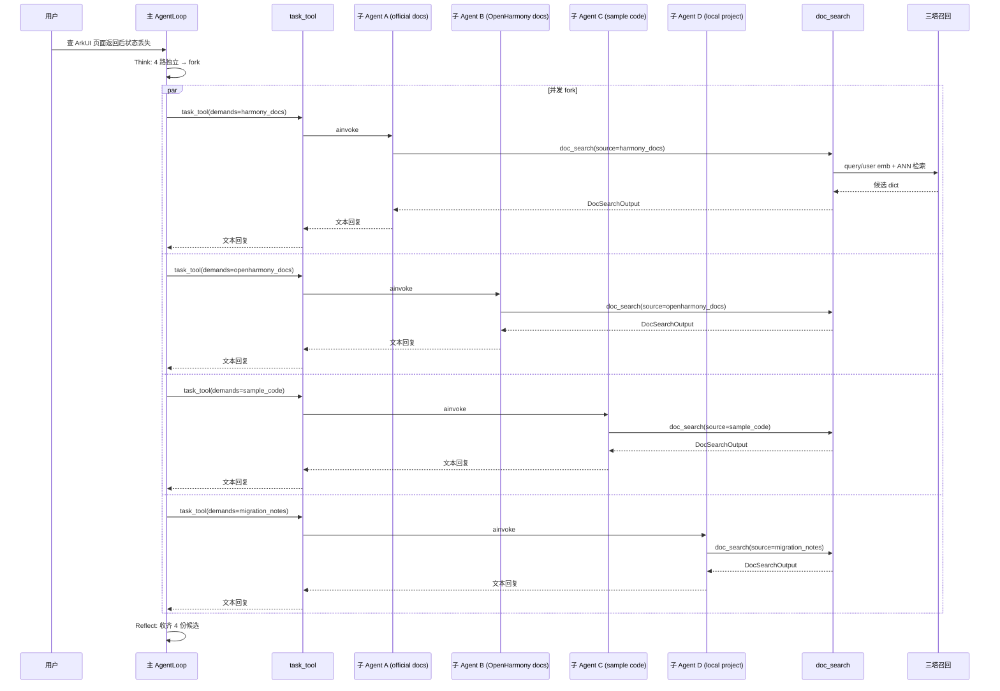

# 11 DocSearch文档检索工具实现与多源fork触发场景

> 面试口径：HarmonyDev 是服务 HarmonyOS / OpenHarmony 开发的 AI 开发助手；系统实现主体是 Python Agent 后端 + LocalAgent Gateway + Web/DevEco 面板，不要求运行在鸿蒙设备上。鸿蒙相关内容是被服务的开发对象，包括 ArkTS、ArkUI、Ability、Stage 模型、构建日志和官方文档。


**模块目标：**

- 把第 4 章「LLM 三塔召回」真正接到一个 Agent 工具上：实现 `doc_search` 工具，让模型一次调用就能拿到一个资料源的相关文档、示例或工程片段。

- 第一次跑通"主 AgentLoop fork 4 个同质子 AgentLoop 各自调一次 DocSearch"的完整链路，看清 fork 三件事判断的"能并行"在工程层是怎么落的。

- 理解工具入参 / 出参的设计原则——给模型看的字段尽量小、给后续工具用的结构尽量稳。

**阅读重点：** 这一章是 HarmonyDev 第一个真正有"业务味"的工具。看代码时关注三件事：(1) 工具签名是怎么让模型不绕弯就用对；(2) 三塔召回怎么作为内部依赖被复用；(3) 主 loop 在什么时候选择 fork 而不是自己串行调用。

---

## 1、本章导读

### 1.1 DocSearch 在整张大图里的位置

把第 9 章那张总图缩到 DocSearch 这一段：

```
用户开发问题
  -> Planner 拆解（问题类型 / Kit 领域 / 目标版本 / 工程约束）
  -> 主 AgentLoop 在 Think 阶段判断："要多源"
  -> task_tool ×4 fork 4 个同质子 AgentLoop
       ├─ 子 A：调 doc_search(source="harmony_docs", ...)
       ├─ 子 B：调 doc_search(source="openharmony_docs", ...)
       ├─ 子 C：调 doc_search(source="sample_code", ...)
       └─ 子 D：调 doc_search(source="migration_notes", ...)
  -> 多源证据合流回主 loop
  -> SolutionCompare / CompatCheck / PatchPicker / DevSummary
```

DocSearch 是这张图里**最频繁被调用的工具**，也是**最容易决定整体延迟和质量的工具**。本章把它和"多源 fork"两个事情一起做，因为它们天然耦合。

### 1.2 本章先做什么，不做什么

要做的：

1. 设计 `doc_search` 的工具签名：模型应该传什么、得到什么。

1. 在工具内部接入第 4 章的三塔召回（工程上下文塔 + 问题意图塔 + API 文档塔 + ANN）。

1. 实现"语义 + 个性化"双通道召回的合并。

1. 串通主 loop 的 fork 三件事判断：什么时候多源 fork、什么时候单一资料源主 loop 自己跑。

不做的：

- 方案对比、兼容性风险、筛选、最终修复建议留给第 12-14 章。

- 真实文档源 / 工程扫描 的合规接入（OAuth / 反爬虫）超出当前实现范围，本章的"多源调用"是统一的 SearchClient 抽象。

---

## 2、工具签名设计：让模型一眼看懂

### 2.1 为什么签名比实现还重要

Agent 工具的真正"用户"是大模型本身。一个签名不友好的工具，会出现这些问题：

| 签名问题 | 模型典型行为 |
| --- | --- |
| 入参太多 / 互斥参数没说明 | 模型挑错参数 / 重复尝试 / 触发死循环 |
| 入参允许自由 JSON | 模型瞎写键名，每次调用结构不同 |
| 出参全是嵌套 dict 没字段说明 | 后续工具读不到关键字段 |
| 出参把 100 条 API/代码片段全平铺 | token 爆炸，主 loop Reflect 阶段被淹 |

设计原则：**入参少而正交，出参字段名稳定且可被后续工具消费。**

### 2.2 DocSearch 的最终签名

```python
# app/tools/doc_search.py
from langchain_core.tools import tool
from pydantic import BaseModel, Field
from typing import Literal

DocSource = Literal[
    "harmony_docs",        # HarmonyOS 官方文档
    "openharmony_docs",    # OpenHarmony 开源文档
    "sample_code",         # 官方/团队示例工程
    "migration_notes",     # 版本迁移说明、变更日志
    "local_project",       # 当前用户工程代码
]

class DocHit(BaseModel):
    """单个候选文档或代码片段的稳定结构，后续诊断和补丁工具按这个 schema 消费。"""
    doc_id: str
    source: DocSource
    title: str
    kit: str | None = None
    api_name: str | None = None
    harmony_version: str | None = None
    path_or_url: str
    snippet: str
    score: float
    tags: list[str] = Field(default_factory=list)

class DocSearchOutput(BaseModel):
    source: DocSource
    hits: list[DocHit]
    total_recall: int
    truncated: bool

@tool
async def doc_search(
    query: str,
    source: DocSource,
    target_version: str = "HarmonyOS 5.0",
    project_root: str | None = None,
    top_k: int = 8,
) -> DocSearchOutput:
    """在指定资料源检索 HarmonyOS / OpenHarmony 文档、示例代码或本地工程片段。

    Args:
        query: 已经被 Planner 拆解过的开发问题，例如 "ArkUI 页面返回后状态丢失"。
        source: 检索资料源。
        target_version: 目标 HarmonyOS / OpenHarmony 版本，用于过滤不兼容 API。
        project_root: 当 source=local_project 时传入当前工程根目录。
        top_k: 返回候选数量，默认 8，最大 20。

    Returns:
        source / hits / total_recall / truncated 四字段固定结构。
    """
    ...
```

几个有意识的取舍：

- `source`** 用 Literal 而不是 str**：避免模型把“官方文档”“开源文档”“本地工程”混成自由文本，保证工具路由稳定。

- `top_k`** 默认 8**：开发文档片段通常比普通搜索结果更长，少而准比大而全更重要。

- `project_root`** 可选**：只有检索本地工程时才需要；官方文档检索不依赖用户工程路径。

- **返回 Pydantic 模型**：LangChain 会把它序列化成结构化文本给模型，但后续 Python 代码可以直接拿到对象。

---

## 3、工具内部：把三塔召回接进来

### 3.1 三塔召回的位置（回顾第 4 章）

```
工程上下文塔: project_root + project_summary -> context_emb
问题意图塔: query  -> query_emb
API 文档塔: item    -> item_emb（离线灌索引）

语义通道:    query_emb 在 ANN 索引中找 Top-K
工程上下文通道:  (context_emb ⊕ query_emb) 在 ANN 索引中找 Top-K  // ⊕ 是拼接或加权
合并:        两个通道结果取并集 -> 去重 -> 重排
```

### 3.2 召回客户端的抽象

```python
# app/recall/towers.py
import os
import httpx

class TowerClient:
    def __init__(self) -> None:
        self.context_endpoint = os.environ["TOWER_CONTEXT_ENDPOINT"]
        self.query_endpoint = os.environ["TOWER_QUERY_ENDPOINT"]
        self.client = httpx.AsyncClient(timeout=5.0)

    async def encode_context(self, project_root: str, project_summary: str) -> list[float]:
        r = await self.client.post(self.context_endpoint, json={"project_root": project_root, "summary": project_summary})
        r.raise_for_status()
        return r.json()["embedding"]

    async def encode_query(self, query: str) -> list[float]:
        r = await self.client.post(self.query_endpoint, json={"query": query})
        r.raise_for_status()
        return r.json()["embedding"]

tower_client = TowerClient()
```

```python
# app/recall/ann.py
import faiss
import numpy as np
from pathlib import Path

class AnnClient:
    def __init__(self, index_path: Path) -> None:
        self._index = faiss.read_index(str(index_path))
        self._meta: dict[int, dict] = self._load_meta(index_path.with_suffix(".meta.json"))

    def search(self, emb: list[float], top_k: int, source: str) -> list[dict]:
        vec = np.asarray([emb], dtype=np.float32)
        scores, idxs = self._index.search(vec, top_k * 3)  # 多召回点用于 source 过滤

        results = [ ]

        for score, idx in zip(scores[0], idxs[0]):
            if idx < 0:
                continue
            meta = self._meta.get(int(idx))
            if meta and meta["source"] == source:
                results.append({**meta, "score": float(score)})
            if len(results) >= top_k:
                break
        return results

    def _load_meta(self, path: Path) -> dict[int, dict]:
        import json
        with path.open() as f:
            raw = json.load(f)
        return {int(k): v for k, v in raw.items()}

ann_client = AnnClient(Path(os.environ["ANN_INDEX_PATH"]))
```

### 3.3 双通道召回 + 合并

```python
# app/tools/doc_search.py（续）
from app.api.monitor import monitor
from app.recall.towers import tower_client
from app.recall.ann import ann_client
import asyncio

async def _recall(
    query: str, source: str, top_k: int, user_id: str | None
) -> tuple[list[dict], int]:
    # 语义通道（始终启用）
    semantic_task = asyncio.create_task(
        _semantic_recall(query, source, top_k)
    )
    # 个性化通道（可选）
    personalized_task = (
        asyncio.create_task(_personalized_recall(query, source, top_k, user_id))
        if user_id else None
    )

    semantic = await semantic_task

    personalized = await personalized_task if personalized_task else [ ]

    merged = _dedupe_and_rerank(semantic, personalized)
    return merged[:top_k], len(semantic) + len(personalized)

async def _semantic_recall(query: str, source: str, top_k: int) -> list[dict]:
    emb = await tower_client.encode_query(query)
    return ann_client.search(emb, top_k, source)

async def _personalized_recall(
    query: str, source: str, top_k: int, user_id: str
) -> list[dict]:
    user_emb, query_emb = await asyncio.gather(
        tower_client.encode_user(user_id),
        tower_client.encode_query(query),
    )
    # 简单加权：0.6 个性化 + 0.4 语义（实际可学习）
    fused = [0.6 * u + 0.4 * q for u, q in zip(user_emb, query_emb)]
    return ann_client.search(fused, top_k, source)

def _dedupe_and_rerank(a: list[dict], b: list[dict]) -> list[dict]:
    """两路召回去重，并按 score 加权重排。"""
    bag: dict[str, dict] = {}
    for item in a:
        bag[item["doc_id"]] = {**item, "boost": item["score"]}
    for item in b:
        existing = bag.get(item["doc_id"])
        if existing:
            existing["boost"] += 0.5 * item["score"]   # 双通道命中加分
        else:
            bag[item["doc_id"]] = {**item, "boost": item["score"] * 0.8}
    return sorted(bag.values(), key=lambda x: x["boost"], reverse=True)
```

### 3.4 主体函数

```python
# app/tools/doc_search.py（继续，工具入口）
import time

@tool
async def doc_search(
    query: str,
    source: Literal["harmony_docs", "openharmony_docs", "sample_code", "migration_notes"],
    top_k: int = 20,
    user_id: str | None = None,
) -> DocSearchOutput:
    """在指定资料源检索API/代码片段候选集。"""
    top_k = min(top_k, 50)
    await monitor.report_tool_start("doc_search", {
        "query": query, "source": source, "top_k": top_k,
    })
    t0 = time.time()

    raw, total_recall = await _recall(query, source, top_k, user_id)

    candidates = [
        DocHit(
            doc_id=r["doc_id"],
            source=source,
            title=r["title"],
            kit=r.get("kit"),
            api_name=r.get("api_name"),
            harmony_version=r.get("harmony_version"),
            path_or_url=r["path_or_url"],
            snippet=r["snippet"],
            score=r["score"],
            tags=r.get("tags", []),
        )
        for r in raw
    ]

    await monitor.report_tool_end("doc_search", int((time.time() - t0) * 1000))
    return DocSearchOutput(
        source=source,
        candidates=candidates,
        total_recall=total_recall,
        truncated=total_recall > top_k,
    )
```

---

## 4、多源 fork 触发场景

### 4.1 三件事判断里"能并行"是怎么落的

回到第 3 章的判断：

| 条件 | DocSearch 场景下的判断 |
| --- | --- |
| 能并行 | ✅ 4 类资料源彼此独立，并行直接节省 3-4 倍延迟 |
| 上下文要隔离 | ✅ 每个资料源 20 条候选 = ~3000 token，4 类资料源一起 = 12000+ |
| 调用链 ≥ 3 | ❌ 单次 DocSearch 内部不超过 1 层 |

只要"能并行"成立，主 loop 就应该 fork。所以多源是 **fork 的最经典场景**。

### 4.2 主 loop 的 prompt 要明确说

第 10 章 `prompts.yml` 里那段已经埋了：

```yaml
当下一步子任务满足以下任一条件，你应该调 task_tool(demands="..."):
  1. 能并行：多个独立检索可以同时跑（如多源 DocSearch）
  ...
```

模型在 Think 阶段会自然产出这样的工具调用：

```python
task_tool(demands="在对应资料源检索：ArkUI 页面返回后状态丢失，目标 HarmonyOS 5.0，避免废弃 API")
task_tool(demands="在对应资料源检索：ArkUI 页面返回后状态丢失，目标 HarmonyOS 5.0，避免废弃 API")
task_tool(demands="在对应资料源检索：ArkUI 页面返回后状态丢失，目标 HarmonyOS 5.0，避免废弃 API")
task_tool(demands="在对应资料源检索：ArkUI 页面返回后状态丢失，目标 HarmonyOS 5.0，避免废弃 API")
```

每个 `task_tool` 调用 fork 一个同质子 AgentLoop，子 loop 内部 Think 一次后就调 `doc_search(source="...")`，拿到结果返回主 loop。

### 4.3 task_tool 的并发实现

第 3 章给出的 `task_tool` 是单次 fork。这里要让 4 个 fork 真正并发：靠主 loop 的 LLM 在一次回复里返回多个 tool_call，LangGraph 会用 `asyncio.gather` 同时执行。

```python
# app/agent/task_tool.py（节选）
from uuid import uuid4
from langchain_core.tools import tool
from app.agent.llm import get_llm
from app.agent.prompts import get_system_prompt
from app.api.context import _thread_id_var, _session_dir_var, get_session_dir
from app.api.monitor import monitor
from langgraph.prebuilt import create_react_agent

@tool
async def task_tool(demands: str) -> str:
    """派一个同质子 AgentLoop 去执行 demands，返回它的最终回复。

    适用条件（任一即可）：
      1. 能并行：多个子任务可以同时跑
      2. 上下文要隔离：子任务输出很大，不应污染主 loop
      3. 调用链 ≥ 3：子任务自己内部还要多轮 Think → Act
    """
    sub_thread_id = f"sub-{uuid4().hex[:8]}"
    parent_session_dir = get_session_dir()
    await monitor.report_fork(sub_thread_id, demands)

    sub_agent = create_react_agent(
        model=get_llm(),
        tools=FULL_TOOL_SET,                 # 同质：和主 loop 同一份工具集
        prompt=get_system_prompt(),          # 同质：同一段 system prompt
    )

    token_t = _thread_id_var.set(sub_thread_id)
    token_s = _session_dir_var.set(parent_session_dir)
    try:
        result = await sub_agent.ainvoke(
            {"messages": [("user", demands)]},
            config={"configurable": {"thread_id": sub_thread_id}},
        )
        return result["messages"][-1].content
    finally:
        _thread_id_var.reset(token_t)
        _session_dir_var.reset(token_s)
```

注意 `FULL_TOOL_SET` 里**包含 **`task_tool`** 自己**——子 Agent 理论上也能再往下 fork。第 14 章会讲怎么用 `max_depth` 防止 fork 链失控。

### 4.4 什么时候不 fork：单一资料源单关键词

如果用户说："只在本地工程上找Ability 跳转相关示例。"——只有一个资料源、一个 query。

| 条件 | 判断 |
| --- | --- |
| 能并行 | ❌ |
| 上下文要隔离 | ❌（20 件候选不算大） |
| 调用链 ≥ 3 | ❌ |

这时主 loop **直接调 **`doc_search`，不 fork。AGUI 事件流会更短，没有 `fork` 事件，前端展示就是一条直链。

---

## 5、出参的工程小心思

### 5.1 给模型看的字段尽量小

注意 `DocSearchOutput` 里没有把所有 attributes 平铺。如果出参塞 50 个约束字段：

```
[
  {"doc_id": "...", "title": "...", "kit": "...", "api_level": "...",
   "deprecated": false, "compat_notes": "...", ... 50 个字段},
  ...20 条
]
```

模型会被 4 × 20 × 50 个字段淹没，Reflect 阶段没法做出好判断。

所以 `tags` 和 `snippet` 只保留摘要字段，兼容性细节交给后续 `CompatCheck` 或 `ProjectInspect` 按需读取。

### 5.2 主 loop 看到的合流结果怎么压

4 个子 Agent 各返回 `DocSearchOutput`，主 loop 看到的是 4 段长字符串。这里 Cache Breakpoint（第 5 章）会在下一轮 Think 之前，把这 4 段在边界外的内容压成摘要——保 Prompt Cache 命中率。

### 5.3 总数与截断信号

`total_recall` 和 `truncated` 不是给模型用的统计，而是给后续 SolutionCompare 判断的：

```
truncated=True 意味着候选还有更多
  -> 方案对比时如果发现差距很小，可以提示模型再调一次 top_k 更大的 DocSearch
```

这种"工具间通过结构化字段对话"的设计，能减少模型自己拍脑袋决定的次数。

---

## 6、本章链路完整跑一次

把第 1 节那张图加上工具事件：



每条 `par` 是真正的并发协程，4 路总耗时 ≈ 单路耗时 + 一些调度开销。

---

**本章小结：**

到这里，HarmonyDev 第一个真正的业务工具已经接好了。现在你应该清楚：

- DocSearch 的工具签名用 `Literal` 平台、可选 `project_root`、稳定 `DocHit` 结构，让模型一眼用对、后续工具一眼读懂；

- 工具内部把第 4 章三塔召回接成两条通道：纯语义 + 个性化（如果有 `user_id`），合流后去重重排；

- 多源 DocSearch 是 fork 三件事判断里"能并行"的经典场景——主 loop 在一次回复里产出 4 个 `task_tool` 调用，LangGraph 自动并发执行；

- 单一资料源单 query 不需要 fork，主 loop 直接调；

- `attributes` 嵌套 / `truncated` 信号 / 合流后 Cache Breakpoint，是给模型"少看一些、看对一些"的工程小心思。

下一章「[SolutionCompare 方案对比工具与 CompatCheck 版本兼容工具](<17-12 SolutionCompare方案对比工具与CompatCheck兼容性工具.md>)」会接着把 4 路候选合流后的下一段做完——修复方案对比 + 版本兼容估算，并讲清楚这两个工具为什么不需要 fork。
