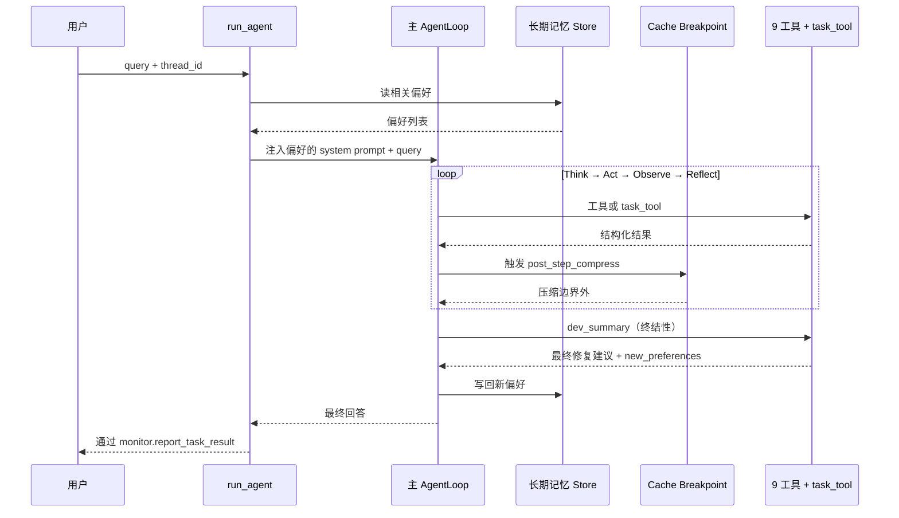

# 14 主AgentLoop组装与同质子AgentLoop-fork协同机制

> 面试口径：HarmonyDev 是服务 HarmonyOS / OpenHarmony 开发的 AI 开发助手；系统实现主体是 Python Agent 后端 + LocalAgent Gateway + Web/DevEco 面板，不要求运行在鸿蒙设备上。鸿蒙相关内容是被服务的开发对象，包括 ArkTS、ArkUI、Ability、Stage 模型、构建日志和官方文档。


**模块目标：**

- 把前面 13 章铺垫的所有能力真正组装成可运行的主 AgentLoop——9 个工具 + task_tool 元工具一次性挂载齐。

- 落地 PatchPicker（二次筛选）和 DevSummary（终结性工具）这两个收尾工具。

- 给"主 loop fork 同质子 AgentLoop"配上**防失控四件套**：fork 深度上限、单次任务工具调用上限、超时、循环检测。

- 把第 5 章 Cache Breakpoint 真正接到主 loop 上，让 50 轮对话不爆 token 又不掉缓存命中。

**阅读重点：** 这一章是 HarmonyDev 的"装配车间"——前 13 章的零件全在这里上钉。看代码时关注两件事：(1) 主 / 子 AgentLoop 怎么共享同一份 `FULL_TOOL_SET`；(2) 防失控逻辑放在哪一层（task_tool 内 vs Agent 配置 vs 中间件）才最稳。

---

## 1、本章导读

### 1.1 站在第 13 章的肩膀上

到目前为止已经备好的零件：

| 零件 | 已就绪章节 |
| --- | --- |
| LLM / 提示词 / 上下文 / 监控 | 第 10 章 |
| DocSearch + 三塔召回 | 第 11 章 |
| SolutionCompare + CompatCheck | 第 12 章 |
| APIInsight + RAG 知识库 | 第 13 章 |
| Planner / ChatFallback / WebSearch | 第 10 章 prompts.yml 已声明，本章补实现 |
| PatchPicker / DevSummary | 本章实现并组装 |
| task_tool（fork 元工具） | 第 11 章给了 v1，本章上"防失控版" |
| Cache Breakpoint 上下文压缩 | 第 5 章给了原理，本章接到主 loop |
| 长期记忆 Store | 第 6 章给了 schema，本章接到主 loop |

### 1.2 本章要做的两件事

1. **装配**：把上述零件统一注册到一个 `main_agent`，让它能从用户 query 一路跑到 DevSummary。

1. **防御**：给 fork 机制加防失控护栏，避免子 Agent 无限再 fork、单次工具调用炸 token、长任务把整个事件循环卡死。

不做的：

- FastAPI 入口、WebSocket、前端联调留给第 15 章。

- 大模型训练 / 评测自动跑批留给后续运营手册（不在项目主线）。

---

## 2、收尾两个工具：PatchPicker 与 DevSummary

### 2.1 PatchPicker：在落地成本 Top-N 上做"懂行"的筛选

PatchPicker 的输入是 `CompatCheck` 的输出 + `APIInsight` 的常识 + 用户开发者画像；输出是最多 3 件API/代码片段的精选建议列表。

```python
# app/tools/patch_picker.py
from langchain_core.tools import tool
from pydantic import BaseModel, Field
from app.tools.compat_check import CompatResult
from app.tools.api_insight import APIInsightOutput
from app.api.monitor import monitor
import time

class PickedItem(BaseModel):
    doc_id: str
    source: str
    resolved_score: float
    score: float                                # 综合分（实现成本 / 可信度 / 偏好对齐）
    reasons: list[str] = Field(default_factory=list)   # 选它的 1-3 条理由
    flags: list[str] = Field(default_factory=list)     # 排除标记，如"含废弃 API"

class PatchPickerOutput(BaseModel):
    picks: list[PickedItem]                     # 最多 3 件
    rejected_brief: list[str]                   # 被排除的简短原因（不要把所有候选塞回来）

@tool
async def patch_picker(
    compat: list[CompatResult],
    insight: APIInsightOutput | None = None,
    user_preferences: list[str] | None = None,
    top_n: int = 3,
) -> PatchPickerOutput:
    """从落地成本 Top-N 候选中筛选 1-3 件最契合用户的API/代码片段。

    Args:
        compat: 来自 CompatCheck 的候选（按落地成本升序）。
        insight: 来自 APIInsight 的Kit 能力常识；缺省时只按实现成本 + 可信度挑。
        user_preferences: 用户开发者画像句子列表（如 ["不要使用废弃 API", "偏好项目现有代码风格"]）。
        top_n: 最多返回的精选数量，默认 3。

    Returns:
        picks: 精选建议列表（最多 top_n 件）。
        rejected_brief: 被排除的简短原因。
    """
    await monitor.report_tool_start("patch_picker", {
        "compat_count": len(compat),

        "preferences": user_preferences or [ ],

    })
    t0 = time.time()

    rejected: list[str] = [ ]

    candidates: list[PickedItem] = [ ]

    prefs = user_preferences or [ ]

    for cost in compat:
        flags = _check_preferences(cost, prefs)
        if any(f.startswith("HARD_FAIL:") for f in flags):
            rejected.append(f"{cost.doc_id}：{flags[0].split(':', 1)[1]}")
            continue
        score, reasons = _score(cost, insight, prefs)
        candidates.append(PickedItem(
            doc_id=cost.doc_id,
            source=cost.source,
            resolved_score=cost.resolved_score,
            score=score,
            reasons=reasons,
            flags=flags,
        ))

    candidates.sort(key=lambda x: x.score, reverse=True)
    picks = candidates[:top_n]

    await monitor.report_tool_end("patch_picker", int((time.time() - t0) * 1000))
    return PatchPickerOutput(picks=picks, rejected_brief=rejected[:8])

def _check_preferences(cost: CompatResult, prefs: list[str]) -> list[str]:
    """硬约束（API 约束 / 黑名单）走 HARD_FAIL，软偏好走普通 flag。"""

    flags: list[str] = [ ]

    # 这里是示意：真实场景从 cost 关联回 DocHit.attributes 读API 约束
    if any("不要使用废弃 API" in p for p in prefs):
        if cost.source == "migration_notes" and cost.doc_id.endswith("-PLASTIC"):
            flags.append("HARD_FAIL:含废弃 API，命中用户黑名单")
    return flags

def _score(
    cost: CompatResult,
    insight: APIInsightOutput | None,
    prefs: list[str],
) -> tuple[float, list[str]]:
    score = 0.0

    reasons: list[str] = [ ]

    # 方案复杂度档位匹配（APIInsight 提供）
    if insight and insight.complexity_tiers:
        mid_tier = next((t for t in insight.complexity_tiers if t.tier == "medium"), None)
        if mid_tier and mid_tier.complexity_range[0] <= cost.resolved_score <= mid_tier.complexity_range[1]:
            score += 0.4
            reasons.append(f"落地成本 {cost.resolved_score} 落在中等改造 {mid_tier.complexity_range}")

    # 验证耗时偏好
    if cost.verify_minutes <= 12:
        score += 0.2
        reasons.append(f"预计 {cost.verify_minutes} 分钟可完成验证")

    # 版本约束友好
    if cost.risk_tier == "低风险":
        score += 0.2
        reasons.append("目标版本兼容")

    # 软偏好对齐
    if any("项目现有代码风格" in p for p in prefs) and cost.source in {"openharmony_docs", "sample_code"}:
        score += 0.2
        reasons.append("资料源命中的示例更贴近当前项目代码风格")

    return round(score, 2), reasons[:3]
```

设计要点：

- **硬约束 vs 软偏好分开走**：HARD_FAIL 直接 reject，软偏好只加分。

- `rejected_brief`** 截断到 8 条**：不让被淘汰的候选反过来撑爆 token。

- `reasons`** 限 3 条**：DevSummary 拿到的是已经"提炼过的"理由，不是结构化堆字段。

### 2.2 DevSummary：终结性工具

DevSummary 是主 loop 的"出口"——一旦调它，主 loop 进入收敛态、不应再发起新的 Act。

```python
# app/tools/dev_summary.py
from langchain_core.tools import tool
from pydantic import BaseModel
from app.tools.patch_picker import PickedItem
from app.api.monitor import monitor
from app.agent.llm import get_llm
from app.agent.prompts import get_dev_summary_prompt
import json
import time

class DevSummaryOutput(BaseModel):
    final_text: str       # 给前端展示的最终回答（Markdown）
    picks: list[PickedItem]
    learned_preferences: list[str]   # 本轮新沉淀的偏好（写入 Store）

@tool
async def dev_summary(
    picks: list[PickedItem],
    user_query: str,
    new_preferences: list[str] | None = None,
) -> DevSummaryOutput:
    """生成最终修复方案修复建议 + 技术依据（终结性工具）。

    Args:
        picks: 来自 PatchPicker 的精选API/代码片段。
        user_query: 用户最初输入的开发问题原文。
        new_preferences: 本轮识别到的新偏好（要写入长期记忆）。
    """
    await monitor.report_tool_start("dev_summary", {"picks_count": len(picks)})
    t0 = time.time()

    prompt = get_dev_summary_prompt()
    messages = [
        ("system", prompt),
        ("user", json.dumps({
            "user_query": user_query,
            "picks": [p.model_dump() for p in picks],
        }, ensure_ascii=False)),
    ]
    resp = await get_llm().ainvoke(messages)

    await monitor.report_tool_end("dev_summary", int((time.time() - t0) * 1000))
    return DevSummaryOutput(
        final_text=resp.content,
        picks=picks,

        learned_preferences=new_preferences or [ ],

    )
```

主 loop 调完 `dev_summary` 后，下一轮 Reflect 阶段就会因为"已经有终结性工具结果"而结束循环。

---

## 3、注册工具集：FULL_TOOL_SET

主 loop 和子 loop 必须**用同一份 FULL_TOOL_SET**——这是同质 fork 的硬约束。

```python
# app/agent/tool_registry.py
from app.tools.planner import planner
from app.tools.chat_fallback import chat_fallback
from app.tools.web_search import web_search
from app.tools.api_insight import api_insight
from app.tools.doc_search import doc_search
from app.tools.patch_picker import patch_picker
from app.tools.solution_compare import solution_compare
from app.tools.compat_check import compat_check
from app.tools.dev_summary import dev_summary
# task_tool 在下面单独导入避免循环引用
from app.agent.task_tool import task_tool

FULL_TOOL_SET = [
    planner,
    chat_fallback,
    web_search,
    api_insight,
    doc_search,
    patch_picker,
    solution_compare,
    compat_check,
    dev_summary,
    task_tool,                 # 元工具：fork 同质子 AgentLoop
]

# 终结性工具：调到这些就收敛
TERMINAL_TOOLS = {"dev_summary", "chat_fallback"}
```

---

## 4、防 fork 失控的四件套

### 4.1 为什么必须有防御

理论上子 AgentLoop 也持有 `task_tool`，意味着它能再 fork。如果不加防护，会出现：

| 失控类型 | 现象 |
| --- | --- |
| 无限 fork | 子再 fork 子，递归没有边界，资源指数爆炸 |
| 死循环工具 | 模型一直调同一个工具，不收敛 |
| 单工具炸 token | 工具一次返回 5 万 token，后续轮全废 |
| 长任务卡死 | 单轮 LLM 30 秒无响应，整个事件循环被拖累 |

### 4.2 第 1 件：fork 深度上限

```python
# app/agent/fork_guard.py
from contextvars import ContextVar
from contextlib import contextmanager

_fork_depth: ContextVar[int] = ContextVar("globex_fork_depth", default=0)
MAX_FORK_DEPTH = 2

class ForkLimitExceeded(Exception):
    pass

@contextmanager
def enter_fork():
    cur = _fork_depth.get()
    if cur >= MAX_FORK_DEPTH:
        raise ForkLimitExceeded(f"fork 深度超过上限 {MAX_FORK_DEPTH}")
    token = _fork_depth.set(cur + 1)
    try:
        yield cur + 1
    finally:
        _fork_depth.reset(token)

def current_fork_depth() -> int:
    return _fork_depth.get()
```

主 loop 深度 0，第一层子 loop 深度 1，再 fork 一层深度 2，再 fork 直接抛 `ForkLimitExceeded`。

### 4.3 第 2 件：升级版 task_tool

```python
# app/agent/task_tool.py
import asyncio
from uuid import uuid4
from langchain_core.tools import tool
from langgraph.prebuilt import create_react_agent
from app.agent.llm import get_llm
from app.agent.prompts import get_system_prompt
from app.agent.fork_guard import enter_fork, ForkLimitExceeded, current_fork_depth
from app.api.context import _thread_id_var, _session_dir_var, get_session_dir
from app.api.monitor import monitor

SUB_AGENT_TIMEOUT_SEC = 90
SUB_AGENT_MAX_ITERATIONS = 12

@tool
async def task_tool(demands: str) -> str:
    """派一个同质子 AgentLoop 去执行 demands，返回它的最终回复。

    适用条件（任一即可）：
      1. 能并行：多个子任务可以同时跑
      2. 上下文要隔离：子任务输出很大，不该污染主 loop
      3. 调用链 ≥ 3：子任务自己内部还要多轮 Think → Act
    """
    # 延迟导入打破循环依赖
    from app.agent.tool_registry import FULL_TOOL_SET

    try:
        with enter_fork() as depth:
            sub_thread_id = f"sub-{uuid4().hex[:8]}-d{depth}"
            await monitor.report_fork(sub_thread_id, demands)

            sub_agent = create_react_agent(
                model=get_llm(),
                tools=FULL_TOOL_SET,
                prompt=get_system_prompt(),
            )

            parent_session_dir = get_session_dir()
            token_t = _thread_id_var.set(sub_thread_id)
            token_s = _session_dir_var.set(parent_session_dir)
            try:
                result = await asyncio.wait_for(
                    sub_agent.ainvoke(
                        {"messages": [("user", demands)]},
                        config={
                            "configurable": {"thread_id": sub_thread_id},
                            "recursion_limit": SUB_AGENT_MAX_ITERATIONS,
                        },
                    ),
                    timeout=SUB_AGENT_TIMEOUT_SEC,
                )
                return result["messages"][-1].content
            finally:
                _thread_id_var.reset(token_t)
                _session_dir_var.reset(token_s)
    except ForkLimitExceeded as e:
        # 不是炸，是把"我来不了"告诉主 loop
        return f"[task_tool 拒绝]：{e}。建议主 loop 自己处理或换一种拆分。"
    except asyncio.TimeoutError:
        return f"[task_tool 超时]：子任务 {SUB_AGENT_TIMEOUT_SEC}s 未完成。返回部分进度由主 loop 决定下一步。"
```

注意 `ForkLimitExceeded` 和超时**不是 raise，而是 return 字符串**——让主 loop 把"子任务失败"当成普通工具结果处理，而不是整个 Agent 崩掉。

### 4.4 第 3 件：单工具结果体积截断

```python
# app/agent/middleware.py
from langgraph.prebuilt.tool_node import ToolNode

MAX_TOOL_RESULT_TOKENS = 4000   # 大约 16000 字

def truncate_long_tool_result(result_text: str) -> str:
    """工具返回过长时尾部加省略提示，让模型知道有截断。"""
    # 简化版：按字符长度估算
    cap = MAX_TOOL_RESULT_TOKENS * 4
    if len(result_text) <= cap:
        return result_text
    head = result_text[: cap - 200]
    tail = "\n\n[…工具结果过长已截断，主 loop 可调更窄的查询参数]"
    return head + tail
```

工具节点包装时调用此函数，避免单个工具一次性灌爆主 loop 上下文。

### 4.5 第 4 件：循环检测

让主 loop 不要无限调同一个工具：

```python
# app/agent/middleware.py（续）
from collections import deque

class LoopDetector:
    def __init__(self, window: int = 6, repeat_threshold: int = 4) -> None:
        self.window = window
        self.threshold = repeat_threshold
        self._recent: deque[str] = deque(maxlen=window)

    def record(self, tool_name: str) -> bool:
        """记录一次工具调用，返回 True 表示触发了循环。"""
        self._recent.append(tool_name)
        if self._recent.count(tool_name) >= self.threshold:
            return True
        return False
```

最近 6 次调用里同一个工具出现 4 次，就给主 loop 发一条系统提示："你已重复调用 X 工具 4 次，请换个思路或调 DevSummary 收尾"，由模型自己决定收敛。

---

## 5、主 AgentLoop 组装

### 5.1 主入口

```python
# app/agent/main_agent.py
import asyncio
from langgraph.prebuilt import create_react_agent
from app.agent.llm import get_llm
from app.agent.prompts import get_system_prompt
from app.agent.tool_registry import FULL_TOOL_SET
from app.api.monitor import monitor
from app.api.context import set_thread_context
from app.compress.breakpoint import compute_breakpoint
from app.compress.compressor import compress_messages
from app.memory.store import store
from app.utils.path_utils import ensure_session_dir

MAIN_AGENT_MAX_ITERATIONS = 30
MAIN_AGENT_TIMEOUT_SEC = 300

def _build_main_agent(prompt: str):
    return create_react_agent(
        model=get_llm(),
        tools=FULL_TOOL_SET,
        prompt=prompt,
    )

async def run_agent(query: str, thread_id: str, user_id: str | None = None) -> dict:
    """主 AgentLoop 的入口。"""
    session_dir = ensure_session_dir(thread_id)
    set_thread_context(thread_id, session_dir)

    # 第 6 章：从 Store 读出该用户的开发者画像，注入 system prompt

    long_term = await store.read_relevant(user_id=user_id, query=query) if user_id else [ ]

    pref_text = "\n".join(f"- {p.text}" for p in long_term) or "（暂无沉淀偏好）"
    prompt = get_system_prompt(long_term_preferences=pref_text)

    agent = _build_main_agent(prompt)

    try:
        result = await asyncio.wait_for(
            agent.ainvoke(
                {"messages": [("user", query)]},
                config={
                    "configurable": {"thread_id": thread_id},
                    "recursion_limit": MAIN_AGENT_MAX_ITERATIONS,
                },
            ),
            timeout=MAIN_AGENT_TIMEOUT_SEC,
        )
    except asyncio.TimeoutError:
        await monitor.report_error("timeout", f"主任务超时 {MAIN_AGENT_TIMEOUT_SEC}s")
        return {"status": "timeout", "thread_id": thread_id}

    # 第 6 章：把本轮新偏好写回 Store
    final_msg = result["messages"][-1]
    if hasattr(final_msg, "additional_kwargs"):

        new_prefs = final_msg.additional_kwargs.get("learned_preferences", [ ])

        if user_id and new_prefs:
            await store.write_many(user_id=user_id, texts=new_prefs)

    await monitor.report_task_result(final_msg.content)
    return {"status": "ok", "thread_id": thread_id, "final": final_msg.content}
```

### 5.2 接 Cache Breakpoint

主 loop 每跑完一轮 Act，由 LangGraph 钩子触发一次"边界外消息压缩"：

```python
# app/agent/middleware.py（续）
from app.compress.breakpoint import compute_breakpoint
from app.compress.compressor import compress_messages

async def post_step_compress(state: dict) -> dict:
    """每轮 Act 之后调用，压缩边界外的工具结果。"""
    messages = state["messages"]
    breakpoint = compute_breakpoint(messages, keep_recent=3)
    if breakpoint == len(messages):
        return state                       # 还没触发压缩
    compressed = await compress_messages(messages[:breakpoint])
    state["messages"] = compressed + messages[breakpoint:]
    return state
```

把它注册到 `create_react_agent` 的 `post_model_hook`（LangGraph 0.2+ 提供该钩子）。这样主 loop 50 轮对话也能稳住——保 Prompt Cache 命中率，第 5 章讲过这件事的核心动机。

### 5.3 完整链路一次走完



---

## 6、提示词里要补的话术

第 10 章 `prompts.yml` 已经写了 fork 三件事 + 9 工具。本章新增需要补的：

```yaml
# 追加到 system_prompt 末尾
# 收尾规则
当你已经拿到 PatchPicker 的精选建议列表且不少于 1 件时：
  - 立刻调用 dev_summary（终结性工具）
  - 不要再调任何检索类工具
  - 把本轮识别到的新偏好（如"不要使用废弃 API"）放进 dev_summary 的 new_preferences 参数

# fork 防失控提醒
- 子任务尽量在 1 层 fork 内完成；如果 task_tool 返回"[task_tool 拒绝]"或"[task_tool 超时]"，请立即换思路。
- 如果同一工具你已重复调用 4 次仍没进展，请检查参数是否合理，必要时调 chat_fallback 与用户对齐再继续。
```

这些规则也是第 8 章 P1 项 Rubric 的扣分点——和评测体系自然挂钩。

---

## 7、本章工程小结

| 模块 | 解决什么 |
| --- | --- |
| `tool_registry.py` | 主 / 子共享同一份 FULL_TOOL_SET |
| `fork_guard.py` | fork 深度 ContextVar + ForkLimitExceeded |
| 升级版 `task_tool` | depth + timeout + 把异常转成"工具结果" |
| `truncate_long_tool_result` | 单工具一次结果不能炸主 loop |
| `LoopDetector` | 同工具调用 4 次以上提示模型收敛 |
| `post_step_compress` | 每轮 Act 后接 Cache Breakpoint 压缩 |
| `run_agent` | 主入口，串 Store 注入 + 主 loop + 写回 |

---

**本章小结：**

到这里，HarmonyDev 主 AgentLoop 已经能完整跑：

- 9 个工具 + task_tool 元工具用同一份 `FULL_TOOL_SET` 注册到主 / 子；

- PatchPicker 用硬约束 + 软偏好的两段式做筛选，DevSummary 作为终结性工具收尾；

- fork 防失控四件套：深度上限 / 超时 / 单结果截断 / 循环检测——都是把异常转回"工具结果"让主 loop 自己处理，不让 Agent 崩；

- Cache Breakpoint 接到主 loop post_step 钩子，长对话不爆 token 不掉缓存；

- 长期记忆 Store 在入口注入 + 出口写回，整个数据飞轮在主 loop 维度闭环。

下一章「[FastAPI 接口与前后端闭环](<21-15 LocalAgent接口与WebDevEco前端闭环.md>)」会把主 AgentLoop 接到 FastAPI + WebSocket，跑通从浏览器输入"我想实现ArkUI 页面状态恢复方案"到页面看到精选建议列表的完整链路，并把 AGUI 事件流前端怎么消费一并落地。
